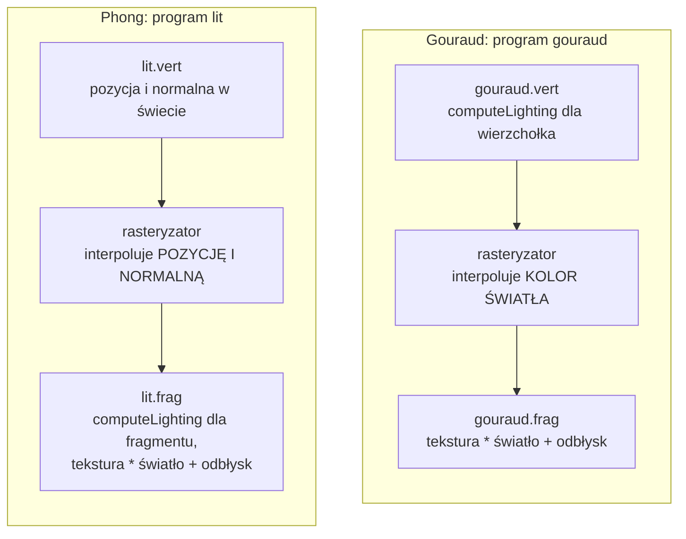

# Moduł renderer: cieniowanie Gourauda i Phonga, odbłysk Phonga i Blinna-Phonga

Kamień milowy: M4 (część "oświetlenie", uzupełniony w części "mapy normalnych": normalna fragmentu w `lit.frag` pochodzi z funkcji `surfaceNormal`), w M5 oba programy dostały składnik emisyjny `uEmissive` i rysują także kryształy i bramę. Temat wykładu: 7 (Gouraud vs Phong).
Kod: shadery [`assets/shaders/lit.vert`](../../../assets/shaders/lit.vert), [`lit.frag`](../../../assets/shaders/lit.frag), [`gouraud.vert`](../../../assets/shaders/gouraud.vert), [`gouraud.frag`](../../../assets/shaders/gouraud.frag), wybór programu w [`src/game/NightMazeApp.cpp`](../../../src/game/NightMazeApp.cpp) (`drawMaze`, `drawLitMaze`), typ `game::LightingMode` w [`src/game/Lighting.hpp`](../../../src/game/Lighting.hpp), lista `Lighting` w [`src/debug/panels/RendererPanel.cpp`](../../../src/debug/panels/RendererPanel.cpp).

Dlaczego ten dokument stoi w katalogu `renderer`, chociaż kod leży w `game/` i `assets/shaders/`, wyjaśnia [`README.md`](README.md). Dokument zakłada znajomość świateł i wzorów oświetlenia: [`../scene/lights.md`](../scene/lights.md). Tam jest omówiony linia po linii plik `common/lighting.glsl`, który oba programy z tego dokumentu dołączają. Przydają się też [`../gfx/shaders.md`](../gfx/shaders.md) (potok, interpolacja wyjść shadera wierzchołków) i [`../gfx/textures.md`](../gfx/textures.md) (shadery `textured`, na których wzorowane są `lit` i `gouraud`).

**Stan na dziś:** gra ma cztery tryby cieniowania sceny, przełączane listą `Lighting` w panelu Renderer: `Unlit`, `Gouraud`, `Phong` i `Blinn-Phong`. Startuje w trybie `Blinn-Phong`. Od M5 tymi samymi programami co labirynt rysowane są kryształy i brama wyjścia, a wzór końcowy obu programów ma składnik emisyjny: `surface * (diffuse + uEmissive) + specular`.

**Co zmieniła pierwsza część M7 (2026-10-05).** Wzory cieniowania są te same, ale liczą teraz na wartościach **liniowych**: tekstura koloru jest teksturą sRGB dekodowaną przez kartę, kolory świateł i `uEmissive` są przeliczane w C++ przez `gfx::srgbToLinear`, a wynik obu programów trafia do bufora HDR sceny (`GL_RGBA16F`) bez obcinania do 1. Ekspozycja, mapowanie tonów i kodowanie do sRGB (korekcja gamma) są robione raz, dla całej klatki, w przebiegu składającym. Opis: [`post-process.md`](post-process.md) i [`../gfx/color-space.md`](../gfx/color-space.md). Zmieniły się komentarze w `lit.frag` i `gouraud.frag` (sekcje 4.2 i 4.4), a wartość `uEmissive` podaje nowa funkcja `NightMazeApp::crystalEmissive` (sekcja 5). Zrzuty ekranu, na których opiera się ten dokument, pochodzą sprzed tej zmiany: różnic między trybami po M7 nikt nie oglądał osobno.

Część M4 była zmierzona na Windowsie 2026-10-05 (MSVC 19.44, RTX 4070 Ti SUPER, sterownik NVIDII 610.74): oba programy kompilowały się i linkowały przy starcie bez linii `[error]`, a cztery tryby były sprawdzone na zrzutach ekranu z trzech miejsc w labiryncie. Od drugiej części M4 program `lit` cieniuje normalną z mapy normalnych, a program `gouraud` nie może (sekcje 2.7 i 4.3): to jeszcze jedna widoczna różnica obu trybów, sprawdzona wtedy na zrzutach ekranu (zrzuty trybu `Gouraud` były identyczne co do piksela przy włączonym i wyłączonym mapowaniu normalnych).

M5 jest gotowy w kodzie na Windowsie i **nie jest zamknięty**. Zgłoszone dla Windowsa 2026-10-05 po M5: build Debug i Release bez ostrzeżeń, 215 przypadków testowych i 85098 asercji przechodzi w obu konfiguracjach (po drugiej części M6 256 przypadków i 101232 asercje, po pierwszej części M7 zgłoszone 269 i 102103, po drugiej 276 i 102139), obraz był sprawdzony na zrzutach ekranu robionych przez tymczasowe zaczepy w kodzie, które potem usunięto. Z tych zrzutów pochodzi jedna obserwacja ważna dla tego tematu: **w trybie `Gouraud` brama jest ciemna** (sekcja 2.2). **Listy `Lighting` nikt jeszcze nie przełączył ręcznie kliknięciem**, suwaków odbłysku ani pola `Normal mapping` też nie. **Na macOS ten kod nie był ani budowany, ani uruchamiany**: kompilator GLSL Apple nie widział jeszcze żadnego z tych czterech plików ani dołączanego `common/normal_map.glsl`.

**Co zmieniła druga część M6.** Tymi samymi dwoma programami rysowany jest teraz teren pod labiryntem (`TerrainRenderer`, [`terrain.md`](terrain.md)), który zastąpił płytki podłogi. Teren ma wierzchołki co 0,5 m, więc tryb `Gouraud` zachowuje się na nim inaczej niż na dużych licach ścian (sekcja 2.2). Doszła też trawa z własnym programem `grass`: jest cieniowana na fragment we wszystkich trybach z oświetleniem, także w trybie `Gouraud` (sekcja 5.3, [`grass-geometry.md`](grass-geometry.md)). Shadery `lit` i `gouraud` zmieniły się w M6 o jedno słowo w komentarzu (`floor` na `ground`).

## 1. Po co to jest

Wzory oświetlenia z tematu 6 mówią, **jak** policzyć jasność jednego punktu powierzchni. Nie mówią, **dla których punktów** je liczyć. Trójkąt ma trzy wierzchołki i tysiące pikseli. Są dwie możliwości:

| | Cieniowanie Gourauda | Cieniowanie Phonga |
|---|---|---|
| gdzie liczone jest światło | w shaderze wierzchołków: raz na wierzchołek | w shaderze fragmentów: raz na fragment |
| co jest interpolowane na trójkącie | gotowy **kolor światła** | **normalna i pozycja**, a światło jest liczone z nich |
| koszt | mały: tyle obliczeń, ile wierzchołków | duży: tyle obliczeń, ile pikseli |
| jakość | zależy od gęstości siatki: gubi wszystko, co mieści się między wierzchołkami | nie zależy od siatki |
| program w projekcie | `gouraud` | `lit` |

To jest temat 7 wykładu, a w projekcie jeden przełącznik: ten sam labirynt, te same światła, te same wzory (jeden wspólny plik `common/lighting.glsl`), tylko inne miejsce wywołania.

Drugie pytanie tego dokumentu dotyczy samego wzoru odbłysku: **Phong** (kąt między odbitym promieniem a kierunkiem do oka) albo **Blinn-Phong** (kąt między normalną a wektorem połówkowym). To też przełącznik: jeden uniform w programie `lit`.

**Uwaga o nazwach.** Nazwisko Phong występuje w trzech znaczeniach i na obronie trzeba je rozdzielić:

| Nazwa | Co znaczy |
|---|---|
| **model odbicia Phonga** (Phong reflection model) | wzór: otoczenie plus rozproszenie plus odbłysk ([`../scene/lights.md`](../scene/lights.md), sekcja 2.2) |
| **cieniowanie Phonga** (Phong shading) | sposób interpolacji: normalna jest interpolowana, a światło liczone dla fragmentu |
| **odbłysk Phonga** | wariant wzoru odbłysku: `dot(R, V)`, w odróżnieniu od Blinna-Phonga |

Tryby gry są kombinacjami:

| Tryb w panelu | `game::LightingMode` | Program | Gdzie liczone jest światło | Wzór odbłysku |
|---|---|---|---|---|
| `Unlit` | `Unlit` (0) | `textured` | nigdzie: tekstura razy kolor materiału | brak |
| `Gouraud` | `Gouraud` (1) | `gouraud` | wierzchołek | Phonga |
| `Phong` | `Phong` (2) | `lit` | fragment | Phonga |
| `Blinn-Phong` | `BlinnPhong` (3) | `lit` | fragment | Blinna-Phonga |

`Gouraud` celowo używa odbłysku Phonga: wtedy tryby `Gouraud` i `Phong` różnią się **jedną** rzeczą (miejscem liczenia), a tryby `Phong` i `Blinn-Phong` też jedną (wzorem odbłysku). Każde przełączenie pokazuje dokładnie jedną różnicę.

## 2. Teoria

### 2.1 Co robi rasteryzator z wyjściami shadera wierzchołków

Shader wierzchołków działa raz dla każdego wierzchołka i może zapisać zmienne `out`. Rasteryzator zamienia trójkąt na fragmenty i dla każdego fragmentu **interpoluje** te zmienne: fragment w środku trójkąta dostaje średnią ważoną wartości z trzech wierzchołków, z wagami zależnymi od tego, jak blisko którego wierzchołka leży (współrzędne barycentryczne, z poprawką na perspektywę). Shader fragmentów czyta wynik w zmiennych `in` o tych samych nazwach.

Interpolacja jest **liniowa**. To wystarcza dla wielkości, które naprawdę zmieniają się liniowo na płaskim trójkącie: pozycji i współrzędnych tekstury. Jasność światła liniowa nie jest: plama latarki jest kołem, odbłysk jest małą plamką, tłumienie jest krzywą. Cały temat 7 sprowadza się do pytania, **co interpolować**: wynik nieliniowego wzoru (Gouraud) czy jego liniowe argumenty (Phong).



### 2.2 Cieniowanie Gourauda: światło w wierzchołkach

Henri Gouraud opisał tę metodę w 1971 roku, gdy liczenie czegokolwiek dla każdego piksela było za drogie. Światło jest liczone w trzech wierzchołkach trójkąta, a środek dostaje mieszankę trzech kolorów.

Skutek: **światło, którego nie ma w żadnym wierzchołku, nie istnieje**. Trzy typowe przypadki:

| Zjawisko | Co widać w Gouraudzie | Dlaczego |
|---|---|---|
| plama reflektora mniejsza niż trójkąt | plamy nie ma wcale | w żadnym z trzech wierzchołków stożek nie świeci, więc interpolowane jest zero z zerem i zerem |
| plama reflektora obejmuje jeden wierzchołek | jasny narożnik rozmyty wzdłuż krawędzi i przekątnej trójkąta, zamiast koła | jasność jednego wierzchołka jest liniowo rozciągnięta na cały trójkąt |
| odbłysk między wierzchołkami | brak odbłysku albo odbłysk w kształcie trójkąta, który przeskakuje przy ruchu | to samo: potęga cosinusa jest bardzo nieliniowa |
| światło punktowe blisko środka dużej ściany | środek ściany ciemny, chociaż światło jest tuż przed nim | wierzchołki w narożnikach są daleko, a tłumienie jest liczone tylko tam |

**Liczby z gry.** Model odcinka ściany ([`../../guides/blender.md`](../../guides/blender.md), sekcja o wymiarach modeli) to trzy prostopadłościany. Największa płaszczyzna, lico korpusu, ma 2 m szerokości i 2,6 m wysokości (od 0,25 do 2,85 m) i składa się z **dwóch trójkątów z wierzchołkami tylko w czterech narożnikach**. Do M5 tak samo wyglądała płytka podłogi: 2 na 2 m, dwa trójkąty. Plama latarki w odległości `d` ma promień `0,23 * d` (pełna jasność) i `0,38 * d` (cała plama, [`../scene/lights.md`](../scene/lights.md), sekcja 2.6). Gdy stoję 2 m przed ścianą i świecę w jej środek, cała plama ma promień 0,77 m, a najbliższy wierzchołek jest ponad metr od jej środka. Żaden wierzchołek nie jest w stożku: w trybie `Gouraud` latarka nie zostawia na tej ścianie nic. Gdy skieruję ją w narożnik lica, jeden wierzchołek wpada w stożek i jego jasność rozlewa się po trójkącie.

To zgadza się z tym, co widać na zrzutach ekranu z Windowsa: **w trybie `Gouraud` plama latarki na dużych trójkątach ścian znika albo rozmazuje się wzdłuż krawędzi trójkątów**, a w trybach `Phong` i `Blinn-Phong` jest kołem z miękkim brzegiem.

**Grunt w trybie `Gouraud` (od M6).** Podłoże to teren: siatka z wierzchołkiem co 0,5 m (`TERRAIN_SPACING`), czyli 32 trójkąty na komórkę labiryntu zamiast dwóch na płytce podłogi. Dla Gourauda to duża różnica. Plama latarki skierowanej w grunt 3 m przed graczem ma promień około 1,3 m (`0,38` razy odległość od oka, które jest 1,7 m nad stopami, czyli około 3,45 m), więc obejmuje kilkanaście wierzchołków siatki. Światło jest w nich liczone i interpolowane na odcinkach po pół metra: plama na gruncie **jest**, tylko kanciasta, z brzegiem idącym po trójkątach siatki, i lekko drga przy ruchu, gdy jej brzeg przechodzi przez kolejne wierzchołki. Na licu ściany, 2 m dalej w tym samym kadrze, plamy nadal nie ma. To wniosek z geometrii i ze wzorów, a nie obserwacja: nikt tego jeszcze nie oglądał w działającej grze. Ogólna lekcja jest ta sama co zawsze przy Gouraudzie: jakość zależy od gęstości siatki, a nie od shadera. Gęsta siatka terenu przybliża wynik Phonga, rzadka siatka ściany nie.

**Brama w trybie `Gouraud` (M5).** Zgłoszona obserwacja ze zrzutów ekranu z Windowsa: w trybie `Gouraud` brama wyjścia jest ciemna. Nie mierzyłem tego i nie oglądałem ręcznie, więc to, co niżej, jest **prawdopodobną przyczyną, a nie wynikiem pomiaru**. Mechanizm jest ten sam co przy licu ściany i widać go w pliku modelu. [`assets/models/gate.obj`](../../../assets/models/gate.obj) ma 56 pozycji wierzchołków i 70 trójkątów na płycie o szerokości 2 m i wysokości 2,75 m. **Wszystkie 56 pozycji leży na dwóch pionowych krawędziach bramy**, przy `x = -1` i `x = +1`. W pionie model jest gęsty (trzy poprzeczne listwy, każda z wierzchołkami na czterech wysokościach, do tego dół i góra: 14 wysokości), ale w poziomie między krawędziami nie ma ani jednego wierzchołka. Każdy trójkąt lica rozciąga się więc na pełne 2 m szerokości i ma wierzchołki tylko na swoich końcach.

Latarka skierowana w środek bramy z odległości `d` daje plamę o promieniu `0,38 * d`. Krawędzie bramy są metr od jej środka, więc dopóki stoję bliżej niż około 2,6 m (`1 / 0,38`), w stożku nie ma żadnego wierzchołka: interpolowane jest zero z zerem i z latarki na bramie nie zostaje nic. Z większej odległości w wierzchołki trafia najpierw tylko słaby brzeg stożka (pełna jasność sięga krawędzi dopiero z około 4,3 m, `1 / 0,23`), a tam światło jest już osłabione tłumieniem. Zostają księżyc i światło otoczenia, które dla płaskiego lica są w obu trybach takie same, oraz światła kryształów, jeśli któryś wisi w pobliżu (w samej komórce wyjścia kryształu nigdy nie ma). Ściana obok bramy ma tę samą wadę. Przypuszczam, że brama rzuca się w oczy bardziej, bo to do niej gracz podchodzi na wprost i świeci w sam środek. Jak to sprawdzić samemu, mówi ćwiczenie 12.

**Kryształy są widoczne w każdym trybie.** Ich jasność nie zależy od tego, czy jakieś światło trafiło w wierzchołek: świecą składnikiem emisyjnym `uEmissive`, który oba programy dodają w shaderze **fragmentów** (sekcje 4.2 i 4.4). W trybie `Gouraud` kryształ jest więc tak samo jasny jak w trybie `Phong`, a różni się tylko to, co pada na niego z zewnątrz.

Co w Gouraudzie zostaje dobre: **tekstura**. Jest nadal czytana dla każdego fragmentu (`gouraud.frag`), więc rysunek kamienia jest ostry. Na wierzchołek przypada tylko światło. Dobre zostaje też światło kierunkowe na płaskiej ścianie: wszystkie cztery wierzchołki lica mają tę samą normalną i ten sam kierunek do księżyca, więc część rozproszona jest w nich identyczna i interpolacja niczego nie psuje.

Gouraud wygląda dobrze na gęstych siatkach (wierzchołki bliżej siebie niż szczegóły światła). Modele labiryntu są celowo rzadkie, więc różnica jest tu skrajna: to dobry materiał na pokaz.

### 2.3 Cieniowanie Phonga: światło we fragmentach

Bui Tuong Phong zaproponował w 1975 roku, żeby interpolować nie kolor, tylko **normalną**, a wzór oświetlenia liczyć dla każdego piksela osobno. W projekcie interpolowane są dwie rzeczy: normalna w przestrzeni świata (`vNormal`) i pozycja w przestrzeni świata (`vWorldPosition`). Obie zmieniają się na płaskim trójkącie liniowo, więc interpolacja jest dla nich dokładna.

Jedna poprawka jest potrzebna: **interpolowana normalna nie ma już długości 1**. Średnia dwóch wektorów jednostkowych, które wskazują w różne strony, jest krótsza od każdego z nich. Shader fragmentów musi ją znormalizować, zanim użyje jej w iloczynie skalarnym. Na płaskich ścianach labiryntu wszystkie wierzchołki lica mają tę samą normalną, więc długość się nie zmienia, ale shader nie może tego zakładać.

Cena: `computeLighting` wykonuje się dla każdego fragmentu, a w nim pętla po światłach punktowych (do 16), księżyc i latarka. W oknie 1280 na 720 to ponad 900 tysięcy fragmentów na klatkę, nie licząc tych, które zostaną potem zasłonięte bliższą ścianą. W Gouraudzie ta sama funkcja wykonuje się tyle razy, ile labirynt ma wierzchołków. **Różnicy w czasie klatki między trybami nie mierzyłem.**

### 2.4 Odbłysk Phonga: wektor odbity

Odbłysk to lustrzane odbicie źródła światła. Jest najsilniejszy, gdy promień światła odbity od powierzchni trafia prosto w oko.

```text
            N (normalna)
            ^
   L        |        R (odbity)
    \       |       /
     \      |      /        V (do oka)
      \  a  |  a  /     . '
       \    |    /  . '   kąt b między R i V
        \   |   / '
   ------\--+--/---------------- powierzchnia
```

`R` to `L` odbite względem normalnej: kąt padania równa się kątowi odbicia (oba `a` na rysunku). Wzór:

```text
odbłysk Phonga = max(dot(R, V), 0) ^ połysk         R = reflect(-L, N)
```

`dot(R, V)` to cosinus kąta `b` między odbitym promieniem a kierunkiem do oka. Gdy oko patrzy dokładnie wzdłuż `R`, cosinus wynosi 1.

**Wada.** Gdy kąt `b` przekracza 90 stopni, cosinus jest ujemny i `max` obcina go do zera. Przy małym wykładniku (szeroki odbłysk) i świetle padającym płasko na powierzchnię widać to jako **ostre ucięcie** odbłysku: plama kończy się nagle linią.

### 2.5 Odbłysk Blinna-Phonga: wektor połówkowy

Jim Blinn zaproponował w 1977 roku inny kąt. Zamiast odbijać promień, liczy się **wektor połówkowy** (halfway vector) `H`: kierunek dokładnie między `L` i `V`.

```text
            N      H (połówkowy)
            ^     /
   L        |    /
    \       | c /           V (do oka)
     \      |  /        . '
      \     | /     . '
       \    |/  . '
   ------\--+-'------------------ powierzchnia

   H = normalize(L + V)        kąt c między N i H
```

```text
odbłysk Blinna-Phonga = max(dot(N, H), 0) ^ połysk
```

Sens geometryczny: gdyby powierzchnia w tym punkcie była lusterkiem ustawionym tak, żeby odbić światło prosto w oko, jej normalna wskazywałaby dokładnie `H`. `dot(N, H)` mierzy więc, jak blisko tego ideału jest prawdziwa normalna.

**Związek obu kątów.** Gdy `L`, `N` i `V` leżą w jednej płaszczyźnie, kąt Phonga jest **dokładnie dwa razy większy** od kąta Blinna-Phonga: `b = 2c`. Obrót normalnej o kąt `c` obraca odbity promień o `2c` (tak działa lustro). Poza tą płaszczyzną zależność jest przybliżona.

Skutki:

- **Ten sam wykładnik daje w Blinnie-Phongu szerszy odbłysk.** Mniejszy kąt ma większy cosinus, a większy cosinus podniesiony do tej samej potęgi daje większą wartość. Dla małych kątów `cos(2c)^n` jest w przybliżeniu równe `cos(c)^(4n)`: żeby dostać odbłysk tej samej wielkości co w Phongu, Blinn-Phong potrzebuje wykładnika **około cztery razy większego**.
- **Nie ma ostrego ucięcia.** Kąt między `N` a `H` nie przekracza 90 stopni, dopóki światło i oko są po tej samej stronie powierzchni. Odbłysk gaśnie płynnie.
- **Wygląda lepiej przy płaskim padaniu światła**: odbłysk rozciąga się w podłużną plamę, tak jak na prawdziwej mokrej drodze.

Blinn-Phong jest domyślnym trybem gry i był wzorem odbłysku w potoku stałym OpenGL.

### 2.6 Szczególny przypadek gry: światło w oku

Latarka jest dokładnie w oku kamery ([`../game/flashlight.md`](../game/flashlight.md)). Dla niej `L = V`: kierunek do światła i kierunek do oka to ten sam wektor. Wzory bardzo się wtedy upraszczają. Niech `t` będzie kątem między normalną a kierunkiem do oka:

```text
H = normalize(L + V) = V          dot(N, H) = cos(t)          Blinn-Phong: cos(t) ^ n
R = odbicie L względem N          dot(R, V) = cos(2t)         Phong:       cos(2t) ^ n
```

| Kąt `t` między normalną a kierunkiem do oka | Phong, `n` = 16 | Blinn-Phong, `n` = 16 | Phong, `n` = 32 | Blinn-Phong, `n` = 32 |
|---|---|---|---|---|
| 0 stopni (patrzę prostopadle na ścianę) | 1,00 | 1,00 | 1,00 | 1,00 |
| 5 stopni | 0,78 | 0,94 | 0,61 | 0,89 |
| 10 stopni | 0,37 | 0,78 | 0,14 | 0,61 |
| 15 stopni | 0,10 | 0,57 | 0,01 | 0,33 |
| 20 stopni | 0,01 | 0,37 | 0,00 | 0,14 |
| 30 stopni | 0,00 | 0,10 | 0,00 | 0,01 |

Z tabeli widać trzy rzeczy, które zgadzają się ze zrzutami ekranu z Windowsa:

- **Na wprost ściany** oba wzory dają gorącą plamę w środku ekranu, ale w Blinnie-Phongu jest ona **szersza i przez to jaśniejsza**: przy 10 stopniach od środka Phong ma 14 procent, Blinn-Phong 61 procent (dla wykładnika 32).
- **Wzdłuż korytarza** oba tryby różnią się mało. Ściany boczne są widziane pod kątem bliskim 90 stopni do normalnej, a tam oba wzory dają zero. Odbłysk latarki pojawia się tylko tam, gdzie patrzę na powierzchnię prawie prostopadle.
- Wartość Phonga dla kąta `t` jest dokładnie wartością Blinna-Phonga dla kąta `2t` przy tym samym wykładniku (0,78 przy 5 i przy 10 stopniach, 0,37 przy 10 i przy 20). To reguła `b = 2c` z sekcji 2.5 na liczbach.

Dla **światła punktowego i księżyca** `L` i `V` są różne i pojawia się to, czego latarka nie pokaże: przy płaskim kącie patrzenia na grunt oświetlony z przeciwnej strony Phong ucina odbłysk, a Blinn-Phong rozciąga go w smugę.

### 2.7 Która normalna

Oba programy biorą normalną z atrybutu wierzchołka i przenoszą ją do przestrzeni świata macierzą normalnych `uNormalMatrix` (teoria: [`../scene/lights.md`](../scene/lights.md), sekcja 2.7, kod: [`../scene/transforms.md`](../scene/transforms.md)). Normalne modeli labiryntu są **płaskie**: wszystkie wierzchołki jednej ściany modelu mają tę samą normalną, a wierzchołek na krawędzi jest powielony dla każdej ściany, do której należy ([`../assets/obj-loader.md`](../assets/obj-loader.md)). Krawędzie słupków i ścian są więc ostre w każdym trybie.

Na tym podobieństwo się kończy. **Program `lit` nie musi cieniować normalną siatki.** W `lit.frag` normalną fragmentu zwraca funkcja `surfaceNormal(vNormal, vTangent, vUv)` z pliku `common/normal_map.glsl`: przy wyłączonym mapowaniu normalnych jest to znormalizowana normalna siatki, a przy włączonym normalna odczytana z **mapy normalnych** (normal map) i przeniesiona z przestrzeni stycznej do przestrzeni świata. Wzory `computeLighting` nie wiedzą, skąd pochodzi ich normalna: dostają wektor i liczą. Cała technika (przestrzeń styczna, macierz TBN, plik linia po linii) jest w [`../gfx/normal-mapping.md`](../gfx/normal-mapping.md).

**Program `gouraud` map normalnych nie ma i mieć nie może.** Mapa normalnych przechowuje jedną normalną na teksel, więc może zmienić tylko światło liczone na fragment. Gouraud liczy światło w wierzchołkach, 4 na lico ściany, i teksel leżący między nimi nie ma jak wziąć udziału w obliczeniach. To ten sam powód, dla którego Gouraud gubi plamę latarki (sekcja 2.2), tylko zastosowany do normalnych zamiast do stożka. Regułę zapisuje w C++ funkcja `game::usesNormalMap`: prawda, gdy mapowanie jest włączone i tryb jest inny niż `Gouraud` ([`../game/flashlight.md`](../game/flashlight.md), sekcja 5.2).

| Tryb | Normalna użyta do światła | Fugi kamieni pod latarką |
|---|---|---|
| `Unlit` | żadna (światła nie ma) | tylko namalowane w obrazie koloru |
| `Gouraud` | normalna siatki w wierzchołku | tylko namalowane |
| `Phong`, `Blinn-Phong`, `Normal mapping` zaznaczone (stan startowy) | normalna z mapy normalnych, na fragment | rowki, których jasne i ciemne skosy zależą od kierunku światła |
| `Phong`, `Blinn-Phong`, `Normal mapping` odznaczone | interpolowana normalna siatki, na fragment | tylko namalowane |

Podgląd `Normals as colour` z panelu Assets pokazuje **normalną faktycznie użytą**: przy trybach `Unlit`, `Phong` i `Blinn-Phong` z zaznaczonym `Normal mapping` normalne z map (na kolorze ściany widać rysunek fug), a przy trybie `Gouraud` albo odznaczonym polu gładkie normalne siatki.

## 3. Jak to działa w OpenGL

Z punktu widzenia OpenGL oba sposoby to zwykłe programy shaderów. Nie ma przełącznika "cieniowanie Gourauda": stare `glShadeModel(GL_SMOOTH)` należało do potoku stałego i w profilu Core nie istnieje. Różnica jest tylko w tym, do którego shadera wpisałem wywołanie `computeLighting`.

Wywołania w jednej klatce dla trybu z oświetleniem (labirynt startowy 10 na 10 na początku rundy: teren, 121 odcinków ścian, 121 słupków, do tego brama i 13 kryształów; do M5 zamiast terenu było 100 płytek podłogi):

| Krok | Wywołania OpenGL | Ile razy |
|---|---|---|
| `LightRig::upload`: światła na kartę | `glBindBuffer(GL_UNIFORM_BUFFER)`, `glBufferSubData` (928 bajtów) | 1 |
| `shader.use()` (`lit` albo `gouraud`) | `glUseProgram` | 1 |
| `uView`, `uProjection` | `glGetUniformLocation`, `glUniformMatrix4fv` | po 1 |
| `uSpecularModel` | `glGetUniformLocation`, `glUniform1i` | 1 |
| `uSpecularStrength`, `uShininess` | `glGetUniformLocation`, `glUniform1f` | po 1 |
| `uNormalMapEnabled` (istnieje tylko w `lit`) | `glGetUniformLocation`, `glUniform1i` | 1 |
| `game::setModelSamplers`: `uTexture` i `uNormalMap` (drugi tylko w `lit`) | `glGetUniformLocation`, `glUniform1i` | po 3: raz w `TerrainRenderer::draw`, raz w `MazeRenderer::draw`, raz w `GameplayRenderer::draw` |
| `uEmissive` | `glGetUniformLocation`, `glUniform3fv` | 4: czerń przed terenem, czerń przed labiryntem, czerń przed bramą, blask przed kryształami |
| `game::drawMesh` i `game::drawModel`: mapa normalnych na jednostkę 1, obraz koloru na jednostkę 0 | `glActiveTexture`, `glBindTexture`, `glBindSampler` | raz dla terenu (`drawMesh`) i raz na część modelu w każdym wywołaniu `drawModel`: 2 razy dla labiryntu, 1 raz dla bramy, 13 razy dla kryształów (każdy kryształ to osobne wywołanie) |
| `game::drawMesh` i `game::drawModel`: `uModel` i `uNormalMatrix` | `glUniformMatrix4fv`, `glUniformMatrix3fv` | po 257: raz na obiekt (teren, 242 obiekty labiryntu, brama, 13 kryształów). Każdy z pięciu modeli ma jedną część |
| rysowanie | `glDrawElements` | 257 |

Liczby 13 i 257 maleją w trakcie rundy: zebrany kryształ nie jest rysowany, a brama znika z listy, gdy po otwarciu schowa się cała pod grunt. Trawa i niebo są rysowane potem, własnymi programami, i w tej tabeli ich nie ma.

Blok `LightBlock` nie pojawia się w tabeli między krokami drugim a ostatnim: program czyta go z punktu wiązania 1 bez żadnego wywołania w klatce. Połączenie programu z punktem wiązania jest robione raz, po zlinkowaniu ([`../gfx/uniform-buffers.md`](../gfx/uniform-buffers.md)).

Przełączenie trybu nie tworzy ani nie usuwa żadnego obiektu OpenGL. Wszystkie programy gry powstają przy starcie (cztery, o których mowa w tym dokumencie: `textured`, `color`, `lit`, `gouraud`, a od M6 także piąty, `skybox`, który rysuje niebo i nie zależy od trybu, i szósty, `grass`, który rysuje trawę i z trybu bierze tylko jedno: czy jest nim `Unlit`), a tryb wybiera, który z trójki `textured`, `lit`, `gouraud` dostanie `glUseProgram` dla sceny. Rysowanie obiekt po obiekcie omawia [`../game/maze-rendering.md`](../game/maze-rendering.md), a kryształy i bramę [`../game/gameplay.md`](../game/gameplay.md).

## 4. Shadery

Cztery pliki, dwa programy. Oba dołączają [`common/lighting.glsl`](../../../assets/shaders/common/lighting.glsl) (omówiony w [`../scene/lights.md`](../scene/lights.md), sekcja 4) linią `#include`, której GLSL sam nie zna: obsługuje ją loader ([`../gfx/shader-includes.md`](../gfx/shader-includes.md)). `lit.frag` dołącza jeszcze drugi plik, [`common/normal_map.glsl`](../../../assets/shaders/common/normal_map.glsl) z funkcją `surfaceNormal`, omówiony linia po linii w [`../gfx/normal-mapping.md`](../gfx/normal-mapping.md), sekcja 4.1.

| Plik | Dołącza `lighting.glsl` | Woła `computeLighting` | Dołącza `normal_map.glsl` |
|---|---|---|---|
| `lit.vert` | nie | nie | nie (tylko przekazuje styczną) |
| `lit.frag` | **tak** | **tak**, dla fragmentu | **tak**, woła `surfaceNormal` |
| `gouraud.vert` | **tak** | **tak**, dla wierzchołka | nie |
| `gouraud.frag` | nie | nie | nie |

### 4.1 `lit.vert`: shader wierzchołków, światło na fragment

```glsl
#version 410 core
// Vertex shader of lit models, lighting per fragment (Phong shading): places the vertex
// on the screen and passes what the fragment shader needs to compute the light.
// See docs/modules/renderer/lighting-gouraud-phong.md

// Inputs: the four attributes of gfx::Vertex, as in textured.vert.
layout(location = 0) in vec3 aPosition; // x, y, z in the local space of the model
layout(location = 1) in vec3 aNormal;   // direction the surface faces, length 1
layout(location = 2) in vec2 aUv;       // texture coordinate (u, v)
layout(location = 3) in vec3 aTangent;  // direction on the surface in which u grows, length 1

// Uniforms: set from C++. uModel and uNormalMatrix change with every object, uView and
// uProjection are the same for the whole frame.
uniform mat4 uModel;      // local space to world space
uniform mat4 uView;       // world space to view space
uniform mat4 uProjection; // view space to clip space
// Local space to world space for normals: the inverse transpose of the upper left 3 x 3
// part of uModel, computed in C++ (scene::normalMatrix). mat3(uModel) would be right
// only while no object is scaled differently along its axes.
uniform mat3 uNormalMatrix;

// Outputs to the fragment shader, blended across the triangle by the rasterizer.
out vec2 vUv;            // texture coordinate
out vec3 vNormal;        // normal in world space
out vec3 vTangent;       // tangent in world space
out vec3 vWorldPosition; // position in world space

void main() {
    // The lighting is computed in world space: the lights and the camera position in
    // the light block are in world space too.
    vec4 worldPosition = uModel * vec4(aPosition, 1.0);
    vWorldPosition = worldPosition.xyz;
    vNormal = uNormalMatrix * aNormal;
    // The tangent lies IN the surface, like an edge of a triangle, so it turns and
    // stretches with the model: mat3(uModel), the model matrix without its translation.
    // The normal matrix is for directions that must stay perpendicular to the surface.
    // With these two matrices the pair stays perpendicular under any model matrix.
    vTangent = mat3(uModel) * aTangent;
    vUv = aUv;

    // World space, view space, clip space.
    gl_Position = uProjection * uView * worldPosition;
}
```

| Linia | Znaczenie |
|---|---|
| cztery linie `layout(location = ...) in` | te same cztery atrybuty co w `textured.vert`: pola struktury `gfx::Vertex` ([`../gfx/mesh.md`](../gfx/mesh.md)). Ten sam model da się więc narysować każdym z trzech programów labiryntu bez zmiany siatki |
| `layout(location = 3) in vec3 aTangent;` | **styczna** (tangent): kierunek na powierzchni, w którym rośnie współrzędna tekstury `u`, o długości 1. W pliku OBJ jej nie ma: liczy ją `assets::computeTangents` przy wczytaniu modelu ([`../gfx/normal-mapping.md`](../gfx/normal-mapping.md), sekcje 2.7 i 2.8) |
| `uniform mat3 uNormalMatrix;` | macierz normalnych, jedyny uniform, którego `textured.vert` nie ma. Typ `mat3`: stąd nowy setter `Shader::setMat3` ([`../gfx/uniforms.md`](../gfx/uniforms.md)) |
| `out vec3 vNormal;`, `out vec3 vTangent;`, `out vec3 vWorldPosition;` | to, co rasteryzator ma interpolować: argumenty wzoru oświetlenia, a nie jego wynik. Styczna jest potrzebna shaderowi fragmentów do zbudowania macierzy TBN |
| `vec4 worldPosition = uModel * vec4(aPosition, 1.0);` | pozycja w przestrzeni świata. Czwarta współrzędna 1: to punkt, więc przesunięcie działa. Wynik jest zapamiętany w zmiennej, bo jest potrzebny dwa razy |
| `vWorldPosition = worldPosition.xyz;` | pozycja dla shadera fragmentów. Z niej powstaną kierunki do świateł i do oka |
| `vNormal = uNormalMatrix * aNormal;` | normalna w przestrzeni świata. **Bez `normalize`**: i tak trzeba będzie normalizować po interpolacji, więc tutaj byłoby to zmarnowane |
| `vTangent = mat3(uModel) * aTangent;` | styczna w przestrzeni świata, **inną macierzą niż normalna**. Styczna leży **w** powierzchni, jak krawędź trójkąta, więc obraca się i rozciąga razem z modelem: `mat3(uModel)`, macierz modelu bez przesunięcia. Macierz normalnych jest dla kierunków, które mają zostać prostopadłe do powierzchni. Z tymi dwiema macierzami para zostaje prostopadła przy dowolnej macierzy modelu ([`../gfx/normal-mapping.md`](../gfx/normal-mapping.md), sekcja 4.2) |
| `gl_Position = uProjection * uView * worldPosition;` | dalsza droga wierzchołka: świat, widok, przycięcie. To samo co `uProjection * uView * uModel * vec4(aPosition, 1.0)`, tylko iloczyn `uModel * ...` jest użyty ponownie |

### 4.2 `lit.frag`: shader fragmentów, światło na fragment

```glsl
#version 410 core
// Fragment shader of lit models, lighting per fragment (Phong shading): the light is
// computed for every fragment from its own position and normal. The highlight formula
// (Phong or Blinn-Phong) is chosen by the uniform uSpecularModel.
// See docs/modules/renderer/lighting-gouraud-phong.md

// The light block and the function computeLighting. The same file is included by
// gouraud.vert.
#include "common/lighting.glsl"
// The normal map and the function surfaceNormal. The same file is included by
// textured.frag, for its debug view of the normals.
#include "common/normal_map.glsl"

// Inputs from the vertex shader, already blended for this fragment.
in vec2 vUv;            // texture coordinate
in vec3 vNormal;        // normal in world space, no longer exactly of length 1
in vec3 vTangent;       // tangent in world space, no longer exactly of length 1
in vec3 vWorldPosition; // position in world space

// The texture (the number of a texture unit) and the colour of the material, as in
// textured.frag.
uniform sampler2D uTexture;
uniform vec3 uTint;

// Light the surface gives off by itself, as a colour that multiplies the colour of the
// surface. Black (0, 0, 0) for everything that only reflects light: walls, ground,
// pillars, the gate. The crystals glow with it: the point light of a crystal hangs
// outside its mesh and lights its faces only from one side, and without a glow of its
// own the source of the light would be the darkest thing around it.
uniform vec3 uEmissive;

// Output: the color written to the HDR framebuffer of the scene (red, green, blue,
// alpha), as a LINEAR colour that may be brighter than 1.
out vec4 fragColor;

void main() {
    // The normal of this fragment: the one of the model, or with normal mapping the one
    // read from the normal map. This is the only place where normal mapping enters the
    // lighting: the formulas of computeLighting do not know where their normal comes
    // from. It needs a normal per fragment, which is why the Gouraud program (light per
    // vertex) has no normal mapping.
    vec3 normal = surfaceNormal(vNormal, vTangent, vUv);
    Lighting lighting = computeLighting(vWorldPosition, normal);

    // The colour of the surface takes part in the diffuse light only: a red wall
    // reflects the red part of the light. The highlight is added on top in the colour
    // of the light, as in the Phong model of the lecture.
    //
    // Everything here is linear, which is what makes multiplying by a light and adding
    // lights correct: the texture is an sRGB texture that the graphics card decodes on
    // reading, the light colours were converted in C++ (game::buildLightSet), and the
    // result is written as it is into a floating point buffer, also when it is above
    // 1. Exposure, tone mapping and the sRGB encoding (gamma correction) follow once,
    // for the whole frame, in post/composite.frag.
    //
    // The glow of the surface itself (uEmissive) joins the diffuse light. It does not
    // depend on any light of the scene, so a crystal glows in the darkest corner too.
    vec3 surface = texture(uTexture, vUv).rgb * uTint;
    fragColor = vec4(surface * (lighting.diffuse + uEmissive) + lighting.specular, 1.0);
}
```

| Linia | Znaczenie |
|---|---|
| `#include "common/lighting.glsl"` | w tym miejscu loader wstawia blok `LightBlock`, uniformy `uSpecularModel`, `uSpecularStrength`, `uShininess` i funkcje oświetlenia. Linia stoi po `#version`, bo `#version` musi być pierwszą dyrektywą shadera |
| `#include "common/normal_map.glsl"` | drugi plik dołączany: sampler `uNormalMap`, przełącznik `uNormalMapEnabled` i funkcja `surfaceNormal`. Ten sam plik dołącza `textured.frag` dla podglądu normalnych, więc podgląd i oświetlenie liczą normalną tym samym kodem |
| `in vec3 vNormal;`, `in vec3 vTangent;`, `in vec3 vWorldPosition;` | para do wyjść `lit.vert`. Wartości są już zinterpolowane dla tego fragmentu |
| `uniform sampler2D uTexture;`, `uniform vec3 uTint;` | te same dwa uniformy co w `textured.frag` ([`../gfx/textures.md`](../gfx/textures.md), sekcja 4.2), ustawiane przy rysowaniu modeli (`game::setModelSamplers` i `game::drawModel`). Uniformu `uViewMode` tu nie ma: podglądy normalnych i UV rysuje program `textured` |
| `uniform vec3 uEmissive;` | **składnik emisyjny** (M5): światło, które powierzchnia oddaje sama, jako kolor. Czerń `(0, 0, 0)` dla wszystkiego, co tylko odbija światło: ścian, podłoża, słupków i bramy. Niezerowy tylko dla kryształów. Komentarz podaje powód: światło punktowe kryształu wisi poza jego siatką i oświetla jego ścianki tylko z jednej strony, więc bez własnego blasku źródło światła byłoby najciemniejszą rzeczą w okolicy. Teoria: [`../scene/lights.md`](../scene/lights.md), sekcja 2.2 |
| `vec3 normal = surfaceNormal(vNormal, vTangent, vUv);` | normalna tego fragmentu, w przestrzeni świata, o długości 1. Bez mapowania normalnych funkcja zwraca `normalize(vNormal)`: przywraca długość 1 po interpolacji (sekcja 2.3), dokładnie jak ta linia robiła wcześniej. Z mapowaniem zwraca normalną z mapy normalnych (sekcja 2.7). Komentarz nad linią mówi rzecz najważniejszą: **to jedyne miejsce, w którym mapowanie normalnych wchodzi do oświetlenia**, bo wzory `computeLighting` nie wiedzą, skąd jest ich normalna |
| `Lighting lighting = computeLighting(vWorldPosition, normal);` | **to jest cieniowanie Phonga**: wzór oświetlenia wykonany dla tego jednego fragmentu, z jego własną pozycją i normalną |
| `out vec4 fragColor;` | od M7 wyjście trafia do bufora HDR sceny, a nie do okna. Komentarz mówi dwie rzeczy: kolor jest **liniowy** i **może być jaśniejszy niż 1** |
| `vec3 surface = texture(uTexture, vUv).rgb * uTint;` | kolor powierzchni: tekstura razy kolor materiału, dokładnie jak w `textured.frag`. Od M7 tekstura jest sRGB (`GL_SRGB8`), więc `texture()` zwraca wartość już zdekodowaną do liniowej. `uTint` (kolor `Kd` materiału) nie jest przeliczany: wszystkie modele gry mają `Kd` białe, a biel to 1 w obu przestrzeniach |
| `fragColor = vec4(surface * (lighting.diffuse + uEmissive) + lighting.specular, 1.0);` | **wzór końcowy**. Nawias to całe światło, które powierzchnia ma do odbicia: rozproszone ze wszystkich świateł sceny (z otoczeniem) plus własny blask. Kolor powierzchni mnoży cały nawias, odbłysk jest dodany na wierzch w kolorze światła. Alfa 1: modele są nieprzezroczyste |

**Wzór końcowy rozpisany.** `surface * (lighting.diffuse + uEmissive) + lighting.specular` to trzy wyrazy:

| Wyraz | Skąd | Od czego zależy |
|---|---|---|
| `surface * lighting.diffuse` | `computeLighting`: otoczenie plus Lambert każdego światła | od świateł, normalnej i odległości |
| `surface * uEmissive` | uniform ustawiany przez klasę rysującą | od niczego w scenie: ten sam w najciemniejszym kącie i pod latarką |
| `lighting.specular` | `computeLighting`: odbłysk każdego światła | od świateł, normalnej i oka. Nie przechodzi przez kolor powierzchni |

Dla ścian `uEmissive` jest czarny i środkowy wyraz znika: wzór jest wtedy dokładnie wzorem z M4, `surface * lighting.diffuse + lighting.specular`. Emisja jest w nawiasie, a nie dodana na końcu, żeby przeszła przez teksturę i kolor materiału: rysunek tekstury kryształu zostaje widoczny, zamiast utonąć pod jedną stałą dodaną do każdego fragmentu. Emisja **nie jest światłem sceny**: nie ma jej w bloku `LightBlock` i nie zmienia koloru żadnego innego obiektu. Ściany wokół kryształu oświetla osobne światło punktowe ([`../game/flashlight.md`](../game/flashlight.md), sekcja 2.5).

**Wartości liniowe i brak obcinania (od M7).** Komentarz w środku `main` mówi, dlaczego rachunek jest poprawny: mnożenie koloru przez światło i sumowanie świateł ma sens tylko na liczbach proporcjonalnych do ilości światła. Trzy źródła liczb są liniowe: tekstura (dekoduje ją karta), kolory świateł w bloku `LightBlock` (przelicza je `game::buildLightSet`) i `uEmissive` (przelicza `NightMazeApp::crystalEmissive`). Wynik nie jest przycinany ani w shaderze, ani przy zapisie: bufor sceny ma format `GL_RGBA16F` i przechowuje także wartości powyżej 1. Przykład: dla kryształu sam składnik emisyjny ma w zielonym kanale 3,15 (w pierwszej części M7 było to 1,97, [`post-process.md`](post-process.md), sekcja 2.2). Od drugiej części M7 z tych wartości powyżej progu powstaje też poświata (bloom), liczona po scenie i poza shaderami cieniowania. Do zakresu ekranu sprowadza obraz dopiero krzywa mapowania tonów przebiegu składającego. Do M6 było inaczej: tekstury wchodziły do rachunku nieliniowe, a wszystko powyżej 1 obcinało okno (decyzja [`../../decisions/no-gamma-until-m7.md`](../../decisions/no-gamma-until-m7.md), dziś zastąpiona przez [`../../decisions/gamma-linear-pipeline.md`](../../decisions/gamma-linear-pipeline.md)).

### 4.3 `gouraud.vert`: shader wierzchołków, światło na wierzchołek

```glsl
#version 410 core
// Vertex shader of lit models, lighting per vertex (Gouraud shading): the light is
// computed here, once for every vertex, and the fragment shader only blends the result.
// See docs/modules/renderer/lighting-gouraud-phong.md

// The light block and the function computeLighting: the very same file lit.frag
// includes. Only the place where the function is called differs.
#include "common/lighting.glsl"

// Inputs: three of the four attributes of gfx::Vertex. The tangent (location 3) is not
// read: it is only needed for normal mapping, and there is none here. A normal map holds
// one normal per texel, so it can only change light that is computed per fragment. This
// program computes the light at the vertices, 4 per wall face, and a texel between them
// has no way to take part. That is one more thing Gouraud shading cannot show.
layout(location = 0) in vec3 aPosition; // x, y, z in the local space of the model
layout(location = 1) in vec3 aNormal;   // direction the surface faces, length 1
layout(location = 2) in vec2 aUv;       // texture coordinate (u, v)

// Uniforms: the same four as in lit.vert.
uniform mat4 uModel;        // local space to world space
uniform mat4 uView;         // world space to view space
uniform mat4 uProjection;   // view space to clip space
uniform mat3 uNormalMatrix; // local space to world space for normals

// Outputs to the fragment shader. The rasterizer blends the two light values in a
// straight line between the three vertices of a triangle. That is the weakness of this
// method: light that falls between the vertices (the round spot of the flashlight on
// a large wall, a small highlight) is not at any vertex and so does not appear at all,
// or appears as a blurred triangle.
out vec2 vUv;            // texture coordinate
out vec3 vDiffuseLight;  // ambient and diffuse light at this vertex
out vec3 vSpecularLight; // highlight at this vertex

void main() {
    vec4 worldPosition = uModel * vec4(aPosition, 1.0);
    // The normal of a vertex comes straight from the model with length 1, but the
    // normal matrix may change that length (scale), so it is normalized.
    vec3 normal = normalize(uNormalMatrix * aNormal);

    Lighting lighting = computeLighting(worldPosition.xyz, normal);
    vDiffuseLight = lighting.diffuse;
    vSpecularLight = lighting.specular;
    vUv = aUv;

    gl_Position = uProjection * uView * worldPosition;
}
```

| Linia | Znaczenie |
|---|---|
| `#include "common/lighting.glsl"` | ten sam plik co w `lit.frag`, tym razem w shaderze **wierzchołków**. Blok uniformów i zwykłe uniformy wolno czytać w każdym etapie potoku |
| trzy linie `layout(location = ...) in` i komentarz nad nimi | **trzy z czterech** atrybutów `gfx::Vertex`. Stycznej (numer 3) shader nie deklaruje: służy tylko mapowaniu normalnych, a tego tu nie ma. Komentarz podaje powód: mapa normalnych ma jedną normalną na teksel, ten program liczy światło w wierzchołkach, 4 na lico ściany, i teksel między nimi nie ma jak wziąć udziału. Atrybut włączony w VAO, którego shader nie czyta, jest ignorowany |
| `out vec3 vDiffuseLight;`, `out vec3 vSpecularLight;` | to, co rasteryzator ma interpolować: **gotowe światło**, w dwóch częściach. Dwie, bo shader fragmentów mnoży przez teksturę tylko pierwszą |
| `vec3 normal = normalize(uNormalMatrix * aNormal);` | tutaj `normalize` jest potrzebne od razu: normalna idzie prosto do wzoru. Atrybut ma długość 1, ale macierz normalnych przy skali ją zmienia |
| `Lighting lighting = computeLighting(worldPosition.xyz, normal);` | **to jest cieniowanie Gourauda**: ten sam wzór, wykonany dla wierzchołka |
| `vDiffuseLight = ...`, `vSpecularLight = ...` | wynik idzie do rasteryzatora |

Porównanie z `lit.vert`: uniformy macierzy są identyczne, wejścia różnią się o styczną, której `gouraud.vert` nie czyta. Różnią się wyjścia (normalna, styczna i pozycja albo gotowe światło) i jedno wywołanie funkcji.

### 4.4 `gouraud.frag`: shader fragmentów, światło na wierzchołek

```glsl
#version 410 core
// Fragment shader of lit models, lighting per vertex (Gouraud shading): the light was
// computed in gouraud.vert, here it only meets the texture.
// See docs/modules/renderer/lighting-gouraud-phong.md

// Inputs from the vertex shader: the light of the three vertices of the triangle,
// blended for this fragment.
in vec2 vUv;            // texture coordinate
in vec3 vDiffuseLight;  // ambient and diffuse light
in vec3 vSpecularLight; // highlight

// The texture (the number of a texture unit) and the colour of the material, as in
// textured.frag.
uniform sampler2D uTexture;
uniform vec3 uTint;

// Light the surface gives off by itself (the glow of the crystals), as in lit.frag.
// Black for everything else.
uniform vec3 uEmissive;

// Output: the color written to the HDR framebuffer of the scene (red, green, blue,
// alpha), as a LINEAR colour that may be brighter than 1.
out vec4 fragColor;

void main() {
    // The same combination as in lit.frag: the colour of the surface times the diffuse
    // light, plus the highlight. The texture is still read per fragment, only the light
    // is per vertex. The glow of the surface itself joins the diffuse light, as in
    // lit.frag. All values are linear, and the result is encoded for the screen later,
    // in the composite pass (see lit.frag).
    vec3 surface = texture(uTexture, vUv).rgb * uTint;
    fragColor = vec4(surface * (vDiffuseLight + uEmissive) + vSpecularLight, 1.0);
}
```

| Linia | Znaczenie |
|---|---|
| `in vec3 vDiffuseLight;`, `in vec3 vSpecularLight;` | światło policzone w trzech wierzchołkach trójkąta, zinterpolowane dla tego fragmentu |
| `uniform vec3 uEmissive;` | ten sam składnik emisyjny co w `lit.frag`: blask kryształów, czerń dla reszty |
| `vec3 surface = texture(uTexture, vUv).rgb * uTint;` | kolor powierzchni, czytany dla fragmentu |
| `fragColor = vec4(surface * (vDiffuseLight + uEmissive) + vSpecularLight, 1.0);` | **ten sam wzór końcowy** co w `lit.frag`, tylko światło pochodzi z interpolacji, a nie z obliczenia w tym miejscu |

Shader nie dołącza `lighting.glsl` i nie zna żadnego światła. Dostaje dwa zinterpolowane kolory światła i łączy je z teksturą **tym samym wzorem** co `lit.frag`. Tekstura jest czytana dla fragmentu, więc jej rysunek jest ostry w obu programach. Skoro shader nie dołącza pliku, program `gouraud` ma uniformy materiału i blok świateł tylko w shaderze wierzchołków.

**Dlaczego słabość Gourauda nie dotyczy emisji.** Gouraud gubi to, co zmienia się **między** wierzchołkami: plamę stożka, odbłysk, krzywą tłumienia. Emisja nie zmienia się wcale: to jedna liczba dla całego rysowanego obiektu, niezależna od pozycji, normalnej i świateł. Stałej nie da się zgubić interpolacją, więc **kryształy są w trybie `Gouraud` tak samo jasne jak w trybie `Phong`**. Miejsce dodania nie ma tu znaczenia: `uEmissive` dopisany do `vDiffuseLight` w `gouraud.vert` dałby ten sam obraz, bo interpolacja stałej zwraca tę samą stałą. Stoi w shaderze fragmentów, bo tam spotyka się z tekselem i dzięki temu linia końcowa jest taka sama jak w `lit.frag`. Brama nie ma tego ratunku: jej `uEmissive` jest czarny, więc w trybie `Gouraud` dostaje tylko światło, które trafiło w jej wierzchołki.

### 4.5 Zestawienie: co gdzie jest liczone

| Wielkość | `textured` | `gouraud` | `lit` |
|---|---|---|---|
| pozycja na ekranie | wierzchołek | wierzchołek | wierzchołek |
| normalna w świecie | wierzchołek, `mat3(uModel)`, tylko do podglądu | wierzchołek, `uNormalMatrix` | wierzchołek, `uNormalMatrix`, potem `normalize` we fragmencie |
| kierunki do świateł i do oka | brak | wierzchołek | fragment |
| tłumienie, stożek, Lambert, odbłysk | brak | wierzchołek | fragment |
| odczyt tekstury | fragment | fragment | fragment |
| połączenie światła z teksturą | brak | fragment | fragment |
| składnik emisyjny `uEmissive` | fragment, tylko w zwykłym obrazie: `texel * uTint * (vec3(1.0) + uEmissive)` | fragment | fragment |

## 5. Kod w projekcie

### 5.1 Pliki

| Plik | Co zawiera dla tego tematu |
|---|---|
| [`assets/shaders/lit.vert`](../../../assets/shaders/lit.vert), [`lit.frag`](../../../assets/shaders/lit.frag) | program `lit`: światło na fragment (sekcje 4.1 i 4.2) |
| [`assets/shaders/gouraud.vert`](../../../assets/shaders/gouraud.vert), [`gouraud.frag`](../../../assets/shaders/gouraud.frag) | program `gouraud`: światło na wierzchołek (sekcje 4.3 i 4.4) |
| [`assets/shaders/common/lighting.glsl`](../../../assets/shaders/common/lighting.glsl) | wspólne wzory, w tym wybór wzoru odbłysku: [`../scene/lights.md`](../scene/lights.md), sekcja 4 |
| [`src/game/Lighting.hpp`](../../../src/game/Lighting.hpp), [`.cpp`](../../../src/game/Lighting.cpp) | `LightingMode`, `SpecularModel`, `specularModelOf`. Cały plik omawia [`../game/flashlight.md`](../game/flashlight.md) |
| [`src/game/NightMazeApp.hpp`](../../../src/game/NightMazeApp.hpp), [`.cpp`](../../../src/game/NightMazeApp.cpp) | pola `m_litShader`, `m_gouraudShader`, `m_lighting`, funkcje `drawMaze`, `drawUnlitMaze`, `drawLitMaze` |
| [`src/game/ShaderUniforms.hpp`](../../../src/game/ShaderUniforms.hpp) | nazwy `uNormalMatrix`, `uSpecularModel`, `uSpecularStrength`, `uShininess`, `uEmissive` (`EMISSIVE_UNIFORM`) |
| [`src/game/MazeRenderer.cpp`](../../../src/game/MazeRenderer.cpp), [`src/game/GameplayRenderer.cpp`](../../../src/game/GameplayRenderer.cpp) | rysowanie labiryntu oraz kryształów i bramy programem wybranym w `drawLitMaze`, ustawianie `uEmissive`. Omawiają je [`../game/maze-rendering.md`](../game/maze-rendering.md) i [`../game/gameplay.md`](../game/gameplay.md) |
| [`src/debug/panels/RendererPanel.cpp`](../../../src/debug/panels/RendererPanel.cpp) | lista `Lighting` (sekcja 6) |

### 5.2 Tryb jako typ wyliczeniowy

```cpp
enum class LightingMode {
    Unlit = 0,  ///< no lighting: the texture as it is (the textured program)
    Gouraud,    ///< lighting computed for every vertex and blended across the triangle
    Phong,      ///< lighting computed for every fragment, highlight from the reflected ray
    BlinnPhong, ///< lighting computed for every fragment, highlight from the halfway vector
};

enum class SpecularModel {
    Phong = 0,      ///< angle between the reflected light ray and the direction to the eye
    BlinnPhong = 1, ///< angle between the normal and the halfway vector
};
```

```cpp
SpecularModel specularModelOf(LightingMode mode) {
    return mode == LightingMode::BlinnPhong ? SpecularModel::BlinnPhong : SpecularModel::Phong;
}
```

Dwa typy, bo to dwa różne pytania. `LightingMode` to wybór użytkownika: jedna z czterech pozycji listy. `SpecularModel` to wartość uniformu `uSpecularModel`: jedna z dwóch liczb, z którymi porównuje shader. `specularModelOf` tłumaczy jedno na drugie i w tej jednej linii jest zapisana decyzja z sekcji 1: tylko `BlinnPhong` daje wzór Blinna-Phonga, a `Gouraud` i `Phong` dostają odbłysk Phonga. Dla `Unlit` funkcja też zwraca `Phong`, ale wynik nie jest wtedy używany.

Liczby obu typów są umową z dwiema innymi stronami: kolejność `LightingMode` musi zgadzać się z kolejnością napisów na liście w panelu, a liczby `SpecularModel` z porównaniem `uSpecularModel == 0` w `lighting.glsl`. Obie umowy przypinają testy w `tests/LightingTests.cpp` (`the numbers of the lighting modes are the entries of the list in the panel` i `Gouraud and Phong use the Phong highlight, Blinn-Phong its own`). Test nie widzi shadera ani napisu w panelu: pilnuje tylko liczb po stronie C++.

### 5.3 Wybór programu: `drawMaze`

```cpp
void NightMazeApp::drawMaze(const glm::mat4& view, const glm::mat4& projection) const {
    // The two debug views (normals and texture coordinates as colours) only exist in the
    // textured program, and they show data, not light. So they are drawn without
    // lighting whatever the lighting mode is. The view of the normals still follows the
    // lighting in one thing: it shows the normals the chosen mode shades with.
    if (m_lighting.mode == LightingMode::Unlit || m_viewMode != ViewMode::Textured) {
        drawUnlitMaze(view, projection);
    } else {
        drawLitMaze(view, projection);
    }
}
```

| Warunek | Która funkcja | Dlaczego |
|---|---|---|
| tryb `Unlit` | `drawUnlitMaze`: program `textured` | brak oświetlenia to dokładnie to, co robił ten program do M3 |
| podgląd `Normals as colour` albo `UVs as colour` z panelu Assets, przy dowolnym trybie | `drawUnlitMaze` | gałęzie podglądu istnieją tylko w `textured.frag`. Pokazują dane, a nie światło, więc oświetlenie by je tylko zafałszowało |
| pozostałe przypadki | `drawLitMaze` | `gouraud` albo `lit` |

Obie funkcje rysują **całą scenę z modeli i terenu**: od M6 najpierw teren przez `TerrainRenderer`, potem labirynt przez `MazeRenderer`, a zaraz po nim kryształy i bramę przez `GameplayRenderer`, wszystko tym samym programem. Teren dostaje więc ten sam tryb cieniowania i te same podglądy co ściany. Kryształy i brama są więc widoczne także w trybie `Unlit` i w obu podglądach. W zwykłym obrazie programu `textured` kryształ jest jaśniejszy od ścian o swój blask (`texel * uTint * (vec3(1.0) + uEmissive)`), w podglądach normalnych i UV blasku nie ma: `textured.frag` używa `uEmissive` tylko w widoku 0.

### 5.4 Rysowanie z oświetleniem: `drawLitMaze`

```cpp
void NightMazeApp::drawLitMaze(const glm::mat4& view, const glm::mat4& projection) const {
    // Gouraud has a program of its own (the light is computed in its vertex shader).
    // Phong and Blinn-Phong share the other one and differ in one uniform.
    const gfx::Shader& shader =
        m_lighting.mode == LightingMode::Gouraud ? m_gouraudShader : m_litShader;
    if (!shader.isValid()) {
        return;
    }

    shader.use();
    shader.setMat4(VIEW_UNIFORM, view);
    shader.setMat4(PROJECTION_UNIFORM, projection);
    // The material of the stone, which the ground shares. The lights themselves are not
    // set here: they are in the uniform buffer that onRender filled before this call.
    // The enum values are the numbers common/lighting.glsl compares uSpecularModel with.
    shader.setInt(SPECULAR_MODEL_UNIFORM, static_cast<int>(specularModelOf(m_lighting.mode)));
    shader.setFloat(SPECULAR_STRENGTH_UNIFORM, m_lighting.specularStrength);
    shader.setFloat(SHININESS_UNIFORM, m_lighting.shininess);
    // Normal mapping, the switch of the lit program (1 on, 0 off). The Gouraud program
    // has no such uniform, and usesNormalMap is false for it anyway.
    shader.setInt(NORMAL_MAP_ENABLED_UNIFORM, usesNormalMap(m_lighting) ? 1 : 0);

    // The ground first, then what stands on it, as in drawUnlitMaze.
    m_terrainRenderer.draw(shader, m_terrainSettings.wireframe);
    m_mazeRenderer.draw(shader, m_mazeWorld);
    // The crystals and the gate, with the same program and so the same lighting mode.
    // The crystals glow in the colour of their lights.
    m_gameplayRenderer.draw(shader, m_mazeWorld, m_round, crystalEmissive());
}
```

| Linia | Znaczenie |
|---|---|
| `const gfx::Shader& shader = ... ? m_gouraudShader : m_litShader;` | **cały przełącznik Gouraud a Phong**: referencja do jednego z dwóch programów. Reszta funkcji jest wspólna, bo oba mają te same nazwy uniformów |
| `if (!shader.isValid()) return;` | bez programu nie ma czym rysować. Błąd wczytania był już zalogowany. Po nieudanym **przeładowaniu** program zostaje ważny (poprzednia wersja), więc ta linia dotyczy tylko nieudanego pierwszego wczytania ([`../gfx/shader-hot-reload.md`](../gfx/shader-hot-reload.md)) |
| `shader.use();` przed setterami | uniformy należą do programu bieżącego |
| `setMat4(VIEW_UNIFORM, ...)`, `setMat4(PROJECTION_UNIFORM, ...)` | te same dwie macierze co dla reszty klatki |
| `setInt(SPECULAR_MODEL_UNIFORM, static_cast<int>(specularModelOf(m_lighting.mode)))` | **cały przełącznik Phong a Blinn-Phong**: liczba 0 albo 1 w jednym uniformie. Shader wybiera wzór instrukcją `if` w `specularFactor` |
| `setFloat(SPECULAR_STRENGTH_UNIFORM, ...)`, `setFloat(SHININESS_UNIFORM, ...)` | dwa suwaki z grupy `Highlight (specular)` panelu Lights. `setFloat` to nowy setter (`glUniform1f`) |
| `setInt(NORMAL_MAP_ENABLED_UNIFORM, usesNormalMap(m_lighting) ? 1 : 0)` | przełącznik mapowania normalnych programu `lit`. Uniform ma w shaderze typ `bool`, a taki ustawia się przez `glUniform1i`: 0 to fałsz, 1 to prawda. Program `gouraud` tego uniformu nie ma (wywołanie jest ignorowane), a `usesNormalMap` i tak zwraca dla niego fałsz |
| `m_terrainRenderer.draw(shader, m_terrainSettings.wireframe);` (od M6) | podłoże tym samym programem i w tym samym trybie cieniowania co ściany: funkcja ustawia samplery i `uEmissive` (czerń) i rysuje siatkę terenu przez `game::drawMesh`. Drugi argument to przełącznik `Wireframe` z panelu Terrain ([`terrain.md`](terrain.md)) |
| `m_mazeRenderer.draw(shader, m_mazeWorld);` | ta sama funkcja, która rysuje programem `textured`: ustawia `uTexture`, `uNormalMap`, `uEmissive` (na czerń), `uTint`, `uModel` i `uNormalMatrix`, podpina obie tekstury i rysuje obiekt po obiekcie ([`../game/maze-rendering.md`](../game/maze-rendering.md)) |
| `m_gameplayRenderer.draw(shader, m_mazeWorld, m_round, crystalEmissive())` | kryształy i brama **tym samym programem**, a więc w tym samym trybie cieniowania co ściany: `use()` i uniformy klatki ustawione wyżej nadal obowiązują. Funkcja ustawia `uEmissive` na czerń dla bramy i na podany blask dla kryształów ([`../game/gameplay.md`](../game/gameplay.md), sekcja 5) |
| `crystalEmissive()` | wartość `uEmissive` kryształów. Funkcja `NightMazeApp::crystalEmissive` (od M7, wydzielona z dwóch identycznych wywołań w `drawLitMaze` i `drawUnlitMaze`) zwraca `crystalGlow(gfx::srgbToLinear(m_lighting.pointColor), m_round.animationSeconds)`: kolor świateł punktowych z panelu (liczby sRGB) przeliczony na liniowy, razy `CRYSTAL_GLOW_STRENGTH` (dziś 4,0, w pierwszej części M7 2,5, do M6 1,0) razy puls tej chwili. Przeliczenie jest tym samym, które `buildLightSet` robi dla samych świateł, więc siatka świeci w kolorze światła wokół niej. Wynik może być jaśniejszy niż 1 |

Komentarz nad `setInt(SPECULAR_MODEL_UNIFORM, ...)` mówi o "materiale kamienia" i od M6 dodaje "which the ground shares": ziemia ma tę samą siłę odbłysku i ten sam wykładnik co kamień. Te same trzy liczby dostają też drewniana brama i kryształy: osobnych ustawień materiału dla nich nie ma.

**Trawa a tryb cieniowania (od M6).** Zaraz po `drawMaze` aplikacja woła `drawGrass`, która rysuje trawę osobnym programem `grass`, jednym dla wszystkich trybów:

```cpp
    // The grass has one program for every lighting mode. It is lit per fragment in the
    // three lit modes (with Gouraud too: a tuft has no vertices in any buffer that
    // light could be computed at), and shown at full brightness in the mode Unlit.
    const bool lit = m_lighting.mode != LightingMode::Unlit;
```

Trawa nie ma wersji "światło na wierzchołek". Powód stoi w komentarzu: kępka to w buforze jeden punkt, a wierzchołki źdźbeł powstają dopiero w shaderze geometrii, więc nie ma wierzchołków, w których `gouraud.vert` mógłby policzyć światło. `grass.frag` woła `computeLighting` dla każdego fragmentu ze stałą normalną `(0, 1, 0)` i bierze z wyniku tylko część rozproszoną. Odbłysku trawa nie ma: `GrassRenderer` ustawia `uSpecularStrength` na 0 i `uShininess` na 1 (wykładnik 1 jest bezpieczny do policzenia, a siła 0 i tak nie jest używana), a `uSpecularModel` nie ustawia wcale. W trybie `Unlit` uniform `uLit` jest fałszem i trawa ma pełną jasność, jak reszta sceny. Skutek na pokazie: po przełączeniu na `Gouraud` ściany i grunt zmieniają wygląd, a trawa nie. Całość opisuje [`grass-geometry.md`](grass-geometry.md), a wybór stałej normalnej [`../../decisions/grass-lit-with-up-normal.md`](../../decisions/grass-lit-with-up-normal.md).

Świateł tu nie ma: są w buforze uniformów, który `onRender` wypełnił przed wywołaniem `drawMaze` ([`../game/flashlight.md`](../game/flashlight.md)). Dzięki temu przełączenie programu nie wymaga wysłania świateł drugi raz.

**Dlaczego Phong i Blinn-Phong to jeden program z `if`, a Gouraud osobny.** Phong i Blinn-Phong różnią się dwiema liniami w jednej funkcji: osobna para plików powielałaby cały shader. Gouraud różni się **etapem potoku**, w którym stoi wywołanie: tego nie da się wybrać uniformem, bo shader wierzchołków i shader fragmentów to osobne programy źródłowe z innymi wyjściami. Wspólny kod trafił więc do pliku dołączanego, a programy są dwa.

### 5.5 Jak to zostało sprawdzone

- **Testy jednostkowe** obejmują tylko stronę C++: liczby typów wyliczeniowych i `specularModelOf` (dwa przypadki w `tests/LightingTests.cpp`), wartość startową trybu (`the lighting starts as a night scene shaded with Blinn-Phong`) oraz regułę `usesNormalMap` (`normal mapping is on by default and applies to every mode except Gouraud`). Shaderów i wyboru programu test nie widzi: wymagają kontekstu OpenGL.
- **Kompilacja shaderów.** Na Windowsie oba programy kompilują się i linkują przy starcie: w konsoli nie ma linii `[error]` ani `GL_`. Bez błędu wczytania panel Shaders pokazuje dla każdego programu (dziś ośmiu) linię zakończoną `OK` (tak wynika z kodu panelu).
- **Obraz.** Cztery tryby z trzech miejsc w labiryncie są sprawdzone na zrzutach ekranu: widać opisane w sekcji 2 różnice (znikająca i rozmazana plama latarki w `Gouraud`, szersza gorąca plama `Blinn-Phong` na wprost ściany, mała różnica wzdłuż korytarza).
- **Mapy normalnych a tryb** (zrzuty ekranu, Windows, 2026-10-05): w trybach `Phong` i `Blinn-Phong` fugi czytają się jako rowki, a zrzuty trybów `Gouraud` i `Unlit` są identyczne co do piksela przy włączonym i wyłączonym mapowaniu normalnych. Szczegóły i liczby: [`../gfx/normal-mapping.md`](../gfx/normal-mapping.md), sekcja 5.11.
- **M5** (zgłoszone dla Windowsa, 2026-10-05): build bez ostrzeżeń i 215 przypadków testowych z 85098 asercjami w Debug i Release (po drugiej części M6 256 i 101232). Obraz z kryształami i bramą był oglądany na zrzutach ekranu robionych przez tymczasowe zaczepy, których w kodzie już nie ma. Stamtąd pochodzi obserwacja, że brama jest ciemna w trybie `Gouraud`. Przyczyny nie mierzyłem: sekcja 2.2 podaje najbardziej prawdopodobną. Wzór z `uEmissive` nie ma testu jednostkowego (to kod GLSL). Test ma tylko wartość, którą C++ do niego wysyła: przypadek `the glow of a crystal has the colour of its light and pulses with it` w `tests/CrystalTests.cpp`.
- **Nie sprawdzone ręcznie:** przełączanie listy `Lighting` kliknięciem, suwaki `Strength` i `Shininess`, pole wyboru `Normal mapping`, przeładowanie shaderów przyciskiem (dziś przy dziesięciu programach), wygląd kryształów i bramy w każdym z czterech trybów.
- **Pierwsza część M7** (zgłoszone dla Windowsa, 2026-10-05): bramka `make check` przechodzi, 269 przypadków testowych i 102103 asercje w Debug i Release, a po drugiej części M7 276 i 102139, zero ostrzeżeń. Test `buildLightSet converts the colours from sRGB to linear and leaves the rest` w `tests/LightingTests.cpp` sprawdza, że do shaderów trafiają kolory liniowe, a intensywności bez zmian. Czterech trybów cieniowania w nowym potoku (bufor HDR, krzywa ACES, nowe wartości świateł) nikt nie porównał na zrzutach ekranu.
- **macOS:** nic, także nic z map normalnych. Kompilator Apple jest surowszy od sterownika NVIDII i może odrzucić coś, co tu przechodzi.

## 6. Panel ImGui

Temat 7 ma jeden przełącznik: listę **`Lighting`** w panelu **Renderer**. PRD (sekcja 10) umieszcza tam "tryb Gouraud/Phong/Blinn-Phong". Kod panelu linia po linii jest w [`../debug-ui.md`](../debug-ui.md). Fragment, który dotyczy tego tematu:

```cpp
constexpr const char* LIGHTING_MODE_ITEMS = "Unlit\0Gouraud\0Phong\0Blinn-Phong\0";
```

```cpp
        int lightingModeIndex = static_cast<int>(lightingMode);
        if (ImGui::Combo("Lighting", &lightingModeIndex, LIGHTING_MODE_ITEMS)) {
            lightingMode = static_cast<game::LightingMode>(lightingModeIndex);
        }
```

| Linia | Znaczenie |
|---|---|
| `"Unlit\0Gouraud\0Phong\0Blinn-Phong\0"` | `ImGui::Combo` w tej wersji chce wszystkich pozycji w jednym napisie, każda zakończona znakiem zero. Kolejność musi być kolejnością typu `game::LightingMode` |
| `int lightingModeIndex = static_cast<int>(lightingMode);` | ImGui pracuje na numerze wybranej pozycji, a gra na typie wyliczeniowym |
| `if (ImGui::Combo(...))` | zwraca prawdę w klatce, w której użytkownik wybrał inną pozycję |
| `lightingMode = static_cast<game::LightingMode>(lightingModeIndex);` | numer pozycji **jest** wartością typu. `lightingMode` to referencja do `m_lighting.mode` |

Zmiana działa od następnego `drawMaze`, czyli od następnej klatki.

Kontrolki, które biorą udział w pokazie:

| Panel | Kontrolka | Co zmienia | Co widać |
|---|---|---|---|
| Renderer | lista `Lighting` | `m_lighting.mode` | program i wzór odbłysku (tabela w sekcji 1) |
| Lights | `Strength` | `uSpecularStrength` | jasność odbłysku. Startowe 0,25 jest za słabe na pokaz |
| Lights | `Shininess` | `uShininess` | rozmiar odbłysku |
| Lights | `Flashlight on (key F)`, klawisz F | latarka | bez latarki widać odbłyski księżyca i świateł punktowych |
| Assets | pole wyboru `Normal mapping` | `m_lighting.normalMapping` | w trybach `Phong` i `Blinn-Phong` fugi i nierówności kamienia pojawiają się i znikają. W trybie `Gouraud` nie zmienia się nic |
| Assets | lista `View mode` | podgląd | `Normals as colour` pokazuje normalne, z których liczone jest światło w wybranym trybie (rysowane programem `textured`): z map normalnych przy `Unlit`, `Phong` i `Blinn-Phong` z zaznaczonym `Normal mapping`, normalne siatki przy `Gouraud` albo odznaczonym polu |
| Shaders | `Reload shaders` | przeładowanie wszystkich programów (dziś pięciu) | zmiana w `lit.frag` albo `common/lighting.glsl` bez restartu |
| Lights | `Point colour` | `m_lighting.pointColor` | kolor świateł kryształów i jednocześnie ich własny blask (`uEmissive`), w każdym trybie |

### 6.1 Scenariusz pokazu na obronie

**Kroków nikt jeszcze nie wykonał ręcznie.** Różnice z kroków od 2 do 10 było widać na zrzutach ekranu z Windowsa, zrobionych w M4 dla czterech trybów z trzech miejsc. Krok 11 opisuje obserwację zgłoszoną w M5. Lista do odhaczenia jest w [`../../guides/build-windows.md`](../../guides/build-windows.md).

1. **Punkt wyjścia.** W panelu Lights ustawiam `Strength` na 1,0 i `Shininess` na 16. Z wartościami startowymi (0,25 i 32) odbłysk na kamieniu jest ledwo widoczny.
2. **Bez światła.** `Lighting`: `Unlit`. Scena jest równo jasna, kryształy zostają i są jaśniejsze od ścian o swój blask. Mówię: to program `textured` z M3, z jednym dodatkiem z M5, składnikiem emisyjnym.
3. **Gouraud a Phong na ścianie.** Staję 2 m przed ścianą, twarzą do niej, i świecę w środek. Przełączam `Gouraud` i `Phong` na zmianę. W `Phong` na ścianie jest okrągła plama z miękkim brzegiem. W `Gouraud` plamy nie ma. Mówię: lico ściany to dwa trójkąty z wierzchołkami w narożnikach, plama ma promień 0,77 m i nie obejmuje żadnego z nich.
4. **Rozmazany narożnik.** W `Gouraud` przesuwam środek ekranu na narożnik lica ściany. Jasność jednego wierzchołka rozlewa się po trójkącie i widać jego przekątną. Mówię: rasteryzator interpoluje liniowo gotowy kolor.
5. **Gęstsza siatka.** W `Gouraud` świecę na podstawę słupka. Słupek ma podstawę o wysokości 0,35 m, więc jego wierzchołki leżą gęściej niż na ścianie i światło łapie się w nich częściej. Mówię: jakość Gourauda zależy od gęstości siatki. (Ten krok wynika z wymiarów modelu, na zrzutach go nie sprawdzałem.)
6. **Tekstura zostaje ostra.** W `Gouraud` podchodzę blisko do ściany: rysunek kamienia jest tak samo ostry jak w `Phong`. Mówię: tekstura jest czytana dla fragmentu w obu programach, na wierzchołek liczone jest tylko światło.
7. **Phong a Blinn-Phong na wprost.** Staję twarzą do ściany, `Lighting`: `Phong`, potem `Blinn-Phong`. Gorąca plama w środku jest w Blinnie-Phongu szersza i jaśniejsza. Mówię: latarka jest w oku, więc Phong liczy `cos(2t)`, a Blinn-Phong `cos(t)`. Przesuwam `Shininess` w trybie `Blinn-Phong` z 16 na 64: plama ma rozmiar plamy Phonga przy 16 (reguła "cztery razy").
8. **Wzdłuż korytarza.** Patrzę w głąb korytarza i przełączam oba tryby: różnicy prawie nie ma. Mówię dlaczego (sekcja 2.6).
9. **Światło z boku.** Naciskam F, żeby zgasić latarkę. Staję tak, żeby mieć światło kryształu przed sobą, i patrzę płasko na grunt między mną a światłem. Przełączam `Phong` i `Blinn-Phong`: w Blinnie-Phongu odbłysk rozciąga się w smugę w moją stronę, w Phongu jest krótszy i kończy się ostrzej.
10. **Mapy normalnych: czego Gouraud nie pokaże.** `Lighting`: `Phong`, staję blisko ściany i świecę na nią pod płaskim kątem: fugi są rowkami, skosy kamieni od strony światła są jasne. Przełączam na `Gouraud`: relief znika, zostają fugi namalowane w teksturze. Odznaczam i zaznaczam `Normal mapping` w panelu Assets w trybie `Gouraud`: obraz się nie zmienia. Mówię: mapa ma normalną na teksel, a ten program liczy światło w czterech wierzchołkach lica. Potem `View mode`: `Normals as colour` w trybie `Phong` (widać rysunek fug) i w trybie `Gouraud` (gładki kolor): podgląd pokazuje normalną, którą tryb naprawdę cieniuje. Pełny scenariusz map normalnych: [`../gfx/normal-mapping.md`](../gfx/normal-mapping.md), sekcja 6.
11. **Brama i kryształy.** Brama musi być jeszcze zamknięta: otwarta chowa się pod grunt w 1,5 s i nie ma czego oglądać. Nie zbieram więc wymaganej liczby kryształów (albo podnoszę suwak `Crystals needed` w panelu Gameplay do końca), lecę do wyjścia w trybie noclip (klawisz N), wyłączam noclip i staję 2 m przed bramą, twarzą do niej, z latarką w jej środek. Przełączam `Phong` i `Gouraud`. Zgłoszona obserwacja: w `Gouraud` brama jest ciemna. Mówię: model ma wierzchołki tylko na dwóch pionowych krawędziach, metr od środka, a plama ma tu promień 0,77 m. Pokazuję kryształ w tym samym trybie: świeci tak samo jak w `Phong`, bo jego blask jest dodawany w shaderze fragmentów. (Przyczyny ciemnej bramy nie mierzyłem: to wniosek z pliku modelu.)
12. **Jedna linia kodu.** Pokazuję `drawLitMaze`: wybór programu to jedna linia, wybór wzoru odbłysku to jeden uniform, a kryształy i brama idą tym samym programem co ściany.

## 7. Pułapki

1. **Trzy znaczenia słowa "Phong".** Model odbicia, sposób cieniowania i wariant odbłysku (sekcja 1). Tryb `Gouraud` w grze używa modelu odbicia Phonga i odbłysku Phonga, a nie używa cieniowania Phonga.
2. **Brak `normalize` w shaderze fragmentów.** Interpolowana normalna jest krótsza niż 1. Dziś normalizuje ją pierwsza linia funkcji `surfaceNormal` w `common/normal_map.glsl`, a nie sam `lit.frag`. Na płaskich ścianach labiryntu przy wyłączonym mapowaniu normalnych braku nie byłoby widać (wszystkie wierzchołki lica mają tę samą normalną), więc błąd przeszedłby niezauważony do pierwszego modelu z gładkimi normalnymi. Przy włączonym mapowaniu druga normalizacja, na końcu funkcji, jest potrzebna zawsze: filtr tekstury i mipmapy mieszają sąsiednie teksele, a mieszanka wektorów jednostkowych jest krótsza niż 1.
3. **`normalize` w złym miejscu w Gouraudzie.** W `gouraud.vert` normalna idzie prosto do wzoru, więc musi być znormalizowana **w shaderze wierzchołków**. Przeniesienie wzorca z `lit.vert` (bez `normalize`) dałoby złe światło przy każdej skali innej niż 1.
4. **Wspólny plik, dwa etapy.** Błąd składni w `common/lighting.glsl` psuje **oba** programy naraz: `lit` (shader fragmentów) i `gouraud` (shader wierzchołków). Po przeładowaniu oba zostają przy poprzedniej wersji i panel Shaders pokazuje dwie czerwone linie. Funkcja, której wolno użyć tylko w shaderze fragmentów (na przykład `dFdx` albo `discard`), wstawiona do tego pliku zepsułaby tylko `gouraud`.
5. **Liczby trybu w trzech miejscach.** Kolejność `game::LightingMode`, napis `LIGHTING_MODE_ITEMS` w panelu i porównanie `uSpecularModel == 0` w shaderze. Test pilnuje tylko liczb w C++. Zamiana kolejności napisów w panelu nie daje żadnego błędu: lista pokazuje jedną nazwę, a ekran inny tryb.
6. **Uniformy materiału ustawione w jednym programie.** `lit` i `gouraud` mają osobne kopie `uSpecularModel`, `uSpecularStrength` i `uShininess`. `drawLitMaze` ustawia je w programie, którym rysuje, w każdej klatce. Ustawienie raz przy starcie zniknęłoby po `Reload shaders`, bo nowy program ma uniformy wyzerowane.
7. **Wyzerowany `uShininess`.** Wykładnik 0 daje `pow(x, 0) = 1` dla każdego dodatniego `x`: odbłysk na całej oświetlonej powierzchni. A `pow(0, 0)` jest niezdefiniowane. Suwak zaczyna się od 1.
8. **Porównywanie trybów z różnym wykładnikiem.** Ten sam wykładnik daje w Blinnie-Phongu szerszy odbłysk. Kto chce pokazać, że "wzory dają to samo", musi w Blinnie-Phongu dać wykładnik około cztery razy większy.
9. **Odbłysk po ciemnej stronie.** Bez warunku `dot(normal, toLight) <= 0` wzór Blinna-Phonga potrafi dać odbłysk na powierzchni odwróconej od światła. Warunek jest w `specularFactor`.
10. **Gouraud to nie "gorsza tekstura".** Na pierwszy rzut oka tryb `Gouraud` wygląda jak scena prawie bez latarki. To nie błąd shadera ani tłumienia: wzory są te same, tylko wierzchołki są za rzadko.
11. **Podgląd z panelu Assets wyłącza oświetlenie.** Przy `Normals as colour` albo `UVs as colour` lista `Lighting` pozornie nie działa: labirynt rysuje `textured`. Kryształy i brama też są wtedy rysowane programem `textured`, kryształy bez blasku. Jeden wyjątek od "nie działa": podgląd normalnych pokazuje normalne siatki w trybie `Gouraud`, a normalne z map w pozostałych, więc przełączenie na `Gouraud` i z powrotem zmienia jego obraz.
12. **Prześwietlenie maskuje różnicę.** Przy dużej intensywności latarki środek plamy dochodzi do bieli w obu trybach odbłysku i różnica między nimi znika. Od M7 bufor sceny przechowuje wartości powyżej 1, ale ekran nadal pokazuje najwyżej biel: krzywa ACES ściska bardzo jasne wartości prawie w jedno, a `Tone mapping: None` obcina je jak dawniej. Pokaz robię przy startowej intensywności (dziś 1,3), a w razie potrzeby zmniejszam `Exposure` w panelu Framebuffers.
13. **Rachunek na wartościach nieliniowych (stan do M6).** Bez korekcji gamma przejścia jasności były inne niż w poprawnym rachunku, więc odbłyski wyglądały na mniejsze i ostrzejsze. Od pierwszej części M7 rachunek jest liniowy i ta wada zniknęła ([`../../decisions/gamma-linear-pipeline.md`](../../decisions/gamma-linear-pipeline.md), [`../gfx/color-space.md`](../gfx/color-space.md)). Nowa rzecz do pamiętania: odbłysk i plama latarki mogą przekroczyć 1 i wtedy o ich wyglądzie decyduje krzywa mapowania tonów. Przy `Tone mapping: None` są obcinane jak dawniej.
14. **"Normal mapping nie działa" w trybie `Gouraud`.** Pole wyboru w panelu Assets niczego wtedy nie zmienia. To nie błąd: `usesNormalMap` jest dla tego trybu fałszywe, a `gouraud.vert` nie ma ani samplera mapy, ani stycznej.
15. **Ciemna brama w trybie `Gouraud`.** Zgłoszona obserwacja z M5, najpewniej ta sama słabość co przy ścianach: model bramy nie ma wierzchołków między lewą a prawą krawędzią (sekcja 2.2). To nie jest błąd tekstury ani materiału: w trybach `Phong` i `Blinn-Phong` ten sam model z tymi samymi uniformami jest oświetlony. Lekarstwem byłaby gęstsza siatka bramy (podział lica w poziomie) w skrypcie `tools/blender/build_gate.py`, a nie zmiana shadera.
16. **Emisja dodana w złym etapie albo na końcu wzoru.** `uEmissive` stoi w nawiasie obok światła rozproszonego, w shaderze fragmentów obu programów. Dodany poza nawiasem ominąłby teksturę i zrobił z kryształu płaską plamę. Zapomniany w `gouraud.frag` dałby kryształy jasne w `Phong` i wyraźnie ciemniejsze w `Gouraud`.
17. **`uEmissive` nieustawiony przed rysowaniem.** Uniform pamięta ostatnią wartość w programie. `MazeRenderer::draw` ustawia czerń w każdej klatce właśnie dlatego, że kryształy rysowane później zostawiają w nim swój blask: bez tej linii od drugiej klatki świeciłyby ściany.
18. **macOS, niesprawdzone.** Żaden z czterech plików ani `common/normal_map.glsl` nie był kompilowany przez kompilator GLSL Apple. Ryzyka są wypisane w [`../../guides/build-macos.md`](../../guides/build-macos.md).

## 8. Ćwiczenia

Ćwiczenia od 1 do 4 są na kartce, pozostałe w działającej grze. Po zmianie pliku shadera na Windowsie: `cmake --build --preset debug --target copy_assets`, potem `Reload shaders`. Po ćwiczeniu wycofaj zmianę (`git checkout src assets`).

1. **Interpolacja na kartce.** Trójkąt ma w wierzchołkach jasność światła 1, 0 i 0. Jaką jasność ma punkt w środku trójkąta, a jaką środek krawędzi między dwoma ciemnymi wierzchołkami? (Odpowiedź: 1/3 i 0.)
2. **Plama a siatka.** Stoję 3 m przed licem ściany (2 na 2,6 m) i świecę w jego środek. Jaki promień ma cała plama latarki przy kącie zewnętrznym 21 stopni? Czy obejmuje jakiś wierzchołek? Przy jakim kącie zewnętrznym by objęła? (Odpowiedź: 1,15 m. Nie: narożniki są 1,64 m od środka. Przy około 29 stopniach.)
3. **Dwa kąty.** Światło pada pod kątem 30 stopni do normalnej, a oko patrzy wzdłuż normalnej. Policz kąt Phonga (między `R` i `V`) i kąt Blinna-Phonga (między `N` i `H`). (Odpowiedź: 30 i 15 stopni.)
4. **Wykładnik.** Dla kąta `t` = 10 stopni i światła w oku policz odbłysk Phonga z wykładnikiem 8 i Blinna-Phonga z wykładnikiem 32. Co pokazuje wynik? (Odpowiedź: `cos(20)^8 = 0,61` i `cos(10)^32 = 0,61`: reguła "cztery razy".)
5. **Cztery tryby.** Stań przed ścianą i przejdź listę `Lighting` od góry do dołu. Zapisz dla każdego trybu: czy widać plamę latarki, czy widać odbłysk, czy widać kryształy i jak jasne są w porównaniu ze ścianą.
6. **Gouraud z gęstą siatką w głowie.** W trybie `Gouraud` znajdź miejsce, gdzie plama latarki jest widoczna. Które wierzchołki ją "trzymają"? Sprawdź, zaznaczając w panelu Collision pole `Draw collision shapes`, gdzie kończą się odcinki ścian.
7. **Normalizacja.** Odznacz `Normal mapping` w panelu Assets. W `common/normal_map.glsl` zamień `vec3 n = normalize(normal);` na `vec3 n = normal;`. Czy coś się zmieniło? Dlaczego nie, i jaki model by to zmienił?
8. **Blinn-Phong bez warunku.** W `specularFactor` usuń cały pierwszy `if`. Ustaw `Strength` 1, `Shininess` 4, tryb `Blinn-Phong`, zgaś latarkę. Poszukaj odbłysku księżyca na stronach ścian, których księżyc nie oświetla.
9. **Odbłysk jako jedyne światło.** W `lit.frag` zamień ostatnią linię na `fragColor = vec4(lighting.specular, 1.0);`. Przełączaj `Phong` i `Blinn-Phong`, chodząc po labiryncie. To najczystszy pokaz różnicy obu wzorów.
10. **Światło na wierzchołek jako obraz.** W `gouraud.frag` zamień ostatnią linię na `fragColor = vec4(vDiffuseLight, 1.0);`. Widać samo interpolowane światło, bez tekstury: policz trójkąty na licu ściany.
11. **Trzeci wzór.** Dopisz w `specularFactor` gałąź `uSpecularModel == 2`, która zwraca `0.0`, i w C++ wartość `SpecularModel::None`. Ile miejsc trzeba zmienić, żeby pojawiła się nowa pozycja listy? (Wskazówka: typ, `specularModelOf`, napis w panelu, test.)
12. **Brama a siatka.** Otwórz `assets/models/gate.obj` i wypisz wszystkie różne wartości `x` w liniach `v`. Ile ich jest? Stań w grze 2 m przed bramą w trybie `Gouraud` i świeć kolejno w jej środek, w lewą krawędź i w narożnik. Gdzie latarka zostawia ślad? Z jakiej odległości plama skierowana w środek zaczyna obejmować krawędzie? (Odpowiedź do części na kartce: dwie wartości, -1 i 1. Około 2,6 m.)
13. **Kryształ bez emisji.** W `gouraud.frag` zamień ostatnią linię na `fragColor = vec4(surface * vDiffuseLight + vSpecularLight, 1.0);`. Przeładuj shadery i porównaj kryształ w trybach `Gouraud` i `Phong`. Dlaczego bez emisji kryształ jest ciemniejszy, chociaż tuż nad nim wisi jego własne światło?

## 9. Pytania kontrolne

1. **Czym różni się cieniowanie Gourauda od cieniowania Phonga?**
   W Gouraudzie wzór oświetlenia jest liczony w shaderze wierzchołków, a rasteryzator interpoluje gotowy kolor. W Phongu rasteryzator interpoluje normalną i pozycję, a wzór jest liczony w shaderze fragmentów dla każdego piksela.

2. **Dlaczego Gouraud gubi plamę latarki na ścianie?**
   Lico ściany to dwa duże trójkąty z wierzchołkami w narożnikach. Plama mieści się między nimi, więc w żadnym wierzchołku stożek nie świeci, a interpolacja zer daje zero.

3. **Co widać, gdy plama obejmie jeden wierzchołek?**
   Jasność tego wierzchołka jest liniowo rozciągnięta na cały trójkąt: zamiast koła widać jasny narożnik, który gaśnie wzdłuż krawędzi i przekątnej.

4. **Co w trybie `Gouraud` jest nadal liczone dla fragmentu?**
   Odczyt tekstury i połączenie jej ze światłem. Dlatego rysunek kamienia jest ostry.

5. **Dlaczego interpolowana normalna jest normalizowana w shaderze fragmentów i gdzie to się dzieje?**
   Interpolacja liniowa między wektorami jednostkowymi daje wektor krótszy niż 1, a iloczyn skalarny jest cosinusem tylko dla wektorów o długości 1. Robi to pierwsza linia funkcji `surfaceNormal` (`vec3 n = normalize(normal);`), którą `lit.frag` woła zamiast dawnego `normalize(vNormal)`.

6. **Dlaczego w `lit.vert` nie ma `normalize`, a w `gouraud.vert` jest?**
   W `lit` normalna jest tylko przekazywana dalej i normalizowana po interpolacji. W `gouraud` idzie od razu do wzoru oświetlenia.

7. **Jak liczy się odbłysk Phonga?**
   Promień światła jest odbijany względem normalnej (`reflect(-L, N)`), a cosinus kąta między odbitym promieniem a kierunkiem do oka jest podnoszony do potęgi połysku.

8. **Jak liczy się odbłysk Blinna-Phonga?**
   Liczy się wektor połówkowy `H = normalize(L + V)`, a cosinus kąta między nim a normalną jest podnoszony do potęgi połysku.

9. **Dlaczego Blinn-Phong daje szerszy odbłysk przy tym samym wykładniku?**
   Kąt między `N` i `H` jest o połowę mniejszy od kąta między `R` i `V`. Mniejszy kąt ma większy cosinus, więc ta sama potęga daje większą wartość. Do tej samej wielkości plamy potrzeba wykładnika około cztery razy większego.

10. **Jaką wadę odbłysku Phonga usuwa Blinn-Phong?**
    Ostre ucięcie: gdy kąt między odbitym promieniem a kierunkiem do oka przekracza 90 stopni, Phong daje zero. Widać to przy małym wykładniku i świetle padającym płasko.

11. **Dlaczego w grze różnica między `Phong` a `Blinn-Phong` jest mała wzdłuż korytarza?**
    Latarka jest w oku, więc `L = V`. Odbłysk jest tylko tam, gdzie patrzę na powierzchnię prawie prostopadle. Ściany boczne korytarza widzę pod kątem bliskim 90 stopni do normalnej i oba wzory dają tam zero.

12. **Gdzie różnicę widać najlepiej?**
    Na wprost ściany (szersza, jaśniejsza plama Blinna-Phonga) i przy płaskim kącie patrzenia na powierzchnię oświetloną światłem punktowym albo księżycem.

13. **Ile programów shaderów obsługuje cztery tryby i dlaczego nie cztery?**
    Trzy: `textured`, `gouraud` i `lit`. Phong i Blinn-Phong różnią się dwiema liniami, więc dzielą program i wybiera je uniform. Gouraud różni się etapem potoku, czego uniformem wybrać się nie da.

14. **Jak oba programy używają tych samych wzorów bez kopiowania kodu?**
    Dołączają plik `common/lighting.glsl` linią `#include`, którą loader zamienia na treść pliku. `lit.frag` woła `computeLighting` dla fragmentu, `gouraud.vert` dla wierzchołka.

15. **Co robi `specularModelOf`?**
    Zamienia tryb z listy na liczbę dla uniformu `uSpecularModel`: `BlinnPhong` daje 1, wszystko inne 0 (Phong).

16. **Dlaczego tryb `Gouraud` używa odbłysku Phonga?**
    Żeby od trybu `Phong` różnił się tylko miejscem liczenia światła. Każde przełączenie listy pokazuje wtedy jedną różnicę.

17. **Którym programem rysowany jest podgląd normalnych, gdy wybrany jest tryb `Phong`?**
    Programem `textured`. Gałęzie podglądu istnieją tylko w `textured.frag` i pokazują dane, a nie światło.

18. **Co się stanie po błędzie składni w `common/lighting.glsl` i przeładowaniu?**
    Nie skompilują się `lit.frag` i `gouraud.vert`. Oba programy zostają przy poprzedniej wersji i dalej rysują, a panel Shaders pokazuje dla nich czerwone linie z nazwą pliku `common/lighting.glsl` i numerem linii.

19. **Który sposób jest tańszy i czy to zmierzyłem?**
    Gouraud: wzór wykonuje się raz na wierzchołek zamiast raz na fragment. Różnicy czasu klatki nie mierzyłem.

20. **Czy mapy normalnych zadziałają w trybie `Gouraud`?**
    Nie. Mapa normalnych zmienia normalną w każdym tekselu, a w Gouraudzie światło jest już policzone w wierzchołkach, 4 na lico ściany. Mapy normalnych wymagają światła na fragment, więc w projekcie działają w programie `lit` (tryby `Phong` i `Blinn-Phong`), a `gouraud.vert` nie czyta nawet stycznej. Funkcja `game::usesNormalMap` zwraca dla trybu `Gouraud` fałsz.

21. **Skąd `lit.frag` bierze normalną do wzoru oświetlenia?**
    Z funkcji `surfaceNormal(vNormal, vTangent, vUv)` z pliku `common/normal_map.glsl`. Bez mapowania normalnych to znormalizowana normalna siatki, z mapowaniem normalna odczytana z mapy normalnych i przeniesiona macierzą TBN do przestrzeni świata. `computeLighting` nie wie, która to z nich.

22. **Dlaczego `lit.vert` przenosi normalną przez `uNormalMatrix`, a styczną przez `mat3(uModel)`?**
    Normalna ma zostać prostopadła do powierzchni, a styczna leży w powierzchni i zachowuje się jak krawędź trójkąta. Przy nierównej skali to dwa różne przekształcenia: odwrotna transponowana dla normalnej, zwykła macierz modelu bez przesunięcia dla stycznej. Dla labiryntu (skala 1) obie macierze są równe.

23. **Co pokazuje podgląd `Normals as colour` w trybie `Gouraud`, a co w trybie `Phong`?**
    W `Gouraud` gładkie normalne siatki, w `Phong` (przy zaznaczonym `Normal mapping`) normalne z map normalnych, z rysunkiem fug. Podgląd pokazuje normalną, którą wybrany tryb naprawdę cieniuje: decyduje `usesNormalMap`.

24. **Jak wygląda wzór końcowy obu programów od M5?**
    `surface * (diffuse + uEmissive) + specular`. Kolor powierzchni mnoży światło rozproszone razem z własnym blaskiem powierzchni, odbłysk jest dodany na wierzch. Dla ścian, podłoża, słupków i bramy `uEmissive` jest czarny i zostaje wzór z M4.

25. **Dlaczego kryształy są widoczne w trybie `Gouraud`, skoro ten tryb gubi światło między wierzchołkami?**
    Bo ich jasność nie pochodzi ze świateł sceny. `uEmissive` jest dodawany w shaderze fragmentów (`gouraud.frag`), poza obliczeniem światła na wierzchołek.

26. **Dlaczego brama jest ciemna w trybie `Gouraud`?**
    To obserwacja ze zrzutów ekranu, a przyczyna jest wnioskiem z pliku modelu, nie pomiarem: wszystkie 56 pozycji wierzchołków bramy leży na jej dwóch pionowych krawędziach, 2 m od siebie. Plama latarki skierowana w środek z bliska nie obejmuje żadnego wierzchołka, więc interpolowane światło jest zerem. To ten sam mechanizm co przy licu ściany.

27. **Którym programem rysowane są kryształy i brama?**
    Tym samym co labirynt w danej klatce: `drawLitMaze` i `drawUnlitMaze` wołają `GameplayRenderer::draw` zaraz po `MazeRenderer::draw` z tym samym obiektem `Shader`. Kryształy i brama zmieniają więc tryb cieniowania razem ze ścianami.

## 10. Źródła

- LearnOpenGL, "Basic Lighting" (<https://learnopengl.com/Lighting/Basic-Lighting>): model Phonga w shaderze fragmentów i ćwiczenie z wersją Gourauda w shaderze wierzchołków.
- LearnOpenGL, "Advanced Lighting" (<https://learnopengl.com/Advanced-Lighting/Advanced-Lighting>): Blinn-Phong, wektor połówkowy, ucięcie odbłysku Phonga, różnica wykładników.
- LearnOpenGL, "Multiple lights" (<https://learnopengl.com/Lighting/Multiple-lights>): struktura shadera z wieloma światłami.
- docs.gl: `reflect` (<https://docs.gl/sl4/reflect>), `normalize`, `pow`, `glUniform` (w tym `glUniform1f` i `glUniformMatrix3fv`).
- Specyfikacja GLSL 4.10 (<https://registry.khronos.org/OpenGL/specs/gl/GLSLangSpec.4.10.pdf>): interpolacja wyjść shadera wierzchołków, kwalifikatory `in` i `out`.
- Henri Gouraud, "Continuous Shading of Curved Surfaces" (1971). Bui Tuong Phong, "Illumination for Computer Generated Pictures" (1975). James F. Blinn, "Models of Light Reflection for Computer Synthesized Pictures" (1977).
- Dokumenty w tym repozytorium: [`../scene/lights.md`](../scene/lights.md) (wzory i `common/lighting.glsl`), [`../game/flashlight.md`](../game/flashlight.md) (ustawienia świateł, latarka), [`../gfx/uniform-buffers.md`](../gfx/uniform-buffers.md) (blok `LightBlock`), [`../gfx/shader-includes.md`](../gfx/shader-includes.md) (`#include`), [`../gfx/uniforms.md`](../gfx/uniforms.md) (`setMat3`, `setFloat`), [`../game/maze-rendering.md`](../game/maze-rendering.md) (rysowanie obiekt po obiekcie), [`../scene/transforms.md`](../scene/transforms.md) (`normalMatrix`), [`../debug-ui.md`](../debug-ui.md) (panel Renderer), [`../../guides/blender.md`](../../guides/blender.md) (wymiary i trójkąty modeli), [`../game/gameplay.md`](../game/gameplay.md) (kryształy, brama, `GameplayRenderer`, `crystalGlow`).
- Janusz Ganczarski, "OpenGL. Podstawy programowania grafiki 3D" (rozdziały o oświetleniu i cieniowaniu).
