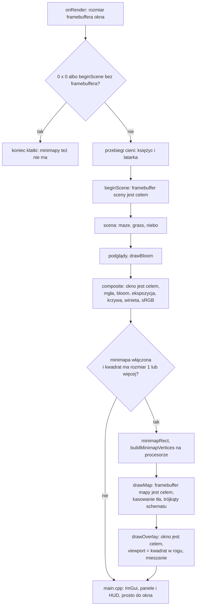

# Moduł renderer: minimapa, rendering do własnego framebuffera i odkrywanie korytarzy

Kamień milowy: M7, część szósta i ostatnia (2026-10-06). Temat wykładu: 10 (Rendering pozaekranowy). Dokument zakłada, że znasz [`post-process.md`](post-process.md) (framebuffer sceny, przebieg składający, trójkąt pełnoekranowy) i klasę `gfx::Framebuffer` z [`../gfx/framebuffers.md`](../gfx/framebuffers.md). Bufory i tablicę atrybutów opisuje [`../gfx/buffers-vao.md`](../gfx/buffers-vao.md), a przestrzeń sRGB [`../gfx/color-space.md`](../gfx/color-space.md).
Kod: reguła odkrywania [`src/game/Discovery.hpp`](../../../src/game/Discovery.hpp) i [`Discovery.cpp`](../../../src/game/Discovery.cpp), ustawienia, miejsce na ekranie i kształty mapy [`src/game/Minimap.hpp`](../../../src/game/Minimap.hpp) i [`Minimap.cpp`](../../../src/game/Minimap.cpp), strona OpenGL [`src/game/MinimapRenderer.hpp`](../../../src/game/MinimapRenderer.hpp) i [`MinimapRenderer.cpp`](../../../src/game/MinimapRenderer.cpp), shadery [`assets/shaders/post/minimap.vert`](../../../assets/shaders/post/minimap.vert), [`post/minimap.frag`](../../../assets/shaders/post/minimap.frag) i [`post/minimap_overlay.frag`](../../../assets/shaders/post/minimap_overlay.frag) (ten ostatni z istniejącym [`post/composite.vert`](../../../assets/shaders/post/composite.vert)), stan rundy w [`src/game/Round.hpp`](../../../src/game/Round.hpp) (pole `discovery`), `cellAt` w [`src/game/MazeLayout.hpp`](../../../src/game/MazeLayout.hpp), bufor z podpowiedzią użycia i `setData` w [`src/gfx/Buffer.hpp`](../../../src/gfx/Buffer.hpp), wywołanie w [`src/game/NightMazeApp.cpp`](../../../src/game/NightMazeApp.cpp) (`drawMinimap`, klawisz M), nazwy uniformów w [`src/game/ShaderUniforms.hpp`](../../../src/game/ShaderUniforms.hpp), zakładka panelu [`src/debug/panels/FramebuffersPanel.cpp`](../../../src/debug/panels/FramebuffersPanel.cpp), testy [`tests/DiscoveryTests.cpp`](../../../tests/DiscoveryTests.cpp), [`tests/MinimapTests.cpp`](../../../tests/MinimapTests.cpp) i jeden przypadek w [`tests/MazeLayoutTests.cpp`](../../../tests/MazeLayoutTests.cpp).

**Stan na dziś:** w prawym dolnym rogu okna stoi kwadratowa mapa labiryntu, widok z góry, północ u góry, mapa się nie obraca. Pokazuje tylko komórki, które gracz odkrył, i strzałkę gracza. Rysuje ją osobny przebieg do własnego framebuffera `GL_RGBA8` (kwadrat o boku 0,28 wysokości okna), a drugi przebieg kopiuje ten obraz w róg okna z przezroczystością 0,85. Przebiegi stoją **po** przebiegu składającym, więc mgła, bloom i mapowanie tonów jej nie dotykają. Dwa nowe programy shaderów (`minimap` i `minimap_overlay`): programów jest trzynaście, paneli nadal dwanaście. Klawisz M włącza i wyłącza mapę, a trzecia zakładka panelu Framebuffers zmienia jej ustawienia i pokazuje jej framebuffer.

**Uczciwie o tym, co sprawdzono.** Wszystko poniżej o obrazie jest **policzone z kodu i z jego testów, nikt nie obejrzał minimapy**. Zgłoszone przez wykonawcę (Windows, 2026-10-06), nie powtórzone przy pisaniu tego dokumentu: bramka `make check` przechodzi w Debug i Release, **414 przypadków testowych i 138711 asercji** (przed tą częścią 375 i 138506), a start programu Debug przez około 7 sekund wypisał `GL_VERSION` 4.1.0 NVIDIA i linie wczytania zasobów, przy pustym standardowym wyjściu błędów (błędy shaderów, `GL_CHECK` i framebuffera trafiają tam tylko wtedy, gdy się zdarzą). Minimapa jest domyślnie włączona, więc z pustego `stderr` wynika (to **moje wnioskowanie ze zgłoszenia**, nie osobna obserwacja), że oba nowe programy się skompilowały i framebuffer mapy był kompletny. **Nie ćwiczono**: ruchu gracza, klawisza M, zakładki Minimap, `Reveal all`, `Reload shaders`, zmiany rozmiaru okna ani obu widoków diagnostycznych. Brak błędu nie mówi nic o tym, jak mapa wygląda: trójkąt odrzucony przy odrzucaniu tylnych ścian nie zgłasza błędu OpenGL. Lista do wykonania ręcznie: [`../../guides/build-windows.md`](../../guides/build-windows.md), sekcja 22. **Na macOS ten kod nie był ani budowany, ani uruchamiany.**

## 1. Po co to jest

PRD wymienia przy temacie 10 minimapę: widok labiryntu rysowany do osobnego framebuffera. Była to ostatnia brakująca rzecz tego tematu. Gra polega na szukaniu drogi, więc mapa, która od początku pokazuje wyjście, odpowiadałaby na to pytanie za gracza (notatka [`../../decisions/minimap-discovered-corridors.md`](../../decisions/minimap-discovered-corridors.md)). Mapa pokazuje dlatego tylko to, co gracz już widział.

| Rzecz | Gdzie | Sekcja |
|---|---|---|
| które komórki gracz zna i reguła ich odkrywania (linia wzroku wzdłuż korytarzy) | `game::Discovery`, `discoverFrom`, `discoverAround`, pole `Round::discovery` | 2.3, 5.2, 5.7 |
| zamiana metrów labiryntu na obraz mapy (rzut ortograficzny, północ u góry) | `minimapProjection`, `minimapHalfExtent`, `post/minimap.vert` | 2.4, 4.1, 5.3 |
| miejsce i rozmiar kwadratu mapy w oknie | `minimapRect`, `MinimapSettings` | 2.5, 5.3 |
| kształty mapy jako lista trójkątów budowana co klatkę | `buildMinimapVertices`, `MinimapVertex` | 2.6, 5.3 |
| rysowanie do własnego framebuffera (rendering do tekstury) | `MinimapRenderer::drawMap`, `post/minimap.frag` | 2.1, 3, 5.4 |
| bufor wierzchołków, który zmienia zawartość i rozmiar co klatkę | `gfx::Buffer` z `GL_DYNAMIC_DRAW` i `setData` | 2.7, 5.6 |
| pokazanie obrazu mapy w rogu okna z przezroczystością | `MinimapRenderer::drawOverlay`, `post/minimap_overlay.frag`, mieszanie | 2.9, 4.3, 5.4 |
| kolory mapy jako liczby sRGB, bez konwersji | stałe `MINIMAP_*_COLOR`, oba shadery | 2.8 |
| miejsce w klatce | `NightMazeApp::drawMinimap` | 2.10, 5.5 |
| zakładka panelu | `drawMinimapSettings` | 6 |

Pokaz na obronie to ta sama myśl co przy pozostałych elementach tematu 10, tylko z drugim framebufferem: **obraz, który program narysował do tekstury, jest widoczny dwa razy**, w rogu okna i w zakładce Minimap panelu Framebuffers (w tej drugiej dokładnie w takiej postaci, w jakiej leży w teksturze).

## 2. Teoria

### 2.1 Drugi framebuffer: rendering do tekstury w tym zastosowaniu

W [`post-process.md`](post-process.md), sekcja 2.1, framebuffer jest celem rysowania, a jego załączniki są teksturami. Scena używa tego, żeby potem przepuścić obraz przez efekty. Minimapa używa tej samej możliwości inaczej: **rysuje coś innego niż scena**, do tekstury, która ma rozmiar mapy na ekranie, a potem pokazuje tę teksturę jak naklejkę.

| | scena (część 1) | minimapa (część 6) |
|---|---|---|
| co jest rysowane | trójkąty świata 3D | trójkąty schematu 2D z danych labiryntu |
| rozmiar tekstury | rozmiar okna | kwadrat `rect.size` x `rect.size`, równy kwadratowi na ekranie |
| format koloru | `GL_RGBA16F` (HDR, wartości liniowe) | `GL_RGBA8` (wartości sRGB, od 0 do 1) |
| głębia | tekstura `GL_DEPTH_COMPONENT24` | **brak** (`DepthFormat::None`): kształty płaskie, kolejność listy rozstrzyga, co leży na wierzchu |
| co dalej | efekty, potem przebieg składający koduje do sRGB | przebieg kopiujący bez zmian do okna |
| kto tworzy | `PostProcess::beginScene` | `MinimapRenderer::drawMap` przy pierwszej klatce i po każdej zmianie rozmiaru |

Rozmiar tekstury równy rozmiarowi kwadratu na ekranie to wybór wykonawczy, a jego powód jest w kodzie: obraz jest kopiowany **piksel w piksel**, więc nic nie jest skalowane ani rozmywane. Środek piksela okna wypada wtedy dokładnie w środku teksela, a filtr `GL_LINEAR` (framebuffer tak tworzy każdą teksturę koloru) daje w takim miejscu dokładnie wartość teksela. Z tego samego powodu tekstura **nie jest stałego rozmiaru** (na przykład 512 x 512, skalowana potem do kwadratu na ekranie): byłoby to skalowanie z rozmyciem albo ząbkami.

Rozmiar tekstury idzie więc za kwadratem na ekranie: zmiana rozmiaru okna albo suwaka `Size` zmienia `rect.size`, a to tworzy framebuffer mapy od nowa (sekcja 5.4). Nikt jeszcze nie sprawdził, jak to wygląda podczas przeciągania krawędzi okna.

### 2.2 Schemat z danych, a nie widok sceny z góry

Decyzja właściciela z 2026-10-06: minimapa to **schemat rysowany z danych labiryntu** do własnego framebuffera, a nie osobny widok sceny z góry. Dwie drogi do mapy:

| Droga | Co trzeba | Skutek |
|---|---|---|
| druga kamera nad labiryntem, scena rysowana jeszcze raz (**odrzucona**) | drugi przebieg sceny z macierzą z góry, oświetlenie, cienie, mgła | obraz podobny do świata, ale zależny od oświetlenia i mgły (notatka [`../../decisions/fog-height-at-the-pixel.md`](../../decisions/fog-height-at-the-pixel.md): z dużej wysokości mgła zakrywa labirynt prawie w całości), a odkryte i nieodkryte komórki trudno oddzielić bez dodatkowej maski |
| **schemat z danych (wybrane)** | lista trójkątów z podłóg, ścian, bramy, kryształów i gracza, jeden prosty shader | mapa jest czytelna zawsze, a to, co pokazuje, decyduje kod w C++ pod testami (`buildMinimapVertices`) |

Konsekwencja ważna dla dalszych sekcji: skoro mapa powstaje z danych, **nie ma sensu przepuszczać jej przez przebieg składający**. Mgła, bloom, ekspozycja i krzywa tonów są zrobione dla sceny i zepsułyby schemat. Mapa jest rysowana po przebiegu składającym (sekcja 2.10), a jej kolory są od razu liczbami, które ma dostać ekran (sekcja 2.8).

### 2.3 Odkrywanie: linia wzroku wzdłuż korytarzy

Decyzja właściciela z 2026-10-06: komórka jest **odkryta przez linię wzroku wzdłuż korytarzy**. Odkrywa się komórka, w której gracz stoi, i komórki w linii prostej w czterech kierunkach (północ, wschód, południe, zachód) aż do ściany. To jest cała reguła. Reszta tej sekcji to jej zapis w kodzie.

**Stan** to `game::Discovery`: jeden bajt na komórkę, `1` odkryta, `0` jeszcze nie. Rzędami, komórka `(x, z)` leży pod indeksem `z * width + x`. Znacznik jest tylko ustawiany, nigdy zerowany: nowa runda robi nową siatkę. Bajty zamiast `std::vector<bool>`: ten ostatni pakuje znaczniki w bity i nie oddaje zwykłych referencji (komentarz w kodzie).

**Reguła** to funkcja `discoverFrom(discovery, maze, cell)`:

1. komórka spoza labiryntu nic nie odkrywa (`Maze::hasWall` rzuca wyjątek dla takiej komórki, więc test jest pierwszą linią),
2. odkrywa komórkę gracza,
3. dla każdego z czterech kierunków idzie krok po kroku: **dopóki bok bieżącej komórki w tym kierunku jest otwarty** (`!maze.hasWall`), przesuwa się o jedną komórkę i ją odkrywa,
4. otwarty bok na brzegu labiryntu (dziura w zewnętrznej ścianie) prowadzi poza labirynt: pętla kończy się, bo nie ma tam komórki do odkrycia ani do zapytania o ściany.

**Pierwszy przykład: róg.** Labirynt 2 x 2 w kształcie litery L: z `(0, 0)` na wschód do `(1, 0)`, potem na południe do `(1, 1)`. Gracz stoi w `(0, 0)`. Na wschód bok jest otwarty: odkryta `(1, 0)`. Dalej na wschód jest ściana zewnętrzna: koniec. Na południe od `(0, 0)` ściana, na północ i zachód ściany zewnętrzne. Odkryte są `(0, 0)` i `(1, 0)`, **nie** `(1, 1)`: reguła nie skręca. Dopiero gdy gracz stanie w `(1, 0)`, południowa noga litery L jest w linii i `(1, 1)` zostaje odkryte. Łącznie trzy komórki, `(0, 1)` nigdy. To dokładnie test `the view does not go around a corner: the cell behind it needs a visit`.

**Drugi przykład: skrzyżowanie.** Labirynt 5 x 5, w którym usunięto wszystkie ściany wiersza 2 i kolumny 2 (dwa korytarze krzyżują się w komórce `(2, 2)`). Gracz stoi na zachodnim końcu wiersza, w `(0, 2)`:

```text
  x:   0   1   2   3   4          # = nieodkryta, o = odkryta
z=0    #   #   #   #   #
z=1    #   #   #   #   #
z=2    o   o   o   o   o          <- pięć komórek: cały wiersz 2
z=3    #   #   #   #   #
z=4    #   #   #   #   #
```

Na wschód bok jest otwarty cztery razy, więc odkryte są `(1, 2)` do `(4, 2)`, potem ściana zewnętrzna. Z `(0, 2)` na północ i południe ściany. Razem pięć komórek. Odnogi kolumny 2, czyli `(2, 1)` i `(2, 3)`, są widoczne jako otwory w ścianie korytarza, ale **zostają nieznane**, dopóki gracz nie stanie w linii z nimi (test `a side passage is seen only from a cell in line with it`). Gdy gracz dojdzie do `(2, 2)`, odkrywa cały krzyż: wiersz 2 i kolumnę 2, razem dziewięć komórek, bo środkowa jest liczona raz (test `the view reaches equally far in all four directions`).

Ściany czyta funkcja **w każdym wywołaniu** z `Maze` i nic o nich nie zapamiętuje. Dzięki temu ściana usunięta w środku rundy otwiera widok od następnego wywołania (test `a wall that is removed later opens the view from the next call on`). **Brama wyjścia nie jest ścianą labiryntu**, więc widok przechodzi przez nią, otwartą czy zamkniętą (wybór wykonawczy, sekcja 4 notatki o decyzji).

**Skąd bierze się komórka gracza.** `cellAt(position)` w `MazeLayout`: `floor(x / CELL_SIZE)` i `floor(z / CELL_SIZE)`, wysokość nie liczy się. `floor`, a nie zwykła konwersja na `int`: konwersja obcina ułamek w stronę zera, więc punkt 0,5 m na zachód od labiryntu (`x = -0,5`) trafiłby do kolumny 0, czyli do komórki labiryntu, a `floor` daje kolumnę `-1`. Zachodnia i północna krawędź kwadratu należą do jego komórki. Funkcja nie zna labiryntu, więc odpowiedź może być komórką, której labirynt nie ma: pyta się potem `Maze::contains` (przypadek `cellAt finds the cell a point of the world lies in`). Gracz w trybie noclip leci nad labiryntem i odkrywa komórki pod sobą, bo liczą się tylko `x` i `z`.

**Kiedy to się dzieje** (sekcja 5.7): w `startRound`, żeby pierwsza klatka już miała odkrytą komórkę startu i korytarze z niej, i w `updateRound` w każdym kroku stałym, z pozycji stóp gracza po tym kroku. Odkrywanie trwa także po wygranej (gracz może chodzić dalej).

### 2.4 Od metrów do obrazu: rzut ortograficzny

Wierzchołek mapy to punkt labiryntu widziany z góry, w metrach: `x` świata i `z` świata (`MinimapVertex::position`, dwie liczby). Shader wierzchołków ma go zamienić na punkt przestrzeni obcinania, w której obraz to kwadrat od -1 do 1. Zamienia go macierz `uMapToClip`, rzut **ortograficzny**: bez perspektywy, bez skracania, równoległe linie zostają równoległe, jeden metr ma w obrazie wszędzie tę samą długość. Tę macierz robi `glm::ortho(lewo, prawo, dół, góra)`, która odwzorowuje `lewo` na -1, `prawo` na +1, `dół` na -1 i `góra` na +1. Wzory dla dwóch pierwszych współrzędnych (trzecia jest tu zawsze 0, więc domyślne płaszczyzny bliska -1 i daleka 1 nie grają roli):

```text
x_clip = 2 * (x - lewo) / (prawo - lewo) - 1
y_clip = 2 * (z - dół)  / (góra  - dół)  - 1
```

**Dobór czterech liczb** (`minimapProjection`). Kwadrat świata, który widać, ma środek w środku labiryntu `(szerokość * 2 / 2, wysokość * 2 / 2)` metrów i półbok `minimapHalfExtent`: połowa **dłuższego** boku labiryntu w metrach razy `FRAME_SCALE = 1,06`. Sześć procent więcej zostawia ciemną ramkę (3 procent z każdej strony), bo zewnętrzne ściany wystają za brzeg labiryntu o połowę swojej grubości. Labirynt niekwadratowy ma puste pasy przy krótszym boku, a komórki zostają kwadratowe (test `a maze that is not square keeps square cells on the map`).

**Odwrócenie osi.** `z` rośnie na południe, a obraz ma rosnąć ku górze. Kod wpisuje do `glm::ortho` jako `dół` krawędź **południową** i jako `góra` krawędź **północną**:

```cpp
const float west = centerX - halfExtent;
const float east = centerX + halfExtent;
const float south = centerZ + halfExtent;
const float north = centerZ - halfExtent;
return glm::ortho(west, east, south, north);
```

Wiersz 0 labiryntu (północ, `-Z`) jest więc górnym wierszem mapy, a wschód jest po prawej.

**Przykład liczbowy**, labirynt 10 x 10 (stan startowy gry), obraz 202 piksele:

| Wielkość | Obliczenie | Wynik |
|---|---|---|
| bok labiryntu | 10 komórek po 2 m | 20 m |
| środek | 20 / 2 | `(10, 10)` m |
| półbok `minimapHalfExtent` | `20 / 2 * 1,06` | 10,6 m |
| świat widoczny | od `10 - 10,6` do `10 + 10,6` | od -0,6 do 20,6 m (21,2 m) |
| metrów na piksel | `21,2 / 202` | 0,105 m |
| środek komórki `(0, 0)` | `cellCenter(0, 0)` | `(1, 1)` m |
| `x_clip` | `2 * (1 - (-0,6)) / 21,2 - 1` | -0,849 |
| `y_clip` | `2 * (1 - 20,6) / (-0,6 - 20,6) - 1` | +0,849 (u góry) |
| to w pikselach | `(1 + x_clip) / 2 * 202` od lewej i od góry | około 15,2 px |
| narożnik labiryntu `(0, 0)` metrów | leży `0 - (-0,6) = 0,6` m od brzegu obrazu | około 5,7 px od brzegu |
| ten narożnik w przestrzeni obcinania | `±1 / 1,06` | `x = -0,943`, `y = +0,943` |

Ostatni wiersz to dokładnie to, co sprawdza test `north is at the top of the map and east on the right` (krawędź `1 / 1,06`, środek labiryntu w środku obrazu). Komórka ma `2 / 0,105`, czyli około 19 pikseli, a ściana 0,3 m około 2,9 piksela.

### 2.5 Kwadrat w oknie: rozmiar jako część wysokości

`minimapRect(szerokośćFramebuffera, wysokośćFramebuffera, ustawienia)` zwraca kwadrat w **pikselach framebuffera okna**, tak jak chce `glViewport`: `x` i `y` to jego **lewy dolny** róg liczony od lewego dolnego rogu okna (OpenGL liczy `y` w górę). Rozmiar i margines to części **wysokości** (`size = 0,28`, `margin = 0,02`), zaokrąglone do całych pikseli:

| Okno | `size` | `margin` | prawy dolny róg: `x`, `y` |
|---|---|---|---|
| 1280 x 720 | `lround(720 * 0,28) = lround(201,6) = 202` | `lround(14,4) = 14` | `1280 - 14 - 202 = 1064`, `14` |
| 2560 x 1440 (to samo okno na Retina) | `lround(403,2) = 403` | `lround(28,8) = 29` | `2560 - 29 - 403 = 2128`, `29` |

Część, a nie liczba pikseli, bo mapa ma zajmować taki sam ułamek obrazu w każdym oknie i na ekranie Retina, gdzie framebuffer ma dwa razy więcej pikseli (test `the minimap covers the same share of a Retina framebuffer`). Wysokość, a nie szerokość, także dla marginesu do bocznej krawędzi: wtedy kwadrat ma tyle samo wolnego miejsca z obu stron rogu, a szerokość okna nie zmienia rozmiaru (test `the minimap follows the height of the framebuffer, not its width`). **Liczy się rozmiar framebuffera w pikselach, nigdy rozmiar okna we współrzędnych ekranu.**

Zabezpieczenia: wartości z suwaków są wciskane w zakres (`MIN_MINIMAP_SIZE` 0,1 do `MAX_MINIMAP_SIZE` 0,6, margines od 0 do 0,1, przezroczystość od 0,1 do 1), bo suwak przyjmuje także wpisaną liczbę. W oknie, które jest za małe dla marginesów, margines jest zerowany, a rozmiar zmniejszany do najkrótszego boku (test `the minimap shrinks to fit a small framebuffer and never leaves it`). Okno 0 x 0 daje kwadrat o rozmiarze 0, czyli brak mapy. Róg wybiera wyliczenie `MinimapCorner` (domyślnie prawy dolny: **HUD stoi na górze pośrodku i rośnie w dół razem z podpowiedziami**, powód z komentarza w kodzie).

### 2.6 Kształty: lista trójkątów

`buildMinimapVertices` zwraca `std::vector<MinimapVertex>`: co trzy wierzchołki to jeden trójkąt (`GL_TRIANGLES`), a późniejsze trójkąty rysują się na wcześniejszych. Kolejność jest treścią funkcji:

| # | Co | Kształt | Kolor |
|---|---|---|---|
| 1 | podłoga każdej pokazanej komórki | kwadrat 2 m z dwóch trójkątów | `MINIMAP_FLOOR_COLOR`, komórka wyjścia `MINIMAP_EXIT_COLOR`, komórka startu `MINIMAP_START_COLOR` (wyjście pytane pierwsze: w labiryncie z jednej komórki start jest wyjściem) |
| 2 | ściany pokazanych komórek | cienkie prostokąty na krawędziach komórek | `MINIMAP_WALL_COLOR` |
| 3 | brama, gdy komórka wyjścia jest pokazana | prostokąt jak ściana | `MINIMAP_GATE_COLOR` (blokuje) albo `MINIMAP_GATE_OPEN_COLOR` (otwarta) |
| 4 | kryształy niezebrane w pokazanych komórkach | romb z dwóch trójkątów | `MINIMAP_CRYSTAL_COLOR` |
| 5 | gracz | jeden trójkąt wskazujący, gdzie patrzy kamera | `MINIMAP_PLAYER_COLOR` |

**Komórka jest "pokazana"**, gdy jest odkryta w rundzie (`Round::discovery`) albo zawsze przy `revealAll`. Przełącznik `revealAll` zmienia **tylko to, co jest rysowane**: odkrywanie rundy toczy się pod spodem i po wyłączeniu przełącznika wraca (test `reveal all shows the whole maze without changing the discovery`).

**Ściany** są brane każda raz, w kolejności `wallSegments`: każda komórka zgłasza swoją północną i zachodnią ścianę, a południową i wschodnią tylko ostatni wiersz i ostatnia kolumna (test `every wall of a generated maze is drawn exactly once when all is revealed`). Ściana między dwiema komórkami jest rysowana, gdy **któraś z nich** jest pokazana (wybór wykonawczy: gracz widział ją z jednej strony, a przy otwartym korytarzu to ściany, które go ograniczają). Prostokąt ściany jest o pół grubości dłuższy od krawędzi komórki z obu końców, więc dwie ściany spotykające się w rogu siatki wypełniają róg, w którym świat ma słupek. Grubość to `PILLAR_SIZE`, 0,3 m.

**Minimalne rozmiary w pikselach.** W dużym labiryncie 0,3 m to mniej niż piksel, a prostokąt cieńszy niż piksel może leżeć między środkami dwóch rzędów pikseli i zniknąć. Dlatego `buildMinimapVertices` dostaje `metresPerPixel` i bierze **większą** z dwóch wartości: rozmiaru w metrach i rozmiaru w pikselach razy metrów na piksel.

| Kształt | W metrach | Najmniej w pikselach | Labirynt 10 x 10 (0,105 m/px) | Labirynt 40 x 40 (0,42 m/px) |
|---|---|---|---|---|
| grubość ściany | 0,3 | 1,5 | 0,3 m (2,9 px), minimum nie działa | `1,5 * 0,42 = 0,63` m |
| promień rombu kryształu | 0,4 | 2 | 0,4 m | `2 * 0,42 = 0,84` m |
| długość strzałki | 0,9 | 5 | 0,9 m | `5 * 0,42 = 2,1` m |

Kolumna 40 x 40: półbok `40 * 2 / 2 * 1,06 = 42,4` m, więc `84,8 / 202 = 0,42` m na piksel, a komórka ma około 4,8 piksela. To **policzone**, nikt nie oglądał mapy 40 x 40. Test `thin shapes keep a smallest size in pixels on the map of a large maze` sprawdza mechanizm dla `1 m` na piksel (ściana 1,5 m, strzałka 5 m).

**Strzałka gracza.** Yaw kamery 0 patrzy na północ (w stronę mniejszego `z`), 90 na wschód. Kierunek "przód" na mapie to `(sin yaw, -cos yaw)`, a "w prawo" to ten kierunek obrócony o ćwierć obrotu, `(cos yaw, sin yaw)`. Czubek stoi `length` przed graczem, dwa tylne rogi `0,6 * length` za nim i po `0,65 * length` na boki. Strzałka jest rysowana zawsze, także poza labiryntem (obraz może ją wtedy uciąć), i jako ostatnia, żeby nic jej nie przykryło. Pozycja strzałki to **stopy** gracza z klatki (zmieszane między dwoma krokami stałymi tak jak kamera), więc porusza się równie płynnie jak widok.

### 2.7 Bufor wierzchołków, który się zmienia: `glBufferData` jeszcze raz

Wszystkie dotychczasowe `gfx::Buffer` w grze były wypełniane raz, w konstruktorze, z `GL_STATIC_DRAW` (siatki modeli, [`../gfx/buffers-vao.md`](../gfx/buffers-vao.md), sekcja 2.6). Lista mapy zmienia się co klatkę (strzałka gracza porusza się cały czas) i **zmienia rozmiar** (odkryta komórka dodaje podłogę i ściany, zebrany kryształ ubywa). Dwie zmiany w `gfx::Buffer`:

- czwarty argument konstruktora, **podpowiedź użycia** `usage`, domyślnie `GL_STATIC_DRAW`. Mapa tworzy bufor z `GL_DYNAMIC_DRAW`: dane będą często zastępowane. To podpowiedź dla sterownika (może wybrać rodzaj pamięci), a nie ograniczenie: oba rodzaje da się rysować i wypełniać tak samo,
- metoda `setData(data, sizeInBytes)`: wiąże bufor i woła `glBufferData` z zapamiętaną podpowiedzią. `glBufferData` **przydziela nową pamięć** zamiast pisać w starej, więc karta może dokończyć wywołanie rysujące, które jeszcze czyta starą zawartość, a rozmiar może być inny niż poprzednio.

**Dlaczego nie `glBufferSubData`.** `glBufferSubData` zapisuje w istniejącej pamięci i **nie powiększa bufora**: zapis poza końcem to błąd OpenGL (komentarz w [`src/gfx/UniformBuffer.cpp`](../../../src/gfx/UniformBuffer.cpp)). Bufor uniformów `LightBlock` używa jej dobrze, bo jego rozmiar jest stały (struktura o znanej wielkości). Lista mapy zmienia rozmiar, więc musiałaby tu być albo kombinacja "przydziel z zapasem, potem SubData", albo `glBufferData` za każdym razem. Kod wybiera drugie: jedna prosta funkcja, ta sama dla pierwszego wypełnienia i kolejnych. **Dlaczego nie mapowanie** (`glMapBuffer`): kod nie podaje powodu. To moja analiza: mapowanie daje wskaźnik do pamięci karty i wymaga odmapowania, co przy liście o rozmiarze około 28 KB na klatkę nie daje korzyści, a dokłada stan, który trzeba pilnować (zapomniane odmapowanie psuje rysowanie). **Nie mierzono**, czy któraś z dróg jest szybsza.

**Rozmiar listy.** Komentarz w `drawMinimap` podaje około 1400 wierzchołków po 20 bajtów dla domyślnego labiryntu, gdy pokazany jest cały. Moje przybliżenie z kodu: 600 wierzchołków podłóg (100 komórek po 6) + 726 ścian (121 ścian po 6: 81 wewnętrznych w labiryncie doskonałym 10 x 10 i 40 zewnętrznych) + 6 bramy + 72 kryształów przy 12 sztukach + 3 gracza daje 1407, czyli około 28 KB. Liczby nie sprawdzono w działającym programie.

**Układ wierzchołka.** `MinimapVertex` to dwie liczby pozycji i trzy koloru, 5 `float`, **20 bajtów**, bez wypełnień (`static_assert`). Atrybut 0 to `vec2` pozycji z przesunięciem 0, atrybut 1 to `vec3` koloru z przesunięciem 8 (`offsetof`).

### 2.8 Kolory: stałe sRGB, bez konwersji

W grze kolory sceny są liczone liniowo i kodowane do sRGB **raz, na końcu** ([`../gfx/color-space.md`](../gfx/color-space.md)). Mapa nie jest sceną: nic na niej nie jest oświetlone, więc nie ma rachunku światła, który wymagałby wartości liniowych. Stałe `MINIMAP_*_COLOR` w `Minimap.hpp` są **liczbami sRGB dobranymi na oko na ekranie**: dokładnie tymi, które ekran ma dostać. Droga koloru:

```text
stała sRGB  ->  vColor  ->  fragColor  ->  tekstura GL_RGBA8  ->  texture(uMap, vUv).rgb  ->  okno
   (C++)       (vert)        (minimap.frag)   (liczby bez zmian)    (minimap_overlay.frag)    (liczby bez zmian)
```

Nic po drodze nie koduje ani nie dekoduje. To działa, bo:

- tekstura `GL_RGBA8` (`ColorFormat::Rgba8`, nazwa w panelu `GL_RGBA8`) **nie jest** formatem sRGB, więc przechowuje liczby, jakie dostała,
- przy zapisie do okna `GL_FRAMEBUFFER_SRGB` jest wyłączone (`PostProcess::composite` robi `glDisable` i nikt go nie włącza, notatka [`../../decisions/srgb-encode-in-shader.md`](../../decisions/srgb-encode-in-shader.md)), więc OpenGL niczego nie koduje,
- mapa **nie przechodzi** przez `composite.frag`, jedyne miejsce, które koduje scenę.

Gdyby `minimap_overlay.frag` wywołał `linearToSrgb`, kolory zostałyby zakodowane drugi raz i mapa byłaby za jasna i wyblakła. **Mieszanie z przezroczystością** (sekcja 2.9) odbywa się więc na wartościach sRGB, a nie na liniowych: nie jest to fizycznie poprawna mieszanka światła, tak samo jak mieszanie HUD i paneli ImGui. Wybór: [`../../decisions/minimap-srgb-constants-after-composite.md`](../../decisions/minimap-srgb-constants-after-composite.md).

Kolory ściany, bramy, kryształu i gracza to te same, których używa plan w panelu Maze (`debug/Theme.hpp`: `PLAN_WALL_COLOR` 176, 190, 216 z 255 to `0,69, 0,75, 0,85`, i tak dalej). Kolor wyjścia jest inny: plan ma jasną zieleń (132, 220, 140), mapa ciemną (`0,17, 0,42, 0,24`), bo jest tłem podłogi, a nie znacznikiem.

### 2.9 Mieszanie: przezroczysta nakładka

Drugi przebieg rysuje obraz mapy do okna, **na gotowym obrazie sceny**. Żeby scena była widać przez mapę, używa **mieszania** (blending): zamiast zastąpić piksel okna, OpenGL liczy `wynik = kolor * alfa + okno * (1 - alfa)`. To `glBlendFunc(GL_SRC_ALPHA, GL_ONE_MINUS_SRC_ALPHA)`, a alfą jest przezroczystość mapy `uOpacity`, domyślnie 0,85: mapa zakrywa 85 procent sceny pod sobą. Shader zwraca `vec4(texture(uMap, vUv).rgb, uOpacity)`.

Gra nigdzie indziej nie używa mieszania (ImGui ustawia własne). Dlatego przebieg:

1. zapamiętuje, czy mieszanie było włączone (`glIsEnabled`),
2. włącza je i ustawia funkcję **na czas tego jednego wywołania rysującego**,
3. po wywołaniu wyłącza je z powrotem, jeśli było wyłączone (jak `GrassRenderer` robi z odrzucaniem tylnych ścian),
4. funkcji mieszania nie przywraca: nic poza ImGui jej nie używa, a ImGui ustawia własną przed rysowaniem.

Przebieg mapy do framebuffera mapy ma mieszanie **wyłączone** (`glDisable(GL_BLEND)`): każdy kształt jest nieprzezroczysty i zastępuje to, co pod nim. Gra nigdy go nie włącza, ale linia mówi wprost, że przebieg na tym polega.

### 2.10 Kolejność klatki

Klatka ma od tej części jeden krok więcej, po przebiegu składającym i przed ImGui:



Mapa stoi po przebiegu składającym (nie może go przejść: sekcja 2.2) i **przed** ImGui, bo panele i HUD mają leżeć na mapie, a nie pod nią. Po powrocie z `drawMinimap` okno jest związane z viewportem na całe okno, tak jak zostawia je `composite`, test głębi wyłączony. Dlatego `main.cpp` nie musi niczego przywracać.

Dwa wyjątki od "mapa jest zawsze": gdy `beginScene` nie dał framebuffera (okno 0 x 0 albo błąd), `onRender` wraca przed rysowaniem mapy. Oba widoki diagnostyczne (UV, normalne) **pokazują** mapę, tak jak HUD: mapa jest po przebiegu składającym, więc zmiany jego ustawień dla widoków (ekspozycja, bloom, mgła i winieta wyłączone w kopii) jej nie dotyczą.

### 2.11 Stan rundy i jego granice

Odkrycie jest polem rundy (`Round::discovery`). Wynika stąd, kiedy się zeruje, a kiedy nie:

| Zdarzenie | Co się dzieje z odkryciem | Dlaczego (z kodu) |
|---|---|---|
| nowa runda (klawisz R, nowy labirynt, `beginRound`) | nowa siatka, odkryta tylko komórka startu i korytarze z niej | `startRound` składa nową `Round` |
| krok stały gry | dochodzą komórki widziane ze stóp gracza | `updateRound` woła `discoverAround` |
| wygrana | odkrywanie trwa | gracz chodzi dalej za kartą wygranej |
| noclip | odkrywa komórki pod graczem | liczą się tylko `x` i `z` |
| suwak skali wysokości terenu (`rebuildTerrain`) | odkrycie **zostaje** | funkcja nie robi nowej rundy, przestawia tylko miejsca kryształów (`restCrystalsOnGround`) |
| `revealAll` albo wyłączenie mapy (M) | odkrycie nietknięte | to ustawienia rysowania |

### 2.12 Znane ograniczenia

- **Nikt nie obejrzał mapy.** Kolory, grubości, rozmiar strzałki i czytelność są policzone, nie zobaczone.
- Odkryta komórka nie jest "zapamiętana jako widziana z odległości": reguła nie ma pojęcia zasięgu wzroku, korytarz jest odkrywany aż do ściany, także długi na 40 komórek.
- Ściana między komórką pokazaną a niepokazaną jest rysowana, więc jej grubość wchodzi o pół grubości w niepokazaną komórkę. To drobna rzecz, której nikt nie oglądał.
- Mapa jest za mała do czytania w labiryncie 40 x 40 (komórka około 5 pikseli przy 202 px): kod trzyma tylko minimalne rozmiary kształtów, a samej czytelności nie poprawia. Test `the map of the largest maze can be built` sprawdza tylko, że lista powstaje.
- Panel Framebuffers nie dostał większej wysokości przy trzeciej zakładce (`PanelLayout.hpp` nie zmieniono), więc zakładka Minimap może wymagać przewijania. Nikt tego nie sprawdził.
- Mieszanie jest liczone na wartościach sRGB, a nie liniowych (sekcja 2.8).
- Domyślny układ paneli: panel Assets stoi w prawej kolumnie do dołu okna (`ASSETS_PLACEMENT`), więc **przykrywa prawy dolny róg**, w którym stoi mapa. Do oglądania mapy trzeba schować panele (klawisz akcentu).
- macOS: framebuffer koloru `GL_RGBA8`, rozmiary Retina i mieszanie w domyślnym framebufferze nie były uruchamiane.

## 3. Jak to działa w OpenGL

Wywołania przebiegów w kolejności wykonania. Przebieg mapy (`drawMap`) i przebieg nakładki (`drawOverlay`) to dwa osobne wywołania z `NightMazeApp::drawMinimap`.

| # | Wywołanie | Co robi |
|---|---|---|
| 1 | `glGenVertexArrays`, `glGenBuffers`, `glBindBuffer`, `glBufferData(GL_ARRAY_BUFFER, 0 bajtów, nullptr, GL_DYNAMIC_DRAW)` | konstruktor `MinimapRenderer`: pusty bufor |
| 2 | `glVertexAttribPointer` i `glEnableVertexAttribArray` dla atrybutów 0 i 1 | opis układu `MinimapVertex` w tablicy wierzchołków (`setFloatAttribute`) |
| 3 | `Framebuffer({pixels, pixels, Rgba8, None})` | w `drawMap`, przy nowym rozmiarze: `glGenFramebuffers`, tekstura `GL_RGBA8`, sprawdzenie kompletności |
| 4 | `m_target.bind()` | `glBindFramebuffer` i `glViewport(0, 0, pixels, pixels)` |
| 5 | `glDisable(GL_DEPTH_TEST)`, `glDisable(GL_BLEND)` | płaski schemat, bez testu głębi i bez mieszania |
| 6 | `glClearColor(0,03, 0,04, 0,07, 1)`, `glClear(GL_COLOR_BUFFER_BIT)` | tło: wszystko, co nie jest odkryte |
| 7 | `shader.use()`, `setMat4("uMapToClip", ...)` | program mapy i jego jedyny uniform |
| 8 | `m_vertexArray.bind()`, `m_vertexBuffer.setData(...)` | `glBindBuffer` i `glBufferData` z nową listą |
| 9 | `glDrawArrays(GL_TRIANGLES, 0, liczbaWierzchołków)` | rysowanie schematu |
| 10 | `Framebuffer::bindDefault(w, h)` | w `drawOverlay`: z powrotem okno |
| 11 | `glViewport(rect.x, rect.y, rect.size, rect.size)` | viewport na kwadrat w rogu okna |
| 12 | `glDisable(GL_DEPTH_TEST)`, `glIsEnabled(GL_BLEND)`, `glEnable(GL_BLEND)`, `glBlendFunc(GL_SRC_ALPHA, GL_ONE_MINUS_SRC_ALPHA)` | mieszanie na czas jednego wywołania |
| 13 | `setInt("uMap", 0)`, `setFloat("uOpacity", ...)`, `bindColorTexture(0)` | sampler, przezroczystość i tekstura mapy na jednostce 0 |
| 14 | `m_triangle.bind()`, `glDrawArrays(GL_TRIANGLES, 0, 3)` | trójkąt pełnoekranowy (ma pokryć viewport, czyli kwadrat) |
| 15 | `glDisable(GL_BLEND)` (gdy było wyłączone), `glViewport(0, 0, w, h)` | porządek na koniec |

**Odrzucanie tylnych ścian.** Rzut `glm::ortho(west, east, south, north)` ma krawędź południową jako dolną, więc zwrot trójkątów na ekranie jest odwrotny niż w "zwykłym" rzucie. Nie ma to znaczenia, bo w grze `GL_CULL_FACE` jest wyłączone: nic w kodzie go nie włącza (`GrassRenderer` tylko wyłącza je na czas swojego rysowania, gdyby ktoś kiedyś je włączył, i potem przywraca). Pułapka 5 w sekcji 7 mówi, co się stanie, gdy ktoś kiedyś włączy je globalnie.

**Trójkąt bez bufora.** Przebieg nakładki rysuje trójkąt z `post/composite.vert`, który liczy rogi z `gl_VertexID` ([`post-process.md`](post-process.md), sekcja 2.4). Profil Core odmawia rysowania bez związanej tablicy wierzchołków, więc `MinimapRenderer` ma drugą, pustą (`m_triangle`). Viewport ustawiony na kwadrat mapy sprawia, że trójkąt pokrywa dokładnie ten kwadrat, a `vUv` biegnie od `(0, 0)` w lewym dolnym rogu do `(1, 1)` w prawym górnym: bez żadnej siatki prostokąta.

## 4. Shadery

### 4.1 `minimap.vert`

```glsl
#version 410 core
layout(location = 0) in vec2 aPosition; // miejsce w labiryncie w metrach: x świata, z świata
layout(location = 1) in vec3 aColor;    // kolor kształtu, wartość sRGB

uniform mat4 uMapToClip;

out vec3 vColor;

void main() {
    gl_Position = uMapToClip * vec4(aPosition, 0.0, 1.0);
    vColor = aColor;
}
```

| Linia | Co robi |
|---|---|
| `layout(location = 0) in vec2 aPosition` | atrybut 0: dwie liczby pozycji. Numer musi zgadzać się z `POSITION_ATTRIBUTE` w `MinimapRenderer.cpp` |
| `layout(location = 1) in vec3 aColor` | atrybut 1: trzy liczby koloru (`COLOR_ATTRIBUTE`) |
| `uniform mat4 uMapToClip` | macierz z `game::minimapProjection`, ustawiana co klatkę |
| `gl_Position = uMapToClip * vec4(aPosition, 0.0, 1.0)` | `z = 0`, `w = 1`: mapa jest płaska. Nie ma macierzy modelu ani widoku, bo pozycje już są miejscami w świecie |
| `vColor = aColor` | wszystkie trzy rogi trójkąta mają ten sam kolor, więc każdy piksel dostaje ten kolor |

### 4.2 `minimap.frag`

```glsl
#version 410 core
in vec3 vColor;
out vec4 fragColor;

void main() {
    fragColor = vec4(vColor, 1.0);
}
```

Jedna linia pracy: kolor trafia do tekstury **tak, jak jest**, z alfą 1 (obraz mapy jest nieprzezroczysty, przezroczystość nakłada dopiero następny przebieg). Komentarz w pliku wyjaśnia, że tu celowo nie ma `srgbToLinear` ani `linearToSrgb` (sekcja 2.8).

### 4.3 `minimap_overlay.frag`

```glsl
#version 410 core
in vec2 vUv;
uniform sampler2D uMap;
uniform float uOpacity;
out vec4 fragColor;

void main() {
    fragColor = vec4(texture(uMap, vUv).rgb, uOpacity);
}
```

| Linia | Co robi |
|---|---|
| `in vec2 vUv` | współrzędna tekstury z `composite.vert`: `(0, 0)` w lewym dolnym rogu rysowanego obszaru, `(1, 1)` w prawym górnym. Obszarem jest tu kwadrat mapy, nie całe okno |
| `uniform sampler2D uMap` | numer jednostki teksturującej z obrazem mapy (0) |
| `uniform float uOpacity` | przezroczystość mapy, wciśnięta w zakres od 0,1 do 1 po stronie C++ |
| `vec4(texture(uMap, vUv).rgb, uOpacity)` | kolor bez zmian, a alfa to przezroczystość. Mieszanie OpenGL zrobi z tego `kolor * alfa + scena * (1 - alfa)` |

Program `minimap_overlay` to **nowy plik fragmentów z już istniejącym** `post/composite.vert`: wspólny shader wierzchołków obsługuje teraz pięć programów (`composite`, `preview`, `bright`, `blur`, `minimap_overlay`).

### 4.4 Strona C++: uniformy

| Stała w `ShaderUniforms.hpp` | Nazwa w shaderze | Ustawia | Kiedy |
|---|---|---|---|
| `MINIMAP_MAP_TO_CLIP_UNIFORM` | `uMapToClip` (`mat4`) | `MinimapRenderer::drawMap` | co klatkę, po `shader.use()` |
| `MINIMAP_OVERLAY_MAP_UNIFORM` | `uMap` (`sampler2D`) | `drawOverlay` | co klatkę, wartość 0. Po `Reload shaders` każdy uniform wraca do 0, więc ustawianie co klatkę jest potrzebne |
| `MINIMAP_OVERLAY_OPACITY_UNIFORM` | `uOpacity` (`float`) | `drawOverlay` | co klatkę, wartość ograniczona do zakresu od 0,1 do 1 (`std::clamp`) |

## 5. Kod w projekcie

### 5.1 Pliki

| Plik | Co zawiera |
|---|---|
| [`src/game/Discovery.hpp`](../../../src/game/Discovery.hpp), [`Discovery.cpp`](../../../src/game/Discovery.cpp) | `class Discovery` (siatka bajtów, `contains`, `isDiscovered`, `discover`, `count`), `discoverFrom`, `discoverAround`. Bez OpenGL, w bibliotece `game_logic` |
| [`src/game/Minimap.hpp`](../../../src/game/Minimap.hpp), [`Minimap.cpp`](../../../src/game/Minimap.cpp) | `MinimapCorner`, `MinimapSettings`, granice ustawień, `MinimapRect`, `minimapRect`, `MinimapVertex`, dziewięć stałych kolorów, `minimapHalfExtent`, `minimapProjection`, `minimapMetresPerPixel`, `MinimapPlayer`, `buildMinimapVertices`. Bez OpenGL, w `game_logic` |
| [`src/game/MinimapRenderer.hpp`](../../../src/game/MinimapRenderer.hpp), [`MinimapRenderer.cpp`](../../../src/game/MinimapRenderer.cpp) | strona OpenGL: framebuffer, bufor, tablica wierzchołków, `drawMap`, `drawOverlay`, `target`. W programie `night_maze` (potrzebuje okna i kontekstu) |
| `assets/shaders/post/minimap.vert`, `minimap.frag`, `minimap_overlay.frag` | trzy nowe pliki shaderów (sekcja 4) |
| [`src/game/Round.hpp`](../../../src/game/Round.hpp), [`Round.cpp`](../../../src/game/Round.cpp) | pole `Round::discovery`, odkrycie komórki startu w `startRound` i w `updateRound` |
| [`src/game/MazeLayout.hpp`](../../../src/game/MazeLayout.hpp), [`MazeLayout.cpp`](../../../src/game/MazeLayout.cpp) | `cellAt` |
| [`src/gfx/Buffer.hpp`](../../../src/gfx/Buffer.hpp), [`Buffer.cpp`](../../../src/gfx/Buffer.cpp) | czwarty argument `usage`, pole `m_usage`, metoda `setData` |
| [`src/game/ShaderUniforms.hpp`](../../../src/game/ShaderUniforms.hpp) | trzy stałe z sekcji 4.4 |
| [`src/game/NightMazeApp.hpp`](../../../src/game/NightMazeApp.hpp), [`.cpp`](../../../src/game/NightMazeApp.cpp) | pola `m_minimapShader`, `m_minimapOverlayShader`, `m_minimapSettings`, `m_minimapRenderer`, cztery akcesory dla panelu, `MINIMAP_KEY`, funkcja `drawMinimap` |
| [`src/debug/DebugContext.hpp`](../../../src/debug/DebugContext.hpp), [`DebugUI.cpp`](../../../src/debug/DebugUI.cpp), [`src/main.cpp`](../../../src/main.cpp) | cztery nowe pola kontekstu (`minimapShader`, `minimapOverlayShader`, `minimapSettings`, `minimap`, razem 42), `SHADER_COUNT` 13, dwa dodatkowe argumenty `drawFramebuffersPanel` |
| [`src/debug/panels/FramebuffersPanel.hpp`](../../../src/debug/panels/FramebuffersPanel.hpp), [`.cpp`](../../../src/debug/panels/FramebuffersPanel.cpp) | trzecia zakładka `Minimap` (`drawMinimapSettings`) |
| [`tests/DiscoveryTests.cpp`](../../../tests/DiscoveryTests.cpp) | 19 przypadków testowych (sekcja 5.8) |
| [`tests/MinimapTests.cpp`](../../../tests/MinimapTests.cpp) | 19 przypadków testowych |
| [`tests/MazeLayoutTests.cpp`](../../../tests/MazeLayoutTests.cpp) | 1 nowy przypadek (`cellAt finds the cell a point of the world lies in`) |

`Discovery.*` i `Minimap.*` są w bibliotece `game_logic` (plik `CMakeLists.txt`), czyli bez okna i OpenGL, żeby testy mogły je zlinkować. `MinimapRenderer.*` jest w programie `night_maze`, obok pozostałych klas rysujących.

### 5.2 `Discovery.hpp` i `Discovery.cpp`

Klasa ma cztery pola: `m_width`, `m_height`, `m_count` i `m_cells` (`std::vector<std::uint8_t>`). Konstruktor z rozmiarem bierze `std::max(width, 0)`, więc rozmiar ujemny to 0, a wektor ma `width * height` zer; **rzutowania na `std::size_t` stoją przed mnożeniem**, żeby iloczyn liczył się w typie rozmiaru wektora. Konstruktor bez argumentów to siatka bez komórek (dla rundy, której nie zaczęto). `discover` zwiększa `m_count` tylko dla komórki, która była nieznana, więc dwukrotne odkrycie nie liczy się dwa razy. `isDiscovered` dla komórki spoza siatki zwraca `false`, `discover` ją ignoruje.

Sama reguła:

```cpp
void discoverFrom(Discovery& discovery, const Maze& maze, MazeCell cell) {
    if (!maze.contains(cell.x, cell.z)) {
        return;
    }
    discovery.discover(cell.x, cell.z);

    for (const Direction direction : ALL_DIRECTIONS) {
        int x = cell.x;
        int z = cell.z;
        while (!maze.hasWall(x, z, direction)) {
            x += columnStep(direction);
            z += rowStep(direction);
            if (!maze.contains(x, z)) {
                break;
            }
            discovery.discover(x, z);
        }
    }
}
```

| Linia | Co robi |
|---|---|
| `if (!maze.contains(...)) return;` | `Maze::hasWall` rzuca wyjątek dla komórki spoza labiryntu, więc ten przypadek kończy się tu |
| `discovery.discover(cell.x, cell.z)` | komórka gracza |
| `for (... : ALL_DIRECTIONS)` | cztery kierunki z `Maze.hpp` |
| `x`, `z` kopie | pętla idzie od komórki gracza, kopie zmieniają się w trakcie marszu |
| `while (!maze.hasWall(x, z, direction))` | warunek: bok bieżącej komórki w tym kierunku jest otwarty |
| `x += columnStep(direction); z += rowStep(direction)` | krok do sąsiada (-1, 0 albo 1 w każdej osi, zależnie od kierunku) |
| `if (!maze.contains(x, z)) break;` | otwarty bok na brzegu: nie ma sąsiada, nie wolno o niego pytać |
| `discovery.discover(x, z)` | sąsiad jest w linii wzroku |

Ściana jest pytana o **aktualną** komórkę, więc marsz kończy się na komórce, której bok za nią jest zamknięty (ostatnia komórka korytarza jest odkryta, następna nie). `discoverAround(discovery, maze, position)` to `discoverFrom(discovery, maze, cellAt(position))`: `cellAt` odpowiada dla każdego punktu, a `discoverFrom` ignoruje komórkę, której labirynt nie ma (test `a cell or a position outside the maze discovers nothing`).

### 5.3 `Minimap.hpp` i `Minimap.cpp`

**Ustawienia** (`MinimapSettings`, wartości startowe pilnuje test `the minimap settings start with the agreed values`): `enabled = true`, `revealAll = false`, `size = 0,28`, `margin = 0,02`, `corner = BottomRight`, `opacity = 0,85`.

**Funkcje:**

| Funkcja | Co robi | Sekcja teorii |
|---|---|---|
| `minimapRect` | kwadrat w rogu: rozmiar i margines jako części wysokości, zaokrąglone `std::lround`, wciśnięte w zakresy, zmniejszone do najkrótszego boku, `y` od dołu | 2.5 |
| `minimapHalfExtent` | `max(szerokość, wysokość) * CELL_SIZE / 2 * 1,06` | 2.4 |
| `minimapProjection` | `glm::ortho(west, east, south, north)` wokół środka labiryntu | 2.4 |
| `minimapMetresPerPixel` | `2 * półbok / max(piksele, 1)` | 2.6 |
| `buildMinimapVertices` | pięć grup kształtów z sekcji 2.6, `reserve` na podłogi pokazanych komórek | 2.6 |

W `buildMinimapVertices` pomocnicze funkcje w anonimowej przestrzeni nazw to `addTriangle`, `addRectangle` (dwa trójkąty po przekątnej, wierzchołki w kolejności północny zachód, północny wschód, południowy wschód, południowy zachód), `mapPoint` (z `vec3` świata robi `vec2`: `x` zostaje, `z` staje się drugą liczbą), `addWall` (prostokąt ściany o długości `WALL_LENGTH + grubość`) i `atLeastPixels`. Pozycje ścian i bramy bierze z `wallSegmentOn` i `world.gate`, używając tylko ich `x` i `z`, więc teren, na którym stoi labirynt, nie wpływa na mapę.

**Kryształy.** Kolejność kryształów rundy jest taka jak `MazeWorld::crystals`, które znają swoje komórki. Pętla idzie do mniejszej z dwóch długości (`std::min`), żeby runda należąca do innego świata niczego nie popsuła. Rysowany jest każdy kryształ, który nie jest zebrany (`!collected`) i leży w pokazanej komórce.

### 5.4 `MinimapRenderer`

**Kolejność pól ma znaczenie** (komentarz w kodzie): `m_target`, `m_requestedSize`, `m_vertexArray` (jego konstruktor wiąże tablicę), `m_vertexBuffer` (powstaje następny i zostaje związany z `GL_ARRAY_BUFFER`, co zapisuje atrybuty w ustawieniu tablicy), `m_triangle` (druga tablica, bez atrybutów). To ta sama kolejność co w `gfx::Mesh`. Konstruktor tworzy bufor z `nullptr`, 0 bajtów i `GL_DYNAMIC_DRAW`, wiąże go jeszcze raz (żeby dwie linie niżej nie zależały od kolejności pól) i opisuje dwa atrybuty (`setFloatAttribute`).

**`drawMap(shader, vertices, mapToClip, pixels)`**, po kolei:

1. `pixels < 1` albo program nieprawidłowy: `return false`, nic nie rysowane,
2. nowy rozmiar (`pixels != m_requestedSize`): zapamiętuje go **osobno od rozmiaru framebuffera**, żeby nieudane utworzenie nie było próbowane w każdej klatce, i tworzy `gfx::Framebuffer` z `Rgba8` bez głębi. Przypisanie przenoszące zwalnia stary framebuffer,
3. framebuffer nieprawidłowy: `return false` (błąd był zapisany raz przy tworzeniu),
4. `m_target.bind()` (także viewport), `glDisable(GL_DEPTH_TEST)`, `glDisable(GL_BLEND)`,
5. `glClearColor` z `MINIMAP_BACKGROUND_COLOR` i alfą 1, `glClear`. Kolor kasowania jest stanem kontekstu: przebieg sceny ustawia własny przed swoim kasowaniem,
6. `shader.use()` **przed** `setMat4` (uniformy należą do używanego programu),
7. `m_vertexArray.bind()`, `m_vertexBuffer.setData(vertices.data(), vertices.size_bytes())`,
8. `glDrawArrays(GL_TRIANGLES, 0, liczba)` bez bufora indeksów: lista powtarza rogi wspólne dla dwóch trójkątów,
9. `return true`. Framebuffer mapy zostaje związany z viewportem na jego rozmiar, test głębi i mieszanie wyłączone: **`drawOverlay` musi następować**.

**`drawOverlay(shader, rect, opacity, windowSize)`**: pierwszą rzeczą jest `Framebuffer::bindDefault`, **zawsze**, także gdy dalej nic nie rysuje (brak obrazu, nieprawidłowy program, `rect.size < 1`), bo ImGui rysuje po tym przebiegu i ma trafić do okna. Potem viewport na kwadrat mapy, test głębi wyłączony (bufor głębi okna nigdy nie jest czyszczony, więc test mógłby odrzucić trójkąt), mieszanie na czas jednego wywołania (sekcja 2.9), uniformy, `bindColorTexture(0)` (czytanie jest dozwolone, bo celem jest okno: **przebieg nigdy nie czyta tekstury, do której rysuje**), `m_triangle.bind()`, `glDrawArrays(GL_TRIANGLES, 0, 3)`, porządek.

**`target()`** oddaje framebuffer mapy tylko do odczytu, dla panelu: rozmiar, format (`GL_RGBA8`) i teksturę koloru.

### 5.5 `NightMazeApp::drawMinimap` i klawisz M

W `onRender`, po `composite`, jedna linia: `drawMinimap(framebuffer, feet)`. Klawisz M (`MINIMAP_KEY = GLFW_KEY_M`, czytany raz na klatkę obok klawiszy N i F) odwraca `m_minimapSettings.enabled`; w projekcie nic innego nie używa tego klawisza. Funkcja:

1. mapa wyłączona: wraca od razu,
2. `minimapRect(framebuffer.width, framebuffer.height, ustawienia)`; rozmiar poniżej 1: wraca,
3. buduje listę (`buildMinimapVertices`) z pozycją gracza `feet` (stopy z klatki, zmieszane między dwoma krokami stałymi) i yawem kamery (`m_camera.yawDegrees`), przy `minimapMetresPerPixel(maze, rect.size)`. **Co klatkę, nie po zmianie:** strzałka porusza się cały czas, a przy odbudowie nic nie da się zapomnieć (odkryta komórka, zebrany kryształ, brama, nowy labirynt, usunięta ściana ukazują się same). Powód z komentarza w kodzie,
4. `drawMap(...)` i, gdy zwróciło `true`, `drawOverlay(...)` z `m_minimapSettings.opacity`.

Wybór: [`../../decisions/minimap-vertices-rebuilt-every-frame.md`](../../decisions/minimap-vertices-rebuilt-every-frame.md).

### 5.6 `gfx::Buffer`: podpowiedź użycia i `setData`

Konstruktor `Buffer(target, data, sizeInBytes, usage = GL_STATIC_DRAW)` zapamiętuje `usage` w `m_usage` i przekazuje je `glBufferData`. Konstruktor przenoszący i przypisanie przenoszące kopiują także `m_usage`. `setData` wiąże bufor i woła `glBufferData` z tym samym `m_target` i `m_usage`, a bufor zostaje związany. Wszystkie dotychczasowe użycia (siatki modeli, trawa) wołają konstruktor z trzema argumentami i dostają `GL_STATIC_DRAW`, jak dotąd.

### 5.7 `Round`, `MazeLayout` i testy

`Round::discovery` ma domyślnie siatkę bez komórek. `startRound` tworzy `Discovery(szerokość, wysokość)` labiryntu i woła `discoverAround(round.discovery, world.maze, world.startPosition)`. `updateRound` woła `discoverAround` z pozycją stóp **po** kroku, przed sprawdzeniem stanu rundy, więc także po wygranej. `cellAt` w `MazeLayout`: sekcja 2.3.

### 5.8 Testy

**Przypadki policzone z plików (nie przez uruchomienie):**

| Plik | Przypadków | Nazwy (skrót) |
|---|---|---|
| `tests/DiscoveryTests.cpp` | **19** | pusta siatka i rozmiary, `discover` liczy raz i ignoruje spoza siatki, korytarz do ściany, nic przez ścianę, brak zaglądania za róg (przykład z sekcji 2.3), jednakowy zasięg w czterech kierunkach, odnoga widoczna tylko z linii, otwarty bok na brzegu bez błędu, komórka i pozycja spoza labiryntu, pozycja z dowolną wysokością, labirynt z jednej komórki, ściana usunięta później, siatka innego rozmiaru, `startRound` zna komórkę startu, runda niezaczęta, chodzenie i nowa runda zapomina, krok poza labiryntem, odkrywanie po wygranej, runda labiryntu z jednej komórki |
| `tests/MinimapTests.cpp` | **19** | wartości startowe ustawień, kwadrat w rogu (cztery rogi), Retina, wysokość a nie szerokość, mały framebuffer, ustawienia poza granicami, półbok i metry na piksel, północ u góry i wschód po prawej, labirynt niekwadratowy, podłogi tylko odkrytych komórek, brak odkrycia daje samą strzałkę, `revealAll`, ściana rysowana gdy któraś z komórek pokazana, każda ściana raz, brama i jej kolor, kryształy, strzałka ostatnia i jej kierunek, minimalne rozmiary w pikselach, największy labirynt |
| `tests/MazeLayoutTests.cpp` | **1** nowy | `cellAt finds the cell a point of the world lies in` |

Razem **39 nowych przypadków**, co zgadza się z różnicą zgłoszonych sum: `375 + 39 = 414`. Surowy `grep TEST_CASE` po katalogu `tests` daje 415 linii, bo jedna z nich jest komentarzem w `tests/main.cpp` (`TEST_CASE of every file`). Liczby asercji nie rozbijałem po plikach: pętle w testach sprawiają, że liczba `CHECK` w pliku nie jest liczbą asercji w czasie działania. Zgłoszona różnica to `138711 - 138506 = 205` asercji.

Testy **nie** obejmują nic, co wymaga OpenGL: `MinimapRenderer`, shadery i panel nie mają testów (jak reszta kodu rysującego).

### 5.9 Jak to zostało sprawdzone

Wszystko poniżej jest **zgłoszone** przez osobę, która pisała kod (Windows, 2026-10-06), i nie było powtarzane przy pisaniu dokumentu.

- **Bramka.** `make check` przechodzi w Debug i w Release: 414 przypadków testowych, 138711 asercji.
- **Start.** Program Debug uruchomiony na około 7 sekund: `GL_VERSION` 4.1.0 NVIDIA, linie wczytania zasobów, pusty `stderr`. Z tego **wnioskuję** (nie zgłoszono tego wprost), że oba nowe programy się skompilowały, a framebuffer mapy był kompletny, bo mapa jest domyślnie włączona.
- **Nie ćwiczono:** ruch gracza, klawisz M, zakładka Minimap, `Reveal all`, `Reload shaders`, zmiana rozmiaru okna, oba widoki diagnostyczne.
- **Obrazu mapy nikt nie oglądał.** Liczby klatek nie mierzono. Wersji kompilatora, karty i sterownika nie zapisano.

## 6. Panel ImGui

Trzecia zakładka panelu **Framebuffers**, `Minimap` (`drawMinimapSettings`, wołana z `drawSettings`). Tabela o dwóch kolumnach (`SETTING_COLUMNS`): w lewej siedem wierszy, w prawej obraz.

| Wiersz | Widżet | Zakres | Co zmienia |
|---|---|---|---|
| 1 | pole `Minimap` | zaznaczone | `MinimapSettings::enabled` (klawisz M robi to samo) |
| 2 | pole `Reveal all` | odznaczone | `revealAll`: cały labirynt zamiast odkrytych komórek |
| 3 | suwak `Size` | od 0,10 do 0,60, `%.2f`, `AlwaysClamp` | bok mapy jako część wysokości okna |
| 4 | suwak `Margin` | od 0,000 do 0,100, `%.3f` | odstęp od krawędzi rogu |
| 5 | lista `Corner` | `Top left`, `Top right`, `Bottom left`, `Bottom right` | róg (numer wpisu to wartość `MinimapCorner`) |
| 6 | suwak `Opacity` | od 0,10 do 1,00, `%.2f` | `opacity` |
| 7 | tekst | | `Framebuffer: <szerokość> x <wysokość> px, GL_RGBA8` albo `Framebuffer: not drawn (minimap off)` |
| prawa kolumna | obraz `Minimap` | | framebuffer mapy, bok co najwyżej 6 wierszy widżetów (`MINIMAP_PICTURE_ROWS`), z `uv0 = (0, 1)` i `uv1 = (1, 0)`, bo tekstura framebuffera ma wiersz `v = 0` na dole |

Obraz w panelu jest teksturą **tak, jak leży w framebufferze**, przed mieszaniem z sceną (bez przezroczystości). ImGui rysuje do okna bez kodowania, więc liczby sRGB są pokazane jako zapisane (podpowiedź: `sRGB colours, shown as stored`). Kod uznaje obraz za aktualny, gdy mapa jest włączona (`drawn = minimap.enabled`).

Panel dostał dwa nowe argumenty (`drawFramebuffersPanel(settings, postProcess, minimapSettings, minimapTarget)`), a `DebugContext` cztery pola: **42 pola** (było 38), z czego `minimapShader` i `minimapOverlayShader` to programy do przeładowania (lista w panelu Shaders ma trzynaście wpisów, `SHADER_COUNT = 13`), `minimapSettings` ustawienia do edycji, `minimap` mapa tylko do odczytu. Paneli jest nadal dwanaście. Wysokość panelu (`FRAMEBUFFERS_HEIGHT` w `PanelLayout.hpp`) nie została zmieniona, więc **nie wiadomo**, czy zakładka mieści się bez przewijania (komentarz w kodzie mówi, że jest wyższa niż dwie pierwsze).

## 7. Pułapki

1. **Mapa w prawym dolnym rogu zasłonięta panelem.** Domyślny układ paneli stawia Assets w prawej kolumnie do dołu okna. Żeby zobaczyć mapę, schowaj panele (klawisz akcentu), albo zmień `Corner`.
2. **Brak odkryć "przez ściany".** Reguła zatrzymuje się na ścianie. Odnoga widoczna jako otwór w ścianie korytarza nie jest odkryta (sekcja 2.3). To zamierzone, nie błąd.
3. **`hasWall` rzuca dla komórki spoza labiryntu.** Każde wywołanie z nieznanymi współrzędnymi musi sprawdzić `contains` najpierw. `discoverFrom` robi to dwa razy: dla komórki gracza i po każdym kroku marszu.
4. **`floor` przy `cellAt`.** Konwersja `static_cast<int>` na ujemnym ułamku daje 0, a nie -1 (sekcja 2.3). Test `cellAt` pilnuje obu stron.
5. **Włączone `GL_CULL_FACE` globalnie.** Odwrócony rzut daje trójkąty w odwrotnym zwrocie, więc mapa zniknęłaby i został tylko kolor tła, **bez żadnego błędu OpenGL**. Dziś nic w grze nie włącza odrzucania tylnych ścian. Gdyby doszło globalne odrzucanie, trzeba je wyłączyć na czas `drawMap`.
6. **Podwójne kodowanie sRGB.** `linearToSrgb` w `minimap_overlay.frag` albo włączone `GL_FRAMEBUFFER_SRGB` dałyby mapę za jasną (sekcja 2.8).
7. **Czytanie tekstury, do której się rysuje.** `drawOverlay` czyta teksturę mapy dopiero po związaniu okna. Zamiana kolejności wywołań w `drawMinimap` tworzyłaby pętlę zwrotną.
8. **Zapomniane `use()` przed `setMat4`.** Uniformy należą do programu aktualnie używanego. `drawMap` woła `shader.use()` dopiero po kasowaniu i przed `setMat4`, `drawOverlay` przed `setInt`.
9. **`setData` ze zmienionym rozmiarem bufora.** Używa `glBufferData`, więc zmiana rozmiaru jest dozwolona. Zamiana na `glBufferSubData` bez przydziału zapasu daje błąd OpenGL przy większej liście.
10. **Zbyt cienkie kształty w dużym labiryncie.** Prostokąt cieńszy niż piksel potrafi zniknąć. Stąd minimalne rozmiary (sekcja 2.6).
11. **Rozmiar w pikselach okna, a nie ekranu.** Na Retina liczy się framebuffer (`minimapRect` dostaje jego rozmiar). Użycie rozmiaru okna dałoby mapę o połowę mniejszą i rozmytą.
12. **Przebieg mapy wołany przy 0 pikseli.** `drawMap` zwraca `false` dla `pixels < 1`, a `drawMinimap` w ogóle go nie woła dla kwadratu bez rozmiaru.
13. **Stan po `drawMap`.** Zostawia związany framebuffer mapy. Wołający musi zawołać `drawOverlay` (ona wraca do okna), a nie rysować nic innego pomiędzy.
14. **Kolejność pól w `MinimapRenderer`.** Zmiana kolejności `m_vertexArray` i `m_vertexBuffer` sprawiłaby, że atrybuty zapisałyby się w złej tablicy (sekcja 5.4).

## 8. Ćwiczenia

Ćwiczenia od 1 do 5 są na kartce, pozostałe w działającej grze. Po zmianie pliku shadera: `cmake --build --preset debug --target copy_assets`, potem `Reload shaders`. Po ćwiczeniu wycofaj zmianę ręcznie.

1. **Odkrywanie na kartce.** Labirynt 5 x 5 z dwoma korytarzami krzyżującymi się w `(2, 2)` (wiersz 2 i kolumna 2 bez ścian wewnątrz). Ile komórek jest odkrytych po stanięciu w `(0, 2)`, a ile po przejściu do `(2, 2)`? (Odpowiedź: 5, potem 9.)
2. **Róg.** W labiryncie 2 x 2 z korytarzem L ((0,0) do (1,0), potem (1,0) do (1,1)) gracz stoi w `(0, 0)`. Które komórki są odkryte i która jest kolejnym krokiem do odkrycia `(1, 1)`? (Odpowiedź: `(0, 0)` i `(1, 0)`. Trzeba stanąć w `(1, 0)`.)
3. **`cellAt` na kartce.** Policz `cellAt` dla `(2,1; 40; 5,9)`, `(2,0; 0; 4,0)`, `(-0,5; 0; 1)`. (Odpowiedź: `(1, 2)`, `(1, 2)`, `(-1, 0)`.)
4. **Rzut ortograficzny na kartce.** Dla labiryntu 10 x 10 policz `x_clip` i `y_clip` środka komórki `(9, 9)`, czyli `(19, 19)` m. (Odpowiedź: `x_clip = 2 * (19 - (-0,6)) / 21,2 - 1 = 0,849`, `y_clip = -0,849`: prawy dolny róg.)
5. **Rozmiar kwadratu na kartce.** Policz `size`, `margin`, `x` i `y` prawego górnego rogu dla okna 1920 x 1080. (Odpowiedź: `size = lround(302,4) = 302`, `margin = lround(21,6) = 22`, `x = 1920 - 22 - 302 = 1596`, `y = 1080 - 22 - 302 = 756`.)
6. **Poznaj odkrywanie.** Włącz panel Framebuffers, zakładkę Minimap, odznacz `Reveal all` i przejdź jeden korytarz. Sprawdź, czy odnoga widoczna w ścianie jest nieodkryta, dopóki nie staniesz w jej linii.
7. **`Reveal all`.** Zaznacz i odznacz. Czy odkrycie z poprzedniej drogi wróciło po odznaczeniu?
8. **Rozmiar a piksele.** Zmień `Size` i zobacz linię `Framebuffer:`: czy boki są równe rozmiarowi mapy na ekranie?
9. **Bez mieszania.** W `drawOverlay` zakomentuj `glEnable(GL_BLEND)`. Co się dzieje z `Opacity`? (Przezroczystość przestaje działać, mapa ma zawsze pełne krycie.)
10. **Podwójne kodowanie.** W `minimap_overlay.frag` zawiń kolor w `linearToSrgb` (dołącz `common/color.glsl`). Co się stało z kolorami i dlaczego?
11. **Brak czyszczenia.** Zakomentuj `glClear` w `drawMap`. Co zostaje w obrazie przy zmianie rozmiaru?
12. **Strzałka.** Zmień `PLAYER_ARROW_BACK` na 0. Jak zmienił się kształt?

## 9. Pytania kontrolne

1. **Co to znaczy, że minimapa jest renderowaniem pozaekranowym?**
   Mapa jest rysowana do własnego framebufferu z teksturą koloru `GL_RGBA8`, a nie wprost do okna. Dopiero drugi przebieg kopiuje tę teksturę w róg okna.

2. **Dlaczego framebuffer mapy nie ma głębi?**
   Kształty są płaskie, a to, co jest na wierzchu, rozstrzyga kolejność listy trójkątów (późniejszy rysuje się na wcześniejszym). Test głębi jest wyłączony.

3. **Dlaczego tekstura mapy ma dokładnie rozmiar kwadratu na ekranie?**
   Obraz jest kopiowany piksel w piksel, więc nic nie jest skalowane ani rozmywane.

4. **Jaka jest reguła odkrywania komórek?** (decyzja właściciela)
   Odkrywa się komórka, w której gracz stoi, i komórki w linii prostej w czterech kierunkach, aż do ściany. Reguła nie skręca za róg.

5. **Co się dzieje z komórką w odnodze korytarza?**
   Jest widoczna jako otwór w ścianie, ale nieodkryta, dopóki gracz nie stanie w jej linii.

6. **Dlaczego `cellAt` używa `floor`?**
   Konwersja na `int` obcina ułamek w stronę zera, więc punkt tuż na zachód od labiryntu trafiłby do kolumny 0. `floor` daje -1.

7. **Jak działa rzut ortograficzny mapy i dlaczego odwrócono oś?**
   `glm::ortho` odwzorowuje prostokąt świata na kwadrat od -1 do 1. Krawędź południowa jest podana jako dolna, a północna jako górna, więc wiersz 0 labiryntu jest u góry obrazu, mimo że `z` rośnie na południe.

8. **Jaki jest półbok widocznego świata?**
   Połowa dłuższego boku labiryntu w metrach razy 1,06. Dla 10 x 10 to 10,6 m.

9. **Dlaczego rozmiar mapy to część wysokości okna?**
   Mapa zajmuje ten sam ułamek obrazu w każdym oknie i na ekranie Retina, gdzie framebuffer ma dwa razy więcej pikseli.

10. **Dlaczego lista wierzchołków jest odbudowywana co klatkę?** (wybór wykonawczy)
    Strzałka gracza porusza się cały czas, a przy odbudowie nic nie da się zapomnieć: odkryta komórka, zebrany kryształ, brama i nowy labirynt ukazują się same.

11. **Dlaczego `setData` używa `glBufferData`, a nie `glBufferSubData`?**
    `glBufferSubData` nie powiększa bufora, a lista mapy zmienia rozmiar. `glBufferData` przydziela nową pamięć, więc jedna funkcja obsługuje pierwsze i kolejne wypełnienia.

12. **Co znaczy `GL_DYNAMIC_DRAW`?**
    Podpowiedź dla sterownika, że zawartość bufora będzie często zastępowana. Nie ogranicza tego, co wolno z buforem zrobić.

13. **Dlaczego mapa omija przebieg składający?**
    Mgła, bloom, ekspozycja i krzywa tonów są zrobione dla sceny i zepsułyby schemat. Mapa jest rysowana po przebiegu składającym, a jej kolory są od początku liczbami sRGB.

14. **Dlaczego w shaderach mapy nie ma konwersji sRGB?**
    Stałe kolorów są wartościami sRGB, tekstura `GL_RGBA8` je przechowuje bez zmian, `GL_FRAMEBUFFER_SRGB` jest wyłączone, więc okno dostaje te same liczby. Konwersja zakodowałaby je drugi raz.

15. **Na czym polega mieszanie i jak jest ustawione?**
    `wynik = kolor * alfa + okno * (1 - alfa)`, `glBlendFunc(GL_SRC_ALPHA, GL_ONE_MINUS_SRC_ALPHA)`, a alfą jest `uOpacity` (domyślnie 0,85). Włączone na czas jednego wywołania rysującego.

16. **Dlaczego mieszanie nie jest fizycznie poprawne?**
    Odbywa się na wartościach sRGB, a nie liniowych, tak samo jak mieszanie HUD i paneli.

17. **Jak trójkąt pełnoekranowy rysuje mapę w rogu okna?**
    Viewport jest ustawiony na kwadrat mapy, więc trójkąt z `composite.vert` pokrywa dokładnie ten kwadrat, a `vUv` biegnie od 0 do 1 po jego bokach.

18. **Co pokazuje `Reveal all` i czy zmienia odkrycie?**
    Cały labirynt. Zmienia tylko to, co rysuje, a odkrycie trwa pod spodem i wraca po odznaczeniu.

19. **Kiedy odkrycie jest zerowane?**
    Przy nowej rundzie (klawisz R, nowy labirynt). Zmiana skali wysokości terenu go nie zeruje.

20. **Czy mapa działa w trybie noclip i po wygranej?**
    Tak: odkrywanie liczy tylko `x` i `z` stóp gracza i trwa po wygranej.

21. **Dlaczego mapa ma minimalne rozmiary w pikselach?**
    W dużym labiryncie 0,3 m to mniej niż piksel, a prostokąt cieńszy niż piksel może zniknąć między środkami pikseli.

22. **Co wynika z pustego `stderr` po starcie?**
    Że programy się skompilowały i framebuffer był kompletny (moje wnioskowanie). Nie wynika nic o tym, jak mapa wygląda.

## 10. Źródła

- LearnOpenGL, "Framebuffers" (<https://learnopengl.com/Advanced-OpenGL/Framebuffers>): rysowanie do tekstury i pokazanie jej jako obrazu.
- LearnOpenGL, "Blending" (<https://learnopengl.com/Advanced-OpenGL/Blending>): `glBlendFunc` i alfa jako przezroczystość.
- LearnOpenGL, "Coordinate Systems" (<https://learnopengl.com/Getting-started/Coordinate-Systems>): rzut ortograficzny i przestrzeń obcinania.
- Khronos OpenGL Wiki, "Buffer Object" (<https://www.khronos.org/opengl/wiki/Buffer_Object>): podpowiedzi użycia, `glBufferData` i `glBufferSubData`, przydział nowej pamięci.
- Khronos OpenGL Wiki, "Blending" (<https://www.khronos.org/opengl/wiki/Blending>).
- docs.gl: `glBufferData`, `glBufferSubData`, `glBlendFunc`, `glViewport`, `glDrawArrays` (<https://docs.gl/gl4/glBufferData>, <https://docs.gl/gl4/glBlendFunc>).
- GLM: `glm::ortho` (<https://glm.g-truc.net/0.9.9/api/a00665.html>).
- Specyfikacja OpenGL 4.1 Core (<https://registry.khronos.org/OpenGL/specs/gl/glspec41.core.pdf>): rozdział 2.9, obiekty buforowe, i 4.1.8, mieszanie.
- Dokumenty w tym repozytorium: [`post-process.md`](post-process.md), [`../gfx/framebuffers.md`](../gfx/framebuffers.md), [`../gfx/buffers-vao.md`](../gfx/buffers-vao.md), [`../gfx/color-space.md`](../gfx/color-space.md), [`../game/gameplay.md`](../game/gameplay.md) (runda), [`../game/maze-generator.md`](../game/maze-generator.md) (labirynt i układ), [`../debug-ui.md`](../debug-ui.md) (panele).
- Notatki o decyzjach: [`../../decisions/minimap-discovered-corridors.md`](../../decisions/minimap-discovered-corridors.md), [`../../decisions/minimap-srgb-constants-after-composite.md`](../../decisions/minimap-srgb-constants-after-composite.md), [`../../decisions/minimap-vertices-rebuilt-every-frame.md`](../../decisions/minimap-vertices-rebuilt-every-frame.md), [`../../decisions/post-process-in-game-layer.md`](../../decisions/post-process-in-game-layer.md), [`../../decisions/fog-height-at-the-pixel.md`](../../decisions/fog-height-at-the-pixel.md), [`../../decisions/srgb-encode-in-shader.md`](../../decisions/srgb-encode-in-shader.md).
