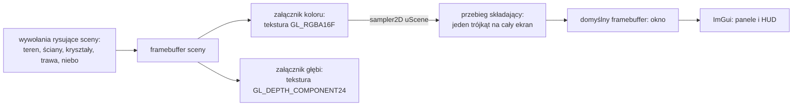
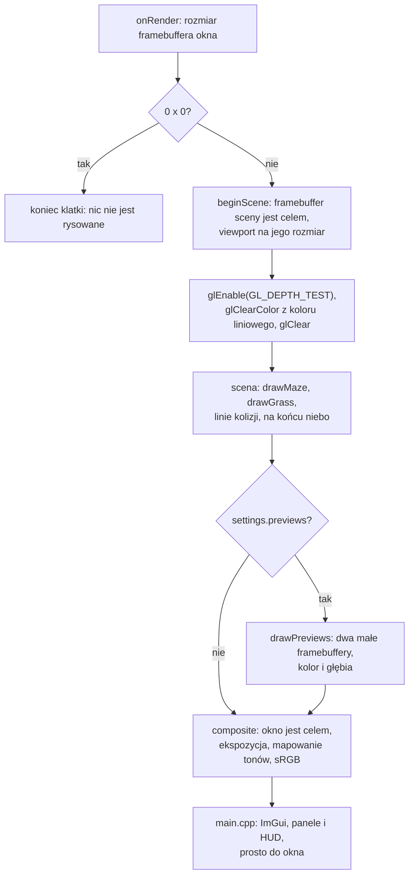

# Moduł renderer: post-process, scena w buforze HDR i przebieg składający

Kamień milowy: M7, część pierwsza (bufor HDR, przebieg składający, ekspozycja, mapowanie tonów, poprawna gamma, podgląd załączników). Bloom, mgła, winieta, cienie i minimapa to dalsze części M7 i **nie ma ich w kodzie**. Temat wykładu: 10 (Rendering pozaekranowy).
Kod: klasa [`src/game/PostProcess.hpp`](../../../src/game/PostProcess.hpp) i [`PostProcess.cpp`](../../../src/game/PostProcess.cpp), shadery [`assets/shaders/post/composite.vert`](../../../assets/shaders/post/composite.vert), [`post/composite.frag`](../../../assets/shaders/post/composite.frag), [`post/preview.frag`](../../../assets/shaders/post/preview.frag), wspólne pliki [`common/color.glsl`](../../../assets/shaders/common/color.glsl) i [`common/depth.glsl`](../../../assets/shaders/common/depth.glsl), obiekt framebuffera [`src/gfx/Framebuffer.hpp`](../../../src/gfx/Framebuffer.hpp), wywołania w [`src/game/NightMazeApp.cpp`](../../../src/game/NightMazeApp.cpp) (`onRender`), panel [`src/debug/panels/FramebuffersPanel.cpp`](../../../src/debug/panels/FramebuffersPanel.cpp), nazwy uniformów w [`src/game/ShaderUniforms.hpp`](../../../src/game/ShaderUniforms.hpp).

Dlaczego ten dokument stoi w katalogu `renderer`, chociaż klasa nazywa się `game::PostProcess` i leży w `src/game/`, wyjaśniają [`README.md`](README.md) i notatka [`../../decisions/post-process-in-game-layer.md`](../../decisions/post-process-in-game-layer.md). Dokument zakłada znajomość tekstur 2D ([`../gfx/textures.md`](../gfx/textures.md)), macierzy rzutowania i testu głębi ([`../scene/camera.md`](../scene/camera.md)) oraz dyrektywy `#include` w shaderach ([`../gfx/shader-includes.md`](../gfx/shader-includes.md)). Dwa tematy mają własne dokumenty i tutaj są tylko używane: obiekt framebuffera i klasę `gfx::Framebuffer` linia po linii opisuje [`../gfx/framebuffers.md`](../gfx/framebuffers.md), a przestrzeń sRGB, wartości liniowe i całą drogę koloru przez potok opisuje [`../gfx/color-space.md`](../gfx/color-space.md).

**Stan na dziś:** scena 3D nie jest już rysowana prosto do okna. Trafia do własnego framebuffera z teksturą koloru `GL_RGBA16F` i teksturą głębi `GL_DEPTH_COMPONENT24`, a do okna przenosi ją ostatni przebieg klatki, **przebieg składający** (composite): jeden trójkąt na cały ekran, który mnoży kolor przez ekspozycję, stosuje krzywą mapowania tonów i koduje wynik do sRGB. Panel **Framebuffers** ma suwak ekspozycji, listę krzywych, rozmiar i formaty bufora sceny oraz dwa podglądy: załącznika koloru i załącznika głębi. Programów shaderów jest osiem: doszły `composite` i `preview`.

Temat 10 wykładu jest **w trakcie**. PRD wymienia w nim: scenę w buforze HDR, post-process (bloom, mgła, winieta), minimapę i podgląd załączników. Z tej listy są: bufor HDR, przebieg składający i podgląd załączników. **Nie ma:** bloomu, mgły, winiety ani minimapy. Miejsca, w których dojdą, są oznaczone w sekcji 2.11.

Zgłoszone dla Windowsa (2026-10-05) dla tej części, nie powtórzone przy pisaniu tego dokumentu: bramka `make check` przechodzi (formatowanie, testy Debug i Release, clang-tidy), zero ostrzeżeń, 269 przypadków testowych i 102103 asercje w obu konfiguracjach. Build Debug bez błędów OpenGL przy otwartych podglądach, po zmianie rozmiaru okna na 1400 x 800 oraz po zminimalizowaniu (framebuffer 0 x 0) i przywróceniu. Liczba klatek w buildzie Release, bez synchronizacji pionowej, z ukrytymi panelami: około 2700 przed zmianą i około 2500 po niej w 1280 x 720, około 2020 przed i około 1960 po w 2560 x 1440. Wersji kompilatora, karty i sterownika dla tych pomiarów nie zapisano. **Nikt jeszcze nie kliknął myszą** nowych kontrolek, nie przeciągał krawędzi okna i nie użył `Reload shaders` przy ośmiu programach. **Na macOS ten kod nie był ani budowany, ani uruchamiany.** Szczegóły w sekcji 5.9.

## 1. Po co to jest

Do M6 każde wywołanie rysujące zapisywało piksele prosto do okna. Okno przechowuje 8 bitów na kanał, czyli liczby od 0 do 1 w 256 krokach. Wynikają z tego trzy ograniczenia, których nie da się obejść, dopóki celem rysowania jest okno:

| Ograniczenie okna | Skutek | Co daje własny bufor |
|---|---|---|
| wartości powyżej 1 są obcinane w chwili zapisu | kryształ dwa razy jaśniejszy od bieli i kryształ dziesięć razy jaśniejszy wyglądają tak samo, a informacja "o ile jaśniejszy" znika na zawsze | tekstura zmiennoprzecinkowa `GL_RGBA16F` przechowuje wartość taką, jaka wyszła z rachunku światła |
| obrazu sceny nie da się przeczytać jak tekstury | żaden efekt nie może pracować na gotowym obrazie: rozmycie, poświata, mgła z głębi | kolor i głębia sceny są zwykłymi teksturami, które następny przebieg czyta przez `sampler2D` |
| to, co zapisano, jest od razu tym, co widać | kodowanie do sRGB trzeba by robić w każdym shaderze sceny osobno | jedno miejsce na końcu klatki, w którym obraz jest dopasowywany do ekranu |

Rysowanie do tekstury zamiast do okna nazywa się **renderingiem pozaekranowym** (offscreen rendering). To temat 10 wykładu. W tej części daje on cztery rzeczy:

| Rzecz | Gdzie | Sekcja |
|---|---|---|
| framebuffer sceny z kolorem HDR i głębią jako teksturami | `gfx::Framebuffer`, tworzony przez `PostProcess::beginScene` | 2.1, 2.2, 5.4, klasa w [`../gfx/framebuffers.md`](../gfx/framebuffers.md) |
| przebieg składający: ekspozycja, mapowanie tonów, kodowanie do sRGB | `PostProcess::composite`, shadery `post/composite.*` | 2.4 do 2.7, 4.1, 4.2, 5.6 |
| poprawna gamma w całym potoku | tekstury sRGB, kolory wpisane liczbami przeliczane raz, kodowanie na końcu | 2.3, całość w [`../gfx/color-space.md`](../gfx/color-space.md) |
| podgląd obu załączników w panelu | `PostProcess::drawPreviews`, shader `post/preview.frag`, panel Framebuffers | 2.10, 4.3, 5.5, 6 |

Pokaz z PRD dla tego tematu to "podgląd załączników FBO". Jest w panelu Framebuffers (sekcja 6).

## 2. Teoria

### 2.1 Rendering pozaekranowy: scena jako tekstura

**Framebuffer** to cel rysowania: zestaw buforów, do których trafiają wyniki shadera fragmentów (kolor) i testu głębi (głębia). Okno ma swój, tak zwany **domyślny framebuffer** o numerze 0. Program może utworzyć własny obiekt framebuffera (FBO) i podpiąć do niego tekstury jako **załączniki** (attachments). Dopóki taki obiekt jest związany, te same wywołania rysujące wypełniają jego tekstury, a w oknie nic się nie zmienia.



Klatka ma więc dziś co najmniej dwa przebiegi (passes): przebieg sceny, który rysuje do tekstur, i przebieg składający, który czyta teksturę koloru i rysuje do okna. Każdy efekt post-processingu jest kolejnym takim przebiegiem: czyta wynik poprzedniego i zapisuje do własnego celu.

Jedna reguła obowiązuje każdy przebieg: **nie wolno czytać tekstury, do której się właśnie rysuje**. Wynik takiej pętli zwrotnej (feedback loop) jest niezdefiniowany. Dlatego podglądy mają własne małe framebuffery, a przebieg składający rysuje do okna. Sam obiekt framebuffera, załączniki, kompletność i wiązanie opisuje [`../gfx/framebuffers.md`](../gfx/framebuffers.md).

### 2.2 HDR: dlaczego wartości powyżej 1 mają znaczenie

**LDR** (low dynamic range) to obraz, w którym każdy kanał mieści się między 0 a 1: tyle umie pokazać ekran. **HDR** (high dynamic range) to obraz, w którym wartości nie mają górnej granicy: liczba mówi, ile jest światła, a nie jak jasny ma być piksel ekranu.

Rachunek światła produkuje wartości powyżej 1 w sposób naturalny. Przykład z gry, kryształ:

| Krok | Czerwony | Zielony | Niebieski |
|---|---|---|---|
| `LightingSettings::pointColor`, liczby sRGB z panelu | 0,2 | 0,9 | 0,8 |
| po `gfx::srgbToLinear` (w `NightMazeApp::crystalEmissive`) | 0,033 | 0,787 | 0,604 |
| razy `CRYSTAL_GLOW_STRENGTH = 2.5` (w `crystalGlow`, przy pełnym pulsie) | 0,083 | **1,969** | **1,510** |

Ta trójka trafia do shadera jako `uEmissive`, a kolor fragmentu to `tekstura * (światło rozproszone + uEmissive) + odbłysk`. Dla jasnego teksela kryształu zielony i niebieski kanał wychodzą więc wyraźnie powyżej 1, jeszcze zanim dojdzie latarka.

Co się z taką wartością dzieje, zależy od bufora:

| Bufor | Co przechowa dla (0,083, 1,969, 1,510) | Co jest stracone |
|---|---|---|
| okno, 8 bitów na kanał | (0,083, 1, 1) | to, że zielonego jest o 30 procent więcej niż niebieskiego, i to, że oba są jaśniejsze od bieli |
| `GL_RGBA16F` | (0,083, 1,969, 1,510) | nic |

Z wartością zachowaną w buforze da się potem zrobić trzy rzeczy, których obcięta wartość nie pozwala:

1. **Zmienić ekspozycję.** Po przyciemnieniu obrazu o połowę kryształ ma (0,04, 0,98, 0,76) i odzyskuje barwę. Z wartości (0,083, 1, 1) wyszłoby (0,04, 0,5, 0,5): szarawa plama o złej barwie.
2. **Sprowadzić zakres do ekranu krzywą**, która jasne partie ściska, zamiast je ucinać (mapowanie tonów, sekcja 2.6).
3. **Znaleźć to, co naprawdę świeci.** Efekt poświaty szuka pikseli jaśniejszych niż 1. W buforze LDR biała ściana w świetle latarki i kryształ są nie do odróżnienia. Komentarz przy `CRYSTAL_GLOW_STRENGTH` mówi wprost, że siła powyżej 1 jest wybrana także po to (bloom jest planowany, sekcja 2.11).

**Format `GL_RGBA16F`.** Każdy kanał to 16-bitowa liczba zmiennoprzecinkowa (half float): 1 bit znaku, 5 bitów wykładnika, 10 bitów mantysy. Największa wartość to około 65 tysięcy, więc dla sceny gry granicy w praktyce nie ma. Druga zaleta dotyczy ciemnych tonów: liczba zmiennoprzecinkowa ma tę samą względną dokładność blisko zera co blisko jedynki, a bajt ma w całym zakresie 256 równych kroków. Nocna scena żyje w wartościach liniowych rzędu 0,001 do 0,05 (sekcja 2.6), czyli tam, gdzie bajt miałby kilka poziomów. Cena: 8 bajtów na piksel zamiast 4, czyli 7,0 MiB dla 1280 x 720 i 28,1 MiB dla 2560 x 1440 (sam załącznik koloru, policzone z rozmiaru, nie zmierzone na karcie).

### 2.3 Gamma i przestrzeń sRGB: gdzie to jest opisane

Bufor sceny przechowuje wartości **liniowe**: proporcjonalne do ilości światła. Pliki obrazów, kolory z próbnika w panelu i ekran używają wartości **zakodowanych w sRGB**. Zamiana między nimi (potocznie "korekcja gamma") ma w tej części trzy etapy: karta dekoduje tekstury koloru przy odczycie (`GL_SRGB8`), shadery liczą na wartościach liniowych, a przebieg składający koduje wynik na samym końcu.

Cała teoria jest w osobnym dokumencie, [`../gfx/color-space.md`](../gfx/color-space.md): czym jest sRGB, dokładna funkcja z dwóch kawałków i jej odwrotność z przeliczonymi liczbami, które tekstury są sRGB, a które liniowe, gdzie przeliczany jest każdy kolor wpisany liczbami, typowe błędy i porównanie z poprzednim potokiem. Tam też opisane są pliki [`src/gfx/ColorSpace.hpp`](../../../src/gfx/ColorSpace.hpp), [`ColorSpace.cpp`](../../../src/gfx/ColorSpace.cpp), [`assets/shaders/common/color.glsl`](../../../assets/shaders/common/color.glsl) i testy [`tests/ColorSpaceTests.cpp`](../../../tests/ColorSpaceTests.cpp). Komentarz `// See docs/...` na górze tych plików wskazuje ten dokument (`post-process.md`), bo kodowanie do sRGB jest ostatnim krokiem przebiegu składającego. Kto trafił tu z kodu po teorię gammy, powinien przejść do [`../gfx/color-space.md`](../gfx/color-space.md).

W tym dokumencie zostaje tylko to, co dotyczy samego końca potoku: w którym miejscu shadera stoi kodowanie i dlaczego nie robi go OpenGL (sekcja 2.7).

### 2.4 Trójkąt pełnoekranowy

Przebieg składający nie rysuje sceny. Ma uruchomić shader fragmentów dokładnie raz dla każdego piksela okna. Potrzebna jest do tego geometria, która pokrywa cały ekran. Najprostsza to **jeden trójkąt większy niż ekran**.

Ekran w przestrzeni przycinania (clip space) to kwadrat od -1 do 1 w obu osiach. Trójkąt o wierzchołkach (-1, -1), (3, -1) i (-1, 3) zawiera ten kwadrat w całości:

```text
  y
  3 +                      wierzchołek 2: (-1, 3)
    |\
    | \
    |  \
  1 +---+.                 górna krawędź ekranu
    |   | \
    |EKR| \
    |AN |   \
 -1 +---+----+             wierzchołek 0: (-1, -1), wierzchołek 1: (3, -1)
   -1   1    3   x
```

Przeciwprostokątna biegnie przez punkty (1, 1), (3, -1) i (-1, 3), więc prawy górny narożnik ekranu leży dokładnie na niej. To, co wystaje poza kwadrat, karta odrzuca przy przycinaniu: fragmenty powstają tylko wewnątrz obszaru rysowania (viewport).

Wierzchołki nie pochodzą z bufora. Shader wierzchołków liczy je z wbudowanej zmiennej `gl_VertexID`, numeru wierzchołka w wywołaniu `glDrawArrays(GL_TRIANGLES, 0, 3)`:

| `gl_VertexID` | `% 2` | `/ 2` | `vUv = (x, y)` | pozycja `vUv * 2 - 1` | gdzie to jest |
|---|---|---|---|---|---|
| 0 | 0 | 0 | (0, 0) | (-1, -1) | lewy dolny narożnik ekranu |
| 1 | 1 | 0 | (2, 0) | (3, -1) | daleko za prawą krawędzią |
| 2 | 0 | 1 | (0, 2) | (-1, 3) | daleko nad górną krawędzią |

Reszta z dzielenia przez 2 to najmłodszy bit numeru, dzielenie całkowite przez 2 to następny bit. Dwa bity dają cztery kombinacje, z których trójkąt używa trzech.

**Współrzędne tekstury wychodzą same.** `vUv` w wierzchołkach to (0, 0), (2, 0) i (0, 2), a karta interpoluje je liniowo po trójkącie. Pozycja i `vUv` są związane wzorem `pozycja = vUv * 2 - 1`, więc w punkcie ekranu (-1, -1) jest `vUv = (0, 0)`, a w punkcie (1, 1) jest `vUv = (1, 1)`. Widoczna część trójkąta ma współrzędne od 0 do 1, czyli dokładnie całą teksturę sceny. Wartości do 2 istnieją tylko na częściach, które zostały odcięte.

Odpowiedzi na cztery pytania, które padają przy tym trójkącie:

| Pytanie | Odpowiedź |
|---|---|
| Dlaczego jeden trójkąt, a nie prostokąt z dwóch? | Dwa trójkąty mają wspólną przekątną. Piksele, przez które ona przechodzi, są obsługiwane na granicy dwóch prymitywów, a karta cieniuje fragmenty w blokach 2 x 2, więc wzdłuż przekątnej część pracy wykonuje dwa razy. Jeden trójkąt nie ma szwu. Do tego trzy wierzchołki zamiast sześciu (albo czterech z indeksami) i żadnych danych do wysłania |
| Dlaczego bez bufora wierzchołków? | Trzy narożniki są stałe i dają się policzyć z numeru wierzchołka. Bufor, opis atrybutów i ich wiązanie byłyby kodem bez treści |
| Dlaczego mimo to potrzebny jest VAO? | Profil Core OpenGL nie pozwala rysować bez związanego obiektu tablicy wierzchołków: `glDrawArrays` zgłasza wtedy `GL_INVALID_OPERATION`. `PostProcess` trzyma więc pusty `gfx::VertexArray` (pole `m_triangle`) bez żadnego atrybutu i wiąże go przed rysowaniem |
| Co z głębią i z odrzucaniem ścian? | Pozycja ma `z = 0` i `w = 1`, a przebieg wyłącza test głębi (`glDisable(GL_DEPTH_TEST)`), więc głębia nie gra roli. Odrzucanie tylnych ścian (`GL_CULL_FACE`) nie jest w grze włączane nigdzie: jedyne miejsce, które tego stanu dotyka, to `GrassRenderer`, który go zapamiętuje, wyłącza i przywraca. Trójkąt ma zresztą wierzchołki w kolejności przeciwnej do ruchu wskazówek zegara, czyli jest zwrócony przodem |

### 2.5 Ekspozycja

**Ekspozycja** to jedna liczba, przez którą mnożony jest kolor sceny, zanim trafi na krzywą mapowania tonów: `color *= uExposure`. Działa jak czas naświetlania w aparacie: scena zawiera tyle światła, ile zawiera, a ekspozycja decyduje, jaki wycinek tego zakresu wypadnie w środku skali ekranu.

| `uExposure` | Co robi | W języku fotografii |
|---|---|---|
| 0,5 | o połowę mniej światła | minus 1 stopień (EV) |
| 1,0 | nic, wartość startowa | 0 |
| 2,0 | dwa razy więcej światła | plus 1 stopień |
| 4,0 | cztery razy więcej | plus 2 stopnie |

Jeden stopień to podwojenie albo połowa. Dlatego suwak `Exposure` (od 0,1 do 8) jest **logarytmiczny**: krok z 0,5 na 1 i krok z 1 na 2 mają na nim tę samą długość, tak jak dla oka są tą samą zmianą jasności.

Mnożenie stoi **przed** krzywą i musi działać na wartościach liniowych. Dwa razy więcej światła to dwa razy większa liczba tylko wtedy, gdy liczba jest proporcjonalna do światła. Pomnożenie przez 2 wartości zakodowanej w sRGB zmieniłoby jasność ponad czterokrotnie.

Wartość startowa 1,0 jest częścią wyglądu sceny: komentarz przy `PostProcessSettings::exposure` mówi, że światła są dobrane pod nią. Automatycznego doboru ekspozycji (adaptacji oka) nie ma.

### 2.6 Mapowanie tonów: trzy krzywe

Po ekspozycji kolor nadal może być większy niż 1, a ekran pokaże najwyżej 1. **Mapowanie tonów** (tone mapping) to funkcja, która sprowadza zakres od 0 do nieskończoności do zakresu od 0 do 1. Gra ma trzy do wyboru (`game::ToneMapping`), wszystkie liczone **osobno dla każdego kanału**.

**None: obcięcie.** `clamp(color, 0.0, 1.0)`. Do 1 nic się nie zmienia, powyżej wszystko staje się jedynką. Tak zachowywało się okno przed tą częścią. Jasne partie tracą szczegóły i barwę.

**Reinhard.** Wzór `x / (1 + x)`.

| x | rachunek | wynik |
|---|---|---|
| 0 | 0 / 1 | 0 |
| 1 | 1 / 2 | 0,5 |
| 4 | 4 / 5 | 0,8 |
| 100 | 100 / 101 | 0,990 |

Wynik zbliża się do 1, ale nigdy jej nie osiąga, więc nic nie jest ucinane: dwie różne jasności zawsze dają dwa różne wyniki. Cena: krzywa leży **cała pod prostą** `y = x`. Dla małych x wynik jest prawie równy x (0,01 daje 0,0099), ale środek skali jest wyraźnie ściśnięty: biel o wartości 1 staje się szarością 0,5. Obraz wychodzi ciemniejszy i bardziej płaski.

**ACES (dopasowana).** Krzywa filmowa: krótki wzór, który Krzysztof Narkowicz dopasował do krzywej odniesienia przemysłu filmowego (Academy Color Encoding System). Komentarz w shaderze podaje rok 2015, wpis na blogu autora z tym wzorem ma datę 6 stycznia 2016. To iloraz dwóch wielomianów drugiego stopnia:

```text
            x * (A * x + B)
f(x) = -------------------------      A = 2,51  B = 0,03  C = 2,43  D = 0,59  E = 0,14
         x * (C * x + D) + E
```

Przeliczone przykłady:

| x | licznik | mianownik | wynik |
|---|---|---|---|
| 0,01 | 0,01 * (0,0251 + 0,03) = 0,000551 | 0,01 * (0,0243 + 0,59) + 0,14 = 0,146143 | 0,0038 |
| 0,18 | 0,18 * (0,4518 + 0,03) = 0,086724 | 0,18 * (0,4374 + 0,59) + 0,14 = 0,324932 | 0,267 |
| 1 | 1 * (2,51 + 0,03) = 2,54 | 1 * (2,43 + 0,59) + 0,14 = 3,16 | 0,804 |
| 2,5 | 2,5 * (6,275 + 0,03) = 15,7625 | 2,5 * (6,075 + 0,59) + 0,14 = 16,8025 | 0,938 |

Krzywa ma kształt litery S i przecina prostą `y = x` w dwóch miejscach, około 0,062 i około 0,73:

| Zakres wejścia | Co robi krzywa | Przykład |
|---|---|---|
| poniżej około 0,062 | **przyciemnia**, i to mocno | 0,01 daje 0,0038, czyli niecałe 40 procent wejścia |
| od około 0,062 do około 0,73 | rozjaśnia: środek skali dostaje więcej kontrastu | 0,18 daje 0,267 |
| powyżej około 0,73 | ściska: jasne wartości łagodnie dochodzą do 1 | 2,5 daje 0,938 |

Dwie własności wzoru, o które łatwo zostać zapytanym:

- Dla bardzo dużych x wynik dąży do `A / C = 2,51 / 2,43 = 1,033`, czyli **powyżej** 1. Krzywa osiąga 1 przy x równym około 7,24 i potem ją przekracza. Dlatego w shaderze wynik jest ujęty w `clamp(..., 0.0, 1.0)`: bez tego najjaśniejsze piksele wychodziłyby poza zakres.
- Stała `E = 0,14` w mianowniku sprawia, że dla małych x ułamek jest w przybliżeniu równy `x * B / E = 0,21 * x`. Stąd mocne przyciemnienie cieni. Komentarz w `composite.frag` mówi o ciemnych tonach "przyciśniętych trochę". Liczby mówią więcej: przy 0,01 zostaje 38 procent.

**Trzy krzywe obok siebie.** Wartość liniowa po ekspozycji, wynik każdej krzywej (jeszcze przed kodowaniem do sRGB):

| Wejście | None | Reinhard | ACES |
|---|---|---|---|
| 0,01 | 0,0100 | 0,0099 | 0,0038 |
| 0,05 | 0,0500 | 0,0476 | 0,0443 |
| 0,18 | 0,1800 | 0,1525 | 0,2669 |
| 0,5 | 0,5000 | 0,3333 | 0,6163 |
| 1 | 1 | 0,5000 | 0,8038 |
| 2 | 1 | 0,6667 | 0,9149 |
| 2,5 | 1 | 0,7143 | 0,9381 |
| 4 | 1 | 0,8000 | 0,9734 |
| 8 | 1 | 0,8889 | 1 |

Kryształ z sekcji 2.2, (0,083, 1,969, 1,510), przechodzi przez ACES jako (0,096, 0,913, 0,878): zielony i niebieski są blisko bieli, ale nadal różne, więc ścianki kryształu dają się odróżnić. Po obcięciu byłoby (0,083, 1, 1).

**Dlaczego ACES jest krzywą domyślną i co to znaczy dla nocnej sceny.** Wybór uzasadnia notatka [`../../decisions/aces-default-tone-mapping.md`](../../decisions/aces-default-tone-mapping.md). Skutek uboczny jest ważny dla tej gry. Nocna scena jest ciemna: światło otoczenia po przeliczeniu na wartości liniowe to (0,011, 0,016, 0,041), a pomnożone przez kolor kamienia daje wartości jeszcze mniejsze. Większość pikseli leży więc **poniżej** pierwszego przecięcia 0,062, czyli tam, gdzie ACES przyciemnia. Wartość 0,01 po ACES i po kodowaniu do sRGB pojawia się na ekranie jako 0,048, a po samym obcięciu jako 0,100: połowa jasności. Dlatego wartości startowe zostały w tej części dobrane od nowa razem z krzywą:

| Ustawienie | Przed M7 | Dziś | Gdzie |
|---|---|---|---|
| światło otoczenia (liczby sRGB) | (0,035, 0,045, 0,075), używane wprost | (0,105, 0,135, 0,225), liniowo (0,011, 0,016, 0,041) | `LightingSettings::ambient` |
| intensywność księżyca | 0,3 | 0,12 | `LightingSettings::moonIntensity` |
| intensywność latarki | 1,6 | 1,3 | `LightingSettings::flashlightIntensity` |
| intensywność światła kryształów | 2,0 | 0,9 | `LightingSettings::pointIntensity` |
| siła świecenia kryształu | 1,0 | 2,5 | `CRYSTAL_GLOW_STRENGTH` |
| jasność nieba | 1,0 (suwak do 3) | 2,2 (suwak do 6) | `SkyboxSettings::brightness` |
| kolor tła (liczby sRGB) | (0,01, 0,015, 0,04) | (0,022, 0,033, 0,088) | `NightMazeApp::m_clearColor` |

Liczb sprzed M7 i dzisiejszych nie da się porównać wprost: wtedy trafiały do rachunku jako wartości nieliniowe i wynik szedł na ekran bez kodowania, dziś kolory są najpierw przeliczane na liniowe, a wynik przechodzi przez krzywą i kodowanie ([`../gfx/color-space.md`](../gfx/color-space.md)).

**Ograniczenie krzywych liczonych na kanał.** Każdy kanał jest ściskany osobno, więc bardzo jasny kolor nasycony traci nasycenie i przesuwa barwę w stronę bieli: (0,083, 1,969, 1,510) ma proporcję zielonego do niebieskiego 1,30, a po ACES 1,04. Dla świecącego kryształu to pożądany wygląd (rozżarzony środek jest prawie biały), ale jest to własność metody, a nie wierne odwzorowanie barwy.

### 2.7 Kodowanie do sRGB: ostatnia linia i wyłączone `GL_FRAMEBUFFER_SRGB`

Po mapowaniu tonów kolor jest liniowy i mieści się między 0 a 1. Ekran oczekuje liczb zakodowanych w sRGB. Ostatnia linia `composite.frag` robi tę zamianę funkcją `linearToSrgb` z `common/color.glsl`:

```glsl
    fragColor = vec4(linearToSrgb(color), 1.0);
```

To jest **jedyne** miejsce, w którym klatka jest kodowana. Kolejność trzech kroków nie jest dowolna:

| Kolejność | Dlaczego |
|---|---|
| ekspozycja przed krzywą | mnożenie przez liczbę ma sens tylko na wartościach liniowych, a krzywa ma dostać zakres już przesunięty |
| krzywa przed kodowaniem | krzywe mapowania tonów są zdefiniowane na wartościach liniowych. Kodowanie przyjmuje zakres od 0 do 1, który dopiero krzywa zapewnia |
| kodowanie na końcu | po nim liczby przestają być proporcjonalne do światła i żaden rachunek na nich nie jest już poprawny |

OpenGL umie zakodować wynik sam: po `glEnable(GL_FRAMEBUFFER_SRGB)` każdy zapis do framebuffera, który jest oznaczony jako sRGB, przechodzi przez tę samą funkcję. Gra tego **nie** używa. `PostProcess::composite` woła wręcz `glDisable(GL_FRAMEBUFFER_SRGB)`, chociaż przełącznik jest domyślnie wyłączony: linia zapisuje w kodzie, że przebieg na tym polega. Powody w skrócie:

- **ImGui.** Panele i HUD są rysowane po przebiegu składającym do tego samego okna, a ich kolory to gotowe liczby sRGB. Z włączonym przełącznikiem zostałyby zakodowane drugi raz: motyw wyszedłby rozjaśniony i wyblakły.
- **Jedno zachowanie na dwóch systemach.** To, czy framebuffer okna jest sRGB, zależy od systemu i sterownika. Kodowanie w shaderze daje te same liczby wszędzie.
- **Podwójne kodowanie.** Gdyby okno było sRGB i przełącznik był włączony, obraz zakodowany przez shader zostałby zakodowany jeszcze raz.

Pełne uzasadnienie i rozważane możliwości są w notatce [`../../decisions/srgb-encode-in-shader.md`](../../decisions/srgb-encode-in-shader.md). Całą drogę koloru od pliku do ekranu opisuje [`../gfx/color-space.md`](../gfx/color-space.md).

### 2.8 Kolejność klatki



To samo jako lista kroków `NightMazeApp::onRender` (kod w sekcji 5.7):

| # | Krok | Cel rysowania |
|---|---|---|
| 1 | odczyt rozmiaru framebuffera okna. Przy 0 x 0 (zminimalizowane okno) cała klatka jest pomijana | brak |
| 2 | `m_postProcess.beginScene(framebuffer)`: tworzy bufor sceny przy pierwszej klatce i po zmianie rozmiaru, wiąże go i ustawia viewport. Gdy zwróci fałsz, klatka jest pomijana | framebuffer sceny |
| 3 | `glEnable(GL_DEPTH_TEST)`, kolor tła przeliczony przez `gfx::srgbToLinear`, `glClear` koloru i głębi | framebuffer sceny |
| 4 | macierze, światła, `drawMaze`, `drawGrass`, opcjonalnie `drawColliderLines` | framebuffer sceny |
| 5 | niebo, jako ostatnie wywołanie rysujące **sceny** | framebuffer sceny |
| 6 | `drawPreviews`, tylko gdy `m_postProcessSettings.previews` jest prawdą (otwarty panel Framebuffers) | dwa framebuffery podglądu |
| 7 | kopia ustawień dla widoków diagnostycznych (sekcja 2.9) | brak |
| 8 | `m_postProcess.composite(...)`: okno staje się celem, trójkąt pełnoekranowy przenosi obraz | okno |
| 9 | po powrocie z `onRender`: `DebugUI::draw` w [`src/main.cpp`](../../../src/main.cpp) rysuje panele i HUD | okno |

Miejsce na przyszłe przebiegi wskazuje komentarz w `onRender` między krokami 5 i 8: efekty liczone z gotowej sceny czytają tekstury bufora sceny i rysują do własnych framebufferów, a przebieg składający zostaje ostatni.

### 2.9 Widoki diagnostyczne omijają ekspozycję i krzywą

Lista `View` w panelu Assets ma dwa widoki, które nie pokazują światła, tylko **dane jako kolor**: normalne (`normal * 0.5 + 0.5`) i współrzędne tekstury. Liczba 0,5 w kanale ma znaczyć na ekranie dokładnie 0,5. Przebieg składający by to zepsuł w dwóch miejscach, więc każde z nich ma swoją poprawkę:

| Co by zepsuło wynik | Poprawka | Gdzie |
|---|---|---|
| kodowanie do sRGB: 0,5 wyszłoby na ekranie jako 0,735 | shader sceny zapisuje `srgbToLinear(dane)`, a kodowanie na końcu to znosi: `linearToSrgb(srgbToLinear(x)) = x` | `textured.frag`, `grass.frag`, `skybox.frag` |
| ekspozycja i krzywa: zmieniłyby liczby dowolnie | dla klatki w widoku diagnostycznym `onRender` robi **kopię** ustawień z ekspozycją 1 (`NEUTRAL_EXPOSURE`) i `ToneMapping::None` | `NightMazeApp::onRender` |

Kopia, a nie zmiana pól: suwak i lista w panelu Framebuffers nadal pokazują to, co ustawił użytkownik, i wracają do działania po przełączeniu widoku z powrotem na `Textured`. Zgłoszony wynik porównania z poprzednim commitem: widoki normalnych i UV różnią się najwyżej o 1 poziom na 255.

### 2.10 Podgląd załączników i głębia liniowa

Panel pokazuje dwa obrazy: załącznik koloru i załącznik głębi bufora sceny. ImGui rysuje teksturę bez żadnego przeliczenia, a żaden z załączników nie nadaje się do pokazania wprost: kolor jest liniowy i może przekraczać 1, głębia jest jedną liczbą o bardzo nierównym rozkładzie. Dlatego `PostProcess::drawPreviews` rysuje każdy załącznik trójkątem pełnoekranowym do **własnego małego framebuffera** `GL_RGBA8` (wysokość 180 pikseli, szerokość z proporcji sceny: 320 przy 16:9), shaderem `post/preview.frag`. Panel pokazuje teksturę koloru tego małego framebuffera.

**Podgląd koloru** to samo kodowanie: `linearToSrgb(texture(uSource, vUv).rgb)`. Bez ekspozycji i bez krzywej, bo ma pokazać **zawartość bufora**, a nie gotową klatkę. Funkcja `linearToSrgb` przycina wejście do zakresu od 0 do 1, więc wszystko, co w buforze jest jaśniejsze od 1, wychodzi jako biel. Stąd podpis `Colour (HDR, cut off at 1)`.

**Podgląd głębi** wymaga odwrócenia rzutowania. Tekstura głębi nie przechowuje odległości, tylko liczbę od 0 (płaszczyzna bliska) do 1 (płaszczyzna daleka), która zmienia się bardzo szybko blisko kamery i prawie wcale daleko. Funkcja `linearDepth` z `common/depth.glsl` zamienia ją z powrotem na metry. Wyprowadzenie krok po kroku, dla `n` (płaszczyzna bliska) i `f` (daleka):

**Krok 1: co robi macierz rzutowania.** `glm::perspective` buduje macierz, której trzeci i czwarty wiersz to (zapis jak na tablicy: wiersze, kolumny):

```text
wiersz 3:   0   0   -(f + n) / (f - n)   -2 f n / (f - n)
wiersz 4:   0   0   -1                    0
```

Punkt w przestrzeni kamery ma współrzędną `z_e`, ujemną przed kamerą (kamera patrzy wzdłuż -Z). Jego odległość od płaszczyzny kamery to `d = -z_e`. Po pomnożeniu przez macierz:

```text
z_clip = -(f + n) / (f - n) * z_e - 2 f n / (f - n)
       =  (f + n) / (f - n) * d   - 2 f n / (f - n)
w_clip = -z_e = d
```

**Krok 2: dzielenie perspektywiczne.** Karta dzieli przez `w_clip` i dostaje współrzędną znormalizowaną od -1 do 1:

```text
ndc = z_clip / w_clip = (f + n) / (f - n) - 2 f n / ((f - n) * d)
```

Odległość `d` stoi w **mianowniku**: stąd cała nieliniowość. Sprawdzenie na końcach: dla `d = n` wychodzi `(f + n - 2f) / (f - n) = -1`, dla `d = f` wychodzi `(f + n - 2n) / (f - n) = 1`.

**Krok 3: zapis do bufora.** Przy domyślnym `glDepthRange(0, 1)` (gra tego nie zmienia) do tekstury trafia `stored = (ndc + 1) / 2`, czyli zakres od 0 do 1.

**Krok 4: odwrócenie.** Najpierw z powrotem do `ndc`, potem równanie z kroku 2 rozwiązane względem `d`:

```text
ndc = 2 * stored - 1

ndc * (f - n) = (f + n) - 2 f n / d
2 f n / d     = (f + n) - ndc * (f - n)
d             = 2 f n / (f + n - ndc * (f - n))
```

To są dokładnie dwie linie funkcji `linearDepth`. Dla kamery gry (`scene::Camera`: `nearPlane = 0.1`, `farPlane = 100.0`):

| Odległość od płaszczyzny kamery | Wartość w teksturze głębi |
|---|---|
| 0,1 m (płaszczyzna bliska) | 0 |
| 0,2 m | 0,5005 |
| 1 m | 0,9009 |
| 2 m | 0,9510 |
| 5 m | 0,9810 |
| 15 m | 0,9943 |
| 100 m (płaszczyzna daleka) | 1 |

Połowa zakresu liczb jest zużyta na pierwsze 10 centymetrów za płaszczyzną bliską, a wszystko dalej niż 2 metry mieści się w ostatnich 5 procentach. Surowa głębia pokazana jako szarość byłaby więc prawie białym obrazem. Po przeliczeniu na metry shader dzieli wynik przez `uDepthRange` (suwak `Depth range`, startowo 15 m) i przycina do zakresu od 0 do 1: czerń to kamera, biel to 15 metrów i dalej.

Trzy uwagi do tego podglądu:

- **Niebo jest białe.** Skybox jest rysowany na głębi 1 ([`skybox.md`](skybox.md), sekcja 2.7), a `linearDepth(1)` zwraca dokładnie `f`, czyli 100 m, więcej niż każdy zakres suwaka poza samym końcem.
- **To nie jest odległość od oka w linii prostej**, tylko odległość od płaszczyzny kamery (wzdłuż kierunku patrzenia). Ściana prostopadła do kierunku patrzenia ma jedną szarość na całej szerokości, chociaż jej brzegi są dalej od oka niż środek.
- **Szarość nie jest kodowana do sRGB.** Komentarz w shaderze mówi dlaczego: to miara, a nie światło. Wartość 0,5 ma być na ekranie liczbą 0,5, czyli połową zakresu suwaka.

Tekstura głębi jest czytana przez zwykły `sampler2D` jako jedna liczba w kanale czerwonym, z filtrem `GL_NEAREST` ([`../gfx/framebuffers.md`](../gfx/framebuffers.md)). To, że głębia w ogóle jest teksturą, a nie renderbufferem, uzasadnia notatka [`../../decisions/depth-attachment-as-texture.md`](../../decisions/depth-attachment-as-texture.md).

### 2.11 Planowane: czego w tej części nie ma

Poniższe efekty są w PRD (temat 10 i potok renderowania) i **nie istnieją w kodzie**. Każdy dostanie tu własną sekcję razem z kodem swojej części M7. Na razie jedyne, co o nich wiadomo z kodu, to miejsce w kolejności, zapisane w komentarzu funkcji `main` w `composite.frag`:

| Efekt | Stan | Miejsce w kolejności według komentarza w `composite.frag` |
|---|---|---|
| **Planowane: bloom** (poświata wokół jasnych miejsc) | brak kodu | przed ekspozycją: efekt działa na samym świetle i potrzebuje wartości liniowych, które nie są obcięte |
| **Planowane: mgła** (z bufora głębi) | brak kodu | przed ekspozycją, z tego samego powodu. Funkcja `linearDepth` w `common/depth.glsl` jest wspólna właśnie po to, żeby czytać głębię w metrach |
| **Planowane: winieta** | brak kodu | po mapowaniu tonów, przed kodowaniem: efekt działa na gotowym obrazie |
| **Planowane: minimapa** (widok z góry w osobnym framebufferze) | brak kodu | osobny przebieg do własnego celu |
| **Planowane: cienie** (temat 11, shadow mapping) | brak kodu | osobne przebiegi przed sceną. `gfx::ColorFormat::None` (framebuffer z samą głębią) jest przygotowany, ale ta ścieżka nie została nigdy wykonana |

Nie ma też: bufora o połowie rozdzielczości (PRD wspomina o post-processie w połowie rozdzielczości jako o sposobie na wydajność), drugiego załącznika koloru, automatycznej ekspozycji.

## 3. Jak to działa w OpenGL

Wywołania jednej klatki, w kolejności. Tworzenie framebuffera (kroki oznaczone "raz") opisuje szczegółowo [`../gfx/framebuffers.md`](../gfx/framebuffers.md), tutaj jest tylko to, co widać z poziomu przebiegu.

**Początek sceny** (`beginScene`):

| # | Wywołanie | Co robi |
|---|---|---|
| 1 | konstruktor `gfx::Framebuffer` z `Rgba16F` i `Depth24`, raz na rozmiar okna | tworzy obiekt framebuffera i dwie tekstury, sprawdza kompletność, zostawia związany domyślny framebuffer |
| 2 | `glBindFramebuffer(GL_FRAMEBUFFER, id)` | od teraz rysowanie trafia do tekstur sceny |
| 3 | `glViewport(0, 0, width, height)` | obszar rysowania na cały bufor sceny. Viewport należy do kontekstu, nie do framebuffera |

**Scena** (`onRender`): `glEnable(GL_DEPTH_TEST)`, `glClearColor`, `glClear(GL_COLOR_BUFFER_BIT | GL_DEPTH_BUFFER_BIT)` i wywołania rysujące jak przed tą częścią. `glClear` czyści teraz dwie tekstury bufora sceny, nie okno.

**Podglądy** (`drawPreviews`, tylko przy otwartym panelu), dla każdego z dwóch obrazów:

| # | Wywołanie | Co robi |
|---|---|---|
| 4 | `glDisable(GL_DEPTH_TEST)` | jeden płaski trójkąt, nie ma z czym porównywać głębi |
| 5 | `glUseProgram(preview)`, `glUniform1i(uSource, 0)`, `glUniform1f` dla `uNear`, `uFar`, `uDepthRange` | program podglądu i jego stałe na tę klatkę |
| 6 | `glBindFramebuffer(GL_FRAMEBUFFER, podgląd)` z `glViewport` na jego rozmiar | celem jest mały framebuffer `GL_RGBA8` |
| 7 | `glActiveTexture(GL_TEXTURE0)`, `glBindTexture(GL_TEXTURE_2D, załącznik)`, `glBindSampler(0, 0)` | tekstura koloru albo głębi sceny na jednostce 0, bez obiektu samplera |
| 8 | `glUniform1i(uMode, 0 albo 1)` | co pokazuje ten obraz |
| 9 | `glBindVertexArray(pusty VAO)`, `glDrawArrays(GL_TRIANGLES, 0, 3)` | trójkąt pełnoekranowy |

**Przebieg składający** (`composite`):

| # | Wywołanie | Co robi |
|---|---|---|
| 10 | `glBindFramebuffer(GL_FRAMEBUFFER, 0)` z `glViewport` na rozmiar framebuffera okna | celem znowu jest okno |
| 11 | `glDisable(GL_DEPTH_TEST)` | bufor głębi okna nie jest już nigdy czyszczony, więc test mógłby odrzucić trójkąt |
| 12 | `glDisable(GL_FRAMEBUFFER_SRGB)` | OpenGL nie koduje przy zapisie: robi to shader |
| 13 | `glUseProgram(composite)`, `glUniform1i(uScene, 0)` | sampler dostaje numer jednostki |
| 14 | `glActiveTexture(GL_TEXTURE0)`, `glBindTexture(GL_TEXTURE_2D, kolor sceny)`, `glBindSampler(0, 0)` | tekstura HDR na jednostce 0 |
| 15 | `glUniform1f(uExposure, ...)`, `glUniform1i(uToneMapping, ...)` | dwa ustawienia z panelu |
| 16 | `glBindVertexArray(pusty VAO)`, `glDrawArrays(GL_TRIANGLES, 0, 3)` | trójkąt pełnoekranowy do okna |

Okno **nie jest czyszczone** przed krokiem 16: trójkąt pokrywa każdy piksel, więc `glClear` byłoby pracą wyrzuconą.

**Krok 7 i 14: dlaczego `glBindSampler(unit, 0)`.** Każda `Texture2D` zostawia na jednostce swój obiekt samplera z `GL_REPEAT` i mipmapami ([`../gfx/textures.md`](../gfx/textures.md), sekcja 2.8). Obiekt samplera należy do jednostki i zastępuje parametry każdej tekstury przez nią czytanej. Tekstura załącznika ma jeden poziom, więc czytana cudzym samplerem z filtrem mipmap byłaby niekompletna i dałaby czerń. `Framebuffer::bindColorTexture` i `bindDepthTexture` odpinają więc sampler i tekstura jest czytana własnymi parametrami.

**Co zostaje po klatce.** Związany domyślny framebuffer, viewport na rozmiar okna, test głębi **wyłączony**, na jednostce 0 tekstura koloru sceny bez obiektu samplera, związany pusty VAO, program `composite` w użyciu. Następna klatka włącza test głębi sama (krok 3 tabeli w sekcji 2.8), a każdy przebieg sceny wiąże swoje tekstury, swój VAO i swój program.

Wszystkie użyte funkcje są w rdzeniu OpenGL 4.1: obiekty framebuffera i tekstury zmiennoprzecinkowe od 3.0, obiekty samplera od 3.3, `gl_VertexID` w GLSL od 1.30.

## 4. Shadery

Trzy pliki w `assets/shaders/post/` tworzą dwa programy: `composite` (`composite.vert` + `composite.frag`) i `preview` (`composite.vert` + `preview.frag`). Shader wierzchołków jest wspólny. Dwa pliki dołączane leżą w `assets/shaders/common/`: `color.glsl` (opisany w [`../gfx/color-space.md`](../gfx/color-space.md)) i `depth.glsl` (sekcja 4.4).

### 4.1 `composite.vert`

```glsl
#version 410 core
// Vertex shader of the post-processing passes: one triangle that covers the whole
// screen, made without any vertex data.
// See docs/modules/renderer/post-process.md

// There is no input. The draw call is glDrawArrays(GL_TRIANGLES, 0, 3) with a vertex
// array object that has no attributes (a Core profile still needs one bound), and the
// three corners are computed from gl_VertexID, the number of the vertex: 0, 1, 2.

// Output to the fragment shader: the texture coordinate of the screen, (0, 0) in the
// bottom left corner and (1, 1) in the top right one.
out vec2 vUv;

void main() {
    // Vertex 0 -> (0, 0), vertex 1 -> (2, 0), vertex 2 -> (0, 2). The first line takes
    // bit 0 of the number for x, the second bit 1 for y.
    float x = float(gl_VertexID % 2) * 2.0;
    float y = float(gl_VertexID / 2) * 2.0;
    vUv = vec2(x, y);

    // From 0..2 to -1..3 in clip space: the corners (-1, -1), (3, -1) and (-1, 3). The
    // screen is the square from -1 to 1, and this one triangle covers it completely.
    // What sticks out is clipped away. One triangle instead of two that share
    // a diagonal: no pixel is shaded twice along a seam. Depth 0 and w 1: the pass is
    // drawn with the depth test off.
    gl_Position = vec4(vUv * 2.0 - 1.0, 0.0, 1.0);
}
```

| Linia | Znaczenie |
|---|---|
| brak `layout(location = ...) in ...` | shader nie ma żadnego wejścia. To jedyny shader wierzchołków gry bez atrybutów |
| `out vec2 vUv;` | współrzędna tekstury ekranu, interpolowana dla każdego fragmentu. Nazwa i typ muszą się zgadzać z `in vec2 vUv;` w obu shaderach fragmentów |
| `gl_VertexID` | wbudowana zmienna typu `int`: numer wierzchołka w wywołaniu rysującym. Dla `glDrawArrays(GL_TRIANGLES, 0, 3)` to 0, 1, 2 |
| `float(gl_VertexID % 2) * 2.0` | bit 0 numeru, zamieniony na `float` i pomnożony przez 2: daje 0, 2, 0 |
| `float(gl_VertexID / 2) * 2.0` | dzielenie całkowite, czyli bit 1: daje 0, 0, 2 |
| `vUv = vec2(x, y);` | (0, 0), (2, 0), (0, 2). Na widocznej części trójkąta wartości są od 0 do 1 (sekcja 2.4) |
| `gl_Position = vec4(vUv * 2.0 - 1.0, 0.0, 1.0);` | z zakresu 0 do 2 na zakres -1 do 3. `w = 1`, więc dzielenie perspektywiczne nic nie zmienia. `z = 0` to środek zakresu głębi, bez znaczenia przy wyłączonym teście |

W shaderze nie ma żadnej macierzy: trójkąt jest podany od razu w przestrzeni przycinania.

### 4.2 `composite.frag`

```glsl
#version 410 core
// Fragment shader of the composite pass, the last pass of a frame: reads the picture of
// the scene from the HDR texture and writes it to the window as colours a screen can
// show.
// See docs/modules/renderer/post-process.md

// linearToSrgb. The path is relative to this file.
#include "../common/color.glsl"

// Input from composite.vert: the texture coordinate of this pixel of the screen.
in vec2 vUv;

// The picture of the scene: linear colours, not limited to 1 (GL_RGBA16F). A sampler
// holds the number of a texture unit, set from C++ with glUniform1i.
uniform sampler2D uScene;

// The colours are multiplied by this number first, like a longer or a shorter exposure
// of a camera: 1 changes nothing, 2 doubles the light.
uniform float uExposure;

// How the range of the scene is brought into 0..1. The numbers are the values of
// game::ToneMapping in C++.
//   0: none, values above 1 are cut off
//   1: Reinhard
//   2: ACES (a fitted curve)
uniform int uToneMapping;

// Output: the color written to the window (red, green, blue, alpha).
out vec4 fragColor;
```

| Linia | Znaczenie |
|---|---|
| `#include "../common/color.glsl"` | dyrektywa własnego loadera, nie GLSL ([`../gfx/shader-includes.md`](../gfx/shader-includes.md)). Ścieżka jest względna do pliku, który ją zawiera: plik leży w `post/`, więc wychodzi poziom wyżej. Shadery sceny dołączają ten sam plik jako `"common/color.glsl"` |
| `uniform sampler2D uScene;` | sampler trzyma numer jednostki teksturującej. Typ `sampler2D` działa także dla tekstury zmiennoprzecinkowej: `texture()` zwraca wtedy wartości bez ograniczenia do 1 |
| `uniform float uExposure;` | mnożnik z suwaka `Exposure` |
| `uniform int uToneMapping;` | liczba z listy `Tone mapping`. Wartości 0, 1, 2 to wartości `enum class ToneMapping` rzutowane na `int` |
| `out vec4 fragColor;` | jedyny shader gry, którego wyjście trafia do okna. Wszystkie pozostałe piszą do bufora sceny albo do podglądu |

Dwie krzywe:

```glsl
// Reinhard: x / (1 + x), per channel. 0 stays 0, 1 becomes one half, and however bright
// the input is, the result stays below 1: nothing is cut off, bright areas keep detail.
// The price is that the whole picture gets darker and flatter.
vec3 toneMapReinhard(vec3 color) {
    return color / (vec3(1.0) + color);
}

// ACES: the look of the film industry reference curve, as the short formula Krzysztof
// Narkowicz fitted to it (2015). A quotient of two quadratic polynomials shaped like an
// S: dark tones are pressed down a little (more contrast), the middle is almost
// straight, and bright values bend softly towards 1. The five numbers are the fit.
vec3 toneMapAces(vec3 color) {
    const float A = 2.51;
    const float B = 0.03;
    const float C = 2.43;
    const float D = 0.59;
    const float E = 0.14;
    return clamp((color * (A * color + B)) / (color * (C * color + D) + E), 0.0, 1.0);
}
```

| Linia | Znaczenie |
|---|---|
| `color / (vec3(1.0) + color)` | dzielenie wektorów w GLSL działa składowa po składowej: trzy osobne ułamki dla czerwonego, zielonego i niebieskiego |
| `const float A = 2.51;` i cztery następne | pięć liczb dopasowania. Nie mają znaczenia fizycznego: to współczynniki, przy których krótki wzór najlepiej przybliża krzywą odniesienia |
| `(color * (A * color + B)) / (color * (C * color + D) + E)` | iloraz dwóch wielomianów drugiego stopnia, na kanał. Przeliczone przykłady są w sekcji 2.6 |
| `clamp(..., 0.0, 1.0)` | konieczne: granica wzoru to `A / C = 1,033`, a 1 jest przekraczana od około 7,24 |

Komentarz mówi "przyciśnięte trochę" o ciemnych tonach i "środek prawie prosty". Liczby z sekcji 2.6 pokazują, że przy wartości 0,01 zostaje 38 procent wejścia, a środek skali jest podniesiony (0,18 daje 0,267). Na obronie trzymam się liczb.

Funkcja główna:

```glsl
void main() {
    // The steps run in a fixed order, and each one works on the result of the one
    // before. Later effects have their place in it:
    //
    //   1. the scene, in linear HDR colours
    //      (effects that work on light itself, like fog and bloom, are added here,
    //      before the exposure: they need linear values that are not cut off)
    //   2. exposure
    //   3. tone mapping: from 0..infinity to 0..1
    //      (effects that work on the finished picture, like a vignette, come here)
    //   4. encoding to sRGB, always last
    vec3 color = texture(uScene, vUv).rgb;

    color *= uExposure;

    if (uToneMapping == 1) {
        color = toneMapReinhard(color);
    } else if (uToneMapping == 2) {
        color = toneMapAces(color);
    } else {
        color = clamp(color, 0.0, 1.0);
    }

    // The screen expects sRGB encoded numbers. This is the one place where the frame
    // is encoded (gamma correction). GL_FRAMEBUFFER_SRGB stays off, so OpenGL does not
    // encode a second time, and the debug UI, drawn after this pass straight into the
    // window, keeps the colours of its theme.
    fragColor = vec4(linearToSrgb(color), 1.0);
}
```

| Linia | Znaczenie |
|---|---|
| komentarz z czterema krokami | zapisana kolejność i miejsca na efekty, których jeszcze nie ma (sekcja 2.11) |
| `vec3 color = texture(uScene, vUv).rgb;` | odczyt piksela sceny. Bufor sceny ma rozmiar framebuffera okna, więc jeden piksel ekranu to jeden teksel i filtr liniowy niczego nie miesza. Alfa bufora sceny nie jest używana |
| `color *= uExposure;` | krok 2. Na wartościach liniowych |
| `if (uToneMapping == 1) ... else if (== 2) ... else` | krok 3. Gałąź `else` łapie 0 i każdą inną liczbę: obcięcie jest zachowaniem bezpiecznym |
| `color = clamp(color, 0.0, 1.0);` | tryb `None`. Samo `linearToSrgb` też przycina, więc ta linia nie zmienia obrazu. Zapisuje wprost, co ten tryb robi |
| `fragColor = vec4(linearToSrgb(color), 1.0);` | krok 4, jedyne kodowanie klatki. Alfa 1: okno nie jest przezroczyste |

`if` na uniformie nie kosztuje tyle co `if` na danych piksela: warunek jest ten sam dla wszystkich fragmentów klatki.

### 4.3 `preview.frag`

```glsl
#version 410 core
// Fragment shader of the attachment previews: turns the colour texture or the depth
// texture of the scene framebuffer into a small picture the debug UI can show as it is.
// Used with post/composite.vert.
// See docs/modules/renderer/post-process.md

// linearToSrgb and linearDepth. The paths are relative to this file.
#include "../common/color.glsl"
#include "../common/depth.glsl"

// Input from composite.vert: the texture coordinate of this pixel.
in vec2 vUv;

// The attachment to show (the number of a texture unit): the colour texture in mode 0,
// the depth texture in mode 1.
uniform sampler2D uSource;

// What uSource is. The numbers are the values of game::AttachmentPreview in C++.
//   0: HDR colour
//   1: depth
uniform int uMode;

// For the depth: the clipping planes of the camera and the distance in metres that is
// shown as white.
uniform float uNear;
uniform float uFar;
uniform float uDepthRange;

// Output: the color written to the preview texture (red, green, blue, alpha).
out vec4 fragColor;

void main() {
    if (uMode == 1) {
        // The stored depth as it is would be an almost white picture: everything
        // farther than a few metres is above 0.95 (see linearDepth). So it is turned
        // back into metres and shown from black (at the camera) to white (uDepthRange
        // metres away or more). The sky, at the far plane, is white. The grey is
        // written as it is: it is a measure, not light, so it is not encoded.
        float metres = linearDepth(texture(uSource, vUv).r, uNear, uFar);
        fragColor = vec4(vec3(clamp(metres / uDepthRange, 0.0, 1.0)), 1.0);
    } else {
        // The colour attachment holds linear values that may be above 1. The debug UI
        // draws a texture without any conversion, so the picture is encoded here.
        // Without exposure and tone mapping: this is the content of the buffer, with
        // everything above 1 cut off, not the finished frame.
        fragColor = vec4(linearToSrgb(texture(uSource, vUv).rgb), 1.0);
    }
}
```

| Linia | Znaczenie |
|---|---|
| `uniform sampler2D uSource;` | jeden sampler dla obu trybów. Tekstura głębi czytana przez `sampler2D` zwraca głębię w kanale czerwonym |
| `uniform int uMode;` | 0 albo 1, wartości `enum class AttachmentPreview` |
| `uNear`, `uFar` | płaszczyzny przycinania kamery, którą narysowano scenę. Muszą być te same, inaczej metry wyjdą złe |
| `texture(uSource, vUv).r` | głębia zapisana w teksturze, od 0 do 1 |
| `linearDepth(..., uNear, uFar)` | z powrotem na metry (sekcje 2.10 i 4.4) |
| `clamp(metres / uDepthRange, 0.0, 1.0)` | 0 m to czerń, `uDepthRange` metrów i więcej to biel |
| `vec4(vec3(szarość), 1.0)` | ta sama liczba w trzech kanałach. Bez `linearToSrgb` |
| gałąź `else` | podgląd koloru: samo kodowanie, które przy okazji przycina do 1 |

Podgląd ma 320 x 180 pikseli, a bufor sceny 1280 x 720 albo więcej, więc tu filtr liniowy tekstury koloru **pracuje**: każdy piksel podglądu jest mieszanką czterech sąsiednich tekseli sceny (przy pomniejszeniu większym niż dwukrotne część tekseli jest pomijana, bo załącznik nie ma mipmap). Głębia jest czytana filtrem najbliższego sąsiada.

### 4.4 `common/depth.glsl`

```glsl
float linearDepth(float stored, float near, float far) {
    float ndc = 2.0 * stored - 1.0;
    return 2.0 * near * far / (far + near - ndc * (far - near));
}
```

Plik nie ma linii `#version`: nie jest shaderem, tylko tekstem wklejanym w miejsce `#include`. Dwie linie funkcji to kroki 3 i 4 wyprowadzenia z sekcji 2.10. Komentarz nad funkcją podaje przykład "ściana 2 m dalej ma już 0,95": zgadza się z tabelą (0,9510 dla płaszczyzn 0,1 m i 100 m). Dziś jedynym użytkownikiem jest `preview.frag`.

### 4.5 Strona C++: kto ustawia uniformy

Nazwy uniformów są stałymi w [`src/game/ShaderUniforms.hpp`](../../../src/game/ShaderUniforms.hpp):

| Uniform | Stała | Kto ustawia | Skąd wartość |
|---|---|---|---|
| `uScene` | `COMPOSITE_SCENE_UNIFORM` | `PostProcess::composite`, `setInt` | `SOURCE_TEXTURE_UNIT`, czyli 0 |
| `uExposure` | `COMPOSITE_EXPOSURE_UNIFORM` | `PostProcess::composite`, `setFloat` | `PostProcessSettings::exposure` (albo 1 w widoku diagnostycznym) |
| `uToneMapping` | `COMPOSITE_TONE_MAPPING_UNIFORM` | `PostProcess::composite`, `setInt` | `PostProcessSettings::toneMapping` rzutowane na `int` |
| `uSource` | `PREVIEW_SOURCE_UNIFORM` | `PostProcess::drawPreviews`, `setInt` | `SOURCE_TEXTURE_UNIT`, czyli 0 |
| `uMode` | `PREVIEW_MODE_UNIFORM` | `PostProcess::drawPreviews`, `setInt`, dwa razy w klatce | `AttachmentPreview::Color` i `AttachmentPreview::Depth` |
| `uNear`, `uFar` | `PREVIEW_NEAR_UNIFORM`, `PREVIEW_FAR_UNIFORM` | `PostProcess::drawPreviews`, `setFloat` | `m_camera.nearPlane`, `m_camera.farPlane` |
| `uDepthRange` | `PREVIEW_DEPTH_RANGE_UNIFORM` | `PostProcess::drawPreviews`, `setFloat` | `PostProcessSettings::depthPreviewRange` |

Osiem nowych stałych. Programy powstają w konstruktorze `NightMazeApp` jako pola `m_compositeShader` i `m_previewShader`, oba z tym samym plikiem wierzchołków (`FULLSCREEN_VERTEX_SHADER_FILE`, czyli `shaders/post/composite.vert`).

## 5. Kod w projekcie

### 5.1 Pliki

| Plik | Co zawiera |
|---|---|
| [`src/game/PostProcess.hpp`](../../../src/game/PostProcess.hpp) | `enum class ToneMapping`, `enum class AttachmentPreview`, `struct PostProcessSettings`, klasa `PostProcess` |
| [`src/game/PostProcess.cpp`](../../../src/game/PostProcess.cpp) | cztery stałe, funkcja pomocnicza `fitPreview`, implementacja klasy |
| [`assets/shaders/post/composite.vert`](../../../assets/shaders/post/composite.vert) | trójkąt pełnoekranowy, wspólny dla obu programów |
| [`assets/shaders/post/composite.frag`](../../../assets/shaders/post/composite.frag) | ekspozycja, mapowanie tonów, kodowanie do sRGB |
| [`assets/shaders/post/preview.frag`](../../../assets/shaders/post/preview.frag) | podgląd koloru i głębi |
| [`assets/shaders/common/depth.glsl`](../../../assets/shaders/common/depth.glsl) | `linearDepth` |
| [`assets/shaders/common/color.glsl`](../../../assets/shaders/common/color.glsl) | `srgbToLinear`, `linearToSrgb` w GLSL ([`../gfx/color-space.md`](../gfx/color-space.md)) |
| [`src/gfx/Framebuffer.hpp`](../../../src/gfx/Framebuffer.hpp), [`.cpp`](../../../src/gfx/Framebuffer.cpp) | obiekt framebuffera ([`../gfx/framebuffers.md`](../gfx/framebuffers.md)) |
| [`src/game/NightMazeApp.hpp`](../../../src/game/NightMazeApp.hpp), [`.cpp`](../../../src/game/NightMazeApp.cpp) | pola `m_compositeShader`, `m_previewShader`, `m_postProcess`, `m_postProcessSettings`, akcesory `compositeShader()`, `previewShader()`, `postProcessSettings()`, `postProcess()`, funkcja `crystalEmissive`, stała `NEUTRAL_EXPOSURE`, kolejność klatki w `onRender` |
| [`src/game/ShaderUniforms.hpp`](../../../src/game/ShaderUniforms.hpp) | osiem nazw uniformów (sekcja 4.5) |
| [`src/debug/panels/FramebuffersPanel.hpp`](../../../src/debug/panels/FramebuffersPanel.hpp), [`.cpp`](../../../src/debug/panels/FramebuffersPanel.cpp) | panel Framebuffers (sekcja 6) |
| [`src/debug/DebugContext.hpp`](../../../src/debug/DebugContext.hpp), [`src/debug/DebugUI.cpp`](../../../src/debug/DebugUI.cpp), [`src/main.cpp`](../../../src/main.cpp) | cztery nowe pola kontekstu (`compositeShader`, `previewShader`, `postProcessSettings`, `postProcess`), zerowanie flagi `previews`, wywołanie panelu ([`../debug-ui.md`](../debug-ui.md)) |

`PostProcess.*` jest na liście źródeł programu `night_maze` w [`CMakeLists.txt`](../../../CMakeLists.txt), obok pozostałych klas rysujących: potrzebuje okna i kontekstu OpenGL, więc nie należy do bibliotek, które da się testować. `Framebuffer.*` i `ColorSpace.*` są w bibliotece `engine`.

### 5.2 Ustawienia i dwa wyliczenia

```cpp
enum class ToneMapping {
    None = 0,     ///< no curve: everything above 1 is cut off (clamped)
    Reinhard = 1, ///< x / (1 + x): nothing is cut off, the picture gets flatter
    Aces = 2,     ///< a fitted film curve: more contrast, bright values bend softly to 1
};

enum class AttachmentPreview {
    Color = 0, ///< the HDR colour attachment
    Depth = 1, ///< the depth attachment, as a distance
};

struct PostProcessSettings {
    float exposure = 1.0F;
    ToneMapping toneMapping = ToneMapping::Aces;
    bool previews = false;
    float depthPreviewRange = 15.0F;
};
```

(Komentarze nad polami struktury są tu pominięte, ich treść jest w tabeli.)

| Element | Dlaczego tak |
|---|---|
| jawne wartości `= 0`, `= 1`, `= 2` | liczby są umową z shaderem (`uToneMapping`, `uMode`) i z kolejnością wpisów listy w panelu. Zapisane wprost, żeby dopisanie wpisu w środku nie przesunęło pozostałych po cichu |
| `exposure = 1.0F` | mnożenie przez 1 nic nie zmienia. Światła sceny są dobrane pod tę wartość |
| `toneMapping = ToneMapping::Aces` | krzywa domyślna ([`../../decisions/aces-default-tone-mapping.md`](../../decisions/aces-default-tone-mapping.md)) |
| `previews = false` | podglądy kosztują dwa małe przebiegi, więc są rysowane tylko wtedy, gdy ktoś na nie patrzy. Pole ustawia interfejs debugowania **co klatkę** (sekcja 6.2) |
| `depthPreviewRange = 15.0F` | 15 metrów jako biel: siedem i pół komórki labiryntu, czyli mniej więcej to, co widać w korytarzu |

Struktura jest polem `NightMazeApp::m_postProcessSettings`, a panel edytuje ją przez referencję z `DebugContext`.

### 5.3 Klasa `PostProcess`

```cpp
class PostProcess {
public:
    PostProcess() = default;

    bool beginScene(core::Size size);

    void drawPreviews(const gfx::Shader& shader, const PostProcessSettings& settings,
                      float nearPlane, float farPlane);

    void composite(const gfx::Shader& shader, const PostProcessSettings& settings,
                   core::Size windowSize) const;

    const gfx::Framebuffer& sceneTarget() const { return m_scene; }

    const gfx::Framebuffer& preview(AttachmentPreview which) const {
        return which == AttachmentPreview::Depth ? m_depthPreview : m_colorPreview;
    }

private:
    void drawFullscreenTriangle() const;

    gfx::Framebuffer m_scene;
    core::Size m_requestedSize;

    gfx::Framebuffer m_colorPreview;
    gfx::Framebuffer m_depthPreview;

    gfx::VertexArray m_triangle;
};
```

(Komentarze Doxygen są tu pominięte. Ich treść jest omówiona w sekcjach 5.4 do 5.6.)

| Element | Dlaczego tak |
|---|---|
| `PostProcess() = default;` | konstruktor nie tworzy framebufferów: rozmiar okna nie jest jeszcze potrzebny. Trzy pola `gfx::Framebuffer` zaczynają jako obiekty puste (`isValid()` zwraca fałsz). Jedyny obiekt OpenGL, który powstaje od razu, to `m_triangle`: konstruktor domyślny `gfx::VertexArray` tworzy VAO |
| programy shaderów jako parametry, nie pola | programy są polami `NightMazeApp`, tak jak wszystkie pozostałe, bo panel Shaders przeładowuje je z jednej listy. Ten sam układ ma `game::Skybox` |
| `beginScene` zwraca `bool` | wołający musi wiedzieć, czy jest do czego rysować |
| `composite` jest `const`, `drawPreviews` nie | `drawPreviews` tworzy i zmienia rozmiar framebufferów podglądu (pola obiektu). `composite` zmienia tylko stan kontekstu OpenGL |
| `sceneTarget()` | dla przyszłych przebiegów, które czytają kolor albo głębię sceny, i dla panelu (rozmiar i formaty) |
| `preview(which)` | panel dostaje framebuffer podglądu i pokazuje jego teksturę koloru |
| `m_requestedSize` osobno od rozmiaru `m_scene` | sekcja 5.4 |
| `gfx::VertexArray m_triangle;` | pusty VAO dla trójkąta pełnoekranowego (sekcja 2.4) |

Kopiowanie klasy nie jest zadeklarowane i nie jest możliwe: pola `gfx::Framebuffer` i `gfx::VertexArray` mają kopiowanie usunięte, więc kompilator nie wygeneruje go też dla `PostProcess`. Obiekt jest polem `NightMazeApp::m_postProcess`, ostatnim z obiektów OpenGL (po `m_skybox`), więc powstaje po oknie i ginie przed nim.

Stałe pliku `.cpp`:

```cpp
// The texture unit the passes read their input from. Every pass binds what it needs.
constexpr GLuint SOURCE_TEXTURE_UNIT = 0;

// One triangle: three vertices, starting with number 0.
constexpr GLint FIRST_VERTEX = 0;
constexpr GLsizei TRIANGLE_VERTEX_COUNT = 3;

// Height of a preview picture in pixels. The width follows from the shape of the
// window. Small on purpose: the debug UI shows the pictures at about this size.
constexpr int PREVIEW_HEIGHT = 180;
```

### 5.4 `beginScene`

```cpp
bool PostProcess::beginScene(core::Size size) {
    if (size.width < 1 || size.height < 1) {
        return false;
    }

    // A new size: the first frame, or the window was resized.
    if (size.width != m_requestedSize.width || size.height != m_requestedSize.height) {
        m_requestedSize = size;
        // GL_RGBA16F for the colour: linear values that may pass 1 (HDR). A depth
        // texture and not a renderbuffer, so that later passes can read the depth.
        // A new object instead of resize(): it also covers the first frame and a
        // framebuffer that could not be created at the size before.
        m_scene = gfx::Framebuffer({.width = size.width,
                                    .height = size.height,
                                    .color = gfx::ColorFormat::Rgba16F,
                                    .depth = gfx::DepthFormat::Depth24});
    }
    if (!m_scene.isValid()) {
        return false;
    }

    m_scene.bind();
    return true;
}
```

| Linia | Znaczenie |
|---|---|
| `if (size.width < 1 \|\| size.height < 1) return false;` | zminimalizowane okno. `onRender` sprawdza to samo wcześniej, więc tutaj jest to druga linia obrony: funkcja nie polega na wołającym |
| porównanie z `m_requestedSize` | "czy prośba jest inna niż poprzednia", a nie "czy bufor ma inny rozmiar". Różnica ma znaczenie po porażce: nieudany framebuffer ma rozmiar 0 x 0, więc porównanie z rozmiarem `m_scene` kazałoby próbować od nowa w **każdej** klatce i zasypywałoby log. Z `m_requestedSize` błąd jest wypisany raz na rozmiar |
| `m_requestedSize = size;` przed tworzeniem | zapamiętane także wtedy, gdy tworzenie się nie uda |
| `m_scene = gfx::Framebuffer({...});` | nowy obiekt i przypisanie przenoszące: stary framebuffer i jego tekstury są usuwane, nowy zajmuje ich miejsce. Inicjalizatory z nazwami pól (`.width = ...`) to składnia C++20 |
| dlaczego nie `m_scene.resize(...)` | komentarz podaje powód: `resize` nic nie robi dla obiektu, który nie jest ważny, a tu trzeba obsłużyć także pierwszą klatkę i odbudowę po nieudanej próbie |
| `if (!m_scene.isValid()) return false;` | sterownik odmówił (błąd jest w logu). Klatka zostanie pominięta |
| `m_scene.bind();` | `glBindFramebuffer` i `glViewport` na rozmiar bufora ([`../gfx/framebuffers.md`](../gfx/framebuffers.md)) |

Rozmiar pochodzi z `window().framebufferSize()`, czyli z pikseli, a nie ze współrzędnych ekranu. Na wyświetlaczu Retina framebuffer okna 1280 x 720 ma 2560 x 1440 pikseli i taki musi być bufor sceny. Tego przypadku nikt nie uruchomił (macOS otwarty).

### 5.5 `fitPreview` i `drawPreviews`

```cpp
void fitPreview(gfx::Framebuffer& preview, int width, int height) {
    if (!preview.isValid()) {
        // Colour only: a preview is one flat triangle, it needs no depth test.
        preview = gfx::Framebuffer({.width = width,
                                    .height = height,
                                    .color = gfx::ColorFormat::Rgba8,
                                    .depth = gfx::DepthFormat::None});
    } else {
        preview.resize(width, height);
    }
}
```

Funkcja z anonimowej przestrzeni nazw: tworzy podgląd przy pierwszym użyciu, a potem tylko dopasowuje rozmiar (`resize` nic nie robi, gdy rozmiar się nie zmienił). Format `GL_RGBA8`, bo obraz jest już gotowy do pokazania, i bez głębi.

```cpp
void PostProcess::drawPreviews(const gfx::Shader& shader, const PostProcessSettings& settings,
                               float nearPlane, float farPlane) {
    if (!m_scene.isValid() || !shader.isValid()) {
        return;
    }

    // The previews have the shape of the scene. The casts make it a division of floats.
    const float aspectRatio =
        static_cast<float>(m_scene.width()) / static_cast<float>(m_scene.height());
    const int previewWidth = std::max(
        1, static_cast<int>(std::lround(static_cast<float>(PREVIEW_HEIGHT) * aspectRatio)));
    fitPreview(m_colorPreview, previewWidth, PREVIEW_HEIGHT);
    fitPreview(m_depthPreview, previewWidth, PREVIEW_HEIGHT);
    if (!m_colorPreview.isValid() || !m_depthPreview.isValid()) {
        return;
    }

    // One flat triangle per picture: nothing to test the depth against.
    GL_CHECK(glDisable(GL_DEPTH_TEST));

    shader.use();
    shader.setInt(PREVIEW_SOURCE_UNIFORM, static_cast<int>(SOURCE_TEXTURE_UNIT));
    shader.setFloat(PREVIEW_NEAR_UNIFORM, nearPlane);
    shader.setFloat(PREVIEW_FAR_UNIFORM, farPlane);
    shader.setFloat(PREVIEW_DEPTH_RANGE_UNIFORM, settings.depthPreviewRange);

    // The colour attachment. Reading a texture of the scene framebuffer is allowed
    // here because another framebuffer is the target: a pass must never read the
    // texture it is drawing into.
    m_colorPreview.bind();
    m_scene.bindColorTexture(SOURCE_TEXTURE_UNIT);
    shader.setInt(PREVIEW_MODE_UNIFORM, static_cast<int>(AttachmentPreview::Color));
    drawFullscreenTriangle();

    // The depth attachment.
    m_depthPreview.bind();
    m_scene.bindDepthTexture(SOURCE_TEXTURE_UNIT);
    shader.setInt(PREVIEW_MODE_UNIFORM, static_cast<int>(AttachmentPreview::Depth));
    drawFullscreenTriangle();
}
```

| Linia | Znaczenie |
|---|---|
| pierwszy `return` | bez sceny albo bez działającego programu (błąd kompilacji shadera) nie ma czego rysować |
| `aspectRatio` z rzutowaniami | dzielenie liczb całkowitych `1280 / 720` dałoby 1 |
| `std::lround(180 * aspectRatio)` | zaokrąglenie do najbliższej liczby całkowitej: 320 dla 16:9, 315 dla okna 1400 x 800 |
| `std::max(1, ...)` | bardzo wąskie okno nie może dać szerokości 0: framebuffer o rozmiarze 0 nie powstanie |
| drugi `return` | któryś podgląd się nie utworzył |
| `glDisable(GL_DEPTH_TEST)` | podglądy nie mają załącznika głębi, a trójkąt nie ma czego zasłaniać. Test zostaje wyłączony także po funkcji |
| `shader.use()` i cztery uniformy | wspólne dla obu obrazów, ustawione raz |
| `m_colorPreview.bind();` **przed** `m_scene.bindColorTexture(...)` | najpierw zmiana celu, potem odczyt. Gdyby celem nadal był bufor sceny, shader czytałby teksturę, do której rysuje (pętla zwrotna, sekcja 2.1) |
| `setInt(PREVIEW_MODE_UNIFORM, ...)` dwa razy | ten sam program, dwa tryby |
| `drawFullscreenTriangle()` | sekcja 5.6 |

Komentarz w nagłówku ostrzega: funkcja zostawia związany jeden z framebufferów podglądu, więc po niej **musi** nastąpić `composite` albo inne wiązanie. W `onRender` następuje.

### 5.6 `composite` i `drawFullscreenTriangle`

```cpp
void PostProcess::composite(const gfx::Shader& shader, const PostProcessSettings& settings,
                            core::Size windowSize) const {
    // From here on everything lands in the window: this pass, and the debug UI after it.
    gfx::Framebuffer::bindDefault(windowSize.width, windowSize.height);
    if (!m_scene.isValid() || !shader.isValid()) {
        return;
    }

    // The triangle covers every pixel, so the window is not cleared first. The depth
    // test has to be off: the depth buffer of the window is never cleared any more and
    // holds whatever it was created with, so a test against it could reject the
    // triangle.
    GL_CHECK(glDisable(GL_DEPTH_TEST));
    // The shader encodes to sRGB itself. With this switch on, OpenGL would encode once
    // more on writing into an sRGB capable window. It is off by default: the line says
    // that the pass relies on it.
    GL_CHECK(glDisable(GL_FRAMEBUFFER_SRGB));

    shader.use();
    // The sampler of the shader gets the number of the texture unit (glUniform1i), and
    // the colour texture of the scene is bound to that unit.
    shader.setInt(COMPOSITE_SCENE_UNIFORM, static_cast<int>(SOURCE_TEXTURE_UNIT));
    m_scene.bindColorTexture(SOURCE_TEXTURE_UNIT);
    shader.setFloat(COMPOSITE_EXPOSURE_UNIFORM, settings.exposure);
    // The enum values are the numbers post/composite.frag compares uToneMapping with.
    shader.setInt(COMPOSITE_TONE_MAPPING_UNIFORM, static_cast<int>(settings.toneMapping));

    drawFullscreenTriangle();
}

void PostProcess::drawFullscreenTriangle() const {
    m_triangle.bind();
    // No buffer and no attribute: the vertex shader makes the corners from gl_VertexID.
    GL_CHECK(glDrawArrays(GL_TRIANGLES, FIRST_VERTEX, TRIANGLE_VERTEX_COUNT));
}
```

| Linia | Znaczenie |
|---|---|
| `gfx::Framebuffer::bindDefault(...)` **przed** sprawdzeniem `isValid` | okno staje się celem zawsze, także gdy przebieg nie ma czego rysować. ImGui, rysowane zaraz potem, musi trafić do okna, a nie do bufora sceny albo podglądu |
| `return` po sprawdzeniu | bez sceny albo bez programu okno zostaje z tym, co w nim było. Panele nadal się rysują, więc błąd shadera da się przeczytać w panelu Shaders |
| `glDisable(GL_DEPTH_TEST)` | scena zostawia test włączony. Bufor głębi okna nie jest już czyszczony przez nikogo, więc jego zawartość jest przypadkowa |
| `glDisable(GL_FRAMEBUFFER_SRGB)` | sekcja 2.7 |
| `static_cast<int>(SOURCE_TEXTURE_UNIT)` | stała ma typ `GLuint`, bo taki przyjmuje `bindColorTexture`. `setInt` przyjmuje `int` |
| `static_cast<int>(settings.toneMapping)` | `enum class` nie zamienia się na liczbę samo. Wartości wyliczenia są liczbami, z którymi porównuje shader |
| `m_triangle.bind();` | pusty VAO: profil Core nie rysuje bez związanego |
| `glDrawArrays(GL_TRIANGLES, 0, 3)` | trzy wierzchołki bez danych. `glDrawArrays`, a nie `glDrawElements`: nie ma bufora indeksów |

Funkcja zostawia test głębi wyłączony. Nagłówek mówi to wprost, a `onRender` włącza go na początku każdej klatki.

### 5.7 Miejsce w klatce: `onRender`

Fragmenty `NightMazeApp::onRender`, które należą do tego modułu (kod sceny między nimi jest pominięty i oznaczony komentarzem `// ...`):

```cpp
    const core::Size framebuffer = window().framebufferSize();

    if (framebuffer.width == 0 || framebuffer.height == 0) {
        return;
    }

    if (!m_postProcess.beginScene(framebuffer)) {
        return;
    }

    GL_CHECK(glEnable(GL_DEPTH_TEST));

    const glm::vec3 clearColor =
        gfx::srgbToLinear(glm::vec3{m_clearColor[0], m_clearColor[1], m_clearColor[2]});
    GL_CHECK(glClearColor(clearColor.r, clearColor.g, clearColor.b, 1.0F));
    GL_CHECK(glClear(GL_COLOR_BUFFER_BIT | GL_DEPTH_BUFFER_BIT));

    // ... macierze, światła, drawMaze, drawGrass, linie kolizji, niebo ...

    // The pictures of the attachments, only while the debug UI shows them.
    if (m_postProcessSettings.previews) {
        m_postProcess.drawPreviews(m_previewShader, m_postProcessSettings, m_camera.nearPlane,
                                   m_camera.farPlane);
    }

    PostProcessSettings compositeSettings = m_postProcessSettings;
    if (m_viewMode != ViewMode::Textured) {
        compositeSettings.exposure = NEUTRAL_EXPOSURE;
        compositeSettings.toneMapping = ToneMapping::None;
    }

    m_postProcess.composite(m_compositeShader, compositeSettings, framebuffer);
```

| Linia | Znaczenie |
|---|---|
| `if (framebuffer.width == 0 \|\| framebuffer.height == 0) return;` | przed tą częścią to sprawdzenie stało **po** `glClear`. Przeniosło się na początek, bo teraz nie ma też do czego rysować: tekstury o rozmiarze 0 nie da się podpiąć do framebuffera. Bufor sceny zachowuje ostatni rozmiar i jest użyty ponownie, gdy okno wróci |
| `if (!m_postProcess.beginScene(framebuffer)) return;` | zastąpiło dawne `glViewport(0, 0, width, height)`: viewport ustawia teraz `Framebuffer::bind` |
| `gfx::srgbToLinear(glm::vec3{...})` | kolor tła jest liczbą sRGB z próbnika w panelu Renderer, a bufor przechowuje wartości liniowe. Startowe (0,022, 0,033, 0,088) to liniowo (0,0017, 0,0026, 0,0083) |
| `glClear(...)` | czyści dwie tekstury bufora sceny |
| `m_camera.nearPlane`, `m_camera.farPlane` | te same pola, z których `projectionMatrix` zbudowało macierz tej klatki |
| `PostProcessSettings compositeSettings = m_postProcessSettings;` | kopia całej struktury (cztery pola) |
| `if (m_viewMode != ViewMode::Textured)` | każdy widok poza zwykłym obrazem jest widokiem danych (sekcja 2.9) |
| `NEUTRAL_EXPOSURE` | nazwana stała 1,0 z anonimowej przestrzeni nazw pliku |
| `composite(..., framebuffer)` | ten sam rozmiar, z którym zaczęła się scena, trafia jako rozmiar viewportu okna |

Gdy `onRender` wraca wcześniej (okno 0 x 0 albo brak bufora sceny), `composite` nie jest wołane, ale `DebugUI::draw` w `main.cpp` i tak rysuje panele. Związany jest wtedy framebuffer z poprzedniej klatki, czyli okno (ostatnie wiązanie zrobiło `composite` albo konstruktor `Framebuffer`, który zostawia domyślny).

Funkcja `crystalEmissive`, wydzielona w tej części z dwóch identycznych wywołań, przelicza kolor światła kryształów na liniowy i podaje go do `crystalGlow`. Opis jest w [`../gfx/color-space.md`](../gfx/color-space.md) i w [`../game/gameplay.md`](../game/gameplay.md).

### 5.8 Testy

Klasa `PostProcess` **nie ma testów jednostkowych**: każda jej funkcja woła OpenGL, a program testowy nie tworzy okna. To samo dotyczy shaderów. Matematykę wokół niej pokrywają trzy pliki:

| Plik | Co sprawdza | Co z tego dotyczy tego modułu |
|---|---|---|
| [`tests/ColorSpaceTests.cpp`](../../../tests/ColorSpaceTests.cpp) | `gfx::srgbToLinear` i `gfx::linearToSrgb` w C++ | ta sama formuła co `linearToSrgb` w `common/color.glsl`. Test "encoding undoes decoding for every byte of a picture" sprawdza, że dekodowanie i kodowanie znoszą się dla każdego z 256 bajtów z dokładnością lepszą niż ćwierć kroku. Na tym stoi poprawka widoków diagnostycznych (sekcja 2.9). Wersji GLSL test nie uruchamia |
| [`tests/FramebufferTests.cpp`](../../../tests/FramebufferTests.cpp) | nazwy formatów i tekst stanu framebuffera | napisy, które pokazuje linia informacyjna panelu (`GL_RGBA16F`, `GL_DEPTH_COMPONENT24`) |
| [`tests/LightingTests.cpp`](../../../tests/LightingTests.cpp) | `buildLightSet` przelicza cztery kolory z sRGB na liniowe i nie rusza intensywności | wartości, które trafiają do bufora HDR |

Czego **żaden** test nie sprawdza: wzorów Reinharda i ACES (istnieją tylko w GLSL), `linearDepth` (tylko w GLSL), tabeli trójkąta z `gl_VertexID`, kolejności kroków `onRender`, zgodności liczb wyliczenia `ToneMapping` z shaderem i z kolejnością wpisów listy w panelu. Liczby w sekcjach 2.6 i 2.10 tego dokumentu zostały przeliczone osobnym skryptem z tych samych wzorów, nie odczytane z działającej gry.

### 5.9 Jak to zostało sprawdzone

Wszystko poniżej jest **zgłoszone** przez osobę, która pisała kod, dla Windowsa, 2026-10-05. Przy pisaniu dokumentu nie było powtarzane.

- **Bramka.** `make check` przechodzi: formatowanie, testy w Debug i Release, clang-tidy. Zero ostrzeżeń. 269 przypadków testowych i 102103 asercje w obu konfiguracjach.
- **Błędy OpenGL.** Build Debug (z `GL_CHECK`) bez błędów przy otwartych podglądach, po zmianie rozmiaru okna na 1400 x 800, po zminimalizowaniu (0 x 0) i po przywróceniu.
- **Porównanie z poprzednim potokiem.** Tryb `Unlit` z `Tone mapping: None` i ekspozycją 1, porównany z poprzednim commitem, **nie** jest identyczny co do piksela: ściany i podłoże różnią się najwyżej o 22 poziomy na 255 (średnio 1,1), tylko na spoinach cegieł. Powód (filtrowanie działa teraz na wartościach liniowych) jest wyjaśniony w [`../gfx/color-space.md`](../gfx/color-space.md). Pomiar zrobiono przed ponownym dobraniem świateł: jasność nieba i świecenie kryształów różnią się dziś celowo. Widoki normalnych i UV różnią się najwyżej o 1 poziom. Podglądy tekstur w panelu Assets są identyczne co do piksela.
- **Wydajność.** Release, bez synchronizacji pionowej, panele ukryte:

| Rozdzielczość | Przed | Po | Zmiana |
|---|---|---|---|
| 1280 x 720 | około 2700 klatek na sekundę | około 2500 | około 7 procent mniej |
| 2560 x 1440 | około 2020 | około 1960 | około 3 procent mniej |

  W czasie klatki to około 0,37 ms przed i 0,40 ms po w mniejszej rozdzielczości. Wersji karty i sterownika nie zapisano, więc liczby mówią o rzędzie wielkości kosztu, a nie o konkretnym sprzęcie.
- **Nie sprawdzone:** macOS i wyświetlacz Retina (nic z tej części nie było tam budowane ani uruchamiane), klikanie nowych kontrolek myszą, `Reload shaders` przy ośmiu programach, zmiana rozmiaru okna przez przeciąganie krawędzi. Ścieżka framebuffera z samą głębią nie została nigdy wykonana (ta klasa jej nie używa). Lista do odhaczenia jest w [`../../guides/build-windows.md`](../../guides/build-windows.md), w sekcji o pierwszej części M7.
- **Nie zmierzone:** koszt samych podglądów, pamięć karty zajęta przez bufor sceny, różnica między krzywymi na zrzutach ekranu.

## 6. Panel ImGui

Panel **Framebuffers** rysuje funkcja `debug::drawFramebuffersPanel` z [`src/debug/panels/FramebuffersPanel.cpp`](../../../src/debug/panels/FramebuffersPanel.cpp). To jedenasty panel interfejsu debugowania. Jego miejsce wśród pozostałych i mechanikę paneli opisuje [`../debug-ui.md`](../debug-ui.md).

### 6.1 Kod panelu

Stałe:

```cpp
constexpr const char* TONE_MAPPING_ITEMS = "None (clamp)\0Reinhard\0ACES (fitted)\0";

constexpr float MIN_EXPOSURE = 0.1F;
constexpr float MAX_EXPOSURE = 8.0F;

constexpr float MIN_DEPTH_RANGE = 2.0F;
constexpr float MAX_DEPTH_RANGE = 100.0F;

constexpr float PREVIEW_COLUMNS = 2.0F;
```

Wpisy listy stoją w jednym napisie, każdy zakończony znakiem zera: tak chce `ImGui::Combo`. Ich kolejność jest kolejnością wyliczenia `game::ToneMapping`, więc numer wybranego wpisu **jest** wartością wyliczenia.

Funkcja panelu:

```cpp
void drawFramebuffersPanel(game::PostProcessSettings& settings,
                           const game::PostProcess& postProcess) {
    placePanelOnFirstUse(FRAMEBUFFERS_PLACEMENT);
    // Begin returns false when the panel is folded. The previews are asked for only
    // while it is open: the game reads the flag in its next frame.
    const bool open = ImGui::Begin("Framebuffers");
    settings.previews = open;
    if (open) {
        ImGui::SliderFloat("Exposure", &settings.exposure, MIN_EXPOSURE, MAX_EXPOSURE, "%.2f",
                           ImGuiSliderFlags_AlwaysClamp | ImGuiSliderFlags_Logarithmic);
        ImGui::SetItemTooltip("The colours of the scene are multiplied by this number\n"
                              "before tone mapping. 1 changes nothing.");
        int toneMappingIndex = static_cast<int>(settings.toneMapping);
        if (ImGui::Combo("Tone mapping", &toneMappingIndex, TONE_MAPPING_ITEMS)) {
            settings.toneMapping = static_cast<game::ToneMapping>(toneMappingIndex);
        }
        ImGui::SetItemTooltip("How colours brighter than 1 are brought into the range of\n"
                              "the screen. The debug views (normals, UVs) are shown\n"
                              "without exposure and tone mapping.");

        // The framebuffer the scene is drawn into.
        const gfx::Framebuffer& scene = postProcess.sceneTarget();
        ImGui::Separator();
        ImGui::Text("Scene framebuffer: %d x %d px, %s + %s", scene.width(), scene.height(),
                    gfx::colorFormatName(scene.colorFormat()),
                    gfx::depthFormatName(scene.depthFormat()));
        ImGui::SliderFloat("Depth range", &settings.depthPreviewRange, MIN_DEPTH_RANGE,
                           MAX_DEPTH_RANGE, "%.0f m", ImGuiSliderFlags_AlwaysClamp);
        ImGui::SetItemTooltip("The depth preview shows the distance from the camera:\n"
                              "black at 0 m, white at this distance and beyond.");

        // The two attachments, side by side, sharing the width of the panel.
        const float spacing = ImGui::GetStyle().ItemSpacing.x;
        const float previewWidth = (ImGui::GetContentRegionAvail().x - spacing) / PREVIEW_COLUMNS;
        drawPreview("Colour (HDR, cut off at 1)",
                    postProcess.preview(game::AttachmentPreview::Color), previewWidth);
        ImGui::SameLine();
        drawPreview("Depth (as distance)", postProcess.preview(game::AttachmentPreview::Depth),
                    previewWidth);
    }
    ImGui::End();
}
```

| Linia | Znaczenie |
|---|---|
| `placePanelOnFirstUse(FRAMEBUFFERS_PLACEMENT)` | tylko przy pierwszym uruchomieniu (bez `imgui.ini`): panel startuje **zwinięty**, w trzecim rzędzie belek tytułowych u góry okna |
| `const bool open = ImGui::Begin("Framebuffers");` | `Begin` zwraca fałsz dla zwiniętego panelu |
| `settings.previews = open;` | protokół podglądów, sekcja 6.2 |
| `ImGuiSliderFlags_Logarithmic` | suwak ekspozycji w skali logarytmicznej (sekcja 2.5). `AlwaysClamp` trzyma w zakresie także wartość wpisaną z klawiatury |
| `int toneMappingIndex = static_cast<int>(...)` i rzutowanie z powrotem | `Combo` pracuje na `int`, a pole jest `enum class`. `Combo` zwraca prawdę tylko w klatce, w której wybór się zmienił |
| `ImGui::Text("Scene framebuffer: ...")` | linia informacyjna: rozmiar i formaty bufora sceny, na przykład `1280 x 720 px, GL_RGBA16F + GL_DEPTH_COMPONENT24`. Przed pierwszą udaną klatką pokazałaby `0 x 0 px, none + none` |
| `(GetContentRegionAvail().x - spacing) / PREVIEW_COLUMNS` | dwa obrazy dzielą szerokość panelu po równo, z jednym odstępem między nimi |
| `ImGui::SameLine()` | drugi obraz obok pierwszego, nie pod nim |

Jeden podgląd:

```cpp
void drawPreview(const char* caption, const gfx::Framebuffer& preview, float width) {
    ImGui::BeginGroup();
    ImGui::TextUnformatted(caption);
    if (preview.isValid()) {
        // The picture keeps the shape of the framebuffer it shows.
        const float height =
            width * static_cast<float>(preview.height()) / static_cast<float>(preview.width());
        const auto textureId = static_cast<ImTextureID>(preview.colorTextureId());
        ImGui::Image(textureId, {width, height}, {0.0F, 1.0F}, {1.0F, 0.0F});
    } else {
        // The first frame after the panel was opened: the pictures are drawn by the
        // game in its next frame.
        ImGui::TextUnformatted("(no picture yet)");
    }
    ImGui::EndGroup();
}
```

(Dłuższy komentarz nad `ImGui::Image` jest tu pominięty, jego treść jest niżej.)

| Linia | Znaczenie |
|---|---|
| `BeginGroup` / `EndGroup` | podpis i obraz tworzą jeden element, żeby `SameLine` postawiło obok siebie całe kolumny |
| `height = width * h / w` | obraz zachowuje proporcje framebuffera, który pokazuje |
| `static_cast<ImTextureID>(preview.colorTextureId())` | ImGui rozpoznaje teksturę po identyfikatorze obiektu OpenGL |
| `{0.0F, 1.0F}, {1.0F, 0.0F}` | współrzędne tekstury lewego górnego i prawego dolnego rogu obrazu. Tekstura framebuffera ma wiersz `v = 0` na **dole**, jak wszystko, co rysuje OpenGL, a ImGui liczy od góry. Z wartościami domyślnymi `(0, 0)` i `(1, 1)` obraz byłby do góry nogami |
| `"(no picture yet)"` | pierwsza klatka po otwarciu panelu |

ImGui czyta teksturę podglądu własnym samplerem (filtr liniowy, przycinanie do krawędzi), który jego backend OpenGL wiąże na jednostce 0. Podgląd jest teksturą `GL_RGBA8`, nie sRGB, więc nie potrzebuje obejścia, którego wymagają podglądy tekstur w panelu Assets (`debug::RawTextureSampler`, opisane w [`../debug-ui.md`](../debug-ui.md)).

### 6.2 Protokół flagi `previews`

Podglądy rysuje gra, a pokazuje panel. Łączy je jedno pole, `PostProcessSettings::previews`, i kolejność wywołań w klatce:

| Kiedy | Kto | Co robi |
|---|---|---|
| klatka N, `onRender` | gra | czyta `previews` (ustawione w klatce N-1). Jeśli prawda, rysuje dwa podglądy |
| klatka N, początek `DebugUI::draw` | interfejs | zeruje `previews` |
| klatka N, `drawFramebuffersPanel` | panel | ustawia `previews` na to, co zwróciło `Begin` |

Zerowanie na początku `DebugUI::draw` obsługuje przypadek, w którym panele są w ogóle ukryte (klawisz akcentu): wtedy `drawFramebuffersPanel` nie jest wołane, nikt flagi nie ustawia i gra przestaje rysować podglądy. Skutek uboczny protokołu to **jedna klatka opóźnienia**: w klatce, w której panel został otwarty, podglądów jeszcze nie ma i panel pokazuje `(no picture yet)`. Po zamknięciu panelu framebuffery podglądu zostają w pamięci z ostatnim obrazem, tylko nikt ich nie odświeża.

### 6.3 Kontrolki i czego uczą

| Panel | Kontrolka | Co zmienia | Czego uczy obserwacja |
|---|---|---|---|
| Framebuffers | suwak `Exposure`, 0,1 do 8, startowo 1,00 | `uExposure` | scena ma jedną ilość światła, a ekspozycja wybiera, który jej wycinek widać. Przy 0,25 kryształ odzyskuje barwę, a korytarz znika w czerni. Przy 4 korytarz jest czytelny, a plama latarki jest biała |
| Framebuffers | lista `Tone mapping`: `None (clamp)`, `Reinhard`, `ACES (fitted)`, startowo ACES | `uToneMapping` | `None`: plama latarki i kryształy są płaskimi plamami. `Reinhard`: nic nie jest wypalone, obraz jest szarawy. `ACES`: głębsze cienie, mocniejszy środek |
| Framebuffers | linia `Scene framebuffer: ...` | nic, tylko odczyt | rozmiar bufora zmienia się razem z oknem. Format `GL_RGBA16F` to dowód, że scena jest w HDR |
| Framebuffers | suwak `Depth range`, 2 do 100 m, startowo 15 m | `uDepthRange` | przy 100 m prawie cały labirynt jest czarny: tak mała część zakresu kamery jest naprawdę używana |
| Framebuffers | obraz `Colour (HDR, cut off at 1)` | nic | zawartość bufora przed ekspozycją i krzywą. Zmiana suwaka `Exposure` **nie** zmienia tego obrazu |
| Framebuffers | obraz `Depth (as distance)` | nic | głębia jako odległość: bliskie ściany ciemne, dalekie jasne, niebo białe |
| Assets | lista `View` | widok diagnostyczny | po przełączeniu na normalne albo UV suwak `Exposure` i lista `Tone mapping` przestają wpływać na obraz (sekcja 2.9) |
| Shaders | `Reload shaders` | przeładowanie ośmiu programów | dwie nowe linie na końcu listy: program `composite` i program `preview`, oba z plikiem `composite.vert` |

### 6.4 Scenariusz pokazu na obronie

1. **Dowód, że scena nie idzie prosto do okna.** Otwieram panel `Framebuffers` (trzeci rząd belek u góry). Pokazuję linię `Scene framebuffer: 1280 x 720 px, GL_RGBA16F + GL_DEPTH_COMPONENT24` i dwa obrazy: to są załączniki bufora, do którego rysowana jest scena.
2. **Zmiana rozmiaru.** Przeciągam krawędź okna: liczby w linii zmieniają się razem z oknem, obrazy zachowują proporcje.
3. **HDR.** Staję przed kryształem. `Tone mapping: None`: kryształ jest płaską jasną plamą. Zmniejszam `Exposure` do 0,25: ścianki kryształu wracają, bo bufor pamiętał wartości powyżej 1. W oknie 8-bitowym nie byłoby z czego ich odzyskać.
4. **Trzy krzywe.** `Exposure` z powrotem na 1. Przełączam `None`, `Reinhard`, `ACES` i mówię, co robi każda (sekcja 2.6).
5. **Podgląd koloru a gotowa klatka.** Ruszam suwakiem `Exposure`: okno się zmienia, obraz `Colour` w panelu nie. Podgląd pokazuje bufor, okno pokazuje wynik przebiegu składającego.
6. **Głębia.** Pokazuję obraz `Depth`, przesuwam `Depth range` z 15 na 100 i z powrotem. Tłumaczę, dlaczego surowa głębia byłaby biała (tabela w sekcji 2.10).
7. **Widok danych.** W panelu Assets wybieram widok normalnych. Ruszam `Exposure`: obraz się nie zmienia. Wracam do `Textured`.
8. **Kod.** Otwieram `composite.frag`: cztery kroki w komentarzu funkcji `main` i ostatnia linia z `linearToSrgb`.

## 7. Pułapki

1. **Czarny ekran po dodaniu framebuffera.** Najczęstsze przyczyny: przebieg składający nie został wywołany (scena jest w teksturze, której nikt nie przeniósł do okna), tekstura sceny czytana cudzym samplerem z mipmapami (niekompletna, czyli czerń), test głębi włączony podczas trójkąta pełnoekranowego. Kod ma zabezpieczenie na każdą: kolejność w `onRender`, `glBindSampler(unit, 0)` w `bindColorTexture`, `glDisable(GL_DEPTH_TEST)` w `composite`.
2. **Czytanie tekstury, do której się rysuje.** Pętla zwrotna, wynik niezdefiniowany. W `drawPreviews` cel jest zmieniany **przed** związaniem tekstury sceny. Przyszły przebieg, który czyta scenę, musi mieć własny framebuffer.
3. **Podwójne kodowanie.** `linearToSrgb` w shaderze i włączone `GL_FRAMEBUFFER_SRGB` na oknie sRGB dają obraz zakodowany dwa razy: wyblakły, bez czerni. Stąd jawne `glDisable` w `composite`.
4. **Kodowanie przed krzywą albo ekspozycja po kodowaniu.** Kolejność jest sztywna: ekspozycja, krzywa, kodowanie. Każda inna daje obraz, który "jakoś wygląda", ale suwaki przestają znaczyć to, co znaczą.
5. **Brak `clamp` we wzorze ACES.** Granica wzoru to 1,033. Bez przycięcia najjaśniejsze piksele wyszłyby poza zakres. W tej grze dalej jest `linearToSrgb`, które też przycina, więc błąd byłby niewidoczny, dopóki ktoś nie dopisze kroku między krzywą a kodowaniem (winieta).
6. **Krzywe na kanał zmieniają barwę.** Bardzo jasny nasycony kolor bieleje (sekcja 2.6). To własność metody.
7. **Test głębi zostaje wyłączony.** Po `composite` i po `drawPreviews` `GL_DEPTH_TEST` jest wyłączony. Kod sceny, który polegałby na tym, że ktoś go wcześniej włączył, rysowałby ściany w kolejności wywołań. `onRender` włącza test w każdej klatce.
8. **Bufor głębi okna nie jest czyszczony.** Nikt już nie woła `glClear` z oknem jako celem. Cokolwiek narysowane do okna z włączonym testem głębi porównywałoby się z przypadkową zawartością.
9. **Okno nie jest czyszczone.** Przebieg składający zakłada, że trójkąt pokrywa wszystko. Gdy program `composite` się nie skompiluje, okno pokazuje to, co w nim zostało (poprzednią klatkę albo śmieci), a nie kolor tła.
10. **Rozmiar okna zamiast rozmiaru framebuffera.** Bufor sceny i viewport muszą być w pikselach (`framebufferSize()`). Na wyświetlaczu Retina rozmiar okna jest o połowę mniejszy i scena zajęłaby ćwierć ekranu. Nie sprawdzone na macOS.
11. **Rozmiar 0 x 0.** Zminimalizowane okno. Framebuffer o rozmiarze 0 nie powstanie, a proporcja 0 / 0 to NaN. `onRender` pomija całą klatkę przed jakimkolwiek wywołaniem OpenGL.
12. **Podgląd do góry nogami.** Tekstura framebuffera ma `v = 0` na dole, ImGui na górze. Współrzędne w `ImGui::Image` są odwrócone w pionie.
13. **Wspólny shader wierzchołków.** `composite.vert` należy do dwóch programów. Błąd w tym pliku psuje przy przeładowaniu oba naraz.
14. **Liczby wyliczenia a shader.** `ToneMapping` i `AttachmentPreview` są przekazywane jako `int`. Wpis dopisany w środku wyliczenia bez zmiany `if` w shaderze i napisu `TONE_MAPPING_ITEMS` wybierałby po cichu inną krzywą. Żaden test tego nie pilnuje.
15. **Płaszczyzny kamery w podglądzie głębi.** `uNear` i `uFar` muszą być tymi, którymi narysowano scenę. Inne wartości dają złe metry bez żadnego błędu.
16. **Znane ograniczenia tej części.** Bufor sceny ma pełną rozdzielczość okna (PRD wspomina o post-processie w połowie rozdzielczości). Framebuffer ma jeden załącznik koloru. Ekspozycja jest ręczna. Kolory `Kd` materiałów nie są przeliczane z sRGB (wszystkie modele gry mają `Kd` białe, więc różnicy nie ma). Bloomu, mgły, winiety, minimapy i cieni nie ma.

## 8. Ćwiczenia

Ćwiczenia od 1 do 4 są na kartce, pozostałe w działającej grze. Po zmianie pliku shadera na Windowsie: `cmake --build --preset debug --target copy_assets`, potem `Reload shaders`. Po ćwiczeniu wycofaj zmianę w pliku ręcznie.

1. **Reinhard na kartce.** Policz `x / (1 + x)` dla 0,5, 3 i 9. Dla jakiego wejścia wynik to 0,9? (Odpowiedzi: 0,333, 0,75, 0,9. Wejście 9.)
2. **ACES na kartce.** Policz wzór dla x = 0,5. (Odpowiedź: licznik `0,5 * (1,255 + 0,03) = 0,6425`, mianownik `0,5 * (1,215 + 0,59) + 0,14 = 1,0425`, wynik 0,616.)
3. **Głębia na kartce.** Dla `n = 0,1` i `f = 100` policz, jaka wartość trafi do tekstury głębi dla ściany 4 m od płaszczyzny kamery. (Odpowiedź: `ndc = 100,1 / 99,9 - 20 / (99,9 * 4) = 1,0020 - 0,0501 = 0,9520`, `stored = 0,9760`.)
4. **Trójkąt na kartce.** Narysuj kwadrat ekranu i trójkąt (-1, -1), (3, -1), (-1, 3). Jakie `vUv` ma środek ekranu? Jakie `vUv` ma punkt (3, -1) i dlaczego nigdy nie trafia do shadera fragmentów?
5. **Bez kodowania.** W `composite.frag` zamień ostatnią linię na `fragColor = vec4(color, 1.0);`. Jak zmienił się obraz i dlaczego ciemne partie ucierpiały najbardziej? Czy panele ImGui się zmieniły?
6. **Kodowanie przed krzywą.** Przenieś `linearToSrgb` przed `if` z krzywymi (i usuń je z końca). Porównaj `ACES` z wersją poprawną. Co mówi to o kolejności kroków?
7. **Surowa głębia.** W `preview.frag` zamień `metres / uDepthRange` na `texture(uSource, vUv).r`. Co widać w podglądzie? Podejdź nosem do ściany: kiedy obraz zaczyna ciemnieć?
8. **Podgląd z krzywą.** Dodaj do gałęzi koloru w `preview.frag` mnożenie przez stałą 0,25 przed kodowaniem. Co pojawiło się w podglądzie w miejscu kryształów i plamy latarki? Dlaczego to dowód, że bufor przechowuje wartości powyżej 1?
9. **Dwa trójkąty.** Zastanów się (bez pisania), co trzeba by zmienić w `composite.vert` i w `drawFullscreenTriangle`, żeby rysować prostokąt z dwóch trójkątów przez `gl_VertexID`. Ile wierzchołków? Jakie wywołanie rysujące?

## 9. Pytania kontrolne

1. **Co to jest rendering pozaekranowy?**
   Rysowanie do własnego framebuffera, którego załącznikami są tekstury, zamiast do okna. Wynik da się potem czytać jak każdą teksturę w następnym przebiegu.

2. **Jakie załączniki ma framebuffer sceny i w jakich formatach?**
   Teksturę koloru `GL_RGBA16F` (16-bitowe liczby zmiennoprzecinkowe na kanał) i teksturę głębi `GL_DEPTH_COMPONENT24`. Obie mają rozmiar framebuffera okna w pikselach.

3. **Co znaczy HDR i po co grze wartości powyżej 1?**
   Obraz, w którym wartości kanałów nie są ograniczone do 1. Dzięki nim da się zmienić ekspozycję bez utraty jasnych partii, sprowadzić zakres krzywą zamiast go ucinać i odróżnić to, co naprawdę świeci (kryształ: zielony 1,97), od tego, co jest tylko białe.

4. **Jak trzy wierzchołki pokrywają cały ekran?**
   Trójkąt (-1, -1), (3, -1), (-1, 3) w przestrzeni przycinania zawiera kwadrat ekranu od -1 do 1. Nadmiar jest odcinany. Współrzędne tekstury (0, 0), (2, 0), (0, 2) dają na widocznej części zakres od 0 do 1.

5. **Skąd shader wierzchołków bierze pozycje, skoro nie ma bufora?**
   Z `gl_VertexID`: reszta z dzielenia przez 2 daje x, dzielenie całkowite przez 2 daje y, oba pomnożone przez 2.

6. **Po co pusty VAO?**
   Profil Core nie pozwala rysować bez związanego obiektu tablicy wierzchołków. VAO nie ma atrybutów, ale musi istnieć i być związany.

7. **Dlaczego jeden trójkąt, a nie dwa?**
   Nie ma wspólnej przekątnej, wzdłuż której karta wykonywałaby część pracy dwa razy, i nie potrzeba żadnych danych wierzchołków.

8. **Co robi ekspozycja i dlaczego stoi przed mapowaniem tonów?**
   Mnoży liniowy kolor sceny przez liczbę, jak czas naświetlania. Podwojenie to jeden stopień. Musi działać na wartościach liniowych i przed krzywą, bo to krzywa sprowadza przesunięty już zakres do ekranu.

9. **Podaj wzór Reinharda i jego wadę.**
   `x / (1 + x)`. Nic nie ucina (wynik zawsze poniżej 1), ale cała krzywa leży pod prostą `y = x`: biel 1 staje się 0,5, obraz jest ciemniejszy i płaski.

10. **Czym jest krzywa ACES w tym kodzie?**
    Dopasowaniem Narkowicza: ilorazem dwóch wielomianów drugiego stopnia z pięcioma stałymi (2,51, 0,03, 2,43, 0,59, 0,14). Ma kształt S: przyciemnia wartości poniżej około 0,06, podnosi środek, łagodnie ściska jasne.

11. **Dlaczego wynik ACES jest ujęty w `clamp`?**
    Granica wzoru dla dużych wejść to `2,51 / 2,43 = 1,033`, więc od około 7,24 wynik przekracza 1.

12. **Dlaczego po wprowadzeniu ACES trzeba było dobrać światła od nowa?**
    Nocna scena ma większość wartości liniowych poniżej 0,06, a tam krzywa przyciemnia (0,01 daje 0,0038). Do tego kolory są teraz przeliczane z sRGB na liniowe. Stąd nowe wartości światła otoczenia, intensywności, świecenia kryształów i jasności nieba.

13. **Gdzie klatka jest kodowana do sRGB?**
    W ostatniej linii `composite.frag`, funkcją `linearToSrgb`. To jedyne miejsce.

14. **Dlaczego nie `glEnable(GL_FRAMEBUFFER_SRGB)`?**
    Kodowałoby także ImGui, rysowane potem do tego samego okna, i rozjaśniłoby panele. Działa tylko, gdy framebuffer okna jest sRGB, co zależy od systemu. Z kodowaniem w shaderze groziłoby podwójnym kodowaniem.

15. **W jakiej kolejności idzie klatka?**
    `beginScene`, czyszczenie, scena z niebem na końcu, podglądy (tylko przy otwartym panelu), `composite`, ImGui.

16. **Co się dzieje, gdy okno jest zminimalizowane?**
    Framebuffer okna ma 0 x 0. `onRender` kończy się od razu: nic nie jest rysowane, bufor sceny zachowuje ostatni rozmiar.

17. **Dlaczego widoki diagnostyczne omijają ekspozycję i krzywą?**
    Pokazują dane (normalną, współrzędną tekstury), a nie światło. Krzywa zmieniłaby liczby. `onRender` robi kopię ustawień z ekspozycją 1 i `ToneMapping::None`, a shadery sceny zapisują `srgbToLinear(dane)`, żeby kodowanie na końcu oddało te same liczby.

18. **Dlaczego surowa głębia jest prawie biała?**
    Rzutowanie perspektywiczne zapisuje wartość, w której odległość stoi w mianowniku. Dla płaszczyzn 0,1 m i 100 m ściana 2 m dalej ma już 0,951, a 15 m dalej 0,994.

19. **Wyprowadź wzór na głębię liniową.**
    `ndc = (f + n) / (f - n) - 2fn / ((f - n) d)`, bufor przechowuje `(ndc + 1) / 2`. Odwrotnie: `ndc = 2 * stored - 1`, `d = 2fn / (f + n - ndc (f - n))`.

20. **Dlaczego podglądy mają własne framebuffery?**
    ImGui pokazuje teksturę bez przeliczenia, a załączniki sceny nie nadają się do pokazania wprost: kolor jest liniowy i ponad 1, głębia nieliniowa. Do tego nie wolno czytać tekstury, do której się rysuje, więc wynik musi trafić gdzie indziej.

21. **Kiedy podglądy są rysowane?**
    Tylko gdy `PostProcessSettings::previews` jest prawdą. Flagę zeruje `DebugUI::draw` na początku klatki, a ustawia panel Framebuffers, gdy jest otwarty. Gra czyta ją w następnej klatce.

22. **Dlaczego obraz w `ImGui::Image` ma odwrócone współrzędne pionowe?**
    Tekstura framebuffera ma `v = 0` na dole, a ImGui rysuje od góry.

23. **Czego z tematu 10 jeszcze nie ma?**
    Bloomu, mgły, winiety i minimapy. Są w planie dalszych części M7. Ich miejsca w kolejności kroków są zapisane w komentarzu `composite.frag`.

## 10. Źródła

- LearnOpenGL, "Framebuffers" (<https://learnopengl.com/Advanced-OpenGL/Framebuffers>): obiekt framebuffera, załączniki, rysowanie sceny do tekstury i prostokąt pełnoekranowy.
- LearnOpenGL, "HDR" (<https://learnopengl.com/Advanced-Lighting/HDR>): bufor zmiennoprzecinkowy, mapowanie tonów Reinharda, ekspozycja.
- LearnOpenGL, "Gamma Correction" (<https://learnopengl.com/Advanced-Lighting/Gamma-Correction>): tekstury sRGB i kodowanie na końcu potoku.
- Krzysztof Narkowicz, "ACES Filmic Tone Mapping Curve", wpis na blogu z 6 stycznia 2016 (<https://knarkowicz.wordpress.com/2016/01/06/aces-filmic-tone-mapping-curve/>): wzór i pięć stałych użytych w `toneMapAces`.
- Erik Reinhard, Michael Stark, Peter Shirley, James Ferwerda, "Photographic Tone Reproduction for Digital Images", SIGGRAPH 2002: operator `x / (1 + x)`.
- Khronos OpenGL Wiki, "Framebuffer Object" (<https://www.khronos.org/opengl/wiki/Framebuffer_Object>) i "Depth Buffer Precision" (<https://www.khronos.org/opengl/wiki/Depth_Buffer_Precision>): załączniki, pętla zwrotna, nieliniowość głębi.
- docs.gl: `glBindFramebuffer` (<https://docs.gl/gl4/glBindFramebuffer>), `glDrawArrays`, `glDepthRange`, `glEnable` (`GL_FRAMEBUFFER_SRGB`).
- Specyfikacja OpenGL 4.1 Core (<https://registry.khronos.org/OpenGL/specs/gl/glspec41.core.pdf>): obiekty framebuffera, kodowanie sRGB przy zapisie.
- Dokumenty w tym repozytorium: [`../gfx/framebuffers.md`](../gfx/framebuffers.md) (klasa `Framebuffer`), [`../gfx/color-space.md`](../gfx/color-space.md) (sRGB, wartości liniowe, droga koloru), [`../debug-ui.md`](../debug-ui.md) (panele, `RawTextureSampler`), [`skybox.md`](skybox.md) (niebo na głębi 1), [`lighting-gouraud-phong.md`](lighting-gouraud-phong.md) (shadery, które wypełniają bufor sceny), [`../scene/camera.md`](../scene/camera.md) (macierz rzutowania), [`../gfx/shader-includes.md`](../gfx/shader-includes.md) (`#include`).
- Notatki o decyzjach: [`../../decisions/gamma-linear-pipeline.md`](../../decisions/gamma-linear-pipeline.md), [`../../decisions/srgb-encode-in-shader.md`](../../decisions/srgb-encode-in-shader.md), [`../../decisions/aces-default-tone-mapping.md`](../../decisions/aces-default-tone-mapping.md), [`../../decisions/depth-attachment-as-texture.md`](../../decisions/depth-attachment-as-texture.md), [`../../decisions/post-process-in-game-layer.md`](../../decisions/post-process-in-game-layer.md).
