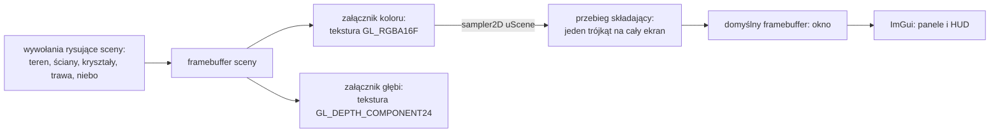
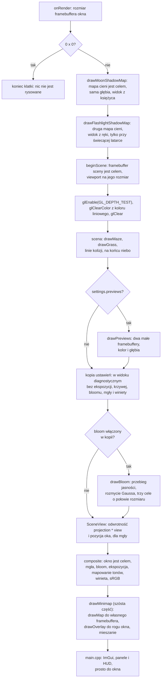
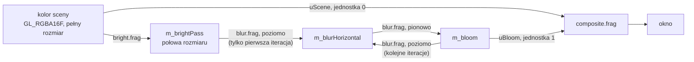
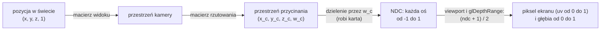

# Moduł renderer: post-process, scena w buforze HDR, bloom, mgła, winieta i przebieg składający

Kamień milowy: M7, część pierwsza (bufor HDR, przebieg składający, ekspozycja, mapowanie tonów, poprawna gamma, podgląd załączników) część druga (bloom: poświata wokół jasnych miejsc) i część trzecia (mgła liczona z bufora głębi i winieta). Czwarta część M7 (cienie księżyca, 2026-10-05) dotknęła tego modułu tylko w trzech miejscach: przebieg cieni stoi teraz na początku klatki, program podglądu ma trzeci tryb (`RawDepth`), a jednostka teksturująca 3 jest zajęta przez mapę cieni. Same cienie opisuje [`shadows.md`](shadows.md). Piąta część M7 (cień latarki, 2026-10-06) zmieniła w nim jeszcze dwie rzeczy: przebiegów cieni jest dwa (księżyca i latarki), a tryb `Depth` programu podglądu pokazuje od niej także mapę cieni latarki. Szósta część M7 (minimapa, 2026-10-06) dotknęła tego modułu w kilku miejscach: klatka ma po przebiegu składającym jeszcze dwa przebiegi mapy, trzeci program używa `composite.vert`, a panel Framebuffers ma trzecią zakładkę. Samą minimapę (drugi framebuffer, rzut ortograficzny, odkrywanie korytarzy, dynamiczny bufor, mieszanie) opisuje [`minimap.md`](minimap.md): tutaj jest tylko to, co jej dotyczy z tego modułu. Temat wykładu: 10 (Rendering pozaekranowy).
Kod: klasa [`src/game/PostProcess.hpp`](../../../src/game/PostProcess.hpp) i [`PostProcess.cpp`](../../../src/game/PostProcess.cpp), ustawienia i matematyka bloomu w [`src/game/Bloom.hpp`](../../../src/game/Bloom.hpp) i [`Bloom.cpp`](../../../src/game/Bloom.cpp), mgły w [`src/game/Fog.hpp`](../../../src/game/Fog.hpp) i [`Fog.cpp`](../../../src/game/Fog.cpp), winiety w [`src/game/Vignette.hpp`](../../../src/game/Vignette.hpp) i [`Vignette.cpp`](../../../src/game/Vignette.cpp), shadery [`assets/shaders/post/composite.vert`](../../../assets/shaders/post/composite.vert), [`post/composite.frag`](../../../assets/shaders/post/composite.frag), [`post/preview.frag`](../../../assets/shaders/post/preview.frag), [`post/bright.frag`](../../../assets/shaders/post/bright.frag), [`post/blur.frag`](../../../assets/shaders/post/blur.frag), wspólne pliki [`common/color.glsl`](../../../assets/shaders/common/color.glsl) i [`common/depth.glsl`](../../../assets/shaders/common/depth.glsl), obiekt framebuffera [`src/gfx/Framebuffer.hpp`](../../../src/gfx/Framebuffer.hpp), wywołania w [`src/game/NightMazeApp.cpp`](../../../src/game/NightMazeApp.cpp) (`onRender`), panel [`src/debug/panels/FramebuffersPanel.cpp`](../../../src/debug/panels/FramebuffersPanel.cpp), nazwy uniformów w [`src/game/ShaderUniforms.hpp`](../../../src/game/ShaderUniforms.hpp), testy [`tests/BloomTests.cpp`](../../../tests/BloomTests.cpp), [`tests/FogTests.cpp`](../../../tests/FogTests.cpp) i [`tests/VignetteTests.cpp`](../../../tests/VignetteTests.cpp).

Dlaczego ten dokument stoi w katalogu `renderer`, chociaż klasa nazywa się `game::PostProcess` i leży w `src/game/`, wyjaśniają [`README.md`](README.md) i notatka [`../../decisions/post-process-in-game-layer.md`](../../decisions/post-process-in-game-layer.md). Dokument zakłada znajomość tekstur 2D ([`../gfx/textures.md`](../gfx/textures.md)), macierzy widoku, macierzy rzutowania i testu głębi ([`../scene/camera.md`](../scene/camera.md)) oraz dyrektywy `#include` w shaderach ([`../gfx/shader-includes.md`](../gfx/shader-includes.md)). Dwa tematy mają własne dokumenty i tutaj są tylko używane: obiekt framebuffera i klasę `gfx::Framebuffer` linia po linii opisuje [`../gfx/framebuffers.md`](../gfx/framebuffers.md), a przestrzeń sRGB, wartości liniowe i całą drogę koloru przez potok opisuje [`../gfx/color-space.md`](../gfx/color-space.md).

**Stan na dziś:** scena 3D nie jest już rysowana prosto do okna. Trafia do własnego framebuffera z teksturą koloru `GL_RGBA16F` i teksturą głębi `GL_DEPTH_COMPONENT24`, a do okna przenosi ją ostatni przebieg klatki, **przebieg składający** (composite): jeden trójkąt na cały ekran, który mnoży kolor przez ekspozycję, stosuje krzywą mapowania tonów i koduje wynik do sRGB. Od drugiej części M7 między sceną a przebiegiem składającym stoi **bloom**: przebieg jasności (bright pass) wybiera z obrazu sceny światło jaśniejsze od progu, rozmycie Gaussa rozlewa je na sąsiednie piksele, a przebieg składający dodaje wynik do sceny przed ekspozycją. Wszystko to dzieje się w trzech celach `GL_RGBA16F` o połowie szerokości i połowie wysokości bufora sceny. Panel **Framebuffers** ma suwak ekspozycji, listę krzywych, przełącznik i trzy liczby bloomu, zakres podglądu głębi, rozmiary i formaty bufora sceny i celów bloomu oraz cztery podglądy: załącznika koloru, załącznika głębi, wyniku przebiegu jasności i gotowej poświaty. Programów shaderów jest dziś trzynaście (po trzeciej części było ich dziesięć, po piątej jedenaście): w pierwszej części doszły `composite` i `preview`, w drugiej `bright` i `blur`, w czwartej `shadow_depth`, który należy do cieni, a w szóstej `minimap` i `minimap_overlay`, które należą do minimapy ([`minimap.md`](minimap.md)). Szósta część dodała też trzecią zakładkę panelu Framebuffers, `Minimap`, i dwa przebiegi po przebiegu składającym (sekcja 2.8, krok 10a). Trzecia część nie dodała ani programu, ani framebuffera, ani przebiegu: **mgła** i **winieta** to nowe linie tego samego `composite.frag`. Mgła zastępuje kolor powierzchni kolorem mgły tym mocniej, im dalej od oka i im niżej leży to, co pokazuje piksel: miejsce w świecie odtwarza z tekstury głębi sceny i odwrotności macierzy widoku i rzutowania. Winieta przyciemnia gotowy obraz w stronę rogów ekranu. Obie mają swoje ustawienia i wzory także w C++ (`game/Fog.*`, `game/Vignette.*`), pod testami, a w panelu Framebuffers drugą zakładkę z ośmioma kontrolkami. Czwarta część (cienie księżyca) nie dodała klasie `PostProcess` ani pola, ani funkcji: w jej plikach zmieniły się tylko komentarze i wyliczenie `AttachmentPreview`, które dostało trzecią wartość, `RawDepth`. Zmieniło się to, co stoi wokół: klatka zaczyna się od przebiegu cieni, przed `beginScene` (sekcja 2.8), program `preview` umie pokazać głębię taką, jaka jest zapisana, i tym trybem `game::ShadowMap` rysuje obraz mapy cieni (sekcje 2.10 i 4.3), a przez cały przebieg sceny na jednostce 3 leży mapa cieni (sekcja 3).

Temat 10 wykładu jest **w trakcie**. PRD wymienia w nim: scenę w buforze HDR, post-process (bloom, mgła, winieta), minimapę i podgląd załączników. Z tej listy są: bufor HDR, przebieg składający, bloom, mgła, winieta i podgląd załączników. **Minimapa jest w kodzie od szóstej części M7** ([`minimap.md`](minimap.md)), więc wszystko z listy PRD ma kod. Temat **nie jest zamknięty**: testy ręczne na Windowsie (listy 17.2 do 22.2 w [`../../guides/build-windows.md`](../../guides/build-windows.md)) i macOS są otwarte, a minimapy nikt nie oglądał. Co jeszcze nie istnieje poza listą PRD, wylicza sekcja 2.16.

Zgłoszone dla Windowsa (2026-10-05) dla **pierwszej części**, nie powtórzone przy pisaniu tego dokumentu: bramka `make check` przechodziła (formatowanie, testy Debug i Release, clang-tidy), zero ostrzeżeń, wtedy 269 przypadków testowych i 102103 asercje w obu konfiguracjach. Build Debug bez błędów OpenGL przy otwartych podglądach, po zmianie rozmiaru okna na 1400 x 800 oraz po zminimalizowaniu (framebuffer 0 x 0) i przywróceniu. Liczba klatek w buildzie Release, bez synchronizacji pionowej, z ukrytymi panelami: około 2700 przed zmianą i około 2500 po niej w 1280 x 720, około 2020 przed i około 1960 po w 2560 x 1440.

Zgłoszone dla Windowsa (2026-10-05) dla **drugiej części**, też nie powtórzone przeze mnie: bramka `make check` przechodzi, zero ostrzeżeń w Debug i Release, **276 przypadków testowych i 102139 asercji** w obu konfiguracjach. Różnica to plik `tests/BloomTests.cpp`: 7 przypadków i 36 asercji, co zgadza się z policzeniem makr w pliku. Poświata jest widoczna na zrzutach ekranu wokół kryształów (w najciemniejszej i w najjaśniejszej chwili pulsu, w trybach Unlit, Gouraud i Blinn-Phong) i wokół tarczy księżyca, a gwiazdy zostają punktami. Liczba klatek w Release z ukrytymi panelami, pomiar niespokojny: 1280 x 720 od 1900 do 2450 bez bloomu i od 1500 do 2150 z bloomem, 2560 x 1440 od 1370 do 1480 bez i od 880 do 925 z bloomem. Wersji kompilatora, karty i sterownika dla żadnego z tych pomiarów nie zapisano. **Nikt jeszcze nie kliknął myszą** kontrolek panelu, nie przeciągał krawędzi okna i nie użył `Reload shaders` przy dziesięciu programach. **Na macOS ten kod nie był ani budowany, ani uruchamiany.** Otwarte obserwacje: plama latarki na ścianie nie daje poświaty nawet z metra, a poświata jest mierzona w tekselach celu o połowie rozdzielczości, więc w 1440p jest na ekranie względnie cieńsza. Szczegóły w sekcji 5.9.

Zgłoszone dla Windowsa (2026-10-05) dla **trzeciej części**, też nie powtórzone przeze mnie: bramka `make check` przechodzi, zero ostrzeżeń w Debug i Release, **294 przypadki testowe i 102412 asercji** w obu konfiguracjach. Różnica to dwa pliki: `tests/FogTests.cpp` (11 przypadków, 241 asercji) i `tests/VignetteTests.cpp` (7 przypadków, 32 asercje), co zgadza się z policzeniem makr w plikach. Z wyłączoną mgłą i winietą obraz jest identyczny co do piksela z obrazem drugiej części, a oba widoki diagnostyczne są identyczne także przy włączonych ustawieniach startowych. Liczba klatek w Release z ukrytymi panelami, jeden spokojny przebieg: 1280 x 720 około 1880 z obydwoma efektami i około 1900 bez nich, 2560 x 1440 około 1145 z nimi i około 1158 bez. **Nikt nie kliknął myszą** żadnej z ośmiu nowych kontrolek. **Na macOS ten kod nie był ani budowany, ani uruchamiany.** Znane ograniczenie, zapisane w kodzie: wysokość mgły jest brana tylko w miejscu, które pokazuje piksel, więc z dużej wysokości labirynt prawie znika we mgle (sekcja 2.20). Szczegóły w sekcji 5.9.

Zgłoszone dla Windowsa (2026-10-05) dla **czwartej części** (cienie księżyca), też nie powtórzone przeze mnie: bramka `make check` przechodzi (formatowanie, buildy Debug i Release, testy w obu, clang-tidy), **310 przypadków testowych i 103751 asercji**. Różnica to jeden plik, `tests/ShadowTests.cpp`: 16 przypadków i 1339 asercji, żaden nie dotyczy tego modułu. Z wyłączonymi cieniami i intensywnością księżyca cofniętą do 0,12 obraz jest poza pasem HUD identyczny co do piksela z obrazem trzeciej części (w trybie Phong różni się najwyżej o 1/255). Build Debug bez błędów OpenGL przy mapie cieni 2048 i 1024. Zgłoszone liczby klatek są w sekcji 5.9, z zastrzeżeniem: nie pokazują wiarygodnie kosztu cieni. **Nikt nie sprawdził** przełączania rozdzielczości mapy w działającym programie, kontrolek panelu Shadows myszą ani `Reload shaders` przy jedenastu programach. **Na macOS ten kod nie był ani budowany, ani uruchamiany.**

Zgłoszone dla Windowsa (2026-10-06) dla **szóstej części** (minimapa), nie powtórzone przeze mnie: bramka `make check` przechodzi w Debug i Release, **414 przypadków testowych i 138711 asercji** (przed częścią 375 i 138506), a siedmiosekundowy start programu Debug nie wypisał nic na standardowe wyjście błędów. **Nikt nie obejrzał minimapy**, nie ćwiczono klawisza M, zakładki Minimap, `Reload shaders` ani zmiany rozmiaru okna. Szczegóły: [`minimap.md`](minimap.md), sekcja 5.9.

## 1. Po co to jest

Do M6 każde wywołanie rysujące zapisywało piksele prosto do okna. Okno przechowuje 8 bitów na kanał, czyli liczby od 0 do 1 w 256 krokach. Wynikają z tego trzy ograniczenia, których nie da się obejść, dopóki celem rysowania jest okno:

| Ograniczenie okna | Skutek | Co daje własny bufor |
|---|---|---|
| wartości powyżej 1 są obcinane w chwili zapisu | kryształ dwa razy jaśniejszy od bieli i kryształ dziesięć razy jaśniejszy wyglądają tak samo, a informacja "o ile jaśniejszy" znika na zawsze | tekstura zmiennoprzecinkowa `GL_RGBA16F` przechowuje wartość taką, jaka wyszła z rachunku światła |
| obrazu sceny nie da się przeczytać jak tekstury | żaden efekt nie może pracować na gotowym obrazie: rozmycie, poświata, mgła z głębi | kolor i głębia sceny są zwykłymi teksturami, które następny przebieg czyta przez `sampler2D` |
| to, co zapisano, jest od razu tym, co widać | kodowanie do sRGB trzeba by robić w każdym shaderze sceny osobno | jedno miejsce na końcu klatki, w którym obraz jest dopasowywany do ekranu |

Rysowanie do tekstury zamiast do okna nazywa się **renderingiem pozaekranowym** (offscreen rendering). To temat 10 wykładu. Dziś daje on siedem rzeczy:

| Rzecz | Gdzie | Sekcja |
|---|---|---|
| framebuffer sceny z kolorem HDR i głębią jako teksturami | `gfx::Framebuffer`, tworzony przez `PostProcess::beginScene` | 2.1, 2.2, 5.4, klasa w [`../gfx/framebuffers.md`](../gfx/framebuffers.md) |
| przebieg składający: ekspozycja, mapowanie tonów, kodowanie do sRGB | `PostProcess::composite`, shadery `post/composite.*` | 2.4 do 2.7, 4.1, 4.2, 5.6 |
| poprawna gamma w całym potoku | tekstury sRGB, kolory wpisane liczbami przeliczane raz, kodowanie na końcu | 2.3, całość w [`../gfx/color-space.md`](../gfx/color-space.md) |
| podgląd obu załączników w panelu | `PostProcess::drawPreviews`, shader `post/preview.frag`, panel Framebuffers | 2.10, 4.3, 5.5, 6 |
| bloom: poświata wokół tego, co w buforze jest jaśniejsze od progu (druga część M7) | `PostProcess::drawBloom`, shadery `post/bright.frag` i `post/blur.frag`, `game/Bloom.*`, dodanie w `post/composite.frag` | 2.11 do 2.15, 4.6 do 4.8, 5.10, 5.11 |
| mgła: daleki i nisko leżący fragment sceny przechodzi w kolor mgły, liczone z **tekstury głębi** sceny (trzecia część M7) | `post/composite.frag` (`worldPositionFromDepth`, `fogHeightFactor`, `fogAmount`), `game/Fog.*`, `game::SceneView` | 2.17 do 2.21, 4.9, 5.12 |
| winieta: gotowy obraz ciemnieje w stronę rogów (trzecia część M7) | `post/composite.frag` (`vignetteFactor`), `game/Vignette.*` | 2.22, 4.9, 5.13 |

Pokaz z PRD dla tego tematu to "podgląd załączników FBO". Jest w panelu Framebuffers (sekcja 6). Od drugiej części panel pokazuje też oba kroki bloomu jako obrazy, więc efekt da się rozłożyć na oczach prowadzącego: co zostało po progu, co wyszło z rozmycia i co trafiło na ekran. Mgła jest pierwszym efektem, który czyta **drugi** z załączników, głębię: to dla niej (i dla podglądu) głębia sceny jest teksturą, a nie renderbufferem.

## 2. Teoria

### 2.1 Rendering pozaekranowy: scena jako tekstura

**Framebuffer** to cel rysowania: zestaw buforów, do których trafiają wyniki shadera fragmentów (kolor) i testu głębi (głębia). Okno ma swój, tak zwany **domyślny framebuffer** o numerze 0. Program może utworzyć własny obiekt framebuffera (FBO) i podpiąć do niego tekstury jako **załączniki** (attachments). Dopóki taki obiekt jest związany, te same wywołania rysujące wypełniają jego tekstury, a w oknie nic się nie zmienia.



Klatka ma więc co najmniej dwa przebiegi (passes): przebieg sceny, który rysuje do tekstur, i przebieg składający, który czyta teksturę koloru i rysuje do okna. Każdy efekt post-processingu jest kolejnym takim przebiegiem: czyta wynik poprzedniego i zapisuje do własnego celu. Schemat wyżej pokazuje sam szkielet z pierwszej części. Z bloomem, przy ustawieniach startowych, między sceną a przebiegiem składającym stoi jeszcze 13 przebiegów (sekcja 2.14), a pełna kolejność jest w sekcji 2.8.

Jedna reguła obowiązuje każdy przebieg: **nie wolno czytać tekstury, do której się właśnie rysuje**. Wynik takiej pętli zwrotnej (feedback loop) jest niezdefiniowany. Dlatego podglądy mają własne małe framebuffery, przebieg składający rysuje do okna, a rozmycie bloomu przerzuca obraz między dwoma celami (sekcja 2.14). Sam obiekt framebuffera, załączniki, kompletność i wiązanie opisuje [`../gfx/framebuffers.md`](../gfx/framebuffers.md).

### 2.2 HDR: dlaczego wartości powyżej 1 mają znaczenie

**LDR** (low dynamic range) to obraz, w którym każdy kanał mieści się między 0 a 1: tyle umie pokazać ekran. **HDR** (high dynamic range) to obraz, w którym wartości nie mają górnej granicy: liczba mówi, ile jest światła, a nie jak jasny ma być piksel ekranu.

Rachunek światła produkuje wartości powyżej 1 w sposób naturalny. Przykład z gry, kryształ:

| Krok | Czerwony | Zielony | Niebieski |
|---|---|---|---|
| `LightingSettings::pointColor`, liczby sRGB z panelu | 0,2 | 0,9 | 0,8 |
| po `gfx::srgbToLinear` (w `NightMazeApp::crystalEmissive`) | 0,033 | 0,787 | 0,604 |
| razy `CRYSTAL_GLOW_STRENGTH = 4.0` (w `crystalGlow`, przy pełnym pulsie) | 0,132 | **3,150** | **2,415** |

Ta trójka trafia do shadera jako `uEmissive`, a kolor fragmentu to `tekstura * (światło rozproszone + uEmissive) + odbłysk`. Dla jasnego teksela kryształu zielony i niebieski kanał wychodzą więc wyraźnie powyżej 1, jeszcze zanim dojdzie latarka. Do pierwszej części M7 włącznie stała wynosiła 2,5 i trójka miała wartość (0,083, 1,969, 1,510). Druga część podniosła ją do 4,0 razem z bloomem (sekcja 2.15 i notatka [`../../decisions/crystal-glow-raised-for-bloom.md`](../../decisions/crystal-glow-raised-for-bloom.md)).

Co się z taką wartością dzieje, zależy od bufora:

| Bufor | Co przechowa dla (0,132, 3,150, 2,415) | Co jest stracone |
|---|---|---|
| okno, 8 bitów na kanał | (0,132, 1, 1) | to, że zielonego jest o 30 procent więcej niż niebieskiego, i to, że oba są kilka razy jaśniejsze od bieli |
| `GL_RGBA16F` | (0,132, 3,150, 2,415) | nic |

Z wartością zachowaną w buforze da się potem zrobić trzy rzeczy, których obcięta wartość nie pozwala:

1. **Zmienić ekspozycję.** Po przyciemnieniu obrazu do jednej czwartej (ekspozycja 0,25) kryształ ma (0,033, 0,787, 0,604) i odzyskuje barwę. Z wartości (0,132, 1, 1) wyszłoby (0,033, 0,25, 0,25): szarawa plama o złej barwie.
2. **Sprowadzić zakres do ekranu krzywą**, która jasne partie ściska, zamiast je ucinać (mapowanie tonów, sekcja 2.6).
3. **Znaleźć to, co naprawdę świeci.** Bloom szuka pikseli jaśniejszych od progu (startowo 0,8) i bierze z nich to, co wystaje ponad próg. W buforze LDR biała ściana w świetle latarki i kryształ są nie do odróżnienia: obie mają 1. W buforze HDR kryształ ma kilka razy więcej, więc jego poświata jest kilka razy mocniejsza. Komentarz przy `CRYSTAL_GLOW_STRENGTH` mówi wprost, że po tej sile bloom znajduje kryształy (sekcje 2.11 do 2.15).

**Format `GL_RGBA16F`.** Każdy kanał to 16-bitowa liczba zmiennoprzecinkowa (half float): 1 bit znaku, 5 bitów wykładnika, 10 bitów mantysy. Największa wartość to około 65 tysięcy, więc dla sceny gry granicy w praktyce nie ma. Druga zaleta dotyczy ciemnych tonów: liczba zmiennoprzecinkowa ma tę samą względną dokładność blisko zera co blisko jedynki, a bajt ma w całym zakresie 256 równych kroków. Nocna scena żyje w wartościach liniowych rzędu 0,001 do 0,05 (sekcja 2.6), czyli tam, gdzie bajt miałby kilka poziomów. Cena: 8 bajtów na piksel zamiast 4, czyli 7,0 MiB dla 1280 x 720 i 28,1 MiB dla 2560 x 1440 (sam załącznik koloru, policzone z rozmiaru, nie zmierzone na karcie).

### 2.3 Gamma i przestrzeń sRGB: gdzie to jest opisane

Bufor sceny przechowuje wartości **liniowe**: proporcjonalne do ilości światła. Pliki obrazów, kolory z próbnika w panelu i ekran używają wartości **zakodowanych w sRGB**. Zamiana między nimi (potocznie "korekcja gamma") ma w tej części trzy etapy: karta dekoduje tekstury koloru przy odczycie (`GL_SRGB8`), shadery liczą na wartościach liniowych, a przebieg składający koduje wynik na samym końcu.

Cała teoria jest w osobnym dokumencie, [`../gfx/color-space.md`](../gfx/color-space.md): czym jest sRGB, dokładna funkcja z dwóch kawałków i jej odwrotność z przeliczonymi liczbami, które tekstury są sRGB, a które liniowe, gdzie przeliczany jest każdy kolor wpisany liczbami, typowe błędy i porównanie z poprzednim potokiem. Tam też opisane są pliki [`src/gfx/ColorSpace.hpp`](../../../src/gfx/ColorSpace.hpp), [`ColorSpace.cpp`](../../../src/gfx/ColorSpace.cpp), [`assets/shaders/common/color.glsl`](../../../assets/shaders/common/color.glsl) i testy [`tests/ColorSpaceTests.cpp`](../../../tests/ColorSpaceTests.cpp). Komentarz `// See docs/...` na górze tych plików wskazuje ten dokument (`post-process.md`), bo kodowanie do sRGB jest ostatnim krokiem przebiegu składającego. Kto trafił tu z kodu po teorię gammy, powinien przejść do [`../gfx/color-space.md`](../gfx/color-space.md).

W tym dokumencie zostaje tylko to, co dotyczy samego końca potoku: w którym miejscu shadera stoi kodowanie i dlaczego nie robi go OpenGL (sekcja 2.7).

### 2.4 Trójkąt pełnoekranowy

Przebieg składający nie rysuje sceny. Ma uruchomić shader fragmentów dokładnie raz dla każdego piksela okna. Potrzebna jest do tego geometria, która pokrywa cały ekran. Najprostsza to **jeden trójkąt większy niż ekran**.

Ekran w przestrzeni przycinania (clip space) to kwadrat od -1 do 1 w obu osiach. Trójkąt o wierzchołkach (-1, -1), (3, -1) i (-1, 3) zawiera ten kwadrat w całości:

```text
  y
  3 +                      wierzchołek 2: (-1, 3)
    |\
    | \
    |  \
  1 +---+.                 górna krawędź ekranu
    |   | \
    |EKR| \
    |AN |   \
 -1 +---+----+             wierzchołek 0: (-1, -1), wierzchołek 1: (3, -1)
   -1   1    3   x
```

Przeciwprostokątna biegnie przez punkty (1, 1), (3, -1) i (-1, 3), więc prawy górny narożnik ekranu leży dokładnie na niej. To, co wystaje poza kwadrat, karta odrzuca przy przycinaniu: fragmenty powstają tylko wewnątrz obszaru rysowania (viewport).

Wierzchołki nie pochodzą z bufora. Shader wierzchołków liczy je z wbudowanej zmiennej `gl_VertexID`, numeru wierzchołka w wywołaniu `glDrawArrays(GL_TRIANGLES, 0, 3)`:

| `gl_VertexID` | `% 2` | `/ 2` | `vUv = (x, y)` | pozycja `vUv * 2 - 1` | gdzie to jest |
|---|---|---|---|---|---|
| 0 | 0 | 0 | (0, 0) | (-1, -1) | lewy dolny narożnik ekranu |
| 1 | 1 | 0 | (2, 0) | (3, -1) | daleko za prawą krawędzią |
| 2 | 0 | 1 | (0, 2) | (-1, 3) | daleko nad górną krawędzią |

Reszta z dzielenia przez 2 to najmłodszy bit numeru, dzielenie całkowite przez 2 to następny bit. Dwa bity dają cztery kombinacje, z których trójkąt używa trzech.

**Współrzędne tekstury wychodzą same.** `vUv` w wierzchołkach to (0, 0), (2, 0) i (0, 2), a karta interpoluje je liniowo po trójkącie. Pozycja i `vUv` są związane wzorem `pozycja = vUv * 2 - 1`, więc w punkcie ekranu (-1, -1) jest `vUv = (0, 0)`, a w punkcie (1, 1) jest `vUv = (1, 1)`. Widoczna część trójkąta ma współrzędne od 0 do 1, czyli dokładnie całą teksturę sceny. Wartości do 2 istnieją tylko na częściach, które zostały odcięte.

Odpowiedzi na cztery pytania, które padają przy tym trójkącie:

| Pytanie | Odpowiedź |
|---|---|
| Dlaczego jeden trójkąt, a nie prostokąt z dwóch? | Dwa trójkąty mają wspólną przekątną. Piksele, przez które ona przechodzi, są obsługiwane na granicy dwóch prymitywów, a karta cieniuje fragmenty w blokach 2 x 2, więc wzdłuż przekątnej część pracy wykonuje dwa razy. Jeden trójkąt nie ma szwu. Do tego trzy wierzchołki zamiast sześciu (albo czterech z indeksami) i żadnych danych do wysłania |
| Dlaczego bez bufora wierzchołków? | Trzy narożniki są stałe i dają się policzyć z numeru wierzchołka. Bufor, opis atrybutów i ich wiązanie byłyby kodem bez treści |
| Dlaczego mimo to potrzebny jest VAO? | Profil Core OpenGL nie pozwala rysować bez związanego obiektu tablicy wierzchołków: `glDrawArrays` zgłasza wtedy `GL_INVALID_OPERATION`. `PostProcess` trzyma więc pusty `gfx::VertexArray` (pole `m_triangle`) bez żadnego atrybutu i wiąże go przed rysowaniem |
| Co z głębią i z odrzucaniem ścian? | Pozycja ma `z = 0` i `w = 1`, a przebieg wyłącza test głębi (`glDisable(GL_DEPTH_TEST)`), więc głębia nie gra roli. Odrzucanie tylnych ścian (`GL_CULL_FACE`) nie jest w grze włączane nigdzie: jedyne miejsce, które tego stanu dotyka, to `GrassRenderer`, który go zapamiętuje, wyłącza i przywraca. Trójkąt ma zresztą wierzchołki w kolejności przeciwnej do ruchu wskazówek zegara, czyli jest zwrócony przodem |

### 2.5 Ekspozycja

**Ekspozycja** to jedna liczba, przez którą mnożony jest kolor sceny, zanim trafi na krzywą mapowania tonów: `color *= uExposure`. Działa jak czas naświetlania w aparacie: scena zawiera tyle światła, ile zawiera, a ekspozycja decyduje, jaki wycinek tego zakresu wypadnie w środku skali ekranu.

| `uExposure` | Co robi | W języku fotografii |
|---|---|---|
| 0,5 | o połowę mniej światła | minus 1 stopień (EV) |
| 1,0 | nic, wartość startowa | 0 |
| 2,0 | dwa razy więcej światła | plus 1 stopień |
| 4,0 | cztery razy więcej | plus 2 stopnie |

Jeden stopień to podwojenie albo połowa. Dlatego suwak `Exposure` (od 0,1 do 8) jest **logarytmiczny**: krok z 0,5 na 1 i krok z 1 na 2 mają na nim tę samą długość, tak jak dla oka są tą samą zmianą jasności.

Mnożenie stoi **przed** krzywą i musi działać na wartościach liniowych. Dwa razy więcej światła to dwa razy większa liczba tylko wtedy, gdy liczba jest proporcjonalna do światła. Pomnożenie przez 2 wartości zakodowanej w sRGB zmieniłoby jasność ponad czterokrotnie.

Wartość startowa 1,0 jest częścią wyglądu sceny: komentarz przy `PostProcessSettings::exposure` mówi, że światła są dobrane pod nią. Automatycznego doboru ekspozycji (adaptacji oka) nie ma.

### 2.6 Mapowanie tonów: trzy krzywe

Po ekspozycji kolor nadal może być większy niż 1, a ekran pokaże najwyżej 1. **Mapowanie tonów** (tone mapping) to funkcja, która sprowadza zakres od 0 do nieskończoności do zakresu od 0 do 1. Gra ma trzy do wyboru (`game::ToneMapping`), wszystkie liczone **osobno dla każdego kanału**.

**None: obcięcie.** `clamp(color, 0.0, 1.0)`. Do 1 nic się nie zmienia, powyżej wszystko staje się jedynką. Tak zachowywało się okno przed tą częścią. Jasne partie tracą szczegóły i barwę.

**Reinhard.** Wzór `x / (1 + x)`.

| x | rachunek | wynik |
|---|---|---|
| 0 | 0 / 1 | 0 |
| 1 | 1 / 2 | 0,5 |
| 4 | 4 / 5 | 0,8 |
| 100 | 100 / 101 | 0,990 |

Wynik zbliża się do 1, ale nigdy jej nie osiąga, więc nic nie jest ucinane: dwie różne jasności zawsze dają dwa różne wyniki. Cena: krzywa leży **cała pod prostą** `y = x`. Dla małych x wynik jest prawie równy x (0,01 daje 0,0099), ale środek skali jest wyraźnie ściśnięty: biel o wartości 1 staje się szarością 0,5. Obraz wychodzi ciemniejszy i bardziej płaski.

**ACES (dopasowana).** Krzywa filmowa: krótki wzór, który Krzysztof Narkowicz dopasował do krzywej odniesienia przemysłu filmowego (Academy Color Encoding System). Wpis na blogu autora z tym wzorem ma datę 6 stycznia 2016 i ten rok podaje dziś komentarz w shaderze (do czwartej części M7 podawał 2015). To iloraz dwóch wielomianów drugiego stopnia:

```text
            x * (A * x + B)
f(x) = -------------------------      A = 2,51  B = 0,03  C = 2,43  D = 0,59  E = 0,14
         x * (C * x + D) + E
```

Przeliczone przykłady:

| x | licznik | mianownik | wynik |
|---|---|---|---|
| 0,01 | 0,01 * (0,0251 + 0,03) = 0,000551 | 0,01 * (0,0243 + 0,59) + 0,14 = 0,146143 | 0,0038 |
| 0,18 | 0,18 * (0,4518 + 0,03) = 0,086724 | 0,18 * (0,4374 + 0,59) + 0,14 = 0,324932 | 0,267 |
| 1 | 1 * (2,51 + 0,03) = 2,54 | 1 * (2,43 + 0,59) + 0,14 = 3,16 | 0,804 |
| 2,5 | 2,5 * (6,275 + 0,03) = 15,7625 | 2,5 * (6,075 + 0,59) + 0,14 = 16,8025 | 0,938 |

Krzywa ma kształt litery S i przecina prostą `y = x` w dwóch miejscach, około 0,062 i około 0,73:

| Zakres wejścia | Co robi krzywa | Przykład |
|---|---|---|
| poniżej około 0,062 | **przyciemnia**, i to mocno | 0,01 daje 0,0038, czyli niecałe 40 procent wejścia |
| od około 0,062 do około 0,73 | rozjaśnia: środek skali dostaje więcej kontrastu | 0,18 daje 0,267 |
| powyżej około 0,73 | ściska: jasne wartości łagodnie dochodzą do 1 | 2,5 daje 0,938 |

Dwie własności wzoru, o które łatwo zostać zapytanym:

- Dla bardzo dużych x wynik dąży do `A / C = 2,51 / 2,43 = 1,033`, czyli **powyżej** 1. Krzywa osiąga 1 przy x równym około 7,24 i potem ją przekracza. Dlatego w shaderze wynik jest ujęty w `clamp(..., 0.0, 1.0)`: bez tego najjaśniejsze piksele wychodziłyby poza zakres.
- Stała `E = 0,14` w mianowniku sprawia, że dla małych x ułamek jest w przybliżeniu równy `x * B / E = 0,21 * x`. Stąd mocne przyciemnienie cieni. Komentarz w `composite.frag` mówi dziś to samo liczbą: ciemne tony są przyciśnięte mocno ("pressed down hard"), a 0,01 wychodzi jako około 0,0038, czyli zostaje 38 procent. Do czwartej części M7 mówił "a little", co było za słabe.

**Trzy krzywe obok siebie.** Wartość liniowa po ekspozycji, wynik każdej krzywej (jeszcze przed kodowaniem do sRGB):

| Wejście | None | Reinhard | ACES |
|---|---|---|---|
| 0,01 | 0,0100 | 0,0099 | 0,0038 |
| 0,05 | 0,0500 | 0,0476 | 0,0443 |
| 0,18 | 0,1800 | 0,1525 | 0,2669 |
| 0,5 | 0,5000 | 0,3333 | 0,6163 |
| 1 | 1 | 0,5000 | 0,8038 |
| 2 | 1 | 0,6667 | 0,9149 |
| 2,5 | 1 | 0,7143 | 0,9381 |
| 4 | 1 | 0,8000 | 0,9734 |
| 8 | 1 | 0,8889 | 1 |

Kryształ z sekcji 2.2, (0,132, 3,150, 2,415), przechodzi przez ACES jako (0,184, 0,957, 0,935): zielony i niebieski są blisko bieli, ale nadal różne. Po obcięciu byłoby (0,132, 1, 1). To jest sam składnik emisyjny przy pełnym pulsie: kolor piksela na ekranie jest jeszcze pomnożony przez teksturę kryształu, która go przyciemnia, i właśnie ta różnica między jasnymi a ciemnymi tekselami daje widoczne ścianki.

**Dlaczego ACES jest krzywą domyślną i co to znaczy dla nocnej sceny.** Wybór uzasadnia notatka [`../../decisions/aces-default-tone-mapping.md`](../../decisions/aces-default-tone-mapping.md). Skutek uboczny jest ważny dla tej gry. Nocna scena jest ciemna: światło otoczenia po przeliczeniu na wartości liniowe to (0,011, 0,016, 0,041), a pomnożone przez kolor kamienia daje wartości jeszcze mniejsze. Większość pikseli leży więc **poniżej** pierwszego przecięcia 0,062, czyli tam, gdzie ACES przyciemnia. Wartość 0,01 po ACES i po kodowaniu do sRGB pojawia się na ekranie jako 0,048, a po samym obcięciu jako 0,100: połowa jasności. Dlatego wartości startowe zostały w pierwszej części M7 dobrane od nowa razem z krzywą (jedna z nich, siła świecenia kryształu, zmieniła się jeszcze raz w drugiej części, a intensywność księżyca w czwartej, razem z cieniami):

| Ustawienie | Przed M7 | Dziś | Gdzie |
|---|---|---|---|
| światło otoczenia (liczby sRGB) | (0,035, 0,045, 0,075), używane wprost | (0,105, 0,135, 0,225), liniowo (0,011, 0,016, 0,041) | `LightingSettings::ambient` |
| intensywność księżyca | 0,3 | 0,2 (w pierwszych trzech częściach M7: 0,12) | `LightingSettings::moonIntensity` |
| intensywność latarki | 1,6 | 1,3 | `LightingSettings::flashlightIntensity` |
| intensywność światła kryształów | 2,0 | 0,9 | `LightingSettings::pointIntensity` |
| siła świecenia kryształu | 1,0 | 4,0 (w pierwszej części M7: 2,5) | `CRYSTAL_GLOW_STRENGTH` |
| jasność nieba | 1,0 (suwak do 3) | 2,2 (suwak do 6) | `SkyboxSettings::brightness` |
| kolor tła (liczby sRGB) | (0,01, 0,015, 0,04) | (0,022, 0,033, 0,088) | `NightMazeApp::m_clearColor` |

Liczb sprzed M7 i dzisiejszych nie da się porównać wprost: wtedy trafiały do rachunku jako wartości nieliniowe i wynik szedł na ekran bez kodowania, dziś kolory są najpierw przeliczane na liniowe, a wynik przechodzi przez krzywą i kodowanie ([`../gfx/color-space.md`](../gfx/color-space.md)).

**Księżyc po czwartej części, policzone.** Kolor księżyca (0,55, 0,65, 1,0) to liczby sRGB. Po przeliczeniu dokładną krzywą sRGB wychodzi liniowo (0,263, 0,380, 1,000), a razy intensywność 0,2 daje (0,053, 0,076, 0,200) dla powierzchni zwróconej prosto do światła. Przy dawnym 0,12 było to (0,032, 0,046, 0,120). Na poziomej ziemi dochodzi cosinus kąta padania: światło leci 50 stopni w dół (`moonPitchDegrees = -50`), więc `sin(50°) = 0,766` i z księżyca zostaje (0,040, 0,058, 0,153). Razem ze światłem otoczenia (0,011, 0,016, 0,041) ziemia w świetle księżyca ma (0,051, 0,075, 0,195), a ziemia w cieniu ściany samo światło otoczenia: stosunek 4,7, 4,6 i 4,7 w trzech kanałach, czyli "około pięć razy" z komentarza przy `moonIntensity`. Przy 0,12 ten stosunek wynosił około 3,2. To liczby z bufora HDR, przed pomnożeniem przez kolor tekstury i przed krzywą mapowania tonów. Krzywa ACES przyciemnia małe wartości mocniej niż większe (sekcja 2.6), więc na ekranie stosunek nie jest tą samą liczbą. Po co ta zmiana: z cieniami różnica między miejscem oświetlonym i zacienionym ma być widoczna, a przy 0,12 była za mała ([`shadows.md`](shadows.md)).

**Ograniczenie krzywych liczonych na kanał.** Każdy kanał jest ściskany osobno, więc bardzo jasny kolor nasycony traci nasycenie i przesuwa barwę w stronę bieli: (0,132, 3,150, 2,415) ma proporcję zielonego do niebieskiego 1,30, a po ACES 1,02. Dla świecącego kryształu to pożądany wygląd (rozżarzony środek jest prawie biały), ale jest to własność metody, a nie wierne odwzorowanie barwy.

### 2.7 Kodowanie do sRGB: ostatnia linia i wyłączone `GL_FRAMEBUFFER_SRGB`

Po mapowaniu tonów kolor jest liniowy i mieści się między 0 a 1. Ekran oczekuje liczb zakodowanych w sRGB. Ostatnia linia `composite.frag` robi tę zamianę funkcją `linearToSrgb` z `common/color.glsl`:

```glsl
    fragColor = vec4(linearToSrgb(color), 1.0);
```

To jest **jedyne** miejsce, w którym klatka jest kodowana. Kolejność trzech kroków nie jest dowolna:

| Kolejność | Dlaczego |
|---|---|
| ekspozycja przed krzywą | mnożenie przez liczbę ma sens tylko na wartościach liniowych, a krzywa ma dostać zakres już przesunięty |
| krzywa przed kodowaniem | krzywe mapowania tonów są zdefiniowane na wartościach liniowych. Kodowanie przyjmuje zakres od 0 do 1, który dopiero krzywa zapewnia |
| kodowanie na końcu | po nim liczby przestają być proporcjonalne do światła i żaden rachunek na nich nie jest już poprawny |

OpenGL umie zakodować wynik sam: po `glEnable(GL_FRAMEBUFFER_SRGB)` każdy zapis do framebuffera, który jest oznaczony jako sRGB, przechodzi przez tę samą funkcję. Gra tego **nie** używa. `PostProcess::composite` woła wręcz `glDisable(GL_FRAMEBUFFER_SRGB)`, chociaż przełącznik jest domyślnie wyłączony: linia zapisuje w kodzie, że przebieg na tym polega. Powody w skrócie:

- **ImGui.** Panele i HUD są rysowane po przebiegu składającym do tego samego okna, a ich kolory to gotowe liczby sRGB. Z włączonym przełącznikiem zostałyby zakodowane drugi raz: motyw wyszedłby rozjaśniony i wyblakły.
- **Jedno zachowanie na dwóch systemach.** To, czy framebuffer okna jest sRGB, zależy od systemu i sterownika. Kodowanie w shaderze daje te same liczby wszędzie.
- **Podwójne kodowanie.** Gdyby okno było sRGB i przełącznik był włączony, obraz zakodowany przez shader zostałby zakodowany jeszcze raz.

Pełne uzasadnienie i rozważane możliwości są w notatce [`../../decisions/srgb-encode-in-shader.md`](../../decisions/srgb-encode-in-shader.md). Całą drogę koloru od pliku do ekranu opisuje [`../gfx/color-space.md`](../gfx/color-space.md).

### 2.8 Kolejność klatki



`drawBloom` jest wołane w **każdej** klatce, także przy wyłączonym bloomie: wtedy od razu wraca i zapisuje, że w tej klatce poświaty nie ma. Romb na schemacie to pierwsza linia tej funkcji, a nie `if` w `onRender`.

To samo jako lista kroków `NightMazeApp::onRender` (kod w sekcji 5.7):

| # | Krok | Cel rysowania |
|---|---|---|
| 1 | odczyt rozmiaru framebuffera okna. Przy 0 x 0 (zminimalizowane okno) cała klatka jest pomijana | brak |
| 1a | od czwartej części M7: `drawMoonShadowMap()`, przebieg cieni księżyca. Liczy pudełko światła, rysuje teren, labirynt, bramę i kryształy programem `shadow_depth` do mapy cieni, wiąże mapę na jednostce 3 i, tylko przy otwartym panelu Shadows, rysuje jej obraz podglądu. Przy wyłączonych cieniach liczy samo pudełko ([`shadows.md`](shadows.md), sekcja 2.18) | framebuffer mapy cieni (sama głębia), potem ewentualnie jej framebuffer podglądu |
| 1b | od piątej części M7: `drawFlashlightShadowMap(frameLighting, flashlight)`, przebieg cieni latarki, zaraz po przebiegu księżyca. Liczy ostrosłup światła z ręki (`scene::spotLightSpace`), rysuje te same obiekty tym samym programem `shadow_depth`, wiąże mapę na jednostce 4 i, tylko gdy pokazana jest zakładka `Flashlight` panelu Shadows, rysuje jej obraz podglądu. Pomija rysowanie przy wyłączonych cieniach latarki, przy zgaszonej latarce (także pustą baterią) i bez programu `shadow_depth`: liczy wtedy samą przestrzeń światła ([`shadows.md`](shadows.md), sekcja 2.20) | drugi framebuffer mapy cieni (sama głębia), potem ewentualnie jego framebuffer podglądu |
| 2 | `m_postProcess.beginScene(framebuffer)`: tworzy bufor sceny przy pierwszej klatce i po zmianie rozmiaru, wiąże go i ustawia viewport. Gdy zwróci fałsz, klatka jest pomijana | framebuffer sceny |
| 3 | `glEnable(GL_DEPTH_TEST)`, kolor tła przeliczony przez `gfx::srgbToLinear`, `glClear` koloru i głębi | framebuffer sceny |
| 4 | macierze, światła, `drawMaze`, `drawGrass`, opcjonalnie `drawColliderLines` | framebuffer sceny |
| 5 | niebo, jako ostatnie wywołanie rysujące **sceny** | framebuffer sceny |
| 6 | `drawPreviews`, tylko gdy `m_postProcessSettings.previews` jest prawdą (otwarty panel Framebuffers) | dwa framebuffery podglądu |
| 7 | kopia ustawień dla widoków diagnostycznych (sekcja 2.9) | brak |
| 8 | `m_postProcess.drawBloom(...)` z tą kopią: przebieg jasności, potem rozmycie, a przy otwartym panelu dwa podglądy (sekcje 2.11 do 2.14, kod w 5.11) | trzy cele bloomu, potem dwa framebuffery podglądu |
| 9 | od trzeciej części M7: `SceneView` z odwrotnością `projection * view` i pozycją oka, czyli droga z ekranu z powrotem do świata dla mgły (sekcja 2.19) | brak |
| 10 | `m_postProcess.composite(...)`: okno staje się celem, trójkąt pełnoekranowy miesza mgłę, dodaje bloom, stosuje ekspozycję, krzywą i winietę i przenosi obraz | okno |
| 10a | od szóstej części M7: `drawMinimap(framebuffer, feet)`, tylko przy włączonej mapie i kwadracie o rozmiarze co najmniej 1. `drawMap` rysuje schemat do framebuffera mapy, `drawOverlay` kopiuje go w róg okna z mieszaniem. Po przebiegu składającym, żeby mgła i mapowanie tonów jej nie dotknęły ([`minimap.md`](minimap.md), sekcje 2.10 i 5.5) | framebuffer mapy, potem okno |
| 11 | po powrocie z `onRender`: `DebugUI::draw` w [`src/main.cpp`](../../../src/main.cpp) rysuje panele i HUD | okno |

Bloom stoi **po** kopii ustawień, bo to kopia mówi mu, czy ma w ogóle rysować: w widoku diagnostycznym jest w niej wyłączony. Stoi **po** podglądach sceny, ale kolejność tych dwóch kroków nie ma znaczenia dla obrazu: oba tylko czytają bufor sceny. Miejsce na przyszłe przebiegi wskazuje komentarz w `onRender` między krokami 5 i 6: efekty liczone z gotowej sceny czytają tekstury bufora sceny i rysują do własnych framebufferów, a przebieg składający zostaje ostatni.

Mgła i winieta **nie są** takimi przebiegami i nie mają swojego kroku w tabeli: obie są liniami shadera przebiegu składającego (krok 10). Trzecia część M7 dodała do klatki tylko krok 9, jedno odwrócenie macierzy na procesorze.

**Krok 1a i stan OpenGL (czwarta część M7).** Przebieg cieni stoi przed `beginScene`, bo programy sceny czytają mapę cieni: musi być gotowa, zanim narysują pierwszy trójkąt. Dla tego modułu ważne jest, co ten przebieg zostawia po sobie. `ShadowMap::beginDepthPass` wiąże własny framebuffer i ustawia viewport na rozmiar mapy (2048 x 2048 albo 1024 x 1024), a `ShadowMap::drawPreview`, gdy jest wołany, zostawia związany framebuffer podglądu 256 x 256 i **wyłączony** test głębi. Nic z tego nie przeszkadza scenie: `beginScene` wiąże framebuffer sceny i ustawia viewport od nowa (`Framebuffer::bind`), a `onRender` zaraz potem włącza test głębi (krok 3). W drugą stronę jest tak samo: przebieg składający poprzedniej klatki zostawił test głębi wyłączony, więc `beginDepthPass` włącza go sam, zanim wyczyści głębię mapy. Komentarz w tej funkcji mówi to wprost ("The last pass of the frame before (the composite pass) has left the test switched off"). Klatka ma więc od tej części o jeden przebieg głębi więcej, a przy otwartym panelu Shadows jeszcze jeden mały przebieg podglądu. Oba należą do `game::ShadowMap`, nie do `PostProcess`.

### 2.9 Widoki diagnostyczne omijają ekspozycję, krzywą, bloom, mgłę i winietę

Lista `View` w panelu Assets ma dwa widoki, które nie pokazują światła, tylko **dane jako kolor**: normalne (`normal * 0.5 + 0.5`) i współrzędne tekstury. Liczba 0,5 w kanale ma znaczyć na ekranie dokładnie 0,5. Potok po scenie by to zepsuł w pięciu miejscach, więc każde z nich ma swoją poprawkę:

| Co by zepsuło wynik | Poprawka | Gdzie |
|---|---|---|
| kodowanie do sRGB: 0,5 wyszłoby na ekranie jako 0,735 | shader sceny zapisuje `srgbToLinear(dane)`, a kodowanie na końcu to znosi: `linearToSrgb(srgbToLinear(x)) = x` | `textured.frag`, `grass.frag`, `skybox.frag` |
| ekspozycja i krzywa: zmieniłyby liczby dowolnie | dla klatki w widoku diagnostycznym `onRender` robi **kopię** ustawień z ekspozycją 1 (`NEUTRAL_EXPOSURE`) i `ToneMapping::None` | `NightMazeApp::onRender` |
| bloom: jasne dane dostałyby poświatę. W widoku UV róg, w którym obie współrzędne dochodzą do 1, to żółć (1, 1, 0) o jasności 0,93, czyli powyżej progu 0,8, więc te rogi rozlewałyby się na sąsiednie piksele i fałszowały ich liczby | w tej samej kopii `bloom.enabled = false`. `drawBloom` nic wtedy nie rysuje, a `composite` nie czyta tekstury bloomu | `NightMazeApp::onRender` |
| mgła: domieszałaby swój kolor do danych, tym mocniej, im dalej. Normalna dalekiej ściany przestałaby być normalną | w tej samej kopii `fog.enabled = false`. `composite` nie wiąże wtedy tekstury głębi, a shader jej nie czyta | `NightMazeApp::onRender` |
| winieta: przyciemniłaby dane w stronę rogów. Ta sama normalna miałaby w rogu ekranu 70 procent swojej liczby | w tej samej kopii `vignette.enabled = false` | `NightMazeApp::onRender` |

Komentarz w `onRender` liczy to wprost: "all five are switched off for them, in a copy". Kopia, a nie zmiana pól: suwak, lista i pola `Bloom`, `Fog` i `Vignette` w panelu Framebuffers nadal pokazują to, co ustawił użytkownik, i wracają do działania po przełączeniu widoku z powrotem na `Textured`. Panel pokazuje w takiej klatce `Bloom targets: not drawn (bloom off or a debug view)` i napis `(not drawn)` zamiast dwóch obrazów bloomu, chociaż pole `Bloom` jest nadal zaznaczone. Zgłoszony wynik porównania z poprzednim commitem (pierwsza część M7): widoki normalnych i UV różnią się najwyżej o 1 poziom na 255. Zgłoszone dla trzeciej części: oba widoki są identyczne z drugą częścią także przy włączonej mgle i winiecie w ustawieniach.

### 2.10 Podgląd załączników i głębia liniowa

Panel pokazuje dwa obrazy bufora sceny: załącznik koloru i załącznik głębi (od drugiej części M7 obok nich stoją dwa obrazy bloomu, sekcja 6). ImGui rysuje teksturę bez żadnego przeliczenia, a żaden z załączników nie nadaje się do pokazania wprost: kolor jest liniowy i może przekraczać 1, głębia jest jedną liczbą o bardzo nierównym rozkładzie. Dlatego `PostProcess::drawPreviews` rysuje każdy załącznik trójkątem pełnoekranowym do **własnego małego framebuffera** `GL_RGBA8` (wysokość 180 pikseli, szerokość z proporcji sceny: 320 przy 16:9), shaderem `post/preview.frag`. Panel pokazuje teksturę koloru tego małego framebuffera.

**Podgląd koloru** to samo kodowanie: `linearToSrgb(texture(uSource, vUv).rgb)`. Bez ekspozycji i bez krzywej, bo ma pokazać **zawartość bufora**, a nie gotową klatkę. Funkcja `linearToSrgb` przycina wejście do zakresu od 0 do 1, więc wszystko, co w buforze jest jaśniejsze od 1, wychodzi jako biel. Stąd tekst podpowiedzi przy obrazie `HDR colour`: `The colour attachment of the scene, cut off at 1.` (w pierwszej części M7 to zdanie stało w samym podpisie obrazu).

**Podgląd głębi** wymaga odwrócenia rzutowania. Tekstura głębi nie przechowuje odległości, tylko liczbę od 0 (płaszczyzna bliska) do 1 (płaszczyzna daleka), która zmienia się bardzo szybko blisko kamery i prawie wcale daleko. Funkcja `linearDepth` z `common/depth.glsl` zamienia ją z powrotem na metry. Wyprowadzenie krok po kroku, dla `n` (płaszczyzna bliska) i `f` (daleka):

**Krok 1: co robi macierz rzutowania.** `glm::perspective` buduje macierz, której trzeci i czwarty wiersz to (zapis jak na tablicy: wiersze, kolumny):

```text
wiersz 3:   0   0   -(f + n) / (f - n)   -2 f n / (f - n)
wiersz 4:   0   0   -1                    0
```

Punkt w przestrzeni kamery ma współrzędną `z_e`, ujemną przed kamerą (kamera patrzy wzdłuż -Z). Jego odległość od płaszczyzny kamery to `d = -z_e`. Po pomnożeniu przez macierz:

```text
z_clip = -(f + n) / (f - n) * z_e - 2 f n / (f - n)
       =  (f + n) / (f - n) * d   - 2 f n / (f - n)
w_clip = -z_e = d
```

**Krok 2: dzielenie perspektywiczne.** Karta dzieli przez `w_clip` i dostaje współrzędną znormalizowaną od -1 do 1:

```text
ndc = z_clip / w_clip = (f + n) / (f - n) - 2 f n / ((f - n) * d)
```

Odległość `d` stoi w **mianowniku**: stąd cała nieliniowość. Sprawdzenie na końcach: dla `d = n` wychodzi `(f + n - 2f) / (f - n) = -1`, dla `d = f` wychodzi `(f + n - 2n) / (f - n) = 1`.

**Krok 3: zapis do bufora.** Przy domyślnym `glDepthRange(0, 1)` (gra tego nie zmienia) do tekstury trafia `stored = (ndc + 1) / 2`, czyli zakres od 0 do 1.

**Krok 4: odwrócenie.** Najpierw z powrotem do `ndc`, potem równanie z kroku 2 rozwiązane względem `d`:

```text
ndc = 2 * stored - 1

ndc * (f - n) = (f + n) - 2 f n / d
2 f n / d     = (f + n) - ndc * (f - n)
d             = 2 f n / (f + n - ndc * (f - n))
```

To są dokładnie dwie linie funkcji `linearDepth`. Dla kamery gry (`scene::Camera`: `nearPlane = 0.1`, `farPlane = 100.0`):

| Odległość od płaszczyzny kamery | Wartość w teksturze głębi |
|---|---|
| 0,1 m (płaszczyzna bliska) | 0 |
| 0,2 m | 0,5005 |
| 1 m | 0,9009 |
| 2 m | 0,9510 |
| 5 m | 0,9810 |
| 15 m | 0,9943 |
| 100 m (płaszczyzna daleka) | 1 |

Połowa zakresu liczb jest zużyta na pierwsze 10 centymetrów za płaszczyzną bliską, a wszystko dalej niż 2 metry mieści się w ostatnich 5 procentach. Surowa głębia pokazana jako szarość byłaby więc prawie białym obrazem. Po przeliczeniu na metry shader dzieli wynik przez `uDepthRange` (suwak `Depth range`, startowo 15 m) i przycina do zakresu od 0 do 1: czerń to kamera, biel to 15 metrów i dalej.

Trzy uwagi do tego podglądu:

- **Niebo jest białe.** Skybox jest rysowany na głębi 1 ([`skybox.md`](skybox.md), sekcja 2.7), a `linearDepth(1)` zwraca dokładnie `f`, czyli 100 m, więcej niż każdy zakres suwaka poza samym końcem.
- **To nie jest odległość od oka w linii prostej**, tylko odległość od płaszczyzny kamery (wzdłuż kierunku patrzenia). Ściana prostopadła do kierunku patrzenia ma jedną szarość na całej szerokości, chociaż jej brzegi są dalej od oka niż środek. Dla podglądu to wystarcza. Dla mgły nie: dlatego mgła nie używa `linearDepth`, tylko odtwarza pozycję w świecie i mierzy odległość od oka (sekcje 2.18 i 2.19).
- **Szarość nie jest kodowana do sRGB.** Komentarz w shaderze mówi dlaczego: to miara, a nie światło. Wartość 0,5 ma być na ekranie liczbą 0,5, czyli połową zakresu suwaka.

Tekstura głębi jest czytana przez zwykły `sampler2D` jako jedna liczba w kanale czerwonym, z filtrem `GL_NEAREST` ([`../gfx/framebuffers.md`](../gfx/framebuffers.md)). To, że głębia w ogóle jest teksturą, a nie renderbufferem, uzasadnia notatka [`../../decisions/depth-attachment-as-texture.md`](../../decisions/depth-attachment-as-texture.md). Od trzeciej części M7 tę samą teksturę czyta drugi shader, `composite.frag`, dla mgły: też przez `sampler2D` i też jako jedną liczbę w kanale czerwonym, ale z jednostki 2 i bez przeliczania na metry.

**Trzeci tryb: głębia taka, jaka jest zapisana (czwarta część M7).** Program `preview` ma od tej części tryb `uMode == 2`, w C++ `AttachmentPreview::RawDepth`. Pokazuje zapisaną głębię bez żadnego przeliczenia: `vec3(texture(uSource, vUv).r)`. Po całym wyprowadzeniu wyżej to wygląda na błąd, ale nim nie jest, bo ten tryb służy do innego rzutu. Mapa cieni księżyca jest rysowana rzutem **prostokątnym** (`glm::ortho`), a w nim nie ma dzielenia perspektywicznego: `w_clip` jest zawsze równe 1. Trzeci wiersz macierzy `glm::ortho` daje

```text
ndc    = -2 / (f - n) * z_e - (f + n) / (f - n)
       =  2 * (d - n) / (f - n) - 1
stored = (ndc + 1) / 2 = (d - n) / (f - n)
```

Odległość `d` stoi w **liczniku**. Zapisana głębia rośnie równo z odległością: połowa drogi między płaszczyzną bliską i daleką światła to dokładnie 0,5. Surowa głębia pokazana jako szarość jest więc od razu czytelnym obrazem: czerń to bliska płaszczyzna światła, biel daleka i każdy teksel, w który nic nie zostało narysowane (mapa jest czyszczona do 1). Porównanie obu rzutów:

| | Scena (rzut perspektywiczny) | Mapa cieni księżyca (rzut prostokątny) |
|---|---|---|
| zapisana głębia w funkcji odległości | `d` w mianowniku: 2 m to już 0,951 | liniowa: `(d - n) / (f - n)` |
| surowa głębia jako szarość | prawie biały obraz | równy gradient od czerni do bieli |
| tryb `preview.frag` | 1: `linearDepth`, potem dzielenie przez `uDepthRange` | 2: liczba z tekstury wprost |
| potrzebne uniformy | `uNear`, `uFar`, `uDepthRange` | żaden poza `uSource` i `uMode` |

Tego trybu **nie używa** `PostProcess::drawPreviews`: funkcja `PostProcess::preview()` podaje nadal tylko dwa obrazy bufora sceny, `Color` i `Depth`. Trybem 2 rysuje `game::ShadowMap::drawPreview`, do własnego kwadratowego framebuffera 256 x 256 w formacie `GL_RGBA8`, tym samym programem `preview` i tym samym trójkątem pełnoekranowym, tylko z własnym VAO. Pokazuje go panel Shadows ([`../debug-ui.md`](../debug-ui.md), sekcja 6, i [`shadows.md`](shadows.md), sekcja 2.17). Powód osobnego małego obrazu jest ten sam co przy podglądach sceny: tekstura głębi podana wprost do ImGui wyszłaby czerwona, bo ma dane w jednym kanale.

**Mapa cieni latarki (piąta część M7, 2026-10-06).** Ma rzut **perspektywiczny** (latarka jest reflektorem), więc jej zapisana głębia jest tak samo nierówna jak głębia sceny, a tryb 2 pokazałby prawie biały obraz. Dlatego `ShadowMap::drawPreview(previewShader, lightSpace)` dostaje przestrzeń światła i dla rzutu perspektywicznego używa **trybu 1** (`AttachmentPreview::Depth`) z płaszczyznami przycinania światła zamiast kamery (`uNear` to `lightSpace.nearPlane`, `uFar` i `uDepthRange` to `lightSpace.farPlane`): czerń to ręka, biel to koniec zasięgu latarki. Nowego trybu nie było trzeba. `post/preview.frag` zmieniły się tylko komentarze. Efekt na ekranie nikt nie oglądał.

### 2.11 Bloom: skąd poświata i dlaczego potrzebuje HDR

**Bloom** to poświata wokół bardzo jasnych miejsc obrazu: światło "rozlewa się" poza obrys tego, co świeci. W aparacie i w oku bierze się to stąd, że soczewka nie jest idealna i część bardzo mocnego światła rozprasza się na sąsiednie miejsca matrycy albo siatkówki. Ekran tego sam nie zrobi, bo nie umie świecić jaśniej niż własna biel. Poświata jest więc dla widza **jedynym sygnałem**, że coś jest jaśniejsze od bieli: biała plama z poświatą wygląda jak źródło światła, biała plama bez niej jak kartka papieru.

Efekt ma trzy kroki. Każdy to jeden albo kilka przebiegów trójkąta pełnoekranowego (sekcja 2.4), z tym samym shaderem wierzchołków `post/composite.vert`:

| # | Krok | Shader | Co czyta | Co zapisuje |
|---|---|---|---|---|
| 1 | **przebieg jasności** (bright pass): zostaw tylko światło ponad progiem | `post/bright.frag` | kolor sceny | `m_brightPass` |
| 2 | **rozmycie Gaussa**, powtórzone kilka razy, każde powtórzenie jako przebieg poziomy i pionowy | `post/blur.frag` | wynik poprzedniego przebiegu | na zmianę `m_blurHorizontal` i `m_bloom` |
| 3 | **dodanie** rozmytego obrazu do sceny | `post/composite.frag` | kolor sceny i `m_bloom` | okno |



**Dlaczego bloom potrzebuje bufora HDR.** Przebieg jasności ma odróżnić to, co świeci, od tego, co jest tylko jasne. W buforze LDR obie rzeczy mają tę samą liczbę. Porównanie dla progu 0,8, dla jasnej ściany w świetle latarki (jasność 0,9) i dla składnika emisyjnego kryształu z sekcji 2.2 (jasność 2,455, rachunek w sekcji 2.12):

| Piksel | Jasność w buforze LDR | Nadwyżka ponad próg 0,8 | Jasność w buforze HDR | Nadwyżka ponad próg 0,8 |
|---|---|---|---|---|
| ściana w świetle latarki | 0,9 | 0,1 | 0,9 | 0,1 |
| kryształ | 1 (obcięte) | 0,2 | 2,455 | 1,655 |

W buforze LDR kryształ dawałby poświatę tylko dwa razy mocniejszą niż ściana, a każda rzecz jaśniejsza od bieli dokładnie taką samą. W buforze HDR nadwyżka kryształu jest ponad szesnaście razy większa niż nadwyżka ściany, więc próg da się ustawić tak, żeby ściany nie świeciły wcale, a kryształy świeciły mocno. To jest trzeci z powodów, dla których scena jest w `GL_RGBA16F` (sekcja 2.2), i powód, dla którego cele bloomu też mają ten format: rozmyta poświata światła kilka razy jaśniejszego od bieli ma zostać jaśniejsza niż poświata białej ściany.

Bloom na wartościach LDR to najczęstszy błąd przy tym efekcie (pułapka 17): świeci wtedy wszystko, co jasne, czyli także niebo, biała tekstura i panel interfejsu.

### 2.12 Jasność (luminancja) i przebieg jasności

**Jedna liczba zamiast trzech.** Próg jest jedną liczbą, a piksel ma trzy kanały. Trzeba więc umieć powiedzieć jedną liczbą, jak jasny jest kolor. Ta liczba nazywa się **luminancją** (luminance) i jest sumą ważoną kanałów:

```text
L = 0,2126 * R + 0,7152 * G + 0,0722 * B
```

Wagi pochodzą z normy Rec. 709, tej samej, z której sRGB bierze swoje barwy podstawowe czerwieni, zieleni i błękitu. W kodzie to stała `REC709_LUMINANCE_WEIGHTS` i funkcja `luminance` w `common/color.glsl` (sekcja 4.8). Trzy rzeczy, o które łatwo zostać zapytanym:

| Pytanie | Odpowiedź |
|---|---|
| Dlaczego wagi nie są równe (jedna trzecia każda)? | Oko nie jest równie czułe na trzy barwy. Najbardziej na zieleń, najmniej na błękit. Czysta zieleń (0, 1, 0) ma jasność 0,7152, czysty błękit (0, 0, 1) tylko 0,0722: dziesięć razy mniej, chociaż liczba w kanale jest ta sama |
| Dlaczego wagi sumują się do 1? | `0,2126 + 0,7152 + 0,0722 = 1`. Biel (1, 1, 1) ma wtedy jasność dokładnie 1, a szarość (x, x, x) jasność x. Skala jasności jest tą samą skalą co skala kanałów |
| Na jakich wartościach wolno to liczyć? | Tylko na **liniowych**. Wagi mówią, ile światła każdej barwy składa się na wrażenie jasności, a liczba zakodowana w sRGB nie jest proporcjonalna do światła. Bufor sceny jest liniowy, więc w `bright.frag` wszystko się zgadza. Policzenie tego samego na liczbach sRGB to pułapka 19 |

**Wzór przebiegu jasności.** Dla progu `T` (uniform `uThreshold`, startowo 0,8) i koloru piksela `c` o jasności `L`:

```text
udział = max(L - T, 0) / L
wynik  = c * udział
```

Słowami: licznik to **nadwyżka** jasności ponad próg (zero, gdy piksel jest pod progiem), a udział mówi, jaką częścią całej jasności piksela jest ta nadwyżka. Kolor jest mnożony przez udział, czyli wszystkie trzy kanały są zmniejszane **tyle samo razy**.

Luminancja jest sumą ważoną, więc pomnożenie koloru przez liczbę mnoży jego jasność przez tę samą liczbę. Jasność wyniku to zatem `L * udział = L - T`: **dokładnie nadwyżka ponad próg**. Przeliczone przykłady dla `T = 0,8`:

| Piksel `c` | Jasność `L` | Udział `max(L - 0,8, 0) / L` | Wynik `c * udział` | Jasność wyniku |
|---|---|---|---|---|
| (0,5, 0,5, 0,5), pod progiem | 0,5 | 0 / 0,5 = 0 | (0, 0, 0) | 0 |
| (0,8, 0,8, 0,8), dokładnie na progu | 0,8 | 0 / 0,8 = 0 | (0, 0, 0) | 0 |
| (0,2, 1,0, 0,9), tuż nad progiem | 0,0425 + 0,7152 + 0,0650 = 0,8227 | 0,0227 / 0,8227 = 0,0276 | (0,0055, 0,0276, 0,0248) | 0,0227 |
| (0,3, 2,0, 1,5), wyraźnie nad progiem | 0,0638 + 1,4304 + 0,1083 = 1,6025 | 0,8025 / 1,6025 = 0,5008 | (0,150, 1,002, 0,751) | 0,8025 |
| (0,132, 3,150, 2,415), składnik emisyjny kryształu przy pełnym pulsie | 0,0281 + 2,2529 + 0,1744 = 2,455 | 1,655 / 2,455 = 0,674 | (0,089, 2,123, 1,628) | 1,655 |

Dwie własności widać w tabeli od razu:

- **Nie ma skoku na progu.** Piksel dokładnie na progu daje zero, piksel o włos nad progiem daje prawie zero (udział 0,03), a dopiero piksel dużo jaśniejszy oddaje większość siebie. Kryształ pulsuje: jego jasność zmienia się płynnie i poświata razem z nią. Komentarz przy `CRYSTAL_GLOW_STRENGTH` nazywa to po imieniu: poświata ma "oddychać", a nie mrugać.
- **Barwa zostaje.** Proporcja zielonego do niebieskiego w wierszu czwartym to `2,0 / 1,5 = 1,33` przed i `1,002 / 0,751 = 1,33` po.

**Dlaczego dzielenie przez `L`, a nie coś prostszego.** Trzy sposoby wycięcia jasnych partii, na tym samym pikselu (0,3, 2,0, 1,5) i progu 0,8:

| Sposób | Wynik | Co jest nie tak |
|---|---|---|
| twardy próg: `L > T ? c : 0` | (0,3, 2,0, 1,5) | **skok**. Piksel o jasności 0,79 nie daje nic, a o jasności 0,81 oddaje cały swój kolor. Poświata pulsującego kryształu zapalałaby się i gasła, a krawędzie jasnych plam migotałyby przy ruchu kamery |
| odjęcie progu od każdego kanału: `max(c - T, 0)` | (0, 1,2, 0,7) | **zmiana barwy**. Czerwony zniknął w całości, a proporcja zielonego do niebieskiego zmieniła się z 1,33 na 1,71: turkusowy kryształ dostałby poświatę bardziej zieloną niż on sam |
| **udział jasności ponad progiem (w kodzie)** | (0,150, 1,002, 0,751) | bez skoku i bez zmiany barwy. Cena: jedno dzielenie na piksel i zabezpieczenie przed dzieleniem przez zero |

Dzielenie przez `L` jest więc tym, co zamienia nadwyżkę (jedną liczbę) z powrotem w kolor **o barwie oryginału**: zamiast odejmować od kanałów, skaluje się cały kolor.

**Zabezpieczenie przed zerem.** Czarny piksel ma `L = 0` i rachunek `0 / 0` dałby NaN ("nie liczba"). NaN w buforze zmiennoprzecinkowym nie znika: rozmycie rozniosłoby go na wszystkie piksele w zasięgu jądra. W shaderze mianownik to `max(L, MIN_LUMINANCE)` ze stałą `MIN_LUMINANCE = 0.0001`. Dla czarnego piksela wychodzi `0 / 0,0001 = 0`, a dla każdego piksela nad progiem `L` jest dużo większe od tej stałej, więc niczego ona nie zmienia.

**W jakich jednostkach jest próg.** Próg jest jasnością w liniowych wartościach bufora sceny, **przed ekspozycją**. Wartość 1 to biel ekranu przy ekspozycji 1 i bez krzywej. Wynikają z tego dwie rzeczy: suwak `Exposure` nie zmienia tego, **co** świeci (bloom jest liczony z bufora, zanim ekspozycja go dotknie), a tylko jasność całości, razem z poświatą. I odwrotnie: próg 1,0 nie znaczy "to, co na ekranie jest białe", bo na ekran prowadzi jeszcze ekspozycja i krzywa.

**Gdzie leży próg startowy.** Komentarz przy `BloomSettings::threshold` mówi, że 0,8 leży poniżej świecących kryształów (w każdej chwili pulsu), tarczy księżyca i najjaśniejszych gwiazd, a powyżej kamiennych ścian w świetle latarki. Zgłoszona obserwacja zgadza się z drugą połową tego zdania aż za dobrze: plama latarki na ścianie nie daje poświaty nawet z odległości metra. To otwarta kwestia wyglądu, nie błąd rachunku (sekcja 5.9).

**Próg działa po zmniejszeniu obrazu.** Cel przebiegu jasności ma połowę szerokości i połowę wysokości sceny (sekcja 2.14), więc jeden jego piksel odpowiada czterem pikselom sceny. Shader czyta scenę filtrem liniowym w punkcie, który przy parzystym rozmiarze sceny leży dokładnie na styku tych czterech pikseli, i dostaje ich **średnią**. Dopiero ta średnia jest porównywana z progiem. Dla rzeczy większych niż kilka pikseli nic to nie zmienia. Dla jasnego punktu o rozmiarze jednego piksela na ciemnym tle zmienia dużo: po uśrednieniu z trzema czarnymi sąsiadami zostaje ćwierć jego jasności, więc gwiazda musiałaby mieć w buforze ponad 3,2, żeby średnia przekroczyła 0,8. Zgłoszony wygląd jest z tym zgodny: gwiazdy zostają punktami, a wyraźną poświatę ma tarcza księżyca. Komentarz przy progu wymienia najjaśniejsze gwiazdy wśród rzeczy leżących powyżej progu. Czy i jak mocno one świecą, nie mierzyłem. Przy nieparzystym rozmiarze sceny punkt odczytu nie trafia dokładnie w styk i średnia ma nierówne wagi.

### 2.13 Rozmycie Gaussa: wzór, sigma, promień i wagi

Po przebiegu jasności obraz jest czarny z ostrymi jasnymi plamami. Poświata powstaje przez **rozmycie**: każdy piksel staje się średnią ważoną siebie i sąsiadów. Zestaw wag nazywa się **jądrem** (kernel). Jasna plama oddaje wtedy część światła pikselom dookoła, a sama trochę ciemnieje.

Wagi pochodzą z **funkcji Gaussa**, czyli krzywej dzwonowej:

```text
G(d) = exp(-d * d / (2 * sigma * sigma))
```

`d` to odległość od środka w pikselach, a `sigma` (odchylenie standardowe) to szerokość dzwonu: przy `d = sigma` krzywa ma 61 procent wysokości, przy `d = 2 * sigma` ma 14 procent. Dzwon dlatego, że daje poświatę gładką i okrągłą: najwięcej światła zostaje blisko źródła i płynnie go ubywa. Średnia o równych wagach (rozmycie pudełkowe) daje poświatę o kwadratowym kształcie i ostrym brzegu.

W kodzie (`game/Bloom.hpp`) są trzy stałe:

| Stała | Wartość | Znaczenie |
|---|---|---|
| `BLOOM_BLUR_SIGMA` | 3,0 | szerokość dzwonu w pikselach celu bloomu |
| `BLOOM_BLUR_RADIUS` | 6 | ile pikseli jest czytanych z **każdej** strony piksela zapisywanego. Razem z nim samym `2 * 6 + 1 = 13` odczytów tekstury na przebieg |
| `BLOOM_BLUR_WEIGHT_COUNT` | 7 (`BLOOM_BLUR_RADIUS + 1`) | liczba **różnych** wag: jedna dla środka i po jednej dla odległości od 1 do 6. Jądro jest symetryczne, więc waga dla odległości 2 służy pikselowi 2 w lewo i pikselowi 2 w prawo |

**Wagi policzone.** `2 * sigma * sigma = 18`, więc wysokość dzwonu to `exp(-d * d / 18)`:

| Odległość `d` | `d * d / 18` | Wysokość dzwonu `exp(...)` | Waga po podzieleniu przez 7,2981 |
|---|---|---|---|
| 0 | 0 | 1,0000 | 0,1370 |
| 1 | 0,0556 | 0,9460 | 0,1296 |
| 2 | 0,2222 | 0,8007 | 0,1097 |
| 3 | 0,5000 | 0,6065 | 0,0831 |
| 4 | 0,8889 | 0,4111 | 0,0563 |
| 5 | 1,3889 | 0,2494 | 0,0342 |
| 6 | 2,0000 | 0,1353 | 0,0185 |

**Normalizacja.** Suma wysokości dla całego jądra, czyli środek raz i każda inna odległość dwa razy, to `1 + 2 * (0,9460 + 0,8007 + 0,6065 + 0,4111 + 0,2494 + 0,1353) = 1 + 2 * 3,1490 = 7,2981`. Każda wysokość jest dzielona przez tę sumę i dopiero to są wagi. Sprawdzenie: `0,1370 + 2 * (0,1296 + 0,1097 + 0,0831 + 0,0563 + 0,0342 + 0,0185) = 1,0000`.

Suma równa 1 znaczy, że rozmycie **przesuwa światło, ale go nie dodaje ani nie gubi**: suma jasności całego obrazu jest po przebiegu taka sama jak przed nim. To nie jest kosmetyka, bo przebiegów jest domyślnie dwanaście z rzędu. Gdyby suma wag wynosiła 1,1, po dwunastu przebiegach obraz byłby `1,1^12 = 3,14` raza jaśniejszy. Przy sumie 0,9 zostałoby `0,9^12 = 0,28` jasności. Z tego samego powodu we wzorze nie ma znanego z podręczników czynnika `1 / (sigma * sqrt(2 * pi))`: jest stały dla wszystkich wag, więc dzielenie przez sumę i tak by go skróciło.

**Dlaczego promień to dwie sigmy.** Dzwon nie kończy się nigdy, a shader może przeczytać tylko skończoną liczbę pikseli. Przy `d = 6` krzywa ma 13,5 procent wysokości (komentarz przy `BLOOM_BLUR_SIGMA` zaokrągla to do 14), a dalej szybko gaśnie. Suma całego, nieuciętego dzwonu po pikselach to 7,5199, suma uciętego to 7,2981: za promieniem zostaje 2,9 procent. Normalizacja rozdziela tę brakującą część na trzynaście wag, które są. Skutek uboczny: ucięte jądro jest odrobinę węższe, niż mówi stała. Jego rzeczywiste odchylenie standardowe, policzone z wag z tabeli, to 2,73 piksela, a nie 3.

**Iteracje: wielokrotne rozmycie zamiast większego jądra.** Pole `BloomSettings::blurIterations` (startowo 6, zakres od `MIN_BLOOM_BLUR_ITERATIONS = 1` do `MAX_BLOOM_BLUR_ITERATIONS = 10`) mówi, ile razy rozmycie jest powtarzane. Rozmycie Gaussa zastosowane dwa razy daje znowu rozmycie Gaussa, tylko szersze. Szerokości nie dodają się wprost, dodają się ich **kwadraty** (wariancje), więc po `n` powtórzeniach `sigma_n = sigma * sqrt(n)`:

| Iteracje `n` | Przebiegi rozmycia `2n` | `3 * sqrt(n)`, szerokość według stałej | Szerokość z uciętego jądra (`2,73 * sqrt(n)`) | To samo w pikselach ekranu (razy 2) | Najdalszy zasięg światła, `6n` pikseli celu |
|---|---|---|---|---|---|
| 1 | 2 | 3,0 | 2,7 | 5,5 | 6 |
| 2 | 4 | 4,2 | 3,9 | 7,7 | 12 |
| 6 (startowo) | 12 | 7,3 | 6,7 | 13,4 | 36 |
| 10 | 20 | 9,5 | 8,6 | 17,3 | 60 |

Komentarz przy `blurIterations` podaje dziś dla wartości startowej obie liczby: około 7,3 piksela celu dla pełnego rozkładu Gaussa (to `3 * sqrt(6) = 7,35`) i około 6,7 po ucięciu jądra na `BLOOM_BLUR_RADIUS`, czyli około 13 pikseli sceny dwa razy większej. Zgadza się to z tabelą: 6,7 i 13,4. Do czwartej części M7 komentarz mówił "około 7 pikseli celu, czyli około 15 pikseli sceny", bez poprawki na ucięcie. Różnica nie ma znaczenia dla wyglądu, ale na obronie trzymam się tego, co wynika z wag.

Dwa wnioski z tabeli. Podwojenie liczby iteracji **nie** podwaja szerokości poświaty: z 6 na 10 iteracji szerokość rośnie o 29 procent, a koszt o 67 procent. I druga rzecz: większe jądro (na przykład promień 15) dałoby tę samą szerokość w jednym powtórzeniu, ale promień jest stałą wpisaną w shader (rozmiar tablicy `uWeights`), a liczba iteracji jest liczbą z suwaka. Dlatego szerokością steruje się iteracjami.

Wagi liczy C++ (`game::bloomBlurWeights`), a shader dostaje je jako tablicę uniformów `uWeights`. Dlaczego nie są wpisane w shader jako stałe, zapisuje notatka [`../../decisions/blur-weights-computed-on-cpu.md`](../../decisions/blur-weights-computed-on-cpu.md).

### 2.14 Rozmycie rozdzielne, ping-pong, trzy cele i połowa rozdzielczości

**Rozmycie rozdzielne (separable).** Poświata ma być okrągła, więc jądro powinno być dwuwymiarowe: kwadrat 13 x 13 wag, czyli `13 * 13 = 169` odczytów tekstury na każdy piksel. Funkcja Gaussa ma własność, która pozwala tego uniknąć. Dwuwymiarowy dzwon rozkłada się na **iloczyn** dwóch jednowymiarowych:

```text
exp(-(x * x + y * y) / (2 * sigma * sigma)) = exp(-x * x / (2 * sigma * sigma)) * exp(-y * y / (2 * sigma * sigma))
```

Waga piksela przesuniętego o `(x, y)` to więc waga dla `x` razy waga dla `y`. Z tego wynika, że rozmycie wierszy, a potem rozmycie kolumn **wyniku**, daje dokładnie ten sam obraz co jedno rozmycie pełnym kwadratem. Na małym przykładzie, dla jądra trzech wag `(1/4, 1/2, 1/4)`:

```text
                 1/4                    1  2  1
(1/4 1/2 1/4) x  1/2   =   1/16  *     2  4  2
                 1/4                    1  2  1
```

Po prawej stoi dwuwymiarowe jądro 3 x 3, które powstaje z przemnożenia każdej wagi poziomej przez każdą pionową. Przebieg poziomy rozlewa piksel na trzy w wierszu, przebieg pionowy rozlewa każdy z tych trzech na trzy w kolumnie: razem dziewięć pikseli z wagami z tabelki.

Koszt dla `N = 13` odczytów w jednym kierunku:

| Sposób | Odczytów tekstury na piksel | Dla celu 640 x 360 (230 400 pikseli), jedna iteracja | Sześć iteracji |
|---|---|---|---|
| jeden przebieg pełnym kwadratem | `N * N = 169` | 38 937 600 | 233 625 600 |
| **dwa przebiegi, poziomy i pionowy (w kodzie)** | `N + N = 26` | 5 990 400 | 35 942 400 |

Sześć i pół raza mniej odczytów za ten sam obraz. Cena to drugi przebieg i **cel pośredni**: wynik przebiegu poziomego musi gdzieś trafić, zanim przeczyta go pionowy. Nie każde jądro da się tak rozłożyć. Gauss tak, i to jeden z powodów, dla których jest standardem.

**Ping-pong.** Przebieg nie może czytać tekstury, do której rysuje (sekcja 2.1). Rozmycie potrzebuje więc dwóch celów, które zamieniają się rolami: z pierwszego do drugiego, z drugiego do pierwszego i tak dalej. Nazwa bierze się z odbijania obrazu tam i z powrotem. W tym kodzie:

```text
iteracja 1:   m_brightPass     --poziomo-->  m_blurHorizontal  --pionowo-->  m_bloom
iteracja 2:   m_bloom          --poziomo-->  m_blurHorizontal  --pionowo-->  m_bloom
iteracja 3:   m_bloom          --poziomo-->  m_blurHorizontal  --pionowo-->  m_bloom
...
```

Przebieg poziomy zawsze pisze do `m_blurHorizontal`, pionowy zawsze do `m_bloom`. Po każdej iteracji gotowy wynik leży w `m_bloom` i stamtąd bierze go przebieg składający. W żadnym przebiegu źródło i cel nie są tym samym obiektem.

**Dlaczego trzy cele, a nie dwa.** Do samego ping-ponga wystarczyłyby dwa: przebieg jasności mógłby pisać od razu do `m_bloom`. Wtedy jednak już druga połowa pierwszej iteracji zamazałaby wynik przebiegu jasności, a panel ma go pokazać. Trzeci cel, `m_brightPass`, jest czytany tylko przez pierwszy przebieg poziomy i **nigdy nie jest celem rozmycia**, więc podgląd `Bright pass` pokazuje dokładnie to, co zostało po progu. Cena to jedna tekstura `GL_RGBA16F` więcej: 1,76 MiB przy oknie 1280 x 720 i 7,03 MiB przy 2560 x 1440 (policzone z rozmiaru, nie zmierzone na karcie). Uzasadnienie i rozważane możliwości są w notatce [`../../decisions/bloom-half-resolution-three-targets.md`](../../decisions/bloom-half-resolution-three-targets.md).

**Połowa rozdzielczości.** Stała `BLOOM_DOWNSCALE = 2` mówi, że każdy z trzech celów ma połowę szerokości i połowę wysokości bufora sceny. Rozmiar liczy `game::bloomTargetExtent`: dzielenie całkowite (reszta przepada), ale nie mniej niż 1.

| Bufor sceny | Cel bloomu | Pikseli w celu | Trzy cele razem |
|---|---|---|---|
| 1280 x 720 | 640 x 360 | 230 400 | 5,27 MiB |
| 2560 x 1440 | 1280 x 720 | 921 600 | 21,09 MiB |
| 1000 x 600 | 500 x 300 | 150 000 | 3,43 MiB |
| 1281 x 719 | 640 x 359 | 229 760 | 5,26 MiB |

(Pamięć policzona z rozmiaru, 8 bajtów na piksel.) Połowa w każdym kierunku to **ćwierć pikseli**. Co to daje:

| Zysk | Dlaczego |
|---|---|
| cztery razy mniejszy koszt | każdy przebieg rozmycia cieniuje ćwierć fragmentów. Sześć iteracji w pełnej rozdzielczości 1280 x 720 to 143 769 600 odczytów tekstury, w połowie 35 942 400 |
| dwa razy szersza poświata z tego samego jądra | jeden piksel celu to dwa piksele ekranu, więc sześć pikseli promienia sięga na ekranie na dwanaście |
| trochę rozmycia za darmo, w dwóch miejscach | **przy zmniejszaniu**: przebieg jasności czyta scenę filtrem liniowym i dostaje średnią czterech pikseli (sekcja 2.12). **Przy powiększaniu**: przebieg składający czyta `m_bloom` filtrem liniowym na całym ekranie, więc każdy piksel ekranu dostaje gładką mieszankę czterech najbliższych pikseli celu zamiast kwadratów 2 x 2 |

W samych przebiegach rozmycia filtr liniowy **nic nie daje**: źródło i cel mają ten sam rozmiar, a przesunięcia są całkowitą liczbą pikseli, więc każdy odczyt trafia dokładnie w środek jednego teksela i zwraca go bez mieszania.

Niższej rozdzielczości nie widać, bo rozmyty obraz nie ma ostrych szczegółów, które mogłyby wyjść kanciasto. To ten sam pomysł, o którym PRD wspomina jako o "post-processie w połowie rozdzielczości".

**Cena połowy rozdzielczości: poświata mierzona w tekselach.** Jądro ma stały promień w pikselach **celu**, a nie w ułamku ekranu. Poświata o szerokości 13,4 piksela ekranu to 1,9 procent wysokości okna 720 pikseli, ale tylko 0,9 procent przy 1440. Na większym ekranie ta sama scena ma więc poświatę względnie o połowę cieńszą. To zgłoszona otwarta obserwacja: w 1440p sprawdzono tylko wycinek obrazu. Kod nie skaluje liczby iteracji ani sigmy z rozdzielczością (pułapka 20).

**Brzegi obrazu.** Tekstury załączników mają zawijanie `GL_CLAMP_TO_EDGE` ([`../gfx/framebuffers.md`](../gfx/framebuffers.md)). Odczyt poza krawędź zwraca piksel brzegowy, więc jasna rzecz przy samej krawędzi ekranu nie traci światła "za ekran": brzegowy piksel jest liczony kilka razy.

**Ile przebiegów ma klatka.** Każdy przebieg to jedno wywołanie `glDrawArrays` z trzema wierzchołkami:

| Przebieg | Rozmiar celu | Ile razy w klatce, ustawienia startowe | Zakres |
|---|---|---|---|
| scena | pełny | 1 (wiele wywołań rysujących) | 1 |
| przebieg jasności | połowa | 1 | 0 albo 1 |
| rozmycie | połowa | `2 * 6 = 12` | od 2 (jedna iteracja) do 20 (dziesięć) |
| przebieg składający | okno | 1 | 1 |
| podglądy sceny (tylko przy otwartym panelu) | 320 x 180 | 2 | 0 albo 2 |
| podglądy bloomu (tylko przy otwartym panelu i narysowanym bloomie) | 320 x 180 | 2 | 0 albo 2 |

Bloom to przy ustawieniach startowych **13 przebiegów** w połowie rozdzielczości. Razem z przebiegiem składającym klatka ma 14 trójkątów pełnoekranowych, a z otwartym panelem 18. Liczba odczytów tekstury w samym bloomie dla okna 1280 x 720 to `230 400 * (1 + 12 * 13) = 36 172 800` na klatkę, dla 2560 x 1440 cztery razy tyle.

Zgłoszony koszt (Release, panele ukryte, pomiar niespokojny) jest w sekcji 5.9: w 2560 x 1440 czas klatki rośnie z około 0,7 ms do około 1,1 ms.

### 2.15 Dodanie do sceny: dlaczego przed ekspozycją i mapowaniem tonów

Ostatni krok bloomu jest jedną linią w `composite.frag`:

```glsl
        color += texture(uBloom, vUv).rgb * uBloomIntensity;
```

**Dodawanie, nie mieszanie.** Poświata jest światłem, a światło z dwóch źródeł się sumuje. Scena nie jest przy tym przyciemniana ani zastępowana: jasna plama zostaje tam, gdzie była, a rozmyta kopia jej nadwyżki dochodzi do niej i do sąsiadów. Uczciwie: bloom **dodaje energię**. Światło ponad progiem jest w obrazie dwa razy, raz w scenie i drugi raz rozlane dookoła. To efekt wyglądu, nie model fizyczny. Suwak `Intensity` (`uBloomIntensity`, od 0 do 2, startowo 1) mnoży poświatę przed dodaniem: 0 nie dodaje nic, 2 podwaja.

**Dlaczego przed ekspozycją i krzywą.** Komentarz funkcji `main` ustawia bloom między odczytem sceny a ekspozycją: w drugiej części M7 jako krok 2, od trzeciej jako krok 3, bo przed nim stanęła mgła (sekcja 2.21). Trzy powody:

| Powód | Wyjaśnienie |
|---|---|
| dodawanie światła ma sens tylko na wartościach liniowych | suma dwóch liczb proporcjonalnych do światła jest proporcjonalna do sumy świateł. Po krzywej i po kodowaniu liczby tej własności nie mają |
| ekspozycja i krzywa mają potraktować poświatę jak resztę obrazu | po zmianie suwaka `Exposure` poświata jaśnieje i ciemnieje razem ze sceną. Dodana po ekspozycji miałaby stałą jasność niezależnie od suwaka |
| krzywa sprowadza sumę do zakresu ekranu | składnik emisyjny kryształu ma w zielonym 3,150, a poświata najwyżej 2,1 (tyle zostawia przebieg jasności, rozmycie to jeszcze zmniejsza). Nawet suma 5,3 przechodzi przez ACES jako 0,99: prawie biel, ale nie obcięcie. Dodanie poświaty **po** krzywej dałoby `0,957` plus poświata, czyli wynik obcinany do 1 wszędzie tam, gdzie scena jest już jasna: płaską białą plamę bez barwy |

Drugi przykład, dla ciemnego piksela tuż obok kryształu: scena 0,05, poświata 0,4. Dodane przed krzywą: `0,45`, po ACES 0,58. Sam piksel sceny po ACES to 0,044. Poświata jest więc tym, co rozjaśnia otoczenie kryształu na ekranie, i przechodzi przez tę samą krzywą co wszystko inne.

**Odczyt tekstury o połowie rozmiaru.** `uBloom` jest czytane tym samym `vUv` co scena. Współrzędne tekstury biegną od 0 do 1 niezależnie od rozmiaru, więc mniejsza tekstura jest po prostu rozciągana na cały ekran filtrem liniowym.

**Bloom wyłączony to dokładnie klatka bez bloomu.** Uniform `uBloomEnabled` ma 1 tylko wtedy, gdy bloom jest włączony w ustawieniach **i** `drawBloom` narysowało go w tej klatce (`bloomDrawn()`). Przy 0 shader w ogóle nie czyta tekstury bloomu, więc do koloru nic nie jest dodawane. Zgłoszone: z wyłączonym bloomem obraz był identyczny co do piksela z obrazem pierwszej części w sześciu widokach. Pomiar zrobiono **przed** zmianą siły świecenia kryształów, więc dzisiejsza klatka bez bloomu różni się od pierwszej części właśnie kryształami.

**Siła świecenia kryształów wzrosła razem z bloomem.** `CRYSTAL_GLOW_STRENGTH` zmieniło się z 2,5 na 4,0. Rachunek dla samego składnika emisyjnego (`uEmissive`), przed pomnożeniem przez teksturę kryształu, w najjaśniejszej chwili pulsu (mnożnik 1) i w najciemniejszej (mnożnik `1 - CRYSTAL_PULSE_DEPTH = 0,7`):

| Siła | Puls | `uEmissive` | Jasność `L` | O ile tekstura może przyciemnić, zanim piksel spadnie pod próg 0,8 |
|---|---|---|---|---|
| 2,5 | 1,0 | (0,083, 1,969, 1,510) | 1,534 | o 48 procent |
| 2,5 | 0,7 | (0,058, 1,378, 1,057) | 1,074 | o 26 procent |
| 4,0 | 1,0 | (0,132, 3,150, 2,415) | 2,455 | o 67 procent |
| 4,0 | 0,7 | (0,093, 2,205, 1,691) | 1,719 | o 53 procent |

Kolor piksela to `tekstura * (światło rozproszone + uEmissive) + odbłysk`, więc tekstura kryształu przyciemnia świecenie. Komentarz przy stałej mówi, że zabiera ponad połowę. Przy sile 2,5 w najciemniejszej chwili pulsu zapas wynosił 26 procent, więc piksele spadały pod próg i poświata znikała: tak brzmi zgłoszona obserwacja, i poświata "mrugałaby zamiast oddychać". Przy 4,0 zapas w najciemniejszej chwili to 53 procent. Liczby w ostatniej kolumnie wynikają z samego wzoru. Tekstury kryształu nie mierzyłem, więc to, ile naprawdę zabiera, znam tylko z komentarza i ze zgłoszonych zrzutów (poświata widoczna w obu skrajnych chwilach pulsu, w trzech trybach cieniowania, ze ściankami nadal widocznymi). Skutek uboczny: kryształy są bledsze także **bez** bloomu, bo jaśniejszy kolor ląduje wyżej na krzywej (sekcja 2.6). Decyzję zapisuje notatka [`../../decisions/crystal-glow-raised-for-bloom.md`](../../decisions/crystal-glow-raised-for-bloom.md).

### 2.16 Planowane: czego jeszcze nie ma

Do drugiej części M7 ta sekcja wymieniała cztery efekty z PRD, których nie było w kodzie. Dwa z nich, mgła i winieta, powstały w trzeciej części i mają własne sekcje: mgła 2.17 do 2.21, winieta 2.22. Po trzeciej części zostały dwa, minimapa i cienie. Czwarta część (2026-10-05) zrobiła z cieni połowę: cień księżyca, piąta drugą, a szósta (2026-10-06) minimapę. Stan na dziś:

| Efekt | Stan | Co o nim wiadomo z kodu |
|---|---|---|
| **Minimapa** (widok labiryntu w osobnym framebufferze) | jest, od szóstej części M7 | dwa przebiegi po przebiegu składającym: schemat z danych labiryntu do własnego framebuffera `GL_RGBA8` i kopia w róg okna z mieszaniem. Pokazuje tylko odkryte korytarze, z przełącznikiem `Reveal all`. Obrazu nikt nie oglądał. Cały opis: [`minimap.md`](minimap.md) |
| **Cień księżyca** (temat 11, shadow mapping) | jest, od czwartej części M7 | osobny przebieg przed sceną (krok 1a w sekcji 2.8), klasa `game::ShadowMap`. `gfx::ColorFormat::None`, czyli framebuffer z samą głębią, jest tu wykonywany po raz pierwszy (`ShadowMap::beginDepthPass`). Cały opis: [`shadows.md`](shadows.md) |
| **Cień latarki** (druga połowa tematu 11, od piątej części M7) | jest w kodzie | mapa cieni z rzutem perspektywicznym na jednostce teksturującej 4, podgląd w trybie `Depth` (sekcja 2.10). Temat 11 jest w toku, nie zamknięty: testy ręczne i macOS są otwarte ([`shadows.md`](shadows.md), sekcja 2.20) |

Jedno zdanie z wcześniejszej wersji tej sekcji okazało się **fałszywe** i warto je znać, bo padało też w innych dokumentach: że mgła będzie czytać głębię funkcją `linearDepth` z `common/depth.glsl`. Nie czyta. `linearDepth` daje odległość od płaszczyzny kamery, a mgła potrzebuje odległości od oka w linii prostej i wysokości nad ziemią, więc odtwarza całą pozycję w świecie (sekcje 2.18 i 2.19). Plik `common/depth.glsl` ma nadal jednego użytkownika: podgląd głębi w `preview.frag` (sekcja 2.10).

Nie ma też: drugiego załącznika koloru, automatycznej ekspozycji, bloomu w kilku rozdzielczościach naraz (łańcucha coraz mniejszych celów, który dałby szeroką poświatę taniej), mgły całkowanej wzdłuż promienia ani światła widocznego we mgle (snopa latarki). Połowa rozdzielczości jest od drugiej części M7, ale tylko dla celów bloomu: bufor sceny ma nadal pełny rozmiar okna.

### 2.17 Mgła: co to jest i skąd prawo wykładnicze

**Co robi mgła ze światłem.** Mgła to powietrze pełne drobnych kropel. Światło, które leci od ściany do oka, trafia po drodze na krople i dzieją się z nim dwie rzeczy naraz:

| Zjawisko | Co się dzieje | Skutek dla piksela |
|---|---|---|
| pochłanianie i rozpraszanie **na zewnątrz** (absorption, out-scattering) | część światła ściany jest pochłaniana albo odbijana w bok i do oka nie dolatuje | ściana ciemnieje i blednie |
| rozpraszanie **do środka** (in-scattering) | światło z innych źródeł (księżyc, niebo, otoczenie) odbija się od kropel w stronę oka | do piksela dochodzi własny kolor mgły |

Jeśli do oka dolatuje ułamek `T` światła ściany (T jak transmittance, przepuszczalność), to resztę, `1 - T`, wypełnia kolor mgły:

```text
kolor = kolor ściany * T + kolor mgły * (1 - T)
```

To jest dokładnie funkcja `mix` z GLSL: `mix(a, b, t) = a * (1 - t) + b * t`. W kodzie `t` nazywa się `amount` (ile mgły) i jest równe `1 - T`. Cała fizyka sprowadza się więc do pytania: ile wynosi `T` po `d` metrach mgły.

**Prawo wykładnicze w kilku liniach.** Założenie jest jedno: mgła jest wszędzie taka sama, więc każda równa warstwa zabiera **ten sam ułamek** tego, co do niej wpadło. Nie tę samą ilość, tylko ten sam ułamek. Niech jeden metr przepuszcza 90 procent:

| Droga | Rachunek | Zostaje |
|---|---|---|
| 1 m | 0,9 | 90 procent |
| 2 m | 0,9 * 0,9 | 81 procent |
| 3 m | 0,9 * 0,9 * 0,9 | 72,9 procent |
| d metrów | 0,9 do potęgi d | maleje, ale nigdy nie spada do zera |

Mnożenie przez stały ułamek na każdy metr to funkcja wykładnicza. Zapis z gęstością: cienka warstwa o grubości `dx` zabiera ułamek `density * dx`, czyli `dI = -density * I * dx`. Rozwiązaniem tego równania jest

```text
T(d) = exp(-density * d)
amount = 1 - exp(-density * d)
```

To prawo nazywa się prawem Beera-Lamberta. `density` to gęstość mgły na metr: im większa, tym szybciej `T` spada. W dawnym OpenGL ze stałym potokiem ten sam wzór był jednym z trzech wbudowanych trybów mgły (`GL_EXP`). W profilu Core wbudowanej mgły nie ma: liczy ją shader.

**Liczby dla gęstości startowej 0,1 na metr** (przy ziemi, gdzie mgła ma pełną gęstość):

| Odległość | `exp(-0,1 * d)`, tyle zostaje ze ściany | `amount`, tyle jest mgły |
|---|---|---|
| 2 m (jedna komórka labiryntu) | exp(-0,2) = 0,819 | 18 procent |
| 6,9 m (`ln(2) / 0,1`) | 0,500 | 50 procent |
| 10 m (`1 / 0,1`) | exp(-1) = 0,368 | 63 procent |
| 30 m | exp(-3) = 0,050 | 95 procent |
| 100 m (płaszczyzna daleka) | exp(-10) = 0,00005 | praktycznie 100 procent |

Dwie liczby do zapamiętania są w komentarzu przy `FogSettings::density`: po `1 / density` metrach mgła zabiera 63 procent (`1 - 1 / e`), a po `ln(2) / density` metrach połowę. Przy 0,1 to 10 m i około 6,9 m, czyli trzy i pół komórki labiryntu.

**Własność, którą sprawdza test.** Dwa odcinki jeden za drugim przepuszczają iloczyn tego, co przepuszcza każdy: `exp(-0,1 * 10) * exp(-0,1 * 5) = exp(-0,1 * 15)`. To jest to samo założenie o równych warstwach, zapisane od drugiej strony, i jeden z `CHECK` w przypadku `the fog follows the exponential law`.

**Czego ten model nie robi.** Kolor mgły jest jedną stałą: mgła nie jaśnieje w snopie latarki, nie zmienia się z kierunkiem księżyca i nie rzuca cieni. Gęstość zależy tylko od wysokości (sekcja 2.20), nie ma w niej szumu ani ruchu. To mgła jako funkcja odległości, a nie symulacja objętości.

### 2.18 Odległość od oka, a nie wartość głębi

Wzór chce `d`: ile metrów mgły leży między okiem a powierzchnią. Tekstura głębi sceny ma dla każdego piksela jedną liczbę. Są trzy rzeczy, które można by z niej wziąć jako `d`, i tylko jedna jest dobra:

| Kandydat | Co to jest | Co wychodzi |
|---|---|---|
| liczba z tekstury wprost | wartość od 0 do 1, nieliniowa: 2 m to 0,951, 10 m to 0,991, 30 m to 0,998 (sekcja 2.10) | prawie cała scena ma "odległość" między 0,95 a 1. Mgła byłaby jednolitą zasłoną, taką samą na ścianie przed nosem i na końcu korytarza |
| `linearDepth`, głębia w metrach | odległość od **płaszczyzny kamery**, mierzona wzdłuż kierunku patrzenia | poprawna tylko w samym środku ekranu. Mgła zmienia się przy obrocie kamery (niżej) |
| **odległość od oka w linii prostej** (wybrana) | długość odcinka od oka do punktu w świecie | zależy tylko od tego, gdzie stoję i gdzie jest ściana |

**Co psuje głębia w metrach.** Punkt na ścianie leży 10 m od oka. Kamera gry ma pionowy kąt widzenia 60 stopni (`Camera::fovDegrees`), co przy oknie 16:9 daje w poziomie 45,7 stopnia od osi do krawędzi ekranu (`atan(tan(30°) * 16 / 9)`). Głębia wzdłuż osi patrzenia to `10 * cos(kąt od osi)`:

| Gdzie na ekranie jest ten sam punkt | Kąt od osi patrzenia | Głębia wzdłuż osi | Mgła z głębi | Mgła z odległości |
|---|---|---|---|---|
| środek | 0° | 10,00 m | 63 procent | 63 procent |
| w połowie drogi od środka do krawędzi | 27,2° | 8,89 m | 59 procent | 63 procent |
| lewa albo prawa krawędź | 45,7° | 6,98 m | 50 procent | 63 procent |
| róg | 49,7° | 6,47 m | 48 procent | 63 procent |

Nikt się nie ruszył, ściana też nie, a mgła na niej zmieniła się z 63 na 50 procent tylko dlatego, że gracz obrócił głowę. Na ekranie widać to jako mgłę, która "pływa" po ścianach przy każdym ruchu myszy: gęstnieje w środku obrazu i rzednie przy krawędziach. Mgła liczona z głębi jest płaską ścianą prostopadłą do kierunku patrzenia, która obraca się razem z kamerą. Mgła liczona z odległości jest kulą wokół gracza, a kula po obrocie wygląda tak samo.

**Dlaczego od razu cała pozycja.** Odległość dałoby się policzyć taniej: głębię w metrach podzielić przez cosinus kąta piksela. Ale mgła potrzebuje jeszcze **wysokości** punktu nad ziemią (sekcja 2.20), a tej z samej głębi nie ma. Pozycja w świecie daje obie rzeczy naraz: `length(position - uEye)` to odległość, `position.y` to wysokość. Stąd droga przez odwrotność macierzy (następna sekcja) i stąd `composite.frag` nie dołącza `common/depth.glsl`. Decyzję zapisuje notatka [`../../decisions/fog-distance-from-reconstructed-position.md`](../../decisions/fog-distance-from-reconstructed-position.md).

### 2.19 Odtworzenie pozycji w świecie z głębi

**Droga w przód**, którą przeszedł każdy wierzchołek sceny ([`../scene/camera.md`](../scene/camera.md)):



Przebieg składający zna koniec tej drogi: `vUv` piksela i liczbę z tekstury głębi. Funkcja `worldPositionFromDepth` idzie nią z powrotem w trzech krokach.

**Krok 1: z zakresu 0..1 do NDC.**

```glsl
    vec4 ndc = vec4(vec3(uv, depth) * 2.0 - 1.0, 1.0);
```

Ostatni krok drogi w przód to `wartość = (ndc + 1) / 2`, osobno dla każdej osi. Odwrotność to `ndc = wartość * 2 - 1`. Dla `x` i `y` zgadza się to z tym, jak powstaje `vUv`: trójkąt pełnoekranowy ma pozycję `vUv * 2 - 1` (sekcja 2.4), więc `vUv` jest dokładnie `(ndc.xy + 1) / 2`. Dla głębi zgadza się, bo gra nie zmienia domyślnego `glDepthRange(0, 1)` (sekcja 2.10, krok 3). Czwarta składowa 1 mówi, że to punkt, a nie kierunek.

**Krok 2: odwrotność macierzy.**

```glsl
    vec4 world = uInverseViewProjection * ndc;
```

W przód wierzchołek był mnożony przez `projection * view`. Odwrotność iloczynu cofa oba kroki naraz: `inverse(projection * view) = inverse(view) * inverse(projection)`, czyli najpierw z powrotem przez rzutowanie, potem przez widok. Odwracanie macierzy 4 x 4 jest drogie, więc robi je C++ **raz na klatkę** (`glm::inverse` w `onRender`), a shader dostaje gotowy wynik jako uniform i wykonuje jedno mnożenie macierzy przez wektor na piksel.

**Krok 3: dzielenie przez `w`.**

```glsl
    return world.xyz / world.w;
```

To krok, o który najłatwiej zostać zapytanym. Po drodze w przód karta **podzieliła** pozycję przez `w_c`. Macierz jest przekształceniem liniowym i dzielenia cofnąć nie umie. Ale współrzędne jednorodne same przenoszą brakującą liczbę. Rachunek, z `M = projection * view`:

```text
w przód:   clip = M * (x, y, z, 1)            ndc = clip / w_c

wstecz:    inverse(M) * (ndc, 1)
         = inverse(M) * (clip / w_c)          bo (ndc, 1) to clip podzielone przez w_c,
                                              także w czwartej składowej: w_c / w_c = 1
         = (x, y, z, 1) / w_c                 bo inverse(M) * clip to punkt wyjściowy
         = (x / w_c,  y / w_c,  z / w_c,  1 / w_c)
```

Wynik kroku 2 to więc pozycja w świecie **podzielona przez to samo `w_c`**, a jego czwarta składowa to `1 / w_c`. Dzieląc trzy pierwsze składowe przez czwartą, mnożę je z powrotem przez `w_c` i dostaję `(x, y, z)`. Bez tego kroku wynikiem jest pozycja pomniejszona `w_c` razy: punkt z przykładu niżej, 5 m przed okiem, wylądowałby 1 m przed nim, a mgła byłaby policzona dla zupełnie innego miejsca.

**Przykład na liczbach.** Oko w początku układu, kamera patrzy wzdłuż -Z, punkt 5 m przed nią na osi: `(0, 0, -5)`. Płaszczyzny `n = 0,1` i `f = 100`.

| Krok | Rachunek | Wynik |
|---|---|---|
| w przód: `z_c` i `w_c` (wzory z sekcji 2.10) | `z_c = 1,002002 * 5 - 0,2002`, `w_c = 5` | `z_c = 4,80981` |
| w przód: NDC i głębia | `4,80981 / 5`, potem `(ndc + 1) / 2` | `ndc_z = 0,961962`, w teksturze 0,980981 |
| wstecz, krok 1 | `uv = (0,5, 0,5)`, `0,980981 * 2 - 1` | `(0, 0, 0,961962, 1)` |
| wstecz, krok 2 (tu sama odwrotność rzutowania, bo widok jest macierzą jednostkową) | `z = -1`, `w = -4,995 * 0,961962 + 5,005` | `(0, 0, -1, 0,2)` |
| wstecz, krok 3 | `-1 / 0,2` | `(0, 0, -5)` |

Czwarta składowa po kroku 2 to 0,2, czyli `1 / w_c = 1 / 5`: tak jak mówi rachunek wyżej. Dwie stałe w wierszu kroku 2 to `(n - f) / (2 f n) = -4,995` i `(f + n) / (2 f n) = 5,005`.

**Trzy warunki, żeby to działało:**

| Warunek | Jak jest spełniony |
|---|---|
| macierz musi być odwrotnością **tych samych** macierzy, którymi narysowano scenę w tej klatce | `onRender` buduje `SceneView` ze zmiennych `projection` i `view`, których użyły wszystkie wywołania rysujące sceny (sekcja 5.7) |
| `uv` musi obejmować cały bufor sceny od 0 do 1 | trójkąt pełnoekranowy i bufor sceny wielkości okna: jeden piksel ekranu to jeden teksel głębi |
| głębi nie wolno uśredniać między sąsiadami | tekstura głębi ma filtr `GL_NEAREST` ([`../gfx/framebuffers.md`](../gfx/framebuffers.md)). Średnia głębi ściany i nieba dałaby punkt wiszący w powietrzu |

Oko (`uEye`) jest osobnym uniformem, chociaż dałoby się je wyłuskać z odwrotności macierzy widoku: `onRender` ma je już jako zmienną `eye`, tę samą, z której zbudowano macierz widoku i światła.

Odpowiednik w C++ to `game::worldPositionFromDepth` w `Fog.cpp` (sekcja 5.12), te same trzy linie. Dwa testy sprawdzają je na prawdziwej kamerze gry: punkt 6 m przed okiem, przepuszczony w przód przez obie macierze i z powrotem, wraca na swoje miejsce, a środek ekranu z głębią 0 i 1 ląduje dokładnie na płaszczyźnie bliskiej i dalekiej.

### 2.20 Współczynnik wysokości i co jest w nim nieścisłe

**Mgła, która leży nisko.** Prawdziwa mgła przy ziemi jest gęsta, a wyżej rzednie. W kodzie gęstość zależy od wysokości `y` punktu w świecie:

```text
heightFactor = exp(-heightFalloff * max(y - baseHeight, 0))
amount       = 1 - exp(-density * heightFactor * distance)
```

`heightFactor` to liczba od 0 do 1, przez którą mnożona jest gęstość. Do wysokości `baseHeight` wynosi 1 (pełna gęstość), a powyżej maleje wykładniczo: znowu "o ten sam ułamek na każdy metr", tym razem w górę. `max(..., 0)` pilnuje, żeby pod wysokością bazową różnica nie była ujemna: `exp(0)` to 1, więc w dołkach terenu mgła nie gęstnieje ponad `density`.

Liczby dla wartości startowych, `baseHeight = 0,5` m i `heightFalloff = 0,4` na metr:

| Wysokość `y` | Nad bazą | `heightFactor` | Mgła na tej wysokości 10 m od oka |
|---|---|---|---|
| 0,5 m i niżej (ziemia labiryntu) | 0 m | exp(0) = 1,000 | 63 procent |
| 1,5 m | 1 m | exp(-0,4) = 0,670 | 49 procent |
| 1,7 m (wysokość oczu, `Player::EYE_HEIGHT`) | 1,2 m | exp(-0,48) = 0,619 | 46 procent |
| 3 m (szczyt ściany, `WALL_HEIGHT`) | 2,5 m | exp(-1) = 0,368 | 31 procent |
| 10 m | 9,5 m | exp(-3,8) = 0,022 | 2 procent |

Gęstość spada o połowę co `ln(2) / 0,4 = 1,73` m. Na jednej ścianie widać więc gradient: stopa tonie we mgle mocniej niż szczyt. Komentarz przy `baseHeight` mówi dziś, że ziemia labiryntu leży między 0 a około 0,6 m przy skali wysokości 1 (`game::MAZE_RELIEF`), więc wartość startowa trzyma w najgęstszej mgle większość podłogi, i że ta liczba nie idzie za skalą wysokości terenu. Do czwartej części M7 mówił o ziemi między 0 a około 0,5 m i o całej podłodze, co było nieścisłe. Sam tych wysokości nie mierzyłem. Z kodu terenu wynika tyle: przy skali wysokości 1 ziemia pod labiryntem nie przekracza `MAZE_RELIEF = 0,6` m, a między najniższym i najwyższym miejscem pod labiryntem startowym jest około 0,4 m. `baseHeight` jest stałą liczbą w metrach świata i **nie idzie za suwakiem skali wysokości terenu**: przy skali 2,5 wyższe miejsca podłogi wychodzą ponad bazę i mają trochę mniej mgły.

`heightFalloff = 0` daje `heightFactor = 1` wszędzie: mgłę jednakową na każdej wysokości, razem z niebem (sekcja 2.21).

**Co jest nieścisłe: wysokość jest brana tylko w pikselu.** Promień od oka do ściany przechodzi przez **różne** wysokości, a więc przez mgłę o różnej gęstości. Poprawny rachunek sumuje gęstość wzdłuż całej drogi (całka), a dopiero sumę wstawia do `exp`:

```text
poprawnie:   tau = całka wzdłuż promienia z density * heightFactor(y(s)) ds
             amount = 1 - exp(-tau)

w kodzie:    tau = density * heightFactor(y powierzchni) * distance
```

Kod zakłada więc, że cała droga biegnie na wysokości **celu**. Trzy przypadki pokazują, w którą stronę to się myli (liczby z obu wzorów, dla wartości startowych):

| Sytuacja | Kod | Całka | Błąd |
|---|---|---|---|
| ziemia 8 m przed graczem, oko na 1,7 m | 56 procent | około 49 procent | za dużo: promień zaczyna w rzadszej mgle na wysokości oczu, a kod liczy całą drogę jak przy ziemi |
| szczyt ściany (3 m) 8 m przed graczem | 26 procent | około 32 procent | za mało: promień zaczyna w gęstszej mgle niż ta na szczycie |
| **widok z góry**: oko 30 m prosto nad podłogą | **95 procent** | około 22 procent | dużo za dużo: prawie cała droga wiedzie przez czyste powietrze, a kod liczy 30 m pełnej gęstości |

Trzeci wiersz widać gołym okiem: po wzlocie w trybie noclip labirynt oglądany z wysoka **prawie znika** w kolorze mgły, chociaż gracz jest wysoko ponad nią. Prawdziwa mgła przyziemna z góry wygląda jak cienka, na wpół przezroczysta warstwa. Komentarz `KNOWN LIMIT` przy `game::fogAmountAt` opisuje dokładnie te dwa kierunki błędu.

**Jak wyglądałaby wersja poprawna (wskazówka, nie kod gry).** Dla gęstości, która maleje wykładniczo z wysokością, całkę wzdłuż prostego odcinka da się policzyć wzorem, bez pętli. Dla końców odcinka na wysokościach `h0` (oko) i `h1` (powierzchnia), obu mierzonych nad bazą i obu nieujemnych, z `k = heightFalloff`:

```text
tau = density * distance * (exp(-k * h0) - exp(-k * h1)) / (k * (h1 - h0))
```

(dla `h0 = h1` ułamek przechodzi w `exp(-k * h0)`, a odcinek, który schodzi pod bazę, trzeba podzielić na część nad nią i część w pełnej gęstości). W silnikach nazywa się to mgłą wykładniczą z wysokością liczoną analitycznie. Sprawdzenie na trzecim wierszu tabeli: `h0 = 30`, `h1 = 0`, `tau = 0,1 * 30 * (0 - 1) / (0,4 * (0 - 30)) = 0,25`, a `1 - exp(-0,25) = 0,22`. Gra tego nie robi. Powody i warunki powrotu zapisuje notatka [`../../decisions/fog-height-at-the-pixel.md`](../../decisions/fog-height-at-the-pixel.md).

### 2.21 Niebo, kolor mgły i miejsce mgły w kolejności kroków

**Niebo nie ma osobnego przypadku.** Skybox jest rysowany na głębi 1 ([`skybox.md`](skybox.md), sekcja 2.7), więc piksel nieba ma w teksturze głębi dokładnie 1. `worldPositionFromDepth` daje dla niego punkt na **płaszczyźnie dalekiej**, 100 m od płaszczyzny kamery, w kierunku, w którym patrzy ten piksel. Shader traktuje ten punkt jak każdy inny. Wychodzi z tego właściwy obraz bez żadnego `if`:

| Gdzie patrzy piksel nieba | Punkt na płaszczyźnie dalekiej | `heightFactor` | Mgła |
|---|---|---|---|
| poziomo, na horyzont | 100 m dalej, na wysokości oczu (1,7 m) | 0,619 | 99,8 procent |
| 3 stopnie nad horyzont | 100 m dalej, na wysokości 6,9 m | 0,076 | 53 procent |
| 5 stopni | na wysokości 10,4 m | 0,019 | 17 procent |
| 10 stopni | na wysokości 19 m | 0,0006 | 0,6 procent |
| na księżyc (50 stopni, `moonPitchDegrees = -50`) | na wysokości 78 m | praktycznie 0 | 0 |
| w dół, pod horyzont (tam, gdzie kończy się teren) | poniżej bazy | 1 | 100 procent |

Odległość 100 m sama zakryłaby niebo w całości (`exp(-10)`). Ratuje je wysokość: punkt daleko **i wysoko** leży tam, gdzie mgły prawie nie ma. Horyzont jest więc zamglony, pas przejścia ma kilka stopni, a księżyc i gwiazdy zostają czyste. Poniżej horyzontu mgła jest pełna i zakrywa krawędź, na której kończy się siatka terenu. Liczby w tabeli są **policzone ze wzoru** dla środka ekranu, nie odczytane z gry. Test `the default fog leaves the moon clear and hides the sky below the horizon` sprawdza pierwszy i ostatni z tych faktów na funkcji `fogAmountAt`.

**Uczciwie: na niebie mgła jednak zależy od obrotu kamery.** Płaszczyzna daleka jest płaska i obraca się razem z kamerą. Ten sam kierunek na niebie trafia w nią 100 m od oka, gdy jest w środku ekranu, ale 143 m, gdy jest przy lewej albo prawej krawędzi (`100 / cos(45,7°)`), i 155 m w rogu. Dalszy punkt na tym samym promieniu leży wyżej, więc dostaje mniej mgły: 3 stopnie nad horyzontem to 53 procent mgły w środku ekranu, 36 procent przy krawędzi i 31 procent w rogu. Zdanie "mgła nie zmienia się przy obrocie" (sekcja 2.18) jest więc prawdą dla ścian, ziemi i wszystkiego, co ma prawdziwą głębię, a **nie** dla wąskiego pasa nieba tuż nad horyzontem. To wniosek z rachunku: na ekranie nikt tego jeszcze nie szukał, a wzgórza wokół labiryntu zasłaniają dużą część tego pasa. Jest na liście testu ręcznego. Od czwartej części M7 mówi o tym także komentarz w funkcji `main` shadera: "The far plane is flat and turns with the camera, so on that low strip of sky (and only there) the amount also depends on where on the screen a pixel is." Decyzję o braku osobnego przypadku zapisuje notatka [`../../decisions/fog-no-special-case-for-sky.md`](../../decisions/fog-no-special-case-for-sky.md).

**Kolor mgły i jego przestrzeń.** `FogSettings::color` to liczby **sRGB**, takie, jakie pokazuje próbnik koloru w panelu: startowo (0,14, 0,18, 0,26), zimny szaroniebieski między światłem otoczenia (0,105, 0,135, 0,225) a kolorem księżyca (0,55, 0,65, 1,0). Mieszanie światła ma sens tylko na wartościach liniowych, więc `PostProcess::composite` przelicza kolor raz na klatkę funkcją `gfx::srgbToLinear` i dopiero wynik wysyła jako `uFogColor`. To ta sama zasada co przy kolorach świateł i kolorze tła ([`../gfx/color-space.md`](../gfx/color-space.md)).

| Krok | Czerwony | Zielony | Niebieski |
|---|---|---|---|
| `FogSettings::color`, liczby sRGB z próbnika | 0,140 | 0,180 | 0,260 |
| po `gfx::srgbToLinear`, to trafia do `uFogColor` | 0,017 | 0,027 | 0,055 |
| piksel w całości zamglony, po krzywej ACES (ekspozycja 1) | 0,008 | 0,017 | 0,051 |
| ten sam piksel po kodowaniu, czyli na ekranie | 0,090 | 0,138 | 0,251 |

Mgła na ekranie jest więc **ciemniejsza** niż próbka w panelu, najbardziej w czerwonym i zielonym. Powód jest w sekcji 2.6: krzywa ACES przyciska ciemne tony, a kolor mgły jest mieszany **przed** nią. To nie błąd przeliczenia, tylko skutek tego, że mgła jest częścią sceny. Zdanie o ciemniejszej mgle dotyczy krzywej domyślnej: przy `Tone mapping: None (clamp)` i ekspozycji 1 piksel w całości zamglony ma na ekranie dokładnie kolor próbki, bo kodowanie znosi przeliczenie (`linearToSrgb(srgbToLinear(x)) = x`), a przy `Reinhard` jest tylko trochę ciemniejszy. Od czwartej części M7 komentarz przy polu `FogSettings::color` i podpowiedź kontrolki `Fog colour` mówią to z tym samym zastrzeżeniem: ciemniejsza z krzywą Reinharda albo ACES, zgodna z próbką przy `None (clamp)` i ekspozycji 1. Wcześniej mówiły o ciemniejszej mgle bez zastrzeżenia.

**Dlaczego mgła stoi przed dodaniem bloomu, przed ekspozycją i przed krzywą.** Komentarz funkcji `main` stawia ją jako krok 2, zaraz po odczycie sceny:

| Kolejność | Dlaczego | Co by wyszło inaczej |
|---|---|---|
| mgła przed ekspozycją | `mix` to suma dwóch świateł z wagami. Ma sens tylko wtedy, gdy obie liczby są proporcjonalne do światła. Ekspozycja mnoży potem ścianę i mgłę razem | mgła dodana po ekspozycji miałaby stałą jasność niezależnie od suwaka `Exposure`: przy ekspozycji 4 ściana 10 m dalej (0,02 w buforze) ma po krzywej poprawnie 0,123, a z mgłą doklejoną za krzywą 0,044 |
| mgła przed mapowaniem tonów | bufor przechowuje, **o ile** coś jest jaśniejsze od bieli. Mgła ma przysłonić 63 procent tej prawdziwej jasności | kryształ (zielony 3,150) 10 m dalej: poprawnie `0,368 * 3,150 + 0,632 * 0,027 = 1,176`, po ACES 0,84, nadal jasny. Po krzywej kryształ jest już ściśnięty do 0,957 i z mgłą wychodzi 0,36: świecąca rzecz gaśnie we mgle tak samo jak biała kartka |
| mgła przed dodaniem bloomu | poświata dochodzi **po** mgle, więc nie jest zastępowana jej kolorem: kryształ świeci przez mgłę | odwrotna kolejność mieszałaby poświatę z kolorem mgły według głębi tego, co akurat leży pod poświatą, na przykład bliskiej ściany, na którą się rozlała |

**Bloom czyta scenę bez mgły.** `drawBloom` biegnie przed `composite` i czyta teksturę koloru sceny, a mgła nie jest nigdy do tej tekstury zapisywana: powstaje dopiero w ostatnim przebiegu, w drodze do okna. Skutek: przebieg jasności widzi kryształ z pełną jasnością niezależnie od odległości, więc **poświata nie słabnie z mgłą**. Kryształ 30 m dalej ma bryłę w 95 procentach zastąpioną kolorem mgły, a poświatę taką samą jak z bliska (mniejszą na ekranie tylko dlatego, że sam kryształ jest mniejszy). To świadomy wybór wyglądu, nie fizyka: prawdziwa mgła osłabiłaby też źródło poświaty, a za to sama rozświetliłaby się wokół niego. Notatka [`../../decisions/bloom-from-unfogged-scene.md`](../../decisions/bloom-from-unfogged-scene.md).

**Mgła wyłączona to dokładnie klatka bez mgły.** Przy `uFogEnabled = 0` shader nie czyta tekstury głębi i nie wykonuje żadnej z trzech funkcji, a `composite` nawet tej tekstury nie wiąże. Zgłoszone: z wyłączoną mgłą i winietą obraz jest identyczny co do piksela z obrazem drugiej części M7.

### 2.22 Winieta

**Co to jest.** Winieta (vignette) to przyciemnienie obrazu w stronę rogów. W fotografii bierze się z obiektywu: do brzegów matrycy dociera mniej światła niż do środka. W grze jest zabiegiem kompozycji: oko idzie do jaśniejszego środka, czyli tam, gdzie świeci latarka. Komentarz przy `VignetteSettings` mówi, że wartości startowe są celowo subtelne: środek ma przyciągać wzrok, ale ciemnej ramki nie ma być widać.

**Wzór.** Każdy piksel gotowego obrazu jest mnożony przez jedną liczbę:

```text
distance = length(uv - (0,5, 0,5))
factor   = 1 - strength * smoothstep(radius, VIGNETTE_CORNER_DISTANCE, distance)
```

| Składnik | Znaczenie |
|---|---|
| `distance` | odległość piksela od środka ekranu, liczona we **współrzędnych tekstury** (od 0 do 1 w obu kierunkach) |
| `radius` (startowo 0,4) | do tej odległości obraz jest nietknięty |
| `VIGNETTE_CORNER_DISTANCE = 0,70710678` | odległość od środka do rogu: długość wektora (0,5, 0,5), czyli pierwiastek z 0,5. Tu przyciemnienie jest pełne |
| `strength` (startowo 0,3) | jaką część światła tracą rogi: 0 nic, 1 wszystko (czarne rogi) |

**`smoothstep` po kolei.** `smoothstep(e0, e1, x)` to funkcja wbudowana w GLSL (i `glm::smoothstep` w C++). Robi dwie rzeczy:

```text
t = clamp((x - e0) / (e1 - e0), 0, 1)      gdzie x leży między krawędziami, od 0 do 1
wynik = t * t * (3 - 2 * t)                 krzywa w kształcie S: 3t^2 - 2t^3
```

Poniżej `e0` wynik to 0, powyżej `e1` to 1, a pomiędzy rośnie gładko. Krzywa S ma na obu końcach **zerowe nachylenie**: startuje i kończy płasko. Zwykłe przejście liniowe (`t` bez drugiej linii) miałoby na promieniu załamanie, a oko widzi takie załamanie jasności jako cienki pierścień. Ze `smoothstep` nie widać, gdzie winieta się zaczyna.

**Liczby dla wartości startowych** (`strength = 0,3`, `radius = 0,4`, mianownik `0,7071 - 0,4 = 0,3071`):

| Miejsce na ekranie | `distance` | `t` | `smoothstep` | `factor` |
|---|---|---|---|---|
| środek | 0 | 0 | 0 | 1,000 |
| na promieniu | 0,4 | 0 | 0 | 1,000 |
| środek dowolnej krawędzi | 0,5 | 0,1 / 0,3071 = 0,326 | 0,326² * (3 - 0,651) = 0,249 | 1 - 0,3 * 0,249 = 0,925 |
| między krawędzią a rogiem | 0,6 | 0,651 | 0,720 | 0,784 |
| róg | 0,7071 | 1 | 1 | 0,700 |

Rogi tracą 30 procent światła, środki krawędzi 7,5 procenta. Mnożenie jest na wartościach liniowych, więc na ekranie różnica jest mniejsza, niż sugeruje liczba: 70 procent światła to po zakodowaniu do sRGB około 85 procent wartości piksela.

**Winieta nie jest poprawiana o proporcje okna.** Współrzędne tekstury biegną od 0 do 1 w poziomie i w pionie **niezależnie od kształtu okna**. Odległość 0,4 to więc 40 procent szerokości w poziomie i 40 procent wysokości w pionie:

| Okno | Promień 0,4 w poziomie | Promień 0,4 w pionie | Kształt jasnego środka |
|---|---|---|---|
| 1280 x 720 | 512 pikseli | 288 pikseli | elipsa o proporcjach okna, 16:9 |
| 720 x 720 | 288 pikseli | 288 pikseli | koło |
| 600 x 1000 | 240 pikseli | 400 pikseli | elipsa stojąca |

Jasny środek jest elipsą wpisaną w kształt okna, a nie kołem. W zamian **wszystkie cztery rogi są zawsze tak samo ciemne**, a środki wszystkich czterech krawędzi też, przy każdym kształcie okna: róg jest zawsze w odległości 0,7071, krawędź w 0,5. Wersja poprawiona o proporcje (odległość w poziomie pomnożona przez szerokość podzieloną przez wysokość) dawałaby koło, ale w szerokim oknie środki górnej i dolnej krawędzi zostałyby takie jak dziś (0,925), lewa i prawa krawędź miałyby pełne przyciemnienie na szerokim pasie (środek bocznej krawędzi wypada wtedy w odległości `0,5 * 16 / 9 = 0,889`, dalej niż róg bez poprawki), a odległość do rogu przestałaby być stałą: dla 16:9 wynosiłaby 1,02. Test `the vignette is measured in texture coordinates, the same in both directions` zapisuje ten wybór, a uzasadnia go notatka [`../../decisions/vignette-not-aspect-corrected.md`](../../decisions/vignette-not-aspect-corrected.md).

**Dlaczego po mapowaniu tonów, a przed kodowaniem.** Komentarz funkcji `main` stawia winietę jako krok 6, między krzywą a `linearToSrgb`. To efekt **gotowego obrazu**, a nie światła w scenie:

| Gdzie stałaby winieta | Co by robiła | Przykład dla rogu (`factor = 0,7`) |
|---|---|---|
| przed krzywą (razem z mgłą i bloomem) | działałaby jak mniejsza ekspozycja w rogach: przesuwałaby wejście krzywej, a krzywa nie jest prostą | jasny kryształ: 3,150 po ACES to 0,957, a `3,150 * 0,7` po ACES to 0,926, czyli tylko 3 procent ciemniej. Ciemny cień: 0,010 po ACES to 0,0038, a 0,007 po ACES to 0,0023, czyli 39 procent ciemniej. Jedna liczba, dwa zupełnie różne skutki |
| **po krzywej, przed kodowaniem (tak jest)** | mnoży to, co widać: każdy piksel rogu traci te same 30 procent światła | 0,957 staje się 0,670, a 0,0038 staje się 0,0027 |
| po kodowaniu do sRGB | mnożyłaby liczby, które nie są już proporcjonalne do światła | 0,7 na wartości zakodowanej to około 0,46 światła: winieta ponad dwa razy mocniejsza, niż mówi suwak |

Winieta **nie dodaje** światła, tylko je zabiera, i to w zakresie od 0 do 1, więc po niej nie trzeba nic przycinać: wynik zostaje w zakresie, który przyjmuje kodowanie.

**Winieta wyłączona** (`uVignetteEnabled = 0`) pomija jedną linię shadera. Przy `strength = 0` linia się wykonuje i mnoży przez 1. Widoki diagnostyczne winiety nie dostają (sekcja 2.9): przyciemniłaby liczby, które mają być czytane wprost.

## 3. Jak to działa w OpenGL

Wywołania jednej klatki, w kolejności. Tworzenie framebuffera (kroki oznaczone "raz") opisuje szczegółowo [`../gfx/framebuffers.md`](../gfx/framebuffers.md), tutaj jest tylko to, co widać z poziomu przebiegu.

**Początek sceny** (`beginScene`):

| # | Wywołanie | Co robi |
|---|---|---|
| 1 | konstruktor `gfx::Framebuffer` z `Rgba16F` i `Depth24`, raz na rozmiar okna | tworzy obiekt framebuffera i dwie tekstury, sprawdza kompletność, zostawia związany domyślny framebuffer |
| 2 | `glBindFramebuffer(GL_FRAMEBUFFER, id)` | od teraz rysowanie trafia do tekstur sceny |
| 3 | `glViewport(0, 0, width, height)` | obszar rysowania na cały bufor sceny. Viewport należy do kontekstu, nie do framebuffera |

**Przed sceną, od czwartej części M7** (`drawMoonShadowMap`, poza tą klasą): `glBindFramebuffer` na framebuffer mapy cieni z `glViewport` na jej rozmiar, `glEnable(GL_DEPTH_TEST)`, `glClear(GL_DEPTH_BUFFER_BIT)`, wywołania rysujące programem `shadow_depth`, potem `glActiveTexture(GL_TEXTURE3)`, `glBindTexture` tekstury głębi mapy, `glBindSampler(3, sampler z porównaniem)` i powrót do `glActiveTexture(GL_TEXTURE0)`. Wywołania linia po linii opisuje [`shadows.md`](shadows.md), sekcja 3. Kroki 2 i 3 tabeli wyżej nadpisują po tym przebiegu cel i viewport, dlatego ta klasa nie musiała się zmienić.

**Scena** (`onRender`): `glEnable(GL_DEPTH_TEST)`, `glClearColor`, `glClear(GL_COLOR_BUFFER_BIT | GL_DEPTH_BUFFER_BIT)` i wywołania rysujące jak przed tą częścią. `glClear` czyści teraz dwie tekstury bufora sceny, nie okno.

**Podglądy** (`drawPreviews`, tylko przy otwartym panelu), dla każdego z dwóch obrazów:

| # | Wywołanie | Co robi |
|---|---|---|
| 4 | `glDisable(GL_DEPTH_TEST)` | jeden płaski trójkąt, nie ma z czym porównywać głębi |
| 5 | `glUseProgram(preview)`, `glUniform1i(uSource, 0)`, `glUniform1f` dla `uNear`, `uFar`, `uDepthRange` | program podglądu i jego stałe na tę klatkę |
| 6 | `glBindFramebuffer(GL_FRAMEBUFFER, podgląd)` z `glViewport` na jego rozmiar | celem jest mały framebuffer `GL_RGBA8` |
| 7 | `glActiveTexture(GL_TEXTURE0)`, `glBindTexture(GL_TEXTURE_2D, załącznik)`, `glBindSampler(0, 0)` | tekstura koloru albo głębi sceny na jednostce 0, bez obiektu samplera |
| 8 | `glUniform1i(uMode, 0 albo 1)` | co pokazuje ten obraz |
| 9 | `glBindVertexArray(pusty VAO)`, `glDrawArrays(GL_TRIANGLES, 0, 3)` | trójkąt pełnoekranowy |

**Bloom** (`drawBloom`, w każdej klatce, w której bloom jest włączony):

| # | Wywołanie | Co robi |
|---|---|---|
| B1 | trzy konstruktory `gfx::Framebuffer` z `Rgba16F` i bez głębi, raz (potem `resize` przy zmianie rozmiaru) | trzy cele o połowie szerokości i wysokości sceny |
| B2 | `glDisable(GL_DEPTH_TEST)` | płaskie trójkąty, cele nie mają załącznika głębi |
| B3 | `glUseProgram(bright)`, `glUniform1i(uScene, 0)`, `glUniform1f(uThreshold, ...)` | program przebiegu jasności i próg z suwaka |
| B4 | `glBindFramebuffer(GL_FRAMEBUFFER, m_brightPass)` z `glViewport(0, 0, szerokość / 2, wysokość / 2)` | celem jest mniejsza tekstura. Trójkąt nadal pokrywa cały viewport, więc obraz sceny jest do niego **zmniejszany** |
| B5 | `glActiveTexture(GL_TEXTURE0)`, `glBindTexture(GL_TEXTURE_2D, kolor sceny)`, `glBindSampler(0, 0)`, potem `glDrawArrays` | przebieg jasności |
| B6 | `glUseProgram(blur)`, `glUniform1i(uSource, 0)`, `glUniform1fv(uWeights, 7, wskaźnik)` | program rozmycia i siedem wag, wysłane **raz na klatkę** jednym wywołaniem ([`../gfx/uniforms.md`](../gfx/uniforms.md)) |
| B7 | `glBindFramebuffer(m_blurHorizontal)`, `glBindTexture(źródło)`, `glUniform1i(uHorizontal, 1)`, `glDrawArrays` | przebieg poziomy. Źródłem jest `m_brightPass` w pierwszej iteracji, potem `m_bloom` |
| B8 | `glBindFramebuffer(m_bloom)`, `glBindTexture(m_blurHorizontal)`, `glUniform1i(uHorizontal, 0)`, `glDrawArrays` | przebieg pionowy. Kroki B7 i B8 powtarzają się tyle razy, ile jest iteracji |
| B9 | tylko przy otwartym panelu: `glUseProgram(preview)`, `uMode = 0`, dwa razy wiązanie małego framebuffera, tekstury i `glDrawArrays` | podglądy `m_brightPass` i `m_bloom` |

W krokach B7 i B8 **najpierw** zmieniany jest cel, a **potem** wiązana tekstura źródłowa. Między tymi dwiema liniami na jednostce 0 wisi jeszcze tekstura, która właśnie stała się celem, ale przed `glDrawArrays` zostaje zastąpiona źródłem. Liczy się stan w chwili rysowania.

**Przebieg składający** (`composite`):

| # | Wywołanie | Co robi |
|---|---|---|
| 10 | `glBindFramebuffer(GL_FRAMEBUFFER, 0)` z `glViewport` na rozmiar framebuffera okna | celem znowu jest okno |
| 11 | `glDisable(GL_DEPTH_TEST)` | bufor głębi okna nie jest już nigdy czyszczony, więc test mógłby odrzucić trójkąt |
| 12 | `glDisable(GL_FRAMEBUFFER_SRGB)` | OpenGL nie koduje przy zapisie: robi to shader |
| 13 | `glUseProgram(composite)`, potem uniformy mgły: `glUniform1i(uFogEnabled, 0 albo 1)`, `glUniform1i(uDepth, 2)`, trzy razy `glUniform1f` (`uFogDensity`, `uFogBaseHeight`, `uFogHeightFalloff`), `glUniform3fv(uFogColor)`, `glUniformMatrix4fv(uInverseViewProjection)`, `glUniform3fv(uEye)` | osiem uniformów mgły, od trzeciej części M7. Sampler `uDepth` dostaje numer **trzeciej** jednostki. Kolor jest już przeliczony na liniowy |
| 14 | tylko gdy mgła jest włączona: `glActiveTexture(GL_TEXTURE2)`, `glBindTexture(GL_TEXTURE_2D, głębia sceny)`, `glBindSampler(2, 0)` | tekstura głębi sceny na jednostce 2 |
| 15 | `glUniform1i(uBloomEnabled, 0 albo 1)`, `glUniform1i(uBloom, 1)`, `glUniform1f(uBloomIntensity, ...)` | trzy uniformy bloomu. Sampler `uBloom` dostaje numer **drugiej** jednostki |
| 16 | tylko gdy bloom jest dodawany: `glActiveTexture(GL_TEXTURE1)`, `glBindTexture(GL_TEXTURE_2D, m_bloom)`, `glBindSampler(1, 0)` | rozmyta poświata na jednostce 1 |
| 17 | `glUniform1i(uScene, 0)`, `glActiveTexture(GL_TEXTURE0)`, `glBindTexture(GL_TEXTURE_2D, kolor sceny)`, `glBindSampler(0, 0)` | tekstura HDR sceny na jednostce 0. To wiązanie jest ostatnie, więc aktywną jednostką zostaje 0 |
| 18 | `glUniform1f(uExposure, ...)`, `glUniform1i(uToneMapping, ...)` | dwa ustawienia z panelu |
| 19 | `glUniform1i(uVignetteEnabled, 0 albo 1)`, `glUniform1f(uVignetteStrength, ...)`, `glUniform1f(uVignetteRadius, ...)` | trzy uniformy winiety, od trzeciej części M7 |
| 20 | `glBindVertexArray(pusty VAO)`, `glDrawArrays(GL_TRIANGLES, 0, 3)` | trójkąt pełnoekranowy do okna |

Okno **nie jest czyszczone** przed krokiem 20: trójkąt pokrywa każdy piksel, więc `glClear` byłoby pracą wyrzuconą.

**Trzy jednostki teksturujące w jednym przebiegu.** Przebieg składający jest jedynym przebiegiem po scenie, który czyta kilka obrazów naraz: w drugiej części M7 dwa, od trzeciej trzy. Każdy sampler shadera trzyma numer jednostki:

| Sampler | Jednostka | Stała w `PostProcess.cpp` | Co na niej leży | Kiedy jest wiązane |
|---|---|---|---|---|
| `uScene` | 0 | `SOURCE_TEXTURE_UNIT` | tekstura koloru sceny, `GL_RGBA16F` | zawsze |
| `uBloom` | 1 | `BLOOM_TEXTURE_UNIT` | `m_bloom`, rozmyta poświata o połowie rozmiaru | gdy bloom jest dodawany |
| `uDepth` | 2 | `DEPTH_TEXTURE_UNIT` | tekstura głębi sceny, `GL_DEPTH_COMPONENT24` | gdy mgła jest włączona |

Gdyby dwa samplery dostały ten sam numer, czytałyby tę samą teksturę: poświata byłaby kopią sceny, a "głębia" czerwonym kanałem koloru. Dlatego numery są wysyłane w każdej klatce i zawsze, także wtedy, gdy dany efekt jest wyłączony (sekcja 5.6). Mgła czyta **głębię** i **kolor tego samego framebuffera** w jednym przebiegu. Wolno, bo w tym przebiegu framebuffer sceny nie jest celem: celem jest okno.

**Jednostka 3 jest zajęta (czwarta część M7).** Przebiegi tego modułu używają jednostek od 0 do 2. Czwarta, numer 3, należy od tej części do mapy cieni księżyca: stała `MOON_SHADOW_TEXTURE_UNIT = 3` w `ShaderUniforms.hpp`, z komentarzem, że modele używają jednostek 0 i 1, przebieg składający jednostek od 0 do 2, więc 3 to pierwsza, której nic innego nie wiąże. Mapa jest wiązana raz na klatkę, w przebiegu cieni, i leży tam przez cały przebieg sceny, razem z obiektem samplera z porównaniem. Przebiegi po scenie jej nie ruszają i jej nie czytają. Mapa cieni latarki, od piątej części M7, ma jednostkę 4 (`FLASHLIGHT_SHADOW_TEXTURE_UNIT`). Kto doda temu modułowi czwarty obraz wejściowy, nie może więc wziąć po prostu "następnej" jednostki.

**Kroki 7, B5, 14, 16 i 17: dlaczego `glBindSampler(unit, 0)`.** Każda `Texture2D` zostawia na jednostce swój obiekt samplera z `GL_REPEAT` i mipmapami ([`../gfx/textures.md`](../gfx/textures.md), sekcja 2.8). Obiekt samplera należy do jednostki i zastępuje parametry każdej tekstury przez nią czytanej. Tekstura załącznika ma jeden poziom, więc czytana cudzym samplerem z filtrem mipmap byłaby niekompletna i dałaby czerń. `Framebuffer::bindColorTexture` i `bindDepthTexture` odpinają więc sampler i tekstura jest czytana własnymi parametrami.

**Co zostaje po klatce.** Związany domyślny framebuffer, viewport na rozmiar okna, test głębi **wyłączony**, na jednostce 0 tekstura koloru sceny bez obiektu samplera, na jednostce 1 tekstura `m_bloom` bez obiektu samplera (gdy bloom był dodawany), na jednostce 2 tekstura głębi sceny bez obiektu samplera (gdy mgła była włączona), aktywna jednostka 0, związany pusty VAO, program `composite` w użyciu. Od czwartej części M7 zostaje też, gdy cienie były rysowane, tekstura głębi mapy cieni z samplerem z porównaniem na jednostce 3. Następna klatka włącza test głębi sama (krok 3 tabeli w sekcji 2.8, a od czwartej części jeszcze wcześniej `ShadowMap::beginDepthPass`, krok 1a), a każdy przebieg sceny wiąże swoje tekstury, swój VAO i swój program.

**Czy tekstura zostawiona na jednostce to pętla zwrotna?** Na początku następnej klatki tekstura koloru sceny nadal wisi na jednostce 0, a scena jest do niej rysowana. Tak samo `m_bloom` wisi na jednostce 1, kiedy następne `drawBloom` do niego rysuje. To **nie** jest pętla zwrotna. Niezdefiniowany wynik daje dopiero **odczyt** tekstury, która jest celem, a nie samo jej związanie. Programy `bright` i `blur` mają po jednym samplerze, który wskazuje jednostkę 0, a tam w chwili rysowania leży źródło, więc żaden ich sampler nie patrzy na teksturę celu. Shadery sceny wiążą na jednostkach, z których czytają, własne tekstury przed rysowaniem.

Od trzeciej części to samo pytanie dotyczy **głębi**: tekstura głębi sceny zostaje na jednostce 2, a następna klatka do niej rysuje (test głębi czyta ją i zapisuje jako załącznik, nie jako teksturę). Odpowiedź jest ta sama. Żaden shader sceny nie ma samplera, który wskazuje jednostkę 2: modele czytają jednostki 0 i 1 (`TEXTURE_UNIT` i `NORMAL_MAP_UNIT` w `ModelDraw.cpp`), niebo jednostkę 0 (`SKYBOX_TEXTURE_UNIT`), a programy `bright`, `blur` i `preview` jednostkę 0. Stałych z numerem 2 nie ma w kodzie poza `DEPTH_TEXTURE_UNIT`. Kto doda do sceny trzecią teksturę, musi o tym pamiętać: albo inna jednostka, albo własna tekstura związana przed rysowaniem. Czwarta część M7 dodała właśnie taką teksturę, mapę cieni księżyca, i wybrała pierwszą drogę: jednostkę 3. Programy `lit`, `gouraud` i `grass` mają odtąd sampler `sampler2DShadow` ustawiony na 3, a jednostka 2 nadal należy tylko do `DEPTH_TEXTURE_UNIT`. To samo pytanie o pętlę zwrotną ma tu tę samą odpowiedź: mapa cieni zostaje na jednostce 3, kiedy następna klatka do niej rysuje, ale program `shadow_depth` nie ma żadnego samplera, więc w tym przebiegu nikt jej nie czyta.

Wszystkie użyte funkcje są w rdzeniu OpenGL 4.1: obiekty framebuffera i tekstury zmiennoprzecinkowe od 3.0, obiekty samplera od 3.3, `gl_VertexID` i `textureSize` w GLSL od 1.30, `glUniform1fv` od 2.0. Funkcje GLSL użyte przez mgłę i winietę (`exp`, `mix`, `max`, `length`, `smoothstep`) są w języku od pierwszych wersji.

## 4. Shadery

Pięć plików w `assets/shaders/post/` tworzy cztery programy (szósta część dodała trzy kolejne pliki i dwa programy, opisane w [`minimap.md`](minimap.md), sekcja 4; program `minimap_overlay` używa tego samego `composite.vert`): `composite` (`composite.vert` + `composite.frag`), `preview` (`composite.vert` + `preview.frag`) i, od drugiej części M7, `bright` (`composite.vert` + `bright.frag`) oraz `blur` (`composite.vert` + `blur.frag`). Shader wierzchołków jest wspólny dla wszystkich czterech. Dwa pliki dołączane leżą w `assets/shaders/common/`: `color.glsl` (kodowanie opisuje [`../gfx/color-space.md`](../gfx/color-space.md), funkcję `luminance` sekcja 4.8) i `depth.glsl` (sekcja 4.4). Shadery bloomu mają numery 4.6 i 4.7, po sekcji o stronie C++, żeby numery sekcji z pierwszej części zostały te same. Z tego samego powodu funkcje mgły i winiety, które doszły do `composite.frag` w trzeciej części, mają własną sekcję 4.9 na końcu, a sekcja 4.2 pokazuje deklaracje i funkcję `main` w dzisiejszym kształcie. Trzecia część nie dodała żadnego pliku shadera.

### 4.1 `composite.vert`

```glsl
#version 410 core
// Vertex shader of the post-processing passes: one triangle that covers the whole
// screen, made without any vertex data.
// See docs/modules/renderer/post-process.md

// There is no input. The draw call is glDrawArrays(GL_TRIANGLES, 0, 3) with a vertex
// array object that has no attributes (a Core profile still needs one bound), and the
// three corners are computed from gl_VertexID, the number of the vertex: 0, 1, 2.

// Output to the fragment shader: the texture coordinate of the screen, (0, 0) in the
// bottom left corner and (1, 1) in the top right one.
out vec2 vUv;

void main() {
    // Vertex 0 -> (0, 0), vertex 1 -> (2, 0), vertex 2 -> (0, 2). The first line takes
    // bit 0 of the number for x, the second bit 1 for y.
    float x = float(gl_VertexID % 2) * 2.0;
    float y = float(gl_VertexID / 2) * 2.0;
    vUv = vec2(x, y);

    // From 0..2 to -1..3 in clip space: the corners (-1, -1), (3, -1) and (-1, 3). The
    // screen is the square from -1 to 1, and this one triangle covers it completely.
    // What sticks out is clipped away. One triangle instead of two that share
    // a diagonal: no pixel is shaded twice along a seam. Depth 0 and w 1: the pass is
    // drawn with the depth test off.
    gl_Position = vec4(vUv * 2.0 - 1.0, 0.0, 1.0);
}
```

| Linia | Znaczenie |
|---|---|
| brak `layout(location = ...) in ...` | shader nie ma żadnego wejścia. To jedyny shader wierzchołków gry bez atrybutów |
| `out vec2 vUv;` | współrzędna tekstury ekranu, interpolowana dla każdego fragmentu. Nazwa i typ muszą się zgadzać z `in vec2 vUv;` we wszystkich czterech shaderach fragmentów (od szóstej części także w piątym, `minimap_overlay.frag`) |
| `gl_VertexID` | wbudowana zmienna typu `int`: numer wierzchołka w wywołaniu rysującym. Dla `glDrawArrays(GL_TRIANGLES, 0, 3)` to 0, 1, 2 |
| `float(gl_VertexID % 2) * 2.0` | bit 0 numeru, zamieniony na `float` i pomnożony przez 2: daje 0, 2, 0 |
| `float(gl_VertexID / 2) * 2.0` | dzielenie całkowite, czyli bit 1: daje 0, 0, 2 |
| `vUv = vec2(x, y);` | (0, 0), (2, 0), (0, 2). Na widocznej części trójkąta wartości są od 0 do 1 (sekcja 2.4) |
| `gl_Position = vec4(vUv * 2.0 - 1.0, 0.0, 1.0);` | z zakresu 0 do 2 na zakres -1 do 3. `w = 1`, więc dzielenie perspektywiczne nic nie zmienia. `z = 0` to środek zakresu głębi, bez znaczenia przy wyłączonym teście |

W shaderze nie ma żadnej macierzy: trójkąt jest podany od razu w przestrzeni przycinania.

### 4.2 `composite.frag`

```glsl
#version 410 core
// Fragment shader of the composite pass, the last pass of a frame: reads the picture of
// the scene from the HDR texture and writes it to the window as colours a screen can
// show.
// See docs/modules/renderer/post-process.md

// linearToSrgb. The path is relative to this file.
#include "../common/color.glsl"

// Input from composite.vert: the texture coordinate of this pixel of the screen.
in vec2 vUv;

// The picture of the scene: linear colours, not limited to 1 (GL_RGBA16F). A sampler
// holds the number of a texture unit, set from C++ with glUniform1i.
uniform sampler2D uScene;

// The fog. uFogEnabled is 1 when it is mixed into the scene and 0 when the frame is
// drawn without it: the depth texture is not read then.
uniform int uFogEnabled;
// The depth of the scene: for every pixel one number in the red channel, from 0 (near
// plane) to 1 (far plane and the sky).
uniform sampler2D uDepth;
// The inverse of projection * view of the scene: from the screen back to the world.
uniform mat4 uInverseViewProjection;
// Where the scene is seen from, in world space.
uniform vec3 uEye;
// How thick the fog is at and below uFogBaseHeight, per metre.
uniform float uFogDensity;
// The world height (y) up to which the fog has its full density, in metres.
uniform float uFogBaseHeight;
// How fast the fog thins out above that height, per metre.
uniform float uFogHeightFalloff;
// The colour of the fog, a linear colour (C++ has converted it from sRGB).
uniform vec3 uFogColor;

// The bloom: the bright parts of the scene, blurred (linear HDR colours, half the size
// of the scene). uBloomEnabled is 1 when it is added to the scene and 0 when the frame
// is drawn without it: the texture is not read then. The glow is multiplied by
// uBloomIntensity first.
uniform sampler2D uBloom;
uniform int uBloomEnabled;
uniform float uBloomIntensity;

// The colours are multiplied by this number, like a longer or a shorter exposure of
// a camera: 1 changes nothing, 2 doubles the light.
uniform float uExposure;

// How the range of the scene is brought into 0..1. The numbers are the values of
// game::ToneMapping in C++.
//   0: none, values above 1 are cut off
//   1: Reinhard
//   2: ACES (a fitted curve)
uniform int uToneMapping;

// The vignette. uVignetteEnabled is 1 when the corners are darkened and 0 when not.
// uVignetteStrength is the share of the light the corners lose (0 to 1), and
// uVignetteRadius the distance from the middle of the screen at which the darkening
// starts, in texture coordinates.
uniform int uVignetteEnabled;
uniform float uVignetteStrength;
uniform float uVignetteRadius;

// Output: the color written to the window (red, green, blue, alpha).
out vec4 fragColor;
```

| Linia | Znaczenie |
|---|---|
| `#include "../common/color.glsl"` | dyrektywa własnego loadera, nie GLSL ([`../gfx/shader-includes.md`](../gfx/shader-includes.md)). Ścieżka jest względna do pliku, który ją zawiera: plik leży w `post/`, więc wychodzi poziom wyżej. Shadery sceny dołączają ten sam plik jako `"common/color.glsl"` |
| `uniform sampler2D uScene;` | sampler trzyma numer jednostki teksturującej. Typ `sampler2D` działa także dla tekstury zmiennoprzecinkowej: `texture()` zwraca wtedy wartości bez ograniczenia do 1 |
| `uniform sampler2D uBloom;` | drugi sampler, z numerem **innej** jednostki niż `uScene` (1). W pliku stoi za deklaracjami mgły, ale numer jednostki nie zależy od kolejności deklaracji. Tekstura ma połowę szerokości i wysokości sceny, ale sampler o tym nie wie: współrzędne od 0 do 1 obejmują ją całą. "Half the size" w komentarzu znaczy połowę w każdym kierunku, czyli ćwierć pikseli |
| `uniform int uBloomEnabled;` | 1 albo 0. `int`, a nie `bool`, bo po stronie C++ ustawia go `setInt`, tak jak każdy przełącznik w shaderach gry |
| `uniform float uBloomIntensity;` | mnożnik z suwaka `Intensity` |
| `uniform int uFogEnabled;` | 1 albo 0, przełącznik mgły. Przy 0 tekstura głębi nie jest czytana |
| `uniform sampler2D uDepth;` | trzeci sampler, numer jednostki 2. Tekstura głębi czytana przez zwykły `sampler2D` zwraca głębię w kanale czerwonym, od 0 do 1 (tak samo czyta ją `preview.frag`, sekcja 4.3) |
| `uniform mat4 uInverseViewProjection;` | pierwsza macierz w shaderach po scenie: odwrotność `projection * view` tej klatki, policzona w C++ (sekcja 2.19) |
| `uniform vec3 uEye;` | pozycja oka w świecie, do odległości |
| `uFogDensity`, `uFogBaseHeight`, `uFogHeightFalloff` | trzy liczby z suwaków zakładki `Fog and vignette` (sekcje 2.17 i 2.20). Jednostki są w komentarzach: na metr, metry, na metr |
| `uniform vec3 uFogColor;` | kolor mgły **liniowy**. Komentarz mówi wprost, że przeliczył go C++: w ustawieniach i w panelu jest liczbą sRGB (sekcja 2.21) |
| `uniform float uExposure;` | mnożnik z suwaka `Exposure` |
| `uniform int uToneMapping;` | liczba z listy `Tone mapping`. Wartości 0, 1, 2 to wartości `enum class ToneMapping` rzutowane na `int` |
| `uVignetteEnabled`, `uVignetteStrength`, `uVignetteRadius` | przełącznik i dwie liczby winiety (sekcja 2.22). Promień jest we współrzędnych tekstury |
| `out vec4 fragColor;` | jedyny shader gry, którego wyjście trafia do okna. Wszystkie pozostałe piszą do bufora sceny albo do podglądu |

Między deklaracjami a krzywymi stoją w pliku dwie stałe i cztery funkcje mgły i winiety. Opisuje je sekcja 4.9. Dwie krzywe:

```glsl
// Reinhard: x / (1 + x), per channel. 0 stays 0, 1 becomes one half, and however bright
// the input is, the result stays below 1: nothing is cut off, bright areas keep detail.
// The price is that the whole picture gets darker and flatter.
vec3 toneMapReinhard(vec3 color) {
    return color / (vec3(1.0) + color);
}

// ACES: the look of the film industry reference curve, as the short formula Krzysztof
// Narkowicz fitted to it (2016). A quotient of two quadratic polynomials shaped like an
// S: dark tones are pressed down hard (0.01 comes out as about 0.0038, which gives more
// contrast), the middle is almost straight, and bright values bend softly towards 1.
// The five numbers are the fit.
vec3 toneMapAces(vec3 color) {
    const float A = 2.51;
    const float B = 0.03;
    const float C = 2.43;
    const float D = 0.59;
    const float E = 0.14;
    return clamp((color * (A * color + B)) / (color * (C * color + D) + E), 0.0, 1.0);
}
```

| Linia | Znaczenie |
|---|---|
| `color / (vec3(1.0) + color)` | dzielenie wektorów w GLSL działa składowa po składowej: trzy osobne ułamki dla czerwonego, zielonego i niebieskiego |
| `const float A = 2.51;` i cztery następne | pięć liczb dopasowania. Nie mają znaczenia fizycznego: to współczynniki, przy których krótki wzór najlepiej przybliża krzywą odniesienia |
| `(color * (A * color + B)) / (color * (C * color + D) + E)` | iloraz dwóch wielomianów drugiego stopnia, na kanał. Przeliczone przykłady są w sekcji 2.6 |
| `clamp(..., 0.0, 1.0)` | konieczne: granica wzoru to `A / C = 1,033`, a 1 jest przekraczana od około 7,24 |

Komentarz mówi dziś o ciemnych tonach "przyciśniętych mocno" i podaje liczbę z sekcji 2.6: 0,01 wychodzi jako około 0,0038, czyli zostaje 38 procent wejścia (do czwartej części M7 mówił "trochę" i podawał rok 2015 zamiast 2016). Nadal mówi "środek prawie prosty", choć z liczb środek skali jest podniesiony (0,18 daje 0,267). Na obronie trzymam się liczb.

Funkcja główna:

```glsl
void main() {
    // The steps run in a fixed order, and each one works on the result of the one
    // before:
    //
    //   1. the scene, in linear HDR colours
    //   2. fog: an effect that works on light itself, so it comes before the exposure,
    //      on linear values that are not cut off
    //   3. bloom, such an effect too: the glow of the bright parts is added
    //   4. exposure
    //   5. tone mapping: from 0..infinity to 0..1
    //   6. vignette: an effect that works on the finished picture
    //   7. encoding to sRGB, always last
    vec3 color = texture(uScene, vUv).rgb;

    // Fog: the further away a surface is and the lower it lies, the more of its colour
    // is replaced by the colour of the fog. The distance is the length of the straight
    // line from the eye to the surface, so the fog on a wall does not change when the
    // camera turns. The height is taken at the surface only, not along that whole
    // line: see game::fogAmountAt for what that gets wrong.
    //
    // The sky needs no case of its own. Its pixels have depth 1, which gives a point on
    // the far clipping plane in the direction of the pixel. That point is far away, so
    // the distance alone would hide the sky. But looking upwards it is also very high,
    // where the height factor is almost 0: the moon and the stars stay clear, and only
    // the sky close to the horizon, and below it, turns into fog. The far plane is flat
    // and turns with the camera, so on that low strip of sky (and only there) the
    // amount also depends on where on the screen a pixel is.
    if (uFogEnabled == 1) {
        float depth = texture(uDepth, vUv).r;
        vec3 position = worldPositionFromDepth(vUv, depth);
        float amount = fogAmount(fogHeightFactor(position.y), length(position - uEye));
        color = mix(color, uFogColor, amount);
    }

    // Bloom: the glow is light, so it is ADDED to the light of the scene, and it is
    // added before the exposure and the tone mapping, which then treat it like the
    // rest of the picture. It comes AFTER the fog: the glow of a crystal shines through
    // the fog instead of being replaced by its colour. The bloom texture is half as
    // large as the screen: the linear filter stretches it, and the blur has left
    // nothing sharp in it to look blocky.
    if (uBloomEnabled == 1) {
        color += texture(uBloom, vUv).rgb * uBloomIntensity;
    }

    color *= uExposure;

    if (uToneMapping == 1) {
        color = toneMapReinhard(color);
    } else if (uToneMapping == 2) {
        color = toneMapAces(color);
    } else {
        color = clamp(color, 0.0, 1.0);
    }

    // Vignette: the corners of the finished picture are darkened. It comes after the
    // tone mapping, so that it darkens what is seen and does not just shift the input
    // of the curve, and before the encoding, because multiplying light by a number is
    // only right on linear values.
    if (uVignetteEnabled == 1) {
        color *= vignetteFactor(vUv);
    }

    // The screen expects sRGB encoded numbers. This is the one place where the frame
    // is encoded (gamma correction). GL_FRAMEBUFFER_SRGB stays off, so OpenGL does not
    // encode a second time, and the debug UI, drawn after this pass straight into the
    // window, keeps the colours of its theme.
    fragColor = vec4(linearToSrgb(color), 1.0);
}
```

| Linia | Znaczenie |
|---|---|
| komentarz z siedmioma krokami | zapisana kolejność. W pierwszej części M7 kroków było cztery, a miejsca na bloom, mgłę i winietę stały w nawiasach jako zapowiedź. W drugiej części było ich pięć (doszedł bloom), dziś siedem i żadnego nawiasu: wszystkie zapowiedziane efekty są w kodzie |
| `vec3 color = texture(uScene, vUv).rgb;` | krok 1, odczyt piksela sceny. Bufor sceny ma rozmiar framebuffera okna, więc jeden piksel ekranu to jeden teksel i filtr liniowy niczego nie miesza. Alfa bufora sceny nie jest używana |
| `if (uFogEnabled == 1) {` | krok 2 jest warunkowy. Przy 0 nie ma odczytu głębi ani żadnego rachunku, więc na jednostce 2 może leżeć cokolwiek |
| `float depth = texture(uDepth, vUv).r;` | głębia tego samego piksela, tym samym `vUv`. Kanał czerwony, liczba od 0 do 1. Filtr `GL_NEAREST`: dokładnie jeden teksel, bez mieszania z sąsiadem |
| `vec3 position = worldPositionFromDepth(vUv, depth);` | miejsce w świecie, które pokazuje ten piksel (sekcja 2.19, funkcja w 4.9) |
| `fogAmount(fogHeightFactor(position.y), length(position - uEye))` | dwie liczby z jednej pozycji: wysokość `position.y` idzie do współczynnika wysokości, a długość wektora od oka do punktu jest odległością w linii prostej. Wbudowane `length` to pierwiastek z sumy kwadratów trzech składowych |
| `color = mix(color, uFogColor, amount);` | `kolor * (1 - amount) + kolor mgły * amount`. Zastąpienie, nie dodanie: mgła zabiera światło ściany i daje w zamian własne (sekcja 2.17) |
| długi komentarz o niebie | piksel nieba ma głębię 1 i przechodzi przez te same cztery linie co ściana. Osobnej gałęzi nie ma (sekcja 2.21) |
| `if (uBloomEnabled == 1) {` | krok 3 jest warunkowy. Przy 0 tekstura bloomu nie jest czytana wcale: nie ma mnożenia przez zero, tylko brak odczytu, więc na jednostce 1 może leżeć cokolwiek |
| `color += texture(uBloom, vUv).rgb * uBloomIntensity;` | odczyt poświaty tym samym `vUv`, mnożenie przez suwak, **dodanie** do koloru sceny, już zamglonego. Tu filtr liniowy pracuje: tekstura ma połowę rozmiaru, więc każdy piksel ekranu dostaje mieszankę czterech najbliższych tekseli (sekcje 2.14 i 2.15). Komentarz nad blokiem dostał w trzeciej części zdanie o kolejności: poświata przychodzi **po** mgle, żeby świeciła przez nią |
| `color *= uExposure;` | krok 4. Na wartościach liniowych, już z mgłą i poświatą |
| `if (uToneMapping == 1) ... else if (== 2) ... else` | krok 5. Gałąź `else` łapie 0 i każdą inną liczbę: obcięcie jest zachowaniem bezpiecznym |
| `color = clamp(color, 0.0, 1.0);` | tryb `None`. Samo `linearToSrgb` też przycina, więc ta linia nie zmienia obrazu. Zapisuje wprost, co ten tryb robi |
| `if (uVignetteEnabled == 1) {` | krok 6, warunkowy |
| `color *= vignetteFactor(vUv);` | cały kolor razy jedna liczba od `1 - uVignetteStrength` do 1. Po krzywej kolor jest między 0 a 1, a mnożnik nie przekracza 1, więc wynik zostaje w zakresie (sekcja 2.22) |
| `fragColor = vec4(linearToSrgb(color), 1.0);` | krok 7, jedyne kodowanie klatki. Alfa 1: okno nie jest przezroczyste |

`if` na uniformie nie kosztuje tyle co `if` na danych piksela: warunek jest ten sam dla wszystkich fragmentów klatki. Dotyczy to wszystkich czterech warunków: `uFogEnabled`, `uBloomEnabled`, `uToneMapping` i `uVignetteEnabled`.

### 4.3 `preview.frag`

```glsl
#version 410 core
// Fragment shader of the attachment previews: turns the colour or the depth texture of
// a framebuffer (the scene, a shadow map) into a small picture the debug UI can show.
// Used with post/composite.vert.
// See docs/modules/renderer/post-process.md

// linearToSrgb and linearDepth. The paths are relative to this file.
#include "../common/color.glsl"
#include "../common/depth.glsl"

// Input from composite.vert: the texture coordinate of this pixel.
in vec2 vUv;

// The attachment to show (the number of a texture unit): the colour texture in mode 0,
// a depth texture in modes 1 and 2.
uniform sampler2D uSource;

// What uSource is. The numbers are the values of game::AttachmentPreview in C++.
//   0: HDR colour
//   1: depth of a perspective view (the scene), shown as a distance
//   2: depth as it is stored (the shadow map of the moon)
uniform int uMode;

// For the depth: the clipping planes of the camera and the distance in metres that is
// shown as white.
uniform float uNear;
uniform float uFar;
uniform float uDepthRange;

// Output: the color written to the preview texture (red, green, blue, alpha).
out vec4 fragColor;

void main() {
    if (uMode == 1) {
        // The stored depth as it is would be an almost white picture: everything
        // farther than a few metres is above 0.95 (see linearDepth). So it is turned
        // back into metres and shown from black (at the camera) to white (uDepthRange
        // metres away or more). The sky, at the far plane, is white. The grey is
        // written as it is: it is a measure, not light, so it is not encoded.
        float metres = linearDepth(texture(uSource, vUv).r, uNear, uFar);
        fragColor = vec4(vec3(clamp(metres / uDepthRange, 0.0, 1.0)), 1.0);
    } else if (uMode == 2) {
        // The shadow map of a directional light is drawn with an orthographic
        // projection, whose stored depth grows evenly with the distance. It needs no
        // conversion: black is the near plane of the light, white its far plane (and
        // every texel nothing was drawn into).
        fragColor = vec4(vec3(texture(uSource, vUv).r), 1.0);
    } else {
        // The colour attachment holds linear values that may be above 1. The debug UI
        // draws a texture without any conversion, so the picture is encoded here.
        // Without exposure and tone mapping: this is the content of the buffer, with
        // everything above 1 cut off, not the finished frame.
        fragColor = vec4(linearToSrgb(texture(uSource, vUv).rgb), 1.0);
    }
}
```

| Linia | Znaczenie |
|---|---|
| `uniform sampler2D uSource;` | jeden sampler dla wszystkich trzech trybów. Tekstura głębi czytana przez `sampler2D` zwraca głębię w kanale czerwonym |
| `uniform int uMode;` | 0, 1 albo 2 (do trzeciej części M7 0 albo 1), wartości `enum class AttachmentPreview`: `Color`, `Depth`, `RawDepth` |
| `uNear`, `uFar` | płaszczyzny przycinania kamery, którą narysowano scenę. Muszą być te same, inaczej metry wyjdą złe |
| `texture(uSource, vUv).r` | głębia zapisana w teksturze, od 0 do 1 |
| `linearDepth(..., uNear, uFar)` | z powrotem na metry (sekcje 2.10 i 4.4) |
| `clamp(metres / uDepthRange, 0.0, 1.0)` | 0 m to czerń, `uDepthRange` metrów i więcej to biel |
| `vec4(vec3(szarość), 1.0)` | ta sama liczba w trzech kanałach. Bez `linearToSrgb` |
| gałąź `else if (uMode == 2)` | od czwartej części M7: zapisana głębia wprost jako szarość, bez `linearDepth` i bez `uDepthRange`. Poprawne dla rzutu prostokątnego, w którym głębia rośnie równo z odległością (sekcja 2.10). Też bez `linearToSrgb`, z tego samego powodu: to miara, nie światło. Uniformy `uNear`, `uFar` i `uDepthRange` nie są w tej gałęzi czytane |
| gałąź `else` | podgląd koloru: samo kodowanie, które przy okazji przycina do 1 |

Podgląd ma 320 x 180 pikseli, a bufor sceny 1280 x 720 albo więcej, więc tu filtr liniowy tekstury koloru **pracuje**: każdy piksel podglądu jest mieszanką czterech sąsiednich tekseli sceny (przy pomniejszeniu większym niż dwukrotne część tekseli jest pomijana, bo załącznik nie ma mipmap). Głębia jest czytana filtrem najbliższego sąsiada.

Gałęzi `uMode == 2` nie wybiera żadna funkcja klasy `PostProcess`. Ustawia ją `game::ShadowMap::drawPreview` dla mapy z rzutem prostokątnym (`previewShader.setInt(PREVIEW_MODE_UNIFORM, static_cast<int>(AttachmentPreview::RawDepth));`), które rysuje obraz mapy cieni księżyca do własnego framebuffera 256 x 256. Mapę wiąże przy tym przez `bindDepthTexture`, czyli **bez** obiektu samplera: shader dostaje zapisane głębie, a nie wyniki porównania, które daje ten sam obraz czytany w scenie przez `sampler2DShadow`. Tu obraz jest mocno pomniejszany (z 2048 albo 1024 do 256) filtrem najbliższego sąsiada, więc cienkie ściany mogą na nim wypadać nierówno: to podgląd tego, co mapa obejmuje, a nie jej ostrości. Komentarz na górze pliku mówi nadal tylko o załącznikach framebuffera sceny: pochodzi sprzed tej części.

### 4.4 `common/depth.glsl`

```glsl
float linearDepth(float stored, float near, float far) {
    float ndc = 2.0 * stored - 1.0;
    return 2.0 * near * far / (far + near - ndc * (far - near));
}
```

Plik nie ma linii `#version`: nie jest shaderem, tylko tekstem wklejanym w miejsce `#include`. Dwie linie funkcji to kroki 3 i 4 wyprowadzenia z sekcji 2.10. Komentarz nad funkcją podaje przykład "ściana 2 m dalej ma już 0,95": zgadza się z tabelą (0,9510 dla płaszczyzn 0,1 m i 100 m). Jedynym użytkownikiem jest `preview.frag`, także po trzeciej części M7. Bloom głębi nie czyta. Mgła czyta głębię, ale **nie** tą funkcją: `linearDepth` daje odległość od płaszczyzny kamery, a mgła potrzebuje odległości od oka i wysokości, więc `composite.frag` ma własną funkcję `worldPositionFromDepth` i pliku `depth.glsl` nie dołącza (sekcje 2.18 i 4.9). Wcześniejsze wersje tego dokumentu zapowiadały, że plik jest wspólny właśnie dla mgły. Tak się nie stało.

### 4.5 Strona C++: kto ustawia uniformy

Nazwy uniformów są stałymi w [`src/game/ShaderUniforms.hpp`](../../../src/game/ShaderUniforms.hpp):

| Uniform | Stała | Kto ustawia | Skąd wartość |
|---|---|---|---|
| `uScene` | `COMPOSITE_SCENE_UNIFORM` | `PostProcess::composite`, `setInt` | `SOURCE_TEXTURE_UNIT`, czyli 0 |
| `uBloom` | `COMPOSITE_BLOOM_UNIFORM` | `PostProcess::composite`, `setInt` | `BLOOM_TEXTURE_UNIT`, czyli 1 |
| `uBloomEnabled` | `COMPOSITE_BLOOM_ENABLED_UNIFORM` | `PostProcess::composite`, `setInt` | 1, gdy `settings.bloom.enabled && m_bloomDrawn`, inaczej 0 |
| `uBloomIntensity` | `COMPOSITE_BLOOM_INTENSITY_UNIFORM` | `PostProcess::composite`, `setFloat` | `BloomSettings::intensity` |
| `uExposure` | `COMPOSITE_EXPOSURE_UNIFORM` | `PostProcess::composite`, `setFloat` | `PostProcessSettings::exposure` (albo 1 w widoku diagnostycznym) |
| `uToneMapping` | `COMPOSITE_TONE_MAPPING_UNIFORM` | `PostProcess::composite`, `setInt` | `PostProcessSettings::toneMapping` rzutowane na `int` |
| `uFogEnabled` | `COMPOSITE_FOG_ENABLED_UNIFORM` | `PostProcess::composite`, `setInt` | 1, gdy `settings.fog.enabled`, inaczej 0 (w widoku diagnostycznym kopia ma tu fałsz) |
| `uDepth` | `COMPOSITE_DEPTH_UNIFORM` | `PostProcess::composite`, `setInt` | `DEPTH_TEXTURE_UNIT`, czyli 2 |
| `uFogDensity` | `COMPOSITE_FOG_DENSITY_UNIFORM` | `PostProcess::composite`, `setFloat` | `FogSettings::density` |
| `uFogBaseHeight` | `COMPOSITE_FOG_BASE_HEIGHT_UNIFORM` | `PostProcess::composite`, `setFloat` | `FogSettings::baseHeight` |
| `uFogHeightFalloff` | `COMPOSITE_FOG_HEIGHT_FALLOFF_UNIFORM` | `PostProcess::composite`, `setFloat` | `FogSettings::heightFalloff` |
| `uFogColor` | `COMPOSITE_FOG_COLOR_UNIFORM` | `PostProcess::composite`, `setVec3` | `gfx::srgbToLinear(FogSettings::color)`: jedyny uniform tej tabeli, który jest po drodze przeliczany |
| `uInverseViewProjection` | `COMPOSITE_INVERSE_VIEW_PROJECTION_UNIFORM` | `PostProcess::composite`, `setMat4` | `SceneView::inverseViewProjection`, policzone w `onRender` przez `glm::inverse(projection * view)` |
| `uEye` | `COMPOSITE_EYE_UNIFORM` | `PostProcess::composite`, `setVec3` | `SceneView::eye`, zmienna `eye` z `onRender` |
| `uVignetteEnabled` | `COMPOSITE_VIGNETTE_ENABLED_UNIFORM` | `PostProcess::composite`, `setInt` | 1, gdy `settings.vignette.enabled`, inaczej 0 |
| `uVignetteStrength` | `COMPOSITE_VIGNETTE_STRENGTH_UNIFORM` | `PostProcess::composite`, `setFloat` | `VignetteSettings::strength` |
| `uVignetteRadius` | `COMPOSITE_VIGNETTE_RADIUS_UNIFORM` | `PostProcess::composite`, `setFloat` | `VignetteSettings::radius` |
| `uSource` | `PREVIEW_SOURCE_UNIFORM` | `PostProcess::drawPreviews`, `setInt`. Od czwartej części także `game::ShadowMap::drawPreview` | `SOURCE_TEXTURE_UNIT`, czyli 0. W `ShadowMap.cpp` własna stała `PREVIEW_SOURCE_UNIT`, też 0 |
| `uMode` | `PREVIEW_MODE_UNIFORM` | `PostProcess::drawPreviews`, `setInt`, dwa razy w klatce. Od drugiej części także `PostProcess::drawBloom`, raz. Od czwartej także `game::ShadowMap::drawPreview`, raz | `AttachmentPreview::Color` i `AttachmentPreview::Depth`. W `drawBloom` zawsze `Color`, w `ShadowMap::drawPreview` `RawDepth` dla mapy księżyca i (od piątej części) `Depth` dla mapy latarki |
| `uScene` w `bright.frag` | `BRIGHT_SCENE_UNIFORM` | `PostProcess::drawBloom`, `setInt` | `SOURCE_TEXTURE_UNIT`, czyli 0 |
| `uThreshold` | `BRIGHT_THRESHOLD_UNIFORM` | `PostProcess::drawBloom`, `setFloat` | `BloomSettings::threshold` |
| `uSource` w `blur.frag` | `BLUR_SOURCE_UNIFORM` | `PostProcess::drawBloom`, `setInt` | `SOURCE_TEXTURE_UNIT`, czyli 0 |
| `uHorizontal` | `BLUR_HORIZONTAL_UNIFORM` | `PostProcess::drawBloom`, `setInt`, dwa razy na iterację | `BLUR_HORIZONTAL` (1) i `BLUR_VERTICAL` (0) |
| `uWeights` | `BLUR_WEIGHTS_UNIFORM` | `PostProcess::drawBloom`, `setFloatArray`, raz na klatkę | siedem liczb z `game::bloomBlurWeights()` |
| `uNear`, `uFar` | `PREVIEW_NEAR_UNIFORM`, `PREVIEW_FAR_UNIFORM` | `PostProcess::drawPreviews`, `setFloat`. Od piątej części także `ShadowMap::drawPreview` dla mapy z rzutem perspektywicznym | `m_camera.nearPlane`, `m_camera.farPlane`. Dla mapy latarki `lightSpace.nearPlane`, `lightSpace.farPlane` |
| `uDepthRange` | `PREVIEW_DEPTH_RANGE_UNIFORM` | `PostProcess::drawPreviews`, `setFloat`. Od piątej części także `ShadowMap::drawPreview` dla mapy latarki | `PostProcessSettings::depthPreviewRange`. Dla mapy latarki `lightSpace.farPlane` |

Osiem stałych z pierwszej części, osiem z drugiej (trzy `COMPOSITE_BLOOM_*`, dwie `BRIGHT_*`, trzy `BLUR_*`) i jedenaście z trzeciej (sześć dla mgły razem z `COMPOSITE_DEPTH_UNIFORM`, dwie dla kamery, trzy `COMPOSITE_VIGNETTE_*`): plik `ShaderUniforms.hpp` ma dziś 47 stałych z nazwami zwykłych uniformów (i dwie stałe bloku świateł). Czwarta część M7 tej liczby nie zmieniła, bo nazwy uniformów mapy cieni zapisała inaczej: jako siedem napisów wewnątrz **jednej** stałej `MOON_SHADOW_UNIFORMS` typu `ShadowUniformNames` (`uMoonShadowMap`, `uMoonShadowEnabled`, `uMoonShadowMatrix`, `uMoonShadowConstantBias`, `uMoonShadowSlopeBias`, `uMoonShadowPcfRadius`, `uMoonShadowStrength`), a obok niej dopisała jedną stałą z numerem jednostki, `MOON_SHADOW_TEXTURE_UNIT`. Żadna z tych nazw nie należy do programów tego modułu ([`shadows.md`](shadows.md)). Program `composite` ma z nich 17, najwięcej ze wszystkich programów po scenie. `uScene` i `uSource` występują w dwóch shaderach każdy i mają po dwie stałe o tym samym napisie. To celowe: stała mówi, **którego** programu dotyczy, a zmiana nazwy w jednym shaderze nie rusza drugiego.

Programy powstają w konstruktorze `NightMazeApp` jako pola `m_compositeShader`, `m_previewShader`, `m_brightPassShader` i `m_blurShader`, wszystkie cztery z tym samym plikiem wierzchołków (`FULLSCREEN_VERTEX_SHADER_FILE`, czyli `shaders/post/composite.vert`). Pliki fragmentów to stałe `BRIGHT_PASS_FRAGMENT_SHADER_FILE` (`shaders/post/bright.frag`) i `BLUR_FRAGMENT_SHADER_FILE` (`shaders/post/blur.frag`).

**Uniformy a przeładowanie shaderów.** `Reload shaders` tworzy nowy obiekt programu, w którym wszystkie uniformy mają wartość 0. Żaden z uniformów tej tabeli nie jest ustawiany "raz na starcie": wszystkie, razem z tablicą wag, macierzą i kolorem mgły, są wysyłane w każdej klatce, więc po przeładowaniu obraz jest poprawny od następnej klatki. Macierz zerowa byłaby tu szczególnie złośliwa: każdy piksel dostałby pozycję `0 / 0`.

### 4.6 `bright.frag`

```glsl
#version 410 core
// Fragment shader of the bright pass, the first pass of the bloom: keeps the light of
// the scene that is brighter than a threshold and writes black everywhere else.
// Used with post/composite.vert.
// See docs/modules/renderer/post-process.md

// luminance. The path is relative to this file.
#include "../common/color.glsl"

// Input from composite.vert: the texture coordinate of this pixel.
in vec2 vUv;

// The picture of the scene: linear HDR colours (GL_RGBA16F). The target of this pass
// is half as large in each direction, so one pixel here lies between four pixels of the
// scene, and the linear filter of the texture returns their average (exactly so when
// the width and the height of the scene are even numbers).
uniform sampler2D uScene;

// Brightness (luminance) above which light takes part in the bloom.
uniform float uThreshold;

// Output: the color written to the bright pass texture (red, green, blue, alpha), as
// a linear HDR colour.
out vec4 fragColor;

// A brightness below this counts as black. It keeps the division below away from 0 / 0.
const float MIN_LUMINANCE = 0.0001;

void main() {
    vec3 color = texture(uScene, vUv).rgb;
    float brightness = luminance(color);

    // The share of the brightness that lies above the threshold: 0 for a pixel at or
    // under it, close to 1 for a very bright one. The colour is multiplied by that
    // share, so all three channels shrink by the same factor and the hue stays. There
    // is no jump at the threshold: a pixel just above it keeps almost nothing.
    float share = max(brightness - uThreshold, 0.0) / max(brightness, MIN_LUMINANCE);
    fragColor = vec4(color * share, 1.0);
}
```

| Linia | Znaczenie |
|---|---|
| `#include "../common/color.glsl"` | po funkcję `luminance` (sekcja 4.8). Z tego samego pliku `composite.frag` bierze `linearToSrgb` |
| `uniform sampler2D uScene;` | ta sama nazwa co w `composite.frag`, ale to inny program, więc osobny uniform i osobna stała w C++ (`BRIGHT_SCENE_UNIFORM`) |
| komentarz o czterech pikselach | cel ma połowę rozmiaru w każdym kierunku, więc środek jego piksela wypada na styku czterech pikseli sceny i filtr liniowy zwraca ich średnią. To prawda dla **parzystych** rozmiarów sceny, co od czwartej części M7 mówi też sam komentarz ("exactly so when the width and the height of the scene are even numbers"). Przy nieparzystym (1281 daje cel 640) środki nie trafiają dokładnie w styk i wagi czterech pikseli nie są równe |
| `uniform float uThreshold;` | próg z suwaka `Threshold`, w liniowych wartościach bufora |
| `const float MIN_LUMINANCE = 0.0001;` | zabezpieczenie mianownika (sekcja 2.12) |
| `vec3 color = texture(uScene, vUv).rgb;` | kolor sceny, już uśredniony z czterech pikseli |
| `float brightness = luminance(color);` | jedna liczba: jasność tej średniej |
| `max(brightness - uThreshold, 0.0)` | nadwyżka ponad próg. `max` z zerem sprawia, że piksel pod progiem daje 0, a nie liczbę ujemną. Ujemne światło w buforze zmiennoprzecinkowym przetrwałoby rozmycie i **przyciemniało** otoczenie |
| `/ max(brightness, MIN_LUMINANCE)` | dzielenie przez jasność: z nadwyżki robi się udział, przez który mnożony jest cały kolor |
| `fragColor = vec4(color * share, 1.0);` | trzy kanały pomnożone przez tę samą liczbę: barwa zostaje. Wynik jest liniowy i może być większy niż 1, dlatego cel jest `GL_RGBA16F` |

Shader nie ma żadnej gałęzi `if`: `max` robi to samo bez skoku. Przeliczone przykłady są w tabeli sekcji 2.12.

### 4.7 `blur.frag`

```glsl
#version 410 core
// Fragment shader of the blur passes of the bloom: one direction of a Gaussian blur.
// Used with post/composite.vert.
// See docs/modules/renderer/post-process.md

// Input from composite.vert: the texture coordinate of this pixel.
in vec2 vUv;

// How many pixels are read on each side of this one. The same number as
// game::BLOOM_BLUR_RADIUS in C++ (src/game/Bloom.hpp): the two must agree.
const int BLUR_RADIUS = 6;

// The picture to blur: linear HDR colours (GL_RGBA16F), read with a linear filter and
// clamped to the edge, so a read past the border repeats the border pixel.
uniform sampler2D uSource;

// The direction of this pass: 1 reads the neighbours to the left and to the right,
// 0 the ones below and above.
uniform int uHorizontal;

// The weights of the kernel, computed in C++ (game::bloomBlurWeights) from the
// Gaussian function: element 0 for this pixel, element d for each of the two pixels
// d pixels away. Together (the centre once, the others twice) they add up to 1.
uniform float uWeights[BLUR_RADIUS + 1];

// Output: the color written to the blur target (red, green, blue, alpha), as a linear
// HDR colour.
out vec4 fragColor;

void main() {
    // A two dimensional Gaussian blur of 13 x 13 pixels would need 169 texture reads.
    // The Gaussian function is SEPARABLE: blurring the rows first and then the columns
    // of the result gives the same picture with 13 + 13 reads. This shader is one of
    // those two passes.

    // The step to the next pixel in texture coordinates: 1 / size. textureSize returns
    // the size of level 0 of the texture in pixels.
    vec2 texel = 1.0 / vec2(textureSize(uSource, 0));
    vec2 texelStep = uHorizontal == 1 ? vec2(texel.x, 0.0) : vec2(0.0, texel.y);

    // The weighted sum: this pixel, then the pairs of neighbours at distance 1, 2, ...
    vec3 sum = texture(uSource, vUv).rgb * uWeights[0];
    for (int pixels = 1; pixels <= BLUR_RADIUS; ++pixels) {
        vec2 offset = texelStep * float(pixels);
        sum += texture(uSource, vUv + offset).rgb * uWeights[pixels];
        sum += texture(uSource, vUv - offset).rgb * uWeights[pixels];
    }
    fragColor = vec4(sum, 1.0);
}
```

| Linia | Znaczenie |
|---|---|
| `const int BLUR_RADIUS = 6;` | promień jądra. Stała GLSL, a nie uniform, bo od niej zależy **rozmiar tablicy** `uWeights`, a rozmiar tablicy musi być znany przy kompilacji shadera. Ta sama liczba stoi w C++ jako `game::BLOOM_BLUR_RADIUS`: dwa miejsca, które trzeba zmieniać razem (pułapka 21) |
| `uniform sampler2D uSource;` | obraz do rozmycia: `m_brightPass`, `m_blurHorizontal` albo `m_bloom`, zależnie od przebiegu. "Clamped to the edge" odnosi się do parametru `GL_CLAMP_TO_EDGE` tekstur załączników |
| `uniform int uHorizontal;` | kierunek przebiegu. Jeden shader obsługuje oba kierunki: różnią się tylko tym, w którą stronę idzie krok |
| `uniform float uWeights[BLUR_RADIUS + 1];` | tablica siedmiu liczb zmiennoprzecinkowych. Rozmiar to wyrażenie stałe, `6 + 1`. To jedyna **tablica uniformów** w shaderach gry ustawiana przez `glUniform1fv` ([`../gfx/uniforms.md`](../gfx/uniforms.md)) |
| `textureSize(uSource, 0)` | wbudowana funkcja GLSL: rozmiar poziomu 0 tekstury w pikselach, jako `ivec2`. Dzięki niej shader nie potrzebuje osobnego uniformu z rozmiarem i sam nadąża za zmianą rozmiaru okna |
| `vec2 texel = 1.0 / vec2(...)` | krok o jeden piksel we współrzędnych tekstury. Dla celu 640 x 360 to (0,0015625, 0,0027778). Rzutowanie na `vec2` jest konieczne: `1.0 / ivec2` nie skompilowałoby się |
| `uHorizontal == 1 ? vec2(texel.x, 0.0) : vec2(0.0, texel.y)` | krok tylko w jednej osi: w prawo o piksel albo w górę o piksel |
| `vec3 sum = texture(uSource, vUv).rgb * uWeights[0];` | środek jądra, raz. Waga 0,1370 |
| pętla od 1 do `BLUR_RADIUS` | sześć obrotów, w każdym dwa odczyty: piksel `pixels` kroków w jedną stronę i tyle samo w drugą, oba z tą samą wagą (symetria). Razem `1 + 6 * 2 = 13` odczytów. Granica pętli jest stałą, więc kompilator może ją rozwinąć |
| `vUv + offset`, `vUv - offset` | przesunięcie o całkowitą liczbę pikseli, więc odczyt trafia w środek teksela i filtr liniowy niczego nie miesza. Poza krawędzią tekstury zwracany jest piksel brzegowy |
| `fragColor = vec4(sum, 1.0);` | suma ważona. Wagi sumują się do 1, więc jednolicie jasny obszar zostaje tak samo jasny |

Czego ten shader **nie** robi: nie korzysta z triku, w którym dwa sąsiednie odczyty zastępuje się jednym, postawionym między tekselami, żeby filtr liniowy policzył średnią ważoną za darmo (7 odczytów zamiast 13). Tu każdy odczyt jest jednym tekselem z jedną wagą, tak jak we wzorze.

### 4.8 `common/color.glsl`: `luminance`

Druga część M7 dopisała na końcu pliku stałą i funkcję:

```glsl
// How much each colour channel adds to the brightness the eye sees (luminance): the
// weights of the Rec. 709 standard, the one sRGB takes its red, green and blue from.
// They add up to 1. Green counts most and blue least: the eye is most sensitive to
// green light. They are for LINEAR colours.
const vec3 REC709_LUMINANCE_WEIGHTS = vec3(0.2126, 0.7152, 0.0722);

// The brightness of a linear colour as one number: 0 for black, 1 for the white of the
// screen, more than 1 for HDR colours brighter than that.
float luminance(vec3 linear) {
    return dot(linear, REC709_LUMINANCE_WEIGHTS);
}
```

| Linia | Znaczenie |
|---|---|
| `const vec3 REC709_LUMINANCE_WEIGHTS = vec3(0.2126, 0.7152, 0.0722);` | trzy wagi normy Rec. 709, w kolejności czerwony, zielony, niebieski. Suma 1 |
| `dot(linear, REC709_LUMINANCE_WEIGHTS)` | iloczyn skalarny: `R * 0,2126 + G * 0,7152 + B * 0,0722`. Suma ważona zapisana jednym wywołaniem |
| nazwa parametru `linear` | przypomnienie, że funkcja ma sens tylko dla wartości liniowych |

Jedynym użytkownikiem jest `bright.frag`. Plik `color.glsl` dołączają też shadery sceny, `composite.frag` i `preview.frag`: dostają stałą i funkcję, których nie wołają, co nic nie kosztuje (kompilator usuwa nieużywany kod). Odpowiednika tej funkcji w C++ nie ma i żaden test jej nie sprawdza.

### 4.9 `composite.frag`: funkcje mgły i winiety

Trzecia część M7 dopisała do `composite.frag` dwie stałe i cztery funkcje. Stoją w pliku między deklaracją `fragColor` a krzywymi mapowania tonów, a woła je funkcja `main` (sekcja 4.2):

```glsl
// The middle of the screen as a texture coordinate, and the distance from it to
// a corner: the length of (0.5, 0.5), the square root of 0.5. The same numbers as
// SCREEN_CENTER and VIGNETTE_CORNER_DISTANCE in src/game/Vignette.hpp.
const vec2 SCREEN_CENTER = vec2(0.5, 0.5);
const float VIGNETTE_CORNER_DISTANCE = 0.70710678;

// The world position of the surface a pixel shows, from its texture coordinate on the
// screen and the value of the depth texture there. The same steps as
// game::worldPositionFromDepth in src/game/Fog.cpp.
vec3 worldPositionFromDepth(vec2 uv, float depth) {
    // Step 1: normalised device coordinates. The texture coordinate and the depth run
    // from 0 to 1, and in normalised device coordinates all three axes run from -1 to
    // 1, so each value is doubled and moved down by 1. The fourth component 1 makes it
    // a point.
    vec4 ndc = vec4(vec3(uv, depth) * 2.0 - 1.0, 1.0);

    // Step 2: the inverse of projection * view takes the point back towards the world.
    vec4 world = uInverseViewProjection * ndc;

    // Step 3: divide by w. On the way to the screen the graphics card divided the clip
    // space position by its w (the perspective division). A matrix cannot undo
    // a division, so the result of step 2 is the world position divided by that w, and
    // its own fourth component is 1 divided by that w. Dividing by it gives the world
    // position back.
    return world.xyz / world.w;
}

// How much of the full density the fog has at a world height: 1 at and below the base
// height, and above it falling towards 0, by the same share for every metre. The same
// formula as game::fogHeightFactor in src/game/Fog.cpp.
float fogHeightFactor(float height) {
    float heightAboveBase = max(height - uFogBaseHeight, 0.0);
    return exp(-uFogHeightFalloff * heightAboveBase);
}

// How much of a surface is replaced by the colour of the fog, 0 to 1. Exponential fog:
// every metre of fog lets the same share of the light through, so after d metres
// exp(-density * d) of it is left, and the fog takes the rest. The same formula as
// game::fogAmount in src/game/Fog.cpp. (The parameter is not called distance: that is
// the name of a built-in function of GLSL.)
float fogAmount(float heightFactor, float distanceToEye) {
    return 1.0 - exp(-uFogDensity * heightFactor * distanceToEye);
}

// The number a pixel is multiplied by for the vignette: 1 inside the radius, then
// falling smoothly to 1 - uVignetteStrength in the corners. The distance is measured in
// texture coordinates, which run from 0 to 1 in both directions whatever the shape of
// the window, so the bright middle is an ellipse of the shape of the window and the four
// corners are always equally dark. The same formula as game::vignetteFactor in
// src/game/Vignette.cpp.
float vignetteFactor(vec2 uv) {
    float distanceToCenter = length(uv - SCREEN_CENTER);
    // smoothstep is 0 up to the first edge, 1 from the second edge on and an S shaped
    // curve in between.
    float darkening = smoothstep(uVignetteRadius, VIGNETTE_CORNER_DISTANCE, distanceToCenter);
    return 1.0 - uVignetteStrength * darkening;
}
```

Stałe:

| Linia | Znaczenie |
|---|---|
| `const vec2 SCREEN_CENTER = vec2(0.5, 0.5);` | środek ekranu we współrzędnych tekstury. `const` w GLSL to stała czasu kompilacji shadera |
| `const float VIGNETTE_CORNER_DISTANCE = 0.70710678;` | pierwiastek z 0,5: odległość od środka do rogu. Liczba wpisana, nie `sqrt(0.5)`, żeby dało się ją porównać znak po znaku z C++ |
| komentarz "The same numbers as ... in src/game/Vignette.hpp" | te same dwie stałe istnieją w `Vignette.hpp`. Shader nie może dołączyć nagłówka C++, więc liczby są zapisane **dwa razy** i muszą się zgadzać (pułapka 33) |

`worldPositionFromDepth`:

| Linia | Znaczenie |
|---|---|
| `vec4 ndc = vec4(vec3(uv, depth) * 2.0 - 1.0, 1.0);` | `vec3(uv, depth)` skleja dwie współrzędne ekranu i głębię w jeden wektor. Mnożenie i odejmowanie działają na wszystkie trzy składowe naraz: z zakresu 0..1 na -1..1. Czwarta składowa 1: punkt (sekcja 2.19, krok 1) |
| `vec4 world = uInverseViewProjection * ndc;` | macierz razy wektor kolumnowy. Wynik ma cztery składowe i **nie** jest jeszcze pozycją (krok 2) |
| `return world.xyz / world.w;` | dzielenie przez czwartą składową cofa dzielenie perspektywiczne (krok 3). `.xyz` wybiera trzy pierwsze składowe, dzielenie wektora przez liczbę działa na każdą |
| funkcja czyta `uInverseViewProjection` wprost | uniform jest zmienną globalną shadera, więc funkcja nie dostaje macierzy jako parametru. Odpowiednik w C++ dostaje (`inverseViewProjection`), bo tam nie ma uniformów |

`fogHeightFactor` i `fogAmount`:

| Linia | Znaczenie |
|---|---|
| `float heightAboveBase = max(height - uFogBaseHeight, 0.0);` | ile metrów nad wysokością bazową. Poniżej bazy różnica jest ujemna i `max` robi z niej 0 |
| `return exp(-uFogHeightFalloff * heightAboveBase);` | 1 na bazie i pod nią, potem spadek o ten sam ułamek na każdy metr (sekcja 2.20) |
| `float fogAmount(float heightFactor, float distanceToEye)` | parametr nazywa się `distanceToEye`, a nie `distance`: komentarz tłumaczy, że `distance` to nazwa funkcji wbudowanej GLSL (odległość między dwoma punktami). Parametr o tej nazwie by ją przesłonił |
| `return 1.0 - exp(-uFogDensity * heightFactor * distanceToEye);` | `exp(...)` to część światła, która przeszła. Mgła zabiera resztę (sekcja 2.17) |

`vignetteFactor`:

| Linia | Znaczenie |
|---|---|
| `float distanceToCenter = length(uv - SCREEN_CENTER);` | odległość piksela od środka we współrzędnych tekstury: 0 w środku, 0,5 na środku krawędzi, 0,7071 w rogu |
| `smoothstep(uVignetteRadius, VIGNETTE_CORNER_DISTANCE, distanceToCenter)` | 0 do promienia, 1 od rogu, krzywa S pomiędzy (sekcja 2.22). Pierwsza krawędź **musi** być mniejsza od drugiej: dla `uVignetteRadius >= 0,7071` wynik `smoothstep` jest w GLSL nieokreślony (pułapka 32) |
| `return 1.0 - uVignetteStrength * darkening;` | od 1 (bez zmiany) do `1 - uVignetteStrength` (róg) |
| komentarz nad funkcją | mówi wprost, że odległość jest we współrzędnych tekstury, więc jasny środek jest elipsą o kształcie okna, a cztery rogi są zawsze tak samo ciemne |

**Każda z czterech funkcji ma bliźniaka w C++.** Komentarz nad każdą wskazuje go z nazwy:

| GLSL, `post/composite.frag` | C++ | Różnica |
|---|---|---|
| `worldPositionFromDepth(uv, depth)` | `game::worldPositionFromDepth(uv, depth, inverseViewProjection)` w `Fog.cpp` | macierz jako parametr zamiast uniformu |
| `fogHeightFactor(height)` | `game::fogHeightFactor(height, baseHeight, heightFalloff)` | dwa ustawienia jako parametry |
| `fogAmount(heightFactor, distanceToEye)` | `game::fogAmount(density, heightFactor, distance)` | gęstość jako parametr. W C++ nazwa `distance` nic nie przesłania |
| `vignetteFactor(uv)` | `game::vignetteFactor(uv, strength, radius)` w `Vignette.cpp` | dwa ustawienia jako parametry |

Po co dwa razy to samo, wyjaśnia sekcja 5.12: shadera nie da się uruchomić w teście jednostkowym, a C++ tak. Ceną jest to, że zgodności dwóch zapisów pilnuje człowiek, nie kompilator.

## 5. Kod w projekcie

### 5.1 Pliki

| Plik | Co zawiera |
|---|---|
| [`src/game/PostProcess.hpp`](../../../src/game/PostProcess.hpp) | `enum class ToneMapping`, `enum class AttachmentPreview`, `struct PostProcessSettings` (z polami `bloom`, `fog` i `vignette`), od trzeciej części `struct SceneView`, klasa `PostProcess` |
| [`src/game/PostProcess.cpp`](../../../src/game/PostProcess.cpp) | osiem stałych, funkcje pomocnicze `fitTarget` i `previewWidthFor`, implementacja klasy z `drawBloom` |
| [`src/game/Bloom.hpp`](../../../src/game/Bloom.hpp), [`Bloom.cpp`](../../../src/game/Bloom.cpp) | druga część M7: stałe bloomu, `struct BloomSettings`, funkcje `bloomTargetExtent` i `bloomBlurWeights`. Bez OpenGL, w bibliotece `game_logic` (sekcja 5.10) |
| [`src/game/Fog.hpp`](../../../src/game/Fog.hpp), [`Fog.cpp`](../../../src/game/Fog.cpp) | trzecia część M7: `struct FogSettings`, funkcje `fogHeightFactor`, `fogAmount`, `fogAmountAt` i `worldPositionFromDepth`. Bez OpenGL, w bibliotece `game_logic` (sekcja 5.12) |
| [`src/game/Vignette.hpp`](../../../src/game/Vignette.hpp), [`Vignette.cpp`](../../../src/game/Vignette.cpp) | trzecia część M7: stałe `SCREEN_CENTER` i `VIGNETTE_CORNER_DISTANCE`, `struct VignetteSettings`, funkcja `vignetteFactor`. Bez OpenGL, w bibliotece `game_logic` (sekcja 5.13) |
| [`assets/shaders/post/composite.vert`](../../../assets/shaders/post/composite.vert) | trójkąt pełnoekranowy, wspólny dla czterech programów (od szóstej części pięciu: `minimap_overlay` też go używa) |
| [`assets/shaders/post/composite.frag`](../../../assets/shaders/post/composite.frag) | mgła, dodanie bloomu, ekspozycja, mapowanie tonów, winieta, kodowanie do sRGB (sekcje 4.2 i 4.9) |
| [`assets/shaders/post/preview.frag`](../../../assets/shaders/post/preview.frag) | podgląd koloru i głębi. Tryb koloru służy też podglądom bloomu |
| [`assets/shaders/post/bright.frag`](../../../assets/shaders/post/bright.frag) | druga część M7: przebieg jasności (sekcja 4.6) |
| [`assets/shaders/post/blur.frag`](../../../assets/shaders/post/blur.frag) | druga część M7: jeden kierunek rozmycia Gaussa (sekcja 4.7) |
| [`assets/shaders/common/depth.glsl`](../../../assets/shaders/common/depth.glsl) | `linearDepth`, tylko dla podglądu głębi. Mgła go nie dołącza |
| [`assets/shaders/common/color.glsl`](../../../assets/shaders/common/color.glsl) | `srgbToLinear`, `linearToSrgb` w GLSL ([`../gfx/color-space.md`](../gfx/color-space.md)) i, od drugiej części, `luminance` (sekcja 4.8) |
| [`src/gfx/Framebuffer.hpp`](../../../src/gfx/Framebuffer.hpp), [`.cpp`](../../../src/gfx/Framebuffer.cpp) | obiekt framebuffera ([`../gfx/framebuffers.md`](../gfx/framebuffers.md)) |
| [`src/game/NightMazeApp.hpp`](../../../src/game/NightMazeApp.hpp), [`.cpp`](../../../src/game/NightMazeApp.cpp) | pola `m_compositeShader`, `m_previewShader`, `m_brightPassShader`, `m_blurShader`, `m_postProcess`, `m_postProcessSettings`, akcesory `compositeShader()`, `previewShader()`, `brightPassShader()`, `blurShader()`, `postProcessSettings()`, `postProcess()`, funkcja `crystalEmissive`, stała `NEUTRAL_EXPOSURE`, kolejność klatki w `onRender`, od trzeciej części budowa `SceneView` |
| [`src/game/ShaderUniforms.hpp`](../../../src/game/ShaderUniforms.hpp) | dwadzieścia siedem nazw uniformów tych przebiegów (sekcja 4.5) |
| [`src/game/Crystals.hpp`](../../../src/game/Crystals.hpp) | `CRYSTAL_GLOW_STRENGTH`, w drugiej części podniesione z 2,5 do 4,0 (sekcja 2.15) |
| [`src/gfx/Shader.hpp`](../../../src/gfx/Shader.hpp), [`.cpp`](../../../src/gfx/Shader.cpp) | nowa metoda `setFloatArray` (`glUniform1fv`), którą wysyłane są wagi ([`../gfx/shader-class.md`](../gfx/shader-class.md), [`../gfx/uniforms.md`](../gfx/uniforms.md)) |
| [`src/debug/panels/FramebuffersPanel.hpp`](../../../src/debug/panels/FramebuffersPanel.hpp), [`.cpp`](../../../src/debug/panels/FramebuffersPanel.cpp) | panel Framebuffers, od trzeciej części z dwiema zakładkami (sekcja 6) |
| [`src/debug/DebugContext.hpp`](../../../src/debug/DebugContext.hpp), [`src/debug/DebugUI.cpp`](../../../src/debug/DebugUI.cpp), [`src/main.cpp`](../../../src/main.cpp) | cztery pola kontekstu z pierwszej części (`compositeShader`, `previewShader`, `postProcessSettings`, `postProcess`) i dwa z drugiej (`brightPassShader`, `blurShader`), `SHADER_COUNT = 10`, zerowanie flagi `previews`, wywołanie panelu ([`../debug-ui.md`](../debug-ui.md)). Trzecia część zmieniła w `DebugContext.hpp` tylko komentarz pola `postProcessSettings` |
| [`src/game/MinimapRenderer.*`](../../../src/game/MinimapRenderer.hpp), [`Minimap.*`](../../../src/game/Minimap.hpp), [`Discovery.*`](../../../src/game/Discovery.hpp), `post/minimap.*`, `post/minimap_overlay.frag` | szósta część M7: minimapa, opisana w [`minimap.md`](minimap.md). Panel Framebuffers dostał od niej trzecią zakładkę |
| [`tests/BloomTests.cpp`](../../../tests/BloomTests.cpp) | siedem przypadków testowych dla `Bloom.*` (sekcja 5.8) |
| [`tests/FogTests.cpp`](../../../tests/FogTests.cpp) | jedenaście przypadków testowych dla `Fog.*` (sekcja 5.8) |
| [`tests/VignetteTests.cpp`](../../../tests/VignetteTests.cpp) | siedem przypadków testowych dla `Vignette.*` (sekcja 5.8) |

`PostProcess.*` jest na liście źródeł programu `night_maze` w [`CMakeLists.txt`](../../../CMakeLists.txt), obok pozostałych klas rysujących: potrzebuje okna i kontekstu OpenGL, więc nie należy do bibliotek, które da się testować. `Framebuffer.*` i `ColorSpace.*` są w bibliotece `engine`. `Bloom.*`, a od trzeciej części także `Fog.*` i `Vignette.*`, są w bibliotece `game_logic`: to powód, dla którego ustawienia i matematyka efektów są osobnymi plikami, a nie częścią `PostProcess.*`. Program testowy może linkować bibliotekę, a nie może linkować kodu, który siedzi w innym programie.

### 5.2 Ustawienia, dwa wyliczenia i `SceneView`

```cpp
enum class ToneMapping {
    None = 0,     ///< no curve: everything above 1 is cut off (clamped)
    Reinhard = 1, ///< x / (1 + x): nothing is cut off, the picture gets flatter
    Aces = 2,     ///< a fitted film curve: more contrast, bright values bend softly to 1
};

enum class AttachmentPreview {
    Color = 0,    ///< the HDR colour attachment
    Depth = 1,    ///< the depth attachment of a perspective view, as a distance
    RawDepth = 2, ///< a depth attachment as it is stored: the shadow map of the moon
};

struct PostProcessSettings {
    float exposure = 1.0F;
    ToneMapping toneMapping = ToneMapping::Aces;
    bool previews = false;
    float depthPreviewRange = 15.0F;
    BloomSettings bloom;
    FogSettings fog;
    VignetteSettings vignette;
};

struct SceneView {
    glm::mat4 inverseViewProjection{1.0F};
    glm::vec3 eye{0.0F};
};
```

(Komentarze nad polami struktury są tu pominięte, ich treść jest w tabeli.)

| Element | Dlaczego tak |
|---|---|
| jawne wartości `= 0`, `= 1`, `= 2` | liczby są umową z shaderem (`uToneMapping`, `uMode`) i z kolejnością wpisów listy w panelu. Zapisane wprost, żeby dopisanie wpisu w środku nie przesunęło pozostałych po cichu |
| `exposure = 1.0F` | mnożenie przez 1 nic nie zmienia. Światła sceny są dobrane pod tę wartość |
| `toneMapping = ToneMapping::Aces` | krzywa domyślna ([`../../decisions/aces-default-tone-mapping.md`](../../decisions/aces-default-tone-mapping.md)) |
| `previews = false` | podglądy kosztują dwa małe przebiegi, więc są rysowane tylko wtedy, gdy ktoś na nie patrzy. Pole ustawia interfejs debugowania **co klatkę** (sekcja 6.2) |
| `depthPreviewRange = 15.0F` | 15 metrów jako biel: siedem i pół komórki labiryntu, czyli mniej więcej to, co widać w korytarzu |
| `BloomSettings bloom;` | struktura w strukturze: cztery ustawienia bloomu z `game/Bloom.hpp` (sekcja 5.10). Jest polem, a nie osobnym argumentem funkcji, więc kopia ustawień dla widoku diagnostycznego (sekcja 2.9) obejmuje ją automatycznie |
| `FogSettings fog;` | trzecia część M7: pięć ustawień mgły z `game/Fog.hpp` (sekcja 5.12). Z tego samego powodu pole, nie argument |
| `VignetteSettings vignette;` | trzecia część M7: trzy ustawienia winiety z `game/Vignette.hpp` (sekcja 5.13) |
| `struct SceneView` | to, co przebieg składający musi wiedzieć o kamerze, którą narysowano scenę. Osobna struktura, a nie pola `PostProcessSettings`: ustawienia edytuje panel i żyją między klatkami, a te dwie wartości są **liczone od nowa w każdej klatce** z ruchu gracza |
| `glm::mat4 inverseViewProjection{1.0F};` | odwrotność `projection * view`. Wartość domyślna to macierz jednostkowa (`glm::mat4{1.0F}` wypełnia przekątną jedynkami): bezpieczny stan dla obiektu, którego nikt nie wypełnił |
| `glm::vec3 eye{0.0F};` | pozycja oka w świecie, domyślnie początek układu |

Struktura jest polem `NightMazeApp::m_postProcessSettings`, a panel edytuje ją przez referencję z `DebugContext`. Komentarz przy polu `previews` mówi nadal o "dwóch obrazach" i "dwóch małych przebiegach". Od drugiej części ta sama flaga włącza też dwa podglądy bloomu, więc obrazów jest do czterech. Trzecia część tego komentarza nie ruszyła i podglądów nie dodała: mgła i winieta nie mają własnych obrazów w panelu, bo nie mają własnych celów rysowania.

### 5.3 Klasa `PostProcess`

```cpp
class PostProcess {
public:
    PostProcess() = default;

    bool beginScene(core::Size size);

    void drawPreviews(const gfx::Shader& shader, const PostProcessSettings& settings,
                      float nearPlane, float farPlane);

    void drawBloom(const gfx::Shader& brightShader, const gfx::Shader& blurShader,
                   const gfx::Shader& previewShader, const PostProcessSettings& settings);

    void composite(const gfx::Shader& shader, const PostProcessSettings& settings,
                   core::Size windowSize, const SceneView& view) const;

    const gfx::Framebuffer& sceneTarget() const { return m_scene; }

    const gfx::Framebuffer& preview(AttachmentPreview which) const {
        return which == AttachmentPreview::Depth ? m_depthPreview : m_colorPreview;
    }

    bool bloomDrawn() const { return m_bloomDrawn; }

    const gfx::Framebuffer& bloomTarget() const { return m_bloom; }

    const gfx::Framebuffer& brightPassPreview() const { return m_brightPassPreview; }
    const gfx::Framebuffer& bloomPreview() const { return m_bloomPreview; }

private:
    void drawFullscreenTriangle() const;

    gfx::Framebuffer m_scene;
    core::Size m_requestedSize;

    gfx::Framebuffer m_colorPreview;
    gfx::Framebuffer m_depthPreview;

    gfx::Framebuffer m_brightPass;
    gfx::Framebuffer m_blurHorizontal;
    gfx::Framebuffer m_bloom;
    bool m_bloomDrawn = false;

    gfx::Framebuffer m_brightPassPreview;
    gfx::Framebuffer m_bloomPreview;

    gfx::VertexArray m_triangle;
};
```

(Komentarze Doxygen są tu pominięte. Ich treść jest omówiona w sekcjach 5.4 do 5.6 i 5.11.)

| Element | Dlaczego tak |
|---|---|
| `PostProcess() = default;` | konstruktor nie tworzy framebufferów: rozmiar okna nie jest jeszcze potrzebny. Osiem pól `gfx::Framebuffer` zaczyna jako obiekty puste (`isValid()` zwraca fałsz). Jedyny obiekt OpenGL, który powstaje od razu, to `m_triangle`: konstruktor domyślny `gfx::VertexArray` tworzy VAO |
| programy shaderów jako parametry, nie pola | programy są polami `NightMazeApp`, tak jak wszystkie pozostałe, bo panel Shaders przeładowuje je z jednej listy. Ten sam układ ma `game::Skybox` |
| `beginScene` zwraca `bool` | wołający musi wiedzieć, czy jest do czego rysować |
| `composite` jest `const`, `drawPreviews` i `drawBloom` nie | `drawPreviews` i `drawBloom` tworzą i zmieniają rozmiar framebufferów (pola obiektu), a `drawBloom` zapisuje też `m_bloomDrawn`. `composite` zmienia tylko stan kontekstu OpenGL |
| `composite` bierze `const SceneView& view` | czwarty parametr, od trzeciej części M7. Mgła zamienia głębię piksela na miejsce w świecie i potrzebuje do tego kamery tej klatki. Kamera jest parametrem, a nie polem klasy: `PostProcess` nie wie nic o graczu ani o `scene::Camera` i dostaje gotowe dwie wartości |
| `drawBloom` bierze trzy programy | przebieg jasności, rozmycie i program podglądu dla dwóch małych obrazów. Programy są parametrami z tego samego powodu co wyżej |
| `sceneTarget()` | dla przyszłych przebiegów, które czytają kolor albo głębię sceny, i dla panelu (rozmiar i formaty). Mgła z niego nie korzysta: `composite` jest metodą tej samej klasy i sięga po `m_scene` wprost |
| `preview(which)` | panel dostaje framebuffer podglądu i pokazuje jego teksturę koloru |
| `bloomDrawn()` | jedna informacja dla dwóch odbiorców: `composite` (czy dodać bloom) i panel (czy pokazać obrazy i rozmiar). Fałsz przed pierwszym `drawBloom` |
| `bloomTarget()` | cel z gotową poświatą, dla panelu: rozmiar i format. Nieważny (`isValid()` fałsz), dopóki `drawBloom` ani razu nie rysowało |
| `brightPassPreview()`, `bloomPreview()` | dwa małe obrazy `GL_RGBA8` dla panelu, odpowiedniki `preview(which)` |
| trzy cele: `m_brightPass`, `m_blurHorizontal`, `m_bloom` | wszystkie `GL_RGBA16F`, bez głębi, tego samego rozmiaru (połowa sceny w każdym kierunku). Role opisuje sekcja 2.14 |
| `bool m_bloomDrawn = false;` | czy **ostatnie** `drawBloom` narysowało bloom. Pole obiektu, a nie wartość zwracana, bo czytają je dwie osobne funkcje później w klatce |
| `m_requestedSize` osobno od rozmiaru `m_scene` | sekcja 5.4 |
| `gfx::VertexArray m_triangle;` | pusty VAO dla trójkąta pełnoekranowego (sekcja 2.4) |

Kopiowanie klasy nie jest zadeklarowane i nie jest możliwe: pola `gfx::Framebuffer` i `gfx::VertexArray` mają kopiowanie usunięte, więc kompilator nie wygeneruje go też dla `PostProcess`. Obiekt jest polem `NightMazeApp::m_postProcess`, ostatnim z obiektów OpenGL (po `m_skybox`), więc powstaje po oknie i ginie przed nim.

Stałe pliku `.cpp`:

```cpp
// The texture unit the passes read their input from. Every pass binds what it needs.
constexpr GLuint SOURCE_TEXTURE_UNIT = 0;

// The composite pass reads the scene from the unit above and the bloom from this one.
constexpr GLuint BLOOM_TEXTURE_UNIT = 1;

// The fog of the composite pass reads a third picture, the depth of the scene, from
// this unit.
constexpr GLuint DEPTH_TEXTURE_UNIT = 2;

// The values of the uniform uHorizontal in post/blur.frag: the direction of a blur pass.
constexpr int BLUR_HORIZONTAL = 1;
constexpr int BLUR_VERTICAL = 0;

// One triangle: three vertices, starting with number 0.
constexpr GLint FIRST_VERTEX = 0;
constexpr GLsizei TRIANGLE_VERTEX_COUNT = 3;

// Height of a preview picture in pixels. The width follows from the shape of the
// window. Small on purpose: the debug UI shows the pictures at about this size.
constexpr int PREVIEW_HEIGHT = 180;
```

Osiem stałych: trzy doszły w drugiej części, a `DEPTH_TEXTURE_UNIT` w trzeciej. Trzy numery jednostek stoją obok siebie, więc od razu widać, że się nie powtarzają. `BLUR_HORIZONTAL` i `BLUR_VERTICAL` to nazwy dla liczb 1 i 0, które shader porównuje z `uHorizontal`. Bez nich w kodzie stałoby `setInt(..., 1)` i trzeba by pamiętać, co jedynka znaczy.

### 5.4 `beginScene`

```cpp
bool PostProcess::beginScene(core::Size size) {
    if (size.width < 1 || size.height < 1) {
        return false;
    }

    // A new size: the first frame, or the window was resized.
    if (size.width != m_requestedSize.width || size.height != m_requestedSize.height) {
        m_requestedSize = size;
        // GL_RGBA16F for the colour: linear values that may pass 1 (HDR). A depth
        // texture and not a renderbuffer, so that later passes can read the depth.
        // A new object instead of resize(): it also covers the first frame and a
        // framebuffer that could not be created at the size before.
        m_scene = gfx::Framebuffer({.width = size.width,
                                    .height = size.height,
                                    .color = gfx::ColorFormat::Rgba16F,
                                    .depth = gfx::DepthFormat::Depth24});
    }
    if (!m_scene.isValid()) {
        return false;
    }

    m_scene.bind();
    return true;
}
```

| Linia | Znaczenie |
|---|---|
| `if (size.width < 1 \|\| size.height < 1) return false;` | zminimalizowane okno. `onRender` sprawdza to samo wcześniej, więc tutaj jest to druga linia obrony: funkcja nie polega na wołającym |
| porównanie z `m_requestedSize` | "czy prośba jest inna niż poprzednia", a nie "czy bufor ma inny rozmiar". Różnica ma znaczenie po porażce: nieudany framebuffer ma rozmiar 0 x 0, więc porównanie z rozmiarem `m_scene` kazałoby próbować od nowa w **każdej** klatce i zasypywałoby log. Z `m_requestedSize` błąd jest wypisany raz na rozmiar |
| `m_requestedSize = size;` przed tworzeniem | zapamiętane także wtedy, gdy tworzenie się nie uda |
| `m_scene = gfx::Framebuffer({...});` | nowy obiekt i przypisanie przenoszące: stary framebuffer i jego tekstury są usuwane, nowy zajmuje ich miejsce. Inicjalizatory z nazwami pól (`.width = ...`) to składnia C++20 |
| dlaczego nie `m_scene.resize(...)` | komentarz podaje powód: `resize` nic nie robi dla obiektu, który nie jest ważny, a tu trzeba obsłużyć także pierwszą klatkę i odbudowę po nieudanej próbie |
| `if (!m_scene.isValid()) return false;` | sterownik odmówił (błąd jest w logu). Klatka zostanie pominięta |
| `m_scene.bind();` | `glBindFramebuffer` i `glViewport` na rozmiar bufora ([`../gfx/framebuffers.md`](../gfx/framebuffers.md)) |

Rozmiar pochodzi z `window().framebufferSize()`, czyli z pikseli, a nie ze współrzędnych ekranu. Na wyświetlaczu Retina framebuffer okna 1280 x 720 ma 2560 x 1440 pikseli i taki musi być bufor sceny. Tego przypadku nikt nie uruchomił (macOS otwarty).

### 5.5 `fitTarget`, `previewWidthFor` i `drawPreviews`

```cpp
void fitTarget(gfx::Framebuffer& target, int width, int height, gfx::ColorFormat format) {
    if (!target.isValid()) {
        // Colour only: one flat triangle needs no depth test.
        target = gfx::Framebuffer(
            {.width = width, .height = height, .color = format, .depth = gfx::DepthFormat::None});
    } else {
        target.resize(width, height);
    }
}

int previewWidthFor(const gfx::Framebuffer& scene) {
    const float aspectRatio =
        static_cast<float>(scene.width()) / static_cast<float>(scene.height());
    return std::max(
        1, static_cast<int>(std::lround(static_cast<float>(PREVIEW_HEIGHT) * aspectRatio)));
}
```

Dwie funkcje z anonimowej przestrzeni nazw. `fitTarget` tworzy framebuffer przy pierwszym użyciu, a potem tylko dopasowuje rozmiar (`resize` nic nie robi, gdy rozmiar się nie zmienił). W pierwszej części nazywała się `fitPreview` i miała format `GL_RGBA8` wpisany na stałe. Druga część dodała argument `format`, bo tej samej funkcji używają teraz cele bloomu (`Rgba16F`) i podglądy (`Rgba8`). Zawsze bez głębi: w każdy taki cel rysowany jest jeden płaski trójkąt. `previewWidthFor` to wydzielony rachunek szerokości podglądu, wcześniej wpisany w `drawPreviews`, a dziś potrzebny też w `drawBloom`.

Jedna własność `fitTarget`, o której warto wiedzieć: gdy sterownik odmówi utworzenia framebuffera, obiekt zostaje nieważny i następna klatka próbuje od nowa. Bufor sceny ma na to zabezpieczenie (`m_requestedSize`, sekcja 5.4), cele bloomu i podglądy go nie mają, więc w takiej sytuacji błąd byłby wypisywany w logu co klatkę. Nikt takiego przypadku nie zgłosił.

```cpp
void PostProcess::drawPreviews(const gfx::Shader& shader, const PostProcessSettings& settings,
                               float nearPlane, float farPlane) {
    if (!m_scene.isValid() || !shader.isValid()) {
        return;
    }

    const int previewWidth = previewWidthFor(m_scene);
    fitTarget(m_colorPreview, previewWidth, PREVIEW_HEIGHT, gfx::ColorFormat::Rgba8);
    fitTarget(m_depthPreview, previewWidth, PREVIEW_HEIGHT, gfx::ColorFormat::Rgba8);
    if (!m_colorPreview.isValid() || !m_depthPreview.isValid()) {
        return;
    }

    // One flat triangle per picture: nothing to test the depth against.
    GL_CHECK(glDisable(GL_DEPTH_TEST));

    shader.use();
    shader.setInt(PREVIEW_SOURCE_UNIFORM, static_cast<int>(SOURCE_TEXTURE_UNIT));
    shader.setFloat(PREVIEW_NEAR_UNIFORM, nearPlane);
    shader.setFloat(PREVIEW_FAR_UNIFORM, farPlane);
    shader.setFloat(PREVIEW_DEPTH_RANGE_UNIFORM, settings.depthPreviewRange);

    // The colour attachment. Reading a texture of the scene framebuffer is allowed
    // here because another framebuffer is the target: a pass must never read the
    // texture it is drawing into.
    m_colorPreview.bind();
    m_scene.bindColorTexture(SOURCE_TEXTURE_UNIT);
    shader.setInt(PREVIEW_MODE_UNIFORM, static_cast<int>(AttachmentPreview::Color));
    drawFullscreenTriangle();

    // The depth attachment.
    m_depthPreview.bind();
    m_scene.bindDepthTexture(SOURCE_TEXTURE_UNIT);
    shader.setInt(PREVIEW_MODE_UNIFORM, static_cast<int>(AttachmentPreview::Depth));
    drawFullscreenTriangle();
}
```

| Linia | Znaczenie |
|---|---|
| pierwszy `return` | bez sceny albo bez działającego programu (błąd kompilacji shadera) nie ma czego rysować |
| `aspectRatio` z rzutowaniami (w `previewWidthFor`) | dzielenie liczb całkowitych `1280 / 720` dałoby 1 |
| `std::lround(180 * aspectRatio)` | zaokrąglenie do najbliższej liczby całkowitej: 320 dla 16:9, 315 dla okna 1400 x 800, 300 dla okna 1000 x 600 |
| `std::max(1, ...)` | bardzo wąskie okno nie może dać szerokości 0: framebuffer o rozmiarze 0 nie powstanie |
| `fitTarget(..., gfx::ColorFormat::Rgba8)` | format `GL_RGBA8`, bo obraz podglądu jest już gotowy do pokazania |
| drugi `return` | któryś podgląd się nie utworzył |
| `glDisable(GL_DEPTH_TEST)` | podglądy nie mają załącznika głębi, a trójkąt nie ma czego zasłaniać. Test zostaje wyłączony także po funkcji |
| `shader.use()` i cztery uniformy | wspólne dla obu obrazów, ustawione raz |
| `m_colorPreview.bind();` **przed** `m_scene.bindColorTexture(...)` | najpierw zmiana celu, potem odczyt. Gdyby celem nadal był bufor sceny, shader czytałby teksturę, do której rysuje (pętla zwrotna, sekcja 2.1) |
| `setInt(PREVIEW_MODE_UNIFORM, ...)` dwa razy | ten sam program, dwa tryby |
| `drawFullscreenTriangle()` | sekcja 5.6 |

Komentarz w nagłówku ostrzega: funkcja zostawia związany jeden z framebufferów podglądu, więc po niej **musi** nastąpić `composite` albo inne wiązanie. W `onRender` następuje: najpierw `drawBloom`, które wiąże własne cele, potem `composite`.

### 5.6 `composite` i `drawFullscreenTriangle`

```cpp
void PostProcess::composite(const gfx::Shader& shader, const PostProcessSettings& settings,
                            core::Size windowSize, const SceneView& view) const {
    // From here on everything lands in the window: this pass, and the debug UI after it.
    gfx::Framebuffer::bindDefault(windowSize.width, windowSize.height);
    if (!m_scene.isValid() || !shader.isValid()) {
        return;
    }

    // The triangle covers every pixel, so the window is not cleared first. The depth
    // test has to be off: the depth buffer of the window is never cleared any more and
    // holds whatever it was created with, so a test against it could reject the
    // triangle.
    GL_CHECK(glDisable(GL_DEPTH_TEST));
    // The shader encodes to sRGB itself. With this switch on, OpenGL would encode once
    // more on writing into an sRGB capable window. It is off by default: the line says
    // that the pass relies on it.
    GL_CHECK(glDisable(GL_FRAMEBUFFER_SRGB));

    shader.use();

    // The fog. Switched off, the shader does not read the depth texture at all, so the
    // picture is exactly the one of a frame without fog. The sampler gets its unit
    // either way: a sampler that was never set reads unit 0, the picture of the scene.
    const FogSettings& fog = settings.fog;
    shader.setInt(COMPOSITE_FOG_ENABLED_UNIFORM, fog.enabled ? 1 : 0);
    shader.setInt(COMPOSITE_DEPTH_UNIFORM, static_cast<int>(DEPTH_TEXTURE_UNIT));
    shader.setFloat(COMPOSITE_FOG_DENSITY_UNIFORM, fog.density);
    shader.setFloat(COMPOSITE_FOG_BASE_HEIGHT_UNIFORM, fog.baseHeight);
    shader.setFloat(COMPOSITE_FOG_HEIGHT_FALLOFF_UNIFORM, fog.heightFalloff);
    // The colour of the fog is an sRGB value and the picture it is mixed into is
    // linear, so it is converted here, once per frame.
    shader.setVec3(COMPOSITE_FOG_COLOR_UNIFORM, gfx::srgbToLinear(fog.color));
    shader.setMat4(COMPOSITE_INVERSE_VIEW_PROJECTION_UNIFORM, view.inverseViewProjection);
    shader.setVec3(COMPOSITE_EYE_UNIFORM, view.eye);
    if (fog.enabled) {
        // Reading the depth of the scene is allowed here because the window is the
        // target: the scene framebuffer is not being drawn into.
        m_scene.bindDepthTexture(DEPTH_TEXTURE_UNIT);
    }

    // The bloom is added only when it was asked for AND drawBloom has drawn it in this
    // frame. Otherwise the shader does not read the bloom texture at all, so the
    // picture is exactly the one of a frame without bloom. The sampler gets its unit
    // either way.
    const bool addBloom = settings.bloom.enabled && m_bloomDrawn;
    shader.setInt(COMPOSITE_BLOOM_ENABLED_UNIFORM, addBloom ? 1 : 0);
    shader.setInt(COMPOSITE_BLOOM_UNIFORM, static_cast<int>(BLOOM_TEXTURE_UNIT));
    shader.setFloat(COMPOSITE_BLOOM_INTENSITY_UNIFORM, settings.bloom.intensity);
    if (addBloom) {
        m_bloom.bindColorTexture(BLOOM_TEXTURE_UNIT);
    }

    // The sampler of the shader gets the number of the texture unit (glUniform1i), and
    // the colour texture of the scene is bound to that unit.
    shader.setInt(COMPOSITE_SCENE_UNIFORM, static_cast<int>(SOURCE_TEXTURE_UNIT));
    m_scene.bindColorTexture(SOURCE_TEXTURE_UNIT);
    shader.setFloat(COMPOSITE_EXPOSURE_UNIFORM, settings.exposure);
    // The enum values are the numbers post/composite.frag compares uToneMapping with.
    shader.setInt(COMPOSITE_TONE_MAPPING_UNIFORM, static_cast<int>(settings.toneMapping));

    // The vignette. Switched off, the shader skips its line.
    const VignetteSettings& vignette = settings.vignette;
    shader.setInt(COMPOSITE_VIGNETTE_ENABLED_UNIFORM, vignette.enabled ? 1 : 0);
    shader.setFloat(COMPOSITE_VIGNETTE_STRENGTH_UNIFORM, vignette.strength);
    shader.setFloat(COMPOSITE_VIGNETTE_RADIUS_UNIFORM, vignette.radius);

    drawFullscreenTriangle();
}

void PostProcess::drawFullscreenTriangle() const {
    m_triangle.bind();
    // No buffer and no attribute: the vertex shader makes the corners from gl_VertexID.
    GL_CHECK(glDrawArrays(GL_TRIANGLES, FIRST_VERTEX, TRIANGLE_VERTEX_COUNT));
}
```

| Linia | Znaczenie |
|---|---|
| `gfx::Framebuffer::bindDefault(...)` **przed** sprawdzeniem `isValid` | okno staje się celem zawsze, także gdy przebieg nie ma czego rysować. ImGui, rysowane zaraz potem, musi trafić do okna, a nie do bufora sceny albo podglądu |
| `return` po sprawdzeniu | bez sceny albo bez programu okno zostaje z tym, co w nim było. Panele nadal się rysują, więc błąd shadera da się przeczytać w panelu Shaders |
| `glDisable(GL_DEPTH_TEST)` | scena zostawia test włączony. Bufor głębi okna nie jest już czyszczony przez nikogo, więc jego zawartość jest przypadkowa |
| `glDisable(GL_FRAMEBUFFER_SRGB)` | sekcja 2.7 |
| `const FogSettings& fog = settings.fog;` | krótsza nazwa na osiem następnych linii. Referencja do stałej: nic nie jest kopiowane |
| `setInt(COMPOSITE_FOG_ENABLED_UNIFORM, fog.enabled ? 1 : 0)` | `bool` z C++ zamieniony na 1 albo 0. Tu wystarcza jeden warunek (przy bloomie są dwa): mgła nie ma własnego przebiegu, który mógłby się nie udać |
| `setInt(COMPOSITE_DEPTH_UNIFORM, ...)` poza `if` | sampler dostaje numer jednostki 2 **zawsze**, także przy wyłączonej mgle. Komentarz mówi dlaczego: sampler, którego nikt nie ustawił, wskazuje jednostkę 0, czyli obraz sceny. Po przeładowaniu shadera `uDepth` i `uScene` wskazywałyby wtedy tę samą teksturę |
| `setFloat` dla gęstości, wysokości bazowej i spadku | trzy liczby z suwaków, bez przeliczania |
| `setVec3(COMPOSITE_FOG_COLOR_UNIFORM, gfx::srgbToLinear(fog.color))` | **jedyne przeliczenie** w tej funkcji. Kolor w ustawieniach jest liczbą sRGB, obraz, do którego jest domieszany, jest liniowy. Raz na klatkę, na procesorze: trzy wywołania funkcji zamiast przeliczania w każdym pikselu. Stąd nowe `#include "gfx/ColorSpace.hpp"` na górze pliku |
| `setMat4(COMPOSITE_INVERSE_VIEW_PROJECTION_UNIFORM, view.inverseViewProjection)` | gotowa odwrotność z `onRender`. `composite` niczego nie odwraca |
| `setVec3(COMPOSITE_EYE_UNIFORM, view.eye)` | pozycja oka tej samej klatki |
| `if (fog.enabled) m_scene.bindDepthTexture(DEPTH_TEXTURE_UNIT);` | tekstura głębi sceny na jednostce 2, tylko gdy będzie czytana. Komentarz: wolno ją tu czytać, bo celem jest okno, a nie framebuffer sceny. `bindDepthTexture` odpina też obiekt samplera z jednostki ([`../gfx/framebuffers.md`](../gfx/framebuffers.md)) |
| `const bool addBloom = settings.bloom.enabled && m_bloomDrawn;` | dwa warunki naraz. Pierwszy: ustawienia tej klatki chcą bloomu (w widoku diagnostycznym kopia mówi "nie"). Drugi: `drawBloom` naprawdę go narysowało. Drugi jest potrzebny, bo `drawBloom` może wrócić wcześniej (zepsuty shader, nieudany cel), a wtedy w `m_bloom` leży obraz z dawnej klatki albo nic |
| `setInt(COMPOSITE_BLOOM_ENABLED_UNIFORM, addBloom ? 1 : 0)` | `bool` z C++ zamieniony na 1 albo 0 dla uniformu `int` |
| `setInt(COMPOSITE_BLOOM_UNIFORM, ...)` poza `if` | sampler dostaje numer jednostki zawsze, także gdy bloom nie jest dodawany (komentarz: "either way"). Skutek: `uScene` i `uBloom` nigdy nie wskazują tej samej jednostki, także zaraz po przeładowaniu shadera, kiedy oba startują z zerem |
| `if (addBloom) m_bloom.bindColorTexture(BLOOM_TEXTURE_UNIT);` | tekstura poświaty na jednostce 1, tylko gdy będzie czytana. `bindColorTexture` zostawia jednostkę 1 jako aktywną, a następne wywołanie dla sceny przełącza aktywną z powrotem na 0. Kolejność trzech wiązań to 2, 1, 0, więc po funkcji aktywna jest zawsze jednostka 0, niezależnie od tego, które efekty są włączone |
| `static_cast<int>(SOURCE_TEXTURE_UNIT)` | stała ma typ `GLuint`, bo taki przyjmuje `bindColorTexture`. `setInt` przyjmuje `int` |
| `static_cast<int>(settings.toneMapping)` | `enum class` nie zamienia się na liczbę samo. Wartości wyliczenia są liczbami, z którymi porównuje shader |
| `const VignetteSettings& vignette = settings.vignette;` i trzy settery | przełącznik i dwie liczby winiety. Komentarz: przy wyłączonej shader pomija swoją linię. Winieta nie ma tekstury ani przeliczeń, więc to całość jej strony C++ w tej funkcji |
| `m_triangle.bind();` | pusty VAO: profil Core nie rysuje bez związanego |
| `glDrawArrays(GL_TRIANGLES, 0, 3)` | trzy wierzchołki bez danych. `glDrawArrays`, a nie `glDrawElements`: nie ma bufora indeksów |

Funkcja zostawia test głębi wyłączony. Nagłówek mówi to wprost, a `onRender` włącza go na początku każdej klatki.

Funkcja urosła w trzeciej części o blok mgły i blok winiety i ani jedno wywołanie rysujące: nadal kończy się jednym `drawFullscreenTriangle()`. Cała mgła i cała winieta po stronie C++ to ustawienie jedenastu uniformów i jedno wiązanie tekstury.

### 5.7 Miejsce w klatce: `onRender`

Fragmenty `NightMazeApp::onRender`, które należą do tego modułu (kod sceny między nimi jest pominięty i oznaczony komentarzem `// ...`):

> Uwaga (2026-10-06, M9 część 1): fragment `onRender` poniżej pochodzi sprzed kamery menu i jest skrócony. Dziś `onRender` woła na początku `updateMenuCameraSwitch()`, a macierze, kierunek latarki i podglądy bufora głębi bierze z kopii kamery `frameCamera` (kamera gracza albo poza kamery menu), a oko `eye` bywa podmienione na oko kamery menu. Klawisze R, N, F i M, obrót myszą i wskazywanie mają warunek `!menuCamera`, `frameLighting` nie jest `const` (w trybie menu latarka jest ustawiana osobno), a minimapa nie jest rysowana. Opis: [`menu-camera.md`](../game/menu-camera.md), sekcja 5.4.

```cpp
    const core::Size framebuffer = window().framebufferSize();

    if (framebuffer.width == 0 || framebuffer.height == 0) {
        return;
    }

    // The shadow pass comes first: the scene as the moon sees it, depths only, into
    // the shadow map. The lit programs of the scene pass read that map, so it has to
    // be complete before they draw. The pass binds a framebuffer and a viewport of its
    // own (the size of the map), and beginScene below binds the scene framebuffer with
    // its viewport again.
    drawMoonShadowMap();

    if (!m_postProcess.beginScene(framebuffer)) {
        return;
    }

    GL_CHECK(glEnable(GL_DEPTH_TEST));

    const glm::vec3 clearColor =
        gfx::srgbToLinear(glm::vec3{m_clearColor[0], m_clearColor[1], m_clearColor[2]});
    GL_CHECK(glClearColor(clearColor.r, clearColor.g, clearColor.b, 1.0F));
    GL_CHECK(glClear(GL_COLOR_BUFFER_BIT | GL_DEPTH_BUFFER_BIT));

    // ... macierze, światła, drawMaze, drawGrass, linie kolizji, niebo ...

    // The pictures of the attachments, only while the debug UI shows them.
    if (m_postProcessSettings.previews) {
        m_postProcess.drawPreviews(m_previewShader, m_postProcessSettings, m_camera.nearPlane,
                                   m_camera.farPlane);
    }

    // The two debug views show data as colours (a normal, a texture coordinate), not
    // light. An exposure or a tone mapping curve would change those numbers, and
    // a bloom would make the bright ones glow, a fog would mix its colour into them and
    // a vignette would darken them towards the corners, so all five are switched off
    // for them, in a copy: the settings the debug UI shows stay.
    PostProcessSettings compositeSettings = m_postProcessSettings;
    if (m_viewMode != ViewMode::Textured) {
        compositeSettings.exposure = NEUTRAL_EXPOSURE;
        compositeSettings.toneMapping = ToneMapping::None;
        compositeSettings.bloom.enabled = false;
        compositeSettings.fog.enabled = false;
        compositeSettings.vignette.enabled = false;
    }

    // The bloom: the bright parts of the finished scene, blurred in targets of half the
    // size. It is called in every frame, also with the bloom switched off: it then
    // draws nothing and tells the composite pass so.
    m_postProcess.drawBloom(m_brightPassShader, m_blurShader, m_previewShader, compositeSettings);

    // The fog of the last pass finds the place in the world every pixel shows. For that
    // it needs the way back from the screen to the world: the inverse of the two
    // matrices the scene was drawn with, multiplied in the order a vertex shader applies
    // them (the view first, then the projection), and the eye they were built for.
    const SceneView sceneView{.inverseViewProjection = glm::inverse(projection * view), .eye = eye};

    // The last pass: back to the window, and the HDR picture goes into it with the fog,
    // the bloom, exposure, tone mapping, the vignette and the sRGB encoding. The debug
    // UI is drawn after this function returns (main.cpp), straight into the window.
    m_postProcess.composite(m_compositeShader, compositeSettings, framebuffer, sceneView);
```

| Linia | Znaczenie |
|---|---|
| `if (framebuffer.width == 0 \|\| framebuffer.height == 0) return;` | przed tą częścią to sprawdzenie stało **po** `glClear`. Przeniosło się na początek, bo teraz nie ma też do czego rysować: tekstury o rozmiarze 0 nie da się podpiąć do framebuffera. Bufor sceny zachowuje ostatni rozmiar i jest użyty ponownie, gdy okno wróci |
| `drawMoonShadowMap();` i zaraz po niej (od piątej części M7) `drawFlashlightShadowMap(frameLighting, flashlight);` | od czwartej części M7 pierwsze z nich (od piątej oba stoją po policzeniu oka, `frameLighting` i pozy latarki na początku `onRender`): przebieg cieni księżyca, pierwszy przebieg klatki. Stoi po sprawdzeniu rozmiaru 0 x 0, więc przy zminimalizowanym oknie mapa cieni też nie jest rysowana. Zostawia związany własny framebuffer i viewport o rozmiarze mapy albo jej podglądu, co naprawia następna linia. Funkcja nie należy do tego modułu: [`shadows.md`](shadows.md), sekcja 5.7 |
| `if (!m_postProcess.beginScene(framebuffer)) return;` | zastąpiło dawne `glViewport(0, 0, width, height)`: viewport ustawia teraz `Framebuffer::bind` |
| `gfx::srgbToLinear(glm::vec3{...})` | kolor tła jest liczbą sRGB z próbnika w panelu Renderer, a bufor przechowuje wartości liniowe. Startowe (0,022, 0,033, 0,088) to liniowo (0,0017, 0,0026, 0,0083) |
| `glClear(...)` | czyści dwie tekstury bufora sceny |
| `m_camera.nearPlane`, `m_camera.farPlane` | te same pola, z których `projectionMatrix` zbudowało macierz tej klatki |
| `PostProcessSettings compositeSettings = m_postProcessSettings;` | kopia całej struktury: siedem pól, w tym struktury `bloom` (cztery własne pola), `fog` (pięć) i `vignette` (trzy) |
| `if (m_viewMode != ViewMode::Textured)` | każdy widok poza zwykłym obrazem jest widokiem danych (sekcja 2.9) |
| `NEUTRAL_EXPOSURE` | nazwana stała 1,0 z anonimowej przestrzeni nazw pliku |
| `compositeSettings.bloom.enabled = false;` | trzecia rzecz wyłączana dla widoku danych, w tej samej kopii. Pole `Bloom` w panelu zostaje zaznaczone |
| `compositeSettings.fog.enabled = false;` i `compositeSettings.vignette.enabled = false;` | czwarta i piąta, od trzeciej części M7 (sekcja 2.9). Pola `Fog` i `Vignette` w panelu zostają zaznaczone |
| `drawBloom(..., compositeSettings)` | dostaje **kopię**, nie oryginał: dzięki temu widzi wyłączenie dla widoku danych. Kopia niesie też flagę `previews`, więc `drawBloom` wie, czy rysować swoje dwa podglądy |
| `drawBloom` bez `if` wokół | funkcja jest wołana zawsze, bo to ona zeruje `m_bloomDrawn`. Gdyby przy wyłączonym bloomie nie była wołana, pole zostałoby z wartością z poprzedniej klatki |
| `const SceneView sceneView{.inverseViewProjection = glm::inverse(projection * view), .eye = eye};` | inicjalizacja z nazwanymi polami (designated initializers, C++20): widać, która wartość trafia do którego pola. `projection` i `view` to te same dwie zmienne, którymi wyżej w funkcji narysowano całą scenę, a `eye` to punkt, z którego zbudowano `view` i światła |
| `projection * view`, potem `glm::inverse` | kolejność mnożenia jak w shaderze wierzchołków: najpierw widok, potem rzutowanie (macierz po prawej działa pierwsza). Odwrotność jest liczona **raz na klatkę**, zawsze, także przy wyłączonej mgle i w widoku diagnostycznym, kiedy nikt jej nie czyta. To rząd stu mnożeń na klatkę. Kod liczy ją bezwarunkowo i nie mówi dlaczego |
| `composite(..., compositeSettings, framebuffer, sceneView)` | te same ustawienia co bloom, ten sam rozmiar, z którym zaczęła się scena, jako rozmiar viewportu okna, i kamera tej klatki |

Gdy `onRender` wraca wcześniej (okno 0 x 0 albo brak bufora sceny), ani `drawBloom`, ani `composite` nie są wołane, ale `DebugUI::draw` w `main.cpp` i tak rysuje panele. `m_bloomDrawn` zostaje wtedy z ostatniej narysowanej klatki, więc panel pokazuje ostatnie obrazy. Przy oknie 0 x 0 związany jest wtedy framebuffer z poprzedniej klatki, czyli okno (ostatnie wiązanie zrobiło `composite` albo konstruktor `Framebuffer`, który zostawia domyślny). Od czwartej części M7 drugi przypadek wygląda inaczej, bo przed `beginScene` biegnie już przebieg cieni. Gdy `beginScene` zwraca fałsz, a bufora sceny nie próbuje tworzyć od nowa (rozmiar się nie zmienił, więc konstruktor `Framebuffer` nie jest wołany), związany zostaje framebuffer mapy cieni albo jej podglądu, z viewportem o jego rozmiarze, i ImGui rysuje panele do niego, a nie do okna. To wniosek z czytania kodu: dotyczy tylko sytuacji, w której karta nie umie utworzyć bufora sceny, a mapę cieni umie, i nikt jej nie wywołał. Przy wyłączonych cieniach nic się nie zmienia.

Funkcja `crystalEmissive`, wydzielona w pierwszej części M7 z dwóch identycznych wywołań, przelicza kolor światła kryształów na liniowy i podaje go do `crystalGlow`. Opis jest w [`../gfx/color-space.md`](../gfx/color-space.md) i w [`../game/gameplay.md`](../game/gameplay.md).

### 5.8 Testy

Klasa `PostProcess` **nie ma testów jednostkowych**: każda jej funkcja woła OpenGL, a program testowy nie tworzy okna. To samo dotyczy shaderów. Matematykę wokół niej pokrywa sześć plików:

| Plik | Co sprawdza | Co z tego dotyczy tego modułu |
|---|---|---|
| [`tests/BloomTests.cpp`](../../../tests/BloomTests.cpp) | `game::bloomTargetExtent`, `game::bloomBlurWeights`, wartości startowe `BloomSettings` | wszystko: to jedyne testy napisane dla bloomu. Siedem przypadków, lista niżej |
| [`tests/FogTests.cpp`](../../../tests/FogTests.cpp) | `game::fogHeightFactor`, `game::fogAmount`, `game::fogAmountAt`, `game::worldPositionFromDepth`, wartości startowe `FogSettings` | wszystko: dwa wzory mgły i droga od piksela z głębią z powrotem do świata. Jedenaście przypadków, lista niżej |
| [`tests/VignetteTests.cpp`](../../../tests/VignetteTests.cpp) | `game::vignetteFactor`, stała `VIGNETTE_CORNER_DISTANCE`, wartości startowe `VignetteSettings` | wszystko: wzór winiety. Siedem przypadków, lista niżej |
| [`tests/ColorSpaceTests.cpp`](../../../tests/ColorSpaceTests.cpp) | `gfx::srgbToLinear` i `gfx::linearToSrgb` w C++ | ta sama formuła co `linearToSrgb` w `common/color.glsl`. Test "encoding undoes decoding for every byte of a picture" sprawdza, że dekodowanie i kodowanie znoszą się dla każdego z 256 bajtów z dokładnością lepszą niż ćwierć kroku. Na tym stoi poprawka widoków diagnostycznych (sekcja 2.9). Wersji GLSL test nie uruchamia |
| [`tests/FramebufferTests.cpp`](../../../tests/FramebufferTests.cpp) | nazwy formatów i tekst stanu framebuffera | napisy, które pokazuje linia informacyjna panelu (`GL_RGBA16F`, `GL_DEPTH_COMPONENT24`) |
| [`tests/LightingTests.cpp`](../../../tests/LightingTests.cpp) | `buildLightSet` przelicza cztery kolory z sRGB na liniowe i nie rusza intensywności | wartości, które trafiają do bufora HDR |

Siedem przypadków `BloomTests.cpp`:

| Przypadek | Co sprawdza | Dlaczego to ważne |
|---|---|---|
| `a bloom target is half the scene in each direction` | 1280 daje 640, 720 daje 360, 2560 daje 1280 | podstawowy rachunek rozmiaru |
| `an odd scene size is halved with the rest dropped` | 1281 daje 640, 719 daje 359, 3 daje 1 | dzielenie całkowite: reszta przepada, nie ma zaokrąglania w górę |
| `a bloom target is never smaller than one pixel` | 2, 1 i 0 dają 1 | okno ściągnięte do paska: tekstury o rozmiarze 0 nie da się podpiąć do framebuffera |
| `the blur kernel adds up to one` | waga środka plus dwa razy każda pozostała to 1, z tolerancją 0,00001 | rozmycie nie dodaje i nie gubi światła (sekcja 2.13) |
| `the blur weights fall with the distance and stay above zero` | tablica ma `BLOOM_BLUR_RADIUS + 1` elementów (`REQUIRE`), każda waga jest mniejsza od poprzedniej i dodatnia | kształt dzwonu. `REQUIRE` zamiast `CHECK`: przy złym rozmiarze dalsze indeksowanie nie miałoby sensu |
| `the blur weights follow the Gaussian function` | stosunek każdej wagi do wagi środka to `exp(-d * d / (2 * sigma * sigma))`, a do tego dwie liczby policzone ręcznie: waga 0 to 0,1370, waga 6 to 0,0185 | dzielenie przez sumę skaluje wszystkie wagi tak samo, więc **stosunki** zostają stosunkami dzwonu. Liczby z komentarza testu (1, 0,946, 0,801, 0,607, 0,411, 0,249, 0,135 i suma `1 + 2 * 3,149 = 7,298`) zgadzają się z tabelą w sekcji 2.13 |
| `the bloom settings start inside their ranges` | bloom startuje włączony, próg i intensywność są dodatnie, liczba iteracji mieści się między `MIN_` a `MAX_BLOOM_BLUR_ITERATIONS` | wartości startowe nie mogą leżeć poza zakresem suwaka |

Razem 36 asercji: 3, 3, 3, 1, 13 (jedno `REQUIRE` i sześć obrotów pętli po dwa `CHECK`), 8 (sześć obrotów pętli i dwa `CHECK`) i 5.

Jedenaście przypadków `FogTests.cpp`:

| Przypadek | Co sprawdza | Dlaczego to ważne |
|---|---|---|
| `the fog has its full density at and below the base height` | współczynnik wysokości to 1 na bazie, pod nią i 10 m pod nią | `max(..., 0)`: w dołku mgła nie gęstnieje ponad `density` |
| `the fog thins out above the base height` | po `ln(2) / falloff` metrach nad bazą zostaje połowa, po dwóch takich odcinkach ćwierć. Liczba policzona ręcznie: 2 m nad bazą przy spadku 0,35 to `exp(-0,7) = 0,4966`. Na 50 m wynik jest nieujemny i mniejszy od 0,001 | kształt wykładniczy w pionie i to, że współczynnik nie schodzi poniżej zera |
| `a height falloff of zero gives the same fog at every height` | przy spadku 0 współczynnik to 1 na ziemi i 80 m nad nią | lewy koniec suwaka `Height falloff`: mgła jednakowa wszędzie |
| `there is no fog at distance zero, at density zero and where the height factor is zero` | trzy zera dają `amount = 0` | `exp(0) = 1`, więc `1 - 1 = 0`: brak drogi, brak mgły albo brak gęstości to brak efektu |
| `the fog grows with the distance and never passes one` | dla każdego metra od 1 do 100: więcej mgły niż metr bliżej i nie więcej niż 1 | mgła nie może maleć z odległością ani dać ujemnej przepuszczalności. Komentarz tłumaczy granicę 100 m: to płaszczyzna daleka, a dużo dalej `float` nie odróżnia już wyniku od 1 |
| `the fog follows the exponential law` | połowa po `ln(2) / density`, `1 - 1 / e` po `1 / density`, liczba ręczna (10 m przy 0,08 to `1 - exp(-0,8) = 0,5507`), 10 m i potem 5 m przepuszczają tyle co 15 m, połowa współczynnika wysokości działa jak połowa gęstości | prawo Beera-Lamberta z sekcji 2.17 zapisane jako pięć sprawdzeń |
| `the fog of a point uses its distance from the eye and its own height` | `fogAmountAt` dla punktu na ziemi (odległość to pierwiastek z 27,89) i dla punktu wysoko w tym samym miejscu: ten drugi ma mniej mgły | złożenie obu wzorów, czyli dokładnie to, co shader liczy dla jednego piksela: odległość w linii prostej i wysokość **celu** |
| `a point of the world is found again from its pixel and its depth` | kamera gry obrócona o 35 i -12 stopni, punkt 6 m przed okiem. Funkcja pomocnicza testu `screenPointOf` robi drogę w przód (dwie macierze, dzielenie przez `w`, z -1..1 na 0..1), `worldPositionFromDepth` wraca. Sześć `REQUIRE` pilnuje, że punkt jest na ekranie i między płaszczyznami | trzy kroki z sekcji 2.19 na prawdziwych macierzach `scene::Camera`. Tolerancja to 1 procent (`epsilon(0.01)`): komentarz wyjaśnia, że głębia 6 m dalej to już 0,984, więc `float` trzyma odległość tylko z dokładnością do milimetrów |
| `the middle of the screen at depth zero and one lies on the clipping planes` | środek ekranu z głębią 0 leży `nearPlane` od oka, z głębią 1 `farPlane` od oka, i to na wprost (iloczyn skalarny kierunku z `camera.forward()` to 1) | końce zakresu głębi i fakt, na którym stoi sekcja 2.21: głębia 1 to punkt na płaszczyźnie dalekiej |
| `the default fog leaves the moon clear and hides the sky below the horizon` | przy wartościach startowych: punkt nieba w kierunku księżyca (z kątów `LightingSettings`) ma poniżej 1 procenta mgły, punkt prosto w dół na płaszczyźnie dalekiej ponad 99 procent | niebo bez osobnego przypadku. Jeśli ktoś zmieni wartości startowe tak, że mgła zakryje księżyc, ten test przestanie przechodzić |
| `the default fog does not hide the maze` | mgła startuje włączona, gęstość i spadek są dodatnie, ziemia cztery komórki dalej (8 m) ma między 20 a 60 procent mgły, a szczyt ściany w tym samym miejscu mniej niż jej stopa | wartości startowe mają dawać mgłę widoczną, ale nie ślepą. Z rachunku: 56 procent przy ziemi i 26 procent na szczycie |

Razem 241 asercji: 3, 5, 2, 3, 200 (sto obrotów pętli po dwa `CHECK`), 5, 3, 9 (sześć `REQUIRE` i trzy `CHECK`), 3, 2 i 6. Testy wzorów używają własnych liczb (gęstość 0,08, spadek 0,35), a nie wartości startowych z `FogSettings`, więc strojenie wyglądu ich nie rusza. Wartości startowych pilnują tylko dwa ostatnie przypadki.

Siedem przypadków `VignetteTests.cpp`:

| Przypadek | Co sprawdza | Dlaczego to ważne |
|---|---|---|
| `the corner distance is the length of half the screen diagonal` | stała równa się `sqrt(0,5)` i równa się długości wektora od środka do rogu (1, 1) | liczba 0,70710678 jest wpisana ręcznie. Test pilnuje wersji z C++, wersji z shadera nie |
| `the vignette leaves the middle of the screen as it is` | współczynnik 1 w środku (także przy sile 1 i promieniu 0,1) i w punkcie 0,3 od środka przy promieniu 0,4 | wnętrze promienia jest nietknięte |
| `a vignette of strength zero changes nothing anywhere` | siła 0 daje 1 w rogu i w dowolnym punkcie | lewy koniec suwaka `Strength` |
| `the four corners lose the share of light the strength says` | przy sile 0,3 każdy z czterech rogów ma 0,7, a przy sile 1 róg ma 0 | znaczenie suwaka i symetria: cztery rogi są równe |
| `the vignette gets darker from the radius to the corner` | siedem punktów na przekątnej, od tuż za promieniem do rogu: każdy ciemniejszy od poprzedniego i żaden poniżej `1 - strength`. Do tego punkt w połowie drogi między promieniem a rogiem: `smoothstep` daje tam 0,5, więc działa połowa siły | krzywa jest monotoniczna, a wartość w połowie zdradza, że to `smoothstep` (symetryczna krzywa S), a nie inna funkcja |
| `the vignette is measured in texture coordinates, the same in both directions` | środek prawej krawędzi i środek górnej krawędzi dają ten sam współczynnik | zapisana decyzja: bez poprawki o proporcje okna (sekcja 2.22) |
| `the default vignette is subtle` | startuje włączona, promień jest mniejszy od odległości do rogu, rogi zachowują co najmniej połowę światła, środki krawędzi ponad 85 procent | wartości startowe: z rachunku 0,70 i 0,925. Warunek na promień jest tym, czego wymaga `smoothstep` |

Razem 32 asercje: 2, 3, 2, 5, 15 (siedem obrotów pętli po dwa `CHECK` i jeden `CHECK` za nią), 1 i 4.

Czego **żaden** test nie sprawdza: wzorów Reinharda i ACES (istnieją tylko w GLSL), `linearDepth` (tylko w GLSL), tabeli trójkąta z `gl_VertexID`, kolejności kroków `onRender`, zgodności liczb wyliczenia `ToneMapping` z shaderem i z kolejnością wpisów listy w panelu. Z bloomu: wzoru przebiegu jasności i funkcji `luminance` (tylko w GLSL), pętli rozmycia w shaderze, kolejności ping-ponga w `drawBloom`, dodania w `composite.frag` i tego, że `BLUR_RADIUS` w `blur.frag` jest równe `BLOOM_BLUR_RADIUS` w C++ (pułapka 21). Komentarz na górze pliku testów mówi to wprost: same przebiegi są shaderami i sprawdza się je przez uruchomienie gry. Z mgły i winiety: czterech funkcji w wersji GLSL i ich **zgodności** z wersjami C++ (testy pilnują tylko C++), dwóch stałych winiety w shaderze, kolejności siedmiu kroków w `main`, przeliczenia koloru mgły z sRGB w `composite`, tego, że `SceneView` powstaje z tych samych macierzy co scena, oraz wyłączenia mgły i winiety w kopii ustawień dla widoków diagnostycznych. Oba nowe pliki testów mają na górze to samo zdanie co testy bloomu: shader powtarza wzory i sprawdza się go przez uruchomienie gry. Liczby w sekcjach 2.6, 2.10 i od 2.11 do 2.22 tego dokumentu zostały przeliczone osobnym skryptem z tych samych wzorów, nie odczytane z działającej gry.

### 5.9 Jak to zostało sprawdzone

Wszystko poniżej jest **zgłoszone** przez osobę, która pisała kod, dla Windowsa, 2026-10-05. Przy pisaniu dokumentu nie było powtarzane. Najpierw pierwsza część M7, potem druga, trzecia i czwarta.

**Pierwsza część M7 (bufor HDR, przebieg składający):**

- **Bramka.** `make check` przechodziła: formatowanie, testy w Debug i Release, clang-tidy. Zero ostrzeżeń. Wtedy 269 przypadków testowych i 102103 asercje w obu konfiguracjach.
- **Błędy OpenGL.** Build Debug (z `GL_CHECK`) bez błędów przy otwartych podglądach, po zmianie rozmiaru okna na 1400 x 800, po zminimalizowaniu (0 x 0) i po przywróceniu.
- **Porównanie z poprzednim potokiem.** Tryb `Unlit` z `Tone mapping: None` i ekspozycją 1, porównany z poprzednim commitem, **nie** jest identyczny co do piksela: ściany i podłoże różnią się najwyżej o 22 poziomy na 255 (średnio 1,1), tylko na spoinach cegieł. Powód (filtrowanie działa teraz na wartościach liniowych) jest wyjaśniony w [`../gfx/color-space.md`](../gfx/color-space.md). Pomiar zrobiono przed ponownym dobraniem świateł: jasność nieba i świecenie kryształów różnią się dziś celowo. Widoki normalnych i UV różnią się najwyżej o 1 poziom. Podglądy tekstur w panelu Assets są identyczne co do piksela.
- **Wydajność.** Release, bez synchronizacji pionowej, panele ukryte:

| Rozdzielczość | Przed | Po | Zmiana |
|---|---|---|---|
| 1280 x 720 | około 2700 klatek na sekundę | około 2500 | około 7 procent mniej |
| 2560 x 1440 | około 2020 | około 1960 | około 3 procent mniej |

  W czasie klatki to około 0,37 ms przed i 0,40 ms po w mniejszej rozdzielczości. Wersji karty i sterownika nie zapisano, więc liczby mówią o rzędzie wielkości kosztu, a nie o konkretnym sprzęcie.
- **Nie sprawdzone:** macOS i wyświetlacz Retina (nic z tej części nie było tam budowane ani uruchamiane), klikanie nowych kontrolek myszą, `Reload shaders`, zmiana rozmiaru okna przez przeciąganie krawędzi. Ścieżka framebuffera z samą głębią nie była wtedy nigdy wykonana (ta klasa jej nie używa. Od czwartej części wykonuje ją `game::ShadowMap`, sekcja 2.16). Lista do odhaczenia jest w [`../../guides/build-windows.md`](../../guides/build-windows.md), sekcja 17.
- **Nie zmierzone:** koszt samych podglądów, pamięć karty zajęta przez bufor sceny, różnica między krzywymi na zrzutach ekranu.

**Druga część M7 (bloom):**

- **Bramka.** `make check` przechodzi: formatowanie, buildy Debug i Release z zerem ostrzeżeń, clang-tidy. **276 przypadków testowych i 102139 asercji** w obu konfiguracjach. Przyrost o 7 przypadków i 36 asercji zgadza się z plikiem `tests/BloomTests.cpp` (sekcja 5.8). Suma makr `TEST_CASE` we wszystkich plikach `tests/*Tests.cpp` w stanie tej części to 276: to jedyna z tych liczb, którą policzyłem sam.
- **Bloom wyłączony.** Z odznaczonym polem `Bloom` obraz był identyczny co do piksela z obrazem pierwszej części, w sześciu widokach. Pomiar zrobiono **przed** podniesieniem `CRYSTAL_GLOW_STRENGTH` z 2,5 do 4,0. Dzisiejsza klatka bez bloomu różni się więc od pierwszej części kryształami, i to celowo.
- **Zrzuty ekranu.** Poświata kryształu w najciemniejszej i w najjaśniejszej chwili pulsu, w trybach Unlit, Gouraud i Blinn-Phong, ze ściankami kryształu nadal widocznymi. Poświata tarczy księżyca. Gwiazdy zostają punktami. Próg 0,3 i próg 2,0. Panel z czterema podglądami. Okno zmienione na 1000 x 600 (cele bloomu 500 x 300). Widok normalnych z napisem `(not drawn)` w miejscu obrazów bloomu.
- **Wydajność.** Release, panele ukryte. Pomiar jest niespokojny, dlatego zakresy zamiast jednej liczby:

| Rozdzielczość | Bloom wyłączony | Bloom włączony | W czasie klatki |
|---|---|---|---|
| 1280 x 720 | od 1900 do 2450 klatek na sekundę | od 1500 do 2150 | od 0,41 do 0,53 ms bez, od 0,47 do 0,67 ms z bloomem |
| 2560 x 1440 | od 1370 do 1480 | od 880 do 925 | od 0,68 do 0,73 ms bez, od 1,08 do 1,14 ms z bloomem |

  W większej rozdzielczości bloom kosztuje więc około 0,4 ms na klatkę. W mniejszej zakresy zachodzą na siebie i koszt da się oszacować tylko zgrubnie: rzędu 0,1 ms, w granicach rozrzutu pomiaru. Tych liczb **nie należy** zestawiać z tabelą pierwszej części wyżej: to inne sesje pomiarowe, a sama wartość bez bloomu w 2560 x 1440 (od 1370 do 1480) odbiega od tamtych "około 1960" bardziej, niż wyniósłby koszt jakiejkolwiek zmiany w kodzie. Wersji karty i sterownika nie zapisano. Wniosek, który z tych liczb wynika uczciwie: na tej maszynie bloom mieści się z dużym zapasem w budżecie 60 klatek na sekundę (16,7 ms). Dla MacBooka nie wynika z nich nic.
- **Otwarte obserwacje.** Plama latarki na ścianie nie daje poświaty nawet z odległości metra: ściana w świetle latarki zostaje pod progiem 0,8. Czy tak ma być, to decyzja o wyglądzie, której nikt jeszcze nie podjął (niższy próg zapaliłby też inne rzeczy, a jaśniejsza latarka zmieniłaby całą scenę). Druga: poświata jest mierzona w tekselach celu o połowie rozdzielczości, więc w 2560 x 1440 jest względem ekranu o połowę cieńsza niż w 1280 x 720 (sekcja 2.14). W większej rozdzielczości sprawdzono tylko wycinek obrazu.
- **Nie sprawdzone:** macOS i wyświetlacz Retina (nic z tej części nie było tam budowane ani uruchamiane), klikanie kontrolek panelu myszą (zrzuty były robione bez niej), `Reload shaders` przy dziesięciu programach. Lista do odhaczenia jest w [`../../guides/build-windows.md`](../../guides/build-windows.md), sekcja 18.
- **Nie zmierzone:** pamięć karty zajęta przez trzy cele (liczby w sekcji 2.14 są policzone z rozmiaru), koszt dwóch podglądów bloomu, zależność kosztu od liczby iteracji, jasność tekstury kryształu (sekcja 2.15).

**Trzecia część M7 (mgła i winieta):**

- **Bramka.** `make check` przechodzi: formatowanie, buildy Debug i Release z zerem ostrzeżeń, testy w obu, clang-tidy. **294 przypadki testowe i 102412 asercji** w obu konfiguracjach. Przyrost o 18 przypadków i 273 asercje zgadza się z dwoma nowymi plikami: `tests/FogTests.cpp` (11 i 241) i `tests/VignetteTests.cpp` (7 i 32), `276 + 18 = 294` i `102139 + 273 = 102412` (sekcja 5.8). Sam policzyłem dwie rzeczy: sumę makr `TEST_CASE` we wszystkich plikach `tests/*Tests.cpp` w stanie tej części (294, w 24 plikach) i asercje w dwóch nowych plikach, czytając je linia po linii. Samych testów nie uruchamiałem.
- **Efekty wyłączone.** Z odznaczonymi polami `Fog` i `Vignette` obraz jest identyczny co do piksela z obrazem drugiej części. To potwierdza, że oba przełączniki naprawdę pomijają swoje linie shadera, a nie mnożą przez coś bliskiego jedynce.
- **Widoki diagnostyczne.** Widok normalnych i widok UV są identyczne z drugą częścią także wtedy, gdy mgła i winieta są włączone w ustawieniach (wartości startowe). Kopia ustawień w `onRender` działa więc dla obu nowych efektów.
- **Wydajność.** Release, panele ukryte, **jeden** spokojny przebieg pomiaru:

| Rozdzielczość | Mgła i winieta wyłączone | Mgła i winieta włączone | W czasie klatki |
|---|---|---|---|
| 1280 x 720 | około 1900 klatek na sekundę | około 1880 | około 0,526 ms bez, około 0,532 ms z nimi |
| 2560 x 1440 | około 1158 | około 1145 | około 0,864 ms bez, około 0,873 ms z nimi |

  Różnica to około 1 procent, czyli mniej niż rozrzut, który ten sam pomiar miał w drugiej części. Uczciwy wniosek: koszt obu efektów jest na tej maszynie poniżej tego, co ten pomiar umie pokazać. Zgadza się to z rachunkiem: jeden odczyt tekstury, jedno mnożenie macierzy przez wektor, dwa `exp` i jeden `smoothstep` na piksel, bez żadnego nowego przebiegu. Liczb nie należy zestawiać z tabelą drugiej części wyżej: 1158 klatek w 2560 x 1440 nie mieści się w żadnym z tamtych dwóch zakresów (od 1370 do 1480 bez bloomu, od 880 do 925 z bloomem), więc to inna sesja pomiarowa. Zgłoszenie nie mówi też, czy bloom był przy tym pomiarze włączony. Wersji karty i sterownika nie zapisano. Dla MacBooka nie wynika z nich nic.
- **Znane ograniczenie, zgłoszone razem z kodem.** Wysokość mgły jest brana w pikselu: z 30 m prosto nad podłogą ziemia ma około 95 procent mgły i labirynt jest prawie zakryty, a wysokie rzeczy oglądane z wnętrza mgły dostają jej za mało (sekcja 2.20). To zachowanie zapisane w komentarzu `KNOWN LIMIT`, nie usterka do naprawienia w tej części.
- **Wniosek z rachunku, którego nikt nie oglądał na ekranie.** Wąski pas nieba tuż nad horyzontem dostaje przy krawędziach ekranu mniej mgły niż w środku (53 procent wobec 31 do 36 procent na 3 stopniach), więc przy obrocie kamery może się lekko zmieniać (sekcja 2.21). Ściany i ziemia tego nie mają.
- **Nie sprawdzone:** macOS i wyświetlacz Retina (nic z tej części nie było tam budowane ani uruchamiane), klikanie ośmiu nowych kontrolek i przełączanie zakładek panelu myszą, `Reload shaders` po tej zmianie, zmiana rozmiaru okna z włączoną mgłą. Lista do odhaczenia jest w [`../../guides/build-windows.md`](../../guides/build-windows.md), sekcja 19.
- **Nie zmierzone:** koszt samej mgły i samej winiety osobno, koszt przy panelu otwartym na zakładce `Fog and vignette`, rzeczywista wysokość ziemi labiryntu względem `baseHeight` (sekcja 2.20), wygląd mgły przy skali wysokości terenu innej niż 1.

**Czwarta część M7 (cienie księżyca), w zakresie tego modułu:**

- **Bramka.** `make check` przechodzi: formatowanie, buildy Debug i Release, testy w obu, clang-tidy. **310 przypadków testowych i 103751 asercji.** Przyrost o 16 przypadków i 1339 asercji to jeden nowy plik, `tests/ShadowTests.cpp`, `294 + 16 = 310` i `102412 + 1339 = 103751`. Sam policzyłem jedno: makra `TEST_CASE` w tym pliku (16). Żaden z tych testów nie dotyczy klasy `PostProcess` ani trybu `RawDepth`. Samych testów nie uruchamiałem.
- **Cienie wyłączone.** Z odznaczonym polem `Shadows` i intensywnością księżyca cofniętą do 0,12 obraz jest poza pasem HUD identyczny co do piksela z obrazem trzeciej części (w trybie Phong różni się najwyżej o 1/255). Pas HUD jest wyłączony z porównania: HUD stoi teraz o jeden rząd pasków niżej. Dzisiejsza klatka bez cieni różni się więc od trzeciej części jaśniejszym księżycem (0,2) i miejscem HUD, i to celowo.
- **Błędy OpenGL.** Build Debug (z `GL_CHECK`) bez błędów przy mapie cieni 2048 i 1024.
- **Wydajność, zgłoszona i niepewna.** Release, panele ukryte, pomiar niespokojny (klatka trwa poniżej 1 ms w mniejszej rozdzielczości):

| Rozdzielczość | Cienie wyłączone | Mapa 2048 | Mapa 1024 | W czasie klatki |
|---|---|---|---|---|
| 1280 x 720 | około 1250 klatek na sekundę | około 1000 | około 1200 | około 0,80 ms bez, 1,00 ms przy 2048, 0,83 ms przy 1024 |
| 2560 x 1440 | około 630 | około 560 | około 690 | około 1,59 ms bez, 1,79 ms przy 2048, 1,45 ms przy 1024 |

  Tych liczb **nie wolno** czytać jako kosztu cieni. Po pierwsze, w 2560 x 1440 mapa 1024 wyszła szybciej niż cienie wyłączone (690 wobec 630), czego kod nie umie wyjaśnić: rozrzut pomiaru jest więc większy niż mierzony skutek. Po drugie, wartości "cienie wyłączone" (1250 i 630) leżą daleko poniżej 1880 i 1145 z tabeli trzeciej części, zmierzonych w innej sesji. Sesji nie wolno porównywać (to samo zastrzeżenie stoi przy drugiej i trzeciej części), więc z tej różnicy nie wynika, że sama ta część spowolniła klatkę bez cieni o jedną trzecią. Ale nie wynika też, że nie spowolniła: koszt tej części przy wyłączonych cieniach jest **niewyjaśniony** i wymaga czystego pomiaru, obu buildów (sprzed tej części i po niej) w jednej sesji. Wersji karty i sterownika nie zapisano. Dla MacBooka nie wynika z tych liczb nic.
- **Nie sprawdzone:** macOS (nic z tej części nie było tam budowane ani uruchamiane), przełączanie rozdzielczości mapy w działającym programie, kontrolki panelu Shadows myszą, `Reload shaders` przy jedenastu programach.
- **Nie zmierzone:** koszt przebiegu podglądu mapy cieni przy otwartym panelu Shadows, koszt samego przebiegu głębi osobno od kosztu porównań w programach sceny.

### 5.10 `Bloom.hpp` i `Bloom.cpp`: ustawienia i matematyka bez OpenGL

Plik nagłówkowy zaczyna się od zdania, które tłumaczy jego istnienie: "Plain data and math without OpenGL, like the rest of the game_logic library, so tests can use it. The passes themselves are drawn by game::PostProcess." Stałe:

```cpp
constexpr int BLOOM_DOWNSCALE = 2;

constexpr int BLOOM_BLUR_RADIUS = 6;

constexpr int BLOOM_BLUR_WEIGHT_COUNT = BLOOM_BLUR_RADIUS + 1;

constexpr float BLOOM_BLUR_SIGMA = 3.0F;

constexpr int MIN_BLOOM_BLUR_ITERATIONS = 1;
constexpr int MAX_BLOOM_BLUR_ITERATIONS = 10;
```

(Komentarze Doxygen są pominięte, ich treść jest w tabeli i w sekcjach 2.13 i 2.14.)

| Stała | Dlaczego tak |
|---|---|
| `BLOOM_DOWNSCALE = 2` | połowa w każdym kierunku, ćwierć pikseli. Komentarz wymienia trzy skutki: ćwierć kosztu, to samo jądro sięga dwa razy dalej na ekranie, rozmycie ukrywa niższą rozdzielczość |
| `BLOOM_BLUR_RADIUS = 6` | 13 odczytów na przebieg. Komentarz ostrzega, że ta sama liczba stoi w `post/blur.frag` jako `BLUR_RADIUS` |
| `BLOOM_BLUR_WEIGHT_COUNT` | policzone z promienia, żeby rozmiar tablicy wag nie był trzecim miejscem z tą samą liczbą |
| `BLOOM_BLUR_SIGMA = 3.0F` | połowa promienia: na ostatnim czytanym pikselu dzwon ma 14 procent wysokości, więc niewiele jest ucinane |
| `MIN_`, `MAX_BLOOM_BLUR_ITERATIONS` | zakres suwaka i zakres, do którego `drawBloom` przycina liczbę przed pętlą. Są w nagłówku, a nie w panelu, bo korzystają z nich trzy miejsca: panel, `drawBloom` i test |

Ustawienia:

```cpp
struct BloomSettings {
    bool enabled = true;
    float threshold = 0.8F;
    float intensity = 1.0F;
    int blurIterations = 6;
};
```

| Pole | Wartość startowa | Znaczenie |
|---|---|---|
| `enabled` | `true` | czy przebiegi bloomu są rysowane i czy wynik jest dodawany. Wyłączony daje dokładnie klatkę bez bloomu |
| `threshold` | 0,8 | próg jasności w liniowych wartościach bufora sceny (sekcja 2.12) |
| `intensity` | 1,0 | mnożnik poświaty przed dodaniem do sceny. 0 nie dodaje nic |
| `blurIterations` | 6 | ile razy rozmycie jest powtarzane, każde powtórzenie to przebieg poziomy i pionowy (sekcja 2.13) |

Komentarz nad strukturą mówi, że wartości startowe są częścią wyglądu nocy i zostały dobrane razem ze świeceniem kryształów (`CRYSTAL_GLOW_STRENGTH`) i jasnością nieba. Zmiana jednej z tych trzech rzeczy wymaga obejrzenia pozostałych.

Dwie funkcje:

```cpp
int bloomTargetExtent(int sceneExtent) {
    // Integer division drops the rest: 1281 / 2 is 640. For a scene of one pixel it
    // gives 0, which std::max lifts back to 1.
    return std::max(MIN_TARGET_EXTENT, sceneExtent / BLOOM_DOWNSCALE);
}

std::array<float, BLOOM_BLUR_WEIGHT_COUNT> bloomBlurWeights() {
    std::array<float, BLOOM_BLUR_WEIGHT_COUNT> weights{};

    // The height of the bell at every distance, and the sum over the whole kernel. The
    // centre is read once, every other distance twice (left and right, or up and down).
    float sum = 0.0F;
    for (std::size_t distance = 0; distance < weights.size(); ++distance) {
        const auto d = static_cast<float>(distance);
        weights[distance] = std::exp(-(d * d) / (2.0F * BLOOM_BLUR_SIGMA * BLOOM_BLUR_SIGMA));
        sum += distance == 0 ? weights[distance] : 2.0F * weights[distance];
    }

    // Divided by the sum, the kernel adds up to 1.
    for (float& weight : weights) {
        weight /= sum;
    }
    return weights;
}
```

| Linia | Znaczenie |
|---|---|
| `sceneExtent / BLOOM_DOWNSCALE` | dzielenie liczb całkowitych: `1281 / 2 = 640`, reszta przepada. "Extent" to rozmiar w jednym kierunku: funkcja jest wołana osobno dla szerokości i dla wysokości |
| `std::max(MIN_TARGET_EXTENT, ...)` | `MIN_TARGET_EXTENT` to stała 1 z anonimowej przestrzeni nazw. Bez tego scena o szerokości 1 dałaby cel o szerokości 0, którego nie da się utworzyć |
| `std::array<float, BLOOM_BLUR_WEIGHT_COUNT> weights{};` | tablica o stałym rozmiarze, zwracana przez wartość. Klamry zerują elementy. `std::array`, a nie `std::vector`: siedem liczb nie potrzebuje pamięci ze sterty |
| `const auto d = static_cast<float>(distance);` | indeks pętli jest liczbą całkowitą bez znaku, wzór liczy na `float` |
| `std::exp(-(d * d) / (2.0F * BLOOM_BLUR_SIGMA * BLOOM_BLUR_SIGMA))` | funkcja Gaussa z sekcji 2.13, jeszcze bez normalizacji |
| `sum += distance == 0 ? weights[distance] : 2.0F * weights[distance];` | suma **całego** jądra: środek raz, każda inna odległość dwa razy, bo shader czyta ją po obu stronach |
| `weight /= sum;` | normalizacja. Pętla po referencji (`float&`), więc dzieli elementy tablicy, a nie ich kopie |

Funkcja jest wołana w każdej klatce, w której rysowany jest bloom: siedem wywołań `std::exp` na klatkę. Wynik zawsze ten sam, bo zależy tylko od stałych. Kod wybiera prostotę (żadnego stanu do zapamiętania), a koszt jest niemierzalny wobec trzynastu przebiegów.

### 5.11 `drawBloom`

```cpp
void PostProcess::drawBloom(const gfx::Shader& brightShader, const gfx::Shader& blurShader,
                            const gfx::Shader& previewShader, const PostProcessSettings& settings) {
    // Until the passes below have run, this frame has no bloom.
    m_bloomDrawn = false;
    if (!settings.bloom.enabled || !m_scene.isValid() || !brightShader.isValid() ||
        !blurShader.isValid()) {
        return;
    }

    // The three targets follow the size of the scene framebuffer, so a resized window
    // resizes them in the same frame. GL_RGBA16F like the scene: the glow of a light
    // far brighter than white must stay brighter than the glow of a white wall.
    const int width = bloomTargetExtent(m_scene.width());
    const int height = bloomTargetExtent(m_scene.height());
    fitTarget(m_brightPass, width, height, gfx::ColorFormat::Rgba16F);
    fitTarget(m_blurHorizontal, width, height, gfx::ColorFormat::Rgba16F);
    fitTarget(m_bloom, width, height, gfx::ColorFormat::Rgba16F);
    if (!m_brightPass.isValid() || !m_blurHorizontal.isValid() || !m_bloom.isValid()) {
        return;
    }

    // One flat triangle per pass: nothing to test the depth against.
    GL_CHECK(glDisable(GL_DEPTH_TEST));

    // Step 1, the bright pass: scene colour in, the light above the threshold out.
    // bind() sets the viewport to the smaller size of the target. The triangle still
    // covers it, so the picture of the scene is shrunk to it.
    brightShader.use();
    brightShader.setInt(BRIGHT_SCENE_UNIFORM, static_cast<int>(SOURCE_TEXTURE_UNIT));
    brightShader.setFloat(BRIGHT_THRESHOLD_UNIFORM, settings.bloom.threshold);
    m_brightPass.bind();
    m_scene.bindColorTexture(SOURCE_TEXTURE_UNIT);
    drawFullscreenTriangle();
```

| Linia | Znaczenie |
|---|---|
| `m_bloomDrawn = false;` jako **pierwsza** linia | każda droga wyjścia przed końcem pętli zostawia fałsz. Prawda jest ustawiana w jednym miejscu, po rozmyciu |
| pierwszy `return` | cztery powody, żeby nie rysować: bloom wyłączony (z panelu albo przez widok diagnostyczny), brak bufora sceny, zepsuty program przebiegu jasności, zepsuty program rozmycia. Program podglądu **nie** jest tu sprawdzany: bez niego bloom nadal działa, tylko panel nie dostanie obrazów |
| `bloomTargetExtent(m_scene.width())` | rozmiar celów z rozmiaru **bufora sceny**, nie okna. Bufor sceny idzie za oknem, więc cele też, w tej samej klatce |
| trzy `fitTarget(..., Rgba16F)` | trzy cele HDR. Komentarz podaje powód formatu: poświata światła dużo jaśniejszego od bieli ma zostać jaśniejsza niż poświata białej ściany. W `GL_RGBA8` wynik przebiegu jasności zostałby obcięty do 1 i wracamy do problemu z sekcji 2.11 |
| drugi `return` | sterownik odmówił któregoś celu. `m_bloomDrawn` zostaje fałszem i `composite` rysuje klatkę bez bloomu |
| `glDisable(GL_DEPTH_TEST)` | scena zostawia test włączony, a cele bloomu nie mają głębi |
| `brightShader.use()` przed `setInt` i `setFloat` | uniform jest ustawiany w programie, który jest w użyciu |
| `m_brightPass.bind();` **przed** `m_scene.bindColorTexture(...)` | najpierw cel, potem źródło. `bind()` ustawia też viewport na 640 x 360 (dla okna 1280 x 720), więc trójkąt "pełnoekranowy" pokrywa mniejszy obszar i obraz sceny jest do niego zmniejszany |

```cpp
    // Step 2, the blur. The weights are computed on the CPU and are the same for every
    // pass, so they are set once.
    blurShader.use();
    blurShader.setInt(BLUR_SOURCE_UNIFORM, static_cast<int>(SOURCE_TEXTURE_UNIT));
    const std::array<float, BLOOM_BLUR_WEIGHT_COUNT> weights = bloomBlurWeights();
    blurShader.setFloatArray(BLUR_WEIGHTS_UNIFORM, weights);

    // The number comes from a slider, where anything can be typed.
    const int iterations = std::clamp(settings.bloom.blurIterations, MIN_BLOOM_BLUR_ITERATIONS,
                                      MAX_BLOOM_BLUR_ITERATIONS);
    // What the next horizontal pass reads: the bright pass first, later the result of
    // the iteration before. The bright pass itself is never drawn over, so its preview
    // shows it as it was.
    const gfx::Framebuffer* source = &m_brightPass;
    for (int iteration = 0; iteration < iterations; ++iteration) {
        // Horizontal: every pixel becomes the weighted sum of its row neighbours.
        m_blurHorizontal.bind();
        source->bindColorTexture(SOURCE_TEXTURE_UNIT);
        blurShader.setInt(BLUR_HORIZONTAL_UNIFORM, BLUR_HORIZONTAL);
        drawFullscreenTriangle();

        // Vertical, on the result of the horizontal pass: together a round blur.
        m_bloom.bind();
        m_blurHorizontal.bindColorTexture(SOURCE_TEXTURE_UNIT);
        blurShader.setInt(BLUR_HORIZONTAL_UNIFORM, BLUR_VERTICAL);
        drawFullscreenTriangle();

        // The next iteration blurs the bloom again. It reads m_bloom while it draws
        // into m_blurHorizontal, and then the other way round: never both at once.
        source = &m_bloom;
    }
    m_bloomDrawn = true;
```

| Linia | Znaczenie |
|---|---|
| `blurShader.setFloatArray(BLUR_WEIGHTS_UNIFORM, weights);` | siedem wag jednym wywołaniem `glUniform1fv`. `std::array` zamienia się na `std::span<const float>` sama. Raz na klatkę, przed pętlą: wagi są te same dla wszystkich przebiegów |
| `std::clamp(settings.bloom.blurIterations, MIN_..., MAX_...)` | druga linia obrony. Suwak w panelu ma `AlwaysClamp`, ale funkcja nie polega na panelu: liczba 1000 wpisana gdzie indziej zamroziłaby grę, a 0 dałoby pętlę bez obrotów i `m_bloom` z obrazem sprzed kilku klatek |
| `const gfx::Framebuffer* source = &m_brightPass;` | wskaźnik, a nie referencja, bo w pętli zmienia się to, **na co** wskazuje. Referencji nie da się przestawić na inny obiekt. `const` dotyczy framebuffera (tylko odczyt), nie samego wskaźnika |
| `m_blurHorizontal.bind();` potem `source->bindColorTexture(...)` | przebieg poziomy: cel to `m_blurHorizontal`, źródło to `m_brightPass` (pierwszy obrót) albo `m_bloom` (następne) |
| `setInt(BLUR_HORIZONTAL_UNIFORM, BLUR_HORIZONTAL)` | kierunek ustawiany przed każdym przebiegiem, bo ten sam program rysuje oba |
| `m_bloom.bind();` potem `m_blurHorizontal.bindColorTexture(...)` | przebieg pionowy: cel to `m_bloom`, źródło to wynik poziomego |
| `source = &m_bloom;` | od drugiej iteracji rozmywany jest wynik poprzedniej. `m_brightPass` nie jest już czytany i nigdy nie był celem |
| `m_bloomDrawn = true;` | jedyne miejsce, w którym pole staje się prawdą: po ostatnim przebiegu pionowym, kiedy `m_bloom` na pewno zawiera poświatę tej klatki |

Sprawdzenie reguły "nie czytaj tego, do czego rysujesz" dla wszystkich przebiegów pętli: poziomy czyta `m_brightPass` albo `m_bloom` i pisze do `m_blurHorizontal`, pionowy czyta `m_blurHorizontal` i pisze do `m_bloom`. W żadnym źródło i cel nie są tym samym obiektem.

```cpp
    // Step 3, the pictures for the debug UI: the two HDR targets, encoded like the
    // colour attachment of the scene (mode Color of post/preview.frag).
    if (!settings.previews || !previewShader.isValid()) {
        return;
    }
    const int previewWidth = previewWidthFor(m_scene);
    fitTarget(m_brightPassPreview, previewWidth, PREVIEW_HEIGHT, gfx::ColorFormat::Rgba8);
    fitTarget(m_bloomPreview, previewWidth, PREVIEW_HEIGHT, gfx::ColorFormat::Rgba8);
    if (!m_brightPassPreview.isValid() || !m_bloomPreview.isValid()) {
        return;
    }

    previewShader.use();
    previewShader.setInt(PREVIEW_SOURCE_UNIFORM, static_cast<int>(SOURCE_TEXTURE_UNIT));
    previewShader.setInt(PREVIEW_MODE_UNIFORM, static_cast<int>(AttachmentPreview::Color));

    m_brightPassPreview.bind();
    m_brightPass.bindColorTexture(SOURCE_TEXTURE_UNIT);
    drawFullscreenTriangle();

    m_bloomPreview.bind();
    m_bloom.bindColorTexture(SOURCE_TEXTURE_UNIT);
    drawFullscreenTriangle();
}
```

| Linia | Znaczenie |
|---|---|
| `if (!settings.previews \|\| !previewShader.isValid()) return;` | podglądy tylko przy otwartym panelu. `m_bloomDrawn` jest już prawdą, więc ten `return` nie wyłącza bloomu, tylko obrazy dla panelu |
| `previewWidthFor(m_scene)` | podglądy bloomu mają ten sam rozmiar co podglądy sceny (320 x 180 przy 16:9), żeby cztery obrazy w panelu stały równo |
| `AttachmentPreview::Color` | tryb koloru `preview.frag`: samo `linearToSrgb`, które przy okazji przycina do 1. Oba cele bloomu są liniowe i HDR, tak jak kolor sceny, więc pasuje ten sam tryb |
| brak `uNear`, `uFar`, `uDepthRange` | tryb koloru ich nie czyta. Gdy panel jest otwarty, `drawPreviews` ustawiło je wcześniej w tej samej klatce |
| dwa razy `bind`, `bindColorTexture`, `drawFullscreenTriangle` | najpierw wynik przebiegu jasności, potem gotowa poświata |

Podglądy pokazują **zawartość celów**, czyli poświatę przed pomnożeniem przez `Intensity`: suwak `Intensity` nie zmienia obrazu `Bloom` w panelu, tak jak suwak `Exposure` nie zmienia obrazu `HDR colour`. Funkcja zostawia związany jeden z własnych framebufferów (`m_bloom` albo `m_bloomPreview`), więc po niej musi nastąpić `composite`. Nagłówek mówi to wprost.

### 5.12 `Fog.hpp` i `Fog.cpp`: ustawienia i wzory mgły bez OpenGL

Nagłówek zaczyna się od zdania, które tłumaczy jego istnienie: "Plain data and math without OpenGL, like the rest of the game_logic library, so tests can use it." i od razu dodaje ostrzeżenie: mgłę dla każdego piksela liczy przebieg składający, który ma te same trzy wzory pod tymi samymi nazwami, i "the two files must agree".

**Po co lustro w C++.** Shadera nie da się uruchomić w teście jednostkowym: program testowy nie tworzy okna ani kontekstu OpenGL. Wzory mgły są za to czystą matematyką, którą łatwo pomylić o znak albo o kolejność mnożenia macierzy. Zapisane drugi raz w C++, w bibliotece `game_logic`, dają trzy rzeczy:

| Co daje | Jak |
|---|---|
| testy wzorów | jedenaście przypadków `FogTests.cpp` (sekcja 5.8) sprawdza prawo wykładnicze, współczynnik wysokości i drogę od piksela do świata na macierzach prawdziwej kamery |
| testy wartości startowych | dwa przypadki pilnują, że startowa mgła nie zakrywa księżyca ani labiryntu |
| jedno miejsce na ustawienia | `FogSettings` jest zwykłą strukturą: panel ją edytuje, `PostProcess` czyta, test tworzy bez okna |

Czego lustro **nie** daje: gwarancji, że shader liczy to samo. Dwa zapisy trzeba zmieniać razem. To ten sam układ co `Bloom.*` i `blur.frag` (sekcja 5.10), z tą różnicą, że tam C++ liczy wagi **dla** shadera, a tu C++ shaderowi niczego nie liczy: funkcje `fogHeightFactor`, `fogAmount`, `fogAmountAt` i `worldPositionFromDepth` są wołane wyłącznie przez testy. Gra woła z tego pliku tylko konstruktor `FogSettings`.

Ustawienia:

```cpp
struct FogSettings {
    bool enabled = true;
    float density = 0.1F;
    float baseHeight = 0.5F;
    float heightFalloff = 0.4F;
    glm::vec3 color{0.14F, 0.18F, 0.26F};
};
```

(Komentarze Doxygen są pominięte, ich treść jest w tabeli i w sekcjach 2.17 do 2.21.)

| Pole | Wartość startowa | Znaczenie | Co mówi komentarz w kodzie |
|---|---|---|---|
| `enabled` | `true` | czy przebieg składający miesza mgłę | wyłączona daje dokładnie klatkę bez mgły: tekstura głębi nie jest nawet czytana |
| `density` | 0,1 na metr | gęstość na wysokości bazowej i pod nią | po `1 / density` metrach 63 procent, po `ln(2) / density` połowa: 10 m i około 6,9 m, trzy i pół komórki |
| `baseHeight` | 0,5 m | do tej wysokości świata mgła ma pełną gęstość | ziemia labiryntu leży między 0 a około 0,6 m przy skali wysokości 1 (`game::MAZE_RELIEF`), więc większość podłogi jest w najgęstszej mgle. Liczba jest stała i nie idzie za skalą wysokości terenu (sekcja 2.20. Tak mówi komentarz od czwartej części M7, wcześniej mówił o 0,5 m i całej podłodze) |
| `heightFalloff` | 0,4 na metr | jak szybko mgła rzednie nad bazą | gęstość spada o połowę co `ln(2) / heightFalloff`, czyli co około 1,7 m. Szczyty ścian (3 m, czyli 2,5 m nad bazą) stoją w mgle o gęstości około jednej trzeciej (`exp(-1) = 0,37`). 0 daje tę samą gęstość wszędzie |
| `color` | sRGB (0,14, 0,18, 0,26) | kolor, w który przechodzi powierzchnia | zimny szaroniebieski między światłem otoczenia a światłem księżyca. Liczba sRGB, na liniową przelicza ją `PostProcess`. Z krzywą Reinharda albo ACES mgła jest na ekranie ciemniejsza niż próbka, bo jest mieszana przed ekspozycją i krzywą. Z `None (clamp)` przy ekspozycji 1 zgadza się z próbką (sekcja 2.21) |

Komentarz nad strukturą mówi, że wartości startowe są częścią wyglądu nocy: cienka mgiełka, która leży w korytarzach i zostawia niebo czyste. Zakresów suwaków w tym pliku nie ma: należą do panelu (sekcja 6.1), bo korzysta z nich tylko panel.

Cztery funkcje, całe ciało pliku `Fog.cpp`:

```cpp
float fogHeightFactor(float height, float baseHeight, float heightFalloff) {
    // Below the base the difference is negative: std::max makes it 0, and exp(0) is 1.
    const float heightAboveBase = std::max(height - baseHeight, 0.0F);
    return std::exp(-heightFalloff * heightAboveBase);
}

float fogAmount(float density, float heightFactor, float distance) {
    // exp(-x) is the share of the light that gets through. The fog takes the rest.
    return 1.0F - std::exp(-density * heightFactor * distance);
}

float fogAmountAt(const FogSettings& settings, const glm::vec3& eye, const glm::vec3& point) {
    const float heightFactor =
        fogHeightFactor(point.y, settings.baseHeight, settings.heightFalloff);
    return fogAmount(settings.density, heightFactor, glm::length(point - eye));
}

glm::vec3 worldPositionFromDepth(const glm::vec2& uv, float depth,
                                 const glm::mat4& inverseViewProjection) {
    // Step 1: from 0..1 to -1..1. The fourth component 1 makes it a point.
    const glm::vec4 ndc{glm::vec3{uv, depth} * 2.0F - 1.0F, 1.0F};
    // Step 2: back through the projection and the view.
    const glm::vec4 world = inverseViewProjection * ndc;
    // Step 3: undo the perspective division.
    return glm::vec3{world} / world.w;
}
```

| Linia | Znaczenie |
|---|---|
| `std::max(height - baseHeight, 0.0F)` | odpowiednik `max` z GLSL. Komentarz: pod bazą różnica jest ujemna, `std::max` robi z niej 0, a `exp(0)` to 1 |
| `std::exp(-heightFalloff * heightAboveBase)` | `std::exp` z `<cmath>` dla `float`. Litera `F` przy liczbach pilnuje, żeby rachunek nie przeszedł po cichu na `double` |
| `1.0F - std::exp(-density * heightFactor * distance)` | ten sam wzór co w shaderze. Tu parametr może nazywać się `distance` |
| `fogAmountAt(settings, eye, point)` | złożenie: wysokość `point.y` do współczynnika, `glm::length(point - eye)` jako odległość. To jest dokładnie to, co funkcja `main` shadera robi w jednej linii. Tę funkcję wołają testy wartości startowych |
| komentarz `KNOWN LIMIT` w nagłówku nad `fogAmountAt` | zapisane ograniczenie: wysokość tylko w miejscu powierzchni, nie wzdłuż promienia. Z góry za dużo mgły, z wnętrza mgły za mało na wysokich rzeczach, dokładna odpowiedź wymaga całki (sekcja 2.20) |
| `const glm::vec4 ndc{glm::vec3{uv, depth} * 2.0F - 1.0F, 1.0F};` | krok 1: `glm::vec3{uv, depth}` skleja `vec2` i liczbę, tak jak `vec3(uv, depth)` w GLSL. GLM celowo naśladuje składnię GLSL, więc trzy linie funkcji są prawie znak w znak takie jak w shaderze |
| `const glm::vec4 world = inverseViewProjection * ndc;` | krok 2 |
| `return glm::vec3{world} / world.w;` | krok 3. `glm::vec3{world}` bierze trzy pierwsze składowe, odpowiednik `world.xyz` |

Plik `Fog.hpp` dołącza tylko `<glm/glm.hpp>`: żadnego OpenGL, żadnego okna.

### 5.13 `Vignette.hpp` i `Vignette.cpp`: ustawienia i wzór winiety bez OpenGL

Ten sam układ co mgła i z tego samego powodu: dane i matematyka w bibliotece `game_logic`, pod testami, a piksele liczy `composite.frag` tym samym wzorem pod tą samą nazwą.

```cpp
constexpr glm::vec2 SCREEN_CENTER{0.5F, 0.5F};

constexpr float VIGNETTE_CORNER_DISTANCE = 0.70710678F;

struct VignetteSettings {
    bool enabled = true;
    float strength = 0.3F;
    float radius = 0.4F;
};
```

(Komentarze Doxygen są pominięte, ich treść jest w tabeli i w sekcji 2.22.)

| Element | Wartość | Znaczenie |
|---|---|---|
| `SCREEN_CENTER` | (0,5, 0,5) | środek ekranu jako współrzędna tekstury. `constexpr glm::vec2`: stała czasu kompilacji typu wektorowego |
| `VIGNETTE_CORNER_DISTANCE` | 0,70710678 | pierwiastek z 0,5, odległość od środka do rogu. Komentarz: ta sama liczba jest w `post/composite.frag`. Zgodność z `sqrt(0,5)` sprawdza pierwszy test |
| `enabled` | `true` | czy przebieg składający przyciemnia rogi. Wyłączona daje dokładnie klatkę bez winiety |
| `strength` | 0,3 | jaką część światła tracą rogi: 0 nic, 1 wszystko |
| `radius` | 0,4 | odległość od środka, we współrzędnych tekstury, od której zaczyna się przyciemnienie. Komentarz: 0,5 to środek krawędzi, więc przy wartości startowej winieta zaczyna się trochę przed krawędziami. Mniejszy promień daje szersze i łagodniejsze przyciemnienie. Musi zostać poniżej `VIGNETTE_CORNER_DISTANCE` |

Komentarz nad strukturą zapisuje wielkimi literami dwie rzeczy, o które można zapytać: odległość jest liczona we współrzędnych tekstury w **obu** kierunkach i winieta **nie** jest poprawiana o proporcje okna.

Funkcja, całe ciało pliku `Vignette.cpp`:

```cpp
float vignetteFactor(const glm::vec2& uv, float strength, float radius) {
    const float distance = glm::length(uv - SCREEN_CENTER);
    // smoothstep is 0 up to the radius, 1 from the corner distance on, and in between
    // an S shaped curve (3t^2 - 2t^3) without a visible start or end.
    const float darkening = glm::smoothstep(radius, VIGNETTE_CORNER_DISTANCE, distance);
    return 1.0F - strength * darkening;
}
```

| Linia | Znaczenie |
|---|---|
| `glm::length(uv - SCREEN_CENTER)` | odległość od środka. Zmienna może się tu nazywać `distance`, w shaderze nazywa się `distanceToCenter` |
| `glm::smoothstep(radius, VIGNETTE_CORNER_DISTANCE, distance)` | ta sama funkcja co w GLSL. Komentarz podaje jej wielomian: `3t^2 - 2t^3`, krzywa S bez widocznego początku i końca |
| `return 1.0F - strength * darkening;` | od 1 w środku do `1 - strength` w rogu |

Tej funkcji, tak jak czterech funkcji mgły, gra nie woła: służy testom. Warunek z komentarza przy `radius` (poniżej odległości do rogu) nie jest w funkcji sprawdzany. Pilnują go dwa miejsca: górna granica suwaka `MAX_VIGNETTE_RADIUS = 0.65` w panelu i `CHECK` w teście wartości startowych.


## 6. Panel ImGui

Panel **Framebuffers** rysuje funkcja `debug::drawFramebuffersPanel` z [`src/debug/panels/FramebuffersPanel.cpp`](../../../src/debug/panels/FramebuffersPanel.cpp). To jedenasty z dwunastu paneli interfejsu debugowania (dwunasty, Shadows, doszedł w czwartej części M7 i ma własny opis w [`../debug-ui.md`](../debug-ui.md), sekcja 6). Druga część M7 nie dodała panelu: kontrolki i obrazy bloomu doszły do tego samego. Trzecia też nie: osiem kontrolek mgły i winiety stanęło w tym samym panelu, a żeby nie urósł, kontrolki są od tej części podzielone na **dwie zakładki** (tabs): `Tone and bloom` i `Fog and vignette`. Linie informacyjne i cztery obrazy pod zakładkami się nie zmieniły. **Szósta część M7 (2026-10-06)** dodała **trzecią zakładkę**, `Minimap`, i dwa argumenty funkcji (`drawFramebuffersPanel(settings, postProcess, minimapSettings, minimapTarget)`, a `drawSettings` dostało te same dwa). Kod i listingi poniżej pokazują panel w stanie z trzeciej części (dwie zakładki, dwa argumenty): zakładkę `Minimap` opisuje [`minimap.md`](minimap.md), sekcja 6. Jego miejsce wśród pozostałych i mechanikę paneli opisuje [`../debug-ui.md`](../debug-ui.md).

### 6.1 Kod panelu

Stałe:

```cpp
constexpr const char* TONE_MAPPING_ITEMS = "None (clamp)\0Reinhard\0ACES (fitted)\0";

constexpr float MIN_EXPOSURE = 0.1F;
constexpr float MAX_EXPOSURE = 8.0F;

constexpr float MIN_BLOOM_THRESHOLD = 0.0F;
constexpr float MAX_BLOOM_THRESHOLD = 4.0F;

constexpr float MIN_BLOOM_INTENSITY = 0.0F;
constexpr float MAX_BLOOM_INTENSITY = 2.0F;

constexpr float MIN_DEPTH_RANGE = 2.0F;
constexpr float MAX_DEPTH_RANGE = 100.0F;

constexpr float MIN_FOG_DENSITY = 0.0F;
constexpr float MAX_FOG_DENSITY = 0.5F;

constexpr float MIN_FOG_BASE_HEIGHT = -2.0F;
constexpr float MAX_FOG_BASE_HEIGHT = 6.0F;

constexpr float MIN_FOG_HEIGHT_FALLOFF = 0.0F;
constexpr float MAX_FOG_HEIGHT_FALLOFF = 3.0F;

constexpr float MIN_VIGNETTE_STRENGTH = 0.0F;
constexpr float MAX_VIGNETTE_STRENGTH = 1.0F;

constexpr float MIN_VIGNETTE_RADIUS = 0.0F;
constexpr float MAX_VIGNETTE_RADIUS = 0.65F;

constexpr int SETTING_COLUMNS = 2;

constexpr float PREVIEW_COLUMNS = 4.0F;
```

Wpisy listy stoją w jednym napisie, każdy zakończony znakiem zera: tak chce `ImGui::Combo`. Ich kolejność jest kolejnością wyliczenia `game::ToneMapping`, więc numer wybranego wpisu **jest** wartością wyliczenia.

Zakresy suwaków bloomu należą do panelu, nie do `Bloom.hpp`: to granice wygody, a nie granice poprawności. Próg 0 znaczy, że w bloomie bierze udział cały obraz. Komentarz przy górnej granicy 4 mówi, że leży ona powyżej wszystkiego, co scena rysuje przy domyślnych światłach, więc tam bloom nic nie znajduje. Tego zdania nie sprawdzałem: z rachunku w sekcji 2.15 składnik emisyjny kryształu ma jasność do 2,455, ale to liczba sprzed mnożenia przez teksturę i bez światła latarki. Zakres liczby iteracji jest inaczej: to stałe `game::MIN_BLOOM_BLUR_ITERATIONS` i `MAX_BLOOM_BLUR_ITERATIONS` z `Bloom.hpp`, bo tych samych liczb używa `drawBloom`.

Dziesięć stałych mgły i winiety (trzecia część M7) to też granice wygody i też należą do panelu. Komentarze przy nich mówią, co znaczą końce:

| Suwak | Zakres | Co mówi komentarz przy stałych | Sprawdzenie |
|---|---|---|---|
| `Density` | 0 do 0,5 na metr | 0 to brak mgły. Na górnym końcu połowa powierzchni znika po 1,4 m: labiryntu prawie nie widać | `ln(2) / 0,5 = 1,39` m, zgadza się |
| `Base height` | -2 do 6 m | od poniżej najniższej ziemi do ponad szczyty ścian | ściany mają 3 m. Najniższej ziemi nie mierzyłem |
| `Height falloff` | 0 do 3 na metr | 0 daje tę samą gęstość na każdej wysokości. Na górnym końcu mgła jest warstwą grubości około metra | przy 3 na metr metr nad bazą zostaje `exp(-3) = 0,05` gęstości, zgadza się |
| `Strength` | 0 do 1 | część światła, którą tracą rogi | cały sensowny zakres wzoru |
| `Radius` | 0 do 0,65 | górny koniec zostaje poniżej odległości do rogu (`game::VIGNETTE_CORNER_DISTANCE`): przyciemnienie potrzebuje miejsca, żeby narosnąć | `0,65 < 0,7071`. To jedyna z tych granic, która jest też granicą **poprawności**: `smoothstep` z pierwszą krawędzią nie mniejszą od drugiej jest nieokreślony (pułapka 32) |

Kontrolki stoją od drugiej części M7 w osobnej funkcji, w tabeli o dwóch kolumnach. W trzeciej części ta funkcja zmieniła nazwę z `drawSettings` na `drawToneAndBloomSettings` i rysuje zawartość pierwszej zakładki. Jej ciało się nie zmieniło poza identyfikatorem tabeli i jednym tekstem podpowiedzi:

```cpp
void drawToneAndBloomSettings(game::PostProcessSettings& settings) {
    // BeginTable returns false when no part of the table can be seen (it is scrolled out
    // of the panel). Nothing is drawn then, and EndTable must not be called.
    if (!ImGui::BeginTable("tone and bloom", SETTING_COLUMNS)) {
        return;
    }

    // TableNextColumn moves on to the next cell, and from the last cell of a row to the
    // first cell of a new row. So the widgets fill the table row by row.
    ImGui::TableNextColumn();
    ImGui::SliderFloat("Exposure", &settings.exposure, MIN_EXPOSURE, MAX_EXPOSURE, "%.2f",
                       ImGuiSliderFlags_AlwaysClamp | ImGuiSliderFlags_Logarithmic);
    ImGui::TableNextColumn();
    int toneMappingIndex = static_cast<int>(settings.toneMapping);
    if (ImGui::Combo("Tone mapping", &toneMappingIndex, TONE_MAPPING_ITEMS)) {
        settings.toneMapping = static_cast<game::ToneMapping>(toneMappingIndex);
    }

    game::BloomSettings& bloom = settings.bloom;
    ImGui::TableNextColumn();
    ImGui::Checkbox("Bloom", &bloom.enabled);
    ImGui::TableNextColumn();
    ImGui::SliderInt("Blur iterations", &bloom.blurIterations, game::MIN_BLOOM_BLUR_ITERATIONS,
                     game::MAX_BLOOM_BLUR_ITERATIONS, "%d", ImGuiSliderFlags_AlwaysClamp);

    ImGui::TableNextColumn();
    ImGui::SliderFloat("Threshold", &bloom.threshold, MIN_BLOOM_THRESHOLD, MAX_BLOOM_THRESHOLD,
                       "%.2f", ImGuiSliderFlags_AlwaysClamp);
    ImGui::TableNextColumn();
    ImGui::SliderFloat("Intensity", &bloom.intensity, MIN_BLOOM_INTENSITY, MAX_BLOOM_INTENSITY,
                       "%.2f", ImGuiSliderFlags_AlwaysClamp);

    ImGui::TableNextColumn();
    ImGui::SliderFloat("Depth range", &settings.depthPreviewRange, MIN_DEPTH_RANGE, MAX_DEPTH_RANGE,
                       "%.0f m", ImGuiSliderFlags_AlwaysClamp);

    ImGui::EndTable();
}
```

(Siedem wywołań `ImGui::SetItemTooltip`, po jednym za każdą kontrolką, jest tu pominiętych. Ich teksty są w tabeli sekcji 6.3. Podpowiedź listy `Tone mapping` kończy się od trzeciej części słowami `without exposure, tone mapping, bloom, fog and vignette.`)

| Linia | Znaczenie |
|---|---|
| `ImGui::BeginTable("tone and bloom", SETTING_COLUMNS)` | tabela ImGui o dwóch kolumnach. Napis jest identyfikatorem tabeli, nie podpisem: do drugiej części brzmiał `"settings"`, a dziś tę nazwę nosi pasek zakładek. Zwraca fałsz, gdy żadna jej część nie jest widoczna, i wtedy **nie wolno** wołać `EndTable`: stąd wczesny `return`. To inna umowa niż przy `Begin` i `End` okna, gdzie `End` woła się zawsze |
| `ImGui::TableNextColumn()` | przejście do następnej komórki, a z ostatniej komórki wiersza do pierwszej komórki nowego wiersza. Siedem kontrolek wypełnia więc tabelę wierszami: `Exposure` i `Tone mapping`, `Bloom` i `Blur iterations`, `Threshold` i `Intensity`, `Depth range` i pusta komórka |
| po co tabela | komentarz przy `SETTING_COLUMNS`: żeby panel był na tyle krótki, że cztery obrazy mieszczą się pod kontrolkami bez przewijania. Wysokość panelu (`FRAMEBUFFERS_HEIGHT = 344` w `PanelLayout.hpp`) nie zmieniła się ani w drugiej, ani w trzeciej części |
| `ImGuiSliderFlags_Logarithmic` | suwak ekspozycji w skali logarytmicznej (sekcja 2.5). `AlwaysClamp` trzyma w zakresie także wartość wpisaną z klawiatury |
| `int toneMappingIndex = static_cast<int>(...)` i rzutowanie z powrotem | `Combo` pracuje na `int`, a pole jest `enum class`. `Combo` zwraca prawdę tylko w klatce, w której wybór się zmienił |
| `game::BloomSettings& bloom = settings.bloom;` | krótsza nazwa dla czterech następnych kontrolek. Referencja, więc kontrolki piszą do prawdziwych ustawień |
| `ImGui::Checkbox("Bloom", &bloom.enabled)` | pole wyboru pisze przez wskaźnik do `bool` |
| `ImGui::SliderInt("Blur iterations", ...)` | suwak liczb całkowitych, format `"%d"`. Granice z `Bloom.hpp` |
| `SliderFloat("Threshold", ...)`, `SliderFloat("Intensity", ...)` | zwykłe suwaki liniowe, dwa miejsca po przecinku |
| `SliderFloat("Depth range", ...)` | ten sam suwak co w pierwszej części, przeniesiony z miejsca pod linią informacyjną do tabeli |

Druga zakładka i pasek zakładek (trzecia część M7):

```cpp
void drawFogAndVignetteSettings(game::PostProcessSettings& settings) {
    if (!ImGui::BeginTable("fog and vignette", SETTING_COLUMNS)) {
        return;
    }

    game::FogSettings& fog = settings.fog;
    ImGui::TableNextColumn();
    ImGui::Checkbox("Fog", &fog.enabled);
    ImGui::TableNextColumn();
    ImGui::SliderFloat("Density", &fog.density, MIN_FOG_DENSITY, MAX_FOG_DENSITY, "%.3f /m",
                       ImGuiSliderFlags_AlwaysClamp);

    ImGui::TableNextColumn();
    ImGui::SliderFloat("Base height", &fog.baseHeight, MIN_FOG_BASE_HEIGHT, MAX_FOG_BASE_HEIGHT,
                       "%.2f m", ImGuiSliderFlags_AlwaysClamp);
    ImGui::TableNextColumn();
    ImGui::SliderFloat("Height falloff", &fog.heightFalloff, MIN_FOG_HEIGHT_FALLOFF,
                       MAX_FOG_HEIGHT_FALLOFF, "%.2f /m", ImGuiSliderFlags_AlwaysClamp);

    ImGui::TableNextColumn();
    // &fog.color.x is the address of the first of the three floats of the vector, which
    // lie next to each other: the array of three floats ImGui asks for.
    ImGui::ColorEdit3("Fog colour", &fog.color.x);
    game::VignetteSettings& vignette = settings.vignette;
    ImGui::TableNextColumn();
    ImGui::Checkbox("Vignette", &vignette.enabled);

    ImGui::TableNextColumn();
    ImGui::SliderFloat("Strength", &vignette.strength, MIN_VIGNETTE_STRENGTH, MAX_VIGNETTE_STRENGTH,
                       "%.2f", ImGuiSliderFlags_AlwaysClamp);
    ImGui::TableNextColumn();
    ImGui::SliderFloat("Radius", &vignette.radius, MIN_VIGNETTE_RADIUS, MAX_VIGNETTE_RADIUS, "%.2f",
                       ImGuiSliderFlags_AlwaysClamp);

    ImGui::EndTable();
}

// The settings, in two tabs so that the panel stays short enough to show the pictures
// under them without scrolling: both tabs have four rows of widgets.
void drawSettings(game::PostProcessSettings& settings) {
    // BeginTabBar returns false when the bar cannot be seen. EndTabBar must not be
    // called then. BeginTabItem returns true for the tab that is selected, and only
    // that one draws its widgets.
    if (!ImGui::BeginTabBar("settings")) {
        return;
    }
    if (ImGui::BeginTabItem("Tone and bloom")) {
        drawToneAndBloomSettings(settings);
        ImGui::EndTabItem();
    }
    if (ImGui::BeginTabItem("Fog and vignette")) {
        drawFogAndVignetteSettings(settings);
        ImGui::EndTabItem();
    }
    ImGui::EndTabBar();
}
```

(Osiem wywołań `ImGui::SetItemTooltip`, po jednym za każdą kontrolką drugiej zakładki, jest tu pominiętych. Ich teksty są w tabeli sekcji 6.3.)

| Linia | Znaczenie |
|---|---|
| `ImGui::BeginTable("fog and vignette", SETTING_COLUMNS)` | druga tabela o dwóch kolumnach, z własnym identyfikatorem. Ta sama umowa: fałsz znaczy "nie rysuj i nie wołaj `EndTable`" |
| kolejność komórek | wierszami: `Fog` i `Density`, `Base height` i `Height falloff`, `Fog colour` i `Vignette`, `Strength` i `Radius`. Cztery wiersze, tyle samo co na pierwszej zakładce (tam ostatnia komórka jest pusta) |
| `game::FogSettings& fog = settings.fog;` | krótsza nazwa dla pięciu kontrolek mgły. Referencja, więc kontrolki piszą do prawdziwych ustawień |
| `"%.3f /m"` przy `Density` | trzy miejsca po przecinku, bo cały zakres to 0 do 0,5, a wartość startowa 0,100. Jednostka `/m` jest częścią formatu: suwak pokazuje `0.100 /m` |
| `"%.2f m"` i `"%.2f /m"` | wysokość w metrach, spadek na metr. Jednostki w suwaku przypominają, że to liczby w metrach świata |
| `ImGuiSliderFlags_AlwaysClamp` na każdym suwaku | wartość wpisana z klawiatury (Ctrl i kliknięcie) też zostaje w zakresie. Dla `Radius` to zabezpieczenie poprawności, nie tylko wygody |
| `ImGui::ColorEdit3("Fog colour", &fog.color.x);` | próbnik koloru: pisze trzy liczby `float` przez wskaźnik. Komentarz tłumaczy `&fog.color.x`: trzy składowe `glm::vec3` leżą w pamięci obok siebie, więc adres pierwszej jest adresem tablicy trzech liczb, o którą prosi ImGui. Panel Lights robi to samo przez `glm::value_ptr`, które zwraca ten sam adres, a panel Renderer przez `clearColor.data()`, bo tam kolor jest tablicą `std::array` |
| próbnik pokazuje i zapisuje liczby **sRGB** | ImGui nie wie nic o przestrzeniach kolorów: to, co widać w próbce, trafia do `FogSettings::color` bez zmian, a na wartości liniowe przelicza je dopiero `composite` (sekcja 5.6) |
| `game::VignetteSettings& vignette = settings.vignette;` w środku tabeli | deklaracja tuż przed pierwszym użyciem. W jednej tabeli stoją kontrolki dwóch efektów, bo razem dają dokładnie osiem komórek |
| `ImGui::BeginTabBar("settings")` | pasek zakładek. Zwraca fałsz, gdy paska nie widać, i wtedy **nie wolno** wołać `EndTabBar`: ta sama umowa co `BeginTable`, inna niż `Begin` i `End` okna. To pierwsze użycie zakładek w interfejsie debugowania gry |
| `if (ImGui::BeginTabItem("Tone and bloom")) { ... ImGui::EndTabItem(); }` | `BeginTabItem` rysuje zakładkę zawsze, a prawdę zwraca tylko dla **wybranej**. `EndTabItem` woła się tylko po prawdzie. Skutek: w jednej klatce biegnie kod jednej zakładki, a kontrolki drugiej nie istnieją |
| która zakładka jest otwarta przy starcie | pierwsza, `Tone and bloom`: ImGui wybiera pierwszą zakładkę paska, dopóki użytkownik nie kliknie innej. Wybór żyje w ImGui, nie w ustawieniach gry |
| komentarz nad `drawSettings` | powód zakładek: panel ma zostać na tyle krótki, żeby obrazy mieściły się pod kontrolkami bez przewijania. Piętnaście kontrolek w jednej tabeli dałoby osiem wierszy zamiast czterech |

Ukrycie kontrolek na niewybranej zakładce **nie wyłącza efektu**: mgła działa tak samo, gdy otwarta jest zakładka `Tone and bloom`, i tak samo, gdy cały panel jest zwinięty. Zakładki dzielą tylko widok ustawień.

Funkcja panelu:

```cpp
void drawFramebuffersPanel(game::PostProcessSettings& settings,
                           const game::PostProcess& postProcess) {
    placePanelOnFirstUse(FRAMEBUFFERS_PLACEMENT);
    // Begin returns false when the panel is folded. The previews are asked for only
    // while it is open: the game reads the flag in its next frame.
    const bool open = ImGui::Begin("Framebuffers");
    settings.previews = open;
    if (open) {
        drawSettings(settings);

        // The framebuffer the scene is drawn into, and the smaller targets of the bloom.
        const gfx::Framebuffer& scene = postProcess.sceneTarget();
        const gfx::Framebuffer& bloom = postProcess.bloomTarget();
        const bool bloomDrawn = postProcess.bloomDrawn();
        ImGui::Separator();
        ImGui::Text("Scene framebuffer: %d x %d px, %s + %s", scene.width(), scene.height(),
                    gfx::colorFormatName(scene.colorFormat()),
                    gfx::depthFormatName(scene.depthFormat()));
        if (bloomDrawn) {
            ImGui::Text("Bloom targets (3): %d x %d px, %s", bloom.width(), bloom.height(),
                        gfx::colorFormatName(bloom.colorFormat()));
        } else {
            ImGui::TextUnformatted("Bloom targets: not drawn (bloom off or a debug view)");
        }

        // The four pictures, side by side, sharing the width of the panel: the two
        // attachments of the scene framebuffer, then the two steps of the bloom.
        const float spacing = ImGui::GetStyle().ItemSpacing.x;
        const float previewWidth =
            (ImGui::GetContentRegionAvail().x - (PREVIEW_COLUMNS - 1.0F) * spacing) /
            PREVIEW_COLUMNS;
        drawPreview("HDR colour", "The colour attachment of the scene, cut off at 1.",
                    postProcess.preview(game::AttachmentPreview::Color), previewWidth, true);
        ImGui::SameLine();
        drawPreview("Depth", "The depth attachment of the scene, as a distance.",
                    postProcess.preview(game::AttachmentPreview::Depth), previewWidth, true);
        ImGui::SameLine();
        drawPreview("Bright pass", "What the scene has above the bloom threshold.",
                    postProcess.brightPassPreview(), previewWidth, bloomDrawn);
        ImGui::SameLine();
        drawPreview("Bloom", "The bright pass after the blur, before the intensity.",
                    postProcess.bloomPreview(), previewWidth, bloomDrawn);
    }
    ImGui::End();
}
```

| Linia | Znaczenie |
|---|---|
| `placePanelOnFirstUse(FRAMEBUFFERS_PLACEMENT)` | tylko przy pierwszym uruchomieniu (bez `imgui.ini`): panel startuje **zwinięty**, w trzecim rzędzie belek tytułowych u góry okna |
| `const bool open = ImGui::Begin("Framebuffers");` | `Begin` zwraca fałsz dla zwiniętego panelu |
| `settings.previews = open;` | protokół podglądów, sekcja 6.2 |
| `drawSettings(settings);` | wszystkie kontrolki: pasek z dwiema zakładkami, na każdej tabela |
| `ImGui::Text("Scene framebuffer: ...")` | linia informacyjna: rozmiar i formaty bufora sceny, na przykład `1280 x 720 px, GL_RGBA16F + GL_DEPTH_COMPONENT24`. Przed pierwszą udaną klatką pokazałaby `0 x 0 px, none + none` |
| `ImGui::Text("Bloom targets (3): ...")` | druga linia informacyjna, na przykład `Bloom targets (3): 640 x 360 px, GL_RGBA16F`. Rozmiar i format czytane z `m_bloom`, a trzy cele są takie same. Liczba 3 jest wpisana w napis |
| gałąź `else` | `Bloom targets: not drawn (bloom off or a debug view)`: gdy `bloomDrawn()` jest fałszem. Bez tego panel pokazywałby rozmiar celów, które w tej klatce nie były odświeżane |
| `(GetContentRegionAvail().x - (PREVIEW_COLUMNS - 1.0F) * spacing) / PREVIEW_COLUMNS` | cztery obrazy dzielą szerokość panelu po równo, z trzema odstępami między nimi. W pierwszej części były dwa obrazy i jeden odstęp |
| `ImGui::SameLine()` trzy razy | każdy następny obraz obok poprzedniego, nie pod nim |
| ostatni argument `true` albo `bloomDrawn` | podglądy sceny są zawsze aktualne, gdy panel jest otwarty. Podglądy bloomu tylko wtedy, gdy bloom był rysowany |

Jeden podgląd:

```cpp
void drawPreview(const char* caption, const char* tooltip, const gfx::Framebuffer& preview,
                 float width, bool drawn) {
    ImGui::BeginGroup();
    ImGui::TextUnformatted(caption);
    if (drawn && preview.isValid()) {
        // The picture keeps the shape of the framebuffer it shows.
        const float height =
            width * static_cast<float>(preview.height()) / static_cast<float>(preview.width());
        const auto textureId = static_cast<ImTextureID>(preview.colorTextureId());
        ImGui::Image(textureId, {width, height}, {0.0F, 1.0F}, {1.0F, 0.0F});
    } else {
        // The first frame after the panel was opened (the pictures are drawn by the
        // game in its next frame), or a pass that is switched off.
        ImGui::TextUnformatted(drawn ? "(no picture yet)" : "(not drawn)");
    }
    ImGui::EndGroup();
    ImGui::SetItemTooltip("%s", tooltip);
}
```

(Dłuższy komentarz nad `ImGui::Image` jest tu pominięty, jego treść jest niżej.)

| Linia | Znaczenie |
|---|---|
| `BeginGroup` / `EndGroup` | podpis i obraz tworzą jeden element, żeby `SameLine` postawiło obok siebie całe kolumny |
| `if (drawn && preview.isValid())` | dwa powody, żeby nie pokazać obrazu: przebieg nie biegł w tej klatce (`drawn` fałsz) albo framebuffer podglądu jeszcze nie istnieje |
| `height = width * h / w` | obraz zachowuje proporcje framebuffera, który pokazuje |
| `static_cast<ImTextureID>(preview.colorTextureId())` | ImGui rozpoznaje teksturę po identyfikatorze obiektu OpenGL |
| `{0.0F, 1.0F}, {1.0F, 0.0F}` | współrzędne tekstury lewego górnego i prawego dolnego rogu obrazu. Tekstura framebuffera ma wiersz `v = 0` na **dole**, jak wszystko, co rysuje OpenGL, a ImGui liczy od góry. Z wartościami domyślnymi `(0, 0)` i `(1, 1)` obraz byłby do góry nogami |
| `drawn ? "(no picture yet)" : "(not drawn)"` | dwa różne napisy na dwa różne powody. `(no picture yet)`: pierwsza klatka po otwarciu panelu. `(not drawn)`: przebieg jest wyłączony, obrazu nie będzie, dopóki ktoś go nie włączy. Stary obraz nie jest pokazywany, chociaż framebuffer podglądu nadal go trzyma: wprowadzałby w błąd |
| `ImGui::SetItemTooltip("%s", tooltip);` po `EndGroup` | podpowiedź dla całej grupy, czyli dla podpisu i obrazu razem. `"%s"` zamiast samego `tooltip`: funkcja przyjmuje napis formatujący, a tekst podany wprost jako format byłby błędem, gdyby zawierał znak procentu |

ImGui czyta teksturę podglądu własnym samplerem (filtr liniowy, przycinanie do krawędzi), który jego backend OpenGL wiąże na jednostce 0. Podgląd jest teksturą `GL_RGBA8`, nie sRGB, więc nie potrzebuje obejścia, którego wymagają podglądy tekstur w panelu Assets (`debug::RawTextureSampler`, opisane w [`../debug-ui.md`](../debug-ui.md)).

### 6.2 Protokół flagi `previews`

Podglądy rysuje gra, a pokazuje panel. Łączy je jedno pole, `PostProcessSettings::previews`, i kolejność wywołań w klatce:

| Kiedy | Kto | Co robi |
|---|---|---|
| klatka N, `onRender` | gra | czyta `previews` (ustawione w klatce N-1). Jeśli prawda, `drawPreviews` rysuje dwa podglądy sceny, a `drawBloom` (gdy bloom jest rysowany) dwa podglądy bloomu |
| klatka N, początek `DebugUI::draw` | interfejs | zeruje `previews` |
| klatka N, `drawFramebuffersPanel` | panel | ustawia `previews` na to, co zwróciło `Begin` |

Zerowanie na początku `DebugUI::draw` obsługuje przypadek, w którym panele są w ogóle ukryte (klawisz akcentu): wtedy `drawFramebuffersPanel` nie jest wołane, nikt flagi nie ustawia i gra przestaje rysować podglądy. Skutek uboczny protokołu to **jedna klatka opóźnienia**: w klatce, w której panel został otwarty, podglądów jeszcze nie ma i panel pokazuje `(no picture yet)`. Po zamknięciu panelu framebuffery podglądu zostają w pamięci z ostatnim obrazem, tylko nikt ich nie odświeża.

Podglądy bloomu mają drugi warunek, niezależny od flagi: `bloomDrawn()`. Panel pyta o niego w tej samej klatce, w której gra go ustawiła (`onRender` biegnie przed `DebugUI::draw`), więc panel zawsze opisuje to, co gra narysowała w tej klatce. Sama zmiana pola `Bloom` działa jedną klatkę później: po odznaczeniu napis `(not drawn)` pojawia się w następnej klatce, bo dopiero wtedy `drawBloom` zobaczy nowe ustawienie.

### 6.3 Kontrolki i czego uczą

| Panel | Kontrolka | Co zmienia | Czego uczy obserwacja |
|---|---|---|---|
| Framebuffers | suwak `Exposure`, 0,1 do 8, startowo 1,00 | `uExposure` | scena ma jedną ilość światła, a ekspozycja wybiera, który jej wycinek widać. Przy 0,25 kryształ odzyskuje barwę, a korytarz znika w czerni. Przy 4 korytarz jest czytelny, a plama latarki jest biała. Poświata jaśnieje i ciemnieje razem ze sceną, ale to, **co** świeci, się nie zmienia: próg działa przed ekspozycją |
| Framebuffers | lista `Tone mapping`: `None (clamp)`, `Reinhard`, `ACES (fitted)`, startowo ACES | `uToneMapping` | `None`: plama latarki i kryształy są płaskimi plamami. `Reinhard`: nic nie jest wypalone, obraz jest szarawy. `ACES`: głębsze cienie, mocniejszy środek |
| Framebuffers | linia `Scene framebuffer: ...` | nic, tylko odczyt | rozmiar bufora zmienia się razem z oknem. Format `GL_RGBA16F` to dowód, że scena jest w HDR |
| Framebuffers | pole `Bloom`, startowo zaznaczone | `BloomSettings::enabled`, przez nie `uBloomEnabled` | najprostsze "przed i po": odznaczone daje dokładnie klatkę bez bloomu. Kryształy i księżyc tracą poświatę, reszta obrazu się nie zmienia. Linia `Bloom targets` i dwa obrazy przechodzą na `not drawn` |
| Framebuffers | suwak `Blur iterations`, 1 do 10, startowo 6 | `BloomSettings::blurIterations`, liczba obrotów pętli w `drawBloom` | przy 1 poświata jest wąską obwódką, przy 10 szeroką mgiełką. Szerokość rośnie jak pierwiastek z liczby iteracji, a koszt liniowo (sekcja 2.13) |
| Framebuffers | suwak `Threshold`, 0 do 4, startowo 0,80 | `uThreshold` | przy 0 świeci cały obraz i scena robi się mleczna. Przy 2 zostają tylko najjaśniejsze miejsca. Obraz `Bright pass` pokazuje na żywo, co przechodzi przez próg |
| Framebuffers | suwak `Intensity`, 0 do 2, startowo 1,00 | `uBloomIntensity` | zmienia obraz w oknie, ale **nie** obraz `Bloom` w panelu: podgląd pokazuje cel przed mnożeniem. Przy 0 obraz w oknie jest taki sam jak z odznaczonym polem `Bloom`, tylko przebiegi nadal są rysowane |
| Framebuffers | suwak `Depth range`, 2 do 100 m, startowo 15 m | `uDepthRange` | przy 100 m prawie cały labirynt jest czarny: tak mała część zakresu kamery jest naprawdę używana |
| Framebuffers | zakładki `Tone and bloom` i `Fog and vignette` (trzecia część M7) | nic w grze: tylko to, które kontrolki widać | siedem kontrolek wyżej stoi na pierwszej zakładce, osiem niżej na drugiej. Linie i obrazy pod zakładkami są wspólne |
| Framebuffers, zakładka `Fog and vignette` | pole `Fog`, startowo zaznaczone (podpowiedź: `Far and low surfaces fade into the fog colour. Computed in the composite pass from the depth of the scene. The debug views (normals, UVs) are shown without it.`) | `FogSettings::enabled`, przez nie `uFogEnabled` | "przed i po": odznaczone daje dokładnie klatkę bez mgły. Koniec długiego korytarza odzyskuje kontrast, horyzont robi się ostry. Obrazy `HDR colour` i `Depth` w panelu **nie zmieniają się**: mgła nie jest zapisywana do bufora sceny, a głębię tylko czyta |
| Framebuffers, zakładka `Fog and vignette` | suwak `Density`, 0 do 0,5, startowo `0.100 /m` (podpowiedź: `Fog: amount = 1 - exp(-density * height factor * distance). At 0.1, half of a surface on the ground is gone after 6.9 m.`) | `uFogDensity` | przy 0 mgły nie ma, choć pole `Fog` jest zaznaczone. Przy 0,5 widać najwyżej dwie komórki. Prawo wykładnicze na żywo: podwojenie gęstości skraca o połowę odległość, po której ginie połowa ściany |
| Framebuffers, zakładka `Fog and vignette` | suwak `Base height`, -2 do 6 m, startowo `0.50 m` (podpowiedź, poprawiona w czwartej części M7: `Fog: up to this world height the fog has its full density. The ground of the maze reaches about 0.6 m at height scale 1. This number does not follow the height scale.`) | `uFogBaseHeight` | przy -2 cała scena jest ponad bazą i mgła rzednie już od ziemi. Przy 6 także szczyty ścian toną w pełnej gęstości, a pas mgły na niebie idzie w górę |
| Framebuffers, zakładka `Fog and vignette` | suwak `Height falloff`, 0 do 3, startowo `0.40 /m` (podpowiedź: `Fog: how fast it thins out above the base height: height factor = exp(-falloff * metres above the base). 0 gives the same fog at every height, the sky included.`) | `uFogHeightFalloff` | przy 0 **znika niebo**: punkt 100 m dalej ma prawie 100 procent mgły na każdej wysokości. To najlepszy dowód, że nieba nie chroni osobny warunek, tylko wysokość. Przy 3 mgła jest cienkim dywanem przy ziemi |
| Framebuffers, zakładka `Fog and vignette` | próbnik `Fog colour`, startowo sRGB (0,14, 0,18, 0,26) (podpowiedź, poprawiona w czwartej części M7: `The colour surfaces fade into, as an sRGB value. It is mixed in before exposure and tone mapping: with Reinhard or ACES the fog on the screen is darker than this swatch, with None (clamp) at exposure 1 it matches.`) | `FogSettings::color`, po przeliczeniu `uFogColor` | jaskrawa czerwień pokazuje od razu, gdzie mgła jest i ile jej jest: daleka ziemia czerwona, szczyty ścian mniej, księżyc wcale. Przy krzywej domyślnej kolor w dali jest ciemniejszy niż próbka (sekcja 2.21) |
| Framebuffers, zakładka `Fog and vignette` | pole `Vignette`, startowo zaznaczone (podpowiedź: `The corners of the finished picture are darkened, after tone mapping. The debug views (normals, UVs) are shown without it.`) | `VignetteSettings::enabled`, przez nie `uVignetteEnabled` | przy wartościach startowych różnica jest mała i najlepiej widać ją w rogach na tle nieba. Odznaczone daje dokładnie klatkę bez winiety |
| Framebuffers, zakładka `Fog and vignette` | suwak `Strength`, 0 do 1, startowo `0.30` (podpowiedź: `Vignette: the share of the light the corners lose. 0 changes nothing, 1 makes them black.`) | `uVignetteStrength` | przy 1 rogi są czarne i widać kształt całej funkcji: gdzie się zaczyna i jak gładko narasta |
| Framebuffers, zakładka `Fog and vignette` | suwak `Radius`, 0 do 0,65, startowo `0.40` (podpowiedź: `Vignette: the distance from the middle of the screen at which the darkening starts. 0.5 is the middle of an edge, 0.71 a corner. Not corrected for the shape of the window.`) | `uVignetteRadius` | przy 0 przyciemnienie zaczyna się w samym środku. Przy 0,65 zostaje wąski, stromy pas tuż przy rogach. Z siłą 1 i zmienianym kształtem okna widać elipsę zamiast koła |
| Framebuffers | linia `Bloom targets (3): ...` | nic, tylko odczyt | połowa rozmiaru sceny w każdym kierunku, ten sam format `GL_RGBA16F`. Zmienia się razem z oknem |
| Framebuffers | obraz `HDR colour` (podpowiedź: `The colour attachment of the scene, cut off at 1.`) | nic | zawartość bufora przed mgłą, bloomem, ekspozycją, krzywą i winietą. Zmiana suwaka `Exposure` **nie** zmienia tego obrazu. Poświaty, mgły ani winiety na nim nie ma: żadna z tych rzeczy nie jest zapisywana do bufora sceny |
| Framebuffers | obraz `Depth` (podpowiedź: `The depth attachment of the scene, as a distance.`) | nic | głębia jako odległość: bliskie ściany ciemne, dalekie jasne, niebo białe. Od trzeciej części to jest też **wejście mgły**: obraz pokazuje te same dane, z których mgła liczy pozycję, tylko przeliczone inaczej (odległość od płaszczyzny kamery, sekcja 2.10) |
| Framebuffers | obraz `Bright pass` (podpowiedź: `What the scene has above the bloom threshold.`) | nic | czarny obraz z kilkoma jasnymi plamami: kryształy, tarcza księżyca. Ostre krawędzie, bo to stan **przed** rozmyciem. Dowód, że trzeci cel nie jest zamazywany |
| Framebuffers | obraz `Bloom` (podpowiedź: `The bright pass after the blur, before the intensity.`) | nic | te same plamy rozlane w miękkie koła. To jest dokładnie to, co przebieg składający dodaje do sceny (razy `Intensity`) |
| Assets | lista `View` | widok diagnostyczny | po przełączeniu na normalne albo UV suwak `Exposure`, lista `Tone mapping`, kontrolki bloomu i wszystkie kontrolki zakładki `Fog and vignette` przestają wpływać na obraz, a obrazy bloomu pokazują `(not drawn)` (sekcja 2.9) |
| Shaders | `Reload shaders` | przeładowanie jedenastu programów | linie od siódmej do dziesiątej to programy `composite`, `preview`, `bright` i `blur`, wszystkie z plikiem `composite.vert`. Jedenasta, `shadow_depth.vert + shadow_depth.frag`, należy do cieni |

### 6.4 Scenariusz pokazu na obronie

1. **Dowód, że scena nie idzie prosto do okna.** Otwieram panel `Framebuffers` (trzeci rząd belek u góry). Pokazuję linię `Scene framebuffer: 1280 x 720 px, GL_RGBA16F + GL_DEPTH_COMPONENT24` i dwa pierwsze obrazy: to są załączniki bufora, do którego rysowana jest scena.
2. **Zmiana rozmiaru.** Przeciągam krawędź okna: liczby w obu liniach zmieniają się razem z oknem (cele bloomu mają zawsze połowę), obrazy zachowują proporcje.
3. **HDR.** Staję przed kryształem. `Tone mapping: None`: kryształ jest płaską jasną plamą. Zmniejszam `Exposure` do 0,25: ścianki kryształu wracają, bo bufor pamiętał wartości powyżej 1. W oknie 8-bitowym nie byłoby z czego ich odzyskać.
4. **Trzy krzywe.** `Exposure` z powrotem na 1. Przełączam `None`, `Reinhard`, `ACES` i mówię, co robi każda (sekcja 2.6).
5. **Podgląd koloru a gotowa klatka.** Ruszam suwakiem `Exposure`: okno się zmienia, obraz `HDR colour` w panelu nie. Podgląd pokazuje bufor, okno pokazuje wynik przebiegu składającego.
6. **Głębia.** Pokazuję obraz `Depth`, przesuwam `Depth range` z 15 na 100 i z powrotem. Tłumaczę, dlaczego surowa głębia byłaby biała (tabela w sekcji 2.10).
7. **Bloom, przed i po.** Staję kilka metrów od kryształu. Odznaczam pole `Bloom`: poświata znika, kryształ zostaje. Zaznaczam z powrotem.
8. **Bloom rozłożony na kroki.** Pokazuję trzeci i czwarty obraz. `Bright pass`: czarno, tylko kryształ i księżyc, ostre. `Bloom`: to samo po rozmyciu. Mówię, że okno to scena plus ten czwarty obraz.
9. **Próg.** Przesuwam `Threshold` na 0,3: w obrazie `Bright pass` pojawiają się ściany w świetle latarki i niebo, scena robi się mleczna. Na 2: zostaje sam środek kryształu. Wracam na 0,8 i tłumaczę wzór z udziałem jasności (sekcja 2.12).
10. **Iteracje.** `Blur iterations` z 6 na 1 i na 10. Mówię, ile to przebiegów (2 i 20) i dlaczego szerokość rośnie jak pierwiastek.
11. **Widok danych.** W panelu Assets wybieram widok normalnych. Ruszam `Exposure`: obraz się nie zmienia. Obrazy bloomu pokazują `(not drawn)`. Wracam do `Textured`.
12. **Mgła, przed i po.** Staję na początku długiego korytarza. Przechodzę na zakładkę `Fog and vignette` i odznaczam `Fog`: koniec korytarza robi się wyraźny, horyzont ostry. Zaznaczam z powrotem.
13. **Mgła zależy od odległości, nie od kierunku.** Staję przed ścianą kilka metrów dalej i obracam się w miejscu: mgła na ścianie się nie zmienia. Mówię, co by się stało, gdyby odległością była głębia (sekcja 2.18), i pokazuję obraz `Depth` jako dane wejściowe.
14. **Mgła leży nisko.** Ustawiam `Fog colour` na jaskrawą czerwień: ziemia w dali jest czerwona, szczyty ścian mniej, księżyc wcale. Przesuwam `Height falloff` do 0: niebo znika w czerwieni. Wracam na 0,40 i tłumaczę, że nieba nie chroni żaden `if`, tylko wysokość punktu na płaszczyźnie dalekiej (sekcja 2.21).
15. **Znane ograniczenie, pokazane wprost.** Klawisz N, lot w górę nad labirynt, spojrzenie w dół: labirynt prawie znika. Mówię dlaczego (wysokość brana w pikselu, sekcja 2.20) i jak wyglądałaby wersja z całką. Wracam na ziemię, przywracam kolor mgły.
16. **Kryształ we mgle.** Staję daleko od kryształu: bryła blednie, poświata zostaje. Odznaczam `Bloom`: poświata znika i zostaje sama zamglona bryła. Mówię, że bloom jest liczony ze sceny bez mgły.
17. **Winieta.** `Strength` na 1: czarne rogi, jasna elipsa. Zwężam okno: elipsa zmienia kształt razem z oknem, rogi zostają czarne. Wracam na 0,30 i odznaczam `Vignette` dla porównania.
18. **Widok danych jeszcze raz.** Widok normalnych: ani mgły, ani winiety, chociaż oba pola są zaznaczone.
19. **Kod.** Otwieram `composite.frag`: siedem kroków w komentarzu funkcji `main`, cztery linie mgły z `mix`, linia z `+=` dla bloomu, linia winiety i ostatnia linia z `linearToSrgb`. Nad `main` trzy linie `worldPositionFromDepth`. Potem `bright.frag` (jedna linia wzoru) i `blur.frag` (pętla z trzynastoma odczytami). Na koniec `Fog.cpp`: te same wzory w C++ i test, który je sprawdza.

Kroków od 7 do 10 i od 12 do 18 nikt jeszcze nie przeszedł myszą: zrzuty ekranu dla progu 0,3 i 2,0 są zgłoszone, ale były robione bez klikania, a z trzeciej części zgłoszone są tylko porównania obrazu i liczby klatek. To, co piszę w krokach 12 do 18 o wyglądzie, wynika z kodu i z rachunku.

## 7. Pułapki

1. **Czarny ekran po dodaniu framebuffera.** Najczęstsze przyczyny: przebieg składający nie został wywołany (scena jest w teksturze, której nikt nie przeniósł do okna), tekstura sceny czytana cudzym samplerem z mipmapami (niekompletna, czyli czerń), test głębi włączony podczas trójkąta pełnoekranowego. Kod ma zabezpieczenie na każdą: kolejność w `onRender`, `glBindSampler(unit, 0)` w `bindColorTexture`, `glDisable(GL_DEPTH_TEST)` w `composite`.
2. **Czytanie tekstury, do której się rysuje.** Pętla zwrotna, wynik niezdefiniowany. W `drawPreviews` i w `drawBloom` cel jest zmieniany **przed** związaniem tekstury źródłowej. Każdy przebieg, który czyta scenę, ma własny framebuffer. Wersja tej pułapki dla rozmycia to punkt 18.
3. **Podwójne kodowanie.** `linearToSrgb` w shaderze i włączone `GL_FRAMEBUFFER_SRGB` na oknie sRGB dają obraz zakodowany dwa razy: wyblakły, bez czerni. Stąd jawne `glDisable` w `composite`.
4. **Kodowanie przed krzywą albo ekspozycja po kodowaniu.** Kolejność jest sztywna: ekspozycja, krzywa, kodowanie. Każda inna daje obraz, który "jakoś wygląda", ale suwaki przestają znaczyć to, co znaczą.
5. **Brak `clamp` we wzorze ACES.** Granica wzoru to 1,033. Bez przycięcia najjaśniejsze piksele wyszłyby poza zakres. W tej grze dalej jest `linearToSrgb`, które też przycina, więc w pierwszych dwóch częściach M7 błąd byłby niewidoczny. Od trzeciej części między krzywą a kodowaniem stoi winieta: bez `clamp` dostałaby w najjaśniejszych pikselach wartość 1,033 i rogi z bardzo jasnym światłem byłyby przyciemniane o 3 procent słabiej, niż mówi suwak.
6. **Krzywe na kanał zmieniają barwę.** Bardzo jasny nasycony kolor bieleje (sekcja 2.6). To własność metody.
7. **Test głębi zostaje wyłączony.** Po `composite`, po `drawPreviews` i po `drawBloom` `GL_DEPTH_TEST` jest wyłączony. Kod sceny, który polegałby na tym, że ktoś go wcześniej włączył, rysowałby ściany w kolejności wywołań. `onRender` włącza test w każdej klatce.
8. **Bufor głębi okna nie jest czyszczony.** Nikt już nie woła `glClear` z oknem jako celem. Cokolwiek narysowane do okna z włączonym testem głębi porównywałoby się z przypadkową zawartością.
9. **Okno nie jest czyszczone.** Przebieg składający zakłada, że trójkąt pokrywa wszystko. Gdy program `composite` się nie skompiluje, okno pokazuje to, co w nim zostało (poprzednią klatkę albo śmieci), a nie kolor tła.
10. **Rozmiar okna zamiast rozmiaru framebuffera.** Bufor sceny i viewport muszą być w pikselach (`framebufferSize()`). Na wyświetlaczu Retina rozmiar okna jest o połowę mniejszy i scena zajęłaby ćwierć ekranu. Nie sprawdzone na macOS.
11. **Rozmiar 0 x 0.** Zminimalizowane okno. Framebuffer o rozmiarze 0 nie powstanie, a proporcja 0 / 0 to NaN. `onRender` pomija całą klatkę przed jakimkolwiek wywołaniem OpenGL.
12. **Podgląd do góry nogami.** Tekstura framebuffera ma `v = 0` na dole, ImGui na górze. Współrzędne w `ImGui::Image` są odwrócone w pionie.
13. **Wspólny shader wierzchołków.** `composite.vert` należy do czterech programów, a od szóstej części M7 do pięciu (`minimap_overlay` też go używa). Błąd w tym pliku psuje przy przeładowaniu wszystkie naraz: okno zostaje z ostatnią klatką, a bloom, podglądy i nakładka minimapy znikają.
14. **Liczby wyliczenia a shader.** `ToneMapping` i `AttachmentPreview` są przekazywane jako `int`. Wpis dopisany w środku wyliczenia bez zmiany `if` w shaderze i napisu `TONE_MAPPING_ITEMS` wybierałby po cichu inną krzywą. Żaden test tego nie pilnuje. Od czwartej części M7 to samo dotyczy trzeciej wartości `AttachmentPreview`, `RawDepth = 2`, i gałęzi `uMode == 2` w `preview.frag`.
15. **Płaszczyzny kamery w podglądzie głębi.** `uNear` i `uFar` muszą być tymi, którymi narysowano scenę. Inne wartości dają złe metry bez żadnego błędu.
16. **Znane ograniczenia.** Bufor sceny ma pełną rozdzielczość okna, w połowie rozdzielczości pracuje tylko bloom. Framebuffer ma jeden załącznik koloru. Ekspozycja jest ręczna. Kolory `Kd` materiałów nie są przeliczane z sRGB (wszystkie modele gry mają `Kd` białe, więc różnicy nie ma). Minimapy i cienia latarki nie ma (cień księżyca jest od czwartej części M7, [`shadows.md`](shadows.md)). Mgła bierze wysokość tylko w pikselu, a jej kolor jest stałą, która nie reaguje na światła (punkty 35 i 39).
17. **Bloom na wartościach LDR.** Jeśli scena jest obcięta do 1, zanim trafi do przebiegu jasności (bufor 8-bitowy, bloom policzony po mapowaniu tonów albo cele bloomu w `GL_RGBA8`), próg nie odróżnia kryształu od białej ściany: obie mają 1 (tabela w sekcji 2.11). Świeci wtedy wszystko, co jasne, tak samo mocno. W tym kodzie pilnują tego trzy rzeczy: scena w `GL_RGBA16F`, cele bloomu w `GL_RGBA16F` i miejsce bloomu przed ekspozycją i krzywą.
18. **Rozmycie, które czyta i pisze tę samą teksturę.** Kusząca "optymalizacja": jeden cel i rozmycie w miejscu. Wynik jest niezdefiniowany: część pikseli byłaby czytana już po zapisie, część przed, zależnie od karty. Stąd dwa cele i ping-pong (sekcja 2.14). Pokrewny błąd: pomylenie kolejności `bind()` i `bindColorTexture()` albo zamiana `source` na zły cel w pętli. `GL_CHECK` tego nie złapie, bo OpenGL nie zgłasza pętli zwrotnej jako błędu.
19. **Próg w złej przestrzeni kolorów.** Wagi Rec. 709 i próg 0,8 mają sens dla wartości **liniowych**. Policzenie jasności z liczb zakodowanych w sRGB daje inną liczbę: liniowe 0,8 to w sRGB 0,91, a szarość zakodowana jako 0,8 ma liniowo tylko 0,60. Próg ustawiony "na oko" na obrazie sRGB przepuszczałby więc dużo więcej. Druga wersja tego błędu: zakodowanie wyniku przebiegu jasności przez `linearToSrgb` "żeby podgląd wyglądał dobrze". Kodowanie należy do `preview.frag` i `composite.frag`, a cele bloomu zostają liniowe.
20. **Szerokość poświaty zależy od rozdzielczości.** Jądro ma promień w pikselach celu, więc na ekranie 1440p poświata jest względnie o połowę cieńsza niż na 720p, a na wyświetlaczu Retina (framebuffer dwa razy większy niż okno) tak samo. Kod tego nie wyrównuje. Otwarte, nie sprawdzone na macOS.
21. **Promień w dwóch miejscach.** `BLOOM_BLUR_RADIUS` w `Bloom.hpp` i `BLUR_RADIUS` w `blur.frag` muszą być równe i żaden test tego nie pilnuje. Większy promień w C++ niż w shaderze: `glUniform1fv` wysyła więcej wag, niż tablica ma elementów, OpenGL nadmiar pomija, shader używa początku jądra, którego suma jest mniejsza od 1, i poświata ciemnieje z każdą iteracją. Większy w shaderze: ostatnie elementy tablicy zostają zerem, obraz jest poprawny, ale shader robi odczyty z wagą 0.
22. **Wagi, które nie sumują się do 1.** Każda zmiana `bloomBlurWeights` musi zachować normalizację. Przy dwunastu przebiegach błąd 10 procent w sumie daje obraz ponad trzy razy za jasny albo prawie cztery razy za ciemny (sekcja 2.13). Tego akurat pilnuje test `the blur kernel adds up to one`.
23. **NaN z dzielenia przez zero.** Bez `max(brightness, MIN_LUMINANCE)` czarny piksel dałby `0 / 0`. Jeden NaN w celu rozmycia zaraża wszystkie piksele w zasięgu jądra, a po sześciu iteracjach kwadrat o boku ponad siedemdziesięciu pikseli.
24. **Liczba iteracji bez ograniczenia.** Koszt rośnie liniowo: dziesięć iteracji to dwadzieścia przebiegów. `drawBloom` przycina liczbę do zakresu z `Bloom.hpp` niezależnie od suwaka.
25. **Stary obraz w `m_bloom`.** Gdy `drawBloom` wraca wcześniej, w celu leży poświata z dawnej klatki. Dlatego `composite` pyta o `m_bloomDrawn`, a nie o `m_bloom.isValid()`, i dlatego `drawBloom` trzeba wołać w każdej klatce: to ono zeruje flagę.
26. **Bloom dodaje światło.** Scena z bloomem jest jaśniejsza niż bez niego, bo nadwyżka ponad próg jest w obrazie dwa razy. Wartości świateł dobrane przy włączonym bloomie wyglądają inaczej po jego wyłączeniu i odwrotnie.
27. **Mgła, która zakrywa niebo.** Piksel nieba ma głębię 1, czyli punkt 100 m dalej, a `1 - exp(-0,1 * 100)` to prawie 1. Mgła z samej odległości zamalowałaby całe niebo kolorem mgły, razem z księżycem. W tym kodzie nieba broni wyłącznie współczynnik wysokości: przy `Height falloff` równym 0 niebo znika. Odwrotny błąd to wycięcie nieba warunkiem `depth == 1`: horyzont byłby wtedy ostrą linią nad zamglonymi wzgórzami. I uwaga na pas tuż nad horyzontem: płaszczyzna daleka obraca się z kamerą, więc mgła na samym niebie nie jest w pełni niezależna od obrotu (sekcja 2.21).
28. **Mgła po mapowaniu tonów albo po kodowaniu.** `mix` jest sumą dwóch świateł i ma sens tylko na liniowych wartościach HDR. Po krzywej jasne rzeczy są już ściśnięte poniżej 1, więc kryształ gasłby we mgle jak biała kartka (0,36 zamiast 0,84 z sekcji 2.21), a mgła nie reagowałaby na suwak `Exposure`. Po kodowaniu do sRGB dochodzi jeszcze mieszanie liczb, które nie są proporcjonalne do światła. Mgła stoi więc jako krok 2, przed wszystkim.
29. **Nieliniowa głębia użyta jako odległość.** Liczba z tekstury głębi to nie metry: 2 m dają 0,951, 10 m 0,991, 30 m 0,998. Wstawiona do wzoru zamiast odległości daje mgłę prawie jednakową na całym ekranie, która gwałtownie znika tuż przed nosem. Objaw: mgła "przykleja się" do wszystkiego poza przedmiotami w zasięgu ręki.
30. **Głębia w metrach zamiast odległości od oka.** Subtelniejsza wersja punktu 29: `linearDepth` daje metry, ale wzdłuż osi patrzenia. Ten sam punkt ściany ma 63 procent mgły w środku ekranu i 50 procent przy krawędzi (sekcja 2.18), więc mgła pływa po ścianach przy obracaniu się. Dlatego `composite.frag` nie dołącza `common/depth.glsl`.
31. **Pozycja z głębi: trzy sposoby, żeby ją zepsuć.** Brak dzielenia przez `w` (wynik to pozycja pomniejszona `w_c` razy). Macierze w złej kolejności: `inverse(view * projection)` zamiast `inverse(projection * view)` daje bzdury bez żadnego błędu kompilacji. Macierze z innej klatki albo z innym współczynnikiem proporcji niż te, którymi narysowano scenę: mgła jest wtedy przesunięta względem geometrii i "ciągnie się" za kamerą. Kod pilnuje trzeciego tym, że `SceneView` powstaje w `onRender` z tych samych zmiennych co scena.
32. **`smoothstep` z odwróconymi krawędziami.** GLSL mówi, że wynik `smoothstep(e0, e1, x)` jest nieokreślony, gdy `e0 >= e1`. Promień winiety równy albo większy od 0,7071 daje dzielenie przez zero albo odwrócony gradient, zależnie od karty. Dlatego suwak `Radius` kończy się na 0,65 i ma `AlwaysClamp`, a test wartości startowych sprawdza `radius < VIGNETTE_CORNER_DISTANCE`. Shader sam tego nie pilnuje: wartość wpisana w kod z pominięciem panelu przeszłaby.
33. **Wzory i stałe w dwóch miejscach.** Cztery funkcje i dwie stałe istnieją w `composite.frag` i w `Fog.*` albo `Vignette.*`. Testy sprawdzają tylko C++. Zmiana wzoru w shaderze bez zmiany w C++ zostawia wszystkie testy zielone i obraz inny, niż mówi dokumentacja. Odwrotna zmiana psuje testy, a obraz zostaje. To cena testowalności (sekcja 5.12), ta sama co przy promieniu rozmycia (punkt 21).
34. **Precyzja głębi daleko od kamery.** Tekstura głębi ma 24 bity, a prawie cały ich zakres jest zużyty blisko kamery (sekcja 2.10). Jeden krok 24-bitowej głębi to przy płaszczyznach 0,1 m i 100 m około 0,06 mm na 10 metrach, 1,5 mm na 50 metrach i 6 mm na 100 metrach: dla mgły bez znaczenia. To **nie** jest ogólna prawda: z płaszczyzną daleką 10 000 m jeden krok to już 0,6 m na kilometrze i 15 m na pięciu kilometrach, a mgła liczona z takiej pozycji układa się w widoczne pasy. Do tego w kroku 3 odtwarzania pozycji dzieli się przez liczbę bliską zera (dla płaszczyzny dalekiej `1 / w_c = 0,01`), co wzmacnia błędy zaokrągleń `float`. Wniosek praktyczny: nie oddalać płaszczyzny dalekiej ani nie przybliżać bliskiej bez potrzeby. Liczby policzone ze wzoru, nie zmierzone.
35. **Wysokość brana w pikselu: widok z góry.** Z dużej wysokości ziemia dostaje mgłę jak za całą drogę w pełnej gęstości: 95 procent z 30 m zamiast około 22 procent (sekcja 2.20). W trybie noclip labirynt prawie znika. To zapisane ograniczenie, a nie błąd do "naprawienia" suwakiem: zmniejszenie gęstości poprawi widok z góry i zepsuje widok z korytarza.
36. **Kolor mgły w złej przestrzeni.** `FogSettings::color` to liczby sRGB. Wysłane do shadera bez `gfx::srgbToLinear` byłyby potraktowane jak światło: (0,14, 0,18, 0,26) zamiast (0,017, 0,027, 0,055), czyli mgła od pięciu do ośmiu razy jaśniejsza, mleczna zamiast nocnej. Odwrotny błąd, przeliczenie dwa razy, daje mgłę prawie czarną.
37. **Poświata nie wie o mgle.** Bloom jest liczony ze sceny bez mgły i dodawany po niej. Przy gęstej mgle (suwak `Density` w prawo) bryła dalekiego kryształu znika zupełnie, a jego poświata zostaje w pełnej sile: świecąca plama bez źródła. Przy wartościach startowych wygląda to jak światło, które przebija się przez mgłę, i taki był zamiar (sekcja 2.21). Poświata księżyca ma to samo: jest dodawana po mgle.
38. **Sampler bez numeru jednostki.** Sampler, którego nikt nie ustawił, ma wartość 0, czyli jednostkę z obrazem sceny. `uDepth` czytałby wtedy czerwony kanał **koloru** jako głębię: ciemne piksele wyszłyby "przy kamerze", jasne "daleko", a mgła zależałaby od jasności ściany. Dlatego `composite` ustawia `uDepth` zawsze, także przy wyłączonej mgle i po każdym przeładowaniu shadera.
39. **Mgła nie reaguje na światła.** Kolor mgły jest jedną stałą. Snop latarki nie rozświetla mgły, a przesunięcie księżyca albo zmiana światła otoczenia w panelu Lights nie zmienia jej barwy. Po zmianie świateł kolor mgły trzeba dobrać od nowa ręcznie. `Base height` też jest stałą w metrach świata i nie idzie za suwakiem skali wysokości terenu.
40. **Winieta w złym miejscu.** Przed krzywą działa jak lokalna ekspozycja: prawie nie rusza jasnych rzeczy i mocno przyciemnia cienie. Po kodowaniu jest ponad dwa razy mocniejsza, niż mówi suwak (sekcja 2.22). I jeszcze jedno: winieta jest w przebiegu składającym, a ImGui rysuje **po** nim, więc panele i HUD nie są przyciemniane. Gdyby kiedyś interfejs gry miał być pod winietą, musiałby być rysowany przed nią.
41. **Tryb `RawDepth` użyty do głębi sceny.** Tryb 2 programu `preview` pokazuje zapisaną głębię bez przeliczenia. Dla mapy cieni księżyca (rzut prostokątny) to poprawny, równy gradient. Dla głębi sceny albo dla mapy cieni latarki (rzut perspektywiczny, od piątej części M7 pokazywana trybem 1) dałby prawie biały obraz, bo wszystko dalej niż 2 m leży powyżej 0,95 (sekcja 2.10). O tym, który tryb pasuje, decyduje rzut, którym narysowano teksturę, a nie to, że jest teksturą głębi.
42. **Nowy obraz wejściowy na jednostce 3.** Przebieg składający używa jednostek 0, 1 i 2, więc "następna wolna" wygląda na 3. Od czwartej części M7 leży tam mapa cieni księżyca razem z samplerem z porównaniem (`MOON_SHADOW_TEXTURE_UNIT`). `Framebuffer::bindColorTexture` i `bindDepthTexture` odpinają obiekt samplera z jednostki, na której wiążą, więc tekstura związana na 3 w przebiegu po scenie zdjęłaby sampler mapy cieni. Dziś nic by się nie zepsuło, bo przebieg cieni wiąże mapę i sampler od nowa na początku każdej klatki, w której cienie są rysowane, ale przy wyłączonych cieniach na jednostce 3 zostałaby obca tekstura. Numery jednostek trzeba dobierać, patrząc na oba pliki: `PostProcess.cpp` i `ShaderUniforms.hpp`.
43. **Porównywanie liczby klatek między sesjami.** Tabele wydajności w sekcji 5.9 pochodzą z czterech różnych sesji i ich wartości "bez efektu" nie zgadzają się ze sobą (około 1960, od 1370 do 1480, około 1158 i około 630 klatek w 2560 x 1440). Koszt zmiany wolno liczyć tylko z dwóch liczb zmierzonych w tej samej sesji.

## 8. Ćwiczenia

Ćwiczenia od 1 do 4, od 10 do 13 i od 20 do 23 są na kartce, pozostałe w działającej grze. Po zmianie pliku shadera na Windowsie: `cmake --build --preset debug --target copy_assets`, potem `Reload shaders`. Po ćwiczeniu wycofaj zmianę w pliku ręcznie.

1. **Reinhard na kartce.** Policz `x / (1 + x)` dla 0,5, 3 i 9. Dla jakiego wejścia wynik to 0,9? (Odpowiedzi: 0,333, 0,75, 0,9. Wejście 9.)
2. **ACES na kartce.** Policz wzór dla x = 0,5. (Odpowiedź: licznik `0,5 * (1,255 + 0,03) = 0,6425`, mianownik `0,5 * (1,215 + 0,59) + 0,14 = 1,0425`, wynik 0,616.)
3. **Głębia na kartce.** Dla `n = 0,1` i `f = 100` policz, jaka wartość trafi do tekstury głębi dla ściany 4 m od płaszczyzny kamery. (Odpowiedź: `ndc = 100,1 / 99,9 - 20 / (99,9 * 4) = 1,0020 - 0,0501 = 0,9520`, `stored = 0,9760`.)
4. **Trójkąt na kartce.** Narysuj kwadrat ekranu i trójkąt (-1, -1), (3, -1), (-1, 3). Jakie `vUv` ma środek ekranu? Jakie `vUv` ma punkt (3, -1) i dlaczego nigdy nie trafia do shadera fragmentów?
5. **Bez kodowania.** W `composite.frag` zamień ostatnią linię na `fragColor = vec4(color, 1.0);`. Jak zmienił się obraz i dlaczego ciemne partie ucierpiały najbardziej? Czy panele ImGui się zmieniły?
6. **Kodowanie przed krzywą.** Przenieś `linearToSrgb` przed `if` z krzywymi (i usuń je z końca). Porównaj `ACES` z wersją poprawną. Co mówi to o kolejności kroków?
7. **Surowa głębia.** W `preview.frag` zamień `metres / uDepthRange` na `texture(uSource, vUv).r`. Co widać w podglądzie? Podejdź nosem do ściany: kiedy obraz zaczyna ciemnieć?
8. **Podgląd z krzywą.** Dodaj do gałęzi koloru w `preview.frag` mnożenie przez stałą 0,25 przed kodowaniem. Co pojawiło się w podglądzie w miejscu kryształów i plamy latarki? Dlaczego to dowód, że bufor przechowuje wartości powyżej 1?
9. **Dwa trójkąty.** Zastanów się (bez pisania), co trzeba by zmienić w `composite.vert` i w `drawFullscreenTriangle`, żeby rysować prostokąt z dwóch trójkątów przez `gl_VertexID`. Ile wierzchołków? Jakie wywołanie rysujące?
10. **Luminancja na kartce.** Policz jasność kolorów (1, 0, 0), (0, 1, 0), (0, 0, 1) i (0,5, 0,5, 0,5). Który z czystych kolorów przekracza próg 0,8 przy wartości kanału 1, a jaką wartość musiałby mieć kanał niebieski, żeby czysty błękit go przekroczył? (Odpowiedzi: 0,2126, 0,7152, 0,0722, 0,5. Żaden. Ponad `0,8 / 0,0722 = 11,1`.)
11. **Przebieg jasności na kartce.** Dla progu 0,8 policz wynik dla piksela (1,0, 1,0, 1,0) i dla piksela (0,4, 1,6, 0,2). (Odpowiedzi: jasność 1, udział 0,2, wynik (0,2, 0,2, 0,2). Jasność `0,0850 + 1,1443 + 0,0144 = 1,2438`, udział `0,4438 / 1,2438 = 0,357`, wynik (0,143, 0,571, 0,071).) Sprawdź, że proporcja zielonego do czerwonego jest w wyniku taka sama jak na wejściu.
12. **Wagi na kartce.** Dla `sigma = 1` i promienia 2 policz trzy wagi. (Odpowiedź: wysokości 1, `exp(-0,5) = 0,6065`, `exp(-2) = 0,1353`, suma `1 + 2 * 0,7418 = 2,4837`, wagi 0,4026, 0,2442, 0,0545.) Sprawdź, że środek plus dwa razy pozostałe daje 1.
13. **Koszt na kartce.** Ile przebiegów rozmycia i ile odczytów tekstury na piksel celu daje `Blur iterations = 3`? Ile odczytów dałoby to samo jądro bez rozdzielenia? (Odpowiedzi: 6 przebiegów, `6 * 13 = 78` odczytów. Bez rozdzielenia `3 * 169 = 507`.)
14. **Twardy próg.** W `bright.frag` zamień linię z `share` na `float share = brightness > uThreshold ? 1.0 : 0.0;`. Stań przed kryształem i patrz na jego brzeg podczas pulsowania, potem rusz powoli kamerą. Co się dzieje z poświatą i z obrazem `Bright pass`?
15. **Próg na kanał.** Zamień ostatnie dwie linie `bright.frag` na `fragColor = vec4(max(color - vec3(uThreshold), 0.0), 1.0);`. Jak zmieniła się barwa poświaty kryształu względem samego kryształu?
16. **Tylko jeden kierunek.** W `drawBloom` nic nie zmieniaj, a w `blur.frag` wpisz na stałe `vec2 texelStep = vec2(texel.x, 0.0);`. Jaki kształt ma teraz poświata i dlaczego jest w poziomie szersza niż przedtem? (Podpowiedź: oba przebiegi każdej iteracji rozmywają teraz w tę samą stronę, a wariancje się dodają, więc szerokość rośnie o pierwiastek z 2.)
17. **Bloom po krzywej.** W `composite.frag` przenieś blok `if (uBloomEnabled == 1)` za blok mapowania tonów (przed `linearToSrgb`). Porównaj środek kryształu i jego otoczenie z wersją poprawną. Rusz suwakiem `Exposure`: co robi teraz poświata?
18. **Wagi bez normalizacji.** W `Bloom.cpp` zakomentuj pętlę, która dzieli przez `sum`, zbuduj i uruchom testy. Które przypadki nie przechodzą? Uruchom grę: co widać i dlaczego obraz zmienia się tak gwałtownie z liczbą iteracji? (Suma nieznormalizowanego jądra to 7,298, więc każdy przebieg mnoży jasność przez tę liczbę.)
19. **Pełna rozdzielczość.** Zmień `BLOOM_DOWNSCALE` na 1 (trzeba przebudować program). Porównaj szerokość poświaty i liczbę klatek z ukrytymi panelami. Ile iteracji byłoby trzeba, żeby poświata miała starą szerokość (cztery razy tyle: szerokość rośnie jak pierwiastek z liczby iteracji), i dlaczego suwak na to nie pozwoli?
20. **Mgła na kartce.** Dla gęstości 0,1 i współczynnika wysokości 1 policz, ile mgły ma ściana 4 m i 20 m od oka. Po ilu metrach mgła zabiera 90 procent? (Odpowiedzi: `1 - exp(-0,4) = 0,330`, `1 - exp(-2) = 0,865`. `ln(10) / 0,1 = 23` m.) Sprawdź, że 4 m i potem 16 m przepuszczają razem tyle co 20 m: `0,670 * 0,202 = 0,135`.
21. **Wysokość na kartce.** Dla bazy 0,5 m i spadku 0,4 policz współczynnik wysokości na 2,5 m i na 6 m. Ile mgły ma punkt na wysokości 2,5 m, 10 m od oka? (Odpowiedzi: `exp(-0,8) = 0,449`, `exp(-2,2) = 0,111`. `1 - exp(-0,1 * 0,449 * 10) = 0,362`.)
22. **Pozycja z głębi na kartce.** Oko w początku układu, kamera patrzy wzdłuż -Z, `n = 0,1`, `f = 100`. Środek ekranu ma w teksturze głębi 0,990991. Jak daleko jest powierzchnia? (Odpowiedź: `ndc = 0,981982`, `w = -4,995 * 0,981982 + 5,005 = 0,1`, `z = -1 / 0,1`, czyli 10 m. Zgadza się z tabelą w sekcji 2.10: 10 m to 0,9910.)
23. **Winieta na kartce.** Dla siły 0,5 i promienia 0,2 policz współczynnik w punkcie `uv = (0,9, 0,5)`. (Odpowiedź: odległość 0,4, `t = 0,2 / 0,5071 = 0,394`, `smoothstep = 0,394² * (3 - 0,789) = 0,344`, współczynnik `1 - 0,5 * 0,344 = 0,828`.) Jaki współczynnik ma punkt `(0,5, 0,9)` i co to mówi o kształcie winiety w szerokim oknie?
24. **Mgła z głębi zamiast z odległości.** W `composite.frag` dopisz pod pierwszym `#include` linię `#include "../common/depth.glsl"` i zamień w funkcji `main` `length(position - uEye)` na `linearDepth(depth, 0.1, 100.0)`. Stań trzy metry przed długą ścianą i obracaj się w miejscu. Co robi mgła na ścianie przy krawędziach ekranu? Dlaczego w środku ekranu nic się nie zmieniło?
25. **Bez dzielenia przez `w`.** W `worldPositionFromDepth` zamień ostatnią linię na `return world.xyz;`. Co stało się z mgłą? Przejdź się po labiryncie: od czego zależy teraz jej ilość? (Podpowiedź: wynik to pozycja pomniejszona `w_c` razy, więc wszystkie punkty lądują w pobliżu początku układu świata, a "odległość" jest odległością oka od tego miejsca, prawie taką samą dla każdego piksela.)
26. **Niebo z osobnym przypadkiem.** Zamień `if (uFogEnabled == 1) {` na `if (uFogEnabled == 1 && depth < 1.0) {` (odczyt głębi trzeba przenieść przed warunek). Spójrz na horyzont nad wzgórzami. Co wygląda gorzej niż przedtem? Potem ustaw `Height falloff` na 0 w wersji oryginalnej i w zmienionej i porównaj niebo.
27. **Mgła po krzywej.** Przenieś blok mgły za blok mapowania tonów. Stań daleko od kryształu i porównaj jego jasność z wersją poprawną. Rusz suwakiem `Exposure`: co robi teraz mgła, a co robiła przedtem?
28. **Winieta poprawiona o proporcje.** W `vignetteFactor` zamień pierwszą linię na dwie: `vec2 offset = uv - SCREEN_CENTER;` z `offset.x *= 16.0 / 9.0;` i `float distanceToCenter = length(offset);`. Ustaw `Strength` na 1. Jaki kształt ma jasny środek? Co stało się z górną i dolną krawędzią, a co z rogami, i dlaczego stała `VIGNETTE_CORNER_DISTANCE` przestała pasować?
29. **Winieta bez `smoothstep`.** Zamień `smoothstep(uVignetteRadius, VIGNETTE_CORNER_DISTANCE, distanceToCenter)` na `clamp((distanceToCenter - uVignetteRadius) / (VIGNETTE_CORNER_DISTANCE - uVignetteRadius), 0.0, 1.0)`. Ustaw `Strength` na 1 i `Radius` na 0,3 i patrz na jednolite niebo. Czy widać, gdzie winieta się zaczyna?
30. **Testy pilnują tylko C++.** W `Fog.cpp` zamień w `fogAmount` znak minus w wykładniku na plus, zbuduj i uruchom testy: które przypadki nie przechodzą? Cofnij. Teraz zrób tę samą zmianę w `composite.frag` i uruchom testy jeszcze raz. Co mówi wynik o tym, czego testy nie widzą (pułapka 33)?
31. **Widok z góry.** W grze: klawisz N, lot w górę, spojrzenie prosto w dół na labirynt. Zmniejszaj `Density`, aż labirynt będzie czytelny, zapisz wartość, wyląduj i obejrzyj korytarz z tą samą wartością. Dlaczego jedna liczba nie pasuje do obu widoków (sekcja 2.20)?

## 9. Pytania kontrolne

1. **Co to jest rendering pozaekranowy?**
   Rysowanie do własnego framebuffera, którego załącznikami są tekstury, zamiast do okna. Wynik da się potem czytać jak każdą teksturę w następnym przebiegu.

2. **Jakie załączniki ma framebuffer sceny i w jakich formatach?**
   Teksturę koloru `GL_RGBA16F` (16-bitowe liczby zmiennoprzecinkowe na kanał) i teksturę głębi `GL_DEPTH_COMPONENT24`. Obie mają rozmiar framebuffera okna w pikselach.

3. **Co znaczy HDR i po co grze wartości powyżej 1?**
   Obraz, w którym wartości kanałów nie są ograniczone do 1. Dzięki nim da się zmienić ekspozycję bez utraty jasnych partii, sprowadzić zakres krzywą zamiast go ucinać i odróżnić to, co naprawdę świeci (kryształ: zielony 1,97), od tego, co jest tylko białe.

4. **Jak trzy wierzchołki pokrywają cały ekran?**
   Trójkąt (-1, -1), (3, -1), (-1, 3) w przestrzeni przycinania zawiera kwadrat ekranu od -1 do 1. Nadmiar jest odcinany. Współrzędne tekstury (0, 0), (2, 0), (0, 2) dają na widocznej części zakres od 0 do 1.

5. **Skąd shader wierzchołków bierze pozycje, skoro nie ma bufora?**
   Z `gl_VertexID`: reszta z dzielenia przez 2 daje x, dzielenie całkowite przez 2 daje y, oba pomnożone przez 2.

6. **Po co pusty VAO?**
   Profil Core nie pozwala rysować bez związanego obiektu tablicy wierzchołków. VAO nie ma atrybutów, ale musi istnieć i być związany.

7. **Dlaczego jeden trójkąt, a nie dwa?**
   Nie ma wspólnej przekątnej, wzdłuż której karta wykonywałaby część pracy dwa razy, i nie potrzeba żadnych danych wierzchołków.

8. **Co robi ekspozycja i dlaczego stoi przed mapowaniem tonów?**
   Mnoży liniowy kolor sceny przez liczbę, jak czas naświetlania. Podwojenie to jeden stopień. Musi działać na wartościach liniowych i przed krzywą, bo to krzywa sprowadza przesunięty już zakres do ekranu.

9. **Podaj wzór Reinharda i jego wadę.**
   `x / (1 + x)`. Nic nie ucina (wynik zawsze poniżej 1), ale cała krzywa leży pod prostą `y = x`: biel 1 staje się 0,5, obraz jest ciemniejszy i płaski.

10. **Czym jest krzywa ACES w tym kodzie?**
    Dopasowaniem Narkowicza: ilorazem dwóch wielomianów drugiego stopnia z pięcioma stałymi (2,51, 0,03, 2,43, 0,59, 0,14). Ma kształt S: przyciemnia wartości poniżej około 0,06, podnosi środek, łagodnie ściska jasne.

11. **Dlaczego wynik ACES jest ujęty w `clamp`?**
    Granica wzoru dla dużych wejść to `2,51 / 2,43 = 1,033`, więc od około 7,24 wynik przekracza 1.

12. **Dlaczego po wprowadzeniu ACES trzeba było dobrać światła od nowa?**
    Nocna scena ma większość wartości liniowych poniżej 0,06, a tam krzywa przyciemnia (0,01 daje 0,0038). Do tego kolory są teraz przeliczane z sRGB na liniowe. Stąd nowe wartości światła otoczenia, intensywności, świecenia kryształów i jasności nieba.

13. **Gdzie klatka jest kodowana do sRGB?**
    W ostatniej linii `composite.frag`, funkcją `linearToSrgb`. To jedyne miejsce.

14. **Dlaczego nie `glEnable(GL_FRAMEBUFFER_SRGB)`?**
    Kodowałoby także ImGui, rysowane potem do tego samego okna, i rozjaśniłoby panele. Działa tylko, gdy framebuffer okna jest sRGB, co zależy od systemu. Z kodowaniem w shaderze groziłoby podwójnym kodowaniem.

15. **W jakiej kolejności idzie klatka?**
    `beginScene`, czyszczenie, scena z niebem na końcu, podglądy (tylko przy otwartym panelu), kopia ustawień, `drawBloom`, budowa `SceneView`, `composite`, ImGui. Mgła i winieta nie mają własnych kroków: są liniami shadera w `composite`.

16. **Co się dzieje, gdy okno jest zminimalizowane?**
    Framebuffer okna ma 0 x 0. `onRender` kończy się od razu: nic nie jest rysowane, bufor sceny zachowuje ostatni rozmiar.

17. **Dlaczego widoki diagnostyczne omijają ekspozycję, krzywą, bloom, mgłę i winietę?**
    Pokazują dane (normalną, współrzędną tekstury), a nie światło. Krzywa zmieniłaby liczby, bloom rozlałby jasne dane na sąsiednie piksele, mgła domieszałaby do nich swój kolor, a winieta przyciemniłaby je w rogach. `onRender` robi kopię ustawień z ekspozycją 1, `ToneMapping::None` i wyłączonymi bloomem, mgłą i winietą, a shadery sceny zapisują `srgbToLinear(dane)`, żeby kodowanie na końcu oddało te same liczby.

18. **Dlaczego surowa głębia jest prawie biała?**
    Rzutowanie perspektywiczne zapisuje wartość, w której odległość stoi w mianowniku. Dla płaszczyzn 0,1 m i 100 m ściana 2 m dalej ma już 0,951, a 15 m dalej 0,994.

19. **Wyprowadź wzór na głębię liniową.**
    `ndc = (f + n) / (f - n) - 2fn / ((f - n) d)`, bufor przechowuje `(ndc + 1) / 2`. Odwrotnie: `ndc = 2 * stored - 1`, `d = 2fn / (f + n - ndc (f - n))`.

20. **Dlaczego podglądy mają własne framebuffery?**
    ImGui pokazuje teksturę bez przeliczenia, a załączniki sceny nie nadają się do pokazania wprost: kolor jest liniowy i ponad 1, głębia nieliniowa. Do tego nie wolno czytać tekstury, do której się rysuje, więc wynik musi trafić gdzie indziej.

21. **Kiedy podglądy są rysowane?**
    Tylko gdy `PostProcessSettings::previews` jest prawdą. Flagę zeruje `DebugUI::draw` na początku klatki, a ustawia panel Framebuffers, gdy jest otwarty. Gra czyta ją w następnej klatce.

22. **Dlaczego obraz w `ImGui::Image` ma odwrócone współrzędne pionowe?**
    Tekstura framebuffera ma `v = 0` na dole, a ImGui rysuje od góry.

23. **Czego z tematu 10 jeszcze nie ma?**
    Z listy PRD niczego: od szóstej części M7 jest też minimapa ([`minimap.md`](minimap.md)). Bufor HDR, przebieg składający, podglądy, bloom, mgła, winieta i minimapa są w kodzie, ale temat jest w toku, a nie zamknięty: testy ręczne i macOS są otwarte, a minimapy nikt nie oglądał. Cienie to osobny temat 11: od czwartej części M7 cień rzuca księżyc, od piątej także latarka, a testy ręczne i macOS są otwarte, więc ten temat też jest w toku.

24. **Co to jest bloom i z jakich kroków się składa?**
    Poświata wokół miejsc jaśniejszych od progu. Trzy kroki: przebieg jasności zostawia światło ponad progiem, rozmycie Gaussa rozlewa je na sąsiadów, przebieg składający dodaje wynik do sceny.

25. **Dlaczego bloom potrzebuje bufora HDR?**
    W buforze obciętym do 1 kryształ i biała ściana mają tę samą liczbę, więc próg ich nie odróżni i nie wiadomo, o ile coś jest jaśniejsze od bieli. W `GL_RGBA16F` kryształ ma jasność około 2,5, a nadwyżka ponad próg mówi, jak mocna ma być poświata.

26. **Jak liczona jest jasność koloru i skąd wagi?**
    `L = 0,2126 R + 0,7152 G + 0,0722 B`, wagi normy Rec. 709. Zielony liczy się najbardziej, bo oko jest na niego najczulsze. Wagi sumują się do 1 i mają sens tylko dla wartości liniowych.

27. **Podaj wzór przebiegu jasności i powiedz, dlaczego dzieli się przez jasność.**
    `wynik = kolor * max(L - T, 0) / L`. Licznik to nadwyżka ponad próg. Dzielenie przez `L` zamienia ją w udział, przez który mnożony jest cały kolor, więc trzy kanały maleją tyle samo razy i barwa zostaje. Jasność wyniku to dokładnie `L - T`, więc na progu nie ma skoku.

28. **Co by się stało przy twardym progu albo przy odjęciu progu od każdego kanału?**
    Twardy próg: poświata zapalałaby się i gasła skokiem, a krawędzie migotałyby. Odjęcie od kanałów: kanały poniżej progu znikają w całości i poświata ma inną barwę niż źródło.

29. **Podaj wzór funkcji Gaussa użytej w rozmyciu i jej parametry w tym kodzie.**
    `exp(-d * d / (2 * sigma * sigma))`, `sigma = 3`, promień 6, czyli 13 odczytów i 7 różnych wag: od 0,1370 w środku do 0,0185 na brzegu.

30. **Po co normalizacja wag?**
    Żeby suma całego jądra wynosiła 1: rozmycie przesuwa wtedy światło, ale go nie dodaje ani nie gubi. Przy dwunastu przebiegach z rzędu każdy błąd sumy rósłby wykładniczo.

31. **Co znaczy, że rozmycie Gaussa jest rozdzielne, i ile to oszczędza?**
    Dwuwymiarowy dzwon jest iloczynem dwóch jednowymiarowych, więc rozmycie wierszy, a potem kolumn wyniku daje to samo co jądro 13 x 13. Zamiast 169 odczytów na piksel jest 26.

32. **Co to jest ping-pong i dlaczego w kodzie są trzy cele?**
    Dwa cele zamieniają się rolami źródła i celu, bo przebieg nie może czytać tekstury, do której rysuje. Trzeci cel trzyma wynik przebiegu jasności, którego rozmycie nigdy nie zamazuje, żeby panel mógł go pokazać.

33. **Dlaczego cele bloomu mają połowę rozdzielczości?**
    Ćwierć pikseli to ćwierć kosztu, to samo jądro sięga na ekranie dwa razy dalej, a rozmyty obraz nie ma szczegółów, po których byłoby widać mniejszy rozmiar. Filtr liniowy uśrednia przy zmniejszaniu i wygładza przy powiększaniu.

34. **Ile przebiegów ma bloom w jednej klatce?**
    Jeden przebieg jasności i dwa na każdą iterację rozmycia. Przy sześciu iteracjach 13, w zakresie suwaka od 3 do 21. Do tego dwa podglądy przy otwartym panelu.

35. **Jak zmienia się szerokość poświaty z liczbą iteracji?**
    Jak pierwiastek: `sigma * sqrt(n)`. Sześć iteracji z `sigma = 3` to około 7,3 piksela celu dla pełnego rozkładu, a po ucięciu jądra około 6,7, czyli około 13 pikseli ekranu.

36. **Dlaczego bloom jest dodawany przed ekspozycją i mapowaniem tonów?**
    Poświata jest światłem, a światło dodaje się na wartościach liniowych. Ekspozycja i krzywa traktują ją potem jak resztę obrazu: krzywa sprowadza sumę do zakresu ekranu, zamiast ją obcinać, a suwak ekspozycji zmienia poświatę razem ze sceną.

37. **Jak wagi trafiają do shadera?**
    Liczy je `game::bloomBlurWeights` w C++, a `Shader::setFloatArray` wysyła jednym wywołaniem `glUniform1fv` do tablicy `uniform float uWeights[7]`. Promień jest zapisany w dwóch miejscach, w `Bloom.hpp` i w `blur.frag`, i muszą się zgadzać.

38. **Co pokazują dwa obrazy bloomu w panelu i kiedy widać `(not drawn)`?**
    `Bright pass` pokazuje to, co zostało po progu, `Bloom` to samo po rozmyciu, przed pomnożeniem przez intensywność. `(not drawn)` pojawia się, gdy bloom jest wyłączony w panelu albo gdy włączony jest widok diagnostyczny.

39. **Dlaczego `CRYSTAL_GLOW_STRENGTH` wzrosło z 2,5 do 4,0?**
    Świecenie jest mnożone przez teksturę kryształu, a w najciemniejszej chwili pulsu jeszcze przez 0,7. Przy 2,5 to, co zostawało, spadało pod próg 0,8 i poświata znikała w rytm pulsu. Przy 4,0 zapas jest dwa razy większy.

40. **Czy poświata ma tę samą szerokość w każdej rozdzielczości?**
    Nie. Jest mierzona w pikselach celu, więc na większym ekranie jest względnie cieńsza. To znane, otwarte ograniczenie.

41. **Co mgła robi ze światłem i jak zapisuje to shader?**
    Część światła powierzchni jest po drodze pochłaniana albo rozpraszana w bok, a w zamian do oka dochodzi światło rozproszone przez samą mgłę. Jeśli przechodzi ułamek `T`, kolor to `powierzchnia * T + mgła * (1 - T)`, czyli `mix(scena, kolor mgły, amount)` z `amount = 1 - T`.

42. **Skąd wykładnik we wzorze mgły?**
    Z założenia, że każda równa warstwa mgły zabiera ten sam ułamek tego, co do niej wpadło. Mnożenie przez stały ułamek na każdy metr daje `T = exp(-density * d)`. To prawo Beera-Lamberta. Przy gęstości 0,1: 18 procent mgły po 2 m, 63 po 10 m, 95 po 30 m, połowa po 6,9 m.

43. **Dlaczego odległością jest długość odcinka od oka, a nie głębia?**
    Głębia w metrach to odległość od płaszczyzny kamery, wzdłuż osi patrzenia. Ten sam punkt 10 m od oka ma głębię 10 m w środku ekranu i 7 m przy krawędzi, więc mgła zmieniałaby się z 63 na 50 procent przy samym obrocie kamery. Odległość od oka zależy tylko od położenia gracza i ściany.

44. **Dlaczego mgła nie używa `linearDepth` i do czego służy dziś `common/depth.glsl`?**
    `linearDepth` daje odległość od płaszczyzny kamery, a mgła potrzebuje odległości od oka i wysokości punktu, więc odtwarza całą pozycję w świecie. `common/depth.glsl` dołącza tylko `preview.frag`, dla obrazu `Depth` w panelu.

45. **Jak z piksela i głębi odtworzyć pozycję w świecie?**
    Trzy kroki. `uv` i głębia z zakresu 0..1 na NDC: razy 2 minus 1, z czwartą składową 1. Mnożenie przez odwrotność `projection * view`. Podzielenie trzech pierwszych składowych wyniku przez czwartą.

46. **Po co dzielenie przez `w` na końcu?**
    W drodze na ekran karta podzieliła pozycję przez `w_c`, a macierz dzielenia nie cofa. Odwrotność macierzy zastosowana do NDC daje pozycję w świecie podzieloną przez `w_c`, z czwartą składową równą `1 / w_c`. Dzielenie przez tę składową przywraca właściwą pozycję.

47. **Gdzie liczona jest odwrotność macierzy i dlaczego tam?**
    W `NightMazeApp::onRender`, raz na klatkę, przez `glm::inverse(projection * view)`, z tych samych macierzy, którymi narysowano scenę. Shader dostaje ją jako uniform `uInverseViewProjection`. Odwracanie w shaderze powtarzałoby tę samą pracę dla każdego piksela.

48. **Co robi współczynnik wysokości?**
    Mnoży gęstość przez `exp(-heightFalloff * max(y - baseHeight, 0))`: 1 do wysokości bazowej, potem coraz mniej. Przy wartościach startowych 0,67 na 1,5 m i 0,37 na szczycie ściany (3 m). Dzięki niemu mgła leży w korytarzach, a niebo zostaje czyste.

49. **Co jest nieścisłe w tym, jak mgła traktuje wysokość?**
    Wysokość jest brana tylko w miejscu, które pokazuje piksel, a nie wzdłuż całego promienia. Z 30 m nad podłogą ziemia dostaje 95 procent mgły zamiast około 22, więc z góry labirynt prawie znika. Z wnętrza mgły wysokie rzeczy dostają jej trochę za mało. Poprawna wersja sumuje gęstość wzdłuż promienia (całka), co dla gęstości wykładniczej w wysokości ma gotowy wzór.

50. **Dlaczego mgła nie zakrywa księżyca, skoro niebo jest "nieskończenie daleko"?**
    Dla shadera niebo nie jest nieskończenie daleko: ma głębię 1, czyli punkt na płaszczyźnie dalekiej, 100 m w kierunku piksela. W kierunku księżyca ten punkt leży kilkadziesiąt metrów nad ziemią, gdzie współczynnik wysokości jest praktycznie zerem. Przy horyzoncie punkt jest nisko i mgła jest pełna. Osobnego warunku dla nieba nie ma.

51. **Czy mgła naprawdę nie zależy od obrotu kamery?**
    Dla geometrii nie zależy. Dla wąskiego pasa nieba nad horyzontem trochę zależy: punkt na płaszczyźnie dalekiej jest 100 m od oka w środku ekranu i do 155 m w rogu, a dalszy punkt na tym samym promieniu leży wyżej i ma mniej mgły. To wniosek z rachunku, nie obserwacja z ekranu.

52. **W jakiej przestrzeni jest kolor mgły i dlaczego na ekranie jest ciemniejszy niż w panelu?**
    W ustawieniach i w próbniku to liczby sRGB. `composite` przelicza je na liniowe (`gfx::srgbToLinear`) i dopiero takie miesza z liniowym obrazem. Mgła jest mieszana przed ekspozycją i krzywą ACES, a krzywa przyciska ciemne tony, więc (0,14, 0,18, 0,26) pojawia się na ekranie jako około (0,09, 0,14, 0,25).

53. **Dlaczego mgła stoi przed dodaniem bloomu i przed mapowaniem tonów, a winieta po nim?**
    Mgła i bloom działają na świetle sceny: mieszanie i dodawanie mają sens na liniowych wartościach HDR, a krzywa ma potem potraktować wynik jak resztę obrazu. Bloom jest dodawany po mgle, żeby poświata świeciła przez nią. Winieta działa na gotowym obrazie: po krzywej każdy piksel rogu traci ten sam ułamek światła, a przed krzywą jasne rzeczy prawie by nie ściemniały.

54. **Czy poświata kryształu słabnie we mgle?**
    Nie. Bloom jest liczony z tekstury koloru sceny, do której mgła nigdy nie jest zapisywana, i dodawany po mgle. Bryła dalekiego kryształu blednie, poświata zostaje. To wybór wyglądu, nie fizyka.

55. **Podaj wzór winiety i powiedz, co robi `smoothstep`.**
    `factor = 1 - strength * smoothstep(radius, 0,7071, distance)`, gdzie `distance` to odległość od środka ekranu we współrzędnych tekstury. `smoothstep` daje 0 do pierwszej krawędzi, 1 od drugiej, a pomiędzy krzywą `3t² - 2t³`, która zaczyna i kończy płasko, więc nie widać, gdzie winieta się zaczyna. Przy wartościach startowych: 1 w środku, 0,925 na środku krawędzi, 0,70 w rogu.

56. **Dlaczego winieta nie jest poprawiana o proporcje okna i jak to wygląda?**
    Odległość jest liczona we współrzędnych tekstury, które w obu kierunkach biegną od 0 do 1. Jasny środek jest elipsą o kształcie okna, nie kołem. W zamian wszystkie cztery rogi i środki wszystkich krawędzi są zawsze tak samo ciemne, a odległość do rogu jest stałą 0,7071 przy każdym kształcie okna.

57. **Po co wzory mgły i winiety są zapisane drugi raz w C++?**
    Żeby dało się je testować: shadera nie uruchomi się bez kontekstu OpenGL, a `Fog.*` i `Vignette.*` leżą w bibliotece `game_logic`, którą linkuje program testowy. Gra tych funkcji nie woła. Ceną jest to, że zgodności obu zapisów nie pilnuje nic poza uwagą autora.

58. **Których jednostek teksturujących używa przebieg składający?**
    Trzech: 0 dla koloru sceny, 1 dla poświaty, 2 dla głębi sceny. Głębia jest wiązana tylko przy włączonej mgle, ale sampler `uDepth` dostaje numer 2 zawsze, bo sampler bez numeru wskazywałby jednostkę 0, czyli kolor.

59. **Jak panel mieści piętnaście kontrolek bez zmiany wysokości?**
    W trzech zakładkach (od szóstej części M7): `Tone and bloom` z siedmioma kontrolkami i `Fog and vignette` z ośmioma, każda jako tabela o dwóch kolumnach i czterech wierszach, oraz `Minimap` z sześcioma kontrolkami, linią o framebufferze mapy i jej obrazem ([`minimap.md`](minimap.md), sekcja 6). `BeginTabItem` zwraca prawdę tylko dla wybranej zakładki, więc w klatce rysuje się jedna.

60. **Dlaczego podgląd mapy cieni księżyca nie potrzebuje `linearDepth`, a podgląd głębi sceny potrzebuje?**
    Scena jest rysowana rzutem perspektywicznym: po dzieleniu przez `w` odległość stoi w mianowniku i zapisana głębia jest bardzo nierówna (2 m to już 0,951). Mapa cieni księżyca jest rysowana rzutem prostokątnym, w którym dzielenia nie ma: zapisana głębia to `(d - n) / (f - n)`, rośnie równo z odległością. Dlatego `preview.frag` ma dla niej tryb 2 (`AttachmentPreview::RawDepth`), który wpisuje liczbę z tekstury wprost. Mapa cieni latarki (planowana) będzie miała rzut perspektywiczny i znów będzie potrzebowała przeliczenia.

61. **Kto rysuje obraz mapy cieni dla panelu Shadows i czym?**
    `game::ShadowMap::drawPreview`, nie `PostProcess`: programem `preview` w trybie 2, jednym trójkątem pełnoekranowym, do własnego framebuffera 256 x 256 w formacie `GL_RGBA8`. Mapę wiąże bez obiektu samplera, żeby shader dostał zapisane głębie, a nie wyniki porównania. Rysuje tylko wtedy, gdy panel Shadows jest otwarty na zakładce tego światła (flaga `ShadowSettings::preview`). Od piątej części mapa latarki idzie tą samą funkcją, ale w trybie 1 (rzut perspektywiczny).

62. **Co zmieniło się w kolejności klatki po dodaniu cieni?**
    Przed `beginScene` stoją teraz `drawMoonShadowMap()` i (od piątej części M7) `drawFlashlightShadowMap()`: przebiegi samej głębi do map cieni. Zostawiają związany własny framebuffer i viewport o rozmiarze mapy, a `beginScene` wiąże framebuffer sceny i ustawia viewport od nowa. Test głębi, który przebieg składający poprzedniej klatki zostawił wyłączony, włącza `ShadowMap::beginDepthPass`. Mapa leży potem na jednostce 3 przez cały przebieg sceny.

## 10. Źródła

- LearnOpenGL, "Framebuffers" (<https://learnopengl.com/Advanced-OpenGL/Framebuffers>): obiekt framebuffera, załączniki, rysowanie sceny do tekstury i prostokąt pełnoekranowy.
- LearnOpenGL, "HDR" (<https://learnopengl.com/Advanced-Lighting/HDR>): bufor zmiennoprzecinkowy, mapowanie tonów Reinharda, ekspozycja.
- LearnOpenGL, "Gamma Correction" (<https://learnopengl.com/Advanced-Lighting/Gamma-Correction>): tekstury sRGB i kodowanie na końcu potoku.
- LearnOpenGL, "Bloom" (<https://learnopengl.com/Advanced-Lighting/Bloom>): przebieg jasności, rozdzielne rozmycie Gaussa z ping-pongiem między dwoma framebufferami, dodanie przed mapowaniem tonów. Różnice wobec tego kodu: tam jasne piksele wybiera drugi załącznik koloru i twardy próg, a wagi są wpisane w shader.
- Prawo Beera-Lamberta (osłabienie światła w ośrodku pochłaniającym): podstawa wzoru `exp(-density * d)` z sekcji 2.17. Opis w każdym podręczniku optyki. Wzór w kodzie jest jego najprostszą postacią, ze stałą gęstością wzdłuż drogi.
- Inigo Quilez, "Better Fog" (<https://iquilezles.org/articles/fog/>): mgła wykładnicza, mgła zależna od wysokości i wzór na całkę wzdłuż promienia, o którym mówi sekcja 2.20. Gra używa prostszej wersji bez całki.
- Khronos OpenGL Wiki, "Compute eye space from window space" (<https://www.khronos.org/opengl/wiki/Compute_eye_space_from_window_space>): odtwarzanie pozycji z głębi, w tym dzielenie przez `w`.
- docs.gl: funkcje GLSL `smoothstep` (<https://docs.gl/sl4/smoothstep>, z uwagą o nieokreślonym wyniku dla `edge0 >= edge1`), `mix` (<https://docs.gl/sl4/mix>) i `exp`. Dawna mgła stałego potoku, tryb `GL_EXP`: `glFog` (<https://docs.gl/gl2/glFog>).
- Rekomendacja ITU-R BT.709 (Rec. 709): współczynniki luminancji 0,2126, 0,7152 i 0,0722 użyte w `REC709_LUMINANCE_WEIGHTS`.
- Krzysztof Narkowicz, "ACES Filmic Tone Mapping Curve", wpis na blogu z 6 stycznia 2016 (<https://knarkowicz.wordpress.com/2016/01/06/aces-filmic-tone-mapping-curve/>): wzór i pięć stałych użytych w `toneMapAces`.
- Erik Reinhard, Michael Stark, Peter Shirley, James Ferwerda, "Photographic Tone Reproduction for Digital Images", SIGGRAPH 2002: operator `x / (1 + x)`.
- Khronos OpenGL Wiki, "Framebuffer Object" (<https://www.khronos.org/opengl/wiki/Framebuffer_Object>) i "Depth Buffer Precision" (<https://www.khronos.org/opengl/wiki/Depth_Buffer_Precision>): załączniki, pętla zwrotna, nieliniowość głębi.
- docs.gl: `glBindFramebuffer` (<https://docs.gl/gl4/glBindFramebuffer>), `glDrawArrays`, `glDepthRange`, `glEnable` (`GL_FRAMEBUFFER_SRGB`), `glUniform` (<https://docs.gl/gl4/glUniform>, wariant `glUniform1fv` dla tablic), funkcja GLSL `textureSize` (<https://docs.gl/sl4/textureSize>).
- Specyfikacja OpenGL 4.1 Core (<https://registry.khronos.org/OpenGL/specs/gl/glspec41.core.pdf>): obiekty framebuffera, kodowanie sRGB przy zapisie.
- Dokumenty w tym repozytorium: [`../gfx/framebuffers.md`](../gfx/framebuffers.md) (klasa `Framebuffer`), [`../gfx/color-space.md`](../gfx/color-space.md) (sRGB, wartości liniowe, droga koloru), [`../debug-ui.md`](../debug-ui.md) (panele, `RawTextureSampler`), [`skybox.md`](skybox.md) (niebo na głębi 1), [`lighting-gouraud-phong.md`](lighting-gouraud-phong.md) (shadery, które wypełniają bufor sceny), [`../scene/camera.md`](../scene/camera.md) (macierz rzutowania), [`../gfx/shader-includes.md`](../gfx/shader-includes.md) (`#include`).
- Notatki o decyzjach: [`../../decisions/gamma-linear-pipeline.md`](../../decisions/gamma-linear-pipeline.md), [`../../decisions/srgb-encode-in-shader.md`](../../decisions/srgb-encode-in-shader.md), [`../../decisions/aces-default-tone-mapping.md`](../../decisions/aces-default-tone-mapping.md), [`../../decisions/depth-attachment-as-texture.md`](../../decisions/depth-attachment-as-texture.md), [`../../decisions/post-process-in-game-layer.md`](../../decisions/post-process-in-game-layer.md). Z drugiej części M7: [`../../decisions/bloom-half-resolution-three-targets.md`](../../decisions/bloom-half-resolution-three-targets.md), [`../../decisions/bright-pass-keeps-hue.md`](../../decisions/bright-pass-keeps-hue.md), [`../../decisions/blur-weights-computed-on-cpu.md`](../../decisions/blur-weights-computed-on-cpu.md), [`../../decisions/crystal-glow-raised-for-bloom.md`](../../decisions/crystal-glow-raised-for-bloom.md). Z trzeciej części M7: [`../../decisions/fog-distance-from-reconstructed-position.md`](../../decisions/fog-distance-from-reconstructed-position.md), [`../../decisions/fog-height-at-the-pixel.md`](../../decisions/fog-height-at-the-pixel.md), [`../../decisions/fog-no-special-case-for-sky.md`](../../decisions/fog-no-special-case-for-sky.md), [`../../decisions/bloom-from-unfogged-scene.md`](../../decisions/bloom-from-unfogged-scene.md), [`../../decisions/vignette-not-aspect-corrected.md`](../../decisions/vignette-not-aspect-corrected.md).
