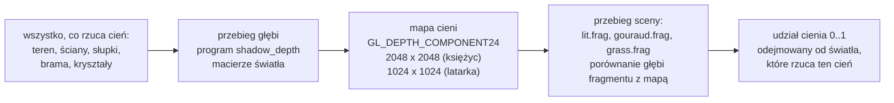

# Moduł renderer: cienie, mapy cieni księżyca i latarki

Kamień milowy: M7, część czwarta (cienie księżyca) i część piąta (cień latarki, latarka w ręce). Temat wykładu: 11 (Shadow mapping), **w trakcie**: testy ręczne i macOS są otwarte (sekcja 5.11).
Kod: przestrzeń światła [`src/scene/LightSpace.hpp`](../../../src/scene/LightSpace.hpp) i [`LightSpace.cpp`](../../../src/scene/LightSpace.cpp), ustawienia i matematyka bez OpenGL [`src/game/Shadows.hpp`](../../../src/game/Shadows.hpp) i [`Shadows.cpp`](../../../src/game/Shadows.cpp), klasa mapy cieni [`src/game/ShadowMap.hpp`](../../../src/game/ShadowMap.hpp) i [`ShadowMap.cpp`](../../../src/game/ShadowMap.cpp), sampler z porównaniem [`src/gfx/ComparisonSampler.hpp`](../../../src/gfx/ComparisonSampler.hpp) i [`ComparisonSampler.cpp`](../../../src/gfx/ComparisonSampler.cpp), shadery [`assets/shaders/shadow_depth.vert`](../../../assets/shaders/shadow_depth.vert), [`shadow_depth.frag`](../../../assets/shaders/shadow_depth.frag) i [`common/shadows.glsl`](../../../assets/shaders/common/shadows.glsl), wywołania w [`src/game/NightMazeApp.cpp`](../../../src/game/NightMazeApp.cpp) (`drawMoonShadowMap`, `drawFlashlightShadowMap`, `drawShadowCasters`, `setShadowUniformsOf`, `drawLitMaze`, `drawGrass`), pozycja latarki w ręce w [`src/game/Lighting.hpp`](../../../src/game/Lighting.hpp) i [`Lighting.cpp`](../../../src/game/Lighting.cpp) (`flashlightPose`), panel [`src/debug/panels/ShadowsPanel.cpp`](../../../src/debug/panels/ShadowsPanel.cpp), testy w [`tests/ShadowTests.cpp`](../../../tests/ShadowTests.cpp) i [`tests/LightingTests.cpp`](../../../tests/LightingTests.cpp).

Dlaczego ten dokument stoi w katalogu `renderer`, chociaż klasa nazywa się `game::ShadowMap` i leży w `src/game/`, wyjaśnia [`README.md`](README.md). Dokument zakłada znajomość macierzy widoku i rzutowania oraz bufora głębi ([`../scene/camera.md`](../scene/camera.md)), świateł gry i funkcji `computeLighting` ([`../scene/lights.md`](../scene/lights.md), [`lighting-gouraud-phong.md`](lighting-gouraud-phong.md)), framebufferów ([`../gfx/framebuffers.md`](../gfx/framebuffers.md)) i obiektu samplera ([`../gfx/textures.md`](../gfx/textures.md)). Samą klasę `gfx::ComparisonSampler` opisuje [`../gfx/comparison-sampler.md`](../gfx/comparison-sampler.md): tutaj jest teoria i wszystko, co robi z nią gra.

**Stan na dziś (2026-10-06):** dwa światła rzucają cienie, księżyc i latarka. Ściany, słupki, brama, kryształy i wzgórza rzucają cień w świetle **księżyca** i w świetle **latarki**. Przed sceną gra rysuje wszystko, co rzuca cień, **dwa razy**: z kierunku księżyca do tekstury głębi 2048 x 2048 (rzut ortograficzny, sekcja 2.2) i z ręki gracza do tekstury 1024 x 1024 (**rzut perspektywiczny**, sekcja 2.20). Programy `lit`, `gouraud` i `grass` sprawdzają w obu mapach każdy fragment. Każdy cień odbiera **tylko udział własnego światła**: cień księżyca odbiera światło księżyca, cień latarki odbiera światło latarki, a światło otoczenia, światła kryształów i świecenie własne zostają (sekcje 2.14 i 2.20.5). Wszystkim steruje dwunasty panel **Shadows**, który ma dwie zakładki, `Moon` i `Flashlight`. Każda ma przełącznik, rozdzielczość (1024 albo 2048), dwa suwaki biasu w metrach, filtr sprzętowy 2 x 2, jądro PCF od 3 x 3 do 7 x 7, siłę cienia i podgląd mapy. Programów shaderów jest jedenaście, paneli dwanaście (obie liczby bez zmian od czwartej części). Światła kryształów **nie rzucają cieni**: świecą przez ściany jak dotąd.

**Co zmieniła czwarta część poza cieniami (2026-10-05).** Domyślna intensywność księżyca (`LightingSettings::moonIntensity`) wzrosła z 0,12 do 0,2, żeby różnicę między światłem a cieniem było widać (sekcja 2.14). Stała `FOLDED_ROW_COUNT` wzrosła z 3 do 4, więc HUD stoi o jeden rząd pasków tytułowych niżej. Wyliczenie `AttachmentPreview` dostało trzecią wartość, `RawDepth`, a `post/preview.frag` trzecią gałąź (sekcja 2.17). Struktura `Lighting` w GLSL dostała dwa nowe pola z udziałem księżyca. Blok `LightBlock` **nie zmienił się**.

**Co zmieniła piąta część (2026-10-06).** (1) Latarka stoi w **ręce**: 0,20 m w prawo i 0,25 m w dół od oka, a jej oś celuje w punkt na osi widzenia 4 m przed okiem (`flashlightPose`, sekcja 2.20.8 i [`../game/flashlight.md`](../game/flashlight.md)). (2) `scene::LightSpace` ma drugi rodzaj rzutu: `scene::spotLightSpace` buduje rzut perspektywiczny, a struktura dostała pola `kind`, `position`, `nearPlane` i `farPlane` (sekcja 2.20.1). (3) Bias latarki jest w metrach i działa w przestrzeni świata, bo głębia rzutu perspektywicznego nie jest liniowa (sekcje 2.20.2 i 2.20.3). (4) Struktura `Lighting` w GLSL ma dwa kolejne pola, `flashlightDiffuse` i `flashlightSpecular`, a program Gouraud trzy nowe wyjścia (sekcja 2.15). (5) Podgląd mapy latarki jest linearyzowany (sekcja 2.20.6). (6) `buildLightSet` przyjmuje `FlashlightPose` zamiast oka i kierunku patrzenia, a `ShadowMap::drawPreview` przestrzeń światła. (7) `DebugContext` ma 38 pól (było 34), a panel Lights trzy suwaki ręki. Blok `LightBlock` **nie zmienił się** (928 bajtów): pozycja latarki dla mapy cieni jedzie osobnym uniformem.

Zgłoszone dla Windowsa (2026-10-05, część czwarta): bramka `make check` przechodzi (formatowanie, build i testy Debug i Release, clang-tidy), 310 przypadków testowych i 103751 asercji. Liczby zgadzają się z kodem: po trzeciej części M7 było 294 i 102412, doszło 16 przypadków i 1339 asercji w `tests/ShadowTests.cpp` (129 asercji niezależnych od labiryntu i po 5 na każde z 242 pudełek kolizji labiryntu startowego). Z wyłączonymi cieniami i księżycem cofniętym do 0,12 obraz jest identyczny co do piksela z obrazem sprzed czwartej części poza paskiem HUD (w trybie Phong różnica najwyżej 1/255). Build Debug nie zapisał żadnego błędu OpenGL przy 2048 i przy 1024. Pełna lista tego, co sprawdzone, a co nie: sekcja 5.11.

Zgłoszone dla Windowsa (2026-10-06, część piąta), nie powtarzałem: bramka `make check` zgłosiła **329 przypadków testowych i 104306 asercji** (przed tą częścią 310 i 103751). To 19 nowych przypadków: 15 w `tests/ShadowTests.cpp` (było 16, jest 31) i 4 w `tests/LightingTests.cpp` (było 11, jest 15; jeden istniejący przypadek zmienił nazwę). Ile z 555 nowych asercji przypada na który plik, nie policzyłem. Debug exe uruchomiony na 7 sekund: OpenGL 4.1.0 NVIDIA, zasoby wczytane, stderr pusty, panele ukryte. **Nie było ćwiczone**: rysowanie w trybie Gouraud, podgląd w zakładce Flashlight, ścieżka z wyłączoną latarką i `Reload shaders`. **Nikt nie oglądał obrazu** tej części ani panelu. **Na macOS ten kod nie był ani budowany, ani uruchamiany.** Pełna lista: sekcja 5.11.

## 1. Po co to jest

Do czwartej części M7 księżyc oświetlał każdą powierzchnię zwróconą w jego stronę, także tę, która stoi za ścianą. Model oświetlenia Phonga jest **lokalny**: liczy światło z normalnej, kierunku do światła i kierunku do oka i nie wie nic o tym, co stoi po drodze. Skutek: korytarz w głębi labiryntu jest tak samo jasny jak otwarte pole, a ściany wyglądają, jakby unosiły się nad ziemią, bo nic ich z nią nie łączy.

Cień odpowiada na jedno pytanie, którego model lokalny nie zadaje: **czy między tym punktem a światłem coś stoi?** Najprostsza i najczęściej używana odpowiedź w grafice czasu rzeczywistego to **mapa cieni** (shadow mapping). Potrzebne są do tego:

| Rzecz | Gdzie | Sekcja |
|---|---|---|
| widok i rzut światła: pudełko dopasowane do sceny (księżyc) i ostrosłup z czubkiem w świetle (latarka) | `scene::directionalLightSpace`, `scene::spotLightSpace` | 2.2, 2.3, 2.20.1, 5.2 |
| framebuffer z samą teksturą głębi | `gfx::Framebuffer` z `ColorFormat::None`, klasa `game::ShadowMap` | 3.1, 5.5 |
| przebieg głębi: scena z kierunku światła, bez kolorów | program `shadow_depth`, `NightMazeApp::drawShadowCasters` | 2.1, 4.1, 5.7 |
| odczyt z porównaniem | `sampler2DShadow`, `gfx::ComparisonSampler` | 2.6, 2.7 |
| filtrowanie krawędzi cienia | filtr sprzętowy 2 x 2 i pętla PCF w `common/shadows.glsl` | 2.8, 2.9, 4.2 |
| bias, czyli obrona przed cieniem rzucanym na samego siebie | `slopeScaledBias`, `game::shadowBias`, `game::biasInDepthUnits`, `game::biasForShader` | 2.10 do 2.12, 2.20.3 |
| decyzja, które światło cień odbiera | pola `moonDiffuse`, `moonSpecular`, `flashlightDiffuse` i `flashlightSpecular` struktury `Lighting` | 2.14, 2.15, 2.20.5 |
| druga mapa z rzutem perspektywicznym i latarka w ręce | `flashlightShadow` w `common/shadows.glsl`, `flashlightPose`, `NightMazeApp::drawFlashlightShadowMap` | 2.20 |

To jest temat 11 wykładu, "Shadow mapping", a PRD (sekcja 3) wymienia przy nim mapę ortograficzną dla księżyca, mapę perspektywiczną dla latarki, PCF i bias. Część czwarta dała pierwszą mapę, PCF i bias, część piąta drugą mapę, perspektywiczną (sekcja 2.20). Kod jest kompletny, ale temat **nie jest zaliczony**: testy ręczne na Windowsie i cały macOS są otwarte (sekcja 5.11).

## 2. Teoria

### 2.1 Idea: dwa przebiegi i jedno porównanie

Światło "widzi" dokładnie te powierzchnie, które oświetla. Wszystko, czego z miejsca światła nie widać, jest w cieniu. Mapa cieni zamienia to zdanie w dwa przebiegi rysowania:

1. **Przebieg głębi.** Scena jest rysowana tak, jak widzi ją światło, do tekstury głębi. Kolorów nie ma. Test głębi zostawia w każdym tekselu głębię **najbliższej** światłu powierzchni. Ta tekstura to mapa cieni.
2. **Przebieg sceny.** Scena jest rysowana zwykle, z kamery. Dla każdego fragmentu shader liczy tą samą macierzą światła, **w który teksel mapy** fragment trafia i **jaką ma głębię widzianą ze światła**. Potem porównuje dwie liczby:

```text
głębia fragmentu widziana ze światła   <=   głębia zapisana w mapie      ->  fragment jest oświetlony
głębia fragmentu widziana ze światła   >    głębia zapisana w mapie      ->  coś stoi bliżej światła: cień
```

Przykład na liczbach z testu `points on one ray of the light share a texel and differ in depth only`. Punkt na szczycie ściany i punkt 3 m dalej wzdłuż promienia księżyca (miejsce na ziemi, na które pada cień tego szczytu) lądują w **tym samym tekselu** mapy, a różnią się tylko głębią: o `3 / extent.z`, czyli o 3 m z całej głębi pudełka światła. W mapie zostaje mniejsza głębia (szczyt ściany), więc punkt na ziemi przegrywa porównanie i jest w cieniu.



Co z tego wynika od razu:

- Mapa cieni to **obraz**, więc ma rozdzielczość. Krawędź cienia jest tak dokładna, jak teksel mapy jest mały na powierzchni (sekcja 2.4).
- Mapa przechowuje **jedną głębię na teksel**, a teksel pokrywa kawałek powierzchni. Stąd bierze się błąd zwany shadow acne i jego lekarstwo, bias (sekcje 2.10 i 2.11).
- Scena jest rysowana **dwa razy**: raz ze światła, raz z kamery. Każde światło z cieniem to jeden przebieg głębi więcej.
- Metoda nie wie nic o kształtach: działa dla wszystkiego, co da się narysować.

### 2.2 Widok światła i rzut ortograficzny

Żeby narysować scenę "ze światła", światło potrzebuje tego samego co kamera: macierzy widoku i macierzy rzutowania. Razem nazywam je **przestrzenią światła** (struktura `scene::LightSpace`).

**Rzut.** Księżyc jest światłem **kierunkowym**: jest tak daleko, że jego promienie są równoległe i w każdym punkcie sceny mają ten sam kierunek ([`../scene/lights.md`](../scene/lights.md)). Dla kamery używam rzutu perspektywicznego, w którym promienie widzenia rozchodzą się z jednego punktu i rzeczy dalsze są mniejsze. Dla promieni równoległych właściwy jest **rzut ortograficzny**: bryłą widzenia jest prostopadłościan (pudełko), a nie ostrosłup, i nic nie maleje z odległością.

| | Rzut perspektywiczny | Rzut ortograficzny |
|---|---|---|
| bryła widzenia | ścięty ostrosłup | prostopadłościan |
| promienie | rozchodzą się z punktu | równoległe |
| dla jakiego światła | reflektor, czyli latarka (sekcja 2.20.1) | światło kierunkowe, czyli księżyc |
| `w` po mnożeniu przez macierz | zależy od odległości | zawsze 1 |
| głębia zapisana w buforze | nieliniowa: gęsta blisko, rzadka daleko ([`post-process.md`](post-process.md), sekcja 2.10) | **liniowa**: rośnie równo z odległością |

Ostatni wiersz jest ważny dwa razy: przy biasie (sekcja 2.11, metr to zawsze ten sam ułamek zakresu głębi) i przy podglądzie mapy (sekcja 2.17, głębi nie trzeba przeliczać). Dla latarki, która ma rzut perspektywiczny, oba rachunki są inne: sekcje 2.20.2, 2.20.3 i 2.20.6.

`glm::ortho(left, right, bottom, top, near, far)` buduje macierz, która skaluje pudełko do sześcianu od -1 do 1 na każdej osi. To samo robi rzut perspektywiczny ze swoim ostrosłupem, tylko bez dzielenia przez odległość.

**Widok.** Światło kierunkowe **nie ma położenia**, ma tylko kierunek. Macierz widoku potrzebuje jednak punktu, z którego się patrzy. Kod stawia oko gdziekolwiek na promieniu przechodzącym przez środek sceny:

```cpp
const glm::vec3 center = (bounds.min + bounds.max) * 0.5F;
const glm::mat4 view = glm::lookAt(center - direction, center, up);
```

Oko stoi jeden krok (1 m) przed środkiem pudełka sceny i patrzy na ten środek, czyli wzdłuż kierunku lotu światła. To, **gdzie dokładnie** na promieniu stoi, nie ma znaczenia: przy rzucie ortograficznym przesunięcie oka wzdłuż kierunku patrzenia nie zmienia obrazu, a bliska i daleka płaszczyzna są potem mierzone od tego właśnie oka (sekcja 2.3). Dlatego bliska płaszczyzna pudełka może wyjść **ujemna** (za plecami oka), co przy rzucie ortograficznym jest dozwolone, a przy perspektywicznym nie.

**Wektor "w górę".** `glm::lookAt` buduje trzy osie widoku iloczynami wektorowymi kierunku patrzenia z wektorem `up`. Gdy oba są równoległe, iloczyn wektorowy ma długość 0 i normalizacja dzieli przez zero: macierz wypełnia się wartościami NaN. Zwykle `up` to góra świata, `(0, 1, 0)`. Księżyc świecący prosto w dół ma kierunek `(0, -1, 0)`, dokładnie równoległy. Suwak `Moon pitch` w panelu Lights sięga do -90 stopni, więc to nie jest przypadek teoretyczny. Kod ma na to próg:

| Warunek | Wektor `up` |
|---|---|
| `abs(direction.y) > VERTICAL_DIRECTION_LIMIT` (0,999, czyli światło odchylone od pionu o mniej niż około 2,6 stopnia: `acos(0,999) = 2,56`) | `(0, 0, -1)`, czyli `UP_FOR_VERTICAL_LIGHT` |
| w każdym innym przypadku | `(0, 1, 0)`, czyli `WORLD_UP` |

Wybór wektora `up` obraca tylko obraz w mapie wokół osi patrzenia. Cień na ziemi wychodzi ten sam, bo ten sam obrót dostaje odczyt. Przy przejściu przez próg mapa obraca się skokiem i to widać w podglądzie, nie w scenie (poza drobną zmianą ząbków na krawędziach cieni, bo siatka tekseli leży inaczej).

Jest jeszcze trzeci przypadek brzegowy: kierunek o długości 0 (krótszy niż `MIN_DIRECTION_LENGTH = 0,0001`) nie daje się znormalizować. Funkcja zastępuje go kierunkiem prosto w dół. Gra takiego kierunku nie wytworzy (`directionFromAngles` zawsze daje długość 1), ale funkcja jest częścią silnika i ma własne testy.

### 2.3 Dopasowanie pudełka do terenu, krok po kroku

Pudełko rzutu ortograficznego ma sześć ścian. Od tego, jak duże jest, zależy wszystko: za małe obcina część sceny (rzeczy poza nim nie rzucają cienia), za duże marnuje teksele na pustą przestrzeń i cienie robią się kanciaste. Gra dopasowuje pudełko **dokładnie do tego, co może rzucić cień**.

**Krok 1: pudełko sceny w świecie.** Funkcja `game::shadowCasterBounds` zwraca pudełko AABB:

```text
min = (terrain.minX(), terrain.minHeight(),                terrain.minZ())
max = (terrain.maxX(), terrain.maxHeight() + PILLAR_HEIGHT, terrain.maxZ())
```

W poziomie to cały teren, razem z marginesem wzgórz wokół labiryntu. W pionie: od najniższego punktu gruntu do wysokości słupka (`PILLAR_HEIGHT = 3,15` m) nad **najwyższym** punktem gruntu. Słupki są najwyższą rzeczą, która stoi na ziemi, więc wszystko, co rzuca cień, mieści się w środku. Słupek na szczycie najwyższego wzgórza nie istnieje (labirynt leży w niskim środku), więc góra pudełka jest wyżej, niż trzeba. Kosztuje to trochę zakresu głębi i daje regułę w jednej linii.

Dla labiryntu startowego (10 x 10 komórek, ziarno 1, skala wysokości 1): teren ma 48 m na 48 m (labirynt 20 m i po 14 m marginesu z każdej strony), `x` i `z` od -14 do 34, najniższy punkt 0,0 m, najwyższe wzgórze 3,37 m ([`terrain.md`](terrain.md)). Pudełko: od `(-14, 0, -14)` do `(34, 6,52, 34)`.

**Krok 2: osiem narożników do przestrzeni światła.** Pudełko w świecie jest ustawione wzdłuż osi świata, a światło patrzy na nie skosem. Każdy z ośmiu narożników (wszystkie kombinacje najmniejszego i największego `x`, `y`, `z`) jest mnożony przez macierz widoku światła. Wynik to położenie narożnika w układzie, w którym oś `x` to "w prawo dla światła", `y` "w górę dla światła", a `-z` "w głąb, wzdłuż promienia".

**Krok 3: najmniejsza i największa współrzędna.** Z ośmiu wyników biorę najmniejsze i największe `x`, `y` i `z`. Dla bryły wypukłej wystarczą narożniki: żaden punkt wnętrza nie wyjdzie poza zakres, który wyznaczają.

**Krok 4: margines.** Do każdej z sześciu ścian dodaję `LIGHT_BOX_MARGIN = 0,5` m. Rzucający, który leży dokładnie na ścianie pudełka (najniższy grunt, szczyt słupka), jest wtedy bezpiecznie w środku i nie odpada przez błąd zaokrąglenia przy przycinaniu.

**Krok 5: rzut.**

```text
const float nearPlane = -largest.z;
const float farPlane = -smallest.z;
glm::ortho(smallest.x, largest.x, smallest.y, largest.y, nearPlane, farPlane)
```

Dwa minusy biorą się stąd, że widok patrzy wzdłuż `-z`: narożnik **najbliższy** światłu ma **największe** `z`, a `glm::ortho` chce obu płaszczyzn jako odległości przed okiem.

**Liczby dla ustawień startowych** (księżyc: yaw 25, pitch -50; policzone przeze mnie z tych wzorów, szerokość potwierdza test). Kierunek lotu światła to `(0,272, -0,766, -0,583)` ([`skybox.md`](skybox.md), sekcja 2.9). Trzy osie widoku światła i rozmiar pudełka wzdłuż każdej z nich (suma rzutów trzech krawędzi pudełka sceny na oś, plus dwa marginesy):

| Oś światła | Wektor w świecie | Rachunek | Rozmiar |
|---|---|---|---|
| w prawo (`extent.x`) | `(0,906, 0, 0,423)` | `48 * 0,906 + 6,52 * 0 + 48 * 0,423 + 1` | **64,8 m** |
| w górę (`extent.y`) | `(0,324, 0,643, -0,694)` | `48 * 0,324 + 6,52 * 0,643 + 48 * 0,694 + 1` | **54,1 m** |
| w głąb (`extent.z`) | `(0,272, -0,766, -0,583)` | `48 * 0,272 + 6,52 * 0,766 + 48 * 0,583 + 1` | **47,0 m** |

Pierwszy wiersz zapisuje też komentarz w teście: kwadrat 48 m obrócony o 25 stopni ma szerokość `48 * (cos 25 + sin 25) = 63,8` m, plus margines z obu stron. Pole `LightSpace::extent` trzyma te trzy liczby, a panel Shadows pokazuje je w linii `Covers 64.8 x 54.1 m, 47.0 m deep`.

Dla porównania: księżyc prosto nad głową (pitch -90) dałby pudełko 49 x 49 m i 7,5 m głębi, a przy pitch -5 (prawie poziomo) 64,8 x 13,1 m i 65,1 m głębi. Mapa jest zawsze kwadratem tekseli, więc pudełko o nierównych bokach daje **niekwadratowe teksele** (sekcja 2.4).

**Dlaczego pudełko nie idzie za kamerą.** Druga szkoła dopasowuje pudełko do tego, co widzi kamera: mniejszy obszar, więc drobniejsze teksele. Ma to cenę, którą widać: gdy kamera się rusza, pudełko rusza się z nią, siatka tekseli przesuwa się po świecie i każda krawędź cienia **migocze** (shimmering), bo te same ściany trafiają co klatkę w inne teksele. Leczy się to przyciąganiem pudełka do siatki tekseli i stałym rozmiarem, a na duże sceny kaskadami (kilka map o różnych zasięgach). W tej grze nie było po co:

| | Pudełko wokół terenu (wybrane) | Pudełko wokół widoku kamery |
|---|---|---|
| od czego zależy | teren i dwa kąty księżyca | do tego pozycja i kierunek kamery |
| cienie przy ruchu gracza | stoją nieruchomo: mapa pokrywa co klatkę ten sam grunt | migoczą bez dodatkowej stabilizacji |
| teksel przy mapie 2048 | 3,2 cm dla labiryntu startowego | mniejszy przy małym zasięgu widoku |
| scena większa niż dziś | teksele rosną razem z terenem | bez zmian |
| kod | jedna funkcja, bez stanu | stabilizacja, często kaskady |

Scena jest mała i zamknięta: cały teren ma 48 m, ściana ma 0,2 m grubości i przy mapie 2048 zajmuje ponad 6 tekseli. Macierz jest liczona **co klatkę** od nowa z terenu i kątów księżyca (kilkadziesiąt mnożeń), więc nie ma niczego, o czym można zapomnieć po zbudowaniu nowego labiryntu, zmianie skali wysokości albo przesunięciu księżyca w panelu Lights. Notatka: [`../../decisions/shadow-box-fitted-to-terrain.md`](../../decisions/shadow-box-fitted-to-terrain.md).

### 2.4 Rozdzielczość: ile tekseli na metr

Mapa ma `N x N` tekseli i pokrywa `extent.x` na `extent.y` metrów. Teksel na powierzchni zwróconej prosto do światła ma więc `extent.x / N` na `extent.y / N` metrów. Funkcja `game::shadowTexelSize` zwraca **większy** z dwóch boków, a panel pokazuje go w centymetrach.

Labirynt startowy, liczby policzone z rozmiarów z sekcji 2.3:

| Rozmiar mapy | Teksel w poziomie mapy | Teksel w pionie mapy | Tekseli na metr | Co pokazuje panel | Ściana 0,2 m | Pamięć głębi |
|---|---|---|---|---|---|---|
| 2048 x 2048 (startowy) | 3,16 cm | 2,64 cm | 31,6 i 37,9 | `One texel: 3.2 cm` | ponad 6 tekseli | 4,2 mln tekseli: około 12,6 MB przy 3 bajtach na głębię, 16,8 MB, jeśli karta trzyma głębię w 4 bajtach |
| 1024 x 1024 | 6,33 cm | 5,28 cm | 15,8 i 18,9 | `One texel: 6.3 cm` | około 3 tekseli | cztery razy mniej |

Liczbę 3,16 cm przypina test `the shadow map of the moon is fine enough for the walls of the default maze` (0,0316 m z tolerancją 1 procenta), razem z tym, że mała mapa ma teksele dwa razy większe, a ściana przy dużej mapie ma ponad 6 tekseli grubości.

**Teksel na ziemi jest większy niż w mapie.** Liczby z tabeli dotyczą powierzchni prostopadłej do promieni. Światło pada na ziemię skosem, więc teksel rozciąga się na niej jak cień ołówka trzymanego skośnie: o `1 / cos(kąt między normalną a kierunkiem do światła)`. Dla poziomego gruntu ten cosinus to 0,766 (księżyc 50 stopni nad horyzontem, więc 40 stopni od pionu). Pionowy bok teksela, 2,64 cm, robi się na ziemi 3,45 cm. Poziomy zostaje 3,16 cm, bo oś "w prawo" światła leży w poziomie. Na ziemi teksel dużej mapy to więc około 3,2 na 3,4 cm. Na ścianie, którą światło tylko muska, rozciągnięcie jest dużo większe i tam krawędzie cieni są najbardziej poszarpane.

**Precyzja głębi nie jest problemem.** Głębia ma 24 bity, czyli 16 777 216 poziomów na 47 m: jeden poziom to około 2,8 mikrometra. Błędy, o których mówią sekcje 2.10 do 2.12, pochodzą z **rozmiaru teksela** (centymetry), nie z dokładności liczby.

### 2.5 Z przestrzeni światła do współrzędnych tekstury

Shader sceny zna pozycję fragmentu w świecie. Żeby zajrzeć do mapy, powtarza dla niej to, co shader wierzchołków i karta zrobiły w przebiegu głębi dla każdego wierzchołka:

| Krok | Wzór | Wynik |
|---|---|---|
| 1. macierz światła | `clip = projection * view * vec4(pozycja, 1)` | przestrzeń przycięcia światła |
| 2. dzielenie przez `w` | `ndc = clip.xyz / clip.w` | współrzędne znormalizowane: od -1 do 1 na każdej osi wewnątrz pudełka. Dla rzutu ortograficznego `w = 1` i ten krok nic nie zmienia. Dla latarki `w` jest odległością przed światłem i dzielenie przez nie jest właśnie tym, co sprawia, że dalsze rzeczy są w mapie mniejsze (sekcja 2.20.1) |
| 3. skala i przesunięcie | `coordinates = ndc * 0,5 + 0,5` | od 0 do 1 na każdej osi |

Skąd `* 0,5 + 0,5`: współrzędne znormalizowane biegną od -1 do 1, a tekstura jest adresowana od 0 do 1 i **w tym samym zakresie od 0 do 1 bufor głębi przechowuje głębię** (domyślne `glDepthRange(0, 1)`). Pomnożenie przez pół zwęża zakres o długości 2 do długości 1 (od -0,5 do 0,5), a dodanie pół przesuwa go na miejsce. Ta sama operacja dla wszystkich trzech składowych:

- `coordinates.x`, `coordinates.y`: miejsce w mapie, czyli współrzędna tekstury,
- `coordinates.z`: głębia fragmentu widziana ze światła, w tych samych jednostkach, w jakich mapa ją zapisała (0 na bliskiej płaszczyźnie światła, 1 na dalekiej).

Macierz z kroku 1 to `LightSpace::matrix()`, czyli `projection * view`. Rzutowanie stoi po lewej, bo wektor mnoży się od prawej: najpierw działa widok, potem rzut. Te trzy kroki są w kodzie dwa razy i muszą się zgadzać: w GLSL w funkcjach `moonShadow` i `flashlightShadow` (sekcja 4.2) i w C++ w `scene::shadowMapCoordinates`, na której stoją testy. Latarka dodaje do nich jeden krok przed dzieleniem: sprawdzenie, czy `w` jest dodatnie (sekcja 2.20.4).

Często spotyka się wersję, w której skala i przesunięcie są wmnożone w macierz ("bias matrix") i shader nie ma kroku 3. Wynik jest ten sam. Tu krok jest w shaderze jawnie, żeby dało się go pokazać palcem.

### 2.6 Porównanie i `sampler2DShadow`

Porównanie z sekcji 2.1 można napisać ręcznie: odczytać głębię zwykłym `sampler2D` i wstawić `if`. Gra robi to inaczej: mapę czyta sampler typu **`sampler2DShadow`**, a porównuje **karta graficzna**.

```text
uniform sampler2DShadow uMoonShadowMap;
float visibility = texture(uMoonShadowMap, vec3(u, v, głębia));
```

| | `sampler2D` | `sampler2DShadow` |
|---|---|---|
| argument `texture()` | `vec2`: miejsce | `vec3`: miejsce i **głębia odniesienia** |
| co zwraca | `vec4`: zawartość teksela | `float`: wynik porównania, 1 (oświetlony) albo 0 (w cieniu), a z filtrem liniowym wartości pośrednie |
| wymaga | niczego | tekstury głębi czytanej z włączonym trybem porównania (`GL_TEXTURE_COMPARE_MODE = GL_COMPARE_REF_TO_TEXTURE`) |

Funkcja porównania to `GL_LEQUAL`: wynik 1, gdy głębia odniesienia jest **mniejsza albo równa** zapisanej. Fragment tak samo daleko od światła jak powierzchnia w mapie (czyli ta sama powierzchnia) jest oświetlony.

Dlaczego karta, a nie `if` w shaderze: bo tylko karta potrafi porównać **przed** filtrowaniem. Zwykły filtr liniowy uśredniłby cztery **głębie**, a średnia głębi ściany i głębi ziemi za nią nie jest głębią niczego. Karta porównuje każdy z czterech tekseli osobno i miesza cztery **odpowiedzi** (sekcja 2.8).

Typ samplera w GLSL i tryb odczytu tekstury muszą do siebie pasować. Odczyt przez `sampler2DShadow` tekstury bez trybu porównania i odczyt przez `sampler2D` tekstury z trybem porównania mają według specyfikacji wynik nieokreślony. To jest powód następnej sekcji.

### 2.7 Obiekt samplera z porównaniem, a nie parametry tekstury

Tryb porównania to parametr odczytu, jak filtr i zawijanie. Takie parametry można zapisać w dwóch miejscach: w samej teksturze (`glTexParameteri`) albo w **obiekcie samplera** (`glSamplerParameteri`), który związany z jednostką teksturującą zastępuje parametry związanej tam tekstury ([`../gfx/textures.md`](../gfx/textures.md)).

Mapa cieni jest czytana **na dwa sposoby**:

| Kto czyta | Jak | Czego potrzebuje |
|---|---|---|
| `lit.frag`, `gouraud.frag`, `grass.frag` | `sampler2DShadow`, jednostka 3 (mapa księżyca) i 4 (mapa latarki, każda z własnym samplerem) | porównania |
| `post/preview.frag` (podgląd w panelu) | `sampler2D`, jednostka 0 | **surowych głębi**, bez porównania |

Gdyby tryb porównania był zapisany w teksturze, podgląd czytałby ją zwykłym `sampler2D` z włączonym porównaniem, czyli z wynikiem nieokreślonym. Dlatego tekstura głębi zostaje zwykłą teksturą (`gfx::Framebuffer` ustawia jej filtr najbliższego sąsiada i `GL_CLAMP_TO_EDGE`), a trzy reguły potrzebne cieniom trzyma osobny obiekt, `gfx::ComparisonSampler`:

| Reguła | Wywołanie | Po co |
|---|---|---|
| porównanie | `GL_TEXTURE_COMPARE_MODE = GL_COMPARE_REF_TO_TEXTURE`, `GL_TEXTURE_COMPARE_FUNC = GL_LEQUAL` | sekcja 2.6 |
| filtr liniowy (do wyłączenia) | `GL_TEXTURE_MIN_FILTER` i `GL_TEXTURE_MAG_FILTER`: `GL_LINEAR` albo `GL_NEAREST` | sekcja 2.8 |
| ramka | `GL_TEXTURE_WRAP_S` i `GL_TEXTURE_WRAP_T`: `GL_CLAMP_TO_BORDER`, `GL_TEXTURE_BORDER_COLOR = (1, 1, 1, 1)` | sekcja 2.13 |

Sampler należy do **jednostki**, nie do tekstury, więc kolejność wiązania ma znaczenie. `Framebuffer::bindDepthTexture` wiąże teksturę i **odwiązuje** sampler jednostki (`glBindSampler(unit, 0)`). `ShadowMap::bindForSampling` woła więc najpierw `bindDepthTexture`, a dopiero potem `m_sampler.bind(unit)`. W odwrotnej kolejności sampler zniknąłby z jednostki. Klasa linia po linii: [`../gfx/comparison-sampler.md`](../gfx/comparison-sampler.md).

### 2.8 Filtr sprzętowy 2 x 2

Przy filtrze najbliższego sąsiada (`GL_NEAREST`) odczyt z porównaniem daje dla fragmentu jedną odpowiedź z jednego teksela: 0 albo 1. Krawędź cienia jest wtedy schodkami o wielkości teksela mapy, czyli około 3 cm na ziemi, a z bliska schodki widać wyraźnie.

Przy filtrze liniowym (`GL_LINEAR`) na samplerze z porównaniem karta bierze cztery teksele wokół miejsca odczytu, **porównuje każdy osobno** i miesza cztery odpowiedzi wagami zwykłej interpolacji dwuliniowej. Wynik to liczba od 0 do 1, która zmienia się płynnie, gdy fragment przesuwa się między tekselami. To jest filtrowanie PCF w najmniejszym możliwym rozmiarze, 2 x 2, zrobione przez sprzęt za cenę jednego odczytu.

| Pole `Hardware 2 x 2 filter` | Filtr samplera | Odpowiedzi na jeden odczyt | Krawędź cienia |
|---|---|---|---|
| zaznaczone (startowo) | `GL_LINEAR` | 4, zmieszane | przejście o szerokości jednego teksela |
| odznaczone | `GL_NEAREST` | 1 | schodki |

Uczciwie o gwarancjach: to, że filtr liniowy na samplerze z porównaniem miesza wyniki porównań, robią dziś karty w praktyce i tak opisuje to dokumentacja OpenGL, ale specyfikacja 4.1 zostawia szczegóły implementacji. Na Windowsie (zgłoszone) działa. **Na macOS nikt tego nie sprawdził.**

### 2.9 PCF: jądro N x N i jego koszt

**PCF** (percentage closer filtering, "jaki procent jest bliżej") rozszerza ten sam pomysł: zamiast jednego miejsca shader pyta o **kwadrat** miejsc wokół fragmentu i bierze średnią odpowiedzi. Fragment głęboko w cieniu dostaje 0, daleko od cienia 1, a przy krawędzi ułamek: tyle, ile próbek wypadło po jasnej stronie. Krawędź robi się miękka na szerokość jądra.

Pętla w `shadowMapVisibility`:

```text
promień r:  jądro (2r + 1) x (2r + 1)
teksel = 1 / rozmiar mapy                   (textureSize)
dla y od -r do r, dla x od -r do r:
    suma += texture(mapa, (u + x * teksel, v + y * teksel, głębia))
wynik = suma / ((2r + 1) * (2r + 1))
```

| Lista `Kernel` | Promień | Odczytów na fragment | Tekseli porównanych przy filtrze 2 x 2 | Szerokość przejścia na ziemi przy mapie 2048 |
|---|---|---|---|---|
| PCF wyłączone | 0 | 1 | 4 | około 3 cm |
| `3 x 3` (startowo) | 1 | 9 | 36 | około 10 cm |
| `5 x 5` | 2 | 25 | 100 | około 16 cm |
| `7 x 7` | 3 | 49 | 196 | około 22 cm |

Ostatnia kolumna to szerokość jądra w tekselach razy około 3,2 cm, policzona, nie zmierzona. Koszt rośnie z **kwadratem** boku jądra. W oknie 1280 x 720 jest 921 600 pikseli: jądro 3 x 3 to do 8,3 miliona odczytów mapy na klatkę, 7 x 7 do 45 milionów (górne granice: bez nieba i bez fragmentów rysowanych kilka razy). Pętla ma stałą górną granicę, `MAX_PCF_RADIUS = 3`, zapisaną w dwóch miejscach, które muszą się zgadzać: w `common/shadows.glsl` i w `game::MAX_PCF_RADIUS`.

Trzy rzeczy, o które można zostać zapytanym:

- **Dlaczego nie uśrednić głębi i porównać raz?** Bo średnia głębi ściany i ziemi za nią to głębia punktu, który wisi w powietrzu. Porównanie z nią daje ostrą krawędź w złym miejscu. Uśrednia się **wyniki porównań**, nie głębie.
- **Dlaczego `texture` z dodanym przesunięciem, a nie `textureOffset`?** GLSL 4.10 wymaga, żeby przesunięcie w `textureOffset` było wyrażeniem stałym, a tu zmienia się w pętli.
- **Czy PCF daje prawdziwy półcień?** Nie. Prawdziwy półcień jest szerszy tam, gdzie cień pada dalej od rzucającego. PCF rozmywa każdą krawędź na tę samą szerokość w tekselach mapy. To filtr, nie fizyka.

Filtr sprzętowy i PCF działają **razem**: każdy z 9 odczytów jądra 3 x 3 jest przy zaznaczonym filtrze już zmieszany z 4 tekseli. Dlatego kwadrat 3 x 3 z filtrem liniowym nie ma schodków między sąsiednimi próbkami.

### 2.10 Shadow acne: powierzchnia, która zacienia samą siebie

Z pomysłu z sekcji 2.1 wynika błąd, który pojawia się zawsze, gdy nic się z nim nie zrobi. Oświetlona powierzchnia jest sama w mapie cieni (jest najbliżej światła), więc porównuje się **sama ze sobą**: głębia fragmentu z głębią zapisaną dla tej samej powierzchni. Powinien wyjść remis, czyli "oświetlony". Nie wychodzi, bo teksel mapy nie jest punktem.

Teksel pokrywa kawałek powierzchni (około 3 cm) i przechowuje **jedną** głębię: tę ze środka kawałka. Powierzchnia jest pochylona względem promieni światła, więc jej prawdziwa głębia zmienia się w obrębie teksela:

```text
        światło pada skosem (strzałki), powierzchnia jest pozioma

          \        \        \        \
           \        \        \        \
    ---+--------+--------+--------+--------+---   powierzchnia
       | teksel | teksel | teksel | teksel |
       |   A    |   B    |   C    |   D    |

    głębia zapisana w tekselu B = głębia w jego środku
    lewa połowa B:  punkty bliżej światła niż środek  -> głębia fragmentu < zapisana -> oświetlone
    prawa połowa B: punkty dalej od światła niż środek -> głębia fragmentu > zapisana -> "w cieniu"
```

Połowa każdego teksela wychodzi oświetlona, połowa zacieniona, i tak teksel za tekselem. Na ekranie to regularne ciemne prążki albo mora na powierzchniach, które powinny być jasne: **shadow acne**.

Liczby dla poziomego gruntu przy ustawieniach startowych (policzone). Światło pada 40 stopni od normalnej. Przejście o jeden teksel w pionie mapy (2,64 cm w przestrzeni światła) zmienia głębię o `2,64 cm * tan(40) = 2,2 cm`. W obrębie jednego teksela prawdziwa głębia odchodzi więc od zapisanej o najwyżej połowę tego, plus minus 1,1 cm. To jest wielkość błędu, który trzeba pokryć przy jednym odczycie z jednego teksela. W drugą stronę (w poziomie mapy) głębia gruntu się nie zmienia, bo oś "w prawo" światła leży poziomo: prążki biegną więc w poprzek kierunku, w którym pada światło.

**Jak acne wygląda z filtrami.** Z odczytem jednego teksela (filtr sprzętowy i PCF wyłączone) każdy fragment dostaje 0 albo 1 i widać ostre prążki. Z filtrami każdy fragment uśrednia wiele takich porównań, z których mniej więcej połowa wypada źle, więc zamiast prążków wychodzi **równe przyciemnienie** oświetlonych powierzchni. Tak właśnie zgłoszono (Windows, 2026-10-05): przy samych suwakach biasu ustawionych na 0 obraz wygląda na ogólnie ciemniejszy, a wyraźne prążki pojawiają się dopiero po wyłączeniu także PCF i filtra sprzętowego. Kto chce pokazać acne na obronie, wyłącza więc trzy rzeczy, nie jedną (sekcja 6.1).

### 2.11 Bias: wzór i liczby

Lekarstwo jest proste: przed porównaniem **przysunąć fragment do światła** o mały zapas, większy niż błąd z sekcji 2.10. Ten zapas to **bias**.

```text
bias = constantBias + slopeBias * (1 - facing)          w metrach

facing = cos(kąt między normalną powierzchni a kierunkiem DO światła), obcięty do zakresu 0..1
```

Dwie części, bo błąd zależy od pochylenia:

- **część stała** (`constantBias`, startowo 0,02 m) jest dodawana zawsze,
- **część zależna od pochylenia** (`slopeBias`, startowo 0,12 m) jest mnożona przez `1 - facing`: znika dla powierzchni zwróconej prosto do światła (tam głębia w obrębie teksela prawie się nie zmienia) i jest pełna dla powierzchni, którą światło tylko muska (tam zmienia się najbardziej).

`facing` liczy funkcja `moonFacing` w `common/lighting.glsl`: `dot(normal, -uDirectionalDirection.xyz)`. Wzór jest w kodzie dwa razy, jak współrzędne mapy: `slopeScaledBias` w GLSL i `game::shadowBias` w C++ (pod testami).

**Bias jest w metrach.** Suwaki w panelu pokazują `0.020 m` i `0.120 m`. Mapa przechowuje jednak głębię jako liczbę od 0 do 1, więc przed wysłaniem do shadera C++ przelicza metry na jednostki głębi (`game::biasInDepthUnits`):

```text
bias w jednostkach głębi = bias w metrach / extent.z
```

Dzielenie wystarcza, bo głębia rzutu ortograficznego jest liniowa: cały zakres od 0 do 1 to `extent.z` metrów, równo rozłożonych. Dzięki temu ustawienie znaczy to samo niezależnie od tego, jak głębokie wyszło pudełko: przesunięcie księżyca z pitch -50 na -5 zmienia głębię pudełka z 47 na 65 m, a 2 cm zostaje 2 cm. Obie części są przeliczane osobno i wysyłane jako `uMoonShadowConstantBias` i `uMoonShadowSlopeBias`, a shader składa je wzorem wyżej i odejmuje od `coordinates.z`.

Liczby dla ustawień startowych i labiryntu startowego (`extent.z = 47,0` m, policzone):

| Powierzchnia | Normalna | `facing` | Bias w metrach | Bias w jednostkach głębi |
|---|---|---|---|---|
| poziomy grunt | `(0, 1, 0)` | 0,766 | `0,02 + 0,12 * 0,234 = 0,048` | 0,00102 |
| ściana zwrócona na `+Z` | `(0, 0, 1)` | 0,583 | `0,02 + 0,12 * 0,417 = 0,070` | 0,00149 |
| ściana zwrócona na `-X` | `(-1, 0, 0)` | 0,272 | `0,02 + 0,12 * 0,728 = 0,107` | 0,00228 |
| ściany zwrócone na `+X` i `-Z` (tyłem do księżyca) | | poniżej 0, obcięte do 0 | `0,02 + 0,12 = 0,14` | 0,00298 |
| sama część stała | | 1 | 0,02 | 0,00043 |

Dla gruntu bias 4,8 cm jest ponad cztery razy większy od błędu jednego teksela (1,1 cm). Zapas jest potrzebny, bo PCF pyta także o **sąsiednie** teksele, a te leżą na tej samej pochyłej powierzchni dalej od fragmentu: próbka oddalona o `k` tekseli w pionie mapy ma na gruncie głębię różną o `k * 2,2 cm`. Przy jądrze 3 x 3 z filtrem sprzętowym najdalszy teksel, który wchodzi do średniej, leży do 2 tekseli od fragmentu: do 4,4 cm, czyli tuż pod biasem 4,8 cm.

**Czego ten wzór nie robi, i co z tego wynika (policzone, nie zaobserwowane).** Bias nie zależy ani od rozmiaru teksela, ani od promienia PCF. Z tych samych rachunków:

| Ustawienie | Najdalszy teksel w średniej | Różnica głębi na gruncie | Bias gruntu | Wniosek z rachunku |
|---|---|---|---|---|
| 2048, `3 x 3` (startowe) | do 2 tekseli | do 4,4 cm | 4,8 cm | mieści się |
| 2048, `5 x 5` | do 3 tekseli | do 6,6 cm | 4,8 cm | skrajne próbki mogą wypaść jako cień |
| 2048, `7 x 7` | do 4 tekseli | do 8,8 cm | 4,8 cm | jak wyżej, mocniej |
| 1024, `3 x 3` | do 2 tekseli po 5,28 cm | do 8,9 cm | 4,8 cm | jak wyżej |

Gdyby tak było na ekranie, oświetlony grunt byłby przy dużym jądrze albo przy małej mapie **lekko ciemniejszy** niż przy wyłączonych cieniach, równo, bez prążków. Podobnie zbocza wzgórz odwrócone od księżyca: błąd rośnie tam jak tangens kąta, a część zależna od pochylenia tylko liniowo. To jest szacunek geometryczny i może przesadzać (skrajne teksele mają w filtrze dwuliniowym małe wagi). Nikt tego nie mierzył: jest na liście testów ręcznych ([`../../guides/build-windows.md`](../../guides/build-windows.md), sekcja o części czwartej M7) i w ćwiczeniu 9. Podpowiedź listy `Resolution` mówi to samo jednym zdaniem: mniejsza mapa ma większe teksele i potrzebuje większego biasu.

**Czego w kodzie nie ma.** Typowe poradniki dodają do biasu w shaderze dwa narzędzia OpenGL: `glPolygonOffset` (karta sama odsuwa głębię przy rysowaniu mapy) i rysowanie do mapy tylnych ścian zamiast przednich (`glCullFace(GL_FRONT)`). Gra nie używa żadnego z nich. Odrzucanie ścian nie jest w ogóle włączone (jedyne miejsce w kodzie, które o nie pyta, to `GrassRenderer`), więc do mapy trafiają obie strony każdej ściany, a test głębi zostawia bliższą. Bias jest **w jednym miejscu**, w shaderze, w jednostkach, które da się pokazać linijką. Notatka: [`../../decisions/shadow-bias-in-metres-in-shader.md`](../../decisions/shadow-bias-in-metres-in-shader.md).

**Normalna do biasu to normalna modelu.** W `lit.frag` oświetlenie liczy się z normalnej z mapy normalnych, ale bias dostaje `moonFacing(normalize(vNormal))`, czyli normalną trójkąta. Bias należy do trójkąta, który został narysowany do mapy cieni, a wypukłości mapy normalnych w tym trójkącie nie ma.

**Bias latarki jest liczony inaczej.** Wzór jest ten sam, ale mapa latarki ma rzut perspektywiczny, a jej głębia nie jest liniowa, więc dzielenie metrów przez `extent.z` nie działa. Bias latarki zostaje w metrach aż do shadera i przesuwa **punkt w przestrzeni świata** (sekcje 2.20.2 i 2.20.3). Funkcja `game::biasForShader` wybiera sposób według rodzaju rzutu światła.

### 2.12 Peter panning: za dużo biasu

Bias ma swoją cenę. Fragment przysunięty do światła o `b` metrów wygrywa porównanie nie tylko ze sobą, ale z każdym rzucającym, który leży **bliżej niż `b`** przed nim na promieniu. Cień zaczyna się więc dopiero `b` metrów za rzucającym. Przy dużym biasie cień **odkleja się** od przedmiotu, który go rzuca, i przedmiot wygląda, jakby unosił się nad ziemią. Nazwa pochodzi od Piotrusia Pana, który zgubił swój cień.

W tej scenie ratuje grubość ścian. Punkt na ziemi tuż za ścianą, po stronie cienia, widzi w mapie **oświetloną ścianę** tej samej ściany, a droga promienia przez ścianę o grubości 0,2 m ma długość `0,2 / |cosinus kąta między promieniem a normalną ściany|`:

| Ściana | Droga promienia przez ścianę (księżyc startowy) | Największy bias startowy (0,14 m) | Bias 0,5 m (koniec suwaka `Constant bias`) |
|---|---|---|---|
| normalna wzdłuż Z | `0,2 / 0,583 = 0,34 m` | mniejszy: cień trzyma się ściany | większy: jasny pas przy podstawie ściany po stronie cienia |
| normalna wzdłuż X | `0,2 / 0,272 = 0,74 m` | mniejszy | mniejszy: tu cień jeszcze się trzyma |

Liczby są policzone. Zgłoszone z działającej gry (Windows, 2026-10-05): przy biasie 0,5 m efekt widać jako **światło przeciekające na ścianach**. Komentarz w `Shadows.hpp` mówi to samo jednym zdaniem: ściany mają 0,2 m, więc peter panning pokazuje się dopiero przy biasie tej wielkości. Suwaki celowo sięgają dużo dalej (0,5 m i 1,0 m), żeby dało się go pokazać.

Strojenie biasu to zawsze kompromis między dwoma błędami:

| Bias | Błąd |
|---|---|
| za mały | acne: powierzchnie zacieniają same siebie |
| za duży | peter panning: cień odkleja się od rzucającego, światło przecieka |
| w sam raz | większy niż błąd teksela na najbardziej pochylonej oświetlonej powierzchni, mniejszy niż najcieńszy rzucający |

### 2.13 Poza mapą: ramka i przypadek `z > 1`

Mapa pokrywa skończone pudełko. Co ma dostać fragment, który wypada poza nim?

**Z boku mapy** (`x` albo `y` poza zakresem od 0 do 1). Odpowiada za to zawijanie samplera. `GL_REPEAT` powieliłby mapę w nieskończoność: cienie labiryntu powtarzałyby się na wszystkim wokół. `GL_CLAMP_TO_EDGE` rozciągnąłby skrajny wiersz tekseli: smugi cienia do horyzontu od każdej rzeczy na brzegu mapy. Sampler ma `GL_CLAMP_TO_BORDER` z ramką o wartości 1, czyli głębią dalekiej płaszczyzny. Nic nie jest dalej niż 1, więc porównanie `głębia <= 1` wygrywa każdy fragment: **wszystko poza mapą jest oświetlone**. Shader nie potrzebuje do tego żadnego warunku.

**Za daleką płaszczyzną** (`z > 1`). Tu ramka nie pomaga: miejsce w mapie jest poprawne, tylko fragment leży głębiej niż pudełko. Głębia odniesienia jest przy porównaniu obcinana do zakresu od 0 do 1, więc punkt daleko za pudełkiem zachowywałby się jak punkt na dalekiej płaszczyźnie i wypadał w cieniu wszystkiego, co mapa zapisała w jego tekselu. Stąd jedyny warunek w `shadowMapVisibility`:

```glsl
if (coordinates.z > 1.0) {
    return 1.0;
}
```

**Czy to się dziś zdarza?** Dla księżyca nie powinno: jego pudełko obejmuje cały teren z marginesem, a wszystko, co gra rysuje programami z cieniem, stoi na tym terenie. Dla **latarki zdarza się ciągle**: jej mapa pokrywa tylko ostrosłup wokół stożka światła, więc większość sceny leży poza nią. Z boku ostrosłupa działa ramka. Za daleką płaszczyzną (dalej niż zasięg latarki) działa warunek `z > 1`. Tuż obok jest trzeci przypadek, którego księżyc nie ma: punkt **za światłem** albo na jego wysokości (sekcja 2.20.4). Fragment z boku poza ostrosłupem jest też poza stożkiem światła, więc nie dostaje światła latarki i nie ma czego zabierać cieniem. Za daleką płaszczyzną jest inaczej: światło latarki nigdy nie dochodzi dokładnie do zera (przy zasięgu zostaje 5 procent jasności, `scene::attenuationForRadius`), a cień tam nie jest sprawdzany. Dalej niż 16 m światło latarki idzie więc przez ściany, tylko jest bardzo słabe (sekcja 2.19). Testy sprawdzają samą geometrię: punkt 100 m na wschód od pudełka ma `x > 1`, a punkt 100 m pod nim `z > 1` (`a point outside the bounds lands outside the shadow map`).

Tekstura, do której nic nie narysowano, ma po `glClear` głębię 1 w każdym tekselu: pusta mapa to "wszędzie oświetlone", tak jak ramka.

### 2.14 Które światło jest cieniowane: udział księżyca i udział latarki

Mapa cieni księżyca mówi o jednej rzeczy: czy do punktu dociera **światło księżyca**. Nie mówi nic o latarce ani o kryształach. Punkt w cieniu ściany jest zasłonięty przed księżycem, ale latarka gracza świeci na niego z zupełnie innej strony. Cień musi więc zabrać dokładnie jeden składnik oświetlenia i żadnego innego. Od części piątej to samo dotyczy cienia latarki: ma własną mapę i zabiera tylko udział latarki. Sekcja opisuje mechanizm na przykładzie księżyca, a potem pokazuje, co doszło dla latarki.

Funkcja `computeLighting` sumuje wszystkie światła do dwóch liczb, `diffuse` i `specular`. Zapisuje **osobno** także to, co w tych sumach pochodzi od księżyca (od części czwartej) i od latarki (od części piątej):

```glsl
struct Lighting {
    vec3 diffuse;            // ambient light plus the Lambert term of every light
    vec3 specular;           // the highlight of every light
    vec3 moonDiffuse;        // the part of diffuse that comes from the moon
    vec3 moonSpecular;       // the part of specular that comes from the moon
    vec3 flashlightDiffuse;  // the part of diffuse that comes from the flashlight
    vec3 flashlightSpecular; // the part of specular that comes from the flashlight
};
```

`diffuse` i `specular` **już zawierają** oba udziały. Wołający odejmuje je z powrotem tam, gdzie jest cień. Tak wygląda to w `lit.frag` (część czwarta miała tylko pierwszą linię z księżycem):

```glsl
vec3 modelNormal = normalize(vNormal);
float shadow = moonShadow(vWorldPosition, moonFacing(modelNormal));
float flashlightShade =
    flashlightShadow(vWorldPosition, flashlightFacing(modelNormal, vWorldPosition));

vec3 diffuse = max(lighting.diffuse - lighting.moonDiffuse * shadow -
                       lighting.flashlightDiffuse * flashlightShade,
                   0.0);
vec3 specular = max(lighting.specular - lighting.moonSpecular * shadow -
                        lighting.flashlightSpecular * flashlightShade,
                    0.0);
```

`shadow` i `flashlightShade` to **udziały cienia**: 0 poza cieniem, siła cienia (`uMoonShadowStrength`, `uFlashlightShadowStrength`, startowo 1) w środku cienia, wartości pośrednie na miękkiej krawędzi. Tabela tego, co zostaje w pełnym cieniu przy sile 1:

| Składnik | W cieniu księżyca | W cieniu latarki | W obu |
|---|---|---|---|
| światło otoczenia (`uAmbient`) | zostaje | zostaje | zostaje |
| rozproszone i odbłysk od **księżyca** | **znikają** | zostają | **znikają** |
| rozproszone i odbłysk od **latarki** | zostają | **znikają** | **znikają** |
| światła kryształów | zostają (nie mają map cieni: świecą przez ściany) | zostają | zostają |
| świecenie własne (`uEmissive`) | zostaje: dodawane po odjęciu | zostaje | zostaje |

Dlaczego odejmowanie, a nie parametr "cień" w `computeLighting`: funkcja jest wspólna dla `lit.frag` (na fragment) i `gouraud.vert` (na wierzchołek), a w trybie Gouraud cień musi być sprawdzony w **innym etapie** niż światło (sekcja 2.15). Funkcja, która o cieniach nie wie nic i oddaje udziały świateł osobno, obsługuje oba przypadki bez zmiany. `max(..., 0.0)` jest tylko na błąd zaokrąglenia: różnica na papierze nigdy nie jest ujemna (udziały obu świateł są częściami sumy, a udziały cienia nie przekraczają 1), ale dwie liczby zmiennoprzecinkowe, które powinny być równe, mogą się różnić ostatnią cyfrą.

**Co jest inne dla latarki.** Jej udział w `computeLighting` jest liczony tym samym wzorem co dawniej: gałąź reflektora zapisuje swoje dwa składniki do pól `flashlightDiffuse` i `flashlightSpecular` i dodaje je do sum (robi to, co `addLight`). Pola są ustawiane na zero **przed** gałęzią, bo latarka bywa wyłączona, a pole struktury, do którego nikt nie zapisał, ma w GLSL wartość nieokreśloną. Cosinus do biasu liczy funkcja `flashlightFacing(normal, position)`: dla księżyca kierunek do światła jest wszędzie ten sam, dla latarki, która jest punktem, zależy od miejsca, więc funkcja bierze też pozycję fragmentu. Dokładnie jak dla księżyca, do biasu idzie normalna modelu, a nie normalna z mapy normalnych.

**Suwak `Strength`.** Przy 1 w cieniu nie zostaje nic ze światła księżyca. Przy 0,5 zostaje połowa. Przy 0 cienie są niewidoczne, choć mapa nadal jest rysowana. To nie jest model fizyczny (prawdziwy cień nie przepuszcza połowy światła), tylko pokrętło do wyglądu. C++ obcina wartość do zakresu od 0 do 1 przed wysłaniem.

**Skąd nowa intensywność księżyca.** W cieniu zostaje samo światło otoczenia, więc kontrast cienia to stosunek "otoczenie plus księżyc" do "samo otoczenie". Przy starej intensywności 0,12 różnica była za mała, żeby cień czytał się w nocy. Przy 0,2 poziomy grunt w świetle księżyca jest około pięć razy jaśniejszy niż w cieniu (komentarz w `Lighting.hpp`). Sprawdziłem na wartościach liniowych: światło otoczenia `(0,105, 0,135, 0,225)` w sRGB to `(0,0108, 0,0164, 0,0414)` liniowo, a księżyc na gruncie to `0,2 * 0,766 * (0,263, 0,381, 1,0) = (0,040, 0,058, 0,153)`. Stosunek jasności z księżycem do jasności bez niego wynosi od 4,6 do 4,7 w każdym kanale.

**Tryby, w których cieni nie ma.** Mapę czytają tylko programy `lit` (tryby Phong i Blinn-Phong), `gouraud` (tryb Gouraud) i `grass` (gdy trawa jest oświetlana). Tryb `Unlit` i oba widoki diagnostyczne (`Normals as colour`, `UVs as colour`) rysują scenę programem `textured`, który nie włącza `common/shadows.glsl`: nie ma tam światła, więc nie ma z czego odejmować.

**Przy okazji: mapa normalnych i tył ściany.** Ściana odwrócona tyłem do księżyca ma udział księżyca równy 0 z samego wzoru Lamberta. Z mapą normalnych pojedyncze teksele mogą mieć normalną odchyloną na tyle, że dostają odrobinę światła księżyca "zza rogu". Od tej części taki fragment jest w cieniu własnej ściany (0,2 m grubości to więcej niż największy bias startowy, 0,14 m), więc to światło znika. Wynika to z kodu, nikt tego nie porównywał na zrzutach.

Notatka: [`../../decisions/shadow-takes-only-moon-light.md`](../../decisions/shadow-takes-only-moon-light.md) (decyzja z części czwartej: cień zabiera tylko udział światła, które go rzuca. Część piąta stosuje ją do drugiego światła bez zmiany zasady).

### 2.15 Gouraud: światło na wierzchołek, cień na fragment

Tryb Gouraud liczy oświetlenie w shaderze **wierzchołków**, a rasteryzer miesza wynik w poprzek trójkąta ([`lighting-gouraud-phong.md`](lighting-gouraud-phong.md)). Gdzie w takim programie sprawdzić cień?

Gdyby w wierzchołku: segment ściany ma cztery wierzchołki na ścianę boczną. Krawędź cienia przecina ją w dowolnym miejscu, a cztery wierzchołki dałyby cztery odpowiedzi, zmieszane liniowo od rogu do rogu: ściana byłaby cała jasna, cała ciemna albo w łagodnym gradiencie, który nie ma nic wspólnego z kształtem cienia. To nie wyglądałoby jak cień.

Rozwiązanie rozdziela dwie rzeczy:

| Co | Gdzie liczone w programie `gouraud` |
|---|---|
| światło (wszystkie światła, wzory Lamberta i Phonga) | na **wierzchołek**, jak dotąd: `computeLighting` w `gouraud.vert` |
| **udział księżyca** i **udział latarki** w tym świetle | na wierzchołek, w osobnych zmiennych |
| czy fragment jest w cieniu księżyca i czy w cieniu latarki | na **fragment**: `moonShadow` i `flashlightShadow` w `gouraud.frag` |

Shader wierzchołków dostał w części czwartej cztery nowe wyjścia:

```glsl
out vec3 vMoonDiffuseLight;  // the part of vDiffuseLight that comes from the moon
out vec3 vMoonSpecularLight; // the part of vSpecularLight that comes from the moon
out vec3 vWorldPosition;     // position in world space
out float vMoonFacing;       // cosine between the normal and the direction to the moon
```

a w części piątej trzy kolejne, dla cienia latarki. Pozycja w świecie jest wspólna dla obu map:

```glsl
out vec3 vFlashlightDiffuseLight;  // the part of vDiffuseLight from the flashlight
out vec3 vFlashlightSpecularLight; // the part of vSpecularLight from the flashlight
out float vFlashlightFacing;       // cosine between the normal and the way to the flashlight
```

a shader fragmentów robi z nimi to samo odejmowanie co `lit.frag`, tylko na wartościach zmieszanych przez rasteryzer:

```glsl
float shadow = moonShadow(vWorldPosition, vMoonFacing);
float flashlightShade = flashlightShadow(vWorldPosition, vFlashlightFacing);
vec3 diffuse = max(vDiffuseLight - vMoonDiffuseLight * shadow -
                       vFlashlightDiffuseLight * flashlightShade,
                   0.0);
vec3 specular = max(vSpecularLight - vMoonSpecularLight * shadow -
                        vFlashlightSpecularLight * flashlightShade,
                    0.0);
```

Dla latarki jest tu jedna rzecz, której księżyc nie ma: `vFlashlightFacing` jest cosinusem policzonym **na wierzchołku** i zmieszanym liniowo w poprzek trójkąta, a kierunek do latarki zmienia się w poprzek trójkąta (latarka jest punktem). Zmieszana wartość jest przybliżeniem cosinusa liczonego na fragment, więc bias latarki w trybie Gouraud jest nieco inny niż w trybie Phong. To wynika z kodu, nikt tego nie porównywał na zrzutach. Tryb Gouraud z cieniem latarki **nie był też uruchomiony** (zgłoszone: sekcja 5.11).

Uczciwie: zdanie "w trybie Gouraud wszystko liczy się na wierzchołek" ma od tej części **jeden wyjątek**, odczyt mapy cieni. Różnica między trybami Gouraud i Phong, którą pokazuje temat 7, zostaje nietknięta: to nadal pytanie, gdzie liczone jest **światło**. Odbłysk jest w Gouraud kanciasty jak przedtem, a krawędzie cieni są w obu trybach tak samo ostre. Notatka: [`../../decisions/gouraud-shadow-test-per-fragment.md`](../../decisions/gouraud-shadow-test-per-fragment.md) (część piąta powtarza ten wzór dla udziału latarki, tak jak notatka przewidywała).

### 2.16 Trawa: przyjmuje cień, nie rzuca go

Trawa rośnie pod ścianami, więc bez cienia świeciłaby jasnymi kępkami na zacienionej ziemi. `grass.frag` włącza więc `common/shadows.glsl` i odejmuje udział księżyca i udział latarki tak samo jak ściany, z normalną podłoża `GRASS_NORMAL`, którą trawa jest oświetlana ([`grass-geometry.md`](grass-geometry.md)):

```glsl
Lighting lighting = computeLighting(gWorldPosition, GRASS_NORMAL);
float shadow = moonShadow(gWorldPosition, moonFacing(GRASS_NORMAL));
float flashlightShade =
    flashlightShadow(gWorldPosition, flashlightFacing(GRASS_NORMAL, gWorldPosition));
light = max(lighting.diffuse - lighting.moonDiffuse * shadow -
                lighting.flashlightDiffuse * flashlightShade,
            0.0);
```

Trawa **nie rzuca** cienia: `drawShadowCasters` jej nie rysuje. Powód jest w liczbach: źdźbło ma 4 cm szerokości u nasady (`ROOT_HALF_WIDTH = 0,02` w `grass.geom`) i zwęża się do zera, a teksel mapy księżyca ma około 3,2 cm. Cień źdźbła byłby migotaniem pojedynczych tekseli, które rusza się z wiatrem, na ziemi, którą sama kępka i tak zasłania. Mapa latarki ma drobniejsze teksele (około 3 mm na ścianie 4 m od ręki, sekcja 2.20.7), ale trawa jest wyłączona także z niej: jedna reguła dla obu świateł i brak cieni, które kołyszą się na każdej ścianie, obok której przechodzi snop. Do tego przebieg głębi dla trawy wymagałby osobnego programu z shaderem geometrii. Notatka: [`../../decisions/grass-casts-no-shadow.md`](../../decisions/grass-casts-no-shadow.md).

### 2.17 Podgląd mapy: mały przebieg zamiast tekstury głębi

Panel Shadows pokazuje mapę jako obraz, po jednym w każdej zakładce: czarne jest blisko światła, białe daleko albo puste, a ściany labiryntu to ciemne linie. Ten rozdział opisuje podgląd mapy księżyca. Mapa latarki ma ten sam przebieg, ale w innym trybie (sekcja 2.20.6). Najprościej byłoby podać ImGui teksturę głębi. `ImGui::Image` rysuje jednak teksturę zwykłym samplerem i bierze z niej cztery kanały, a tekstura głębi ma dane tylko w pierwszym: obraz wychodzi **czerwony** zamiast szarego. Dlatego `ShadowMap::drawPreview` rysuje mapę jednym trójkątem pełnoekranowym do małego framebuffera `GL_RGBA8` (256 x 256), a panel pokazuje jego teksturę koloru.

Rysuje ją tym samym programem `preview`, którym panel Framebuffers pokazuje głębię sceny, w nowym trybie:

| `uMode` | `AttachmentPreview` | Co robi `post/preview.frag` |
|---|---|---|
| 0 | `Color` | koduje kolor HDR do sRGB |
| 1 | `Depth` | głębia **perspektywiczna**: przelicza na metry (`linearDepth`) i dzieli przez zakres. Pokazuje głębię sceny (panel Framebuffers) i, od części piątej, mapę latarki (z płaszczyznami światła w miejscu płaszczyzn kamery) |
| 2 | `RawDepth` (nowe) | głębia **tak, jak jest zapisana**: `vec3(texture(uSource, vUv).r)` |

Tryb 2 nie potrzebuje przeliczenia, bo głębia rzutu ortograficznego rośnie równo z odległością (sekcja 2.2): szarość jest wprost odległością od bliskiej płaszczyzny światła. Dla mapy perspektywicznej ten tryb pokazywałby prawie jednolitą biel, więc mapa latarki jest rysowana trybem 1 (sekcja 2.20.6). `ShadowMap::drawPreview` wybiera tryb po `lightSpace.kind`.

Podgląd kosztuje jeden mały przebieg, więc jest rysowany **tylko dla zakładki, którą panel Shadows pokazuje**: funkcja `drawShadowMapTab` ustawia `ShadowSettings::preview` tej zakładki co klatkę (w części czwartej robił to cały panel, bo zakładka była jedna), `DebugUI::draw` zeruje je na początku, a gra czyta je w następnej klatce. Ten sam mechanizm co podglądy panelu Framebuffers ([`post-process.md`](post-process.md), sekcja 2.10).

### 2.18 Kolejność klatki

Przebiegi cieni są **pierwszymi** przebiegami klatki: mapy muszą być gotowe, zanim programy sceny zaczną z nich czytać. Przed nimi `onRender` liczy trzy rzeczy, których potrzebuje mapa latarki: oko klatki (to samo, z którego powstanie macierz widoku), ustawienia świateł tej klatki (`lightingForFrame`: bateria, migotanie) i **pozycję latarki** (`flashlightPose`). Pozycja jest liczona **raz**, przed przebiegami cieni, i ten sam wynik dostają mapa latarki i światło sceny (sekcja 2.20.8).

| # | Przebieg | Cel | Co ustawia i zostawia |
|---|---|---|---|
| 1 | **cienie księżyca** (`drawMoonShadowMap`): przeliczenie pudełka światła, przebieg głębi, związanie mapy z jednostką 3, podgląd na życzenie | mapa cieni 2048 x 2048, potem (na życzenie) podgląd 256 x 256 | włącza test głębi (przebieg składający poprzedniej klatki zostawił go wyłączonego), zostawia związany swój framebuffer i swój viewport. Podgląd wyłącza test głębi |
| 1b | **cienie latarki** (`drawFlashlightShadowMap`): przeliczenie ostrosłupa światła, przebieg głębi, związanie mapy z jednostką 4, podgląd na życzenie. Pomijany przy wyłączonych cieniach latarki, przy zgaszonej latarce w tej klatce i przy niewczytanym programie `shadow_depth` | mapa cieni 1024 x 1024, potem (na życzenie) podgląd 256 x 256 | to samo co w wierszu 1 |
| 2 | scena (`beginScene`, `drawMaze`, `drawGrass`, linie kolizji, niebo) | bufor HDR sceny | `beginScene` wiąże framebuffer sceny i ustawia jego viewport od nowa, `onRender` włącza test głębi i czyści bufory |
| 3 | podglądy załączników sceny (na życzenie) | dwa cele `GL_RGBA8` | [`post-process.md`](post-process.md) |
| 4 | bloom | trzy cele o połowie rozmiaru | |
| 5 | przebieg składający | okno | |

Przebiegi cieni stoją po sprawdzeniu, czy okno ma niezerowy rozmiar: przy zminimalizowanym oknie cała klatka jest pomijana razem z nimi. Przy wyłączonych cieniach `drawMoonShadowMap` liczy tylko pudełko (panel pokazuje jego rozmiar także wtedy) i wraca. `drawFlashlightShadowMap` robi to samo z ostrosłupem, a także wtedy, gdy latarka jest zgaszona w tej klatce (klawisz F albo pusta bateria): światła nie ma, więc nie ma czego cieniem zabierać.

Jednostki teksturujące w przebiegu sceny:

| Jednostka | Co | Kto wiąże |
|---|---|---|
| 0 | tekstura koloru modelu | każdy obiekt przy rysowaniu |
| 1 | mapa normalnych | jak wyżej, w programie `lit` |
| 2 | (w przebiegu sceny wolna: przebieg składający czyta z niej głębię sceny) | |
| 3 | **mapa cieni księżyca** z samplerem z porównaniem (`MOON_SHADOW_TEXTURE_UNIT`) | `bindForSampling`, **raz na klatkę** |
| 4 | **mapa cieni latarki** z własnym samplerem z porównaniem (`FLASHLIGHT_SHADOW_TEXTURE_UNIT`) | `bindForSampling`, raz na klatkę, tylko gdy mapa została narysowana |

Każda mapa jest wiązana raz i zostaje na swojej jednostce przez cały przebieg sceny, bo nic innego tych jednostek nie rusza. Każdy obiekt `ShadowMap` ma własny `gfx::ComparisonSampler`, więc filtr jednej mapy nie zmienia filtra drugiej. Uniform `uFlashlightShadowMap` dostaje numer 4 w **każdej** klatce, także gdy mapy nie narysowano (sekcja 5.6). Jednostka 4 bez związanej tekstury nie psuje rysowania (moja analiza, nikt tego nie sprawdzał na zgaszonej latarce): sampler cienia latarki jest jedynym samplerem, który ją wskazuje, więc nie ma dwóch samplerów różnych typów na jednej jednostce (pułapka 4).

### 2.19 Znane ograniczenia

- **Cień rzucają dwa światła, księżyc i latarka.** Światła kryształów nie mają map cieni i świecą przez ściany. Cieni świateł punktowych (kryształów) nie ma w planie: wymagałyby mapy sześciennej na każde z do 16 świateł.
- **Jedna mapa, bez kaskad.** Rozdzielczość jest rozłożona równo na cały teren, tak samo pod nogami gracza i na dalekim wzgórzu. W tej scenie wystarcza (3,2 cm na teksel). Przy terenie kilka razy większym teksel urósłby tyle samo razy.
- **Pudełko jest stałe względem terenu.** Nie zwęża się do labiryntu ani do widoku. Około połowy mapy pokrywa wzgórza poza labiryntem, na których nic nie stoi.
- **Teksele nie są kwadratowe** (64,8 m na 54,1 m w kwadratowej mapie) i rozciągają się na powierzchniach pochylonych względem światła.
- **Bias nie zna rozmiaru teksela ani promienia PCF** (sekcja 2.11). Duże jądro albo mała mapa mogą lekko przyciemniać oświetlone powierzchnie: policzone, do sprawdzenia.
- **PCF ma stałą szerokość w tekselach.** Nie ma półcienia, który rozszerza się z odległością od rzucającego.
- **Trawa nie rzuca cienia** (sekcja 2.16), z mapy księżyca ani z mapy latarki.
- **Tarcza księżyca na niebie stoi w miejscu**, gdy suwaki `Moon yaw` i `Moon pitch` przesuwają światło ([`skybox.md`](skybox.md), sekcja 2.9). Cienie idą za światłem, więc po przesunięciu suwaków padają z innej strony, niż wskazuje namalowany księżyc.
- **Księżyc nisko nad horyzontem** (pitch bliski -5): pudełko robi się długie i płaskie, cienie bardzo długie, a teksele na ziemi rozciągnięte kilkanaście razy. Wynika z geometrii, nikt tego nie oglądał.
- **Koszt wydajności jest niepewny** (sekcja 5.11): zgłoszone liczby FPS (część czwarta) są zaszumione i pochodzą z innej sesji niż pomiary poprzedniej części. Kosztu drugiego przebiegu głębi i drugiego zestawu odczytów (część piąta) nikt nie mierzył.
- **Panel pokazuje obraz mapy księżyca według ustawienia, nie według faktu.** `drawPicture` dostaje dla zakładki `Moon` `moonShadowSettings.enabled`. Zakładka `Flashlight` dostaje fakt (`flashlightShadowDrawn`: cienie włączone **i** latarka świeci **i** przebieg się udał), więc obie zakładki zachowują się inaczej. Gdyby przebieg głębi się nie udał (program `shadow_depth` nie wczytał się albo framebuffer jest niekompletny), panel pokazywałby ostatni narysowany obraz. To ścieżka błędu, w zwykłej pracy nie do zobaczenia.
- **Ograniczenia cienia latarki** (jedna lista, bo wszystkie wynikają z kodu i żadnego nikt nie oglądał): mapa jest przeliczana w każdej klatce i porusza się z ręką, więc siatka tekseli przesuwa się po ścianach przy każdym kroku i krawędzie cieni mogą migotać (sekcja 2.20.7). Dalej niż zasięg latarki (16 m) cień nie jest sprawdzany, a światło latarki nie wygasa do zera (5 procent przy zasięgu), więc tam idzie przez ściany. Bias startowy latarki pokrywa grunt do 10 m przed graczem, dalej jest za mały, ale światła dochodzi tam już niewiele (sekcja 2.20.3). Wektor `up` mapy przełącza się skokiem (jedna klatka), gdy wiązka jest odchylona od pionu o mniej niż 2,56 stopnia. Przy ustawieniach startowych tak nie jest nawet przy kamerze nachylonej o 89 stopni (wiązka ma wtedy 2,85 i 3,24 stopnia od pionu), ale przy dłuższym `Converge at` (powyżej około 4,6 m w górę albo 5,2 m w dół) albo mniejszym `Hand right` tak. Shader sprawdza cień latarki dla każdego fragmentu, także poza stożkiem światła (nie ma wczesnego wyjścia): policzone z kodu, koszt niezmierzony.

### 2.20 Cień latarki

Od części piątej latarka ma własną mapę cieni, a światło latarki stoi w **ręce** gracza, nie w oku. Ten rozdział jest dłuższy od innych, bo latarka to drugi rodzaj światła: reflektor z rzutem **perspektywicznym**. Większość tego, co działa dla księżyca (dwa przebiegi, porównanie, PCF, bias jako pomysł), działa tu tak samo. Różnice są w czterech miejscach: kształt bryły widzenia, nieliniowa głębia, stosowanie biasu i punkty za światłem. Podrozdziały od 2.20.1 do 2.20.8 opisują to po kolei, a 2.20.9 oddziela decyzje właściciela projektu od wyborów, które zrobiłem przy pisaniu kodu.

**Księżyc i latarka obok siebie** (wszystkie liczby z kodu, ustawienia startowe):

| | Księżyc | Latarka |
|---|---|---|
| rodzaj światła | kierunkowe: promienie równoległe | reflektor: promienie z jednego punktu, w stożku |
| funkcja przestrzeni światła | `scene::directionalLightSpace` | `scene::spotLightSpace` |
| rzut | ortograficzny, pudełko dopasowane do terenu | perspektywiczny, ostrosłup z czubkiem w ręce |
| co wpływa na przestrzeń światła | teren i kąty księżyca | pozycja ręki i kierunek wiązki, więc rusza się z graczem. Liczona co klatkę |
| kąt otwarcia | nie dotyczy | 46 stopni (2 * (21 stopni stożka + 2 stopnie zapasu)) |
| płaszczyzny | liczone z pudełka | bliska 0,05 m, daleka równa zasięgowi latarki (16 m) |
| rozmiar mapy startowo | 2048 x 2048 | 1024 x 1024 |
| teksel | 3,2 cm wszędzie | 0,08 cm na każdy metr od ręki (3,3 mm na ścianie 4 m dalej) |
| głębia w mapie | liniowa | nieliniowa |
| bias startowo | 0,02 m i 0,12 m, odejmowany od głębi | 0,01 m i 0,13 m, przesuwa punkt w świecie |
| jednostka teksturująca | 3 | 4 |
| funkcja w shaderze | `moonShadow` | `flashlightShadow` |
| co cień zabiera | `moonDiffuse` i `moonSpecular` | `flashlightDiffuse` i `flashlightSpecular` |
| podgląd w panelu | `RawDepth` | `Depth` (zlinearyzowana głębia) |

#### 2.20.1 Perspektywiczna przestrzeń światła

Reflektor to kamera, która stoi tam, gdzie światło, i patrzy wzdłuż osi jego stożka. Mapa cieni latarki jest więc zdjęciem, które zrobiłaby taka kamera. Funkcja `scene::spotLightSpace(position, direction, outerConeDegrees, range)` składa dwie macierze tak samo jak funkcja dla księżyca:

```cpp
const glm::vec3 axis = unitDirection(direction);
const glm::mat4 view = glm::lookAt(position, position + axis, upFor(axis));

const float fieldOfViewDegrees =
    std::clamp(2.0F * (outerConeDegrees + SPOT_CONE_MARGIN_DEGREES),
               MIN_SPOT_FIELD_OF_VIEW_DEGREES, MAX_SPOT_FIELD_OF_VIEW_DEGREES);
const float fieldOfView = glm::radians(fieldOfViewDegrees);

const float nearPlane = SPOT_NEAR_PLANE;
const float farPlane = std::max(range, nearPlane + MIN_SPOT_DEPTH_RANGE);
const float sideAtFarPlane = 2.0F * farPlane * std::tan(fieldOfView * 0.5F);
// ... glm::perspective(fieldOfView, SQUARE_ASPECT_RATIO, nearPlane, farPlane)
```

(Pominąłem komentarze i końcowe `return` ze strukturą.)

| Krok | Co robi | Liczby startowe |
|---|---|---|
| `lookAt(position, position + axis, up)` | oko w ręce, patrzy wzdłuż osi stożka. `lookAt` chce punktu, na który patrzy, więc to jeden krok wzdłuż osi | |
| kąt otwarcia | pełny kąt od boku do boku: dwa razy (kąt zewnętrzny stożka plus `SPOT_CONE_MARGIN_DEGREES`). Obcięty do zakresu od 1 do 170 stopni: rzut perspektywiczny potrzebuje kąta większego od 0 i mniejszego od 180 | 2 * (21 + 2) = 46 stopni |
| bliska płaszczyzna | `SPOT_NEAR_PLANE`. Nie może być 0: rzut perspektywiczny dzieli przez odległość | 0,05 m |
| daleka płaszczyzna | zasięg latarki (`flashlightRange`). Zasięg niewiększy od bliskiej płaszczyzny jest przesuwany tuż za nią (o `MIN_SPOT_DEPTH_RANGE`, 1 cm) | 16 m |
| `glm::perspective(kąt, 1, near, far)` | kwadratowa mapa, więc proporcje 1 | |
| `extent` | `x` i `y`: szerokość i wysokość tego, co mapa pokrywa **na dalekiej płaszczyźnie**. `z`: odległość od bliskiej do dalekiej płaszczyzny | `2 * 16 * tan(23 stopnie)` = 13,58 m oraz 15,95 m |

Wzór na `extent` bierze się z trójkąta prostokątnego: oś, połowa szerokości i bok ostrosłupa. Połowa szerokości to odległość razy tangens połowy kąta. Szerokość mapy **rośnie więc proporcjonalnie do odległości od ręki**: w połowie zasięgu (8 m) mapa pokrywa 6,79 m, na dalekiej płaszczyźnie 13,58 m. Pudełko księżyca pokrywa wszędzie tyle samo. Z tej różnicy wynika sekcja 2.20.7.

**Zapas kąta (2 stopnie).** Światło latarki kończy się na stożku zewnętrznym (21 stopni). Mapa jest kwadratem, a stożek kołem: gdyby mapa była dokładnie tak szeroka jak stożek, dotykałaby okręgu stożka w środkach czterech boków. Fragment tuż przy brzegu stożka miałby wtedy jądro PCF wystające poza mapę. Z zapasem brzeg stożka leży w odległości `tan(21) / tan(23)` połowy szerokości od środka, czyli 0,452 z 0,5 (test `the whole cone of a spot light is inside its shadow map, with a margin` sprawdza to dla ośmiu kierunków i trzech odległości). Zostaje 0,048 szerokości mapy, czyli około 49 tekseli przy 1024 (policzone). Jądro 7 x 7 sięga 3 tekseli, więc zapas jest duży.

**Wektor "w górę".** Ta sama reguła co dla księżyca, w jednej wspólnej funkcji `upFor`: dla osi niemal pionowej (`|y| > 0,999`, czyli odchylonej od pionu o mniej niż 2,56 stopnia) wektor `up` to `(0, 0, -1)`, inaczej `(0, 1, 0)`. Kamera pozwala patrzeć do 89 stopni (`MAX_PITCH_DEGREES`), ale **przy ustawieniach startowych ten próg nie jest przekraczany** (policzone). Wiązka nie biegnie wzdłuż osi widzenia, tylko od ręki do punktu 4 m przed okiem, a ręka jest 0,2 m na prawo, więc nawet przy nachyleniu kamery 89 stopni wiązka jest odchylona od pionu o 2,85 stopnia w górę (poziomo 0,212 m na 4,249 m w pionie) i o 3,24 stopnia w dół (0,212 m na 3,749 m). Skok `up` dałoby dopiero przekroczenie progu 2,56 stopnia: `Converge at` powyżej około 4,6 m przy patrzeniu w górę albo powyżej około 5,2 m przy patrzeniu w dół, albo `Hand right` zmniejszone (przy 0 i startowych 4 m wiązka ma 0,9 stopnia od pionu). W momencie przełączenia mapa obraca się skokiem w jednej klatce, a siatka tekseli leży inaczej. Test `a spot light that points straight up or down still gets a usable matrix` sprawdza tylko, że macierz jest skończona, a oś trafia w środek mapy, dla dowolnego kierunku. Czy skok widać na ekranie, nikt nie sprawdzał, a przy ustawieniach startowych w ogóle nie powinien wystąpić (lista w [`../../guides/build-windows.md`](../../guides/build-windows.md), sekcja 21.2, podaje, jak go wywołać). Kierunek o długości 0 zastępuje kierunek prosto w dół (`unitDirection`), jak dla księżyca.

**Nowe pola `LightSpace`.** Struktura dostała cztery pola: `kind` (`LightProjection::Orthographic` albo `Perspective`), `position`, `nearPlane` i `farPlane`. Kto czyta mapę, musi wiedzieć, który to rzut: bias, rozmiar teksela i obraz podglądu liczy się inaczej dla głębi liniowej i nieliniowej. Dla księżyca `position`, `nearPlane` i `farPlane` zostają zerem (nie ma położenia, a głębia pudełka jest w `extent.z`). Test `the light space of a directional light is an orthographic box without a position` pilnuje, że księżyc pod tym względem nie zmienił się.

**Przestrzeń światła co klatkę, razem ze światłem.** W odróżnieniu od pudełka księżyca ostrosłup rusza się z ręką. `drawFlashlightShadowMap` liczy go w każdej klatce, **także przy wyłączonych cieniach latarki**, bo panel pokazuje jego rozmiar. Pozycję i kierunek bierze z wyniku `flashlightPose` tej klatki (sekcja 2.20.8), a kąt stożka i zasięg z ustawień tej klatki (`lightingForFrame`), z tych samych, z których zbudowano światło.

#### 2.20.2 Głębia nieliniowa

Rzut perspektywiczny nie zapisuje odległości, tylko liczbę od 0 do 1, która zmienia się szybko blisko światła i prawie wcale daleko od niego. Dla odległości `z` przed światłem, bliskiej płaszczyzny `n` i dalekiej `f` zapisana głębia to (z macierzy `glm::perspective`, po przeliczeniu z zakresu od -1 do 1 na zakres od 0 do 1):

```text
głębia(z) = f * (z - n) / (z * (f - n))
```

Dla `n = 0,05` i `f = 16` (policzone):

| Odległość `z` od światła | 0,1 m | 0,5 m | 1 m | 2 m | 4 m | 8 m | 16 m |
|---|---|---|---|---|---|---|---|
| zapisana głębia | 0,502 | 0,903 | 0,953 | 0,978 | 0,991 | 0,997 | 1,000 |

Połowa zakresu głębi jest zużyta w pierwszych 10 cm (`2 n f / (f + n)` = 0,0997 m), a od 1 m do końca zasięgu głębia zmienia się tylko o 0,047. Test `the depth of a spot light map runs from its near to its far plane, unevenly` sprawdza, że w połowie drogi do dalekiej płaszczyzny głębia przekracza 0,99, a w odległości 1 m przekracza 0,95.

**Co to znaczy dla biasu.** Bias z sekcji 2.11 to liczba odejmowana od głębi. Dla księżyca głębia jest liniowa, więc "jeden metr" to wszędzie ten sam ułamek zakresu i wystarczy podzielić metry przez `extent.z`. Dla latarki taka liczba nie istnieje. Pochodna głębi to `f n / ((f - n) z^2)`, więc stała różnica głębi `d` odpowiada `d * (f - n) z^2 / (f n)` metrów. Dla `d = 0,001` (policzone):

| Odległość od światła | 1 m | 4 m | 10 m |
|---|---|---|---|
| 0,001 głębi to w metrach | 2,0 cm | 31,9 cm | 1,99 m |

Ten sam bias byłby więc grubością włosa tuż przy ręce i grubością całej ściany pod koniec wiązki. Dlatego bias latarki nie może być liczbą jednostek głębi (sekcja 2.20.3).

**Precyzja samej liczby** (24 bity, krok `2^-24` = 6e-8): pochodna głębi przy 1 m to 0,050 na metr, więc krok liczby to 1,2 mikrometra. Przy 16 m pochodna to 0,0002 na metr, więc krok to 0,30 mm (policzone). To nadal mniej niż milimetr, więc komentarz w `LightSpace.hpp` ma rację: przy bliskiej płaszczyźnie 5 cm głębia wciąż odróżnia powierzchnie odległe o ułamek milimetra także na końcu zasięgu. Błędy, o których mówi sekcja 2.20.3, pochodzą jak dla księżyca z rozmiaru teksela, nie z dokładności liczby. Bliska płaszczyzna stoi w liczniku pochodnej, więc mniejsza dałaby gorszą dokładność daleko. Wartość 0,05 m wybrałem sam: to nie jest decyzja właściciela (sekcja 2.20.9).

#### 2.20.3 Bias w metrach, w przestrzeni świata

**Wzór biasu jest ten sam**: `bias = constantBias + slopeBias * (1 - facing)` w metrach (sekcja 2.11), z `facing` z funkcji `flashlightFacing` (cosinus między normalną a kierunkiem **do latarki**, liczony dla pozycji fragmentu). Inne jest to, **gdzie bias wchodzi do rachunku**. Funkcja `flashlightShadow` z `common/shadows.glsl`:

```glsl
float flashlightShadow(vec3 worldPosition, float facing) {
    if (!uFlashlightShadowEnabled) {
        return 0.0;
    }

    vec3 toLight = uFlashlightShadowLightPosition - worldPosition;
    float lightDistance = length(toLight);
    float bias = slopeScaledBias(uFlashlightShadowConstantBias, uFlashlightShadowSlopeBias, facing);
    if (lightDistance <= bias) {
        return 0.0;
    }
    vec3 biasedPosition = worldPosition + toLight / lightDistance * bias;

    vec4 clip = uFlashlightShadowMatrix * vec4(biasedPosition, 1.0);
    if (clip.w <= 0.0) {
        return 0.0;
    }
    vec3 coordinates = clip.xyz / clip.w * 0.5 + 0.5;

    float visibility =
        shadowMapVisibility(uFlashlightShadowMap, coordinates, uFlashlightShadowPcfRadius);
    return uFlashlightShadowStrength * (1.0 - visibility);
}
```

(W pliku każdy krok ma komentarz. Tu zostawiłem sam kod.)

| Linia | Znaczenie |
|---|---|
| `toLight`, `lightDistance` | wektor od punktu do ręki i jego długość |
| `bias = slopeScaledBias(...)` | ta sama funkcja co dla księżyca, ale liczby są **metrami**, nie jednostkami głębi |
| `if (lightDistance <= bias) return 0.0;` | punkt bliższy światłu niż bias zostałby przesunięty **za** światło. Nic nie może stać między światłem a punktem tak bliskim, więc cień wynosi 0 |
| `biasedPosition = worldPosition + toLight / lightDistance * bias` | punkt przesunięty o `bias` metrów po prostej do światła |
| `clip.w <= 0.0` | sekcja 2.20.4 |
| reszta | rzutowanie przesuniętego punktu macierzą światła i odczyt. Głębia **nie** jest już zmniejszana: jest taka, jaką ma przesunięty punkt |

**Dlaczego przesuwanie punktu zamiast odejmowania od głębi.** Punkt przesunięty po prostej do światła zostaje na tym samym promieniu światła, więc po rzutowaniu ma te same współrzędne `x` i `y` w mapie (ten sam teksel) i mniejszą głębię. Test `moving a point towards a spot light keeps its texel and lowers its depth` pokazuje to na liczbach. Efekt jest taki sam jak przy odejmowaniu od głębi, ale **długość przesunięcia jest taka sama w metrach w każdym miejscu**, bo przesunięcie dzieje się w przestrzeni świata, zanim nieliniowy rzut zniekształci odległości. Odejmowanie jednej liczby od głębi dawałoby wedle tabeli z sekcji 2.20.2 centymetry przy ręce i metry pod koniec wiązki. Notatka: [`../../decisions/flashlight-shadow-bias-in-world-space.md`](../../decisions/flashlight-shadow-bias-in-world-space.md).

**Po stronie C++** `setShadowUniforms` nie dzieli już zawsze przez `extent.z`: woła `game::biasForShader(biasMetres, lightSpace)`. Dla rzutu ortograficznego to dalej `biasInDepthUnits(metry, extent.z)`, dla perspektywicznego **metry bez zmiany** (test `a bias goes to the shaders as depth for a box and as metres for a pyramid`: 0,05 m zostaje 0,05 dla zasięgów 2, 16 i 60 m). Te same pola struktury `ShadowUniformNames` (`constantBias`, `slopeBias`) niosą więc raz ułamek głębi, a raz metry. Suwaki w panelu są w metrach dla obu świateł.

**Liczby startowe i skąd się wzięły** (komentarz przy `FLASHLIGHT_SHADOW_CONSTANT_BIAS` w `Shadows.hpp`, przeliczone przeze mnie i potwierdzone testem `the default bias of the flashlight covers the ground up to 10 m ahead`): stała część 0,01 m, część zależna od nachylenia 0,13 m (księżyc ma 0,02 i 0,12). Ręka jest 1,45 m nad gruntem (oko 1,7 m minus 0,25 m), więc światło muska grunt coraz bardziej płasko, im dalej pada. Dla gruntu przed graczem (wiązka pozioma, `facing` to wysokość ręki podzielona przez odległość do punktu) jądro 3 x 3 z filtrem sprzętowym sięga 2 tekseli od fragmentu. Policzone:

| Grunt przed graczem | `facing` | Teksel na gruncie | Błąd 2 tekseli | Bias startowy |
|---|---|---|---|---|
| 1 m | 0,823 | 1,5 mm | 0,2 cm | 3,3 cm |
| 2 m | 0,587 | 2,0 mm | 0,6 cm | 6,4 cm |
| 4 m | 0,341 | 3,5 mm | 1,9 cm | 9,6 cm |
| 6 m | 0,235 | 5,1 mm | 4,2 cm | 11,0 cm |
| 8 m | 0,178 | 6,7 mm | 7,4 cm | 11,7 cm |
| 10 m | 0,144 | 8,4 mm | 11,6 cm | 12,1 cm |
| 12 m | 0,120 | 10,0 mm | 16,6 cm | 12,4 cm |

Do 10 m bias jest większy od błędu, dalej mniejszy (przecięcie wypada około 10,3 m). Test sprawdza wiersze od 1 do 10 m i dwie liczby z 10 m (11,6 i 12,1 cm); wiersz 12 m dopisałem z rachunku. **Co dzieje się dalej, nie jest zmierzone.** Z rachunku wynika, że za 10 m grunt może pokazywać acne albo przyciemnienie. Światła dochodzi tam już niewiele: wzór tłumienia daje około 11 procent jasności na 10 m i 5 procent na 16 m (policzone, bez stożka). Największy możliwy bias to 0,14 m, mniej niż 0,2 m grubości ściany (`WALL_VISUAL_THICKNESS`), więc cień nie odkleja się od ściany (test `the shadows of the flashlight start with the small map and a bias of their own`). Wszystko to **policzone, nikt tego nie oglądał**. Sprawdzenie jest na liście testów ręcznych (z jądrami 3 x 3, 5 x 5, 7 x 7 i z biasem 0).

**Bias a rozdzielczość i jądro.** Tak jak dla księżyca (sekcja 2.11), bias latarki nie zna promienia PCF ani rozmiaru teksela. Przy mapie 2048 teksele są dwa razy mniejsze, więc bias startowy ma większy zapas. Przy jądrze 5 x 5 albo 7 x 7 sięga się dalej niż 2 teksele i zapas maleje.

#### 2.20.4 Punkt za światłem: `w <= 0`

Dla rzutu ortograficznego `w` po mnożeniu przez macierz wynosi 1. Dla perspektywicznego jest **odległością przed światłem**, mierzoną wzdłuż osi stożka (test `a point behind a spot light has no place in its shadow map`: punkt 3 m przed światłem ma `w = 3`, punkt 3 m za nim `w = -3`). Dzielenie `clip.xyz / clip.w` dla ujemnego `w` **odbija punkt** do mapy, jakby leżał przed światłem: punkt za plecami ręki mógłby dostać współrzędne w środku mapy i zostać uznany za zacieniony przez to, co stoi przed światłem.

Dlatego shader sprawdza `clip.w <= 0.0` **przed** dzieleniem i zwraca 0 (brak cienia). Taki punkt leży z boku światła albo za nim, czyli poza stożkiem, więc i tak nie dostaje światła latarki: nie ma czego zabierać (moja analiza). Bliźniak w C++ (`scene::shadowMapCoordinates`) tego sprawdzenia nie ma: jego komentarz mówi, że wynik ma sens tylko dla punktu przed światłem. Test nie sprawdza więc samego warunku w GLSL, tylko znaczenie `w`.

Dla `0 < w < n` (punkt przed światłem, ale bliżej niż bliska płaszczyzna, czyli mniej niż 5 cm) głębia wychodzi ujemna. Porównanie obcina głębię odniesienia do zakresu od 0 do 1, więc taki punkt wygrywa porównanie i jest oświetlony (moja analiza, z reguł `sampler2DShadow`).

#### 2.20.5 Co cień latarki zabiera

Tylko to, co `computeLighting` zapisało osobno jako udział latarki: `flashlightDiffuse` i `flashlightSpecular` (sekcja 2.14, tabela). Światło księżyca w cieniu latarki zostaje, a latarka w cieniu księżyca zostaje. Światło otoczenia, światła kryształów i świecenie własne nie są ruszane w żadnym z cieni. Gdy latarka jest zgaszona (F albo pusta bateria), jej pola są zerem, więc odejmowanie niczego nie zmienia, a przebieg cieni latarki jest w ogóle pomijany.

Dwie rzeczy łatwo pomylić:

- Przygaszenie baterii (migotanie) zmienia **intensywność** światła w ustawieniach tej klatki (`lightingForFrame`), więc `flashlightDiffuse` jest już przygaszone, a cień odejmuje swój udział od tej przygaszonej wartości. Zasięg i kąt stożka nie zmieniają się, więc mapa cieni jest rysowana tak samo.
- Cień nie rozróżnia, czy fragment jest w stożku. Poza stożkiem udział latarki wynosi 0, a odejmowanie 0 niczego nie zmienia. Shader mimo to robi rachunek cienia dla każdego fragmentu (policzone z kodu: nie ma wcześniejszego wyjścia dla fragmentu poza stożkiem, są tylko dwa wyjścia dla `lightDistance <= bias` i `w <= 0`, a poza ostrosłupem działa ramka samplera). Koszt nie był mierzony.

#### 2.20.6 Podgląd ze zlinearyzowaną głębią

Podgląd z sekcji 2.17 pokazuje zapisaną głębię tak, jak jest (`RawDepth`). Dla mapy latarki dałoby to obraz prawie jednolicie biały: tabela z sekcji 2.20.2 mówi, że głębia powyżej 1 m wynosi ponad 0,95. `ShadowMap::drawPreview(previewShader, lightSpace)` wybiera tryb według `lightSpace.kind`:

| Rzut | Tryb `post/preview.frag` | Uniformy |
|---|---|---|
| ortograficzny (księżyc) | `RawDepth`: głębia tak, jak jest zapisana | tylko źródło i tryb |
| perspektywiczny (latarka) | `Depth`: `linearDepth` (`common/depth.glsl`) zamienia zapisaną głębię na metry i dzieli przez zakres | `uNear` = bliska płaszczyzna światła, `uFar` = daleka płaszczyzna, `uDepthRange` = daleka płaszczyzna |

Szarość to więc **odległość od ręki jako ułamek zasięgu**: ściana 4 m od ręki ma szarość `4 / 16` = 0,25, a puste miejsce (głębia 1) i miejsce na dalekiej płaszczyźnie są białe. To ten sam tryb, którym panel Framebuffers pokazuje głębię sceny, z płaszczyznami światła w miejscu płaszczyzn kamery. Dlatego `AttachmentPreview::Depth` ma teraz komentarz "depth of a perspective view (scene, flashlight map)". Tryb z linearyzacją był trzecią pozycją na liście "do dopisania" w planie z części czwartej. W kodzie okazał się jedną gałęzią `if` w `drawPreview`, bo program `preview` już go miał.

Podgląd jest rysowany tylko wtedy, gdy mapa została narysowana w tej klatce i zakładka Flashlight jest wybrana (flaga `preview`, sekcja 2.17). Przy zgaszonej latarce panel pokazuje `(not drawn)`. Podglądu zakładki Flashlight **nikt nie oglądał** (siedmiosekundowy start miał panele ukryte).

#### 2.20.7 Teksel na metr i rozmiar mapy

Rozmiar teksela latarki zależy od odległości, więc `shadowTexelSize` (większy bok podzielony przez liczbę tekseli) daje dla ostrosłupa **rozmiar na dalekiej płaszczyźnie**, czyli największy. Nowa funkcja `shadowTexelSizeAt(lightSpace, mapSize, distance)` skaluje go liczbą `distance / farPlane`, bo boki ostrosłupa są prostymi przez światło. Dla pudełka zwraca ten sam rozmiar, jaką odległość by podano. Policzone (test `the texels of a spot light map grow with the distance from the light`):

| Odległość od ręki | 1 m | 2 m | 4 m | 8 m | 16 m | księżyc (2048) |
|---|---|---|---|---|---|---|
| teksel latarki (1024) | 0,83 mm | 1,66 mm | 3,3 mm | 6,6 mm | 13,3 mm | 31,6 mm wszędzie |
| tekseli na grubość ściany (20 cm) | 241 | 120 | 60 | 30 | 15 | 6 |

Teksele latarki są od 2 do prawie 40 razy drobniejsze niż księżyca, zależnie od odległości. Dlatego mapa startuje od 1024 (`flashlightShadowDefaults`): nawet na końcu zasięgu teksel (1,3 cm) jest mniejszy niż połowa teksela księżyca przy 2048 (3,2 cm). Odległość w `shadowTexelSizeAt` jest skalowana względem dalekiej płaszczyzny mierzonej wzdłuż osi, a panel i test podają ją jako odległość od ręki: dla punktów daleko od osi to niewielkie przybliżenie (moja analiza).

**Panel pokazuje to inaczej niż dla księżyca.** Dla ostrosłupa `drawFacts` wypisuje `Covers 13.6 x 13.6 m at 16.0 m` (powierzchnia na dalekiej płaszczyźnie) i `One texel: 0.08 cm per metre away` (teksel 1 m od ręki, czyli też przyrost na każdy metr). Dla pudełka zostały dwie dawne linie. Te napisy są policzone ze wzorów i sformatowane tak, jak robi to kod. Zrzutu panelu nie widziałem.

**Migotanie krawędzi (moja analiza, nikt tego nie oglądał).** Pudełko księżyca stoi w miejscu względem terenu, więc siatka jego tekseli jest przyklejona do świata i cienie stoją. Ostrosłup latarki rusza się z ręką, czyli z graczem: siatka tekseli jest przyklejona do **światła**, nie do świata. Przy każdym kroku i każdym obrocie krawędź cienia przesuwa się o ułamek teksela względem ściany. Filtr sprzętowy i PCF 3 x 3 miękczą to, ale nie usuwają. Kod nie ma żadnego środka przeciw temu. Czy to widać przy 1024 i teksel 3 mm, wyjaśni lista testów ręcznych.

**Koszt (policzone z kodu, niezmierzone).** Przebieg głębi latarki rysuje te same obiekty co przebieg księżyca i scena: teren, 242 obiekty labiryntu startowego, bramę i kryształy. Nie ma tam obcinania do ostrosłupa, więc w klatce te obiekty są rysowane trzy razy (przed częścią piątą dwa razy). Mapa 1024 x 1024 ma od 3,1 do 4,2 MB (3 do 4 bajtów na teksel, policzone) i 0,26 MB za podgląd, tworzony przy pierwszym użyciu. Wypełnienie to około miliona tekseli, czwarta część tego, co przy mapie księżyca. Pomiar FPS w jednej sesji, porównujący ten commit z poprzednim, jest na liście testów ręcznych.

#### 2.20.8 Ręka: pozycja i kierunek wiązki

Skąd bierze się pozycja ręki i kierunek wiązki, opisuje [`../game/flashlight.md`](../game/flashlight.md), sekcje 2.1 i 5.5. Tu tylko to, co dotyczy cieni:

- **Jeden wynik dla światła i dla mapy.** `flashlightPose(settings, eye, forward, right)` zwraca strukturę `FlashlightPose` (pozycja i kierunek). `onRender` woła ją **raz**, przed przebiegami cieni, i podaje ten sam wynik do `scene::spotLightSpace` (mapa) i do `buildLightSet` (światło sceny). Światło i jego cień nie mogą się więc rozjechać. Test `the flashlight and its shadow map stand in the same place and look the same way` sprawdza, że pozycja mapy jest pozycją światła, daleka płaszczyzna zasięgiem, a punkt na osi stożka ląduje w środku mapy.
- **Pozycja.** Oko plus `flashlightHandRight` (startowo 0,20 m) wzdłuż wektora "w prawo" kamery, minus `flashlightHandDown` (0,25 m) wzdłuż osi `Y` świata. "W dół" to więc **prosto w dół w świecie**, niezależnie od pochylenia kamery (wybór wykonawczy, sekcja 2.20.9).
- **Kierunek.** Od ręki do punktu na osi widzenia, `flashlightConvergeDistance` (startowo 4 m) przed okiem. Wiązka **zbiega się** z osią widzenia: tam, gdzie się przecinają, plama jest w środku ekranu (decyzja właściciela).
- **Oko do świateł sceny.** `m_lightRig.upload(lights, eye)` dostaje dalej **oko**, nie rękę: to pozycja kamery, od której zależą odbłyski. Pozycja światła w bloku to ręka.
- **Pozycja dla shadera cieni.** Mapa potrzebuje pozycji światła w osobnym uniformie `uFlashlightShadowLightPosition` (to samo miejsce co `uSpotPosition` w bloku świateł, ustawiane z jednego wyniku `flashlightPose`), bo `gouraud.frag` nie ma bloku świateł. Dla księżyca nie ma takiego uniformu: `ShadowUniformNames::lightPosition` wynosi `nullptr`.

#### 2.20.9 Decyzje właściciela i wybory wykonawcze

**Treść decyzji właściciela projektu** (to jest cała ich treść):

| Data | Decyzja |
|---|---|
| 2026-10-05 | światło latarki jest w ręce (trochę w prawo i poniżej oka), a mapa cieni latarki ma rzut perspektywiczny |
| 2026-10-06 | wiązka **zbiega się**: celuje z ręki w punkt na osi widzenia przed okiem, a odległość tego punktu jest ustawieniem |
| 2026-10-06 | startowe przesunięcia ręki: **0,20 m w prawo i 0,25 m w dół**, oba jako suwaki |

**Wybory, które zrobiłem przy implementacji** (nie są decyzjami właściciela; uzasadnienia z komentarzy w kodzie, sprawdzone w kodzie):

| Wybór | Uzasadnienie |
|---|---|
| "w dół" znaczy w dół w świecie, nie "pod kamerą". Suwak w prawo ma górną granicę 0,25 m (`MAX_FLASHLIGHT_HAND_RIGHT`) | ciało gracza to pudełko 0,6 m szerokości, do którego nie wchodzi żadna ściana, a oko jest w jego środku. Przesunięcie w prawo jest poziome, więc ręka jest 0,2 m od środka, czyli 0,1 m w środku pudełka, niezależnie od obrotu gracza. "Pod kamerą" dałoby graczowi patrzącemu w ziemię rękę 0,25 m **za** okiem, a oba przesunięcia razem (0,32 m) mogłyby wyjść z pudełka. Granica 0,25 to połowa ciała (0,3 m) minus bliska płaszczyzna mapy (0,05 m). Notatka: [`../../decisions/flashlight-hand-straight-down.md`](../../decisions/flashlight-hand-straight-down.md) |
| bias latarki jest w metrach i przesuwa punkt w świecie | sekcja 2.20.3. Notatka: [`../../decisions/flashlight-shadow-bias-in-world-space.md`](../../decisions/flashlight-shadow-bias-in-world-space.md) |
| odległość zbiegania 4 m startowo, od 0,5 do 20 m w panelu | 4 m to dwie komórki labiryntu (`CELL_SIZE` = 2 m): zwykła odległość do ściany, ku której gracz idzie. Poniżej 0,5 m wiązka biegłaby stromo przez obraz, a przy 0 nie miałaby kierunku. 20 m to już poza zasięgiem wiązki, gdzie biegnie niemal równolegle do widoku |
| suwak "w dół" do 0,5 m | komentarz w panelu: wysokość ręki trzymanej przy biodrze |
| zapas kąta mapy 2 stopnie | sekcja 2.20.1 |
| bliska płaszczyzna 0,05 m | sekcja 2.20.2: im mniejsza, tym mniej dokładna głębia daleko. Granica ręki 0,25 m jest z nią związana |
| mapa 1024 x 1024 startowo, bias 0,01 i 0,13 | sekcje 2.20.3 i 2.20.7 |
| podgląd używa trybu `Depth` z płaszczyznami światła | sekcja 2.20.6: gotowy tryb, jedna gałąź `if` |
| podgląd tylko dla wybranej zakładki | żeby gra nie rysowała podglądu, którego nikt nie ogląda: panel ustawia flagę w `drawShadowMapTab` |
| osobny uniform z pozycją światła | `gouraud.frag` nie ma bloku świateł, a `common/shadows.glsl` jest włączany także przez niego |
| trawa nie rzuca cienia także w mapie latarki | sekcja 2.16: jedna reguła dla obu świateł |

**Co zostaje otwarte.** Nikt nie oglądał żadnego cienia latarki, plamy w ręce, podglądu ani panelu. Zgłoszone jest tylko to, co zrobiła bramka i siedmiosekundowy start (sekcja 5.11). Pozostałe punkty są na liście w [`../../guides/build-windows.md`](../../guides/build-windows.md), sekcja 21.2, i, dla macOS, w [`../../guides/build-macos.md`](../../guides/build-macos.md).

## 3. Jak to działa w OpenGL

### 3.1 Framebuffer z samą głębią, tworzony raz na rozmiar

To robi `gfx::Framebuffer` ze specyfikacją `{size, size, ColorFormat::None, DepthFormat::Depth24}` ([`../gfx/framebuffers.md`](../gfx/framebuffers.md)). Ta część jest pierwszym użytkownikiem ścieżki bez tekstury koloru.

| # | Wywołanie | Co robi |
|---|---|---|
| 1 | `glGenFramebuffers`, `glBindFramebuffer(GL_FRAMEBUFFER, id)` | nowy framebuffer |
| 2 | `glDrawBuffer(GL_NONE)`, `glReadBuffer(GL_NONE)` | mówi wprost, że nie ma wyjścia koloru ani bufora do czytania. Bez tego część sterowników zgłasza framebuffer bez koloru jako niekompletny |
| 3 | `glGenTextures`, `glBindTexture(GL_TEXTURE_2D, ...)`, `glTexImage2D(GL_TEXTURE_2D, 0, GL_DEPTH_COMPONENT24, size, size, 0, GL_DEPTH_COMPONENT, GL_FLOAT, nullptr)` | tekstura głębi: pamięć bez danych |
| 4 | `glTexParameteri`: `GL_TEXTURE_MAX_LEVEL = 0`, filtry `GL_NEAREST`, zawijanie `GL_CLAMP_TO_EDGE` | parametry **tekstury**, dla odczytu bez obiektu samplera (podgląd) |
| 5 | `glFramebufferTexture2D(GL_FRAMEBUFFER, GL_DEPTH_ATTACHMENT, GL_TEXTURE_2D, texture, 0)` | tekstura staje się buforem głębi tego framebuffera |
| 6 | `glCheckFramebufferStatus(GL_FRAMEBUFFER)` | jedyny sposób, żeby wiedzieć, czy karta umie rysować do tej kombinacji |

### 3.2 Sampler z porównaniem, raz

Konstruktor `gfx::ComparisonSampler`: `glGenSamplers`, pięć razy `glSamplerParameteri` (tryb porównania, funkcja porównania, zawijanie S i T, a potem dwa filtry w `setLinearFilter`) i `glSamplerParameterfv` dla koloru ramki. Obiekt samplera zmienia się przez jego identyfikator, bez wiązania czegokolwiek.

### 3.3 Klatka: przebieg głębi

| # | Wywołanie OpenGL | Skąd w kodzie | Po co |
|---|---|---|---|
| 1 | `glBindFramebuffer(GL_FRAMEBUFFER, mapa)`, `glViewport(0, 0, size, size)` | `m_target.bind()` w `beginDepthPass` | rysowanie do mapy, w jej rozmiarze |
| 2 | `glEnable(GL_DEPTH_TEST)` | `beginDepthPass` | test głębi **tworzy** mapę: z wszystkiego, co trafia w teksel, zostaje najbliższe |
| 3 | `glClear(GL_DEPTH_BUFFER_BIT)` | `beginDepthPass` | każdy teksel dostaje 1, czyli daleką płaszczyznę |
| 4 | `glUseProgram(shadow_depth)`, `glUniformMatrix4fv` dla `uView` i `uProjection` | `drawShadowCasters` | macierze **światła** pod nazwami macierzy kamery |
| 5 | dla terenu, każdej ściany, słupka, bramy i kryształu: `glUniformMatrix4fv` dla `uModel`, `glBindVertexArray`, `glDrawElements` | `TerrainRenderer::draw`, `MazeRenderer::draw`, `GameplayRenderer::draw` | te same klasy co w przebiegu sceny, z innym programem. Uniformy, których program głębi nie ma (tekstury, odcień, świecenie), trafiają w położenie -1 i nie mają skutku |
| 6 | `glSamplerParameteri` dla dwóch filtrów, tylko gdy pole `Hardware 2 x 2 filter` się zmieniło | `bindForSampling` | |
| 7 | `glActiveTexture(GL_TEXTURE3)`, `glBindTexture(GL_TEXTURE_2D, głębia)`, `glBindSampler(3, 0)` | `m_target.bindDepthTexture(3)` | mapa na jednostce 3 |
| 8 | `glBindSampler(3, sampler)` | `m_sampler.bind(3)` | sampler z porównaniem **po** teksturze |
| 9 | `glActiveTexture(GL_TEXTURE0)` | `bindForSampling` | kod wiążący tekstury modeli zakłada aktywną jednostkę 0 |

W przebiegu głębi nie ma ani `glColorMask`, ani `glPolygonOffset`, ani `glCullFace`: framebuffer nie ma koloru, więc nie ma czego maskować, a bias jest w shaderze sceny.

**Przebieg latarki** to te same dziewięć kroków, z trzema różnicami: rozmiar mapy to 1024 (wiersz 1), macierze `uView` i `uProjection` w wierszu 4 pochodzą z `scene::spotLightSpace` (rzut perspektywiczny), a mapa trafia na **jednostkę 4** (wiersze 7 i 8: `glActiveTexture(GL_TEXTURE4)`, `glBindSampler(4, ...)`). Framebuffer, tekstura i sampler to osobne obiekty drugiego `ShadowMap`. Przebieg jest pomijany, gdy cienie latarki są wyłączone, latarka jest zgaszona w tej klatce albo program `shadow_depth` się nie wczytał.

### 3.4 Klatka: podgląd (tylko przy rozwiniętym panelu)

`glDisable(GL_DEPTH_TEST)`, `glUseProgram(preview)`, `uSource = 0` i `uMode = 2` dla mapy księżyca (dla mapy latarki `uMode = 1` i dodatkowo trzy `glUniform1f`: `uNear`, `uFar` i `uDepthRange`, sekcja 2.20.6), `glBindFramebuffer` na cel podglądu 256 x 256 z jego viewportem, tekstura głębi mapy na jednostce 0 **bez samplera** (`bindDepthTexture(0)`), pusty VAO i `glDrawArrays(GL_TRIANGLES, 0, 3)`. Czytanie tekstury głębi mapy jest tu dozwolone, bo celem rysowania jest inny framebuffer.

### 3.5 Klatka: odczyt w przebiegu sceny

Dla programu `lit` albo `gouraud` (w `drawLitMaze`) i dla programu `grass` (w `drawGrass`) `setShadowUniforms` ustawia siedem uniformów dla mapy księżyca: `glUniform1i` dla samplera (wartość 3), przełącznika i promienia PCF, `glUniformMatrix4fv` dla macierzy światła, `glUniform1f` dla dwóch części biasu i siły. Dla mapy latarki robi to samo (sampler dostaje 4) i dodaje ósmy, `glUniform3fv` dla pozycji światła. Oba zestawy ustawia jedna funkcja, `NightMazeApp::setShadowUniformsOf`, więc program ma 15 uniformów cieni. Dzieje się to **w każdej klatce, także przy wyłączonych cieniach** (sekcja 5.6 mówi dlaczego). Sam odczyt to wywołania `texture()` w shaderze: żadnego wywołania OpenGL na fragment.

### 3.6 Co zostaje po przebiegu cieni

| Stan | Po `drawMoonShadowMap` i `drawFlashlightShadowMap` | Czy to komuś przeszkadza |
|---|---|---|
| związany framebuffer | mapa cieni albo jej podgląd | nie: `beginScene` wiąże framebuffer sceny |
| viewport | 2048 x 2048, 1024 x 1024 albo 256 x 256 (mapa księżyca, mapa latarki, podgląd) | nie: `Framebuffer::bind` sceny ustawia swój |
| test głębi | włączony, a po podglądzie wyłączony | nie: `onRender` włącza go po `beginScene` |
| program w użyciu | `shadow_depth` albo `preview` | nie: każda funkcja rysująca zaczyna od `use()` |
| jednostka 3 | tekstura głębi mapy księżyca i sampler z porównaniem | tak ma być: z niej czytają programy sceny |
| jednostka 4 | to samo dla mapy latarki, **o ile** została w tej klatce narysowana. Zgaszona latarka zostawia tu starą teksturę albo nic | tak ma być: shader czyta mapę tylko przy `uFlashlightShadowEnabled` równym 1 |
| jednostka 0 po podglądzie | tekstura głębi mapy, bez samplera | nie: pierwszy rysowany model wiąże swoją teksturę i swój sampler |
| aktywna jednostka | 0 | tak ma być |

## 4. Shadery

Jeden program wprowadzony w części czwartej, `shadow_depth` (jedenasty program gry, jego liczba nie zmieniła się w części piątej), i jeden plik wspólny, `common/shadows.glsl`, włączany przez trzy shadery fragmentów. Od części piątej plik wspólny zawiera zestaw uniformów i funkcję dla obu świateł. Wszystkie pliki mają na górze komentarz z odnośnikiem do tego dokumentu.

### 4.1 `shadow_depth.vert` i `shadow_depth.frag`

```glsl
#version 410 core
// Vertex shader of the depth pass of a shadow map: places the vertex as the LIGHT sees it.
// Nothing else is needed, because the pass draws no colours. The depth buffer of the
// shadow map is filled by the depth test, as in every other pass.
// See docs/modules/renderer/shadows.md

// Input: one of the four attributes of gfx::Vertex. The normal, the texture coordinate
// and the tangent are not read: a depth has no colour and no lighting.
layout(location = 0) in vec3 aPosition; // x, y, z in the local space of the model

// Uniforms: set from C++. The same three names as in lit.vert, so the classes that draw
// the maze work with this program as they are. uView and uProjection are not the ones
// of the camera here: they are the view and the projection of the light
// (scene::LightSpace).
uniform mat4 uModel;      // local space to world space
uniform mat4 uView;       // world space to the space of the light
uniform mat4 uProjection; // the space of the light to its clip space

void main() {
    gl_Position = uProjection * uView * uModel * vec4(aPosition, 1.0);
}
```

| Linia | Znaczenie |
|---|---|
| `layout(location = 0) in vec3 aPosition;` | z czterech atrybutów wierzchołka (pozycja, normalna, `(u, v)`, styczna) shader czyta jeden. Pozostałe są w VAO i nikomu nie przeszkadzają |
| `uniform mat4 uModel; uView; uProjection;` | **te same nazwy** co w `lit.vert`. To jest cały trik, dzięki któremu `MazeRenderer`, `GameplayRenderer` i `TerrainRenderer` rysują do mapy bez jednej zmienionej linii: one ustawiają `uModel`, a `drawShadowCasters` podstawia pod `uView` i `uProjection` macierze światła |
| `gl_Position = uProjection * uView * uModel * vec4(aPosition, 1.0);` | zwykły łańcuch: model, widok, rzut. Głębię fragmentu (`gl_FragCoord.z`) liczy z tego karta |

```glsl
#version 410 core
// Fragment shader of the depth pass of a shadow map. It writes nothing: the framebuffer
// of a shadow map has no colour texture, and the depth of a fragment is stored by the
// graphics card on its own (gl_FragCoord.z, after the depth test). A program still has
// to have a fragment shader, so this one is empty.
// See docs/modules/renderer/shadows.md

void main() {
}
```

Pusty `main` to nie pomyłka. Głębi nie trzeba zapisywać ręcznie: po teście głębi karta sama zapisuje ją do załącznika głębi. Program musi jednak mieć shader fragmentów, żeby dał się zlinkować.

### 4.2 `common/shadows.glsl`

Plik nie jest samodzielnym shaderem: nie ma linii `#version`, a loader wkleja jego tekst w miejsce `#include "common/shadows.glsl"` ([`../gfx/shader-includes.md`](../gfx/shader-includes.md)).

**Uniformy jednej mapy:**

```glsl
const int MAX_PCF_RADIUS = 3;

uniform sampler2DShadow uMoonShadowMap;
uniform mat4 uMoonShadowMatrix;
uniform bool uMoonShadowEnabled;
uniform float uMoonShadowConstantBias;
uniform float uMoonShadowSlopeBias;
uniform int uMoonShadowPcfRadius;
uniform float uMoonShadowStrength;
```

(W pliku każdy uniform ma nad sobą komentarz. Tu są same deklaracje.) Od części piątej plik ma ten sam zestaw drugi raz, dla latarki, z nazwami `uFlashlightShadowMap`, `uFlashlightShadowMatrix`, `uFlashlightShadowEnabled`, `uFlashlightShadowConstantBias`, `uFlashlightShadowSlopeBias`, `uFlashlightShadowPcfRadius` i `uFlashlightShadowStrength`, oraz ósmy uniform, `uniform vec3 uFlashlightShadowLightPosition`, czyli miejsce, z którego mapa została narysowana. Różnią się dwa znaczenia: macierz latarki zawiera rzut **perspektywiczny**, a oba biasy są **metrami**, nie jednostkami głębi (sekcja 2.20.3). To **zwykłe uniformy**, a nie pola bloku `LightBlock`, w którym mieszka reszta danych świateł. Powód jest w języku: sampler jest typem nieprzezroczystym i **nie może być polem bloku uniformów**. Skoro sampler musi zostać poza blokiem, liczby należące do tej samej mapy (macierz, bias, promień, siła) zostają obok niego, a blok `LightBlock` z jego układem std140 nie zmienia się ani o bajt ([`../gfx/uniform-buffers.md`](../gfx/uniform-buffers.md)). Cena: zestaw trzeba ustawić osobno w każdym z trzech programów, co klatkę, a od części piątej są dwa zestawy. Notatka: [`../../decisions/shadow-matrix-as-plain-uniforms.md`](../../decisions/shadow-matrix-as-plain-uniforms.md).

**Bias:**

```glsl
float slopeScaledBias(float constantBias, float slopeBias, float facing) {
    return constantBias + slopeBias * (1.0 - clamp(facing, 0.0, 1.0));
}
```

Wzór z sekcji 2.11. `clamp` robi dwie rzeczy: powierzchnia odwrócona tyłem (`facing` ujemne) dostaje pełną część zależną od pochylenia, a cosinus większy od 1 o błąd zaokrąglenia nie daje ujemnego dodatku.

**Widoczność:**

```glsl
float shadowMapVisibility(sampler2DShadow map, vec3 coordinates, int pcfRadius) {
    // Farther away than the far plane of the light: the map knows nothing about this
    // place, and the comparison would cut the depth off at 1. Such a point is lit.
    // To the SIDE of the map no test is needed: there the sampler object returns its
    // border, a depth of 1, which nothing is behind.
    if (coordinates.z > 1.0) {
        return 1.0;
    }

    // One lookup. With the linear filter of the sampler object the graphics card
    // compares the four texels around the place and blends the four answers by itself.
    if (pcfRadius <= 0) {
        return texture(map, coordinates);
    }

    // Percentage closer filtering (PCF): the comparison is made for a square of texels
    // around the place, and the result is the share of them that are lit. A fragment at
    // the edge of a shadow gets a value between 0 and 1, and the edge turns soft.
    // Averaging the DEPTHS first and comparing once would not work: the average of the
    // depth of a wall and of the ground behind it is the depth of neither.
    //
    // textureSize gives the size of the map in texels, so one texel is 1 / size in
    // texture coordinates. textureOffset is not used: GLSL 4.10 wants its offset to be
    // a constant, and here it changes with the loop.
    int radius = min(pcfRadius, MAX_PCF_RADIUS);
    vec2 texel = 1.0 / vec2(textureSize(map, 0));
    float lit = 0.0;
    for (int y = -radius; y <= radius; ++y) {
        for (int x = -radius; x <= radius; ++x) {
            vec2 offset = vec2(float(x), float(y)) * texel;
            lit += texture(map, vec3(coordinates.xy + offset, coordinates.z));
        }
    }
    int side = 2 * radius + 1;
    return lit / float(side * side);
}
```

| Linia | Znaczenie |
|---|---|
| `sampler2DShadow map` jako parametr | funkcja jest napisana dla dowolnej mapy. GLSL pozwala przekazać sampler do funkcji, o ile argumentem jest uniform |
| `if (coordinates.z > 1.0) return 1.0;` | sekcja 2.13 |
| `if (pcfRadius <= 0) return texture(map, coordinates);` | jeden odczyt: `vec3` to miejsce i głębia odniesienia, wynik to odpowiedź porównania (z filtrem liniowym już zmieszana z czterech) |
| `int radius = min(pcfRadius, MAX_PCF_RADIUS);` | druga, niezależna od C++ granica: pętla nigdy nie zrobi więcej niż 49 obrotów |
| `vec2 texel = 1.0 / vec2(textureSize(map, 0));` | rozmiar teksela we współrzędnych tekstury. Shader sam pyta mapę o rozmiar, więc zmiana rozdzielczości w panelu nie wymaga osobnego uniformu |
| `lit += texture(map, vec3(coordinates.xy + offset, coordinates.z));` | ta sama głębia odniesienia dla każdej próbki, przesunięte tylko miejsce |
| `return lit / float(side * side);` | udział próbek oświetlonych: od 0 do 1 |

**Cień księżyca:**

```glsl
float moonShadow(vec3 worldPosition, float facing) {
    if (!uMoonShadowEnabled) {
        return 0.0;
    }

    // The steps of a vertex shader and of the graphics card after it, for the view of
    // the moon: the matrix gives clip space, the division by w normalised device
    // coordinates from -1 to 1 (w is 1 for the orthographic projection of the moon, so
    // it changes nothing here), and the last step the range from 0 to 1 that texture
    // coordinates and stored depths have. The same as scene::shadowMapCoordinates.
    vec4 clip = uMoonShadowMatrix * vec4(worldPosition, 1.0);
    vec3 coordinates = clip.xyz / clip.w * 0.5 + 0.5;

    // The bias: the point is compared as if it were this much nearer to the moon.
    coordinates.z -= slopeScaledBias(uMoonShadowConstantBias, uMoonShadowSlopeBias, facing);

    float visibility = shadowMapVisibility(uMoonShadowMap, coordinates, uMoonShadowPcfRadius);
    return uMoonShadowStrength * (1.0 - visibility);
}
```

| Linia | Znaczenie |
|---|---|
| `if (!uMoonShadowEnabled) return 0.0;` | przy wyłączonych cieniach mapa **nie jest czytana wcale**. Udział cienia 0 znaczy, że wołający odejmuje zero: obraz bez cieni |
| `vec4 clip = ...; vec3 coordinates = clip.xyz / clip.w * 0.5 + 0.5;` | trzy kroki z sekcji 2.5 w dwóch liniach |
| `coordinates.z -= slopeScaledBias(...)` | bias zmniejsza głębię odniesienia: fragment jest porównywany tak, jakby był o tyle bliżej księżyca |
| `return uMoonShadowStrength * (1.0 - visibility);` | zamiana "ile światła dociera" na "ile światła odpada", pomnożona przez siłę cienia |

**Cień latarki:** funkcja `flashlightShadow(worldPosition, facing)` ma ten sam szkielet (przełącznik, rzutowanie, `shadowMapVisibility`, siła), ale bias wchodzi **przed rzutowaniem** i w metrach, a przed dzieleniem przez `w` stoi sprawdzenie `w <= 0`. Cały kod i tabela linia po linii: sekcja 2.20.3. Obie funkcje wołają tę samą `shadowMapVisibility(map, coordinates, pcfRadius)`: mapa jest jej parametrem, więc PCF, filtr sprzętowy i przypadek `z > 1` działają dla latarki bez zmiany.

### 4.3 Zmiany w shaderach, które już były

| Plik | Co doszło |
|---|---|
| `common/lighting.glsl` | pola `moonDiffuse` i `moonSpecular` w strukturze `Lighting`, funkcja `moonFacing`, gałąź księżyca w `computeLighting` zapisuje swoje dwa składniki osobno i dodaje je do sum (robi to, co `addLight`, i zachowuje wynik). Część piąta: pola `flashlightDiffuse` i `flashlightSpecular`, funkcja `flashlightFacing(normal, position)` i to samo dla gałęzi reflektora, z wyzerowaniem pól przed gałęzią. Funkcja nadal nic nie wie o cieniach |
| `lit.frag` | `#include "common/shadows.glsl"`, trzy linie odejmowania (sekcja 2.14). Część piąta: drugi udział w obu odejmowaniach i wywołanie `flashlightShadow` |
| `gouraud.vert` | cztery nowe wyjścia (sekcja 2.15). Część piąta: trzy kolejne |
| `gouraud.frag` | `#include "common/shadows.glsl"`, cztery nowe wejścia, trzy linie odejmowania. Część piąta: trzy kolejne wejścia i drugi udział w odejmowaniu |
| `grass.frag` | `#include "common/shadows.glsl"`, odejmowanie udziału księżyca od części rozproszonej (sekcja 2.16). Część piąta: także udziału latarki |
| `post/preview.frag` | gałąź `uMode == 2` (sekcja 2.17). Część piąta: tylko komentarze (tryb 1 pokazuje też mapę latarki), kod się nie zmienił |

Shadery wierzchołków `lit.vert` i `grass.vert` oraz `grass.geom` nie zmieniły się: pozycję w świecie, której potrzebuje `moonShadow`, przekazywały do shadera fragmentów już wcześniej.

### 4.4 Strona C++: kto ustawia uniformy

Nazwy są w [`src/game/ShaderUniforms.hpp`](../../../src/game/ShaderUniforms.hpp), w strukturze `ShadowUniformNames` (osiem pól: siedem z części czwartej i `lightPosition`) i jej dwóch stałych, `MOON_SHADOW_UNIFORMS` (z `lightPosition` równym `nullptr`) i `FLASHLIGHT_SHADOW_UNIFORMS`. Do tego dwie stałe z numerami jednostek, `MOON_SHADOW_TEXTURE_UNIT = 3` i `FLASHLIGHT_SHADOW_TEXTURE_UNIT = 4`. Tabela poniżej jest dla księżyca, dla latarki nazwy to `uFlashlightShadow...` i jednostka 4.

| Uniform w GLSL | Pole `ShadowUniformNames` | Setter | Wartość |
|---|---|---|---|
| `uMoonShadowMap` | `map` | `setInt` | numer jednostki, 3 |
| `uMoonShadowEnabled` | `enabled` | `setInt` | 1, gdy przebieg głębi wypełnił mapę w tej klatce (`m_moonShadowDrawn`), inaczej 0 |
| `uMoonShadowMatrix` | `matrix` | `setMat4` | `lightSpace.matrix()` |
| `uMoonShadowConstantBias` | `constantBias` | `setFloat` | `biasForShader(settings.constantBias, lightSpace)`: dla pudełka `biasInDepthUnits(..., extent.z)`, dla ostrosłupa metry bez zmiany |
| `uMoonShadowSlopeBias` | `slopeBias` | `setFloat` | to samo dla `settings.slopeBias` |
| `uMoonShadowPcfRadius` | `pcfRadius` | `setInt` | `pcfRadiusInUse(settings)`: 0, gdy PCF wyłączone, inaczej promień obcięty do zakresu od 1 do 3 |
| `uMoonShadowStrength` | `strength` | `setFloat` | `settings.strength` obcięte do zakresu od 0 do 1 |

Ósmy uniform, tylko latarki: `uFlashlightShadowLightPosition` (pole `lightPosition`, `setVec3`) dostaje `lightSpace.position`. Jest ustawiany tylko wtedy, gdy zestaw nazw ma to pole (`lightPosition != nullptr`).

Program `shadow_depth` dostaje tylko trzy macierze: `uView` i `uProjection` w `drawShadowCasters`, a `uModel` od klas rysujących.

## 5. Kod w projekcie

### 5.1 Pliki

| Plik | Co zawiera | Biblioteka w CMake |
|---|---|---|
| [`src/scene/LightSpace.hpp`](../../../src/scene/LightSpace.hpp), [`.cpp`](../../../src/scene/LightSpace.cpp) | struktura `LightSpace` (od części piątej z polami `kind`, `position`, `nearPlane`, `farPlane`), wyliczenie `LightProjection`, `directionalLightSpace`, `spotLightSpace`, `shadowMapCoordinates`, stałe `LIGHT_BOX_MARGIN`, `VERTICAL_DIRECTION_LIMIT`, `SPOT_CONE_MARGIN_DEGREES`, `SPOT_NEAR_PLANE`, `MIN_SPOT_FIELD_OF_VIEW_DEGREES` i `MAX_SPOT_FIELD_OF_VIEW_DEGREES`. Sama matematyka | `engine` |
| [`src/gfx/ComparisonSampler.hpp`](../../../src/gfx/ComparisonSampler.hpp), [`.cpp`](../../../src/gfx/ComparisonSampler.cpp) | RAII na obiekt samplera z porównaniem. Osobny dokument: [`../gfx/comparison-sampler.md`](../gfx/comparison-sampler.md) | `engine` |
| [`src/game/Shadows.hpp`](../../../src/game/Shadows.hpp), [`.cpp`](../../../src/game/Shadows.cpp) | `ShadowResolution`, `ShadowSettings`, `shadowCasterBounds`, `shadowBias`, `biasInDepthUnits`, `shadowTexelSize`, `pcfKernelSide`, `pcfRadiusInUse`. Od części piątej: `flashlightShadowDefaults` (ze stałymi `FLASHLIGHT_SHADOW_CONSTANT_BIAS` i `FLASHLIGHT_SHADOW_SLOPE_BIAS`), `biasForShader`, `shadowTexelSizeAt`. Bez OpenGL | `game_logic` (linkują ją testy) |
| [`src/game/ShadowMap.hpp`](../../../src/game/ShadowMap.hpp), [`.cpp`](../../../src/game/ShadowMap.cpp) | klasa `ShadowMap` (jeden obiekt na światło: dwa w `NightMazeApp`) i funkcja `setShadowUniforms`. `drawPreview` dostaje od części piątej przestrzeń światła | program `night_maze` (potrzebuje kontekstu OpenGL) |
| [`assets/shaders/shadow_depth.vert`](../../../assets/shaders/shadow_depth.vert), [`.frag`](../../../assets/shaders/shadow_depth.frag), [`common/shadows.glsl`](../../../assets/shaders/common/shadows.glsl) | sekcja 4 | |
| [`src/game/NightMazeApp.hpp`](../../../src/game/NightMazeApp.hpp), [`.cpp`](../../../src/game/NightMazeApp.cpp) | pola `m_shadowDepthShader`, `m_moonShadowMap`, `m_moonShadow`, `m_moonLightSpace`, `m_moonShadowDrawn` i ich odpowiedniki `m_flashlightShadowMap`, `m_flashlightShadow`, `m_flashlightLightSpace`, `m_flashlightShadowDrawn`, funkcje `drawMoonShadowMap`, `drawFlashlightShadowMap`, `drawShadowCasters` i `setShadowUniformsOf`, osiem akcesorów dla panelu | |
| [`src/game/Lighting.hpp`](../../../src/game/Lighting.hpp), [`.cpp`](../../../src/game/Lighting.cpp) | `moonDirection(settings)`, nowa wartość `moonIntensity`. Od części piątej: `FlashlightPose`, `flashlightPose`, trzy pola ręki w `LightingSettings`, `MAX_FLASHLIGHT_HAND_RIGHT`, `MIN_FLASHLIGHT_CONVERGE_DISTANCE`, nowy podpis `buildLightSet` (sekcja 2.20.8 i [`../game/flashlight.md`](../game/flashlight.md)) | `game_logic` |
| [`src/game/ShaderUniforms.hpp`](../../../src/game/ShaderUniforms.hpp) | `ShadowUniformNames` (z polem `lightPosition`), `MOON_SHADOW_UNIFORMS`, `FLASHLIGHT_SHADOW_UNIFORMS`, `MOON_SHADOW_TEXTURE_UNIT`, `FLASHLIGHT_SHADOW_TEXTURE_UNIT` | |
| [`src/game/PostProcess.hpp`](../../../src/game/PostProcess.hpp) | `AttachmentPreview::RawDepth` (część czwarta), nowy komentarz przy `Depth` (część piąta) | |
| [`src/debug/panels/ShadowsPanel.hpp`](../../../src/debug/panels/ShadowsPanel.hpp), [`.cpp`](../../../src/debug/panels/ShadowsPanel.cpp), [`src/debug/DebugContext.hpp`](../../../src/debug/DebugContext.hpp), [`src/debug/DebugUI.cpp`](../../../src/debug/DebugUI.cpp), [`src/debug/PanelLayout.hpp`](../../../src/debug/PanelLayout.hpp), [`src/main.cpp`](../../../src/main.cpp) | panel Shadows (od części piątej z dwiema zakładkami i strukturą `ShadowMapView`), cztery nowe pola kontekstu w części czwartej i cztery w piątej (razem 38), jedenasty program na liście panelu Shaders, czwarty rząd zwiniętych pasków (sekcja 6) | |
| [`tests/ShadowTests.cpp`](../../../tests/ShadowTests.cpp), [`tests/LightingTests.cpp`](../../../tests/LightingTests.cpp) | 31 i 15 przypadków (sekcja 5.10) | `night_maze_tests` |

Podział jest ten sam co przy bloomie i mgle: wszystko, co da się policzyć bez karty, leży w bibliotekach, które linkują testy, a klasa trzymająca obiekty OpenGL w programie.

### 5.2 Przestrzeń światła: `directionalLightSpace`

```cpp
LightSpace directionalLightSpace(const Aabb& bounds, const glm::vec3& lightDirection) {
    const glm::vec3 direction = unitDirection(lightDirection);

    // The view of the light: it looks at the middle of the box, along the direction its
    // rays travel. A directional light has no position, so the eye is simply put one
    // step before the middle. Where exactly it stands along the ray does not matter:
    // the near and the far plane are measured from it below.
    const glm::vec3 center = (bounds.min + bounds.max) * 0.5F;
    const glm::mat4 view = glm::lookAt(center - direction, center, upFor(direction));

    // The box in the space of the light: the smallest and the largest coordinate of the
    // eight corners along each of its three axes.
    const std::array<glm::vec3, CORNER_COUNT> corners = cornersOf(bounds);
    glm::vec3 smallest = glm::vec3{view * glm::vec4{corners[0], 1.0F}};
    glm::vec3 largest = smallest;
    for (const glm::vec3& corner : corners) {
        const glm::vec3 inLightSpace = glm::vec3{view * glm::vec4{corner, 1.0F}};
        smallest = glm::min(smallest, inLightSpace);
        largest = glm::max(largest, inLightSpace);
    }
    smallest -= glm::vec3{LIGHT_BOX_MARGIN};
    largest += glm::vec3{LIGHT_BOX_MARGIN};

    // An orthographic projection: the box is scaled to the cube from -1 to 1, without
    // any perspective. A view looks along -Z, so the corner nearest to the light has
    // the LARGEST z, and glm::ortho wants the two planes as distances in front of the
    // eye: hence the minus signs.
    const float nearPlane = -largest.z;
    const float farPlane = -smallest.z;
    return {
        .view = view,
        .projection = glm::ortho(smallest.x, largest.x, smallest.y, largest.y, nearPlane, farPlane),
        .extent = largest - smallest,
    };
}
```

| Linia | Znaczenie |
|---|---|
| `unitDirection(lightDirection)` | kierunek może mieć dowolną długość (test `the length of the light direction does not change the box`). Zerowy zastępuje "prosto w dół". Funkcja pomocnicza w pliku, z której od części piątej korzysta też `spotLightSpace` (wcześniej były to dwie linie w treści funkcji) |
| `upFor(direction)` | wybór wektora `up` z sekcji 2.2: `(0, 0, -1)`, gdy `std::abs(direction.y) > VERTICAL_DIRECTION_LIMIT`, inaczej `WORLD_UP`. Też wspólna funkcja pomocnicza |
| `glm::lookAt(center - direction, center, up)` | oko metr przed środkiem pudełka, patrzy na środek: kierunek patrzenia to `direction` |
| `glm::vec3{view * glm::vec4{corner, 1.0F}}` | narożnik jako punkt (`w = 1`, żeby zadziałało przesunięcie), wynik obcięty z powrotem do trzech liczb |
| `glm::min`, `glm::max` na wektorach | działają składowa po składowej: po pętli `smallest` i `largest` to dwa przeciwległe narożniki pudełka w przestrzeni światła |
| `smallest -= ...; largest += ...;` | margines na wszystkich sześciu ścianach |
| `nearPlane = -largest.z; farPlane = -smallest.z;` | sekcja 2.3, krok 5 |
| `.extent = largest - smallest` | rozmiar pudełka w metrach: dla panelu, dla `shadowTexelSize` i dla biasu (`extent.z`) |

Składnia `return { .view = ..., ... }` to inicjalizacja z nazwanymi polami (designated initializers) z C++20.

`shadowMapCoordinates` to trzy linie z sekcji 2.5:

```cpp
glm::vec3 shadowMapCoordinates(const glm::mat4& lightSpaceMatrix, const glm::vec3& worldPosition) {
    const glm::vec4 clip = lightSpaceMatrix * glm::vec4{worldPosition, 1.0F};
    // The perspective division. For an orthographic projection w is 1 and nothing
    // changes. For a perspective projection w is the distance in front of the light,
    // and dividing by it is what makes far things small.
    const glm::vec3 ndc = glm::vec3{clip} / clip.w;
    // Normalised device coordinates run from -1 to 1, texture coordinates and stored
    // depths from 0 to 1.
    return ndc * 0.5F + 0.5F;
}
```

Gra jej nie woła: to bliźniak kodu z `moonShadow` i `flashlightShadow` w GLSL, na którym stoją testy. Dla światła z rzutem perspektywicznym wynik ma sens tylko dla punktu **przed** światłem (sekcja 2.20.4): shader sprawdza to przed dzieleniem, a ta funkcja nie.

`spotLightSpace` (rzut perspektywiczny latarki) jest opisana w sekcji 2.20.1 wraz z kodem. Ma te same cechy co `directionalLightSpace`: czysta matematyka bez OpenGL, kierunek dowolnej długości, ochrona przed pionowym kierunkiem, i dodatkowo obcina kąt otwarcia do zakresu od 1 do 170 stopni oraz przesuwa daleką płaszczyznę za bliską, gdy zasięg jest za mały. Testy: sekcja 5.10.

### 5.3 Ustawienia: `ShadowSettings`

| Pole | Wartość startowa | Znaczenie |
|---|---|---|
| `enabled` | `true` | wyłączone: mapa **tego światła** nie jest rysowana i nic nie jest w jego cieniu. Przy obu światłach wyłączonych obraz jest taki jak bez cieni |
| `resolution` | `ShadowResolution::High` | `Low` to 1024 (`SHADOW_MAP_SIZE_LOW`), `High` to 2048 (`SHADOW_MAP_SIZE_HIGH`). Wartości wyliczenia to numery pozycji na liście w panelu |
| `constantBias` | `0.02F` | metry (sekcja 2.11) |
| `slopeBias` | `0.12F` | metry |
| `hardwareFilter` | `true` | filtr liniowy samplera z porównaniem (sekcja 2.8) |
| `pcf` | `true` | pętla PCF w shaderze |
| `pcfRadius` | `DEFAULT_PCF_RADIUS`, czyli 1 | od `MIN_PCF_RADIUS` (1) do `MAX_PCF_RADIUS` (3): jądra 3 x 3, 5 x 5, 7 x 7 |
| `strength` | `1.0F` | jaką część światła tego światła cień zabiera |
| `preview` | `false` | czy w tej klatce rysować podgląd. Ustawia je panel, co klatkę, dla wybranej zakładki |

Komentarz struktury mówi, że każde światło z mapą cieni ma jedną taką strukturę: księżyc (`NightMazeApp::m_moonShadow`) i latarka (`m_flashlightShadow`). Wartości w tabeli są wartościami księżyca. Latarka startuje z `flashlightShadowDefaults()`:

| Pole | Księżyc | Latarka |
|---|---|---|
| `resolution` | `High` (2048) | `Low` (1024) |
| `constantBias` | 0,02 m | 0,01 m (`FLASHLIGHT_SHADOW_CONSTANT_BIAS`) |
| `slopeBias` | 0,12 m | 0,13 m (`FLASHLIGHT_SHADOW_SLOPE_BIAS`) |
| pozostałe | jak w tabeli | te same (test `the shadows of the flashlight start with the small map and a bias of their own` porównuje je z księżycem) |

Skąd liczby latarki: sekcje 2.20.3 i 2.20.7.

### 5.4 Matematyka bez OpenGL: `Shadows.cpp`

```cpp
scene::Aabb shadowCasterBounds(const Terrain& terrain) {
    // The pillars are the tallest things that stand on the ground. One of them on the
    // highest point of the land is higher than anything really is: the maze lies in
    // the low middle. That costs a little depth range and keeps the rule simple.
    return {
        .min = {terrain.minX(), terrain.minHeight(), terrain.minZ()},
        .max = {terrain.maxX(), terrain.maxHeight() + PILLAR_HEIGHT, terrain.maxZ()},
    };
}

float shadowBias(float constantBias, float slopeBias, float facing) {
    return constantBias + slopeBias * (1.0F - std::clamp(facing, 0.0F, 1.0F));
}

float biasInDepthUnits(float biasMetres, float depthRange) {
    if (depthRange <= 0.0F) {
        return 0.0F;
    }
    return biasMetres / depthRange;
}

float shadowTexelSize(const scene::LightSpace& lightSpace, int mapSize) {
    if (mapSize < 1) {
        return 0.0F;
    }
    return std::max(lightSpace.extent.x, lightSpace.extent.y) / static_cast<float>(mapSize);
}

int pcfRadiusInUse(const ShadowSettings& settings) {
    if (!settings.pcf) {
        return 0;
    }
    return std::clamp(settings.pcfRadius, MIN_PCF_RADIUS, MAX_PCF_RADIUS);
}
```

| Funkcja | Uwagi |
|---|---|
| `shadowCasterBounds` | sekcja 2.3, krok 1. Kryształy unoszą się nad ziemią, ale niżej niż szczyt słupka, więc też są w środku. Test sprawdza to dla ścian i słupków (pudełek kolizji), nie dla kryształów |
| `shadowBias` | bliźniak `slopeScaledBias` z GLSL. Gra go **nie woła** przy rysowaniu (wzór składa shader, bo `facing` zna dopiero fragment): istnieje, żeby wzór miał testy |
| `biasInDepthUnits` | warunek `depthRange <= 0` chroni przed dzieleniem przez zero dla pudełka bez głębi |
| `shadowTexelSize` | większy bok pudełka przez liczbę tekseli: pesymistyczna z dwóch liczb, bo to ona decyduje o najgorszej krawędzi |
| `pcfRadiusInUse` | przełącznik `pcf` i promień sprowadzone do jednej liczby dla shadera: 0 znaczy "jeden odczyt" |

Część piąta dodała do tego pliku trzy funkcje:

```cpp
ShadowSettings flashlightShadowDefaults() {
    ShadowSettings settings;
    settings.resolution = ShadowResolution::Low;
    settings.constantBias = FLASHLIGHT_SHADOW_CONSTANT_BIAS;
    settings.slopeBias = FLASHLIGHT_SHADOW_SLOPE_BIAS;
    return settings;
}

float biasForShader(float biasMetres, const scene::LightSpace& lightSpace) {
    if (lightSpace.kind == scene::LightProjection::Perspective) {
        // Metres, as they are: the shader moves the fragment towards the light.
        return biasMetres;
    }
    return biasInDepthUnits(biasMetres, lightSpace.extent.z);
}

float shadowTexelSizeAt(const scene::LightSpace& lightSpace, int mapSize, float distance) {
    const float atFarPlane = shadowTexelSize(lightSpace, mapSize);
    if (lightSpace.kind != scene::LightProjection::Perspective || lightSpace.farPlane <= 0.0F) {
        // A box: the same size at every distance.
        return atFarPlane;
    }
    return atFarPlane * std::max(distance, 0.0F) / lightSpace.farPlane;
}
```

| Funkcja | Uwagi |
|---|---|
| `flashlightShadowDefaults` | ustawienia startowe latarki: mała mapa i własny bias (sekcja 5.3). Reszta pól jak w domyślnym `ShadowSettings` |
| `biasForShader` | jedno miejsce, które wie, w jakiej jednostce shader chce biasu: ułamek głębi pudełka dla księżyca, metry dla ostrosłupa latarki. Zastąpiła w `setShadowUniforms` dwa bezpośrednie wywołania `biasInDepthUnits` (sekcja 2.20.3) |
| `shadowTexelSizeAt` | rozmiar teksela w danej odległości od światła. Dla pudełka ten sam co `shadowTexelSize`, dla ostrosłupa proporcjonalny do odległości (sekcja 2.20.7). Odległość ujemna liczy się jak 0, mapa bez tekseli daje 0 przez `shadowTexelSize` |

### 5.5 Klasa `ShadowMap`

```cpp
bool ShadowMap::beginDepthPass(int size) {
    // A new size: the first frame, or another resolution was chosen.
    if (size != m_requestedSize) {
        m_requestedSize = size;
        // No colour texture: the pass only has to record depths. A new object instead
        // of resize(): it also covers the first frame and a framebuffer that could not
        // be created at the size before.
        m_target = gfx::Framebuffer({.width = size,
                                     .height = size,
                                     .color = gfx::ColorFormat::None,
                                     .depth = gfx::DepthFormat::Depth24});
    }
    if (!m_target.isValid()) {
        return false;
    }

    // bind() sets the viewport to the size of the map. The viewport belongs to the
    // context, so the framebuffer that is bound after this pass sets it again.
    m_target.bind();
    // The depth test is what makes the map: of everything drawn at a texel the nearest
    // depth is kept. The last pass of the frame before (the composite pass) has left
    // the test switched off.
    GL_CHECK(glEnable(GL_DEPTH_TEST));
    GL_CHECK(glClear(GL_DEPTH_BUFFER_BIT));
    return true;
}
```

| Linia | Znaczenie |
|---|---|
| `if (size != m_requestedSize)` | framebuffer powstaje przy pierwszej klatce i przy każdej zmianie rozdzielczości w panelu. `m_requestedSize` jest trzymane **osobno** od rozmiaru `m_target`: gdyby utworzenie się nie udało, `m_target` nie ma rozmiaru, a gra nie powinna próbować od nowa w każdej klatce (i co klatkę pisać błędu do logu) |
| `m_target = gfx::Framebuffer({...})` | przypisanie przenoszące: stary framebuffer i jego tekstura są zwalniane, nowy zajmuje ich miejsce. Konstruktor domyślny klasy nie tworzy framebuffera, bo rozmiar jest znany dopiero tutaj |
| `if (!m_target.isValid()) return false;` | wołający pomija wtedy cienie w tej klatce |
| `m_target.bind();` | `glBindFramebuffer` i `glViewport` na rozmiar mapy. Zapomniany viewport to klasyczny błąd: mapa narysowana w rozmiarze okna zajmuje róg tekstury |
| `glEnable(GL_DEPTH_TEST)` | bez testu głębi w tekselu zostawałoby to, co narysowano **ostatnie**, a nie to, co najbliższe |
| `glClear(GL_DEPTH_BUFFER_BIT)` | domyślna wartość czyszczenia głębi to 1 |

```cpp
void ShadowMap::bindForSampling(GLuint unit, bool linearFilter) {
    if (m_sampler.linearFilter() != linearFilter) {
        m_sampler.setLinearFilter(linearFilter);
    }
    // The texture first: bindDepthTexture unbinds whatever sampler object the unit
    // had, so the comparison sampler has to follow it.
    m_target.bindDepthTexture(unit);
    m_sampler.bind(unit);
    GL_CHECK(glActiveTexture(GL_TEXTURE0 + FIRST_TEXTURE_UNIT));
}
```

Filtr samplera jest zmieniany tylko wtedy, gdy pole w panelu się zmieniło. Kolejność dwóch wiązań: sekcja 2.7.

`drawPreview` (sekcja 3.4) tworzy przy pierwszym użyciu cel `PREVIEW_SIZE = 256` pikseli w formacie `Rgba8` bez głębi i rysuje do niego jeden trójkąt programem `preview`. Od części piątej funkcja dostaje `lightSpace` i wybiera tryb po `lightSpace.kind`: `AttachmentPreview::RawDepth` dla pudełka księżyca, a dla ostrosłupa latarki `AttachmentPreview::Depth` z uniformami `uNear`, `uFar` i `uDepthRange` ustawionymi z płaszczyzn światła (sekcja 2.20.6). Pole `m_triangle` to pusty obiekt VAO: trójkąt pełnoekranowy nie ma danych wierzchołków ([`post-process.md`](post-process.md), sekcja 2.4), ale profil Core nie rysuje bez związanego VAO.

Klasa trzyma obiekty OpenGL, więc jak każda taka klasa w grze musi zostać zniszczona przed oknem. Jest polem `NightMazeApp`, co to zapewnia.

### 5.6 `setShadowUniforms`

```cpp
void setShadowUniforms(const gfx::Shader& shader, const ShadowUniformNames& names, GLuint unit,
                       bool drawn, const ShadowSettings& settings,
                       const scene::LightSpace& lightSpace) {
    // The sampler gets its unit whether or not the map is read (see the header).
    shader.setInt(names.map, static_cast<int>(unit));
    shader.setInt(names.enabled, drawn ? 1 : 0);
    shader.setMat4(names.matrix, lightSpace.matrix());

    // The settings hold the bias in metres. What the shader wants depends on the
    // projection of the light: a share of the depth range for the box of the moon, the
    // metres themselves for the pyramid of the flashlight (game::biasForShader).
    shader.setFloat(names.constantBias, biasForShader(settings.constantBias, lightSpace));
    shader.setFloat(names.slopeBias, biasForShader(settings.slopeBias, lightSpace));
    shader.setInt(names.pcfRadius, pcfRadiusInUse(settings));
    // Only a light that stands somewhere has this uniform: the shader moves a fragment
    // towards that place by the bias.
    if (names.lightPosition != nullptr) {
        shader.setVec3(names.lightPosition, lightSpace.position);
    }
    // The number comes from a slider, where anything can be typed. Above 1 a shadow
    // would take away more light than there is.
    shader.setFloat(names.strength, std::clamp(settings.strength, 0.0F, 1.0F));
}
```

Dwie linie dotyczą części piątej: bias przechodzi przez `biasForShader` (sekcja 2.20.3), a pozycja światła jest wysyłana tylko wtedy, gdy zestaw nazw ją ma (księżyc ma `lightPosition == nullptr`, więc jego zestaw ma siedem uniformów, a zestaw latarki osiem).

Najważniejsza rzecz jest w komentarzu nagłówka: funkcja musi być wołana **w każdej klatce dla każdego programu, który włącza `common/shadows.glsl`, także przy wyłączonych cieniach**, i **dla każdego zestawu** (`NightMazeApp::setShadowUniformsOf` woła ją dwa razy: dla księżyca i dla latarki). Po przeładowaniu shaderów (`Reload shaders`) każdy uniform nowego programu ma wartość 0. Sampler cieni zostawiony na jednostce 0 dzieliłby ją z samplerem tekstury koloru (`sampler2D`), a OpenGL odmawia rysowania programem, w którym dwa samplery **różnych typów** wskazują tę samą jednostkę. Scena zniknęłaby po kliknięciu `Reload shaders` przy wyłączonych cieniach. Dlatego numer jednostki jest ustawiany zawsze, a o tym, czy mapa jest czytana, decyduje osobny uniform `enabled`.

Parametr `drawn` to `m_moonShadowDrawn` albo `m_flashlightShadowDrawn`: prawda tylko wtedy, gdy przebieg głębi naprawdę wypełnił mapę w tej klatce. Dla latarki to także oznacza, że latarka świeci (klawisz F i bateria). Przełącznik w panelu nie wystarcza: cienie mogą być włączone, a mapy może nie być (nieudany framebuffer, niewczytany program głębi).

### 5.7 Przebieg w klatce: `drawMoonShadowMap`, `drawFlashlightShadowMap` i `drawShadowCasters`

```cpp
void NightMazeApp::drawMoonShadowMap() {
    m_moonLightSpace = scene::directionalLightSpace(shadowCasterBounds(m_mazeWorld.terrain),
                                                    moonDirection(m_lighting));

    // Until the pass below has run, this frame has no shadows.
    m_moonShadowDrawn = false;
    if (!m_moonShadow.enabled || !m_shadowDepthShader.isValid()) {
        return;
    }
    if (!m_moonShadowMap.beginDepthPass(shadowMapSize(m_moonShadow.resolution))) {
        return;
    }
    drawShadowCasters(m_moonLightSpace);
    m_moonShadowDrawn = true;

    // The map goes to its texture unit once, and stays there while the scene is drawn.
    m_moonShadowMap.bindForSampling(MOON_SHADOW_TEXTURE_UNIT, m_moonShadow.hardwareFilter);

    // The picture of the map, only while the debug UI shows it.
    if (m_moonShadow.preview) {
        m_moonShadowMap.drawPreview(m_previewShader, m_moonLightSpace);
    }
}
```

(Pierwszy komentarz funkcji, o tym, dlaczego pudełko jest liczone co klatkę i bez kamery, pominąłem: jego treść to sekcja 2.3.)

| Linia | Znaczenie |
|---|---|
| `m_moonLightSpace = scene::directionalLightSpace(shadowCasterBounds(...), moonDirection(m_lighting));` | co klatkę, **przed** sprawdzeniem przełącznika: panel pokazuje rozmiar pudełka także przy wyłączonych cieniach |
| `moonDirection(m_lighting)` | nowa funkcja w `Lighting.cpp`: `scene::directionFromAngles(moonYawDegrees, moonPitchDegrees)`. Woła ją też `buildLightSet`, więc światło i mapa cieni biorą kierunek z jednego miejsca i nie mogą się rozjechać (test `the moon direction of the settings is the one the lights are built with`) |
| `m_moonShadowDrawn = false;` potem trzy wyjścia | każda droga, na której mapa nie powstaje, zostawia flagę na `false` |
| `bindForSampling(...)` | raz na klatkę, po przebiegu głębi |
| `if (m_moonShadow.preview)` | flaga z panelu (sekcja 2.17) |

Przebieg latarki ma ten sam szkielet, z trzema różnicami:

> Uwaga (2026-10-06, M9 część 1): fragment `onRender` poniżej pochodzi sprzed kamery menu i jest skrócony. Dziś `onRender` woła na początku `updateMenuCameraSwitch()`, a macierze, kierunek latarki i podglądy bufora głębi bierze z kopii kamery `frameCamera` (kamera gracza albo poza kamery menu), a oko `eye` bywa podmienione na oko kamery menu. Klawisze R, N, F i M, obrót myszą i wskazywanie mają warunek `!menuCamera`, `frameLighting` nie jest `const` (w trybie menu latarka jest ustawiana osobno), a minimapa nie jest rysowana. Opis: [`menu-camera.md`](../game/menu-camera.md), sekcja 5.4.

```cpp
void NightMazeApp::drawFlashlightShadowMap(const LightingSettings& frameLighting,
                                           const FlashlightPose& flashlight) {
    m_flashlightLightSpace =
        scene::spotLightSpace(flashlight.position, flashlight.direction,
                              frameLighting.flashlightOuterDegrees, frameLighting.flashlightRange);

    // Until the pass below has run, this frame has no flashlight shadows.
    m_flashlightShadowDrawn = false;
    if (!m_flashlightShadow.enabled || !frameLighting.flashlightOn ||
        !m_shadowDepthShader.isValid()) {
        return;
    }
    if (!m_flashlightShadowMap.beginDepthPass(shadowMapSize(m_flashlightShadow.resolution))) {
        return;
    }
    drawShadowCasters(m_flashlightLightSpace);
    m_flashlightShadowDrawn = true;

    m_flashlightShadowMap.bindForSampling(FLASHLIGHT_SHADOW_TEXTURE_UNIT,
                                          m_flashlightShadow.hardwareFilter);

    if (m_flashlightShadow.preview) {
        m_flashlightShadowMap.drawPreview(m_previewShader, m_flashlightLightSpace);
    }
}
```

(Pominąłem komentarze.)

| Linia | Znaczenie |
|---|---|
| parametry `frameLighting` i `flashlight` | oba liczy `onRender` **przed** wywołaniem: ustawienia klatki (bateria, migotanie) i pozycję latarki (sekcja 2.20.8). Funkcja nie liczy oka ani pozycji sama, więc nie może się rozjechać ze światłem sceny |
| `m_flashlightLightSpace = scene::spotLightSpace(...)` | co klatkę i **przed** sprawdzeniem przełącznika, jak dla księżyca: panel pokazuje rozmiar mapy także, gdy nic nie jest rysowane. Kąt stożka i zasięg są z ustawień klatki |
| `!frameLighting.flashlightOn` | **różnica 1.** Księżyc świeci zawsze, a latarka bywa zgaszona. Pytanie idzie do ustawień klatki, a nie do `m_lighting`, bo pusta bateria wyłącza światło tylko w kopii klatki (`lightingForFrame`). Zgaszona latarka nie ma co zabierać cieniem, więc przebieg jest pomijany |
| `drawShadowCasters(m_flashlightLightSpace)` | **różnica 2.** Ta sama funkcja co dla księżyca, z macierzami perspektywicznymi. Nic w niej się nie zmienia: bierze przestrzeń światła jako argument, o co chodziło w planie z części czwartej |
| `FLASHLIGHT_SHADOW_TEXTURE_UNIT` | **różnica 3.** Jednostka 4, własny obiekt `ShadowMap` z własnym samplerem |
| `drawPreview(m_previewShader, m_flashlightLightSpace)` | podgląd z linearyzacją (sekcja 2.20.6), tylko gdy zakładka Flashlight jest wybrana |

Kolejność w `onRender` ma znaczenie i jest zapisana w komentarzach: oko klatki i `lightingForFrame`, potem `flashlightPose`, potem `drawMoonShadowMap` i `drawFlashlightShadowMap`, na końcu `beginScene`. Wcześniej oko było liczone **po** przebiegu księżyca, bo nic przed sceną go nie potrzebowało. Teraz potrzebuje go mapa latarki. Światła sceny (`buildLightSet` i `m_lightRig.upload(lights, eye)`) są budowane później z tego samego wyniku `flashlightPose` i tego samego oka.

```cpp
void NightMazeApp::drawShadowCasters(const scene::LightSpace& lightSpace) const {
    m_shadowDepthShader.use();
    m_shadowDepthShader.setMat4(VIEW_UNIFORM, lightSpace.view);
    m_shadowDepthShader.setMat4(PROJECTION_UNIFORM, lightSpace.projection);

    // The terrain is always drawn filled here: the wireframe switch is a way to look
    // at the ground, and a ground of lines would cast a shadow of lines.
    constexpr bool NO_WIREFRAME = false;
    m_terrainRenderer.draw(m_shadowDepthShader, NO_WIREFRAME);
    m_mazeRenderer.draw(m_shadowDepthShader, m_mazeWorld, m_wallMatrices);
    m_gameplayRenderer.draw(m_shadowDepthShader, m_mazeWorld, m_round, crystalEmissive());
    // The levers and the notes cast shadows too (M8, part 2). An empty PickState:
    // nothing is highlighted, the depth program has no colours.
    m_interactableRenderer.draw(m_shadowDepthShader, m_mazeWorld, m_round, PickState{},
                                glm::vec3{0.0F});
    // The grass is left out. A blade is 4 cm wide at its root and thinner above, and
    // a texel of the map of the moon is about 3 cm, so its shadow would be a flicker of
    // single texels that moves with the wind, on ground the tuft itself hides. The map
    // of the flashlight has finer texels, but the grass is left out of it too: one rule
    // for both lights, and no shadows that sway on every wall the beam passes. The
    // grass still RECEIVES shadows.
}
```

(Tu też pominąłem komentarz otwierający.) **Zmiana w M8, części 2 (2026-10-06).** `drawShadowCasters` ma dwie nowe rzeczy w porównaniu z kodem wyżej. Po pierwsze, ściany nie idą już z `world.wallMatrices`, tylko z listy `m_wallMatrices`: składa ją `onRender` raz na klatkę (`roundWallMatrices`), a używają jej oba przebiegi cieni i przebieg sceny, więc cień opadającej ściany jest cieniem tego, co jeszcze wystaje nad grunt, a w pełni opadła ściana (3,3 m niżej, pod najniższym gruntem) cienia nie rzuca, bo teren ją zasłania. Po drugie, rzucają cień **dźwignie i kartki**: `InteractableRenderer::draw` jest wołane z pustym `PickState` i czarnym podświetleniem, bo program głębi nie ma kolorów do podświetlenia. Cieni dźwigni, kartki ani opadającej ściany nikt nie oglądał (agent oglądał inne rzeczy, patrz [`../scene/picking.md`](../scene/picking.md)): to otwarte w liście ręcznej.

Trzy klasy rysujące (cztery od M8, części 2) są użyte **tak, jak są**, z innym programem. Stąd dwie własności, które przychodzą za darmo:

- wszystko stoi w mapie dokładnie tam, gdzie stoi w obrazie: brama tak głęboko, jak się zapadła, ściana otwarta dźwignią tak głęboko, jak opadła (oba przebiegi dostają tę samą listę macierzy ścian tej klatki, `m_wallMatrices`, zbudowaną raz przez `roundWallMatrices`), każdy kryształ tam, gdzie unosi się w tej chwili, a kryształ zebrany nie jest rysowany, więc nie rzuca cienia,
- teren jest **rzucającym**: wzgórza rzucają cień na labirynt, jeśli księżyc stoi nisko, a zbocze odwrócone od księżyca jest w cieniu własnym.

Teren jest w mapie zawsze wypełniony, także gdy pole `Wireframe` w panelu Terrain pokazuje go liniami: grunt z linii rzucałby cień z linii.

W przebiegu sceny `drawLitMaze` i `drawGrass` wołają `setShadowUniformsOf` (dwa razy `setShadowUniforms`: księżyc i latarka) dla swojego programu. W `drawGrass` stoi przed tym `m_grassShader.use()`, bo uniform zapisuje się do programu w użyciu, a `GrassRenderer::draw` woła `use()` dopiero w środku.

### 5.8 Jak dodano pola dla panelu

`NightMazeApp` ma osiem akcesorów dla panelu: cztery z części czwartej (`shadowDepthShader()`, `moonShadowSettings()`, `moonShadowMap()`, `moonLightSpace()`) i cztery z części piątej (`flashlightShadowSettings()`, `flashlightShadowMap()`, `flashlightLightSpace()`, `flashlightShadowDrawn()`). `DebugContext` ma osiem pól o tych samych nazwach, w sumie 38 pól (było 34). Dwa pola z mapą i przestrzenią światła każdego światła są referencjami `const`: panel czyta mapę i przestrzeń światła, ale ich nie zmienia. `flashlightShadowDrawn` to zwykła wartość, kopiowana przy budowie kontekstu: panel tylko ją pokazuje. `main.cpp` wpisuje wszystko do kontekstu co klatkę ([`../debug-ui.md`](../debug-ui.md)).

### 5.9 Ile to kosztuje

- **Przebieg głębi** rysuje te same obiekty co scena, jeszcze raz: teren, 242 obiekty labiryntu startowego, bramę i kryształy, które jeszcze nie zostały zebrane (na początku rundy 13). Shader wierzchołków to jedno mnożenie macierzy, shader fragmentów jest pusty, ale liczba wywołań rysujących w klatce prawie się podwaja. **Od części piątej są dwa takie przebiegi** (księżyc i latarka), więc te same obiekty są rysowane w klatce trzy razy. Przebieg latarki jest pomijany przy zgaszonej latarce albo wyłączonych jej cieniach.
- **Wypełnienie**: 4,2 miliona tekseli przy 2048, 1 milion przy 1024. Księżyc startuje z 2048, latarka z 1024.
- **Odczyt**: 9 odczytów mapy na oświetlony fragment przy ustawieniach startowych (sekcja 2.9). Od części piątej drugie 9 odczytów z mapy latarki, **dla każdego fragmentu**, także poza stożkiem światła (sekcja 2.20.5), o ile latarka świeci i jej cienie są włączone.
- **Pamięć**: około 12,6 do 16,8 MB dla mapy 2048 i 0,26 MB dla podglądu. Mapa latarki 1024: od 3,1 do 4,2 MB i drugi podgląd 0,26 MB, tworzony przy pierwszym użyciu (policzone).

Zmierzone liczby FPS i zastrzeżenia do nich: sekcja 5.11.

### 5.10 Testy

[`tests/ShadowTests.cpp`](../../../tests/ShadowTests.cpp): 31 przypadków (16 z części czwartej, 15 z piątej). W części czwartej plik miał 1339 asercji. Część piąta dodała do całego programu 555 asercji w 19 przypadkach (15 tu i 4 w `tests/LightingTests.cpp`), ale podziału na pliki nie liczyłem. Plik nie potrzebuje okna ani OpenGL. Większość przypadków używa pudełka `TEST_BOUNDS` od `(-4, 0, 2)` do `(10, 6, 30)`: nie jest sześcianem i nie stoi w początku układu, żeby zamiana dwóch osi albo zgubione przesunięcie wyszły na jaw.

| Przypadek testowy | Co sprawdza |
|---|---|
| `the box of a directional light holds every corner of its bounds` | każdy z ośmiu narożników ma współrzędne mapy ściśle między 0 a 1 na trzech osiach |
| `the box of a directional light fits its bounds: only the margin is left free` | na każdej z sześciu ścian jakiś narożnik podchodzi na odległość marginesu (0,5 m z tolerancją 0,1 procenta): pudełko nie jest za duże |
| `a light that shines straight down sees the bounds from above` | macierz bez NaN dla kierunku `(0, -1, 0)`. Rozmiar 14 x 28 m i 6 m głębi plus marginesy. Góra pudełka ma mniejszą głębię niż dół i ten sam teksel |
| `a light that shines almost straight down still gets a usable matrix` | pitch -90, -89,9, -89, -87, -85 i -5 (zakres suwaka): macierz skończona, narożniki w środku. Obejmuje obie strony progu `VERTICAL_DIRECTION_LIMIT` |
| `a light direction of length zero is replaced by straight down` | ta sama macierz co dla `(0, -1, 0)` |
| `the length of the light direction does not change the box` | kierunek 25 razy dłuższy daje te same współrzędne punktu |
| `points on one ray of the light share a texel and differ in depth only` | sedno metody (sekcja 2.1): ten sam teksel, głębia większa o `3 / extent.z` |
| `a point outside the bounds lands outside the shadow map` | `x > 1` z boku, `z > 1` pod pudełkiem (sekcja 2.13) |
| `the caster bounds of the moon hold the land and everything that stands on it` | pudełko rzucających to teren plus `PILLAR_HEIGHT`, a każde z 242 pudełek kolizji labiryntu startowego mieści się w nim w poziomie i od góry |
| `the shadow map of the moon is fine enough for the walls of the default maze` | `extent.x` to 64,8 m, teksel 3,16 cm przy 2048 i dwa razy tyle przy 1024, ściana ma ponad 6 tekseli |
| `the texel size of a shadow map follows its larger side` | większy bok, a mapa o rozmiarze 0 daje 0 |
| `the shadow bias is the constant part plus the slope part of a tilted surface` | wzór biasu: `facing` 1, 0, 0,5, ujemne i ponad 1, oraz bias zerowy |
| `a bias in metres becomes a share of the depth range of the map` | 5 cm w pudełku 50 m to 0,001. Głębia 0 i ujemna dają 0 |
| `the shadow resolutions have their sizes` | 1024, 2048, wartość startowa to duża mapa |
| `the PCF kernel has an odd side and a radius inside its limits` | boki 3, 5, 7. Promień 40 obcięty do 3, -2 do 1, wyłączony PCF daje 0 |
| `the moon direction of the settings is the one the lights are built with` | `moonDirection` ma długość 1 i jest tym kierunkiem, który `buildLightSet` wpisuje do światła kierunkowego |

**Część piąta: piętnaście przypadków.** Mapa latarki w testach to światło w `SPOT_POSITION = (3, 1,45, -7)`, stożek 21 stopni i zasięg 16 m (jak w grze). Dwa ostatnie przypadki używają ustawień startowych gry.

| Przypadek testowy | Co sprawdza |
|---|---|
| `the light space of a directional light is an orthographic box without a position` | `kind` to `Orthographic`, a `position`, `nearPlane` i `farPlane` są zerem: księżyc się nie zmienił |
| `a point on the axis of a spot light lands in the middle of its shadow map` | punkty na osi stożka w odległościach 0,5, 2, 8 i 15 m mają `x` i `y` równe 0,5, a głębię między 0 a 1 |
| `the whole cone of a spot light is inside its shadow map, with a margin` | osiem kierunków wokół osi i trzy odległości: ten sam punkt mapy co `0,5 * tan(21) / tan(23)` = 0,452 od środka, więc cały stożek mieści się w mapie z zapasem (sekcja 2.20.1) |
| `the depth of a spot light map runs from its near to its far plane, unevenly` | głębia 0 na bliskiej płaszczyźnie i 1 na dalekiej, ale ponad 0,99 w połowie drogi i ponad 0,95 w 1 m (sekcja 2.20.2). Za daleką płaszczyzną `z > 1`, z boku `x > 1` |
| `the light space of a spot light keeps its position, its planes and its size` | `kind`, `position`, płaszczyzny, `extent.x` 13,58 m, `extent.z` 15,95 m, róg mapy na dalekiej płaszczyźnie ma współrzędne (1, 1) |
| `a spot light that points straight up or down still gets a usable matrix` | nachylenia od -90 do 90 stopni (w tym po obu stronach progu 87,4): macierz skończona, oś w środku mapy |
| `the direction of a spot light may have any length, and none means straight down` | kierunek 25 razy dłuższy daje te same współrzędne, kierunek 0 daje macierz kierunku prosto w dół |
| `a spot light with a cone or a range out of bounds still gets a usable matrix` | stożek 120 stopni obcięty do 170 stopni otwarcia, stożek ujemny do 1 stopnia, zasięg 0 daje daleką płaszczyznę za bliską |
| `moving a point towards a spot light keeps its texel and lowers its depth` | podstawa biasu latarki (sekcja 2.20.3): ten sam `x` i `y`, mniejsza głębia |
| `a point behind a spot light has no place in its shadow map` | `w` jest `+3` przed światłem i `-3` za nim (sekcja 2.20.4) |
| `the flashlight and its shadow map stand in the same place and look the same way` | światło i mapa z jednego `FlashlightPose`: ta sama pozycja, daleka płaszczyzna równa zasięgowi, punkt na osi w środku mapy |
| `a bias goes to the shaders as depth for a box and as metres for a pyramid` | `biasForShader`: dla pudełka tyle co `biasInDepthUnits`, dla ostrosłupa metry bez zmiany przy zasięgach 2, 16 i 60 m |
| `the texels of a spot light map grow with the distance from the light` | `shadowTexelSizeAt`: 13,265 mm na dalekiej płaszczyźnie, 0,829 mm w 1 m, 3,316 mm w 4 m, połowa w połowie zasięgu, 0 dla odległości 0 i ujemnej, mapa bez tekseli daje 0, pudełko ma ten sam rozmiar w każdej odległości |
| `the shadows of the flashlight start with the small map and a bias of their own` | wartości `flashlightShadowDefaults` i największy bias (0,14 m) poniżej grubości ściany |
| `the default bias of the flashlight covers the ground up to 10 m ahead` | tabela z sekcji 2.20.3: dla gruntu 1, 2, 4, 6, 8 i 10 m przed ręką bias jest większy od błędu dwóch tekseli, a w 10 m wychodzi 11,6 cm i 12,1 cm |

**Cztery przypadki w `tests/LightingTests.cpp`** (część piąta; jedenaście dawnych przypadków zostało, jeden z nich zmienił nazwę, razem 15):

| Przypadek testowy | Co sprawdza |
|---|---|
| `the flashlight sits in the hand and is aimed at a point in front of the eye` (dawniej `the flashlight sits at the eye and points where the camera looks`) | wartości startowe ręki (0,2 m, 0,25 m, 4 m), pozycja `(3; 1,45; 5,2)` dla kamery patrzącej na wschód, kierunek do punktu 4 m przed okiem, światło zbudowane z tego `FlashlightPose` |
| `with both hand offsets at zero the flashlight is at the eye, as it used to be` | przy zerowych przesunięciach pozycja to oko, a kierunek to kierunek kamery, dla pięciu nachyleń i trzech odległości zbiegania |
| `the beam of the flashlight passes through the point the view is aimed at` | dla pięciu kątów obrotu i pięciu nachyleń wiązka ma długość 1 i przechodzi przez punkt na osi widzenia |
| `the hand stays inside the body of the player however the camera is turned` | `MAX_FLASHLIGHT_HAND_RIGHT` równe połowie ciała minus bliska płaszczyzna, ręka w pudełku ciała na obu poziomych osiach, `Y` przesunięte o dokładnie `flashlightHandDown` |
| `the flashlight always has a direction` | zbieganie 0 używa najmniejszej odległości, a przypadek, w którym ręka *jest* punktem celu (kamera prosto w dół i ręka tyle poniżej oka, ile wynosi odległość), daje kierunek kamery, nie NaN |

Pozostałe przypadki `tests/LightingTests.cpp` zmieniły tylko wywołanie `buildLightSet` (pozycja jako `FlashlightPose` zamiast oka i kierunku).

Czego testy **nie** sprawdzają:

- niczego, co wymaga karty: przebiegu głębi, klas `ShadowMap` i `ComparisonSampler`, porównania, filtrów, pętli PCF, ramki, podglądu, kolejności wiązań,
- zgodności wzorów w GLSL z ich bliźniakami w C++ (`moonShadow` i `flashlightShadow` z `shadowMapCoordinates`, w tym sprawdzenia `w <= 0` i przesunięcia punktu przed rzutowaniem, które w GLSL stoją przed dzieleniem, `slopeScaledBias` z `shadowBias`, `MAX_PCF_RADIUS` w dwóch plikach). Testy pilnują strony C++, a zgodność obu stron jest umową,
- tego, czy bias wystarcza: testy sprawdzają wzór i rachunek dla gruntu do 10 m, a nie brak acne, i nic nie mówią o gruncie dalej niż 10 m,
- migotania krawędzi cienia latarki przy ruchu gracza, kosztu drugiego przebiegu i tego, czy cień w ogóle wygląda dobrze,
- tego, że kryształy mieszczą się w pudełku rzucających (wynika z ich wysokości nad ziemią, test obejmuje pudełka kolizji ścian i słupków),
- wyglądu.

### 5.11 Jak to zostało sprawdzone

Pierwsza lista dotyczy części czwartej (2026-10-05), druga części piątej (2026-10-06). Nic z części piątej nie zostało obejrzane.

**Część czwarta (cienie księżyca, 2026-10-05):**

- **Build i testy** (zgłoszone dla Windowsa, 2026-10-05): `make check` przechodzi: formatowanie, build Debug i Release, testy w obu konfiguracjach, clang-tidy. 310 przypadków i 103751 asercji. Sam przeliczyłem przyrost z pliku testów (16 przypadków, 129 asercji stałych i 5 na każde z 242 pudełek kolizji): zgadza się.
- **Brak regresji** (zgłoszone): z wyłączonymi cieniami i intensywnością księżyca cofniętą do 0,12 obraz jest identyczny co do piksela z obrazem sprzed tej części poza paskiem HUD (HUD stoi o rząd niżej). W trybie Phong różnica wynosi najwyżej 1/255 w kanale. Oznacza to, że wydzielenie udziału księżyca w `computeLighting` nie zmieniło sumy światła.
- **Błędy OpenGL** (zgłoszone): build Debug, w którym `GL_CHECK` sprawdza każde wywołanie, nie zapisał żadnego błędu przy mapie 2048 i przy 1024.
- **Acne i peter panning** (zgłoszone, obserwacja w grze): opisane w sekcjach 2.10 i 2.12.
- **Liczby w tym dokumencie** (policzone przeze mnie z kodu i ze stałych): osie i rozmiar pudełka światła, rozmiary tekseli, bias w tabeli, drogi promienia przez ścianę, stosunek jasności w świetle i w cieniu, szacunek zasięgu PCF. Szerokość pudełka i rozmiar teksela potwierdza test. Reszta nie była mierzona na ekranie.
- **Wydajność** (zgłoszone, build Release, panele ukryte, pomiar **zaszumiony**: klatka trwa poniżej 1 ms):

| Okno | Cienie wyłączone | Mapa 2048 | Mapa 1024 |
|---|---|---|---|
| 1280 x 720 | około 1250 FPS | około 1000 | około 1200 |
| 2560 x 1440 | około 630 FPS | około 560 | około 690 |

  Tych liczb nie wolno brać za pewne. Po pierwsze, wynik 690 przy włączonej mapie 1024 jest wyższy niż 630 przy wyłączonych cieniach, co pokazuje wielkość szumu. Po drugie, kolumna "wyłączone" leży daleko poniżej liczb zmierzonych dla poprzedniej części (mgła: około 1880 i 1145 FPS) **w innej sesji**. Pomiarów z różnych sesji nie wolno porównywać (inny stan systemu, sterownika i karty). Skąd bierze się koszt tej części przy **wyłączonych** cieniach, nie jest wyjaśnione: przy wyłączonych cieniach dochodzi co klatkę tylko policzenie pudełka i siedem uniformów na program, a shadery mają jedną gałąź więcej. Potrzebny jest czysty pomiar: commit sprzed tej części i commit z nią, jeden po drugim, w jednej sesji. Jest na liście w [`../../guides/build-windows.md`](../../guides/build-windows.md).
- **Nie sprawdzone ręcznie:** przełączanie rozdzielczości w działającej grze, każda kontrolka panelu Shadows kliknięta myszą, `Reload shaders` przy jedenastu programach (w tym z wyłączonymi cieniami, sekcja 5.6), przesuwanie księżyca suwakami z cieniami na ekranie, wszystkie tryby cieniowania po kolei, układ paneli z czwartym rzędem pasków.
- **macOS:** nic. Otwarte są cztery rzeczy, których Windows nie mógł pokazać: kompletność framebuffera bez koloru, `sampler2DShadow` z obiektem samplera, `GL_CLAMP_TO_BORDER` i obejście czerwonego podglądu głębi ([`../../guides/build-macos.md`](../../guides/build-macos.md)).

**Część piąta (cień latarki i latarka w ręce, 2026-10-06):**

- **Bramka** (zgłoszone dla Windowsa, nie powtarzałem): `make check` zgłosiła 329 przypadków testowych i 104306 asercji (przed częścią piątą 310 i 103751). Różnica to 19 przypadków i 555 asercji. Przeliczyłem przyrost przypadków z plików testów: 15 nowych w `tests/ShadowTests.cpp` (16 było, 31 jest) i 4 w `tests/LightingTests.cpp` (11 było, 15 jest) dają 19, a 310 plus 19 to 329. Przyrostu asercji nie przeliczałem.
- **Start programu** (zgłoszone): Debug exe uruchomiony na 7 sekund: OpenGL 4.1.0 NVIDIA, zasoby wczytane, stderr pusty, panele ukryte. W buildzie Debug `GL_CHECK` zapisuje błędy OpenGL na stderr (`core::logError`), więc pusty stderr znaczy, że w tych 7 sekundach, z przebiegiem latarki włączonym domyślnie, żaden błąd OpenGL nie został zapisany. **Nie** znaczy to, że cokolwiek wygląda poprawnie: panele były ukryte, a obrazu nikt nie oglądał.
- **Nie było ćwiczone** (zgłoszone): rysowanie w trybie Gouraud, podgląd w zakładce Flashlight, ścieżka ze zgaszoną latarką (F albo pusta bateria) i `Reload shaders`. Pozostałe: wszystko z listy w [`../../guides/build-windows.md`](../../guides/build-windows.md), sekcja 21.2.
- **Liczby w tym dokumencie** (policzone przeze mnie z kodu i ze stałych): kąt otwarcia, rozmiar mapy na dalekiej płaszczyźnie, zapas stożka w mapie, tabela głębi, rachunek biasu w metrach, tabela gruntu do 12 m, rozmiary tekseli w odległościach, pamięć, zapis napisów panelu. Wartości z sekcji 2.20.3 dla odległości od 1 do 10 m i liczby 11,6 i 12,1 cm potwierdza test, a pozostałe (wiersz 12 m, tłumienie 11 i 5 procent, precyzja 24 bitów, 49 tekseli zapasu) nie mają testu. Żadna nie była mierzona na ekranie.
- **Nie sprawdzone ręcznie**: położenie plamy w ręce (w prawo i poniżej środka na bliskich ścianach, w środku w odległości 4 m), acne albo przyciemnienie gruntu dalej niż 10 m z jądrami 3 x 3, 5 x 5 i 7 x 7 oraz z biasem 0, przecieki światła u podstaw ścian wzdłuż korytarza i za daleką płaszczyzną, skok mapy przy patrzeniu prawie prosto w górę i w dół, migotanie krawędzi cienia przy chodzeniu, tryb Gouraud, zakładka Flashlight (podgląd, `(not drawn)` po F, lista rozdzielczości), układ panelu, `Reload shaders`, koszt FPS drugiego przebiegu (jedna sesja, porównanie z poprzednim commitem), noclip ze światłem w ścianie.
- **macOS:** nic. Do czterech rzeczy z części czwartej dochodzą: drugi framebuffer z samą głębią, czytanie mapy z rzutem perspektywicznym przez `sampler2DShadow`, dwa samplery cieni w jednym programie i ramka samplera poza ostrosłupem ([`../../guides/build-macos.md`](../../guides/build-macos.md)).

## 6. Panel ImGui

Dwunasty panel, **Shadows**, startuje zwinięty w czwartym rzędzie pasków tytułowych, pod paskiem Framebuffers i tej samej szerokości (`SHADOWS_PLACEMENT` w `PanelLayout.hpp`, wysokość po rozwinięciu `SHADOWS_HEIGHT = 324`). Ma dwie zakładki, `Moon` i `Flashlight` (od części piątej). Obie rysuje ta sama funkcja `drawShadowMapTab`, więc mają te same kontrolki. Różnią się tym, co mówią o mapie (fakty pod kontrolkami) i obrazem. Układ: tabela o dwóch kolumnach, kontrolki i fakty po lewej, obraz mapy po prawej. Budowę panelu linia po linii opisuje [`../debug-ui.md`](../debug-ui.md). Tu jest to, co każda kontrolka znaczy.

| Kontrolka | Pole | Zakres | Co zmienia | Co widać |
|---|---|---|---|---|
| pole `Shadows` | `enabled` | | przebieg głębi i odczyt **tego światła** | wyłączone: obraz gry bez cieni tego światła, cienie drugiego zostają. Linia faktów zmienia się na `Map: not drawn`, obraz na `(not drawn)` |
| lista `Resolution` | `resolution` | `1024 x 1024`, `2048 x 2048` | rozmiar mapy: framebuffer jest tworzony od nowa | przy 1024 krawędzie cieni grubsze, linia `One texel` pokazuje dwa razy więcej. Zakładka `Moon` startuje z 2048, zakładka `Flashlight` z 1024 |
| suwak `Constant bias` | `constantBias` | od 0 do 0,5 m | część stała biasu | 0 razem z `Slope bias` 0: acne (sekcja 2.10). Koniec zakresu: peter panning (sekcja 2.12) |
| suwak `Slope bias` | `slopeBias` | od 0 do 1 m | część zależna od pochylenia | działa najmocniej na powierzchniach, które światło muska |
| pole `Hardware 2 x 2 filter` | `hardwareFilter` | | filtr samplera z porównaniem | odznaczone: schodki tekseli na krawędziach (najlepiej widać przy wyłączonym PCF) |
| pole `PCF` | `pcf` | | pętla w shaderze | odznaczone: twarda krawędź |
| lista `Kernel` | `pcfRadius` | `3 x 3`, `5 x 5`, `7 x 7` | promień 1, 2 albo 3 | większe jądro: szersze, miększe przejście i więcej odczytów (9, 25, 49) |
| suwak `Strength` | `strength` | od 0 do 1 | udział światła **tego światła**, który cień zabiera | 0: cieni nie widać. 1: w cieniu zostaje samo światło otoczenia (i inne światła) |

Obie zakładki mają ten sam zakres suwaków biasu (0 do 0,5 m i 0 do 1 m), a podpowiedź przy `Constant bias` mówi, że bias jest w metrach dla obu świateł. Wszystkie trzy suwaki mają `ImGuiSliderFlags_AlwaysClamp`, więc wartość wpisana z klawiatury też nie wyjdzie poza zakres.

Fakty pod kontrolkami (funkcja `drawFacts`), dla ustawień startowych:

```text
Map: 2048 x 2048, GL_DEPTH_COMPONENT24
Covers 64.8 x 54.1 m, 47.0 m deep
One texel: 3.2 cm
```

Liczby w tych liniach są policzone przeze mnie ze wzorów (sekcje 2.3 i 2.4) i sformatowane tak, jak robi to kod (`%.1f`). Zrzutu ekranu z panelem nie widziałem.

**Fakty zakładki `Flashlight`** (ostrosłup, sekcja 2.20.7), dla ustawień startowych:

```text
Map: 1024 x 1024, GL_DEPTH_COMPONENT24
Covers 13.6 x 13.6 m at 16.0 m
One texel: 0.08 cm per metre away
```

Pierwszą linię zastępuje `Map: not drawn`, gdy mapa nie została narysowana: przy wyłączonych cieniach latarki, **przy zgaszonej latarce** (F albo pusta bateria) i przy nieudanym przebiegu. Dla księżyca warunek jest inny: panel pokazuje obraz według przełącznika `Shadows`, nie według faktu (sekcja 2.19). Przy mapie 2048 ostatnia linia pokazuje `0.04 cm per metre away`. Liczby są policzone ze wzorów, formatowanie z kodu (`%.1f` i `%.2f`), **zrzutu panelu nie widziałem**. Czy zawartość tej zakładki mieści się w stałej wysokości panelu (`SHADOWS_HEIGHT = 324`) bez paska przewijania, nie sprawdzałem.

Obraz po prawej w zakładce `Moon` (`Depth seen from the moon`): czarne jest blisko księżyca, białe daleko albo puste. Podpowiedź obrazu mówi, że ściany to ciemne linie. W zakładce `Flashlight` obraz nazywa się `Distance seen from the flashlight`: czarne jest przy ręce, białe jest tak daleko, jak sięga wiązka, albo puste, a szarość to odległość jako ułamek zasięgu (sekcja 2.20.6). Obraz jest odświeżany tylko dla zakładki, którą panel pokazuje (sekcja 2.17). W pierwszej klatce po rozwinięciu w jego miejscu stoi `(no picture yet)`.

Kontrolki w innych panelach, które zmieniają cienie:

| Panel | Kontrolka | Co się dzieje z cieniami |
|---|---|---|
| Lights | `Moon yaw`, `Moon pitch` | cienie obracają się i wydłużają na żywo: pudełko światła jest liczone co klatkę. Linia `Covers` w panelu Shadows pokazuje nowy rozmiar |
| Lights | `Moon intensity`, `Moon colour` | kontrast cienia: w cieniu zostaje światło otoczenia, poza nim dochodzi księżyc |
| Lights, grupa `Flashlight (spot)` | `Hand right` (od 0 do 0,25 m), `Hand down` (od 0 do 0,5 m), `Converge at` (od 0,5 do 20 m) | światło, jego cień i mapa ruszają się na żywo: pozycja i kierunek są liczone co klatkę (sekcja 2.20.8). Przy obu przesunięciach 0 latarka jest w oku, a jej cienie chowają się za rzeczami, które je rzucają |
| Lights, grupa `Flashlight (spot)` | `Beam range` | zasięg jest też daleką płaszczyzną mapy latarki: linia `Covers` w zakładce `Flashlight` zmienia się razem z nim |
| Lights, grupa `Flashlight (spot)` | `Cone` | szerokość stożka zmienia kąt otwarcia mapy (46 stopni przy stożku 21), więc też linię `Covers` |
| Lights, grupa `Flashlight (spot)` | `Flashlight on (key F)` | zgaszona latarka: przebieg latarki jest pomijany, obraz zakładki to `(not drawn)` |
| Lights | światło otoczenia | jak ciemny jest cień |
| Renderer | lista `Lighting` | `Unlit`: bez cieni. `Gouraud`, `Phong`, `Blinn-Phong`: cienie w każdym, o tych samych krawędziach |
| Assets | lista `View mode` | widoki diagnostyczne: bez cieni |
| Terrain | suwak `Height scale` | teren i pudełko światła zmieniają się razem, cienie wzgórz rosną |
| Terrain | pole `Wireframe` | teren z linii nadal rzuca pełny cień (sekcja 5.7) |
| Maze | przycisk `Regenerate` | nowy teren i nowe pudełko w następnej klatce |
| Shaders | `Reload shaders` | jedenaście programów, ostatni to `shadow_depth` (stan po piątej części M7: od szóstej programów jest trzynaście, dwa kolejne to `minimap` i `minimap_overlay`). Po przeładowaniu uniformy obu map wracają do 0 i są ustawiane w następnej klatce od nowa (sekcja 5.6). Z latarką zgaszoną i po przeładowaniu: **nie ćwiczone** |

**Uwaga przed pokazem:** stary plik `imgui.ini` nie zna panelu Shadows (z zakładką `Flashlight` nic się nie zmienia: to samo okno), więc panel dostanie położenie domyślne, ale HUD i tak stoi o rząd niżej. Najprościej usunąć `imgui.ini` przed uruchomieniem.

### 6.1 Scenariusz pokazu na obronie

**Kroków nikt jeszcze nie wykonał ręcznie.** Lista do odhaczenia jest w [`../../guides/build-windows.md`](../../guides/build-windows.md): sekcja 20 (część czwarta) dla kroków od 1 do 10 i sekcja 21 (część piąta) dla kroków od 11 do 18.

1. **Przełącznik.** Staję w korytarzu, w którym widać granicę światła i cienia na ziemi. Rozwijam panel Shadows i odznaczam `Shadows`: cała ziemia jaśnieje, ściany przestają "stać" na gruncie. Zaznaczam z powrotem. Mówię: model Phonga jest lokalny, nie wie, co stoi między punktem a światłem. Mapa cieni dodaje to jedno pytanie.
2. **Mapa.** Pokazuję obraz po prawej. Mówię: to scena widziana z księżyca, sama głębia. Ciemne linie to szczyty ścian, bo są bliżej księżyca niż ziemia. Linia `Covers 64.8 x 54.1 m`: pudełko rzutu ortograficznego jest dopasowane do terenu, nie do kamery, dlatego cienie nie migoczą, gdy idę.
3. **Księżyc.** W panelu Lights przesuwam `Moon yaw`: cienie obracają się, obraz mapy też. Ustawiam `Moon pitch` na -90: cienie znikają pod ścianami, a mapa jest widokiem prosto z góry. Mówię: przy -90 kierunek światła jest równoległy do wektora "w górę" i `lookAt` dzieliłby przez zero, więc kod podmienia wektor `up`.
4. **Rozdzielczość.** Przełączam na `1024 x 1024`: krawędzie robią się grubsze, `One texel` pokazuje 6,3 cm. Wracam do 2048.
5. **Filtry.** Odznaczam `PCF`: krawędź twarda. Odznaczam `Hardware 2 x 2 filter`: widać schodki tekseli. Mówię: z filtrem liniowym karta porównuje cztery teksele i miesza cztery odpowiedzi, nie cztery głębie.
6. **Acne.** Z oboma filtrami wyłączonymi ustawiam oba suwaki biasu na 0: oświetlone powierzchnie pokrywają prążki. Mówię: teksel przechowuje jedną głębię dla kawałka pochyłej powierzchni, więc połowa kawałka jest "za" nią. Włączam filtry z powrotem przy biasie 0: prążki zamieniają się w równe przyciemnienie.
7. **Peter panning.** Przywracam filtry i ciągnę `Constant bias` do 0,5 m: przy ścianach pojawia się światło tam, gdzie powinien być cień. Mówię: bias większy niż grubość rzucającego. Wracam do 0,02 i 0,12.
8. **Cień księżyca nie gasi latarki.** Staję w cieniu ściany, zapalam latarkę (F) i świecę nią na grunt w cieniu: świeci normalnie. Podchodzę do kryształu stojącego w cieniu: świeci i oświetla ziemię. Mówię: każdy cień odejmuje wyłącznie udział swojego światła. Cienie świateł kryształów nie istnieją (sekcja 2.19).
9. **Tryby.** Panel Renderer, `Lighting`: `Gouraud`. Cienie mają te same ostre krawędzie co w `Phong`. Mówię: światło jest na wierzchołek, ale odczyt mapy jest na fragment. `Unlit`: cieni nie ma, bo nie ma światła.
10. **Trawa.** Pokazuję kępki w cieniu ściany: są ciemne jak ziemia pod nimi. Mówię: trawa przyjmuje cień, ale go nie rzuca, bo źdźbło ma szerokość jednego teksela mapy.
11. **Latarka w ręce.** Staję twarzą do ściany z 1 m: plama leży na prawo i poniżej środka ekranu. Odchodzę na 4 m: plama jest w środku. Mówię: światło jest w ręce, ale wiązka celuje w punkt na osi widzenia 4 m przed okiem (decyzja właściciela). Przesuwam suwak `Converge at`: miejsce, w którym plama przechodzi przez środek, wędruje razem z nim. **Nikt tego nie oglądał.**
12. **Po co ręka.** Ustawiam `Hand right` i `Hand down` na 0: światło jest w oku, a cień słupka na ścianie za nim chowa się za samym słupkiem. Wracam do 0,20 i 0,25: cień wychodzi zza słupka i go widać. Mówię: to jest powód decyzji o ręce (notatka [`../../decisions/flashlight-in-hand.md`](../../decisions/flashlight-in-hand.md)). Zdanie wynika z geometrii, a obrazu nikt nie widział.
13. **Mapa latarki.** Zakładka `Flashlight`: obraz odległości od ręki (szarość to ułamek zasięgu) i linia `Covers 13.6 x 13.6 m at 16.0 m`. Mówię: to zdjęcie zrobione z ręki aparatem o kącie 46 stopni, ostrosłup, nie pudełko. Teksel rośnie z odległością: `0.08 cm per metre away`. Zmieniam `Beam range`: linia `Covers` zmienia się razem z nim.
14. **Dlaczego podgląd jest zlinearyzowany.** Na kartce: tabela z sekcji 2.20.2. Zapisana głębia 1 m od światła to już 0,953, więc bez przeliczenia obraz byłby biały. Połowa zakresu głębi jest zużyta w pierwszych 10 cm.
15. **Bias w metrach.** W zakładce `Flashlight` ustawiam oba suwaki biasu na 0 przy wyłączonym PCF i filtrze sprzętowym: grunt dalej niż kilka metrów od ręki pokrywają prążki (**nie oglądane**, z rachunku sekcji 2.20.3). Mówię: bias jest w metrach i przesuwa punkt po prostej do światła, bo głębia nie jest liniowa. Wracam do 0,01 i 0,13.
16. **Dwa cienie niezależnie.** Odznaczam `Shadows` w zakładce `Moon`: znikają cienie księżyca, cienie latarki zostają. Odwrotnie w zakładce `Flashlight`. Mówię: każdy cień zabiera udział własnego światła.
17. **Zgaszona latarka.** Klawisz F: obraz zakładki `Flashlight` zmienia się na `(not drawn)`, a linia faktów na `Map: not drawn`. Mówię: bez światła nie ma czego zabierać cieniem, więc przebieg jest pomijany. **Ta ścieżka nie była ćwiczona.**
18. **Punkt za światłem.** Na kartce: `w` w rzucie perspektywicznym to odległość przed światłem. Dla punktu za plecami jest ujemne, dzielenie odbiłoby go do środka mapy, więc shader sprawdza `w <= 0` przed dzieleniem (sekcja 2.20.4).

## 7. Pułapki

1. **Zapomniany viewport.** Mapa ma inny rozmiar niż okno. Bez `glViewport` na rozmiar mapy scena ląduje w rogu tekstury albo jest obcięta, a cienie są przesunięte i w złej skali. W grze robi to `Framebuffer::bind`. W drugą stronę to samo: po przebiegu cieni trzeba przywrócić viewport sceny.
2. **Test głębi wyłączony w przebiegu głębi.** Przebieg składający poprzedniej klatki wyłącza test głębi. Bez `glEnable(GL_DEPTH_TEST)` w `beginDepthPass` w tekselu zostawałoby to, co narysowane ostatnie, i cienie zależałyby od kolejności rysowania.
3. **Sampler przed teksturą.** `bindDepthTexture` odwiązuje sampler jednostki. Związanie samplera z porównaniem **przed** teksturą zostawia jednostkę bez niego: `sampler2DShadow` czyta wtedy teksturę bez trybu porównania i wynik jest nieokreślony.
4. **Dwa samplery różnych typów na jednej jednostce.** Po przeładowaniu shaderów `uMoonShadowMap` ma wartość 0, tak jak `uTexture`. OpenGL odmawia rysowania takim programem. Dlatego `setShadowUniforms` jest wołane zawsze, także przy wyłączonych cieniach (sekcja 5.6).
5. **Tryb porównania na teksturze.** Ustawiony przez `glTexParameteri` zepsułby podgląd, który czyta tę samą teksturę zwykłym `sampler2D` (sekcja 2.7).
6. **`sampler2D` zamiast `sampler2DShadow` (albo odwrotnie).** Typ samplera musi pasować do trybu odczytu. `texture()` z `vec3` na `sampler2D` w ogóle się nie skompiluje, a `sampler2DShadow` na teksturze bez porównania kompiluje się i daje śmieci.
7. **Zapomniane `* 0.5 + 0.5`.** Współrzędne znormalizowane biegną od -1 do 1. Bez przeliczenia trzy czwarte mapy jest poza zakresem tekstury (ramka: wszystko oświetlone), a głębia ujemna wygrywa każde porównanie. Cienie widać tylko w jednej ćwiartce sceny albo wcale.
8. **Przeliczenie `x` i `y`, ale nie `z`.** Głębia w buforze też jest w zakresie od 0 do 1. Porównanie głębi z zakresu od -1 do 1 z zapisaną daje cień w złych miejscach.
9. **Macierz w złej kolejności.** `view * projection` zamiast `projection * view` kompiluje się i daje macierz bez sensu. Rzutowanie stoi po lewej.
10. **Kierunek światła a kierunek do światła.** `uDirectionalDirection` i `moonDirection` to kierunek, w którym światło **leci**. Do biasu i do Lamberta potrzebny jest kierunek **do** światła, czyli z minusem. Pomylony znak w `moonFacing` daje największy bias powierzchniom zwróconym do księżyca.
11. **Światło pionowe.** `lookAt` z wektorem `up` równoległym do kierunku patrzenia daje macierz z NaN: mapa jest pusta i cienie znikają bez żadnego błędu. Obsłużone progiem `VERTICAL_DIRECTION_LIMIT` i testami.
12. **Acne wzięte za brudną teksturę.** Prążki albo ogólne przyciemnienie oświetlonych powierzchni to za mały bias, nie błąd tekstury ani normalnych. Z włączonymi filtrami prążków nie widać, tylko przyciemnienie (sekcja 2.10).
13. **Peter panning wzięty za błąd geometrii.** Jasny pas pod ścianą po stronie cienia to za duży bias.
14. **Bias w jednostkach głębi wpisany na stałe.** Liczba typu 0,005 działa dla jednego pudełka. Tu głębia pudełka zmienia się z kątem księżyca (od 7,5 do 65 m), więc bias jest w metrach i przeliczany co klatkę.
15. **`GL_REPEAT` albo `GL_CLAMP_TO_EDGE` na mapie.** Pierwsze powiela cienie poza mapą, drugie ciągnie smugi od brzegu. Potrzebna jest ramka o wartości 1.
16. **Uśrednianie głębi.** Zwykły filtr liniowy na teksturze głębi czytanej przez `sampler2D` miesza głębie. Wynik porównania z taką średnią to twarda krawędź w złym miejscu, a nie miękki cień.
17. **Cień odjęty od wszystkiego.** Pomnożenie całego koloru przez `(1 - shadow)` gasi w cieniu także latarkę, kryształy, światło otoczenia i świecenie własne. Cień księżyca odbiera tylko światło księżyca (sekcja 2.14).
18. **Odczyt mapy, do której właśnie się rysuje.** Tekstura głębi związana jako załącznik bieżącego framebuffera i jednocześnie czytana przez shader to pętla sprzężenia zwrotnego o nieokreślonym wyniku. W grze nie zachodzi: programy z cieniem rysują do framebuffera sceny, a podgląd do własnego celu.
19. **Stałe w dwóch miejscach.** `MAX_PCF_RADIUS` jest w `Shadows.hpp` i w `common/shadows.glsl`, wzór biasu i wzór współrzędnych mapy też mają po dwie kopie. Zmiana jednej strony nie psuje żadnego testu.
20. **Podgląd głębi jest czerwony.** Tekstura głębi podana wprost do `ImGui::Image` ma dane w jednym kanale. Stąd osobny przebieg do `GL_RGBA8` (sekcja 2.17).
21. **"Tryb Gouraud nie może mieć ostrych cieni".** Może: światło jest na wierzchołek, cień na fragment (sekcja 2.15). To wyjątek zapisany wprost, nie przeoczenie.
22. **Namalowany księżyc a cienie.** Po przesunięciu suwaków `Moon yaw` i `Moon pitch` cienie padają z nowego kierunku, a tarcza na niebie zostaje. Wygląda to jak błąd cieni, a jest znanym ograniczeniem nieba.
23. **Stary `imgui.ini`.** Panel Shadows pojawia się w położeniu domyślnym, pozostałe panele w zapisanych. Układ może wyglądać inaczej niż w dokumentach.
24. **macOS, niesprawdzone.** Framebuffer bez koloru, `sampler2DShadow` z obiektem samplera i `GL_CLAMP_TO_BORDER` nie były nigdy uruchomione na sterowniku Apple. Od części piątej do tego drugi framebuffer, mapa z rzutem perspektywicznym i dwa samplery cieni w jednym programie.
25. **Bias w jednostkach głębi dla rzutu perspektywicznego.** Ta sama liczba odejmowana od głębi jest 2 cm przy ręce i prawie 2 m w odległości 10 m (sekcja 2.20.2). Bias latarki przesuwa punkt w świecie, w metrach (sekcja 2.20.3).
26. **Zapomniane `w <= 0`.** Punkt za plecami ręki ma ujemne `w`, a dzielenie odbija go do mapy. Cień pojawia się za graczem na rzeczach, które stoją przed nim. Sprawdzenie jest w GLSL przed dzieleniem (sekcja 2.20.4).
27. **Podgląd mapy perspektywicznej bez linearyzacji.** `RawDepth` dla latarki daje obraz prawie biały i wygląda jak pusta mapa (sekcja 2.20.6). Pusta mapa jest zresztą też biała: trzeba patrzeć na ciemne kształty, nie na jasność ogólną.
28. **Ręka "pod kamerą".** Gracz patrzący w ziemię trzymałby światło 0,25 m **za** okiem, a oba przesunięcia razem wychodziłyby poza pudełko ciała. Dlatego "w dół" jest w świecie (sekcja 2.20.9).
29. **Pozycja światła z dwóch miejsc.** Mapa liczona z jednej pozycji, a światło z drugiej (na przykład z `m_camera.position` zamiast z oka klatki): cienie są przesunięte względem plamy i widać to przy chodzeniu. Dlatego `flashlightPose` jest wołana raz i jej wynik idzie w dwa miejsca (sekcja 2.20.8). Do `LightRig::upload` idzie za to oko, nie ręka.
30. **Ustawienia świateł zamiast ustawień klatki.** Pytanie o to, czy latarka świeci, i o jej zasięg do przebiegu cieni musi iść do `frameLighting`, nie do `m_lighting`: pusta bateria wyłącza światło tylko w kopii klatki.
31. **Niezainicjalizowane pola `Lighting` w GLSL.** Pola `flashlightDiffuse` i `flashlightSpecular` są zerowane przed gałęzią reflektora. Bez tego wyłączona latarka zostawiłaby w nich wartość nieokreśloną, którą cień odjąłby od światła.
32. **Dwie mapy cieni na jednej jednostce.** Obie mapy mają `sampler2DShadow`, więc dwa uniformy ustawione na tę samą jednostkę (na przykład po `Reload shaders`, gdy są 0) czytałyby jedną teksturę. Księżyc ma jednostkę 3, latarka 4, a numery są ustawiane w każdej klatce.
33. **Duży `Beam range`.** Zasięg jest daleką płaszczyzną mapy: przy 60 m mapa o kącie 46 stopni pokrywa 50,9 m na dalekiej płaszczyźnie, a teksel ma tam 5 cm (policzone: `2 * 60 * tan(23 stopnie) / 1024`), więc krawędzie cieni są grube, a bias startowy za mały. Suwak sięga 60 m.
34. **Migotanie krawędzi cienia latarki wzięte za błąd cienia.** Siatka tekseli jest przyklejona do ręki, nie do świata (sekcja 2.20.7). Przy chodzeniu krawędź przesuwa się o ułamki teksela. To skutek konstrukcji, nie pomyłka w kodzie (moja analiza, nie oglądane).
35. **Latarka w ścianie.** Z `noclip` albo z `Hand right` większym niż ciało pozwala (suwak ma granicę 0,25 m), światło może stać wewnątrz ściany. Co wtedy widać, nie było sprawdzane.
36. **Odległość od ręki, nie od osi.** `shadowTexelSizeAt` skaluje rozmiar teksela odległością wzdłuż osi, a panel i dokument mówią "od ręki". Dla fragmentów daleko od osi to przybliżenie.

## 8. Ćwiczenia

Ćwiczenia od 1 do 4 oraz 14 do 16 są na kartce, pozostałe w działającej grze. Po zmianie pliku shadera na Windowsie: `cmake --build --preset debug --target copy_assets`, potem `Reload shaders`. Po ćwiczeniu wycofaj zmianę.

1. **Współrzędne mapy na kartce.** Światło świeci prosto w dół na pudełko od `(0, 0, 0)` do `(10, 4, 10)`, margines 0,5 m. Jaki rozmiar ma pudełko światła? Jaką głębię (od 0 do 1) ma punkt na wysokości 4 m, a jaką na wysokości 0? (Odpowiedź: 11 x 11 m i 5 m głębi. Góra jest 0,5 m od bliskiej płaszczyzny: `0,5 / 5 = 0,1`. Dół: `4,5 / 5 = 0,9`.)
2. **Teksel.** Dla pudełka z ćwiczenia 1 i mapy 1024: ile centymetrów ma teksel? Ile tekseli grubości ma ściana 0,2 m? (Odpowiedź: `11 / 1024 = 1,07 cm`, około 19 tekseli.)
3. **Bias.** Dla `constantBias = 0,02`, `slopeBias = 0,12` policz bias powierzchni, której normalna tworzy z kierunkiem do światła kąt 60 stopni. Ile to w jednostkach głębi przy pudełku o głębi 47 m? (Odpowiedź: `0,02 + 0,12 * 0,5 = 0,08 m`, czyli `0,08 / 47 = 0,0017`.)
4. **Koszt PCF.** Ile odczytów mapy na fragment robi jądro 5 x 5? Ile tekseli porównuje karta przy włączonym filtrze sprzętowym? (Odpowiedź: 25 i 100.)
5. **Acne w trzech krokach.** Wyłącz `PCF` i `Hardware 2 x 2 filter`, ustaw oba suwaki biasu na 0. W którą stronę biegną prążki na ziemi względem kierunku księżyca? Dlaczego? Potem włącz filtry i opisz, co się zmieniło. (Wskazówka: sekcja 2.10, głębia gruntu zmienia się tylko wzdłuż jednej osi mapy.)
6. **Peter panning.** Ustaw `Constant bias` na 0,5 m. Przy których ścianach (o normalnej wzdłuż X czy wzdłuż Z) światło przecieka pod ścianą? Porównaj z tabelą w sekcji 2.12.
7. **Bez ramki.** W `ComparisonSampler.cpp` zamień `GL_CLAMP_TO_BORDER` na `GL_REPEAT` (obie linie). Czy coś się zmieniło w scenie? Dlaczego nie? (Wskazówka: sekcja 2.13, co dziś leży poza mapą.)
8. **Bez `* 0.5 + 0.5`.** W `moonShadow` usuń `* 0.5 + 0.5`. Gdzie zostały cienie? Wyjaśnij na zakresach współrzędnych.
9. **Bias a jądro.** Stań na otwartym, oświetlonym gruncie. Przełączaj `Kernel` między `3 x 3` a `7 x 7` i `Resolution` między 2048 a 1024, za każdym razem porównując jasność gruntu z obrazem przy odznaczonym `Shadows`. Czy grunt ciemnieje? Porównaj z tabelą w sekcji 2.11 i zapisz wynik: to jest otwarta obserwacja.
10. **Cień od wszystkiego.** W `lit.frag` zamień trzy linie odejmowania na pomnożenie końcowego koloru przez `(1.0 - shadow)`. Stań w cieniu z latarką i przy krysztale. Co zgasło, a nie powinno?
11. **Gouraud na wierzchołek.** W `gouraud.frag` zamień `moonShadow(vWorldPosition, vMoonFacing)` na stałą `1.0` i zobacz, jak wygląda scena bez światła księżyca. Potem zastanów się, co trzeba by przenieść do `gouraud.vert`, żeby cień był liczony na wierzchołek, i dlaczego wynik byłby zły (sekcja 2.15).
12. **Pionowy księżyc.** W `LightSpace.cpp` zamień `UP_FOR_VERTICAL_LIGHT` na `WORLD_UP` w wyborze wektora `up`, ustaw `Moon pitch` na -90 i uruchom testy. Który przypadek przestał przechodzić? Co widać w grze?
13. **Trawa rzuca cień.** Zastanów się, czego brakuje, żeby dopisać trawę do `drawShadowCasters` (wskazówka: program `shadow_depth` nie ma shadera geometrii), i co byłoby widać przy tekselu 3,2 cm.
14. **Głębia perspektywiczna na kartce.** Płaszczyzny `n = 0,05` i `f = 16`. Jaką zapisaną głębię ma punkt 2 m od światła? W jakiej odległości głębia wynosi 0,5? (Odpowiedź: `16 * (2 - 0,05) / (2 * 15,95)` = 0,978. Połowa: `2 n f / (f + n)` = 0,0997 m, około 10 cm.)
15. **Bias w metrach z biasu w głębi.** Ile metrów to różnica głębi 0,002 w odległości 3 m przy tych samych płaszczyznach? Porównaj z 3 cm biasu księżyca. (Wskazówka: `Δz = Δgłębi * (f - n) z^2 / (f n)` = `0,002 * 15,95 * 9 / 0,8` = 0,359 m. To dwanaście razy więcej niż 3 cm w odległości, w której teksel ma 2,5 mm.)
16. **Mapa latarki na kartce.** Stożek zewnętrzny 30 stopni, zapas 2 stopnie, zasięg 10 m, mapa 1024. Jaki kąt otwarcia, jaka szerokość mapy na dalekiej płaszczyźnie i jaki teksel w 5 m? (Odpowiedź: 64 stopnie, `2 * 10 * tan(32)` = 12,50 m, teksel na dalekiej płaszczyźnie 12,2 mm, w 5 m połowa: 6,1 mm.)
17. **Bez sprawdzenia `w`.** W `flashlightShadow` usuń `if (clip.w <= 0.0) return 0.0;`. Stań przy ścianie, odwróć się plecami do niej i patrz na grunt. Czy coś się zmieniło? Dlaczego tak mało albo tak dużo? (Wskazówka: punkt za światłem jest poza stożkiem, więc nie dostaje światła latarki. Zastanów się, co widać, gdy ten punkt jest w świetle księżyca. Po ćwiczeniu przywróć kod.)
18. **Bias latarki jak księżyca.** W `setShadowUniforms` zastąp `biasForShader` dzieleniem przez `extent.z` także dla latarki, a w `flashlightShadow` odejmij bias od `coordinates.z` zamiast przesuwać punkt. Co się dzieje z cieniem blisko ręki i pod koniec wiązki? Porównaj z tabelą z sekcji 2.20.2. (To jest eksperyment do zrobienia w grze i opisania: wynik jest otwarty.)
19. **Podgląd bez linearyzacji.** W `ShadowMap::drawPreview` wymuś `RawDepth` także dla ostrosłupa. Co widać w zakładce `Flashlight` i dlaczego?
20. **Ręka pod kamerą.** W `flashlightPose` zamień `WORLD_UP` na wektor "w górę" kamery (`cross(right, forward)`). Spójrz w ziemię przy ścianie. Gdzie stoi światło względem oka? Policz, ile wynosi odległość ręki od środka ciała dla `Hand right` 0,25 i `Hand down` 0,25 (odpowiedź: `sqrt(0,25^2 + 0,25^2)` = 0,35 m, czyli więcej niż połowa ciała, 0,3 m).
21. **Migotanie.** Idź wzdłuż ściany z cieniem słupka na niej, przy mapie 1024 i potem 2048, z PCF i bez. Czy krawędź cienia drży? Zapisz wynik jako obserwację otwartą (sekcja 2.20.7).

## 9. Pytania kontrolne

1. **Na czym polega mapa cieni?**
   Na dwóch przebiegach. Najpierw scena jest rysowana z miejsca światła do tekstury głębi: każdy teksel zapamiętuje głębię powierzchni najbliższej światłu. Potem, przy rysowaniu sceny z kamery, każdy fragment jest przeliczany macierzą światła na miejsce w tej teksturze i własną głębię. Jeśli jego głębia jest większa od zapisanej, coś stoi między nim a światłem: jest w cieniu.

2. **Dlaczego dla księżyca rzut ortograficzny, a nie perspektywiczny?**
   Księżyc jest światłem kierunkowym: jego promienie są równoległe. Bryłą, którą wypełniają promienie równoległe, jest prostopadłościan, a to jest właśnie bryła rzutu ortograficznego. Rzut perspektywiczny pasuje do światła, które świeci z punktu, jak reflektor.

3. **Światło kierunkowe nie ma położenia. Skąd macierz widoku?**
   Oko światła stoi w dowolnym punkcie na promieniu przechodzącym przez środek sceny: kod bierze punkt metr przed środkiem pudełka i patrzy na środek. Położenie wzdłuż promienia nie zmienia obrazu w rzucie ortograficznym, a bliska i daleka płaszczyzna są mierzone od tego oka.

4. **Jak jest dopasowane pudełko światła?**
   Osiem narożników pudełka, w którym mieści się wszystko, co rzuca cień (cały teren, od najniższego gruntu do wysokości słupka nad najwyższym), jest przenoszonych macierzą widoku do przestrzeni światła. Najmniejsze i największe `x`, `y`, `z` z tych ośmiu punktów, poszerzone o margines 0,5 m, to ściany pudełka rzutu.

5. **Dlaczego pudełko nie idzie za kamerą?**
   Bo wtedy siatka tekseli przesuwałaby się po świecie przy każdym ruchu gracza i krawędzie cieni by migotały. Scena jest mała (teren 48 m), więc mapa 2048 pokrywa ją całą z tekselem 3,2 cm. Pudełko zależy tylko od terenu i kątów księżyca, więc cienie stoją w miejscu.

6. **Ile metrów ma teksel mapy i od czego to zależy?**
   Rozmiar pudełka światła podzielony przez liczbę tekseli: dla labiryntu startowego 64,8 m przez 2048, czyli około 3,2 cm, a przy mapie 1024 dwa razy tyle. Na powierzchni pochylonej względem światła teksel rozciąga się o odwrotność cosinusa kąta padania.

7. **Co robi `* 0.5 + 0.5`?**
   Przelicza współrzędne znormalizowane, które biegną od -1 do 1, na zakres od 0 do 1. W tym zakresie adresuje się teksturę (`x` i `y`) i w tym zakresie bufor głębi przechowuje głębię (`z`).

8. **Po co dzielenie przez `w`, skoro dla rzutu ortograficznego `w` to 1?**
   Dla księżyca nic nie zmienia. Zostało, żeby te same linie były poprawne dla rzutu perspektywicznego, w którym `w` zależy od odległości. Od części piątej ten zapas się przydał: dla latarki dzielenie przez `w` jest tym, co zmniejsza dalekie rzeczy w mapie.

9. **Czym `sampler2DShadow` różni się od `sampler2D`?**
   `texture()` dostaje trzecią liczbę, głębię odniesienia, i zwraca nie zawartość teksela, tylko wynik porównania tej głębi z zapisaną: 1 albo 0, a z filtrem liniowym wartość pośrednią. Wymaga tekstury głębi czytanej z włączonym trybem porównania.

10. **Dlaczego tryb porównania jest w obiekcie samplera, a nie w teksturze?**
    Bo ta sama tekstura głębi jest czytana na dwa sposoby: z porównaniem przez programy sceny i bez porównania przez podgląd w panelu. Parametr zapisany w teksturze obowiązywałby w obu przypadkach, a odczyt tekstury z porównaniem przez zwykły `sampler2D` ma wynik nieokreślony. Sampler wiąże się tylko tam, gdzie porównanie jest potrzebne.

11. **Co daje filtr liniowy na samplerze z porównaniem?**
    Karta porównuje cztery teksele wokół miejsca odczytu i miesza cztery odpowiedzi wagami interpolacji dwuliniowej. To PCF 2 x 2 zrobiony przez sprzęt za cenę jednego odczytu: krawędź cienia przestaje mieć schodki.

12. **Co to jest PCF i dlaczego nie uśrednia się głębi?**
    Percentage closer filtering: porównanie dla kwadratu miejsc wokół fragmentu i średnia wyników, czyli udział próbek oświetlonych. Głębi się nie uśrednia, bo średnia głębi ściany i ziemi za nią to głębia punktu w powietrzu: porównanie z nią daje twardą krawędź w złym miejscu.

13. **Ile kosztuje jądro 7 x 7?**
    49 odczytów mapy na fragment zamiast 9 przy 3 x 3. Koszt rośnie z kwadratem boku jądra.

14. **Skąd bierze się shadow acne?**
    Oświetlona powierzchnia porównuje się sama ze sobą. Teksel mapy pokrywa kawałek powierzchni i przechowuje jedną głębię, ze środka. Na powierzchni pochylonej względem światła połowa kawałka jest dalej od światła niż ta głębia i wypada jako cień. Powstają prążki, a z filtrami równe przyciemnienie.

15. **Jak działa bias i dlaczego ma dwie części?**
    Fragment jest przed porównaniem przysuwany do światła o zapas większy od błędu teksela. Część stała jest dodawana zawsze. Część zależna od pochylenia jest mnożona przez `1 - cos(kąt między normalną a kierunkiem do światła)`, bo błąd rośnie z pochyleniem: dla powierzchni zwróconej do światła jest prawie zerowy, dla muskanej największy.

16. **Dlaczego bias jest w metrach i jak trafia do shadera?**
    Żeby ustawienie znaczyło to samo przy każdym świetle. Dla księżyca C++ dzieli metry przez głębię pudełka (`extent.z`) i wysyła wynik jako różnicę zapisanych głębi. Dzielenie wystarcza, bo głębia rzutu ortograficznego jest liniowa. Dla latarki głębia nie jest liniowa, więc C++ wysyła metry bez zmiany, a shader przesuwa punkt w świecie (pytania 33 i 34).

17. **Co to jest peter panning?**
    Skutek za dużego biasu: fragment przysunięty do światła o więcej niż odległość do rzucającego wygrywa porównanie, więc cień zaczyna się dopiero za rzucającym i odkleja się od niego. W grze widać to dopiero przy biasie rzędu grubości ściany, 0,2 m.

18. **Dlaczego w kodzie nie ma `glPolygonOffset` ani odrzucania przednich ścian?**
    Bias jest w jednym miejscu, w shaderze, w metrach, i da się go pokazać suwakiem. `glPolygonOffset` ma jednostki zależne od implementacji, a rysowanie tylnych ścian przenosi acne na drugą stronę cienkich obiektów. To decyzja zapisana w notatce.

19. **Co dostaje fragment poza mapą?**
    Z boku: sampler ma `GL_CLAMP_TO_BORDER` z ramką 1, czyli głębią dalekiej płaszczyzny, więc porównanie zawsze wygrywa i fragment jest oświetlony. Za daleką płaszczyzną (`z > 1`): shader zwraca 1 warunkiem, bo tam ramka nie pomaga. Dziś nic takiego nie jest rysowane: pudełko obejmuje cały teren.

20. **Które światło jest cieniowane i jak?**
    Księżyc i latarka, każde własną mapą. `computeLighting` zwraca sumy `diffuse` i `specular` oraz osobno udział księżyca i udział latarki w każdej z nich. Wołający odejmuje `udział światła * udział cienia` tego światła. Światło otoczenia, światła kryształów i świecenie własne zostają nietknięte, a cień księżyca nie rusza latarki i na odwrót.

21. **Dlaczego latarka świeci w cieniu księżyca?**
    Bo cień księżyca mówi tylko, czy do punktu dociera światło księżyca. Latarka świeci z innego miejsca i ma własną mapę, która mówi, czy dociera do punktu światło latarki. Światła kryształów mapy nie mają i świecą przez ściany: to znane ograniczenie.

22. **Jak cienie działają w trybie Gouraud?**
    Światło jest liczone na wierzchołek, jak zawsze. Shader wierzchołków przekazuje dodatkowo udział księżyca w tym świetle, pozycję w świecie i cosinus do biasu. Shader fragmentów czyta mapę cieni dla każdego fragmentu i odejmuje udział księżyca. Odczyt na wierzchołek dałby cztery odpowiedzi na ścianę i gradient zamiast krawędzi cienia.

23. **Dlaczego trawa nie rzuca cienia, a go przyjmuje?**
    Przyjmuje, bo rośnie pod ścianami i bez cienia świeciłaby na ciemnej ziemi. Nie rzuca, bo źdźbło ma 4 cm u nasady, a teksel mapy 3,2 cm: cień byłby migotaniem pojedynczych tekseli poruszanych wiatrem.

24. **Dlaczego podgląd mapy jest osobnym przebiegiem?**
    Tekstura głębi ma dane w jednym kanale, więc pokazana wprost przez `ImGui::Image` byłaby czerwona. Przebieg rysuje ją jako szarość do małej tekstury `GL_RGBA8`. Dla księżyca głębi nie trzeba przeliczać, bo w rzucie ortograficznym rośnie równo z odległością. Dla latarki trzeba (pytanie 36).

25. **Dlaczego uniformy cieni są ustawiane także przy wyłączonych cieniach?**
    Po przeładowaniu shaderów każdy uniform ma wartość 0. Sampler cieni wskazywałby wtedy jednostkę 0, tę samą co sampler tekstury koloru, a OpenGL nie rysuje programem z dwoma samplerami różnych typów na jednej jednostce.

26. **Dlaczego macierz światła nie jest w bloku `LightBlock`?**
    Sampler nie może być polem bloku uniformów, więc mapa i tak musi być zwykłym uniformem. Liczby, które do niej należą, zostają obok niej, a układ bloku się nie zmienia. Cena: siedem uniformów dla księżyca i osiem dla latarki, ustawianych w trzech programach co klatkę.

27. **Co się dzieje, gdy księżyc świeci prosto w dół?**
    Kierunek jest równoległy do góry świata i `lookAt` dałby macierz z NaN. Powyżej `|y| = 0,999` kod bierze jako wektor `up` oś `-Z`. Pilnują tego dwa testy, w tym dla kątów po obu stronach progu.

28. **Co testy sprawdzają, a czego nie?**
    Sprawdzają matematykę bez karty: pudełko światła i ostrosłup latarki, współrzędne mapy, przypadki pionowe, wzór biasu, przeliczenie biasu na jednostki shadera, rozmiar teksela (też w zależności od odległości), granice promienia PCF, wspólny kierunek księżyca, wspólną pozycję latarki i jej mapy oraz położenie ręki. Nie sprawdzają niczego, co dzieje się na karcie, ani zgodności wzorów w GLSL z ich kopiami w C++, ani tego, czy cień wygląda dobrze.

29. **Jakie są ograniczenia tej implementacji?**
    Cień rzucają tylko księżyc i latarka, światła kryształów świecą przez ściany. Mapa księżyca jest jedna, bez kaskad, i pokrywa cały teren ze stałą rozdzielczością. Bias nie zależy od rozmiaru teksela ani od jądra PCF. Półcień ma stałą szerokość. Trawa nie rzuca cienia. Namalowana tarcza księżyca nie idzie za suwakami. Mapa latarki rusza się z ręką, więc siatka tekseli może powodować migotanie krawędzi, a bias startowy pokrywa grunt do około 10 m przed graczem. Dalej niż zasięg latarki cień nie jest sprawdzany.

30. **Co jest zbudowane, a co nie jest sprawdzone?**
    Kod cienia latarki jest zbudowany: mapa z rzutem perspektywicznym i światło przeniesione z oka do ręki (0,20 m w prawo i 0,25 m w dół), żeby cień było widać. Nie jest sprawdzone żadne zachowanie na ekranie: cienie, położenie plamy, migotanie, tryb Gouraud, panel i koszt. Nie sprawdzono też niczego na macOS.

31. **Czym mapa latarki różni się od mapy księżyca?**
    Rzutem (perspektywiczny ostrosłup z czubkiem w ręce zamiast prostopadłościanu), kątem otwarcia (46 stopni z zasięgu stożka i zapasu), płaszczyznami (0,05 m i zasięg latarki), nieliniową głębią, biasem w metrach przesuwającym punkt, rozmiarem startowym (1024), jednostką teksturującą (4) i tym, że jej przestrzeń światła zmienia się co klatkę razem z ręką.

32. **Jak wyznaczony jest kąt otwarcia mapy latarki i po co zapas?**
    Pełny kąt to dwa razy (kąt zewnętrzny stożka plus 2 stopnie zapasu), czyli 46 stopni. Mapa jest kwadratem, a stożek kołem: bez zapasu mapa dotykałaby okręgu stożka w środkach boków i jądro PCF fragmentu przy brzegu stożka wystawałoby poza mapę. Z zapasem brzeg stożka leży 0,452 szerokości od środka z 0,5, czyli zostaje około 49 tekseli.

33. **Dlaczego głębia rzutu perspektywicznego jest nieliniowa i co to zmienia w biasie?**
    Zapisana głębia to `f (z - n) / (z (f - n))`: szybko rośnie blisko światła i prawie stoi daleko. Połowa zakresu jest zużyta w pierwszych 10 cm. Stała różnica głębi 0,001 to 2 cm w odległości 1 m i prawie 2 m w odległości 10 m, więc bias w jednostkach głębi nie ma stałej długości.

34. **Jak działa bias latarki?**
    Zostaje w metrach. Shader przesuwa punkt po prostej do światła o bias metrów, zanim rzutuje go macierzą mapy. Punkt zostaje na tym samym promieniu światła, więc trafia w ten sam teksel, tylko bliżej światła. Długość przesunięcia jest taka sama wszędzie, bo dzieje się w przestrzeni świata, przed nieliniowym rzutem.

35. **Po co sprawdzenie `w <= 0` w `flashlightShadow`?**
    `w` po mnożeniu przez macierz rzutu perspektywicznego to odległość przed światłem. Dla punktu za światłem lub z boku jest niedodatnie, a dzielenie przez nie odbiłoby punkt do mapy i dało cień w złym miejscu. Taki punkt jest poza stożkiem, więc nie dostaje światła latarki i cień zwraca 0.

36. **Dlaczego podgląd mapy latarki jest zlinearyzowany?**
    Zapisana głębia jest powyżej 0,95 już w odległości 1 m, więc podgląd bez przeliczenia byłby prawie biały. `drawPreview` wybiera tryb po rodzaju rzutu: `RawDepth` dla pudełka, a dla ostrosłupa `Depth` z `linearDepth` i płaszczyznami światła. Szarość to odległość od ręki jako ułamek zasięgu.

37. **Co zabiera cień latarki, a czego nie?**
    Tylko udział latarki w świetle rozproszonym i odbłysku (`flashlightDiffuse`, `flashlightSpecular`). Światło księżyca, światło otoczenia, światła kryształów i świecenie własne zostają. W cieniu obu świateł znikają oba udziały.

38. **Skąd latarka i jej mapa mają tę samą pozycję?**
    `flashlightPose` jest wołana raz na klatkę, przed przebiegami cieni, i jej wynik idzie do `scene::spotLightSpace` (mapa) i do `buildLightSet` (światło). Do bloku świateł na karcie idzie pozycja ręki, a do `LightRig::upload` oko klatki (odbłyski liczą się od kamery). Test sprawdza zgodność pozycji i osi.

39. **Dlaczego "w dół" ręki jest w świecie, a nie pod kamerą?**
    Z "pod kamerą" gracz patrzący w ziemię trzymałby rękę 0,25 m za okiem, a oba przesunięcia razem (0,32 m) mogłyby wyjść z pudełka ciała, szerokiego na 0,6 m. Przesunięcie w prawo jest poziome (wektor "w prawo" kamery jest zawsze poziomy), a w dół idzie po osi `Y` świata, więc ręka jest zawsze w środku pudełka. To wybór wykonawczy, nie decyzja właściciela.

40. **Które z liczb w tym rozdziale są decyzjami właściciela, a które moimi?**
    Właściciel zdecydował (2026-10-05): światło w ręce i mapa perspektywiczna; (2026-10-06): wiązka zbiega się z osią widzenia w odległości będącej ustawieniem, a ręka startuje 0,20 m w prawo i 0,25 m w dół, oba jako suwaki. Reszta jest moim wyborem: "w dół" w świecie, granice suwaków, 4 m zbiegania, zapas 2 stopnie, bliska płaszczyzna 0,05 m, mapa 1024, liczby biasu, bias w przestrzeni świata, osobny uniform z pozycją, podgląd w trybie `Depth` (sekcja 2.20.9).

41. **Jaki jest koszt cienia latarki i skąd to wiadomo?**
    Jeszcze jeden przebieg głębi (te same obiekty rysowane trzeci raz w klatce, bez obcinania do ostrosłupa), mapa 1024 (3 do 4 MB) i drugie 9 odczytów mapy dla każdego fragmentu, także poza stożkiem. To jest policzone z kodu. **Nie jest zmierzone**: pomiar FPS w jednej sesji, ten commit przeciw poprzedniemu, jest na liście testów ręcznych.

## 10. Źródła

- LearnOpenGL, "Shadow Mapping" (<https://learnopengl.com/Advanced-Lighting/Shadows/Shadow-Mapping>): dwa przebiegi, framebuffer z samą głębią i `glDrawBuffer(GL_NONE)`, przestrzeń światła, rzut ortograficzny i perspektywiczny (dla reflektora), shadow acne, bias, peter panning, ramka i przypadek `z > 1`, PCF.
- LearnOpenGL, "Depth testing" (<https://learnopengl.com/Advanced-OpenGL/Depth-testing>): nieliniowa głębia rzutu perspektywicznego i jej zamiana z powrotem na odległość (sekcja 2.20.2 i podgląd z linearyzacją).
- Song Ho Ahn, "OpenGL Projection Matrix" (<https://www.songho.ca/opengl/gl_projectionmatrix.html>): skąd bierze się `w` równe odległości przed kamerą i wzór na zapisaną głębię (sekcje 2.20.2 i 2.20.4).
- Lance Williams, "Casting Curved Shadows on Curved Surfaces" (SIGGRAPH 1978): pierwszy opis mapy cieni.
- William Reeves, David Salesin, Robert Cook, "Rendering Antialiased Shadows with Depth Maps" (SIGGRAPH 1987): percentage closer filtering.
- Specyfikacja OpenGL 4.1 Core (<https://registry.khronos.org/OpenGL/specs/gl/glspec41.core.pdf>): część "Texture Comparison Modes", obiekty samplerów, kompletność framebuffera.
- Khronos OpenGL Wiki, "Sampler Object" (<https://www.khronos.org/opengl/wiki/Sampler_Object>) i "Sampler (GLSL)" (<https://www.khronos.org/opengl/wiki/Sampler_(GLSL)>): samplery cieni, tryb porównania, dlaczego sampler nie może być w bloku uniformów.
- docs.gl: `glSamplerParameter` (<https://docs.gl/gl4/glSamplerParameter>), `glDrawBuffer`, `glFramebufferTexture`, `texture` i `textureSize` dla `sampler2DShadow` (<https://docs.gl/sl4/texture>).
- Dokumenty w tym repozytorium: [`../gfx/comparison-sampler.md`](../gfx/comparison-sampler.md) (klasa samplera linia po linii), [`../gfx/framebuffers.md`](../gfx/framebuffers.md) (framebuffer, tekstura głębi), [`../gfx/textures.md`](../gfx/textures.md) (jednostki, obiekt samplera), [`../gfx/uniform-buffers.md`](../gfx/uniform-buffers.md) (blok `LightBlock`), [`../gfx/shader-includes.md`](../gfx/shader-includes.md) (`#include`), [`../scene/lights.md`](../scene/lights.md) (światła, `computeLighting`, `LightSpace`), [`../scene/camera.md`](../scene/camera.md) (widok, rzut, głębia), [`lighting-gouraud-phong.md`](lighting-gouraud-phong.md), [`grass-geometry.md`](grass-geometry.md), [`terrain.md`](terrain.md), [`post-process.md`](post-process.md) (program `preview`, kolejność klatki), [`skybox.md`](skybox.md) (namalowany księżyc), [`../debug-ui.md`](../debug-ui.md) (panel Shadows linia po linii), [`../game/flashlight.md`](../game/flashlight.md) (`LightingSettings`, `flashlightPose`, ręka), [`README.md`](README.md).
- Notatki o decyzjach: [`../../decisions/shadow-box-fitted-to-terrain.md`](../../decisions/shadow-box-fitted-to-terrain.md), [`../../decisions/shadow-matrix-as-plain-uniforms.md`](../../decisions/shadow-matrix-as-plain-uniforms.md), [`../../decisions/shadow-bias-in-metres-in-shader.md`](../../decisions/shadow-bias-in-metres-in-shader.md), [`../../decisions/gouraud-shadow-test-per-fragment.md`](../../decisions/gouraud-shadow-test-per-fragment.md), [`../../decisions/grass-casts-no-shadow.md`](../../decisions/grass-casts-no-shadow.md), [`../../decisions/shadow-takes-only-moon-light.md`](../../decisions/shadow-takes-only-moon-light.md), [`../../decisions/flashlight-in-hand.md`](../../decisions/flashlight-in-hand.md) (obowiązuje, z kodem), [`../../decisions/flashlight-shadow-bias-in-world-space.md`](../../decisions/flashlight-shadow-bias-in-world-space.md), [`../../decisions/flashlight-hand-straight-down.md`](../../decisions/flashlight-hand-straight-down.md), [`../../decisions/depth-attachment-as-texture.md`](../../decisions/depth-attachment-as-texture.md), [`../../decisions/post-process-in-game-layer.md`](../../decisions/post-process-in-game-layer.md).
- Stan całego M7: [`../../guides/m7-status.md`](../../guides/m7-status.md).
- Janusz Ganczarski, "OpenGL. Podstawy programowania grafiki 3D" (rozdziały o buforze ramki i o teksturach głębi).
