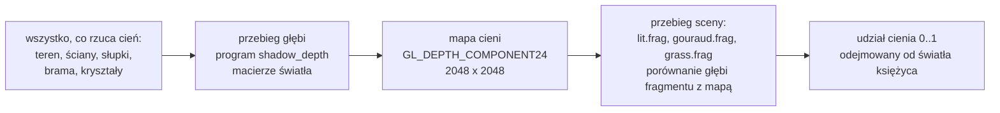

# Moduł renderer: cienie, mapa cieni księżyca

Kamień milowy: M7, część czwarta (cienie księżyca). Cień latarki, czyli część piąta, **nie jest zbudowany** (sekcja 2.20). Temat wykładu: 11 (Shadow mapping), **w trakcie**.
Kod: przestrzeń światła [`src/scene/LightSpace.hpp`](../../../src/scene/LightSpace.hpp) i [`LightSpace.cpp`](../../../src/scene/LightSpace.cpp), ustawienia i matematyka bez OpenGL [`src/game/Shadows.hpp`](../../../src/game/Shadows.hpp) i [`Shadows.cpp`](../../../src/game/Shadows.cpp), klasa mapy cieni [`src/game/ShadowMap.hpp`](../../../src/game/ShadowMap.hpp) i [`ShadowMap.cpp`](../../../src/game/ShadowMap.cpp), sampler z porównaniem [`src/gfx/ComparisonSampler.hpp`](../../../src/gfx/ComparisonSampler.hpp) i [`ComparisonSampler.cpp`](../../../src/gfx/ComparisonSampler.cpp), shadery [`assets/shaders/shadow_depth.vert`](../../../assets/shaders/shadow_depth.vert), [`shadow_depth.frag`](../../../assets/shaders/shadow_depth.frag) i [`common/shadows.glsl`](../../../assets/shaders/common/shadows.glsl), wywołania w [`src/game/NightMazeApp.cpp`](../../../src/game/NightMazeApp.cpp) (`drawMoonShadowMap`, `drawShadowCasters`, `drawLitMaze`, `drawGrass`), panel [`src/debug/panels/ShadowsPanel.cpp`](../../../src/debug/panels/ShadowsPanel.cpp), testy w [`tests/ShadowTests.cpp`](../../../tests/ShadowTests.cpp).

Dlaczego ten dokument stoi w katalogu `renderer`, chociaż klasa nazywa się `game::ShadowMap` i leży w `src/game/`, wyjaśnia [`README.md`](README.md). Dokument zakłada znajomość macierzy widoku i rzutowania oraz bufora głębi ([`../scene/camera.md`](../scene/camera.md)), świateł gry i funkcji `computeLighting` ([`../scene/lights.md`](../scene/lights.md), [`lighting-gouraud-phong.md`](lighting-gouraud-phong.md)), framebufferów ([`../gfx/framebuffers.md`](../gfx/framebuffers.md)) i obiektu samplera ([`../gfx/textures.md`](../gfx/textures.md)). Samą klasę `gfx::ComparisonSampler` opisuje [`../gfx/comparison-sampler.md`](../gfx/comparison-sampler.md): tutaj jest teoria i wszystko, co robi z nią gra.

**Stan na dziś:** ściany, słupki, brama, kryształy i wzgórza rzucają cień w świetle księżyca. Przed sceną gra rysuje wszystko, co rzuca cień, z kierunku księżyca do tekstury głębi 2048 x 2048 (**mapy cieni**), a programy `lit`, `gouraud` i `grass` sprawdzają w niej każdy fragment. Cień odbiera **tylko światło księżyca**: światło otoczenia, latarka, światła kryształów i świecenie własne zostają. Wszystkim steruje nowy, dwunasty panel **Shadows**: przełącznik, rozdzielczość (1024 albo 2048), dwa suwaki biasu w metrach, filtr sprzętowy 2 x 2, jądro PCF od 3 x 3 do 7 x 7, siła cienia i podgląd mapy. Programów shaderów jest jedenaście: doszedł `shadow_depth`. Latarka i światła kryształów **nie rzucają cieni**: świecą przez ściany jak dotąd.

**Co ta część zmieniła poza cieniami (2026-10-05).** Domyślna intensywność księżyca (`LightingSettings::moonIntensity`) wzrosła z 0,12 do 0,2, żeby różnicę między światłem a cieniem było widać (sekcja 2.14). Stała `FOLDED_ROW_COUNT` wzrosła z 3 do 4, więc HUD stoi o jeden rząd pasków tytułowych niżej. Wyliczenie `AttachmentPreview` dostało trzecią wartość, `RawDepth`, a `post/preview.frag` trzecią gałąź (sekcja 2.17). Struktura `Lighting` w GLSL ma dwa nowe pola z udziałem księżyca. Blok `LightBlock` **nie zmienił się**.

Zgłoszone dla Windowsa (2026-10-05): bramka `make check` przechodzi (formatowanie, build i testy Debug i Release, clang-tidy), 310 przypadków testowych i 103751 asercji. Liczby zgadzają się z kodem: po trzeciej części M7 było 294 i 102412, doszło 16 przypadków i 1339 asercji w `tests/ShadowTests.cpp` (129 asercji niezależnych od labiryntu i po 5 na każde z 242 pudełek kolizji labiryntu startowego). Z wyłączonymi cieniami i księżycem cofniętym do 0,12 obraz jest identyczny co do piksela z obrazem sprzed tej części poza paskiem HUD (w trybie Phong różnica najwyżej 1/255). Build Debug nie zapisał żadnego błędu OpenGL przy 2048 i przy 1024. **Nikt jeszcze nie kliknął myszą** kontrolek panelu Shadows ani nie przełączył rozdzielczości w działającej grze, nikt nie sprawdził `Reload shaders` przy jedenastu programach. **Na macOS ten kod nie był ani budowany, ani uruchamiany.** Pełna lista tego, co sprawdzone, a co nie: sekcja 5.11.

## 1. Po co to jest

Do trzeciej części M7 księżyc oświetlał każdą powierzchnię zwróconą w jego stronę, także tę, która stoi za ścianą. Model oświetlenia Phonga jest **lokalny**: liczy światło z normalnej, kierunku do światła i kierunku do oka i nie wie nic o tym, co stoi po drodze. Skutek: korytarz w głębi labiryntu jest tak samo jasny jak otwarte pole, a ściany wyglądają, jakby unosiły się nad ziemią, bo nic ich z nią nie łączy.

Cień odpowiada na jedno pytanie, którego model lokalny nie zadaje: **czy między tym punktem a światłem coś stoi?** Najprostsza i najczęściej używana odpowiedź w grafice czasu rzeczywistego to **mapa cieni** (shadow mapping). Potrzebne są do tego:

| Rzecz | Gdzie | Sekcja |
|---|---|---|
| widok i rzut światła, dopasowane do sceny | `scene::directionalLightSpace` | 2.2, 2.3, 5.2 |
| framebuffer z samą teksturą głębi | `gfx::Framebuffer` z `ColorFormat::None`, klasa `game::ShadowMap` | 3.1, 5.5 |
| przebieg głębi: scena z kierunku światła, bez kolorów | program `shadow_depth`, `NightMazeApp::drawShadowCasters` | 2.1, 4.1, 5.7 |
| odczyt z porównaniem | `sampler2DShadow`, `gfx::ComparisonSampler` | 2.6, 2.7 |
| filtrowanie krawędzi cienia | filtr sprzętowy 2 x 2 i pętla PCF w `common/shadows.glsl` | 2.8, 2.9, 4.2 |
| bias, czyli obrona przed cieniem rzucanym na samego siebie | `slopeScaledBias`, `game::shadowBias`, `game::biasInDepthUnits` | 2.10 do 2.12 |
| decyzja, które światło cień odbiera | pola `moonDiffuse` i `moonSpecular` struktury `Lighting` | 2.14, 2.15 |

To jest temat 11 wykładu, "Shadow mapping", a PRD (sekcja 3) wymienia przy nim mapę ortograficzną dla księżyca, mapę perspektywiczną dla latarki, PCF i bias. Ta część daje pierwszą mapę, PCF i bias. Druga mapa jest planem na następny dzień pracy (sekcja 2.20), dlatego temat **nie jest zaliczony**.

## 2. Teoria

### 2.1 Idea: dwa przebiegi i jedno porównanie

Światło "widzi" dokładnie te powierzchnie, które oświetla. Wszystko, czego z miejsca światła nie widać, jest w cieniu. Mapa cieni zamienia to zdanie w dwa przebiegi rysowania:

1. **Przebieg głębi.** Scena jest rysowana tak, jak widzi ją światło, do tekstury głębi. Kolorów nie ma. Test głębi zostawia w każdym tekselu głębię **najbliższej** światłu powierzchni. Ta tekstura to mapa cieni.
2. **Przebieg sceny.** Scena jest rysowana zwykle, z kamery. Dla każdego fragmentu shader liczy tą samą macierzą światła, **w który teksel mapy** fragment trafia i **jaką ma głębię widzianą ze światła**. Potem porównuje dwie liczby:

```text
głębia fragmentu widziana ze światła   <=   głębia zapisana w mapie      ->  fragment jest oświetlony
głębia fragmentu widziana ze światła   >    głębia zapisana w mapie      ->  coś stoi bliżej światła: cień
```

Przykład na liczbach z testu `points on one ray of the light share a texel and differ in depth only`. Punkt na szczycie ściany i punkt 3 m dalej wzdłuż promienia księżyca (miejsce na ziemi, na które pada cień tego szczytu) lądują w **tym samym tekselu** mapy, a różnią się tylko głębią: o `3 / extent.z`, czyli o 3 m z całej głębi pudełka światła. W mapie zostaje mniejsza głębia (szczyt ściany), więc punkt na ziemi przegrywa porównanie i jest w cieniu.



Co z tego wynika od razu:

- Mapa cieni to **obraz**, więc ma rozdzielczość. Krawędź cienia jest tak dokładna, jak teksel mapy jest mały na powierzchni (sekcja 2.4).
- Mapa przechowuje **jedną głębię na teksel**, a teksel pokrywa kawałek powierzchni. Stąd bierze się błąd zwany shadow acne i jego lekarstwo, bias (sekcje 2.10 i 2.11).
- Scena jest rysowana **dwa razy**: raz ze światła, raz z kamery. Każde światło z cieniem to jeden przebieg głębi więcej.
- Metoda nie wie nic o kształtach: działa dla wszystkiego, co da się narysować.

### 2.2 Widok światła i rzut ortograficzny

Żeby narysować scenę "ze światła", światło potrzebuje tego samego co kamera: macierzy widoku i macierzy rzutowania. Razem nazywam je **przestrzenią światła** (struktura `scene::LightSpace`).

**Rzut.** Księżyc jest światłem **kierunkowym**: jest tak daleko, że jego promienie są równoległe i w każdym punkcie sceny mają ten sam kierunek ([`../scene/lights.md`](../scene/lights.md)). Dla kamery używam rzutu perspektywicznego, w którym promienie widzenia rozchodzą się z jednego punktu i rzeczy dalsze są mniejsze. Dla promieni równoległych właściwy jest **rzut ortograficzny**: bryłą widzenia jest prostopadłościan (pudełko), a nie ostrosłup, i nic nie maleje z odległością.

| | Rzut perspektywiczny | Rzut ortograficzny |
|---|---|---|
| bryła widzenia | ścięty ostrosłup | prostopadłościan |
| promienie | rozchodzą się z punktu | równoległe |
| dla jakiego światła | reflektor, czyli latarka (planowane) | światło kierunkowe, czyli księżyc |
| `w` po mnożeniu przez macierz | zależy od odległości | zawsze 1 |
| głębia zapisana w buforze | nieliniowa: gęsta blisko, rzadka daleko ([`post-process.md`](post-process.md), sekcja 2.10) | **liniowa**: rośnie równo z odległością |

Ostatni wiersz jest ważny dwa razy: przy biasie (sekcja 2.11, metr to zawsze ten sam ułamek zakresu głębi) i przy podglądzie mapy (sekcja 2.17, głębi nie trzeba przeliczać).

`glm::ortho(left, right, bottom, top, near, far)` buduje macierz, która skaluje pudełko do sześcianu od -1 do 1 na każdej osi. To samo robi rzut perspektywiczny ze swoim ostrosłupem, tylko bez dzielenia przez odległość.

**Widok.** Światło kierunkowe **nie ma położenia**, ma tylko kierunek. Macierz widoku potrzebuje jednak punktu, z którego się patrzy. Kod stawia oko gdziekolwiek na promieniu przechodzącym przez środek sceny:

```cpp
const glm::vec3 center = (bounds.min + bounds.max) * 0.5F;
const glm::mat4 view = glm::lookAt(center - direction, center, up);
```

Oko stoi jeden krok (1 m) przed środkiem pudełka sceny i patrzy na ten środek, czyli wzdłuż kierunku lotu światła. To, **gdzie dokładnie** na promieniu stoi, nie ma znaczenia: przy rzucie ortograficznym przesunięcie oka wzdłuż kierunku patrzenia nie zmienia obrazu, a bliska i daleka płaszczyzna są potem mierzone od tego właśnie oka (sekcja 2.3). Dlatego bliska płaszczyzna pudełka może wyjść **ujemna** (za plecami oka), co przy rzucie ortograficznym jest dozwolone, a przy perspektywicznym nie.

**Wektor "w górę".** `glm::lookAt` buduje trzy osie widoku iloczynami wektorowymi kierunku patrzenia z wektorem `up`. Gdy oba są równoległe, iloczyn wektorowy ma długość 0 i normalizacja dzieli przez zero: macierz wypełnia się wartościami NaN. Zwykle `up` to góra świata, `(0, 1, 0)`. Księżyc świecący prosto w dół ma kierunek `(0, -1, 0)`, dokładnie równoległy. Suwak `Moon pitch` w panelu Lights sięga do -90 stopni, więc to nie jest przypadek teoretyczny. Kod ma na to próg:

| Warunek | Wektor `up` |
|---|---|
| `abs(direction.y) > VERTICAL_DIRECTION_LIMIT` (0,999, czyli światło odchylone od pionu o mniej niż około 2,6 stopnia: `acos(0,999) = 2,56`) | `(0, 0, -1)`, czyli `UP_FOR_VERTICAL_LIGHT` |
| w każdym innym przypadku | `(0, 1, 0)`, czyli `WORLD_UP` |

Wybór wektora `up` obraca tylko obraz w mapie wokół osi patrzenia. Cień na ziemi wychodzi ten sam, bo ten sam obrót dostaje odczyt. Przy przejściu przez próg mapa obraca się skokiem i to widać w podglądzie, nie w scenie (poza drobną zmianą ząbków na krawędziach cieni, bo siatka tekseli leży inaczej).

Jest jeszcze trzeci przypadek brzegowy: kierunek o długości 0 (krótszy niż `MIN_DIRECTION_LENGTH = 0,0001`) nie daje się znormalizować. Funkcja zastępuje go kierunkiem prosto w dół. Gra takiego kierunku nie wytworzy (`directionFromAngles` zawsze daje długość 1), ale funkcja jest częścią silnika i ma własne testy.

### 2.3 Dopasowanie pudełka do terenu, krok po kroku

Pudełko rzutu ortograficznego ma sześć ścian. Od tego, jak duże jest, zależy wszystko: za małe obcina część sceny (rzeczy poza nim nie rzucają cienia), za duże marnuje teksele na pustą przestrzeń i cienie robią się kanciaste. Gra dopasowuje pudełko **dokładnie do tego, co może rzucić cień**.

**Krok 1: pudełko sceny w świecie.** Funkcja `game::shadowCasterBounds` zwraca pudełko AABB:

```text
min = (terrain.minX(), terrain.minHeight(),                terrain.minZ())
max = (terrain.maxX(), terrain.maxHeight() + PILLAR_HEIGHT, terrain.maxZ())
```

W poziomie to cały teren, razem z marginesem wzgórz wokół labiryntu. W pionie: od najniższego punktu gruntu do wysokości słupka (`PILLAR_HEIGHT = 3,15` m) nad **najwyższym** punktem gruntu. Słupki są najwyższą rzeczą, która stoi na ziemi, więc wszystko, co rzuca cień, mieści się w środku. Słupek na szczycie najwyższego wzgórza nie istnieje (labirynt leży w niskim środku), więc góra pudełka jest wyżej, niż trzeba. Kosztuje to trochę zakresu głębi i daje regułę w jednej linii.

Dla labiryntu startowego (10 x 10 komórek, ziarno 1, skala wysokości 1): teren ma 48 m na 48 m (labirynt 20 m i po 14 m marginesu z każdej strony), `x` i `z` od -14 do 34, najniższy punkt 0,0 m, najwyższe wzgórze 3,37 m ([`terrain.md`](terrain.md)). Pudełko: od `(-14, 0, -14)` do `(34, 6,52, 34)`.

**Krok 2: osiem narożników do przestrzeni światła.** Pudełko w świecie jest ustawione wzdłuż osi świata, a światło patrzy na nie skosem. Każdy z ośmiu narożników (wszystkie kombinacje najmniejszego i największego `x`, `y`, `z`) jest mnożony przez macierz widoku światła. Wynik to położenie narożnika w układzie, w którym oś `x` to "w prawo dla światła", `y` "w górę dla światła", a `-z` "w głąb, wzdłuż promienia".

**Krok 3: najmniejsza i największa współrzędna.** Z ośmiu wyników biorę najmniejsze i największe `x`, `y` i `z`. Dla bryły wypukłej wystarczą narożniki: żaden punkt wnętrza nie wyjdzie poza zakres, który wyznaczają.

**Krok 4: margines.** Do każdej z sześciu ścian dodaję `LIGHT_BOX_MARGIN = 0,5` m. Rzucający, który leży dokładnie na ścianie pudełka (najniższy grunt, szczyt słupka), jest wtedy bezpiecznie w środku i nie odpada przez błąd zaokrąglenia przy przycinaniu.

**Krok 5: rzut.**

```text
const float nearPlane = -largest.z;
const float farPlane = -smallest.z;
glm::ortho(smallest.x, largest.x, smallest.y, largest.y, nearPlane, farPlane)
```

Dwa minusy biorą się stąd, że widok patrzy wzdłuż `-z`: narożnik **najbliższy** światłu ma **największe** `z`, a `glm::ortho` chce obu płaszczyzn jako odległości przed okiem.

**Liczby dla ustawień startowych** (księżyc: yaw 25, pitch -50; policzone przeze mnie z tych wzorów, szerokość potwierdza test). Kierunek lotu światła to `(0,272, -0,766, -0,583)` ([`skybox.md`](skybox.md), sekcja 2.9). Trzy osie widoku światła i rozmiar pudełka wzdłuż każdej z nich (suma rzutów trzech krawędzi pudełka sceny na oś, plus dwa marginesy):

| Oś światła | Wektor w świecie | Rachunek | Rozmiar |
|---|---|---|---|
| w prawo (`extent.x`) | `(0,906, 0, 0,423)` | `48 * 0,906 + 6,52 * 0 + 48 * 0,423 + 1` | **64,8 m** |
| w górę (`extent.y`) | `(0,324, 0,643, -0,694)` | `48 * 0,324 + 6,52 * 0,643 + 48 * 0,694 + 1` | **54,1 m** |
| w głąb (`extent.z`) | `(0,272, -0,766, -0,583)` | `48 * 0,272 + 6,52 * 0,766 + 48 * 0,583 + 1` | **47,0 m** |

Pierwszy wiersz zapisuje też komentarz w teście: kwadrat 48 m obrócony o 25 stopni ma szerokość `48 * (cos 25 + sin 25) = 63,8` m, plus margines z obu stron. Pole `LightSpace::extent` trzyma te trzy liczby, a panel Shadows pokazuje je w linii `Covers 64.8 x 54.1 m, 47.0 m deep`.

Dla porównania: księżyc prosto nad głową (pitch -90) dałby pudełko 49 x 49 m i 7,5 m głębi, a przy pitch -5 (prawie poziomo) 64,8 x 13,1 m i 65,1 m głębi. Mapa jest zawsze kwadratem tekseli, więc pudełko o nierównych bokach daje **niekwadratowe teksele** (sekcja 2.4).

**Dlaczego pudełko nie idzie za kamerą.** Druga szkoła dopasowuje pudełko do tego, co widzi kamera: mniejszy obszar, więc drobniejsze teksele. Ma to cenę, którą widać: gdy kamera się rusza, pudełko rusza się z nią, siatka tekseli przesuwa się po świecie i każda krawędź cienia **migocze** (shimmering), bo te same ściany trafiają co klatkę w inne teksele. Leczy się to przyciąganiem pudełka do siatki tekseli i stałym rozmiarem, a na duże sceny kaskadami (kilka map o różnych zasięgach). W tej grze nie było po co:

| | Pudełko wokół terenu (wybrane) | Pudełko wokół widoku kamery |
|---|---|---|
| od czego zależy | teren i dwa kąty księżyca | do tego pozycja i kierunek kamery |
| cienie przy ruchu gracza | stoją nieruchomo: mapa pokrywa co klatkę ten sam grunt | migoczą bez dodatkowej stabilizacji |
| teksel przy mapie 2048 | 3,2 cm dla labiryntu startowego | mniejszy przy małym zasięgu widoku |
| scena większa niż dziś | teksele rosną razem z terenem | bez zmian |
| kod | jedna funkcja, bez stanu | stabilizacja, często kaskady |

Scena jest mała i zamknięta: cały teren ma 48 m, ściana ma 0,2 m grubości i przy mapie 2048 zajmuje ponad 6 tekseli. Macierz jest liczona **co klatkę** od nowa z terenu i kątów księżyca (kilkadziesiąt mnożeń), więc nie ma niczego, o czym można zapomnieć po zbudowaniu nowego labiryntu, zmianie skali wysokości albo przesunięciu księżyca w panelu Lights. Notatka: [`../../decisions/shadow-box-fitted-to-terrain.md`](../../decisions/shadow-box-fitted-to-terrain.md).

### 2.4 Rozdzielczość: ile tekseli na metr

Mapa ma `N x N` tekseli i pokrywa `extent.x` na `extent.y` metrów. Teksel na powierzchni zwróconej prosto do światła ma więc `extent.x / N` na `extent.y / N` metrów. Funkcja `game::shadowTexelSize` zwraca **większy** z dwóch boków, a panel pokazuje go w centymetrach.

Labirynt startowy, liczby policzone z rozmiarów z sekcji 2.3:

| Rozmiar mapy | Teksel w poziomie mapy | Teksel w pionie mapy | Tekseli na metr | Co pokazuje panel | Ściana 0,2 m | Pamięć głębi |
|---|---|---|---|---|---|---|
| 2048 x 2048 (startowy) | 3,16 cm | 2,64 cm | 31,6 i 37,9 | `One texel: 3.2 cm` | ponad 6 tekseli | 4,2 mln tekseli: około 12,6 MB przy 3 bajtach na głębię, 16,8 MB, jeśli karta trzyma głębię w 4 bajtach |
| 1024 x 1024 | 6,33 cm | 5,28 cm | 15,8 i 18,9 | `One texel: 6.3 cm` | około 3 tekseli | cztery razy mniej |

Liczbę 3,16 cm przypina test `the shadow map of the moon is fine enough for the walls of the default maze` (0,0316 m z tolerancją 1 procenta), razem z tym, że mała mapa ma teksele dwa razy większe, a ściana przy dużej mapie ma ponad 6 tekseli grubości.

**Teksel na ziemi jest większy niż w mapie.** Liczby z tabeli dotyczą powierzchni prostopadłej do promieni. Światło pada na ziemię skosem, więc teksel rozciąga się na niej jak cień ołówka trzymanego skośnie: o `1 / cos(kąt między normalną a kierunkiem do światła)`. Dla poziomego gruntu ten cosinus to 0,766 (księżyc 50 stopni nad horyzontem, więc 40 stopni od pionu). Pionowy bok teksela, 2,64 cm, robi się na ziemi 3,45 cm. Poziomy zostaje 3,16 cm, bo oś "w prawo" światła leży w poziomie. Na ziemi teksel dużej mapy to więc około 3,2 na 3,4 cm. Na ścianie, którą światło tylko muska, rozciągnięcie jest dużo większe i tam krawędzie cieni są najbardziej poszarpane.

**Precyzja głębi nie jest problemem.** Głębia ma 24 bity, czyli 16 777 216 poziomów na 47 m: jeden poziom to około 2,8 mikrometra. Błędy, o których mówią sekcje 2.10 do 2.12, pochodzą z **rozmiaru teksela** (centymetry), nie z dokładności liczby.

### 2.5 Z przestrzeni światła do współrzędnych tekstury

Shader sceny zna pozycję fragmentu w świecie. Żeby zajrzeć do mapy, powtarza dla niej to, co shader wierzchołków i karta zrobiły w przebiegu głębi dla każdego wierzchołka:

| Krok | Wzór | Wynik |
|---|---|---|
| 1. macierz światła | `clip = projection * view * vec4(pozycja, 1)` | przestrzeń przycięcia światła |
| 2. dzielenie przez `w` | `ndc = clip.xyz / clip.w` | współrzędne znormalizowane: od -1 do 1 na każdej osi wewnątrz pudełka. Dla rzutu ortograficznego `w = 1` i ten krok nic nie zmienia. Kod wykonuje go mimo to, żeby funkcja była poprawna także dla rzutu perspektywicznego |
| 3. skala i przesunięcie | `coordinates = ndc * 0,5 + 0,5` | od 0 do 1 na każdej osi |

Skąd `* 0,5 + 0,5`: współrzędne znormalizowane biegną od -1 do 1, a tekstura jest adresowana od 0 do 1 i **w tym samym zakresie od 0 do 1 bufor głębi przechowuje głębię** (domyślne `glDepthRange(0, 1)`). Pomnożenie przez pół zwęża zakres o długości 2 do długości 1 (od -0,5 do 0,5), a dodanie pół przesuwa go na miejsce. Ta sama operacja dla wszystkich trzech składowych:

- `coordinates.x`, `coordinates.y`: miejsce w mapie, czyli współrzędna tekstury,
- `coordinates.z`: głębia fragmentu widziana ze światła, w tych samych jednostkach, w jakich mapa ją zapisała (0 na bliskiej płaszczyźnie światła, 1 na dalekiej).

Macierz z kroku 1 to `LightSpace::matrix()`, czyli `projection * view`. Rzutowanie stoi po lewej, bo wektor mnoży się od prawej: najpierw działa widok, potem rzut. Te trzy kroki są w kodzie dwa razy i muszą się zgadzać: w GLSL w funkcji `moonShadow` (sekcja 4.2) i w C++ w `scene::shadowMapCoordinates`, na której stoją testy.

Często spotyka się wersję, w której skala i przesunięcie są wmnożone w macierz ("bias matrix") i shader nie ma kroku 3. Wynik jest ten sam. Tu krok jest w shaderze jawnie, żeby dało się go pokazać palcem.

### 2.6 Porównanie i `sampler2DShadow`

Porównanie z sekcji 2.1 można napisać ręcznie: odczytać głębię zwykłym `sampler2D` i wstawić `if`. Gra robi to inaczej: mapę czyta sampler typu **`sampler2DShadow`**, a porównuje **karta graficzna**.

```text
uniform sampler2DShadow uMoonShadowMap;
float visibility = texture(uMoonShadowMap, vec3(u, v, głębia));
```

| | `sampler2D` | `sampler2DShadow` |
|---|---|---|
| argument `texture()` | `vec2`: miejsce | `vec3`: miejsce i **głębia odniesienia** |
| co zwraca | `vec4`: zawartość teksela | `float`: wynik porównania, 1 (oświetlony) albo 0 (w cieniu), a z filtrem liniowym wartości pośrednie |
| wymaga | niczego | tekstury głębi czytanej z włączonym trybem porównania (`GL_TEXTURE_COMPARE_MODE = GL_COMPARE_REF_TO_TEXTURE`) |

Funkcja porównania to `GL_LEQUAL`: wynik 1, gdy głębia odniesienia jest **mniejsza albo równa** zapisanej. Fragment tak samo daleko od światła jak powierzchnia w mapie (czyli ta sama powierzchnia) jest oświetlony.

Dlaczego karta, a nie `if` w shaderze: bo tylko karta potrafi porównać **przed** filtrowaniem. Zwykły filtr liniowy uśredniłby cztery **głębie**, a średnia głębi ściany i głębi ziemi za nią nie jest głębią niczego. Karta porównuje każdy z czterech tekseli osobno i miesza cztery **odpowiedzi** (sekcja 2.8).

Typ samplera w GLSL i tryb odczytu tekstury muszą do siebie pasować. Odczyt przez `sampler2DShadow` tekstury bez trybu porównania i odczyt przez `sampler2D` tekstury z trybem porównania mają według specyfikacji wynik nieokreślony. To jest powód następnej sekcji.

### 2.7 Obiekt samplera z porównaniem, a nie parametry tekstury

Tryb porównania to parametr odczytu, jak filtr i zawijanie. Takie parametry można zapisać w dwóch miejscach: w samej teksturze (`glTexParameteri`) albo w **obiekcie samplera** (`glSamplerParameteri`), który związany z jednostką teksturującą zastępuje parametry związanej tam tekstury ([`../gfx/textures.md`](../gfx/textures.md)).

Mapa cieni jest czytana **na dwa sposoby**:

| Kto czyta | Jak | Czego potrzebuje |
|---|---|---|
| `lit.frag`, `gouraud.frag`, `grass.frag` | `sampler2DShadow`, jednostka 3 | porównania |
| `post/preview.frag` (podgląd w panelu) | `sampler2D`, jednostka 0 | **surowych głębi**, bez porównania |

Gdyby tryb porównania był zapisany w teksturze, podgląd czytałby ją zwykłym `sampler2D` z włączonym porównaniem, czyli z wynikiem nieokreślonym. Dlatego tekstura głębi zostaje zwykłą teksturą (`gfx::Framebuffer` ustawia jej filtr najbliższego sąsiada i `GL_CLAMP_TO_EDGE`), a trzy reguły potrzebne cieniom trzyma osobny obiekt, `gfx::ComparisonSampler`:

| Reguła | Wywołanie | Po co |
|---|---|---|
| porównanie | `GL_TEXTURE_COMPARE_MODE = GL_COMPARE_REF_TO_TEXTURE`, `GL_TEXTURE_COMPARE_FUNC = GL_LEQUAL` | sekcja 2.6 |
| filtr liniowy (do wyłączenia) | `GL_TEXTURE_MIN_FILTER` i `GL_TEXTURE_MAG_FILTER`: `GL_LINEAR` albo `GL_NEAREST` | sekcja 2.8 |
| ramka | `GL_TEXTURE_WRAP_S` i `GL_TEXTURE_WRAP_T`: `GL_CLAMP_TO_BORDER`, `GL_TEXTURE_BORDER_COLOR = (1, 1, 1, 1)` | sekcja 2.13 |

Sampler należy do **jednostki**, nie do tekstury, więc kolejność wiązania ma znaczenie. `Framebuffer::bindDepthTexture` wiąże teksturę i **odwiązuje** sampler jednostki (`glBindSampler(unit, 0)`). `ShadowMap::bindForSampling` woła więc najpierw `bindDepthTexture`, a dopiero potem `m_sampler.bind(unit)`. W odwrotnej kolejności sampler zniknąłby z jednostki. Klasa linia po linii: [`../gfx/comparison-sampler.md`](../gfx/comparison-sampler.md).

### 2.8 Filtr sprzętowy 2 x 2

Przy filtrze najbliższego sąsiada (`GL_NEAREST`) odczyt z porównaniem daje dla fragmentu jedną odpowiedź z jednego teksela: 0 albo 1. Krawędź cienia jest wtedy schodkami o wielkości teksela mapy, czyli około 3 cm na ziemi, a z bliska schodki widać wyraźnie.

Przy filtrze liniowym (`GL_LINEAR`) na samplerze z porównaniem karta bierze cztery teksele wokół miejsca odczytu, **porównuje każdy osobno** i miesza cztery odpowiedzi wagami zwykłej interpolacji dwuliniowej. Wynik to liczba od 0 do 1, która zmienia się płynnie, gdy fragment przesuwa się między tekselami. To jest filtrowanie PCF w najmniejszym możliwym rozmiarze, 2 x 2, zrobione przez sprzęt za cenę jednego odczytu.

| Pole `Hardware 2 x 2 filter` | Filtr samplera | Odpowiedzi na jeden odczyt | Krawędź cienia |
|---|---|---|---|
| zaznaczone (startowo) | `GL_LINEAR` | 4, zmieszane | przejście o szerokości jednego teksela |
| odznaczone | `GL_NEAREST` | 1 | schodki |

Uczciwie o gwarancjach: to, że filtr liniowy na samplerze z porównaniem miesza wyniki porównań, robią dziś karty w praktyce i tak opisuje to dokumentacja OpenGL, ale specyfikacja 4.1 zostawia szczegóły implementacji. Na Windowsie (zgłoszone) działa. **Na macOS nikt tego nie sprawdził.**

### 2.9 PCF: jądro N x N i jego koszt

**PCF** (percentage closer filtering, "jaki procent jest bliżej") rozszerza ten sam pomysł: zamiast jednego miejsca shader pyta o **kwadrat** miejsc wokół fragmentu i bierze średnią odpowiedzi. Fragment głęboko w cieniu dostaje 0, daleko od cienia 1, a przy krawędzi ułamek: tyle, ile próbek wypadło po jasnej stronie. Krawędź robi się miękka na szerokość jądra.

Pętla w `shadowMapVisibility`:

```text
promień r:  jądro (2r + 1) x (2r + 1)
teksel = 1 / rozmiar mapy                   (textureSize)
dla y od -r do r, dla x od -r do r:
    suma += texture(mapa, (u + x * teksel, v + y * teksel, głębia))
wynik = suma / ((2r + 1) * (2r + 1))
```

| Lista `Kernel` | Promień | Odczytów na fragment | Tekseli porównanych przy filtrze 2 x 2 | Szerokość przejścia na ziemi przy mapie 2048 |
|---|---|---|---|---|
| PCF wyłączone | 0 | 1 | 4 | około 3 cm |
| `3 x 3` (startowo) | 1 | 9 | 36 | około 10 cm |
| `5 x 5` | 2 | 25 | 100 | około 16 cm |
| `7 x 7` | 3 | 49 | 196 | około 22 cm |

Ostatnia kolumna to szerokość jądra w tekselach razy około 3,2 cm, policzona, nie zmierzona. Koszt rośnie z **kwadratem** boku jądra. W oknie 1280 x 720 jest 921 600 pikseli: jądro 3 x 3 to do 8,3 miliona odczytów mapy na klatkę, 7 x 7 do 45 milionów (górne granice: bez nieba i bez fragmentów rysowanych kilka razy). Pętla ma stałą górną granicę, `MAX_PCF_RADIUS = 3`, zapisaną w dwóch miejscach, które muszą się zgadzać: w `common/shadows.glsl` i w `game::MAX_PCF_RADIUS`.

Trzy rzeczy, o które można zostać zapytanym:

- **Dlaczego nie uśrednić głębi i porównać raz?** Bo średnia głębi ściany i ziemi za nią to głębia punktu, który wisi w powietrzu. Porównanie z nią daje ostrą krawędź w złym miejscu. Uśrednia się **wyniki porównań**, nie głębie.
- **Dlaczego `texture` z dodanym przesunięciem, a nie `textureOffset`?** GLSL 4.10 wymaga, żeby przesunięcie w `textureOffset` było wyrażeniem stałym, a tu zmienia się w pętli.
- **Czy PCF daje prawdziwy półcień?** Nie. Prawdziwy półcień jest szerszy tam, gdzie cień pada dalej od rzucającego. PCF rozmywa każdą krawędź na tę samą szerokość w tekselach mapy. To filtr, nie fizyka.

Filtr sprzętowy i PCF działają **razem**: każdy z 9 odczytów jądra 3 x 3 jest przy zaznaczonym filtrze już zmieszany z 4 tekseli. Dlatego kwadrat 3 x 3 z filtrem liniowym nie ma schodków między sąsiednimi próbkami.

### 2.10 Shadow acne: powierzchnia, która zacienia samą siebie

Z pomysłu z sekcji 2.1 wynika błąd, który pojawia się zawsze, gdy nic się z nim nie zrobi. Oświetlona powierzchnia jest sama w mapie cieni (jest najbliżej światła), więc porównuje się **sama ze sobą**: głębia fragmentu z głębią zapisaną dla tej samej powierzchni. Powinien wyjść remis, czyli "oświetlony". Nie wychodzi, bo teksel mapy nie jest punktem.

Teksel pokrywa kawałek powierzchni (około 3 cm) i przechowuje **jedną** głębię: tę ze środka kawałka. Powierzchnia jest pochylona względem promieni światła, więc jej prawdziwa głębia zmienia się w obrębie teksela:

```text
        światło pada skosem (strzałki), powierzchnia jest pozioma

          \        \        \        \
           \        \        \        \
    ---+--------+--------+--------+--------+---   powierzchnia
       | teksel | teksel | teksel | teksel |
       |   A    |   B    |   C    |   D    |

    głębia zapisana w tekselu B = głębia w jego środku
    lewa połowa B:  punkty bliżej światła niż środek  -> głębia fragmentu < zapisana -> oświetlone
    prawa połowa B: punkty dalej od światła niż środek -> głębia fragmentu > zapisana -> "w cieniu"
```

Połowa każdego teksela wychodzi oświetlona, połowa zacieniona, i tak teksel za tekselem. Na ekranie to regularne ciemne prążki albo mora na powierzchniach, które powinny być jasne: **shadow acne**.

Liczby dla poziomego gruntu przy ustawieniach startowych (policzone). Światło pada 40 stopni od normalnej. Przejście o jeden teksel w pionie mapy (2,64 cm w przestrzeni światła) zmienia głębię o `2,64 cm * tan(40) = 2,2 cm`. W obrębie jednego teksela prawdziwa głębia odchodzi więc od zapisanej o najwyżej połowę tego, plus minus 1,1 cm. To jest wielkość błędu, który trzeba pokryć przy jednym odczycie z jednego teksela. W drugą stronę (w poziomie mapy) głębia gruntu się nie zmienia, bo oś "w prawo" światła leży poziomo: prążki biegną więc w poprzek kierunku, w którym pada światło.

**Jak acne wygląda z filtrami.** Z odczytem jednego teksela (filtr sprzętowy i PCF wyłączone) każdy fragment dostaje 0 albo 1 i widać ostre prążki. Z filtrami każdy fragment uśrednia wiele takich porównań, z których mniej więcej połowa wypada źle, więc zamiast prążków wychodzi **równe przyciemnienie** oświetlonych powierzchni. Tak właśnie zgłoszono (Windows, 2026-10-05): przy samych suwakach biasu ustawionych na 0 obraz wygląda na ogólnie ciemniejszy, a wyraźne prążki pojawiają się dopiero po wyłączeniu także PCF i filtra sprzętowego. Kto chce pokazać acne na obronie, wyłącza więc trzy rzeczy, nie jedną (sekcja 6.1).

### 2.11 Bias: wzór i liczby

Lekarstwo jest proste: przed porównaniem **przysunąć fragment do światła** o mały zapas, większy niż błąd z sekcji 2.10. Ten zapas to **bias**.

```text
bias = constantBias + slopeBias * (1 - facing)          w metrach

facing = cos(kąt między normalną powierzchni a kierunkiem DO światła), obcięty do zakresu 0..1
```

Dwie części, bo błąd zależy od pochylenia:

- **część stała** (`constantBias`, startowo 0,02 m) jest dodawana zawsze,
- **część zależna od pochylenia** (`slopeBias`, startowo 0,12 m) jest mnożona przez `1 - facing`: znika dla powierzchni zwróconej prosto do światła (tam głębia w obrębie teksela prawie się nie zmienia) i jest pełna dla powierzchni, którą światło tylko muska (tam zmienia się najbardziej).

`facing` liczy funkcja `moonFacing` w `common/lighting.glsl`: `dot(normal, -uDirectionalDirection.xyz)`. Wzór jest w kodzie dwa razy, jak współrzędne mapy: `slopeScaledBias` w GLSL i `game::shadowBias` w C++ (pod testami).

**Bias jest w metrach.** Suwaki w panelu pokazują `0.020 m` i `0.120 m`. Mapa przechowuje jednak głębię jako liczbę od 0 do 1, więc przed wysłaniem do shadera C++ przelicza metry na jednostki głębi (`game::biasInDepthUnits`):

```text
bias w jednostkach głębi = bias w metrach / extent.z
```

Dzielenie wystarcza, bo głębia rzutu ortograficznego jest liniowa: cały zakres od 0 do 1 to `extent.z` metrów, równo rozłożonych. Dzięki temu ustawienie znaczy to samo niezależnie od tego, jak głębokie wyszło pudełko: przesunięcie księżyca z pitch -50 na -5 zmienia głębię pudełka z 47 na 65 m, a 2 cm zostaje 2 cm. Obie części są przeliczane osobno i wysyłane jako `uMoonShadowConstantBias` i `uMoonShadowSlopeBias`, a shader składa je wzorem wyżej i odejmuje od `coordinates.z`.

Liczby dla ustawień startowych i labiryntu startowego (`extent.z = 47,0` m, policzone):

| Powierzchnia | Normalna | `facing` | Bias w metrach | Bias w jednostkach głębi |
|---|---|---|---|---|
| poziomy grunt | `(0, 1, 0)` | 0,766 | `0,02 + 0,12 * 0,234 = 0,048` | 0,00102 |
| ściana zwrócona na `+Z` | `(0, 0, 1)` | 0,583 | `0,02 + 0,12 * 0,417 = 0,070` | 0,00149 |
| ściana zwrócona na `-X` | `(-1, 0, 0)` | 0,272 | `0,02 + 0,12 * 0,728 = 0,107` | 0,00228 |
| ściany zwrócone na `+X` i `-Z` (tyłem do księżyca) | | poniżej 0, obcięte do 0 | `0,02 + 0,12 = 0,14` | 0,00298 |
| sama część stała | | 1 | 0,02 | 0,00043 |

Dla gruntu bias 4,8 cm jest ponad cztery razy większy od błędu jednego teksela (1,1 cm). Zapas jest potrzebny, bo PCF pyta także o **sąsiednie** teksele, a te leżą na tej samej pochyłej powierzchni dalej od fragmentu: próbka oddalona o `k` tekseli w pionie mapy ma na gruncie głębię różną o `k * 2,2 cm`. Przy jądrze 3 x 3 z filtrem sprzętowym najdalszy teksel, który wchodzi do średniej, leży do 2 tekseli od fragmentu: do 4,4 cm, czyli tuż pod biasem 4,8 cm.

**Czego ten wzór nie robi, i co z tego wynika (policzone, nie zaobserwowane).** Bias nie zależy ani od rozmiaru teksela, ani od promienia PCF. Z tych samych rachunków:

| Ustawienie | Najdalszy teksel w średniej | Różnica głębi na gruncie | Bias gruntu | Wniosek z rachunku |
|---|---|---|---|---|
| 2048, `3 x 3` (startowe) | do 2 tekseli | do 4,4 cm | 4,8 cm | mieści się |
| 2048, `5 x 5` | do 3 tekseli | do 6,6 cm | 4,8 cm | skrajne próbki mogą wypaść jako cień |
| 2048, `7 x 7` | do 4 tekseli | do 8,8 cm | 4,8 cm | jak wyżej, mocniej |
| 1024, `3 x 3` | do 2 tekseli po 5,28 cm | do 8,9 cm | 4,8 cm | jak wyżej |

Gdyby tak było na ekranie, oświetlony grunt byłby przy dużym jądrze albo przy małej mapie **lekko ciemniejszy** niż przy wyłączonych cieniach, równo, bez prążków. Podobnie zbocza wzgórz odwrócone od księżyca: błąd rośnie tam jak tangens kąta, a część zależna od pochylenia tylko liniowo. To jest szacunek geometryczny i może przesadzać (skrajne teksele mają w filtrze dwuliniowym małe wagi). Nikt tego nie mierzył: jest na liście testów ręcznych ([`../../guides/build-windows.md`](../../guides/build-windows.md), sekcja o części czwartej M7) i w ćwiczeniu 9. Podpowiedź listy `Resolution` mówi to samo jednym zdaniem: mniejsza mapa ma większe teksele i potrzebuje większego biasu.

**Czego w kodzie nie ma.** Typowe poradniki dodają do biasu w shaderze dwa narzędzia OpenGL: `glPolygonOffset` (karta sama odsuwa głębię przy rysowaniu mapy) i rysowanie do mapy tylnych ścian zamiast przednich (`glCullFace(GL_FRONT)`). Gra nie używa żadnego z nich. Odrzucanie ścian nie jest w ogóle włączone (jedyne miejsce w kodzie, które o nie pyta, to `GrassRenderer`), więc do mapy trafiają obie strony każdej ściany, a test głębi zostawia bliższą. Bias jest **w jednym miejscu**, w shaderze, w jednostkach, które da się pokazać linijką. Notatka: [`../../decisions/shadow-bias-in-metres-in-shader.md`](../../decisions/shadow-bias-in-metres-in-shader.md).

**Normalna do biasu to normalna modelu.** W `lit.frag` oświetlenie liczy się z normalnej z mapy normalnych, ale bias dostaje `moonFacing(normalize(vNormal))`, czyli normalną trójkąta. Bias należy do trójkąta, który został narysowany do mapy cieni, a wypukłości mapy normalnych w tym trójkącie nie ma.

### 2.12 Peter panning: za dużo biasu

Bias ma swoją cenę. Fragment przysunięty do światła o `b` metrów wygrywa porównanie nie tylko ze sobą, ale z każdym rzucającym, który leży **bliżej niż `b`** przed nim na promieniu. Cień zaczyna się więc dopiero `b` metrów za rzucającym. Przy dużym biasie cień **odkleja się** od przedmiotu, który go rzuca, i przedmiot wygląda, jakby unosił się nad ziemią. Nazwa pochodzi od Piotrusia Pana, który zgubił swój cień.

W tej scenie ratuje grubość ścian. Punkt na ziemi tuż za ścianą, po stronie cienia, widzi w mapie **oświetloną ścianę** tej samej ściany, a droga promienia przez ścianę o grubości 0,2 m ma długość `0,2 / |cosinus kąta między promieniem a normalną ściany|`:

| Ściana | Droga promienia przez ścianę (księżyc startowy) | Największy bias startowy (0,14 m) | Bias 0,5 m (koniec suwaka `Constant bias`) |
|---|---|---|---|
| normalna wzdłuż Z | `0,2 / 0,583 = 0,34 m` | mniejszy: cień trzyma się ściany | większy: jasny pas przy podstawie ściany po stronie cienia |
| normalna wzdłuż X | `0,2 / 0,272 = 0,74 m` | mniejszy | mniejszy: tu cień jeszcze się trzyma |

Liczby są policzone. Zgłoszone z działającej gry (Windows, 2026-10-05): przy biasie 0,5 m efekt widać jako **światło przeciekające na ścianach**. Komentarz w `Shadows.hpp` mówi to samo jednym zdaniem: ściany mają 0,2 m, więc peter panning pokazuje się dopiero przy biasie tej wielkości. Suwaki celowo sięgają dużo dalej (0,5 m i 1,0 m), żeby dało się go pokazać.

Strojenie biasu to zawsze kompromis między dwoma błędami:

| Bias | Błąd |
|---|---|
| za mały | acne: powierzchnie zacieniają same siebie |
| za duży | peter panning: cień odkleja się od rzucającego, światło przecieka |
| w sam raz | większy niż błąd teksela na najbardziej pochylonej oświetlonej powierzchni, mniejszy niż najcieńszy rzucający |

### 2.13 Poza mapą: ramka i przypadek `z > 1`

Mapa pokrywa skończone pudełko. Co ma dostać fragment, który wypada poza nim?

**Z boku mapy** (`x` albo `y` poza zakresem od 0 do 1). Odpowiada za to zawijanie samplera. `GL_REPEAT` powieliłby mapę w nieskończoność: cienie labiryntu powtarzałyby się na wszystkim wokół. `GL_CLAMP_TO_EDGE` rozciągnąłby skrajny wiersz tekseli: smugi cienia do horyzontu od każdej rzeczy na brzegu mapy. Sampler ma `GL_CLAMP_TO_BORDER` z ramką o wartości 1, czyli głębią dalekiej płaszczyzny. Nic nie jest dalej niż 1, więc porównanie `głębia <= 1` wygrywa każdy fragment: **wszystko poza mapą jest oświetlone**. Shader nie potrzebuje do tego żadnego warunku.

**Za daleką płaszczyzną** (`z > 1`). Tu ramka nie pomaga: miejsce w mapie jest poprawne, tylko fragment leży głębiej niż pudełko. Głębia odniesienia jest przy porównaniu obcinana do zakresu od 0 do 1, więc punkt daleko za pudełkiem zachowywałby się jak punkt na dalekiej płaszczyźnie i wypadał w cieniu wszystkiego, co mapa zapisała w jego tekselu. Stąd jedyny warunek w `shadowMapVisibility`:

```glsl
if (coordinates.z > 1.0) {
    return 1.0;
}
```

**Czy to się dziś zdarza?** Nie powinno. Pudełko księżyca obejmuje cały teren z marginesem, a wszystko, co gra rysuje programami z cieniem, stoi na tym terenie. Oba zabezpieczenia są regułą na wszelki wypadek i na przyszłość: mapa reflektora (latarki) pokryje tylko stożek światła, a reszta sceny będzie poza nią. Testy sprawdzają samą geometrię: punkt 100 m na wschód od pudełka ma `x > 1`, a punkt 100 m pod nim `z > 1` (`a point outside the bounds lands outside the shadow map`).

Tekstura, do której nic nie narysowano, ma po `glClear` głębię 1 w każdym tekselu: pusta mapa to "wszędzie oświetlone", tak jak ramka.

### 2.14 Które światło jest cieniowane: tylko udział księżyca

Mapa cieni księżyca mówi o jednej rzeczy: czy do punktu dociera **światło księżyca**. Nie mówi nic o latarce ani o kryształach. Punkt w cieniu ściany jest zasłonięty przed księżycem, ale latarka gracza świeci na niego z zupełnie innej strony. Cień musi więc zabrać dokładnie jeden składnik oświetlenia i żadnego innego.

Funkcja `computeLighting` sumuje wszystkie światła do dwóch liczb, `diffuse` i `specular`. Od tej części zapisuje **osobno** także to, co w tych sumach pochodzi od księżyca:

```glsl
struct Lighting {
    vec3 diffuse;      // ambient light plus the Lambert term of every light
    vec3 specular;     // the highlight of every light
    vec3 moonDiffuse;  // the part of diffuse that comes from the moon
    vec3 moonSpecular; // the part of specular that comes from the moon
};
```

`diffuse` i `specular` **już zawierają** udział księżyca. Wołający odejmuje go z powrotem tam, gdzie jest cień:

```glsl
float shadow = moonShadow(vWorldPosition, moonFacing(normalize(vNormal)));
vec3 diffuse = max(lighting.diffuse - lighting.moonDiffuse * shadow, 0.0);
vec3 specular = max(lighting.specular - lighting.moonSpecular * shadow, 0.0);
```

`shadow` to **udział cienia**: 0 poza cieniem, `uMoonShadowStrength` (startowo 1) w środku cienia, wartości pośrednie na miękkiej krawędzi. Tabela tego, co zostaje w pełnym cieniu przy sile 1:

| Składnik | W cieniu księżyca |
|---|---|
| światło otoczenia (`uAmbient`) | zostaje |
| rozproszone i odbłysk od **księżyca** | **znikają** |
| latarka | zostaje (nie ma własnej mapy cieni: świeci przez ściany) |
| światła kryształów | zostają (to samo) |
| świecenie własne (`uEmissive`) | zostaje: dodawane po odjęciu |

Dlaczego odejmowanie, a nie parametr "cień" w `computeLighting`: funkcja jest wspólna dla `lit.frag` (na fragment) i `gouraud.vert` (na wierzchołek), a w trybie Gouraud cień musi być sprawdzony w **innym etapie** niż światło (sekcja 2.15). Funkcja, która o cieniach nie wie nic i oddaje udział księżyca osobno, obsługuje oba przypadki bez zmiany. `max(..., 0.0)` jest tylko na błąd zaokrąglenia: różnica na papierze nigdy nie jest ujemna, ale dwie liczby zmiennoprzecinkowe, które powinny być równe, mogą się różnić ostatnią cyfrą.

**Suwak `Strength`.** Przy 1 w cieniu nie zostaje nic ze światła księżyca. Przy 0,5 zostaje połowa. Przy 0 cienie są niewidoczne, choć mapa nadal jest rysowana. To nie jest model fizyczny (prawdziwy cień nie przepuszcza połowy światła), tylko pokrętło do wyglądu. C++ obcina wartość do zakresu od 0 do 1 przed wysłaniem.

**Skąd nowa intensywność księżyca.** W cieniu zostaje samo światło otoczenia, więc kontrast cienia to stosunek "otoczenie plus księżyc" do "samo otoczenie". Przy starej intensywności 0,12 różnica była za mała, żeby cień czytał się w nocy. Przy 0,2 poziomy grunt w świetle księżyca jest około pięć razy jaśniejszy niż w cieniu (komentarz w `Lighting.hpp`). Sprawdziłem na wartościach liniowych: światło otoczenia `(0,105, 0,135, 0,225)` w sRGB to `(0,0108, 0,0164, 0,0414)` liniowo, a księżyc na gruncie to `0,2 * 0,766 * (0,263, 0,381, 1,0) = (0,040, 0,058, 0,153)`. Stosunek jasności z księżycem do jasności bez niego wynosi od 4,6 do 4,7 w każdym kanale.

**Tryby, w których cieni nie ma.** Mapę czytają tylko programy `lit` (tryby Phong i Blinn-Phong), `gouraud` (tryb Gouraud) i `grass` (gdy trawa jest oświetlana). Tryb `Unlit` i oba widoki diagnostyczne (`Normals as colour`, `UVs as colour`) rysują scenę programem `textured`, który nie włącza `common/shadows.glsl`: nie ma tam światła, więc nie ma z czego odejmować.

**Przy okazji: mapa normalnych i tył ściany.** Ściana odwrócona tyłem do księżyca ma udział księżyca równy 0 z samego wzoru Lamberta. Z mapą normalnych pojedyncze teksele mogą mieć normalną odchyloną na tyle, że dostają odrobinę światła księżyca "zza rogu". Od tej części taki fragment jest w cieniu własnej ściany (0,2 m grubości to więcej niż największy bias startowy, 0,14 m), więc to światło znika. Wynika to z kodu, nikt tego nie porównywał na zrzutach.

Notatka: [`../../decisions/shadow-takes-only-moon-light.md`](../../decisions/shadow-takes-only-moon-light.md).

### 2.15 Gouraud: światło na wierzchołek, cień na fragment

Tryb Gouraud liczy oświetlenie w shaderze **wierzchołków**, a rasteryzer miesza wynik w poprzek trójkąta ([`lighting-gouraud-phong.md`](lighting-gouraud-phong.md)). Gdzie w takim programie sprawdzić cień?

Gdyby w wierzchołku: segment ściany ma cztery wierzchołki na ścianę boczną. Krawędź cienia przecina ją w dowolnym miejscu, a cztery wierzchołki dałyby cztery odpowiedzi, zmieszane liniowo od rogu do rogu: ściana byłaby cała jasna, cała ciemna albo w łagodnym gradiencie, który nie ma nic wspólnego z kształtem cienia. To nie wyglądałoby jak cień.

Rozwiązanie rozdziela dwie rzeczy:

| Co | Gdzie liczone w programie `gouraud` |
|---|---|
| światło (wszystkie światła, wzory Lamberta i Phonga) | na **wierzchołek**, jak dotąd: `computeLighting` w `gouraud.vert` |
| **udział księżyca** w tym świetle | na wierzchołek, w osobnych zmiennych |
| czy fragment jest w cieniu | na **fragment**: `moonShadow` w `gouraud.frag` |

Shader wierzchołków dostał cztery nowe wyjścia:

```glsl
out vec3 vMoonDiffuseLight;  // the part of vDiffuseLight that comes from the moon
out vec3 vMoonSpecularLight; // the part of vSpecularLight that comes from the moon
out vec3 vWorldPosition;     // position in world space
out float vMoonFacing;       // cosine between the normal and the direction to the moon
```

a shader fragmentów robi z nimi to samo odejmowanie co `lit.frag`, tylko na wartościach zmieszanych przez rasteryzer:

```glsl
float shadow = moonShadow(vWorldPosition, vMoonFacing);
vec3 diffuse = max(vDiffuseLight - vMoonDiffuseLight * shadow, 0.0);
vec3 specular = max(vSpecularLight - vMoonSpecularLight * shadow, 0.0);
```

Uczciwie: zdanie "w trybie Gouraud wszystko liczy się na wierzchołek" ma od tej części **jeden wyjątek**, odczyt mapy cieni. Różnica między trybami Gouraud i Phong, którą pokazuje temat 7, zostaje nietknięta: to nadal pytanie, gdzie liczone jest **światło**. Odbłysk jest w Gouraud kanciasty jak przedtem, a krawędzie cieni są w obu trybach tak samo ostre. Notatka: [`../../decisions/gouraud-shadow-test-per-fragment.md`](../../decisions/gouraud-shadow-test-per-fragment.md).

### 2.16 Trawa: przyjmuje cień, nie rzuca go

Trawa rośnie pod ścianami, więc bez cienia świeciłaby jasnymi kępkami na zacienionej ziemi. `grass.frag` włącza więc `common/shadows.glsl` i odejmuje udział księżyca tak samo jak ściany, z normalną podłoża `GRASS_NORMAL`, którą trawa jest oświetlana ([`grass-geometry.md`](grass-geometry.md)):

```glsl
Lighting lighting = computeLighting(gWorldPosition, GRASS_NORMAL);
float shadow = moonShadow(gWorldPosition, moonFacing(GRASS_NORMAL));
light = max(lighting.diffuse - lighting.moonDiffuse * shadow, 0.0);
```

Trawa **nie rzuca** cienia: `drawShadowCasters` jej nie rysuje. Powód jest w liczbach: źdźbło ma 4 cm szerokości u nasady (`ROOT_HALF_WIDTH = 0,02` w `grass.geom`) i zwęża się do zera, a teksel mapy ma około 3,2 cm. Cień źdźbła byłby migotaniem pojedynczych tekseli, które rusza się z wiatrem, na ziemi, którą sama kępka i tak zasłania. Do tego przebieg głębi dla trawy wymagałby osobnego programu z shaderem geometrii. Notatka: [`../../decisions/grass-casts-no-shadow.md`](../../decisions/grass-casts-no-shadow.md).

### 2.17 Podgląd mapy: mały przebieg zamiast tekstury głębi

Panel Shadows pokazuje mapę jako obraz: czarne jest blisko księżyca, białe daleko albo puste, a ściany labiryntu to ciemne linie. Najprościej byłoby podać ImGui teksturę głębi. `ImGui::Image` rysuje jednak teksturę zwykłym samplerem i bierze z niej cztery kanały, a tekstura głębi ma dane tylko w pierwszym: obraz wychodzi **czerwony** zamiast szarego. Dlatego `ShadowMap::drawPreview` rysuje mapę jednym trójkątem pełnoekranowym do małego framebuffera `GL_RGBA8` (256 x 256), a panel pokazuje jego teksturę koloru.

Rysuje ją tym samym programem `preview`, którym panel Framebuffers pokazuje głębię sceny, w nowym trybie:

| `uMode` | `AttachmentPreview` | Co robi `post/preview.frag` |
|---|---|---|
| 0 | `Color` | koduje kolor HDR do sRGB |
| 1 | `Depth` | głębia **perspektywiczna** sceny: przelicza na metry (`linearDepth`) i dzieli przez zakres |
| 2 | `RawDepth` (nowe) | głębia **tak, jak jest zapisana**: `vec3(texture(uSource, vUv).r)` |

Tryb 2 nie potrzebuje przeliczenia, bo głębia rzutu ortograficznego rośnie równo z odległością (sekcja 2.2): szarość jest wprost odległością od bliskiej płaszczyzny światła. Dla mapy perspektywicznej (planowanej dla latarki) ten tryb pokazywałby prawie jednolitą biel i potrzebny będzie tryb z linearyzacją.

Podgląd kosztuje jeden mały przebieg, więc jest rysowany **tylko wtedy, gdy panel Shadows jest rozwinięty**: panel ustawia `ShadowSettings::preview` co klatkę, `DebugUI::draw` zeruje je na początku, a gra czyta je w następnej klatce. Ten sam mechanizm co podglądy panelu Framebuffers ([`post-process.md`](post-process.md), sekcja 2.10).

### 2.18 Kolejność klatki

Przebieg cieni jest **pierwszym** przebiegiem klatki: mapa musi być gotowa, zanim programy sceny zaczną z niej czytać.

| # | Przebieg | Cel | Co ustawia i zostawia |
|---|---|---|---|
| 1 | **cienie księżyca** (`drawMoonShadowMap`): przeliczenie pudełka światła, przebieg głębi, związanie mapy z jednostką 3, podgląd na życzenie | mapa cieni 2048 x 2048, potem (na życzenie) podgląd 256 x 256 | włącza test głębi (przebieg składający poprzedniej klatki zostawił go wyłączonego), zostawia związany swój framebuffer i swój viewport. Podgląd wyłącza test głębi |
| 2 | scena (`beginScene`, `drawMaze`, `drawGrass`, linie kolizji, niebo) | bufor HDR sceny | `beginScene` wiąże framebuffer sceny i ustawia jego viewport od nowa, `onRender` włącza test głębi i czyści bufory |
| 3 | podglądy załączników sceny (na życzenie) | dwa cele `GL_RGBA8` | [`post-process.md`](post-process.md) |
| 4 | bloom | trzy cele o połowie rozmiaru | |
| 5 | przebieg składający | okno | |

Przebieg cieni stoi po sprawdzeniu, czy okno ma niezerowy rozmiar: przy zminimalizowanym oknie cała klatka jest pomijana razem z nim. Przy wyłączonych cieniach `drawMoonShadowMap` liczy tylko pudełko (panel pokazuje jego rozmiar także wtedy) i wraca.

Jednostki teksturujące w przebiegu sceny:

| Jednostka | Co | Kto wiąże |
|---|---|---|
| 0 | tekstura koloru modelu | każdy obiekt przy rysowaniu |
| 1 | mapa normalnych | jak wyżej, w programie `lit` |
| 2 | (w przebiegu sceny wolna: przebieg składający czyta z niej głębię sceny) | |
| 3 | **mapa cieni księżyca** z samplerem z porównaniem (`MOON_SHADOW_TEXTURE_UNIT`) | `bindForSampling`, **raz na klatkę** |

Mapa jest wiązana raz i zostaje na jednostce 3 przez cały przebieg sceny, bo nic innego tej jednostki nie rusza. Druga mapa cieni dostanie jednostkę 4.

### 2.19 Znane ograniczenia

- **Tylko księżyc.** Latarka i światła kryształów nie mają map cieni i świecą przez ściany. Cień latarki jest planowany (sekcja 2.20). Cieni świateł punktowych (kryształów) nie ma w planie: wymagałyby mapy sześciennej na każde z do 16 świateł.
- **Jedna mapa, bez kaskad.** Rozdzielczość jest rozłożona równo na cały teren, tak samo pod nogami gracza i na dalekim wzgórzu. W tej scenie wystarcza (3,2 cm na teksel). Przy terenie kilka razy większym teksel urósłby tyle samo razy.
- **Pudełko jest stałe względem terenu.** Nie zwęża się do labiryntu ani do widoku. Około połowy mapy pokrywa wzgórza poza labiryntem, na których nic nie stoi.
- **Teksele nie są kwadratowe** (64,8 m na 54,1 m w kwadratowej mapie) i rozciągają się na powierzchniach pochylonych względem światła.
- **Bias nie zna rozmiaru teksela ani promienia PCF** (sekcja 2.11). Duże jądro albo mała mapa mogą lekko przyciemniać oświetlone powierzchnie: policzone, do sprawdzenia.
- **PCF ma stałą szerokość w tekselach.** Nie ma półcienia, który rozszerza się z odległością od rzucającego.
- **Trawa nie rzuca cienia** (sekcja 2.16).
- **Tarcza księżyca na niebie stoi w miejscu**, gdy suwaki `Moon yaw` i `Moon pitch` przesuwają światło ([`skybox.md`](skybox.md), sekcja 2.9). Cienie idą za światłem, więc po przesunięciu suwaków padają z innej strony, niż wskazuje namalowany księżyc.
- **Księżyc nisko nad horyzontem** (pitch bliski -5): pudełko robi się długie i płaskie, cienie bardzo długie, a teksele na ziemi rozciągnięte kilkanaście razy. Wynika z geometrii, nikt tego nie oglądał.
- **Koszt wydajności jest niepewny** (sekcja 5.11): zgłoszone liczby FPS są zaszumione i pochodzą z innej sesji niż pomiary poprzedniej części.
- **Panel pokazuje obraz mapy według ustawienia, nie według faktu.** `drawPicture` dostaje `settings.enabled`. Gdyby przebieg głębi się nie udał (program `shadow_depth` nie wczytał się albo framebuffer jest niekompletny), panel pokazywałby ostatni narysowany obraz. To ścieżka błędu, w zwykłej pracy nie do zobaczenia.

### 2.20 Planowane: cień latarki

**Tego kodu nie ma.** Sekcja zapisuje wyłącznie to, co jest dziś ustalone, żeby następna część miała od czego zacząć.

Ustalone (decyzja właściciela projektu, 2026-10-05): latarka dostanie własną mapę cieni z **rzutem perspektywicznym** (reflektor świeci z punktu, stożkiem), a światło przeniesie się z oka do **ręki**: trochę w prawo i trochę poniżej oka. To jest cała treść decyzji.

Dlaczego ma to znaczenie dla cieni (moje wyjaśnienie, nie treść decyzji): światło stojące dokładnie w oku rzuca cienie dokładnie za przedmioty, czyli tam, gdzie kamera ich nie widzi. Dopiero przesunięcie źródła względem oka sprawia, że cień latarki w ogóle da się zobaczyć. Notatka: [`../../decisions/flashlight-in-hand.md`](../../decisions/flashlight-in-hand.md).

Co kod tej części daje gotowe (z notatek z implementacji, sprawdzone w kodzie):

| Element | Gdzie | Dlaczego nadaje się bez zmian |
|---|---|---|
| klasa `ShadowMap` | `src/game/ShadowMap.*` | "jeden obiekt na światło": framebuffer głębi, sampler, podgląd |
| `gfx::ComparisonSampler` | `src/gfx/` | reguły odczytu nie zależą od rodzaju rzutu |
| `ShadowSettings` | `src/game/Shadows.hpp` | komentarz struktury: jedno światło z mapą ma jedną taką strukturę |
| `ShadowUniformNames` i `setShadowUniforms` | `ShaderUniforms.hpp`, `ShadowMap.*` | nazwy uniformów jednej mapy są parametrem. Drugi zestaw to druga stała |
| `shadowMapVisibility(map, coordinates, pcfRadius)` | `common/shadows.glsl` | mapa jest parametrem funkcji |
| `drawShadowCasters(lightSpace)` | `NightMazeApp` | dostaje przestrzeń światła jako argument |
| `drawShadowMapTab` | `ShadowsPanel.cpp` | druga zakładka to drugie wywołanie |
| jednostka teksturująca 4 | komentarz przy `MOON_SHADOW_TEXTURE_UNIT` | "druga mapa bierze następną jednostkę" |

Czego brakuje i co trzeba będzie dopisać:

- **perspektywicznej przestrzeni światła**: `scene::LightSpace` ma dziś tylko funkcję dla światła kierunkowego,
- **przeliczenia biasu, które nie opiera się na `extent.z`**: głębia rzutu perspektywicznego nie jest liniowa, więc dzielenie metrów przez głębię pudełka (sekcja 2.11) nie działa,
- **trybu podglądu z linearyzacją** (sekcja 2.17),
- **pól `Lighting` z udziałem reflektora** (rozproszone i odbłysk) i pasujących zmiennych w programie Gouraud, tak jak dziś ma je księżyc (sekcje 2.14 i 2.15).

Nic więcej nie jest ustalone: ani rozmiar mapy latarki, ani dokładne przesunięcie ręki, ani zasięg stożka.

## 3. Jak to działa w OpenGL

### 3.1 Framebuffer z samą głębią, tworzony raz na rozmiar

To robi `gfx::Framebuffer` ze specyfikacją `{size, size, ColorFormat::None, DepthFormat::Depth24}` ([`../gfx/framebuffers.md`](../gfx/framebuffers.md)). Ta część jest pierwszym użytkownikiem ścieżki bez tekstury koloru.

| # | Wywołanie | Co robi |
|---|---|---|
| 1 | `glGenFramebuffers`, `glBindFramebuffer(GL_FRAMEBUFFER, id)` | nowy framebuffer |
| 2 | `glDrawBuffer(GL_NONE)`, `glReadBuffer(GL_NONE)` | mówi wprost, że nie ma wyjścia koloru ani bufora do czytania. Bez tego część sterowników zgłasza framebuffer bez koloru jako niekompletny |
| 3 | `glGenTextures`, `glBindTexture(GL_TEXTURE_2D, ...)`, `glTexImage2D(GL_TEXTURE_2D, 0, GL_DEPTH_COMPONENT24, size, size, 0, GL_DEPTH_COMPONENT, GL_FLOAT, nullptr)` | tekstura głębi: pamięć bez danych |
| 4 | `glTexParameteri`: `GL_TEXTURE_MAX_LEVEL = 0`, filtry `GL_NEAREST`, zawijanie `GL_CLAMP_TO_EDGE` | parametry **tekstury**, dla odczytu bez obiektu samplera (podgląd) |
| 5 | `glFramebufferTexture2D(GL_FRAMEBUFFER, GL_DEPTH_ATTACHMENT, GL_TEXTURE_2D, texture, 0)` | tekstura staje się buforem głębi tego framebuffera |
| 6 | `glCheckFramebufferStatus(GL_FRAMEBUFFER)` | jedyny sposób, żeby wiedzieć, czy karta umie rysować do tej kombinacji |

### 3.2 Sampler z porównaniem, raz

Konstruktor `gfx::ComparisonSampler`: `glGenSamplers`, pięć razy `glSamplerParameteri` (tryb porównania, funkcja porównania, zawijanie S i T, a potem dwa filtry w `setLinearFilter`) i `glSamplerParameterfv` dla koloru ramki. Obiekt samplera zmienia się przez jego identyfikator, bez wiązania czegokolwiek.

### 3.3 Klatka: przebieg głębi

| # | Wywołanie OpenGL | Skąd w kodzie | Po co |
|---|---|---|---|
| 1 | `glBindFramebuffer(GL_FRAMEBUFFER, mapa)`, `glViewport(0, 0, size, size)` | `m_target.bind()` w `beginDepthPass` | rysowanie do mapy, w jej rozmiarze |
| 2 | `glEnable(GL_DEPTH_TEST)` | `beginDepthPass` | test głębi **tworzy** mapę: z wszystkiego, co trafia w teksel, zostaje najbliższe |
| 3 | `glClear(GL_DEPTH_BUFFER_BIT)` | `beginDepthPass` | każdy teksel dostaje 1, czyli daleką płaszczyznę |
| 4 | `glUseProgram(shadow_depth)`, `glUniformMatrix4fv` dla `uView` i `uProjection` | `drawShadowCasters` | macierze **światła** pod nazwami macierzy kamery |
| 5 | dla terenu, każdej ściany, słupka, bramy i kryształu: `glUniformMatrix4fv` dla `uModel`, `glBindVertexArray`, `glDrawElements` | `TerrainRenderer::draw`, `MazeRenderer::draw`, `GameplayRenderer::draw` | te same klasy co w przebiegu sceny, z innym programem. Uniformy, których program głębi nie ma (tekstury, odcień, świecenie), trafiają w położenie -1 i nie mają skutku |
| 6 | `glSamplerParameteri` dla dwóch filtrów, tylko gdy pole `Hardware 2 x 2 filter` się zmieniło | `bindForSampling` | |
| 7 | `glActiveTexture(GL_TEXTURE3)`, `glBindTexture(GL_TEXTURE_2D, głębia)`, `glBindSampler(3, 0)` | `m_target.bindDepthTexture(3)` | mapa na jednostce 3 |
| 8 | `glBindSampler(3, sampler)` | `m_sampler.bind(3)` | sampler z porównaniem **po** teksturze |
| 9 | `glActiveTexture(GL_TEXTURE0)` | `bindForSampling` | kod wiążący tekstury modeli zakłada aktywną jednostkę 0 |

W przebiegu głębi nie ma ani `glColorMask`, ani `glPolygonOffset`, ani `glCullFace`: framebuffer nie ma koloru, więc nie ma czego maskować, a bias jest w shaderze sceny.

### 3.4 Klatka: podgląd (tylko przy rozwiniętym panelu)

`glDisable(GL_DEPTH_TEST)`, `glUseProgram(preview)`, `uSource = 0` i `uMode = 2`, `glBindFramebuffer` na cel podglądu 256 x 256 z jego viewportem, tekstura głębi mapy na jednostce 0 **bez samplera** (`bindDepthTexture(0)`), pusty VAO i `glDrawArrays(GL_TRIANGLES, 0, 3)`. Czytanie tekstury głębi mapy jest tu dozwolone, bo celem rysowania jest inny framebuffer.

### 3.5 Klatka: odczyt w przebiegu sceny

Dla programu `lit` albo `gouraud` (w `drawLitMaze`) i dla programu `grass` (w `drawGrass`) `setShadowUniforms` ustawia siedem uniformów: `glUniform1i` dla samplera (wartość 3), przełącznika i promienia PCF, `glUniformMatrix4fv` dla macierzy światła, `glUniform1f` dla dwóch części biasu i siły. Dzieje się to **w każdej klatce, także przy wyłączonych cieniach** (sekcja 5.6 mówi dlaczego). Sam odczyt to wywołania `texture()` w shaderze: żadnego wywołania OpenGL na fragment.

### 3.6 Co zostaje po przebiegu cieni

| Stan | Po `drawMoonShadowMap` | Czy to komuś przeszkadza |
|---|---|---|
| związany framebuffer | mapa cieni albo jej podgląd | nie: `beginScene` wiąże framebuffer sceny |
| viewport | 2048 x 2048, 1024 x 1024 albo 256 x 256 | nie: `Framebuffer::bind` sceny ustawia swój |
| test głębi | włączony, a po podglądzie wyłączony | nie: `onRender` włącza go po `beginScene` |
| program w użyciu | `shadow_depth` albo `preview` | nie: każda funkcja rysująca zaczyna od `use()` |
| jednostka 3 | tekstura głębi mapy i sampler z porównaniem | tak ma być: z niej czytają programy sceny |
| jednostka 0 po podglądzie | tekstura głębi mapy, bez samplera | nie: pierwszy rysowany model wiąże swoją teksturę i swój sampler |
| aktywna jednostka | 0 | tak ma być |

## 4. Shadery

Jeden nowy program, `shadow_depth`, jedenasty program gry, i jeden nowy plik wspólny, `common/shadows.glsl`, włączany przez trzy shadery fragmentów. Wszystkie pliki mają na górze komentarz z odnośnikiem do tego dokumentu.

### 4.1 `shadow_depth.vert` i `shadow_depth.frag`

```glsl
#version 410 core
// Vertex shader of the depth pass of a shadow map: places the vertex as the LIGHT sees it.
// Nothing else is needed, because the pass draws no colours. The depth buffer of the
// shadow map is filled by the depth test, as in every other pass.
// See docs/modules/renderer/shadows.md

// Input: one of the four attributes of gfx::Vertex. The normal, the texture coordinate
// and the tangent are not read: a depth has no colour and no lighting.
layout(location = 0) in vec3 aPosition; // x, y, z in the local space of the model

// Uniforms: set from C++. The same three names as in lit.vert, so the classes that draw
// the maze work with this program as they are. uView and uProjection are not the ones
// of the camera here: they are the view and the projection of the light
// (scene::LightSpace).
uniform mat4 uModel;      // local space to world space
uniform mat4 uView;       // world space to the space of the light
uniform mat4 uProjection; // the space of the light to its clip space

void main() {
    gl_Position = uProjection * uView * uModel * vec4(aPosition, 1.0);
}
```

| Linia | Znaczenie |
|---|---|
| `layout(location = 0) in vec3 aPosition;` | z czterech atrybutów wierzchołka (pozycja, normalna, `(u, v)`, styczna) shader czyta jeden. Pozostałe są w VAO i nikomu nie przeszkadzają |
| `uniform mat4 uModel; uView; uProjection;` | **te same nazwy** co w `lit.vert`. To jest cały trik, dzięki któremu `MazeRenderer`, `GameplayRenderer` i `TerrainRenderer` rysują do mapy bez jednej zmienionej linii: one ustawiają `uModel`, a `drawShadowCasters` podstawia pod `uView` i `uProjection` macierze światła |
| `gl_Position = uProjection * uView * uModel * vec4(aPosition, 1.0);` | zwykły łańcuch: model, widok, rzut. Głębię fragmentu (`gl_FragCoord.z`) liczy z tego karta |

```glsl
#version 410 core
// Fragment shader of the depth pass of a shadow map. It writes nothing: the framebuffer
// of a shadow map has no colour texture, and the depth of a fragment is stored by the
// graphics card on its own (gl_FragCoord.z, after the depth test). A program still has
// to have a fragment shader, so this one is empty.
// See docs/modules/renderer/shadows.md

void main() {
}
```

Pusty `main` to nie pomyłka. Głębi nie trzeba zapisywać ręcznie: po teście głębi karta sama zapisuje ją do załącznika głębi. Program musi jednak mieć shader fragmentów, żeby dał się zlinkować.

### 4.2 `common/shadows.glsl`

Plik nie jest samodzielnym shaderem: nie ma linii `#version`, a loader wkleja jego tekst w miejsce `#include "common/shadows.glsl"` ([`../gfx/shader-includes.md`](../gfx/shader-includes.md)).

**Uniformy jednej mapy:**

```glsl
const int MAX_PCF_RADIUS = 3;

uniform sampler2DShadow uMoonShadowMap;
uniform mat4 uMoonShadowMatrix;
uniform bool uMoonShadowEnabled;
uniform float uMoonShadowConstantBias;
uniform float uMoonShadowSlopeBias;
uniform int uMoonShadowPcfRadius;
uniform float uMoonShadowStrength;
```

(W pliku każdy uniform ma nad sobą komentarz. Tu są same deklaracje.) To **zwykłe uniformy**, a nie pola bloku `LightBlock`, w którym mieszka reszta danych świateł. Powód jest w języku: sampler jest typem nieprzezroczystym i **nie może być polem bloku uniformów**. Skoro sampler musi zostać poza blokiem, liczby należące do tej samej mapy (macierz, bias, promień, siła) zostają obok niego, a blok `LightBlock` z jego układem std140 nie zmienia się ani o bajt ([`../gfx/uniform-buffers.md`](../gfx/uniform-buffers.md)). Cena: zestaw trzeba ustawić osobno w każdym z trzech programów, co klatkę. Notatka: [`../../decisions/shadow-matrix-as-plain-uniforms.md`](../../decisions/shadow-matrix-as-plain-uniforms.md).

**Bias:**

```glsl
float slopeScaledBias(float constantBias, float slopeBias, float facing) {
    return constantBias + slopeBias * (1.0 - clamp(facing, 0.0, 1.0));
}
```

Wzór z sekcji 2.11. `clamp` robi dwie rzeczy: powierzchnia odwrócona tyłem (`facing` ujemne) dostaje pełną część zależną od pochylenia, a cosinus większy od 1 o błąd zaokrąglenia nie daje ujemnego dodatku.

**Widoczność:**

```glsl
float shadowMapVisibility(sampler2DShadow map, vec3 coordinates, int pcfRadius) {
    // Farther away than the far plane of the light: the map knows nothing about this
    // place, and the comparison would cut the depth off at 1. Such a point is lit.
    // To the SIDE of the map no test is needed: there the sampler object returns its
    // border, a depth of 1, which nothing is behind.
    if (coordinates.z > 1.0) {
        return 1.0;
    }

    // One lookup. With the linear filter of the sampler object the graphics card
    // compares the four texels around the place and blends the four answers by itself.
    if (pcfRadius <= 0) {
        return texture(map, coordinates);
    }

    // Percentage closer filtering (PCF): the comparison is made for a square of texels
    // around the place, and the result is the share of them that are lit. A fragment at
    // the edge of a shadow gets a value between 0 and 1, and the edge turns soft.
    // Averaging the DEPTHS first and comparing once would not work: the average of the
    // depth of a wall and of the ground behind it is the depth of neither.
    //
    // textureSize gives the size of the map in texels, so one texel is 1 / size in
    // texture coordinates. textureOffset is not used: GLSL 4.10 wants its offset to be
    // a constant, and here it changes with the loop.
    int radius = min(pcfRadius, MAX_PCF_RADIUS);
    vec2 texel = 1.0 / vec2(textureSize(map, 0));
    float lit = 0.0;
    for (int y = -radius; y <= radius; ++y) {
        for (int x = -radius; x <= radius; ++x) {
            vec2 offset = vec2(float(x), float(y)) * texel;
            lit += texture(map, vec3(coordinates.xy + offset, coordinates.z));
        }
    }
    int side = 2 * radius + 1;
    return lit / float(side * side);
}
```

| Linia | Znaczenie |
|---|---|
| `sampler2DShadow map` jako parametr | funkcja jest napisana dla dowolnej mapy. GLSL pozwala przekazać sampler do funkcji, o ile argumentem jest uniform |
| `if (coordinates.z > 1.0) return 1.0;` | sekcja 2.13 |
| `if (pcfRadius <= 0) return texture(map, coordinates);` | jeden odczyt: `vec3` to miejsce i głębia odniesienia, wynik to odpowiedź porównania (z filtrem liniowym już zmieszana z czterech) |
| `int radius = min(pcfRadius, MAX_PCF_RADIUS);` | druga, niezależna od C++ granica: pętla nigdy nie zrobi więcej niż 49 obrotów |
| `vec2 texel = 1.0 / vec2(textureSize(map, 0));` | rozmiar teksela we współrzędnych tekstury. Shader sam pyta mapę o rozmiar, więc zmiana rozdzielczości w panelu nie wymaga osobnego uniformu |
| `lit += texture(map, vec3(coordinates.xy + offset, coordinates.z));` | ta sama głębia odniesienia dla każdej próbki, przesunięte tylko miejsce |
| `return lit / float(side * side);` | udział próbek oświetlonych: od 0 do 1 |

**Cień księżyca:**

```glsl
float moonShadow(vec3 worldPosition, float facing) {
    if (!uMoonShadowEnabled) {
        return 0.0;
    }

    // The steps of a vertex shader and of the graphics card after it, for the view of
    // the moon: the matrix gives clip space, the division by w normalised device
    // coordinates from -1 to 1 (w is 1 for the orthographic projection of the moon, so
    // it changes nothing here), and the last step the range from 0 to 1 that texture
    // coordinates and stored depths have. The same as scene::shadowMapCoordinates.
    vec4 clip = uMoonShadowMatrix * vec4(worldPosition, 1.0);
    vec3 coordinates = clip.xyz / clip.w * 0.5 + 0.5;

    // The bias: the point is compared as if it were this much nearer to the moon.
    coordinates.z -= slopeScaledBias(uMoonShadowConstantBias, uMoonShadowSlopeBias, facing);

    float visibility = shadowMapVisibility(uMoonShadowMap, coordinates, uMoonShadowPcfRadius);
    return uMoonShadowStrength * (1.0 - visibility);
}
```

| Linia | Znaczenie |
|---|---|
| `if (!uMoonShadowEnabled) return 0.0;` | przy wyłączonych cieniach mapa **nie jest czytana wcale**. Udział cienia 0 znaczy, że wołający odejmuje zero: obraz bez cieni |
| `vec4 clip = ...; vec3 coordinates = clip.xyz / clip.w * 0.5 + 0.5;` | trzy kroki z sekcji 2.5 w dwóch liniach |
| `coordinates.z -= slopeScaledBias(...)` | bias zmniejsza głębię odniesienia: fragment jest porównywany tak, jakby był o tyle bliżej księżyca |
| `return uMoonShadowStrength * (1.0 - visibility);` | zamiana "ile światła dociera" na "ile światła odpada", pomnożona przez siłę cienia |

### 4.3 Zmiany w shaderach, które już były

| Plik | Co doszło |
|---|---|
| `common/lighting.glsl` | pola `moonDiffuse` i `moonSpecular` w strukturze `Lighting`, funkcja `moonFacing`, gałąź księżyca w `computeLighting` zapisuje swoje dwa składniki osobno i dodaje je do sum (robi to, co `addLight`, i zachowuje wynik). Funkcja nadal nic nie wie o cieniach |
| `lit.frag` | `#include "common/shadows.glsl"`, trzy linie odejmowania (sekcja 2.14) |
| `gouraud.vert` | cztery nowe wyjścia (sekcja 2.15) |
| `gouraud.frag` | `#include "common/shadows.glsl"`, cztery nowe wejścia, trzy linie odejmowania |
| `grass.frag` | `#include "common/shadows.glsl"`, odejmowanie udziału księżyca od części rozproszonej (sekcja 2.16) |
| `post/preview.frag` | gałąź `uMode == 2` (sekcja 2.17) |

Shadery wierzchołków `lit.vert` i `grass.vert` oraz `grass.geom` nie zmieniły się: pozycję w świecie, której potrzebuje `moonShadow`, przekazywały do shadera fragmentów już wcześniej.

### 4.4 Strona C++: kto ustawia uniformy

Nazwy są w [`src/game/ShaderUniforms.hpp`](../../../src/game/ShaderUniforms.hpp), w nowej strukturze `ShadowUniformNames` (siedem pól) i jej jedynej dziś stałej, `MOON_SHADOW_UNIFORMS`. Do tego jedna stała z numerem jednostki, `MOON_SHADOW_TEXTURE_UNIT = 3`.

| Uniform w GLSL | Pole `ShadowUniformNames` | Setter | Wartość |
|---|---|---|---|
| `uMoonShadowMap` | `map` | `setInt` | numer jednostki, 3 |
| `uMoonShadowEnabled` | `enabled` | `setInt` | 1, gdy przebieg głębi wypełnił mapę w tej klatce (`m_moonShadowDrawn`), inaczej 0 |
| `uMoonShadowMatrix` | `matrix` | `setMat4` | `lightSpace.matrix()` |
| `uMoonShadowConstantBias` | `constantBias` | `setFloat` | `biasInDepthUnits(settings.constantBias, extent.z)` |
| `uMoonShadowSlopeBias` | `slopeBias` | `setFloat` | `biasInDepthUnits(settings.slopeBias, extent.z)` |
| `uMoonShadowPcfRadius` | `pcfRadius` | `setInt` | `pcfRadiusInUse(settings)`: 0, gdy PCF wyłączone, inaczej promień obcięty do zakresu od 1 do 3 |
| `uMoonShadowStrength` | `strength` | `setFloat` | `settings.strength` obcięte do zakresu od 0 do 1 |

Program `shadow_depth` dostaje tylko trzy macierze: `uView` i `uProjection` w `drawShadowCasters`, a `uModel` od klas rysujących.

## 5. Kod w projekcie

### 5.1 Pliki

| Plik | Co zawiera | Biblioteka w CMake |
|---|---|---|
| [`src/scene/LightSpace.hpp`](../../../src/scene/LightSpace.hpp), [`.cpp`](../../../src/scene/LightSpace.cpp) | struktura `LightSpace`, `directionalLightSpace`, `shadowMapCoordinates`, stałe `LIGHT_BOX_MARGIN` i `VERTICAL_DIRECTION_LIMIT`. Sama matematyka | `engine` |
| [`src/gfx/ComparisonSampler.hpp`](../../../src/gfx/ComparisonSampler.hpp), [`.cpp`](../../../src/gfx/ComparisonSampler.cpp) | RAII na obiekt samplera z porównaniem. Osobny dokument: [`../gfx/comparison-sampler.md`](../gfx/comparison-sampler.md) | `engine` |
| [`src/game/Shadows.hpp`](../../../src/game/Shadows.hpp), [`.cpp`](../../../src/game/Shadows.cpp) | `ShadowResolution`, `ShadowSettings`, `shadowCasterBounds`, `shadowBias`, `biasInDepthUnits`, `shadowTexelSize`, `pcfKernelSide`, `pcfRadiusInUse`. Bez OpenGL | `game_logic` (linkują ją testy) |
| [`src/game/ShadowMap.hpp`](../../../src/game/ShadowMap.hpp), [`.cpp`](../../../src/game/ShadowMap.cpp) | klasa `ShadowMap` i funkcja `setShadowUniforms` | program `night_maze` (potrzebuje kontekstu OpenGL) |
| [`assets/shaders/shadow_depth.vert`](../../../assets/shaders/shadow_depth.vert), [`.frag`](../../../assets/shaders/shadow_depth.frag), [`common/shadows.glsl`](../../../assets/shaders/common/shadows.glsl) | sekcja 4 | |
| [`src/game/NightMazeApp.hpp`](../../../src/game/NightMazeApp.hpp), [`.cpp`](../../../src/game/NightMazeApp.cpp) | pola `m_shadowDepthShader`, `m_moonShadowMap`, `m_moonShadow`, `m_moonLightSpace`, `m_moonShadowDrawn`, funkcje `drawMoonShadowMap` i `drawShadowCasters`, cztery akcesory dla panelu | |
| [`src/game/Lighting.hpp`](../../../src/game/Lighting.hpp), [`.cpp`](../../../src/game/Lighting.cpp) | `moonDirection(settings)`, nowa wartość `moonIntensity` | `game_logic` |
| [`src/game/ShaderUniforms.hpp`](../../../src/game/ShaderUniforms.hpp) | `ShadowUniformNames`, `MOON_SHADOW_UNIFORMS`, `MOON_SHADOW_TEXTURE_UNIT` | |
| [`src/game/PostProcess.hpp`](../../../src/game/PostProcess.hpp) | `AttachmentPreview::RawDepth` | |
| [`src/debug/panels/ShadowsPanel.hpp`](../../../src/debug/panels/ShadowsPanel.hpp), [`.cpp`](../../../src/debug/panels/ShadowsPanel.cpp), [`src/debug/DebugContext.hpp`](../../../src/debug/DebugContext.hpp), [`src/debug/DebugUI.cpp`](../../../src/debug/DebugUI.cpp), [`src/debug/PanelLayout.hpp`](../../../src/debug/PanelLayout.hpp), [`src/main.cpp`](../../../src/main.cpp) | panel Shadows, cztery nowe pola kontekstu, jedenasty program na liście panelu Shaders, czwarty rząd zwiniętych pasków (sekcja 6) | |
| [`tests/ShadowTests.cpp`](../../../tests/ShadowTests.cpp) | 16 przypadków (sekcja 5.10) | `night_maze_tests` |

Podział jest ten sam co przy bloomie i mgle: wszystko, co da się policzyć bez karty, leży w bibliotekach, które linkują testy, a klasa trzymająca obiekty OpenGL w programie.

### 5.2 Przestrzeń światła: `directionalLightSpace`

```cpp
LightSpace directionalLightSpace(const Aabb& bounds, const glm::vec3& lightDirection) {
    const glm::vec3 direction = glm::length(lightDirection) < MIN_DIRECTION_LENGTH
                                    ? FALLBACK_DIRECTION
                                    : glm::normalize(lightDirection);

    // The view of the light: it looks at the middle of the box, along the direction its
    // rays travel. A directional light has no position, so the eye is simply put one
    // step before the middle. Where exactly it stands along the ray does not matter:
    // the near and the far plane are measured from it below.
    const glm::vec3 up =
        std::abs(direction.y) > VERTICAL_DIRECTION_LIMIT ? UP_FOR_VERTICAL_LIGHT : WORLD_UP;
    const glm::vec3 center = (bounds.min + bounds.max) * 0.5F;
    const glm::mat4 view = glm::lookAt(center - direction, center, up);

    // The box in the space of the light: the smallest and the largest coordinate of the
    // eight corners along each of its three axes.
    const std::array<glm::vec3, CORNER_COUNT> corners = cornersOf(bounds);
    glm::vec3 smallest = glm::vec3{view * glm::vec4{corners[0], 1.0F}};
    glm::vec3 largest = smallest;
    for (const glm::vec3& corner : corners) {
        const glm::vec3 inLightSpace = glm::vec3{view * glm::vec4{corner, 1.0F}};
        smallest = glm::min(smallest, inLightSpace);
        largest = glm::max(largest, inLightSpace);
    }
    smallest -= glm::vec3{LIGHT_BOX_MARGIN};
    largest += glm::vec3{LIGHT_BOX_MARGIN};

    // An orthographic projection: the box is scaled to the cube from -1 to 1, without
    // any perspective. A view looks along -Z, so the corner nearest to the light has
    // the LARGEST z, and glm::ortho wants the two planes as distances in front of the
    // eye: hence the minus signs.
    const float nearPlane = -largest.z;
    const float farPlane = -smallest.z;
    return {
        .view = view,
        .projection = glm::ortho(smallest.x, largest.x, smallest.y, largest.y, nearPlane, farPlane),
        .extent = largest - smallest,
    };
}
```

| Linia | Znaczenie |
|---|---|
| `glm::length(lightDirection) < MIN_DIRECTION_LENGTH ? FALLBACK_DIRECTION : glm::normalize(...)` | kierunek może mieć dowolną długość (test `the length of the light direction does not change the box`). Zerowy zastępuje "prosto w dół" |
| `std::abs(direction.y) > VERTICAL_DIRECTION_LIMIT ? ... : WORLD_UP` | wybór wektora `up` z sekcji 2.2 |
| `glm::lookAt(center - direction, center, up)` | oko metr przed środkiem pudełka, patrzy na środek: kierunek patrzenia to `direction` |
| `glm::vec3{view * glm::vec4{corner, 1.0F}}` | narożnik jako punkt (`w = 1`, żeby zadziałało przesunięcie), wynik obcięty z powrotem do trzech liczb |
| `glm::min`, `glm::max` na wektorach | działają składowa po składowej: po pętli `smallest` i `largest` to dwa przeciwległe narożniki pudełka w przestrzeni światła |
| `smallest -= ...; largest += ...;` | margines na wszystkich sześciu ścianach |
| `nearPlane = -largest.z; farPlane = -smallest.z;` | sekcja 2.3, krok 5 |
| `.extent = largest - smallest` | rozmiar pudełka w metrach: dla panelu, dla `shadowTexelSize` i dla biasu (`extent.z`) |

Składnia `return { .view = ..., ... }` to inicjalizacja z nazwanymi polami (designated initializers) z C++20.

`shadowMapCoordinates` to trzy linie z sekcji 2.5:

```cpp
glm::vec3 shadowMapCoordinates(const glm::mat4& lightSpaceMatrix, const glm::vec3& worldPosition) {
    const glm::vec4 clip = lightSpaceMatrix * glm::vec4{worldPosition, 1.0F};
    // The perspective division. For an orthographic projection w is 1 and nothing
    // changes. It is done all the same, so the function is right for every light.
    const glm::vec3 ndc = glm::vec3{clip} / clip.w;
    // Normalised device coordinates run from -1 to 1, texture coordinates and stored
    // depths from 0 to 1.
    return ndc * 0.5F + 0.5F;
}
```

Gra jej nie woła: to bliźniak kodu z `moonShadow` w GLSL, na którym stoją testy.

### 5.3 Ustawienia: `ShadowSettings`

| Pole | Wartość startowa | Znaczenie |
|---|---|---|
| `enabled` | `true` | wyłączone: mapa nie jest rysowana i nic nie jest w cieniu |
| `resolution` | `ShadowResolution::High` | `Low` to 1024 (`SHADOW_MAP_SIZE_LOW`), `High` to 2048 (`SHADOW_MAP_SIZE_HIGH`). Wartości wyliczenia to numery pozycji na liście w panelu |
| `constantBias` | `0.02F` | metry (sekcja 2.11) |
| `slopeBias` | `0.12F` | metry |
| `hardwareFilter` | `true` | filtr liniowy samplera z porównaniem (sekcja 2.8) |
| `pcf` | `true` | pętla PCF w shaderze |
| `pcfRadius` | `DEFAULT_PCF_RADIUS`, czyli 1 | od `MIN_PCF_RADIUS` (1) do `MAX_PCF_RADIUS` (3): jądra 3 x 3, 5 x 5, 7 x 7 |
| `strength` | `1.0F` | jaką część światła księżyca cień zabiera |
| `preview` | `false` | czy w tej klatce rysować podgląd. Ustawia je panel, co klatkę |

Komentarz struktury mówi, że jedno światło z mapą cieni ma jedną taką strukturę, "dziś księżyc". Jest polem `NightMazeApp::m_moonShadow`.

### 5.4 Matematyka bez OpenGL: `Shadows.cpp`

```cpp
scene::Aabb shadowCasterBounds(const Terrain& terrain) {
    // The pillars are the tallest things that stand on the ground. One of them on the
    // highest point of the land is higher than anything really is: the maze lies in
    // the low middle. That costs a little depth range and keeps the rule simple.
    return {
        .min = {terrain.minX(), terrain.minHeight(), terrain.minZ()},
        .max = {terrain.maxX(), terrain.maxHeight() + PILLAR_HEIGHT, terrain.maxZ()},
    };
}

float shadowBias(float constantBias, float slopeBias, float facing) {
    return constantBias + slopeBias * (1.0F - std::clamp(facing, 0.0F, 1.0F));
}

float biasInDepthUnits(float biasMetres, float depthRange) {
    if (depthRange <= 0.0F) {
        return 0.0F;
    }
    return biasMetres / depthRange;
}

float shadowTexelSize(const scene::LightSpace& lightSpace, int mapSize) {
    if (mapSize < 1) {
        return 0.0F;
    }
    return std::max(lightSpace.extent.x, lightSpace.extent.y) / static_cast<float>(mapSize);
}

int pcfRadiusInUse(const ShadowSettings& settings) {
    if (!settings.pcf) {
        return 0;
    }
    return std::clamp(settings.pcfRadius, MIN_PCF_RADIUS, MAX_PCF_RADIUS);
}
```

| Funkcja | Uwagi |
|---|---|
| `shadowCasterBounds` | sekcja 2.3, krok 1. Kryształy unoszą się nad ziemią, ale niżej niż szczyt słupka, więc też są w środku. Test sprawdza to dla ścian i słupków (pudełek kolizji), nie dla kryształów |
| `shadowBias` | bliźniak `slopeScaledBias` z GLSL. Gra go **nie woła** przy rysowaniu (wzór składa shader, bo `facing` zna dopiero fragment): istnieje, żeby wzór miał testy |
| `biasInDepthUnits` | warunek `depthRange <= 0` chroni przed dzieleniem przez zero dla pudełka bez głębi |
| `shadowTexelSize` | większy bok pudełka przez liczbę tekseli: pesymistyczna z dwóch liczb, bo to ona decyduje o najgorszej krawędzi |
| `pcfRadiusInUse` | przełącznik `pcf` i promień sprowadzone do jednej liczby dla shadera: 0 znaczy "jeden odczyt" |

### 5.5 Klasa `ShadowMap`

```cpp
bool ShadowMap::beginDepthPass(int size) {
    // A new size: the first frame, or another resolution was chosen.
    if (size != m_requestedSize) {
        m_requestedSize = size;
        // No colour texture: the pass only has to record depths. A new object instead
        // of resize(): it also covers the first frame and a framebuffer that could not
        // be created at the size before.
        m_target = gfx::Framebuffer({.width = size,
                                     .height = size,
                                     .color = gfx::ColorFormat::None,
                                     .depth = gfx::DepthFormat::Depth24});
    }
    if (!m_target.isValid()) {
        return false;
    }

    // bind() sets the viewport to the size of the map. The viewport belongs to the
    // context, so the framebuffer that is bound after this pass sets it again.
    m_target.bind();
    // The depth test is what makes the map: of everything drawn at a texel the nearest
    // depth is kept. The last pass of the frame before (the composite pass) has left
    // the test switched off.
    GL_CHECK(glEnable(GL_DEPTH_TEST));
    GL_CHECK(glClear(GL_DEPTH_BUFFER_BIT));
    return true;
}
```

| Linia | Znaczenie |
|---|---|
| `if (size != m_requestedSize)` | framebuffer powstaje przy pierwszej klatce i przy każdej zmianie rozdzielczości w panelu. `m_requestedSize` jest trzymane **osobno** od rozmiaru `m_target`: gdyby utworzenie się nie udało, `m_target` nie ma rozmiaru, a gra nie powinna próbować od nowa w każdej klatce (i co klatkę pisać błędu do logu) |
| `m_target = gfx::Framebuffer({...})` | przypisanie przenoszące: stary framebuffer i jego tekstura są zwalniane, nowy zajmuje ich miejsce. Konstruktor domyślny klasy nie tworzy framebuffera, bo rozmiar jest znany dopiero tutaj |
| `if (!m_target.isValid()) return false;` | wołający pomija wtedy cienie w tej klatce |
| `m_target.bind();` | `glBindFramebuffer` i `glViewport` na rozmiar mapy. Zapomniany viewport to klasyczny błąd: mapa narysowana w rozmiarze okna zajmuje róg tekstury |
| `glEnable(GL_DEPTH_TEST)` | bez testu głębi w tekselu zostawałoby to, co narysowano **ostatnie**, a nie to, co najbliższe |
| `glClear(GL_DEPTH_BUFFER_BIT)` | domyślna wartość czyszczenia głębi to 1 |

```cpp
void ShadowMap::bindForSampling(GLuint unit, bool linearFilter) {
    if (m_sampler.linearFilter() != linearFilter) {
        m_sampler.setLinearFilter(linearFilter);
    }
    // The texture first: bindDepthTexture unbinds whatever sampler object the unit
    // had, so the comparison sampler has to follow it.
    m_target.bindDepthTexture(unit);
    m_sampler.bind(unit);
    GL_CHECK(glActiveTexture(GL_TEXTURE0 + FIRST_TEXTURE_UNIT));
}
```

Filtr samplera jest zmieniany tylko wtedy, gdy pole w panelu się zmieniło. Kolejność dwóch wiązań: sekcja 2.7.

`drawPreview` (sekcja 3.4) tworzy przy pierwszym użyciu cel `PREVIEW_SIZE = 256` pikseli w formacie `Rgba8` bez głębi i rysuje do niego jeden trójkąt programem `preview` z `uMode` równym `AttachmentPreview::RawDepth`. Pole `m_triangle` to pusty obiekt VAO: trójkąt pełnoekranowy nie ma danych wierzchołków ([`post-process.md`](post-process.md), sekcja 2.4), ale profil Core nie rysuje bez związanego VAO.

Klasa trzyma obiekty OpenGL, więc jak każda taka klasa w grze musi zostać zniszczona przed oknem. Jest polem `NightMazeApp`, co to zapewnia.

### 5.6 `setShadowUniforms`

```cpp
void setShadowUniforms(const gfx::Shader& shader, const ShadowUniformNames& names, GLuint unit,
                       bool drawn, const ShadowSettings& settings,
                       const scene::LightSpace& lightSpace) {
    // The sampler gets its unit whether or not the map is read (see the header).
    shader.setInt(names.map, static_cast<int>(unit));
    shader.setInt(names.enabled, drawn ? 1 : 0);
    shader.setMat4(names.matrix, lightSpace.matrix());

    // The depth range of the box of the light: its z extent in metres is the stored
    // range from 0 to 1.
    const float depthRange = lightSpace.extent.z;
    shader.setFloat(names.constantBias, biasInDepthUnits(settings.constantBias, depthRange));
    shader.setFloat(names.slopeBias, biasInDepthUnits(settings.slopeBias, depthRange));
    shader.setInt(names.pcfRadius, pcfRadiusInUse(settings));
    // The number comes from a slider, where anything can be typed. Above 1 a shadow
    // would take away more light than there is.
    shader.setFloat(names.strength, std::clamp(settings.strength, 0.0F, 1.0F));
}
```

Najważniejsza rzecz jest w komentarzu nagłówka: funkcja musi być wołana **w każdej klatce dla każdego programu, który włącza `common/shadows.glsl`, także przy wyłączonych cieniach**. Po przeładowaniu shaderów (`Reload shaders`) każdy uniform nowego programu ma wartość 0. Sampler cieni zostawiony na jednostce 0 dzieliłby ją z samplerem tekstury koloru (`sampler2D`), a OpenGL odmawia rysowania programem, w którym dwa samplery **różnych typów** wskazują tę samą jednostkę. Scena zniknęłaby po kliknięciu `Reload shaders` przy wyłączonych cieniach. Dlatego numer jednostki jest ustawiany zawsze, a o tym, czy mapa jest czytana, decyduje osobny uniform `enabled`.

Parametr `drawn` to `m_moonShadowDrawn`: prawda tylko wtedy, gdy przebieg głębi naprawdę wypełnił mapę w tej klatce. Przełącznik w panelu nie wystarcza: cienie mogą być włączone, a mapy może nie być (nieudany framebuffer, niewczytany program głębi).

### 5.7 Przebieg w klatce: `drawMoonShadowMap` i `drawShadowCasters`

```cpp
void NightMazeApp::drawMoonShadowMap() {
    m_moonLightSpace = scene::directionalLightSpace(shadowCasterBounds(m_mazeWorld.terrain),
                                                    moonDirection(m_lighting));

    // Until the pass below has run, this frame has no shadows.
    m_moonShadowDrawn = false;
    if (!m_moonShadow.enabled || !m_shadowDepthShader.isValid()) {
        return;
    }
    if (!m_moonShadowMap.beginDepthPass(shadowMapSize(m_moonShadow.resolution))) {
        return;
    }
    drawShadowCasters(m_moonLightSpace);
    m_moonShadowDrawn = true;

    // The map goes to its texture unit once, and stays there while the scene is drawn.
    m_moonShadowMap.bindForSampling(MOON_SHADOW_TEXTURE_UNIT, m_moonShadow.hardwareFilter);

    // The picture of the map, only while the debug UI shows it.
    if (m_moonShadow.preview) {
        m_moonShadowMap.drawPreview(m_previewShader);
    }
}
```

(Pierwszy komentarz funkcji, o tym, dlaczego pudełko jest liczone co klatkę i bez kamery, pominąłem: jego treść to sekcja 2.3.)

| Linia | Znaczenie |
|---|---|
| `m_moonLightSpace = scene::directionalLightSpace(shadowCasterBounds(...), moonDirection(m_lighting));` | co klatkę, **przed** sprawdzeniem przełącznika: panel pokazuje rozmiar pudełka także przy wyłączonych cieniach |
| `moonDirection(m_lighting)` | nowa funkcja w `Lighting.cpp`: `scene::directionFromAngles(moonYawDegrees, moonPitchDegrees)`. Woła ją też `buildLightSet`, więc światło i mapa cieni biorą kierunek z jednego miejsca i nie mogą się rozjechać (test `the moon direction of the settings is the one the lights are built with`) |
| `m_moonShadowDrawn = false;` potem trzy wyjścia | każda droga, na której mapa nie powstaje, zostawia flagę na `false` |
| `bindForSampling(...)` | raz na klatkę, po przebiegu głębi |
| `if (m_moonShadow.preview)` | flaga z panelu (sekcja 2.17) |

```cpp
void NightMazeApp::drawShadowCasters(const scene::LightSpace& lightSpace) const {
    m_shadowDepthShader.use();
    m_shadowDepthShader.setMat4(VIEW_UNIFORM, lightSpace.view);
    m_shadowDepthShader.setMat4(PROJECTION_UNIFORM, lightSpace.projection);

    // The terrain is always drawn filled here: the wireframe switch is a way to look
    // at the ground, and a ground of lines would cast a shadow of lines.
    constexpr bool NO_WIREFRAME = false;
    m_terrainRenderer.draw(m_shadowDepthShader, NO_WIREFRAME);
    m_mazeRenderer.draw(m_shadowDepthShader, m_mazeWorld);
    m_gameplayRenderer.draw(m_shadowDepthShader, m_mazeWorld, m_round, crystalEmissive());
    // The grass is left out. A blade is 4 cm wide at its root and thinner above, and
    // a texel of the map is about 3 cm, so its shadow would be a flicker of single
    // texels that moves with the wind, on ground the tuft itself hides. The grass still
    // RECEIVES shadows.
}
```

(Tu też pominąłem komentarz otwierający.) Trzy klasy rysujące są użyte **tak, jak są**, z innym programem. Stąd dwie własności, które przychodzą za darmo:

- wszystko stoi w mapie dokładnie tam, gdzie stoi w obrazie: brama tak głęboko, jak się zapadła, każdy kryształ tam, gdzie unosi się w tej chwili, a kryształ zebrany nie jest rysowany, więc nie rzuca cienia,
- teren jest **rzucającym**: wzgórza rzucają cień na labirynt, jeśli księżyc stoi nisko, a zbocze odwrócone od księżyca jest w cieniu własnym.

Teren jest w mapie zawsze wypełniony, także gdy pole `Wireframe` w panelu Terrain pokazuje go liniami: grunt z linii rzucałby cień z linii.

W przebiegu sceny `drawLitMaze` i `drawGrass` wołają `setShadowUniforms` dla swojego programu. W `drawGrass` stoi przed tym `m_grassShader.use()`, bo uniform zapisuje się do programu w użyciu, a `GrassRenderer::draw` woła `use()` dopiero w środku.

### 5.8 Jak dodano pola dla panelu

`NightMazeApp` ma cztery nowe akcesory (`shadowDepthShader()`, `moonShadowSettings()`, `moonShadowMap()`, `moonLightSpace()`), a `DebugContext` cztery nowe pola o tych samych nazwach. Dwa ostatnie są referencjami `const`: panel czyta mapę i przestrzeń światła, ale ich nie zmienia. `main.cpp` wpisuje je do kontekstu co klatkę ([`../debug-ui.md`](../debug-ui.md)).

### 5.9 Ile to kosztuje

- **Przebieg głębi** rysuje te same obiekty co scena, jeszcze raz: teren, 242 obiekty labiryntu startowego, bramę i kryształy, które jeszcze nie zostały zebrane (na początku rundy 13). Shader wierzchołków to jedno mnożenie macierzy, shader fragmentów jest pusty, ale liczba wywołań rysujących w klatce prawie się podwaja.
- **Wypełnienie**: 4,2 miliona tekseli przy 2048, 1 milion przy 1024.
- **Odczyt**: 9 odczytów mapy na oświetlony fragment przy ustawieniach startowych (sekcja 2.9).
- **Pamięć**: około 12,6 do 16,8 MB dla mapy 2048 i 0,26 MB dla podglądu.

Zmierzone liczby FPS i zastrzeżenia do nich: sekcja 5.11.

### 5.10 Testy

[`tests/ShadowTests.cpp`](../../../tests/ShadowTests.cpp): 16 przypadków, 1339 asercji. Plik nie potrzebuje okna ani OpenGL. Większość przypadków używa pudełka `TEST_BOUNDS` od `(-4, 0, 2)` do `(10, 6, 30)`: nie jest sześcianem i nie stoi w początku układu, żeby zamiana dwóch osi albo zgubione przesunięcie wyszły na jaw.

| Przypadek testowy | Co sprawdza |
|---|---|
| `the box of a directional light holds every corner of its bounds` | każdy z ośmiu narożników ma współrzędne mapy ściśle między 0 a 1 na trzech osiach |
| `the box of a directional light fits its bounds: only the margin is left free` | na każdej z sześciu ścian jakiś narożnik podchodzi na odległość marginesu (0,5 m z tolerancją 0,1 procenta): pudełko nie jest za duże |
| `a light that shines straight down sees the bounds from above` | macierz bez NaN dla kierunku `(0, -1, 0)`. Rozmiar 14 x 28 m i 6 m głębi plus marginesy. Góra pudełka ma mniejszą głębię niż dół i ten sam teksel |
| `a light that shines almost straight down still gets a usable matrix` | pitch -90, -89,9, -89, -87, -85 i -5 (zakres suwaka): macierz skończona, narożniki w środku. Obejmuje obie strony progu `VERTICAL_DIRECTION_LIMIT` |
| `a light direction of length zero is replaced by straight down` | ta sama macierz co dla `(0, -1, 0)` |
| `the length of the light direction does not change the box` | kierunek 25 razy dłuższy daje te same współrzędne punktu |
| `points on one ray of the light share a texel and differ in depth only` | sedno metody (sekcja 2.1): ten sam teksel, głębia większa o `3 / extent.z` |
| `a point outside the bounds lands outside the shadow map` | `x > 1` z boku, `z > 1` pod pudełkiem (sekcja 2.13) |
| `the caster bounds of the moon hold the land and everything that stands on it` | pudełko rzucających to teren plus `PILLAR_HEIGHT`, a każde z 242 pudełek kolizji labiryntu startowego mieści się w nim w poziomie i od góry |
| `the shadow map of the moon is fine enough for the walls of the default maze` | `extent.x` to 64,8 m, teksel 3,16 cm przy 2048 i dwa razy tyle przy 1024, ściana ma ponad 6 tekseli |
| `the texel size of a shadow map follows its larger side` | większy bok, a mapa o rozmiarze 0 daje 0 |
| `the shadow bias is the constant part plus the slope part of a tilted surface` | wzór biasu: `facing` 1, 0, 0,5, ujemne i ponad 1, oraz bias zerowy |
| `a bias in metres becomes a share of the depth range of the map` | 5 cm w pudełku 50 m to 0,001. Głębia 0 i ujemna dają 0 |
| `the shadow resolutions have their sizes` | 1024, 2048, wartość startowa to duża mapa |
| `the PCF kernel has an odd side and a radius inside its limits` | boki 3, 5, 7. Promień 40 obcięty do 3, -2 do 1, wyłączony PCF daje 0 |
| `the moon direction of the settings is the one the lights are built with` | `moonDirection` ma długość 1 i jest tym kierunkiem, który `buildLightSet` wpisuje do światła kierunkowego |

Czego testy **nie** sprawdzają:

- niczego, co wymaga karty: przebiegu głębi, klas `ShadowMap` i `ComparisonSampler`, porównania, filtrów, pętli PCF, ramki, podglądu, kolejności wiązań,
- zgodności wzorów w GLSL z ich bliźniakami w C++ (`moonShadow` z `shadowMapCoordinates`, `slopeScaledBias` z `shadowBias`, `MAX_PCF_RADIUS` w dwóch plikach). Testy pilnują strony C++, a zgodność obu stron jest umową,
- tego, czy bias wystarcza: testy sprawdzają wzór, a nie brak acne,
- tego, że kryształy mieszczą się w pudełku rzucających (wynika z ich wysokości nad ziemią, test obejmuje pudełka kolizji ścian i słupków),
- wyglądu.

### 5.11 Jak to zostało sprawdzone

- **Build i testy** (zgłoszone dla Windowsa, 2026-10-05): `make check` przechodzi: formatowanie, build Debug i Release, testy w obu konfiguracjach, clang-tidy. 310 przypadków i 103751 asercji. Sam przeliczyłem przyrost z pliku testów (16 przypadków, 129 asercji stałych i 5 na każde z 242 pudełek kolizji): zgadza się.
- **Brak regresji** (zgłoszone): z wyłączonymi cieniami i intensywnością księżyca cofniętą do 0,12 obraz jest identyczny co do piksela z obrazem sprzed tej części poza paskiem HUD (HUD stoi o rząd niżej). W trybie Phong różnica wynosi najwyżej 1/255 w kanale. Oznacza to, że wydzielenie udziału księżyca w `computeLighting` nie zmieniło sumy światła.
- **Błędy OpenGL** (zgłoszone): build Debug, w którym `GL_CHECK` sprawdza każde wywołanie, nie zapisał żadnego błędu przy mapie 2048 i przy 1024.
- **Acne i peter panning** (zgłoszone, obserwacja w grze): opisane w sekcjach 2.10 i 2.12.
- **Liczby w tym dokumencie** (policzone przeze mnie z kodu i ze stałych): osie i rozmiar pudełka światła, rozmiary tekseli, bias w tabeli, drogi promienia przez ścianę, stosunek jasności w świetle i w cieniu, szacunek zasięgu PCF. Szerokość pudełka i rozmiar teksela potwierdza test. Reszta nie była mierzona na ekranie.
- **Wydajność** (zgłoszone, build Release, panele ukryte, pomiar **zaszumiony**: klatka trwa poniżej 1 ms):

| Okno | Cienie wyłączone | Mapa 2048 | Mapa 1024 |
|---|---|---|---|
| 1280 x 720 | około 1250 FPS | około 1000 | około 1200 |
| 2560 x 1440 | około 630 FPS | około 560 | około 690 |

  Tych liczb nie wolno brać za pewne. Po pierwsze, wynik 690 przy włączonej mapie 1024 jest wyższy niż 630 przy wyłączonych cieniach, co pokazuje wielkość szumu. Po drugie, kolumna "wyłączone" leży daleko poniżej liczb zmierzonych dla poprzedniej części (mgła: około 1880 i 1145 FPS) **w innej sesji**. Pomiarów z różnych sesji nie wolno porównywać (inny stan systemu, sterownika i karty). Skąd bierze się koszt tej części przy **wyłączonych** cieniach, nie jest wyjaśnione: przy wyłączonych cieniach dochodzi co klatkę tylko policzenie pudełka i siedem uniformów na program, a shadery mają jedną gałąź więcej. Potrzebny jest czysty pomiar: commit sprzed tej części i commit z nią, jeden po drugim, w jednej sesji. Jest na liście w [`../../guides/build-windows.md`](../../guides/build-windows.md).
- **Nie sprawdzone ręcznie:** przełączanie rozdzielczości w działającej grze, każda kontrolka panelu Shadows kliknięta myszą, `Reload shaders` przy jedenastu programach (w tym z wyłączonymi cieniami, sekcja 5.6), przesuwanie księżyca suwakami z cieniami na ekranie, wszystkie tryby cieniowania po kolei, układ paneli z czwartym rzędem pasków.
- **macOS:** nic. Otwarte są cztery rzeczy, których Windows nie mógł pokazać: kompletność framebuffera bez koloru, `sampler2DShadow` z obiektem samplera, `GL_CLAMP_TO_BORDER` i obejście czerwonego podglądu głębi ([`../../guides/build-macos.md`](../../guides/build-macos.md)).

## 6. Panel ImGui

Dwunasty panel, **Shadows**, startuje zwinięty w czwartym rzędzie pasków tytułowych, pod paskiem Framebuffers i tej samej szerokości (`SHADOWS_PLACEMENT` w `PanelLayout.hpp`, wysokość po rozwinięciu `SHADOWS_HEIGHT = 324`). Ma jedną zakładkę, `Moon`. Układ: tabela o dwóch kolumnach, kontrolki i fakty po lewej, obraz mapy po prawej. Budowę panelu linia po linii opisuje [`../debug-ui.md`](../debug-ui.md). Tu jest to, co każda kontrolka znaczy.

| Kontrolka | Pole | Zakres | Co zmienia | Co widać |
|---|---|---|---|---|
| pole `Shadows` | `enabled` | | przebieg głębi i odczyt | wyłączone: obraz gry bez cieni. Linia faktów zmienia się na `Map: not drawn`, obraz na `(not drawn)` |
| lista `Resolution` | `resolution` | `1024 x 1024`, `2048 x 2048` | rozmiar mapy: framebuffer jest tworzony od nowa | przy 1024 krawędzie cieni grubsze, linia `One texel` pokazuje dwa razy więcej |
| suwak `Constant bias` | `constantBias` | od 0 do 0,5 m | część stała biasu | 0 razem z `Slope bias` 0: acne (sekcja 2.10). Koniec zakresu: peter panning (sekcja 2.12) |
| suwak `Slope bias` | `slopeBias` | od 0 do 1 m | część zależna od pochylenia | działa najmocniej na powierzchniach, które światło muska |
| pole `Hardware 2 x 2 filter` | `hardwareFilter` | | filtr samplera z porównaniem | odznaczone: schodki tekseli na krawędziach (najlepiej widać przy wyłączonym PCF) |
| pole `PCF` | `pcf` | | pętla w shaderze | odznaczone: twarda krawędź |
| lista `Kernel` | `pcfRadius` | `3 x 3`, `5 x 5`, `7 x 7` | promień 1, 2 albo 3 | większe jądro: szersze, miększe przejście i więcej odczytów (9, 25, 49) |
| suwak `Strength` | `strength` | od 0 do 1 | udział światła księżyca, który cień zabiera | 0: cieni nie widać. 1: w cieniu zostaje samo światło otoczenia (i inne światła) |

Wszystkie trzy suwaki mają `ImGuiSliderFlags_AlwaysClamp`, więc wartość wpisana z klawiatury też nie wyjdzie poza zakres.

Fakty pod kontrolkami (funkcja `drawFacts`), dla ustawień startowych:

```text
Map: 2048 x 2048, GL_DEPTH_COMPONENT24
Covers 64.8 x 54.1 m, 47.0 m deep
One texel: 3.2 cm
```

Liczby w tych liniach są policzone przeze mnie ze wzorów (sekcje 2.3 i 2.4) i sformatowane tak, jak robi to kod (`%.1f`). Zrzutu ekranu z panelem nie widziałem.

Obraz po prawej (`Depth seen from the moon`): czarne jest blisko księżyca, białe daleko albo puste. Podpowiedź obrazu mówi, że ściany to ciemne linie. Obraz jest odświeżany tylko przy rozwiniętym panelu (sekcja 2.17). W pierwszej klatce po rozwinięciu w jego miejscu stoi `(no picture yet)`.

Kontrolki w innych panelach, które zmieniają cienie:

| Panel | Kontrolka | Co się dzieje z cieniami |
|---|---|---|
| Lights | `Moon yaw`, `Moon pitch` | cienie obracają się i wydłużają na żywo: pudełko światła jest liczone co klatkę. Linia `Covers` w panelu Shadows pokazuje nowy rozmiar |
| Lights | `Moon intensity`, `Moon colour` | kontrast cienia: w cieniu zostaje światło otoczenia, poza nim dochodzi księżyc |
| Lights | światło otoczenia | jak ciemny jest cień |
| Renderer | lista `Lighting` | `Unlit`: bez cieni. `Gouraud`, `Phong`, `Blinn-Phong`: cienie w każdym, o tych samych krawędziach |
| Assets | lista `View mode` | widoki diagnostyczne: bez cieni |
| Terrain | suwak `Height scale` | teren i pudełko światła zmieniają się razem, cienie wzgórz rosną |
| Terrain | pole `Wireframe` | teren z linii nadal rzuca pełny cień (sekcja 5.7) |
| Maze | przycisk `Regenerate` | nowy teren i nowe pudełko w następnej klatce |
| Shaders | `Reload shaders` | jedenaście programów, ostatni to `shadow_depth` |

**Uwaga przed pokazem:** stary plik `imgui.ini` nie zna panelu Shadows, więc panel dostanie położenie domyślne, ale HUD i tak stoi o rząd niżej. Najprościej usunąć `imgui.ini` przed uruchomieniem.

### 6.1 Scenariusz pokazu na obronie

**Kroków nikt jeszcze nie wykonał ręcznie.** Lista do odhaczenia jest w [`../../guides/build-windows.md`](../../guides/build-windows.md), sekcja o części czwartej M7.

1. **Przełącznik.** Staję w korytarzu, w którym widać granicę światła i cienia na ziemi. Rozwijam panel Shadows i odznaczam `Shadows`: cała ziemia jaśnieje, ściany przestają "stać" na gruncie. Zaznaczam z powrotem. Mówię: model Phonga jest lokalny, nie wie, co stoi między punktem a światłem. Mapa cieni dodaje to jedno pytanie.
2. **Mapa.** Pokazuję obraz po prawej. Mówię: to scena widziana z księżyca, sama głębia. Ciemne linie to szczyty ścian, bo są bliżej księżyca niż ziemia. Linia `Covers 64.8 x 54.1 m`: pudełko rzutu ortograficznego jest dopasowane do terenu, nie do kamery, dlatego cienie nie migoczą, gdy idę.
3. **Księżyc.** W panelu Lights przesuwam `Moon yaw`: cienie obracają się, obraz mapy też. Ustawiam `Moon pitch` na -90: cienie znikają pod ścianami, a mapa jest widokiem prosto z góry. Mówię: przy -90 kierunek światła jest równoległy do wektora "w górę" i `lookAt` dzieliłby przez zero, więc kod podmienia wektor `up`.
4. **Rozdzielczość.** Przełączam na `1024 x 1024`: krawędzie robią się grubsze, `One texel` pokazuje 6,3 cm. Wracam do 2048.
5. **Filtry.** Odznaczam `PCF`: krawędź twarda. Odznaczam `Hardware 2 x 2 filter`: widać schodki tekseli. Mówię: z filtrem liniowym karta porównuje cztery teksele i miesza cztery odpowiedzi, nie cztery głębie.
6. **Acne.** Z oboma filtrami wyłączonymi ustawiam oba suwaki biasu na 0: oświetlone powierzchnie pokrywają prążki. Mówię: teksel przechowuje jedną głębię dla kawałka pochyłej powierzchni, więc połowa kawałka jest "za" nią. Włączam filtry z powrotem przy biasie 0: prążki zamieniają się w równe przyciemnienie.
7. **Peter panning.** Przywracam filtry i ciągnę `Constant bias` do 0,5 m: przy ścianach pojawia się światło tam, gdzie powinien być cień. Mówię: bias większy niż grubość rzucającego. Wracam do 0,02 i 0,12.
8. **Tylko księżyc.** Staję w cieniu ściany i zapalam latarkę (F): świeci w cieniu normalnie. Podchodzę do kryształu stojącego w cieniu: świeci i oświetla ziemię. Mówię: cień odejmuje wyłącznie udział księżyca.
9. **Tryby.** Panel Renderer, `Lighting`: `Gouraud`. Cienie mają te same ostre krawędzie co w `Phong`. Mówię: światło jest na wierzchołek, ale odczyt mapy jest na fragment. `Unlit`: cieni nie ma, bo nie ma światła.
10. **Trawa.** Pokazuję kępki w cieniu ściany: są ciemne jak ziemia pod nimi. Mówię: trawa przyjmuje cień, ale go nie rzuca, bo źdźbło ma szerokość jednego teksela mapy.

## 7. Pułapki

1. **Zapomniany viewport.** Mapa ma inny rozmiar niż okno. Bez `glViewport` na rozmiar mapy scena ląduje w rogu tekstury albo jest obcięta, a cienie są przesunięte i w złej skali. W grze robi to `Framebuffer::bind`. W drugą stronę to samo: po przebiegu cieni trzeba przywrócić viewport sceny.
2. **Test głębi wyłączony w przebiegu głębi.** Przebieg składający poprzedniej klatki wyłącza test głębi. Bez `glEnable(GL_DEPTH_TEST)` w `beginDepthPass` w tekselu zostawałoby to, co narysowane ostatnie, i cienie zależałyby od kolejności rysowania.
3. **Sampler przed teksturą.** `bindDepthTexture` odwiązuje sampler jednostki. Związanie samplera z porównaniem **przed** teksturą zostawia jednostkę bez niego: `sampler2DShadow` czyta wtedy teksturę bez trybu porównania i wynik jest nieokreślony.
4. **Dwa samplery różnych typów na jednej jednostce.** Po przeładowaniu shaderów `uMoonShadowMap` ma wartość 0, tak jak `uTexture`. OpenGL odmawia rysowania takim programem. Dlatego `setShadowUniforms` jest wołane zawsze, także przy wyłączonych cieniach (sekcja 5.6).
5. **Tryb porównania na teksturze.** Ustawiony przez `glTexParameteri` zepsułby podgląd, który czyta tę samą teksturę zwykłym `sampler2D` (sekcja 2.7).
6. **`sampler2D` zamiast `sampler2DShadow` (albo odwrotnie).** Typ samplera musi pasować do trybu odczytu. `texture()` z `vec3` na `sampler2D` w ogóle się nie skompiluje, a `sampler2DShadow` na teksturze bez porównania kompiluje się i daje śmieci.
7. **Zapomniane `* 0.5 + 0.5`.** Współrzędne znormalizowane biegną od -1 do 1. Bez przeliczenia trzy czwarte mapy jest poza zakresem tekstury (ramka: wszystko oświetlone), a głębia ujemna wygrywa każde porównanie. Cienie widać tylko w jednej ćwiartce sceny albo wcale.
8. **Przeliczenie `x` i `y`, ale nie `z`.** Głębia w buforze też jest w zakresie od 0 do 1. Porównanie głębi z zakresu od -1 do 1 z zapisaną daje cień w złych miejscach.
9. **Macierz w złej kolejności.** `view * projection` zamiast `projection * view` kompiluje się i daje macierz bez sensu. Rzutowanie stoi po lewej.
10. **Kierunek światła a kierunek do światła.** `uDirectionalDirection` i `moonDirection` to kierunek, w którym światło **leci**. Do biasu i do Lamberta potrzebny jest kierunek **do** światła, czyli z minusem. Pomylony znak w `moonFacing` daje największy bias powierzchniom zwróconym do księżyca.
11. **Światło pionowe.** `lookAt` z wektorem `up` równoległym do kierunku patrzenia daje macierz z NaN: mapa jest pusta i cienie znikają bez żadnego błędu. Obsłużone progiem `VERTICAL_DIRECTION_LIMIT` i testami.
12. **Acne wzięte za brudną teksturę.** Prążki albo ogólne przyciemnienie oświetlonych powierzchni to za mały bias, nie błąd tekstury ani normalnych. Z włączonymi filtrami prążków nie widać, tylko przyciemnienie (sekcja 2.10).
13. **Peter panning wzięty za błąd geometrii.** Jasny pas pod ścianą po stronie cienia to za duży bias.
14. **Bias w jednostkach głębi wpisany na stałe.** Liczba typu 0,005 działa dla jednego pudełka. Tu głębia pudełka zmienia się z kątem księżyca (od 7,5 do 65 m), więc bias jest w metrach i przeliczany co klatkę.
15. **`GL_REPEAT` albo `GL_CLAMP_TO_EDGE` na mapie.** Pierwsze powiela cienie poza mapą, drugie ciągnie smugi od brzegu. Potrzebna jest ramka o wartości 1.
16. **Uśrednianie głębi.** Zwykły filtr liniowy na teksturze głębi czytanej przez `sampler2D` miesza głębie. Wynik porównania z taką średnią to twarda krawędź w złym miejscu, a nie miękki cień.
17. **Cień odjęty od wszystkiego.** Pomnożenie całego koloru przez `(1 - shadow)` gasi w cieniu także latarkę, kryształy, światło otoczenia i świecenie własne. Cień księżyca odbiera tylko światło księżyca (sekcja 2.14).
18. **Odczyt mapy, do której właśnie się rysuje.** Tekstura głębi związana jako załącznik bieżącego framebuffera i jednocześnie czytana przez shader to pętla sprzężenia zwrotnego o nieokreślonym wyniku. W grze nie zachodzi: programy z cieniem rysują do framebuffera sceny, a podgląd do własnego celu.
19. **Stałe w dwóch miejscach.** `MAX_PCF_RADIUS` jest w `Shadows.hpp` i w `common/shadows.glsl`, wzór biasu i wzór współrzędnych mapy też mają po dwie kopie. Zmiana jednej strony nie psuje żadnego testu.
20. **Podgląd głębi jest czerwony.** Tekstura głębi podana wprost do `ImGui::Image` ma dane w jednym kanale. Stąd osobny przebieg do `GL_RGBA8` (sekcja 2.17).
21. **"Tryb Gouraud nie może mieć ostrych cieni".** Może: światło jest na wierzchołek, cień na fragment (sekcja 2.15). To wyjątek zapisany wprost, nie przeoczenie.
22. **Namalowany księżyc a cienie.** Po przesunięciu suwaków `Moon yaw` i `Moon pitch` cienie padają z nowego kierunku, a tarcza na niebie zostaje. Wygląda to jak błąd cieni, a jest znanym ograniczeniem nieba.
23. **Stary `imgui.ini`.** Panel Shadows pojawia się w położeniu domyślnym, pozostałe panele w zapisanych. Układ może wyglądać inaczej niż w dokumentach.
24. **macOS, niesprawdzone.** Framebuffer bez koloru, `sampler2DShadow` z obiektem samplera i `GL_CLAMP_TO_BORDER` nie były nigdy uruchomione na sterowniku Apple.

## 8. Ćwiczenia

Ćwiczenia od 1 do 4 są na kartce, pozostałe w działającej grze. Po zmianie pliku shadera na Windowsie: `cmake --build --preset debug --target copy_assets`, potem `Reload shaders`. Po ćwiczeniu wycofaj zmianę.

1. **Współrzędne mapy na kartce.** Światło świeci prosto w dół na pudełko od `(0, 0, 0)` do `(10, 4, 10)`, margines 0,5 m. Jaki rozmiar ma pudełko światła? Jaką głębię (od 0 do 1) ma punkt na wysokości 4 m, a jaką na wysokości 0? (Odpowiedź: 11 x 11 m i 5 m głębi. Góra jest 0,5 m od bliskiej płaszczyzny: `0,5 / 5 = 0,1`. Dół: `4,5 / 5 = 0,9`.)
2. **Teksel.** Dla pudełka z ćwiczenia 1 i mapy 1024: ile centymetrów ma teksel? Ile tekseli grubości ma ściana 0,2 m? (Odpowiedź: `11 / 1024 = 1,07 cm`, około 19 tekseli.)
3. **Bias.** Dla `constantBias = 0,02`, `slopeBias = 0,12` policz bias powierzchni, której normalna tworzy z kierunkiem do światła kąt 60 stopni. Ile to w jednostkach głębi przy pudełku o głębi 47 m? (Odpowiedź: `0,02 + 0,12 * 0,5 = 0,08 m`, czyli `0,08 / 47 = 0,0017`.)
4. **Koszt PCF.** Ile odczytów mapy na fragment robi jądro 5 x 5? Ile tekseli porównuje karta przy włączonym filtrze sprzętowym? (Odpowiedź: 25 i 100.)
5. **Acne w trzech krokach.** Wyłącz `PCF` i `Hardware 2 x 2 filter`, ustaw oba suwaki biasu na 0. W którą stronę biegną prążki na ziemi względem kierunku księżyca? Dlaczego? Potem włącz filtry i opisz, co się zmieniło. (Wskazówka: sekcja 2.10, głębia gruntu zmienia się tylko wzdłuż jednej osi mapy.)
6. **Peter panning.** Ustaw `Constant bias` na 0,5 m. Przy których ścianach (o normalnej wzdłuż X czy wzdłuż Z) światło przecieka pod ścianą? Porównaj z tabelą w sekcji 2.12.
7. **Bez ramki.** W `ComparisonSampler.cpp` zamień `GL_CLAMP_TO_BORDER` na `GL_REPEAT` (obie linie). Czy coś się zmieniło w scenie? Dlaczego nie? (Wskazówka: sekcja 2.13, co dziś leży poza mapą.)
8. **Bez `* 0.5 + 0.5`.** W `moonShadow` usuń `* 0.5 + 0.5`. Gdzie zostały cienie? Wyjaśnij na zakresach współrzędnych.
9. **Bias a jądro.** Stań na otwartym, oświetlonym gruncie. Przełączaj `Kernel` między `3 x 3` a `7 x 7` i `Resolution` między 2048 a 1024, za każdym razem porównując jasność gruntu z obrazem przy odznaczonym `Shadows`. Czy grunt ciemnieje? Porównaj z tabelą w sekcji 2.11 i zapisz wynik: to jest otwarta obserwacja.
10. **Cień od wszystkiego.** W `lit.frag` zamień trzy linie odejmowania na pomnożenie końcowego koloru przez `(1.0 - shadow)`. Stań w cieniu z latarką i przy krysztale. Co zgasło, a nie powinno?
11. **Gouraud na wierzchołek.** W `gouraud.frag` zamień `moonShadow(vWorldPosition, vMoonFacing)` na stałą `1.0` i zobacz, jak wygląda scena bez światła księżyca. Potem zastanów się, co trzeba by przenieść do `gouraud.vert`, żeby cień był liczony na wierzchołek, i dlaczego wynik byłby zły (sekcja 2.15).
12. **Pionowy księżyc.** W `LightSpace.cpp` zamień `UP_FOR_VERTICAL_LIGHT` na `WORLD_UP` w wyborze wektora `up`, ustaw `Moon pitch` na -90 i uruchom testy. Który przypadek przestał przechodzić? Co widać w grze?
13. **Trawa rzuca cień.** Zastanów się, czego brakuje, żeby dopisać trawę do `drawShadowCasters` (wskazówka: program `shadow_depth` nie ma shadera geometrii), i co byłoby widać przy tekselu 3,2 cm.

## 9. Pytania kontrolne

1. **Na czym polega mapa cieni?**
   Na dwóch przebiegach. Najpierw scena jest rysowana z miejsca światła do tekstury głębi: każdy teksel zapamiętuje głębię powierzchni najbliższej światłu. Potem, przy rysowaniu sceny z kamery, każdy fragment jest przeliczany macierzą światła na miejsce w tej teksturze i własną głębię. Jeśli jego głębia jest większa od zapisanej, coś stoi między nim a światłem: jest w cieniu.

2. **Dlaczego dla księżyca rzut ortograficzny, a nie perspektywiczny?**
   Księżyc jest światłem kierunkowym: jego promienie są równoległe. Bryłą, którą wypełniają promienie równoległe, jest prostopadłościan, a to jest właśnie bryła rzutu ortograficznego. Rzut perspektywiczny pasuje do światła, które świeci z punktu, jak reflektor.

3. **Światło kierunkowe nie ma położenia. Skąd macierz widoku?**
   Oko światła stoi w dowolnym punkcie na promieniu przechodzącym przez środek sceny: kod bierze punkt metr przed środkiem pudełka i patrzy na środek. Położenie wzdłuż promienia nie zmienia obrazu w rzucie ortograficznym, a bliska i daleka płaszczyzna są mierzone od tego oka.

4. **Jak jest dopasowane pudełko światła?**
   Osiem narożników pudełka, w którym mieści się wszystko, co rzuca cień (cały teren, od najniższego gruntu do wysokości słupka nad najwyższym), jest przenoszonych macierzą widoku do przestrzeni światła. Najmniejsze i największe `x`, `y`, `z` z tych ośmiu punktów, poszerzone o margines 0,5 m, to ściany pudełka rzutu.

5. **Dlaczego pudełko nie idzie za kamerą?**
   Bo wtedy siatka tekseli przesuwałaby się po świecie przy każdym ruchu gracza i krawędzie cieni by migotały. Scena jest mała (teren 48 m), więc mapa 2048 pokrywa ją całą z tekselem 3,2 cm. Pudełko zależy tylko od terenu i kątów księżyca, więc cienie stoją w miejscu.

6. **Ile metrów ma teksel mapy i od czego to zależy?**
   Rozmiar pudełka światła podzielony przez liczbę tekseli: dla labiryntu startowego 64,8 m przez 2048, czyli około 3,2 cm, a przy mapie 1024 dwa razy tyle. Na powierzchni pochylonej względem światła teksel rozciąga się o odwrotność cosinusa kąta padania.

7. **Co robi `* 0.5 + 0.5`?**
   Przelicza współrzędne znormalizowane, które biegną od -1 do 1, na zakres od 0 do 1. W tym zakresie adresuje się teksturę (`x` i `y`) i w tym zakresie bufor głębi przechowuje głębię (`z`).

8. **Po co dzielenie przez `w`, skoro dla rzutu ortograficznego `w` to 1?**
   Dla księżyca nic nie zmienia. Zostało, żeby te same linie były poprawne dla rzutu perspektywicznego, w którym `w` zależy od odległości.

9. **Czym `sampler2DShadow` różni się od `sampler2D`?**
   `texture()` dostaje trzecią liczbę, głębię odniesienia, i zwraca nie zawartość teksela, tylko wynik porównania tej głębi z zapisaną: 1 albo 0, a z filtrem liniowym wartość pośrednią. Wymaga tekstury głębi czytanej z włączonym trybem porównania.

10. **Dlaczego tryb porównania jest w obiekcie samplera, a nie w teksturze?**
    Bo ta sama tekstura głębi jest czytana na dwa sposoby: z porównaniem przez programy sceny i bez porównania przez podgląd w panelu. Parametr zapisany w teksturze obowiązywałby w obu przypadkach, a odczyt tekstury z porównaniem przez zwykły `sampler2D` ma wynik nieokreślony. Sampler wiąże się tylko tam, gdzie porównanie jest potrzebne.

11. **Co daje filtr liniowy na samplerze z porównaniem?**
    Karta porównuje cztery teksele wokół miejsca odczytu i miesza cztery odpowiedzi wagami interpolacji dwuliniowej. To PCF 2 x 2 zrobiony przez sprzęt za cenę jednego odczytu: krawędź cienia przestaje mieć schodki.

12. **Co to jest PCF i dlaczego nie uśrednia się głębi?**
    Percentage closer filtering: porównanie dla kwadratu miejsc wokół fragmentu i średnia wyników, czyli udział próbek oświetlonych. Głębi się nie uśrednia, bo średnia głębi ściany i ziemi za nią to głębia punktu w powietrzu: porównanie z nią daje twardą krawędź w złym miejscu.

13. **Ile kosztuje jądro 7 x 7?**
    49 odczytów mapy na fragment zamiast 9 przy 3 x 3. Koszt rośnie z kwadratem boku jądra.

14. **Skąd bierze się shadow acne?**
    Oświetlona powierzchnia porównuje się sama ze sobą. Teksel mapy pokrywa kawałek powierzchni i przechowuje jedną głębię, ze środka. Na powierzchni pochylonej względem światła połowa kawałka jest dalej od światła niż ta głębia i wypada jako cień. Powstają prążki, a z filtrami równe przyciemnienie.

15. **Jak działa bias i dlaczego ma dwie części?**
    Fragment jest przed porównaniem przysuwany do światła o zapas większy od błędu teksela. Część stała jest dodawana zawsze. Część zależna od pochylenia jest mnożona przez `1 - cos(kąt między normalną a kierunkiem do światła)`, bo błąd rośnie z pochyleniem: dla powierzchni zwróconej do światła jest prawie zerowy, dla muskanej największy.

16. **Dlaczego bias jest w metrach i jak trafia do shadera?**
    Żeby ustawienie znaczyło to samo przy każdym pudełku światła. C++ dzieli metry przez głębię pudełka (`extent.z`) i wysyła wynik jako różnicę zapisanych głębi. Dzielenie wystarcza, bo głębia rzutu ortograficznego jest liniowa.

17. **Co to jest peter panning?**
    Skutek za dużego biasu: fragment przysunięty do światła o więcej niż odległość do rzucającego wygrywa porównanie, więc cień zaczyna się dopiero za rzucającym i odkleja się od niego. W grze widać to dopiero przy biasie rzędu grubości ściany, 0,2 m.

18. **Dlaczego w kodzie nie ma `glPolygonOffset` ani odrzucania przednich ścian?**
    Bias jest w jednym miejscu, w shaderze, w metrach, i da się go pokazać suwakiem. `glPolygonOffset` ma jednostki zależne od implementacji, a rysowanie tylnych ścian przenosi acne na drugą stronę cienkich obiektów. To decyzja zapisana w notatce.

19. **Co dostaje fragment poza mapą?**
    Z boku: sampler ma `GL_CLAMP_TO_BORDER` z ramką 1, czyli głębią dalekiej płaszczyzny, więc porównanie zawsze wygrywa i fragment jest oświetlony. Za daleką płaszczyzną (`z > 1`): shader zwraca 1 warunkiem, bo tam ramka nie pomaga. Dziś nic takiego nie jest rysowane: pudełko obejmuje cały teren.

20. **Które światło jest cieniowane i jak?**
    Tylko księżyc. `computeLighting` zwraca sumy `diffuse` i `specular` oraz osobno udział księżyca w każdej z nich. Wołający odejmuje `udział księżyca * udział cienia`. Światło otoczenia, latarka, kryształy i świecenie własne zostają nietknięte.

21. **Dlaczego latarka świeci w cieniu księżyca?**
    Bo cień księżyca mówi tylko, czy do punktu dociera światło księżyca. Latarka świeci z innego miejsca. Własnej mapy cieni jeszcze nie ma, więc świeci też przez ściany: to znane ograniczenie i plan następnej części.

22. **Jak cienie działają w trybie Gouraud?**
    Światło jest liczone na wierzchołek, jak zawsze. Shader wierzchołków przekazuje dodatkowo udział księżyca w tym świetle, pozycję w świecie i cosinus do biasu. Shader fragmentów czyta mapę cieni dla każdego fragmentu i odejmuje udział księżyca. Odczyt na wierzchołek dałby cztery odpowiedzi na ścianę i gradient zamiast krawędzi cienia.

23. **Dlaczego trawa nie rzuca cienia, a go przyjmuje?**
    Przyjmuje, bo rośnie pod ścianami i bez cienia świeciłaby na ciemnej ziemi. Nie rzuca, bo źdźbło ma 4 cm u nasady, a teksel mapy 3,2 cm: cień byłby migotaniem pojedynczych tekseli poruszanych wiatrem.

24. **Dlaczego podgląd mapy jest osobnym przebiegiem?**
    Tekstura głębi ma dane w jednym kanale, więc pokazana wprost przez `ImGui::Image` byłaby czerwona. Przebieg rysuje ją jako szarość do małej tekstury `GL_RGBA8`. Głębi nie trzeba przeliczać, bo w rzucie ortograficznym rośnie równo z odległością.

25. **Dlaczego uniformy cieni są ustawiane także przy wyłączonych cieniach?**
    Po przeładowaniu shaderów każdy uniform ma wartość 0. Sampler cieni wskazywałby wtedy jednostkę 0, tę samą co sampler tekstury koloru, a OpenGL nie rysuje programem z dwoma samplerami różnych typów na jednej jednostce.

26. **Dlaczego macierz światła nie jest w bloku `LightBlock`?**
    Sampler nie może być polem bloku uniformów, więc mapa i tak musi być zwykłym uniformem. Liczby, które do niej należą, zostają obok niej, a układ bloku się nie zmienia. Cena: siedem uniformów ustawianych w trzech programach co klatkę.

27. **Co się dzieje, gdy księżyc świeci prosto w dół?**
    Kierunek jest równoległy do góry świata i `lookAt` dałby macierz z NaN. Powyżej `|y| = 0,999` kod bierze jako wektor `up` oś `-Z`. Pilnują tego dwa testy, w tym dla kątów po obu stronach progu.

28. **Co testy sprawdzają, a czego nie?**
    Sprawdzają matematykę bez karty: pudełko światła, współrzędne mapy, przypadki pionowe, wzór biasu, przeliczenie na jednostki głębi, rozmiar teksela, granice promienia PCF, wspólny kierunek księżyca. Nie sprawdzają niczego, co dzieje się na karcie, ani zgodności wzorów w GLSL z ich kopiami w C++.

29. **Jakie są ograniczenia tej implementacji?**
    Cień rzuca tylko księżyc. Mapa jest jedna, bez kaskad, i pokrywa cały teren ze stałą rozdzielczością. Bias nie zależy od rozmiaru teksela ani od jądra PCF. Półcień ma stałą szerokość. Trawa nie rzuca cienia. Namalowana tarcza księżyca nie idzie za suwakami.

30. **Co jest planowane, a czego jeszcze nie ma?**
    Cień latarki: mapa z rzutem perspektywicznym i światło przeniesione z oka do ręki, trochę w prawo i poniżej oka, żeby cień było widać. Tego kodu nie ma.

## 10. Źródła

- LearnOpenGL, "Shadow Mapping" (<https://learnopengl.com/Advanced-Lighting/Shadows/Shadow-Mapping>): dwa przebiegi, framebuffer z samą głębią i `glDrawBuffer(GL_NONE)`, przestrzeń światła, shadow acne, bias, peter panning, ramka i przypadek `z > 1`, PCF.
- Lance Williams, "Casting Curved Shadows on Curved Surfaces" (SIGGRAPH 1978): pierwszy opis mapy cieni.
- William Reeves, David Salesin, Robert Cook, "Rendering Antialiased Shadows with Depth Maps" (SIGGRAPH 1987): percentage closer filtering.
- Specyfikacja OpenGL 4.1 Core (<https://registry.khronos.org/OpenGL/specs/gl/glspec41.core.pdf>): część "Texture Comparison Modes", obiekty samplerów, kompletność framebuffera.
- Khronos OpenGL Wiki, "Sampler Object" (<https://www.khronos.org/opengl/wiki/Sampler_Object>) i "Sampler (GLSL)" (<https://www.khronos.org/opengl/wiki/Sampler_(GLSL)>): samplery cieni, tryb porównania, dlaczego sampler nie może być w bloku uniformów.
- docs.gl: `glSamplerParameter` (<https://docs.gl/gl4/glSamplerParameter>), `glDrawBuffer`, `glFramebufferTexture`, `texture` i `textureSize` dla `sampler2DShadow` (<https://docs.gl/sl4/texture>).
- Dokumenty w tym repozytorium: [`../gfx/comparison-sampler.md`](../gfx/comparison-sampler.md) (klasa samplera linia po linii), [`../gfx/framebuffers.md`](../gfx/framebuffers.md) (framebuffer, tekstura głębi), [`../gfx/textures.md`](../gfx/textures.md) (jednostki, obiekt samplera), [`../gfx/uniform-buffers.md`](../gfx/uniform-buffers.md) (blok `LightBlock`), [`../gfx/shader-includes.md`](../gfx/shader-includes.md) (`#include`), [`../scene/lights.md`](../scene/lights.md) (światła, `computeLighting`, `LightSpace`), [`../scene/camera.md`](../scene/camera.md) (widok, rzut, głębia), [`lighting-gouraud-phong.md`](lighting-gouraud-phong.md), [`grass-geometry.md`](grass-geometry.md), [`terrain.md`](terrain.md), [`post-process.md`](post-process.md) (program `preview`, kolejność klatki), [`skybox.md`](skybox.md) (namalowany księżyc), [`../debug-ui.md`](../debug-ui.md) (panel Shadows linia po linii), [`../game/flashlight.md`](../game/flashlight.md) (`LightingSettings`), [`README.md`](README.md).
- Notatki o decyzjach: [`../../decisions/shadow-box-fitted-to-terrain.md`](../../decisions/shadow-box-fitted-to-terrain.md), [`../../decisions/shadow-matrix-as-plain-uniforms.md`](../../decisions/shadow-matrix-as-plain-uniforms.md), [`../../decisions/shadow-bias-in-metres-in-shader.md`](../../decisions/shadow-bias-in-metres-in-shader.md), [`../../decisions/gouraud-shadow-test-per-fragment.md`](../../decisions/gouraud-shadow-test-per-fragment.md), [`../../decisions/grass-casts-no-shadow.md`](../../decisions/grass-casts-no-shadow.md), [`../../decisions/shadow-takes-only-moon-light.md`](../../decisions/shadow-takes-only-moon-light.md), [`../../decisions/flashlight-in-hand.md`](../../decisions/flashlight-in-hand.md) (planowane), [`../../decisions/depth-attachment-as-texture.md`](../../decisions/depth-attachment-as-texture.md), [`../../decisions/post-process-in-game-layer.md`](../../decisions/post-process-in-game-layer.md).
- Stan całego M7: [`../../guides/m7-status.md`](../../guides/m7-status.md).
- Janusz Ganczarski, "OpenGL. Podstawy programowania grafiki 3D" (rozdziały o buforze ramki i o teksturach głębi).
