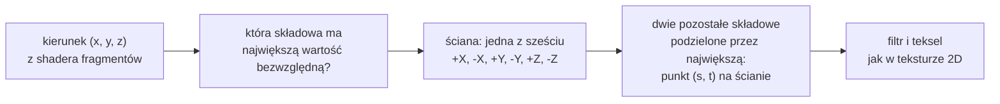

# Moduł renderer: skybox, nocne niebo z tekstury sześciennej

Kamień milowy: M6, część pierwsza (skybox). Teren z mapy wysokości i trawa z shadera geometrii, czyli pozostałe dwie części M6, nie należą do tego dokumentu. Temat wykładu: 8 (Tekstura sześcienna).
Kod: klasa [`src/game/Skybox.hpp`](../../../src/game/Skybox.hpp) i [`Skybox.cpp`](../../../src/game/Skybox.cpp), shadery [`assets/shaders/skybox.vert`](../../../assets/shaders/skybox.vert) i [`skybox.frag`](../../../assets/shaders/skybox.frag), tekstura sześcienna [`src/gfx/Cubemap.hpp`](../../../src/gfx/Cubemap.hpp) i [`Cubemap.cpp`](../../../src/gfx/Cubemap.cpp), sześć obrazów w [`assets/skybox/`](../../../assets/skybox/), skrypt [`tools/blender/make_skybox.py`](../../../tools/blender/make_skybox.py), wywołanie w [`src/game/NightMazeApp.cpp`](../../../src/game/NightMazeApp.cpp) (`onRender`), kontrolki w [`src/debug/panels/RendererPanel.cpp`](../../../src/debug/panels/RendererPanel.cpp), testy w [`tests/SkyboxTests.cpp`](../../../tests/SkyboxTests.cpp).

Dlaczego ten dokument stoi w katalogu `renderer`, chociaż klasa nazywa się `game::Skybox` i leży w `src/game/`, wyjaśniają [`README.md`](README.md) i notatka [`../../decisions/skybox-in-game-layer.md`](../../decisions/skybox-in-game-layer.md). Dokument zakłada znajomość tekstur 2D ([`../gfx/textures.md`](../gfx/textures.md): teksele, filtry, zawijanie, jednostki teksturujące, obiekt samplera), macierzy widoku i rzutowania oraz testu głębi ([`../scene/camera.md`](../scene/camera.md)) i loadera obrazów ([`../assets/images.md`](../assets/images.md)). Samą klasę `gfx::Cubemap` linia po linii opisuje [`../gfx/cubemap.md`](../gfx/cubemap.md): tutaj jest teoria tekstury sześciennej i wszystko, co robi z nią gra.

**Stan na dziś:** nad ścianami labiryntu i nad wzgórzami wokół niego widać nocne niebo: ciemnogranatowe tło jaśniejsze przy horyzoncie, gwiazdy, pas Drogi Mlecznej i tarczę księżyca z poświatą. Niebo jest teksturą sześcienną (cube map) z sześciu plików PNG 1024 x 1024, rysowaną przez `game::Skybox` jako ostatnie wywołanie rysujące sceny. Włącza je i wyłącza pole wyboru `Skybox` w panelu Renderer (startuje zaznaczone), jasność zmienia suwak `Sky brightness`. Od tej części programów shaderów było pięć: doszedł `skybox`. Druga część M6 dodała `grass` (trawa, [`grass-geometry.md`](grass-geometry.md)), pierwsza część M7 `composite` i `preview`, druga `bright` i `blur` (bloom), a czwarta (cienie księżyca, 2026-10-05) `shadow_depth`, więc po czwartej części M7 było ich jedenaście, a po M8, części 1 jest czternaście (doszły `minimap`, `minimap_overlay` i `reflect`). Niebo nie rzuca cienia i żadnego nie przyjmuje: nie jest rysowane do mapy cieni, a `skybox.frag` jej nie czyta. Czwarta część M7 nie zmieniła w kodzie nieba ani jednej linii, ale kierunek cieni ścian zależy od tych samych dwóch kątów co miejsce tarczy księżyca (sekcja 2.9). Trzecia część M7 (mgła i winieta) nie dodała programu ani linii w kodzie nieba, ale zmieniła jego wygląd przy ustawieniach startowych: przy horyzoncie niebo jest zamglone (ma kolor mgły), wyżej księżyc i gwiazdy zostają czyste, a winieta przyciemnia niebo ku rogom ekranu tak samo jak wszystko inne. Tak wynika ze wzoru mgły: nieba z mgłą nikt jeszcze nie oglądał ani nie zgłosił (sekcja 2.7, ostatnie dwa akapity).

**Co zmieniła pierwsza część M7 (2026-10-05).** Niebo, jak cała scena, jest rysowane do bufora HDR, a nie prosto do okna: po nim idą jeszcze podglądy załączników i przebieg składający ([`post-process.md`](post-process.md)). Tekstura sześcienna jest teraz teksturą sRGB (`gfx::ColorSpace::Srgb`, format `GL_SRGB8`), więc shader dostaje wartości liniowe ([`../gfx/color-space.md`](../gfx/color-space.md)). Domyślna jasność wzrosła z 1,0 do 2,2, a zakres suwaka z 3 do 6. Kolor czyszczenia zmienił się z `(0.01, 0.015, 0.04)` na `(0.022, 0.033, 0.088)` i jest przeliczany na liniowy. Widok diagnostyczny nieba przechodzi przez `srgbToLinear`. Obrazy w `assets/skybox/` i ich liczby w skrypcie się nie zmieniły.

Zgłoszone dla Windowsa (2026-10-05) dla tej części: build Debug i Release bez ostrzeżeń, 221 przypadków testowych i 85175 asercji w obu konfiguracjach (po terenie i trawie 256 przypadków i 101232 asercje, a po pierwszej części M7 zgłoszone 269 przypadków i 102103 asercje, po drugiej 276 i 102139, po trzeciej 294 i 102412, po czwartej 310 i 103751). Liczby zgadzają się z kodem: po M5 było 215 i 85098, doszło 5 przypadków i 71 asercji w `tests/SkyboxTests.cpp` oraz 1 przypadek i 6 asercji w `tests/ImageLoaderTests.cpp`. Orientacja nieba była sprawdzona na zrzutach ekranu: księżyc w środku obrazu przy kamerze ustawionej na yaw 205 i pitch 50, poziomy horyzont, brak szwów między ścianami sześcianu. Wersji kompilatora, karty i sterownika dla tego pomiaru nie zapisano. **Nikt jeszcze nie kliknął myszą** pola `Skybox`, suwaka `Sky brightness` ani przycisku `Reload shaders` (wtedy przy pięciu programach, dziś przy jedenastu). **Na macOS ten kod nie był ani budowany, ani uruchamiany.** M6 jest dziś kompletny w kodzie na Windowsie (niebo, teren, trawa) i nie jest zamknięty: macOS i testy ręczne są otwarte.

## 1. Po co to jest

Labirynt nie ma sufitu. Do M5 nad ścianami był jeden płaski kolor: ten, którym `glClear` czyści ekran. Wygląda to jak pudełko pomalowane od środka, a przy obracaniu kamery tło w ogóle się nie zmienia, więc oko nie ma punktu odniesienia.

**Skybox** rozwiązuje to najtaniej, jak się da: sześć obrazów nieba naklejonych od środka na sześcian, w którego środku zawsze stoi kamera. Sześcian obraca się razem z kamerą, ale nigdy się nie przybliża, więc niebo wygląda na nieskończenie odległe. Potrzebne są do tego cztery rzeczy:

| Rzecz | Gdzie | Sekcja |
|---|---|---|
| tekstura z sześciu obrazów, czytana **kierunkiem** zamiast pary `(u, v)` | klasa `gfx::Cubemap` | 2.1 do 2.5, kod w [`../gfx/cubemap.md`](../gfx/cubemap.md) |
| sześć plików, które pasują do siebie na krawędziach | skrypt `make_skybox.py`, katalog `assets/skybox/` | 2.8, 5.7 |
| loader, który nie odwraca wierszy | `assets::RowOrder::TopFirst` | 2.4 |
| przebieg rysujący: sześcian bez przesunięcia kamery, na największej głębi, rysowany na końcu | `game::Skybox::draw`, shadery `skybox` | 2.6, 2.7, 3, 4 |

To jest temat 8 wykładu, "Tekstura sześcienna", a pokaz z PRD to "toggle skybox". Ta sama tekstura sześcienna posłuży w M8 do odbić i załamań (temat 12, environment mapping): kryształ odbijający niebo czyta dokładnie tę teksturę, tylko innym kierunkiem. **Od M8, części 1 ten kod jest** (2026-10-06): program `reflect` czyta tę samą teksturę przez `game::Skybox::cubemap()` na jednostce 5, wzory i liczby są w [`env-mapping.md`](env-mapping.md). Nikt nie obejrzał obrazu.

## 2. Teoria

### 2.1 Czym jest tekstura sześcienna

Zwykła tekstura to jeden obraz, a jej współrzędną jest punkt na obrazie: para `(u, v)`. **Tekstura sześcienna** (cube map) to **sześć kwadratowych obrazów tej samej wielkości**, czyli sześć ścian sześcianu ustawionego wokół początku układu współrzędnych. Jej współrzędną jest **kierunek**: wektor trzech liczb `(x, y, z)`.

Karta graficzna odpowiada na pytanie: "gdybym stał w środku sześcianu i patrzył w tym kierunku, jaki kolor zobaczę?". Robi to w dwóch krokach:

1. wybiera ścianę, w którą trafia kierunek,
2. liczy, w który punkt tej ściany trafia, i czyta stamtąd teksel jak ze zwykłej tekstury 2D.

Długość wektora nie ma znaczenia: `(0, 0, -1)` i `(0, 0, -50)` wskazują w tę samą stronę i dają ten sam kolor. Dlatego shader nie musi kierunku normalizować.



Do czego się nadaje: do wszystkiego, co zależy tylko od kierunku, a nie od miejsca. Niebo (ten dokument), odbicie otoczenia w błyszczącej powierzchni (temat 12, od M8, części 1 w grze: [`env-mapping.md`](env-mapping.md)), cień światła punktowego, które świeci we wszystkie strony.

### 2.2 Sześć ścian i ich kolejność

OpenGL numeruje ściany stałymi, które są **kolejnymi liczbami**:

| Numer | Stała OpenGL | Oś | Plik gry | Co to jest dla kamery patrzącej wzdłuż -Z |
|---|---|---|---|---|
| 0 | `GL_TEXTURE_CUBE_MAP_POSITIVE_X` | +X | `px.png` | prawa strona |
| 1 | `GL_TEXTURE_CUBE_MAP_NEGATIVE_X` | -X | `nx.png` | lewa strona |
| 2 | `GL_TEXTURE_CUBE_MAP_POSITIVE_Y` | +Y | `py.png` | góra (zenit) |
| 3 | `GL_TEXTURE_CUBE_MAP_NEGATIVE_Y` | -Y | `ny.png` | dół |
| 4 | `GL_TEXTURE_CUBE_MAP_POSITIVE_Z` | +Z | `pz.png` | tył |
| 5 | `GL_TEXTURE_CUBE_MAP_NEGATIVE_Z` | -Z | `nz.png` | przód |

`p` w nazwie pliku to "positive", `n` to "negative". Układ gry jest prawoskrętny, Y w górę, -Z do przodu ([`../scene/README.md`](../scene/README.md)), więc kamera z kątem yaw 0 patrzy w środek ściany `nz.png`, a ściana `pz.png` jest za jej plecami.

Kolejność jest umową w trzech miejscach, które muszą się zgadzać:

| Miejsce | Zapis |
|---|---|
| `gfx::Cubemap` | typ `FacePixels`: tablica sześciu wskaźników w kolejności +X, -X, +Y, -Y, +Z, -Z. Pętla wysyła ścianę numer `face` do celu `GL_TEXTURE_CUBE_MAP_POSITIVE_X + face` |
| `game::Skybox` | tablica `FACE_FILES` w `Skybox.cpp`: `"skybox/px.png"`, `"skybox/nx.png"`, `"skybox/py.png"`, `"skybox/ny.png"`, `"skybox/pz.png"`, `"skybox/nz.png"` |
| skrypt | krotka `FACES` w `make_skybox.py`: te same nazwy w tej samej kolejności, każda z trzema wektorami (sekcja 2.8) |

Zamiana dwóch plików nie daje żadnego błędu: niebo po prostu nie pasuje na krawędziach. Pilnuje tego test granic (sekcja 5.8).

### 2.3 Jak kierunek wybiera ścianę i teksel

Reguła pochodzi ze specyfikacji OpenGL (tabela "Selection of cube map images"). Kierunek ma składowe `(rx, ry, rz)`.

**Krok 1: ściana.** Wygrywa oś, na której kierunek jest **najdłuższy**, czyli składowa o największej wartości bezwzględnej. Jej znak wybiera jedną z dwóch ścian tej osi. Ta składowa nazywa się osią główną (major axis), a jej wartość bezwzględna to `ma`.

**Krok 2: punkt na ścianie.** Z dwóch pozostałych składowych powstają liczby `sc` i `tc`, według tabeli:

| Oś główna | Ściana | `sc` (rośnie w prawo obrazu) | `tc` (rośnie **w dół** obrazu) | `ma` |
|---|---|---|---|---|
| `+rx` | +X | `-rz` | `-ry` | `rx` |
| `-rx` | -X | `+rz` | `-ry` | `rx` |
| `+ry` | +Y | `+rx` | `+rz` | `ry` |
| `-ry` | -Y | `+rx` | `-rz` | `ry` |
| `+rz` | +Z | `+rx` | `-ry` | `rz` |
| `-rz` | -Z | `-rx` | `-ry` | `rz` |

**Krok 3: z zakresu od -1 do 1 na zakres od 0 do 1.**

```text
s = (sc / |ma| + 1) / 2
t = (tc / |ma| + 1) / 2
```

Dzielenie przez `|ma|` to rzut na ścianę: kierunek jest wydłużany albo skracany tak, żeby jego koniec leżał dokładnie na ścianie sześcianu o boku 2 (od -1 do 1). Dwie pozostałe składowe są wtedy położeniem na tej ścianie, od -1 do 1. Ostatni krok zamienia je na zwykłe współrzędne tekstury.

**Przykład na liczbach gry: gdzie jest księżyc.** Tarcza księżyca jest namalowana w kierunku `(-0,272, 0,766, 0,583)` (skąd te liczby: sekcja 2.9).

| Krok | Rachunek | Wynik |
|---|---|---|
| wartości bezwzględne | 0,272, 0,766, 0,583 | największa jest `y`, dodatnia |
| ściana | oś główna `+ry` | +Y, czyli `py.png` |
| `sc`, `tc` | `sc = +rx = -0,272`, `tc = +rz = 0,583`, `ma = 0,766` | |
| `s` | `(-0,272 / 0,766 + 1) / 2` | 0,323 |
| `t` | `(0,583 / 0,766 + 1) / 2` | 0,880 |
| piksel | `0,323 * 1024` i `0,880 * 1024` | kolumna 330, wiersz 901 od góry |

Sprawdziłem to na pliku: piksel w kolumnie 330 i wierszu 901 (licząc od górnego wiersza) pliku `py.png` ma kolor `(200, 207, 224)`, czyli prawie białą tarczę. Środek tego samego pliku, zenit, ma `(2, 4, 11)`. Księżyc leży więc na ścianie górnej, w jej dolnej lewej ćwiartce, a nie na żadnej ze ścian bocznych: stoi 50 stopni nad horyzontem, a ściana boczna sięga tylko do 45 stopni w swoim środku.

Tę samą regułę, przepisaną ze specyfikacji, ma funkcja `facePointOf` w testach (sekcja 5.8).

### 2.4 Który wiersz jest pierwszy: dlaczego ściany nie są odwracane

To jest miejsce, w którym tekstura sześcienna różni się od tekstury 2D w sposób, którego nie widać w żadnym komunikacie o błędzie.

**Tekstura 2D.** OpenGL traktuje pierwszy wiersz danych, które dostaje, jako `v = 0`, a w konwencji modeli `v = 0` to **dół** obrazu. Plik PNG zaczyna się od górnego wiersza, więc loader odwraca kolejność wierszy ([`../assets/images.md`](../assets/images.md), sekcja 2.3).

**Ściana tekstury sześciennej.** OpenGL nadal traktuje pierwszy wiersz danych jako `t = 0`. Ale tabela z sekcji 2.3 mówi, co `t = 0` znaczy na ścianie: dla czterech ścian bocznych `tc = -ry`, więc kierunek wskazujący **w górę** (duże `ry`) daje małe `t`. Na ścianie tekstury sześciennej `t = 0` to **góra** obrazu. Konwencja pochodzi z RenderMana, w którym początek obrazu to lewy górny róg, i jest zapisana w specyfikacji na stałe.

| | Tekstura 2D | Ściana tekstury sześciennej |
|---|---|---|
| pierwszy wiersz danych to współrzędna | `v = 0` | `t = 0` |
| co ta współrzędna znaczy | dół obrazu | **góra** obrazu |
| pierwszy wiersz pliku PNG | góra obrazu | góra obrazu |
| co musi zrobić loader | odwrócić wiersze | **nic** |

Stąd nowy parametr loadera, `assets::RowOrder` ([`../assets/images.md`](../assets/images.md), sekcja 2.7):

| Wartość | Co robi `loadImage` | Dla kogo |
|---|---|---|
| `RowOrder::BottomFirst` (domyślna) | kopiuje wiersze od końca: pierwszy wiersz w `Image::pixels` to dół obrazu | każda tekstura 2D |
| `RowOrder::TopFirst` | kopiuje wiersze tak, jak są w pliku: pierwszy wiersz to góra obrazu | ściany tekstury sześciennej |

`game::Skybox` wczytuje sześć plików z `RowOrder::TopFirst`. Co by się stało z domyślnym odwróceniem: każda ściana byłaby do góry nogami. Na czterech ścianach bocznych horyzont zostałby mniej więcej na miejscu (tło jest symetryczne względem horyzontu), ale ściany górna i dolna przestałyby pasować do bocznych, a księżyc trafiłby w inne miejsce nieba. Komentarz w teście podaje liczby zmierzone na plikach gry: przy poprawnym wczytaniu średnia różnica koloru po dwóch stronach granicy wynosi od 0,3 do 0,9 poziomu kanału na dwunastu granicach, a przy wszystkich ścianach wczytanych do góry nogami osiem granic ściany górnej i dolnej daje od 3,9 do 7,1.

**Pliki wyglądają na odbite lustrzanie, i tak ma być.** Obraz ściany pokazuje swoją stronę sześcianu widzianą **z zewnątrz**, a gra patrzy na nią od środka. W tabeli widać to w znaku `sc`: dla ściany -Z (przód) `sc = -rx`, więc kierunek w prawo ekranu (`+X`) trafia w **lewą** połowę obrazu. Kto otworzy `nz.png` obok zrzutu ekranu z gry, zobaczy ten sam fragment nieba odbity w poziomie. To nie jest błąd skryptu ani loadera, tylko definicja tekstury sześciennej. Test `the rule of the cube map faces: the middle and the corners of a face` przypina to na liczbach: kierunek `(0,5, 0,5, -1)`, czyli w górę i w prawo, daje `s = 0,25` i `t = 0,25`.

### 2.5 Filtrowanie na krawędzi ściany: `GL_CLAMP_TO_EDGE` i szwy

Wewnątrz ściany tekstura sześcienna jest filtrowana jak każda inna: filtr liniowy miesza cztery sąsiednie teksele ([`../gfx/textures.md`](../gfx/textures.md), sekcja 2.3). Kłopot zaczyna się przy **krawędzi** ściany. Kierunek, który trafia w ostatnie pół teksela, potrzebuje do mieszania sąsiada, który na tej ścianie nie istnieje. Skąd go wziąć?

| Ustawienie | Skąd pochodzi brakujący sąsiad | Co widać |
|---|---|---|
| zawijanie `GL_REPEAT` (wartość domyślna samplera) | z **przeciwległej** krawędzi tej samej ściany | cienka linia na każdej krawędzi sześcianu: do koloru przy horyzoncie domieszany jest kolor z drugiego końca obrazu |
| zawijanie `GL_CLAMP_TO_EDGE` | powtarza się skrajny teksel tej samej ściany | brak obcego koloru. Zostaje drobna nieciągłość: po obu stronach krawędzi filtr kończy się na swoim tekselu i nie miesza przez granicę |
| `glEnable(GL_TEXTURE_CUBE_MAP_SEAMLESS)` | z **sąsiedniej ściany**, czyli stamtąd, gdzie ten sąsiad naprawdę leży na niebie | filtr działa przez krawędź tak samo jak w środku ściany |

Projekt ustawia oba zabezpieczenia:

- `gfx::Cubemap` daje swojemu obiektowi samplera `GL_CLAMP_TO_EDGE` na trzech osiach: `GL_TEXTURE_WRAP_S`, `GL_TEXTURE_WRAP_T` i `GL_TEXTURE_WRAP_R`. Osie S i T leżą w ścianie, R to trzecia współrzędna kierunku: tekstura sześcienna jest adresowana trzema liczbami, więc ma trzy tryby zawijania.
- `game::Skybox::draw` włącza `GL_TEXTURE_CUBE_MAP_SEAMLESS`. Przełącznik jest w rdzeniu OpenGL od wersji 3.2, domyślnie jest wyłączony i dotyczy wyłącznie tekstur sześciennych, więc kod zostawia go włączonego i nie wyłącza po narysowaniu.

Przy włączonym filtrowaniu bez szwów specyfikacja każe ignorować tryby zawijania tekstury sześciennej: sąsiad pochodzi z sąsiedniej ściany. `GL_CLAMP_TO_EDGE` jest więc tym, co obowiązuje, gdyby przełącznik był wyłączony, i tym, co chroni przed `GL_REPEAT` z cudzego samplera (pułapka 6).

Jest jeszcze trzecie, najważniejsze zabezpieczenie, i nie ma go w OpenGL, tylko w danych: **obie strony granicy pokazują to samo niebo**, bo skrypt liczy każdy piksel z kierunku, a nie maluje ścian osobno (sekcja 2.8). Żaden tryb filtrowania nie ukryje granicy między dwoma obrazami, które do siebie nie pasują.

### 2.6 Niebo, które nigdy się nie przybliża: macierz widoku bez przesunięcia

Macierz widoku robi dwie rzeczy: **obraca** świat tak, żeby kierunek patrzenia kamery stał się osią -Z, i **przesuwa** go tak, żeby kamera znalazła się w początku układu ([`../scene/camera.md`](../scene/camera.md), sekcja 2). W macierzy 4 x 4 te dwie części leżą osobno:

```text
        | r r r  tx |        lewy górny blok 3 x 3 (r): obrót
view =  | r r r  ty |        czwarta kolumna (tx, ty, tz): przesunięcie
        | r r r  tz |
        | 0 0 0  1  |
```

Gdyby sześcian nieba był rysowany pełną macierzą widoku, stałby w jednym miejscu świata jak każdy inny model: gracz mógłby do niego podejść i wyjść przez ścianę. Niebo ma zachowywać się jak coś bardzo odległego: obracać się, gdy obracam głowę, i **nie zmieniać się wcale**, gdy idę. Wystarczy więc z macierzy widoku zostawić obrót i wyrzucić przesunięcie:

```glsl
mat4 viewWithoutTranslation = mat4(mat3(uView));
```

`mat3(uView)` wycina lewy górny blok 3 x 3, a `mat4(...)` wkłada go z powrotem do macierzy 4 x 4, uzupełniając resztę zerami i jedynką w rogu. Czwarta kolumna, czyli przesunięcie, ma teraz `(0, 0, 0)`. Skutek: kamera jest **zawsze w środku sześcianu**, gdziekolwiek stoi gracz.

Uwaga do pytań na obronie: to nie jest to samo co macierz normalnych. Tam też używa się bloku 3 x 3, ale po to, żeby kierunki zostały prostopadłe do powierzchni ([`../scene/lights.md`](../scene/lights.md), sekcja 2.7). Tu chodzi wyłącznie o pozbycie się przesunięcia.

### 2.7 Głębia 1,0: `xyww`, `GL_LEQUAL` i rysowanie na końcu

Sześcian ma bok 2 (narożniki w -1 i 1), a ściany labiryntu stoją dziesiątki metrów dalej. Żeby niebo było **za** wszystkim, nie powiększam sześcianu, tylko oszukuję na głębi.

**Skąd bierze się głębia.** Shader wierzchołków zapisuje `gl_Position = (x, y, z, w)` w przestrzeni przycięcia. Karta dzieli potem `x`, `y` i `z` przez `w` (dzielenie perspektywiczne) i dostaje współrzędne od -1 do 1. Wynik `z / w` równy -1 to bliska płaszczyzna, równy 1 to daleka. Do bufora głębi trafia ta sama liczba przeliczona na zakres od 0 do 1: `(z / w + 1) / 2` ([`../scene/camera.md`](../scene/camera.md), sekcja 2).

**Sztuczka.** Shader wpisuje `w` w miejsce `z`:

```glsl
gl_Position = position.xyww;
```

`position.xyww` to wektor `(x, y, w, w)`. Po dzieleniu głębia każdego wierzchołka wynosi `w / w = 1`, czyli dokładnie daleka płaszczyzna, i do bufora trafiłoby `(1 + 1) / 2 = 1,0`: największa głębia, jaka istnieje. Rozmiar sześcianu przestaje mieć znaczenie dla głębi. Przestaje też mieć znaczenie dla przycinania: warunek bryły widzenia `-w <= z <= w` przy `z = w` jest spełniony dla każdego `w >= 0`, więc bliska płaszczyzna (0,1 m) nie odcina ścian sześcianu oddalonych o metr.

**Dlaczego `GL_LEQUAL`.** `glClear` wypełnia bufor głębi wartością 1,0. Domyślny test głębi to `GL_LESS`: fragment przechodzi, gdy jest **bliżej** niż to, co już jest w buforze. Niebo ma głębię 1,0, w buforze jest 1,0, a 1,0 nie jest mniejsze od 1,0: z `GL_LESS` niebo nie narysowałoby się nigdzie. `GL_LEQUAL` ("mniejsze albo równe") przepuszcza także remis.

| Piksel | Co jest w buforze głębi | Test `1,0 <= bufor` | Wynik |
|---|---|---|---|
| nic na nim nie narysowano | 1,0 (po `glClear`) | prawda | niebo |
| ściana, teren (grunt i wzgórza), trawa, kryształ, brama, linia kolizji | mniej niż 1,0 | fałsz | zostaje to, co było |

**Dlaczego na końcu.** Niebo można narysować jako pierwsze albo jako ostatnie i obraz wyjdzie ten sam. Różnica jest w pracy karty:

| Kolejność | Ile fragmentów nieba przechodzi przez shader fragmentów |
|---|---|
| niebo pierwsze | wszystkie piksele ekranu (ponad 900 tysięcy w oknie 1280 x 720), z czego większość zostanie potem zamalowana ścianami, a od drugiej części M6 także gruntem i wzgórzami |
| niebo ostatnie | tylko te, na których nic nie narysowano: karta może odrzucić resztę testem głębi **przed** uruchomieniem shadera fragmentów |

Uczciwie o tym "może": wczesny test głębi (early depth test) to optymalizacja sterownika. Wolno mu ją zastosować, gdy shader fragmentów nie zapisuje `gl_FragDepth` i nie używa `discard`, a `skybox.frag` nie robi żadnej z tych rzeczy. W GLSL 4.10 nie da się jej jednak wymusić. **Zysku nie mierzyłem.** W labiryncie, w którym większość ekranu zajmują ściany i grunt, oszczędność powinna być największa. Nie jest to więc gwarancja, że zasłonięte piksele nieba "nie kosztują pracy shadera fragmentów", jak mówił komentarz w `onRender` do pierwszej części M6. Prawdziwe zdanie brzmi: nieprzezroczysta geometria narysowana przed niebem jest już w buforze głębi, więc tam, gdzie karta stosuje wczesny test głębi, zasłonięte fragmenty nieba odpadają przed shaderem. Komentarz został poprawiony i mówi dziś właśnie to (sekcja 5.6).

**Zapis głębi wyłączony.** `glDepthMask(GL_FALSE)` na czas rysowania nieba: nic nigdy nie jest za niebem, więc jego głębi nie ma po co zapisywać. Przy głębi równej dokładnie 1,0 zapis i tak niczego by nie zmienił, ale wyłączenie go jest zabezpieczeniem na wypadek, gdyby głębia wyszła o włos mniejsza.

**Co z rzeczami rysowanymi po niebie.** Komentarz w `onRender` kończył się do pierwszej części M6 zdaniem, że wszystko, co ma leżeć przed niebem, trzeba narysować nad tą linią. Mówiło to więcej, niż wymaga OpenGL. Dziś komentarz mówi wprost to, co pokazuje tabela: obraz byłby taki sam przy niebie narysowanym wcześniej, bo test głębi porządkuje rzeczy nieprzezroczyste, a po niebie musiałoby przyjść tylko coś, co nie zapisuje głębi, na przykład efekt przezroczysty:

| Co jest rysowane | Przed niebem | Po niebie |
|---|---|---|
| obiekt nieprzezroczysty (ściana, model) | poprawnie, i niebo nie jest cieniowane pod nim | **też poprawnie**: niebo zostawia w buforze głębię 1,0, więc obiekt przechodzi zwykły test `GL_LESS` i zamalowuje niebo. Traci się tylko oszczędność: piksele nieba pod nim zostały już policzone |
| obiekt przezroczysty z mieszaniem kolorów (takiego w grze jeszcze nie ma) | **źle**. Jeśli zapisuje głębię, niebo za nim się nie narysuje i przez obiekt prześwituje kolor czyszczenia. Jeśli jej nie zapisuje, niebo narysowane później zamaluje go w całości | poprawnie: miesza się z niebem, które już jest w buforze koloru |

Kolejność "niebo na końcu" jest więc regułą dla sceny nieprzezroczystej, taką jak dzisiejsza. Pierwszy obiekt przezroczysty będzie musiał być rysowany **po** niebie, i tak właśnie mówi dziś ostatnie zdanie komentarza.

**Głębia 1,0 i mgła (trzecia część M7).** Od trzeciej części M7 głębię sceny czyta jeszcze ktoś: mgła w przebiegu składającym odtwarza z niej miejsce w świecie, które pokazuje piksel ([`post-process.md`](post-process.md), sekcje 2.19 i 2.21). Piksel nieba ma w teksturze głębi 1,0 (to wartość po `glClear`, bo niebo głębi nie zapisuje), więc odtworzony punkt leży na **dalekiej płaszczyźnie**, 100 m od kamery wzdłuż osi patrzenia. Mgła nie ma dla nieba żadnego osobnego przypadku: liczy ten punkt tym samym wzorem co ścianę. Wynik wychodzi sam z wysokości punktu. Przy horyzoncie punkt jest daleko i nisko, więc niebo tonie tam w kolorze mgły. Wyżej punkt na dalekiej płaszczyźnie leży dziesiątki metrów nad podstawą mgły, współczynnik wysokości jest prawie zerem, a księżyc i gwiazdy zostają czyste. Liczby dla ustawień startowych (gęstość 0,1 na metr, podstawa 0,5 m, spadek 0,4 na metr), **policzone ze wzoru, nie zmierzone na ekranie**: około 100 % mgły na horyzoncie, około 50 % trzy stopnie nad nim i poniżej 1 % od około dziesięciu stopni w górę. Księżyc stoi 50 stopni nad horyzontem, daleko poza tym pasem.

Jedno zastrzeżenie, którego trzeba być świadomym. Daleka płaszczyzna jest płaska i obraca się razem z kamerą, więc ten sam niski pasek nieba jest 100 m od oka w środku ekranu i od 143 do 155 m przy jego bokach, a punkt na tym samym kącie nad horyzontem leży tam odpowiednio wyżej. Trzy stopnie nad horyzontem wzór daje 0,53 mgły w środku ekranu i około 0,31 do 0,36 przy bokach. Zdanie "mgła nie przesuwa się, gdy kamera obraca się w miejscu" jest więc prawdziwe dla geometrii (dla ściany odległość do oka nie zależy od kierunku patrzenia), a cienki pas zamglenia na samym niebie może się przy obrocie lekko zmieniać. To też jest policzone, a nie zaobserwowane: do sprawdzenia ręcznie. Dlaczego niebo nie dostało wyjątku, zapisuje notatka [`../../decisions/fog-no-special-case-for-sky.md`](../../decisions/fog-no-special-case-for-sky.md).

### 2.8 Skąd biorą się obrazy: kierunek dla każdego piksela

Skoro karta czyta teksturę sześcienną kierunkiem, skrypt [`make_skybox.py`](../../../tools/blender/make_skybox.py) robi to samo w drugą stronę: dla każdego piksela każdej ściany liczy **kierunek, w którym ten piksel jest widziany**, a kolor nieba jest funkcją wyłącznie tego kierunku. Nic nie jest malowane "na ścianie".

Każda ściana jest opisana trzema wektorami: `forward` (środek ściany), `right` (w prawo obrazu) i `down` (w dół obrazu). To tabela z sekcji 2.3 odwrócona:

| Plik | `forward` | `right` | `down` |
|---|---|---|---|
| `px.png` | `(1, 0, 0)` | `(0, 0, -1)` | `(0, -1, 0)` |
| `nx.png` | `(-1, 0, 0)` | `(0, 0, 1)` | `(0, -1, 0)` |
| `py.png` | `(0, 1, 0)` | `(1, 0, 0)` | `(0, 0, 1)` |
| `ny.png` | `(0, -1, 0)` | `(1, 0, 0)` | `(0, 0, -1)` |
| `pz.png` | `(0, 0, 1)` | `(1, 0, 0)` | `(0, -1, 0)` |
| `nz.png` | `(0, 0, -1)` | `(-1, 0, 0)` | `(0, -1, 0)` |

```text
kierunek piksela = normalize(forward + a * right + b * down)
a = (kolumna + 0,5) / SIZE * 2 - 1        od -1 przy lewej krawędzi do 1 przy prawej
b = (wiersz + 0,5) / SIZE * 2 - 1         od -1 przy GÓRNEJ krawędzi do 1 przy dolnej
```

Dodane `0,5` to środek piksela: piksel numer 0 zajmuje odcinek od 0 do 1, więc jego środek leży w 0,5. Zgodność tej tabeli z tabelą specyfikacji można sprawdzić na jednym wierszu: dla `nz.png` kierunek to `(-a, -b, -1)`, czyli `rx = -a` i `ry = -b`, a specyfikacja mówi `sc = -rx = a` i `tc = -ry = b`. Zgadza się.

**Dlaczego nie ma szwów.** Dwa piksele po dwóch stronach krawędzi sześcianu należą do różnych plików, ale ich kierunki różnią się o ułamek stopnia. Tło, Droga Mleczna, poświata księżyca i szum są funkcjami kierunku, więc dają po obu stronach prawie ten sam kolor. Gwiazda leżąca blisko krawędzi jest rysowana na obu ścianach, a każda liczy swoją połowę plamki z kierunków własnych pikseli.

Warstwy obrazu, w kolejności składania (funkcja `build`):

| Warstwa | Funkcja | Wzór w słowach | Stałe |
|---|---|---|---|
| tło | `background` | kolor zenitu plus `(1 - \|y\|) ^ 2,5` razy różnica do koloru horyzontu. `y` kierunku to sinus wysokości nad horyzontem, więc przy horyzoncie wyrażenie daje 1, a prosto w górę 0. Wartość bezwzględna sprawia, że niebo pod horyzontem jest lustrem nieba nad nim | `ZENITH_COLOR = (0.010, 0.016, 0.045)`, `HORIZON_COLOR = (0.034, 0.050, 0.098)`, `HORIZON_FALLOFF = 2.5` |
| Droga Mleczna | `milky_way` | pas wzdłuż koła wielkiego: zbiór kierunków prostopadłych do osi `MILKY_WAY_AXIS`. Iloczyn skalarny kierunku z osią to sinus odległości od środka pasa. Jasność spada z odległością jak krzywa Gaussa, a dwie warstwy szumu, pomnożone przez siebie, rwą pas na chmury | `MILKY_WAY_AXIS = (0.55, 0.45, 0.70)`, szerokość 10 stopni, częstotliwości szumu 3 i 8, `MILKY_WAY_FLOOR = 0.25`, `MILKY_WAY_NOISE_GAIN = 2.0` |
| gwiazdy | `make_stars`, `add_stars` | 2600 gwiazd rozrzuconych równo po całej sferze i 1900 skupionych wokół pasa. Gwiazda to mała plamka Gaussa wokół **kierunku**. Jasność to `0,10 + 0,90 * u ^ 5` dla losowego `u` od 0 do 1: piąta potęga sprawia, że jasnych gwiazd jest mało | `STAR_COUNT = 2600`, `MILKY_WAY_STAR_COUNT = 1900`, `STAR_RARITY = 5.0`, sigma plamki od 0,06 do 0,17 stopnia, 14% gwiazd lekko zabarwionych (połowa ciepło, połowa chłodno) |
| poświata księżyca | `moon_layers` | dwie krzywe Gaussa kąta od środka księżyca: mała jasna i szeroka słaba. Są **dodawane** do nieba | sigma 3,5 i 11 stopni |
| tarcza księżyca | `moon_layers` | koło o promieniu 2,2 stopnia z brzegiem wygładzonym na 0,2 stopnia, z szarymi plamami z szumu. Tarcza **zasłania** to, co jest za nią (gwiazdy, Drogę Mleczną), zamiast się do tego dodawać: `kolor * (1 - pokrycie) + tarcza * pokrycie` | `MOON_RADIUS_DEGREES = 2.2`, `MOON_COLOR = (0.86, 0.89, 0.96)`, `MOON_PATCH_DEPTH = 0.22` |

Prawdziwy księżyc ma promień około 0,26 stopnia. Namalowany jest ponad osiem razy większy, bo tarcza wielkości kilku pikseli nie czytałaby się w grze jako księżyc.

**Losowy kierunek na sferze.** `make_stars` bierze trzy niezależne liczby z rozkładu normalnego i skaluje wektor do długości 1. Taki kierunek jest równo prawdopodobny w każdą stronę. Trzy liczby z rozkładu równomiernego dałyby zagęszczenie gwiazd w narożnikach sześcianu, w który wpisana jest sfera.

**Szum bez szwów.** `value_noise` to sześcian `32 x 32 x 32` losowych liczb wypełniający przestrzeń. Kierunek jest punktem na sferze o promieniu 1. Po przeskalowaniu przez częstotliwość skrypt znajduje komórkę siatki, w której leży punkt, i miesza osiem liczb z jej narożników według odległości punktu od każdego z nich (krzywa `3t^2 - 2t^3`, która zaczyna się i kończy płasko). Wynik zależy tylko od punktu w przestrzeni, więc nie wie nic o ścianach tekstury i nie ma na nich szwów.

**Dithering przeciw pasom.** Kanał 8-bitowy ma 256 poziomów, a ciemne niebo używa kilku z nich: kolor zenitu `(0.010, 0.016, 0.045)` to poziomy 3, 4 i 11. Gładki gradient zapisany wprost wyszedłby jako szerokie pasy z widocznymi stopniami między nimi (banding). `save_face` dodaje więc przed zaokrągleniem losową liczbę od -0,5 do 0,5 poziomu. Stopień rozpada się na drobne ziarno, które oko uśrednia z powrotem do gładkiego przejścia.

Cena jest w rozmiarze plików. PNG kompresuje bezstratnie, czyli szuka powtórzeń, a ziarno powtórzeń nie ma. Sześć plików zajmuje razem **5 278 627 bajtów** (około 5,28 MB, czyli 5,03 MiB), od 860 524 do 904 707 bajtów każdy. To około 28% surowych danych, których jest `1024 * 1024 * 3 = 3 145 728` bajtów na ścianę. Gładki gradient bez ziarna i bez gwiazd skompresowałby się o rzędy wielkości lepiej, ale tego nie mierzyłem. Dla porównania: osiem tekstur 512 x 512 z `assets/textures/` zajmuje razem 2 397 744 bajty, więc niebo to dziś ponad dwie trzecie wagi wszystkich obrazów gry.

**Rozdzielczość.** Jedna ściana obejmuje 90 stopni na 1024 pikselach, więc teksel w środku ściany ma około 0,11 stopnia. Gra pokazuje 60 stopni (`fovDegrees`) na 720 pikselach wysokości okna, czyli około 0,08 stopnia na piksel ekranu. Niebo jest więc w oknie 1280 x 720 rysowane blisko własnej rozdzielczości, z lekkim powiększeniem: jeden teksel to mniej więcej 1,3 piksela. Na ekranie Retina, gdzie framebuffer ma dwa razy więcej pikseli w pionie, jeden teksel zajmie już około 2,7 piksela i gwiazdy będą wyraźnie miększe. Tego nie oglądałem.

**Powtarzalność.** Cały skrypt używa jednego generatora liczb losowych, `np.random.default_rng(SKY_SEED)` z `SKY_SEED = 53`, w stałej kolejności: najpierw siatka szumu, potem gwiazdy, potem ziarno ditheringu kolejnych ścian. To samo ziarno powinno więc dać te same sześć plików przy każdym uruchomieniu. **Tego nie zmierzyłem**: nikt nie uruchomił skryptu dwa razy i nie porównał plików, a na Macu skrypt nie był uruchamiany wcale.

### 2.9 Księżyc na niebie a światło księżyca

W grze są dwa księżyce i trzeba umieć je rozdzielić:

| | Światło księżyca | Tarcza księżyca |
|---|---|---|
| czym jest | światłem kierunkowym w bloku `LightBlock` ([`../scene/lights.md`](../scene/lights.md)) | kilkuset jasnymi pikselami w pliku `py.png` |
| skąd kierunek | `moonYawDegrees = 25` i `moonPitchDegrees = -50` w `game::LightingSettings` | `MOON_LIGHT_YAW_DEGREES = 25.0` i `MOON_LIGHT_PITCH_DEGREES = -50.0` w `make_skybox.py` |
| da się zmienić w grze | tak, suwaki `Moon yaw` i `Moon pitch` w panelu Lights | **nie**: obraz jest stały |

Dwa kąty opisują kierunek, w którym światło **leci**. Funkcja `scene::directionFromAngles` (i jej kopia w skrypcie, `direction_from_angles`) zamienia je na wektor:

```text
kierunek = (cos(pitch) * sin(yaw), sin(pitch), -cos(pitch) * cos(yaw))

dla yaw = 25, pitch = -50:
    cos(-50) = 0,643    sin(-50) = -0,766    sin(25) = 0,423    cos(25) = 0,906
    światło leci w kierunku (0,272, -0,766, -0,583)       w dół, lekko w prawo i do przodu
    księżyc jest tam, skąd leci: (-0,272, 0,766, 0,583)
```

Skrypt maluje tarczę w kierunku przeciwnym do lotu światła (`moon_direction = -direction_from_angles(...)`). Dla kamery ten sam kierunek to yaw 205 i pitch 50: odwrócenie wektora zmienia znak kąta pitch i dodaje 180 stopni do yaw. Tak właśnie była sprawdzana orientacja nieba na zrzucie ekranu: kamera ustawiona na yaw 205 i pitch 50 ma tarczę w środku obrazu.

Dzięki temu sprzężeniu scena jest spójna: ściany są jaśniejsze od tej strony, z której na niebie widać księżyc.

**Cienie a tarcza (czwarta część M7, cienie księżyca, 2026-10-05).** Od tej części światło księżyca rzuca cienie, a mapa cieni jest liczona z tego samego kierunku: `game::moonDirection(settings)` zwraca `scene::directionFromAngles(moonYawDegrees, moonPitchDegrees)` i korzystają z niej zarówno `buildLightSet`, jak i `NightMazeApp::drawMoonShadowMap`. Przy wartościach domyślnych cienie ścian padają więc od tarczy: w kierunku poziomym `(0,272, -0,583)` w osiach x i z. Długość cienia wynika z kąta pitch: na równym gruncie cień ściany o wysokości 3 m ma `3 / tan(50) = 2,52 m` (policzone, nie zmierzone w grze). Ograniczenie z następnego akapitu dotyczy cieni tak samo jak jasnych stron ścian: suwaki `Moon yaw` i `Moon pitch` obracają cienie, a namalowana tarcza zostaje na miejscu. Samo niebo w cieniach nie bierze udziału: nie jest rysowane do mapy cieni i jej nie czyta ([`shadows.md`](shadows.md), sekcje 2.2 i 2.14).

**Ograniczenie.** Obraz jest stały. Przesunięcie suwaków `Moon yaw` albo `Moon pitch` zmienia oświetlenie ścian, a namalowana tarcza zostaje tam, gdzie była. Mówi o tym podpowiedź przy polu `Skybox` w panelu. Zmiana wartości domyślnych w `Lighting.hpp` wymaga zmiany tych samych dwóch liczb w skrypcie i wygenerowania nieba od nowa. Dlaczego tak, a nie tarcza rysowana w shaderze z bieżącego kierunku światła, zapisuje notatka [`../../decisions/painted-moon-fixed-direction.md`](../../decisions/painted-moon-fixed-direction.md).

Zgodności pilnuje test `the moon is painted where the default moon light comes from` (sekcja 5.8), z jednym zastrzeżeniem: test czyta jeden piksel w kierunku przeciwnym do światła i sprawdza, że jest prawie biały. Tarcza ma promień 2,2 stopnia, więc zmiana wartości domyślnej, która przesuwa kierunek o mniej niż około 2 stopnie, zostawia ten piksel na tarczy i **test jej nie wykrywa**. Dla kąta pitch to około 2 stopni, dla kąta yaw około 3 (na wysokości 50 stopni jeden stopień yaw to tylko `cos(50) = 0,64` stopnia na niebie).

## 3. Jak to działa w OpenGL

### 3.1 Utworzenie tekstury sześciennej, raz

To robi konstruktor `gfx::Cubemap`. Kod linia po linii: [`../gfx/cubemap.md`](../gfx/cubemap.md), sekcja 5.

| # | Wywołanie | Co robi |
|---|---|---|
| 1 | `glGenTextures(1, &id)` | rezerwuje identyfikator tekstury |
| 2 | `glBindTexture(GL_TEXTURE_CUBE_MAP, id)` | wiąże ją z celem `GL_TEXTURE_CUBE_MAP` aktywnej jednostki. Pierwsze związanie ustala rodzaj tekstury na stałe: ta jest odtąd sześcienna |
| 3 | `glGetIntegerv(GL_UNPACK_ALIGNMENT, ...)`, `glPixelStorei(GL_UNPACK_ALIGNMENT, 1)` | wiersze danych leżą ciasno, jak w `Texture2D` |
| 4 | `glTexImage2D(GL_TEXTURE_CUBE_MAP_POSITIVE_X + face, 0, GL_SRGB8, size, size, 0, GL_RGB, GL_UNSIGNED_BYTE, pixels)`, sześć razy | wysyła jedną ścianę. Związana jest cała tekstura sześcienna, a pierwszy argument nazywa ścianę do wypełnienia. Format wewnętrzny `GL_SRGB8` (od M7, przedtem `GL_RGB8`): bajty są te same, ale karta dekoduje je do wartości liniowych przy odczycie |
| 5 | `glPixelStorei(GL_UNPACK_ALIGNMENT, previous)` | przywraca poprzednie wyrównanie |
| 6 | `glTexParameteri(GL_TEXTURE_CUBE_MAP, GL_TEXTURE_MAX_LEVEL, 0)` | mówi, że poziom 0 jest jedynym poziomem mipmap. Tekstura jest wtedy kompletna przy każdym filtrze |
| 7 | `glGenSamplers(1, &sampler)` | obiekt samplera tej tekstury |
| 8 | `glSamplerParameteri(sampler, GL_TEXTURE_MIN_FILTER, GL_LINEAR)` i `GL_TEXTURE_MAG_FILTER` | filtr liniowy, bez mipmap |
| 9 | `glSamplerParameteri(sampler, GL_TEXTURE_WRAP_S, GL_CLAMP_TO_EDGE)`, to samo dla `GL_TEXTURE_WRAP_T` i `GL_TEXTURE_WRAP_R` | przycinanie do krawędzi na trzech osiach (sekcja 2.5) |

Nie ma osobnej funkcji `glTexImageCube`: ściany wysyła zwykłe `glTexImage2D`, a o tym, że to ściana, decyduje cel. Wszystkie sześć ścian musi być kwadratami tej samej wielkości, inaczej tekstura jest niekompletna i każdy odczyt z niej zwraca czerń, bez błędu ([`../gfx/textures.md`](../gfx/textures.md), sekcja 3.3).

### 3.2 Siatka sześcianu, raz

Konstruktor `game::Skybox` tworzy zwykłą `gfx::Mesh` z 8 wierzchołków i 36 indeksów ([`../gfx/mesh.md`](../gfx/mesh.md)): VAO, bufor wierzchołków i bufor indeksów, prymityw `GL_TRIANGLES`. Wierzchołek to `gfx::Vertex`, 44 bajty, z których niebo używa tylko pozycji.

### 3.3 Klatka: `Skybox::draw`

Wywołania w kolejności, raz na klatkę, po narysowaniu labiryntu, kryształów, bramy i linii kolizji:

| # | Wywołanie OpenGL | Skąd w kodzie | Po co |
|---|---|---|---|
| 1 | `glUseProgram(skybox)` | `shader.use()` | uniformy należą do programu w użyciu |
| 2 | `glUniformMatrix4fv` dla `uView` i `uProjection` | `setMat4` | te same dwie macierze co dla labiryntu. Macierz widoku idzie **cała**: przesunięcie usuwa shader |
| 3 | `glUniform1f` dla `uBrightness` | `setFloat` | suwak `Sky brightness` |
| 4 | `glUniform1i` dla `uViewMode` | `setInt` | tryb podglądu z panelu Assets |
| 5 | `glUniform1i` dla `uSkybox`, wartość 0 | `setInt` | sampler dostaje numer jednostki teksturującej |
| 6 | `glActiveTexture(GL_TEXTURE0)`, `glBindTexture(GL_TEXTURE_CUBE_MAP, id)`, `glBindSampler(0, sampler)` | `m_cubemap.bind(0)` | tekstura sześcienna i jej sampler na jednostce 0 |
| 7 | `glEnable(GL_TEXTURE_CUBE_MAP_SEAMLESS)` | wprost | filtrowanie przez krawędzie ścian |
| 8 | `glDepthFunc(GL_LEQUAL)` | wprost | remis głębi przechodzi (sekcja 2.7) |
| 9 | `glDepthMask(GL_FALSE)` | wprost | niebo nie zapisuje głębi |
| 10 | `glBindVertexArray`, `glDrawElements(GL_TRIANGLES, 36, GL_UNSIGNED_INT, ...)` | `m_cube.draw()` | dwanaście trójkątów sześcianu |
| 11 | `glDepthMask(GL_TRUE)`, `glDepthFunc(GL_LESS)` | wprost | powrót do stanu, w którym rysuje reszta programu |

Przed każdym setterem jest jeszcze `glGetUniformLocation` ([`../gfx/uniforms.md`](../gfx/uniforms.md)).

### 3.4 Co zostaje po tym przebiegu

OpenGL jest maszyną stanów, więc przebieg, który coś przestawia, musi wiedzieć, co po sobie zostawia.

| Stan | Po `Skybox::draw` | Czy to komuś przeszkadza |
|---|---|---|
| funkcja testu głębi | `GL_LESS` (przywrócona) | nie: to wartość domyślna OpenGL, z którą rysuje reszta gry |
| zapis głębi | włączony (przywrócony) | nie. Gdyby został wyłączony, następne `glClear` **nie wyczyściłoby bufora głębi**: maska dotyczy także czyszczenia |
| `GL_TEXTURE_CUBE_MAP_SEAMLESS` | włączone na stałe | nie: dotyczy tylko tekstur sześciennych |
| program w użyciu | `skybox` | nie: każda funkcja rysująca zaczyna od `use()` |
| wiązanie `GL_TEXTURE_CUBE_MAP` jednostki 0 | tekstura nieba | nie: jednostka ma osobne wiązanie dla każdego rodzaju tekstury, więc tekstura 2D modeli na tej samej jednostce zostaje związana |
| **obiekt samplera jednostki 0** | sampler nieba (`GL_LINEAR`, `GL_CLAMP_TO_EDGE`) | **mógłby**: sampler należy do całej jednostki, a nie do rodzaju tekstury. Tekstura 2D odczytana przez jednostkę 0 bez własnego `bind` dostałaby przycinanie zamiast powtarzania. W grze każde `Texture2D::bind` wiąże swój sampler, więc problemu nie ma (pułapka 6) |

## 4. Shadery

Jedna para, piąty program gry (z sześciu: szósty, `grass`, doszedł w drugiej części M6). Oba pliki mają na górze komentarz z odnośnikiem do tego dokumentu.

### 4.1 `skybox.vert`

```glsl
#version 410 core
// Vertex shader of the sky: places a cube around the camera so that it turns with the
// camera, never moves with it and lies at the largest possible depth.
// See docs/modules/renderer/skybox.md

// Input: only the position. The mesh also carries a normal (location 1), a texture
// coordinate (location 2) and a tangent (location 3), but a shader may leave attributes
// it does not need unread.
layout(location = 0) in vec3 aPosition; // a corner of the cube, -1 or 1 on every axis

// Uniforms: set from C++ (gfx::Shader::setMat4). The same two matrices the maze is drawn
// with. There is no uModel: the cube is not placed anywhere in the world.
uniform mat4 uView;       // world space to view space: where the camera is and looks
uniform mat4 uProjection; // view space to clip space: perspective

// Output to the fragment shader: the direction from the middle of the cube to this
// vertex. The rasterizer blends it between the vertices, so every fragment gets the
// direction it is seen in. That direction is what a cube map is read with.
out vec3 vDirection;

void main() {
    // The cube is centred on the origin, so the position of a corner is also the
    // direction to it. It is a direction of the WORLD (it is passed on before the view
    // matrix is applied), so the sky stays fixed to the world when the camera turns.
    vDirection = aPosition;

    // A view matrix turns the world and then moves it. mat3(uView) keeps the upper left
    // 3 x 3 part, the turn, and mat4(...) of that puts it back into a 4 x 4 matrix
    // without the move. The camera is then always in the middle of the cube, wherever
    // the player walks: the sky never comes closer, which is how something very far
    // away looks.
    mat4 viewWithoutTranslation = mat4(mat3(uView));
    vec4 position = uProjection * viewWithoutTranslation * vec4(aPosition, 1.0);

    // After this shader the graphics card divides x, y and z by w, and z / w is the
    // depth. Writing w into z makes the depth w / w = 1.0 for every vertex: the far
    // plane, behind everything else. The size of the cube then no longer matters for
    // the depth. The sky is drawn last with the depth test GL_LEQUAL (game::Skybox), so
    // it only fills the pixels nothing else was drawn on.
    gl_Position = position.xyww;
}
```

| Linia | Znaczenie |
|---|---|
| `layout(location = 0) in vec3 aPosition;` | jedyny atrybut, który shader czyta: narożnik sześcianu, -1 albo 1 na każdej osi. Siatka `gfx::Mesh` ma włączone cztery atrybuty `gfx::Vertex`, ale atrybut, którego shader nie deklaruje, jest ignorowany. Tak samo `gouraud.vert` pomija styczną |
| `uniform mat4 uView;`, `uniform mat4 uProjection;` | te same nazwy i te same macierze co w czterech pozostałych shaderach wierzchołków. `uModel` nie ma: sześcian nie stoi nigdzie w świecie |
| `out vec3 vDirection;` | kierunek od środka sześcianu do wierzchołka, interpolowany przez rasteryzator. To jest współrzędna tekstury nieba |
| `vDirection = aPosition;` | sześcian jest wyśrodkowany w początku układu, więc pozycja narożnika **jest** kierunkiem do niego. Przekazuję go **przed** pomnożeniem przez macierz widoku, czyli w przestrzeni świata: dlatego niebo jest przyklejone do świata, a nie do ekranu. Gdybym przekazał kierunek po obrocie kamery, w środku ekranu byłby zawsze ten sam kawałek nieba |
| `mat4 viewWithoutTranslation = mat4(mat3(uView));` | obrót bez przesunięcia (sekcja 2.6) |
| `vec4 position = uProjection * viewWithoutTranslation * vec4(aPosition, 1.0);` | zwykła droga wierzchołka, tylko bez macierzy modelu i z okrojoną macierzą widoku |
| `gl_Position = position.xyww;` | głębia 1,0 dla każdego wierzchołka (sekcja 2.7). `xyww` to swizzle: nowy wektor złożony ze składowych `x`, `y`, `w` i jeszcze raz `w` |

**Dlaczego interpolacja kierunku jest dokładna.** W temacie 7 interpolacja psuła światło, bo wzór oświetlenia nie jest liniowy. Tutaj interpolowana jest pozycja na płaskiej ścianie sześcianu, a ta zmienia się liniowo: punkt w połowie drogi między dwoma narożnikami ściany ma pozycję będącą średnią ich pozycji. Fragment dostaje więc dokładnie ten punkt ściany, przez który jest widziany. Wynik nie ma długości 1 (środek ściany jest o 1 od środka sześcianu, narożnik o 1,73), ale tekstura sześcienna tego nie wymaga.

### 4.2 `skybox.frag`

```glsl
#version 410 core
// Fragment shader of the sky: the colour of a fragment is the cube map read in the
// direction the fragment is seen in.
// See docs/modules/renderer/skybox.md

// Input from the vertex shader: the direction of this fragment in world space, already
// interpolated. Its length is not 1, and for reading a cube map it does not have to be.
in vec3 vDirection;

// srgbToLinear, for the debug views.
#include "common/color.glsl"

// The six pictures of the sky. A samplerCube, like a sampler2D, holds the NUMBER OF
// A TEXTURE UNIT, set from C++ with gfx::Shader::setInt (glUniform1i). The cube map
// bound to that unit (gfx::Cubemap::bind) is the one that is read.
uniform samplerCube uSkybox;

// The (linear) colour of the sky is multiplied by this number: 1 shows the pictures as
// they are.
uniform float uBrightness;

// What to show. The numbers are the values of game::ViewMode in C++.
//   0: the sky
//   1 and 2 (the debug views of the normals and of the texture coordinates): the
//      direction the cube map is read with, as a colour
uniform int uViewMode;

// Output: the color written to the HDR framebuffer of the scene (red, green, blue,
// alpha), as a LINEAR colour.
out vec4 fragColor;

void main() {
    if (uViewMode != 0) {
        // The sky has no normal and no (u, v): its texture coordinate is the direction.
        // It is shown with the colour coding of the normals in textured.frag: each
        // component goes from -1..1 to 0..1. The sky towards +X comes out reddish, +Y
        // (up) greenish, +Z bluish, and the opposite directions dark in that channel.
        // Data shown as a colour: converted so that the encoding of the composite pass
        // gives back these numbers (see textured.frag).
        fragColor = vec4(srgbToLinear(normalize(vDirection) * 0.5 + 0.5), 1.0);
    } else {
        // texture() with a samplerCube takes a direction (a vec3) instead of (u, v). The
        // graphics card picks the face the direction points at (the axis with the
        // largest component) and the texel on that face.
        //
        // No lighting: the sky gives off its own light. The cube map is an sRGB
        // texture like the colour textures of the models, so the value is already
        // a linear colour here.
        vec3 sky = texture(uSkybox, vDirection).rgb;
        fragColor = vec4(sky * uBrightness, 1.0);
    }
}
```

| Linia | Znaczenie |
|---|---|
| `in vec3 vDirection;` | para do wyjścia `skybox.vert`, już zinterpolowana dla tego fragmentu |
| `uniform samplerCube uSkybox;` | nowy typ samplera. Jak `sampler2D`, **nie przechowuje identyfikatora tekstury, tylko numer jednostki teksturującej** ([`../gfx/textures.md`](../gfx/textures.md), sekcja 2.7). Różnica: czyta wiązanie `GL_TEXTURE_CUBE_MAP` tej jednostki, a nie `GL_TEXTURE_2D` |
| `#include "common/color.glsl"` | dyrektywa własnego loadera ([`../gfx/shader-includes.md`](../gfx/shader-includes.md)): wkleja funkcję `srgbToLinear`, potrzebną w widoku diagnostycznym. Stoi po deklaracji `in`, co nie przeszkadza: plik zawiera tylko stałe i funkcje |
| `uniform float uBrightness;` | mnożnik **liniowego** koloru. 1 zostawia obrazy takie, jakie są w plikach (po zakodowaniu na końcu klatki, przy krzywej `None`) |
| `uniform int uViewMode;` | ta sama nazwa i te same liczby co w `textured.frag` (a od drugiej części M6 także w `grass.frag`): wartości `game::ViewMode` (`Textured = 0`, `Normals = 1`, `Uvs = 2`) |
| `if (uViewMode != 0)` | oba widoki diagnostyczne dają ten sam obraz nieba. Niebo nie ma normalnej ani pary `(u, v)`: jego współrzędną tekstury jest kierunek, więc w obu widokach pokazuje właśnie kierunek |
| `fragColor = vec4(srgbToLinear(normalize(vDirection) * 0.5 + 0.5), 1.0);` | to samo kodowanie co normalne w `textured.frag`: każda składowa z zakresu od -1 do 1 na zakres od 0 do 1. Tutaj `normalize` **jest** potrzebne, bo kolor ma zależeć tylko od kierunku, a nie od tego, czy fragment leży w środku ściany, czy w narożniku. `srgbToLinear` (od M7): to dane, a nie światło, i mają dotrzeć na ekran jako te same liczby. Przebieg składający zakoduje klatkę do sRGB, więc tutaj stosowana jest zamiana odwrotna i obie się znoszą ([`post-process.md`](post-process.md), sekcja 2.9) |
| `vec3 sky = texture(uSkybox, vDirection).rgb;` | **sedno tematu 8.** Ta sama funkcja `texture`, ale z samplerem `samplerCube` jej drugim argumentem jest `vec3`, kierunek. Wybór ściany i teksela z sekcji 2.3 wykonuje karta. Tekstura jest sRGB, więc `sky` jest już kolorem liniowym: dekodowanie zrobiła karta |
| `fragColor = vec4(sky * uBrightness, 1.0);` | bez oświetlenia: niebo świeci samo. Alfa 1. Wynik trafia do bufora HDR sceny i może przekraczać 1 |

Kolory w widoku diagnostycznym, do sprawdzenia w grze:

| Patrzę w stronę | Kierunek | Kolor `kierunek * 0,5 + 0,5` na ekranie | Wrażenie |
|---|---|---|---|
| +X (yaw 90) | `(1, 0, 0)` | `(1, 0,5, 0,5)` | różowoczerwony |
| -X (yaw 270) | `(-1, 0, 0)` | `(0, 0,5, 0,5)` | ciemny turkus |
| prosto w górę | `(0, 1, 0)` | `(0,5, 1, 0,5)` | jasnozielony |
| +Z (yaw 180) | `(0, 0, 1)` | `(0,5, 0,5, 1)` | niebieskofioletowy |
| -Z (yaw 0) | `(0, 0, -1)` | `(0,5, 0,5, 0)` | oliwkowy |

Wynik `sky * uBrightness` nie jest przycinany w shaderze i od M7 nie przycina go też bufor: scena jest rysowana do tekstury `GL_RGBA16F`, która przechowuje wartości powyżej 1. O tym, jak trafią na ekran, decyduje krzywa mapowania tonów przebiegu składającego ([`post-process.md`](post-process.md), sekcja 2.6). Liczby dla tarczy księżyca: jej kolor bez plam to w skrypcie `(0.86, 0.89, 0.96)`, liniowo około `(0,71, 0,77, 0,91)`. Przy domyślnej jasności 2,2 daje to w buforze około `(1,56, 1,69, 2,00)`: tarcza jest jaśniejsza od bieli, tak jak chce komentarz przy `SkyboxSettings::brightness`. Krzywa ACES sprowadza to do około `(0,88, 0,90, 0,92)`, więc tarcza jest prawie biała, ale nie płaska. Przy krzywej `None` wszystko powyżej 1 jest obcinane: kanał niebieski tarczy dochodzi do bieli przy jasności około 1,10, a czerwony przy około 1,41. Liczby policzone ze wzorów, nie odczytane z ekranu. Przed M7 obcinało okno, a tekstura nie była dekodowana, więc tarcza przepalała się już od jasności około 1,04.

### 4.3 Strona C++: kto ustawia uniformy

Wszystkie pięć uniformów programu nieba (dwa w `skybox.vert`, trzy w `skybox.frag`) ustawia jedna funkcja, `Skybox::draw` (sekcja 5.5), w każdej klatce. Nazwy są w [`src/game/ShaderUniforms.hpp`](../../../src/game/ShaderUniforms.hpp):

| Uniform w GLSL | Stała w C++ | Setter | Wartość |
|---|---|---|---|
| `uView` | `VIEW_UNIFORM` | `setMat4` | macierz widoku klatki, cała |
| `uProjection` | `PROJECTION_UNIFORM` | `setMat4` | macierz rzutowania klatki |
| `uBrightness` | `SKYBOX_BRIGHTNESS_UNIFORM` | `setFloat` | `SkyboxSettings::brightness` |
| `uViewMode` | `VIEW_MODE_UNIFORM` | `setInt` | `static_cast<int>(viewMode)` |
| `uSkybox` | `SKYBOX_UNIFORM` | `setInt` | `SKYBOX_TEXTURE_UNIT`, czyli 0 |

Dwie stałe są nowe: `SKYBOX_UNIFORM` i `SKYBOX_BRIGHTNESS_UNIFORM`. Po tej części nagłówek miał szesnaście nazw zwykłych uniformów pięciu programów. Druga część M6 dodała cztery uniformy trawy (`uTime`, `uBladeHeight`, `uWindStrength`, `uLit`), a `uViewMode` czyta od niej także `grass.frag`. Pierwsza część M7 dodała osiem nazw dla programów `composite` i `preview` ([`post-process.md`](post-process.md), sekcja 4.5), więc po pierwszej części M7 było dwadzieścia osiem nazw zwykłych uniformów dla ośmiu programów (i osobno nazwa bloku `LightBlock`). Druga część M7 dodała osiem stałych dla bloomu: po niej było trzydzieści sześć stałych z nazwami dla dziesięciu programów. Trzecia część M7 dodała jedenaście nazw dla mgły i winiety, wszystkie dla programu `composite`: po niej było ich czterdzieści siedem, nadal dla dziesięciu programów. Czwarta część M7 (cienie księżyca, 2026-10-05) nie dopisała żadnej pojedynczej stałej z nazwą. Dodała strukturę `ShadowUniformNames` i jedną stałą tego typu, `MOON_SHADOW_UNIFORMS`, która trzyma **siedem** nazw uniformów mapy cieni księżyca (`uMoonShadowMap`, `uMoonShadowEnabled`, `uMoonShadowMatrix`, `uMoonShadowConstantBias`, `uMoonShadowSlopeBias`, `uMoonShadowPcfRadius`, `uMoonShadowStrength`) dla programów `lit`, `gouraud` i `grass`, oraz stałą `MOON_SHADOW_TEXTURE_UNIT = 3`, która jest numerem jednostki teksturującej, a nie nazwą. Jedenasty program, `shadow_depth`, nie dostał własnych nazw: używa trzech istniejących stałych macierzy (`MODEL_UNIFORM`, `VIEW_UNIFORM`, `PROJECTION_UNIFORM`). Dziś nagłówek ma więc czterdzieści siedem pojedynczych stałych z nazwami zwykłych uniformów, siedem nazw w `MOON_SHADOW_UNIFORMS` i osobno nazwę bloku `LightBlock`, dla jedenastu programów. Niebo nie używa żadnej z nowych. **Uwaga (2026-10-06): rachunek wyżej kończy się na czwartej części M7. Dziś nagłówek `ShaderUniforms.hpp` ma 64 stałe `const char*` z nazwami zwykłych uniformów (policzone w pliku; doszły m.in. nazwy minimapy, uniformy programu `reflect` i `uLit` jego trybu) i `LIGHT_BLOCK_NAME`, plus dwie stałe typu `ShadowUniformNames` (księżyca i latarki) i numery jednostek tekstur 3 i 4 (mapy cieni) oraz 5 (sześcian nieba w programie `reflect`), dla czternastu programów.**

## 5. Kod w projekcie

### 5.1 Pliki

| Plik | Co zawiera |
|---|---|
| [`src/game/Skybox.hpp`](../../../src/game/Skybox.hpp), [`.cpp`](../../../src/game/Skybox.cpp) | struktura `SkyboxSettings`, klasa `Skybox`: wczytanie sześciu plików, siatka sześcianu, `draw` |
| [`src/gfx/Cubemap.hpp`](../../../src/gfx/Cubemap.hpp), [`.cpp`](../../../src/gfx/Cubemap.cpp) | RAII na teksturę sześcienną i jej obiekt samplera. Osobny dokument: [`../gfx/cubemap.md`](../gfx/cubemap.md) |
| [`src/assets/ImageLoader.hpp`](../../../src/assets/ImageLoader.hpp), [`.cpp`](../../../src/assets/ImageLoader.cpp) | typ `RowOrder` i czwarty parametr `loadImage` ([`../assets/images.md`](../assets/images.md), sekcja 2.7) |
| [`assets/shaders/skybox.vert`](../../../assets/shaders/skybox.vert), [`skybox.frag`](../../../assets/shaders/skybox.frag) | para shaderów (sekcja 4) |
| [`assets/skybox/`](../../../assets/skybox/) | `px.png`, `nx.png`, `py.png`, `ny.png`, `pz.png`, `nz.png`: 1024 x 1024, RGB, 8 bitów na kanał (odczytane z nagłówków plików) |
| [`tools/blender/make_skybox.py`](../../../tools/blender/make_skybox.py) | generator obrazów (sekcje 2.8 i 5.7). Stała `SKYBOX_DIR` jest w [`blender_common.py`](../../../tools/blender/blender_common.py), a wywołanie `make_skybox.build()` na końcu [`make_all.py`](../../../tools/blender/make_all.py) |
| [`src/game/NightMazeApp.hpp`](../../../src/game/NightMazeApp.hpp), [`.cpp`](../../../src/game/NightMazeApp.cpp) | pola `m_skyboxShader`, `m_skybox`, `m_skyboxSettings`, akcesory `skyboxShader()` i `skyboxSettings()`, wywołanie w `onRender` po reszcie sceny (od M7 przed podglądami i przebiegiem składającym) |
| [`src/game/ShaderUniforms.hpp`](../../../src/game/ShaderUniforms.hpp) | `SKYBOX_UNIFORM`, `SKYBOX_BRIGHTNESS_UNIFORM` |
| [`src/game/Lighting.hpp`](../../../src/game/Lighting.hpp) | komentarz o sprzężeniu wartości domyślnych księżyca ze skryptem |
| [`src/debug/panels/RendererPanel.cpp`](../../../src/debug/panels/RendererPanel.cpp), [`.hpp`](../../../src/debug/panels/RendererPanel.hpp), [`src/debug/DebugContext.hpp`](../../../src/debug/DebugContext.hpp), [`src/debug/DebugUI.cpp`](../../../src/debug/DebugUI.cpp), [`src/debug/PanelLayout.hpp`](../../../src/debug/PanelLayout.hpp), [`src/main.cpp`](../../../src/main.cpp) | kontrolki nieba, dwa nowe pola kontekstu, piąty program na liście panelu Shaders, wyższy panel Renderer (sekcja 6) |
| [`tests/SkyboxTests.cpp`](../../../tests/SkyboxTests.cpp), [`tests/ImageLoaderTests.cpp`](../../../tests/ImageLoaderTests.cpp) | testy (sekcja 5.8) |

W [`CMakeLists.txt`](../../../CMakeLists.txt) `Cubemap` należy do biblioteki `engine`, `Skybox` do programu `night_maze` (potrzebuje okna i kontekstu OpenGL, więc nie do biblioteki `game_logic`, którą linkują testy), a `SkyboxTests.cpp` do `night_maze_tests`.

### 5.2 Ustawienia: `SkyboxSettings`

```cpp
struct SkyboxSettings {
    /// Whether the sky is drawn. Without it the background is the clear colour.
    bool enabled = true;
    /// The linear colours of the sky pictures are multiplied by this number: 1 leaves
    /// them as they are, 0 is black. The pictures are dark (a night sky is a backdrop)
    /// and the tone mapping curve of the composite pass presses dark tones down further,
    /// so the default lifts them: the stars and the moon then pass 1 in the HDR buffer
    /// and stay the brightest things in the sky.
    float brightness = 2.2F;
};
```

Wartość startowa `brightness` była do M6 równa 1,0. Pierwsza część M7 podniosła ją do 2,2 z powodu podanego w komentarzu: krzywa ACES mocno przyciemnia ciemne tony (wartość liniowa 0,01 wychodzi z niej jako 0,0038, [`post-process.md`](post-process.md), sekcja 2.6), a tło nocnego nieba to właśnie takie wartości. Mnożnik działa teraz na kolorze **liniowym**, więc 2,2 znaczy "2,2 raza więcej światła", a nie "2,2 raza większa liczba w pliku".

Dwa pola i żadnej logiki: to struktura tego samego rodzaju co `LightingSettings` i `GameplaySettings`. Jest polem `NightMazeApp::m_skyboxSettings`, a panel Renderer dostaje do niej referencję i edytuje oba pola.

### 5.3 Dane: pliki, narożniki, trójkąty

```cpp
constexpr std::array<const char*, gfx::Cubemap::FACE_COUNT> FACE_FILES = {
    "skybox/px.png", "skybox/nx.png", "skybox/py.png",
    "skybox/ny.png", "skybox/pz.png", "skybox/nz.png",
};

constexpr GLuint SKYBOX_TEXTURE_UNIT = 0;
```

Ścieżki są względne do katalogu `assets` ([`../core/paths.md`](../core/paths.md)). Jednostka 0 jest tą samą, której modele używają dla tekstury koloru. To nie przeszkadza: jednostka ma osobne wiązanie dla tekstur 2D i osobne dla sześciennych, a każde wywołanie rysujące wiąże to, czego potrzebuje.

```cpp
constexpr std::array<gfx::Vertex, CORNER_COUNT> CUBE_CORNERS = {
    gfx::Vertex{.position = {-1.0F, -1.0F, -1.0F}}, // 0
    gfx::Vertex{.position = {1.0F, -1.0F, -1.0F}},  // 1
    gfx::Vertex{.position = {1.0F, 1.0F, -1.0F}},   // 2
    gfx::Vertex{.position = {-1.0F, 1.0F, -1.0F}},  // 3
    gfx::Vertex{.position = {-1.0F, -1.0F, 1.0F}},  // 4
    gfx::Vertex{.position = {1.0F, -1.0F, 1.0F}},   // 5
    gfx::Vertex{.position = {1.0F, 1.0F, 1.0F}},    // 6
    gfx::Vertex{.position = {-1.0F, 1.0F, 1.0F}},   // 7
};

constexpr std::array<std::uint32_t, FACE_COUNT * INDICES_PER_FACE> CUBE_TRIANGLES = {
    1, 5, 6, 1, 6, 2, // +X
    4, 0, 3, 4, 3, 7, // -X
    3, 2, 6, 3, 6, 7, // +Y
    0, 4, 5, 0, 5, 1, // -Y
    5, 4, 7, 5, 7, 6, // +Z
    0, 1, 2, 0, 2, 3, // -Z
};
```

| Element | Dlaczego tak |
|---|---|
| 8 wierzchołków, nie 24 | sześcian z teksturą 2D potrzebuje 24 wierzchołków, bo ten sam narożnik ma na każdej z trzech ścian inną normalną i inne `(u, v)`. Niebo nie ma ani normalnych, ani `(u, v)`: jedyną daną jest pozycja, a ta jest dla narożnika jedna |
| `gfx::Vertex{.position = {...}}` | inicjalizacja z nazwanym polem (C++20). Normalna, uv i styczna zostają zerami i nikt ich nie czyta. Koszt: 8 wierzchołków po 44 bajty zamiast po 12. Zysk: ta sama klasa `gfx::Mesh` co dla modeli i linii kolizji, bez osobnego układu atrybutów |
| 36 indeksów | 6 ścian po 2 trójkąty po 3 indeksy. Stałe `FACE_COUNT` i `INDICES_PER_FACE` zamiast gołej liczby |
| kolejność indeksów | narożniki każdego trójkąta idą **przeciwnie do ruchu wskazówek zegara dla patrzącego ze środka sześcianu**, bo tam jest kamera. Dla ściany -Z: 0 (lewy dolny), 1 (prawy dolny), 2 (prawy górny). Gra nie włącza dziś odrzucania tylnych ścian (`GL_CULL_FACE`), więc kolejność nie zmienia obrazu. Gdyby je kiedyś włączyła, niebo zostanie widoczne |

Komentarz nad `CUBE_CORNERS` w kodzie mówi, że rozmiar sześcianu nie ma znaczenia, i podaje powód: "skybox.vert writes the depth of every vertex as 1.0 (xyww), so no corner can end up in front of the near plane of the camera". Przy `gl_Position = position.xyww` bliska płaszczyzna w ogóle nie przycina sześcianu (sekcja 2.7). Do pierwszej części M6 komentarz miał w tym miejscu zastrzeżenie o rozmiarze większym niż odległość bliskiej płaszczyzny: było ostrożniejsze, niż trzeba, i zostało usunięte.

### 5.4 Wczytanie: `loadSkyCubemap` i konstruktor

```cpp
gfx::Cubemap loadSkyCubemap() {
    std::array<assets::Image, gfx::Cubemap::FACE_COUNT> images;
    for (std::size_t face = 0; face < gfx::Cubemap::FACE_COUNT; ++face) {
        const std::filesystem::path path = core::assetPath(FACE_FILES[face]);
        std::string error;
        // RowOrder::TopFirst: no row flip. A face of a cube map has its top row first,
        // unlike a 2D texture (the reason is at assets::RowOrder).
        if (!assets::loadImage(path, images[face], error, assets::RowOrder::TopFirst)) {
            // loadImage has logged which file failed and why.
            return {};
        }
        core::logInfo("Loaded sky face: " + core::pathText(path));
    }

    // The faces of a cube map are squares of one size with one pixel format. The first
    // picture sets the size and the channel count, the others have to match it.
    const assets::Image& first = images[0];
    for (const assets::Image& image : images) {
        if (image.width != first.width || image.height != first.width ||
            image.channels != first.channels) {
            core::logError("The sky cannot be created: its six pictures must be squares of the "
                           "same size with the same number of channels");
            return {};
        }
    }

    gfx::Cubemap::FacePixels pixels{};
    for (std::size_t face = 0; face < gfx::Cubemap::FACE_COUNT; ++face) {
        pixels[face] = images[face].pixels.data();
    }
    // The graphics card takes its own copy: the six images are freed when this function
    // returns. The sky pictures are colours, painted for the screen, so they are sRGB:
    // the graphics card decodes them to linear values, which is what the HDR buffer
    // the scene is drawn into expects.
    return {first.width, first.channels, pixels, gfx::ColorSpace::Srgb};
}

} // namespace

Skybox::Skybox() : m_cubemap(loadSkyCubemap()), m_cube(CUBE_CORNERS, CUBE_TRIANGLES) {}
```

| Linia | Znaczenie |
|---|---|
| `std::array<assets::Image, ...> images;` | sześć obrazów w pamięci procesora naraz: `6 * 1024 * 1024 * 3 = 18 874 368` bajtów (18 MiB), tylko na czas tej funkcji |
| `assets::loadImage(path, images[face], error, assets::RowOrder::TopFirst)` | **jedyne miejsce w grze, które prosi loader o nieodwracanie wierszy** (sekcja 2.4). `Skybox` woła loader wprost, z pominięciem `assets::AssetCache`: pamięć podręczna tworzy z obrazów obiekty `Texture2D`, a tu potrzebne są same bajty |
| `return {};` po nieudanym wczytaniu | pusty obiekt `Cubemap` (konstruktor domyślny), `isValid()` zwraca fałsz. Błąd wypisał już `loadImage`, jedną linią `[error]` z nazwą pliku |
| `core::logInfo("Loaded sky face: " + ...)` | sześć linii `[info]` przy starcie gry, po jednej na plik |
| `image.width != first.width \|\| image.height != first.width \|\| image.channels != first.channels` | trzy warunki naraz: ta sama szerokość co pierwszy obraz, **wysokość równa szerokości** (kwadrat, stąd `first.width` po prawej stronie także drugiego porównania) i ta sama liczba kanałów. Pętla sprawdza też pierwszy obraz z samym sobą, co pilnuje, że i on jest kwadratem |
| `pixels[face] = images[face].pixels.data();` | `Cubemap` dostaje sześć wskaźników, a nie sześć obrazów: warstwa `gfx` nie zna warstwy `assets` |
| `return {first.width, first.channels, pixels, gfx::ColorSpace::Srgb};` | konstruktor `Cubemap(size, channels, faces, colorSpace)`. Karta kopiuje piksele podczas `glTexImage2D`, więc obrazy mogą zniknąć razem z końcem funkcji. Liczby kanałów 1 i 2 odrzuci dopiero `Cubemap` (przyjmuje 3 albo 4). Czwarty argument (od M7) jest obowiązkowy: obrazy nieba są kolorami malowanymi dla ekranu, więc `ColorSpace::Srgb`. Tekstura dostaje format `GL_SRGB8` i karta dekoduje ją przy odczycie ([`../gfx/cubemap.md`](../gfx/cubemap.md), [`../gfx/color-space.md`](../gfx/color-space.md)) |
| `Skybox::Skybox() : m_cubemap(loadSkyCubemap()), m_cube(CUBE_CORNERS, CUBE_TRIANGLES) {}` | oba pola powstają na liście inicjalizacyjnej. Funkcja zwraca `Cubemap` przez wartość, a pole przejmuje go bez kopii: klasa jest tylko przenoszalna |

`Skybox` był do M6 ostatnim polem z obiektami OpenGL w `NightMazeApp` (`m_skybox`, po `m_lightRig`). Od pierwszej części M7 za nim stoi jeszcze `m_postProcess`. `m_skyboxShader` stoi za `m_gouraudShader`, a za nim są `m_grassShader` (druga część M6) oraz `m_compositeShader` i `m_previewShader` (M7). Jak wszystkie pola z zasobami OpenGL, powstają po oknie i giną przed nim ([`../core/README.md`](../core/README.md), sekcja 7).

**Gdy czegoś brakuje, gra działa dalej.** Brak pliku, obraz innej wielkości albo błąd w shaderze nie zatrzymują programu: `draw` nic nie rysuje i tłem zostaje kolor czyszczenia. Błąd jest w konsoli raz, z chwili utworzenia obiektów.

### 5.5 Rysowanie: `Skybox::draw`

```cpp
void Skybox::draw(const gfx::Shader& shader, const glm::mat4& view, const glm::mat4& projection,
                  const SkyboxSettings& settings, ViewMode viewMode) const {
    // Without the pictures or without the program there is no sky: the clear colour
    // stays. Both errors were logged once, when the objects were created.
    if (!m_cubemap.isValid() || !shader.isValid()) {
        return;
    }

    // The uniforms belong to the program in use, so use() comes before the setters.
    shader.use();
    // The view matrix goes in whole: the vertex shader removes its translation.
    shader.setMat4(VIEW_UNIFORM, view);
    shader.setMat4(PROJECTION_UNIFORM, projection);
    shader.setFloat(SKYBOX_BRIGHTNESS_UNIFORM, settings.brightness);
    // The enum values are the numbers skybox.frag compares uViewMode with.
    shader.setInt(VIEW_MODE_UNIFORM, static_cast<int>(viewMode));

    // The sampler of the shader gets the number of the texture unit (glUniform1i), and
    // the cube map is bound to that unit.
    shader.setInt(SKYBOX_UNIFORM, static_cast<int>(SKYBOX_TEXTURE_UNIT));
    m_cubemap.bind(SKYBOX_TEXTURE_UNIT);

    // Blend the texels of two neighbouring faces at the border between them. Without
    // this switch linear filtering stops at the edge of a face, and the borders can
    // show as thin lines. It is part of OpenGL since 3.2, is off by default and only
    // concerns cube maps, so it is left on.
    GL_CHECK(glEnable(GL_TEXTURE_CUBE_MAP_SEAMLESS));

    // The vertex shader gives every vertex of the sky the depth 1.0, the largest there
    // is and the very value the depth buffer is cleared to. The default test GL_LESS
    // ("nearer than what is there") would reject the sky everywhere, 1.0 is not less
    // than 1.0. GL_LEQUAL also lets a fragment through at the same depth. So the sky
    // passes on the pixels that still hold the cleared depth and fails wherever a wall,
    // the ground or a crystal was drawn, whose depth is smaller.
    GL_CHECK(glDepthFunc(GL_LEQUAL));
    // The sky must not write its depth: nothing is ever behind it.
    GL_CHECK(glDepthMask(GL_FALSE));

    m_cube.draw();

    // Back to the state the rest of the program draws with (the OpenGL defaults).
    GL_CHECK(glDepthMask(GL_TRUE));
    GL_CHECK(glDepthFunc(GL_LESS));
}
```

| Linia | Znaczenie |
|---|---|
| `if (!m_cubemap.isValid() \|\| !shader.isValid()) return;` | bez obrazów albo bez programu nie ma nieba. Po nieudanym **przeładowaniu** shadera program zostaje ważny (poprzednia wersja), więc drugi warunek dotyczy tylko nieudanego pierwszego wczytania |
| parametr `const gfx::Shader& shader` | `Skybox` nie posiada programu. Program jest polem `NightMazeApp`, jak cztery pozostałe, żeby panel Shaders mógł go przeładować tą samą drogą |
| `shader.setMat4(VIEW_UNIFORM, view);` | macierz widoku **nieokrojona**. Decyzja, że przesunięcie znika, jest w jednym miejscu, w shaderze: wołający nie musi niczego przygotowywać i podaje te same dwie macierze co wszędzie |
| `shader.setInt(VIEW_MODE_UNIFORM, static_cast<int>(viewMode));` | liczby `game::ViewMode` są umową z `skybox.frag`, tak jak z `textured.frag` i z `grass.frag`. Komentarz przy wyliczeniu w `MazeRenderer.hpp` wymienia dziś wszystkie trzy pliki |
| `shader.setInt(SKYBOX_UNIFORM, ...)` i `m_cubemap.bind(SKYBOX_TEXTURE_UNIT)` | dwa ogniwa tego samego łańcucha, z tą samą stałą: sampler wskazuje jednostkę, jednostka wskazuje teksturę |
| `glEnable(GL_TEXTURE_CUBE_MAP_SEAMLESS)` | sekcja 2.5. Wołane w każdej klatce, chociaż wystarczyłoby raz: ta sama zasada co przy `glEnable(GL_DEPTH_TEST)` w `onRender`, czyli klatka nie polega na tym, co zostawił ktoś inny |
| `glDepthFunc(GL_LEQUAL)`, `glDepthMask(GL_FALSE)` | sekcja 2.7 |
| `m_cube.draw();` | `glBindVertexArray` i `glDrawElements` dla 36 indeksów |
| `glDepthMask(GL_TRUE)`, `glDepthFunc(GL_LESS)` | powrót do wartości domyślnych OpenGL (sekcja 3.4). Kod nie odczytuje poprzedniego stanu, tylko przywraca wartości, o których wie, że obowiązują w reszcie gry |

### 5.6 Miejsce w klatce: koniec sceny w `onRender`

Do M6 niebo było ostatnią rzeczą w `onRender` i funkcja kończyła się zaraz po nim. Od pierwszej części M7 niebo jest ostatnim wywołaniem rysującym **sceny**: po nim `onRender` rysuje jeszcze podglądy załączników (gdy panel Framebuffers jest otwarty), od drugiej części M7 przebiegi bloomu, i przebieg składający, który przenosi obraz z bufora HDR do okna. Od trzeciej części M7 ten ostatni przebieg domieszkuje też mgłę i przyciemnia rogi, a niebo przechodzi przez oba efekty jak reszta sceny. Kolejność w nim: mgła, potem dodanie poświaty, ekspozycja, mapowanie tonów, winieta, kodowanie sRGB. Poświata jest liczona wcześniej, ze sceny bez mgły, i dodawana **po** mgle, więc poświata księżyca nie słabnie we mgle (notatka [`../../decisions/bloom-from-unfogged-scene.md`](../../decisions/bloom-from-unfogged-scene.md)). Te kroki opisuje [`post-process.md`](post-process.md), sekcje 2.8 i 5.7. Fragment z niebem:

```cpp
    drawMaze(view, projection);
    drawGrass(view, projection);
    // The reflection pass: the crystals and the puddles, which show the sky. They are
    // opaque and write depth like the walls, so they belong before the sky as well.
    drawReflections(view, projection);
    if (m_drawColliders) {
        drawColliderLines(view, projection);
    }
    if (m_pickDebug.drawShapes) {
        drawPickLines(view, projection);
    }

    // The sky comes LAST, after everything that writes depth. It is drawn at the largest
    // depth and passes the depth test only where nothing else was drawn. With the walls
    // and hills already in the depth buffer, the graphics card can reject the hidden sky
    // fragments before it runs skybox.frag for them (the early depth test, which it may
    // use here because the shader neither discards nor writes depth). Drawn first, the
    // whole screen would be shaded and then mostly painted over. The sky does not depend
    // on the lighting mode: it is not lit, it is the same picture in all four. The debug
    // views change it, see Skybox::draw. The picture would be the same with the sky
    // drawn earlier (the depth test sorts opaque things out). Only something that does
    // not write depth, like a transparent effect, would have to come after the sky.
    if (m_skyboxSettings.enabled) {
        m_skybox.draw(m_skyboxShader, view, projection, m_skyboxSettings, m_viewMode);
    }

    // ... podglądy załączników i przebieg składający (post-process.md) ...
```

| Linia | Znaczenie |
|---|---|
| miejsce: po `drawMaze`, po `drawGrass` (od drugiej części M6), po `drawReflections` (od M8, części 1) i po liniach (`drawColliderLines`, a od M8, części 2, `drawPickLines`) | po wszystkim, co zapisuje głębię: po terenie, ścianach, bramie, dźwigniach i kartkach, trawie oraz po kryształach i kałużach z przebiegu odbić (kryształy rysuje `drawReflections` zamiast `drawMaze`, gdy environment mapping jest włączony). Linie kolizji i promienia też ją zapisują, więc niebo ich nie zamalowuje. |
| komentarz nad `if` | mówi trzy rzeczy. Niebo jest na największej głębi i przechodzi test tylko tam, gdzie nic nie narysowano. Ściany i wzgórza są już w buforze głębi, więc karta **może** odrzucić zasłonięte fragmenty nieba przed uruchomieniem `skybox.frag` (wczesny test głębi, dozwolony tu, bo shader nie używa `discard` i nie zapisuje głębi). Obraz byłby ten sam przy niebie narysowanym wcześniej, a po niebie musiałoby stać tylko coś, co głębi nie zapisuje, na przykład efekt przezroczysty (sekcja 2.7) |
| `if (m_skyboxSettings.enabled)` | cały przełącznik z PRD: jedno pole logiczne. Wyłączone niebo to brak jednego wywołania rysującego, a tłem jest znów kolor czyszczenia |
| `view`, `projection` | te same zmienne, z którymi narysowane zostały teren, labirynt i trawa |
| `m_viewMode` | tryb podglądu z panelu Assets. Niebo **nie** dostaje trybu oświetlenia: jest takie samo w `Unlit`, `Gouraud`, `Phong` i `Blinn-Phong` |

Panele i HUD są rysowane później, w `main.cpp`, prosto do okna, na wierzchu obrazu, który przeniósł tam przebieg składający ([`../debug-ui.md`](../debug-ui.md)).

**Kolor czyszczenia.** Pole `m_clearColor` było do M5 kolorem nieba. Dziś jest kolorem, od którego zaczyna się klatka, i widać go tylko wtedy, gdy niebo jest wyłączone albo jego pliki się nie wczytały. Do M6 miało wartość `{0.01F, 0.015F, 0.04F}`, bliską kolorowi zenitu ze skryptu (`ZENITH_COLOR = (0.010, 0.016, 0.045)`). Od pierwszej części M7 ma `{0.022F, 0.033F, 0.088F}`. To liczby sRGB, takie, jakie pokazuje próbnik w panelu, a `onRender` przelicza je przez `gfx::srgbToLinear` przed `glClearColor`, bo bufor sceny przechowuje wartości liniowe. Nowa wartość pasuje do nieba przy nowej jasności: zenit liniowo to około `(0,0008, 0,0012, 0,0035)`, razy 2,2 daje `(0,0017, 0,0027, 0,0077)`, a kolor czyszczenia liniowo to `(0,0017, 0,0026, 0,0083)`. Wyłączenie nieba nadal nie zmienia więc nastroju sceny (policzone, nie obejrzane).

### 5.7 Skrypt `make_skybox.py`

Teoria obrazu jest w sekcji 2.8. Tu to, co dotyczy samego pliku. Uruchamianie i miejsce wśród pozostałych skryptów: [`../../guides/blender.md`](../../guides/blender.md), sekcja 7.7.

| Funkcja | Co robi |
|---|---|
| `face_directions(forward, right, down)` | tablica `1024 x 1024 x 3`: kierunek każdego piksela ściany, długość 1. Wiersz 0 to **górny** wiersz obrazu |
| `direction_from_angles(yaw, pitch)` | kopia wzoru `scene::directionFromAngles` z `src/scene/Light.cpp` |
| `value_noise(lattice, directions, frequency)` | szum z siatki `32 x 32 x 32`, wartości od 0 do 1 |
| `background`, `milky_way`, `moon_layers` | warstwy obrazu jako funkcje kierunku |
| `make_stars(rng, milky_way_axis)` | kierunki, jasności i kolory 4500 gwiazd, raz dla wszystkich ścian |
| `add_stars(image, directions, forward, right, down, stars)` | dokłada do jednej ściany każdą gwiazdę, która na nią świeci. Gwiazdę za płaszczyzną ściany pomija (`STAR_MIN_FACING = 0.2`), a plamkę liczy tylko w małym oknie pikseli wokół jej środka |
| `save_face(rng, color, file_name)` | dithering, zamiana na obraz Blendera, zapis PNG |
| `build()` | całość: generator, siatka szumu, gwiazdy, kierunek księżyca, a potem sześć ścian po kolei |

Blender służy w tym skrypcie tylko do zapisania plików PNG (`bpy.data.images.new`, `image.save()`). Cała matematyka jest w numpy, w układzie współrzędnych gry: układ Blendera z osią Z w górę w tym pliku nie występuje.

Jedna linia skryptu wygląda na sprzeczną z sekcją 2.4 i trzeba umieć ją wyjaśnić:

```python
    # Blender stores images BOTTOM row first, the arrays here are top row first. Turning
    # the rows around here makes the top row of the array the top row of the PNG file.
    rgba = rgba[::-1]
```

Tablice skryptu mają górny wiersz jako pierwszy. Blender trzyma obrazy w pamięci od dolnego wiersza, więc skrypt odwraca wiersze **dla Blendera**, a ten przy zapisie odwraca je z powrotem do kolejności PNG. W pliku górny wiersz tablicy jest górnym wierszem obrazu, i tylko to się liczy dla gry.

### 5.8 Testy

[`tests/SkyboxTests.cpp`](../../../tests/SkyboxTests.cpp): 5 przypadków, 71 asercji. Plik nie potrzebuje okna ani OpenGL: czyta sześć plików PNG loaderem (z `RowOrder::TopFirst`, jak gra) i sprawdza ich zawartość na procesorze. Ma **własną kopię reguły ze specyfikacji** (funkcja `facePointOf`), a nie tabelę ze skryptu. To celowe: test sprawdza obrazy względem OpenGL, a nie względem skryptu, który je zrobił. Błąd w tabeli `FACES` skryptu dałby obrazy, które test odrzuca.

| Przypadek testowy | Co sprawdza |
|---|---|
| `the six sky pictures are squares of one size with three channels` | każdy plik ma szerokość pierwszego, wysokość równą tej szerokości i 3 kanały. Ściana ma co najmniej 512 pikseli |
| `the rule of the cube map faces: the middle and the corners of a face` | sama funkcja `facePointOf`, bez plików: `(0, 0, -1)` trafia w środek ściany -Z, `(0,5, 0,5, -1)` w `s = 0,25`, `t = 0,25` (lustro w poziomie, góra to `t = 0`), a `(0, 1, 0,5)` w ścianę +Y z `t = 0,75` |
| `the moon is painted where the default moon light comes from` | sprzężenie z sekcji 2.9. Piksel w kierunku przeciwnym do `directionFromAngles(moonYawDegrees, moonPitchDegrees)` z wartości domyślnych `game::LightingSettings` ma każdy kanał powyżej 150. Średnia jasność 360 kierunków na okręgu oddalonym o 90 stopni od księżyca jest poniżej 40, a kierunek, w którym światło leci (pod horyzont), też |
| `the sky is slightly lighter at the horizon than straight above` | średnia z 720 kierunków na pierścieniu 3 stopnie nad horyzontem jest większa od średniej z pierścienia 80 stopni nad horyzontem i mniejsza od 60: niebo ma gradient i jest ciemne |
| `neighbouring sky faces show the same sky on both sides of their border` | dwanaście krawędzi sześcianu. Na każdej 1000 par kierunków tuż po dwóch stronach krawędzi: średnia różnica koloru musi być poniżej 2 poziomów kanału |

**Test granic, czyli jak wykryć odwróconą ścianę bez patrzenia.** Dwie ściany różnych osi mają wspólną krawędź sześcianu, krawędzi jest 12. Punkty krawędzi to `a + b + u * c`, gdzie `a` i `b` to osie obu ścian, `c` trzecia oś, a `u` biegnie od -1 do 1. Pomnożenie `a` przez `NUDGE = 1,001` robi z `a` oś główną, więc kierunek trafia w ostatnie piksele pierwszej ściany. Pomnożenie `b` daje ostatnie piksele drugiej. Te dwa rzędy pikseli leżą na niebie obok siebie, więc średnio muszą mieć prawie ten sam kolor. Ściana do góry nogami, odbita albo zapisana pod nazwą innej ściany psuje to na swoich krawędziach: horyzont, Droga Mleczna i poświata księżyca przestają się tam zgadzać. Próg 2 poziomów ma zapas w obie strony: zmierzone wartości to od 0,3 do 0,9 dla poprawnych plików (ziarno ditheringu i gwiazdy leżące na krawędzi) i od 3,9 do 7,1 dla ośmiu krawędzi ściany górnej i dolnej przy wszystkich ścianach wczytanych do góry nogami.

Do tego jeden nowy przypadek w [`tests/ImageLoaderTests.cpp`](../../../tests/ImageLoaderTests.cpp), `with RowOrder::TopFirst the rows are not flipped: they stay as in the file` ([`../assets/images.md`](../assets/images.md), sekcja 5.7).

Czego testy **nie** sprawdzają:

- niczego, co wymaga karty: klasy `gfx::Cubemap`, klasy `game::Skybox`, shaderów, kolejności rysowania, stanu głębi,
- tego, że gra wczytuje pliki z `RowOrder::TopFirst`. Test wczytuje je sam, więc zamiana wartości w `Skybox.cpp` nie zmieni wyniku żadnego testu (ćwiczenie 6),
- położenia księżyca dokładniej niż do promienia tarczy (sekcja 2.9),
- wyglądu: tego, czy gwiazdy są ładne, a pasy niewidoczne.

### 5.9 Jak to zostało sprawdzone

- **Build i testy** (zgłoszone dla Windowsa, 2026-10-05): Debug i Release bez ostrzeżeń, 221 przypadków i 85175 asercji w obu konfiguracjach po tej części. Po drugiej części M6 cały program testowy miał 256 przypadków i 101232 asercje, po pierwszej części M7 zgłoszone 269 i 102103, po drugiej 276 i 102139, po trzeciej 294 i 102412, po czwartej 310 i 103751. Żaden z nowych przypadków nie dotyczy nieba. Najbliżej jest przypadek `the moon direction of the settings is the one the lights are built with` z `tests/ShadowTests.cpp` (czwarta część M7): pilnuje, że mapa cieni i światło księżyca biorą kierunek z tej samej funkcji, tej, której wartości domyślne sprawdza test tarczy z sekcji 5.8.
- **Po czwartej części M7** (cienie księżyca, zgłoszone dla Windowsa, 2026-10-05): z wyłączonymi cieniami i intensywnością księżyca ustawioną z powrotem na 0,12 obraz jest poza paskiem HUD identyczny co do piksela z obrazem sprzed tej części, więc niebo wygląda jak przedtem. Osobnego sprawdzenia, czy cienie ścian padają od namalowanej tarczy, nikt nie zgłosił.
- **Po trzeciej części M7** (mgła i winieta, zgłoszone dla Windowsa, 2026-10-05): z oboma efektami wyłączonymi obraz jest identyczny co do piksela z obrazem z drugiej części, więc niebo bez mgły i winiety wygląda jak przedtem. Wyglądu nieba **z** mgłą nikt osobno nie zgłosił: liczby z sekcji 2.7 (pas zamglenia przy horyzoncie, czysty księżyc, zmiana pasa przy obrocie kamery) są policzone ze wzoru i czekają na sprawdzenie ręczne.
- **Po pierwszej części M7** (zgłoszone dla Windowsa, 2026-10-05): przy porównaniu z poprzednim commitem jasność nieba różni się celowo (nowa wartość startowa). Osobnego sprawdzenia nieba po zmianie na teksturę sRGB i bufor HDR nie zgłoszono.
- **Obraz** (zgłoszone, zrzuty ekranu z Windowsa): księżyc w środku ekranu przy kamerze na yaw 205 i pitch 50, horyzont poziomy, bez widocznych szwów.
- **Pliki** (sprawdzone przeze mnie na plikach z repozytorium): sześć nagłówków PNG mówi 1024 x 1024, 8 bitów, RGB bez alfy. Razem 5 278 627 bajtów. Piksel księżyca jest tam, gdzie wskazuje rachunek z sekcji 2.3.
- **Nie sprawdzone ręcznie:** kliknięcie pola `Skybox`, przeciągnięcie suwaka `Sky brightness`, `Reload shaders` (dziś przy czternastu programach), widoki diagnostyczne nieba, wygląd nieba przy nowej jasności 2,2 i przy każdej z trzech krzywych mapowania tonów, układ paneli po zmianie wysokości. Lista do odhaczenia: [`../../guides/build-windows.md`](../../guides/build-windows.md), sekcja 15.
- **Nie zmierzone:** czas klatki z niebem i bez, zysk z rysowania na końcu, czas wczytania sześciu plików przy starcie, powtarzalność skryptu.
- **macOS:** nic. Kompilator GLSL Apple nie widział jeszcze `skybox.vert` ani `skybox.frag`, a niebo na ekranie Retina nie było oglądane ([`../../guides/build-macos.md`](../../guides/build-macos.md)).

## 6. Panel ImGui

Kontrolki nieba są w panelu **Renderer**, pod listą `Lighting`. PRD (sekcja 3) podaje dla tematu 8 pokaz "toggle skybox", a w sekcji 10 umieszcza w panelu Renderer "toggle każdego passu".

```cpp
constexpr float MIN_SKY_BRIGHTNESS = 0.0F;
constexpr float MAX_SKY_BRIGHTNESS = 6.0F;
```

```cpp
        // The sky. Switched off, the clear colour above is the background again.
        // Checkbox and SliderFloat write through the pointers they are given.
        ImGui::Checkbox("Skybox", &skybox.enabled);
        ImGui::SetItemTooltip("The night sky (a cube map). The painted moon stands where the\n"
                              "default moon light comes from and does not follow the Moon\n"
                              "sliders of the Lights panel.");
        ImGui::SliderFloat("Sky brightness", &skybox.brightness, MIN_SKY_BRIGHTNESS,
                           MAX_SKY_BRIGHTNESS);
```

| Linia | Znaczenie |
|---|---|
| `ImGui::Checkbox("Skybox", &skybox.enabled);` | pole wyboru pisze przez wskaźnik prosto do `NightMazeApp::m_skyboxSettings.enabled`. Nie ma zdarzenia zmiany: następne `onRender` po prostu przeczyta nową wartość |
| `ImGui::SetItemTooltip(...)` | podpowiedź pokazywana po najechaniu na **poprzedni** widżet, czyli na pole `Skybox`. Mówi o ograniczeniu z sekcji 2.9 |
| `ImGui::SliderFloat("Sky brightness", &skybox.brightness, 0, 6)` | suwak od 0 (czarne niebo) do 6 (do M6: do 3), startuje na 2,2. Zakres wychodzi daleko ponad 1, bo obrazy są ciemne, a wartości powyżej 1 mieszczą się w buforze HDR |

Kontrolki, które zmieniają niebo:

| Panel | Kontrolka | Co zmienia | Co widać |
|---|---|---|---|
| Renderer | pole `Skybox` | `m_skyboxSettings.enabled` | niebo pojawia się i znika. Bez niego tłem jest `Clear color` |
| Renderer | suwak `Sky brightness` | `uBrightness` | jasność nieba. Co dzieje się z tarczą księżyca powyżej 1, zależy od krzywej w panelu Framebuffers: ACES ściska ją łagodnie, `None` przepala do bieli (liczby pod tabelą kolorów w sekcji 4.2) |
| Renderer | `Clear color` | `m_clearColor` | **tylko przy odznaczonym `Skybox`**: z niebem żaden piksel nie zostaje w kolorze czyszczenia |
| Assets | lista `View mode` | `uViewMode` | `Normals as colour` i `UVs as colour` zamieniają niebo w mapę kierunków (tabela kolorów w sekcji 4.2) |
| Shaders | `Reload shaders` | przeładowanie czternastu programów (jedenastu do piątej części M7) | piąta linia panelu: `skybox.vert + skybox.frag: OK` (szósta, od drugiej części M6: `grass.vert + grass.geom + grass.frag: OK`, cztery następne, od M7: programy `composite`, `preview`, `bright` i `blur`, a jedenasta, od czwartej części M7: program głębi mapy cieni, `shadow_depth.vert + shadow_depth.frag`; dalej `minimap`, `minimap_overlay` i, od M8, części 1, czternasty, `reflect`) |
| Framebuffers | `Exposure`, `Tone mapping` | przebieg składający | niebo jest częścią sceny, więc ekspozycja i krzywa zmieniają je tak samo jak ściany ([`post-process.md`](post-process.md), sekcja 6) |
| Framebuffers, zakładka `Fog and vignette` (trzecia część M7) | pole `Fog`, suwaki `Density`, `Base height`, `Height falloff`, próbnik `Fog colour` | mgła przebiegu składającego | przy ustawieniach startowych pas nieba przy horyzoncie ma kolor mgły, a księżyc i gwiazdy są czyste. `Height falloff` równe 0 daje tę samą mgłę na każdej wysokości i zakrywa całe niebo (podpowiedź suwaka: `0 gives the same fog at every height, the sky included.`). Odznaczone `Fog` razem z odznaczonym `Vignette` przywraca niebo z drugiej części M7 (sekcja 2.7, [`post-process.md`](post-process.md), sekcja 2.21) |
| Framebuffers, zakładka `Fog and vignette` (trzecia część M7) | pole `Vignette`, suwaki `Strength`, `Radius` | winieta przebiegu składającego | niebo ciemnieje ku rogom ekranu tak samo jak reszta obrazu: winieta mnoży gotowy piksel i nie wie, co na nim jest ([`post-process.md`](post-process.md), sekcja 2.22) |
| Lights | `Moon yaw`, `Moon pitch` | kierunek światła księżyca | światło na ścianach się zmienia, **tarcza na niebie nie** |
| Camera | `Yaw`, `Pitch` | kierunek patrzenia | yaw 205 i pitch 50 ustawiają księżyc w środku ekranu |

Panel Renderer urósł o dwa wiersze, więc jego wysokość startowa w `PanelLayout.hpp` wzrosła z 230 do 284, a panel Lights pod nim zmalał z 466 do 412 i przewija się ([`../debug-ui.md`](../debug-ui.md), sekcja 5.7). **Uwaga przed pokazem:** rozmiary paneli zapisane w starym pliku `imgui.ini` mają pierwszeństwo przed układem domyślnym. Panel Renderer o zapisanej wysokości 230 nie mieści nowych kontrolek: są pod dolną krawędzią i trzeba panel przewinąć albo powiększyć. Najprościej usunąć `imgui.ini` przed uruchomieniem.

### 6.1 Scenariusz pokazu na obronie

**Kroków nikt jeszcze nie wykonał ręcznie.** Lista do odhaczenia jest w [`../../guides/build-windows.md`](../../guides/build-windows.md), sekcja 15.

1. **Przełącznik.** Staję na starcie i patrzę w górę nad ściany. Odznaczam `Skybox`: niebo znika, zostaje płaski granat. Zaznaczam z powrotem. Mówię: to jedno wywołanie rysujące, 12 trójkątów, i jedna tekstura z sześciu obrazów.
2. **Niebo nie zbliża się.** Idę korytarzem i patrzę na gwiazdy: nie przesuwają się względem siebie ani względem horyzontu. Obracam kamerę: niebo obraca się w przeciwną stronę jak prawdziwe. Mówię: shader bierze z macierzy widoku obrót i wyrzuca przesunięcie (`mat4(mat3(uView))`).
3. **Księżyc i światło.** W panelu Camera ustawiam yaw 205 i pitch 50: tarcza jest w środku ekranu. Mówię: światło księżyca leci w kierunku yaw 25, pitch -50, a tarcza jest namalowana w kierunku przeciwnym. Pokazuję ścianę oświetloną od tej samej strony.
4. **Ograniczenie.** W panelu Lights przesuwam `Moon yaw`: światło na ścianach wędruje, tarcza stoi. Najeżdżam na pole `Skybox` i pokazuję podpowiedź. Mówię: obraz jest stały, to znana i zapisana decyzja.
5. **Szwy.** Patrzę kolejno w cztery narożniki nieba (yaw 45, 135, 225, 315 przy pitch około 35) i prosto w górę. Krawędzi sześcianu nie widać. Mówię: skrypt liczy każdy piksel z kierunku, sampler ma `GL_CLAMP_TO_EDGE`, a `GL_TEXTURE_CUBE_MAP_SEAMLESS` pozwala filtrowi mieszać przez krawędź.
6. **Kierunek jako kolor.** Panel Assets, `View mode`: `Normals as colour`. Niebo staje się gładkim gradientem. Obracam się: w stronę +X jest czerwonawe, w górę zielonkawe. Mówię: to jest współrzędna tekstury nieba, czyli kierunek, a ściany pokazują w tym samym kodowaniu swoje normalne.
7. **Głębia.** Pokazuję w `skybox.vert` linię `gl_Position = position.xyww;` i w `Skybox.cpp` linię `glDepthFunc(GL_LEQUAL)`. Mówię: głębia nieba to dokładnie 1,0, tyle co po `glClear`, więc test "mniejsze" by je odrzucił, a "mniejsze albo równe" przepuszcza tylko tam, gdzie nic nie narysowano.
8. **Na żywo.** W `skybox.frag` zmieniam `sky * uBrightness` na `sky.bgr * uBrightness`, kopiuję assety (na Windowsie `cmake --build --preset debug --target copy_assets`) i klikam `Reload shaders`: niebo zmienia odcień bez restartu. Wycofuję zmianę.

## 7. Pułapki

1. **Odwrócone wiersze.** Wczytanie ścian domyślnym `RowOrder::BottomFirst` nie daje żadnego błędu. Ściany boczne wyglądają prawie dobrze (tło jest symetryczne względem horyzontu), ale ściana górna nie pasuje do bocznych, a księżyc jest w złym miejscu. To błąd z rodzaju tych, które widać dopiero, gdy ktoś spojrzy w górę.
2. **Pliki pod złymi nazwami.** Zamiana `px.png` z `nx.png` też nie daje błędu. Kolejność w `FACE_FILES`, w `FACES` skryptu i w stałych OpenGL musi być ta sama. Pilnuje tego test granic, ale tylko dla plików: tablicy `FACE_FILES` w `Skybox.cpp` test nie widzi.
3. **"Plik jest odbity".** Obraz ściany pokazuje sześcian z zewnątrz, więc obok zrzutu ekranu wygląda jak lustro. Poprawianie tego w skrypcie albo w shaderze zepsułoby poprawne niebo.
4. **`GL_LESS` zamiast `GL_LEQUAL`.** Niebo znika w całości, bez błędu: 1,0 nie jest mniejsze od 1,0.
5. **Niezwrócony stan głębi.** Gdyby `glDepthMask(GL_FALSE)` zostało po narysowaniu nieba, `glClear` następnej klatki nie wyczyściłoby bufora głębi (maska obowiązuje także przy czyszczeniu) i scena zaczęłaby znikać. Gdyby zostało `GL_LEQUAL`, obraz by się nie zmienił od razu, ale powierzchnie leżące na tej samej głębi zaczęłyby wygrywać w innej kolejności niż dotąd.
6. **Sampler należy do jednostki, nie do rodzaju tekstury.** Jednostka 0 ma osobne wiązanie `GL_TEXTURE_2D` i `GL_TEXTURE_CUBE_MAP`, ale **jeden** obiekt samplera. Gdyby `Cubemap` nie miała własnego samplera, niebo byłoby czytane samplerem zostawionym przez ostatnią `Texture2D`: z jej filtrem i z `GL_REPEAT`. W drugą stronę to samo: po narysowaniu nieba na jednostce 0 zostaje sampler nieba, dopóki następne `Texture2D::bind` nie podmieni go swoim.
7. **`sampler2D` zamiast `samplerCube`.** Typ samplera w GLSL musi pasować do rodzaju związanej tekstury. `sampler2D` czytałby wiązanie `GL_TEXTURE_2D` jednostki 0, czyli teksturę ostatnio narysowanego modelu, a `texture()` z `vec3` by się z nim nie skompilowało.
8. **Kierunek po obrocie kamery.** `vDirection` musi być kierunkiem w przestrzeni świata. Przekazanie `mat3(uView) * aPosition` przykleiłoby niebo do ekranu: obracanie kamery niczego by nie zmieniało.
9. **Pełna macierz widoku.** Bez `mat4(mat3(uView))` sześcian stoi w początku układu świata, a gracz jest zwykle daleko poza nim. Widać wtedy małe pudełko z niebem namalowanym na ścianach, rysowane za wszystkim, a reszta tła jest kolorem czyszczenia.
10. **Niekwadratowe albo różne ściany.** Tekstura sześcienna, której ściany nie są kwadratami jednej wielkości, jest niekompletna: OpenGL nie zgłasza błędu, a `texture()` zwraca czerń. `loadSkyCubemap` sprawdza to przed utworzeniem tekstury i wypisuje błąd.
11. **Kolejność względem nieba.** Obiekt nieprzezroczysty narysowany po niebie wygląda poprawnie: niebo zostawia głębię 1,0, więc zwykły test głębi przepuszcza wszystko, co bliższe. Kłopot jest z obiektami przezroczystymi rysowanymi **przed** niebem: te, które nie zapisują głębi, niebo zamaluje, a przez te, które ją zapisują, będzie prześwitywał kolor czyszczenia zamiast nieba. Przezroczyste rysuje się po niebie (sekcja 2.7). Komentarz w `onRender` mówi dziś o obu przypadkach: nieprzezroczyste porządkuje test głębi, a po niebie musiałoby przyjść tylko to, co głębi nie zapisuje. Dziś w grze nie ma nic przezroczystego: trawa jest nieprzezroczysta i zapisuje głębię, więc stoi przed niebem.
12. **Jasność powyżej 1.** Do M6 framebuffer okna obcinał wartości do 1 i tarcza księżyca przepalała się od jasności około 1,04. Od M7 scena trafia do bufora HDR i wartości powyżej 1 są zachowane, a o wyglądzie decyduje krzywa mapowania tonów. Przy `Tone mapping: None` obcięcie wraca: tarcza jest płaską białą plamą już przy domyślnej jasności 2,2. To nie błąd shadera nieba, tylko własność tej krzywej.
13. **Niebo jako tekstura sRGB.** Do M6 obrazy nieba były używane bez korekcji gamma (decyzja [`../../decisions/no-gamma-until-m7.md`](../../decisions/no-gamma-until-m7.md), dziś zastąpiona przez [`../../decisions/gamma-linear-pipeline.md`](../../decisions/gamma-linear-pipeline.md)). Od M7 tekstura sześcienna jest sRGB, a klatka jest kodowana na końcu. Liczby w skrypcie zostały te same i nadal są liczbami sRGB, dobranymi na oko dla ekranu. Pomyłka w drugą stronę (`ColorSpace::Linear` dla nieba) dałaby niebo wyblakłe i za jasne: bajty zostałyby zakodowane na końcu klatki bez wcześniejszego zdekodowania. Wyglądu nieba po tej zmianie nikt nie porównał ręcznie z poprzednim.
14. **Stary `imgui.ini`.** Zapisana wysokość panelu Renderer (230) chowa pole `Skybox` i suwak pod krawędzią panelu. Wygląda to tak, jakby kontrolek nie było.
15. **Ręczna poprawka w PNG.** Sześć plików jest wynikiem skryptu. Poprawka w edytorze graficznym zniknie przy następnym uruchomieniu `make_skybox.py` i prawie na pewno zrobi szew, bo zmieni jedną stronę krawędzi.
16. **Zmiana domyślnego kierunku księżyca.** Dwie liczby są w dwóch plikach, w C++ i w Pythonie. Test wykrywa niezgodność dopiero powyżej około 2 stopni (sekcja 2.9).
17. **Księżyc nisko, tarcza wysoko.** Suwak `Moon pitch` w panelu Lights ma zakres od -90 do -5 stopni (światło zawsze leci w dół). Przy -5 światło pada prawie poziomo, jak od księżyca tuż nad horyzontem, a namalowana tarcza stoi nadal 50 stopni nad nim.
18. **macOS, niesprawdzone.** Shaderów nie kompilował jeszcze kompilator GLSL Apple, a na ekranie Retina teksel nieba zajmuje ponad dwa piksele ekranu.
19. **"Niebo jest zamglone przy horyzoncie, czyli mgła ma kod dla nieba".** Nie ma. Od trzeciej części M7 mgła liczy piksel nieba jak każdy inny: głębia 1,0 daje punkt na dalekiej płaszczyźnie, a o wyniku decyduje jego wysokość (sekcja 2.7). Dwa skutki, które łatwo wziąć za błąd: suwak `Height falloff` ustawiony na 0 zakrywa mgłą całe niebo razem z tarczą księżyca (zostaje po niej rozmyta poświata bloomu, bo ta jest liczona ze sceny bez mgły i dodawana po mgle: to wynika z kolejności kroków, nie z obserwacji), a zmiana `Far plane` w panelu Camera przesuwa punkt, więc zmienia też pas zamglenia na niebie (wynika ze wzoru, nikt tego nie oglądał).

## 8. Ćwiczenia

Ćwiczenia od 1 do 3 są na kartce, pozostałe w działającej grze. Po zmianie pliku shadera na Windowsie: `cmake --build --preset debug --target copy_assets`, potem `Reload shaders`. Po ćwiczeniu wycofaj zmianę (`git checkout src assets`).

1. **Ściana i teksel na kartce.** W którą ścianę i w jaki punkt `(s, t)` trafia kierunek `(1, 0,5, -0,5)`? W którym pikselu pliku 1024 x 1024? (Odpowiedź: oś główna `+rx`, ściana +X. `sc = -rz = 0,5`, `tc = -ry = -0,5`, więc `s = 0,75`, `t = 0,25`: kolumna 768, wiersz 256 od góry.)
2. **Kamera a ściana.** Która ściana jest w środku ekranu przy yaw 90 i pitch 0? A przy yaw 180? A przy pitch 80 i dowolnym yaw? (Odpowiedź: `px.png`, `pz.png`, `py.png`.)
3. **Kierunek do księżyca.** Dla światła o yaw 100 i pitch -30 policz kierunek, w którym leci, i kierunek do tarczy. Na której ścianie byłaby namalowana? (Odpowiedź: leci w `(0,853, -0,5, 0,150)`, tarcza w `(-0,853, 0,5, -0,150)`, ściana -X.)
4. **Bez remisu.** W `Skybox.cpp` zamień `GL_LEQUAL` na `GL_LESS`. Co widać nad ścianami i dlaczego?
5. **Prawdziwa głębia.** W `skybox.vert` zamień ostatnią linię na `gl_Position = position;`. Podejdź do ściany, odejdź od niej i patrz, w której odległości ściany znikają za niebem. Skąd ta odległość? (Wskazówka: sześcian ma narożniki w -1 i 1, a niebo jest rysowane na końcu.)
6. **Odwrócone wiersze.** W `Skybox.cpp` zamień `assets::RowOrder::TopFirst` na `assets::RowOrder::BottomFirst`. Znajdź księżyc. Popatrz na krawędzie ściany górnej. Uruchom testy: czy któryś przestał przechodzić? Dlaczego nie?
7. **Pełna macierz widoku.** W `skybox.vert` zamień `mat4(mat3(uView))` na `uView`. Przeleć w trybie noclip (klawisz N) do początku układu świata, czyli w okolice narożnika labiryntu. Co stoi w tym miejscu?
8. **Niebo przyklejone do ekranu.** W `skybox.vert` zamień `vDirection = aPosition;` na `vDirection = mat3(uView) * aPosition;` i obróć kamerę. Wyjaśnij, co się stało z niebem.
9. **Niebo pierwsze.** Przenieś blok `if (m_skyboxSettings.enabled) {...}` w `onRender` przed `drawMaze`. Czy obraz się zmienił? Co się zmieniło w pracy karty i jak by to zmierzyć?
10. **Kierunek jako kolor.** Ustaw `View mode` na `Normals as colour` i wypełnij tabelę: jaki kolor ma niebo prosto w górę, prosto w dół i w cztery strony świata? Porównaj z tabelą w sekcji 4.2.
11. **Granica wykrywania.** W `Lighting.hpp` zmień `moonYawDegrees` z 25 na 27 i uruchom testy. Potem na 40. Który wynik się zmienił i dlaczego pierwszy nie?
12. **Inne gwiazdy** (wymaga Blendera). W `make_skybox.py` zmień `SKY_SEED`, uruchom skrypt i testy. Które testy zależą od ziarna, a które nie powinny?

## 9. Pytania kontrolne

1. **Czym jest tekstura sześcienna i czym się ją czyta?**
   To sześć kwadratowych obrazów tej samej wielkości, ściany sześcianu wokół początku układu. Czyta się ją kierunkiem, wektorem trzech liczb: karta wybiera ścianę, w którą kierunek trafia, i teksel na tej ścianie.

2. **Jak karta wybiera ścianę?**
   Bierze składową kierunku o największej wartości bezwzględnej. Oś tej składowej i jej znak wskazują jedną z sześciu ścian.

3. **Jak z kierunku powstaje punkt na ścianie?**
   Dwie pozostałe składowe są dzielone przez wartość bezwzględną największej (rzut na ścianę), ze znakami z tabeli specyfikacji, a potem przeliczane z zakresu od -1 do 1 na zakres od 0 do 1: `s = (sc / |ma| + 1) / 2`, tak samo `t`.

4. **Czy kierunek musi mieć długość 1?**
   Nie. Liczy się tylko, w którą stronę wskazuje: wybór ściany i dzielenie przez największą składową dają ten sam wynik dla każdej długości. Dlatego `skybox.frag` nie normalizuje `vDirection` przed odczytem.

5. **W jakiej kolejności OpenGL numeruje ściany?**
   +X, -X, +Y, -Y, +Z, -Z. Stałe są kolejnymi liczbami, więc `GL_TEXTURE_CUBE_MAP_POSITIVE_X + 1` to `GL_TEXTURE_CUBE_MAP_NEGATIVE_X` i ściany można wysłać w pętli.

6. **Dlaczego tekstury 2D są przy wczytaniu odwracane, a ściany nieba nie?**
   OpenGL bierze pierwszy wiersz danych jako współrzędną 0. Dla tekstury 2D `v = 0` to dół obrazu, a plik zaczyna się od góry, więc wiersze trzeba odwrócić. Dla ściany tekstury sześciennej specyfikacja ustala, że `t = 0` to góra obrazu, czyli dokładnie pierwszy wiersz pliku. Stąd `RowOrder::TopFirst`.

7. **Dlaczego plik ściany wygląda obok zrzutu ekranu jak odbity w lustrze?**
   Bo pokazuje ścianę sześcianu widzianą z zewnątrz, a kamera patrzy od środka. To definicja tekstury sześciennej, a nie błąd.

8. **Po co `GL_CLAMP_TO_EDGE` i dlaczego na trzech osiach?**
   Żeby filtr liniowy przy krawędzi ściany nie domieszał tekseli z przeciwległej krawędzi tej samej ściany, co robi `GL_REPEAT`. Trzy osie, bo tekstura sześcienna jest adresowana trzema współrzędnymi: S, T i R.

9. **Co robi `GL_TEXTURE_CUBE_MAP_SEAMLESS`?**
   Pozwala filtrowi liniowemu mieszać teksele dwóch sąsiednich ścian na ich wspólnej krawędzi. Jest w rdzeniu od OpenGL 3.2, domyślnie wyłączone i dotyczy tylko tekstur sześciennych.

10. **Dlaczego niebo nie zbliża się, gdy gracz idzie?**
    Shader wierzchołków używa macierzy widoku bez przesunięcia: `mat4(mat3(uView))` zostawia obrót i zeruje czwartą kolumnę. Kamera jest przez to zawsze w środku sześcianu.

11. **Co robi `gl_Position = position.xyww`?**
    Wpisuje `w` w miejsce `z`. Po dzieleniu perspektywicznym głębia wynosi `w / w = 1`, czyli daleka płaszczyzna: największa głębia, jaka istnieje, niezależnie od rozmiaru sześcianu.

12. **Dlaczego test głębi dla nieba to `GL_LEQUAL`, a nie `GL_LESS`?**
    Bufor głębi jest czyszczony do 1,0, a niebo ma głębię 1,0. Warunek "mniejsze" jest dla remisu fałszywy, więc niebo nie narysowałoby się nigdzie. "Mniejsze albo równe" przepuszcza je tam, gdzie w buforze została wartość po czyszczeniu.

13. **Dlaczego niebo jest rysowane na końcu i co to daje?**
    Bo wtedy test głębi odrzuca jego fragmenty wszędzie, gdzie stoi już ściana, i karta może nie uruchamiać dla nich shadera fragmentów. Narysowane jako pierwsze, zostałoby wycieniowane na całym ekranie i w większości zamalowane. Zysku nie mierzyłem.

14. **Jaki stan OpenGL zmienia `Skybox::draw` i co przywraca?**
    Ustawia `GL_LEQUAL` i wyłącza zapis głębi, a po narysowaniu przywraca `GL_LESS` i włącza zapis. `GL_TEXTURE_CUBE_MAP_SEAMLESS` zostawia włączone, bo dotyczy tylko tekstur sześciennych.

15. **Ile wierzchołków ma sześcian nieba i dlaczego nie 24?**
    Osiem. Jedyną daną wierzchołka jest pozycja, która jest też kierunkiem. Nie ma normalnych ani `(u, v)`, które różniłyby się między ścianami, więc narożnika nie trzeba powielać.

16. **Co przechowuje uniform `samplerCube`?**
    Numer jednostki teksturującej, jak `sampler2D`. Czyta wiązanie `GL_TEXTURE_CUBE_MAP` tej jednostki. Ustawia się go przez `glUniform1i` (`Shader::setInt`).

17. **Tekstura nieba i tekstura koloru modeli są obie na jednostce 0. Dlaczego to działa?**
    Jednostka ma osobne wiązanie dla każdego rodzaju tekstury, więc tekstura 2D i sześcienna nie wypierają się. Wspólny jest tylko obiekt samplera, dlatego każde `bind` wiąże też swój sampler.

18. **Jak skrypt zapewnia, że ściany pasują do siebie na krawędziach?**
    Nie maluje ścian osobno. Dla każdego piksela liczy kierunek, w którym jest widziany, a kolor nieba jest funkcją tylko tego kierunku. Dwa piksele po dwóch stronach krawędzi mają prawie ten sam kierunek, więc prawie ten sam kolor.

19. **Po co dithering i ile kosztuje?**
    Ciemny gradient używa kilku z 256 poziomów kanału i bez pomocy wyszedłby w pasy. Losowa liczba do pół poziomu dodana przed zaokrągleniem zamienia stopnie w ziarno. Kosztuje rozmiar plików: ziarna nie da się skompresować, więc sześć plików PNG zajmuje około 5,28 MB.

20. **Gdzie jest namalowany księżyc i skąd skrypt to wie?**
    W kierunku przeciwnym do kierunku światła księżyca: `-directionFromAngles(25, -50)`, czyli `(-0,272, 0,766, 0,583)`, na ścianie +Y. Skrypt ma kopie dwóch wartości domyślnych z `game::LightingSettings`.

21. **Co się stanie z tarczą, gdy przesunę `Moon yaw` w panelu Lights?**
    Nic. Światło na ścianach się zmieni, a tarcza zostanie, bo jest częścią stałego obrazu. To znane ograniczenie, opisane w podpowiedzi przy polu `Skybox` i w notatce o decyzji.

22. **Jak test wykrywa ścianę wczytaną do góry nogami?**
    Porównuje średni kolor pikseli po dwóch stronach każdej z dwunastu krawędzi sześcianu. Dla poprawnych plików różnica jest poniżej jednego poziomu kanału, a dla odwróconych ścian wynosi kilka poziomów na krawędziach ściany górnej i dolnej.

23. **Dlaczego test ma własną kopię reguły wyboru ściany, zamiast użyć tabeli ze skryptu?**
    Bo ma sprawdzać obrazy względem OpenGL, a nie względem programu, który je wytworzył. Wspólna tabela powtórzyłaby ten sam błąd po obu stronach.

24. **Co niebo pokazuje w widokach `Normals as colour` i `UVs as colour`?**
    Kierunek, którym czytana jest tekstura sześcienna, zakodowany jak normalne: `normalize(kierunek) * 0,5 + 0,5`. Niebo nie ma normalnej ani `(u, v)`, a kierunek jest jego współrzędną tekstury.

25. **Dlaczego klasa nazywa się `game::Skybox`, a nie `renderer::SkyboxPass` jak w PRD?**
    Warstwy `src/renderer/` jeszcze nie ma, a klasy rysujące leżą w `src/game/`. Niebo dołączyło do nich, gdy gra rysowała jednym przebiegiem prosto do okna. Od pierwszej części M7 klatka ma więcej przebiegów (scena idzie do bufora HDR), ale warstwa nadal nie powstała: `game::PostProcess` też leży w `src/game/`. Powody są w notatkach `decisions/skybox-in-game-layer.md` i `decisions/post-process-in-game-layer.md`.

26. **Co mgła z trzeciej części M7 robi z niebem i dlaczego nie ma dla niego osobnego przypadku?**
    Mgła odtwarza z głębi punkt w świecie i liczy `1 - exp(-gęstość * współczynnik wysokości * odległość)`. Piksel nieba ma głębię 1,0, więc punkt leży na dalekiej płaszczyźnie, 100 m wzdłuż osi patrzenia. Przy horyzoncie jest daleko i nisko: prawie 100 % mgły. Wyżej leży wysoko nad podstawą mgły i współczynnik wysokości jest prawie zerem: poniżej 1 % od około dziesięciu stopni nad horyzontem, więc księżyc i gwiazdy są czyste. Osobny przypadek nie jest potrzebny, bo ten sam wzór daje wynik, o który chodzi (notatka `decisions/fog-no-special-case-for-sky.md`). Liczby są policzone ze wzoru, nie zmierzone. Winieta przyciemnia niebo ku rogom jak resztę obrazu, a poświata księżyca jest dodawana po mgle, więc mgła jej nie tłumi.

## 10. Źródła

- LearnOpenGL, "Cubemaps" (<https://learnopengl.com/Advanced-OpenGL/Cubemaps>): tekstura sześcienna, wysyłanie ścian w pętli, skybox, macierz widoku bez przesunięcia, `xyww` i `GL_LEQUAL`, rysowanie nieba na końcu. Tam też początek tematu 12 (odbicia i załamania).
- Specyfikacja OpenGL 4.1 Core (<https://registry.khronos.org/OpenGL/specs/gl/glspec41.core.pdf>): część o teksturach sześciennych, tabela "Selection of cube map images" i część "Seamless Cube Map Filtering".
- Khronos OpenGL Wiki, "Cubemap Texture" (<https://www.khronos.org/opengl/wiki/Cubemap_Texture>): orientacja ścian, filtrowanie bez szwów. "Early Fragment Test" (<https://www.khronos.org/opengl/wiki/Early_Fragment_Test>): kiedy test głębi może wyprzedzić shader fragmentów.
- docs.gl: `glTexImage2D` (<https://docs.gl/gl4/glTexImage2D>, cele `GL_TEXTURE_CUBE_MAP_POSITIVE_X` i następne), `glDepthFunc`, `glDepthMask`, `glSamplerParameter`, `texture` dla `samplerCube` (<https://docs.gl/sl4/texture>).
- Dokumenty w tym repozytorium: [`../gfx/cubemap.md`](../gfx/cubemap.md) (klasa `Cubemap` linia po linii), [`../gfx/textures.md`](../gfx/textures.md) (tekstury 2D, jednostki, obiekt samplera), [`../assets/images.md`](../assets/images.md) (`RowOrder`), [`../scene/camera.md`](../scene/camera.md) (macierz widoku, rzutowanie, głębia), [`../scene/lights.md`](../scene/lights.md) (`directionFromAngles`, światło księżyca), [`../game/flashlight.md`](../game/flashlight.md) (`LightingSettings`), [`../debug-ui.md`](../debug-ui.md) (panel Renderer, układ paneli), [`../../guides/blender.md`](../../guides/blender.md) (uruchamianie skryptów), [`README.md`](README.md) (dlaczego ten katalog).
- Notatki o decyzjach: [`../../decisions/skybox-in-game-layer.md`](../../decisions/skybox-in-game-layer.md), [`../../decisions/painted-moon-fixed-direction.md`](../../decisions/painted-moon-fixed-direction.md), [`../../decisions/gamma-linear-pipeline.md`](../../decisions/gamma-linear-pipeline.md) (zastąpiła [`../../decisions/no-gamma-until-m7.md`](../../decisions/no-gamma-until-m7.md)).
- Dokumenty pierwszej części M7: [`post-process.md`](post-process.md) (bufor HDR, przebieg składający, krzywe), [`../gfx/color-space.md`](../gfx/color-space.md) (sRGB i wartości liniowe).
- Janusz Ganczarski, "OpenGL. Podstawy programowania grafiki 3D" (rozdział o teksturach, tekstury sześcienne).
