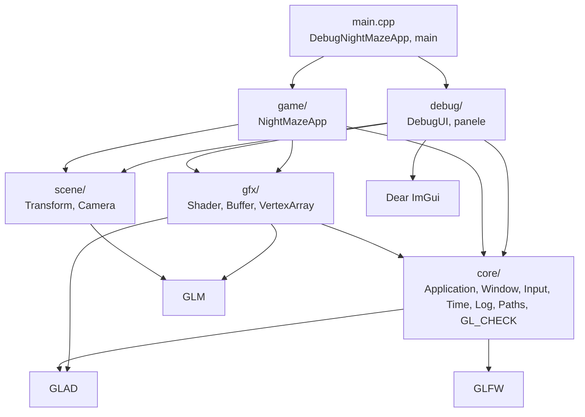

# Moduł scene: co jest w scenie i skąd na nią patrzę

Kamień milowy: M1. Temat wykładu: 3 (Przekształcenia przestrzeni).
Kod: [`src/scene/`](../../../src/scene/), użycie w [`src/game/NightMazeApp.cpp`](../../../src/game/NightMazeApp.cpp).

Moduł `gfx` umie narysować to, co dostanie: bufor wierzchołków, program shaderów. Nie wie, **gdzie** w świecie coś stoi ani **skąd** jest oglądane. Na te dwa pytania odpowiada moduł `scene`: opisuje położenie obiektów i kamerę, a z tego opisu liczy macierze, które shader wierzchołków mnoży przez każdy wierzchołek. Docelowo (PRD, sekcja 6) warstwa `scene/` ma zawierać encje, transformy, kamerę, światła, kolizje i selekcję. Na dziś ma dwie struktury: `scene::Transform` i `scene::Camera`.

Używa ich `game::NightMazeApp`: ma jeden `Transform` (obrócona kostka) i jedną `Camera`, którą steruje z klawiatury i myszy (lot wokół kostki). Co klatkę liczy z nich macierze modelu, widoku i rzutowania i wysyła je do shadera przez `gfx::Shader::setMat4`. Pola kamery edytuje też panel Camera z `debug/`. Ten plik jest wstępem do modułu: wspólna zasada obu struktur, miejsce modułu w warstwach i indeks dokumentów.

## 1. Dokumenty modułu

| Dokument | Co opisuje | Struktury i pliki |
|---|---|---|
| [`transforms-camera.md`](transforms-camera.md) | przestrzenie współrzędnych (lokalna, świata, widoku, przycięcia, NDC, okna), współrzędne jednorodne, macierze przesunięcia, obrotu i skali, znaczenie kolejności, kąty Eulera i blokada przegubu, macierz widoku i `lookAt`, kamera FPS (yaw, pitch, wektor kierunku), rzutowanie perspektywiczne, nieliniowa głębia, konwencja układu projektu | `Transform`, `Camera` |

Dokument tematyczny ma te same dziesięć sekcji co dokumenty modułów `core` i `gfx`: Po co to jest, Teoria, Jak to działa w OpenGL, Shadery, Kod w projekcie, Panel ImGui, Pułapki, Ćwiczenia, Pytania kontrolne, Źródła.

Proponowana kolejność czytania: [`../../libraries/glm.md`](../../libraries/glm.md) (typy i funkcje biblioteki), ten plik, potem [`transforms-camera.md`](transforms-camera.md). Wcześniej warto znać [`../gfx/shaders.md`](../gfx/shaders.md), sekcja 2.2, bo tam jest opisane, co shader wierzchołków musi zapisać do `gl_Position`.

## 2. Wspólna zasada: dane i matematyka, bez OpenGL

Klasy `gfx` opakowują obiekty żyjące na karcie graficznej, więc mają konstruktory, destruktory i zakaz kopiowania ([`../gfx/README.md`](../gfx/README.md), sekcja 2). Struktury `scene` są ich przeciwieństwem:

| Cecha | Klasy `gfx` | Struktury `scene` |
|---|---|---|
| co trzymają | identyfikator obiektu OpenGL | kilka liczb: wektory i kąty |
| wywołania `gl*` | w każdej funkcji | żadnego |
| kopiowanie | zabronione (`= delete`), tylko przenoszenie | zwykłe: kopia to drugi, niezależny zestaw liczb |
| pola | prywatne, z prefiksem `m_` | publiczne, bez prefiksu |
| wymaga kontekstu OpenGL | tak, przez całe życie | nie: można je tworzyć przed oknem i używać w programie bez okna |
| zależności | `core/`, GLAD | tylko GLM i biblioteka standardowa |

Z tego wynikają trzy rzeczy:

1. **Macierze liczy procesor.** `Transform::matrix()`, `Camera::viewMatrix()` i `Camera::projectionMatrix()` to zwykłe funkcje C++ zwracające `glm::mat4`. OpenGL dowiaduje się o macierzy dopiero wtedy, gdy kod rysujący wyśle ją do shadera: w projekcie robi to `NightMazeApp::onRender` przez `gfx::Shader::setMat4`.
2. **Kod da się sprawdzić bez okna.** Wystarczy program konsolowy, który woła funkcje i wypisuje wyniki. Tak została sprawdzona matematyka obu struktur, zanim dostały użytkownika ([`transforms-camera.md`](transforms-camera.md), sekcja 5.8).
3. **Struktury nie znają wejścia ani czasu.** `Camera` nie czyta klawiatury ani myszy i nie ma prędkości ruchu. Ma pola i funkcję `rotate`, a o tym, kiedy i o ile je zmienić, decyduje właściciel kamery (dziś `game::NightMazeApp`: mysz obraca, klawisze przesuwają). Dzięki temu ta sama kamera nadaje się do gry, do zadania laboratoryjnego i do sterowania z panelu.

Kąty są wszędzie trzymane w stopniach, z jednostką w nazwie pola (`rotationDegrees`, `yawDegrees`, `fovDegrees`), a zamiana na radiany odbywa się w miejscu użycia.

## 3. Miejsce w warstwach

Strzałka znaczy "zna i dołącza nagłówki". Diagram pokazuje stan faktyczny: `scene/` dołączają `game/` (`NightMazeApp.hpp` dołącza `scene/Camera.hpp` i `scene/Transform.hpp`) i `debug/` (`CameraPanel.cpp` dołącza `scene/Camera.hpp`), a samo `scene/` dołącza tylko GLM. `gfx/` też dołącza GLM, od kiedy `Shader::setMat4` przyjmuje `glm::mat4`.

Pełny łańcuch warstw z PRD to `core <- gfx <- renderer <- scene <- game`. Warstwy `renderer/` w M1 nie ma, więc dziś łańcuch to `core <- gfx <- scene <- game`. Zasady dla `scene`:

1. `scene/` **może** zależeć od `core/`, `gfx/` i GLM. Dziś korzysta tylko z GLM: `Transform` i `Camera` nie potrzebują ani okna, ani obiektów OpenGL.
2. `scene/` nie zna `game/`, `debug/`, ImGui ani wejścia. Nie dołącza GLFW: o klawiszach i myszy wie tylko ten, kto steruje kamerą.
3. `core/` i `gfx/` nie znają `scene/`. Zależność idzie w jedną stronę.
4. Użytkownikami są `game/` i `debug/`. `game/` posiada kamerę i transform kostki, steruje kamerą i wysyła macierze do shadera. `debug/` ma panel Camera, który edytuje pola kamery przez referencję. Oba kierunki są dozwolone.

W [`CMakeLists.txt`](../../../CMakeLists.txt) pliki `src/scene/*` należą do tej samej biblioteki statycznej `engine` co `src/core/*` i `src/gfx/*`. Nic w nich nie jest specyficzne dla Night Maze, więc warstwa nadaje się do zadań laboratoryjnych. GLM jest linkowane do `engine` jako `PUBLIC`, bo nagłówki `scene/` (i `gfx/Shader.hpp`) pokazują typy `glm::vec3` i `glm::mat4` w swoim API: każdy, kto je dołączy, musi znaleźć `<glm/glm.hpp>` ([`../../libraries/glm.md`](../../libraries/glm.md), sekcja 2).

## 4. Indeks: plik kodu, dokument

| Plik kodu | Co zawiera | Dokument |
|---|---|---|
| [`src/scene/Transform.hpp`](../../../src/scene/Transform.hpp), [`.cpp`](../../../src/scene/Transform.cpp) | struktura `Transform`: pola `position`, `rotationDegrees`, `scale` i funkcja `matrix()`, która zwraca macierz modelu `T * Ry * Rx * Rz * S`. Użycie: pole `m_cubeTransform` w `NightMazeApp` | [`transforms-camera.md`](transforms-camera.md), sekcje 5.2 i 5.3 |
| [`src/scene/Camera.hpp`](../../../src/scene/Camera.hpp), [`.cpp`](../../../src/scene/Camera.cpp) | struktura `Camera`: pola `position`, `yawDegrees`, `pitchDegrees`, `fovDegrees`, `nearPlane`, `farPlane`, stałe `WORLD_UP` i `MAX_PITCH_DEGREES`, funkcje `forward`, `right`, `rotate`, `viewMatrix`, `projectionMatrix`. Użycie: pole `m_camera` w `NightMazeApp` | [`transforms-camera.md`](transforms-camera.md), sekcje od 5.4 do 5.7 |
| [`src/game/NightMazeApp.hpp`](../../../src/game/NightMazeApp.hpp), [`.cpp`](../../../src/game/NightMazeApp.cpp) | użytkownik obu struktur: obrót kostki, proporcje z rozmiaru framebuffera, wysłanie trzech macierzy co klatkę, sterowanie kamerą (obrót myszą, ruch klawiszami, interpolacja pozycji) | [`transforms-camera.md`](transforms-camera.md), sekcje 5.9, 5.10 i 5.11 |
| [`src/debug/panels/CameraPanel.hpp`](../../../src/debug/panels/CameraPanel.hpp), [`.cpp`](../../../src/debug/panels/CameraPanel.cpp) | `debug::drawCameraPanel`: panel "Camera". Nie należy do `scene/` ani do biblioteki `engine`, ale jest pokazem struktury `Camera` | [`transforms-camera.md`](transforms-camera.md), sekcja 6 |
| [`assets/shaders/basic.vert`](../../../assets/shaders/basic.vert) | uniformy `uModel`, `uView`, `uProjection` i mnożenie przez nie pozycji wierzchołka | [`transforms-camera.md`](transforms-camera.md), sekcja 4 |

## 5. Konwencja układu współrzędnych

Jedna konwencja dla całego projektu, opisana dokładnie w [`transforms-camera.md`](transforms-camera.md), sekcja 2.11:

| Ustalenie | Wartość |
|---|---|
| skrętność | układ prawoskrętny (right-handed) |
| góra | +Y (`Camera::WORLD_UP`) |
| przód | -Z (kamera z yaw 0 i pitch 0 patrzy wzdłuż -Z) |
| jednostka | 1 jednostka to 1 metr |
| kąty | w stopniach w polach, w radianach dopiero przy wywołaniu funkcji matematycznych |

To konwencja OpenGL i wartości domyślne GLM. PRD (sekcja 9) ustala te same osie dla modeli eksportowanych z Blendera.

## 6. Pytania kontrolne

Pytania z odpowiedziami do matematyki i kodu są w [`transforms-camera.md`](transforms-camera.md), sekcja 9. Trzy pytania dotyczące treści tego pliku:

1. **Czym struktury `scene` różnią się od klas `gfx`?**
   Klasy `gfx` posiadają obiekt OpenGL: tworzą go w konstruktorze, usuwają w destruktorze i nie dają się kopiować. Struktury `scene` to same liczby z publicznymi polami: nie wołają OpenGL, nie potrzebują kontekstu i kopiują się jak zwykłe dane.

2. **Od czego może zależeć `scene/`, a od czego zależy dziś?**
   Może od `core/`, `gfx/` i GLM. Dziś dołącza tylko GLM i bibliotekę standardową. Nie może znać `game/`, `debug/`, ImGui ani wejścia.

3. **Dlaczego `Camera` nie obsługuje klawiatury i myszy?**
   Bo to kwestia sterowania, a nie kamery. `scene/` jest częścią biblioteki `engine` i ma nadawać się do innych programów. Wejście czyta właściciel kamery i przekłada je na zmiany pól oraz wywołania `rotate`: robi to `game::NightMazeApp` ([`transforms-camera.md`](transforms-camera.md), sekcja 5.11).

## 7. Źródła

- LearnOpenGL, rozdziały "Transformations", "Coordinate Systems" i "Camera": <https://learnopengl.com/Getting-started/Transformations>, <https://learnopengl.com/Getting-started/Coordinate-Systems>, <https://learnopengl.com/Getting-started/Camera>.
- PRD ([`../../PRD.pdf`](../../PRD.pdf)): sekcja 6 (podział na warstwy, zawartość `scene/`), sekcja 9 (konwencja osi).
- Dokument biblioteki: [`../../libraries/glm.md`](../../libraries/glm.md).
- Szczegółowe źródła są w sekcji 10 dokumentu [`transforms-camera.md`](transforms-camera.md).
