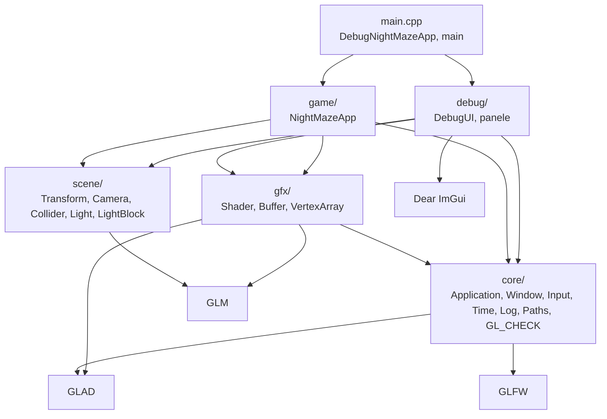

# Moduł scene: co jest w scenie i skąd na nią patrzę

Kamień milowy: M1, od M2 + M3 także kolizje, od M4 także światła, od M5 kule kolizji. Temat wykładu: 3 (Przekształcenia przestrzeni), 6 (Światło kierunkowe i punktowe) i 14 (Wstęp do kolizji).
Kod: [`src/scene/`](../../../src/scene/), użycie w [`src/game/NightMazeApp.cpp`](../../../src/game/NightMazeApp.cpp).

Moduł `gfx` umie narysować to, co dostanie: bufor wierzchołków, program shaderów. Nie wie, **gdzie** w świecie coś stoi ani **skąd** jest oglądane. Na te dwa pytania odpowiada moduł `scene`: opisuje położenie obiektów i kamerę, a z tego opisu liczy macierze, które shader wierzchołków mnoży przez każdy wierzchołek. Docelowo (PRD, sekcja 6) warstwa `scene/` ma zawierać encje, transformy, kamerę, światła, kolizje i selekcję. Na dziś ma: `scene::Transform` z funkcją `scene::normalMatrix`, `scene::Camera`, od kamienia milowego M2 + M3 `scene::Aabb` z funkcjami kolizji, od M5 `scene::Sphere` z testami nakładania dwóch kul i kuli z pudełkiem, a od M4 struktury świateł (`scene::DirectionalLight`, `PointLight`, `SpotLight`, `LightSet`) z ich matematyką i strukturę `scene::LightBlockData`, czyli te same światła ułożone w bajty dla shadera. Encji i selekcji jeszcze nie ma.

Używa ich cały moduł `game`. `game::NightMazeApp` ma jedną `Camera`: mysz obraca jej kąty, a pozycję dostaje ona po każdym kroku symulacji z oczu gracza. Co klatkę aplikacja liczy macierze widoku i rzutowania i wysyła je przez `gfx::Shader::setMat4` do każdego programu shaderów, którym w tej klatce rysuje (z sześciu programów, które rysują scenę, w jednej klatce pracują najwyżej cztery: jeden z trzech programów sceny, `color` i, od M6, `grass` i `skybox`. Cztery programy z M7, `composite`, `preview`, `bright` i `blur`, rysują trójkąt na cały cel i macierzy nie dostają). Z tego samego oka i kierunku kamery powstaje co klatkę latarka gracza, a cały zestaw świateł (`scene::LightSet`) buduje `game::buildLightSet` i wysyła na kartę `game::LightRig`. `Transform` nie jest już polem aplikacji (w M1 była nim obrócona kostka, usunięta w M5): służy do policzenia macierzy modelu każdej ściany i każdego słupka labiryntu (`game::placeOnTerrain`, wołana przez `game::buildMazeWorld`; do M5 także każdej płytki podłogi), bramy i każdego kryształu (`game::GameplayRenderer`) oraz każdego rysowanego pudełka i okręgu kuli kolizji (`game::ColliderLines`). Pudełka `scene::Aabb` tworzy układ labiryntu w `game/MazeLayout`, gracz (`game::Player::box`) i strefa wyjścia (`game::exitZone`), a funkcję `scene::moveAndSlide` woła `game::Player::update` w każdym kroku chodzenia. Kule `scene::Sphere` tworzy runda: zasięg gracza (`game::playerReach`) i kulę podniesienia wokół każdego kryształu, a `scene::overlaps` rozstrzyga, czy kryształ został zebrany i czy gracz wszedł w strefę wyjścia. Pola kamery edytuje też panel Camera z `debug/`.

Moduł jest opisany w pięciu dokumentach tematycznych. Ten plik jest ich wspólnym wstępem: indeks dokumentów i plików kodu, wspólna zasada obu struktur, miejsce modułu w warstwach i konwencja układu współrzędnych.

## 1. Dokumenty modułu

| Dokument | Co opisuje | Struktury i pliki |
|---|---|---|
| [`transforms.md`](transforms.md) | przestrzenie współrzędnych (lokalna, świata, widoku, przycięcia, NDC, okna), współrzędne jednorodne, macierze przesunięcia, obrotu i skali, znaczenie kolejności, kąty Eulera i blokada przegubu, macierz modelu, trzy macierze w shaderze `textured.vert`, macierze modelu ściany, bramy, kryształu (liczona co klatkę) oraz linii pudełek i okręgów kul, od M4 funkcja `normalMatrix` i jej testy | `Transform`, `normalMatrix`, `wallModelMatrix`, `textured.vert` |
| [`camera.md`](camera.md) | macierz widoku i `lookAt`, kamera FPS (yaw, pitch, wektor kierunku), rzutowanie perspektywiczne, nieliniowa głębia, z NDC do pikseli, konwencja układu projektu, trzy macierze w `NightMazeApp::onRender`, test głębi, proporcje i okno o rozmiarze zero, droga jednego wierzchołka na liczbach | `Camera`, `NightMazeApp` |
| [`camera-controls.md`](camera-controls.md) | sterowanie kamerą: obrót myszą raz na klatkę, kamera podążająca za graczem, interpolacja pozycji z `alpha`, panel Camera i scenariusz pokazu, panel a przechwycony kursor. Ruch klawiszami opisuje [`../game/player.md`](../game/player.md) | `NightMazeApp`, `drawCameraPanel` |
| [`lights.md`](lights.md) | temat 6: światło kierunkowe, punktowe i reflektor, model odbicia Phonga (otoczenie, rozproszenie, odbłysk), prawo cosinusów Lamberta, tłumienie i wzór z promienia, stożek reflektora i porównywanie cosinusów, macierz normalnych i odwrotna transponowana, struktury świateł i `LightSet`, plik `common/lighting.glsl` linia po linii, panel Lights i scenariusz pokazu, rachunek na wartościach liniowych od pierwszej części M7, brak cieni (planowane w dalszej części M7) | `DirectionalLight`, `PointLight`, `SpotLight`, `LightSet`, `attenuationForRadius`, `coneCosines`, `common/lighting.glsl`, `drawLightsPanel` |
| [`collision.md`](collision.md) | temat 14: bryły otaczające i AABB, test nakładania przedziałów na osiach, wykrywanie dyskretne a przemiatanie, tunelowanie, ruch oś po osi i ślizganie po ścianach, tolerancja styku, droga po schodkach a stały krok, od M5 kula z testami kula z kulą i kula z pudełkiem (zbieranie kryształów, strefa wyjścia), testy jednostkowe, rysowanie pudełek i kul liniami (`GL_LINES`, shadery `color`), panel Collision | `Aabb`, `Sphere`, `overlaps`, `closestPoint`, `moveAndSlide`, `ColliderLines`, `color.vert`, `color.frag`, `drawCollisionPanel` |

Każdy z pięciu dokumentów jest samodzielną jednostką nauki i ma te same dziesięć sekcji co dokumenty modułów `core` i `gfx`: Po co to jest, Teoria, Jak to działa w OpenGL, Shadery, Kod w projekcie, Panel ImGui, Pułapki, Ćwiczenia, Pytania kontrolne, Źródła.

Proponowana kolejność czytania: [`../../libraries/glm.md`](../../libraries/glm.md) (typy i funkcje biblioteki), ten plik, potem [`transforms.md`](transforms.md), [`camera.md`](camera.md), [`camera-controls.md`](camera-controls.md), potem [`collision.md`](collision.md), który nie wymaga trzech poprzednich, na końcu [`lights.md`](lights.md), który wymaga `transforms.md` i `camera.md`, a po którym czyta się [`../renderer/lighting-gouraud-phong.md`](../renderer/lighting-gouraud-phong.md), [`../gfx/uniform-buffers.md`](../gfx/uniform-buffers.md) i [`../game/flashlight.md`](../game/flashlight.md). Wcześniej warto znać [`../gfx/shaders.md`](../gfx/shaders.md), sekcja 2.2: opis tego, co shader wierzchołków musi zapisać do `gl_Position`. Przed `camera-controls.md` przydają się [`../core/main-loop.md`](../core/main-loop.md) (stały krok i `alpha`) i [`../core/input.md`](../core/input.md) (mysz i przechwycenie kursora).

## 2. Indeks: plik kodu, dokument

| Plik kodu | Co zawiera | Dokument |
|---|---|---|
| [`src/scene/Transform.hpp`](../../../src/scene/Transform.hpp), [`.cpp`](../../../src/scene/Transform.cpp) | struktura `Transform`: pola `position`, `rotationDegrees`, `scale` i funkcja `matrix()`, która zwraca macierz modelu `T * Ry * Rx * Rz * S`. Użycie: macierze labiryntu w `src/game/MazeWorld.cpp`, macierze bramy i kryształów w `src/game/GameplayRenderer.cpp`, macierze rysowanych pudełek i okręgów kul w `src/game/ColliderLines.cpp`. Od M4 wolna funkcja `normalMatrix` (odwrotna transponowana części 3 x 3 macierzy modelu), wołana w `src/game/ModelDraw.cpp`, z testami w `tests/TransformTests.cpp` | [`transforms.md`](transforms.md), sekcje 5.2, 5.3 i 5.6 |
| [`src/scene/Camera.hpp`](../../../src/scene/Camera.hpp), [`.cpp`](../../../src/scene/Camera.cpp) | struktura `Camera`: pola `position`, `yawDegrees`, `pitchDegrees`, `fovDegrees`, `nearPlane`, `farPlane`, stałe `WORLD_UP` i `MAX_PITCH_DEGREES`, funkcje `forward`, `right`, `rotate`, `viewMatrix`, `projectionMatrix`. Użycie: pole `m_camera` w `NightMazeApp` oraz tymczasowa kamera jako kalkulator kierunków w `game::Player::update` | [`camera.md`](camera.md), sekcje od 5.2 do 5.5 |
| [`src/scene/Collider.hpp`](../../../src/scene/Collider.hpp), [`.cpp`](../../../src/scene/Collider.cpp) | struktura `Aabb`: pola `min` i `max`, funkcja statyczna `fromCenter`. Stała `CONTACT_TOLERANCE`, funkcje `overlaps` i `moveAndSlide`. Od M5 struktura `Sphere` (pola `center` i `radius`), `overlaps` dla dwóch kul i dla kuli z pudełkiem oraz `closestPoint`. Użycie: `game::wallBox`, `game::pillarBox` i `game::mazeColliders` w `src/game/MazeLayout.cpp`, `game::Player::box` i `game::Player::update` w `src/game/Player.cpp`, `game::playerReach`, zbieranie kryształów i strefa wyjścia w `src/game/Round.cpp` oraz testy w `tests/ColliderTests.cpp` | [`collision.md`](collision.md), sekcje od 5.2 do 5.5 |
| [`src/scene/Light.hpp`](../../../src/scene/Light.hpp), [`.cpp`](../../../src/scene/Light.cpp) | struktury `Attenuation`, `DirectionalLight`, `PointLight`, `SpotLight`, `LightSet`, `ConeCosines`, stałe `MAX_POINT_LIGHTS`, `BRIGHTNESS_AT_RADIUS`, `MIN_CONE_COSINE_GAP`, funkcje `attenuationForRadius`, `attenuationFactor`, `coneCosines`, `spotFactor`, `directionFromAngles`. Użycie: `game::buildLightSet` w `src/game/Lighting.cpp`, `scene::packLightBlock`, panel Lights, testy w `tests/LightTests.cpp` | [`lights.md`](lights.md), sekcje od 5.2 do 5.6 |
| [`src/scene/LightBlock.hpp`](../../../src/scene/LightBlock.hpp), [`.cpp`](../../../src/scene/LightBlock.cpp) | struktury `PointLightData` i `LightBlockData` (lustro bloku uniformów `LightBlock` w układzie `std140`, 928 bajtów, pilnowane przez `static_assert`) i funkcja `packLightBlock`. Użycie: `game::LightRig::upload` | [`../gfx/uniform-buffers.md`](../gfx/uniform-buffers.md) |
| [`assets/shaders/common/lighting.glsl`](../../../assets/shaders/common/lighting.glsl) | blok świateł i wzory oświetlenia po stronie karty, dołączane do `lit.frag` i `gouraud.vert` | [`lights.md`](lights.md), sekcja 4 |
| [`src/debug/panels/LightsPanel.hpp`](../../../src/debug/panels/LightsPanel.hpp), [`.cpp`](../../../src/debug/panels/LightsPanel.cpp) | `debug::drawLightsPanel`: panel "Lights" | [`lights.md`](lights.md), sekcja 6 |
| [`src/game/NightMazeApp.hpp`](../../../src/game/NightMazeApp.hpp), [`.cpp`](../../../src/game/NightMazeApp.cpp) | użytkownik struktury `Camera`: poza startowa w `beginRound`, proporcje z rozmiaru framebuffera, macierze widoku i rzutowania co klatkę, obrót kamery myszą, oko z interpolowanej pozycji gracza | macierze i proporcje w [`camera.md`](camera.md), sekcja 5, sterowanie kamerą w [`camera-controls.md`](camera-controls.md), sekcje od 5.2 do 5.5 |
| [`src/game/ColliderLines.hpp`](../../../src/game/ColliderLines.hpp), [`.cpp`](../../../src/game/ColliderLines.cpp) | rysowanie pudełek `Aabb` i kul `Sphere` liniami. Należy do programu `night_maze`, ale jest pokazem tematu 14 | [`collision.md`](collision.md), sekcja 5.8, macierze modelu w [`transforms.md`](transforms.md), sekcja 5.4 |
| [`assets/shaders/color.vert`](../../../assets/shaders/color.vert), [`color.frag`](../../../assets/shaders/color.frag) | shadery jednego koloru dla linii pudełek i kul | [`collision.md`](collision.md), sekcja 4 |
| [`src/debug/panels/CollisionPanel.hpp`](../../../src/debug/panels/CollisionPanel.hpp), [`.cpp`](../../../src/debug/panels/CollisionPanel.cpp) | `debug::drawCollisionPanel`: panel "Collision" | [`collision.md`](collision.md), sekcja 6 |
| [`src/debug/panels/CameraPanel.hpp`](../../../src/debug/panels/CameraPanel.hpp), [`.cpp`](../../../src/debug/panels/CameraPanel.cpp) | `debug::drawCameraPanel`: panel "Camera". Nie należy do `scene/` ani do biblioteki `engine`, ale jest pokazem struktury `Camera` | [`camera-controls.md`](camera-controls.md), sekcja 6 |
| [`assets/shaders/textured.vert`](../../../assets/shaders/textured.vert) | uniformy `uModel`, `uView`, `uProjection` i mnożenie przez nie pozycji wierzchołka | [`transforms.md`](transforms.md), sekcja 4 |

## 3. Wspólna zasada: dane i matematyka, bez OpenGL

Klasy `gfx` opakowują obiekty żyjące na karcie graficznej, więc mają konstruktory, destruktory i zakaz kopiowania ([`../gfx/README.md`](../gfx/README.md), sekcja 2). Struktury `scene` są ich przeciwieństwem:

| Cecha | Klasy `gfx` | Struktury `scene` |
|---|---|---|
| co trzymają | identyfikator obiektu OpenGL | kilka liczb: wektory i kąty |
| wywołania `gl*` | w każdej funkcji | żadnego |
| kopiowanie | zabronione (`= delete`), tylko przenoszenie | zwykłe: kopia to drugi, niezależny zestaw liczb |
| pola | prywatne, z prefiksem `m_` | publiczne, bez prefiksu |
| wymaga kontekstu OpenGL | tak, przez całe życie | nie: można je tworzyć przed oknem i używać w programie bez okna |
| zależności | `core/`, GLAD | tylko GLM i biblioteka standardowa |

Z tego wynikają trzy rzeczy:

1. **Macierze liczy procesor.** `Transform::matrix()`, `Camera::viewMatrix()` i `Camera::projectionMatrix()` to zwykłe funkcje C++ zwracające `glm::mat4`. OpenGL dowiaduje się o macierzy dopiero wtedy, gdy kod rysujący wyśle ją do shadera: w projekcie robią to funkcje rysujące wołane z `NightMazeApp::onRender`, przez `gfx::Shader::setMat4`.
2. **Kod da się sprawdzić bez okna.** Wystarczy program konsolowy, który woła funkcje i wypisuje wyniki. Tak została sprawdzona matematyka struktur `Transform` i `Camera`, zanim dostały użytkownika ([`camera.md`](camera.md), sekcja 5.6, i [`transforms.md`](transforms.md), sekcja 5.5). Kolizje mają stałe testy jednostkowe, uruchamiane przez `ctest` ([`collision.md`](collision.md), sekcja 5.7). Od M4 mają je także światła (`tests/LightTests.cpp`, [`lights.md`](lights.md), sekcja 5.6) i funkcja `normalMatrix` (`tests/TransformTests.cpp`, [`transforms.md`](transforms.md), sekcja 5.6).
3. **Struktury nie znają wejścia ani czasu.** `Camera` nie czyta klawiatury ani myszy i nie ma prędkości ruchu. Ma pola i funkcję `rotate`, a o tym, kiedy i o ile je zmienić, decyduje właściciel kamery (dziś `game::NightMazeApp`: mysz obraca, a pozycję kamera dostaje z oczu gracza, którego przesuwają klawisze). Dzięki temu ta sama kamera nadaje się do gry, do zadania laboratoryjnego i do sterowania z panelu.

Kąty są wszędzie trzymane w stopniach, z jednostką w nazwie pola (`rotationDegrees`, `yawDegrees`, `fovDegrees`), a zamiana na radiany odbywa się w miejscu użycia.

## 4. Miejsce w warstwach

Strzałka znaczy "zna i dołącza nagłówki". Diagram pokazuje stan faktyczny: `scene/` dołączają `game/` (`NightMazeApp.hpp` dołącza `scene/Camera.hpp` i `scene/Collider.hpp`) i `debug/` (`CameraPanel.cpp` dołącza `scene/Camera.hpp`, `LightsPanel.cpp` dołącza `scene/Light.hpp`), a samo `scene/` dołącza tylko GLM. `gfx/` też dołącza GLM, od kiedy `Shader::setMat4` przyjmuje `glm::mat4`. Diagram pomija trzy rzeczy z kamienia milowego M2 + M3, żeby pozostał czytelny: podział `game/` na program i bibliotekę logiki (`MazeLayout.hpp` i `Player.hpp` dołączają `scene/Collider.hpp`, `MazeWorld.cpp` dołącza `scene/Transform.hpp`, `Player.cpp` dołącza `scene/Camera.hpp`), warstwę `assets/` i program testowy w `tests/`. Pokazuje je diagram w [`../game/README.md`](../game/README.md), sekcja 3.

Pełny łańcuch warstw z PRD to `core <- gfx <- renderer <- scene <- game`. Warstwy `renderer/` w kodzie nadal nie ma (dokument tematu 7 stoi już pod tą nazwą: [`../renderer/README.md`](../renderer/README.md)), więc dziś łańcuch to `core <- gfx <- scene <- game`. Zasady dla `scene`:

1. `scene/` **może** zależeć od `core/`, `gfx/` i GLM. Dziś korzysta tylko z GLM: `Transform`, `Camera`, `Collider`, `Light` i `LightBlock` nie potrzebują ani okna, ani obiektów OpenGL. `LightBlock` układa bajty dla bufora uniformów, ale sam bufor (`gfx::UniformBuffer`) tworzy i wypełnia `game::LightRig`.
2. `scene/` nie zna `game/`, `debug/`, ImGui ani wejścia. Nie dołącza GLFW: o klawiszach i myszy wie tylko ten, kto steruje kamerą.
3. `core/` i `gfx/` nie znają `scene/`. Zależność idzie w jedną stronę.
4. Użytkownikami są `game/`, `debug/` i `tests/`. `game/` posiada kamerę, obraca ją i wysyła macierze do shaderów, liczy macierze modelu labiryntu, bramy i kryształów, buduje pudełka i kule kolizji i przesuwa gracza funkcją `moveAndSlide`. `debug/` ma panel Camera, który edytuje pola kamery przez referencję, oraz panele Maze i Collision, które czytają kamerę i pudełko gracza, i panel Lights, który czyta stałą `scene::MAX_POINT_LIGHTS`. `tests/` woła funkcje kolizji, świateł i `normalMatrix` i sprawdza wyniki. Wszystkie trzy kierunki są dozwolone.

W [`CMakeLists.txt`](../../../CMakeLists.txt) pliki `src/scene/*` należą do tej samej biblioteki statycznej `engine` co `src/core/*` i `src/gfx/*`. Nic w nich nie jest specyficzne dla Night Maze, więc warstwa nadaje się do zadań laboratoryjnych. GLM jest linkowane do `engine` jako `PUBLIC`, bo nagłówki `scene/` (i `gfx/Shader.hpp`) pokazują typy `glm::vec3` i `glm::mat4` w swoim API: każdy, kto je dołączy, musi znaleźć `<glm/glm.hpp>` ([`../../libraries/glm.md`](../../libraries/glm.md), sekcja 2).

## 5. Konwencja układu współrzędnych

Jedna konwencja dla całego projektu, opisana dokładnie w [`camera.md`](camera.md), sekcja 2.5:

| Ustalenie | Wartość |
|---|---|
| skrętność | układ prawoskrętny (right-handed) |
| góra | +Y (`Camera::WORLD_UP`) |
| przód | -Z (kamera z yaw 0 i pitch 0 patrzy wzdłuż -Z) |
| jednostka | 1 jednostka to 1 metr |
| kąty | w stopniach w polach, w radianach dopiero przy wywołaniu funkcji matematycznych |

To konwencja OpenGL i wartości domyślne GLM. PRD (sekcja 9) ustala te same osie dla modeli eksportowanych z Blendera.

## 6. Pytania kontrolne

Pytania z odpowiedziami do matematyki i kodu są w sekcji 9 każdego dokumentu tematycznego (tabela niżej).

| Dokument | Czego dotyczą pytania |
|---|---|
| [`transforms.md`](transforms.md), sekcja 9 | łańcuch przestrzeni, macierze 4 x 4, `w = 1` a `w = 0`, kolejność w `Transform::matrix()`, stopnie i radiany, struktury z publicznymi polami, macierz modelu kryształu, macierz normalnych |
| [`camera.md`](camera.md), sekcja 9 | macierz widoku i `lookAt`, wzór na `forward()`, wektor w prawo, ograniczenie pitch, zawijanie yaw, parametr `eye`, rzutowanie i dzielenie przez `w`, nieliniowa głębia, proporcje, konwencja układu, droga wierzchołka, test głębi, framebuffer o rozmiarze zero |
| [`camera-controls.md`](camera-controls.md), sekcja 9 | ruch myszy a obrót, minus przy `mouseDeltaY`, obrót w `onRender` a ruch w `onUpdate`, normalizacja kierunku, lot a chodzenie, interpolacja z `alpha`, ruch tylko przy przechwyconym kursorze, panel Camera |
| [`lights.md`](lights.md), sekcja 9 | rodzaje świateł, trzy składniki modelu Phonga, prawo Lamberta, tłumienie z promienia, stożek i cosinusy, macierz normalnych, `LightSet`, brak cieni, co jest sprawdzone testami |
| [`collision.md`](collision.md), sekcja 9 | AABB i test nakładania, dotyk a nakładanie, wykrywanie dyskretne a przemiatanie, tunelowanie, ślizganie przy obsłudze osi po kolei, droga po schodkach a stały krok, tolerancja styku, kula z AABB |
| ten plik, niżej | różnica między `scene` a `gfx`, zależności warstwy, dlaczego kamera nie zna wejścia |

Trzy pytania dotyczące treści tego pliku:

1. **Czym struktury `scene` różnią się od klas `gfx`?**
   Klasy `gfx` posiadają obiekt OpenGL: tworzą go w konstruktorze, usuwają w destruktorze i nie dają się kopiować. Struktury `scene` to same liczby z publicznymi polami: nie wołają OpenGL, nie potrzebują kontekstu i kopiują się jak zwykłe dane.

2. **Od czego może zależeć `scene/`, a od czego zależy dziś?**
   Może od `core/`, `gfx/` i GLM. Dziś dołącza tylko GLM i bibliotekę standardową. Nie może znać `game/`, `debug/`, ImGui ani wejścia.

3. **Dlaczego `Camera` nie obsługuje klawiatury i myszy?**
   Bo to kwestia sterowania, a nie kamery. `scene/` jest częścią biblioteki `engine` i ma nadawać się do innych programów. Wejście czyta właściciel kamery i przekłada je na zmiany pól oraz wywołania `rotate`: robi to `game::NightMazeApp` ([`camera-controls.md`](camera-controls.md), sekcje od 5.2 do 5.4).

## 7. Źródła

- LearnOpenGL, rozdziały "Transformations", "Coordinate Systems" i "Camera": <https://learnopengl.com/Getting-started/Transformations>, <https://learnopengl.com/Getting-started/Coordinate-Systems>, <https://learnopengl.com/Getting-started/Camera>, "Collision detection": <https://learnopengl.com/In-Practice/2D-Game/Collisions/Collision-detection>, oraz "Basic Lighting" i "Light casters": <https://learnopengl.com/Lighting/Basic-Lighting>, <https://learnopengl.com/Lighting/Light-casters>.
- PRD ([`../../PRD.pdf`](../../PRD.pdf)): sekcja 6 (podział na warstwy, zawartość `scene/`), sekcja 9 (konwencja osi).
- Dokument biblioteki: [`../../libraries/glm.md`](../../libraries/glm.md).
- Szczegółowe źródła do każdego zagadnienia są w sekcji 10 dokumentów tematycznych.
