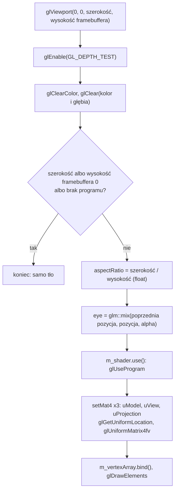

# Moduł scene: kamera, macierz widoku i rzutowanie

Kamień milowy: M1. Temat wykładu: 3 (Przekształcenia przestrzeni).
Kod: [`src/scene/Camera.hpp`](../../../src/scene/Camera.hpp), [`src/scene/Camera.cpp`](../../../src/scene/Camera.cpp), użycie w [`src/game/NightMazeApp.hpp`](../../../src/game/NightMazeApp.hpp) i [`src/game/NightMazeApp.cpp`](../../../src/game/NightMazeApp.cpp).

Część modułu `scene`. Wstęp do modułu i jego miejsce w warstwach są w [`README.md`](README.md). Pozostałe części: [`transforms.md`](transforms.md) (przestrzenie współrzędnych, macierze przesunięcia, obrotu i skali, macierz modelu) i [`camera-controls.md`](camera-controls.md) (sterowanie kamerą, panel Camera). Ten dokument zakłada znajomość [`transforms.md`](transforms.md) (sekcje od 2.1 do 2.5: łańcuch przestrzeni, współrzędne jednorodne, czytanie iloczynu od prawej) i korzysta z biblioteki GLM ([`../../libraries/glm.md`](../../libraries/glm.md): `lookAt`, `perspective`, `radians`, `cross`, `normalize`).

## 1. Po co to jest

Macierz modelu z [`transforms.md`](transforms.md) stawia obiekt w świecie. Żeby go zobaczyć, potrzebne są jeszcze dwie macierze: macierz widoku (skąd i w którą stronę patrzę) i macierz rzutowania (jak szeroko widzę i skąd bierze się perspektywa). Obie liczy struktura `scene::Camera` z pozycji, dwóch kątów i czterech parametrów rzutowania. Tak jak `Transform`, kamera to zwykłe dane i matematyka: nie woła OpenGL, nie zna klawiatury, myszy ani czasu.

Ten dokument opisuje też miejsce, w którym trzy macierze spotykają się w jednej klatce, czyli `NightMazeApp::onRender`: test głębi, proporcje obrazu, zabezpieczenie przed framebufferem o rozmiarze zero i drogę jednego wierzchołka przez cały łańcuch na liczbach.

Stan na dziś: `game::NightMazeApp` ma jeden `Transform` (kostka) i jedną `Camera`. Co klatkę liczy z nich trzy macierze i wysyła je do shadera `basic.vert`, który mnoży przez nie każdy wierzchołek kostki (shader: [`transforms.md`](transforms.md), sekcja 4, kod: sekcje 5.7 i 5.8). Kostka jest obrócona na stałe ([`transforms.md`](transforms.md), sekcja 5.4). Kamerą można latać: sterowanie nią i panel Camera opisuje [`camera-controls.md`](camera-controls.md).

## 2. Teoria

### 2.1 Macierz widoku: odwrotność przekształcenia kamery

OpenGL nie ma kamery. Jest tylko sześcian NDC, a na ekran trafia to, co się w nim znajdzie. "Ruch kamery" to złudzenie: zamiast przesuwać kamerę w prawo, przesuwam **cały świat** w lewo. Macierz widoku jest właśnie tym przekształceniem całego świata.

Kamerę można traktować jak każdy inny obiekt sceny: ma pozycję i obrót, czyli własną macierz modelu `C = T * R` (z przestrzeni kamery do świata). Macierz widoku robi drogę odwrotną, ze świata do przestrzeni kamery, więc jest **odwrotnością** tej macierzy:

```text
view = odwrotność(T * R) = odwrotność(R) * odwrotność(T)
```

Odwrotnością przesunięcia o `eye` jest przesunięcie o `-eye`. Odwrotnością obrotu jest obrót w przeciwną stronę, a dla macierzy obrotu odwrotność to po prostu jej transpozycja (zamiana wierszy z kolumnami). Macierz widoku najpierw przesuwa więc świat tak, żeby kamera znalazła się w punkcie `(0, 0, 0)`, a potem obraca go tak, żeby kierunek patrzenia pokrył się z osią -Z.

Nie liczę odwrotności ogólną funkcją `glm::inverse`. `glm::lookAt(eye, center, up)` buduje wynik wprost z trzech wektorów jednostkowych, które tworzą **bazę kamery** (basis):

| Wektor | Jak powstaje | Znaczenie |
|---|---|---|
| `f` (forward) | `normalize(center - eye)` | kierunek patrzenia |
| `s` (side, right) | `normalize(cross(f, up))` | w prawo od kamery. Prostopadły do kierunku patrzenia i do góry świata |
| `u` (up) | `cross(s, f)` | góra kamery. Prostopadły do dwóch pozostałych. To nie jest góra świata: gdy kamera patrzy w dół, jej góra pochyla się do przodu |

Te trzy wektory stają się **wierszami** macierzy (to jest transpozycja, czyli odwrócony obrót), a ostatnia kolumna przesuwa świat o `-eye` wyrażone w nowej bazie:

```text
|  s.x   s.y   s.z   -dot(s, eye) |
|  u.x   u.y   u.z   -dot(u, eye) |
| -f.x  -f.y  -f.z    dot(f, eye) |
|   0     0     0         1       |
```

Trzeci wiersz ma minusy, bo w przestrzeni widoku kamera patrzy wzdłuż **ujemnej** osi Z: punkt leżący przed kamerą ma dostać ujemne z. Jak czytać taki wiersz: współrzędna x punktu w przestrzeni widoku to `dot(s, punkt - eye)`, czyli "jak daleko w prawo od kamery jest ten punkt".

Argument `up` jest tylko wskazówką, gdzie jest góra. Nie musi być prostopadły do kierunku patrzenia, ale **nie może być do niego równoległy**: wtedy `cross(f, up)` jest wektorem zerowym, a `normalize` wektora zerowego to dzielenie przez zero (sekcja 2.2).

### 2.2 Kamera FPS: yaw, pitch i wektor kierunku

Kamera z perspektywy pierwszej osoby (first person, FPS) nie przechyla się na boki. Do opisania kierunku patrzenia wystarczą dwa kąty:

- **yaw** (odchylenie): obrót w lewo i w prawo, wokół pionowej osi świata,
- **pitch** (pochylenie): patrzenie w górę i w dół.

Trzeci kąt, roll (przechylenie na bok), jest zawsze równy zero.

**Konwencja projektu.** Yaw 0 i pitch 0 to patrzenie wzdłuż -Z. Yaw działa jak kompas oglądany z góry: rośnie przy obrocie **w prawo**. Dodatni pitch to patrzenie w górę.

| yaw | Kierunek patrzenia (przy pitch 0) |
|---|---|
| 0 | `(0, 0, -1)`, czyli -Z |
| 90 | `(1, 0, 0)`, czyli +X |
| 180 | `(0, 0, 1)`, czyli +Z |
| 270 | `(-1, 0, 0)`, czyli -X |

**Wyprowadzenie wzoru.** Szukam wektora jednostkowego `forward`. Składam go w dwóch krokach.

Krok 1, pitch. Widok z boku: oś pozioma to kierunek "przed siebie", oś pionowa to Y. Wektor o długości 1 podniesiony o kąt `pitch` jest przeciwprostokątną trójkąta prostokątnego:

```text
        Y
        |          * forward (długość 1)
        |        / |
        |      /   |  sin(pitch)   składowa pionowa
        |    /     |
        |  / pitch |
        +----------+------> przed siebie (w poziomie)
          cos(pitch)
          składowa pozioma
```

Z definicji sinusa i cosinusa: składowa pionowa to `sin(pitch)`, a część pozioma ma długość `cos(pitch)`. Im wyżej patrzę, tym krótsza część pozioma.

Krok 2, yaw. Widok z góry, na płaszczyznę XZ. Część pozioma (długości `cos(pitch)`) jest obrócona o kąt `yaw` od kierunku -Z w stronę +X:

```text
                  -Z   (yaw = 0)
                   |
                   |     * część pozioma forward
                   |   /
                   | /  yaw
     -X -----------+-----------> +X   (yaw = 90)
                   |
                   |
                  +Z   (yaw = 180)
```

Rozkładam ją na osie: na oś X przypada `sin(yaw)`, na kierunek -Z przypada `cos(yaw)`, czyli składowa z ma znak minus. Obie mnożę przez długość części poziomej:

```text
forward.x =  cos(pitch) * sin(yaw)
forward.y =  sin(pitch)
forward.z = -cos(pitch) * cos(yaw)
```

Sprawdzenie długości: `x^2 + z^2 = cos^2(pitch) * (sin^2(yaw) + cos^2(yaw)) = cos^2(pitch)`, a po dodaniu `y^2 = sin^2(pitch)` wychodzi 1. Wektor jest jednostkowy bez normalizowania.

Dwie uwagi do konwencji:

- Obrót "w prawo" patrząc z góry jest zgodny z ruchem wskazówek zegara, czyli **przeciwny** do dodatniego obrotu wokół osi Y z [`transforms.md`](transforms.md), sekcja 2.3. Dodatni yaw kamery to obrót o `-yaw` wokół Y. Wybrałem kierunek kompasu, bo ruch myszy w prawo daje dodatnie przesunięcie ([`../core/input.md`](../core/input.md), sekcja 5.8), więc przesunięcie można dodać do kąta bez zmiany znaku.
- LearnOpenGL podaje wzór `(cos(yaw) * cos(pitch), sin(pitch), sin(yaw) * cos(pitch))`, w którym yaw 0 oznacza patrzenie wzdłuż +X, i dlatego ustawia yaw startowy na -90 stopni. To ten sam wzór przesunięty o 90 stopni: `cos(yaw - 90) = sin(yaw)` i `sin(yaw - 90) = -cos(yaw)`. U mnie zero jest tam, gdzie kierunek "do przodu" całego projektu.

**Wektor w prawo.** Potrzebny do chodzenia bokiem (strafe). To iloczyn wektorowy kierunku patrzenia i góry świata: `right = normalize(cross(forward, WORLD_UP))`. Iloczyn wektorowy daje wektor prostopadły do obu argumentów, więc `right` jest zawsze poziomy (prostopadły do pionu). Jego długość przed normalizacją to `cos(pitch)`, a nie 1, bo `forward` i `WORLD_UP` nie są do siebie prostopadłe, gdy patrzę w górę albo w dół. Stąd `normalize`.

**Ograniczenie pitch.** Przy pitch równym dokładnie 90 stopni `forward` to `(0, 1, 0)`, czyli wektor równoległy do góry świata. Wtedy:

- `cross(forward, WORLD_UP)` jest wektorem zerowym: z dwóch równoległych wektorów nie da się wyznaczyć trzeciego, prostopadłego do obu,
- `normalize` dzieli przez długość 0 i zwraca `NaN` w każdej składowej,
- `glm::lookAt` robi w środku dokładnie to samo, więc cała macierz widoku wypełnia się wartościami `NaN` i obraz znika.

Geometrycznie: patrząc pionowo w górę, nie da się powiedzieć, gdzie jest "prawo", bo każdy poziomy kierunek jest równie dobry. To blokada przegubu z [`transforms.md`](transforms.md), sekcja 2.6, w wersji dla kamery: yaw przestaje zmieniać kierunek patrzenia i tylko kręci obrazem. Po przekroczeniu 90 stopni jest jeszcze gorzej: kamera patrzy "do tyłu przez głowę", ale `lookAt` nadal dostaje górę świata, więc obraz nagle obraca się o 180 stopni (gimbal flip).

Rozwiązanie jest proste: pitch jest ograniczany do zakresu od -89 do 89 stopni (stała `MAX_PITCH_DEGREES`). Przy 89 stopniach długość iloczynu wektorowego to `cos(89 stopni)`, czyli około 0,0175: mało, ale daleko od zera. Gracz nie zauważa brakującego stopnia.

### 2.3 Rzutowanie perspektywiczne

**Bryła widzenia** (view frustum) to obszar sceny, który kamera widzi: ścięty ostrosłup z wierzchołkiem w kamerze. Opisują go cztery liczby:

| Parametr | Znaczenie | Wartość domyślna w `Camera` |
|---|---|---|
| pionowy kąt widzenia (vertical field of view, FOV) | kąt między górną a dolną ścianą ostrosłupa | 60 stopni |
| proporcje (aspect ratio) | szerokość obrazu podzielona przez wysokość. Z nich i z pionowego FOV wynika kąt poziomy | podaje wołający |
| bliska płaszczyzna (near plane) | odległość, od której zaczyna się widoczny obszar | 0,1 |
| daleka płaszczyzna (far plane) | odległość, na której się kończy | 100 |

```text
widok z boku (oś pionowa: Y, kamera patrzy w prawo, wzdłuż -Z)

                                        | daleka płaszczyzna
                                   .  ' |
                              .  '      |
                   bliska .  '          |
                        |               |
   kamera *  fov        |   widoczne    |
                        |               |
                          '  .          |
                               '  .     |
                                    ' . |
          |<-- near --->|
          |<------------- far --------->|
```

Wszystko poza tą bryłą jest przycinane. To, co jest w środku, macierz rzutowania przekształca tak, żeby po dzieleniu przez `w` bryła stała się sześcianem NDC.

**Skąd bierze się perspektywa.** Z trójkątów podobnych: punkt na wysokości `y`, w odległości `d` od kamery, trafia na ekranie na wysokość proporcjonalną do `y / d`. Dwa razy dalej to dwa razy niżej nad środkiem obrazu, czyli dwa razy mniejszy. Górna krawędź obrazu w odległości `d` jest na wysokości `d * tan(fov / 2)`, więc współrzędna NDC to:

```text
y_ndc = y / (d * tan(fov / 2))
x_ndc = x / (d * tan(fov / 2) * aspect)
```

W przestrzeni widoku kamera patrzy wzdłuż -Z, więc odległość to `d = -z`. Mnożenie macierzy nie umie dzielić przez `z`, dlatego macierz robi dwie rzeczy: skaluje x i y, a do `w` wpisuje `-z`. Dzielenie wykonuje karta.

Macierz, którą buduje `glm::perspective(fovy, aspect, near, far)` (wariant domyślny, prawoskrętny, głębia od -1 do 1), gdzie `f = 1 / tan(fovy / 2)`:

```text
| f / aspect   0        0                              0                        |
|     0        f        0                              0                        |
|     0        0   -(far + near) / (far - near)   -2 * far * near / (far - near) |
|     0        0       -1                              0                        |
```

Czwarty wiersz to cały sekret perspektywy: `w_clip = -z_view`, czyli odległość punktu od kamery. Dla wartości domyślnych kamery i proporcji 16:9 wychodzi `f = 1,732`, `f / aspect = 0,974`, a dwa wyrazy trzeciego wiersza to `-1,002` i `-0,2002`.

**Przycinanie i dzielenie perspektywiczne.** Po shaderze wierzchołków karta najpierw odrzuca to, co nie spełnia `-w <= x <= w`, `-w <= y <= w`, `-w <= z <= w`, a potem dzieli x, y i z przez `w` (perspective divide). Przykład dla kamery domyślnej (stoi w `(0, 0, 3)`, patrzy na początek układu):

| Punkt w świecie | W przestrzeni widoku | NDC po dzieleniu | Gdzie na ekranie |
|---|---|---|---|
| `(0, 0, 0)` | `(0, 0, -3)` | `(0, 0, 0,935)` | dokładnie środek |
| `(1, 0, 0)` | `(1, 0, -3)` | `(0,325, 0, 0,935)` | na prawo od środka |
| `(0, 1, 0)` | `(0, 1, -3)` | `(0, 0,577, 0,935)` | nad środkiem. `1 * 1,732 / 3 = 0,577` |
| `(0, 1,732, 0)` | `(0, 1,732, -3)` | `(0, 1, 0,935)` | na górnej krawędzi: `3 * tan(30 stopni) = 1,732` |

**Głębia jest nieliniowa.** Trzeci wiersz macierzy jest dobrany tak, żeby po dzieleniu bliska płaszczyzna dawała z = -1, a daleka z = 1. Pomiędzy nimi zależność od odległości nie jest liniowa, tylko postaci `A + B / d`. Wartości dla near 0,1 i far 100:

| Odległość od kamery | z w NDC | Głębia w buforze (od 0 do 1) |
|---|---|---|
| 0,1 (bliska płaszczyzna) | -1,000 | 0,000 |
| 0,2 | 0,001 | 0,5005 |
| 1 | 0,802 | 0,901 |
| 10 | 0,982 | 0,991 |
| 50 | 0,998 | 0,999 |
| 100 (daleka płaszczyzna) | 1,000 | 1,000 |

Połowa całego zakresu głębi jest zużyta na pierwsze 10 centymetrów za bliską płaszczyzną (od 0,1 do 0,2), a wszystko dalej niż 10 jednostek mieści się w ostatnim 1 procencie. Blisko kamery precyzja jest ogromna, daleko bardzo mała. To celowe (błąd głębi blisko kamery jest najlepiej widoczny), ale ma skutek uboczny.

**Dlaczego near nie może być bardzo małe.** Reguła z tabeli brzmi: połowa zakresu głębi przypada na odległości od `near` do `2 * near`. Przy near 0,001 połowa precyzji idzie na pierwszy milimetr, a dla dwóch ścian oddalonych o 20 metrów zostaje tak mało różnych wartości, że obie dostają tę samą głębię. Test głębi nie potrafi wtedy rozstrzygnąć, która jest bliżej, i piksele obu powierzchni migoczą na przemian: to **z-fighting**. Zwiększenie `near` pomaga dużo bardziej niż zmniejszenie `far`. Near równe 0 jest błędem: w macierzy wyraz `-2 * far * near` zeruje się i głębia każdego punktu wychodzi taka sama.

**FOV.** Mały kąt (na przykład 30 stopni) działa jak teleobiektyw: widać wąski wycinek sceny w powiększeniu. Duży (100 stopni i więcej) pokazuje szeroko, ale rozciąga obraz przy krawędziach. Typowy zakres w grach to od 60 do 90 stopni. GLM przyjmuje kąt **pionowy**, a wiele gier podaje w ustawieniach kąt poziomy, więc te same liczby nie znaczą tego samego.

### 2.4 Z NDC do pikseli

Ostatni krok, też wykonywany przez kartę. `glViewport(x0, y0, width, height)` mówi, na jaki prostokąt bufora ramki trafia kwadrat NDC:

```text
x_okna = x0 + (x_ndc + 1) / 2 * width
y_okna = y0 + (y_ndc + 1) / 2 * height
głębia = (z_ndc + 1) / 2
```

Z tego wynika związek proporcji z viewportem. NDC jest zawsze kwadratem od -1 do 1, a okno zwykle jest prostokątem. Bez poprawki kwadrat zostałby rozciągnięty na prostokąt i kostka wyglądałaby jak cegła. Macierz rzutowania z góry ściska oś x przez podzielenie przez `aspect`, a viewport rozciąga ją z powrotem. Oba przekształcenia się znoszą tylko wtedy, gdy `aspect` to **dokładnie** szerokość viewportu podzielona przez jego wysokość, czyli gdy jedno i drugie pochodzi z rozmiaru framebuffera ([`../core/window-context.md`](../core/window-context.md), sekcja 2).

### 2.5 Konwencja projektu: układ prawoskrętny, Y w górę, -Z do przodu

| Ustalenie | Wartość |
|---|---|
| skrętność układu | prawoskrętny (right-handed) |
| oś X | w prawo |
| oś Y | w górę |
| oś Z | w stronę patrzącego. "Do przodu" to -Z |
| jednostka | 1 jednostka to 1 metr |

**Układ prawoskrętny**: kciuk prawej dłoni wskazuje +X, palec wskazujący +Y, a środkowy +Z. Równoważnie: `cross(X, Y) = Z`. Przy osi X w prawo i Y w górę oś Z wychodzi z ekranu w stronę patrzącego, więc to, co przed kamerą, ma ujemne z.

To konwencja OpenGL i wartości domyślnych GLM (`lookAt` to `lookAtRH`, `perspective` to `perspectiveRH_NO`), więc nie definiuję żadnego makra `GLM_FORCE_*`. Ta sama konwencja obowiązuje dla modeli: PRD w sekcji 9 ustala dla eksportu z Blendera osie "Y-up, -Z forward" i skalę 1 jednostka = 1 metr. Dzięki temu model wyeksportowany przodem do -Z stoi w grze przodem do kierunku, w który kamera patrzy przy yaw 0, a `WORLD_UP` to `(0, 1, 0)` w każdym miejscu kodu.

Uwaga: sześcian NDC jest **lewoskrętny** (z rośnie w głąb ekranu: -1 to blisko, 1 to daleko). Zamianę skrętności wykonuje macierz rzutowania, a dokładnie jej wyraz `-1` w czwartym wierszu i minus w trzecim. W moim kodzie nie wymaga to żadnej uwagi, ale wyjaśnia, dlaczego w przestrzeni widoku "dalej" to mniejsze z, a w buforze głębi "dalej" to większa wartość.

## 3. Jak to działa w OpenGL

Macierze to zwykła matematyka na procesorze. `Transform` i `Camera` nie wołają żadnej funkcji `gl*` i nie dołączają GLAD: do działania wystarcza im GLM. OpenGL dowiaduje się o macierzach dopiero wtedy, gdy ktoś wyśle je do programu shaderów. Wywołania, które biorą w tym udział:

| Wywołanie | Co robi | Związek z tym dokumentem |
|---|---|---|
| `glGetUniformLocation(program, "uModel")` | zwraca numer (location) zmiennej `uniform` o podanej nazwie w zlinkowanym programie, albo -1, gdy takiej nie ma | po numerze wskazuję, do której zmiennej shadera trafia macierz |
| `glUniformMatrix4fv(location, 1, GL_FALSE, wskaźnik)` | kopiuje 16 liczb `float` do zmiennej `uniform mat4` programu, który jest aktualnie w użyciu (`glUseProgram`) | tak macierz z GLM trafia do shadera. `GL_FALSE` znaczy "nie transponuj": GLM trzyma macierz kolumnami, czyli tak, jak chce OpenGL. Wskaźnik daje `glm::value_ptr` ([`../../libraries/glm.md`](../../libraries/glm.md), sekcja 3.9) |
| `glViewport(x, y, width, height)` | ustala prostokąt bufora ramki, na który trafia kwadrat NDC | z tych samych `width` i `height` trzeba policzyć `aspectRatio` dla `Camera::projectionMatrix` (sekcja 2.4) |
| `glEnable(GL_DEPTH_TEST)` | włącza test głębi: fragment jest rysowany tylko wtedy, gdy jest bliżej niż to, co już jest w buforze głębi | bez niego o widoczności decyduje kolejność rysowania trójkątów, a nie odległość. Wartość głębi pochodzi z macierzy rzutowania (sekcja 2.3) |
| `glClear(GL_COLOR_BUFFER_BIT \| GL_DEPTH_BUFFER_BIT)` | czyści kolor i głębię | przy włączonym teście głębi bufor głębi trzeba czyścić co klatkę, inaczej zostają w nim wartości z poprzedniej |
| `glDepthRange(0, 1)` | zakres, na który trafia z z NDC | wartość domyślna, nie zmieniam jej |

Wszystkie te wywołania poza `glDepthRange` wykonuje program w każdej klatce: `glViewport`, `glEnable(GL_DEPTH_TEST)` i `glClear` wprost w `NightMazeApp::onRender`, a `glGetUniformLocation` i `glUniformMatrix4fv` wewnątrz `gfx::Shader::setMat4` ([`../gfx/uniforms.md`](../gfx/uniforms.md), sekcja 5.1), po trzy razy na klatkę.

Kolejność w klatce:



Trzy zależności w tej kolejności:

1. `use()` stoi przed `setMat4`. Uniform należy do programu, a `glUniform*` pisze do programu aktualnie wybranego.
2. Proporcje są liczone z tych samych dwóch liczb, które trafiły do `glViewport` (sekcja 2.4).
3. Bufor głębi jest czyszczony razem z kolorem, przed rysowaniem.

**Test głębi** (depth test). Każdy piksel bufora ramki ma oprócz koloru wartość głębi od 0 do 1. `glClear(GL_DEPTH_BUFFER_BIT)` wpisuje wszędzie 1, czyli "najdalej". Przy włączonym teście fragment jest zapisywany tylko wtedy, gdy jego głębia jest **mniejsza** od tej w buforze (domyślna funkcja `GL_LESS`), i wtedy nadpisuje kolor oraz głębię. Dzięki temu bliższa ściana wygrywa niezależnie od kolejności rysowania trójkątów. Bez testu wygrywa ten trójkąt, który został narysowany później. Dla kostki oznacza to, że ściany tylne, rysowane po przedniej, zamalowują ją i bryła wygląda jak wywrócona na lewą stronę (zmierzone: [`../gfx/indexed-drawing.md`](../gfx/indexed-drawing.md), sekcja 5.7).

Okno ma bufor głębi, choć `core::Window` nigdzie o niego nie prosi: wskazówka GLFW `GLFW_DEPTH_BITS` ma wartość domyślną 24, więc każde okno GLFW dostaje bufor głębi o 24 bitach, jeśli nie zażądam inaczej.

## 4. Shadery

Kamera nie ma własnego shadera. Macierz widoku i macierz rzutowania trafiają do uniformów `uView` i `uProjection` shadera wierzchołków `basic.vert`. Deklaracje uniformów i linię, która mnoży przez nie pozycję wierzchołka, omawia [`transforms.md`](transforms.md), sekcja 4, a sam mechanizm uniformów [`../gfx/uniforms.md`](../gfx/uniforms.md), sekcja 2.

## 5. Kod w projekcie

### 5.1 Pliki

| Plik | Co zawiera |
|---|---|
| [`src/scene/Camera.hpp`](../../../src/scene/Camera.hpp) | struktura `Camera`: stałe `WORLD_UP` i `MAX_PITCH_DEGREES`, pola `position`, `yawDegrees`, `pitchDegrees`, `fovDegrees`, `nearPlane`, `farPlane`, deklaracje pięciu funkcji |
| [`src/scene/Camera.cpp`](../../../src/scene/Camera.cpp) | stała `FULL_TURN_DEGREES` i funkcje `forward`, `right`, `rotate`, `viewMatrix`, `projectionMatrix` |
| [`src/game/NightMazeApp.hpp`](../../../src/game/NightMazeApp.hpp), [`.cpp`](../../../src/game/NightMazeApp.cpp) | użytkownik kamery: pole `m_camera` obok `m_cubeTransform`, liczenie proporcji i wysłanie trzech macierzy w `onRender` (sekcje 5.7 i 5.8) |

Miejsce plików `src/scene/` w bibliotece `engine` i powód, dla którego `Camera` jest strukturą z publicznymi polami, opisuje [`transforms.md`](transforms.md), sekcja 5.1. Pliki shadera są wymienione tam, a pliki sterowania kamerą i panelu w [`camera-controls.md`](camera-controls.md), sekcja 5.1.

### 5.2 `Camera`: stałe i pola

```cpp
    /// The up direction of the world.
    static constexpr glm::vec3 WORLD_UP{0.0F, 1.0F, 0.0F};

    /// Largest pitch in either direction, in degrees. Just under 90: looking straight up
    /// or down would make the view direction parallel to WORLD_UP, and then the view
    /// matrix cannot tell which way is "right".
    static constexpr float MAX_PITCH_DEGREES = 89.0F;
```

| Stała | Znaczenie |
|---|---|
| `WORLD_UP` | góra świata, `(0, 1, 0)`, zgodnie z konwencją "Y w górę" (sekcja 2.5). Używają jej `right()` i `viewMatrix()`. Jest publiczna, bo używa jej też kod, który porusza kamerą w górę i w dół (`NightMazeApp::onUpdate`, [`camera-controls.md`](camera-controls.md), sekcja 5.4) |
| `MAX_PITCH_DEGREES` | 89 stopni: największe pochylenie w górę i w dół (sekcja 2.2) |

`static constexpr` w strukturze oznacza stałą czasu kompilacji wspólną dla wszystkich obiektów: nie zajmuje miejsca w obiekcie `Camera` i jest dostępna jako `scene::Camera::WORLD_UP`. Tak samo zapisane są stałe `core::Time::FIXED_DT` i `core::Input::KEY_COUNT`.

```cpp
    /// Position in world space. Three units in front of the origin, on the +Z side, so
    /// that the default camera looks at the origin.
    glm::vec3 position{0.0F, 0.0F, 3.0F};

    /// Turn to the left or right, in degrees, like a compass seen from above:
    /// 0 looks along -Z, 90 along +X, 180 along +Z, 270 along -X.
    float yawDegrees = 0.0F;

    /// Look up (positive) or down (negative), in degrees. 0 is level.
    float pitchDegrees = 0.0F;

    /// Vertical field of view in degrees: the angle between the top and the bottom edge
    /// of the picture.
    float fovDegrees = 60.0F;

    /// Distance to the near clipping plane. Must be greater than 0. Nothing closer to
    /// the camera is drawn.
    float nearPlane = 0.1F;

    /// Distance to the far clipping plane. Nothing farther from the camera is drawn.
    float farPlane = 100.0F;
```

| Pole | Znaczenie i wartość domyślna |
|---|---|
| `position` | pozycja kamery w świecie. `(0, 0, 3)`: trzy jednostki przed początkiem układu, po stronie +Z. Razem z yaw 0 (patrzenie wzdłuż -Z) daje kamerę, która od razu patrzy na punkt `(0, 0, 0)` |
| `yawDegrees` | obrót w lewo i w prawo, w stopniach, jak kompas: 0 to -Z, 90 to +X (sekcja 2.2) |
| `pitchDegrees` | patrzenie w górę (wartości dodatnie) i w dół, w stopniach |
| `fovDegrees` | **pionowy** kąt widzenia w stopniach. 60 to typowa wartość |
| `nearPlane` | odległość bliskiej płaszczyzny. 0,1 to 10 centymetrów: dość blisko, żeby ściana przy samej twarzy nie była obcinana, i dość daleko od zera, żeby głębia miała precyzję (sekcja 2.3) |
| `farPlane` | odległość dalekiej płaszczyzny. 100 metrów z zapasem obejmuje labirynt |

Dwie decyzje:

- **`nearPlane` i `farPlane` są polami, a nie stałymi.** To własność konkretnej kamery i konkretnej sceny: druga kamera (na przykład patrząca z góry na cały labirynt) potrzebuje innych wartości niż kamera gracza, a zadanie laboratoryjne zbudowane na `engine` może mieć inną skalę świata. Pola pozwalają też zobaczyć z-fighting na własne oczy przez zmianę jednej liczby (pułapka 4).
- **Nazwy `nearPlane` i `farPlane`, a nie `near` i `far`.** Nagłówek `<windows.h>` definiuje `near` i `far` jako puste makra (pozostałość po 16-bitowym Windowsie). W pliku, który dołączyłby i `<windows.h>`, i `Camera.hpp`, pole o nazwie `near` zniknęłoby w preprocesorze i kod przestałby się kompilować.

Struktura nie ma prędkości ruchu ani czułości myszy. To nie są własności kamery, tylko sposobu sterowania nią, więc należą do kodu gry: są polami `NightMazeApp` ([`camera-controls.md`](camera-controls.md), sekcja 5.2).

### 5.3 `forward()` i `right()`

```cpp
glm::vec3 Camera::forward() const {
    // The standard library takes angles in radians.
    const float yaw = glm::radians(yawDegrees);
    const float pitch = glm::radians(pitchDegrees);

    // Pitch splits the unit vector into a vertical part, sin(pitch), and a horizontal
    // part of length cos(pitch). Yaw turns the horizontal part from -Z (yaw 0) towards
    // +X (yaw 90). The length of the result is always 1.
    const float horizontal = std::cos(pitch);
    return {horizontal * std::sin(yaw), std::sin(pitch), -horizontal * std::cos(yaw)};
}
```

| Linia | Znaczenie |
|---|---|
| `const float yaw = glm::radians(yawDegrees);` (i to samo dla pitch) | `std::sin` i `std::cos` przyjmują radiany. Zamiana odbywa się w miejscu użycia, a pola zostają w stopniach |
| `const float horizontal = std::cos(pitch);` | długość części poziomej wektora (krok 1 wyprowadzenia w sekcji 2.2). Ma nazwę, bo występuje we wzorze dwa razy |
| `return {horizontal * std::sin(yaw), std::sin(pitch), -horizontal * std::cos(yaw)};` | wzór z sekcji 2.2. Klamry tworzą `glm::vec3` z trzech liczb, bo taki jest typ zwracany funkcji |

Funkcja nie woła `glm::normalize`: wzór sam daje wektor o długości 1.

```cpp
glm::vec3 Camera::right() const {
    // The cross product is perpendicular to both vectors. Its length is cos(pitch), not
    // 1, so it has to be normalized. The pitch limit keeps that length above zero.
    return glm::normalize(glm::cross(forward(), WORLD_UP));
}
```

`glm::cross(forward(), WORLD_UP)` w tej kolejności daje wektor w prawo. Zamiana argumentów dałaby wektor w lewo (`cross(a, b) = -cross(b, a)`). Sprawdzenie na przypadku domyślnym: `cross((0, 0, -1), (0, 1, 0)) = (1, 0, 0)`, czyli +X. `glm::normalize` jest potrzebne, bo długość iloczynu to `cos(pitch)`, a ograniczenie pitch gwarantuje, że nie jest ona zerem.

Funkcji `up()` (góra kamery) nie ma: nic jej jeszcze nie potrzebuje, a `glm::lookAt` liczy ją sobie sam.

### 5.4 `rotate()`

```cpp
// One full turn. Yaw is kept below it so that the number stays readable.
constexpr float FULL_TURN_DEGREES = 360.0F;
```

```cpp
void Camera::rotate(float yawDeltaDegrees, float pitchDeltaDegrees) {
    yawDegrees += yawDeltaDegrees;
    // Take away the whole turns: floor gives their number, also for a negative angle.
    // 370 becomes 10 and -10 becomes 350, the direction stays the same.
    yawDegrees -= FULL_TURN_DEGREES * std::floor(yawDegrees / FULL_TURN_DEGREES);

    pitchDegrees =
        std::clamp(pitchDegrees + pitchDeltaDegrees, -MAX_PITCH_DEGREES, MAX_PITCH_DEGREES);
}
```

| Linia | Znaczenie |
|---|---|
| `yawDegrees += yawDeltaDegrees;` | dodatnia zmiana obraca w prawo |
| `yawDegrees -= FULL_TURN_DEGREES * std::floor(yawDegrees / FULL_TURN_DEGREES);` | zawija yaw do zakresu od 0 do 360. `std::floor` zaokrągla w dół, także liczby ujemne, więc daje liczbę pełnych obrotów do odjęcia: dla 370 to 1 (wynik 10), dla -10 to -1 (wynik 350) |
| `std::clamp(pitchDegrees + pitchDeltaDegrees, -MAX_PITCH_DEGREES, MAX_PITCH_DEGREES)` | dodaje zmianę i przycina wynik do zakresu od -89 do 89. `std::clamp(wartość, dół, góra)` zwraca wartość, jeśli mieści się w zakresie, a inaczej bliższą granicę |

**Dlaczego yaw jest zawijany, a pitch przycinany.** To dwa różne ograniczenia. Yaw nie ma granicy: wolno kręcić się w kółko bez końca, a 370 stopni to ten sam kierunek co 10. Bez zawijania liczba rosłaby po każdym obrocie i po minucie gry panel pokazywałby na przykład 4130 stopni. Zawijanie nie zmienia kierunku patrzenia, tylko utrzymuje czytelną wartość. Pitch ma prawdziwą granicę: kamera nie może przechylić się przez głowę, więc wartość zatrzymuje się na 89.

**Dlaczego nie `std::fmod`.** `std::fmod(-10, 360)` zwraca -10, bo zachowuje znak pierwszego argumentu. Zakres wychodziłby od -360 do 360 i ten sam kierunek miałby dwie różne wartości. Wzór z `std::floor` daje jeden zakres, od 0 do 360.

`rotate` to jedyna funkcja `Camera`, która nie jest `const`: zmienia pola. Pilnuje zakresów tylko dla zmian, które przez nią przechodzą. Wartość wpisana wprost w pole `pitchDegrees` nie jest sprawdzana (pułapka 3). Woła ją `NightMazeApp::onRender` z przesunięciem myszy przeliczonym na stopnie ([`camera-controls.md`](camera-controls.md), sekcja 5.3).

### 5.5 `viewMatrix()` i `projectionMatrix()`

```cpp
glm::mat4 Camera::viewMatrix(const glm::vec3& eye) const {
    // lookAt wants a point to look at, not a direction: one step forward from the eye.
    return glm::lookAt(eye, eye + forward(), WORLD_UP);
}
```

| Argument `glm::lookAt` | Wartość | Znaczenie |
|---|---|---|
| `eye` | parametr funkcji | pozycja oka |
| `center` | `eye + forward()` | **punkt**, na który patrzę: jeden krok do przodu od oka. `lookAt` nie przyjmuje kierunku. Odległość punktu nie ma znaczenia, liczy się tylko kierunek od `eye` do niego |
| `up` | `WORLD_UP` | góra świata jako wskazówka (sekcja 2.1) |

**Dlaczego pozycja oka jest parametrem, a nie polem `position`.** Symulacja idzie stałym krokiem, a klatka jest rysowana w dowolnej chwili między dwoma krokami ([`../core/main-loop.md`](../core/main-loop.md), sekcja 2.4). Kamera porusza się w krokach symulacji, więc płynny obraz wymaga rysowania z punktu leżącego **między** pozycją z poprzedniego kroku a bieżącą: `glm::mix(previous, current, alpha)` ([`camera-controls.md`](camera-controls.md), sekcja 2.4). Pole `position` jest stanem symulacji, którego rysowanie nie rusza. Dlatego funkcja dostaje punkt, z którego ma patrzeć, od wołającego. `NightMazeApp` liczy ten punkt w `onRender` i woła `m_camera.viewMatrix(eye)` (sekcja 5.7 i [`camera-controls.md`](camera-controls.md), sekcja 5.5). Kamera, która stoi w miejscu, mogłaby podać po prostu własne pole.

```cpp
glm::mat4 Camera::projectionMatrix(float aspectRatio) const {
    // GLM takes the field of view in radians.
    return glm::perspective(glm::radians(fovDegrees), aspectRatio, nearPlane, farPlane);
}
```

| Argument `glm::perspective` | Wartość | Znaczenie |
|---|---|---|
| `fovy` | `glm::radians(fovDegrees)` | pionowy kąt widzenia w radianach. Bez `glm::radians` 60 oznaczałoby 60 radianów |
| `aspect` | `aspectRatio` | szerokość przez wysokość, od wołającego |
| `zNear`, `zFar` | `nearPlane`, `farPlane` | dodatnie odległości od kamery, mimo że kamera patrzy wzdłuż -Z |

**Dlaczego `aspectRatio` jest parametrem.** Proporcje nie są własnością kamery, tylko okna, i zmieniają się przy każdej zmianie jego rozmiaru. `scene/` nie zna okna (to `core::Window`), a ma nadawać się też do rysowania do tekstury o innych proporcjach. Wołający liczy więc proporcje z rozmiaru framebuffera w każdej klatce i podaje gotową liczbę. Funkcja nie sprawdza jej: wysokość 0 (zminimalizowane okno) musi obsłużyć wołający, zanim podzieli (pułapka 1).

Obie funkcje liczą macierz od nowa przy każdym wywołaniu. To kilkadziesiąt mnożeń na klatkę, więc zapamiętywanie wyniku byłoby komplikacją bez zysku.

### 5.6 Jak to zostało sprawdzone

**Sama matematyka.** Zanim struktury dostały użytkownika, sprawdziłem je osobnym, tymczasowym programem konsolowym: dołączał oba nagłówki, kompilował się razem z `Camera.cpp` i `Transform.cpp` z tymi samymi ścieżkami nagłówków co projekt i wypisywał wyniki. Okno nie było potrzebne, bo to czysta matematyka. Program nie trafił do repozytorium. Wyniki:

| Sprawdzenie | Wynik |
|---|---|
| `forward()` przy yaw 0, pitch 0 | `(0, 0, -1)` |
| `forward()` przy yaw 90, 180, 270 | `(1, 0, 0)`, `(0, 0, 1)`, `(-1, 0, 0)` |
| `forward()` przy pitch 30 | `(0, 0,5, -0,866)`, długość 1 |
| `right()` przy yaw 0 i przy yaw 90 | `(1, 0, 0)` i `(0, 0, 1)` |
| `right()` przy yaw 0, pitch 30 | `(1, 0, 0)`: pitch nie zmienia kierunku w prawo |
| yaw 37, pitch -62: długości `forward()` i `right()`, ich iloczyn skalarny | 1, 1 i 0 (wektory jednostkowe i prostopadłe) |
| kamera domyślna: macierz widoku razy punkt `(0, 0, 0)` | `(0, 0, -3)`: trzy jednostki przed kamerą |
| kamera domyślna, proporcje 16:9: `projection * view` razy punkt `(0, 0, 0)`, po dzieleniu przez `w` | x = 0, y = 0: środek ekranu |
| to samo dla `(1, 0, 0)` i `(0, 1, 0)` | x = 0,325 (na prawo) i y = 0,577 (w górę) |
| punkt na bliskiej i na dalekiej płaszczyźnie | z w NDC równe -1 i 1 |
| `viewMatrix(eye)` z okiem innym niż `position` | punkt 3 jednostki przed podanym okiem trafia w `(0, 0, -3)`: liczy się parametr, nie pole |
| kamera w `(2, 1, 5)`, yaw 40, pitch -20: macierz widoku razy oko, razy `oko + forward()`, razy `oko + right()` | `(0, 0, 0)`, `(0, 0, -1)`, `(1, 0, 0)`: macierz widoku jest odwrotnością przekształcenia kamery |
| `rotate(370, 0)`, potem `rotate(-20, 0)` | yaw 10, potem 350 |
| `rotate(0, 200)`, potem `rotate(0, -500)` | pitch 89, potem -89 |
| pitch wpisany wprost jako 90 (z pominięciem `rotate`) | macierz widoku zawiera `NaN` |

Trzy wiersze tej tabeli, które dotyczą `Transform`, są w [`transforms.md`](transforms.md), sekcja 5.5.

Build Debug i Release (clang, `-Wall -Wextra -Wpedantic`) przechodzi bez ostrzeżeń, a clang-tidy z regułami projektu nie zgłasza niczego w plikach `src/scene/`. Na Windowsie (MSVC 19.44, `/W4 /permissive-`, 2026-10-05) build Debug i Release też przechodzi bez ostrzeżeń.

### 5.7 Użycie w `NightMazeApp`: trzy macierze w `onRender`

Właścicielem obu struktur jest `game::NightMazeApp` ([`NightMazeApp.hpp`](../../../src/game/NightMazeApp.hpp), [`NightMazeApp.cpp`](../../../src/game/NightMazeApp.cpp)). Dane kostki, bufory i samo wywołanie rysujące opisuje [`../gfx/indexed-drawing.md`](../gfx/indexed-drawing.md), sekcja 5. Tutaj wszystko, co dotyczy macierzy.

**Pola** (`NightMazeApp.hpp`), pod obiektami OpenGL:

```cpp
// Where the cube stands and how it is turned (the model matrix).
scene::Transform m_cubeTransform;
// Where the scene is seen from (the view and projection matrices). Its position is
// simulation state: onUpdate moves it in fixed steps.
scene::Camera m_camera;
```

To zwykłe pola z wartościami domyślnymi: kamera w `(0, 0, 3)` patrzy wzdłuż -Z na początek układu, kostka stoi w początku układu. Pola sterowania kamerą, które stoją pod nimi, opisuje [`camera-controls.md`](camera-controls.md), sekcja 5.2. Nie są na liście inicjalizacyjnej konstruktora i nie wołają OpenGL, więc ich miejsce wśród pól nie ma znaczenia dla kolejności tworzenia obiektów OpenGL.

**Obrót kostki.** Stałe `CUBE_ROTATION_X_DEGREES` i `CUBE_ROTATION_Y_DEGREES` oraz przypisanie w ciele konstruktora opisuje [`transforms.md`](transforms.md), sekcja 5.4.

**Nazwy uniformów:**

```cpp
// Names of the matrix uniforms: the same as the "uniform mat4" lines in basic.vert.
constexpr const char* MODEL_UNIFORM = "uModel";
constexpr const char* VIEW_UNIFORM = "uView";
constexpr const char* PROJECTION_UNIFORM = "uProjection";
```

**Początek `onRender`: stan, od którego zależy obraz.** Przed tym fragmentem stoi jeszcze obsługa myszy ([`camera-controls.md`](camera-controls.md), sekcja 5.3).

```cpp
const core::Size framebuffer = window().framebufferSize();
GL_CHECK(glViewport(0, 0, framebuffer.width, framebuffer.height));

// Depth test: a fragment is kept only if it is nearer to the camera than what is
// already drawn at that pixel, so the near faces of the cube hide the far ones in
// whatever order the triangles are drawn. It is switched on every frame, next to the
// other state this frame relies on, instead of once at start-up: the frame then does
// not depend on other code (the debug UI changes this state) leaving it switched on.
GL_CHECK(glEnable(GL_DEPTH_TEST));

// The depth buffer has to be cleared together with the color, otherwise the depths of
// the previous frame would hide the new one.
GL_CHECK(glClearColor(m_clearColor[0], m_clearColor[1], m_clearColor[2], 1.0F));
GL_CHECK(glClear(GL_COLOR_BUFFER_BIT | GL_DEPTH_BUFFER_BIT));
```

| Linia | Znaczenie dla przekształceń |
|---|---|
| `window().framebufferSize()` | rozmiar obszaru rysowania w pikselach. Z tych samych dwóch liczb powstanie viewport i proporcje |
| `glViewport(0, 0, framebuffer.width, framebuffer.height)` | kwadrat NDC trafia na cały framebuffer (sekcja 2.4) |
| `glEnable(GL_DEPTH_TEST)` | test głębi (sekcja 3) |
| `glClear(GL_COLOR_BUFFER_BIT \| GL_DEPTH_BUFFER_BIT)` | jedno wywołanie czyści oba bufory. `\|` to bitowe "lub": łączy dwie flagi w jedną maskę |

**Dlaczego `glEnable(GL_DEPTH_TEST)` jest wołane co klatkę, a nie raz w konstruktorze.** Test głębi to stan kontekstu: raz włączony zostaje włączony, więc jedno wywołanie przy starcie by wystarczyło. Pod warunkiem, że nikt go nie wyłączy. A wyłącza go backend ImGui, który rysuje panele bez testu głębi (`glDisable(GL_DEPTH_TEST)` w `imgui_impl_opengl3.cpp`). Dzisiejsza wersja backendu po sobie przywraca poprzedni stan, więc wariant "raz" też by działał. Wolę jednak, żeby klatka nie zależała od tego, czy cudzy kod po sobie posprzątał: `onRender` ustawia na początku cały stan, od którego zależy (viewport, test głębi, kolor czyszczenia), a potem wybiera program i VAO. Koszt to jedno wywołanie na klatkę.

**Reszta: proporcje, oko i trzy macierze.**

```cpp
// A minimized window can have a framebuffer of size 0 x 0. The aspect ratio would
// then be 0 / 0, which is NaN (not a number): glm::perspective stops the program with
// an assert in a Debug build and returns a matrix with NaN in it in a Release build.
// A size of 0 in one direction only gives an aspect ratio of 0 or infinity, and
// a matrix that is just as useless. There is nothing to draw in such a frame anyway.
if (framebuffer.width == 0 || framebuffer.height == 0) {
    return;
}

// Without a shader program there is nothing to draw with. The load error was logged
// once, when the shader was created, so the frame stays at the clear color.
if (!m_shader.isValid()) {
    return;
}

// Width divided by height of the same pixels the viewport covers. The casts make it
// a division of floats: 1280 / 720 as integers would be 1.
const float aspectRatio =
    static_cast<float>(framebuffer.width) / static_cast<float>(framebuffer.height);

// The simulation moves the camera in fixed steps, and this frame is drawn at some
// moment between two of them: alpha (0 to 1) tells how far. Drawing from a point
// between the position before the last step and the position after it keeps the
// movement smooth at any frame rate. m_camera.position itself is not changed.
const glm::vec3 eye =
    glm::mix(m_previousCameraPosition, m_camera.position, static_cast<float>(alpha));

// The uniforms belong to the program in use, so use() comes before setMat4.
m_shader.use();
m_shader.setMat4(MODEL_UNIFORM, m_cubeTransform.matrix());
m_shader.setMat4(VIEW_UNIFORM, m_camera.viewMatrix(eye));
m_shader.setMat4(PROJECTION_UNIFORM, m_camera.projectionMatrix(aspectRatio));
```

| Linia | Znaczenie |
|---|---|
| `if (framebuffer.width == 0 \|\| framebuffer.height == 0) { return; }` | **Okno zminimalizowane albo ściśnięte do zera.** Framebuffer może mieć wtedy rozmiar 0 x 0. Proporcje to byłoby `0 / 0`, czyli `NaN`: w buildzie Debug `glm::perspective` zatrzymuje program asercją, a w Release zwraca macierz z `NaN`. Sama wysokość 0 daje proporcje równe nieskończoności, a sama szerokość 0 daje proporcje 0, przez które macierz rzutowania dzieli (jej pierwszy wyraz to `f / aspect`). Oba przypadki przechodzą przez asercję GLM i dają bezużyteczną macierz, dlatego sprawdzam obie liczby. Framebuffer o szerokości 0 da się uzyskać naprawdę: w teście z [`camera-controls.md`](camera-controls.md), sekcja 5.6, okno o rozmiarze 0 x 300 miało framebuffer 0 x 600. W takiej klatce i tak nie ma ani jednego piksela do narysowania. Sprawdzenie stoi po `glClear`, więc stan i bufory są ustawione jak zawsze |
| `if (!m_shader.isValid()) { return; }` | bez programu nie ma czym rysować ([`../gfx/shaders.md`](../gfx/shaders.md), sekcja 5.1) |
| `static_cast<float>(framebuffer.width) / static_cast<float>(framebuffer.height)` | **Proporcje.** `width` i `height` są typu `int`, a dzielenie dwóch liczb `int` jest całkowite: 2560 / 1440 dałoby 1. Rzutowanie obu na `float` daje 1,778. Liczone co klatkę, więc zmiana rozmiaru okna od razu zmienia macierz rzutowania |
| `const glm::vec3 eye = glm::mix(m_previousCameraPosition, m_camera.position, static_cast<float>(alpha));` | punkt, z którego rysowana jest ta klatka: między pozycją sprzed ostatniego kroku a pozycją bieżącą ([`camera-controls.md`](camera-controls.md), sekcje 2.4 i 5.5) |
| `m_shader.use();` | przed `setMat4`, bo uniformy trafiają do programu w użyciu |
| `setMat4(MODEL_UNIFORM, m_cubeTransform.matrix())` | macierz modelu: przestrzeń lokalna kostki do świata |
| `setMat4(VIEW_UNIFORM, m_camera.viewMatrix(eye))` | macierz widoku dla oka z poprzedniej linii. Kierunek patrzenia pochodzi z bieżących kątów kamery |
| `setMat4(PROJECTION_UNIFORM, m_camera.projectionMatrix(aspectRatio))` | macierz rzutowania z proporcjami tej klatki |

Każda z trzech funkcji zwraca `glm::mat4` przez wartość, a `setMat4` przyjmuje `const glm::mat4&`: wynik żyje jako obiekt tymczasowy do końca instrukcji, czyli dokładnie tak długo, jak trzeba.

Po tych liniach zostają `m_vertexArray.bind()` i `glDrawElements` ([`../gfx/indexed-drawing.md`](../gfx/indexed-drawing.md), sekcja 5.6).

### 5.8 Droga jednego wierzchołka na liczbach

Jeden wierzchołek kostki prześledzony przez cały łańcuch z [`transforms.md`](transforms.md), sekcja 2.1, z prawdziwymi wartościami programu tuż po starcie, zanim kamera się ruszy (pozycja `(0, 0, 3)`, yaw 0, pitch 0): wierzchołek numer 2, prawy górny róg ściany przedniej, o pozycji lokalnej `(0,5, 0,5, 0,5)`. Okno 1280 x 720 na ekranie Retina, czyli framebuffer 2560 x 1440 i proporcje 1,778.

**Trzy macierze** (zapis matematyczny, wartości zaokrąglone):

```text
uModel = Ry(35) * Rx(25)             uView = przesunięcie o (0, 0, -3)     uProjection (fov 60, 16:9, 0,1 do 100)
|  0,819  0,242  0,520  0 |          | 1  0  0   0 |                      | 0,974  0      0       0     |
|  0      0,906 -0,423  0 |          | 0  1  0   0 |                      | 0      1,732  0       0     |
| -0,574  0,346  0,742  0 |          | 0  0  1  -3 |                      | 0      0     -1,002  -0,200 |
|  0      0      0      1 |          | 0  0  0   1 |                      | 0      0     -1       0     |
```

Macierz modelu to sam obrót (bez przesunięcia i skali), więc jej czwarta kolumna to `(0, 0, 0, 1)`. Macierz widoku to samo przesunięcie: kamera nie jest obrócona, a stoi 3 jednostki od początku układu na osi Z, więc cały świat odjeżdża o 3 w stronę -Z.

| Krok | Działanie | Wynik | Przestrzeń |
|---|---|---|---|
| 0 | wierzchołek z bufora, `vec4(aPosition, 1.0)` | `(0,5, 0,5, 0,5, 1)` | lokalna |
| 1 | `uModel * ...`: obrót kostki | `(0,791, 0,242, 0,258, 1)` | świata |
| 2 | `uView * ...`: z odejmuje 3 | `(0,791, 0,242, -2,742, 1)` | widoku |
| 3 | `uProjection * ...`: x razy 0,974, y razy 1,732, `w = -z` | `(0,770, 0,419, 2,548, 2,742)` | przycięcia, to jest `gl_Position` |
| 4 | karta: dzielenie przez `w = 2,742` | `(0,281, 0,153, 0,929)` | NDC |
| 5 | karta: przekształcenie okna, `glViewport(0, 0, 2560, 1440)` | piksel `(1640, 830)`, głębia 0,965 | okna |

Jak to policzyć ręcznie:

- Krok 1: każda składowa wyniku to wiersz macierzy razy wektor. x: `0,819 * 0,5 + 0,242 * 0,5 + 0,520 * 0,5 = 0,791`. y: `0,906 * 0,5 - 0,423 * 0,5 = 0,242`. z: `-0,574 * 0,5 + 0,346 * 0,5 + 0,742 * 0,5 = 0,258`.
- Krok 2: `0,258 - 3 = -2,742`. Ujemne z: punkt jest przed kamerą, w odległości 2,742.
- Krok 3: x: `0,974 * 0,791 = 0,770`. y: `1,732 * 0,242 = 0,419`. z: `-1,002 * (-2,742) - 0,200 = 2,548`. w: `-1 * (-2,742) = 2,742`, czyli odległość od kamery.
- Krok 4: `0,770 / 2,742 = 0,281`, `0,419 / 2,742 = 0,153`, `2,548 / 2,742 = 0,929`.
- Krok 5: x: `(0,281 + 1) / 2 * 2560 = 1640`. y: `(0,153 + 1) / 2 * 1440 = 830`. Głębia: `(0,929 + 1) / 2 = 0,965`.

Wynik zgadza się z pomiarem: prostokąt zajęty przez kostkę w odczytanej klatce kończy się z prawej strony na x = 1638 ([`../gfx/indexed-drawing.md`](../gfx/indexed-drawing.md), sekcja 5.7), a ten wierzchołek jest wysunięty najdalej w prawo.

Dla porównania środek kostki, punkt lokalny `(0, 0, 0)`: obrót go nie rusza, w przestrzeni widoku to `(0, 0, -3)`, w przestrzeni przycięcia `(0, 0, 2,806, 3)`, w NDC `(0, 0, 0,935)`, czyli piksel `(1280, 720)`: dokładnie środek okna. Wierzchołek 2 ma mniejszą głębię (0,965) niż środek kostki (0,968), bo po obrocie jest bliżej kamery.

Kroki 1, 2 i 3 wykonuje `basic.vert` dla każdego z 24 wierzchołków. Kroki 4 i 5 karta wykonuje sama.

## 6. Panel ImGui

Pola struktury `Camera` (pozycja, yaw, pitch, FOV, bliska i daleka płaszczyzna) edytuje na żywo panel Camera. Jego kod, znaczenie każdej kontrolki i scenariusz pokazu na obronie są w [`camera-controls.md`](camera-controls.md), sekcja 6. Z tego dokumentu panel korzysta w dwóch miejscach: granice suwaka `Pitch` pochodzą ze stałej `MAX_PITCH_DEGREES` (sekcja 5.2), a ćwiczenia 8 i 9 robi się właśnie w nim.

## 7. Pułapki

1. **Proporcje z rozmiaru okna albo z dzielenia całkowitego.** Proporcje muszą pochodzić z rozmiaru **framebuffera**, tego samego, który trafia do `glViewport`. Na ekranie Retina rozmiar okna i framebuffera różnią się dwukrotnie; sam iloraz zwykle wychodzi ten sam, ale mieszanie jednej wartości z okna i drugiej z framebuffera już nie. `width / height` na typach `int` to dzielenie całkowite: 1280 / 720 daje 1, a nie 1,78, i obraz jest ściśnięty. Trzeba dzielić liczby `float`. Wysokość 0 przy zminimalizowanym oknie to dzielenie przez zero.
2. **Pitch równy 90 stopni.** Kierunek patrzenia równoległy do `WORLD_UP` daje wektor zerowy w iloczynie wektorowym, `NaN` po normalizacji i pusty ekran (sekcja 2.2). Chroni przed tym `MAX_PITCH_DEGREES` w `rotate()`.
3. **Wartość wpisana wprost w pole omija `rotate()`.** Pola są publiczne. `camera.pitchDegrees = 90.0F;` nie przechodzi przez `std::clamp` i psuje macierz widoku tak samo jak w pułapce 2. Kod, który ustawia kąty bezpośrednio, musi sam trzymać się zakresu od `-MAX_PITCH_DEGREES` do `MAX_PITCH_DEGREES`. Tak robi panel Camera: suwak `Pitch` ma te granice i flagę `ImGuiSliderFlags_AlwaysClamp`, bez której wartość wpisana z klawiatury (Ctrl i kliknięcie w suwak) mogłaby wyjść poza zakres ([`camera-controls.md`](camera-controls.md), sekcja 6.1).
4. **Bliska płaszczyzna równa 0 albo bardzo mała.** Przy 0 macierz rzutowania jest błędna (każdy punkt dostaje tę samą głębię). Przy bardzo małej wartości prawie cała precyzja bufora głębi idzie na pierwsze milimetry i odległe powierzchnie migoczą (z-fighting, sekcja 2.3). Większe `nearPlane` pomaga bardziej niż mniejsze `farPlane`.
5. **`center` w `lookAt` to punkt, nie kierunek.** `glm::lookAt(eye, forward(), up)` każe kamerze patrzeć na punkt leżący jedną jednostkę od początku układu świata, zamiast przed siebie. Poprawnie: `eye + forward()`.
6. **Yaw kamery a obrót wokół osi Y.** Dodatni yaw obraca kamerę w prawo (zgodnie z ruchem wskazówek zegara, patrząc z góry), a dodatni `rotationDegrees.y` w `Transform` obraca obiekt w lewo (reguła prawej dłoni). Obiekt, który ma być zwrócony tam, gdzie patrzy kamera, dostaje `rotationDegrees.y = -yawDegrees`.
7. **Kamera wewnątrz obiektu albo za blisko.** Wszystko bliżej niż `nearPlane` jest obcinane, więc ściana przy samej kamerze znika i widać, co jest za nią. To nie błąd macierzy, tylko skutek istnienia bliskiej płaszczyzny.
8. **`near` i `far` jako nazwy.** `<windows.h>` definiuje je jako makra. Pola nazywają się `nearPlane` i `farPlane` (sekcja 5.2). Tych dwóch słów nie należy używać jako nazw zmiennych także w innych plikach.
9. **Bryła bez testu głębi.** Bez `glEnable(GL_DEPTH_TEST)` o widoczności decyduje kolejność rysowania: ściany rysowane później zamalowują wcześniejsze i kostka wygląda jak wywrócona na lewą stronę. Wygląda to jak błąd w danych albo w macierzach, a jest brakiem jednej linii stanu.
10. **Test głębi bez czyszczenia bufora głębi.** `glClear(GL_COLOR_BUFFER_BIT)` bez `GL_DEPTH_BUFFER_BIT` zostawia w buforze głębię poprzedniej klatki. Nowe fragmenty o tej samej głębi przegrywają test `GL_LESS` i nieruchomy obiekt znika po pierwszej klatce, a ruchomy zostawia "dziury".
11. **Proporcje przy zminimalizowanym oknie.** Framebuffer 0 x 0 daje `0 / 0`, czyli `NaN`. W buildzie Debug `glm::perspective` kończy wtedy program asercją, w Release macierz zawiera `NaN`. `onRender` wraca przed liczeniem proporcji, gdy szerokość albo wysokość jest zerem (sekcja 5.7): sama szerokość 0 daje proporcje 0 i macierz z nieskończonością, bez żadnej asercji. Na macOS zminimalizowane okno zwykle zachowuje rozmiar, więc bez tego sprawdzenia błąd wyszedłby dopiero na Windowsie.
12. **Proporcje ze starego rozmiaru.** Macierz rzutowania policzona raz, przy starcie, przestaje pasować po zmianie rozmiaru okna: viewport się zmienia, a ściśnięcie osi x w macierzy nie, więc obraz jest rozciągnięty. W projekcie proporcje i macierz są liczone co klatkę.
13. **Pusty ekran po zmianie nazwy uniformu.** Literówka w `"uModel"`, `"uView"` albo `"uProjection"` nie daje błędu kompilacji ani błędu OpenGL: macierz nie dochodzi, w shaderze zostają zera i wszystkie wierzchołki lądują w jednym punkcie ([`../gfx/uniforms.md`](../gfx/uniforms.md), sekcja 7, pułapka 1).

## 8. Ćwiczenia

Ćwiczenia od 1 do 7 robi się na kartce (kalkulator wystarczy). Ćwiczenia 8 i 9 robi się w panelu Camera, bez zmiany kodu. Ćwiczenia 10 i 11 to zmiany w `NightMazeApp.cpp`: wymagają zbudowania (`make run`). Po każdym ćwiczeniu wycofaj zmianę (`git checkout src assets/shaders`).

1. **Wektor kierunku.** Policz `forward()` dla yaw 90, pitch 0, potem dla yaw 0, pitch 45, potem dla yaw 180, pitch -30. Sprawdź długość każdego wyniku. Odpowiedzi: `(1, 0, 0)`, `(0, 0,707, -0,707)`, `(0, -0,5, 0,866)`.
2. **Wektor w prawo.** Dla yaw 90 i pitch 0 policz ręcznie `cross(forward, WORLD_UP)`. Odpowiedź: `(0, 0, 1)`. Zamień argumenty miejscami i wyjaśnij wynik.
3. **Zawijanie i przycinanie.** Kamera ma yaw 350 i pitch 80. Jakie wartości zostaną po `rotate(25, 15)`, a jakie po kolejnym `rotate(-40, -200)`? Odpowiedź: yaw 15, pitch 89, potem yaw 335, pitch -89.
4. **Przestrzeń widoku.** Kamera domyślna (pozycja `(0, 0, 3)`, yaw 0, pitch 0). Podaj współrzędne punktu `(1, 1, 0)` w przestrzeni widoku. Potem współrzędne punktu `(0, 1, 0)` dla kamery w `(3, 0, 0)` z yaw 270. Odpowiedź: `(1, 1, -3)` i `(0, 1, -3)`. Druga kamera patrzy wzdłuż -X, punkt jest 3 jednostki przed nią i 1 w górę, a `right()` to `(0, 0, -1)`, więc w prawo wypada 0.
5. **Rzutowanie.** FOV 90 stopni, proporcje 1, punkt w przestrzeni widoku `(2, 1, -4)`. Policz x i y w NDC. Odpowiedź: `tan(45 stopni) = 1`, więc `f = 1`, x = 2 / 4 = 0,5, y = 1 / 4 = 0,25. Jak zmieni się x przy proporcjach 2? Odpowiedź: 0,25.
6. **Głębia.** Ze wzoru `z_ndc = (far + near) / (far - near) - 2 * far * near / ((far - near) * d)` policz z w NDC dla near 1, far 10 i odległości d równych 1, 2, 5 i 10. Odpowiedź: -1, około 0,111, około 0,778, 1. Jaka część zakresu przypada na odległości od 1 do 2?
7. **Piksel.** Framebuffer 2560 x 1440, `glViewport(0, 0, 2560, 1440)`. W który piksel trafia punkt NDC `(0,5, -0,5)`? Odpowiedź: x = 1920, y = 360, licząc od lewego dolnego rogu.
8. **Odsuń kamerę.** W panelu Camera ustaw `Position` na `(0, 0, 6)` (Ctrl i kliknięcie w pole pozwala wpisać liczbę). Ile razy mniejsza jest kostka na ekranie i z którego wzoru sekcji 2.3 to wynika? Potem ustaw `(2, 0, 3)`: w którą stronę ekranu przesunęła się kostka i dlaczego w przeciwną niż kamera? Czy kamera nadal patrzy na kostkę?
9. **Kąt widzenia.** Ustaw suwak `FOV` na 30, potem na 100. Opisz rozmiar kostki i zniekształcenie. Policz dla obu wartości `f = 1 / tan(fov / 2)` i porównaj z tym, ile razy zmieniła się wysokość kostki na ekranie.
10. **Bez testu głębi.** Zakomentuj w `onRender` linię `GL_CHECK(glEnable(GL_DEPTH_TEST));`. Które ściany widać i dlaczego właśnie te (porównaj z kolejnością wierszy w `INDICES`)? Przywróć linię i zamiast tego usuń `| GL_DEPTH_BUFFER_BIT` z `glClear`. Co dzieje się z kostką po pierwszej klatce i dlaczego (pułapka 10)?
11. **Proporcje.** W `onRender` zamień argument `projectionMatrix(aspectRatio)` na `projectionMatrix(1.0F)`. Jak wygląda kostka i co dzieje się z nią przy zmianie rozmiaru okna? Potem przywróć `aspectRatio`, ale usuń oba `static_cast<float>`: przeczytaj ostrzeżenie kompilatora i opisz obraz w oknie 1280 x 720 oraz w oknie zwężonym tak, żeby było wyższe niż szersze.

## 9. Pytania kontrolne

1. **Czym jest macierz widoku i co buduje `glm::lookAt`?**
   To odwrotność przekształcenia kamery: zamiast przesuwać kamerę, przesuwa i obraca cały świat tak, żeby kamera stała w początku układu i patrzyła wzdłuż -Z. `lookAt` liczy trzy prostopadłe wektory jednostkowe (kierunek patrzenia, prawo, góra kamery), wpisuje je jako wiersze macierzy (odwrócony obrót) i dopisuje przesunięcie o `-eye` w tej bazie.

2. **Wyprowadź wzór na `forward()`.**
   Pitch dzieli wektor jednostkowy na składową pionową `sin(pitch)` i poziomą o długości `cos(pitch)`. Yaw obraca składową poziomą od -Z w stronę +X: na oś X przypada `sin(yaw)`, na oś Z `-cos(yaw)`. Razem `(cos(pitch) * sin(yaw), sin(pitch), -cos(pitch) * cos(yaw))`. Dla yaw 0 i pitch 0 to `(0, 0, -1)`.

3. **Jak powstaje wektor w prawo i dlaczego jest normalizowany?**
   `cross(forward, WORLD_UP)`: wektor prostopadły do kierunku patrzenia i do pionu, więc poziomy. Jego długość to `cos(pitch)`, bo argumenty nie są do siebie prostopadłe, gdy patrzę w górę lub w dół. `normalize` przywraca długość 1.

4. **Dlaczego pitch jest ograniczony do 89 stopni?**
   Przy 90 kierunek patrzenia jest równoległy do góry świata, iloczyn wektorowy jest zerowy, normalizacja daje `NaN` i macierz widoku się psuje. Powyżej 90 obraz nagle obraca się o 180 stopni. To blokada przegubu w wersji dla kamery.

5. **Dlaczego yaw jest zawijany, a nie przycinany, i dlaczego nie użyto `std::fmod`?**
   Obrót w poziomie nie ma granicy, a 370 stopni to ten sam kierunek co 10, więc zawijanie tylko utrzymuje czytelną liczbę. `std::fmod` zachowuje znak argumentu i dałby zakres od -360 do 360. Wzór z `std::floor` daje zakres od 0 do 360.

6. **Dlaczego `viewMatrix` dostaje pozycję oka jako parametr?**
   Symulacja idzie stałym krokiem, a klatka jest rysowana między krokami. Płynny ruch wymaga rysowania z pozycji zmieszanej z poprzedniej i bieżącej (`mix` z `alpha`), a pole `position` ma pozostać stanem symulacji. Parametr rozdziela te dwie rzeczy: `NightMazeApp::onRender` podaje `glm::mix(m_previousCameraPosition, m_camera.position, alpha)`.

7. **Jakie parametry ma rzutowanie perspektywiczne i co robi dzielenie przez `w`?**
   Pionowy kąt widzenia, proporcje, odległość bliskiej i dalekiej płaszczyzny. Macierz rzutowania wpisuje do `w` odległość punktu od kamery (`-z` w przestrzeni widoku). Karta dzieli x, y i z przez `w`, więc dalsze punkty trafiają bliżej środka ekranu: to jest perspektywa.

8. **Dlaczego głębia jest nieliniowa i co z tego wynika dla `nearPlane`?**
   Po dzieleniu głębia ma postać `A + B / d`. Połowa zakresu przypada na odległości od `near` do `2 * near`. Bardzo małe `near` zabiera prawie całą precyzję na okolice kamery i dalekie powierzchnie zaczynają migotać (z-fighting). `near` równe 0 daje błędną macierz.

9. **Skąd wziąć proporcje i co się stanie, gdy będą złe?**
   Z rozmiaru framebuffera, tego samego co w `glViewport`, jako dzielenie liczb `float`. Złe proporcje rozciągają albo ściskają obraz w poziomie, bo ściśnięcie osi x w macierzy rzutowania nie znosi się z rozciągnięciem przez viewport.

10. **Jaka konwencja układu obowiązuje w projekcie i skąd się bierze?**
    Układ prawoskrętny, Y w górę, -Z do przodu, 1 jednostka to 1 metr. To konwencja OpenGL i wartości domyślne GLM, a PRD (sekcja 9) ustala te same osie dla modeli eksportowanych z Blendera.

11. **Prześledź drogę jednego wierzchołka kostki od bufora do piksela.**
    Pozycja lokalna `(0,5, 0,5, 0,5)` dostaje `w = 1`. Macierz modelu (obrót kostki) daje pozycję w świecie `(0,79, 0,24, 0,26)`. Macierz widoku (kamera w `(0, 0, 3)`) odejmuje 3 od z: `(0,79, 0,24, -2,74)`. Macierz rzutowania skaluje x i y i wpisuje do `w` odległość 2,74: to jest `gl_Position`. Karta dzieli przez `w` (NDC `(0,28, 0,15, 0,93)`) i przelicza na piksele według `glViewport`: około `(1640, 830)` w framebufferze 2560 x 1440.

12. **Gdzie w kodzie powstają trzy macierze i jak trafiają do shadera?**
    W `NightMazeApp::onRender`: `m_cubeTransform.matrix()`, `m_camera.viewMatrix(eye)` i `m_camera.projectionMatrix(aspectRatio)`. Każdą wysyła `m_shader.setMat4` pod nazwę `uModel`, `uView` albo `uProjection`, po `m_shader.use()`. W `basic.vert` mnoży je linia `gl_Position = uProjection * uView * uModel * vec4(aPosition, 1.0);`.

13. **Co robi test głębi i dlaczego jest włączany co klatkę?**
    Fragment jest zapisywany tylko wtedy, gdy jest bliżej kamery niż to, co już jest w buforze głębi, więc bliższe ściany zasłaniają dalsze niezależnie od kolejności rysowania. Bufor głębi jest czyszczony razem z kolorem. `glEnable(GL_DEPTH_TEST)` stoi w `onRender`, bo klatka ma sama ustawiać stan, od którego zależy: backend ImGui wyłącza test głębi na czas rysowania paneli.

14. **Skąd biorą się proporcje i po co dwa rzutowania na `float`?**
    Z rozmiaru framebuffera, tego samego, który trafia do `glViewport`, liczone co klatkę. `width` i `height` to `int`, więc bez rzutowania dzielenie byłoby całkowite: 2560 / 1440 dałoby 1 zamiast 1,778 i obraz byłby rozciągnięty.

15. **Dlaczego `onRender` wraca, gdy szerokość albo wysokość framebuffera jest zerem?**
    Zminimalizowane okno może mieć framebuffer 0 x 0. Proporcje `0 / 0` to `NaN`: asercja w `glm::perspective` w buildzie Debug, macierz z `NaN` w Release. Sama szerokość 0 daje proporcje 0, a sama wysokość 0 nieskończoność: macierz też jest bezużyteczna. Nie ma też żadnego piksela do narysowania.

## 10. Źródła

- LearnOpenGL, rozdział "Coordinate Systems": <https://learnopengl.com/Getting-started/Coordinate-Systems> (przestrzenie, macierze model, view i projection, rzutowanie perspektywiczne, bufor głębi).
- LearnOpenGL, rozdział "Camera": <https://learnopengl.com/Getting-started/Camera> (`lookAt`, kąty Eulera, wektor kierunku, ograniczenie pitch). Wzór na kierunek ma tam inne zero kąta yaw (sekcja 2.2).
- songho.ca, "OpenGL Projection Matrix": <https://www.songho.ca/opengl/gl_projectionmatrix.html> (wyprowadzenie macierzy rzutowania i nieliniowej głębi).
- songho.ca, "OpenGL Camera": <https://www.songho.ca/opengl/gl_camera.html> (macierz widoku jako odwrotność przekształcenia kamery, `lookAt`).
- docs.gl, OpenGL 4: <https://docs.gl/gl4/glUniform> (`glUniformMatrix4fv`), <https://docs.gl/gl4/glGetUniformLocation>, <https://docs.gl/gl4/glViewport>, <https://docs.gl/gl4/glDepthRange>.
- Kod GLM dokładnie w naszej wersji, lokalnie po pierwszej konfiguracji: `build/debug/_deps/glm-src/glm/ext/matrix_transform.inl` (`translate`, `rotate`, `scale`, `lookAtRH`) i `build/debug/_deps/glm-src/glm/ext/matrix_clip_space.inl` (`perspectiveRH_NO`).
- Dokumenty w tym repozytorium: [`../../libraries/glm.md`](../../libraries/glm.md) (biblioteka), [`transforms.md`](transforms.md) (przestrzenie i macierz modelu), [`camera-controls.md`](camera-controls.md) (sterowanie kamerą i panel Camera), [`../gfx/uniforms.md`](../gfx/uniforms.md) (`setMat4`), [`../gfx/indexed-drawing.md`](../gfx/indexed-drawing.md) (kostka i `glDrawElements`), [`../core/main-loop.md`](../core/main-loop.md) (stały krok i `alpha`), [`../core/window-context.md`](../core/window-context.md) (rozmiar okna a framebuffera, `glViewport`).
- PRD ([`../../PRD.pdf`](../../PRD.pdf)): sekcja 3 (temat 3 i jego pokaz w ImGui), sekcja 9 (konwencja osi i skali dla modeli).
- Janusz Ganczarski, "OpenGL. Podstawy programowania grafiki 3D" (rozdziały o przekształceniach geometrycznych i rzutowaniu).
