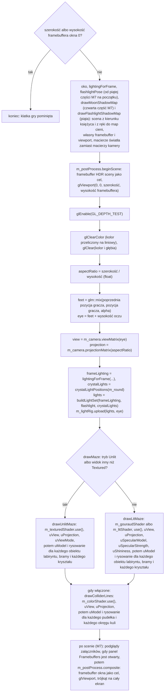

# Moduł scene: kamera, macierz widoku i rzutowanie

Kamień milowy: M1, użycie w grze zmienione w M2 + M3 (kamera stoi w oczach gracza) i w M5 (kąty ustawia początek rundy, cztery programy zamiast pięciu, przykład liczbowy na ścianie labiryntu). W pierwszej części M6 doszedł piąty program, `skybox`, który jako jedyny używa macierzy widoku **bez przesunięcia** ([`../renderer/skybox.md`](../renderer/skybox.md), sekcja 2.6). W drugiej części M6 doszedł szósty, `grass`, a oko kamery stoi 1,7 m nad terenem, a nie nad zerem (przykład liczbowy w sekcji 5.8 jest przeliczony). Temat wykładu: 3 (Przekształcenia przestrzeni).
Kod: [`src/scene/Camera.hpp`](../../../src/scene/Camera.hpp), [`src/scene/Camera.cpp`](../../../src/scene/Camera.cpp), użycie w [`src/game/NightMazeApp.hpp`](../../../src/game/NightMazeApp.hpp) i [`src/game/NightMazeApp.cpp`](../../../src/game/NightMazeApp.cpp).

Część modułu `scene`. Wstęp do modułu i jego miejsce w warstwach są w [`README.md`](README.md). Pozostałe części: [`transforms.md`](transforms.md) (przestrzenie współrzędnych, macierze przesunięcia, obrotu i skali, macierz modelu) i [`camera-controls.md`](camera-controls.md) (sterowanie kamerą, panel Camera). Ten dokument zakłada znajomość [`transforms.md`](transforms.md) (sekcje od 2.1 do 2.5: łańcuch przestrzeni, współrzędne jednorodne, czytanie iloczynu od prawej) i korzysta z biblioteki GLM ([`../../libraries/glm.md`](../../libraries/glm.md): `lookAt`, `perspective`, `radians`, `cross`, `normalize`).

## 1. Po co to jest

Macierz modelu z [`transforms.md`](transforms.md) stawia obiekt w świecie. Żeby go zobaczyć, potrzebne są jeszcze dwie macierze: macierz widoku (skąd i w którą stronę patrzę) i macierz rzutowania (jak szeroko widzę i skąd bierze się perspektywa). Obie liczy struktura `scene::Camera` z pozycji, dwóch kątów i czterech parametrów rzutowania. Tak jak `Transform`, kamera to zwykłe dane i matematyka: nie woła OpenGL, nie zna klawiatury, myszy ani czasu.

Ten dokument opisuje też miejsce, w którym trzy macierze spotykają się w jednej klatce, czyli `NightMazeApp::onRender`: test głębi, proporcje obrazu, zabezpieczenie przed framebufferem o rozmiarze zero i drogę jednego wierzchołka przez cały łańcuch na liczbach.

Stan na dziś: `game::NightMazeApp` ma jedną `Camera`. Co klatkę liczy z niej macierz widoku i macierz rzutowania, raz, i wysyła je do każdego programu shaderów, którym ta klatka rysuje. Programów, które dostają macierze kamery, jest od M8, części 1 siedem (od M6 sześć), a w jednej klatce pracuje ich najwyżej pięć: jeden program sceny wybrany według trybu oświetlenia (`textured` bez oświetlenia, `gouraud` albo `lit`), którym rysowane są teren, labirynt, brama i kryształy, `grass` (trawa, gdy jest włączona), `color` (linie pudełek i kul kolizji, gdy są włączone) `skybox` (niebo, gdy jest włączone) oraz, od M8, części 1, `reflect` (kryształy i kałuże z niebem, gdy działa environment mapping; wtedy kryształów nie rysuje już program sceny). Od czwartej części M7 (cienie księżyca, 2026-10-05) jest jeszcze siódmy program z uniformami `uView` i `uProjection`, `shadow_depth`, ale on **nie dostaje macierzy kamery**: rysuje scenę z kierunku księżyca, a od piątej części (2026-10-06) także z ręki z latarką, i dostaje widok i rzutowanie światła (`scene::LightSpace`, [`lights.md`](lights.md), sekcja 5.7). Macierz modelu każdy rysowany obiekt ma własną (kod: sekcja 5.7). To samo oko, z którego powstaje macierz widoku, i wektory `forward()` i `right()` ustawiają też latarkę gracza: od piątej części M7 trafiają do `flashlightPose`, które daje pozę latarki w ręce (kawałek na prawo i w dół od oka, wiązka celuje w punkt na osi widoku), a ta poza idzie do `buildLightSet` i do przebiegu cieni latarki. Samo oko trafia jeszcze do `LightRig::upload` (sekcja 5.7). Kamera nie ma już własnego sterowania pozycją: jej kąty obraca mysz ([`camera-controls.md`](camera-controls.md)), a pozycję po każdym kroku symulacji dostaje z oczu gracza ([`../game/player.md`](../game/player.md)). Struktura `Camera` ma też drugiego użytkownika: `Player::update` tworzy tymczasową kamerę i używa jej jak kalkulatora kierunków `forward()` i `right()` (sekcja 5.3).

**Zmiana w M9, części 1 (2026-10-06): kamera może być prowadzona przez tryb menu.** Struktura `Camera` się nie zmieniła. Zmieniło się użycie w `onRender`: w trybie kamery menu (klawisz F2, przełącznik `--menu-camera`) klatka jest rysowana z **kopii** kamery (`scene::Camera frameCamera = m_camera;`), której `yawDegrees` i `pitchDegrees` pochodzą z `game::MenuCameraPose`, a oko z `pose.eye`; macierze widoku i rzutowania, kierunek latarki i płaszczyzny podglądu głębi bierze się z kopii. Kamera gracza `m_camera` zostaje nietknięta, więc po wyłączeniu trybu gracz patrzy tam, gdzie patrzył. Pole widzenia i płaszczyzny są te same. Opis: [`../game/menu-camera.md`](../game/menu-camera.md), sekcje 2.5 i 3. Fragmenty `onRender` w sekcji 5.7 i w pytaniu 12 opisują klatkę bez tego trybu i mają przy sobie notatkę.

Przykład liczbowy w sekcji 5.8 używa dzisiejszej sceny: kamery w pozie, z której startuje runda, i wierzchołka ściany labiryntu startowego. Tabele w sekcjach 2.3 i 5.6 oraz ćwiczenie 4 używają kamery z wartościami domyślnymi struktury (pozycja `(0, 0, 3)`, patrzy na początek układu). To poprawna ilustracja rachunku, ale nie poza, z której startuje gra (oko w `(1; 1,824; 1)` wewnątrz labiryntu: 1,7 m nad gruntem, który ma w tym miejscu 0,124 m). Mówię o tym wprost w każdym takim miejscu. W M1 sceną przykładów była kostka w początku układu: została usunięta w M5.

## 2. Teoria

### 2.1 Macierz widoku: odwrotność przekształcenia kamery

OpenGL nie ma kamery. Jest tylko sześcian NDC, a na ekran trafia to, co się w nim znajdzie. "Ruch kamery" to złudzenie: zamiast przesuwać kamerę w prawo, przesuwam **cały świat** w lewo. Macierz widoku jest właśnie tym przekształceniem całego świata.

Kamerę można traktować jak każdy inny obiekt sceny: ma pozycję i obrót, czyli własną macierz modelu `C = T * R` (z przestrzeni kamery do świata). Macierz widoku robi drogę odwrotną, ze świata do przestrzeni kamery, więc jest **odwrotnością** tej macierzy:

```text
view = odwrotność(T * R) = odwrotność(R) * odwrotność(T)
```

Odwrotnością przesunięcia o `eye` jest przesunięcie o `-eye`. Odwrotnością obrotu jest obrót w przeciwną stronę, a dla macierzy obrotu odwrotność to po prostu jej transpozycja (zamiana wierszy z kolumnami). Macierz widoku najpierw przesuwa więc świat tak, żeby kamera znalazła się w punkcie `(0, 0, 0)`, a potem obraca go tak, żeby kierunek patrzenia pokrył się z osią -Z.

Nie liczę odwrotności ogólną funkcją `glm::inverse`. `glm::lookAt(eye, center, up)` buduje wynik wprost z trzech wektorów jednostkowych, które tworzą **bazę kamery** (basis):

| Wektor | Jak powstaje | Znaczenie |
|---|---|---|
| `f` (forward) | `normalize(center - eye)` | kierunek patrzenia |
| `s` (side, right) | `normalize(cross(f, up))` | w prawo od kamery. Prostopadły do kierunku patrzenia i do góry świata |
| `u` (up) | `cross(s, f)` | góra kamery. Prostopadły do dwóch pozostałych. To nie jest góra świata: gdy kamera patrzy w dół, jej góra pochyla się do przodu |

Te trzy wektory stają się **wierszami** macierzy (to jest transpozycja, czyli odwrócony obrót), a ostatnia kolumna przesuwa świat o `-eye` wyrażone w nowej bazie:

```text
|  s.x   s.y   s.z   -dot(s, eye) |
|  u.x   u.y   u.z   -dot(u, eye) |
| -f.x  -f.y  -f.z    dot(f, eye) |
|   0     0     0         1       |
```

Trzeci wiersz ma minusy, bo w przestrzeni widoku kamera patrzy wzdłuż **ujemnej** osi Z: punkt leżący przed kamerą ma dostać ujemne z. Jak czytać taki wiersz: współrzędna x punktu w przestrzeni widoku to `dot(s, punkt - eye)`, czyli "jak daleko w prawo od kamery jest ten punkt".

Argument `up` jest tylko wskazówką, gdzie jest góra. Nie musi być prostopadły do kierunku patrzenia, ale **nie może być do niego równoległy**: wtedy `cross(f, up)` jest wektorem zerowym, a `normalize` wektora zerowego to dzielenie przez zero (sekcja 2.2).

### 2.2 Kamera FPS: yaw, pitch i wektor kierunku

Kamera z perspektywy pierwszej osoby (first person, FPS) nie przechyla się na boki. Do opisania kierunku patrzenia wystarczą dwa kąty:

- **yaw** (odchylenie): obrót w lewo i w prawo, wokół pionowej osi świata,
- **pitch** (pochylenie): patrzenie w górę i w dół.

Trzeci kąt, roll (przechylenie na bok), jest zawsze równy zero.

**Konwencja projektu.** Yaw 0 i pitch 0 to patrzenie wzdłuż -Z. Yaw działa jak kompas oglądany z góry: rośnie przy obrocie **w prawo**. Dodatni pitch to patrzenie w górę.

| yaw | Kierunek patrzenia (przy pitch 0) |
|---|---|
| 0 | `(0, 0, -1)`, czyli -Z |
| 90 | `(1, 0, 0)`, czyli +X |
| 180 | `(0, 0, 1)`, czyli +Z |
| 270 | `(-1, 0, 0)`, czyli -X |

**Wyprowadzenie wzoru.** Szukam wektora jednostkowego `forward`. Składam go w dwóch krokach.

Krok 1, pitch. Widok z boku: oś pozioma to kierunek "przed siebie", oś pionowa to Y. Wektor o długości 1 podniesiony o kąt `pitch` jest przeciwprostokątną trójkąta prostokątnego:

```text
        Y
        |          * forward (długość 1)
        |        / |
        |      /   |  sin(pitch)   składowa pionowa
        |    /     |
        |  / pitch |
        +----------+------> przed siebie (w poziomie)
          cos(pitch)
          składowa pozioma
```

Z definicji sinusa i cosinusa: składowa pionowa to `sin(pitch)`, a część pozioma ma długość `cos(pitch)`. Im wyżej patrzę, tym krótsza część pozioma.

Krok 2, yaw. Widok z góry, na płaszczyznę XZ. Część pozioma (długości `cos(pitch)`) jest obrócona o kąt `yaw` od kierunku -Z w stronę +X:

```text
                  -Z   (yaw = 0)
                   |
                   |     * część pozioma forward
                   |   /
                   | /  yaw
     -X -----------+-----------> +X   (yaw = 90)
                   |
                   |
                  +Z   (yaw = 180)
```

Rozkładam ją na osie: na oś X przypada `sin(yaw)`, na kierunek -Z przypada `cos(yaw)`, czyli składowa z ma znak minus. Obie mnożę przez długość części poziomej:

```text
forward.x =  cos(pitch) * sin(yaw)
forward.y =  sin(pitch)
forward.z = -cos(pitch) * cos(yaw)
```

Sprawdzenie długości: `x^2 + z^2 = cos^2(pitch) * (sin^2(yaw) + cos^2(yaw)) = cos^2(pitch)`, a po dodaniu `y^2 = sin^2(pitch)` wychodzi 1. Wektor jest jednostkowy bez normalizowania.

Dwie uwagi do konwencji:

- Obrót "w prawo" patrząc z góry jest zgodny z ruchem wskazówek zegara, czyli **przeciwny** do dodatniego obrotu wokół osi Y z [`transforms.md`](transforms.md), sekcja 2.3. Dodatni yaw kamery to obrót o `-yaw` wokół Y. Wybrałem kierunek kompasu, bo ruch myszy w prawo daje dodatnie przesunięcie ([`../core/input.md`](../core/input.md), sekcja 5.8), więc przesunięcie można dodać do kąta bez zmiany znaku.
- LearnOpenGL podaje wzór `(cos(yaw) * cos(pitch), sin(pitch), sin(yaw) * cos(pitch))`, w którym yaw 0 oznacza patrzenie wzdłuż +X, i dlatego ustawia yaw startowy na -90 stopni. To ten sam wzór przesunięty o 90 stopni: `cos(yaw - 90) = sin(yaw)` i `sin(yaw - 90) = -cos(yaw)`. U mnie zero jest tam, gdzie kierunek "do przodu" całego projektu.

**Wektor w prawo.** Potrzebny do chodzenia bokiem (strafe). To iloczyn wektorowy kierunku patrzenia i góry świata: `right = normalize(cross(forward, WORLD_UP))`. Iloczyn wektorowy daje wektor prostopadły do obu argumentów, więc `right` jest zawsze poziomy (prostopadły do pionu). Jego długość przed normalizacją to `cos(pitch)`, a nie 1, bo `forward` i `WORLD_UP` nie są do siebie prostopadłe, gdy patrzę w górę albo w dół. Stąd `normalize`.

**Ograniczenie pitch.** Przy pitch równym dokładnie 90 stopni `forward` to `(0, 1, 0)`, czyli wektor równoległy do góry świata. Wtedy:

- `cross(forward, WORLD_UP)` jest wektorem zerowym: z dwóch równoległych wektorów nie da się wyznaczyć trzeciego, prostopadłego do obu,
- `normalize` dzieli przez długość 0 i zwraca `NaN` w każdej składowej,
- `glm::lookAt` robi w środku dokładnie to samo, więc cała macierz widoku wypełnia się wartościami `NaN` i obraz znika.

Geometrycznie: patrząc pionowo w górę, nie da się powiedzieć, gdzie jest "prawo", bo każdy poziomy kierunek jest równie dobry. To blokada przegubu z [`transforms.md`](transforms.md), sekcja 2.6, w wersji dla kamery: yaw przestaje zmieniać kierunek patrzenia i tylko kręci obrazem. Po przekroczeniu 90 stopni jest jeszcze gorzej: kamera patrzy "do tyłu przez głowę", ale `lookAt` nadal dostaje górę świata, więc obraz nagle obraca się o 180 stopni (gimbal flip).

Rozwiązanie jest proste: pitch jest ograniczany do zakresu od -89 do 89 stopni (stała `MAX_PITCH_DEGREES`). Przy 89 stopniach długość iloczynu wektorowego to `cos(89 stopni)`, czyli około 0,0175: mało, ale daleko od zera. Gracz nie zauważa brakującego stopnia.

### 2.3 Rzutowanie perspektywiczne

**Bryła widzenia** (view frustum) to obszar sceny, który kamera widzi: ścięty ostrosłup z wierzchołkiem w kamerze. Opisują go cztery liczby:

| Parametr | Znaczenie | Wartość domyślna w `Camera` |
|---|---|---|
| pionowy kąt widzenia (vertical field of view, FOV) | kąt między górną a dolną ścianą ostrosłupa | 60 stopni |
| proporcje (aspect ratio) | szerokość obrazu podzielona przez wysokość. Z nich i z pionowego FOV wynika kąt poziomy | podaje wołający |
| bliska płaszczyzna (near plane) | odległość, od której zaczyna się widoczny obszar | 0,1 |
| daleka płaszczyzna (far plane) | odległość, na której się kończy | 100 |

```text
widok z boku (oś pionowa: Y, kamera patrzy w prawo, wzdłuż -Z)

                                        | daleka płaszczyzna
                                   .  ' |
                              .  '      |
                   bliska .  '          |
                        |               |
   kamera *  fov        |   widoczne    |
                        |               |
                          '  .          |
                               '  .     |
                                    ' . |
          |<-- near --->|
          |<------------- far --------->|
```

Wszystko poza tą bryłą jest przycinane. To, co jest w środku, macierz rzutowania przekształca tak, żeby po dzieleniu przez `w` bryła stała się sześcianem NDC.

**Skąd bierze się perspektywa.** Z trójkątów podobnych: punkt na wysokości `y`, w odległości `d` od kamery, trafia na ekranie na wysokość proporcjonalną do `y / d`. Dwa razy dalej to dwa razy niżej nad środkiem obrazu, czyli dwa razy mniejszy. Górna krawędź obrazu w odległości `d` jest na wysokości `d * tan(fov / 2)`, więc współrzędna NDC to:

```text
y_ndc = y / (d * tan(fov / 2))
x_ndc = x / (d * tan(fov / 2) * aspect)
```

W przestrzeni widoku kamera patrzy wzdłuż -Z, więc odległość to `d = -z`. Mnożenie macierzy nie umie dzielić przez `z`, dlatego macierz robi dwie rzeczy: skaluje x i y, a do `w` wpisuje `-z`. Dzielenie wykonuje karta.

Macierz, którą buduje `glm::perspective(fovy, aspect, near, far)` (wariant domyślny, prawoskrętny, głębia od -1 do 1), gdzie `f = 1 / tan(fovy / 2)`:

```text
| f / aspect   0        0                              0                        |
|     0        f        0                              0                        |
|     0        0   -(far + near) / (far - near)   -2 * far * near / (far - near) |
|     0        0       -1                              0                        |
```

Czwarty wiersz to cały sekret perspektywy: `w_clip = -z_view`, czyli odległość punktu od kamery. Dla wartości domyślnych kamery i proporcji 16:9 wychodzi `f = 1,732`, `f / aspect = 0,974`, a dwa wyrazy trzeciego wiersza to `-1,002` i `-0,2002`.

**Przycinanie i dzielenie perspektywiczne.** Po shaderze wierzchołków karta najpierw odrzuca to, co nie spełnia `-w <= x <= w`, `-w <= y <= w`, `-w <= z <= w`, a potem dzieli x, y i z przez `w` (perspective divide). Przykład dla kamery domyślnej (stoi w `(0, 0, 3)`, patrzy na początek układu):

| Punkt w świecie | W przestrzeni widoku | NDC po dzieleniu | Gdzie na ekranie |
|---|---|---|---|
| `(0, 0, 0)` | `(0, 0, -3)` | `(0, 0, 0,935)` | dokładnie środek |
| `(1, 0, 0)` | `(1, 0, -3)` | `(0,325, 0, 0,935)` | na prawo od środka |
| `(0, 1, 0)` | `(0, 1, -3)` | `(0, 0,577, 0,935)` | nad środkiem. `1 * 1,732 / 3 = 0,577` |
| `(0, 1,732, 0)` | `(0, 1,732, -3)` | `(0, 1, 0,935)` | na górnej krawędzi: `3 * tan(30 stopni) = 1,732` |

**Głębia jest nieliniowa.** Trzeci wiersz macierzy jest dobrany tak, żeby po dzieleniu bliska płaszczyzna dawała z = -1, a daleka z = 1. Pomiędzy nimi zależność od odległości nie jest liniowa, tylko postaci `A + B / d`. Wartości dla near 0,1 i far 100:

| Odległość od kamery | z w NDC | Głębia w buforze (od 0 do 1) |
|---|---|---|
| 0,1 (bliska płaszczyzna) | -1,000 | 0,000 |
| 0,2 | 0,001 | 0,5005 |
| 1 | 0,802 | 0,901 |
| 10 | 0,982 | 0,991 |
| 50 | 0,998 | 0,999 |
| 100 (daleka płaszczyzna) | 1,000 | 1,000 |

Połowa całego zakresu głębi jest zużyta na pierwsze 10 centymetrów za bliską płaszczyzną (od 0,1 do 0,2), a wszystko dalej niż 10 jednostek mieści się w ostatnim 1 procencie. Blisko kamery precyzja jest ogromna, daleko bardzo mała. To celowe (błąd głębi blisko kamery jest najlepiej widoczny), ale ma skutek uboczny.

**Dlaczego near nie może być bardzo małe.** Reguła z tabeli brzmi: połowa zakresu głębi przypada na odległości od `near` do `2 * near`. Przy near 0,001 połowa precyzji idzie na pierwszy milimetr, a dla dwóch ścian oddalonych o 20 metrów zostaje tak mało różnych wartości, że obie dostają tę samą głębię. Test głębi nie potrafi wtedy rozstrzygnąć, która jest bliżej, i piksele obu powierzchni migoczą na przemian: to **z-fighting**. Zwiększenie `near` pomaga dużo bardziej niż zmniejszenie `far`. Near równe 0 jest błędem: w macierzy wyraz `-2 * far * near` zeruje się i głębia każdego punktu wychodzi taka sama.

**FOV.** Mały kąt (na przykład 30 stopni) działa jak teleobiektyw: widać wąski wycinek sceny w powiększeniu. Duży (100 stopni i więcej) pokazuje szeroko, ale rozciąga obraz przy krawędziach. Typowy zakres w grach to od 60 do 90 stopni. GLM przyjmuje kąt **pionowy**, a wiele gier podaje w ustawieniach kąt poziomy, więc te same liczby nie znaczą tego samego.

### 2.4 Z NDC do pikseli

Ostatni krok, też wykonywany przez kartę. `glViewport(x0, y0, width, height)` mówi, na jaki prostokąt bufora ramki trafia kwadrat NDC:

```text
x_okna = x0 + (x_ndc + 1) / 2 * width
y_okna = y0 + (y_ndc + 1) / 2 * height
głębia = (z_ndc + 1) / 2
```

Z tego wynika związek proporcji z viewportem. NDC jest zawsze kwadratem od -1 do 1, a okno zwykle jest prostokątem. Bez poprawki kwadrat zostałby rozciągnięty na prostokąt i kwadratowa komórka labiryntu widziana z góry wyglądałaby jak prostokąt. Macierz rzutowania z góry ściska oś x przez podzielenie przez `aspect`, a viewport rozciąga ją z powrotem. Oba przekształcenia się znoszą tylko wtedy, gdy `aspect` to **dokładnie** szerokość viewportu podzielona przez jego wysokość, czyli gdy jedno i drugie pochodzi z rozmiaru framebuffera ([`../core/window-context.md`](../core/window-context.md), sekcja 2).

### 2.5 Konwencja projektu: układ prawoskrętny, Y w górę, -Z do przodu

| Ustalenie | Wartość |
|---|---|
| skrętność układu | prawoskrętny (right-handed) |
| oś X | w prawo |
| oś Y | w górę |
| oś Z | w stronę patrzącego. "Do przodu" to -Z |
| jednostka | 1 jednostka to 1 metr |

**Układ prawoskrętny**: kciuk prawej dłoni wskazuje +X, palec wskazujący +Y, a środkowy +Z. Równoważnie: `cross(X, Y) = Z`. Przy osi X w prawo i Y w górę oś Z wychodzi z ekranu w stronę patrzącego, więc to, co przed kamerą, ma ujemne z.

To konwencja OpenGL i wartości domyślnych GLM (`lookAt` to `lookAtRH`, `perspective` to `perspectiveRH_NO`), więc nie definiuję żadnego makra `GLM_FORCE_*`. Ta sama konwencja obowiązuje dla modeli: PRD w sekcji 9 ustala dla eksportu z Blendera osie "Y-up, -Z forward" i skalę 1 jednostka = 1 metr. Dzięki temu model wyeksportowany przodem do -Z stoi w grze przodem do kierunku, w który kamera patrzy przy yaw 0, a `WORLD_UP` to `(0, 1, 0)` w każdym miejscu kodu.

Uwaga: sześcian NDC jest **lewoskrętny** (z rośnie w głąb ekranu: -1 to blisko, 1 to daleko). Zamianę skrętności wykonuje macierz rzutowania, a dokładnie jej wyraz `-1` w czwartym wierszu i minus w trzecim. W moim kodzie nie wymaga to żadnej uwagi, ale wyjaśnia, dlaczego w przestrzeni widoku "dalej" to mniejsze z, a w buforze głębi "dalej" to większa wartość.

## 3. Jak to działa w OpenGL

Macierze to zwykła matematyka na procesorze. `Transform` i `Camera` nie wołają żadnej funkcji `gl*` i nie dołączają GLAD: do działania wystarcza im GLM. OpenGL dowiaduje się o macierzach dopiero wtedy, gdy ktoś wyśle je do programu shaderów. Wywołania, które biorą w tym udział:

| Wywołanie | Co robi | Związek z tym dokumentem |
|---|---|---|
| `glGetUniformLocation(program, "uModel")` | zwraca numer (location) zmiennej `uniform` o podanej nazwie w zlinkowanym programie, albo -1, gdy takiej nie ma | po numerze wskazuję, do której zmiennej shadera trafia macierz |
| `glUniformMatrix4fv(location, 1, GL_FALSE, wskaźnik)` | kopiuje 16 liczb `float` do zmiennej `uniform mat4` programu, który jest aktualnie w użyciu (`glUseProgram`) | tak macierz z GLM trafia do shadera. `GL_FALSE` znaczy "nie transponuj": GLM trzyma macierz kolumnami, czyli tak, jak chce OpenGL. Wskaźnik daje `glm::value_ptr` ([`../../libraries/glm.md`](../../libraries/glm.md), sekcja 3.9) |
| `glViewport(x, y, width, height)` | ustala prostokąt bufora ramki, na który trafia kwadrat NDC | z tych samych `width` i `height` trzeba policzyć `aspectRatio` dla `Camera::projectionMatrix` (sekcja 2.4). Od pierwszej części M7 buforem ramki sceny jest własny framebuffer HDR tej samej wielkości co framebuffer okna, a `glViewport` woła `gfx::Framebuffer::bind` ([`../gfx/framebuffers.md`](../gfx/framebuffers.md)) |
| `glEnable(GL_DEPTH_TEST)` | włącza test głębi: fragment jest rysowany tylko wtedy, gdy jest bliżej niż to, co już jest w buforze głębi | bez niego o widoczności decyduje kolejność rysowania trójkątów, a nie odległość. Wartość głębi pochodzi z macierzy rzutowania (sekcja 2.3) |
| `glClear(GL_COLOR_BUFFER_BIT \| GL_DEPTH_BUFFER_BIT)` | czyści kolor i głębię | przy włączonym teście głębi bufor głębi trzeba czyścić co klatkę, inaczej zostają w nim wartości z poprzedniej |
| `glDepthRange(0, 1)` | zakres, na który trafia z z NDC | wartość domyślna, nie zmieniam jej |

Wszystkie te wywołania poza `glDepthRange` wykonuje program w każdej klatce: `glEnable(GL_DEPTH_TEST)` i `glClear` wprost w `NightMazeApp::onRender`, `glViewport` od pierwszej części M7 wewnątrz `m_postProcess.beginScene` (przez `gfx::Framebuffer::bind`) i drugi raz w przebiegu składającym (`Framebuffer::bindDefault`), a od czwartej części M7 jeszcze wcześniej, w przebiegu cieni: `ShadowMap::beginDepthPass` wiąże framebuffer mapy cieni (viewport o rozmiarze mapy, 2048 x 2048 przy ustawieniach startowych), włącza test głębi i czyści głębię, zanim `beginScene` ustawi viewport sceny od nowa. `glGetUniformLocation` i `glUniformMatrix4fv` wewnątrz `gfx::Shader::setMat4` ([`../gfx/uniforms.md`](../gfx/uniforms.md), sekcja 5). Macierze widoku i rzutowania wysyła raz każda funkcja rysująca do swojego programu, a macierz modelu jest wysyłana raz dla każdego rysowanego obiektu.

Kolejność w klatce:

> Uwaga (2026-10-06, M9 część 1): fragment `onRender` poniżej pochodzi sprzed kamery menu i jest skrócony. Dziś `onRender` woła na początku `updateMenuCameraSwitch()`, a macierze, kierunek latarki i podglądy bufora głębi bierze z kopii kamery `frameCamera` (kamera gracza albo poza kamery menu), a oko `eye` bywa podmienione na oko kamery menu. Klawisze R, N, F i M, obrót myszą i wskazywanie mają warunek `!menuCamera`, `frameLighting` nie jest `const` (w trybie menu latarka jest ustawiana osobno), a minimapa nie jest rysowana. Opis: [`menu-camera.md`](../game/menu-camera.md), sekcja 5.4.



(Diagram pomija trawę i niebo, rysowane między labiryntem a przebiegami po scenie: nie zmieniają niczego w macierzach. Pełna kolejność klatki: [`../core/README.md`](../core/README.md), sekcja 6.6, i [`../renderer/post-process.md`](../renderer/post-process.md).)

Trzy zależności w tej kolejności:

1. `use()` stoi przed `setMat4`. Uniform należy do programu, a `glUniform*` pisze do programu aktualnie wybranego.
2. Proporcje są liczone z tych samych dwóch liczb, które trafiły do `glViewport` (sekcja 2.4): rozmiar framebuffera okna idzie do `beginScene`, a ono tworzy framebuffer sceny w tym rozmiarze i ustawia na niego viewport.
3. Bufor głębi jest czyszczony razem z kolorem, przed rysowaniem.

**Test głębi** (depth test). Każdy piksel bufora ramki ma oprócz koloru wartość głębi od 0 do 1. `glClear(GL_DEPTH_BUFFER_BIT)` wpisuje wszędzie 1, czyli "najdalej". Przy włączonym teście fragment jest zapisywany tylko wtedy, gdy jego głębia jest **mniejsza** od tej w buforze (domyślna funkcja `GL_LESS`), i wtedy nadpisuje kolor oraz głębię. Dzięki temu bliższa ściana wygrywa niezależnie od kolejności rysowania trójkątów. Bez testu wygrywa ten trójkąt, który został narysowany później. W labiryncie oznacza to, że dalsza ściana narysowana po bliższej zamalowuje ją, a bryła, której tylne ściany są rysowane po przednich, wygląda jak wywrócona na lewą stronę (tak wyglądała bez testu głębi kostka z M1). Ćwiczenie 10 pozwala to zobaczyć.

Okno ma bufor głębi, choć `core::Window` nigdzie o niego nie prosi: wskazówka GLFW `GLFW_DEPTH_BITS` ma wartość domyślną 24, więc każde okno GLFW dostaje bufor głębi o 24 bitach, jeśli nie zażądam inaczej.

## 4. Shadery

Kamera nie ma własnego shadera. Macierz widoku i macierz rzutowania trafiają do uniformów `uView` i `uProjection`, które pod tymi samymi nazwami deklaruje każdy z czterech shaderów wierzchołków projektu (`textured.vert`, `color.vert`, `lit.vert`, `gouraud.vert`). Przykładem w tym dokumencie jest `textured.vert`. Deklaracje uniformów i linię, która mnoży przez nie pozycję wierzchołka, omawia [`transforms.md`](transforms.md), sekcja 4, a sam mechanizm uniformów [`../gfx/uniforms.md`](../gfx/uniforms.md), sekcja 2.

## 5. Kod w projekcie

### 5.1 Pliki

| Plik | Co zawiera |
|---|---|
| [`src/scene/Camera.hpp`](../../../src/scene/Camera.hpp) | struktura `Camera`: stałe `WORLD_UP` i `MAX_PITCH_DEGREES`, pola `position`, `yawDegrees`, `pitchDegrees`, `fovDegrees`, `nearPlane`, `farPlane`, deklaracje pięciu funkcji |
| [`src/scene/Camera.cpp`](../../../src/scene/Camera.cpp) | stała `FULL_TURN_DEGREES` i funkcje `forward`, `right`, `rotate`, `viewMatrix`, `projectionMatrix` |
| [`src/game/NightMazeApp.hpp`](../../../src/game/NightMazeApp.hpp), [`.cpp`](../../../src/game/NightMazeApp.cpp) | użytkownik kamery: pole `m_camera`, ustawienie kątów na początku rundy w `beginRound`, liczenie proporcji, oka i dwóch macierzy w `onRender`, wysłanie ich do programów w `drawUnlitMaze` albo `drawLitMaze` (wybiera `drawMaze`) i w `drawColliderLines`, a oka i kierunku `forward()` do `buildLightSet` i `LightRig::upload` (sekcja 5.7) |
| [`src/game/Player.cpp`](../../../src/game/Player.cpp) | drugi użytkownik: `Player::update` liczy kierunki ruchu przez tymczasową `scene::Camera` (sekcja 5.3, [`../game/player.md`](../game/player.md), sekcja 5) |

Miejsce plików `src/scene/` w bibliotece `engine` i powód, dla którego `Camera` jest strukturą z publicznymi polami, opisuje [`transforms.md`](transforms.md), sekcja 5.1. Pliki shadera są wymienione tam, a pliki sterowania kamerą i panelu w [`camera-controls.md`](camera-controls.md), sekcja 5.

### 5.2 `Camera`: stałe i pola

```cpp
    /// The up direction of the world.
    static constexpr glm::vec3 WORLD_UP{0.0F, 1.0F, 0.0F};

    /// Largest pitch in either direction, in degrees. Just under 90: looking straight up
    /// or down would make the view direction parallel to WORLD_UP, and then the view
    /// matrix cannot tell which way is "right".
    static constexpr float MAX_PITCH_DEGREES = 89.0F;
```

| Stała | Znaczenie |
|---|---|
| `WORLD_UP` | góra świata, `(0, 1, 0)`, zgodnie z konwencją "Y w górę" (sekcja 2.5). Używają jej `right()` i `viewMatrix()`. Jest publiczna, bo używa jej też kod, który przesuwa gracza w górę i w dół w trybie noclip (`Player::update`, [`../game/player.md`](../game/player.md), sekcja 5) |
| `MAX_PITCH_DEGREES` | 89 stopni: największe pochylenie w górę i w dół (sekcja 2.2) |

`static constexpr` w strukturze oznacza stałą czasu kompilacji wspólną dla wszystkich obiektów: nie zajmuje miejsca w obiekcie `Camera` i jest dostępna jako `scene::Camera::WORLD_UP`. Tak samo zapisane są stałe `core::Time::FIXED_DT` i `core::Input::KEY_COUNT`.

```cpp
    /// Position in world space. Three units in front of the origin, on the +Z side, so
    /// that the default camera looks at the origin.
    glm::vec3 position{0.0F, 0.0F, 3.0F};

    /// Turn to the left or right, in degrees, like a compass seen from above:
    /// 0 looks along -Z, 90 along +X, 180 along +Z, 270 along -X.
    float yawDegrees = 0.0F;

    /// Look up (positive) or down (negative), in degrees. 0 is level.
    float pitchDegrees = 0.0F;

    /// Vertical field of view in degrees: the angle between the top and the bottom edge
    /// of the picture.
    float fovDegrees = 60.0F;

    /// Distance to the near clipping plane. Must be greater than 0. Nothing closer to
    /// the camera is drawn.
    float nearPlane = 0.1F;

    /// Distance to the far clipping plane. Nothing farther from the camera is drawn.
    float farPlane = 100.0F;
```

| Pole | Znaczenie i wartość domyślna |
|---|---|
| `position` | pozycja kamery w świecie. `(0, 0, 3)`: trzy jednostki przed początkiem układu, po stronie +Z. Razem z yaw 0 (patrzenie wzdłuż -Z) daje kamerę, która od razu patrzy na punkt `(0, 0, 0)` |
| `yawDegrees` | obrót w lewo i w prawo, w stopniach, jak kompas: 0 to -Z, 90 to +X (sekcja 2.2) |
| `pitchDegrees` | patrzenie w górę (wartości dodatnie) i w dół, w stopniach |
| `fovDegrees` | **pionowy** kąt widzenia w stopniach. 60 to typowa wartość |
| `nearPlane` | odległość bliskiej płaszczyzny. 0,1 to 10 centymetrów: dość blisko, żeby ściana przy samej twarzy nie była obcinana, i dość daleko od zera, żeby głębia miała precyzję (sekcja 2.3) |
| `farPlane` | odległość dalekiej płaszczyzny. 100 metrów z zapasem obejmuje labirynt |

Dwie decyzje:

- **`nearPlane` i `farPlane` są polami, a nie stałymi.** To własność konkretnej kamery i konkretnej sceny: druga kamera (na przykład patrząca z góry na cały labirynt) potrzebuje innych wartości niż kamera gracza, a zadanie laboratoryjne zbudowane na `engine` może mieć inną skalę świata. Pola pozwalają też zobaczyć z-fighting na własne oczy przez zmianę jednej liczby (pułapka 4).
- **Nazwy `nearPlane` i `farPlane`, a nie `near` i `far`.** Nagłówek `<windows.h>` definiuje `near` i `far` jako puste makra (pozostałość po 16-bitowym Windowsie). W pliku, który dołączyłby i `<windows.h>`, i `Camera.hpp`, pole o nazwie `near` zniknęłoby w preprocesorze i kod przestałby się kompilować.

Struktura nie ma prędkości ruchu ani czułości myszy. To nie są własności kamery, tylko sposobu sterowania, więc należą do kodu gry: czułość myszy jest polem `NightMazeApp` ([`camera-controls.md`](camera-controls.md), sekcja 5), a trzy prędkości (chodzenia, biegu i lotu) są polami `game::Player` ([`../game/player.md`](../game/player.md), sekcja 5).

### 5.3 `forward()` i `right()`

```cpp
glm::vec3 Camera::forward() const {
    // The standard library takes angles in radians.
    const float yaw = glm::radians(yawDegrees);
    const float pitch = glm::radians(pitchDegrees);

    // Pitch splits the unit vector into a vertical part, sin(pitch), and a horizontal
    // part of length cos(pitch). Yaw turns the horizontal part from -Z (yaw 0) towards
    // +X (yaw 90). The length of the result is always 1.
    const float horizontal = std::cos(pitch);
    return {horizontal * std::sin(yaw), std::sin(pitch), -horizontal * std::cos(yaw)};
}
```

| Linia | Znaczenie |
|---|---|
| `const float yaw = glm::radians(yawDegrees);` (i to samo dla pitch) | `std::sin` i `std::cos` przyjmują radiany. Zamiana odbywa się w miejscu użycia, a pola zostają w stopniach |
| `const float horizontal = std::cos(pitch);` | długość części poziomej wektora (krok 1 wyprowadzenia w sekcji 2.2). Ma nazwę, bo występuje we wzorze dwa razy |
| `return {horizontal * std::sin(yaw), std::sin(pitch), -horizontal * std::cos(yaw)};` | wzór z sekcji 2.2. Klamry tworzą `glm::vec3` z trzech liczb, bo taki jest typ zwracany funkcji |

Funkcja nie woła `glm::normalize`: wzór sam daje wektor o długości 1.

```cpp
glm::vec3 Camera::right() const {
    // The cross product is perpendicular to both vectors. Its length is cos(pitch), not
    // 1, so it has to be normalized. The pitch limit keeps that length above zero.
    return glm::normalize(glm::cross(forward(), WORLD_UP));
}
```

`glm::cross(forward(), WORLD_UP)` w tej kolejności daje wektor w prawo. Zamiana argumentów dałaby wektor w lewo (`cross(a, b) = -cross(b, a)`). Sprawdzenie na przypadku domyślnym: `cross((0, 0, -1), (0, 1, 0)) = (1, 0, 0)`, czyli +X. `glm::normalize` jest potrzebne, bo długość iloczynu to `cos(pitch)`, a ograniczenie pitch gwarantuje, że nie jest ona zerem.

Funkcji `up()` (góra kamery) nie ma: nic jej jeszcze nie potrzebuje, a `glm::lookAt` liczy ją sobie sam.

**Kamera jako kalkulator kierunków.** Te dwie funkcje mają drugiego użytkownika poza rysowaniem. `Player::update` ([`src/game/Player.cpp`](../../../src/game/Player.cpp)) musi wiedzieć, gdzie jest "przód" i "prawo" dla podanych kątów, i zamiast powtarzać wzory z sinusami tworzy tymczasową kamerę:

```cpp
    scene::Camera view;
    view.yawDegrees = yawDegrees;
    view.pitchDegrees = noclip ? pitchDegrees : LEVEL_PITCH_DEGREES;
    const glm::vec3 forward = view.forward();
    const glm::vec3 right = view.right();
```

Pozycja tej kamery nie jest czytana, liczą się tylko dwa kąty. W trybie chodzenia pitch jest zastępowany zerem: `forward()` nie ma wtedy składowej pionowej i zachowuje długość 1, więc patrzenie w ziemię nie spowalnia gracza. `right()` jest poziome przy każdym pitch. Dzięki temu kierunek ruchu i obraz na ekranie zawsze pochodzą z tych samych wzorów. Reszta funkcji: [`../game/player.md`](../game/player.md), sekcja 5.

### 5.4 `rotate()`

```cpp
// One full turn. Yaw is kept below it so that the number stays readable.
constexpr float FULL_TURN_DEGREES = 360.0F;
```

```cpp
void Camera::rotate(float yawDeltaDegrees, float pitchDeltaDegrees) {
    yawDegrees += yawDeltaDegrees;
    // Take away the whole turns: floor gives their number, also for a negative angle.
    // 370 becomes 10 and -10 becomes 350, the direction stays the same.
    yawDegrees -= FULL_TURN_DEGREES * std::floor(yawDegrees / FULL_TURN_DEGREES);

    pitchDegrees =
        std::clamp(pitchDegrees + pitchDeltaDegrees, -MAX_PITCH_DEGREES, MAX_PITCH_DEGREES);
}
```

| Linia | Znaczenie |
|---|---|
| `yawDegrees += yawDeltaDegrees;` | dodatnia zmiana obraca w prawo |
| `yawDegrees -= FULL_TURN_DEGREES * std::floor(yawDegrees / FULL_TURN_DEGREES);` | zawija yaw do zakresu od 0 do 360. `std::floor` zaokrągla w dół, także liczby ujemne, więc daje liczbę pełnych obrotów do odjęcia: dla 370 to 1 (wynik 10), dla -10 to -1 (wynik 350) |
| `std::clamp(pitchDegrees + pitchDeltaDegrees, -MAX_PITCH_DEGREES, MAX_PITCH_DEGREES)` | dodaje zmianę i przycina wynik do zakresu od -89 do 89. `std::clamp(wartość, dół, góra)` zwraca wartość, jeśli mieści się w zakresie, a inaczej bliższą granicę |

**Dlaczego yaw jest zawijany, a pitch przycinany.** To dwa różne ograniczenia. Yaw nie ma granicy: wolno kręcić się w kółko bez końca, a 370 stopni to ten sam kierunek co 10. Bez zawijania liczba rosłaby po każdym obrocie i po minucie gry panel pokazywałby na przykład 4130 stopni. Zawijanie nie zmienia kierunku patrzenia, tylko utrzymuje czytelną wartość. Pitch ma prawdziwą granicę: kamera nie może przechylić się przez głowę, więc wartość zatrzymuje się na 89.

**Dlaczego nie `std::fmod`.** `std::fmod(-10, 360)` zwraca -10, bo zachowuje znak pierwszego argumentu. Zakres wychodziłby od -360 do 360 i ten sam kierunek miałby dwie różne wartości. Wzór z `std::floor` daje jeden zakres, od 0 do 360.

`rotate` to jedyna funkcja `Camera`, która nie jest `const`: zmienia pola. Pilnuje zakresów tylko dla zmian, które przez nią przechodzą. Wartość wpisana wprost w pole `pitchDegrees` nie jest sprawdzana (pułapka 3). Woła ją `NightMazeApp::onRender` z przesunięciem myszy przeliczonym na stopnie ([`camera-controls.md`](camera-controls.md), sekcja 5).

### 5.5 `viewMatrix()` i `projectionMatrix()`

```cpp
glm::mat4 Camera::viewMatrix(const glm::vec3& eye) const {
    // lookAt wants a point to look at, not a direction: one step forward from the eye.
    return glm::lookAt(eye, eye + forward(), WORLD_UP);
}
```

| Argument `glm::lookAt` | Wartość | Znaczenie |
|---|---|---|
| `eye` | parametr funkcji | pozycja oka |
| `center` | `eye + forward()` | **punkt**, na który patrzę: jeden krok do przodu od oka. `lookAt` nie przyjmuje kierunku. Odległość punktu nie ma znaczenia, liczy się tylko kierunek od `eye` do niego |
| `up` | `WORLD_UP` | góra świata jako wskazówka (sekcja 2.1) |

**Dlaczego pozycja oka jest parametrem, a nie polem `position`.** Symulacja idzie stałym krokiem, a klatka jest rysowana w dowolnej chwili między dwoma krokami ([`../core/main-loop.md`](../core/main-loop.md), sekcja 2.4). Gracz, w którego oczach stoi kamera, porusza się w krokach symulacji, więc płynny obraz wymaga rysowania z punktu leżącego **między** pozycją z poprzedniego kroku a bieżącą: `glm::mix(previous, current, alpha)`. Pole `position` jest stanem symulacji (po każdym kroku dostaje pozycję oczu gracza), którego rysowanie nie rusza. Dlatego funkcja dostaje punkt, z którego ma patrzeć, od wołającego. `NightMazeApp` liczy ten punkt w `onRender` z pozycji stóp gracza i woła `m_camera.viewMatrix(eye)` (sekcja 5.7 i [`../core/main-loop.md`](../core/main-loop.md), sekcja 5.5). Kamera, która stoi w miejscu, mogłaby podać po prostu własne pole.

```cpp
glm::mat4 Camera::projectionMatrix(float aspectRatio) const {
    // GLM takes the field of view in radians.
    return glm::perspective(glm::radians(fovDegrees), aspectRatio, nearPlane, farPlane);
}
```

| Argument `glm::perspective` | Wartość | Znaczenie |
|---|---|---|
| `fovy` | `glm::radians(fovDegrees)` | pionowy kąt widzenia w radianach. Bez `glm::radians` 60 oznaczałoby 60 radianów |
| `aspect` | `aspectRatio` | szerokość przez wysokość, od wołającego |
| `zNear`, `zFar` | `nearPlane`, `farPlane` | dodatnie odległości od kamery, mimo że kamera patrzy wzdłuż -Z |

**Dlaczego `aspectRatio` jest parametrem.** Proporcje nie są własnością kamery, tylko okna, i zmieniają się przy każdej zmianie jego rozmiaru. `scene/` nie zna okna (to `core::Window`), a ma nadawać się też do rysowania do tekstury o innych proporcjach. Wołający liczy więc proporcje z rozmiaru framebuffera w każdej klatce i podaje gotową liczbę. Funkcja nie sprawdza jej: wysokość 0 (zminimalizowane okno) musi obsłużyć wołający, zanim podzieli (pułapka 1).

Obie funkcje liczą macierz od nowa przy każdym wywołaniu. To kilkadziesiąt mnożeń na klatkę, więc zapamiętywanie wyniku byłoby komplikacją bez zysku.

### 5.6 Jak to zostało sprawdzone

**Sama matematyka.** Zanim struktury dostały użytkownika, sprawdziłem je osobnym, tymczasowym programem konsolowym: dołączał oba nagłówki, kompilował się razem z `Camera.cpp` i `Transform.cpp` z tymi samymi ścieżkami nagłówków co projekt i wypisywał wyniki. Okno nie było potrzebne, bo to czysta matematyka. Program nie trafił do repozytorium. Wyniki:

| Sprawdzenie | Wynik |
|---|---|
| `forward()` przy yaw 0, pitch 0 | `(0, 0, -1)` |
| `forward()` przy yaw 90, 180, 270 | `(1, 0, 0)`, `(0, 0, 1)`, `(-1, 0, 0)` |
| `forward()` przy pitch 30 | `(0, 0,5, -0,866)`, długość 1 |
| `right()` przy yaw 0 i przy yaw 90 | `(1, 0, 0)` i `(0, 0, 1)` |
| `right()` przy yaw 0, pitch 30 | `(1, 0, 0)`: pitch nie zmienia kierunku w prawo |
| yaw 37, pitch -62: długości `forward()` i `right()`, ich iloczyn skalarny | 1, 1 i 0 (wektory jednostkowe i prostopadłe) |
| kamera domyślna: macierz widoku razy punkt `(0, 0, 0)` | `(0, 0, -3)`: trzy jednostki przed kamerą |
| kamera domyślna, proporcje 16:9: `projection * view` razy punkt `(0, 0, 0)`, po dzieleniu przez `w` | x = 0, y = 0: środek ekranu |
| to samo dla `(1, 0, 0)` i `(0, 1, 0)` | x = 0,325 (na prawo) i y = 0,577 (w górę) |
| punkt na bliskiej i na dalekiej płaszczyźnie | z w NDC równe -1 i 1 |
| `viewMatrix(eye)` z okiem innym niż `position` | punkt 3 jednostki przed podanym okiem trafia w `(0, 0, -3)`: liczy się parametr, nie pole |
| kamera w `(2, 1, 5)`, yaw 40, pitch -20: macierz widoku razy oko, razy `oko + forward()`, razy `oko + right()` | `(0, 0, 0)`, `(0, 0, -1)`, `(1, 0, 0)`: macierz widoku jest odwrotnością przekształcenia kamery |
| `rotate(370, 0)`, potem `rotate(-20, 0)` | yaw 10, potem 350 |
| `rotate(0, 200)`, potem `rotate(0, -500)` | pitch 89, potem -89 |
| pitch wpisany wprost jako 90 (z pominięciem `rotate`) | macierz widoku zawiera `NaN` |

Trzy wiersze tej tabeli, które dotyczą `Transform`, są w [`transforms.md`](transforms.md), sekcja 5.5.

Stan z M1, gdy te pliki powstały: build Debug i Release (clang, `-Wall -Wextra -Wpedantic`) przechodził bez ostrzeżeń, a clang-tidy z regułami projektu nie zgłaszał niczego w plikach `src/scene/`. Na Windowsie przed M5 (MSVC 19.44, `/W4 /permissive-`, 2026-10-05) build Debug i Release też przechodził bez ostrzeżeń. Dla M5, w którym do `src/scene/` doszły kule kolizji, zgłoszony jest build Debug i Release na Windowsie bez ostrzeżeń (2026-10-05). Na macOS kod M5 nie był budowany, a clang-tidy nie był na nim uruchamiany.

### 5.7 Użycie w `NightMazeApp`: dwie macierze na klatkę, siedem programów sceny

Właścicielem kamery jest `game::NightMazeApp` ([`NightMazeApp.hpp`](../../../src/game/NightMazeApp.hpp), [`NightMazeApp.cpp`](../../../src/game/NightMazeApp.cpp)). Całą klasę, w tym kolejność w `onRender`, opisuje [`../core/README.md`](../core/README.md), sekcja 6. Tutaj wszystko, co dotyczy macierzy.

**Pole** (`NightMazeApp.hpp`):

```cpp
    // Where the scene is seen from (the view and projection matrices). The angles are
    // turned by the mouse. The position is not controlled directly: after every fixed
    // step it is set to the eyes of the player.
    scene::Camera m_camera;
```

Trzy rodzaje pól kamery mają dziś trzech różnych "kierowców":

| Pola `Camera` | Kto je zmienia | Kiedy |
|---|---|---|
| `yawDegrees`, `pitchDegrees` | mysz przez `m_camera.rotate` ([`camera-controls.md`](camera-controls.md), sekcja 5), suwaki panelu Camera, a na początku każdej rundy `beginRound` (yaw w otwarty bok komórki startowej, pitch 0) | mysz raz na klatkę, `beginRound` przy starcie programu, po wymianie labiryntu i po restarcie rundy (klawisz R) |
| `position` | ostatnia linia `onUpdate`: `m_camera.position = m_player.eyePosition();` | po każdym stałym kroku |
| `fovDegrees`, `nearPlane`, `farPlane` | tylko panel Camera | gdy ruszam suwak |

Pole `position` ma wartość domyślną `(0, 0, 3)` tylko do chwili, gdy konstruktor zawoła `beginRound()`. Po starcie kamera stoi w oczach gracza: `(1; 1,824; 1)` przy domyślnej skali wysokości terenu (stopy na gruncie na 0,124 m i 1,7 m do oczu).

**Nazwy uniformów** nie są stałymi w `NightMazeApp.cpp`. Wszystko, co rysuje (`NightMazeApp`, `MazeRenderer`, `GameplayRenderer`, `ColliderLines`, `LightRig` i funkcja `game::drawModel`), musi się co do nich zgadzać, więc stoją w jednym nagłówku, [`src/game/ShaderUniforms.hpp`](../../../src/game/ShaderUniforms.hpp) ([`../gfx/uniforms.md`](../gfx/uniforms.md), sekcja 5):

```cpp
/// The three matrices. Every vertex shader (textured, color, lit, gouraud) declares
/// them under the same names. skybox.vert has the view and the projection only: the sky
/// is not placed anywhere in the world. The grass has the same two, in grass.geom: its
/// points are already in world space. shadow_depth.vert has all three, and there the
/// view and the projection are the ones of a light (scene::LightSpace).
constexpr const char* MODEL_UNIFORM = "uModel";
constexpr const char* VIEW_UNIFORM = "uView";
constexpr const char* PROJECTION_UNIFORM = "uProjection";
```

**Początek `onRender`: stan, od którego zależy obraz.** Przed tym fragmentem stoją jeszcze: obsługa prośby o nowy labirynt, restart rundy (klawisz R albo prośba z panelu Gameplay), klawisz N, klawisz F (latarka) i obsługa myszy ([`../core/README.md`](../core/README.md), sekcja 6, [`camera-controls.md`](camera-controls.md), sekcja 5).

```cpp
    const core::Size framebuffer = window().framebufferSize();

    // (...) So the whole frame is skipped. The scene framebuffer keeps its last size
    // and is used again when the window is back.
    if (framebuffer.width == 0 || framebuffer.height == 0) {
        return;
    }

    // The shadow pass comes first: the scene as the moon sees it, depths only, into
    // the shadow map. The lit programs of the scene pass read that map, so it has to
    // be complete before they draw. The pass binds a framebuffer and a viewport of its
    // own (the size of the map), and beginScene below binds the scene framebuffer with
    // its viewport again.
    drawMoonShadowMap();

    // From here on the draw calls do not land in the window. They land in the HDR
    // framebuffer of the scene, which is created again here when the size of the window
    // has changed. The viewport is set to its size by the same call. Without
    // a framebuffer (the driver refused it, the error is in the log) nothing is drawn.
    if (!m_postProcess.beginScene(framebuffer)) {
        return;
    }

    // Depth test: a fragment is kept only if it is nearer to the camera than what is
    // already drawn at that pixel, so the near walls hide the far ones in whatever order
    // the triangles are drawn. It is switched on every frame, next to the other state
    // this frame relies on, instead of once at start-up: the frame then does not depend
    // on other code (the debug UI changes this state) leaving it switched on.
    GL_CHECK(glEnable(GL_DEPTH_TEST));

    // The depth buffer has to be cleared together with the color, otherwise the depths of
    // the previous frame would hide the new one. (...)
    // Both buffers are the two textures of the scene framebuffer now. The clear colour
    // is an sRGB value and the buffer holds linear colours, so it is converted first.
    const glm::vec3 clearColor =
        gfx::srgbToLinear(glm::vec3{m_clearColor[0], m_clearColor[1], m_clearColor[2]});
    GL_CHECK(glClearColor(clearColor.r, clearColor.g, clearColor.b, 1.0F));
    GL_CHECK(glClear(GL_COLOR_BUFFER_BIT | GL_DEPTH_BUFFER_BIT));
```

(Stan z czwartej części M7: wywołanie `drawMoonShadowMap()` z komentarzem doszło w niej, reszta jest z pierwszej części M7. Dwa komentarze są tu skrócone, miejsca oznacza `(...)`.)

| Linia | Znaczenie dla przekształceń |
|---|---|
| `window().framebufferSize()` | rozmiar obszaru rysowania w pikselach. Z tych samych dwóch liczb powstanie viewport i proporcje |
| strażnik `0 x 0` | od M7 stoi na samym początku, przed wyborem celu i czyszczeniem (opis niżej) |
| `drawMoonShadowMap()` (od czwartej części M7) | przebieg cieni, pierwszy przebieg klatki. Dla przekształceń ważne są dwie rzeczy. Po pierwsze **nie używa kamery**: liczy własny widok i własne rzutowanie ortograficzne z kierunku księżyca i z pudełka terenu (`scene::directionalLightSpace`), nie zależy więc od kamery. Od piątej części M7 stoi i tak po policzeniu `eye` (oko jest potrzebne pozie latarki dla drugiego przebiegu cieni), ale przed `view` i `projection`. Po drugie zostawia związany framebuffer mapy cieni (albo jej podglądu) i jego viewport, więc `beginScene` zaraz po nim musi ustawić oba od nowa, i to robi. Macierze światła: [`lights.md`](lights.md), sekcja 5.7, cały przebieg: [`../renderer/shadows.md`](../renderer/shadows.md), sekcja 2.18 |
| `m_postProcess.beginScene(framebuffer)` | wiąże framebuffer HDR sceny i woła `glViewport(0, 0, szerokość, wysokość)`: kwadrat NDC trafia na cały framebuffer sceny (sekcja 2.4). Do M6 stała tu linia `glViewport` wprost. Macierze niczego o tej zmianie nie wiedzą: liczą się tylko szerokość i wysokość w pikselach ([`../renderer/post-process.md`](../renderer/post-process.md)) |
| `glEnable(GL_DEPTH_TEST)` | test głębi (sekcja 3). W labiryncie to on sprawia, że bliska ściana zasłania dalsze korytarze, choć ściany są rysowane w kolejności listy, a nie od najdalszej |
| `glClear(GL_COLOR_BUFFER_BIT \| GL_DEPTH_BUFFER_BIT)` | jedno wywołanie czyści oba bufory. `\|` to bitowe "lub": łączy dwie flagi w jedną maskę |

**Dlaczego `glEnable(GL_DEPTH_TEST)` jest wołane co klatkę, a nie raz w konstruktorze.** Test głębi to stan kontekstu: raz włączony zostaje włączony, więc jedno wywołanie przy starcie by wystarczyło. Pod warunkiem, że nikt go nie wyłączy. A wyłącza go backend ImGui, który rysuje panele bez testu głębi (`glDisable(GL_DEPTH_TEST)` w `imgui_impl_opengl3.cpp`). Dzisiejsza wersja backendu po sobie przywraca poprzedni stan, więc wariant "raz" też by działał. Wolę jednak, żeby klatka nie zależała od tego, czy cudzy kod po sobie posprzątał: `onRender` ustawia na początku cały stan, od którego zależy (cel rysowania z viewportem, test głębi, kolor czyszczenia), a potem każda funkcja rysująca wybiera swój program. Koszt to jedno wywołanie na klatkę. Od pierwszej części M7 jest jeszcze drugi, własny powód: przebieg składający na końcu każdej klatki sam wyłącza test głębi i zostawia go wyłączonego (`PostProcess::composite`), więc wariant "raz w konstruktorze" już by nie działał. Od czwartej części M7 z tego samego powodu test włącza także `ShadowMap::beginDepthPass`, który działa przed tą linią, a podgląd mapy cieni (`ShadowMap::drawPreview`, tylko przy otwartym panelu Shadows) znów go wyłącza: ta linia `glEnable` w `onRender` pozostaje więc potrzebna.

**Reszta: proporcje, oko i dwie macierze.**

```cpp
    // Width divided by height of the same pixels the viewport covers. The casts make it
    // a division of floats: 1280 / 720 as integers would be 1.
    const float aspectRatio =
        static_cast<float>(framebuffer.width) / static_cast<float>(framebuffer.height);
```

> Uwaga (2026-10-06, M9 część 1): fragment `onRender` poniżej pochodzi sprzed kamery menu i jest skrócony. Dziś `onRender` woła na początku `updateMenuCameraSwitch()`, a macierze, kierunek latarki i podglądy bufora głębi bierze z kopii kamery `frameCamera` (kamera gracza albo poza kamery menu), a oko `eye` bywa podmienione na oko kamery menu. Klawisze R, N, F i M, obrót myszą i wskazywanie mają warunek `!menuCamera`, `frameLighting` nie jest `const` (w trybie menu latarka jest ustawiana osobno), a minimapa nie jest rysowana. Opis: [`menu-camera.md`](../game/menu-camera.md), sekcja 5.4.

```cpp
    const glm::vec3 feet =
        glm::mix(m_previousPlayerPosition, m_player.position, static_cast<float>(alpha));
    const glm::vec3 eye = feet + glm::vec3{0.0F, Player::EYE_HEIGHT, 0.0F};

    // The two matrices that are the same for everything drawn in this frame.
    const glm::mat4 view = m_camera.viewMatrix(eye);
    const glm::mat4 projection = m_camera.projectionMatrix(aspectRatio);
```

Zaraz po nich światła tej klatki i trzy wywołania rysujące (listing do czwartej części M7 pomijał linię `drawGrass`, która jest w kodzie od drugiej części M6):

> Uwaga (2026-10-06, M9 część 1): fragment `onRender` poniżej pochodzi sprzed kamery menu i jest skrócony. Dziś `onRender` woła na początku `updateMenuCameraSwitch()`, a macierze, kierunek latarki i podglądy bufora głębi bierze z kopii kamery `frameCamera` (kamera gracza albo poza kamery menu), a oko `eye` bywa podmienione na oko kamery menu. Klawisze R, N, F i M, obrót myszą i wskazywanie mają warunek `!menuCamera`, `frameLighting` nie jest `const` (w trybie menu latarka jest ustawiana osobno), a minimapa nie jest rysowana. Opis: [`menu-camera.md`](../game/menu-camera.md), sekcja 5.4.

```cpp
    const LightingSettings frameLighting = lightingForFrame(m_lighting, m_round, m_gameplay);
    const std::vector<glm::vec3> crystalLights = crystalLightPositions(m_round);
    const scene::LightSet lights =
        buildLightSet(frameLighting, flashlight, crystalLights);
    m_lightRig.upload(lights, eye);

    drawMaze(view, projection);
    drawGrass(view, projection);
    if (m_drawColliders) {
        drawColliderLines(view, projection);
    }
```

| Linia | Znaczenie |
|---|---|
| `if (framebuffer.width == 0 \|\| framebuffer.height == 0) { return; }` | **Okno zminimalizowane albo ściśnięte do zera.** Framebuffer może mieć wtedy rozmiar 0 x 0. Proporcje to byłoby `0 / 0`, czyli `NaN`: w buildzie Debug `glm::perspective` zatrzymuje program asercją, a w Release zwraca macierz z `NaN`. Sama wysokość 0 daje proporcje równe nieskończoności, a sama szerokość 0 daje proporcje 0, przez które macierz rzutowania dzieli (jej pierwszy wyraz to `f / aspect`). Oba przypadki przechodzą przez asercję GLM i dają bezużyteczną macierz, dlatego sprawdzam obie liczby. Framebuffer o szerokości 0 da się uzyskać naprawdę: w teście z M1 okno o rozmiarze 0 x 300 miało framebuffer 0 x 600 ([`camera-controls.md`](camera-controls.md), sekcja 5). W takiej klatce i tak nie ma ani jednego piksela do narysowania. Od pierwszej części M7 sprawdzenie stoi na samym początku (listing wyżej), przed `beginScene` i `glClear`: tekstury o rozmiarze 0 nie da się podpiąć do framebuffera, więc nie ma też do czego rysować. Komentarz w kodzie mówi dziś o samym przypadku 0 x 0. Kod sprawdza obie liczby osobno |
| `static_cast<float>(framebuffer.width) / static_cast<float>(framebuffer.height)` | **Proporcje.** `width` i `height` są typu `int`, a dzielenie dwóch liczb `int` jest całkowite: 2560 / 1440 dałoby 1. Rzutowanie obu na `float` daje 1,778. Liczone co klatkę, więc zmiana rozmiaru okna od razu zmienia macierz rzutowania |
| `glm::mix(m_previousPlayerPosition, m_player.position, static_cast<float>(alpha))` | pozycja stóp gracza między pozycją sprzed ostatniego kroku a pozycją bieżącą ([`../core/main-loop.md`](../core/main-loop.md), sekcje 2.4 i 5.5) |
| `feet + glm::vec3{0.0F, Player::EYE_HEIGHT, 0.0F}` | punkt, z którego rysowana jest ta klatka: 1,7 m nad stopami. To nie jest `m_camera.position`, tylko jego wygładzona wersja |
| `m_camera.viewMatrix(eye)` | macierz widoku dla tego oka. Kierunek patrzenia pochodzi z bieżących kątów kamery |
| `m_camera.projectionMatrix(aspectRatio)` | macierz rzutowania z proporcjami tej klatki |
| `const glm::mat4 view`, `const glm::mat4 projection` | obie macierze liczę raz i trzymam w zmiennych lokalnych, bo trafią do więcej niż jednej funkcji rysującej i najwyżej pięciu programów (niżej). W M1 program był jeden i wyniki szły wprost do `setMat4` jako obiekty tymczasowe |
| `lightingForFrame(m_lighting, m_round, m_gameplay)` i `crystalLightPositions(m_round)` | to, co runda zmienia w świetle tylko na tę klatkę (słaba bateria przygasza latarkę, światła kryształów pulsują), i pozycje świateł punktowych nad niezebranymi kryształami. Z kamery niczego nie biorą ([`../game/gameplay.md`](../game/gameplay.md), [`../game/flashlight.md`](../game/flashlight.md)) |
| `buildLightSet(frameLighting, flashlight, crystalLights)` | zestaw świateł tej klatki. Poza latarki (`flashlight`, `game::FlashlightPose`) powstaje wcześniej w `flashlightPose(frameLighting, eye, m_camera.forward(), m_camera.right())` z trzech rzeczy kamery: `eye`, to samo oko co macierz widoku, `m_camera.forward()` (sekcja 5.3) i `m_camera.right()`. Do piątej części M7 reflektor stał dokładnie w oku i świecił wzdłuż `forward()`, od niej stoi w ręce (domyślnie 0,2 m na prawo i 0,25 m w dół) i celuje w punkt 4 m przed okiem. Pozę liczy się **po** obrocie myszą i po policzeniu oka ([`../game/flashlight.md`](../game/flashlight.md)) |
| `m_lightRig.upload(lights, eye)` | kopiuje światła i pozycję oka do bufora uniformów, raz na klatkę, także w trybie bez oświetlenia. Oko jest tu pozycją kamery w przestrzeni świata, z której shader liczy kierunek do obserwatora ([`../gfx/uniform-buffers.md`](../gfx/uniform-buffers.md)) |
| `drawMaze(view, projection)` | teren, labirynt, brama i kryształy jednym programem. Obie macierze idą dalej przez `const glm::mat4&` |
| `drawGrass(view, projection)` | trawa programem `grass`, gdy jest włączona. Te same dwie macierze (tabela niżej) |
| `if (m_drawColliders) { drawColliderLines(view, projection); }` | linie pudełek i kul kolizji, tylko gdy są włączone w panelu Collision. Te same dwie macierze, więc linie leżą dokładnie na tym, co opisują |

W M4 między `drawMaze` a rysowaniem linii stały jeszcze dwa wywołania: rysowanie małych sześcianów w miejscach świateł punktowych i rysowanie kostki z M1. Oba zostały usunięte w M5.

**Sprawdzenia programu przeniosły się do funkcji rysujących.** W M1 `onRender` wracało, gdy jedyny program był niepoprawny. Dziś programów sceny jest siedem (sześć do M8, części 1) i każda funkcja sprawdza ten, którym rysuje (`if (!m_texturedShader.isValid()) { return; }` w `drawUnlitMaze`, analogicznie w pozostałych), więc błąd w jednym pliku shadera wyłącza tylko jego część sceny.

**Kto ustawia którą macierz.** Każda funkcja rysująca dostaje `view` i `projection` przez `const glm::mat4&` i ustawia je w swoim programie po `use()`. Sama `drawMaze` niczego nie ustawia: wybiera jedną z dwóch funkcji.

| Funkcja | Program | `uView`, `uProjection` | `uModel` |
|---|---|---|---|
| `drawUnlitMaze` (tryb `Unlit` albo widok do szukania błędów: normalne, UV) | `m_texturedShader` | raz na klatkę | `game::drawModel` ustawia go dla każdego obiektu. Przed nim `TerrainRenderer` rysuje teren przez `game::drawMesh` z macierzą jednostkową (od M6). `MazeRenderer` podaje mu macierze ścian i słupków policzone przy budowie labiryntu ([`../game/maze-rendering.md`](../game/maze-rendering.md), sekcja 5), a `GameplayRenderer` macierz bramy i macierze kryształów liczone w tej klatce ([`transforms.md`](transforms.md), sekcja 5.4) |
| `drawLitMaze` (pozostałe przypadki) | `m_gouraudShader` w trybie `Gouraud`, `m_litShader` w trybach `Phong` i `BlinnPhong` | raz na klatkę | tak samo, przez `game::drawModel`. Ta sama pętla wysyła dla każdego obiektu także `uNormalMatrix`, z którego korzystają tylko programy z oświetleniem: `textured` takiego uniformu nie ma i tam to wywołanie nic nie zmienia ([`../renderer/lighting-gouraud-phong.md`](../renderer/lighting-gouraud-phong.md), [`transforms.md`](transforms.md), sekcja 5.6) |
| `drawGrass` (od M6, gdy trawa jest włączona) | `m_grassShader` | raz na klatkę, w `GrassRenderer::draw`: ta funkcja sama woła `use()` i ustawia oba uniformy. W programie `grass` czyta je shader **geometrii** (`grass.geom`), a nie shader wierzchołków | nie ma: punkty kępek są już w przestrzeni świata ([`../renderer/grass-geometry.md`](../renderer/grass-geometry.md)) |
| `drawShadowCasters` (od czwartej części M7, wołana z `drawMoonShadowMap`, a od piątej także z `drawFlashlightShadowMap`, gdy cienie danego światła są włączone) | `m_shadowDepthShader` | raz na klatkę dla każdego światła, ale **nie z kamery**: `setMat4(VIEW_UNIFORM, lightSpace.view)` i `setMat4(PROJECTION_UNIFORM, lightSpace.projection)`, czyli widok i rzutowanie księżyca (ortograficzne) albo latarki (perspektywiczne, `scene::spotLightSpace`) | tak samo jak w `drawLitMaze`: te same klasy (`TerrainRenderer`, `MazeRenderer`, `GameplayRenderer`) rysują te same obiekty tymi samymi macierzami modelu, więc w mapie cieni wszystko stoi tam, gdzie w obrazie. `uNormalMatrix` i uniformy tekstur też są wysyłane, a program `shadow_depth` ich nie ma i OpenGL je pomija ([`../renderer/shadows.md`](../renderer/shadows.md)) |
| `drawColliderLines` | `m_colorShader` | raz na klatkę, tylko gdy rysowanie kształtów kolizji jest włączone | `ColliderLines` liczy go dla każdego pudełka (skala i przesunięcie sześcianu jednostkowego) i trzy razy dla każdej kuli (skala, obrót i przesunięcie okręgu jednostkowego). Sekcja 5.4 w [`transforms.md`](transforms.md), [`collision.md`](collision.md), sekcja 5 |

**Ile programów w jednej klatce.** Programów, które dostają macierze **kamery**, jest siedem (sześć do M8, części 1, kiedy doszedł `reflect`), ale jedna klatka używa najwyżej pięciu. (Wszystkich programów shaderów gra ma dziś czternaście: pięć rysuje trójkąt na cały cel i macierzy nie ma, `minimap` rysuje w osobnym framebufferze własną macierzą, a `shadow_depth` z czwartej części M7 dostaje macierze światła.) Kryształy i kałuże, przy włączonym environment mappingu, rysuje `reflect`, który też dostaje te same dwie macierze. Teren, labirynt, bramę i kryształy rysuje dokładnie jeden z trójki `textured`, `gouraud`, `lit`. Trawę, od drugiej części M6, rysuje `grass`: dostaje te same dwie macierze, ale mnoży przez nie dopiero shader geometrii, dla każdego wierzchołka źdźbła, który sam wytworzył. Linie kształtów kolizji rysuje `color`. Niebo, od pierwszej części M6, rysuje `skybox`: dostaje te same dwie macierze, ale jego shader wierzchołków usuwa z macierzy widoku przesunięcie i zostawia sam obrót, więc kamera stoi dla nieba zawsze w środku sześcianu ([`../renderer/skybox.md`](../renderer/skybox.md), sekcje 2.6 i 4.1).

| Tryb oświetlenia i przełączniki | Programy użyte w klatce | Ile razy ustawiane są `uView` i `uProjection` |
|---|---|---|
| `Unlit`, bez linii, trawa i niebo włączone (tak startują) | `textured`, `grass`, `skybox` | 3 |
| `Unlit`, z liniami, trawa i niebo włączone | `textured`, `grass`, `color`, `skybox` | 4 |
| `Gouraud`, bez linii, trawa i niebo wyłączone | `gouraud` | 1 |
| `Phong` albo `BlinnPhong` (stan startowy), bez linii, trawa i niebo włączone | `lit`, `grass`, `skybox` | 3 |
| `Phong` albo `BlinnPhong`, z liniami, trawa i niebo włączone | `lit`, `grass`, `color`, `skybox` | 4 |

Tabela liczy tylko macierze kamery. Od czwartej części M7 przy włączonych cieniach (stan startowy) w każdym wierszu dochodzi program `shadow_depth` i jedno ustawienie `uView` i `uProjection` macierzami księżyca, także w trybie `Unlit`: mapa cieni jest wtedy rysowana, choć program `textured` jej nie czyta. Tabela zakłada, że każdy potrzebny program jest poprawny, bo funkcja z niepoprawnym programem wraca od razu. Każda funkcja rysująca ustawia obie macierze sama i nie zakłada, że inna zawołała się wcześniej.

Trzy macierze na przykładzie linii pudełek. Dwie wspólne ustawia `drawColliderLines`:

```cpp
    m_colorShader.use();
    m_colorShader.setMat4(VIEW_UNIFORM, view);
    m_colorShader.setMat4(PROJECTION_UNIFORM, projection);
```

Trzecią, dla każdego pudełka osobną, ustawia `ColliderLines::draw` tuż przed rysowaniem:

```cpp
        shader.setMat4(MODEL_UNIFORM, transform.matrix());
        m_unitCube.draw();
```

`use()` stoi przed `setMat4`, bo uniformy należą do programu, który jest w użyciu. `m_unitCube.draw()` to rysowanie indeksowane siatki `gfx::Mesh` ([`../gfx/mesh.md`](../gfx/mesh.md), [`../gfx/indexed-drawing.md`](../gfx/indexed-drawing.md)).

### 5.8 Droga jednego wierzchołka na liczbach

Jeden wierzchołek ściany prześledzony przez cały łańcuch z [`transforms.md`](transforms.md), sekcja 2.1. Scena to dzisiejszy start programu, a każdą liczbę policzył skrypt w Pythonie z funkcjami `lookAt` i `perspective` przepisanymi z GLM (wariant prawoskrętny, głębia od -1 do 1), nie ręka. Po M6 przeliczyłem przykład drugim skryptem, który czyta `assets/textures/heightmap.png` i liczy wysokości terenu jego wzorem: do M5 oko stało na 1,7 m, a ściana na zerze. Wysokości zaokrąglam do trzech miejsc. Skrypt był tymczasowy i nie trafił do repozytorium, tak jak program konsolowy z sekcji 5.6. Obrazu nie porównywałem z odczytaną klatką: to rachunek, nie pomiar. (W M1 ten przykład śledził wierzchołek kostki stojącej w początku układu. Kostka została usunięta w M5.)

**Dane wejściowe**, żeby rachunek dało się powtórzyć:

| Co | Wartość | Skąd |
|---|---|---|
| labirynt | 10 x 10, ziarno 1 | labirynt startowy |
| skala wysokości terenu | 1 | `DEFAULT_HEIGHT_SCALE`, wartość startowa suwaka `Height scale` |
| oko | `(1; 1,824; 1)` | środek komórki (0, 0) to w planie `(1, 1)`, grunt ma tam 0,124 m (`Terrain::heightAt`), a `Player::EYE_HEIGHT` to 1,7. W pierwszej klatce po `beginRound` pozycja poprzednia i bieżąca są równe, więc `alpha` niczego nie zmienia |
| yaw | 180 (patrzę na południe, wzdłuż +Z) | `startYawDegrees`: pierwszy otwarty bok komórki (0, 0) w kolejności `ALL_DIRECTIONS`. Dla ziarna 1 jest nim południe. Wynika to z przepisania generatora w tym samym skrypcie, który dla tego ziarna daje też komórkę wyjścia (6, 5) |
| pitch | 0 | `LEVEL_PITCH_DEGREES` w `beginRound` |
| FOV, bliska i daleka płaszczyzna | 60 stopni, 0,1 i 100 | wartości domyślne w `Camera.hpp` |
| framebuffer | 1280 x 720, proporcje 1,778 | okno startowe przy skalowaniu ekranu 100 %. Na ekranie Retina framebuffer ma 2560 x 1440: NDC wychodzi to samo, a współrzędne piksela dwa razy większe |
| obiekt | zachodnia ściana komórki (0, 1) | `wallSegmentOn(0, 1, Direction::West)`: w planie `x = 0`, `z = 3`, oś `AlongZ`. `placeOnTerrain` opuszcza ją na najniższy grunt pod jej obrysem: 0,085 m, więc pozycja to `(0; 0,085; 3)`. To kawałek zachodniej krawędzi labiryntu, więc stoi w każdym labiryncie |
| wierzchołek | lokalny `(-1, 3, 0,14)` | linia `v -1.000000 3.000000 0.140000` w `assets/models/wall_straight.obj`: górny róg lica ściany na jednym z jej końców |

Patrzę na południe, więc zachód mam po prawej ręce: ściana zachodniej krawędzi labiryntu powinna wyjść na **prawej** połowie ekranu. To dobry test znaków w macierzy widoku.

**Trzy macierze** (zapis matematyczny, wartości zaokrąglone):

```text
uModel = T(0; 0,085; 3) * Ry(90)     uView (oko (1; 1,824; 1), yaw 180)    uProjection (fov 60, 16:9, 0,1 do 100)
|  0  0  1  0     |                  | -1  0   0   1     |                 | 0,974  0      0       0     |
|  0  1  0  0,085 |                  |  0  1   0  -1,824 |                 | 0      1,732  0       0     |
| -1  0  0  3     |                  |  0  0  -1   1     |                 | 0      0     -1,002  -0,200 |
|  0  0  0  1     |                  |  0  0   0   1     |                 | 0      0     -1       0     |
```

Macierz modelu to obrót o 90 stopni wokół osi Y (lewa górna część 3 x 3) i przesunięcie na środek krawędzi komórki, na wysokość gruntu pod ścianą (czwarta kolumna), czyli to, co zwraca `wallModelMatrix` ([`transforms.md`](transforms.md), sekcja 5.4). Macierz widoku czyta się wierszami jak w sekcji 2.1. Kierunek patrzenia to `f = (0, 0, 1)`, w prawo `s = cross(f, WORLD_UP) = (-1, 0, 0)`, góra kamery `u = (0, 1, 0)`. Pierwszy wiersz to `s` i `-dot(s, eye) = 1`, drugi `u` i `-dot(u, eye) = -1,824`, trzeci `-f` i `dot(f, eye) = 1`. Minus jedynki na przekątnej mówią to samo co zdanie wyżej: przy yaw 180 "w prawo" to -X świata, a "do przodu" to +Z.

| Krok | Działanie | Wynik | Przestrzeń |
|---|---|---|---|
| 0 | wierzchołek z bufora, `vec4(aPosition, 1.0)` | `(-1, 3, 0,14, 1)` | lokalna |
| 1 | `uModel * ...`: obrót ściany i przesunięcie na miejsce | `(0,14; 3,085; 4; 1)` | świata |
| 2 | `uView * ...`: świat widziany z oka | `(0,86; 1,261; -3; 1)` | widoku |
| 3 | `uProjection * ...`: x razy 0,974, y razy 1,732, `w = -z` | `(0,838; 2,184; 2,806; 3)` | przycięcia, to jest `gl_Position` |
| 4 | karta: dzielenie przez `w = 3` | `(0,279; 0,728; 0,935)` | NDC |
| 5 | karta: przekształcenie okna, `glViewport(0, 0, 1280, 720)` | piksel `(819, 622)`, głębia 0,968 | okna |

Jak to policzyć ręcznie:

- Krok 1: każda składowa wyniku to wiersz macierzy razy wektor. x: `1 * 0,14 = 0,14`. y: `1 * 3 + 0,085 = 3,085`. z: `-1 * (-1) + 3 = 4`. Ściana biegnie wzdłuż Z od z = 2 do z = 4, a ten wierzchołek jest na jej południowym końcu, na licu zwróconym do wnętrza labiryntu (x = 0,14), 3 m nad podstawą ściany.
- Krok 2: x: `-1 * 0,14 + 1 = 0,86`. y: `3,085 - 1,824 = 1,261`. z: `-1 * 4 + 1 = -3`. Punkt jest 0,86 m w prawo od oka, 1,26 m nad nim i 3 m przed nim (ujemne z).
- Krok 3: x: `0,974 * 0,86 = 0,838`. y: `1,732 * 1,261 = 2,184`. z: `-1,002 * (-3) - 0,200 = 2,806`. w: `-1 * (-3) = 3`, czyli odległość od kamery wzdłuż kierunku patrzenia.
- Krok 4: `0,838 / 3 = 0,279`, `2,184 / 3 = 0,728`, `2,806 / 3 = 0,935`. Wszystkie trzy mieszczą się między -1 a 1, więc punkt jest w bryle widzenia.
- Krok 5: x: `(0,279 + 1) / 2 * 1280 = 819`. y: `(0,728 + 1) / 2 * 720 = 622`, licząc od dołu. Głębia: `(0,935 + 1) / 2 = 0,968`.

Wynik zgadza się z przewidywaniem: x w NDC jest dodatnie, czyli ściana zachodnia jest po prawej stronie ekranu, a wierzchołek leży wysoko, bo jest 1,26 m nad okiem. Wobec wersji sprzed M6 zmieniła się tylko wysokość: oko poszło w górę o 0,124 m (grunt pod stopami), ściana o 0,085 m (najniższy grunt pod nią), więc wierzchołek wypada na ekranie 8 pikseli niżej (622 zamiast 630). Współrzędna x i głębia zostały co do cyfry, bo teren niczego nie przesuwa w bok.

Dla porównania punkt `(1; 1,824; 4)`, trzy metry prosto przed okiem. To nie jest wierzchołek żadnej siatki, tylko punkt kontrolny. W przestrzeni widoku to `(0, 0, -3)`, w przestrzeni przycięcia `(0, 0, 2,806, 3)`, w NDC `(0, 0, 0,935)`, czyli piksel `(640, 360)`: dokładnie środek okna. Głębia jest ta sama co dla wierzchołka ściany (0,968), bo zależy tylko od z w przestrzeni widoku, a oba punkty mają tam z = -3.

Uczciwie o tym, co naprawdę widać w pikselu `(819, 622)`. Wierzchołek shader przekształca zawsze, ale o tym, czy trafi do obrazu, decyduje test głębi (sekcja 3). W rogu siatki `(0, 0, 4)`, w którym ta ściana się kończy, stoi słupek, a jego głowica (0,4 m szerokości, od 2,9 do 3,15 m nad podstawą według `wall_pillar.obj`, przy podstawie słupka opuszczonej na 0,089 m) obejmuje punkt `(0,14; 3,085; 4)`. Koniec ściany siedzi więc w środku słupka i fragmenty bliższych ścian słupka wygrywają test głębi. Tak jest z każdym końcem każdej ściany: po to są słupki, żeby zakrywać styki.

Kroki 1, 2 i 3 wykonuje shader wierzchołków programu, którym rysowany jest labirynt (przy domyślnym trybie `BlinnPhong` to `lit.vert`), dla każdego wierzchołka każdej ściany. Kroki 4 i 5 karta wykonuje sama.

## 6. Panel ImGui

Pola struktury `Camera` (pozycja, yaw, pitch, FOV, bliska i daleka płaszczyzna) edytuje na żywo panel Camera. Jego kod, znaczenie każdej kontrolki i scenariusz pokazu na obronie są w [`camera-controls.md`](camera-controls.md), sekcja 6. Z tego dokumentu panel korzysta w dwóch miejscach: granice suwaka `Pitch` pochodzą ze stałej `MAX_PITCH_DEGREES` (sekcja 5.2), a ćwiczenia 8 i 9 robi się właśnie w nim.

## 7. Pułapki

1. **Proporcje z rozmiaru okna albo z dzielenia całkowitego.** Proporcje muszą pochodzić z rozmiaru **framebuffera**, tego samego, który trafia do `glViewport`. Na ekranie Retina rozmiar okna i framebuffera różnią się dwukrotnie; sam iloraz zwykle wychodzi ten sam, ale mieszanie jednej wartości z okna i drugiej z framebuffera już nie. `width / height` na typach `int` to dzielenie całkowite: 1280 / 720 daje 1, a nie 1,78, i obraz jest ściśnięty. Trzeba dzielić liczby `float`. Wysokość 0 przy zminimalizowanym oknie to dzielenie przez zero.
2. **Pitch równy 90 stopni.** Kierunek patrzenia równoległy do `WORLD_UP` daje wektor zerowy w iloczynie wektorowym, `NaN` po normalizacji i pusty ekran (sekcja 2.2). Chroni przed tym `MAX_PITCH_DEGREES` w `rotate()`.
3. **Wartość wpisana wprost w pole omija `rotate()`.** Pola są publiczne. `camera.pitchDegrees = 90.0F;` nie przechodzi przez `std::clamp` i psuje macierz widoku tak samo jak w pułapce 2. Kod, który ustawia kąty bezpośrednio, musi sam trzymać się zakresu od `-MAX_PITCH_DEGREES` do `MAX_PITCH_DEGREES`. Tak robi panel Camera: suwak `Pitch` ma te granice i flagę `ImGuiSliderFlags_AlwaysClamp`, bez której wartość wpisana z klawiatury (Ctrl i kliknięcie w suwak) mogłaby wyjść poza zakres ([`camera-controls.md`](camera-controls.md), sekcja 6.1).
4. **Bliska płaszczyzna równa 0 albo bardzo mała.** Przy 0 macierz rzutowania jest błędna (każdy punkt dostaje tę samą głębię). Przy bardzo małej wartości prawie cała precyzja bufora głębi idzie na pierwsze milimetry i odległe powierzchnie migoczą (z-fighting, sekcja 2.3). Większe `nearPlane` pomaga bardziej niż mniejsze `farPlane`.
5. **`center` w `lookAt` to punkt, nie kierunek.** `glm::lookAt(eye, forward(), up)` każe kamerze patrzeć na punkt leżący jedną jednostkę od początku układu świata, zamiast przed siebie. Poprawnie: `eye + forward()`.
6. **Yaw kamery a obrót wokół osi Y.** Dodatni yaw obraca kamerę w prawo (zgodnie z ruchem wskazówek zegara, patrząc z góry), a dodatni `rotationDegrees.y` w `Transform` obraca obiekt w lewo (reguła prawej dłoni). Obiekt, który ma być zwrócony tam, gdzie patrzy kamera, dostaje `rotationDegrees.y = -yawDegrees`.
7. **Kamera wewnątrz obiektu albo za blisko.** Wszystko bliżej niż `nearPlane` jest obcinane, więc ściana przy samej kamerze znika i widać, co jest za nią. To nie błąd macierzy, tylko skutek istnienia bliskiej płaszczyzny.
8. **`near` i `far` jako nazwy.** `<windows.h>` definiuje je jako makra. Pola nazywają się `nearPlane` i `farPlane` (sekcja 5.2). Tych dwóch słów nie należy używać jako nazw zmiennych także w innych plikach.
9. **Bryła bez testu głębi.** Bez `glEnable(GL_DEPTH_TEST)` o widoczności decyduje kolejność rysowania: trójkąty rysowane później zamalowują wcześniejsze. Bryła wygląda wtedy jak wywrócona na lewą stronę, a w labiryncie przez bliską ścianę "widać" dalsze korytarze, bo zostały narysowane po niej. Wygląda to jak błąd w danych albo w macierzach, a jest brakiem jednej linii stanu.
10. **Test głębi bez czyszczenia bufora głębi.** `glClear(GL_COLOR_BUFFER_BIT)` bez `GL_DEPTH_BUFFER_BIT` zostawia w buforze głębię poprzedniej klatki. Nowe fragmenty o tej samej głębi przegrywają test `GL_LESS` i nieruchomy obiekt znika po pierwszej klatce, a ruchomy zostawia "dziury".
11. **Proporcje przy zminimalizowanym oknie.** Framebuffer 0 x 0 daje `0 / 0`, czyli `NaN`. W buildzie Debug `glm::perspective` kończy wtedy program asercją, w Release macierz zawiera `NaN`. `onRender` wraca przed liczeniem proporcji, gdy szerokość albo wysokość jest zerem (sekcja 5.7): sama szerokość 0 daje proporcje 0 i macierz z nieskończonością, bez żadnej asercji. Na macOS zminimalizowane okno zwykle zachowuje rozmiar, więc bez tego sprawdzenia błąd wyszedłby dopiero na Windowsie.
12. **Proporcje ze starego rozmiaru.** Macierz rzutowania policzona raz, przy starcie, przestaje pasować po zmianie rozmiaru okna: viewport się zmienia, a ściśnięcie osi x w macierzy nie, więc obraz jest rozciągnięty. W projekcie proporcje i macierz są liczone co klatkę.
13. **Pusty ekran po zmianie nazwy uniformu.** Literówka w `"uModel"`, `"uView"` albo `"uProjection"` nie daje błędu kompilacji ani błędu OpenGL: macierz nie dochodzi, w shaderze zostają zera i wszystkie wierzchołki lądują w jednym punkcie ([`../gfx/uniforms.md`](../gfx/uniforms.md), sekcja 7, pułapka 1).

## 8. Ćwiczenia

Ćwiczenia od 1 do 7 robi się na kartce (kalkulator wystarczy). Ćwiczenia 8 i 9 robi się w panelu Camera, bez zmiany kodu. Ćwiczenia 10 i 11 to zmiany w `NightMazeApp.cpp`: wymagają zbudowania (`make run`). Po każdym ćwiczeniu wycofaj zmianę (`git checkout src assets/shaders`).

1. **Wektor kierunku.** Policz `forward()` dla yaw 90, pitch 0, potem dla yaw 0, pitch 45, potem dla yaw 180, pitch -30. Sprawdź długość każdego wyniku. Odpowiedzi: `(1, 0, 0)`, `(0, 0,707, -0,707)`, `(0, -0,5, 0,866)`.
2. **Wektor w prawo.** Dla yaw 90 i pitch 0 policz ręcznie `cross(forward, WORLD_UP)`. Odpowiedź: `(0, 0, 1)`. Zamień argumenty miejscami i wyjaśnij wynik.
3. **Zawijanie i przycinanie.** Kamera ma yaw 350 i pitch 80. Jakie wartości zostaną po `rotate(25, 15)`, a jakie po kolejnym `rotate(-40, -200)`? Odpowiedź: yaw 15, pitch 89, potem yaw 335, pitch -89.
4. **Przestrzeń widoku.** Kamera domyślna (pozycja `(0, 0, 3)`, yaw 0, pitch 0). Podaj współrzędne punktu `(1, 1, 0)` w przestrzeni widoku. Potem współrzędne punktu `(0, 1, 0)` dla kamery w `(3, 0, 0)` z yaw 270. Odpowiedź: `(1, 1, -3)` i `(0, 1, -3)`. Druga kamera patrzy wzdłuż -X, punkt jest 3 jednostki przed nią i 1 w górę, a `right()` to `(0, 0, -1)`, więc w prawo wypada 0.
5. **Rzutowanie.** FOV 90 stopni, proporcje 1, punkt w przestrzeni widoku `(2, 1, -4)`. Policz x i y w NDC. Odpowiedź: `tan(45 stopni) = 1`, więc `f = 1`, x = 2 / 4 = 0,5, y = 1 / 4 = 0,25. Jak zmieni się x przy proporcjach 2? Odpowiedź: 0,25.
6. **Głębia.** Ze wzoru `z_ndc = (far + near) / (far - near) - 2 * far * near / ((far - near) * d)` policz z w NDC dla near 1, far 10 i odległości d równych 1, 2, 5 i 10. Odpowiedź: -1, około 0,111, około 0,778, 1. Jaka część zakresu przypada na odległości od 1 do 2?
7. **Piksel.** Framebuffer 2560 x 1440, `glViewport(0, 0, 2560, 1440)`. W który piksel trafia punkt NDC `(0,5, -0,5)`? Odpowiedź: x = 1920, y = 360, licząc od lewego dolnego rogu.
8. **Odsuń kamerę.** Stań w korytarzu twarzą do ściany na jego końcu i zapamiętaj, ile ekranu zajmuje. W panelu Camera przeciągnij `Player feet` tak, żeby stanąć dwa razy dalej od tej ściany (Ctrl i kliknięcie w pole pozwala wpisać liczbę, a w trybie chodzenia zmieniaj tylko x i z). Ile razy mniejsza jest ściana na ekranie i z którego wzoru sekcji 2.3 to wynika? Potem przesuń gracza o pół metra w bok: w którą stronę ekranu przesunęła się ściana i dlaczego w przeciwną niż kamera? Pozycji kamery nie da się wpisać wprost: dlaczego (sekcja 5.7)?
9. **Kąt widzenia.** Ustaw suwak `FOV` na 30, potem na 100. Stań w korytarzu twarzą do ściany na jego końcu. Opisz jej rozmiar na ekranie i zniekształcenie ścian bocznych. Policz dla obu wartości `f = 1 / tan(fov / 2)` i porównaj z tym, ile razy zmieniła się wysokość tej ściany na ekranie.
10. **Bez testu głębi.** Zakomentuj w `onRender` linię `GL_CHECK(glEnable(GL_DEPTH_TEST));`. Przejdź się po labiryncie: które ściany są widoczne "przez" inne i dlaczego właśnie te (podpowiedź: `TerrainRenderer` rysuje najpierw teren, `MazeRenderer` ściany w kolejności listy, potem słupki, a po nim `GameplayRenderer` bramę i kryształy, na końcu `drawGrass` trawę)? Dlaczego kryształy widać przez wszystkie ściany? Przywróć linię i zamiast tego usuń `| GL_DEPTH_BUFFER_BIT` z `glClear`. Co dzieje się z obrazem po pierwszej klatce, gdy stoisz, i co, gdy się ruszasz (pułapka 10)?
11. **Proporcje.** W `onRender` zamień argument `projectionMatrix(aspectRatio)` na `projectionMatrix(1.0F)`. Jak wyglądają kwadratowe komórki labiryntu (najlepiej widać je z góry, w trybie noclip) i co dzieje się z obrazem przy zmianie rozmiaru okna? Potem przywróć `aspectRatio`, ale usuń oba `static_cast<float>`: przeczytaj ostrzeżenie kompilatora i opisz obraz w oknie 1280 x 720 oraz w oknie zwężonym tak, żeby było wyższe niż szersze.

## 9. Pytania kontrolne

1. **Czym jest macierz widoku i co buduje `glm::lookAt`?**
   To odwrotność przekształcenia kamery: zamiast przesuwać kamerę, przesuwa i obraca cały świat tak, żeby kamera stała w początku układu i patrzyła wzdłuż -Z. `lookAt` liczy trzy prostopadłe wektory jednostkowe (kierunek patrzenia, prawo, góra kamery), wpisuje je jako wiersze macierzy (odwrócony obrót) i dopisuje przesunięcie o `-eye` w tej bazie.

2. **Wyprowadź wzór na `forward()`.**
   Pitch dzieli wektor jednostkowy na składową pionową `sin(pitch)` i poziomą o długości `cos(pitch)`. Yaw obraca składową poziomą od -Z w stronę +X: na oś X przypada `sin(yaw)`, na oś Z `-cos(yaw)`. Razem `(cos(pitch) * sin(yaw), sin(pitch), -cos(pitch) * cos(yaw))`. Dla yaw 0 i pitch 0 to `(0, 0, -1)`.

3. **Jak powstaje wektor w prawo i dlaczego jest normalizowany?**
   `cross(forward, WORLD_UP)`: wektor prostopadły do kierunku patrzenia i do pionu, więc poziomy. Jego długość to `cos(pitch)`, bo argumenty nie są do siebie prostopadłe, gdy patrzę w górę lub w dół. `normalize` przywraca długość 1.

4. **Dlaczego pitch jest ograniczony do 89 stopni?**
   Przy 90 kierunek patrzenia jest równoległy do góry świata, iloczyn wektorowy jest zerowy, normalizacja daje `NaN` i macierz widoku się psuje. Powyżej 90 obraz nagle obraca się o 180 stopni. To blokada przegubu w wersji dla kamery.

5. **Dlaczego yaw jest zawijany, a nie przycinany, i dlaczego nie użyto `std::fmod`?**
   Obrót w poziomie nie ma granicy, a 370 stopni to ten sam kierunek co 10, więc zawijanie tylko utrzymuje czytelną liczbę. `std::fmod` zachowuje znak argumentu i dałby zakres od -360 do 360. Wzór z `std::floor` daje zakres od 0 do 360.

6. **Dlaczego `viewMatrix` dostaje pozycję oka jako parametr?**
   Symulacja idzie stałym krokiem, a klatka jest rysowana między krokami. Płynny ruch wymaga rysowania z pozycji zmieszanej z poprzedniej i bieżącej (`mix` z `alpha`), a pole `position` ma pozostać stanem symulacji. Parametr rozdziela te dwie rzeczy: `NightMazeApp::onRender` podaje pozycję stóp gracza zmieszaną z dwóch kroków (`glm::mix(m_previousPlayerPosition, m_player.position, alpha)`) i podniesioną o wysokość oczu.

7. **Jakie parametry ma rzutowanie perspektywiczne i co robi dzielenie przez `w`?**
   Pionowy kąt widzenia, proporcje, odległość bliskiej i dalekiej płaszczyzny. Macierz rzutowania wpisuje do `w` odległość punktu od kamery (`-z` w przestrzeni widoku). Karta dzieli x, y i z przez `w`, więc dalsze punkty trafiają bliżej środka ekranu: to jest perspektywa.

8. **Dlaczego głębia jest nieliniowa i co z tego wynika dla `nearPlane`?**
   Po dzieleniu głębia ma postać `A + B / d`. Połowa zakresu przypada na odległości od `near` do `2 * near`. Bardzo małe `near` zabiera prawie całą precyzję na okolice kamery i dalekie powierzchnie zaczynają migotać (z-fighting). `near` równe 0 daje błędną macierz.

9. **Skąd wziąć proporcje i co się stanie, gdy będą złe?**
   Z rozmiaru framebuffera, tego samego co w `glViewport`, jako dzielenie liczb `float`. Złe proporcje rozciągają albo ściskają obraz w poziomie, bo ściśnięcie osi x w macierzy rzutowania nie znosi się z rozciągnięciem przez viewport.

10. **Jaka konwencja układu obowiązuje w projekcie i skąd się bierze?**
    Układ prawoskrętny, Y w górę, -Z do przodu, 1 jednostka to 1 metr. To konwencja OpenGL i wartości domyślne GLM, a PRD (sekcja 9) ustala te same osie dla modeli eksportowanych z Blendera.

11. **Prześledź drogę jednego wierzchołka ściany od bufora do piksela.**
    Pozycja lokalna `(-1, 3, 0,14)` dostaje `w = 1`. Macierz modelu zachodniej ściany komórki (0, 1), czyli obrót o 90 stopni wokół Y i przesunięcie o `(0; 0,085; 3)`, daje pozycję w świecie `(0,14; 3,085; 4)`. Macierz widoku (oko w `(1; 1,824; 1)`, yaw 180) daje `(0,86; 1,261; -3)`: w prawo, w górę i 3 m przed okiem. Macierz rzutowania skaluje x i y i wpisuje do `w` odległość 3: to jest `gl_Position`. Karta dzieli przez `w` (NDC `(0,28; 0,73; 0,94)`) i przelicza na piksele według `glViewport`: około `(819, 622)` w framebufferze 1280 x 720.

12. **Gdzie w kodzie powstają trzy macierze i jak trafiają do shadera?**
    Macierz widoku i macierz rzutowania powstają w `NightMazeApp::onRender`, raz na klatkę: `m_camera.viewMatrix(eye)` i `m_camera.projectionMatrix(aspectRatio)`. Trafiają do `drawMaze` (która przekazuje je do `drawUnlitMaze` albo `drawLitMaze`) i do `drawColliderLines`, a każda z tych funkcji po `use()` wysyła je przez `setMat4` pod nazwy `uView` i `uProjection` swojego programu. Macierz modelu jest osobna dla każdego obiektu: dla części labiryntu macierze z `MazeWorld`, dla bramy macierz z `wallModelMatrix`, dla kryształu `Transform` liczony w tej klatce, dla linii pudełek i okręgów kul macierz liczona z pudełka albo z kuli. Trzy uniformy mają te same nazwy we wszystkich czterech shaderach wierzchołków. W `textured.vert` mnoży je linia `gl_Position = uProjection * uView * uModel * vec4(aPosition, 1.0);` ([`transforms.md`](transforms.md), sekcja 4). To samo oko i kierunek `forward()` trafiają też do `buildLightSet`, a oko do `LightRig::upload`.

13. **Co robi test głębi i dlaczego jest włączany co klatkę?**
    Fragment jest zapisywany tylko wtedy, gdy jest bliżej kamery niż to, co już jest w buforze głębi, więc bliższe ściany zasłaniają dalsze niezależnie od kolejności rysowania. Bufor głębi jest czyszczony razem z kolorem. `glEnable(GL_DEPTH_TEST)` stoi w `onRender`, bo klatka ma sama ustawiać stan, od którego zależy: backend ImGui wyłącza test głębi na czas rysowania paneli.

14. **Skąd biorą się proporcje i po co dwa rzutowania na `float`?**
    Z rozmiaru framebuffera, tego samego, który trafia do `glViewport`, liczone co klatkę. `width` i `height` to `int`, więc bez rzutowania dzielenie byłoby całkowite: 2560 / 1440 dałoby 1 zamiast 1,778 i obraz byłby rozciągnięty.

15. **Dlaczego `onRender` wraca, gdy szerokość albo wysokość framebuffera jest zerem?**
    Zminimalizowane okno może mieć framebuffer 0 x 0. Proporcje `0 / 0` to `NaN`: asercja w `glm::perspective` w buildzie Debug, macierz z `NaN` w Release. Sama szerokość 0 daje proporcje 0, a sama wysokość 0 nieskończoność: macierz też jest bezużyteczna. Nie ma też żadnego piksela do narysowania.

## 10. Źródła

- LearnOpenGL, rozdział "Coordinate Systems": <https://learnopengl.com/Getting-started/Coordinate-Systems> (przestrzenie, macierze model, view i projection, rzutowanie perspektywiczne, bufor głębi).
- LearnOpenGL, rozdział "Camera": <https://learnopengl.com/Getting-started/Camera> (`lookAt`, kąty Eulera, wektor kierunku, ograniczenie pitch). Wzór na kierunek ma tam inne zero kąta yaw (sekcja 2.2).
- songho.ca, "OpenGL Projection Matrix": <https://www.songho.ca/opengl/gl_projectionmatrix.html> (wyprowadzenie macierzy rzutowania i nieliniowej głębi).
- songho.ca, "OpenGL Camera": <https://www.songho.ca/opengl/gl_camera.html> (macierz widoku jako odwrotność przekształcenia kamery, `lookAt`).
- docs.gl, OpenGL 4: <https://docs.gl/gl4/glUniform> (`glUniformMatrix4fv`), <https://docs.gl/gl4/glGetUniformLocation>, <https://docs.gl/gl4/glViewport>, <https://docs.gl/gl4/glDepthRange>.
- Kod GLM dokładnie w naszej wersji, lokalnie po pierwszej konfiguracji: `build/debug/_deps/glm-src/glm/ext/matrix_transform.inl` (`translate`, `rotate`, `scale`, `lookAtRH`) i `build/debug/_deps/glm-src/glm/ext/matrix_clip_space.inl` (`perspectiveRH_NO`).
- Dokumenty w tym repozytorium: [`../../libraries/glm.md`](../../libraries/glm.md) (biblioteka), [`transforms.md`](transforms.md) (przestrzenie i macierz modelu), [`camera-controls.md`](camera-controls.md) (sterowanie kamerą i panel Camera), [`../gfx/uniforms.md`](../gfx/uniforms.md) (`setMat4`), [`../gfx/indexed-drawing.md`](../gfx/indexed-drawing.md) (rysowanie indeksowane i `glDrawElements`), [`../core/main-loop.md`](../core/main-loop.md) (stały krok i `alpha`), [`../core/window-context.md`](../core/window-context.md) (rozmiar okna a framebuffera, `glViewport`), [`../game/gameplay.md`](../game/gameplay.md) (runda, kryształy i brama).
- PRD ([`../../PRD.pdf`](../../PRD.pdf)): sekcja 3 (temat 3 i jego pokaz w ImGui), sekcja 9 (konwencja osi i skali dla modeli).
- Janusz Ganczarski, "OpenGL. Podstawy programowania grafiki 3D" (rozdziały o przekształceniach geometrycznych i rzutowaniu).
