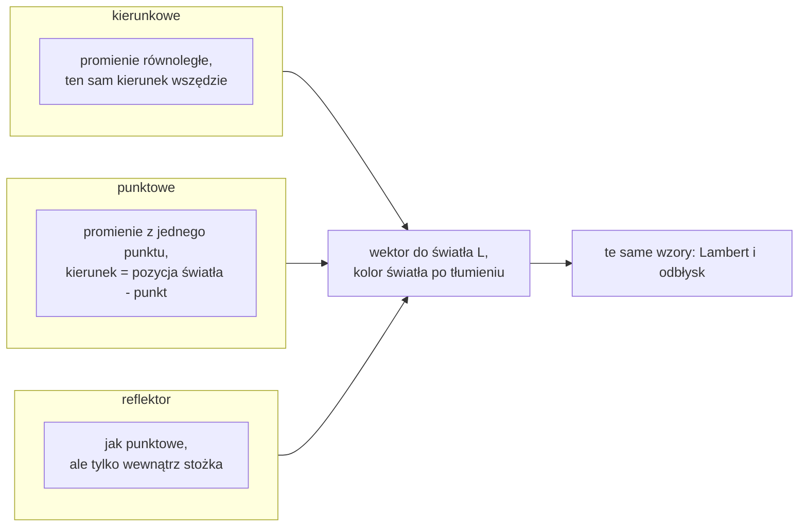
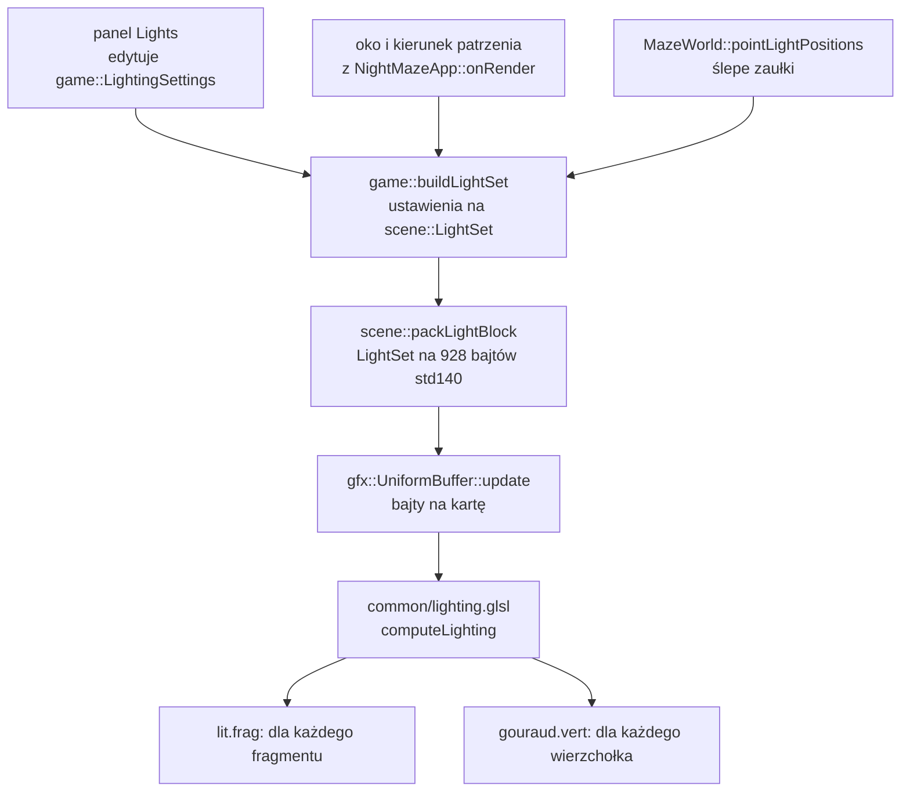

# Moduł scene: światła

Kamień milowy: M4 (część "oświetlenie", uzupełniony w części "mapy normalnych": sekcja 2.9). Temat wykładu: 6 (Światło kierunkowe i punktowe).
Kod: [`src/scene/Light.hpp`](../../../src/scene/Light.hpp), [`src/scene/Light.cpp`](../../../src/scene/Light.cpp), plik dołączany do shaderów [`assets/shaders/common/lighting.glsl`](../../../assets/shaders/common/lighting.glsl), panel [`src/debug/panels/LightsPanel.hpp`](../../../src/debug/panels/LightsPanel.hpp) i [`LightsPanel.cpp`](../../../src/debug/panels/LightsPanel.cpp), testy [`tests/LightTests.cpp`](../../../tests/LightTests.cpp).

Część modułu `scene`. Wstęp do modułu jest w [`README.md`](README.md). Ten dokument zakłada znajomość przekształceń ([`transforms.md`](transforms.md)), kamery ([`camera.md`](camera.md)), shaderów i uniformów ([`../gfx/shaders.md`](../gfx/shaders.md), [`../gfx/uniforms.md`](../gfx/uniforms.md)) oraz tekstur ([`../gfx/textures.md`](../gfx/textures.md)).

Oświetlenie jest rozłożone na sześć dokumentów. Każdy plik kodu jest omawiany linia po linii w jednym z nich:

| Dokument | Co omawia |
|---|---|
| ten | rodzaje świateł, model odbicia Phonga, tłumienie, stożek, macierz normalnych (teoria), struktury `scene::Light`, plik `common/lighting.glsl`, panel Lights |
| [`../renderer/lighting-gouraud-phong.md`](../renderer/lighting-gouraud-phong.md) | temat 7: gdzie liczone jest światło (wierzchołek albo fragment), Phong a Blinn-Phong, shadery `lit` i `gouraud`, przełącznik trybu |
| [`../game/flashlight.md`](../game/flashlight.md) | światła gry: `LightingSettings`, latarka i klawisz F, światła w ślepych zaułkach, `buildLightSet`, `LightRig` |
| [`../gfx/uniform-buffers.md`](../gfx/uniform-buffers.md) | jak światła trafiają do shadera: blok uniformów `LightBlock`, układ `std140`, `scene::LightBlockData`, `gfx::UniformBuffer` |
| [`../gfx/shader-includes.md`](../gfx/shader-includes.md) | jak działa linia `#include "common/lighting.glsl"` |
| [`../gfx/normal-mapping.md`](../gfx/normal-mapping.md) | skąd program `lit` bierze normalną fragmentu: mapy normalnych, przestrzeń styczna, macierz TBN, plik `common/normal_map.glsl` |

**Stan na dziś:** gra startuje jako scena nocna. Labirynt oświetlają trzy rodzaje świateł: księżyc (światło kierunkowe), latarka gracza (reflektor) i światła punktowe w ślepych zaułkach. Zmierzone na Windowsie 2026-10-05 (MSVC 19.44, RTX 4070 Ti SUPER, sterownik NVIDII 610.74): build Debug i Release bez ostrzeżeń, 163 przypadki testowe i 62220 asercji w obu konfiguracjach, start gry bez linii `[error]` i bez linii `GL_`. Na zrzutach ekranu sprawdzone: widok startowy, cztery tryby cieniowania z trzech miejsc, latarka wyłączona, ślepy zaułek ze swoim światłem, strony ścian oświetlone i nieoświetlone przez księżyc. **Żadnego widżetu panelu Lights nikt jeszcze nie kliknął ręcznie**, klawisz F też nie był naciskany. **Na macOS ten kod nie był ani budowany, ani uruchamiany.**

Czego w tym kamieniu nie ma: **cieni** (dojdą w M7, do tego czasu światło przechodzi przez ściany), **korekcji gamma i tekstur sRGB** (M7, notatka [`../../decisions/no-gamma-until-m7.md`](../../decisions/no-gamma-until-m7.md)) Mapy normalnych, które w pierwszej części M4 były na tej liście, są już w kodzie: normalną, którą dostają wzory z tego dokumentu, opisuje sekcja 2.9.

## 1. Po co to jest

Do M3 kolor piksela był kolorem tekstury pomnożonym przez kolor materiału. Scena była równo jasna: ściana na wprost i ściana w głębi korytarza wyglądały tak samo, a kształtu słupka nie dało się odczytać inaczej niż z rysunku tekstury. **Oświetlenie** odpowiada na pytanie: ile światła dociera do tego punktu powierzchni i ile z niego odbija się w stronę oka.

Potrzebne są do tego trzy rzeczy:

| Rzecz | Gdzie | Dokument |
|---|---|---|
| opis świateł jako danych: kierunek, pozycja, kolor, zasięg, stożek | struktury w `scene/Light.hpp` | ten, sekcja 5 |
| wzory, które z jednego światła i jednego punktu powierzchni robią jasność | funkcje w `common/lighting.glsl` | ten, sekcja 4 |
| normalna powierzchni w przestrzeni świata | atrybut `aNormal` razy macierz normalnych | ten (teoria, sekcja 2.7), kod w [`transforms.md`](transforms.md) |

Struktury w `scene/Light.hpp` to same dane i matematyka: plik nie dołącza GLAD i nie woła żadnej funkcji `gl*`, więc ma testy jednostkowe. Funkcje z `Light.cpp` (tłumienie, stożek) liczą to samo, co shader liczy dla każdego fragmentu. Shader nie woła kodu C++: istnieją po to, żeby przygotować dane dla shadera i żeby wzory dało się sprawdzić testem.

## 2. Teoria

### 2.1 Trzy rodzaje świateł

| Rodzaj | Ma pozycję | Ma kierunek | Słabnie z odległością | W grze |
|---|---|---|---|---|
| **kierunkowe** (directional light) | nie | tak, jeden dla całej sceny | nie | księżyc |
| **punktowe** (point light) | tak | nie, świeci we wszystkie strony | tak | światła w ślepych zaułkach |
| **reflektor** (spot light) | tak | tak, oś stożka | tak, i dodatkowo poza stożkiem jest zero | latarka |

**Światło kierunkowe** to źródło tak odległe, że jego promienie są równoległe. Księżyc jest 384 tysiące kilometrów od labiryntu o boku 20 m: kierunek do niego jest z każdego miejsca labiryntu praktycznie ten sam i odległość też. Dlatego takie światło nie ma pozycji i nie ma tłumienia.

**Światło punktowe** świeci z jednego punktu we wszystkie strony. Kierunek do światła jest inny dla każdego punktu powierzchni (trzeba go policzyć: pozycja światła minus pozycja punktu), a jasność spada z odległością.

**Reflektor** to światło punktowe, które świeci tylko w stożek. Dochodzi oś stożka i dwa kąty (sekcja 2.6).



Diagram pokazuje najważniejszą rzecz w budowie shadera: trzy rodzaje świateł różnią się tylko tym, **jak powstaje wektor do światła i ile światła dociera**. Dalej każde jest liczone tymi samymi wzorami. W kodzie to funkcja `addLight` (sekcja 4.5).

### 2.2 Model odbicia Phonga: trzy składniki

Prawdziwe światło odbija się wiele razy od wszystkiego dookoła. Liczenie tego w czasie rzeczywistym jest za drogie, więc klasyczny **model odbicia Phonga** (Phong reflection model) udaje je sumą trzech prostych składników:

| Składnik | Co udaje | Od czego zależy | W kodzie |
|---|---|---|---|
| **otoczenia** (ambient) | światło odbite wiele razy, które dociera wszędzie | od niczego: stała | `uAmbient` |
| **rozproszony** (diffuse) | matową powierzchnię, która odbija światło równo we wszystkie strony | od kąta między normalną a kierunkiem do światła | `diffuseFactor` |
| **zwierciadlany, odbłysk** (specular) | połysk: odbicie źródła światła | od kierunku do światła, normalnej **i kierunku do oka** | `specularFactor` |

Wektory, których używają wzory. Wszystkie mają długość 1 i **zaczynają się w punkcie powierzchni**:

| Symbol | Nazwa w shaderze | Znaczenie |
|---|---|---|
| `N` | `normal` | normalna: kierunek prostopadły do powierzchni |
| `L` | `toLight` | kierunek od punktu do światła |
| `V` | `toEye` | kierunek od punktu do oka (kamery) |
| `R` | `reflected` | promień światła odbity lustrzanie względem normalnej |
| `H` | `halfway` | wektor połówkowy: dokładnie między `L` i `V` |

Kolor fragmentu w shaderach projektu:

```text
kolor = kolor_powierzchni * (otoczenie + suma po światłach: światło * Lambert)
      + suma po światłach: światło * odbłysk
```

Dwie decyzje widać w tym wzorze:

- **Kolor powierzchni (tekstura razy kolor materiału) mnoży tylko część rozproszoną i otoczenia.** Czerwona ściana odbija czerwoną część światła. Odbłysk jest dodawany na wierzch **w kolorze światła**: połysk na kamieniu oświetlonym ciepłą latarką jest ciepły, a nie w kolorze kamienia.
- **Suma po światłach.** Światła się dodają. Wynik może przekroczyć 1: framebuffer obcina wtedy kolor do 1 (prześwietlenie). Panel Lights pozwala to wywołać celowo (sekcja 6).

Odbłysk ma dwa warianty wzoru, Phonga i Blinna-Phonga. Różnicę, geometrię i to, jak ją pokazać, omawia dokument tematu 7: [`../renderer/lighting-gouraud-phong.md`](../renderer/lighting-gouraud-phong.md). Tu wystarczy wiedzieć, że oba dają liczbę od 0 do 1, największą tam, gdzie odbicie światła trafia prosto w oko.

### 2.3 Prawo cosinusów Lamberta

Matowa powierzchnia jest najjaśniejsza, gdy stoi przodem do światła, i ciemnieje, gdy się od niego odwraca. Powód jest geometryczny: ta sama wiązka światła padająca ukośnie rozkłada się na większy kawałek powierzchni, więc na każdy jego fragment przypada mniej.

```text
   światło na wprost            światło pod kątem

      | | | |                      \ \ \ \
      v v v v                       \ \ \ \
   -------------                  -------------------
   wiązka o szerokości 1          ta sama wiązka pada
   pada na odcinek 1              na odcinek 1 / cos(kąt)
```

Jasność jest proporcjonalna do **cosinusa kąta między normalną a kierunkiem do światła**:

```text
Lambert = max(dot(N, L), 0)
```

- Dla dwóch wektorów o długości 1 iloczyn skalarny (dot product) **jest** cosinusem kąta między nimi. Dlatego wektory muszą być znormalizowane: inaczej wynik byłby pomnożony przez ich długości.
- Kąt 0 stopni: cosinus 1, pełna jasność. 60 stopni: 0,5. 90 stopni: 0, światło ślizga się po powierzchni.
- Powyżej 90 stopni cosinus jest ujemny: światło jest **za** powierzchnią. `max(..., 0)` zamienia to na "brak światła". Bez `max` ujemna wartość odejmowałaby światło pochodzące z innych źródeł.

Przykład na liczbach z gry. Światło księżyca przy ustawieniach startowych leci w kierunku około `(0,27, -0,77, -0,58)` (sekcja 5.5), więc `L = (-0,27, 0,77, 0,58)`:

| Powierzchnia | Normalna `N` | `dot(N, L)` | Wynik |
|---|---|---|---|
| podłoga | `(0, 1, 0)` | 0,77 | jasna |
| lico ściany zwrócone ku `+Z` | `(0, 0, 1)` | 0,58 | średnia |
| lico ściany zwrócone ku `-X` | `(-1, 0, 0)` | 0,27 | ciemna |
| lico ściany zwrócone ku `+X` | `(1, 0, 0)` | -0,27, po `max` 0 | tylko światło otoczenia |
| lico ściany zwrócone ku `-Z` | `(0, 0, -1)` | -0,58, po `max` 0 | tylko światło otoczenia |

Kąt obrotu księżyca (yaw 25 stopni) celowo nie jest wielokrotnością 45: ściany patrzą w cztery strony i dzięki temu każda z dwóch oświetlonych stron dostaje inną jasność. Widać to na zrzucie ekranu z Windowsa (strony oświetlone i nieoświetlone).

### 2.4 Odbłysk w skrócie

Odbłysk zależy od położenia oka: gdy idę wzdłuż ściany, jasna plama przesuwa się razem ze mną, a część rozproszona stoi w miejscu. Wzór podnosi cosinus pewnego kąta do potęgi:

```text
odbłysk = siła * max(cos, 0) ^ połysk
```

| Parametr | Uniform | Znaczenie |
|---|---|---|
| siła (strength) | `uSpecularStrength` | jak jasny jest odbłysk w porównaniu ze światłem, które go wywołuje. 0 wyłącza odbłysk |
| połysk (shininess) | `uShininess` | wykładnik. Większy daje mniejszą, ostrzejszą plamę: cosinus bliski 1 podniesiony do dużej potęgi zostaje bliski 1, a każdy mniejszy szybko spada do zera |

Kamień jest szorstki, więc wartości startowe to siła 0,25 i połysk 32. Który cosinus jest podnoszony do potęgi (Phong: `dot(R, V)`, Blinn-Phong: `dot(N, H)`), omawia dokument tematu 7.

### 2.5 Tłumienie: jak światło słabnie z odległością

Światło z punktu rozchodzi się po powierzchni kuli. Powierzchnia kuli rośnie z kwadratem promienia, więc fizycznie jasność spada jak `1 / d²`. Sam ten wzór jest niewygodny: przy `d` bliskim zera daje nieskończoność, a daleko nigdy nie dochodzi do zera. Grafika czasu rzeczywistego używa wzoru z trzema współczynnikami:

```text
tłumienie(d) = 1 / (constant + linear * d + quadratic * d * d)
```

| Współczynnik | Rola |
|---|---|
| `constant` | część niezależna od odległości. Z wartością 1 światło ma w odległości 0 pełną jasność i nigdy nie jest jaśniejsze |
| `linear` | część rosnąca z odległością: szybki spadek blisko źródła |
| `quadratic` | część rosnąca z kwadratem odległości: ta fizyczna, sprowadza światło w dół daleko od źródła |

**Tłumienie z promienia.** Trzy współczynniki trudno dobrać ręcznie. Wygodniej powiedzieć "to światło ma sięgać 3 metry". Funkcja `scene::attenuationForRadius` liczy współczynniki z promienia `r`:

```text
constant = 1        linear = 2 / r        quadratic = 17 / r²
```

W odległości `d = r` mianownik wynosi `1 + 2 + 17 = 20`, więc zostaje `1 / 20`, czyli **5 procent** jasności, niezależnie od promienia. Krzywa ma dla każdego promienia ten sam kształt, tylko rozciągnięty:

| Odległość | Mianownik | Zostaje | Dla światła punktowego (`r` = 3 m) | Dla latarki (`r` = 16 m) |
|---|---|---|---|---|
| 0 | 1 | 100 % | 0 m | 0 m |
| ćwierć promienia | 1 + 0,5 + 1,0625 | 39 % | 0,75 m | 4 m |
| pół promienia | 1 + 1 + 4,25 | 16 % | 1,5 m | 8 m |
| trzy czwarte | 1 + 1,5 + 9,5625 | 8,3 % | 2,25 m | 12 m |
| promień | 1 + 2 + 17 | 5 % | 3 m | 16 m |
| półtora promienia | 1 + 3 + 38,25 | 2,4 % | 4,5 m | 24 m |
| dwa promienie | 1 + 4 + 68 | 1,4 % | 6 m | 32 m |

Dla `r = 3` współczynniki to `linear = 0,667` i `quadratic = 1,889`, dla `r = 16` to `0,125` i `0,0664`.

Dwie uwagi do tabeli:

- **Światło nigdy nie dochodzi do zera.** `1 / (coś)` jest zawsze dodatnie. Za promieniem światło nadal jest, tylko za słabe, żeby je zobaczyć. "Promień" to umowa: miejsce, w którym zostaje 5 procent.
- **Promień 3 m to półtorej komórki** labiryntu (komórka ma 2 m). Tyle PRD przewiduje dla kryształów, których miejsce zajmują dziś światła w zaułkach.

Światło kierunkowe nie ma tłumienia: w shaderze nie jest dla niego w ogóle liczone.

### 2.6 Stożek reflektora i dlaczego porównuje się cosinusy

Reflektor ma oś (kierunek, w którym świeci) i dwa kąty, oba mierzone **od osi do boku stożka**, czyli połówki pełnego kąta rozwarcia:

```text
                      oś stożka
        latarka  o-----------------------------------------> 
                  \ `-.                    stożek wewnętrzny (13 stopni):
                   \   `-.                 pełna jasność
                    \     `-._
                     \        `-._         między stożkami:
                      \           `-._     jasność spada do zera (miękki brzeg)
                       \              
                        \                  poza stożkiem zewnętrznym (21 stopni):
                                           zero
```

Dla punktu powierzchni liczy się kąt między osią a promieniem od latarki do tego punktu. Wewnątrz stożka wewnętrznego czynnik wynosi 1, poza zewnętrznym 0, a pomiędzy zmienia się płynnie. Gdyby był jeden kąt, plama miałaby ostrą krawędź jak wycięta nożyczkami.

**Dlaczego cosinusy.** Shader ma dwa wektory o długości 1: oś stożka i kierunek od światła do punktu. Ich iloczyn skalarny to cosinus kąta między nimi i kosztuje trzy mnożenia. Żeby dostać sam kąt, trzeba by wołać `acos` dla każdego fragmentu i każdego reflektora. Zamiast tego **kąty stożka zamienia się na cosinusy raz, w C++**, a shader porównuje cosinus z cosinusem.

Trzeba tylko pamiętać, że cosinus **maleje**, gdy kąt rośnie:

| Kąt | Cosinus |
|---|---|
| 0 stopni (na osi) | 1 |
| 13 stopni (stożek wewnętrzny latarki) | 0,974 |
| 21 stopni (stożek zewnętrzny latarki) | 0,934 |
| 90 stopni (w bok) | 0 |

Stożek wewnętrzny ma więc **większy** cosinus niż zewnętrzny, a "wewnątrz stożka" znaczy "cosinus większy od progu". Wzór miękkiego brzegu:

```text
czynnik = clamp((cosKąta - cosZewnętrzny) / (cosWewnętrzny - cosZewnętrzny), 0, 1)
```

Licznik mówi, jak daleko cosinus jest od progu zewnętrznego, mianownik to szerokość pasa przejścia. Na progu zewnętrznym wychodzi 0, na wewnętrznym 1, a `clamp` przycina wszystko poza pasem. Przejście jest liniowe **w cosinusie**, nie w kącie: dla wąskiego pasa różnicy nie widać.

Mianownik nie może być zerem. Gdy oba kąty są równe (stożek o ostrej krawędzi), `scene::coneCosines` ustawia cosinus wewnętrzny o `MIN_CONE_COSINE_GAP` (0,001) powyżej zewnętrznego (sekcja 5.4).

Jak duża jest plama latarki? Promień koła światła w odległości `d` to `d * tan(kąt)`: dla kątów startowych `0,23 * d` (stożek wewnętrzny) i `0,38 * d` (zewnętrzny). Na ścianie odległej o 2 m pełna jasność ma promień 0,46 m, a cała plama 0,77 m. Te liczby wracają w dokumencie tematu 7 przy pytaniu, dlaczego cieniowanie Gourauda gubi plamę latarki.

### 2.7 Macierz normalnych i dlaczego odwrotna transponowana

Normalna z pliku modelu jest w przestrzeni lokalnej. Światła i kamera są w przestrzeni świata, więc normalną też trzeba tam przenieść. Pozycję przenosi macierz modelu. Normalnej **nie wolno** mnożyć tą samą macierzą z dwóch powodów.

**Powód pierwszy: przesunięcie.** Normalna jest kierunkiem, a nie punktem. Przesunięcie obiektu o 10 m nie zmienia tego, w którą stronę patrzy jego ściana. Bierze się więc tylko lewą górną część 3 na 3 macierzy modelu (obrót i skala, bez czwartej kolumny z przesunięciem).

**Powód drugi: nierówna skala.** Część 3 na 3 jest poprawna, dopóki skala jest taka sama na wszystkich osiach. Przy nierównej skali normalna przestaje być prostopadła do powierzchni:

```text
   przed skalowaniem                 po rozciągnięciu 4 razy wzdłuż X

        N  ^                           tą samą macierzą:     właściwa normalna:
        \  |                            N' leży prawie         stoi na powierzchni
         \ | /  powierzchnia            na powierzchni
          \|/   (skos 45 stopni)       <------.                    ^
   --------+--------                           `--._____           |   ____---
                                        powierzchnia teraz        _|---
                                        jest prawie płaska      --
```

Rozciągnięcie obiektu wzdłuż osi X **kładzie** skośną powierzchnię (staje się bardziej pozioma). Jej normalna powinna się więc **podnieść**. Tymczasem ta sama macierz rozciąga normalną wzdłuż X, czyli też ją kładzie, w złą stronę.

**Wyprowadzenie.** Niech `M` będzie częścią 3 na 3 macierzy modelu, `t` dowolnym wektorem stycznym do powierzchni (leżącym w niej), a `n` normalną: `dot(n, t) = 0`. Styczna przekształca się jak pozycje: `t' = M t`. Szukam macierzy `G` dla normalnej, takiej że po przekształceniu nadal jest prostopadła:

```text
dot(G n, M t) = 0
(G n)^T (M t) = n^T (G^T M) t = 0      dla każdej stycznej t
```

To jest spełnione, gdy `G^T M` jest macierzą jednostkową, bo wtedy zostaje `n^T t`, czyli zero. Stąd:

```text
G^T = M^-1        czyli        G = (M^-1)^T
```

Macierz normalnych to **odwrotność części 3 na 3 macierzy modelu, transponowana** (inverse transpose).

Co z tego wynika:

- **Dla samego obrotu nic się nie zmienia.** Macierz obrotu jest ortogonalna: jej odwrotność jest jej transpozycją, więc odwrotna transponowana to ona sama.
- **Dla równej skali `s`** wychodzi obrót pomnożony przez `1 / s`: kierunek dobry, długość nie. Dlatego shader normalizuje wynik.
- **Dla nierównej skali** tylko ta macierz daje normalną prostopadłą.
- Macierz modelu musi być odwracalna: skala równa 0 na którejś osi nie ma odwrotności.

**W projekcie:** liczy ją funkcja `scene::normalMatrix` na procesorze, raz na obiekt, i wysyła jako uniform `uNormalMatrix`. Kod i cztery testy omawia [`transforms.md`](transforms.md), miejsce wywołania [`../game/maze-rendering.md`](../game/maze-rendering.md). Uczciwie: **dziś żaden obiekt labiryntu nie jest skalowany** (ściany są tylko przesunięte i obrócone o 90 stopni), więc macierz normalnych jest równa samej części obrotowej i obraz byłby taki sam z `mat3(uModel)`. Wzór jest pełny, żeby pierwszy rozciągnięty obiekt nie dostał po cichu złego światła. Poprawność przy nierównej skali sprawdza test jednostkowy, a nie obraz.

Dlaczego na procesorze, a nie `transpose(inverse(mat3(uModel)))` w shaderze: shader wierzchołków liczyłby odwrotność od nowa dla każdego wierzchołka, a wynik jest ten sam dla całego obiektu.

### 2.8 Czego jeszcze nie ma: cienie i gamma

**Cienie.** Wzory z tej sekcji pytają tylko o kąt i odległość. Nie pytają, czy między światłem a punktem coś stoi. Światło punktowe z zaułka rozjaśnia więc także podłogę korytarza **za ścianą**, a księżyc oświetla podłogę u stóp ściany, która powinna ją zasłaniać. To nie błąd shadera, tylko brak osobnej techniki (mapy cieni), która jest tematem 9 i dojdzie w M7. Na obronie mówię to wprost.

**Gamma.** Tekstury są czytane tak, jak leżą w pliku, a wynik jest zapisywany bez korekcji. Rachunek światła odbywa się więc na liczbach, które nie są proporcjonalne do jasności. Uzasadnienie i skutki są w notatce [`../../decisions/no-gamma-until-m7.md`](../../decisions/no-gamma-until-m7.md).

### 2.9 Która normalna trafia do wzorów: siatka albo mapa normalnych

Wszystkie wzory tej sekcji biorą normalną `N` jako daną. Funkcja `computeLighting(vec3 position, vec3 normal)` nie wie, skąd wołający ją wziął, i to jest celowe: źródło normalnej można wymienić bez dotykania wzorów. W projekcie są trzy przypadki:

| Program | Skąd normalna | Ile różnych normalnych na licu ściany |
|---|---|---|
| `gouraud` | atrybut `aNormal` razy macierz normalnych, znormalizowany w shaderze wierzchołków | jedna (cztery wierzchołki lica mają tę samą) |
| `lit`, mapowanie normalnych wyłączone | ta sama normalna, interpolowana i znormalizowana w shaderze fragmentów | jedna |
| `lit`, mapowanie normalnych włączone (stan startowy) | **mapa normalnych** (normal map): tekstura, której każdy teksel przechowuje kierunek normalnej w przestrzeni stycznej. Shader przenosi go do przestrzeni świata macierzą TBN | inna dla każdego teksela |

W `lit.frag` jest to jedna linia: `vec3 normal = surfaceNormal(vNormal, vTangent, vUv);`. Funkcja `surfaceNormal` leży w osobnym pliku dołączanym `common/normal_map.glsl` i zwraca normalną w przestrzeni świata, o długości 1, czyli dokładnie to, czego `computeLighting` wymaga. Dzięki mapie płaskie lico ściany dostaje pod światłem fugi i nierówności: geometria się nie zmienia, zmienia się tylko `dot(N, L)` w każdym fragmencie. Całą technikę (kodowanie, przestrzeń styczna, wyliczanie stycznych, macierz TBN linia po linii) omawia [`../gfx/normal-mapping.md`](../gfx/normal-mapping.md).

**Gouraud nie ma mapowania normalnych.** Mapa normalnych przechowuje jedną normalną na teksel, a `gouraud.vert` liczy światło w wierzchołkach, 4 na lico ściany: teksel leżący między nimi nie ma jak wziąć udziału w obliczeniach. Komentarz w `gouraud.vert` mówi to wprost ([`../renderer/lighting-gouraud-phong.md`](../renderer/lighting-gouraud-phong.md), sekcje 2.7 i 4.3). Regułę "włączone i tryb inny niż `Gouraud`" zapisuje funkcja `game::usesNormalMap` ([`../game/flashlight.md`](../game/flashlight.md), sekcja 5.2).

**Podgląd `Normals as colour`** z panelu Assets pokazuje normalną faktycznie użytą: z map normalnych w trybach `Unlit`, `Phong` i `Blinn-Phong` przy zaznaczonym polu `Normal mapping`, a normalną siatki w trybie `Gouraud` albo przy polu odznaczonym.

## 3. Jak to działa w OpenGL

OpenGL w profilu Core **nie ma świateł**. Stare funkcje `glLight` i `glMaterial` należały do potoku stałego i w profilu Core nie istnieją. Światło to dziś zwykłe dane, które program sam wysyła do własnych shaderów, i zwykła arytmetyka w GLSL.

| Co | Jak trafia do shadera | Wywołania | Ile razy na klatkę |
|---|---|---|---|
| wszystkie światła i pozycja oka | jeden blok uniformów `LightBlock`, 928 bajtów | `glBindBuffer`, `glBufferSubData` (w `gfx::UniformBuffer::update`) | 1 |
| model odbłysku, siła, połysk | zwykłe uniformy `uSpecularModel`, `uSpecularStrength`, `uShininess` | `glUniform1i`, `glUniform1f` | po 1, w programie, który rysuje labirynt |
| macierz normalnych | zwykły uniform `uNormalMatrix` | `glUniformMatrix3fv` | raz na obiekt |
| normalna wierzchołka | atrybut numer 1 w `gfx::Vertex` | ustawione raz w VAO siatki | 0 |
| styczna wierzchołka (tylko dla mapowania normalnych) | atrybut numer 3 w `gfx::Vertex` | ustawione raz w VAO siatki | 0 |
| mapa normalnych i jej przełącznik (tylko program `lit`) | tekstura na jednostce 1, uniformy `uNormalMap` i `uNormalMapEnabled` | `glActiveTexture`, `glBindTexture`, `glBindSampler`, `glUniform1i` | raz na część modelu i po 1 ([`../gfx/normal-mapping.md`](../gfx/normal-mapping.md), sekcja 3) |

Blok uniformów czytają oba programy oświetlenia (`lit` i `gouraud`) z tego samego bufora na karcie. Dlaczego blok, a nie 60 osobnych uniformów, i jak bajty z C++ trafiają dokładnie tam, gdzie shader ich szuka, omawia [`../gfx/uniform-buffers.md`](../gfx/uniform-buffers.md).

Wszystkie obliczenia światła są w **przestrzeni świata**: pozycje świateł, pozycja oka, pozycja fragmentu i normalna (także ta z mapy normalnych: `surfaceNormal` przenosi ją z przestrzeni stycznej do świata, zanim trafi do wzorów). Drugą częstą konwencją jest przestrzeń widoku (oko w punkcie zero). Wybrałem świat, bo światła gry są zdefiniowane w świecie (komórki labiryntu) i nie trzeba ich co klatkę mnożyć przez macierz widoku.

## 4. Shadery

Wzory z sekcji 2 są w jednym pliku: [`assets/shaders/common/lighting.glsl`](../../../assets/shaders/common/lighting.glsl). **To nie jest samodzielny shader.** Nie ma linii `#version` ani funkcji `main`. Loader shaderów wstawia jego tekst w miejsce linii `#include "common/lighting.glsl"` w dwóch plikach: `lit.frag` (światło liczone dla każdego fragmentu) i `gouraud.vert` (dla każdego wierzchołka). Jeden plik, dwa miejsca użycia: oba tryby liczą dokładnie tymi samymi wzorami, a różni je tylko miejsce wywołania. Mechanizm dołączania: [`../gfx/shader-includes.md`](../gfx/shader-includes.md). Shadery, które ten plik dołączają: [`../renderer/lighting-gouraud-phong.md`](../renderer/lighting-gouraud-phong.md).

### 4.1 Stała i struktura światła punktowego

```glsl
// Length of the array of point lights. The same number as scene::MAX_POINT_LIGHTS in
// src/scene/Light.hpp.
const int MAX_POINT_LIGHTS = 16;

// One point light. vec4 everywhere, so that every member is 16 bytes and the C++ struct
// scene::PointLightData has the same layout without any hidden gaps.
struct PointLight {
    vec4 position;    // xyz: position in world space
    vec4 color;       // rgb: colour, a: intensity
    vec4 attenuation; // x: constant, y: linear, z: quadratic term
};
```

| Linia | Znaczenie |
|---|---|
| `const int MAX_POINT_LIGHTS = 16;` | stała czasu kompilacji GLSL: długość tablicy świateł. Ta sama liczba jest w C++ (`scene::MAX_POINT_LIGHTS`). Zgodności obu pilnuje pośrednio sprawdzenie rozmiaru bloku (pułapka 6) |
| `struct PointLight` | struktura GLSL: trzy `vec4`. Pozycja i kolor potrzebują trzech liczb, czwarta niesie dodatek (intensywność w `color.a`) albo nic. Powód użycia `vec4` zamiast `vec3` to układ `std140` ([`../gfx/uniform-buffers.md`](../gfx/uniform-buffers.md)) |
| `.rgb`, `.a`, `.xyz` | GLSL pozwala czytać składowe wektora pod nazwami `xyzw` albo `rgba`. To te same cztery liczby: `color.a` i `color.w` to to samo |

### 4.2 Blok świateł i uniformy materiału

```glsl
layout(std140) uniform LightBlock {
    vec4 uCameraPosition;       // xyz: the eye in world space
    vec4 uAmbient;              // rgb: light that reaches every surface
    vec4 uDirectionalDirection; // xyz: the way the moon light travels, length 1
    vec4 uDirectionalColor;     // rgb: colour, a: intensity
    vec4 uSpotPosition;         // xyz: the flashlight in world space
    vec4 uSpotDirection;        // xyz: the axis of its cone, length 1
    vec4 uSpotColor;            // rgb: colour, a: intensity
    vec4 uSpotAttenuation;      // x: constant, y: linear, z: quadratic term
    vec4 uSpotCone;             // x: cos(inner angle), y: cos(outer angle), z: 1 on, 0 off
    int uPointCount;            // how many elements of uPoints are in use
    PointLight uPoints[MAX_POINT_LIGHTS];
};
```

Blok uniformów (uniform block) to grupa uniformów, których wartości nie są ustawiane pojedynczo przez `glUniform`, tylko czytane z bufora na karcie. Składowych używa się w shaderze jak zwykłych uniformów, bez przedrostka: `uAmbient`, a nie `LightBlock.uAmbient`. Pełna tabela przesunięć i kod wypełniający blok są w [`../gfx/uniform-buffers.md`](../gfx/uniform-buffers.md). Tu ważne jest znaczenie pól:

| Składowa | Co niesie | Kto to liczy w C++ |
|---|---|---|
| `uCameraPosition.xyz` | oko w przestrzeni świata: potrzebne do odbłysku | interpolowana pozycja oka z `NightMazeApp::onRender` |
| `uAmbient.rgb` | światło otoczenia | `LightingSettings::ambient` |
| `uDirectionalDirection.xyz` | kierunek, w którym światło księżyca **leci**, długość 1 | `directionFromAngles`, znormalizowane w `packLightBlock` |
| `uDirectionalColor` | `rgb`: kolor, `a`: intensywność | ustawienia księżyca |
| `uSpotPosition.xyz`, `uSpotDirection.xyz` | latarka: wierzchołek stożka i jego oś, długość 1 | oko i `Camera::forward()` |
| `uSpotColor`, `uSpotAttenuation` | kolor z intensywnością, trzy współczynniki tłumienia | ustawienia latarki, `attenuationForRadius` |
| `uSpotCone` | `x`: cosinus kąta wewnętrznego, `y`: zewnętrznego, `z`: 1 włączona, 0 wyłączona | `coneCosines`, przełącznik latarki |
| `uPointCount` | ile elementów `uPoints` jest w użyciu | liczba ślepych zaułków, najwyżej 16 |
| `uPoints[i]` | pozycja, kolor z intensywnością, tłumienie jednego światła punktowego | `buildLightSet` |

Kierunki są normalizowane **w C++**, więc shader nie woła dla nich `normalize`. Przełącznik latarki to liczba `float` (1 albo 0), a nie `bool`: powód jest w dokumencie o buforach uniformów.

```glsl
uniform int uSpecularModel;
// How bright the highlight is compared with the light that makes it (0: no highlight).
uniform float uSpecularStrength;
// The exponent of the highlight: a larger number gives a smaller, sharper highlight.
uniform float uShininess;
```

Te trzy to **zwykłe uniformy**, poza blokiem: opisują materiał i sposób liczenia, a nie światła. Ustawia je `NightMazeApp::drawLitMaze` przez `setInt` i `setFloat` po `use()` właściwego programu. `uSpecularModel` ma wartości typu `game::SpecularModel`: 0 to Phong, 1 to Blinn-Phong.

### 4.3 Struktura wyniku

```glsl
struct Lighting {
    vec3 diffuse;  // ambient light plus the Lambert term of every light
    vec3 specular; // the highlight of every light
};
```

Wynik ma dwie części, bo są używane inaczej (sekcja 2.2): `diffuse` jest mnożone przez kolor powierzchni, `specular` dodawane na wierzch. Gdyby funkcja zwracała jedną sumę, shader nie mógłby już pomnożyć przez teksturę tylko jednej z nich. Światło otoczenia jest wliczone w `diffuse`.

### 4.4 `diffuseFactor`, `specularFactor`, `attenuationFactor`

```glsl
float diffuseFactor(vec3 normal, vec3 toLight) {
    return max(dot(normal, toLight), 0.0);
}
```

Prawo Lamberta z sekcji 2.3 w jednej linii. Oba argumenty muszą mieć długość 1.

```glsl
float specularFactor(vec3 normal, vec3 toLight, vec3 toEye) {
    // A surface that faces away from the light has no highlight either.
    if (dot(normal, toLight) <= 0.0) {
        return 0.0;
    }

    float cosine = 0.0;
    if (uSpecularModel == 0) {
        // Phong: reflect() mirrors the incoming ray (from the light to the surface,
        // hence the minus) at the normal. The highlight is strongest where the
        // mirrored ray goes straight into the eye.
        vec3 reflected = reflect(-toLight, normal);
        cosine = dot(reflected, toEye);
    } else {
        // Blinn-Phong: the halfway vector points exactly between the light and the
        // eye. The highlight is strongest where the normal points along it. The angle
        // measured here is about half of the Phong one, so with the same exponent the
        // highlight is wider, and it does not cut off when the light and the eye are
        // far apart (Phong: more than 90 degrees between reflected and toEye gives 0).
        vec3 halfway = normalize(toLight + toEye);
        cosine = dot(normal, halfway);
    }
    // max() before pow(): the power of a negative number is not defined in GLSL.
    return uSpecularStrength * pow(max(cosine, 0.0), uShininess);
}
```

| Linia | Znaczenie |
|---|---|
| `if (dot(normal, toLight) <= 0.0) return 0.0;` | powierzchnia odwrócona od światła nie ma odbłysku. Bez tej linii wzór Blinna-Phonga potrafi dać odbłysk na stronie, do której światło nie dociera: wektor połówkowy zależy od oka i może być bliski normalnej, chociaż światło jest za powierzchnią |
| `reflect(-toLight, normal)` | funkcja wbudowana GLSL: odbija wektor **padający** względem normalnej. `toLight` wskazuje od powierzchni do światła, a promień padający leci odwrotnie, stąd minus. Wynik wskazuje od powierzchni, w stronę lustrzanego odbicia |
| `cosine = dot(reflected, toEye);` | Phong: cosinus kąta między odbitym promieniem a kierunkiem do oka |
| `normalize(toLight + toEye)` | suma dwóch wektorów o długości 1 wskazuje dokładnie między nimi, ale ma inną długość, więc trzeba ją znormalizować |
| `cosine = dot(normal, halfway);` | Blinn-Phong: cosinus kąta między normalną a wektorem połówkowym |
| `pow(max(cosine, 0.0), uShininess)` | potęga z sekcji 2.4. `max` przed `pow`: wynik `pow(x, y)` dla ujemnego `x` jest w GLSL niezdefiniowany |
| `uSpecularStrength * ...` | siła odbłysku z panelu |

Geometrię obu wzorów i porównanie na liczbach omawia [`../renderer/lighting-gouraud-phong.md`](../renderer/lighting-gouraud-phong.md).

```glsl
float attenuationFactor(vec4 terms, float lightDistance) {
    return 1.0 / (terms.x + terms.y * lightDistance + terms.z * lightDistance * lightDistance);
}
```

Wzór z sekcji 2.5. `terms.x`, `.y`, `.z` to `constant`, `linear`, `quadratic`. Ten sam wzór ma w C++ `scene::attenuationFactor` (sekcja 5.3) i to jego sprawdzają testy.

### 4.5 `addLight`: jedno światło do wyniku

```glsl
void addLight(inout Lighting lighting, vec3 normal, vec3 toLight, vec3 toEye, vec3 radiance) {
    lighting.diffuse += radiance * diffuseFactor(normal, toLight);
    lighting.specular += radiance * specularFactor(normal, toLight, toEye);
}
```

| Element | Znaczenie |
|---|---|
| `inout Lighting lighting` | GLSL nie ma referencji ani wskaźników. Kwalifikator `inout` znaczy: wartość jest kopiowana do funkcji przy wejściu i z powrotem przy wyjściu, więc funkcja może dopisać do przekazanej struktury |
| `radiance` | kolor światła **takiego, jakie dociera do punktu**: kolor razy intensywność, już po tłumieniu i po stożku. Dzięki temu `addLight` nie wie, z jakiego rodzaju światła pochodzi |
| dwie linie | część rozproszona i odbłysk tego samego światła, obie w jego kolorze |

To jest miejsce z diagramu w sekcji 2.1: trzy rodzaje świateł schodzą się do jednej funkcji.

### 4.6 `computeLighting`: wszystkie światła dla jednego punktu

```glsl
Lighting computeLighting(vec3 position, vec3 normal) {
    vec3 toEye = normalize(uCameraPosition.xyz - position);

    Lighting lighting;
    lighting.diffuse = uAmbient.rgb;
    lighting.specular = vec3(0.0);
```

`position` i `normal` są w przestrzeni świata, `normal` ma długość 1 (dba o to wołający: `gouraud.vert` przez `normalize`, `lit.frag` przez funkcję `surfaceNormal`, która zwraca normalną siatki albo normalną z mapy normalnych, sekcja 2.9). `toEye` to wektor `V`: od punktu do oka. Suma zaczyna od światła otoczenia i zerowego odbłysku.

```glsl
    addLight(lighting, normal, -uDirectionalDirection.xyz, toEye,
             uDirectionalColor.rgb * uDirectionalColor.a);
```

**Księżyc.** `uDirectionalDirection` to kierunek, w którym światło leci, więc kierunek **do** światła jest przeciwny: minus. Nie ma pozycji, nie ma odległości, nie ma tłumienia: `radiance` to kolor razy intensywność. Księżyca nie da się wyłączyć przełącznikiem: wyłącza go intensywność 0.

```glsl
    for (int i = 0; i < MAX_POINT_LIGHTS; ++i) {
        if (i >= uPointCount) {
            break;
        }
        vec3 offset = uPoints[i].position.xyz - position;
        float lightDistance = length(offset);
        vec3 radiance = uPoints[i].color.rgb * uPoints[i].color.a *
                        attenuationFactor(uPoints[i].attenuation, lightDistance);
        addLight(lighting, normal, offset / lightDistance, toEye, radiance);
    }
```

**Światła punktowe.**

| Linia | Znaczenie |
|---|---|
| `for (int i = 0; i < MAX_POINT_LIGHTS; ++i)` i `if (i >= uPointCount) break;` | pętla ma stałą górną granicę i wychodzi wcześniej. Komentarz w pliku mówi dokładnie, skąd ta forma: **GLSL 4.10 tego nie wymaga** ("GLSL 4.10 does not require that (the rule comes from GLSL ES 1.00), but a constant limit with an early exit is the form every compiler accepts") i `i < uPointCount` byłoby tu poprawne. Wymóg pętli o długości znanej przy kompilacji ma GLSL ES 1.00 (stare urządzenia mobilne i WebGL 1). Forma ze stałą granicą i wcześniejszym wyjściem jest tą, którą przyjmie każdy kompilator, i ma jeszcze jedną zaletę: pętla nigdy nie wyjdzie poza tablicę, nawet gdyby w `uPointCount` znalazły się śmieci |
| `offset = pozycja światła - position` | wektor od punktu do światła, jeszcze nie znormalizowany |
| `lightDistance = length(offset)` | jego długość: odległość do światła w metrach |
| `radiance = kolor * intensywność * tłumienie` | światło, które dociera na tę odległość |
| `offset / lightDistance` | to samo co `normalize(offset)`, ale długość jest już policzona, więc dzielenie jest tańsze |

```glsl
    if (uSpotCone.z > 0.5) {
        vec3 offset = uSpotPosition.xyz - position;
        float lightDistance = length(offset);
        vec3 toLight = offset / lightDistance;

        // The cosine of the angle between the axis of the cone and the ray from the
        // light to this point. 1 on the axis, smaller towards the side.
        float cosAngle = dot(-toLight, uSpotDirection.xyz);
        // 1 inside the inner cone, 0 outside the outer one, a ramp in between: the soft
        // edge. The same formula as scene::spotFactor. The C++ code makes sure that the
        // two cosines differ, so this never divides by zero.
        float cone = clamp((cosAngle - uSpotCone.y) / (uSpotCone.x - uSpotCone.y), 0.0, 1.0);

        vec3 radiance = uSpotColor.rgb * uSpotColor.a * cone *
                        attenuationFactor(uSpotAttenuation, lightDistance);
        addLight(lighting, normal, toLight, toEye, radiance);
    }

    return lighting;
}
```

**Latarka.**

| Linia | Znaczenie |
|---|---|
| `if (uSpotCone.z > 0.5)` | przełącznik: 1 włączona, 0 wyłączona. Porównanie z 0,5, a nie `== 1.0`: liczb zmiennoprzecinkowych nie porównuje się na równość |
| `offset`, `lightDistance`, `toLight` | jak dla światła punktowego |
| `dot(-toLight, uSpotDirection.xyz)` | `toLight` wskazuje od punktu do latarki. Oś stożka wskazuje od latarki w scenę. Żeby zmierzyć kąt między osią a promieniem **od latarki do punktu**, trzeba `toLight` odwrócić: stąd minus |
| `cone = clamp(...)` | miękki brzeg z sekcji 2.6. `uSpotCone.x` to cosinus wewnętrzny, `.y` zewnętrzny |
| `radiance = kolor * intensywność * cone * tłumienie` | dwa osłabienia naraz: stożek i odległość |

Poza stożkiem `cone` wynosi 0, więc `radiance` jest zerem i `addLight` niczego nie dodaje. Shader nie pomija wtedy obliczeń: liczy i mnoży przez zero.

**Bez cieni.** Funkcja nie sprawdza, czy coś stoi między światłem a punktem (sekcja 2.8).

## 5. Kod w projekcie

### 5.1 Pliki

| Plik | Co zawiera |
|---|---|
| [`src/scene/Light.hpp`](../../../src/scene/Light.hpp) | struktury `Attenuation`, `DirectionalLight`, `PointLight`, `SpotLight`, `LightSet`, `ConeCosines`, stałe `MAX_POINT_LIGHTS`, `BRIGHTNESS_AT_RADIUS`, `MIN_CONE_COSINE_GAP`, deklaracje pięciu funkcji |
| [`src/scene/Light.cpp`](../../../src/scene/Light.cpp) | `attenuationForRadius`, `attenuationFactor`, `coneCosines`, `spotFactor`, `directionFromAngles` |
| [`assets/shaders/common/lighting.glsl`](../../../assets/shaders/common/lighting.glsl) | blok świateł i wzory po stronie karty (sekcja 4) |
| [`src/debug/panels/LightsPanel.hpp`](../../../src/debug/panels/LightsPanel.hpp), [`.cpp`](../../../src/debug/panels/LightsPanel.cpp) | panel Lights (sekcja 6) |
| [`tests/LightTests.cpp`](../../../tests/LightTests.cpp) | 20 przypadków testowych (sekcja 5.6) |
| [`src/scene/LightBlock.hpp`](../../../src/scene/LightBlock.hpp), [`.cpp`](../../../src/scene/LightBlock.cpp) | zamiana `LightSet` na bajty bloku: omawia [`../gfx/uniform-buffers.md`](../gfx/uniform-buffers.md) |
| [`src/game/Lighting.hpp`](../../../src/game/Lighting.hpp), [`.cpp`](../../../src/game/Lighting.cpp) | ustawienia świateł gry i budowanie `LightSet` co klatkę: omawia [`../game/flashlight.md`](../game/flashlight.md) |

Droga danych od suwaka do piksela:



Ten dokument omawia pierwsze i przedostatnie pudełko oraz struktury, które płyną między nimi.

### 5.2 Struktury świateł

```cpp
constexpr int MAX_POINT_LIGHTS = 16;

struct Attenuation {
    float constant = 1.0F;
    float linear = 0.0F;
    float quadratic = 0.0F;
};
```

(Komentarze z pliku są tu pominięte, żeby fragment był krótki: w pliku każde pole ma opis.)

Domyślne `Attenuation` to mianownik równy 1: światło bez tłumienia. `MAX_POINT_LIGHTS` to długość tablicy w `LightSet` i w shaderze. PRD (sekcja "Model oświetlenia") przewiduje dokładnie taki zestaw: jedno światło kierunkowe, do 16 punktowych, jeden reflektor.

```cpp
struct DirectionalLight {
    /// The direction the light TRAVELS in, from the light towards the scene, in world
    /// space. (0, -1, 0) shines straight down. It does not have to be of length 1.
    glm::vec3 direction{0.0F, -1.0F, 0.0F};
    /// Red, green, blue, each from 0 to 1.
    glm::vec3 color{1.0F};
    /// The colour is multiplied by this. 0 switches the light off.
    float intensity = 1.0F;
};
```

**Najważniejsza umowa w tym pliku:** `direction` to kierunek, w którym światło **leci** (od źródła w scenę), a nie kierunek do źródła. Wzory potrzebują kierunku do światła, więc shader go odwraca (`-uDirectionalDirection`). Pomylenie tych dwóch konwencji oświetla złe strony ścian (pułapka 1). Kolor i intensywność są osobno: intensywność zmienia jasność bez ruszania barwy i jest wygodna jako jeden suwak.

```cpp
struct PointLight {
    /// Position in world space.
    glm::vec3 position{0.0F};
    glm::vec3 color{1.0F};
    float intensity = 1.0F;
    Attenuation attenuation;
};

struct SpotLight {
    /// Position of the tip of the cone in world space.
    glm::vec3 position{0.0F};
    /// The direction the cone points in (its axis), in world space. It does not have to
    /// be of length 1.
    glm::vec3 direction{0.0F, 0.0F, -1.0F};
    glm::vec3 color{1.0F};
    float intensity = 1.0F;
    Attenuation attenuation;
    /// Both angles are measured from the axis of the cone to its side, in degrees (half
    /// of the full opening angle). Inside the inner cone the light has its full
    /// brightness, outside the outer cone there is none, and between the two it fades.
    /// The inner angle must not be larger than the outer one.
    float innerConeDegrees = 12.0F;
    float outerConeDegrees = 18.0F;
};
```

`SpotLight` to `PointLight` z osią i dwoma kątami. Kąty są w **stopniach** i są **połówkami** pełnego rozwarcia: człowiek myśli w stopniach, shader dostanie cosinusy. Wartości domyślne struktury (12 i 18) nie są wartościami latarki w grze: te pochodzą z `LightingSettings` (13 i 21).

```cpp
struct LightSet {
    glm::vec3 ambient{0.0F};

    DirectionalLight directional;

    /// Only the first pointCount elements are lights, the rest is ignored.
    std::array<PointLight, MAX_POINT_LIGHTS> points;
    int pointCount = 0;

    SpotLight spot;
    /// False switches the spot light off without changing its settings.
    bool spotEnabled = true;
};
```

`LightSet` to **wszystkie światła jednej klatki**. Tablica ma stałą długość 16 (`std::array`, bez alokacji pamięci), a `pointCount` mówi, ile jej elementów jest światłami. Tak samo jest w shaderze: `uPoints[16]` i `uPointCount`. `spotEnabled` wyłącza latarkę bez kasowania jej ustawień: po włączeniu świeci tak jak przedtem.

### 5.3 Tłumienie: `attenuationForRadius` i `attenuationFactor`

```cpp
constexpr float RADIUS_LINEAR_PART = 2.0F;
constexpr float RADIUS_QUADRATIC_PART = 17.0F;
```

```cpp
Attenuation attenuationForRadius(float radius) {
    // Dividing by a radius of 0 is not possible, and a negative one has no meaning.
    if (radius <= 0.0F) {
        return {};
    }
    return {
        .constant = 1.0F,
        .linear = RADIUS_LINEAR_PART / radius,
        .quadratic = RADIUS_QUADRATIC_PART / (radius * radius),
    };
}

float attenuationFactor(const Attenuation& attenuation, float distance) {
    return 1.0F / (attenuation.constant + attenuation.linear * distance +
                   attenuation.quadratic * distance * distance);
}
```

| Linia | Znaczenie |
|---|---|
| `RADIUS_LINEAR_PART`, `RADIUS_QUADRATIC_PART` | liczby 2 i 17 z sekcji 2.5. Razem z 1 dają 20, odwrotność `BRIGHTNESS_AT_RADIUS` (0,05). Podział między nimi kształtuje krzywą: część liniowa daje szybki spadek blisko źródła, kwadratowa sprowadza światło w dół przy promieniu |
| `if (radius <= 0.0F) return {};` | przez zero nie da się dzielić, a ujemny promień nie ma sensu. `{}` to domyślne `Attenuation`: światło bez tłumienia |
| `.constant = ...` (designated initializers, C++20) | inicjalizacja z nazwami pól: widać, która liczba idzie gdzie |
| `attenuationFactor` | wzór z sekcji 2.5, ten sam co w shaderze (sekcja 4.4). Shader liczy swoją kopią, ta służy testom |

Stała `BRIGHTNESS_AT_RADIUS` w nagłówku (0,05) nie jest używana we wzorze: zapisuje wynik, który z niego wynika, a test sprawdza, że rzeczywiście tyle wychodzi.

### 5.4 Stożek: `coneCosines` i `spotFactor`

```cpp
struct ConeCosines {
    float inner = 1.0F;
    float outer = 0.0F;
};

constexpr float MIN_CONE_COSINE_GAP = 0.001F;
```

```cpp
ConeCosines coneCosines(float innerDegrees, float outerDegrees) {
    // The standard library takes angles in radians.
    const float outer = std::cos(glm::radians(outerDegrees));
    const float inner = std::cos(glm::radians(innerDegrees));
    return {
        .inner = std::max(inner, outer + MIN_CONE_COSINE_GAP),
        .outer = outer,
    };
}

float spotFactor(const ConeCosines& cone, float cosAngle) {
    // How far cosAngle is on the way from the outer cosine (0) to the inner one (1).
    // Comparing cosines instead of angles saves the shader an acos per fragment.
    return std::clamp((cosAngle - cone.outer) / (cone.inner - cone.outer), 0.0F, 1.0F);
}
```

| Linia | Znaczenie |
|---|---|
| `std::cos(glm::radians(...))` | `std::cos` przyjmuje radiany, a kąty są w stopniach |
| `std::max(inner, outer + MIN_CONE_COSINE_GAP)` | gwarancja `inner > outer`. Gdy kąt wewnętrzny nie jest mniejszy od zewnętrznego (ostra krawędź albo złe dane), cosinus wewnętrzny dostaje wartość o 0,001 większą od zewnętrznego. Dzielenie w `spotFactor` i w shaderze nigdy nie jest przez zero |
| `spotFactor` | wzór miękkiego brzegu z sekcji 2.6. Shader ma własną kopię |

`coneCosines` woła `packLightBlock` przy pakowaniu latarki do bloku, więc gwarancja obowiązuje dla każdej klatki.

### 5.5 `directionFromAngles`: kierunek księżyca z dwóch kątów

```cpp
glm::vec3 directionFromAngles(float yawDegrees, float pitchDegrees) {
    const float yaw = glm::radians(yawDegrees);
    const float pitch = glm::radians(pitchDegrees);

    // The same formula as scene::Camera::forward: pitch splits the unit vector into
    // a vertical part, sin(pitch), and a horizontal part of length cos(pitch), and yaw
    // turns the horizontal part from -Z (yaw 0) towards +X (yaw 90).
    const float horizontal = std::cos(pitch);
    return {horizontal * std::sin(yaw), std::sin(pitch), -horizontal * std::cos(yaw)};
}
```

Kierunek światła łatwiej ustawić dwoma suwakami niż trzema liczbami, które muszą razem mieć długość 1. Konwencja jest ta sama co w kamerze ([`camera.md`](camera.md)): yaw 0 wskazuje `-Z`, 90 wskazuje `+X`, 180 `+Z`, 270 `-X`. Pitch 0 to poziom, dodatni w górę, ujemny w dół. Wynik ma zawsze długość 1, bo `cos²(pitch) * (sin²(yaw) + cos²(yaw)) + sin²(pitch) = 1`.

Dla ustawień startowych (yaw 25, pitch -50):

```text
horizontal = cos(-50) = 0,643
x =  0,643 * sin(25) =  0,272
y =  sin(-50)        = -0,766
z = -0,643 * cos(25) = -0,583
```

To jest wektor z tabeli w sekcji 2.3. Księżyc "wisi" więc po przeciwnej stronie: nad `-X` i `+Z`.

### 5.6 Jak to zostało sprawdzone

Testy jednostkowe w `tests/LightTests.cpp`, 20 przypadków ([`../../libraries/doctest.md`](../../libraries/doctest.md)):

| Przypadek testowy | Co sprawdza | Wynik |
|---|---|---|
| `the default attenuation leaves a light as it is at every distance` | domyślne `Attenuation` w odległości 0 i 100 | czynnik równy dokładnie 1 |
| `attenuationFactor is one divided by constant plus linear plus quadratic part` | wzór na liczbach dobranych tak, żeby mianownik wyszedł 3 | 1/3 |
| `attenuationForRadius gives the documented terms` | promień 3 | `constant = 1`, `linear = 2/3`, `quadratic = 17/9` |
| `a light made for a radius has 5 % of its brightness left at that radius` | kilka promieni | w odległości równej promieniowi zawsze `BRIGHTNESS_AT_RADIUS`, czyli 0,05 |
| `a light made for a radius is full at its source, falls with distance, never to zero` | rosnące odległości | 1 w źródle, każda następna wartość mniejsza i większa od zera |
| `a radius that is not positive gives a light without attenuation` | promień zero i ujemny | `1, 0, 0` |
| `coneCosines turns the two angles into their cosines` | kąty 0 i 60 | 1 i 0,5, `inner > outer` |
| `coneCosines never gives two equal cosines` | kąty równe albo odwrócone, zewnętrzny 20 stopni | `outer = 0,9397`, `inner = outer + MIN_CONE_COSINE_GAP` |
| `spotFactor is 1 inside the inner cone, 0 outside the outer one, a ramp between` | stożek o cosinusach 0,9 i 0,7 | 1 dla 1 i 0,9, potem 0,5 dla 0,8, 0,25 dla 0,75, 0 dla 0,7, 0,2 i -1 |
| `spotFactor of a cone with a hard edge is 0 or 1, never not a number` | stożek o równych kątach | 1 na osi, 0 z boku, bez `NaN` |
| `directionFromAngles follows the compass of the camera` | yaw 0, 90, 180, 270 przy poziomie, pitch -90 i 90 | `-Z`, `+X`, `+Z`, `-X`, prosto w dół, prosto w górę |
| `directionFromAngles gives a vector of length 1` | 3 kąty yaw razy 4 kąty pitch | długość 1 |
| `an empty light set has no point lights and a spot light that is on` | domyślne `LightSet` | `pointCount = 0`, `spotEnabled`, tablica 16 elementów |
| `packLightBlock copies the camera, the ambient light and the moon` | kierunek `(0, -4, 3)` | w bloku `(0, -0,8, 0,6)`: długość 1. Intensywność w czwartej liczbie koloru |
| `packLightBlock packs the spot light with cosines and its switch` | latarka z kątami 0 i 60 | `spotCone = (1, 0,5, 1, 0)`, po wyłączeniu `z = 0` |
| `packLightBlock keeps the cone cosines apart` | oba kąty 25 | `x - y > 0` |
| `packLightBlock replaces a direction of length zero` | kierunki zerowe | `(0, -1, 0)` zamiast `NaN` |
| `packLightBlock packs the point lights in use and leaves the rest zero` | dwa światła w użyciu, trzecie wypełnione, ale nieliczone | dwa pierwsze spakowane, trzecie zerowe, dopełnienie zerowe |
| `packLightBlock limits the number of point lights to the array` | `pointCount` równe 21 i -3 | 16 i 0 |
| `the light block has the size and the offsets of the std140 block` | `sizeof` i `offsetof` | 48, 144, 160, 928, wielokrotność 16 |

Osiem ostatnich dotyczy `packLightBlock` i układu bloku: kod, który sprawdzają, omawia [`../gfx/uniform-buffers.md`](../gfx/uniform-buffers.md).

**Czego testy nie sprawdzają.** Kodu GLSL. Funkcje C++ (`attenuationFactor`, `spotFactor`) i ich kopie w `lighting.glsl` to dwa osobne zapisy tego samego wzoru: test przechodzi także wtedy, gdy ktoś zmieni tylko shader. Zgodność obu zapisów sprawdziłem czytając kod, a obraz na zrzutach ekranu z Windowsa. Panel Lights wymaga okna i nie ma testów.

## 6. Panel ImGui

Światła mają panel **Lights**. PRD (sekcja 10) opisuje go tak: "Lista świateł, kolor, intensywność, tłumienie, kąty latarki, kierunek księżyca". Kod: [`src/debug/panels/LightsPanel.cpp`](../../../src/debug/panels/LightsPanel.cpp). Panel stoi w lewej kolumnie pod panelem Renderer ([`../debug-ui.md`](../debug-ui.md)).

### 6.1 Kod panelu

```cpp
void drawLightsPanel(game::LightingSettings& lighting, const game::MazeWorld& world) {
    // First run only: the left edge of the window, below the Renderer panel (the constant
    // is in PanelLayout.hpp). Later ImGui remembers the panel in imgui.ini.
    placePanelOnFirstUse(LIGHTS_PLACEMENT);
    if (ImGui::Begin("Lights")) {
        ImGui::ColorEdit3("Ambient", glm::value_ptr(lighting.ambient));
        drawMoon(lighting);
        drawFlashlight(lighting);
        drawPointLights(lighting, world);
        drawHighlight(lighting);
    }
    ImGui::End();
}
```

| Linia | Znaczenie |
|---|---|
| `game::LightingSettings& lighting` | referencja do ustawień gry: panel edytuje je w miejscu. Gra buduje z nich światła następnej klatki ([`../game/flashlight.md`](../game/flashlight.md)), więc każda zmiana jest widoczna od razu |
| `const game::MazeWorld& world` | tylko do odczytu: panel pokazuje, ile świateł punktowych ma labirynt |
| `placePanelOnFirstUse(LIGHTS_PLACEMENT)` | miejsce i rozmiar przy pierwszym uruchomieniu |
| `ImGui::ColorEdit3("Ambient", glm::value_ptr(lighting.ambient))` | `ColorEdit3` czyta i zapisuje trzy liczby `float` przez wskaźnik. `glm::value_ptr` daje adres trzech liczb wektora `glm::vec3` |
| cztery wywołania | cztery grupy, każda w osobnej funkcji w anonimowej przestrzeni nazw pliku |

Grupy mają wspólny schemat. Przykład, księżyc:

```cpp
void drawMoon(game::LightingSettings& lighting) {
    // CollapsingHeader draws a title bar that folds its group away. It returns true
    // while the group is open. This group starts folded: the panel is exactly as tall
    // as the other three groups together, and the moon is the light that is changed
    // least often. A click on the bar opens it (the panel then scrolls).
    if (!ImGui::CollapsingHeader("Moon (directional)")) {
        return;
    }
    // The two angles say which way the light travels (scene::directionFromAngles).
    ImGui::SliderFloat("Moon yaw", &lighting.moonYawDegrees, MIN_MOON_YAW_DEGREES,
                       MAX_MOON_YAW_DEGREES, "%.0f deg", ImGuiSliderFlags_AlwaysClamp);
    ImGui::SliderFloat("Moon pitch", &lighting.moonPitchDegrees, MIN_MOON_PITCH_DEGREES,
                       MAX_MOON_PITCH_DEGREES, "%.0f deg", ImGuiSliderFlags_AlwaysClamp);
    // ColorEdit3 reads and writes three floats through the pointer. value_ptr gives the
    // address of the three floats of a glm::vec3.
    ImGui::ColorEdit3("Moon colour", glm::value_ptr(lighting.moonColor));
    ImGui::SliderFloat("Moon intensity", &lighting.moonIntensity, MIN_INTENSITY, MAX_MOON_INTENSITY,
                       "%.2f", ImGuiSliderFlags_AlwaysClamp);
}
```

| Linia | Znaczenie |
|---|---|
| `ImGui::CollapsingHeader("Moon (directional)")` | pasek z tytułem, który zwija grupę. Zwraca prawdę, gdy grupa jest otwarta. Bez flagi grupa startuje **zwinięta**. Pozostałe trzy grupy podają `ImGuiTreeNodeFlags_DefaultOpen` i startują otwarte |
| `if (!...) return;` | zwinięta grupa nie rysuje widżetów |
| `SliderFloat(..., "%.0f deg", ImGuiSliderFlags_AlwaysClamp)` | suwak z zakresem. `AlwaysClamp` pilnuje zakresu także wtedy, gdy liczbę wpisano z klawiatury (Ctrl i kliknięcie) |
| zakres `Moon pitch` od -90 do -5 | -90 świeci prosto w dół, blisko 0 światło tylko muska podłogę. Powyżej 0 księżyc świeciłby spod ziemi, więc suwak tam nie sięga |

Dwa widżety z innych grup są nowe w projekcie:

```cpp
    ImGui::DragFloatRange2("Cone", &lighting.flashlightInnerDegrees,
                           &lighting.flashlightOuterDegrees, CONE_DRAG_SPEED, MIN_CONE_DEGREES,
                           MAX_CONE_DEGREES, "inner %.1f deg", "outer %.1f deg",
                           ImGuiSliderFlags_AlwaysClamp);
```

Jeden widżet dla **dwóch** liczb: dwa pola przeciągane myszą. `DragFloatRange2` pilnuje, żeby pierwsza wartość nie przekroczyła drugiej, więc stożek wewnętrzny nie będzie szerszy od zewnętrznego. Drugie zabezpieczenie jest w `buildLightSet`, trzecie w `coneCosines`.

```cpp
    ImGui::SliderFloat("Shininess", &lighting.shininess, MIN_SHININESS, MAX_SHININESS, "%.0f",
                       ImGuiSliderFlags_AlwaysClamp | ImGuiSliderFlags_Logarithmic);
```

Suwak **logarytmiczny**: połowa jego długości przypada na małe wykładniki, gdzie jeden krok zmienia rozmiar odbłysku najbardziej. Zakres od 1 do 256: poniżej 1 wzór przestaje wyglądać jak odbłysk, a `pow(0, 0)` jest niezdefiniowane.

### 6.2 Kontrolki i czego uczą

| Grupa | Kontrolka | Zakres | Pole w `LightingSettings` | Czego uczy |
|---|---|---|---|---|
| (bez grupy) | `Ambient` | kolor | `ambient` | składnik otoczenia: jedyne światło w miejscach, do których nic nie świeci. Czarny daje czarne cienie |
| `Moon (directional)`, zwinięta | `Moon yaw` | od 0 do 360 stopni | `moonYawDegrees` | światło kierunkowe: obrót zmienia, które strony ścian są jasne (prawo Lamberta), a nic nie zależy od miejsca |
| | `Moon pitch` | od -90 do -5 stopni | `moonPitchDegrees` | -90: podłoga najjaśniejsza, ściany ciemne. Blisko -5: odwrotnie |
| | `Moon colour`, `Moon intensity` | kolor, od 0 do 2 | `moonColor`, `moonIntensity` | kolor razy intensywność. 0 wyłącza księżyc |
| `Flashlight (spot)` | `Flashlight on (key F)` | pole wyboru | `flashlightOn` | to samo pole, które przełącza klawisz F |
| | `Beam colour`, `Beam intensity` | kolor, od 0 do 10 | `flashlightColor`, `flashlightIntensity` | powyżej pewnej wartości środek plamy się prześwietla: kolor jest obcinany do 1 |
| | `Cone` | dwa kąty od 1 do 60 stopni | `flashlightInnerDegrees`, `flashlightOuterDegrees` | stożek wewnętrzny i zewnętrzny. Równe wartości dają ostrą krawędź, duża różnica szeroki miękki brzeg |
| | `Beam range` | od 2 do 60 m | `flashlightRange` | tłumienie z promienia: jak daleko w korytarz sięga światło |
| `Point lights (dead ends)` | tekst `In this maze: 11 (at most 16)` | odczyt | `world.pointLightPositions.size()` | liczba świateł to liczba ślepych zaułków, z limitem tablicy w shaderze. 11 dla labiryntu startowego |
| | `Point colour`, `Point intensity` | kolor, od 0 do 10 | `pointColor`, `pointIntensity` | wszystkie światła punktowe mają wspólne ustawienia. Kolor zmienia też kostki, które je oznaczają |
| | `Point radius` | od 0,5 do 12 m | `pointRadius` | tłumienie: przy 3 m światło gaśnie w półtorej komórki, przy 12 m zalewa pół labiryntu, także przez ściany |
| `Highlight (specular)` | `Strength` | od 0 do 2 | `specularStrength` | siła odbłysku. 0 zostawia sam składnik rozproszony |
| | `Shininess` | od 1 do 256, logarytmiczny | `shininess` | wykładnik: mały daje szeroką plamę, duży małą i ostrą |

Dolne granice zasięgów (2 m i 0,5 m) trzymają promień z dala od zera, przez które `attenuationForRadius` nie może dzielić. Górne granice intensywności są celowo dużo powyżej wartości startowych: da się prześwietlić scenę i zobaczyć obcinanie kolorów.

Tryb cieniowania (Unlit, Gouraud, Phong, Blinn-Phong) przełącza lista `Lighting` w panelu **Renderer**, nie tutaj: [`../renderer/lighting-gouraud-phong.md`](../renderer/lighting-gouraud-phong.md), sekcja 6.

### 6.3 Scenariusz pokazu na obronie

**Kroków nikt jeszcze nie wykonał ręcznie.** Opisują to, co wynika z kodu. Na zrzutach ekranu z Windowsa widać tylko stan startowy z kroku 1, zgaszoną latarkę i różnicę jasności stron ścian z kroku 3 (przy ustawieniach startowych, bez ruszania suwaków). Lista do odhaczenia jest w [`../../guides/build-windows.md`](../../guides/build-windows.md).

1. **Trzy rodzaje świateł naraz.** Start gry. Mówię: ciepła plama na wprost to latarka (reflektor), zimna poświata na podłodze to księżyc (kierunkowe), turkusowe światło w głębi to ślepy zaułek (punktowe).
2. **Składnik otoczenia.** Ustawiam `Ambient` na czarny: miejsca bez światła stają się zupełnie czarne. Przywracam.
3. **Światło kierunkowe i Lambert.** Naciskam F (latarka gaśnie), żeby nie przeszkadzała. Rozwijam `Moon (directional)` i podnoszę `Moon intensity` do 1. Obracam `Moon yaw`: jasne stają się kolejne strony ścian, a po przejściu w inne miejsce nic się nie zmienia, bo kierunek jest wszędzie ten sam. Ustawiam `Moon pitch` na -90: ściany gasną (cosinus 0), podłoga jest najjaśniejsza.
4. **Światło punktowe i tłumienie.** Podchodzę do turkusowej kostki w zaułku. Zmieniam `Point radius` z 3 na 1, potem na 8. Mówię: w odległości równej promieniowi zostaje 5 procent, a krzywa ma zawsze ten sam kształt.
5. **Brak cieni.** Przy promieniu 8 pokazuję podłogę za ścianą zaułka: jest rozjaśniona. Mówię, że wzór pyta tylko o kąt i odległość, a cienie to osobna technika z M7.
6. **Reflektor.** Włączam latarkę (F). Staję przed ścianą. W `Cone` ustawiam oba kąty na 15: ostra krawędź. Potem 5 i 30: szeroki miękki brzeg. Mówię o porównywaniu cosinusów.
7. **Zasięg.** Patrzę w długi korytarz i przesuwam `Beam range` od 4 do 40.
8. **Odbłysk.** Ustawiam `Strength` 1 i `Shininess` 16, staję na wprost ściany i ruszam myszą: jasna plama przesuwa się z kierunkiem patrzenia. Przesuwam `Shininess` do 128: plama maleje. To wstęp do tematu 7.
9. **Testy.** `ctest --test-dir build/debug -C Debug --output-on-failure`: wzory tłumienia i stożka są sprawdzone liczbami, nie tylko obrazem.

## 7. Pułapki

1. **Kierunek światła a kierunek do światła.** `DirectionalLight::direction` i `uDirectionalDirection` mówią, dokąd światło **leci**. Wzory chcą kierunku **do** światła. Shader ma minus w jednym miejscu (`-uDirectionalDirection.xyz`). Minus dopisany drugi raz albo usunięty oświetla strony ścian odwrócone od księżyca, bez żadnego błędu.
2. **Wektory bez normalizacji.** `dot(N, L)` jest cosinusem tylko dla wektorów o długości 1. Normalna po interpolacji między wierzchołkami jest krótsza, a po macierzy normalnych ze skalą ma dowolną długość. Stąd `normalize` w `gouraud.vert` i w funkcji `surfaceNormal`, którą woła `lit.frag` (dwa razy: raz dla interpolowanej normalnej siatki, drugi raz dla normalnej z mapy, bo filtr tekstury i mipmapy też skracają wektory). Bez niego światło jest za ciemne i nierówne.
3. **Brak `max(..., 0)`.** Ujemny cosinus odejmuje światło. Ściana odwrócona od księżyca byłaby ciemniejsza, niż pozwala na to światło otoczenia.
4. **`pow` z ujemną podstawą.** W GLSL wynik `pow(x, y)` dla `x < 0` jest niezdefiniowany: na jednym sterowniku czerń, na innym `NaN` i migające piksele. `max` stoi przed `pow`.
5. **Stożek: większy kąt to mniejszy cosinus.** Warunek "wewnątrz stożka" to `cosAngle > próg`, nie `<`. Zamiana `uSpotCone.x` z `.y` daje ujemny mianownik i latarkę, która świeci wszędzie poza stożkiem.
6. **`MAX_POINT_LIGHTS` w trzech miejscach.** `scene/Light.hpp`, `common/lighting.glsl` i asercje rozmiaru w `scene/LightBlock.hpp`. Zmiana tylko w shaderze zmienia rozmiar bloku: program loguje wtedy przy starcie `Uniform block LightBlock is ... bytes in the shader, but 928 bytes in the C++ code` ([`../gfx/uniform-buffers.md`](../gfx/uniform-buffers.md)). Zmiana tylko w C++ zatrzymuje build na `static_assert`.
7. **Dzielenie przez odległość równą zero.** `offset / lightDistance` daje `NaN`, gdy punkt powierzchni leży dokładnie w pozycji światła. W grze to się nie zdarza: latarka jest w oku, a bliska płaszczyzna obcinania nie dopuszcza powierzchni do oka, światła punktowe wiszą 1,4 m nad środkiem komórki, z dala od ścian. Światło wstawione **w** powierzchnię dałoby czarny albo migający piksel.
8. **Kierunek o długości zero.** `normalize` wektora zerowego to `NaN`, a jedno `NaN` w bloku robi czarny każdy oświetlony piksel. `packLightBlock` zamienia taki kierunek na `(0, -1, 0)`.
9. **Światło przechodzi przez ściany.** To brak cieni, a nie błąd (sekcja 2.8). Duży `Point radius` pokazuje to najwyraźniej.
10. **Prześwietlenie.** Światła się sumują, a framebuffer obcina do 1. Przy dużych intensywnościach środek plamy latarki robi się płaską białą plamą i znika w niej tekstura. Rozwiązaniem jest HDR z mapowaniem tonów (M7).
11. **Dwie kopie wzorów.** Tłumienie i stożek są zapisane w C++ (testowane) i w GLSL (nietestowane). Zmiana w jednym miejscu nie zmienia drugiego i żaden test tego nie wykryje.
12. **Uniformy materiału ustawione w złym programie.** `uSpecularModel`, `uSpecularStrength` i `uShininess` to zwykłe uniformy: należą do programu. `lit` i `gouraud` mają własne kopie. Ustawia je `drawLitMaze` po `use()` programu, którym zaraz rysuje.
13. **Odbłysk bez pozycji oka.** `uCameraPosition` musi być okiem, z którego rysowana jest klatka (interpolowanym), a nie pozycją z ostatniego kroku symulacji. Inaczej odbłysk drga przy ruchu.
14. **Światło liczone w złej przestrzeni.** Wszystko jest w przestrzeni świata. Normalna pomnożona przez macierz widoku albo pozycja fragmentu w przestrzeni widoku dałyby światło, które obraca się razem z kamerą.
15. **Brak korekcji gamma.** Suma świateł na wartościach sRGB jest ciemniejsza w półcieniach, niż byłaby poprawnie ([`../../decisions/no-gamma-until-m7.md`](../../decisions/no-gamma-until-m7.md)). Wartości startowe świateł są dobrane do tego stanu i po wprowadzeniu gammy trzeba je będzie dobrać od nowa.
16. **macOS, niesprawdzone.** Kompilator GLSL Apple może inaczej potraktować plik dołączany, pętlę z `break` albo blok `std140`. Nic z tego nie było uruchamiane na Macu: lista jest w [`../../guides/build-macos.md`](../../guides/build-macos.md).

## 8. Ćwiczenia

Ćwiczenia od 1 do 5 są na kartce, od 6 do 11 w działającej grze. Po zmianie pliku shadera na Windowsie trzeba odświeżyć kopię katalogu `assets` (`cmake --build --preset debug --target copy_assets`) i nacisnąć `Reload shaders` ([`../gfx/shader-hot-reload.md`](../gfx/shader-hot-reload.md)). Po ćwiczeniu wycofaj zmianę (`git checkout src assets`).

1. **Lambert na kartce.** Światło kierunkowe leci w kierunku `(0, -1, 0)`. Policz czynnik Lamberta dla podłogi, dla pionowej ściany i dla dachu nachylonego o 30 stopni. (Odpowiedź: 1, 0, około 0,87.)
2. **Tłumienie na kartce.** Światło ma promień 4 m. Policz współczynniki i jasność w odległości 1 m, 2 m i 4 m. (Odpowiedź: `linear = 0,5`, `quadratic = 1,0625`, jasność 39 %, 16 %, 5 %.)
3. **Stożek na kartce.** Latarka ma kąty 10 i 20 stopni. Punkt leży pod kątem 15 stopni od osi. Policz czynnik stożka. (Wskazówka: `cos 10 = 0,985`, `cos 15 = 0,966`, `cos 20 = 0,940`. Odpowiedź: około 0,58, a nie 0,5, bo przejście jest liniowe w cosinusie.)
4. **Macierz normalnych na kartce.** Obiekt jest skalowany `(2, 1, 1)` bez obrotu. Normalna powierzchni skośnej to `(1, 1, 0) / sqrt(2)`. Policz normalną po pomnożeniu przez `mat3(model)` i przez macierz normalnych. Która jest prostopadła do stycznej `(-2, 1, 0)`?
5. **Kierunek księżyca na kartce.** Policz `directionFromAngles(90, -45)`. Które strony ścian będą oświetlone? (Odpowiedź: `(0,71, -0,71, 0)`, ściany zwrócone ku `-X` i podłoga.)
6. **Samo światło otoczenia.** W panelu ustaw intensywność księżyca, latarki i świateł punktowych na 0. Co widać i dlaczego ściany nie mają żadnego kształtu?
7. **Bez `max`.** W `diffuseFactor` zamień ciało na `return dot(normal, toLight);`. Przeładuj shadery, wyłącz latarkę. Które ściany pociemniały i dlaczego?
8. **Ostra krawędź.** W `computeLighting` zamień linię `float cone = clamp(...)` na `float cone = cosAngle > uSpotCone.y ? 1.0 : 0.0;`. Jak wygląda brzeg plamy? Który z dwóch kątów panelu przestał mieć znaczenie?
9. **Samo `1 / d²`.** W `attenuationFactor` zamień wzór na `1.0 / (lightDistance * lightDistance)`. Co widać blisko kostki światła punktowego i dlaczego?
10. **Odwrócony kierunek.** Usuń minus w `-uDirectionalDirection.xyz`. Które strony ścian są teraz jasne? Porównaj z tabelą z sekcji 2.3.
11. **Odbłysk w kolorze powierzchni.** W `lit.frag` zamień ostatnią linię na `fragColor = vec4(surface * (lighting.diffuse + lighting.specular), 1.0);`. Ustaw `Strength` 1. Jak zmienił się kolor odbłysku na ciemnych fugach tekstury i dlaczego?

## 9. Pytania kontrolne

1. **Czym różnią się światło kierunkowe, punktowe i reflektor?**
   Kierunkowe ma tylko kierunek, ten sam w całej scenie, i nie słabnie z odległością. Punktowe ma pozycję, świeci we wszystkie strony i słabnie z odległością. Reflektor to punktowe ograniczone do stożka: dochodzi oś i dwa kąty.

2. **Z jakich składników składa się model odbicia Phonga?**
   Z trzech: otoczenia (stała, udaje światło odbite wiele razy), rozproszonego (prawo Lamberta, zależy od kąta między normalną a kierunkiem do światła) i zwierciadlanego (odbłysk, zależy także od kierunku do oka).

3. **Co mówi prawo Lamberta i dlaczego we wzorze jest iloczyn skalarny?**
   Jasność matowej powierzchni jest proporcjonalna do cosinusa kąta między normalną a kierunkiem do światła, bo ta sama wiązka padająca ukośnie rozkłada się na większą powierzchnię. Dla wektorów o długości 1 iloczyn skalarny jest tym cosinusem.

4. **Po co `max(dot(N, L), 0)`?**
   Ujemny cosinus znaczy, że światło jest za powierzchnią. `max` zamienia go na zero. Bez tego ujemna wartość odejmowałaby światło innych źródeł.

5. **Dlaczego kolor tekstury mnoży część rozproszoną, a odbłysk jest dodawany?**
   Powierzchnia pochłania część barw światła rozproszonego, więc jej kolor je filtruje (mnożenie). Odbłysk to odbicie samego źródła od powierzchni, więc ma kolor światła i jest dodawany na wierzch.

6. **Jak wygląda wzór tłumienia i skąd bierze się część kwadratowa?**
   `1 / (constant + linear * d + quadratic * d * d)`. Część kwadratowa jest fizyczna: światło z punktu rozchodzi się po powierzchni kuli, a ta rośnie z kwadratem promienia. Stała 1 daje pełną jasność w źródle, część liniowa kształtuje spadek blisko źródła.

7. **Jak projekt liczy współczynniki tłumienia z promienia?**
   `constant = 1`, `linear = 2 / r`, `quadratic = 17 / r²`. W odległości `r` mianownik to 20, więc zostaje 5 procent jasności, dla każdego promienia.

8. **Czy światło punktowe kończy się na swoim promieniu?**
   Nie. Wzór nigdy nie daje zera. Promień to miejsce, w którym zostaje 5 procent. Dalej światło jest, tylko za słabe, żeby je widzieć.

9. **Po co reflektor ma dwa kąty?**
   Żeby brzeg plamy był miękki. Wewnątrz stożka wewnętrznego jasność jest pełna, poza zewnętrznym zerowa, a pomiędzy zmienia się płynnie. Jeden kąt dałby ostrą krawędź.

10. **Dlaczego shader porównuje cosinusy, a nie kąty?**
    Cosinus kąta między osią a kierunkiem do punktu to jeden iloczyn skalarny. Sam kąt wymagałby `acos` dla każdego fragmentu. Kąty stożka są zamieniane na cosinusy raz, w C++.

11. **Stożek wewnętrzny ma większy czy mniejszy cosinus niż zewnętrzny?**
    Większy, bo cosinus maleje, gdy kąt rośnie. "Wewnątrz stożka" znaczy "cosinus większy od progu".

12. **Co się stanie, gdy oba kąty stożka są równe?**
    Wzór dzieliłby przez zero. `coneCosines` podnosi wtedy cosinus wewnętrzny o 0,001 nad zewnętrzny, więc wychodzi ostra krawędź bez `NaN`.

13. **Dlaczego normalnej nie mnoży się przez macierz modelu?**
    Po pierwsze normalna jest kierunkiem i przesunięcie nie może jej zmieniać: bierze się część 3 na 3. Po drugie przy nierównej skali ta część przekrzywia normalną, która przestaje być prostopadła do powierzchni.

14. **Jaka macierz jest właściwa i dlaczego?**
    Odwrotność części 3 na 3 macierzy modelu, transponowana. Wynika to z warunku, że normalna ma zostać prostopadła do każdej stycznej: `G^T M` musi być macierzą jednostkową.

15. **Kiedy macierz normalnych jest równa zwykłej części 3 na 3?**
    Gdy obiekt jest tylko obrócony i przesunięty, bo odwrotność macierzy obrotu to jej transpozycja. Tak jest dziś dla wszystkich obiektów labiryntu.

16. **Gdzie projekt liczy macierz normalnych i dlaczego tam?**
    Na procesorze, w `scene::normalMatrix`, raz na obiekt, i wysyła jako `uNormalMatrix`. W shaderze odwrotność byłaby liczona od nowa dla każdego wierzchołka, a wynik jest ten sam dla całego obiektu.

17. **W jakiej przestrzeni liczone jest światło?**
    W przestrzeni świata: pozycje świateł, oko, pozycja punktu i normalna. Normalna z mapy normalnych jest zapisana w przestrzeni stycznej, więc `surfaceNormal` przenosi ją do świata przed wzorami.

18. **Co to jest `LightSet` i jak trafia do shadera?**
    Struktura ze wszystkimi światłami jednej klatki: otoczenie, jedno kierunkowe, do 16 punktowych z licznikiem, jeden reflektor z przełącznikiem. `packLightBlock` zamienia ją na 928 bajtów w układzie `std140`, a `UniformBuffer::update` kopiuje je na kartę raz na klatkę.

19. **Dlaczego `direction` światła kierunkowego to kierunek lotu światła, a shader ma minus?**
    Bo tak łatwiej myśleć o źródle: "księżyc świeci w dół". Wzory potrzebują kierunku od punktu do światła, czyli przeciwnego.

20. **Co robi `addLight` i dlaczego jest jedną funkcją dla trzech rodzajów świateł?**
    Dodaje do wyniku część rozproszoną i odbłysk jednego światła. Rodzaje świateł różnią się tylko tym, jak powstaje wektor do światła i ile światła dociera (`radiance`). Dalej wzory są wspólne.

21. **Dlaczego światło z zaułka widać za ścianą?**
    Bo nie ma cieni. Wzory nie sprawdzają, czy między światłem a punktem coś stoi. Mapy cieni to M7.

22. **Co oznacza `inout` w `addLight`?**
    Parametr jest kopiowany do funkcji przy wejściu i z powrotem przy wyjściu. GLSL nie ma referencji, a funkcja musi dopisać do struktury wołającego.

23. **Dlaczego pętla po światłach ma stałą granicę i `break`?**
    To ostrożna forma: GLSL 4.10 jej nie wymaga, wymaga jej GLSL ES 1.00. Zaletą jest to, że pętla nigdy nie wyjdzie poza tablicę 16 elementów, niezależnie od wartości `uPointCount`.

24. **Co w tym kodzie jest sprawdzone testami, a co nie?**
    Testami: wzory tłumienia i stożka w C++, kierunek z kątów, pakowanie bloku i jego rozmiar. Nie: kod GLSL (druga kopia wzorów) i panel. Obraz jest sprawdzony na zrzutach ekranu z Windowsa, a widżetów nikt nie klikał.

## 10. Źródła

- LearnOpenGL, "Basic Lighting" (<https://learnopengl.com/Lighting/Basic-Lighting>): składniki otoczenia, rozproszony i zwierciadlany, normalne, macierz normalnych.
- LearnOpenGL, "Light casters" (<https://learnopengl.com/Lighting/Light-casters>): światło kierunkowe, punktowe z tłumieniem, reflektor z miękkim brzegiem i porównywaniem cosinusów. Rozdział podaje tabelę gotowych współczynników dla wybranych zasięgów. Projekt jej nie używa: liczy współczynniki z promienia własnym wzorem (2 i 17).
- LearnOpenGL, "Multiple lights" (<https://learnopengl.com/Lighting/Multiple-lights>): jedna funkcja na rodzaj światła i suma wyników.
- LearnOpenGL, "Advanced Lighting" (<https://learnopengl.com/Advanced-Lighting/Advanced-Lighting>): Blinn-Phong.
- docs.gl (<https://docs.gl>), strony funkcji GLSL 4: `reflect` (<https://docs.gl/sl4/reflect>), `dot`, `normalize`, `pow`, `clamp`, `length`.
- Specyfikacja GLSL 4.10 (<https://registry.khronos.org/OpenGL/specs/gl/GLSLangSpec.4.10.pdf>): kwalifikator `inout`, struktury, funkcje wbudowane, niezdefiniowany wynik `pow` dla ujemnej podstawy.
- Bui Tuong Phong, "Illumination for Computer Generated Pictures" (1975): model odbicia. Johann Heinrich Lambert, "Photometria" (1760): prawo cosinusów.
- Dokumenty w tym repozytorium: [`../renderer/lighting-gouraud-phong.md`](../renderer/lighting-gouraud-phong.md), [`../game/flashlight.md`](../game/flashlight.md), [`../gfx/uniform-buffers.md`](../gfx/uniform-buffers.md), [`../gfx/shader-includes.md`](../gfx/shader-includes.md), [`../gfx/normal-mapping.md`](../gfx/normal-mapping.md) (normalna z mapy normalnych), [`transforms.md`](transforms.md) (`normalMatrix`), [`camera.md`](camera.md) (yaw, pitch, `forward`), [`../debug-ui.md`](../debug-ui.md) (panele), notatki [`../../decisions/no-gamma-until-m7.md`](../../decisions/no-gamma-until-m7.md) i [`../../decisions/dead-end-lights.md`](../../decisions/dead-end-lights.md).
- Janusz Ganczarski, "OpenGL. Podstawy programowania grafiki 3D" (rozdziały o oświetleniu).
