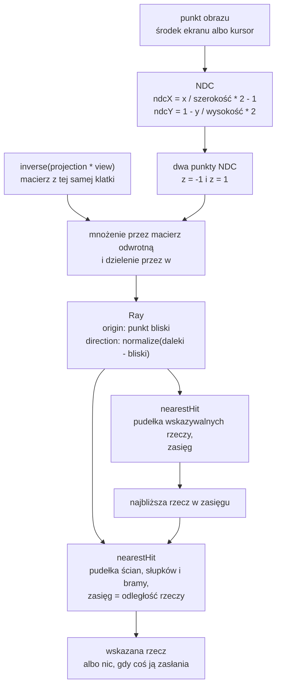

# Moduł scene: promień i selekcja obiektów (ray casting)

Kamień milowy: M8, tylko podstawy bez okna (matematyka i testy). Temat wykładu: 15 (Selekcja obiektów).
Kod: [`src/scene/Raycast.hpp`](../../../src/scene/Raycast.hpp), [`src/scene/Raycast.cpp`](../../../src/scene/Raycast.cpp), testy w [`tests/RaycastTests.cpp`](../../../tests/RaycastTests.cpp). Użytkownik promienia: [`src/game/Interactables.cpp`](../../../src/game/Interactables.cpp) (funkcja `pickInteractable`, opisana w [`../game/interactables.md`](../game/interactables.md)).

Część modułu `scene`. Wstęp do modułu i jego miejsce w warstwach są w [`README.md`](README.md). Ten dokument korzysta z pudełka `Aabb` i kuli `Sphere` z [`collision.md`](collision.md) (sekcje 2.1, 2.9 i 2.11), z macierzy widoku i rzutowania z [`camera.md`](camera.md) (sekcje 2 i 5) oraz z biblioteki GLM ([`../../libraries/glm.md`](../../libraries/glm.md): `vec3`, `vec4`, `mat4`, `dot`, `normalize`, `inverse`). Testy są napisane w bibliotece doctest ([`../../libraries/doctest.md`](../../libraries/doctest.md)).

## 1. Po co to jest

Do M7 gracz mógł chodzić, zbierać kryształy i dojść do wyjścia, ale nie mógł **wskazać** żadnej rzeczy w świecie. M8 dodaje dwie rzeczy, które się wskazuje: dźwignię, która obniża jedną ścianę labiryntu, i kartkę z podpowiedzią ([`../game/interactables.md`](../game/interactables.md)). Żeby je wskazać, program musi odpowiedzieć na pytanie: **na co patrzy gracz** (albo na co wskazuje kursor myszy)?

Odpowiedzią jest **promień** (ray): półprosta, która startuje w kamerze i biegnie przez wybrany punkt obrazu w głąb sceny. Pierwsza rzecz, w którą ten promień uderzy, jest tą, którą gracz wskazał. Technika nazywa się **ray casting** (rzucanie promienia), a w wykładzie to temat 15, "Selekcja obiektów".

Plik `Raycast` robi cztery rzeczy:

| Co | Funkcja | Sekcja |
|---|---|---|
| gdzie promień trafia w pudełko | `scene::intersect(const Ray&, const Aabb&)` | 2.2 do 2.5 |
| gdzie promień trafia w kulę | `scene::intersect(const Ray&, const Sphere&)` | 2.6 |
| pierwsze pudełko z listy w zasięgu | `scene::nearestHit` | 2.11 |
| promień przez punkt obrazu (piksel) | `scene::screenPointRay` | 2.8 do 2.10 |

Tak jak `Aabb`, `Camera` i `Transform`, to zwykłe dane i matematyka: żadnego wywołania OpenGL, żadnej myszy, żadnego okna. Dzięki temu całość da się sprawdzić testami jednostkowymi bez okna.

**Stan na dziś (2026-10-06), uczciwie.** Kod ma 17 przypadków testowych w `tests/RaycastTests.cpp` (policzone z pliku: 17 makr `TEST_CASE`, w nich 30 podprzypadków `SUBCASE`). Autor kodu zgłosił, że testy przechodzą w bramce projektu. Ja ich nie uruchamiałem: w drzewie trwał w tym czasie build, a ten dokument opisuje kod z plików. **Nikt nie użył promienia w działającym programie.** Nie ma odczytu pozycji kursora, nie ma wywołania `screenPointRay` w pętli klatki, nie ma podświetlenia wskazanego obiektu i nie ma linii o promieniu w panelu Collision. Funkcję `pickInteractable` pokrywają testy z przypadkami zbudowanymi ręcznie, ale ona też nie jest nigdzie wywołana poza testami. Co zostaje do podpięcia, opisuje sekcja 5.9.

### 1.1 Decyzja właściciela a wybory implementacji

Te dwie rzeczy trzeba rozdzielać na obronie. Decyzję podjął właściciel projektu, a wybory implementacji to moje rozwiązania, do których dochodzi uzasadnienie.

**Decyzja właściciela (2026-10-06):** wybieranie obiektów to **ray casting**: promień z kamery przez **środek ekranu**, gdy mysz jest przechwycona (tak gracz chodzi i rozgląda się), albo przez **kursor**, gdy mysz jest wolna (na przykład gdy gracz klika w panele). Pozostałe decyzje z tego samego dnia (dźwignia obniża jedną wewnętrzną ścianę, kartka pokazuje krótką podpowiedź na karcie HUD, temat 12 dostanie kryształy i kałuże) należą do [`../game/interactables.md`](../game/interactables.md) albo do osobnego tematu i w tym kodzie ich nie ma.

**Wybory implementacji** (każdy z uzasadnieniem z komentarzy w kodzie, a tam, gdzie kod żadnego nie podaje, powiedziane wprost):

| Wybór | Uzasadnienie z kodu |
|---|---|
| test pudełka metodą płyt (slab method) | komentarz: pudełko to część wspólna trzech płyt, a promień jest w pudełku tam, gdzie jest w trzech płytach naraz: od **najpóźniejszego** wejścia do **najwcześniejszego** wyjścia |
| przedział odległości zaczyna się od 0, nie od minus nieskończoności | komentarz: dokładnie to odcina wszystko, co jest za początkiem promienia |
| styk (promień ślizga się po ścianie, dotyka krawędzi albo narożnika) jest trafieniem | komentarz: promień jest nieskończenie cienki, więc nigdy nie ma "wspólnej objętości" z niczym, a dotyk jest jedynym kontaktem, jaki ma. To **odwrotnie** niż w `overlaps` ([`collision.md`](collision.md), sekcja 2.3) |
| początek wewnątrz bryły albo na jej powierzchni to trafienie z odległością 0 | komentarz w nagłówku i testy |
| kierunek o długości 0 to "brak promienia": nic nie trafia, nawet bryła, w której leży początek | komentarz: bez wcześniejszego wyjścia pętla uznałaby taki promień za "równoległy do wszystkiego" i zgłosiła trafienie dla początku wewnątrz pudełka |
| kierunek musi być wektorem jednostkowym | komentarz: tylko wtedy `t` jest odległością w metrach |
| promień z `screenPointRay` startuje na **bliskiej płaszczyźnie**, nie w oku | komentarz w nagłówku opisuje fakt ("w punkcie rysowanym dokładnie w tym miejscu obrazu"), ale **nie podaje powodu**. Moja analiza jest w sekcji 2.10 |
| zasięg to odległość liczona po promieniu; pudełko dokładnie w zasięgu się liczy | komentarz przy `nearestHit` |
| z dwóch pudełek w tej samej odległości wygrywa wcześniejsze na liście | komentarz: `<`, nie `<=` |
| `screenPointRay` rzuca `std::invalid_argument` dla rozmiaru obrazu nie większego od 0 | komentarz: zminimalizowane okno ma rozmiar 0 i wołający nie ma wtedy prosić o promień |

## 2. Teoria

### 2.1 Promień

**Promień** to punkt początkowy `origin` i kierunek `direction`. Punkt promienia w odległości `t` to:

```text
P(t) = origin + t * direction        dla t >= 0
```

Warunek `t >= 0` odróżnia promień od **prostej**: prosta biegnie w obie strony, promień tylko do przodu. Gdy `direction` ma długość 1 (wektor jednostkowy), `t` jest odległością od początku w metrach. Cały kod zakłada tę jednostkowość, a w pułapce 1 jest, co się dzieje, gdy ją złamać.

W kodzie to struktura:

```cpp
struct Ray {
    glm::vec3 origin{0.0F};
    glm::vec3 direction{0.0F, 0.0F, -1.0F};
};
```

Domyślny kierunek to `-Z`, tak jak patrzy nowa `Camera` (konwencja z [`camera.md`](camera.md): prawoskrętny układ, `Y` w górę, `-Z` do przodu). Test `a new ray starts in the origin and looks along -Z like a new camera` przypina to do kamery.

### 2.2 Metoda płyt: pudełko jako trzy przedziały

Pudełko `Aabb` to część wspólna **trzech płyt** (slabs). Płyta osi `x` to wszystko między płaszczyznami `x = min.x` i `x = max.x`, i tak samo dla `y` i `z`. Na każdej osi promień jest w płycie przez jeden przedział odległości: od odległości, na której przecina pierwszą płaszczyznę, do odległości, na której przecina drugą. W pudełku jest tam, gdzie jest w **wszystkich trzech** płytach jednocześnie:

```text
wejście do pudełka = największe z trzech wejść do płyt
wyjście z pudełka  = najmniejsze z trzech wyjść z płyt
trafienie, gdy wejście <= wyjście
```

To jest to samo, co wspólna długość dwóch przedziałów z [`collision.md`](collision.md), sekcja 2.2 (`min(a.max, b.max) - max(a.min, b.min)`), tylko tu jeden z przedziałów jest zbudowany z promienia.

Odległość do płaszczyzny to rozwiązanie równania `origin + t * direction = płaszczyzna` na jednej osi:

```text
t = (płaszczyzna - origin) / direction        (na tej osi)
```

**Przykład w 2D** (widok z góry, płaszczyzna XZ). Pudełko ma `x` od 1 do 3 i `z` od 1 do 3. Promień startuje w `(0, 0)` i ma kierunek `(0,6, 0,8)` (długość 1):

```text
oś x:  wejście (1 - 0) / 0,6 = 1,667      wyjście (3 - 0) / 0,6 = 5
oś z:  wejście (1 - 0) / 0,8 = 1,25       wyjście (3 - 0) / 0,8 = 3,75

wejście do pudełka = max(1,667; 1,25) = 1,667
wyjście z pudełka  = min(5; 3,75)     = 3,75
1,667 <= 3,75, więc trafienie w odległości 1,667
```

```text
t:         0     1     2     3     4     5
płyta x:               |=================|      od 1,667 do 5
płyta z:         |==========|                    od 1,25  do 3,75
wspólnie:              |=====|                   od 1,667 do 3,75: w pudełku
```

Punkt trafienia to `P(1,667) = (1, 1,333)`: leży na ścianie `x = 1` (zachodniej) i `z = 1,333` mieści się w przedziale od 1 do 3, więc promień wszedł przez tę ścianę.

**Kierunek ujemny.** Gdy składowa kierunku jest ujemna, promień przecina płaszczyznę `max` wcześniej niż `min`, więc dwie odległości są odwrócone. Kod zamienia je miejscami (`std::swap`), żeby `slabEnter` było zawsze mniejsze od `slabExit`.

**Przykład w 3D, z kodu testów.** Pudełko `BOX` z testów ma `min = (-1, -1, -6)` i `max = (1, 1, -4)`, a promień startuje w początku układu i biegnie wzdłuż `-Z`:

| Oś | Kierunek | Co robi kod | Wejście | Wyjście |
|---|---|---|---|---|
| x | 0 | początek 0 leży między -1 a 1, więc ta oś niczego nie ogranicza (sekcja 2.3) | bez zmian | bez zmian |
| y | 0 | tak samo | bez zmian | bez zmian |
| z | -1 | `(-6 - 0) / -1 = 6` i `(-4 - 0) / -1 = 4`, po zamianie wejście 4, wyjście 6 | 4 | 6 |

Wejście `max(0, 4) = 4`, wyjście `min(nieskończoność, 6) = 6`, a `4 > 6` jest fałszem: trafienie w odległości 4 m. To jest pierwszy przypadek testu `a ray that runs into a box hits it where it enters`.

**Przykład ukośny** (trzeci przypadek tego samego testu, trójkąt 3-4-5). Początek `(3, 0, 0)`, cel `(0, 0, -4)`, kierunek `(-0,6, 0, -0,8)`:

```text
oś x:  (-1 - 3) / -0,6 = 6,667 i (1 - 3) / -0,6 = 3,333; po zamianie wejście 3,333, wyjście 6,667
oś y:  kierunek 0, początek 0 leży między -1 a 1: bez ograniczenia
oś z:  (-6 - 0) / -0,8 = 7,5 i (-4 - 0) / -0,8 = 5;      po zamianie wejście 5,     wyjście 7,5

wejście = max(0; 3,333; 5) = 5      wyjście = min(nieskończoność; 6,667; 7,5) = 6,667
5 <= 6,667: trafienie w odległości 5 m
```

Test oczekuje `5,0`: droga od `(3, 0, 0)` do `(0, 0, -4)` ma długość 5 (trójkąt prostokątny o bokach 3 i 4).

### 2.3 Przypadek równoległy: kierunek 0 na jednej osi

Wzór `t = (płaszczyzna - origin) / direction` dzieli przez składową kierunku. Gdy ta składowa to dokładnie 0, promień biegnie **równolegle** do obu płaszczyzn płyty i nigdy ich nie przecina. Dzielenie przez zero dałoby nieskończoność albo `NaN`, więc ten przypadek ma osobną odpowiedź:

- **początek między płaszczyznami** (włącznie z leżeniem dokładnie na jednej): ta oś niczego nie ogranicza, kod robi `continue`,
- **początek poza płytą**: promień nigdy do niej nie wejdzie, kod od razu zwraca "brak trafienia".

Test `a ray parallel to faces of a box hits only from between those faces` pokazuje oba warianty: promień wzdłuż `-Z` z `x = 0,9` trafia, a z `x = 1,5` pudełko mija "choćby był nieskończenie długi". Trzeci przypadek biegnie wzdłuż `+X` i jest równoległy do czterech ścian naraz.

Dlaczego tylko dokładne zero: bardzo mała, ale niezerowa składowa daje bardzo dużą odległość do płaszczyzny, co jest poprawne: promień biegnący niemal równolegle potrzebuje bardzo długiej drogi, żeby ją przeciąć. Porównanie `direction == 0.0F` łapie też `-0.0F`, bo w arytmetyce zmiennoprzecinkowej `-0 == 0`.

### 2.4 Dlaczego przedział zaczyna się od 0

Kod ustawia na początku `enterDistance = 0` i `exitDistance = nieskończoność`. Gdyby wejście zaczynało od minus nieskończoności, test liczyłby **prostą**, a nie promień: pudełko leżące **za** początkiem też miałoby przedział, tylko z ujemnymi odległościami, i zostałoby uznane za trafione.

Z zerem na początku pudełko za plecami promienia wychodzi tak: wszystkie jego odległości są ujemne, więc `exitDistance` spada poniżej zera, a `enterDistance` zostaje na 0. Warunek `enterDistance > exitDistance` jest wtedy spełniony i funkcja zwraca "brak trafienia". Pokazuje to test `the box is behind the origin`: początek w `(0, 0, 0)`, kierunek `+Z`, pudełko leży przy `z` od -6 do -4. Odległości na osi `z` to `-6` i `-4`, wejście `-6`, wyjście `-4`, więc po przycięciu: wejście `max(0, -6) = 0`, wyjście `min(nieskończoność, -4) = -4`, `0 > -4`: brak trafienia.

Ta sama zasada daje przy okazji **początek wewnątrz pudełka**. Wtedy na każdej osi wejście jest ujemne, a wyjście dodatnie, więc `enterDistance` zostaje na 0 i funkcja zwraca trafienie w odległości 0. Test `a ray that starts inside a box, or on it, hits at the distance 0` sprawdza to dla środka, dla dowolnego kierunku i dla początku leżącego na bliskiej ścianie.

### 2.5 Styk jest trafieniem

W `overlaps` ([`collision.md`](collision.md), sekcja 2.3) styk **nie** jest nakładaniem. W promieniu jest odwrotnie: warunek brzmi `enterDistance > exitDistance` (ostro "większe"), więc przedział o długości 0 to trafienie. Powód z komentarza w kodzie: promień jest nieskończenie cienki i nigdy nie dzieli z niczym objętości, więc gdyby styk nie liczył się, promień nie trafiałby w nic.

Trzy rodzaje styku, wszystkie w teście `a ray that only grazes a box hits it`:

- **wzdłuż ściany**: promień z `x = 1` biegnący wzdłuż `-Z` leży w płaszczyźnie prawej ściany. Na osi `x` kierunek jest 0, a początek leży dokładnie na płaszczyźnie, więc przechodzi (sekcja 2.3). Trafienie w odległości 4,
- **przez krawędź**: promień z `(2, 0, -5)` w kierunku `(-1, 0, 1)` znormalizowanym. Oglądany z góry dotyka pudełka w jednym punkcie `(1, -4)`, na krawędzi między bliską a prawą ścianą, po pierwiastku z 2 metra. Na osi `x` przedział to od 1,414 do 4,243, na osi `z` od -1,414 do 1,414. Wejście `max(0; 1,414; -1,414) = 1,414`, wyjście `min(nieskończoność; 4,243; 1,414) = 1,414`, równe, więc trafienie,
- **tuż obok**: ten sam promień przesunięty o 1 cm (`x = 2,01`) ma wejście 1,428 i wyjście 1,414, czyli pudełko mija.

Wniosek ostrożny: trafienie "na styk" w arytmetyce `float` działa dla liczb tego testu, ale nie ma gwarancji dla dowolnych, bo dwie odległości liczone różnymi działaniami mogą różnić się o ostatni bit (pułapka 2).

### 2.6 Kula

Kula `Sphere` to środek `center` i promień `radius` (z [`collision.md`](collision.md), sekcja 2.9). Test promienia z kulą opiera się na **dwóch trójkątach prostokątnych**, bez równania kwadratowego.

Oznaczenia: `toCenter = center - origin`, `d = |toCenter|` (odległość początku od środka), `r` promień kuli.

1. **Początek w kuli albo na niej** (`d <= r`): trafienie w odległości 0.
2. **Najbliższy punkt promienia środkowi.** `closestDistance = dot(toCenter, direction)` to długość "cienia" wektora `toCenter` na promień, czyli odległość wzdłuż promienia do punktu najbliższego środkowi. Gdy `closestDistance <= 0`, środek nie jest przed początkiem, a skoro początek jest poza kulą, promień od niej ucieka: brak trafienia.
3. **Pierwszy trójkąt prostokątny.** Początek, środek i punkt najbliższy środkowi tworzą trójkąt prostokątny: przeciwprostokątna to `d`, jedna przyprostokątna to `closestDistance`, druga to odległość, w jakiej promień mija środek. Z Pitagorasa kwadrat tej drugiej to `missDistanceSquared = d^2 - closestDistance^2`. Gdy jest większy od `r^2`, promień mija kulę: brak trafienia. Równy `r^2` to styk w jednym punkcie i **jest** trafieniem.
4. **Drugi trójkąt prostokątny.** Środek, punkt najbliższy i punkt wejścia do kuli: przeciwprostokątna to `r`, jedna przyprostokątna to `sqrt(missDistanceSquared)`, a druga to `halfChord = sqrt(r^2 - missDistanceSquared)` (pół cięciwy). Promień wchodzi do kuli o `halfChord` **przed** punktem najbliższym:

```text
distance = closestDistance - halfChord
```

```text
widok z boku: promień biegnie poziomo, N to punkt najbliższy środkowi, E punkt wejścia

origin ---------E--------N--------> promień
                 \       |
                  r      | miss
                    \    |
                      \  |
                        C (środek kuli)

pierwszy trójkąt: origin, N, C (kąt prosty w N):  d^2 = closestDistance^2 + miss^2
drugi trójkąt:    E, N, C      (kąt prosty w N):  r^2 = halfChord^2 + miss^2
odległość wejścia: |origin E| = closestDistance - halfChord
```

(Punkt `N` to rzut środka `C` na promień. `miss` to odległość, w jakiej promień mija środek.)

**Przykład z testów.** Kula `SPHERE`: środek `(0, 0, -5)`, `r = 1`. Promień z `(0,6, 0, 0)` wzdłuż `-Z`:

```text
toCenter = (-0,6; 0; -5)         d^2 = 0,36 + 25 = 25,36
closestDistance = dot(toCenter; (0, 0, -1)) = 5
missDistanceSquared = 25,36 - 25 = 0,36      (0,36 <= 1: nie mija)
halfChord = sqrt(1 - 0,36) = 0,8
distance = 5 - 0,8 = 4,2
```

To drugi przypadek testu `a ray that runs into a sphere hits it where it enters` (komentarz w teście mówi o trójkącie 0,6-0,8-1). Przy `x = 1` wychodzi `missDistanceSquared = 26 - 25 = 1`, równe `r^2`, `halfChord = 0` i trafienie w odległości 5: ten sam przypadek testowy, podprzypadek `it touches the sphere in one point`.

Dlaczego w teście kuli kod porównuje kwadraty (`d^2` z `r^2`), a pierwiastek liczy tylko raz, przy `halfChord`: to ta sama zasada co w [`collision.md`](collision.md), sekcja 2.10. Test kuli wymaga **jednostkowego** kierunku: iloczyn skalarny `dot(toCenter, direction)` jest długością cienia tylko wtedy, gdy `|direction| = 1` (ćwiczenie 9 pokazuje, co się dzieje w przeciwnym razie).

### 2.7 Przypadki brzegowe

| Przypadek | Pudełko | Kula | Test |
|---|---|---|---|
| początek wewnątrz | trafienie, odległość 0 | trafienie, odległość 0 | `a ray that starts inside a box, or on it, hits at the distance 0`, `a ray that starts inside a sphere, or on it, hits at the distance 0` |
| początek na powierzchni | trafienie, odległość 0 (patrzy w głąb albo nie, bez znaczenia) | trafienie, odległość 0, także gdy promień idzie od kuli (`on the surface, looking away`) | te same dwa |
| styk (krawędź, narożnik, ściana) | trafienie | trafienie w jednym punkcie | `a ray that only grazes a box hits it`, podprzypadek `it touches the sphere in one point` |
| bryła za początkiem | brak trafienia (promień nie biegnie do tyłu) | brak trafienia | `the box is behind the origin`, `the sphere is behind the origin` |
| promień wyszedł już z kuli | nie dotyczy | brak trafienia (`the ray has already left the sphere`) | `a ray that passes a sphere or looks away from it does not hit` |
| kierunek o długości 0 | brak trafienia, także gdy początek jest wewnątrz | to samo | `a ray without a direction hits nothing` |
| składowa kierunku równa 0 | sekcja 2.3 | nie dotyczy | `a ray parallel to faces of a box hits only from between those faces` |

W teście kierunku zerowego ważny jest przypadek `inside`: początek leży w środku pudełka i środku kuli, a mimo to nie ma trafienia. To jest decyzja z komentarza w `Raycast.cpp`: promień bez kierunku "nigdzie nie idzie".

### 2.8 Od piksela do promienia: odwracanie rzutowania

Teraz druga połowa pliku. Mysz (albo środek ekranu) daje **punkt obrazu**, na przykład piksel `(320, 500)` w oknie 1280 na 720. Do testów z sekcji 2.2 do 2.7 potrzebny jest promień w **świecie**. Trzeba przejść łańcuch przestrzeni z [`camera.md`](camera.md) **w drugą stronę**: z ekranu do świata.

Droga w przód (rysowanie): `świat -> (macierz widoku) -> widok -> (rzutowanie) -> przycinanie -> (dzielenie przez w) -> NDC -> (viewport) -> piksele`. Droga wstecz to te same kroki od końca, z macierzą odwrotną. Kod `screenPointRay` robi je tak:

**Krok 1: piksel na NDC.** NDC (normalized device coordinates) to sześcian od -1 do 1 na każdej osi, w który rzutowanie zamyka widoczną część świata. Pozycja `position` jest liczona od **lewego górnego** rogu obrazu, `x` rośnie w prawo, `y` rośnie **w dół** (tak podaje kursor okno), a `size` to szerokość i wysokość obrazu:

```text
ndcX = position.x / size.x * 2 - 1
ndcY = 1 - position.y / size.y * 2        <- odwrócone: w NDC y rośnie w górę
```

Dzielenie przez rozmiar daje liczbę od 0 do 1, mnożenie przez 2 i odjęcie 1 rozciąga ją na przedział od -1 do 1. Dla `y` robi się to samo, ale od góry: stąd `1 - ...`. Liczby dla obrazu 1280 na 720:

| Piksel | `ndcX` | `ndcY` | Co to jest |
|---|---|---|---|
| `(0, 0)` | -1 | 1 | lewy górny róg |
| `(1280, 720)` | 1 | -1 | prawy dolny róg |
| `(640, 360)` | 0 | 0 | środek obrazu (tu patrzy gracz przy przechwyconej myszy) |
| `(320, 500)` | -0,5 | `1 - 500 / 720 * 2 = -0,389` | ćwierć szerokości od lewej, poniżej środka |

**Krok 2: jeden piksel to cała linia.** Wszystkie punkty świata leżące na jednej prostej przez oko są rysowane w tym samym pikselu (jeden zasłania drugi, to właśnie robi test głębi). Linię wystarczy znać w dwóch punktach: **na bliskiej** i **na dalekiej płaszczyźnie przycinania**. W NDC to punkty `(ndcX, ndcY, -1)` i `(ndcX, ndcY, 1)`. Kod ma na to stałe `NDC_NEAR = -1` i `NDC_FAR = 1`. Konwencja jest z OpenGL: głębia w NDC biegnie od -1 do 1, i tak działa `glm::perspective` w tym projekcie (nigdzie nie jest ustawione `GLM_FORCE_DEPTH_ZERO_TO_ONE`). Gdyby było, `NDC_NEAR` musiałoby wynosić 0. Pilnuje tego test z sekcji 5.7: promień przez środek obrazu ma startować dokładnie `nearPlane` przed okiem.

**Krok 3: macierz odwrotna i dzielenie przez `w`.** Punkt NDC dostaje czwartą składową `w = 1` (punkt, nie wektor: dzięki temu macierz może go przesuwać), jest mnożony przez `inverse(projection * view)`, a wynik dzielony przez własne `w`:

```cpp
const glm::vec4 clip{ndc, 1.0F};
const glm::vec4 world = inverseViewProjection * clip;
return glm::vec3{world} / world.w;
```

Dlaczego dzielenie. Macierz rzutowania perspektywicznego z GLM zostawia w `w` odległość od oka wzdłuż osi widzenia. Karta graficzna dzieli `x`, `y`, `z` przez to `w` w drodze na ekran (to dzielenie sprawia, że dalekie rzeczy są małe). Macierz odwrotna cofa mnożenie, ale nie to dzielenie, więc po jej zastosowaniu `w` jest różne od 1 i trzeba podzielić drugi raz, żeby wrócić do współrzędnych świata.

**Krok 4: promień.** Początek to punkt bliski, kierunek to `normalize(farPoint - nearPoint)`:

```cpp
return {.origin = nearPoint, .direction = glm::normalize(farPoint - nearPoint)};
```

**Przykład: środek obrazu.** W przestrzeni widoku punkt bliski to `(0, 0, -0,1)`, a daleki `(0, 0, -100)` (domyślna `Camera`: `nearPlane = 0,1`, `farPlane = 100`). W świecie to `oko + forward * 0,1` i `oko + forward * 100`, a ich różnica po normalizacji to `forward`. Test `the ray through the middle of the picture looks where the camera looks` sprawdza dokładnie to: kierunek równy `camera.forward()` i początek w `EYE + camera.forward() * camera.nearPlane`.

**Przykład: róg obrazu.** Kamera patrzy wzdłuż `-Z`, kąt widzenia pionowy `fovDegrees = 60`, proporcje 16 do 9. Połowa wysokości obrazu 1 m przed okiem to `tan(30 stopni) = 0,5774`, połowa szerokości to `0,5774 * 16 / 9 = 1,0264`. Promień przez lewy górny róg ma kierunek `forward - right * 1,0264 + up * 0,5774`, po normalizacji (długość `sqrt(1 + 1,0535 + 0,3333) = 1,5449`) w przybliżeniu `(-0,664; 0,374; -0,647)`. Test `the ray through a corner of the picture runs along an edge of the view frustum` sprawdza takie kierunki dla trzech punktów obrazu na kamerze obróconej w skos (liczby w tym akapicie to mój rachunek ręczny, nie wynik testu).

### 2.9 Piksele okna, piksele bufora i skala

`screenPointRay` przyjmuje `position` i `size` w **tej samej jednostce**: obie w współrzędnych ekranu albo obie w pikselach, nie ma znaczenia, który wariant, byle zgodnie. Ma to praktyczny powód. Okno GLFW ma dwa rozmiary: rozmiar okna w współrzędnych ekranu, w których GLFW podaje kursor, i rozmiar bufora ramki w pikselach (do `glViewport`). Na ekranie HiDPI drugi jest dwa razy większy. W projekcie rozdziela je `core::Window::windowSize()` ("Mouse positions use these units") i `core::Window::framebufferSize()` ("Use this for glViewport"). Test `the unit of the position does not matter as long as the size uses the same` pokazuje, że `(320, 500)` w obrazie 1280 na 720 i `(640, 1000)` w obrazie 2560 na 1440 dają ten sam promień.

Zminimalizowane okno ma rozmiar 0, a dzielenie przez 0 w kroku 1 dałoby `NaN` w całym promieniu. Dlatego funkcja rzuca `std::invalid_argument`, gdy szerokość albo wysokość nie jest większa od 0, a wołający ma takiego promienia w ogóle nie zamawiać (sekcja 5.9).

### 2.10 Dlaczego promień zaczyna się na bliskiej płaszczyźnie

Początek promienia z `screenPointRay` to punkt **na bliskiej płaszczyźnie przycinania**, a nie oko. Dla promienia przez środek obrazu różnica to dokładnie `nearPlane`, czyli 0,1 m w domyślnej kamerze. Dla piksela z boku jest trochę więcej: punkt leży na płaszczyźnie `z = -0,1` w przestrzeni widoku, więc jego odległość od oka wzdłuż promienia to `0,1 / cos(kąt)`. Dla lewego górnego rogu z sekcji 2.8 wychodzi `0,1 / 0,647 = 0,155` m (rachunek własny).

Co mówi kod: komentarz w nagłówku opisuje fakt i go podkreśla, ale **nie podaje powodu**. Dalej **analiza**, nie uzasadnienie z kodu:

- Oko jest **środkiem rzutowania**: żaden punkt NDC mu nie odpowiada, więc odwracanie macierzy nie może dać punktu "w oku". Najbliższy punkt, który odwrócenie daje bez żadnych dodatkowych założeń, leży na bliskiej płaszczyźnie.
- Rzeczy bliżej niż `nearPlane` nie są rysowane (są przycięte). Promień, który zaczyna dopiero na płaszczyźnie, też ich nie trafi, więc "co widać, to można wskazać".

Konsekwencja do zapamiętania: **zasięg liczy się od początku promienia**, czyli mierzony od oka zasięg sięga o 0,1 do 0,155 m dalej, niż mówi liczba (pułapka 6). Testy `Interactables` rzucają promienie z oczu gracza, a nie z bliskiej płaszczyzny.

### 2.11 Najbliższe trafienie i zasięg

Promień zwykle trafia kilka rzeczy naraz (kilka pudełek za sobą). Wskazana jest ta **najbliższa**. `nearestHit` przechodzi po liście pudełek, dla każdego woła `intersect` i zapamiętuje najmniejszą odległość:

- pudełko, które promień mija, odpada,
- pudełko dalej niż `maxDistance` odpada (**zasięg** ręki gracza), a pudełko **dokładnie** w `maxDistance` jeszcze się liczy,
- z dwóch pudełek w tej samej odległości wygrywa to, które jest wcześniej na liście (porównanie `<`, nie `<=`),
- wynik to numer pudełka na liście, odległość i flaga `hit`.

Pudełko poza zasięgiem nie przesłania bliższego i nie jest "zastąpione" przez dalsze: biorą udział tylko pudełka w zasięgu (test `nearestHit skips what is out of reach`).

Zasłanianie (czy ściana jest między graczem a dźwignią) to ta sama funkcja użyta drugi raz, z listą ścian i zasięgiem równym odległości trafionej dźwigni: opisuje to [`../game/interactables.md`](../game/interactables.md), sekcja 2.10.

### 2.12 Ray casting a kolorowanie obiektów (colour picking)

Drugi popularny sposób wybierania obiektów to **colour picking**: każdy obiekt jest rysowany do osobnego bufora ramki w unikalnym kolorze (kolor jest numerem obiektu), a program czyta jeden piksel pod kursorem (`glReadPixels`) i z koloru odczytuje numer. Porównanie:

| Cecha | Ray casting (wybrany) | Colour picking |
|---|---|---|
| gdzie liczy | procesor, czysta matematyka | karta graficzna, potem odczyt na procesor |
| potrzebuje OpenGL | nie | tak: osobny bufor ramki, osobny shader, `glReadPixels` |
| da się sprawdzić testem bez okna | tak (17 przypadków w `RaycastTests.cpp`) | nie bez kontekstu OpenGL |
| dokładność | taka, jak bryła zastępcza: pudełko albo kula | co do piksela, na prawdziwej geometrii |
| odległość do obiektu | wynik funkcji, za darmo | trzeba dodatkowo czytać bufor głębi |
| zasięg ręki | jedno porównanie (`maxDistance`) | osobna logika po odczycie |
| zasłanianie ścianą | ten sam test z listą ścian | przez głębię, bo ściana jest w tym samym buforze |
| koszt | proporcjonalny do liczby brył na liście | dodatkowy przebieg rysowania całej sceny i synchronizacja z kartą przy odczycie |
| ryzyka | pudełko jest grubsze niż model (pułapka 7) | kolory identyfikatorów psują się przy mieszaniu, wygładzaniu krawędzi (MSAA) albo korekcji gamma |

**Decyzja właściciela:** ray casting (sekcja 1.1). Poniżej **moja analiza**, nie argument właściciela, dlaczego ta decyzja pasuje do tego projektu:

- Projekt ma już bryły `Aabb` i `Sphere` z testami bez okna i listę pudełek ścian, więc nie trzeba budować niczego nowego po stronie karty. Dźwignie i kartki dostają małe pudełka (`LEVER_BOX_*`, `NOTE_BOX_*`), a ściany są przesłaniaczami z tej samej listy, której używa kolizja.
- Odległość i zasięg są wynikiem funkcji, a pytanie "czy ściana jest między nami" jest tym samym testem z inną listą.
- Potok ma bufor HDR, korekcję gamma i przebiegi końcowe ([`../renderer/post-process.md`](../renderer/post-process.md)). Colour picking musiałby omijać każdy z tych kroków, żeby kolory identyfikatorów dotarły nietknięte.
- Cena decyzji: wskazuje się **pudełko**, a nie model. Dla dźwigni i kartki to wystarcza, dla bardziej kształtnych obiektów mogłoby nie wystarczyć.

### 2.13 Diagram: od ekranu do wskazanego obiektu



```text
widok z góry (XZ), promień biegnie w dół rysunku, zasięg 2,5 m

  kamera o  promień
          |
          |
  1,5 m   +==== B2 ====+            B2: trafione w 1,5 m, w zasięgu: wygrywa
          |     +=== B1 ===+       B1: leży obok promienia: chybione
          |
  2,5 m - - - - - - - - - - - -    granica zasięgu
          |
  3,0 m   +==== B3 ====+            B3: trafione w 3,0 m, poza zasięgiem: pomijane
          v
```

## 3. Jak to działa w OpenGL

Nie dotyczy: `Raycast.hpp` i `Raycast.cpp` dołączają tylko GLM i bibliotekę standardową (`<algorithm>`, `<cmath>`, `<limits>`, `<stdexcept>`, `<utility>`, `<span>`). Nie ma w nich GLAD ani żadnego wywołania `gl*`. OpenGL nie wie, że jakiekolwiek promienie istnieją.

Związek z OpenGL jest wyłącznie **konwencyjny**, i to on powoduje błędy, jeśli go pomylić:

| Konwencja | Skąd | Gdzie w kodzie |
|---|---|---|
| NDC to sześcian od -1 do 1, głębia od -1 (blisko) do 1 (daleko) | OpenGL i `glm::perspective` w domyślnym trybie | stałe `NDC_NEAR`, `NDC_FAR` |
| w NDC `y` rośnie w górę | OpenGL | `1 - position.y / size.y * 2` |
| kursor okna ma `y = 0` na **górze** i rośnie w dół | GLFW | ten sam wiersz, odwrócenie |
| kursor jest w współrzędnych ekranu, `glViewport` w pikselach bufora | GLFW | `Window::windowSize()` a `Window::framebufferSize()`, sekcja 2.9 |

Tabela wywołań OpenGL tego kodu jest pusta. Kiedy promień zostanie podpięty, jedyne wywołania OpenGL po stronie wskazywania będą tylko tymi, które i tak są w kroku klatki (rysowanie sceny). Wybór ray castingu zamiast colour pickingu oznacza, że **wskazywanie nie dodaje żadnego przebiegu rysowania ani odczytu z karty**.

## 4. Shadery

Nie dotyczy: ten kod nie ma shadera i nie przekazuje niczego do żadnego. Planowane z tematu 15 jest **podświetlenie wskazanego obiektu** (kolumna "Przełącznik w ImGui" w [`../../syllabus.md`](../../syllabus.md)), ale nie ma jeszcze ani kodu, ani decyzji, jak ma być narysowane (osobny kolor, kontur, uniform w istniejącym programie). Ten dokument niczego tu nie zakłada.

## 5. Kod w projekcie

### 5.1 Pliki

| Plik | Biblioteka | Potrzebuje OpenGL | Testy |
|---|---|---|---|
| `src/scene/Raycast.hpp`, `src/scene/Raycast.cpp` | `engine` | nie | 17 przypadków w `tests/RaycastTests.cpp` |
| `src/game/Interactables.cpp` (funkcja `pickInteractable`) | `game_logic` | nie | `tests/InteractablesTests.cpp`, opis w [`../game/interactables.md`](../game/interactables.md) |

Plik jest w liście źródeł biblioteki `engine` w `CMakeLists.txt`, obok `Collider`, i dołącza `scene/Collider.hpp`, żeby użyć `Aabb` i `Sphere`.

### 5.2 `Ray`, `RayHit`, `NearestHit`

```cpp
struct Ray {
    glm::vec3 origin{0.0F};
    glm::vec3 direction{0.0F, 0.0F, -1.0F};
};

struct RayHit {
    bool hit = false;
    float distance = 0.0F;   // 0 when the ray starts inside the shape
};

struct NearestHit {
    bool hit = false;
    std::size_t index = 0;   // the number of the nearest box in the list
    float distance = 0.0F;
};
```

| Pole | Znaczenie |
|---|---|
| `Ray::origin` | początek w świecie |
| `Ray::direction` | kierunek, **jednostkowy**. Długość 0 jest dozwolona i znaczy "brak promienia" |
| `RayHit::hit` | prawda, gdy promień dotyka bryły albo wchodzi w nią przed swoim początkiem |
| `RayHit::distance` | odległość w metrach do pierwszego punktu bryły. Nie ma znaczenia, gdy `hit` jest fałszem |
| `NearestHit::index` | numer pudełka w liście przekazanej do `nearestHit`. Nie ma znaczenia bez trafienia |

Wszystkie trzy to czyste dane, jak `Aabb` i `Sphere`. Pola `distance` i `index` nie mają znaczenia, gdy `hit` jest fałszem: wołający musi najpierw sprawdzić `hit`.

### 5.3 `intersect` dla pudełka

```cpp
RayHit intersect(const Ray& ray, const Aabb& box) {
    if (glm::dot(ray.direction, ray.direction) == 0.0F) {
        return {};
    }

    float enterDistance = 0.0F;
    float exitDistance = std::numeric_limits<float>::infinity();

    for (int axis = 0; axis < AXIS_COUNT; ++axis) {
        const float origin = ray.origin[axis];
        const float direction = ray.direction[axis];

        if (direction == 0.0F) {
            if (origin < box.min[axis] || origin > box.max[axis]) {
                return {};
            }
            continue;
        }

        float slabEnter = (box.min[axis] - origin) / direction;
        float slabExit = (box.max[axis] - origin) / direction;
        if (slabEnter > slabExit) {
            std::swap(slabEnter, slabExit);
        }

        enterDistance = std::max(enterDistance, slabEnter);
        exitDistance = std::min(exitDistance, slabExit);

        if (enterDistance > exitDistance) {
            return {};
        }
    }

    return {.hit = true, .distance = enterDistance};
}
```

| Linia | Znaczenie |
|---|---|
| `glm::dot(ray.direction, ray.direction) == 0.0F` | kwadrat długości kierunku równy 0 znaczy kierunek zerowy: brak promienia, brak trafienia (sekcja 2.7) |
| `enterDistance = 0.0F` | przedział startuje od początku promienia: odcina wszystko za nim (sekcja 2.4) |
| `exitDistance = infinity()` | żadnego górnego ograniczenia, dopóki jakaś oś go nie da |
| `for (int axis ...)` i `ray.origin[axis]` | `glm::vec3` ma operator `[]`: 0 to `x`, 1 to `y`, 2 to `z`, stała `AXIS_COUNT = 3`. Ten sam kod obsługuje trzy osie |
| `direction == 0.0F` | przypadek równoległy (sekcja 2.3): osobna odpowiedź zamiast dzielenia przez zero |
| `origin < box.min[axis] \|\| origin > box.max[axis]` | początek poza płytą: promień nigdy do niej nie wejdzie. Nierówności ostre: początek dokładnie na płaszczyźnie jest "w środku" |
| `(box.min[axis] - origin) / direction` | odległość do płaszczyzny `min`, a dalej do `max` |
| `if (slabEnter > slabExit) std::swap` | kierunek ujemny: najpierw przecina się płaszczyznę `max` |
| `std::max(enterDistance, slabEnter)`, `std::min(exitDistance, slabExit)` | najpóźniejsze wejście i najwcześniejsze wyjście (sekcja 2.2) |
| `enterDistance > exitDistance` | ostro "większe": przedział o długości 0 to trafienie (sekcja 2.5). Sprawdzane po każdej osi, więc funkcja kończy się szybko, gdy nie ma szans |
| `return {.hit = true, .distance = enterDistance}` | `enterDistance` jest nadal 0, gdy początek leży wewnątrz. Inicjalizator desygnowany z C++20 |

Funkcja ma jedną pętlę po trzech osiach i żadnego pierwiastka. Dzielenia są dwa na oś.

### 5.4 `intersect` dla kuli

```cpp
RayHit intersect(const Ray& ray, const Sphere& sphere) {
    if (glm::dot(ray.direction, ray.direction) == 0.0F) {
        return {};
    }

    const glm::vec3 toCenter = sphere.center - ray.origin;
    const float radiusSquared = sphere.radius * sphere.radius;
    const float centerDistanceSquared = glm::dot(toCenter, toCenter);

    if (centerDistanceSquared <= radiusSquared) {
        return {.hit = true, .distance = 0.0F};
    }

    const float closestDistance = glm::dot(toCenter, ray.direction);
    if (closestDistance <= 0.0F) {
        return {};
    }

    const float missDistanceSquared = centerDistanceSquared - closestDistance * closestDistance;
    if (missDistanceSquared > radiusSquared) {
        return {};
    }

    const float halfChord = std::sqrt(radiusSquared - missDistanceSquared);
    return {.hit = true, .distance = closestDistance - halfChord};
}
```

| Linia | Znaczenie |
|---|---|
| pierwszy `if` | kierunek zerowy: nic nie trafia |
| `toCenter`, `radiusSquared`, `centerDistanceSquared` | wektor do środka, `r^2`, `d^2` (porównywane są kwadraty, bez pierwiastka) |
| `centerDistanceSquared <= radiusSquared` | początek w kuli albo na jej powierzchni: trafienie, odległość 0 |
| `closestDistance = dot(toCenter, direction)` | pierwszy trójkąt prostokątny: cień wektora do środka na promień (sekcja 2.6) |
| `closestDistance <= 0.0F` | środek nie leży przed początkiem, a początek jest poza kulą: kula za plecami |
| `missDistanceSquared = d^2 - closestDistance^2` | Pitagoras: kwadrat odległości, w której promień mija środek |
| `missDistanceSquared > radiusSquared` | mija: brak trafienia. Równość to styk i trafienie |
| `halfChord = sqrt(r^2 - missDistanceSquared)` | drugi trójkąt prostokątny: pół cięciwy. To jedyny pierwiastek w funkcji |
| `closestDistance - halfChord` | wejście do kuli jest o pół cięciwy **przed** punktem najbliższym |

### 5.5 `nearestHit`

```cpp
NearestHit nearestHit(const Ray& ray, std::span<const Aabb> boxes, float maxDistance) {
    NearestHit nearest;
    for (std::size_t index = 0; index < boxes.size(); ++index) {
        const RayHit hit = intersect(ray, boxes[index]);
        if (!hit.hit || hit.distance > maxDistance) {
            continue;
        }
        if (!nearest.hit || hit.distance < nearest.distance) {
            nearest = {.hit = true, .index = index, .distance = hit.distance};
        }
    }
    return nearest;
}
```

| Linia | Znaczenie |
|---|---|
| `std::span<const Aabb> boxes` | widok na listę pudełek: może to być `std::vector`, `std::array` albo pusta lista `{}`. Span niczego nie posiada ([`collision.md`](collision.md), pułapka 8) |
| `!hit.hit \|\| hit.distance > maxDistance` | nie trafione albo poza zasięgiem: pomijam. Ostre `>`: pudełko dokładnie w zasięgu zostaje |
| `!nearest.hit \|\| hit.distance < nearest.distance` | pierwsze znalezione albo bliższe od najlepszego. Ostre `<`: przy równych odległościach zostaje wcześniejsze |
| wynik domyślny `NearestHit nearest;` | `hit = false`: pusta lista albo same chybione pudełka dają "brak trafienia" |

Koszt to jeden test pudełka na element listy. Dla labiryntu 10 na 10 to około 240 pudełek ścian i słupków (liczba z [`collision.md`](collision.md), sekcja 6.2: 243 z bramą). Struktury przyspieszające są poza zakresem projektu.

### 5.6 `screenPointRay`

```cpp
Ray screenPointRay(const glm::vec2& position, const glm::vec2& size,
                   const glm::mat4& inverseViewProjection) {
    if (size.x <= 0.0F || size.y <= 0.0F) {
        throw std::invalid_argument("screenPointRay: the size of the picture must be positive");
    }

    const float ndcX = position.x / size.x * NDC_WIDTH - NDC_EDGE;
    const float ndcY = NDC_EDGE - position.y / size.y * NDC_WIDTH;

    const glm::vec3 nearPoint = worldPointFromNdc({ndcX, ndcY, NDC_NEAR}, inverseViewProjection);
    const glm::vec3 farPoint = worldPointFromNdc({ndcX, ndcY, NDC_FAR}, inverseViewProjection);

    return {.origin = nearPoint, .direction = glm::normalize(farPoint - nearPoint)};
}
```

| Linia | Znaczenie |
|---|---|
| `size.x <= 0.0F \|\| size.y <= 0.0F` | rozmiar zero (zminimalizowane okno) albo ujemny: wyjątek, nie `NaN` w promieniu |
| `NDC_WIDTH = 2`, `NDC_EDGE = 1` | stałe z komentarzem: sześcian NDC ma szerokość 2 (od -1 do 1), więc pozycja od 0 do 1 jest rozciągana razy 2 i przesuwana o 1 |
| `ndcY = NDC_EDGE - ...` | odwrócenie osi `y` (sekcja 2.8, krok 1) |
| `worldPointFromNdc(...)` | funkcja pomocnicza w anonimowej przestrzeni nazw: mnoży przez macierz odwrotną i dzieli przez `w` (krok 3) |
| `NDC_NEAR`, `NDC_FAR` | `-1` i `1`: dwa punkty prostej przez piksel |
| `glm::normalize(farPoint - nearPoint)` | kierunek jednostkowy, więc odległości są w metrach |

Macierz `inverseViewProjection` dostarcza wołający: to odwrotność `projection * view` kamery, **z którą narysowano obraz**, w tej samej klatce i z tymi samymi proporcjami (pułapka 11). Funkcja niczego nie wie o kamerze, oknie ani myszy: dostaje liczby.

### 5.7 Jak to zostało sprawdzone

Wszystkie 17 przypadków jest w `tests/RaycastTests.cpp`. Nie wymagają okna ani OpenGL. Liczby to wynik policzenia `TEST_CASE` w pliku, a to, że przechodzą, zgłosił autor kodu (sekcja 1).

| Przypadek testowy | Co przypina |
|---|---|
| `a new ray starts in the origin and looks along -Z like a new camera` | domyślne wartości `Ray` zgadzają się z nową `Camera` |
| `a ray that runs into a box hits it where it enters` | trafienie w bliską ścianę, wejście od drugiej strony i odległość mierzona po promieniu (trójkąt 3-4-5) |
| `a ray that passes a box or looks away from it does not hit` | mija z boku, mija nad pudełkiem, idzie w bok, pudełko za początkiem |
| `a ray that starts inside a box, or on it, hits at the distance 0` | środek, dowolny kierunek w środku, początek na bliskiej ścianie |
| `a ray parallel to faces of a box hits only from between those faces` | przypadek równoległy: między ścianami trafia, poza nimi nie |
| `a ray that only grazes a box hits it` | styk wzdłuż ściany, przez krawędź, a o 1 cm dalej brak trafienia |
| `a ray without a direction hits nothing` | kierunek zerowy, także z początkiem wewnątrz, dla pudełka, kuli i `nearestHit` |
| `a ray that runs into a sphere hits it where it enters` | w środek, poza środkiem (0,6-0,8-1), styk w jednym punkcie |
| `a ray that passes a sphere or looks away from it does not hit` | mija, kula za początkiem, promień już wyszedł |
| `a ray that starts inside a sphere, or on it, hits at the distance 0` | w środku, na powierzchni patrząc od kuli |
| `nearestHit finds the first box along the ray, whatever the order of the list` | najbliższe z nieposortowanej listy; podprzypadki: pudełko za początkiem, remis (wygrywa wcześniejsze), pusta lista i lista samych chybień |
| `nearestHit skips what is out of reach` | granica zasięgu: 3,9 odpada, 4,0 zostaje, 4,1 zostaje; dalsze pudełko nie zastępuje bliższego |
| `the ray through the middle of the picture looks where the camera looks` | środek obrazu: kierunek równy `forward`, długość 1, początek na bliskiej płaszczyźnie |
| `the ray through a corner of the picture runs along an edge of the view frustum` | lewy górny róg, prawy dolny róg i środek górnej krawędzi (pilnuje odwrócenia osi `y`) |
| `the ray through the place where a point is drawn hits that point` | pętla w obie strony: punkt świata, rzutowanie do piksela, promień przez ten piksel, trafienie w małą kulę wokół punktu |
| `the unit of the position does not matter as long as the size uses the same` | piksele ekranu a piksele bufora (dwa razy gęstsze) dają ten sam promień |
| `a picture without a size is an error` | szerokość 0, wysokość 0 i szerokość ujemna rzucają `std::invalid_argument` |

Test z pętlą w obie strony jest najmocniejszy: sprawdza zgodność `screenPointRay` z tym, co robi karta graficzna (mnożenie, dzielenie przez `w`, przeliczenie na piksele), a nie z własną wersją wzorów. Tolerancja testów kamery to `0,001` na składową, bo daleka płaszczyzna jest 100 m od oka, a `float` ma około siedmiu cyfr (komentarz w pliku testów).

### 5.8 Użycie: `pickInteractable`

Jedynym użytkownikiem `nearestHit` w kodzie gry jest `game::pickInteractable` w [`src/game/Interactables.cpp`](../../../src/game/Interactables.cpp): dwa razy dla pudełek dźwigni i kartek (z zasięgiem) i raz dla przesłaniaczy. Szczegóły w [`../game/interactables.md`](../game/interactables.md), sekcja 2.10. `screenPointRay` nie ma w kodzie gry żadnego użytkownika poza testami.

### 5.9 Co zostaje do podpięcia

Tego nie ma w kodzie. To lista rzeczy, które trzeba zrobić, żeby promień zaczął działać w grze, w kolejności, w jakiej widzę zależności. Żadna nie była zaczęta.

1. **Pozycja kursora.** `core::Input` czyta pozycję kursora wewnętrznie (pola `m_cursorX` i `m_cursorY`, żeby policzyć przesunięcie), ale **nie ma publicznego akcesora**. Są tylko `mouseDeltaX()` i `mouseDeltaY()`. Trzeba dodać getter pozycji (w współrzędnych ekranu).
2. **Rozmiar okna a rozmiar bufora ramki.** Kursor jest w jednostkach `Window::windowSize()`, a obraz scen jest rysowany w pikselach `Window::framebufferSize()` (a sceną do bufora HDR rządzi jeszcze osobny rozmiar). Do `screenPointRay` trzeba podać `position` i `size` **w tej samej jednostce** (sekcja 2.9) i tych proporcji, z jakimi liczono macierz `projection` tej klatki.
3. **Pominięcie rozmiaru 0.** Zminimalizowane okno ma rozmiar 0, a funkcja rzuca wyjątek (sekcja 2.9). Wołający musi pominąć wołanie i nie wybierać niczego, a nie łapać wyjątek w każdej klatce.
4. **Wybór źródła punktu.** Zgodnie z decyzją właściciela: środek obrazu (`size / 2`), gdy mysz jest przechwycona (`Input::isCursorCaptured()`), a pozycja kursora, gdy jest wolna. Przy wolnej myszy trzeba jeszcze rozstrzygnąć, czy klik w panel ImGui jest też wskazaniem (`Input::setMouseBlocked` istnieje po to, żeby panel pod kursorem blokował mysz: komentarz w `Input.hpp`).
5. **Macierz odwrotna.** `glm::inverse(projection * view)` z tych samych macierzy, którymi rysowana jest klatka.
6. **Podświetlenie wskazanego obiektu** (kolumna "Przełącznik w ImGui" tematu 15): nie ma ani kodu, ani decyzji (sekcja 4).
7. **Panel Collision.** PRD (sekcja 10) opisuje go jako "wynik ostatniego raycasta". Dziś panel go nie pokazuje ([`collision.md`](collision.md), sekcja 6). Linia z początkiem, kierunkiem i wynikiem ostatniego promienia jest planowana, a jej dokładna postać nie była ustalana.
8. **Reszta rozgrywki wokół wskazywania** (świat, runda, klawisz, karta HUD, animacja ściany): opisana w [`../game/interactables.md`](../game/interactables.md), sekcja 5.13.

## 6. Panel ImGui

Nie ma kodu panelu dla tego tematu. Panel Collision ([`collision.md`](collision.md), sekcja 6) mówi w PRD o "wyniku ostatniego raycasta", a w programie pokazuje dziś pudełka i kule, nie promienie. **Planowane**: jedna linia w tym panelu z ostatnim promieniem (początek, kierunek, co trafił i w jakiej odległości) oraz podświetlenie wskazanego obiektu. Żadna z tych rzeczy nie istnieje, więc nie ma jeszcze scenariusza pokazu na obronie. Do tego czasu pokazem tematu 15 są testy: `ctest --test-dir build/debug -C Debug --output-on-failure` uruchamia 17 przypadków z `RaycastTests.cpp` razem z resztą.

## 7. Pułapki

1. **Kierunek musi być jednostkowy.** Test kuli zakłada `|direction| = 1`: dla dłuższego kierunku `closestDistance` jest przeskalowane, a wynik jest po prostu błędny (ćwiczenie 9). Test pudełka działa dla dowolnego niezerowego kierunku, ale wtedy `t` jest w jednostkach długości kierunku, a nie w metrach, a porównanie z `maxDistance` w `nearestHit` jest nieprawdziwe. `screenPointRay` zawsze zwraca kierunek jednostkowy. Ktoś, kto buduje `Ray` ręcznie, musi znormalizować kierunek sam.
2. **Styk w `float`.** Trafienie "na styk" działa dla liczb testu (`2,0` i `-5,0` z kierunkiem `(-1, 0, 1)`), ale dwie odległości liczone różnymi działaniami mogą różnić się o ostatni bit, i wtedy styk raz wychodzi jako trafienie, a raz jako chybienie. Nie opieraj niczego w grze na dokładnym styku.
3. **Oś `y` do góry w NDC, w dół w oknie.** Pominięcie `1 - ...` w kroku 1 odwraca świat góra-dół: kliknięcie w górę ekranu wskazuje podłogę. Pilnuje tego test lewego górnego rogu.
4. **Rozmiar 0 to wyjątek, nie "brak trafienia".** Zminimalizowane okno trzeba obsłużyć w wołającym (sekcja 5.9, punkt 3).
5. **Kursor w pikselach okna, obraz w pikselach bufora.** Na ekranie HiDPI wspólna jednostka jest konieczna (sekcja 2.9). Pomieszanie ich przesuwa wskazanie w stronę lewego górnego rogu.
6. **Zasięg liczy się od początku promienia, czyli od bliskiej płaszczyzny.** Z `screenPointRay` początek jest 0,1 m (środek obrazu) do około 0,155 m (róg, przy proporcjach 16 do 9 i kącie 60 stopni) przed okiem, więc mierzony od oka zasięg sięga o tyle dalej, niż mówi stała (zasięg 2,5 m od początku promienia to do około 2,65 m od oka). Testy `Interactables` rzucają promienie z oczu, więc tego nie sprawdzają. To **analiza**: różnica jest mała, ale istnieje.
7. **Wskazuje się pudełko, nie model.** Pudełko ściany jest grubsze (0,3 m) od widocznej ściany (0,2 m) ([`collision.md`](collision.md), pułapka 1), więc promień trafia w pudełko ściany 5 cm przed jej widocznym licem. Dlatego pudełka dźwigni i kartek są głębsze niż ta różnica ([`../game/interactables.md`](../game/interactables.md), sekcja 2.8).
8. **`nearestHit` sprawdza każde pudełko z listy.** Nie ma siatki ani drzewa. Dla labiryntu 10 na 10 to około 240 pudełek i nikt nie ma z tym kłopotu. Dla największego labiryntu (256 na 256) lista przeszkód miałaby około 130 tysięcy pudełek (66 049 ścian i tyle samo słupków, mój rachunek z wzorów z `maze-generator.md`, nie zmierzone), więc jedno wołanie z listą przeszkód byłoby tam kosztem do zmierzenia. Struktury przyspieszające są poza zakresem projektu.
9. **`nearestHit` zwraca indeks, nie pudełko.** Kto filtruje listę przed wywołaniem (na przykład usuwa pudełka), przesuwa indeksy. `pickInteractable` buduje osobną listę pudełek dźwigni i osobną kartek właśnie po to, żeby indeks był numerem dźwigni albo kartki.
10. **Promień z początkiem w pudełku trafia je zawsze, z odległością 0.** Pudełko, które zawiera początek promienia, jest więc zawsze "pierwsze". Użyte jako przesłaniacz, ukryłoby wszystko za sobą. W trybie noclip gracz może stać w ścianie, więc to możliwe (analiza, nie sprawdzone w grze).
11. **Macierz odwrotna musi pasować do rysowania.** Inne proporcje, inne oko albo macierz z poprzedniej klatki przesuwają promień względem tego, co gracz widzi. Test z pętlą w obie strony działa, bo używa tych samych macierzy w obie strony.
12. **Odwrócenie macierzy może się nie udać.** `glm::inverse` osobliwej macierzy daje `NaN` albo nieskończoności, a `worldPointFromNdc` nie sprawdza `w == 0`. Macierz `projection * view` kamery nie jest osobliwa, więc to nie występuje, ale funkcja tego nie chroni.
13. **Rysunek nie jest dowodem.** Promień, którego nikt nie zobaczył, może być dobry, a obraz bez promienia może wyglądać dobrze. Dowodem poprawności są testy ([`collision.md`](collision.md), pułapka 11): tu nikt nie sprawdził jeszcze niczego w działającej grze.

## 8. Ćwiczenia

Ćwiczenia od 1 do 6 i 8 robi się na kartce. Ćwiczenia 7 i od 9 do 12 to zmiany w kodzie albo w testach: po każdej zmianie w kodzie zbuduj projekt i uruchom testy (`cmake --build --preset debug`, potem `ctest --test-dir build/debug -C Debug --output-on-failure`), a na końcu wycofaj swoją zmianę. Wyniki oznaczone jako "przewidywanie" są wyprowadzone z kodu, nie zmierzone.

1. **Metoda płyt na kartce.** Pudełko ma `min = (-1, -1, -3)` i `max = (1, 1, -2)`. Promień startuje w `(0, 0, 0)` i biegnie wzdłuż `-Z`. Podaj odległość trafienia. Odpowiedź: 2. Na osi `z` odległości do płaszczyzn to `3` i `2`, po zamianie wejście 2, wyjście 3; osie `x` i `y` mają kierunek 0 i początek wewnątrz.
2. **Mija o włos.** Pudełko ma `x` od -1 do 1 i `z` od -6 do -4. Promień startuje w `(-4, 0, 0)` z kierunkiem `(0,8, 0, -0,6)`. Czy trafia? Odpowiedź: nie. Na osi `x` wejście `(-1 + 4) / 0,8 = 3,75`, wyjście `(1 + 4) / 0,8 = 6,25`. Na osi `z` wejście `-6 / -0,6 = 10`, a wyjście `-4 / -0,6 = 6,667`, po zamianie wejście 6,667, wyjście 10. Wejście do pudełka `max(0; 3,75; 6,667) = 6,667`, wyjście `min(6,25; 10) = 6,25`, więc `6,667 > 6,25`: brak trafienia. W chwili `t = 6,25` promień jest już poza prawą ścianą (`x = 1`), ale przed bliską ścianą (`z = -3,75`).
3. **Kula.** Kula ma środek `(0, 0, -10)` i `r = 2`. Promień z `(1, 0, 0)` wzdłuż `-Z`. Podaj odległość wejścia. Odpowiedź: `toCenter = (-1, 0, -10)`, `d^2 = 101`, `closestDistance = 10`, `missDistanceSquared = 101 - 100 = 1`, `halfChord = sqrt(4 - 1) = 1,732`, odległość `10 - 1,732 = 8,268`.
4. **Piksel na NDC.** Obraz ma 800 na 600. Podaj NDC dla piksela `(200, 150)` i dla `(800, 600)`. Odpowiedź: `(-0,5; 0,5)` i `(1; -1)`.
5. **HiDPI.** Okno ma 1280 na 720 współrzędnych ekranu, a bufor ramki 2560 na 1440 pikseli. Kursor jest w `(320, 500)` współrzędnych ekranu. Jakie `position` i `size` podać? Odpowiedź: albo `(320, 500)` i `(1280, 720)`, albo `(640, 1000)` i `(2560, 1440)`: ten sam promień (test `the unit of the position does not matter...`). Błąd to `(320, 500)` z `(2560, 1440)`.
6. **Zasięg.** `nearestHit` ma `maxDistance = 2,5`, a trzy pudełka są trafione w odległościach 2,6, 2,5 i 1,0. Które zostanie zwrócone i dlaczego? Odpowiedź: to w 1,0 (najbliższe w zasięgu). Pudełko w 2,6 jest poza zasięgiem, a to w 2,5 jeszcze w zasięgu, ale dalsze od najbliższego. Gdyby trzecie nie istniało, wygrałoby pudełko w 2,5.
7. **Dotyk jako brak trafienia.** W `Raycast.cpp` zmień `enterDistance > exitDistance` na `enterDistance >= exitDistance` i uruchom testy. Przewidywanie (nie pomiar): przestaje przechodzić podprzypadek `it touches one edge and goes on outside` testu `a ray that only grazes a box hits it`, bo tam wejście i wyjście są równe (1,414), pod warunkiem że `float` daje dwie identyczne liczby. Podprzypadek `it runs exactly along a side face` nie ma przedziału o długości 0 (wejście 4, wyjście 6), więc powinien przejść. Sprawdź, które przypadki naprawdę przestały przechodzić, i wyjaśnij każdy.
8. **Odległości, nie metry.** Promień ma kierunek `(0, 0, -2)` (długość 2) i startuje w początku układu. Pudełko `BOX` z testów ma bliską ścianę w `z = -4`. Podaj `distance` z `intersect` i powiedz, co by to znaczyło w metrach. Odpowiedź: `2`, bo `t = 4 / 2`. W metrach to nadal 4: `t` jest w jednostkach długości kierunku (pułapka 1).
9. **Kula z niejednostkowym kierunkiem.** Kula `SPHERE` (`(0, 0, -5)`, `r = 1`) i promień z początku układu z kierunkiem `(0, 0, -2)`. Co zwraca funkcja? Odpowiedź: `toCenter = (0, 0, -5)`, `d^2 = 25`, `closestDistance = dot = 10`, `missDistanceSquared = 25 - 100 = -75` (ujemne, więc test mijania nie odrzuca), `halfChord = sqrt(1 + 75) = 8,718`, odległość `10 - 8,718 = 1,28`. Poprawnie byłoby `4 / 2 = 2`. Wniosek: przy kuli kierunek trzeba znormalizować.
10. **Brak wcześniejszego wyjścia dla zerowego kierunku.** Usuń pierwszy `if` z `intersect` dla pudełka i uruchom testy. Przewidywanie: przestaje przechodzić `a ray without a direction hits nothing`, w sprawdzeniach `inside` dla pudełka i dla `nearestHit` (wszystkie trzy osie mają kierunek 0, a początek leży wewnątrz, więc nic nie ogranicza przedziału i wychodzi trafienie). Sprawdzenie `outside` dla pudełka nadal przejdzie, bo początek leży poza płytą `z`. Sprawdzenia dla kuli nie zmienią się, bo ta funkcja ma własny `if`.
11. **Początek przedziału od minus nieskończoności.** Zmień `enterDistance = 0.0F` na `-infinity`. Przewidywanie: nie przechodzi `the box is behind the origin` (wynik byłby trafieniem z ujemną odległością) i podprzypadki testu `a ray that starts inside a box...`, bo `distance` byłoby ujemne zamiast 0.
12. **Własny test.** Dopisz w `tests/RaycastTests.cpp` przypadek z promieniem biegnącym wzdłuż `-X`, równoległym do czterech ścian pudełka, startującym z `y` poza pudełkiem. Wzoruj się na `a ray parallel to faces of a box hits only from between those faces`. Oczekiwany wynik: brak trafienia.

## 9. Pytania kontrolne

1. **Co to jest promień i czym różni się od prostej?**
   Półprosta: punkt początkowy i kierunek, punkty `origin + t * direction` dla `t >= 0`. Prosta biegnie w obie strony, promień tylko do przodu. Przy kierunku jednostkowym `t` to odległość w metrach.

2. **Na czym polega metoda płyt?**
   Pudełko to część wspólna trzech płyt (po jednej na oś). Na każdej osi liczę odległości, na których promień przecina dwie płaszczyzny płyty. Promień jest w pudełku od najpóźniejszego z trzech wejść do najwcześniejszego z trzech wyjść. Trafienie, gdy wejście nie jest większe od wyjścia.

3. **Co robi kod, gdy składowa kierunku wynosi 0?**
   Promień biegnie równolegle do płyty tej osi. Gdy początek leży poza płytą, od razu zwracam brak trafienia, gdy między płaszczyznami (lub na jednej), ta oś niczego nie ogranicza i idę dalej. Dzielenie przez zero w ogóle nie następuje.

4. **Dlaczego przedział odległości zaczyna się od 0, a nie od minus nieskończoności?**
   Od zera liczy się promień, od minus nieskończoności prosta. Zero odcina wszystko, co leży za początkiem, więc pudełko za plecami promienia nie jest trafione. To samo zero daje odległość 0, gdy początek leży wewnątrz.

5. **Dlaczego w `overlaps` styk nie jest nakładaniem, a w promieniu jest trafieniem?**
   Promień jest nieskończenie cienki i nigdy nie dzieli z niczym objętości. Gdyby styk się nie liczył, promień nie miałby żadnego kontaktu. Pudełka mają objętość, więc dla nich styk bez wspólnej objętości nie jest nakładaniem (po to, żeby gracz oparty o ścianę nie był w kolizji).

6. **Jak działa test promienia z kulą?**
   Najpierw sprawdzam, czy początek jest w kuli (odległość 0). Potem liczę `closestDistance = dot(toCenter, direction)`: gdy nie jest dodatnie, kula jest za początkiem. Z pierwszego trójkąta prostokątnego (Pitagoras) wychodzi kwadrat odległości, w której promień mija środek. Gdy większy od `r^2`, mija. Z drugiego trójkąta liczę pół cięciwy `sqrt(r^2 - miss)`, a wejście do kuli to `closestDistance` minus pół cięciwy.

7. **Dlaczego test kuli wymaga jednostkowego kierunku, a test pudełka nie?**
   `dot(toCenter, direction)` jest długością cienia na promień tylko dla `|direction| = 1`. W teście pudełka wszystko jest dzieleniem przez składowe kierunku, więc działa dla dowolnego niezerowego, ale wtedy `t` jest w jednostkach długości kierunku.

8. **Co dzieje się, gdy początek promienia jest wewnątrz bryły?**
   Trafienie z odległością 0. Dla pudełka wynika to z przedziału zaczynającego od 0, dla kuli z wczesnego sprawdzenia `d^2 <= r^2`.

9. **Co robi promień o kierunku zerowym?**
   Nic nie trafia, także bryły, w której leży jego początek. Bez wcześniejszego wyjścia pętla uznałaby go za równoległy do wszystkiego i zgłosiła trafienie dla początku wewnątrz pudełka.

10. **Jak działa `nearestHit` i co znaczy `maxDistance`?**
    Przechodzi po liście pudełek, pomija chybione i dalsze niż `maxDistance` (zasięg ręki), i zwraca numer pudełka o najmniejszej odległości. Pudełko dokładnie w `maxDistance` jest jeszcze w zasięgu. Przy remisie wygrywa wcześniejsze na liście.

11. **Jak z piksela dostać promień w świecie? Podaj kroki.**
    (1) Piksel na NDC: `ndcX = x / szerokość * 2 - 1`, `ndcY = 1 - y / wysokość * 2`. (2) Dwa punkty NDC: `z = -1` i `z = 1`. (3) Mnożę je przez `inverse(projection * view)` i dzielę przez `w`. (4) Początek to punkt bliski, kierunek to znormalizowana różnica punktu dalekiego i bliskiego.

12. **Dlaczego `y` jest odwracane?**
    W oknie `y = 0` jest u góry i rośnie w dół, w NDC `y = 1` jest u góry i rośnie w górę.

13. **Po co dzielenie przez `w` po mnożeniu przez macierz odwrotną?**
    Macierz perspektywiczna zostawia w `w` odległość od oka, a karta dzieli przez nią w drodze na ekran. Macierz odwrotna cofa mnożenie, ale nie dzielenie, więc po niej `w` nie jest 1 i trzeba podzielić drugi raz.

14. **Dlaczego promień startuje na bliskiej płaszczyźnie, a nie w oku?**
    Kod podaje fakt, nie powód. Analiza: oku nie odpowiada żaden punkt NDC, a to, co bliżej niż `nearPlane`, nie jest rysowane, więc "co widać, to można wskazać". Skutek: zasięg liczy się od bliskiej płaszczyzny (0,1 m przed okiem w środku obrazu), więc od oka sięga trochę dalej.

15. **Kiedy `screenPointRay` rzuca wyjątek i dlaczego?**
    Gdy szerokość albo wysokość obrazu nie jest większa od 0. Zminimalizowane okno ma rozmiar 0, a dzielenie przez 0 dałoby `NaN` w promieniu. Wołający ma wtedy nie prosić o promień.

16. **Dlaczego jednostka `position` nie ma znaczenia, a musi być zgodna z `size`?**
    Pozycja jest dzielona przez rozmiar, więc liczy się tylko stosunek. Piksele ekranu i piksele bufora (HiDPI) dają ten sam promień, byle obie liczby były w tej samej jednostce.

17. **Czym różni się ray casting od colour pickingu i dlaczego wybrano pierwszy?**
    Colour picking rysuje obiekty w unikalnych kolorach do osobnego bufora i czyta piksel pod kursorem: dokładny co do piksela, ale potrzebuje OpenGL, dodatkowego przebiegu i odczytu z karty, a kolory psują się przy mieszaniu, wygładzaniu i gamma. Ray casting liczy się na procesorze na bryłach zastępczych, da się go testować bez okna i daje odległość i zasięg za darmo. Wybór to decyzja właściciela z 2026-10-06. Uzasadnienie dopasowane do projektu (istniejące bryły, testy bez okna, potok HDR) to moja analiza.

18. **Co ten kod mówi o środku ekranu i kursorze?**
    Nic wprost: funkcja dostaje dowolny punkt obrazu. Decyzja właściciela (środek ekranu przy przechwyconej myszy, kursor przy wolnej) to zadanie dla wołającego, który jeszcze nie istnieje.

19. **Co jeszcze trzeba zrobić, żeby promień zadziałał w grze?**
    Dodać publiczną pozycję kursora w `core::Input`, zgodnie dobrać rozmiar okna i bufora, pominąć rozmiar 0, policzyć macierz odwrotną z macierzy klatki, wywołać `pickInteractable`, a potem pokazać wynik (podświetlenie, linia w panelu Collision) i podpiąć resztę rozgrywki (sekcja 5.9).

20. **Jak sprawdzono poprawność odwracania rzutowania?**
    Testem z pętlą w obie strony: punkt świata jest rzutowany do piksela tym samym łańcuchem, co robi karta, a promień przez ten piksel ma trafić w małą kulę wokół tego punktu. Dodatkowo testy środka i rogów obrazu porównują kierunki z `forward`, `right` i `up` kamery.

## 10. Źródła

- Christer Ericson, "Real-Time Collision Detection" (Morgan Kaufmann, 2005): rozdział 5.3 (promień i odcinek: z kulą, z pudełkiem), w nim metoda płyt dla AABB.
- Timothy L. Kay, James T. Kajiya, "Ray tracing complex scenes", SIGGRAPH 1986: źródło metody płyt (slab method).
- Anton Gerdelan, "Mouse Picking with Ray Casting": <https://antongerdelan.net/opengl/raycasting.html> (od piksela do promienia w świecie, odwracanie macierzy rzutowania i widoku).
- GLFW, "Input guide", pozycja kursora: <https://www.glfw.org/docs/latest/input_guide.html#cursor_pos> (współrzędne ekranu, `y` w dół od lewego górnego rogu).
- Dokumentacja OpenGL, `glViewport`: <https://registry.khronos.org/OpenGL-Refpages/gl4/html/glViewport.xhtml> (NDC na piksele bufora) i `glReadPixels`: <https://registry.khronos.org/OpenGL-Refpages/gl4/html/glReadPixels.xhtml> (odczyt używany przez colour picking).
- cppreference, `std::span`: <https://en.cppreference.com/w/cpp/container/span>, inicjalizatory desygnowane: <https://en.cppreference.com/w/cpp/language/aggregate_initialization>.
- Dokumenty w tym repozytorium: [`README.md`](README.md) (moduł `scene`), [`collision.md`](collision.md) (pudełka, kule, styk, pułapka grubości ściany), [`camera.md`](camera.md) (macierze widoku i rzutowania, `forward`, `right`), [`../game/interactables.md`](../game/interactables.md) (kto używa promienia), [`../core/input.md`](../core/input.md) (mysz, przechwycenie kursora), [`../renderer/post-process.md`](../renderer/post-process.md) (bufor HDR i gamma, którą omijałby colour picking), [`../../libraries/glm.md`](../../libraries/glm.md), [`../../libraries/doctest.md`](../../libraries/doctest.md).
- PRD ([`../../PRD.pdf`](../../PRD.pdf)): sekcja 3 (temat 15), sekcja 10 (panel Collision z wynikiem ostatniego raycasta).
