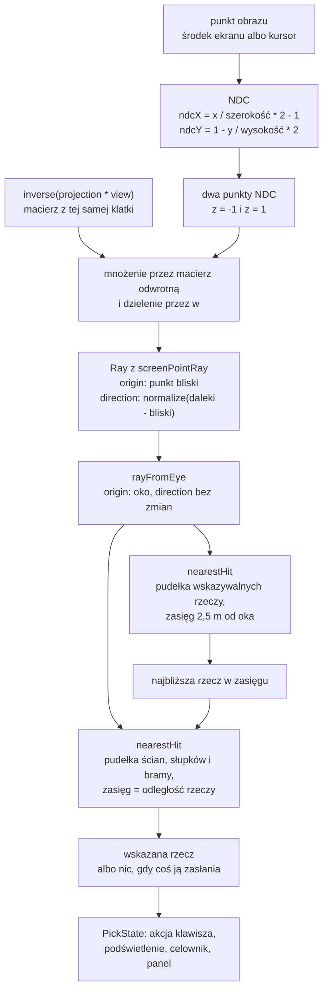

# Moduł scene: promień i selekcja obiektów (ray casting)

Kamień milowy: M8, podstawy bez okna (matematyka i testy), a w M8, części 2: selekcja, dźwignie i kartki, podpięcie promienia do pętli klatki działającej gry. Temat wykładu: 15 (Selekcja obiektów).
Kod: [`src/scene/Raycast.hpp`](../../../src/scene/Raycast.hpp), [`src/scene/Raycast.cpp`](../../../src/scene/Raycast.cpp), testy w [`tests/RaycastTests.cpp`](../../../tests/RaycastTests.cpp). Użytkownicy promienia: [`src/game/Interactables.cpp`](../../../src/game/Interactables.cpp) (funkcja `pickInteractable`, opisana w [`../game/interactables.md`](../game/interactables.md)), [`src/game/Interaction.hpp`](../../../src/game/Interaction.hpp) i [`src/game/Interaction.cpp`](../../../src/game/Interaction.cpp) (promień z oka, wynik jednej klatki, akcja klawisza, podświetlenie), [`src/game/NightMazeApp.cpp`](../../../src/game/NightMazeApp.cpp) (funkcje `pickForFrame`, `handleInteraction`, `drawPickLines`), [`src/game/InteractableRenderer.cpp`](../../../src/game/InteractableRenderer.cpp) (rysowanie z podświetleniem), [`src/debug/Hud.cpp`](../../../src/debug/Hud.cpp) (celownik i podpowiedź) i [`src/debug/panels/CollisionPanel.cpp`](../../../src/debug/panels/CollisionPanel.cpp) (ostatni promień). Testy gry: [`tests/InteractionTests.cpp`](../../../tests/InteractionTests.cpp).

Część modułu `scene`. Wstęp do modułu i jego miejsce w warstwach są w [`README.md`](README.md). Ten dokument korzysta z pudełka `Aabb` i kuli `Sphere` z [`collision.md`](collision.md) (sekcje 2.1, 2.9 i 2.11), z macierzy widoku i rzutowania z [`camera.md`](camera.md) (sekcje 2 i 5) oraz z biblioteki GLM ([`../../libraries/glm.md`](../../libraries/glm.md): `vec3`, `vec4`, `mat4`, `dot`, `normalize`, `inverse`). Testy są napisane w bibliotece doctest ([`../../libraries/doctest.md`](../../libraries/doctest.md)).

## 1. Po co to jest

Do M7 gracz mógł chodzić, zbierać kryształy i dojść do wyjścia, ale nie mógł **wskazać** żadnej rzeczy w świecie. M8 dodaje dwie rzeczy, które się wskazuje (a druga część M8 podpina wskazywanie do działającej gry): dźwignię, która obniża jedną ścianę labiryntu, i kartkę z podpowiedzią ([`../game/interactables.md`](../game/interactables.md)). Żeby je wskazać, program musi odpowiedzieć na pytanie: **na co patrzy gracz** (albo na co wskazuje kursor myszy)?

Odpowiedzią jest **promień** (ray): półprosta, która startuje w kamerze i biegnie przez wybrany punkt obrazu w głąb sceny. Pierwsza rzecz, w którą ten promień uderzy, jest tą, którą gracz wskazał. Technika nazywa się **ray casting** (rzucanie promienia), a w wykładzie to temat 15, "Selekcja obiektów".

Plik `Raycast` robi cztery rzeczy:

| Co | Funkcja | Sekcja |
|---|---|---|
| gdzie promień trafia w pudełko | `scene::intersect(const Ray&, const Aabb&)` | 2.2 do 2.5 |
| gdzie promień trafia w kulę | `scene::intersect(const Ray&, const Sphere&)` | 2.6 |
| pierwsze pudełko z listy w zasięgu | `scene::nearestHit` | 2.11 |
| promień przez punkt obrazu (piksel) | `scene::screenPointRay` | 2.8 do 2.10 |

Tak jak `Aabb`, `Camera` i `Transform`, to zwykłe dane i matematyka: żadnego wywołania OpenGL, żadnej myszy, żadnego okna. Dzięki temu całość da się sprawdzić testami jednostkowymi bez okna.

**Stan na dziś (2026-10-06), uczciwie.** Promień działa teraz w pętli klatki gry. Co jest sprawdzone i czym:

| Co | Czym sprawdzone | Kto |
|---|---|---|
| matematyka promienia (`Raycast`) | 17 przypadków w `tests/RaycastTests.cpp` (policzone z pliku: 17 makr `TEST_CASE`, w nich 30 podprzypadków `SUBCASE`) | bramka projektu, zgłoszona przez autora kodu |
| wskazywanie w świecie i rundzie (promień z oka, ściana otwarta dźwignią nie zasłania, akcja klawisza, karta kartki, podświetlenie, macierze modeli) | 21 nowych przypadków w `tests/InteractionTests.cpp` (policzone z pliku: 21 makr `TEST_CASE`) | bramka projektu, zgłoszona przez autora kodu |
| bramka `make check` | **466 przypadków i 152264 asercji** w Debug i Release (przed tą porcją 445 i 150296) | zgłoszone przez autora kodu. Ja ich nie uruchamiałem: ten dokument opisuje kod z plików |
| start Debug | czysty log, wymienia nowe modele i tekstury jako wczytane | zgłoszone przez autora kodu |
| obraz działającej gry | **widziane na zrzucie ekranu przez agenta (2026-10-06), nie przez właściciela**: lista w sekcji 5.14 | agent, który napisał kod, uruchomił grę skryptem i oglądał zrzuty |
| ręczny test właściciela, macOS | **otwarte** | lista kontrolna w [`../../guides/build-windows.md`](../../guides/build-windows.md), sekcja 24.2, i w [`../../guides/build-macos.md`](../../guides/build-macos.md) |

Zrzuty agenta to nowa kategoria dowodu: lepsza niż sam test jednostkowy (ktoś zobaczył obraz), ale nie jest testem właściciela i nie obejmuje wszystkiego. Czego agent **nie** widział, wymienia sekcja 5.14. Model dźwigni, który z przodu czytał się jak szara płyta, został przerobiony, a podpowiedź przeniesiona na dół okna; zrzuty po przeróbce są w sekcji 5.14. Znane drobne uwagi kosmetyczne: z 1 m na wprost gałka w górnym położeniu zasłania górną trzecią część płyty, a przy wyłączonej latarce i bez podświetlenia płyta jest prawie czarna na ścianie.

### 1.1 Decyzja właściciela a wybory implementacji

Te dwie rzeczy trzeba rozdzielać na obronie. Decyzję podjął właściciel projektu, a wybory implementacji to moje rozwiązania, do których dochodzi uzasadnienie.

**Decyzje właściciela (2026-10-06), w całości:** (1) wybieranie obiektów to **ray casting**: promień z kamery przez **środek ekranu**, gdy mysz jest przechwycona (tak gracz chodzi i rozgląda się), albo przez **kursor**, gdy mysz jest wolna; (2) dźwignia otwiera skrót, obniżając jeden wewnętrzny odcinek ściany; (3) kartka pokazuje krótką podpowiedź na karcie HUD. Pierwsza jest sednem tego dokumentu, dwie pozostałe opisuje [`../game/interactables.md`](../game/interactables.md). Wszystko inne poniżej (promień z oka, podświetlenie, zasady kliknięć, panel) to wybory implementacji.

**Wybory implementacji** (każdy z uzasadnieniem z komentarzy w kodzie, a tam, gdzie kod żadnego nie podaje, powiedziane wprost):

| Wybór | Uzasadnienie z kodu |
|---|---|
| test pudełka metodą płyt (slab method) | komentarz: pudełko to część wspólna trzech płyt, a promień jest w pudełku tam, gdzie jest w trzech płytach naraz: od **najpóźniejszego** wejścia do **najwcześniejszego** wyjścia |
| przedział odległości zaczyna się od 0, nie od minus nieskończoności | komentarz: dokładnie to odcina wszystko, co jest za początkiem promienia |
| styk (promień ślizga się po ścianie, dotyka krawędzi albo narożnika) jest trafieniem | komentarz: promień jest nieskończenie cienki, więc nigdy nie ma "wspólnej objętości" z niczym, a dotyk jest jedynym kontaktem, jaki ma. To **odwrotnie** niż w `overlaps` ([`collision.md`](collision.md), sekcja 2.3) |
| początek wewnątrz bryły albo na jej powierzchni to trafienie z odległością 0 | komentarz w nagłówku i testy |
| kierunek o długości 0 to "brak promienia": nic nie trafia, nawet bryła, w której leży początek | komentarz: bez wcześniejszego wyjścia pętla uznałaby taki promień za "równoległy do wszystkiego" i zgłosiła trafienie dla początku wewnątrz pudełka |
| kierunek musi być wektorem jednostkowym | komentarz: tylko wtedy `t` jest odległością w metrach |
| promień z `screenPointRay` startuje na **bliskiej płaszczyźnie**, nie w oku | komentarz w nagłówku opisuje fakt ("w punkcie rysowanym dokładnie w tym miejscu obrazu"), ale **nie podaje powodu**. Moja analiza jest w sekcji 2.10 |
| zasięg to odległość liczona po promieniu; pudełko dokładnie w zasięgu się liczy | komentarz przy `nearestHit` |
| w grze promień startuje w **oku**, nie na bliskiej płaszczyźnie (`rayFromEye`) | komentarz w `Interaction.hpp`: zasięg gracza jest mierzony od oka, kierunek zostaje ten sam. Sekcja 2.10 i notatka [`../../decisions/pick-ray-starts-in-the-eye.md`](../../decisions/pick-ray-starts-in-the-eye.md) |
| podświetlenie wskazanego obiektu to pulsujący `uEmissive`, bez nowego shadera | komentarz w `Interaction.hpp`. Sekcja 4 i notatka [`../../decisions/highlight-as-emissive-pulse.md`](../../decisions/highlight-as-emissive-pulse.md) |
| wskazywanie liczy się raz na klatkę, po ruchu myszy, przed rysowaniem | komentarze w `onRender`. Sekcja 5.10 |
| z dwóch pudełek w tej samej odległości wygrywa wcześniejsze na liście | komentarz: `<`, nie `<=` |
| `screenPointRay` rzuca `std::invalid_argument` dla rozmiaru obrazu nie większego od 0 | komentarz: zminimalizowane okno ma rozmiar 0 i wołający nie ma wtedy prosić o promień |

## 2. Teoria

### 2.1 Promień

**Promień** to punkt początkowy `origin` i kierunek `direction`. Punkt promienia w odległości `t` to:

```text
P(t) = origin + t * direction        dla t >= 0
```

Warunek `t >= 0` odróżnia promień od **prostej**: prosta biegnie w obie strony, promień tylko do przodu. Gdy `direction` ma długość 1 (wektor jednostkowy), `t` jest odległością od początku w metrach. Cały kod zakłada tę jednostkowość, a w pułapce 1 jest, co się dzieje, gdy ją złamać.

W kodzie to struktura:

```cpp
struct Ray {
    glm::vec3 origin{0.0F};
    glm::vec3 direction{0.0F, 0.0F, -1.0F};
};
```

Domyślny kierunek to `-Z`, tak jak patrzy nowa `Camera` (konwencja z [`camera.md`](camera.md): prawoskrętny układ, `Y` w górę, `-Z` do przodu). Test `a new ray starts in the origin and looks along -Z like a new camera` przypina to do kamery.

### 2.2 Metoda płyt: pudełko jako trzy przedziały

Pudełko `Aabb` to część wspólna **trzech płyt** (slabs). Płyta osi `x` to wszystko między płaszczyznami `x = min.x` i `x = max.x`, i tak samo dla `y` i `z`. Na każdej osi promień jest w płycie przez jeden przedział odległości: od odległości, na której przecina pierwszą płaszczyznę, do odległości, na której przecina drugą. W pudełku jest tam, gdzie jest w **wszystkich trzech** płytach jednocześnie:

```text
wejście do pudełka = największe z trzech wejść do płyt
wyjście z pudełka  = najmniejsze z trzech wyjść z płyt
trafienie, gdy wejście <= wyjście
```

To jest to samo, co wspólna długość dwóch przedziałów z [`collision.md`](collision.md), sekcja 2.2 (`min(a.max, b.max) - max(a.min, b.min)`), tylko tu jeden z przedziałów jest zbudowany z promienia.

Odległość do płaszczyzny to rozwiązanie równania `origin + t * direction = płaszczyzna` na jednej osi:

```text
t = (płaszczyzna - origin) / direction        (na tej osi)
```

**Przykład w 2D** (widok z góry, płaszczyzna XZ). Pudełko ma `x` od 1 do 3 i `z` od 1 do 3. Promień startuje w `(0, 0)` i ma kierunek `(0,6, 0,8)` (długość 1):

```text
oś x:  wejście (1 - 0) / 0,6 = 1,667      wyjście (3 - 0) / 0,6 = 5
oś z:  wejście (1 - 0) / 0,8 = 1,25       wyjście (3 - 0) / 0,8 = 3,75

wejście do pudełka = max(1,667; 1,25) = 1,667
wyjście z pudełka  = min(5; 3,75)     = 3,75
1,667 <= 3,75, więc trafienie w odległości 1,667
```

```text
t:         0     1     2     3     4     5
płyta x:               |=================|      od 1,667 do 5
płyta z:         |==========|                    od 1,25  do 3,75
wspólnie:              |=====|                   od 1,667 do 3,75: w pudełku
```

Punkt trafienia to `P(1,667) = (1, 1,333)`: leży na ścianie `x = 1` (zachodniej) i `z = 1,333` mieści się w przedziale od 1 do 3, więc promień wszedł przez tę ścianę.

**Kierunek ujemny.** Gdy składowa kierunku jest ujemna, promień przecina płaszczyznę `max` wcześniej niż `min`, więc dwie odległości są odwrócone. Kod zamienia je miejscami (`std::swap`), żeby `slabEnter` było zawsze mniejsze od `slabExit`.

**Przykład w 3D, z kodu testów.** Pudełko `BOX` z testów ma `min = (-1, -1, -6)` i `max = (1, 1, -4)`, a promień startuje w początku układu i biegnie wzdłuż `-Z`:

| Oś | Kierunek | Co robi kod | Wejście | Wyjście |
|---|---|---|---|---|
| x | 0 | początek 0 leży między -1 a 1, więc ta oś niczego nie ogranicza (sekcja 2.3) | bez zmian | bez zmian |
| y | 0 | tak samo | bez zmian | bez zmian |
| z | -1 | `(-6 - 0) / -1 = 6` i `(-4 - 0) / -1 = 4`, po zamianie wejście 4, wyjście 6 | 4 | 6 |

Wejście `max(0, 4) = 4`, wyjście `min(nieskończoność, 6) = 6`, a `4 > 6` jest fałszem: trafienie w odległości 4 m. To jest pierwszy przypadek testu `a ray that runs into a box hits it where it enters`.

**Przykład ukośny** (trzeci przypadek tego samego testu, trójkąt 3-4-5). Początek `(3, 0, 0)`, cel `(0, 0, -4)`, kierunek `(-0,6, 0, -0,8)`:

```text
oś x:  (-1 - 3) / -0,6 = 6,667 i (1 - 3) / -0,6 = 3,333; po zamianie wejście 3,333, wyjście 6,667
oś y:  kierunek 0, początek 0 leży między -1 a 1: bez ograniczenia
oś z:  (-6 - 0) / -0,8 = 7,5 i (-4 - 0) / -0,8 = 5;      po zamianie wejście 5,     wyjście 7,5

wejście = max(0; 3,333; 5) = 5      wyjście = min(nieskończoność; 6,667; 7,5) = 6,667
5 <= 6,667: trafienie w odległości 5 m
```

Test oczekuje `5,0`: droga od `(3, 0, 0)` do `(0, 0, -4)` ma długość 5 (trójkąt prostokątny o bokach 3 i 4).

### 2.3 Przypadek równoległy: kierunek 0 na jednej osi

Wzór `t = (płaszczyzna - origin) / direction` dzieli przez składową kierunku. Gdy ta składowa to dokładnie 0, promień biegnie **równolegle** do obu płaszczyzn płyty i nigdy ich nie przecina. Dzielenie przez zero dałoby nieskończoność albo `NaN`, więc ten przypadek ma osobną odpowiedź:

- **początek między płaszczyznami** (włącznie z leżeniem dokładnie na jednej): ta oś niczego nie ogranicza, kod robi `continue`,
- **początek poza płytą**: promień nigdy do niej nie wejdzie, kod od razu zwraca "brak trafienia".

Test `a ray parallel to faces of a box hits only from between those faces` pokazuje oba warianty: promień wzdłuż `-Z` z `x = 0,9` trafia, a z `x = 1,5` pudełko mija "choćby był nieskończenie długi". Trzeci przypadek biegnie wzdłuż `+X` i jest równoległy do czterech ścian naraz.

Dlaczego tylko dokładne zero: bardzo mała, ale niezerowa składowa daje bardzo dużą odległość do płaszczyzny, co jest poprawne: promień biegnący niemal równolegle potrzebuje bardzo długiej drogi, żeby ją przeciąć. Porównanie `direction == 0.0F` łapie też `-0.0F`, bo w arytmetyce zmiennoprzecinkowej `-0 == 0`.

### 2.4 Dlaczego przedział zaczyna się od 0

Kod ustawia na początku `enterDistance = 0` i `exitDistance = nieskończoność`. Gdyby wejście zaczynało od minus nieskończoności, test liczyłby **prostą**, a nie promień: pudełko leżące **za** początkiem też miałoby przedział, tylko z ujemnymi odległościami, i zostałoby uznane za trafione.

Z zerem na początku pudełko za plecami promienia wychodzi tak: wszystkie jego odległości są ujemne, więc `exitDistance` spada poniżej zera, a `enterDistance` zostaje na 0. Warunek `enterDistance > exitDistance` jest wtedy spełniony i funkcja zwraca "brak trafienia". Pokazuje to test `the box is behind the origin`: początek w `(0, 0, 0)`, kierunek `+Z`, pudełko leży przy `z` od -6 do -4. Odległości na osi `z` to `-6` i `-4`, wejście `-6`, wyjście `-4`, więc po przycięciu: wejście `max(0, -6) = 0`, wyjście `min(nieskończoność, -4) = -4`, `0 > -4`: brak trafienia.

Ta sama zasada daje przy okazji **początek wewnątrz pudełka**. Wtedy na każdej osi wejście jest ujemne, a wyjście dodatnie, więc `enterDistance` zostaje na 0 i funkcja zwraca trafienie w odległości 0. Test `a ray that starts inside a box, or on it, hits at the distance 0` sprawdza to dla środka, dla dowolnego kierunku i dla początku leżącego na bliskiej ścianie.

### 2.5 Styk jest trafieniem

W `overlaps` ([`collision.md`](collision.md), sekcja 2.3) styk **nie** jest nakładaniem. W promieniu jest odwrotnie: warunek brzmi `enterDistance > exitDistance` (ostro "większe"), więc przedział o długości 0 to trafienie. Powód z komentarza w kodzie: promień jest nieskończenie cienki i nigdy nie dzieli z niczym objętości, więc gdyby styk nie liczył się, promień nie trafiałby w nic.

Trzy rodzaje styku, wszystkie w teście `a ray that only grazes a box hits it`:

- **wzdłuż ściany**: promień z `x = 1` biegnący wzdłuż `-Z` leży w płaszczyźnie prawej ściany. Na osi `x` kierunek jest 0, a początek leży dokładnie na płaszczyźnie, więc przechodzi (sekcja 2.3). Trafienie w odległości 4,
- **przez krawędź**: promień z `(2, 0, -5)` w kierunku `(-1, 0, 1)` znormalizowanym. Oglądany z góry dotyka pudełka w jednym punkcie `(1, -4)`, na krawędzi między bliską a prawą ścianą, po pierwiastku z 2 metra. Na osi `x` przedział to od 1,414 do 4,243, na osi `z` od -1,414 do 1,414. Wejście `max(0; 1,414; -1,414) = 1,414`, wyjście `min(nieskończoność; 4,243; 1,414) = 1,414`, równe, więc trafienie,
- **tuż obok**: ten sam promień przesunięty o 1 cm (`x = 2,01`) ma wejście 1,428 i wyjście 1,414, czyli pudełko mija.

Wniosek ostrożny: trafienie "na styk" w arytmetyce `float` działa dla liczb tego testu, ale nie ma gwarancji dla dowolnych, bo dwie odległości liczone różnymi działaniami mogą różnić się o ostatni bit (pułapka 2).

### 2.6 Kula

Kula `Sphere` to środek `center` i promień `radius` (z [`collision.md`](collision.md), sekcja 2.9). Test promienia z kulą opiera się na **dwóch trójkątach prostokątnych**, bez równania kwadratowego.

Oznaczenia: `toCenter = center - origin`, `d = |toCenter|` (odległość początku od środka), `r` promień kuli.

1. **Początek w kuli albo na niej** (`d <= r`): trafienie w odległości 0.
2. **Najbliższy punkt promienia środkowi.** `closestDistance = dot(toCenter, direction)` to długość "cienia" wektora `toCenter` na promień, czyli odległość wzdłuż promienia do punktu najbliższego środkowi. Gdy `closestDistance <= 0`, środek nie jest przed początkiem, a skoro początek jest poza kulą, promień od niej ucieka: brak trafienia.
3. **Pierwszy trójkąt prostokątny.** Początek, środek i punkt najbliższy środkowi tworzą trójkąt prostokątny: przeciwprostokątna to `d`, jedna przyprostokątna to `closestDistance`, druga to odległość, w jakiej promień mija środek. Z Pitagorasa kwadrat tej drugiej to `missDistanceSquared = d^2 - closestDistance^2`. Gdy jest większy od `r^2`, promień mija kulę: brak trafienia. Równy `r^2` to styk w jednym punkcie i **jest** trafieniem.
4. **Drugi trójkąt prostokątny.** Środek, punkt najbliższy i punkt wejścia do kuli: przeciwprostokątna to `r`, jedna przyprostokątna to `sqrt(missDistanceSquared)`, a druga to `halfChord = sqrt(r^2 - missDistanceSquared)` (pół cięciwy). Promień wchodzi do kuli o `halfChord` **przed** punktem najbliższym:

```text
distance = closestDistance - halfChord
```

```text
widok z boku: promień biegnie poziomo, N to punkt najbliższy środkowi, E punkt wejścia

origin ---------E--------N--------> promień
                 \       |
                  r      | miss
                    \    |
                      \  |
                        C (środek kuli)

pierwszy trójkąt: origin, N, C (kąt prosty w N):  d^2 = closestDistance^2 + miss^2
drugi trójkąt:    E, N, C      (kąt prosty w N):  r^2 = halfChord^2 + miss^2
odległość wejścia: |origin E| = closestDistance - halfChord
```

(Punkt `N` to rzut środka `C` na promień. `miss` to odległość, w jakiej promień mija środek.)

**Przykład z testów.** Kula `SPHERE`: środek `(0, 0, -5)`, `r = 1`. Promień z `(0,6, 0, 0)` wzdłuż `-Z`:

```text
toCenter = (-0,6; 0; -5)         d^2 = 0,36 + 25 = 25,36
closestDistance = dot(toCenter; (0, 0, -1)) = 5
missDistanceSquared = 25,36 - 25 = 0,36      (0,36 <= 1: nie mija)
halfChord = sqrt(1 - 0,36) = 0,8
distance = 5 - 0,8 = 4,2
```

To drugi przypadek testu `a ray that runs into a sphere hits it where it enters` (komentarz w teście mówi o trójkącie 0,6-0,8-1). Przy `x = 1` wychodzi `missDistanceSquared = 26 - 25 = 1`, równe `r^2`, `halfChord = 0` i trafienie w odległości 5: ten sam przypadek testowy, podprzypadek `it touches the sphere in one point`.

Dlaczego w teście kuli kod porównuje kwadraty (`d^2` z `r^2`), a pierwiastek liczy tylko raz, przy `halfChord`: to ta sama zasada co w [`collision.md`](collision.md), sekcja 2.10. Test kuli wymaga **jednostkowego** kierunku: iloczyn skalarny `dot(toCenter, direction)` jest długością cienia tylko wtedy, gdy `|direction| = 1` (ćwiczenie 9 pokazuje, co się dzieje w przeciwnym razie).

### 2.7 Przypadki brzegowe

| Przypadek | Pudełko | Kula | Test |
|---|---|---|---|
| początek wewnątrz | trafienie, odległość 0 | trafienie, odległość 0 | `a ray that starts inside a box, or on it, hits at the distance 0`, `a ray that starts inside a sphere, or on it, hits at the distance 0` |
| początek na powierzchni | trafienie, odległość 0 (patrzy w głąb albo nie, bez znaczenia) | trafienie, odległość 0, także gdy promień idzie od kuli (`on the surface, looking away`) | te same dwa |
| styk (krawędź, narożnik, ściana) | trafienie | trafienie w jednym punkcie | `a ray that only grazes a box hits it`, podprzypadek `it touches the sphere in one point` |
| bryła za początkiem | brak trafienia (promień nie biegnie do tyłu) | brak trafienia | `the box is behind the origin`, `the sphere is behind the origin` |
| promień wyszedł już z kuli | nie dotyczy | brak trafienia (`the ray has already left the sphere`) | `a ray that passes a sphere or looks away from it does not hit` |
| kierunek o długości 0 | brak trafienia, także gdy początek jest wewnątrz | to samo | `a ray without a direction hits nothing` |
| składowa kierunku równa 0 | sekcja 2.3 | nie dotyczy | `a ray parallel to faces of a box hits only from between those faces` |

W teście kierunku zerowego ważny jest przypadek `inside`: początek leży w środku pudełka i środku kuli, a mimo to nie ma trafienia. To jest decyzja z komentarza w `Raycast.cpp`: promień bez kierunku "nigdzie nie idzie".

### 2.8 Od piksela do promienia: odwracanie rzutowania

Teraz druga połowa pliku. Mysz (albo środek ekranu) daje **punkt obrazu**, na przykład piksel `(320, 500)` w oknie 1280 na 720. Do testów z sekcji 2.2 do 2.7 potrzebny jest promień w **świecie**. Trzeba przejść łańcuch przestrzeni z [`camera.md`](camera.md) **w drugą stronę**: z ekranu do świata.

Droga w przód (rysowanie): `świat -> (macierz widoku) -> widok -> (rzutowanie) -> przycinanie -> (dzielenie przez w) -> NDC -> (viewport) -> piksele`. Droga wstecz to te same kroki od końca, z macierzą odwrotną. Kod `screenPointRay` robi je tak:

**Krok 1: piksel na NDC.** NDC (normalized device coordinates) to sześcian od -1 do 1 na każdej osi, w który rzutowanie zamyka widoczną część świata. Pozycja `position` jest liczona od **lewego górnego** rogu obrazu, `x` rośnie w prawo, `y` rośnie **w dół** (tak podaje kursor okno), a `size` to szerokość i wysokość obrazu:

```text
ndcX = position.x / size.x * 2 - 1
ndcY = 1 - position.y / size.y * 2        <- odwrócone: w NDC y rośnie w górę
```

Dzielenie przez rozmiar daje liczbę od 0 do 1, mnożenie przez 2 i odjęcie 1 rozciąga ją na przedział od -1 do 1. Dla `y` robi się to samo, ale od góry: stąd `1 - ...`. Liczby dla obrazu 1280 na 720:

| Piksel | `ndcX` | `ndcY` | Co to jest |
|---|---|---|---|
| `(0, 0)` | -1 | 1 | lewy górny róg |
| `(1280, 720)` | 1 | -1 | prawy dolny róg |
| `(640, 360)` | 0 | 0 | środek obrazu (tu patrzy gracz przy przechwyconej myszy) |
| `(320, 500)` | -0,5 | `1 - 500 / 720 * 2 = -0,389` | ćwierć szerokości od lewej, poniżej środka |

**Krok 2: jeden piksel to cała linia.** Wszystkie punkty świata leżące na jednej prostej przez oko są rysowane w tym samym pikselu (jeden zasłania drugi, to właśnie robi test głębi). Linię wystarczy znać w dwóch punktach: **na bliskiej** i **na dalekiej płaszczyźnie przycinania**. W NDC to punkty `(ndcX, ndcY, -1)` i `(ndcX, ndcY, 1)`. Kod ma na to stałe `NDC_NEAR = -1` i `NDC_FAR = 1`. Konwencja jest z OpenGL: głębia w NDC biegnie od -1 do 1, i tak działa `glm::perspective` w tym projekcie (nigdzie nie jest ustawione `GLM_FORCE_DEPTH_ZERO_TO_ONE`). Gdyby było, `NDC_NEAR` musiałoby wynosić 0. Pilnuje tego test z sekcji 5.7: promień przez środek obrazu ma startować dokładnie `nearPlane` przed okiem.

**Krok 3: macierz odwrotna i dzielenie przez `w`.** Punkt NDC dostaje czwartą składową `w = 1` (punkt, nie wektor: dzięki temu macierz może go przesuwać), jest mnożony przez `inverse(projection * view)`, a wynik dzielony przez własne `w`:

```cpp
const glm::vec4 clip{ndc, 1.0F};
const glm::vec4 world = inverseViewProjection * clip;
return glm::vec3{world} / world.w;
```

Dlaczego dzielenie. Macierz rzutowania perspektywicznego z GLM zostawia w `w` odległość od oka wzdłuż osi widzenia. Karta graficzna dzieli `x`, `y`, `z` przez to `w` w drodze na ekran (to dzielenie sprawia, że dalekie rzeczy są małe). Macierz odwrotna cofa mnożenie, ale nie to dzielenie, więc po jej zastosowaniu `w` jest różne od 1 i trzeba podzielić drugi raz, żeby wrócić do współrzędnych świata.

**Krok 4: promień.** Początek to punkt bliski, kierunek to `normalize(farPoint - nearPoint)`:

```cpp
return {.origin = nearPoint, .direction = glm::normalize(farPoint - nearPoint)};
```

**Przykład: środek obrazu.** W przestrzeni widoku punkt bliski to `(0, 0, -0,1)`, a daleki `(0, 0, -100)` (domyślna `Camera`: `nearPlane = 0,1`, `farPlane = 100`). W świecie to `oko + forward * 0,1` i `oko + forward * 100`, a ich różnica po normalizacji to `forward`. Test `the ray through the middle of the picture looks where the camera looks` sprawdza dokładnie to: kierunek równy `camera.forward()` i początek w `EYE + camera.forward() * camera.nearPlane`.

**Przykład: róg obrazu.** Kamera patrzy wzdłuż `-Z`, kąt widzenia pionowy `fovDegrees = 60`, proporcje 16 do 9. Połowa wysokości obrazu 1 m przed okiem to `tan(30 stopni) = 0,5774`, połowa szerokości to `0,5774 * 16 / 9 = 1,0264`. Promień przez lewy górny róg ma kierunek `forward - right * 1,0264 + up * 0,5774`, po normalizacji (długość `sqrt(1 + 1,0535 + 0,3333) = 1,5449`) w przybliżeniu `(-0,664; 0,374; -0,647)`. Test `the ray through a corner of the picture runs along an edge of the view frustum` sprawdza takie kierunki dla trzech punktów obrazu na kamerze obróconej w skos (liczby w tym akapicie to mój rachunek ręczny, nie wynik testu).

### 2.9 Piksele okna, piksele bufora i skala

`screenPointRay` przyjmuje `position` i `size` w **tej samej jednostce**: obie w współrzędnych ekranu albo obie w pikselach, nie ma znaczenia, który wariant, byle zgodnie. Ma to praktyczny powód. Okno GLFW ma dwa rozmiary: rozmiar okna w współrzędnych ekranu, w których GLFW podaje kursor, i rozmiar bufora ramki w pikselach (do `glViewport`). Na ekranie HiDPI drugi jest dwa razy większy. W projekcie rozdziela je `core::Window::windowSize()` ("Mouse positions use these units") i `core::Window::framebufferSize()` ("Use this for glViewport"). Test `the unit of the position does not matter as long as the size uses the same` pokazuje, że `(320, 500)` w obrazie 1280 na 720 i `(640, 1000)` w obrazie 2560 na 1440 dają ten sam promień.

Zminimalizowane okno ma rozmiar 0, a dzielenie przez 0 w kroku 1 dałoby `NaN` w całym promieniu. Dlatego funkcja rzuca `std::invalid_argument`, gdy szerokość albo wysokość nie jest większa od 0, a wołający ma takiego promienia w ogóle nie zamawiać (w grze robi to `pickForFrame`, sekcja 5.10).

### 2.10 Początek promienia: bliska płaszczyzna a oko

Początek promienia z `screenPointRay` to punkt **na bliskiej płaszczyźnie przycinania**, a nie oko. Dla promienia przez środek obrazu różnica to dokładnie `nearPlane`, czyli 0,1 m w domyślnej kamerze. Dla piksela z boku jest trochę więcej: punkt leży na płaszczyźnie `z = -0,1` w przestrzeni widoku, więc jego odległość od oka wzdłuż promienia to `0,1 / cos(kąt)`. Dla lewego górnego rogu z sekcji 2.8 wychodzi `0,1 / 0,647 = 0,155` m (rachunek własny).

Dlaczego funkcja tak robi (**analiza**, komentarz w nagłówku podaje tylko fakt):

- Oko jest **środkiem rzutowania**: żaden punkt NDC mu nie odpowiada, więc odwracanie macierzy nie może dać punktu "w oku". Najbliższy punkt, który odwrócenie daje bez żadnych dodatkowych założeń, leży na bliskiej płaszczyźnie.
- Rzeczy bliżej niż `nearPlane` nie są rysowane (są przycięte).

**Co z tym robi gra.** Zasięg gracza (`INTERACTION_REACH`, 2,5 m) ma być mierzony **od oka**, a promień z bliskiej płaszczyzny sięgałby od oka o 0,1 do około 0,155 m dalej, zależnie od miejsca w obrazie (w pierwszej wersji tego dokumentu to była pułapka 6, dziś jest rozwiązana). Dlatego `game::rayFromEye` zamienia początek na oko i **zostawia kierunek**:

```cpp
scene::Ray rayFromEye(const scene::Ray& screenRay, const glm::vec3& eye) {
    return {.origin = eye, .direction = screenRay.direction};
}
```

Czemu ten sam kierunek jest poprawny: w rzutowaniu perspektywicznym każdy promień przez punkt obrazu to prosta, która wychodzi **z oka**. Punkt na bliskiej płaszczyźnie, który zwraca `screenPointRay`, leży na tej prostej, więc prosta od oka w tym samym kierunku przechodzi przez ten sam punkt bliskiej płaszczyzny i przez ten sam piksel. Pilnuje tego test `the picking ray starts in the eye and keeps its direction`: sprawdza, że `ray.origin + ray.direction * toNear` wypada w początku promienia z ekranu (`toNear` to odległość od oka do tego początku). Uzasadnienie, alternatywy i kiedy wrócić: [`../../decisions/pick-ray-starts-in-the-eye.md`](../../decisions/pick-ray-starts-in-the-eye.md).

Cena: promień z oka może trafić rzecz, której kamera nie rysuje, bo leży bliżej niż `nearPlane`. Przy pudełkach dźwigni i kartek, które wiszą na ścianie, to nie ma praktycznego znaczenia (analiza, nie pomiar).

### 2.11 Najbliższe trafienie i zasięg

Promień zwykle trafia kilka rzeczy naraz (kilka pudełek za sobą). Wskazana jest ta **najbliższa**. `nearestHit` przechodzi po liście pudełek, dla każdego woła `intersect` i zapamiętuje najmniejszą odległość:

- pudełko, które promień mija, odpada,
- pudełko dalej niż `maxDistance` odpada (**zasięg** ręki gracza), a pudełko **dokładnie** w `maxDistance` jeszcze się liczy,
- z dwóch pudełek w tej samej odległości wygrywa to, które jest wcześniej na liście (porównanie `<`, nie `<=`),
- wynik to numer pudełka na liście, odległość i flaga `hit`.

Pudełko poza zasięgiem nie przesłania bliższego i nie jest "zastąpione" przez dalsze: biorą udział tylko pudełka w zasięgu (test `nearestHit skips what is out of reach`).

Zasłanianie (czy ściana jest między graczem a dźwignią) to ta sama funkcja użyta drugi raz, z listą ścian i zasięgiem równym odległości trafionej dźwigni: opisuje to [`../game/interactables.md`](../game/interactables.md), sekcja 2.10.

### 2.12 Ray casting a kolorowanie obiektów (colour picking)

Drugi popularny sposób wybierania obiektów to **colour picking**: każdy obiekt jest rysowany do osobnego bufora ramki w unikalnym kolorze (kolor jest numerem obiektu), a program czyta jeden piksel pod kursorem (`glReadPixels`) i z koloru odczytuje numer. Porównanie:

| Cecha | Ray casting (wybrany) | Colour picking |
|---|---|---|
| gdzie liczy | procesor, czysta matematyka | karta graficzna, potem odczyt na procesor |
| potrzebuje OpenGL | nie | tak: osobny bufor ramki, osobny shader, `glReadPixels` |
| da się sprawdzić testem bez okna | tak (17 przypadków w `RaycastTests.cpp`) | nie bez kontekstu OpenGL |
| dokładność | taka, jak bryła zastępcza: pudełko albo kula | co do piksela, na prawdziwej geometrii |
| odległość do obiektu | wynik funkcji, za darmo | trzeba dodatkowo czytać bufor głębi |
| zasięg ręki | jedno porównanie (`maxDistance`) | osobna logika po odczycie |
| zasłanianie ścianą | ten sam test z listą ścian | przez głębię, bo ściana jest w tym samym buforze |
| koszt | proporcjonalny do liczby brył na liście | dodatkowy przebieg rysowania całej sceny i synchronizacja z kartą przy odczycie |
| ryzyka | pudełko jest grubsze niż model (pułapka 7) | kolory identyfikatorów psują się przy mieszaniu, wygładzaniu krawędzi (MSAA) albo korekcji gamma |

**Decyzja właściciela:** ray casting (sekcja 1.1). Poniżej **moja analiza**, nie argument właściciela, dlaczego ta decyzja pasuje do tego projektu:

- Projekt ma już bryły `Aabb` i `Sphere` z testami bez okna i listę pudełek ścian, więc nie trzeba budować niczego nowego po stronie karty. Dźwignie i kartki dostają małe pudełka (`LEVER_BOX_*`, `NOTE_BOX_*`), a ściany są przesłaniaczami z tej samej listy, której używa kolizja.
- Odległość i zasięg są wynikiem funkcji, a pytanie "czy ściana jest między nami" jest tym samym testem z inną listą.
- Potok ma bufor HDR, korekcję gamma i przebiegi końcowe ([`../renderer/post-process.md`](../renderer/post-process.md)). Colour picking musiałby omijać każdy z tych kroków, żeby kolory identyfikatorów dotarły nietknięte.
- Cena decyzji: wskazuje się **pudełko**, a nie model. Dla dźwigni i kartki to wystarcza, dla bardziej kształtnych obiektów mogłoby nie wystarczyć.

### 2.13 Diagram: od ekranu do wskazanego obiektu



Lista "ścian, słupków i bramy" to w grze lista przeszkód rundy (`m_obstacles`): ściana otwarta dźwignią już w niej nie ma, więc promień ją mija (sekcja 5.10).

```text
widok z góry (XZ), promień biegnie w dół rysunku, zasięg 2,5 m

  kamera o  promień
          |
          |
  1,5 m   +==== B2 ====+            B2: trafione w 1,5 m, w zasięgu: wygrywa
          |     +=== B1 ===+       B1: leży obok promienia: chybione
          |
  2,5 m - - - - - - - - - - - -    granica zasięgu
          |
  3,0 m   +==== B3 ====+            B3: trafione w 3,0 m, poza zasięgiem: pomijane
          v
```

## 3. Jak to działa w OpenGL

Sam `Raycast` nie ma wywołań OpenGL: `Raycast.hpp` i `Raycast.cpp` dołączają tylko GLM i bibliotekę standardową (`<algorithm>`, `<cmath>`, `<limits>`, `<stdexcept>`, `<utility>`, `<span>`). Nie ma w nich GLAD ani żadnego wywołania `gl*`. OpenGL nie wie, że jakiekolwiek promienie istnieją.

Związek z OpenGL jest **konwencyjny**, i to on powoduje błędy, jeśli go pomylić:

| Konwencja | Skąd | Gdzie w kodzie |
|---|---|---|
| NDC to sześcian od -1 do 1, głębia od -1 (blisko) do 1 (daleko) | OpenGL i `glm::perspective` w domyślnym trybie | stałe `NDC_NEAR`, `NDC_FAR` |
| w NDC `y` rośnie w górę | OpenGL | `1 - position.y / size.y * 2` |
| kursor okna ma `y = 0` na **górze** i rośnie w dół | GLFW | ten sam wiersz, odwrócenie |
| kursor jest w współrzędnych ekranu, `glViewport` w pikselach bufora | GLFW | `Window::windowSize()` a `Window::framebufferSize()`, sekcja 2.9 i 5.10 |

**Co w grze dotyka OpenGL po stronie wskazywania.** Wybór ray castingu zamiast colour pickingu sprawia, że wskazywanie **nie dodaje przebiegu rysowania ani odczytu z karty**: ani `glReadPixels`, ani osobnego bufora ramki. Wszystko, co jest związane z OpenGL, to rzeczy, które i tak są w klatce:

| Co | Wywołanie albo mechanizm | Gdzie |
|---|---|---|
| podświetlenie wskazanej dźwigni albo kartki | jedna zmiana uniformu `uEmissive` (`shader.setVec3`, czyli `glUniform3f`) przed rysowaniem tego obiektu | `InteractableRenderer::draw`, sekcja 5.12 |
| widok debugowy promienia i pudełek | linie `GL_LINES` programem `color` (jedno wywołanie rysowania na pudełko i jedno na linię promienia) | `NightMazeApp::drawPickLines`, `ColliderLines::drawLine`, sekcja 6.2 |
| celownik, podpowiedź, karta kartki | ImGui, rysowane po scenie jak reszta HUD | `Hud.cpp`, sekcja 5.13 |

Test głębi linii ma znaczenie dla widoku debugowego: zielone pudełko trafienia jest rysowane **przed** pudełkiem w kolorze swojego rodzaju, dokładnie w tym samym miejscu. Przy domyślnym `glDepthFunc(GL_LESS)` fragment o **takiej samej** głębi nie przechodzi testu, więc zielone linie zostają. Gdyby test miał `GL_LEQUAL`, drugi rysunek nadpisałby pierwszy i zieleń by zniknęła. (Kod ustawia `GL_LEQUAL` tylko na czas rysowania nieba i wraca do `GL_LESS`.)

## 4. Shadery

Wskazywanie nie ma własnego shadera ani żadnej zmiany w pliku shadera. Podświetlenie wskazanego obiektu (kolumna "Przełącznik w ImGui" tematu 15) to **uniform, który programy i tak mają**: `uEmissive`, "własne światło powierzchni", którym wcześniej tylko świeciły kryształy.

| Program | Jak używa `uEmissive` | Efekt podświetlenia |
|---|---|---|
| `lit.frag` (Phong) | `fragColor = vec4(surface * (diffuse + uEmissive) + specular, 1.0)` | dodane do światła rozproszonego, pomnożone przez kolor powierzchni |
| `gouraud.frag` | ta sama linia | to samo |
| `textured.frag` (bez oświetlenia) | `texel * uTint * (vec3(1.0) + uEmissive)` w gałęzi rysowania z teksturą | rozjaśnia teksel mnożnikiem `1 + uEmissive` |
| `reflect.frag` | `+ surface * uEmissive` po zmieszaniu z otoczeniem | niewykorzystane przez dźwignie i kartki (rysuje je inny program) |

Dwa widoki debugowe, **Normals** i **UVs**, pokazują dane, a nie powierzchnię, i **ignorują** `uEmissive`: tam podświetlenia nie widać (komentarz w `drawUnlitMaze`). Co kod robi z wartością: `highlightGlow(seconds)` zwraca `HIGHLIGHT_COLOR * glow`, gdzie `glow` pulsuje między `HIGHLIGHT_MIN_GLOW` i `HIGHLIGHT_MAX_GLOW` (sekcja 5.9). Dlaczego emisja, a nie kontur: [`../../decisions/highlight-as-emissive-pulse.md`](../../decisions/highlight-as-emissive-pulse.md).

## 5. Kod w projekcie

### 5.1 Pliki

| Plik | Biblioteka | Potrzebuje OpenGL | Testy |
|---|---|---|---|
| `src/scene/Raycast.hpp`, `src/scene/Raycast.cpp` | `engine` | nie | 17 przypadków w `tests/RaycastTests.cpp` |
| `src/game/Interactables.cpp` (funkcja `pickInteractable`) | `game_logic` | nie | `tests/InteractablesTests.cpp`, opis w [`../game/interactables.md`](../game/interactables.md) |
| `src/game/Interaction.hpp`, `src/game/Interaction.cpp` (promień z oka, `PickState`, akcja klawisza, podświetlenie, macierze modeli) | `game_logic` | nie | 21 przypadków w `tests/InteractionTests.cpp` (razem z testami świata i rundy) |
| `src/game/InteractableRenderer.hpp`, `src/game/InteractableRenderer.cpp` (rysowanie dźwigni i kartek z podświetleniem) | plik wykonywalny `night_maze` | tak | brak testów jednostkowych. Częściowo widziane na zrzutach przez agenta (2026-10-06), nie przez właściciela (sekcja 5.14) |
| `src/game/NightMazeApp.cpp` (`pickForFrame`, `handleInteraction`, `drawPickLines`) | plik wykonywalny `night_maze` | tak | brak testów jednostkowych, jak reszta pętli klatki |
| `src/core/Input.hpp`, `src/core/Input.cpp` (`cursorPosition`) | `engine` | nie | brak osobnego testu |
| `src/debug/Hud.cpp`, `src/debug/panels/CollisionPanel.cpp` (celownik, podpowiedź, ostatni promień) | plik wykonywalny `night_maze` | tak (ImGui) | brak |

Plik `Raycast` jest w liście źródeł biblioteki `engine` w `CMakeLists.txt`, obok `Collider`, i dołącza `scene/Collider.hpp`, żeby użyć `Aabb` i `Sphere`. `Interaction.cpp` jest w bibliotece `game_logic` (zwykłe dane i matematyka, jak reszta tej biblioteki), a `InteractableRenderer.cpp` razem z innymi rysownikami w pliku wykonywalnym `night_maze` (potrzebują okna i kontekstu OpenGL).

### 5.2 `Ray`, `RayHit`, `NearestHit`

```cpp
struct Ray {
    glm::vec3 origin{0.0F};
    glm::vec3 direction{0.0F, 0.0F, -1.0F};
};

struct RayHit {
    bool hit = false;
    float distance = 0.0F;   // 0 when the ray starts inside the shape
};

struct NearestHit {
    bool hit = false;
    std::size_t index = 0;   // the number of the nearest box in the list
    float distance = 0.0F;
};
```

| Pole | Znaczenie |
|---|---|
| `Ray::origin` | początek w świecie |
| `Ray::direction` | kierunek, **jednostkowy**. Długość 0 jest dozwolona i znaczy "brak promienia" |
| `RayHit::hit` | prawda, gdy promień dotyka bryły albo wchodzi w nią przed swoim początkiem |
| `RayHit::distance` | odległość w metrach do pierwszego punktu bryły. Nie ma znaczenia, gdy `hit` jest fałszem |
| `NearestHit::index` | numer pudełka w liście przekazanej do `nearestHit`. Nie ma znaczenia bez trafienia |

Wszystkie trzy to czyste dane, jak `Aabb` i `Sphere`. Pola `distance` i `index` nie mają znaczenia, gdy `hit` jest fałszem: wołający musi najpierw sprawdzić `hit`.

### 5.3 `intersect` dla pudełka

```cpp
RayHit intersect(const Ray& ray, const Aabb& box) {
    if (glm::dot(ray.direction, ray.direction) == 0.0F) {
        return {};
    }

    float enterDistance = 0.0F;
    float exitDistance = std::numeric_limits<float>::infinity();

    for (int axis = 0; axis < AXIS_COUNT; ++axis) {
        const float origin = ray.origin[axis];
        const float direction = ray.direction[axis];

        if (direction == 0.0F) {
            if (origin < box.min[axis] || origin > box.max[axis]) {
                return {};
            }
            continue;
        }

        float slabEnter = (box.min[axis] - origin) / direction;
        float slabExit = (box.max[axis] - origin) / direction;
        if (slabEnter > slabExit) {
            std::swap(slabEnter, slabExit);
        }

        enterDistance = std::max(enterDistance, slabEnter);
        exitDistance = std::min(exitDistance, slabExit);

        if (enterDistance > exitDistance) {
            return {};
        }
    }

    return {.hit = true, .distance = enterDistance};
}
```

| Linia | Znaczenie |
|---|---|
| `glm::dot(ray.direction, ray.direction) == 0.0F` | kwadrat długości kierunku równy 0 znaczy kierunek zerowy: brak promienia, brak trafienia (sekcja 2.7) |
| `enterDistance = 0.0F` | przedział startuje od początku promienia: odcina wszystko za nim (sekcja 2.4) |
| `exitDistance = infinity()` | żadnego górnego ograniczenia, dopóki jakaś oś go nie da |
| `for (int axis ...)` i `ray.origin[axis]` | `glm::vec3` ma operator `[]`: 0 to `x`, 1 to `y`, 2 to `z`, stała `AXIS_COUNT = 3`. Ten sam kod obsługuje trzy osie |
| `direction == 0.0F` | przypadek równoległy (sekcja 2.3): osobna odpowiedź zamiast dzielenia przez zero |
| `origin < box.min[axis] \|\| origin > box.max[axis]` | początek poza płytą: promień nigdy do niej nie wejdzie. Nierówności ostre: początek dokładnie na płaszczyźnie jest "w środku" |
| `(box.min[axis] - origin) / direction` | odległość do płaszczyzny `min`, a dalej do `max` |
| `if (slabEnter > slabExit) std::swap` | kierunek ujemny: najpierw przecina się płaszczyznę `max` |
| `std::max(enterDistance, slabEnter)`, `std::min(exitDistance, slabExit)` | najpóźniejsze wejście i najwcześniejsze wyjście (sekcja 2.2) |
| `enterDistance > exitDistance` | ostro "większe": przedział o długości 0 to trafienie (sekcja 2.5). Sprawdzane po każdej osi, więc funkcja kończy się szybko, gdy nie ma szans |
| `return {.hit = true, .distance = enterDistance}` | `enterDistance` jest nadal 0, gdy początek leży wewnątrz. Inicjalizator desygnowany z C++20 |

Funkcja ma jedną pętlę po trzech osiach i żadnego pierwiastka. Dzielenia są dwa na oś.

### 5.4 `intersect` dla kuli

```cpp
RayHit intersect(const Ray& ray, const Sphere& sphere) {
    if (glm::dot(ray.direction, ray.direction) == 0.0F) {
        return {};
    }

    const glm::vec3 toCenter = sphere.center - ray.origin;
    const float radiusSquared = sphere.radius * sphere.radius;
    const float centerDistanceSquared = glm::dot(toCenter, toCenter);

    if (centerDistanceSquared <= radiusSquared) {
        return {.hit = true, .distance = 0.0F};
    }

    const float closestDistance = glm::dot(toCenter, ray.direction);
    if (closestDistance <= 0.0F) {
        return {};
    }

    const float missDistanceSquared = centerDistanceSquared - closestDistance * closestDistance;
    if (missDistanceSquared > radiusSquared) {
        return {};
    }

    const float halfChord = std::sqrt(radiusSquared - missDistanceSquared);
    return {.hit = true, .distance = closestDistance - halfChord};
}
```

| Linia | Znaczenie |
|---|---|
| pierwszy `if` | kierunek zerowy: nic nie trafia |
| `toCenter`, `radiusSquared`, `centerDistanceSquared` | wektor do środka, `r^2`, `d^2` (porównywane są kwadraty, bez pierwiastka) |
| `centerDistanceSquared <= radiusSquared` | początek w kuli albo na jej powierzchni: trafienie, odległość 0 |
| `closestDistance = dot(toCenter, direction)` | pierwszy trójkąt prostokątny: cień wektora do środka na promień (sekcja 2.6) |
| `closestDistance <= 0.0F` | środek nie leży przed początkiem, a początek jest poza kulą: kula za plecami |
| `missDistanceSquared = d^2 - closestDistance^2` | Pitagoras: kwadrat odległości, w której promień mija środek |
| `missDistanceSquared > radiusSquared` | mija: brak trafienia. Równość to styk i trafienie |
| `halfChord = sqrt(r^2 - missDistanceSquared)` | drugi trójkąt prostokątny: pół cięciwy. To jedyny pierwiastek w funkcji |
| `closestDistance - halfChord` | wejście do kuli jest o pół cięciwy **przed** punktem najbliższym |

### 5.5 `nearestHit`

```cpp
NearestHit nearestHit(const Ray& ray, std::span<const Aabb> boxes, float maxDistance) {
    NearestHit nearest;
    for (std::size_t index = 0; index < boxes.size(); ++index) {
        const RayHit hit = intersect(ray, boxes[index]);
        if (!hit.hit || hit.distance > maxDistance) {
            continue;
        }
        if (!nearest.hit || hit.distance < nearest.distance) {
            nearest = {.hit = true, .index = index, .distance = hit.distance};
        }
    }
    return nearest;
}
```

| Linia | Znaczenie |
|---|---|
| `std::span<const Aabb> boxes` | widok na listę pudełek: może to być `std::vector`, `std::array` albo pusta lista `{}`. Span niczego nie posiada ([`collision.md`](collision.md), pułapka 8) |
| `!hit.hit \|\| hit.distance > maxDistance` | nie trafione albo poza zasięgiem: pomijam. Ostre `>`: pudełko dokładnie w zasięgu zostaje |
| `!nearest.hit \|\| hit.distance < nearest.distance` | pierwsze znalezione albo bliższe od najlepszego. Ostre `<`: przy równych odległościach zostaje wcześniejsze |
| wynik domyślny `NearestHit nearest;` | `hit = false`: pusta lista albo same chybione pudełka dają "brak trafienia" |

Koszt to jeden test pudełka na element listy. Dla labiryntu 10 na 10 to około 240 pudełek ścian i słupków (liczba z [`collision.md`](collision.md), sekcja 6.2: 243 z bramą). Struktury przyspieszające są poza zakresem projektu.

### 5.6 `screenPointRay`

```cpp
Ray screenPointRay(const glm::vec2& position, const glm::vec2& size,
                   const glm::mat4& inverseViewProjection) {
    if (size.x <= 0.0F || size.y <= 0.0F) {
        throw std::invalid_argument("screenPointRay: the size of the picture must be positive");
    }

    const float ndcX = position.x / size.x * NDC_WIDTH - NDC_EDGE;
    const float ndcY = NDC_EDGE - position.y / size.y * NDC_WIDTH;

    const glm::vec3 nearPoint = worldPointFromNdc({ndcX, ndcY, NDC_NEAR}, inverseViewProjection);
    const glm::vec3 farPoint = worldPointFromNdc({ndcX, ndcY, NDC_FAR}, inverseViewProjection);

    return {.origin = nearPoint, .direction = glm::normalize(farPoint - nearPoint)};
}
```

| Linia | Znaczenie |
|---|---|
| `size.x <= 0.0F \|\| size.y <= 0.0F` | rozmiar zero (zminimalizowane okno) albo ujemny: wyjątek, nie `NaN` w promieniu |
| `NDC_WIDTH = 2`, `NDC_EDGE = 1` | stałe z komentarzem: sześcian NDC ma szerokość 2 (od -1 do 1), więc pozycja od 0 do 1 jest rozciągana razy 2 i przesuwana o 1 |
| `ndcY = NDC_EDGE - ...` | odwrócenie osi `y` (sekcja 2.8, krok 1) |
| `worldPointFromNdc(...)` | funkcja pomocnicza w anonimowej przestrzeni nazw: mnoży przez macierz odwrotną i dzieli przez `w` (krok 3) |
| `NDC_NEAR`, `NDC_FAR` | `-1` i `1`: dwa punkty prostej przez piksel |
| `glm::normalize(farPoint - nearPoint)` | kierunek jednostkowy, więc odległości są w metrach |

Macierz `inverseViewProjection` dostarcza wołający: to odwrotność `projection * view` kamery, **z którą narysowano obraz**, w tej samej klatce i z tymi samymi proporcjami (pułapka 11). Funkcja niczego nie wie o kamerze, oknie ani myszy: dostaje liczby.

### 5.7 Jak to zostało sprawdzone

Wszystkie 17 przypadków jest w `tests/RaycastTests.cpp`. Nie wymagają okna ani OpenGL. Liczby to wynik policzenia `TEST_CASE` w pliku, a to, że przechodzą, zgłosił autor kodu (sekcja 1).

| Przypadek testowy | Co przypina |
|---|---|
| `a new ray starts in the origin and looks along -Z like a new camera` | domyślne wartości `Ray` zgadzają się z nową `Camera` |
| `a ray that runs into a box hits it where it enters` | trafienie w bliską ścianę, wejście od drugiej strony i odległość mierzona po promieniu (trójkąt 3-4-5) |
| `a ray that passes a box or looks away from it does not hit` | mija z boku, mija nad pudełkiem, idzie w bok, pudełko za początkiem |
| `a ray that starts inside a box, or on it, hits at the distance 0` | środek, dowolny kierunek w środku, początek na bliskiej ścianie |
| `a ray parallel to faces of a box hits only from between those faces` | przypadek równoległy: między ścianami trafia, poza nimi nie |
| `a ray that only grazes a box hits it` | styk wzdłuż ściany, przez krawędź, a o 1 cm dalej brak trafienia |
| `a ray without a direction hits nothing` | kierunek zerowy, także z początkiem wewnątrz, dla pudełka, kuli i `nearestHit` |
| `a ray that runs into a sphere hits it where it enters` | w środek, poza środkiem (0,6-0,8-1), styk w jednym punkcie |
| `a ray that passes a sphere or looks away from it does not hit` | mija, kula za początkiem, promień już wyszedł |
| `a ray that starts inside a sphere, or on it, hits at the distance 0` | w środku, na powierzchni patrząc od kuli |
| `nearestHit finds the first box along the ray, whatever the order of the list` | najbliższe z nieposortowanej listy; podprzypadki: pudełko za początkiem, remis (wygrywa wcześniejsze), pusta lista i lista samych chybień |
| `nearestHit skips what is out of reach` | granica zasięgu: 3,9 odpada, 4,0 zostaje, 4,1 zostaje; dalsze pudełko nie zastępuje bliższego |
| `the ray through the middle of the picture looks where the camera looks` | środek obrazu: kierunek równy `forward`, długość 1, początek na bliskiej płaszczyźnie |
| `the ray through a corner of the picture runs along an edge of the view frustum` | lewy górny róg, prawy dolny róg i środek górnej krawędzi (pilnuje odwrócenia osi `y`) |
| `the ray through the place where a point is drawn hits that point` | pętla w obie strony: punkt świata, rzutowanie do piksela, promień przez ten piksel, trafienie w małą kulę wokół punktu |
| `the unit of the position does not matter as long as the size uses the same` | piksele ekranu a piksele bufora (dwa razy gęstsze) dają ten sam promień |
| `a picture without a size is an error` | szerokość 0, wysokość 0 i szerokość ujemna rzucają `std::invalid_argument` |

Test z pętlą w obie strony jest najmocniejszy: sprawdza zgodność `screenPointRay` z tym, co robi karta graficzna (mnożenie, dzielenie przez `w`, przeliczenie na piksele), a nie z własną wersją wzorów. Tolerancja testów kamery to `0,001` na składową, bo daleka płaszczyzna jest 100 m od oka, a `float` ma około siedmiu cyfr (komentarz w pliku testów).

### 5.8 Użycie: `pickInteractable`

`nearestHit` używa w kodzie gry `game::pickInteractable` w [`src/game/Interactables.cpp`](../../../src/game/Interactables.cpp): dwa razy dla pudełek dźwigni i kartek (z zasięgiem) i raz dla przesłaniaczy. Szczegóły w [`../game/interactables.md`](../game/interactables.md). Wołają ją `game::pickInRound` (sekcja 5.9) i testy. `screenPointRay` woła w grze jedna funkcja: `NightMazeApp::pickForFrame` (sekcja 5.10).

### 5.9 `Interaction.hpp`: wynik wskazywania jednej klatki

Plik [`src/game/Interaction.hpp`](../../../src/game/Interaction.hpp) i [`.cpp`](../../../src/game/Interaction.cpp) to zwykłe dane i matematyka (biblioteka `game_logic`), bez OpenGL, bez klawiatury i myszy: aplikacja buduje promień, a funkcje tu mówią, co on trafia i co robi klawisz. Dzięki temu testy mogą "wycelować" promień i "nacisnąć klawisz" bez okna. (Nagłówek odsyła do tego dokumentu, ale zawiera też macierze modeli dźwigni i kartek, które opisuje [`../game/interactables.md`](../game/interactables.md).)

```cpp
enum class Interaction { None = 0, PullLever, ReadNote, CloseNote };

struct PickState {
    bool hasRay = false;     // false: no ray could be built in this frame
    bool centered = false;   // true: through the middle, false: through the free cursor
    scene::Ray ray;          // starts in the EYE
    PickedInteractable picked;
    Interaction action = Interaction::None;
};

struct PickDebugSettings {
    bool drawShapes = false;
    bool freezeRay = false;
};
```

| Funkcja | Co robi |
|---|---|
| `rayFromEye(screenRay, eye)` | początek w oku, kierunek bez zmian (sekcja 2.10) |
| `interactionFor(round, picked)` | akcja klawisza dla rundy i wskazanej rzeczy (reguły niżej) |
| `pickInRound(ray, centered, world, round, obstacles)` | `pickInteractable(ray, world.interactables, obstacles, INTERACTION_REACH)` i akcja. `obstacles` to lista przeszkód rundy (`roundObstacles`): ściany otwartej dźwignią w niej nie ma |
| `pickNothing(round)` | wynik bez promienia: `hasRay = false`, nic niewskazane. Akcja może nadal być `CloseNote` |
| `interact(round, world, pick)` | robi to, co mówi akcja: `closeNote`, `readNote` albo `pullRoundLever`. Zwraca `true`, gdy otworzyła się ściana (wołający odbudowuje wtedy listę przeszkód) |
| `interactionPrompt(action)` | tekst podpowiedzi: `"E: pull lever"`, `"E: read note"`, `"E: close"`, a dla `None` pusty |
| `highlightGlow(seconds)` | kolor emisji podświetlenia w tej chwili |

**Reguły `interactionFor`** (kolejność ma znaczenie):

1. runda inna niż `Playing` (wygrana): `None`. Wygrana runda jest skończona,
2. karta kartki otwarta (`round.noteOpen`): `CloseNote`, **cokolwiek** promień wskazuje, także nic,
3. wskazana dźwignia, która nie jest jeszcze pociągnięta: `PullLever`. Pociągnięta: `None`. Numer dźwigni jest sprawdzany przed użyciem (`PickedInteractable` mogłoby pochodzić z innego labiryntu),
4. wskazana kartka: `ReadNote`,
5. inaczej `None`.

Z punktu 2 wynika zachowanie, które widać w grze: **otwarta karta wyłącza podpowiedź, pierścień celownika i podświetlenie**, nawet gdy celownik jest na dźwigni, bo wszystkie trzy wymagają akcji `PullLever` albo `ReadNote`.

`interact` pyta rundę o akcję **jeszcze raz** (`interactionFor(round, pick.picked)`) zamiast ufać `pick.action`. Test `interacting pulls a lever once and tells when a wall opened` woła dwa razy ten sam stary `PickState`: drugie wywołanie nic nie zmienia.

**Stałe podświetlenia** (z `Interaction.hpp`):

| Stała | Wartość | Znaczenie |
|---|---|---|
| `HIGHLIGHT_COLOR` | `(1,0; 0,8; 0,4)` | ciepła żółć, kolor liniowy |
| `HIGHLIGHT_MIN_GLOW` | 0,8 | najsłabsze świecenie (nigdy 0: wskazany obiekt zawsze się wyróżnia) |
| `HIGHLIGHT_MAX_GLOW` | 2,4 | najsilniejsze. Celowo dużo powyżej 1: w smudze latarki powierzchnia jest już oświetlona z siłą większą niż 1 i słabsze świecenie nie dałoby się od niej odróżnić |
| `HIGHLIGHT_PULSE_SPEED` | 5 rad/s | trochę mniej niż jeden puls na sekundę (pełny obrót to 6,28) |

```cpp
glm::vec3 highlightGlow(float seconds) {
    const float swing = 0.5F + 0.5F * std::sin(HIGHLIGHT_PULSE_SPEED * seconds);
    const float glow = HIGHLIGHT_MIN_GLOW + (HIGHLIGHT_MAX_GLOW - HIGHLIGHT_MIN_GLOW) * swing;
    return HIGHLIGHT_COLOR * glow;
}
```

Sinus waha się od -1 do 1, połowa plus jedna druga od 0 do 1 (`swing`), a mieszanie między najsłabszym i najsilniejszym świeceniem robi z tego pulsującą wartość. Czas to `m_round.animationSeconds`, zegar animacji rundy, który nie staje (puls trwa więc także po wygranej).

### 5.10 `pickForFrame`: gdzie powstaje promień w klatce

Funkcja `NightMazeApp::pickForFrame` jest wołana **raz na klatkę** z `onRender`. Kolejność w `onRender` ma znaczenie:

1. wczytanie żądań z panelu (nowy labirynt, restart, "Pull all levers"),
2. **ruch myszy** (obrót kamery), jeśli kursor jest przechwycony,
3. pozycja oka (`eye`, mieszanka dwóch kroków symulacji) i proporcje obrazu z **bufora ramki**,
4. macierze `view` i `projection` z tego oka (zbudowane wcześniej niż przed M8, dokładnie po to, żeby promień ich użył),
5. `m_pick = pickForFrame(view, projection, eye, cursorCaptured)`,
6. `handleInteraction(cursorCaptured)`: klawisz E albo klik użyje wyniku (sekcja 5.11),
7. `m_shownPick = m_pick`, chyba że promień jest zamrożony,
8. `m_wallMatrices = roundWallMatrices(...)` i dopiero potem oświetlenie i rysowanie.

Mysz jest więc czytana **przed** budową macierzy widoku: obraz i promień tej klatki używają tych samych, już nowych kątów. Gdyby promień był liczony z macierzy sprzed obrotu, celownik wskazywałby to, co było w środku obrazu klatkę wcześniej.

```cpp
PickState NightMazeApp::pickForFrame(const glm::mat4& view, const glm::mat4& projection,
                                     const glm::vec3& eye, bool cursorCaptured) {
    const core::Size windowSize = window().windowSize();
    if (windowSize.width <= 0 || windowSize.height <= 0) {
        return pickNothing(m_round);
    }
    const glm::vec2 size{static_cast<float>(windowSize.width),
                         static_cast<float>(windowSize.height)};

    glm::vec2 point = size / 2.0F;
    if (!cursorCaptured) {
        const core::CursorPosition cursor = input().cursorPosition();
        if (!cursor.valid) {
            return pickNothing(m_round);
        }
        point = {static_cast<float>(cursor.x), static_cast<float>(cursor.y)};
        if (point.x < 0.0F || point.y < 0.0F || point.x > size.x || point.y > size.y) {
            return pickNothing(m_round);
        }
    }

    const scene::Ray screenRay =
        scene::screenPointRay(point, size, glm::inverse(projection * view));
    return pickInRound(rayFromEye(screenRay, eye), cursorCaptured, m_mazeWorld, m_round,
                       m_obstacles);
}
```

| Fragment | Znaczenie |
|---|---|
| `window().windowSize()` | rozmiar okna **w współrzędnych ekranu**, w jednostce kursora. Rozmiar 0 (zminimalizowane okno): brak promienia, `screenPointRay` rzuciłby wyjątek (sekcja 2.9) |
| `point = size / 2` | kursor przechwycony: promień przez **środek obrazu**, tam, gdzie jest celownik. Decyzja właściciela |
| `input().cursorPosition()` | kursor wolny: promień przez **kursor**. `Input::cursorPosition` jest nieważne (`valid = false`), gdy mysz jest zablokowana dla gry, czyli gdy kursor jest nad panelem ImGui: kursor nad panelem wskazuje panel, a nie scenę za nim |
| sprawdzenie `point.x < 0 ...` | kursor, który wyszedł z okna, nic nie wskazuje |
| `glm::inverse(projection * view)` | odwrotność dokładnie tych dwóch macierzy, którymi rysowana jest klatka (pułapka 11) |
| `rayFromEye(screenRay, eye)` | początek w oku (sekcja 2.10). `eye` to oko mieszane między krokami, to samo, z którego zbudowano `view` |
| `m_obstacles` | lista przeszkód rundy: ściany bez tych otwartych dźwignią, słupki i zamknięta brama |

**Okno a bufor ramki: poprawne tylko dzięki równym proporcjom.** Punkt i rozmiar do `screenPointRay` pochodzą z **rozmiaru okna**, a proporcje obrazu w `projection` (`aspectRatio` w `onRender`) z **rozmiaru bufora ramki**. To dwie różne liczby: na ekranie Retina bufor ma dwa razy więcej pikseli, niż okno ma współrzędnych ekranu. Wynik jest poprawny, bo stosunek szerokości do wysokości jest w obu przypadkach ten sam (ten sam obszar okna, tylko inna jednostka), a `screenPointRay` dzieli pozycję przez rozmiar, więc liczy się wyłącznie stosunek (sekcja 2.9). Gdyby kiedyś proporcje się rozjechały, promień przesunąłby się względem obrazu. To ryzyko dla macOS, gdzie kod nie był uruchamiany.

**Co wchodzi do `m_obstacles`.** Lista jest odbudowywana tylko wtedy, gdy się zmienia: na początku rundy, gdy brama się otwiera, gdy dźwignia otwiera ścianę i gdy teren dostaje inną skalę wysokości. Promień jest więc zasłaniany przez to samo, przez co gracz nie przejdzie, a pociągnięcie dźwigni otwiera przejście także dla promienia (notatka [`../../decisions/opened-wall-stops-blocking-at-pull.md`](../../decisions/opened-wall-stops-blocking-at-pull.md)).

### 5.11 `handleInteraction`: klawisz, klik i zasady

```cpp
void NightMazeApp::handleInteraction(bool cursorCaptured) {
    const bool keyPressed = input().wasKeyPressed(INTERACT_KEY);
    const bool clicked = input().wasMouseButtonPressed(GLFW_MOUSE_BUTTON_LEFT);

    if ((keyPressed || clicked) && m_pick.action != Interaction::None) {
        if (interact(m_round, m_mazeWorld, m_pick)) {
            m_obstacles = roundObstacles(m_mazeWorld, m_round);
        }
        m_pick.action = interactionFor(m_round, m_pick.picked);
    } else if (clicked && !cursorCaptured) {
        input().setCursorCaptured(true);
    }
}
```

`INTERACT_KEY` to `GLFW_KEY_E`. Wynik `interact` mówi, czy ściana się otworzyła: wtedy lista przeszkód jest budowana od nowa. Po zadziałaniu akcja jest liczona ponownie: dźwignia, którą właśnie pociągnięto, nie jest w tej klatce podświetlona (`None`), a otwartą kartę da się zamknąć.

**Zasady, jak działają w kodzie** (decyzją właściciela jest tylko wybór źródła punktu promienia, reszta to wybory implementacji):

| Sytuacja | Co się dzieje |
|---|---|
| kursor przechwycony, E albo lewy klik, promień na dźwigni lub kartce w zasięgu | dźwignia jest pociągana, kartka się otwiera |
| kursor przechwycony, E albo klik, nic do użycia | nic |
| kursor wolny, lewy klik **na** dźwigni albo kartce, którą da się użyć | użycie (i **bez** przechwytywania kursora) |
| kursor wolny, lewy klik gdzie indziej w scenie | **przechwycenie kursora** (włącza obrót myszą i chodzenie, jak przed M8) |
| kursor wolny, **E** | też działa na to, co wskazuje kursor: klawisz nie sprawdza `cursorCaptured` |
| kursor wolny nad panelem ImGui | brak promienia, mysz zablokowana dla gry: klik w panel nie dociera do gry |
| kursor poza oknem | brak promienia |
| karta kartki otwarta | akcja to `CloseNote`: E albo **dowolny** klik zamyka kartę. Klik przy wolnym kursorze **nie** przechwytuje wtedy kursora (akcja nie jest `None`) |
| runda wygrana | brak akcji. Klik przy wolnym kursorze przechwytuje kursor |
| okno bez rozmiaru | brak promienia |
| pole tekstowe w panelu w edycji | klawiatura jest zablokowana dla gry, więc E w polu tekstowym nie pociąga dźwigni |

`wasKeyPressed` i `wasMouseButtonPressed` są prawdziwe przez **jedną** klatkę (krawędź naciśnięcia), a pociągnięta dźwignia i tak nie daje już akcji. Blokada myszy dla gry jest ustawiana w `main.cpp` z `wantsMouse()` panelu ImGui i obowiązuje od następnej klatki.

### 5.12 Podświetlenie i rysowanie: `InteractableRenderer`

Klasa [`InteractableRenderer`](../../../src/game/InteractableRenderer.hpp) rysuje dźwignie i kartki trzema modelami z pamięci podręcznej assetów (płytka dźwigni, uchwyt dźwigni, kartka). Jej `draw(shader, world, round, pick, highlight)` jest wołane z tych samych miejsc co rysowanie ścian: z `drawUnlitMaze`, `drawLitMaze` i z przebiegu cienia. Wskazany obiekt dostaje `uEmissive = highlight`, reszta `0`:

```cpp
const bool picked = pick.action == Interaction::PullLever && pick.picked.index == i;
shader.setVec3(EMISSIVE_UNIFORM, picked ? highlight : NO_GLOW);
```

`uEmissive` ustawia się dla **każdej** dźwigni i kartki, także niewskazanych: uniform zachowuje wartość między wywołaniami rysowania i poprzednia dźwignia mogła być tą wskazaną. Na końcu funkcja zeruje go, żeby kolejne rysowania tego programu nie dziedziczyły. Przebieg cienia dostaje pusty `PickState{}`: program głębi nie ma kolorów do podświetlenia. `highlight` to `highlightGlow(m_round.animationSeconds)`. Podświetla się tylko obiekt, którego akcja to `PullLever` albo `ReadNote`: pociągnięta dźwignia (akcja `None`) i wszystko przy otwartej karcie nie świeci. Macierze modeli, uchwyt i animację opisuje [`../game/interactables.md`](../game/interactables.md).

### 5.13 Celownik, podpowiedź i karta: `Hud.cpp`

HUD czyta `PickState` (tylko do odczytu) przez `DebugContext::pick`:

| Element | Kiedy | Wygląd (z kodu) |
|---|---|---|
| celownik | `pick.hasRay && pick.centered`, czyli tylko przy przechwyconym kursorze (wolny kursor sam pokazuje punkt) | kropka o promieniu 2 px w kolorze `HUD_CROSSHAIR_COLOR` (szarobiały), a gdy gracz może użyć wskazanej rzeczy (`PullLever` albo `ReadNote`) kropka i pierścień o promieniu 8 px i grubości 1,5 px w kolorze `HUD_CROSSHAIR_ACTIVE_COLOR` (ciepły, kolor latarki). Wymiary są mnożone przez skalę HUD. Rysowany na liście rysowania tła ImGui, więc nigdy nie zakrywa panelu ani karty |
| podpowiedź | gdy gracz może użyć wskazanej rzeczy | okno `Interaction prompt` z tekstem z `interactionPrompt` w kolorze celownika, krycie tła 0,55. Miejsce: dół okna pośrodku (`PROMPT_PLACE` = (0,5; 0,9) okna), więc podpowiedź nie zasłania wskazanego obiektu wokół celownika |
| karta kartki | `round.noteOpen` | okno `Note` pod środkiem ekranu (punkt `BELOW_CENTER` = (0,5; 0,74) okna w `Hud.cpp`, nad podpowiedzią, która stoi niżej), tytuł "A note on the wall", linia oddzielająca, tekst z `openNoteText` i na dole "E: close". Tekst jest liczony **w każdej klatce**: podpowiedź w stronę kryształu zmienia się, gdy ten kryształ zostanie zebrany |

`ImGui::Text("%s", text.c_str())`: tekst kartki idzie jako argument, nigdy jako format. `drawHud` ma od tej pory sygnaturę `(world, round, settings, pick)`.

### 5.14 Jak to zostało sprawdzone w grze

**Testy jednostkowe: 21 nowych przypadków** w `tests/InteractionTests.cpp` (policzone z pliku: 21 makr `TEST_CASE`). Plik testuje też świat i rundę (opisane w [`../game/interactables.md`](../game/interactables.md)). Te, które dotyczą wskazywania:

| Przypadek testowy | Co przypina |
|---|---|
| `the picking ray starts in the eye and keeps its direction` | `rayFromEye`: początek w oku, kierunek taki sam, a promień przechodzi przez ten sam punkt bliskiej płaszczyzny |
| `every lever and note of a world is picked from the middle of its cell` | z oka stojącego w środku komórki promień na pozycję dźwigni albo kartki wskazuje właśnie ją, z akcją `PullLever` albo `ReadNote`, a `centered` jest kopiowane do wyniku. Patrzenie w górę nic nie wskazuje |
| `a closed wall hides what is behind it, the wall a lever opened does not` | kartka za ścianą nie jest wskazana, po pociągnięciu dźwigni tej ściany jest |
| `interacting pulls a lever once and tells when a wall opened` | `interact` zwraca `true` raz, stary `PickState` nie pociąga drugi raz, pociągnięta dźwignia nadal jest wskazana, ale akcja to `None` |
| `a note opens its card, the key closes it first, and walking away closes it` | `ReadNote` nie otwiera ściany, akcja przy otwartej karcie to `CloseNote` także bez promienia (`pickNothing`), karta zamyka się po przejściu dalej niż `NOTE_READ_DISTANCE` |
| `a won round has nothing to interact with and closes the card` | w rundzie `Won` `interactionFor` daje `None` dla dźwigni i kartki, a numer dźwigni, której runda nie ma, nie jest błędem. **Uwaga:** mimo nazwy przypadek sprawdza tylko `interactionFor`, a nie to, że wygrana zamyka kartę (zamykanie jest w `updateRound` i nie ma własnej asercji) |
| `every action has its prompt` | teksty podpowiedzi |
| `the highlight pulses between its weakest and its strongest glow` | w 600 próbkach wartość mieści się między `HIGHLIGHT_MIN_GLOW` i `HIGHLIGHT_MAX_GLOW` i osiąga oba końce |
| `a model on a wall points away from the wall on every side of the cell` i `the handle of a lever turns around its pivot: up before the pull, down after` | macierze modeli (opisane w interactables.md) |

**Bramka projektu** (zgłoszona przez autora kodu, nie uruchamiana przeze mnie): `make check` przeszło z **466 przypadkami i 152264 asercjami** w Debug i Release (przed tą porcją 445 i 150296). Start Debug miał czysty log i wymienił nowe modele i tekstury jako wczytane.

**Zrzuty ekranu agenta.** Agent, który napisał kod, uruchomił grę, sterował nią skryptem i oglądał zrzuty ekranu. Poniższe rzeczy są zapisane jako **widziane na zrzucie ekranu przez agenta (2026-10-06), nie przez właściciela**:

- płytka dźwigni na ścianie z pierścieniem celownika i podpowiedzią "E: pull lever",
- po E uchwyt opuszczony i podpowiedź zniknęła,
- podświetlenie pulsuje (silniejsze przy wyłączonej latarce),
- kartka z liniami atramentu, jej karta z podpowiedzią i napisem "E: close", a po odejściu karta zniknęła,
- ściana otwarta, minimapa przestaje ją rysować i pokazuje korytarz za nią, gracz przechodzi,
- po R minimapa wraca do stanu początkowego i ściana znowu blokuje,
- zamrożony promień jako zielona linia, pudełko trafienia na zielono,
- panel Collision z początkiem, kierunkiem i "Hit: lever 0 at 0.72 m",
- klik wolnym kursorem na dźwigni pociągnął ją.

**Po przeróbce modelu dźwigni agent widział też (zrzuty z 2026-10-06, nie właściciel):** dźwignię od przodu z 1 m przy włączonej latarce, w górnym położeniu i podświetloną (ciemna płyta, jasna bursztynowa gałka nad środkiem, podpowiedź na dole pośrodku), ten sam widok po E (pręt w dół, gałka poniżej krawędzi płyty z cieniem na ścianie, bez podświetlenia i podpowiedzi), widoki z boku w górnym i dolnym położeniu, wyłączoną latarkę (pociągnięta: płyta prawie czarna, gałka ciemna ochra; w górze z podświetleniem: gałka świeci bursztynem), około 2,4 m pod kątem z podświetleniem i podpowiedzią oraz około 2,9 m poza zasięgiem bez podświetlenia, drugą dźwignię, Gouraud (z podświetleniem) i Unlit, widok Normals (dźwignia jako dane, bez podświetlenia, pierścień i podpowiedź nadal są), kartkę z "E: read note" na dole, wolną od arkusza, i otwartą kartę kartki bez podpowiedzi i bez nakładania się na minimapę.

**Czego agent NIE widział na ekranie:** uchwytu w połowie ruchu, cienia księżyca od dźwigni, Gouraud i Unlit dla kartki, widoku na wprost z 2,5 m, dodatków w panelu Gameplay, samego przycisku "Pull all levers", innych niż domyślne liczb dźwigni i kartek, czystej ramy połowicznie zatopionej ściany. **Uwagi kosmetyczne:** z 1 m na wprost gałka w górnym położeniu zasłania górną trzecią część płyty, a przy wyłączonej latarce i bez podświetlenia płyta jest prawie czarna na ścianie i niesie ją tylko gałka.

**Ręczny test właściciela i macOS: otwarte.** Lista kontrolna: [`../../guides/build-windows.md`](../../guides/build-windows.md), sekcja 24.2, i [`../../guides/build-macos.md`](../../guides/build-macos.md). Zrzuty agenta nie zastępują tej listy.

## 6. Panel ImGui

Wskazywanie ma w debugowym UI dwa miejsca: sekcję w panelu **Collision** (wynik ostatniego promienia i przełączniki widoku debugowego) oraz dodatki w panelach **Gameplay** i **Maze** (opisane w [`../game/interactables.md`](../game/interactables.md)). Fragment PRD "panel Collision z wynikiem ostatniego raycasta" (sekcja 10) jest tym spełniony ([`collision.md`](collision.md)).

### 6.1 Panel Collision: ostatni promień

Funkcja `drawCollisionPanel` dostała dwa parametry: `const game::PickState& pick` (tylko do odczytu) i `game::PickDebugSettings& pickDebug` (edytowalne). Pod liniami o pudełkach i trybie noclip jest separator i sekcja "Last picking ray":

| Linia panelu | Skąd |
|---|---|
| `Ray through: the middle of the picture` albo `the cursor` | `pick.centered` |
| `origin: x, y, z` (po dwa miejsca po przecinku) | `pick.ray.origin`: to jest **oko**, nie bliska płaszczyzna |
| `direction: x, y, z` (po trzy miejsca) | `pick.ray.direction` |
| `Hit: nothing within 2.5 m` albo `Hit: lever 0 at 0.72 m` | `pick.picked`: rodzaj, numer i odległość od oka. Zasięg to `INTERACTION_REACH` |
| `Key E: pull the lever` / `read the note` / `close the note card` / `nothing` | `pick.action` |
| gdy nie ma promienia: `Ray: none (cursor over a panel or outside)` i sama linia `Key E: ...` | `pick.hasRay == false`. Akcja może być wtedy `close the note card` |

Panel pokazuje promień **ostatniej klatki** i ma sens przy przechwyconym kursorze (przy wolnym kursorze nad panelem promienia nie ma, bo mysz jest zablokowana dla gry). Linia `Boxes:` w tym panelu liczy teraz ściany otwarte dźwignią (`%d walls (%d opened by levers)`).

### 6.2 Widok debugowy: pudełka, promień i zamrożenie

Dwa pola wyboru w panelu Collision (`PickDebugSettings`):

- **Draw pick boxes and ray** (`drawShapes`): `NightMazeApp::drawPickLines` rysuje programem `color` pudełka wskazania wszystkich dźwigni (czerwone) i kartek (białe), pudełko trafione (zielone), promień jako linię od oka do punktu trafienia (zieloną) albo, gdy nic nie trafił, na długość zasięgu (szarą), a na końcu promienia małą kulkę o promieniu 0,04 m (`PICK_MARKER_RADIUS`). Pudełka wskazania są większe niż modele i wystają poza pudełko kolizji ściany, na której wiszą,
- **Freeze the drawn ray** (`freezeRay`): rysowana kopia wyniku (`m_shownPick`) przestaje nadążać za `m_pick`, a samo wskazywanie trwa dalej (podświetlenie i akcja liczą się z bieżącego `m_pick`).

Po co zamrożenie: promień **wychodzi z oka**, więc oglądany z tego oka jest jednym punktem za celownikiem. Tylko promień, który został w miejscu, da się obejrzeć z boku (stań obok i zobacz linię). Linię rysuje nowa funkcja `ColliderLines::drawLine(shader, from, to, color)`: jednostkowa linia od początku układu do `(1, 0, 0)` i ręcznie złożona macierz modelu, w której kolumna osi X to `to - from`, a kolumna początku to `from`. Dzięki temu początek linii ląduje w `from`, a koniec w `to`.

Zielone pudełko trafienia jest rysowane **przed** pudełkiem w kolorze rodzaju, w tym samym miejscu: przy domyślnym `GL_LESS` fragment o równej głębi nie przechodzi testu, więc zielone linie zostają (sekcja 3). Numer w `m_shownPick` może pochodzić ze starszego labiryntu, więc `drawPickLines` porównuje `picked.index` z liczbą pudełek, zanim go użyje. `beginRound` ustawia też `m_shownPick`, więc restart i nowy labirynt kasują zamrożony promień.

### 6.3 Scenariusz pokazu na obronie

1. Uruchom grę, naciśnij `` ` `` (backtick), otwórz panel **Collision**. Zaznacz **Draw pick boxes and ray**. Podejdź do dźwigni: w panelu zobaczysz `Hit: lever 0 at ...` z odległością mniejszą niż 2,5 m i `Key E: pull the lever`.
2. Zaznacz **Freeze the drawn ray**, odejdź na bok: zielona linia z oka do pudełka dźwigni, kulka na jej końcu.
3. Naciśnij E (albo kliknij): dźwignia opuszcza uchwyt, ściana zaczyna się zanurzać, minimapa przestaje ją rysować. Panel nadal pokazuje `Hit: lever 0`, ale `Key E: nothing`.
4. Wyłącz zamrożenie, wskaż dźwignię przez ścianę (z drugiej strony): wynik powinien być `Hit: nothing`, mimo że dźwignia jest blisko, bo ściana zasłania (oczekiwanie z kodu i z testu `a closed wall hides what is behind it...`, nie obejrzane na ekranie).
5. Zwolnij kursor (Escape) i kliknij dźwignię myszą: ten sam efekt, bez przechwytywania kursora.

Co z tego **widział agent**, a czego nie: sekcja 5.14. Scenariusz w pełni na ekranie to zadanie na ręczną listę właściciela.

## 7. Pułapki

1. **Kierunek musi być jednostkowy.** Test kuli zakłada `|direction| = 1`: dla dłuższego kierunku `closestDistance` jest przeskalowane, a wynik jest po prostu błędny (ćwiczenie 9). Test pudełka działa dla dowolnego niezerowego kierunku, ale wtedy `t` jest w jednostkach długości kierunku, a nie w metrach, a porównanie z `maxDistance` w `nearestHit` jest nieprawdziwe. `screenPointRay` zawsze zwraca kierunek jednostkowy. Ktoś, kto buduje `Ray` ręcznie, musi znormalizować kierunek sam.
2. **Styk w `float`.** Trafienie "na styk" działa dla liczb testu (`2,0` i `-5,0` z kierunkiem `(-1, 0, 1)`), ale dwie odległości liczone różnymi działaniami mogą różnić się o ostatni bit, i wtedy styk raz wychodzi jako trafienie, a raz jako chybienie. Nie opieraj niczego w grze na dokładnym styku.
3. **Oś `y` do góry w NDC, w dół w oknie.** Pominięcie `1 - ...` w kroku 1 odwraca świat góra-dół: kliknięcie w górę ekranu wskazuje podłogę. Pilnuje tego test lewego górnego rogu.
4. **Rozmiar 0 to wyjątek, nie "brak trafienia".** Zminimalizowane okno trzeba obsłużyć w wołającym: robi to `pickForFrame`, który wraca przez `pickNothing` (sekcja 5.10).
5. **Kursor w pikselach okna, obraz w pikselach bufora.** Na ekranie HiDPI wspólna jednostka jest konieczna (sekcja 2.9). Pomieszanie ich przesuwa wskazanie w stronę lewego górnego rogu.
6. **Zasięg liczy się od początku promienia, więc początek musi być tam, skąd gracz ma zasięg.** Promień z `screenPointRay` startuje na bliskiej płaszczyźnie, 0,1 do około 0,155 m przed okiem, więc zasięg 2,5 m od jego początku sięgałby do około 2,65 m od oka. Gra tego nie robi: `rayFromEye` przenosi początek do oka (sekcja 2.10), a test `the picking ray starts in the eye and keeps its direction` to przypina. Kto woła `screenPointRay` wprost, nadal dostaje początek na płaszczyźnie.
7. **Wskazuje się pudełko, nie model.** Pudełko ściany jest grubsze (0,3 m) od widocznej ściany (0,2 m) ([`collision.md`](collision.md), pułapka 1), więc promień trafia w pudełko ściany 5 cm przed jej widocznym licem. Dlatego pudełka dźwigni i kartek są głębsze niż ta różnica ([`../game/interactables.md`](../game/interactables.md), sekcja 2.8).
8. **`nearestHit` sprawdza każde pudełko z listy.** Nie ma siatki ani drzewa. Dla labiryntu 10 na 10 to około 240 pudełek i nikt nie ma z tym kłopotu. Dla największego labiryntu (256 na 256) lista przeszkód miałaby około 130 tysięcy pudełek (66 049 ścian i tyle samo słupków, mój rachunek z wzorów z `maze-generator.md`, nie zmierzone), więc jedno wołanie z listą przeszkód byłoby tam kosztem do zmierzenia. Struktury przyspieszające są poza zakresem projektu.
9. **`nearestHit` zwraca indeks, nie pudełko.** Kto filtruje listę przed wywołaniem (na przykład usuwa pudełka), przesuwa indeksy. `pickInteractable` buduje osobną listę pudełek dźwigni i osobną kartek właśnie po to, żeby indeks był numerem dźwigni albo kartki.
10. **Promień z początkiem w pudełku trafia je zawsze, z odległością 0.** Pudełko, które zawiera początek promienia, jest więc zawsze "pierwsze". Użyte jako przesłaniacz, ukryłoby wszystko za sobą. W trybie noclip gracz może stać w ścianie, więc to możliwe (analiza, nie sprawdzone w grze).
11. **Macierz odwrotna musi pasować do rysowania.** Inne proporcje, inne oko albo macierz z poprzedniej klatki przesuwają promień względem tego, co gracz widzi. Test z pętlą w obie strony działa, bo używa tych samych macierzy w obie strony.
12. **Odwrócenie macierzy może się nie udać.** `glm::inverse` osobliwej macierzy daje `NaN` albo nieskończoności, a `worldPointFromNdc` nie sprawdza `w == 0`. Macierz `projection * view` kamery nie jest osobliwa, więc to nie występuje, ale funkcja tego nie chroni.
13. **Rysunek nie jest dowodem.** Promień, którego nikt nie zobaczył, może być dobry, a obraz bez promienia może wyglądać dobrze. Dowodem poprawności są testy ([`collision.md`](collision.md), pułapka 11). Zrzut ekranu z grą jest dodatkowym dowodem innego rodzaju (ktoś widział efekt), ale nie testem: agent widział na zrzutach to, co wymienia sekcja 5.14, a właściciel nie sprawdził jeszcze niczego ręcznie.
14. **Pomieszane jednostki kursora i bufora.** Punkt i rozmiar dla `screenPointRay` pochodzą z rozmiaru okna, a macierz `projection` z proporcji bufora ramki. Działa, bo proporcje są równe (sekcja 5.10). Na Retina i przy zmianie rozmiaru okna to pierwsze, co sprawdzić, gdy celownik "wskazuje obok".
15. **Promień z macierzy sprzed obrotu myszą.** Mysz jest czytana przed budową `view`, a promień po niej. Przeniesienie `pickForFrame` przed odczyt myszy przesunęłoby wskazanie o jedną klatkę ruchu.
16. **Test głębi i kolejność rysowania linii debugowych.** Zielone pudełko trafienia jest widoczne tylko dlatego, że jest rysowane pierwsze i że test głębi to `GL_LESS` (sekcja 3). Zmiana kolejności albo `GL_LEQUAL` ukryłaby zieleń.
17. **Wskazanie przez ścianę, która właśnie opada.** Ściana otwarta dźwignią wypada z listy przeszkód w chwili pociągnięcia, więc promień przechodzi przez nią, choć model jeszcze 1,5 s jest widoczny ([`../../decisions/opened-wall-stops-blocking-at-pull.md`](../../decisions/opened-wall-stops-blocking-at-pull.md)). To zamierzone, ale na ekranie może wyglądać jak "dźwignia za ścianą jest wskazana".
18. **Otwarta karta chowa podświetlenie i podpowiedź.** Gdy karta kartki jest otwarta, akcja to `CloseNote` i `PullLever` nie istnieje: celownik na dźwigni nie świeci i nie ma "E: pull lever", dopóki karta nie zostanie zamknięta (sekcja 5.9).
19. **Klawisz E działa przy wolnym kursorze, a klik nie zawsze przechwytuje.** E nie sprawdza `cursorCaptured`, a klik przy otwartej karcie ją zamyka i nie przechwytuje kursora (sekcja 5.11).


## 8. Ćwiczenia

Ćwiczenia od 1 do 6, 8, 13, 14 i 15 robi się na kartce. Ćwiczenia 7, od 9 do 12, 16 i 17 to zmiany w kodzie albo w testach: po każdej zmianie w kodzie zbuduj projekt i uruchom testy (`cmake --build --preset debug`, potem `ctest --test-dir build/debug -C Debug --output-on-failure`), a na końcu wycofaj swoją zmianę. Wyniki oznaczone jako "przewidywanie" są wyprowadzone z kodu, nie zmierzone.

1. **Metoda płyt na kartce.** Pudełko ma `min = (-1, -1, -3)` i `max = (1, 1, -2)`. Promień startuje w `(0, 0, 0)` i biegnie wzdłuż `-Z`. Podaj odległość trafienia. Odpowiedź: 2. Na osi `z` odległości do płaszczyzn to `3` i `2`, po zamianie wejście 2, wyjście 3; osie `x` i `y` mają kierunek 0 i początek wewnątrz.
2. **Mija o włos.** Pudełko ma `x` od -1 do 1 i `z` od -6 do -4. Promień startuje w `(-4, 0, 0)` z kierunkiem `(0,8, 0, -0,6)`. Czy trafia? Odpowiedź: nie. Na osi `x` wejście `(-1 + 4) / 0,8 = 3,75`, wyjście `(1 + 4) / 0,8 = 6,25`. Na osi `z` wejście `-6 / -0,6 = 10`, a wyjście `-4 / -0,6 = 6,667`, po zamianie wejście 6,667, wyjście 10. Wejście do pudełka `max(0; 3,75; 6,667) = 6,667`, wyjście `min(6,25; 10) = 6,25`, więc `6,667 > 6,25`: brak trafienia. W chwili `t = 6,25` promień jest już poza prawą ścianą (`x = 1`), ale przed bliską ścianą (`z = -3,75`).
3. **Kula.** Kula ma środek `(0, 0, -10)` i `r = 2`. Promień z `(1, 0, 0)` wzdłuż `-Z`. Podaj odległość wejścia. Odpowiedź: `toCenter = (-1, 0, -10)`, `d^2 = 101`, `closestDistance = 10`, `missDistanceSquared = 101 - 100 = 1`, `halfChord = sqrt(4 - 1) = 1,732`, odległość `10 - 1,732 = 8,268`.
4. **Piksel na NDC.** Obraz ma 800 na 600. Podaj NDC dla piksela `(200, 150)` i dla `(800, 600)`. Odpowiedź: `(-0,5; 0,5)` i `(1; -1)`.
5. **HiDPI.** Okno ma 1280 na 720 współrzędnych ekranu, a bufor ramki 2560 na 1440 pikseli. Kursor jest w `(320, 500)` współrzędnych ekranu. Jakie `position` i `size` podać? Odpowiedź: albo `(320, 500)` i `(1280, 720)`, albo `(640, 1000)` i `(2560, 1440)`: ten sam promień (test `the unit of the position does not matter...`). Błąd to `(320, 500)` z `(2560, 1440)`.
6. **Zasięg.** `nearestHit` ma `maxDistance = 2,5`, a trzy pudełka są trafione w odległościach 2,6, 2,5 i 1,0. Które zostanie zwrócone i dlaczego? Odpowiedź: to w 1,0 (najbliższe w zasięgu). Pudełko w 2,6 jest poza zasięgiem, a to w 2,5 jeszcze w zasięgu, ale dalsze od najbliższego. Gdyby trzecie nie istniało, wygrałoby pudełko w 2,5.
7. **Dotyk jako brak trafienia.** W `Raycast.cpp` zmień `enterDistance > exitDistance` na `enterDistance >= exitDistance` i uruchom testy. Przewidywanie (nie pomiar): przestaje przechodzić podprzypadek `it touches one edge and goes on outside` testu `a ray that only grazes a box hits it`, bo tam wejście i wyjście są równe (1,414), pod warunkiem że `float` daje dwie identyczne liczby. Podprzypadek `it runs exactly along a side face` nie ma przedziału o długości 0 (wejście 4, wyjście 6), więc powinien przejść. Sprawdź, które przypadki naprawdę przestały przechodzić, i wyjaśnij każdy.
8. **Odległości, nie metry.** Promień ma kierunek `(0, 0, -2)` (długość 2) i startuje w początku układu. Pudełko `BOX` z testów ma bliską ścianę w `z = -4`. Podaj `distance` z `intersect` i powiedz, co by to znaczyło w metrach. Odpowiedź: `2`, bo `t = 4 / 2`. W metrach to nadal 4: `t` jest w jednostkach długości kierunku (pułapka 1).
9. **Kula z niejednostkowym kierunkiem.** Kula `SPHERE` (`(0, 0, -5)`, `r = 1`) i promień z początku układu z kierunkiem `(0, 0, -2)`. Co zwraca funkcja? Odpowiedź: `toCenter = (0, 0, -5)`, `d^2 = 25`, `closestDistance = dot = 10`, `missDistanceSquared = 25 - 100 = -75` (ujemne, więc test mijania nie odrzuca), `halfChord = sqrt(1 + 75) = 8,718`, odległość `10 - 8,718 = 1,28`. Poprawnie byłoby `4 / 2 = 2`. Wniosek: przy kuli kierunek trzeba znormalizować.
10. **Brak wcześniejszego wyjścia dla zerowego kierunku.** Usuń pierwszy `if` z `intersect` dla pudełka i uruchom testy. Przewidywanie: przestaje przechodzić `a ray without a direction hits nothing`, w sprawdzeniach `inside` dla pudełka i dla `nearestHit` (wszystkie trzy osie mają kierunek 0, a początek leży wewnątrz, więc nic nie ogranicza przedziału i wychodzi trafienie). Sprawdzenie `outside` dla pudełka nadal przejdzie, bo początek leży poza płytą `z`. Sprawdzenia dla kuli nie zmienią się, bo ta funkcja ma własny `if`.
11. **Początek przedziału od minus nieskończoności.** Zmień `enterDistance = 0.0F` na `-infinity`. Przewidywanie: nie przechodzi `the box is behind the origin` (wynik byłby trafieniem z ujemną odległością) i podprzypadki testu `a ray that starts inside a box...`, bo `distance` byłoby ujemne zamiast 0.
12. **Własny test.** Dopisz w `tests/RaycastTests.cpp` przypadek z promieniem biegnącym wzdłuż `-X`, równoległym do czterech ścian pudełka, startującym z `y` poza pudełkiem. Wzoruj się na `a ray parallel to faces of a box hits only from between those faces`. Oczekiwany wynik: brak trafienia.

13. **Promień z oka.** Oko jest w `(3; 1,7; 5)`, a promień z `screenPointRay` startuje w `(3,05; 1,66; 4,9)` z kierunkiem `d` (długość 1). Jaki jest początek i kierunek po `rayFromEye`? Odpowiedź: początek `(3; 1,7; 5)`, kierunek `d` bez zmian. Prosta od oka w kierunku `d` przechodzi przez punkt `(3,05; 1,66; 4,9)`, bo promień przez piksel w rzutowaniu perspektywicznym wychodzi z oka, więc rysowany piksel jest ten sam (liczby są wymyślone, ilustrują zasadę, którą sprawdza test `the picking ray starts in the eye and keeps its direction`).
14. **Reguły `interactionFor`.** Runda trwa, karta kartki jest otwarta, a celownik jest na pociągniętej dźwigni. Jaka jest akcja i co pokazuje HUD? Odpowiedź: `CloseNote`. Podpowiedź i pierścień są wyłączone (wymagają `PullLever` albo `ReadNote`), karta pokazuje "E: close".
15. **Okno, bufor, proporcje.** Okno ma 1280 na 720 współrzędnych ekranu, bufor 2560 na 1440. Kursor jest w `(320, 180)`. Który punkt dostaje `screenPointRay` i co by się stało, gdyby bufor miał rozmiar 2560 na 1600? Odpowiedź: `(320, 180)` z rozmiarem `(1280, 720)`. Przy buforze 2560 na 1600 proporcje obrazu (`aspectRatio`) byłyby 1,6, a promień byłby liczony z proporcji 16 do 9 okna, więc rozjechałby się z obrazem: wskazanie byłoby obok (przewidywanie z kodu, nie pomiar).
16. **Własny test.** Dopisz test, w którym oko stoi tuż przy ścianie, a kartka po jej drugiej stronie, tak że `pickInRound` zwraca `None` (ściana zasłania). Wzoruj się na `a closed wall hides what is behind it, the wall a lever opened does not`. Po zmianie zbuduj i uruchom testy, na końcu wycofaj zmianę.
17. **Zmień zakres pulsu.** W `Interaction.hpp` ustaw `HIGHLIGHT_MIN_GLOW = 0` i uruchom test `the highlight pulses between its weakest and its strongest glow`. Przewidywanie: nadal przechodzi (sprawdza zakres względem stałych, a nie liczby), ale wskazany obiekt gaśnie w dolnym punkcie pulsu, co łamie założenie komentarza "nigdy nie schodzi do 0". Wycofaj zmianę.

## 9. Pytania kontrolne

1. **Co to jest promień i czym różni się od prostej?**
   Półprosta: punkt początkowy i kierunek, punkty `origin + t * direction` dla `t >= 0`. Prosta biegnie w obie strony, promień tylko do przodu. Przy kierunku jednostkowym `t` to odległość w metrach.

2. **Na czym polega metoda płyt?**
   Pudełko to część wspólna trzech płyt (po jednej na oś). Na każdej osi liczę odległości, na których promień przecina dwie płaszczyzny płyty. Promień jest w pudełku od najpóźniejszego z trzech wejść do najwcześniejszego z trzech wyjść. Trafienie, gdy wejście nie jest większe od wyjścia.

3. **Co robi kod, gdy składowa kierunku wynosi 0?**
   Promień biegnie równolegle do płyty tej osi. Gdy początek leży poza płytą, od razu zwracam brak trafienia, gdy między płaszczyznami (lub na jednej), ta oś niczego nie ogranicza i idę dalej. Dzielenie przez zero w ogóle nie następuje.

4. **Dlaczego przedział odległości zaczyna się od 0, a nie od minus nieskończoności?**
   Od zera liczy się promień, od minus nieskończoności prosta. Zero odcina wszystko, co leży za początkiem, więc pudełko za plecami promienia nie jest trafione. To samo zero daje odległość 0, gdy początek leży wewnątrz.

5. **Dlaczego w `overlaps` styk nie jest nakładaniem, a w promieniu jest trafieniem?**
   Promień jest nieskończenie cienki i nigdy nie dzieli z niczym objętości. Gdyby styk się nie liczył, promień nie miałby żadnego kontaktu. Pudełka mają objętość, więc dla nich styk bez wspólnej objętości nie jest nakładaniem (po to, żeby gracz oparty o ścianę nie był w kolizji).

6. **Jak działa test promienia z kulą?**
   Najpierw sprawdzam, czy początek jest w kuli (odległość 0). Potem liczę `closestDistance = dot(toCenter, direction)`: gdy nie jest dodatnie, kula jest za początkiem. Z pierwszego trójkąta prostokątnego (Pitagoras) wychodzi kwadrat odległości, w której promień mija środek. Gdy większy od `r^2`, mija. Z drugiego trójkąta liczę pół cięciwy `sqrt(r^2 - miss)`, a wejście do kuli to `closestDistance` minus pół cięciwy.

7. **Dlaczego test kuli wymaga jednostkowego kierunku, a test pudełka nie?**
   `dot(toCenter, direction)` jest długością cienia na promień tylko dla `|direction| = 1`. W teście pudełka wszystko jest dzieleniem przez składowe kierunku, więc działa dla dowolnego niezerowego, ale wtedy `t` jest w jednostkach długości kierunku.

8. **Co dzieje się, gdy początek promienia jest wewnątrz bryły?**
   Trafienie z odległością 0. Dla pudełka wynika to z przedziału zaczynającego od 0, dla kuli z wczesnego sprawdzenia `d^2 <= r^2`.

9. **Co robi promień o kierunku zerowym?**
   Nic nie trafia, także bryły, w której leży jego początek. Bez wcześniejszego wyjścia pętla uznałaby go za równoległy do wszystkiego i zgłosiła trafienie dla początku wewnątrz pudełka.

10. **Jak działa `nearestHit` i co znaczy `maxDistance`?**
    Przechodzi po liście pudełek, pomija chybione i dalsze niż `maxDistance` (zasięg ręki), i zwraca numer pudełka o najmniejszej odległości. Pudełko dokładnie w `maxDistance` jest jeszcze w zasięgu. Przy remisie wygrywa wcześniejsze na liście.

11. **Jak z piksela dostać promień w świecie? Podaj kroki.**
    (1) Piksel na NDC: `ndcX = x / szerokość * 2 - 1`, `ndcY = 1 - y / wysokość * 2`. (2) Dwa punkty NDC: `z = -1` i `z = 1`. (3) Mnożę je przez `inverse(projection * view)` i dzielę przez `w`. (4) Początek to punkt bliski, kierunek to znormalizowana różnica punktu dalekiego i bliskiego.

12. **Dlaczego `y` jest odwracane?**
    W oknie `y = 0` jest u góry i rośnie w dół, w NDC `y = 1` jest u góry i rośnie w górę.

13. **Po co dzielenie przez `w` po mnożeniu przez macierz odwrotną?**
    Macierz perspektywiczna zostawia w `w` odległość od oka, a karta dzieli przez nią w drodze na ekran. Macierz odwrotna cofa mnożenie, ale nie dzielenie, więc po niej `w` nie jest 1 i trzeba podzielić drugi raz.

14. **Dlaczego `screenPointRay` zaczyna promień na bliskiej płaszczyźnie, a gra przenosi go do oka?**
    Oku nie odpowiada żaden punkt NDC, więc odwrócenie macierzy daje najbliższy punkt na bliskiej płaszczyźnie (analiza, kod podaje tylko fakt). Zasięg gracza ma być liczony od oka, więc `rayFromEye` ustawia początek w oku i zostawia kierunek: prosta przez punkt obrazu wychodzi z oka, więc ten sam kierunek z oka przechodzi przez ten sam piksel.

15. **Kiedy `screenPointRay` rzuca wyjątek i dlaczego?**
    Gdy szerokość albo wysokość obrazu nie jest większa od 0. Zminimalizowane okno ma rozmiar 0, a dzielenie przez 0 dałoby `NaN` w promieniu. Wołający ma wtedy nie prosić o promień.

16. **Dlaczego jednostka `position` nie ma znaczenia, a musi być zgodna z `size`?**
    Pozycja jest dzielona przez rozmiar, więc liczy się tylko stosunek. Piksele ekranu i piksele bufora (HiDPI) dają ten sam promień, byle obie liczby były w tej samej jednostce.

17. **Czym różni się ray casting od colour pickingu i dlaczego wybrano pierwszy?**
    Colour picking rysuje obiekty w unikalnych kolorach do osobnego bufora i czyta piksel pod kursorem: dokładny co do piksela, ale potrzebuje OpenGL, dodatkowego przebiegu i odczytu z karty, a kolory psują się przy mieszaniu, wygładzaniu i gamma. Ray casting liczy się na procesorze na bryłach zastępczych, da się go testować bez okna i daje odległość i zasięg za darmo. Wybór to decyzja właściciela z 2026-10-06. Uzasadnienie dopasowane do projektu (istniejące bryły, testy bez okna, potok HDR) to moja analiza.

18. **Skąd w grze bierze się punkt obrazu?**
    `screenPointRay` dostaje dowolny punkt obrazu. Decyzja właściciela (środek okna przy przechwyconej myszy, kursor przy wolnej) jest w `pickForFrame`: `size / 2` albo `Input::cursorPosition()`, w jednostce rozmiaru okna.

19. **Co składa się na jedną klatkę wskazywania?**
    Mysz obraca kamerę, powstają `view` i `projection` z mieszanego oka, `pickForFrame` buduje promień (środek okna albo kursor, rozmiar okna, odwrotność `projection * view`, `rayFromEye`) i woła `pickInRound` z listą przeszkód rundy, `handleInteraction` czyta E i klik, a rysowanie podświetla wskazany obiekt, HUD rysuje celownik i podpowiedź, a panel Collision pokazuje wynik.

20. **Jak sprawdzono poprawność odwracania rzutowania?**
    Testem z pętlą w obie strony: punkt świata jest rzutowany do piksela tym samym łańcuchem, co robi karta, a promień przez ten piksel ma trafić w małą kulę wokół tego punktu. Dodatkowo testy środka i rogów obrazu porównują kierunki z `forward`, `right` i `up` kamery.

21. **Co robi `pickNothing` i kiedy jest wołany?**
    Zwraca `PickState` bez promienia (`hasRay = false`, nic niewskazane), a akcja nadal jest liczona z rundy, więc może być `CloseNote`. Wołany jest przy oknie bez rozmiaru, przy wolnym kursorze nad panelem (mysz zablokowana, `cursorPosition` nieważne), przy kursorze poza oknem, a także w `beginRound`, bo wskazanie z poprzedniej rundy mogło nazywać dźwignię, której nowy labirynt nie ma.

22. **Które klawisze i kliknięcia używają wskazanej rzeczy?**
    E i lewy klik, gdy akcja nie jest `None`. E nie sprawdza, czy kursor jest przechwycony. Klik wolnym kursorem poza wskazaniem przechwytuje kursor, a klik przy otwartej karcie ją zamyka i kursora nie przechwytuje.

23. **Jak działa podświetlenie i dlaczego nie ma nowego shadera?**
    Wskazany obiekt jest rysowany z `uEmissive = highlightGlow(czas)`: ciepła żółć pulsująca między 0,8 a 2,4. Programy `lit`, `gouraud` i `textured` już dodają `uEmissive`, więc podświetlenie widać w każdym trybie oświetlenia. Widoki Normals i UVs go ignorują.

24. **Dlaczego zielone pudełko trafienia widać, mimo że drugie pudełko leży w tym samym miejscu?**
    Zielone jest rysowane pierwsze, a test głębi `GL_LESS` odrzuca fragment o równej głębi, więc drugi rysunek go nie nadpisuje.

25. **Co znaczy "zamrożony promień" i po co?**
    Rysowana kopia wyniku wskazania przestaje nadążać za bieżącą. Promień wychodzi z oka, więc z oka jest punktem. Zamrożony da się obejrzeć z boku. Samo wskazywanie (podświetlenie, akcja) działa dalej.

26. **Co jest decyzją właściciela, a co wyborem implementacji w tej części M8?**
    Decyzje właściciela (2026-10-06): promień przez środek ekranu przy przechwyconej myszy albo przez kursor przy wolnej, dźwignia otwierająca skrót przez obniżenie jednej wewnętrznej ściany, kartka z krótką podpowiedzią na karcie HUD. Reszta (promień z oka, podświetlenie emisją, zasady kliknięć, zamrażanie promienia, panel) to wybory implementacji.

27. **Co sprawdzono, a co nie?**
    Bramka projektu (zgłoszona przez autora): 466 przypadków i 152264 asercji, w tym 21 nowych w `InteractionTests.cpp`. Agent widział na zrzutach działanie wskazywania, podświetlenia, kartki, otwartej ściany i panelu (lista w sekcji 5.14). Ręczny test właściciela i macOS są otwarte.

## 10. Źródła

- Christer Ericson, "Real-Time Collision Detection" (Morgan Kaufmann, 2005): rozdział 5.3 (promień i odcinek: z kulą, z pudełkiem), w nim metoda płyt dla AABB.
- Timothy L. Kay, James T. Kajiya, "Ray tracing complex scenes", SIGGRAPH 1986: źródło metody płyt (slab method).
- Anton Gerdelan, "Mouse Picking with Ray Casting": <https://antongerdelan.net/opengl/raycasting.html> (od piksela do promienia w świecie, odwracanie macierzy rzutowania i widoku).
- GLFW, "Input guide", pozycja kursora: <https://www.glfw.org/docs/latest/input_guide.html#cursor_pos> (współrzędne ekranu, `y` w dół od lewego górnego rogu).
- Dokumentacja OpenGL, `glViewport`: <https://registry.khronos.org/OpenGL-Refpages/gl4/html/glViewport.xhtml> (NDC na piksele bufora) i `glReadPixels`: <https://registry.khronos.org/OpenGL-Refpages/gl4/html/glReadPixels.xhtml> (odczyt używany przez colour picking).
- cppreference, `std::span`: <https://en.cppreference.com/w/cpp/container/span>, inicjalizatory desygnowane: <https://en.cppreference.com/w/cpp/language/aggregate_initialization>.
- Dokumenty w tym repozytorium: [`README.md`](README.md) (moduł `scene`), [`collision.md`](collision.md) (pudełka, kule, styk, pułapka grubości ściany, panel Collision), [`camera.md`](camera.md) (macierze widoku i rzutowania, `forward`, `right`), [`../game/interactables.md`](../game/interactables.md) (kto używa promienia, dźwignie i kartki), [`../core/input.md`](../core/input.md) (mysz, przechwycenie kursora, `cursorPosition`), [`../debug-ui.md`](../debug-ui.md) (HUD i panele), [`../../decisions/pick-ray-starts-in-the-eye.md`](../../decisions/pick-ray-starts-in-the-eye.md), [`../../decisions/highlight-as-emissive-pulse.md`](../../decisions/highlight-as-emissive-pulse.md), [`../../decisions/opened-wall-stops-blocking-at-pull.md`](../../decisions/opened-wall-stops-blocking-at-pull.md), [`../renderer/post-process.md`](../renderer/post-process.md) (bufor HDR i gamma, którą omijałby colour picking), [`../../libraries/glm.md`](../../libraries/glm.md), [`../../libraries/doctest.md`](../../libraries/doctest.md).
- PRD ([`../../PRD.pdf`](../../PRD.pdf)): sekcja 3 (temat 15), sekcja 10 (panel Collision z wynikiem ostatniego raycasta).
