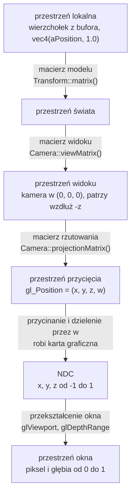

# Moduł scene: przekształcenia i kamera

Kamień milowy: M1. Temat wykładu: 3 (Przekształcenia przestrzeni).
Kod: [`src/scene/Transform.hpp`](../../../src/scene/Transform.hpp), [`src/scene/Transform.cpp`](../../../src/scene/Transform.cpp), [`src/scene/Camera.hpp`](../../../src/scene/Camera.hpp), [`src/scene/Camera.cpp`](../../../src/scene/Camera.cpp).

Część modułu `scene`. Wstęp do modułu i jego miejsce w warstwach są w [`README.md`](README.md). Ten dokument korzysta z biblioteki GLM ([`../../libraries/glm.md`](../../libraries/glm.md): typy `vec3` i `mat4`, układ kolumnowy, funkcje budujące macierze) i z pojęć potoku renderowania z [`../gfx/shaders.md`](../gfx/shaders.md) (sekcja 2.2: przestrzeń przycięcia, dzielenie perspektywiczne, NDC).

## 1. Po co to jest

Trójkąt z tematu 2 ma współrzędne wpisane od razu jako pozycje na ekranie: x i y od -1 do 1. Tak nie da się zbudować sceny. Model ściany chcę opisać raz, wokół jego własnego środka, a potem postawić go w dowolnym miejscu labiryntu, obrócić i przeskalować. Scenę chcę oglądać z dowolnego miejsca i pod dowolnym kątem. Obraz ma mieć perspektywę: to, co dalej, ma być mniejsze. Wszystkie trzy potrzeby załatwia ten sam mechanizm: **mnożenie pozycji wierzchołka przez macierze 4 x 4**.

Są trzy macierze, każda odpowiada na inne pytanie:

| Macierz | Pytanie | Kto ją liczy w projekcie |
|---|---|---|
| model (model matrix) | gdzie w świecie stoi ten obiekt, jak jest obrócony i jaki jest duży | `scene::Transform::matrix()` |
| widoku (view matrix) | skąd i w którą stronę patrzę | `scene::Camera::viewMatrix()` |
| rzutowania (projection matrix) | jak szeroko widzę i jak powstaje perspektywa | `scene::Camera::projectionMatrix()` |

`scene::Transform` to trzy wektory (pozycja, obrót, skala) i jedna funkcja, która składa z nich macierz modelu. `scene::Camera` to pozycja, dwa kąty i parametry rzutowania oraz funkcje, które liczą z nich kierunek patrzenia, macierz widoku i macierz rzutowania. Obie struktury to zwykłe dane i matematyka: nie wołają OpenGL, nie znają klawiatury, myszy ani czasu.

Stan na dziś: obie struktury są gotowe i sprawdzone osobnym programem (sekcja 5.8), ale **gra ich jeszcze nie używa**. `NightMazeApp` nadal rysuje trójkąt bez macierzy. Macierze trafią do shadera razem z kostką, a sterowanie kamerą klawiaturą i myszą dojdzie zaraz potem, w dalszej części M1.

## 2. Teoria

### 2.1 Przestrzenie współrzędnych

Ten sam wierzchołek ma po drodze od pliku modelu do piksela sześć różnych zestawów współrzędnych. Każdy zestaw to inna **przestrzeń** (space), czyli inny układ odniesienia: inny początek, inne osie, inna jednostka.

| Przestrzeń | Początek układu i osie | Do czego służy |
|---|---|---|
| lokalna, inaczej modelu (local space, model space) | środek albo podstawa samego obiektu | w niej zapisane są wierzchołki modelu. Kostka ma zawsze wierzchołki od -0,5 do 0,5, gdziekolwiek stoi |
| świata (world space) | jeden wspólny punkt sceny | w niej stoją wszystkie obiekty, kamera i światła. Jednostka w projekcie: 1 metr |
| widoku, inaczej kamery albo oka (view space, eye space) | kamera. Oś x w prawo, y w górę, kamera patrzy wzdłuż -z | scena widziana z kamery. Upraszcza rzutowanie i oświetlenie |
| przycięcia (clip space) | współrzędne jednorodne `(x, y, z, w)` po rzutowaniu | to jest `gl_Position`. W niej karta odcina wszystko, co poza polem widzenia |
| znormalizowane współrzędne urządzenia (normalized device coordinates, NDC) | sześcian od -1 do 1 na każdej osi | wynik podzielenia przez `w`. Nie zależy od rozmiaru okna |
| okna (window space, screen space) | lewy dolny róg obszaru rysowania, jednostką jest piksel | pozycja piksela i wartość głębi od 0 do 1 |



Trzy pierwsze strzałki to moja praca: mnożę je w shaderze wierzchołków (sekcja 4). Dwie ostatnie wykonuje karta graficzna sama, po shaderze wierzchołków, i nie da się ich zaprogramować.

W jednej linii:

```text
gl_Position = projection * view * model * vec4(aPosition, 1.0)
```

Wyrażenie czyta się od prawej do lewej: najpierw model, potem view, na końcu projection. Dlaczego tak, wyjaśnia [`../../libraries/glm.md`](../../libraries/glm.md), sekcja 3.4, i sekcja 2.5 niżej.

### 2.2 Współrzędne jednorodne i dlaczego macierz jest 4 x 4

Macierz 3 x 3 pomnożona przez wektor `(x, y, z)` potrafi obrócić i przeskalować, ale **nie potrafi przesunąć**. Każda składowa wyniku to suma składowych wejścia pomnożonych przez liczby, więc punkt `(0, 0, 0)` zawsze zostaje w `(0, 0, 0)`. Przesunięcie wymaga dodania stałej, a mnożenie macierzy 3 x 3 nie ma gdzie jej trzymać.

Rozwiązanie to **współrzędne jednorodne** (homogeneous coordinates): do trzech liczb dopisuję czwartą, `w`, a macierz powiększam do 4 x 4. Dla zwykłego punktu `w = 1`. Czwarta kolumna macierzy jest mnożona właśnie przez tę jedynkę, więc jej zawartość zostaje dodana do wyniku: to jest przesunięcie.

| `w` | Co oznacza wektor | Jak działa na niego przesunięcie |
|---|---|---|
| 1 | punkt (pozycja) | przesuwa go |
| 0 | kierunek (normalna, kierunek światła) | nie zmienia go: kolumna przesunięcia jest mnożona przez 0 |
| inna wartość | punkt przed dzieleniem perspektywicznym | prawdziwy punkt to `(x/w, y/w, z/w)` |

Trzeci wiersz tabeli to drugi powód, dla którego macierz ma rozmiar 4 x 4. Perspektywa wymaga **dzielenia** przez odległość od kamery, a mnożenie macierzy dzielić nie umie. Macierz rzutowania wpisuje więc odległość do `w`, a samo dzielenie wykonuje potem karta graficzna (sekcja 2.9).

Trzeci powód jest praktyczny: skoro przesunięcie, obrót, skala i rzutowanie są macierzami tego samego rozmiaru, można je **pomnożyć przez siebie raz** i dostać jedną macierz, która robi wszystko naraz. Shader mnoży wtedy każdy wierzchołek przez gotowy wynik.

### 2.3 Macierze przesunięcia, skali i obrotu

Zapis matematyczny: wiersze i kolumny tak, jak pisze się je na kartce. Wektor jest kolumną i stoi po prawej stronie macierzy.

**Przesunięcie** (translation) o `(tx, ty, tz)`:

```text
| 1  0  0  tx |   | x |   | x + tx |
| 0  1  0  ty | * | y | = | y + ty |
| 0  0  1  tz |   | z |   | z + tz |
| 0  0  0  1  |   | 1 |   |   1    |
```

**Skala** (scale) o współczynnikach `(sx, sy, sz)`:

```text
| sx 0  0  0 |   | x |   | sx * x |
| 0  sy 0  0 | * | y | = | sy * y |
| 0  0  sz 0 |   | z |   | sz * z |
| 0  0  0  1 |   | 1 |   |   1    |
```

Skala działa względem początku układu: punkt `(0, 0, 0)` zostaje na miejscu, a wszystko inne oddala się od niego albo przybliża. Gdy trzy współczynniki są równe, skala jest jednorodna (uniform). Gdy są różne, niejednorodna (non-uniform): obiekt zostaje rozciągnięty.

**Obrót** (rotation) o kąt `a` wokół każdej z osi, gdzie `c = cos(a)`, `s = sin(a)`:

```text
wokół osi X              wokół osi Y              wokół osi Z
| 1  0   0  0 |          |  c  0  s  0 |          | c  -s  0  0 |
| 0  c  -s  0 |          |  0  1  0  0 |          | s   c  0  0 |
| 0  s   c  0 |          | -s  0  c  0 |          | 0   0  1  0 |
| 0  0   0  1 |          |  0  0  0  1 |          | 0   0  0  1 |
```

Obrót też działa względem początku układu: oś obrotu przechodzi przez punkt `(0, 0, 0)`. Kierunek dodatniego kąta w układzie prawoskrętnym wyznacza **reguła prawej dłoni**: kciuk wskazuje dodatni kierunek osi, zgięte palce pokazują kierunek obrotu. Patrząc z końca osi w stronę początku układu, dodatni obrót jest przeciwny do ruchu wskazówek zegara. Przykład: obrót o 90 stopni wokół osi Y przenosi punkt `(1, 0, 0)` w `(0, 0, -1)`.

**Macierz jednostkowa** (identity matrix) ma jedynki na przekątnej i zera poza nią. To przekształcenie "nic nie rób" i punkt startowy przy składaniu macierzy.

W GLM te macierze budują `glm::translate`, `glm::scale` i `glm::rotate` ([`../../libraries/glm.md`](../../libraries/glm.md), sekcja 3.5). W pamięci GLM trzyma macierz kolumnami, więc przesunięcie leży w `m[3]` ([`../../libraries/glm.md`](../../libraries/glm.md), sekcja 3.3).

### 2.4 Kolejność ma znaczenie: przykład na liczbach

Mnożenie macierzy nie jest przemienne. Biorę jeden wierzchołek `(1, 0, 0)` i trzy przekształcenia:

- `S`: skala 2 na każdej osi,
- `R`: obrót o 90 stopni wokół osi Y,
- `T`: przesunięcie o `(5, 0, 0)`.

Te same trzy macierze w trzech kolejnościach:

| Iloczyn | Co dzieje się z wierzchołkiem, krok po kroku | Wynik |
|---|---|---|
| `T * R * S` | skala: `(2, 0, 0)`. Obrót: `(0, 0, -2)`. Przesunięcie: `(5, 0, -2)` | `(5, 0, -2)` |
| `R * T * S` | skala: `(2, 0, 0)`. Przesunięcie: `(7, 0, 0)`. Obrót: `(0, 0, -7)` | `(0, 0, -7)` |
| `S * R * T` | przesunięcie: `(6, 0, 0)`. Obrót: `(0, 0, -6)`. Skala: `(0, 0, -12)` | `(0, 0, -12)` |

Pierwszy wiersz to kolejność, której używa `Transform::matrix()`: **najpierw skala, potem obrót, na końcu przesunięcie**. Obiekt rośnie i obraca się wokół własnego środka, a dopiero potem trafia na swoje miejsce. Wierzchołek ląduje 2 jednostki od punktu `(5, 0, 0)`, czyli obiekt o podwojonym rozmiarze stoi tam, gdzie kazałem.

W drugim wierszu przesunięcie zadziałało przed obrotem. Obrót działa względem początku układu świata, więc obiekt, który już odjechał o 5 jednostek, zatoczył łuk wokół punktu `(0, 0, 0)` i wylądował zupełnie gdzie indziej. W trzecim wierszu skala na końcu pomnożyła także przesunięcie: obiekt stoi dwa razy dalej, niż miał.

### 2.5 Zapis kolumnowy i czytanie od prawej

Dwie rzeczy z GLM, bez których kod z sekcji 5 czyta się źle. Obie są opisane w [`../../libraries/glm.md`](../../libraries/glm.md) (sekcje 3.3, 3.4 i 3.5), tutaj tylko wniosek:

1. Wektor jest kolumną mnożoną z lewej strony, więc w iloczynie `T * R * S * v` pierwsza działa macierz stojąca **najbliżej wektora**, czyli `S`.
2. `glm::translate(m, v)`, `glm::rotate(m, a, axis)` i `glm::scale(m, v)` zwracają `m * T`, `m * R` i `m * S`: dokładają nowe przekształcenie z **prawej** strony. Kod, który woła je w kolejności translate, rotate, scale, buduje więc `T * R * S`, a wierzchołek przechodzi przez nie w kolejności odwrotnej do linii kodu.

### 2.6 Kąty Eulera i kolejność obrotów

Obrót obiektu zapisuję trzema kątami, po jednym na każdą oś. To **kąty Eulera** (Euler angles). Są wygodne, bo człowiek rozumie "obróć o 90 stopni wokół osi Y" i może taką liczbę wpisać w pole panelu. Mają jedną wadę: trzy obroty wokół trzech osi też nie są przemienne, więc same trzy liczby nie wystarczą. Trzeba jeszcze ustalić **kolejność**, w jakiej są stosowane.

W `Transform` kolejność jest stała: macierz obrotu to `Ry * Rx * Rz`. Czytając od strony wierzchołka: najpierw obrót wokół osi Z, potem wokół X, na końcu wokół Y. W języku kamery i samolotu to przechylenie (roll), potem pochylenie (pitch), na końcu odchylenie (yaw). Obrót wokół pionowej osi Y działa jako ostatni, więc zawsze jest obrotem wokół pionu świata: kąt y oznacza "w którą stronę świata obiekt jest zwrócony" niezależnie od pozostałych dwóch kątów. To ta sama konwencja, której używa kamera (najpierw pitch, potem yaw, sekcja 2.8), i najczęstszy przypadek w grze: ściany i kryształy obraca się głównie wokół pionu.

Przykład, że kolejność obrotów zmienia wynik. Kąty x = 90 i y = 90, wierzchołek `(0, 1, 0)`:

| Kolejność | Krok po kroku | Wynik |
|---|---|---|
| najpierw X, potem Y (tak jak w `Transform`) | obrót wokół X: `(0, 0, 1)`. Obrót wokół Y: `(1, 0, 0)` | `(1, 0, 0)` |
| najpierw Y, potem X | obrót wokół Y: `(0, 1, 0)` bez zmian, bo punkt leży na osi. Obrót wokół X: `(0, 0, 1)` | `(0, 0, 1)` |

**Blokada przegubu** (gimbal lock) to wada kątów Eulera, która wynika z kolejności. Gdy środkowy obrót (u mnie wokół X) wynosi dokładnie 90 stopni, oś pierwszego obrotu zostaje położona na osi ostatniego. Obrót wokół Z i obrót wokół Y robią wtedy to samo i z trzech stopni swobody zostają dwa: żadną zmianą kątów nie da się wykonać jednego z trzech rodzajów obrotu. Dla obiektów sceny, które kręcą się głównie wokół pionu, to nie przeszkadza. Kamera omija problem ograniczeniem kąta pitch (sekcja 2.8). Ogólnym rozwiązaniem są kwaterniony (quaternions), których w tym projekcie nie używam.

### 2.7 Macierz widoku: odwrotność przekształcenia kamery

OpenGL nie ma kamery. Jest tylko sześcian NDC, a na ekran trafia to, co się w nim znajdzie. "Ruch kamery" to złudzenie: zamiast przesuwać kamerę w prawo, przesuwam **cały świat** w lewo. Macierz widoku jest właśnie tym przekształceniem całego świata.

Kamerę można traktować jak każdy inny obiekt sceny: ma pozycję i obrót, czyli własną macierz modelu `C = T * R` (z przestrzeni kamery do świata). Macierz widoku robi drogę odwrotną, ze świata do przestrzeni kamery, więc jest **odwrotnością** tej macierzy:

```text
view = odwrotność(T * R) = odwrotność(R) * odwrotność(T)
```

Odwrotnością przesunięcia o `eye` jest przesunięcie o `-eye`. Odwrotnością obrotu jest obrót w przeciwną stronę, a dla macierzy obrotu odwrotność to po prostu jej transpozycja (zamiana wierszy z kolumnami). Macierz widoku najpierw przesuwa więc świat tak, żeby kamera znalazła się w punkcie `(0, 0, 0)`, a potem obraca go tak, żeby kierunek patrzenia pokrył się z osią -Z.

Nie liczę odwrotności ogólną funkcją `glm::inverse`. `glm::lookAt(eye, center, up)` buduje wynik wprost z trzech wektorów jednostkowych, które tworzą **bazę kamery** (basis):

| Wektor | Jak powstaje | Znaczenie |
|---|---|---|
| `f` (forward) | `normalize(center - eye)` | kierunek patrzenia |
| `s` (side, right) | `normalize(cross(f, up))` | w prawo od kamery. Prostopadły do kierunku patrzenia i do góry świata |
| `u` (up) | `cross(s, f)` | góra kamery. Prostopadły do dwóch pozostałych. To nie jest góra świata: gdy kamera patrzy w dół, jej góra pochyla się do przodu |

Te trzy wektory stają się **wierszami** macierzy (to jest transpozycja, czyli odwrócony obrót), a ostatnia kolumna przesuwa świat o `-eye` wyrażone w nowej bazie:

```text
|  s.x   s.y   s.z   -dot(s, eye) |
|  u.x   u.y   u.z   -dot(u, eye) |
| -f.x  -f.y  -f.z    dot(f, eye) |
|   0     0     0         1       |
```

Trzeci wiersz ma minusy, bo w przestrzeni widoku kamera patrzy wzdłuż **ujemnej** osi Z: punkt leżący przed kamerą ma dostać ujemne z. Jak czytać taki wiersz: współrzędna x punktu w przestrzeni widoku to `dot(s, punkt - eye)`, czyli "jak daleko w prawo od kamery jest ten punkt".

Argument `up` jest tylko wskazówką, gdzie jest góra. Nie musi być prostopadły do kierunku patrzenia, ale **nie może być do niego równoległy**: wtedy `cross(f, up)` jest wektorem zerowym, a `normalize` wektora zerowego to dzielenie przez zero (sekcja 2.8).

### 2.8 Kamera FPS: yaw, pitch i wektor kierunku

Kamera z perspektywy pierwszej osoby (first person, FPS) nie przechyla się na boki. Do opisania kierunku patrzenia wystarczą dwa kąty:

- **yaw** (odchylenie): obrót w lewo i w prawo, wokół pionowej osi świata,
- **pitch** (pochylenie): patrzenie w górę i w dół.

Trzeci kąt, roll (przechylenie na bok), jest zawsze równy zero.

**Konwencja projektu.** Yaw 0 i pitch 0 to patrzenie wzdłuż -Z. Yaw działa jak kompas oglądany z góry: rośnie przy obrocie **w prawo**. Dodatni pitch to patrzenie w górę.

| yaw | Kierunek patrzenia (przy pitch 0) |
|---|---|
| 0 | `(0, 0, -1)`, czyli -Z |
| 90 | `(1, 0, 0)`, czyli +X |
| 180 | `(0, 0, 1)`, czyli +Z |
| 270 | `(-1, 0, 0)`, czyli -X |

**Wyprowadzenie wzoru.** Szukam wektora jednostkowego `forward`. Składam go w dwóch krokach.

Krok 1, pitch. Widok z boku: oś pozioma to kierunek "przed siebie", oś pionowa to Y. Wektor o długości 1 podniesiony o kąt `pitch` jest przeciwprostokątną trójkąta prostokątnego:

```text
        Y
        |          * forward (długość 1)
        |        / |
        |      /   |  sin(pitch)   składowa pionowa
        |    /     |
        |  / pitch |
        +----------+------> przed siebie (w poziomie)
          cos(pitch)
          składowa pozioma
```

Z definicji sinusa i cosinusa: składowa pionowa to `sin(pitch)`, a część pozioma ma długość `cos(pitch)`. Im wyżej patrzę, tym krótsza część pozioma.

Krok 2, yaw. Widok z góry, na płaszczyznę XZ. Część pozioma (długości `cos(pitch)`) jest obrócona o kąt `yaw` od kierunku -Z w stronę +X:

```text
                  -Z   (yaw = 0)
                   |
                   |     * część pozioma forward
                   |   /
                   | /  yaw
     -X -----------+-----------> +X   (yaw = 90)
                   |
                   |
                  +Z   (yaw = 180)
```

Rozkładam ją na osie: na oś X przypada `sin(yaw)`, na kierunek -Z przypada `cos(yaw)`, czyli składowa z ma znak minus. Obie mnożę przez długość części poziomej:

```text
forward.x =  cos(pitch) * sin(yaw)
forward.y =  sin(pitch)
forward.z = -cos(pitch) * cos(yaw)
```

Sprawdzenie długości: `x^2 + z^2 = cos^2(pitch) * (sin^2(yaw) + cos^2(yaw)) = cos^2(pitch)`, a po dodaniu `y^2 = sin^2(pitch)` wychodzi 1. Wektor jest jednostkowy bez normalizowania.

Dwie uwagi do konwencji:

- Obrót "w prawo" patrząc z góry jest zgodny z ruchem wskazówek zegara, czyli **przeciwny** do dodatniego obrotu wokół osi Y z sekcji 2.3. Dodatni yaw kamery to obrót o `-yaw` wokół Y. Wybrałem kierunek kompasu, bo ruch myszy w prawo daje dodatnie przesunięcie ([`../core/input.md`](../core/input.md), sekcja 5.8), więc przesunięcie można dodać do kąta bez zmiany znaku.
- LearnOpenGL podaje wzór `(cos(yaw) * cos(pitch), sin(pitch), sin(yaw) * cos(pitch))`, w którym yaw 0 oznacza patrzenie wzdłuż +X, i dlatego ustawia yaw startowy na -90 stopni. To ten sam wzór przesunięty o 90 stopni: `cos(yaw - 90) = sin(yaw)` i `sin(yaw - 90) = -cos(yaw)`. U mnie zero jest tam, gdzie kierunek "do przodu" całego projektu.

**Wektor w prawo.** Potrzebny do chodzenia bokiem (strafe). To iloczyn wektorowy kierunku patrzenia i góry świata: `right = normalize(cross(forward, WORLD_UP))`. Iloczyn wektorowy daje wektor prostopadły do obu argumentów, więc `right` jest zawsze poziomy (prostopadły do pionu). Jego długość przed normalizacją to `cos(pitch)`, a nie 1, bo `forward` i `WORLD_UP` nie są do siebie prostopadłe, gdy patrzę w górę albo w dół. Stąd `normalize`.

**Ograniczenie pitch.** Przy pitch równym dokładnie 90 stopni `forward` to `(0, 1, 0)`, czyli wektor równoległy do góry świata. Wtedy:

- `cross(forward, WORLD_UP)` jest wektorem zerowym: z dwóch równoległych wektorów nie da się wyznaczyć trzeciego, prostopadłego do obu,
- `normalize` dzieli przez długość 0 i zwraca `NaN` w każdej składowej,
- `glm::lookAt` robi w środku dokładnie to samo, więc cała macierz widoku wypełnia się wartościami `NaN` i obraz znika.

Geometrycznie: patrząc pionowo w górę, nie da się powiedzieć, gdzie jest "prawo", bo każdy poziomy kierunek jest równie dobry. To blokada przegubu z sekcji 2.6 w wersji dla kamery: yaw przestaje zmieniać kierunek patrzenia i tylko kręci obrazem. Po przekroczeniu 90 stopni jest jeszcze gorzej: kamera patrzy "do tyłu przez głowę", ale `lookAt` nadal dostaje górę świata, więc obraz nagle obraca się o 180 stopni (gimbal flip).

Rozwiązanie jest proste: pitch jest ograniczany do zakresu od -89 do 89 stopni (stała `MAX_PITCH_DEGREES`). Przy 89 stopniach długość iloczynu wektorowego to `cos(89 stopni)`, czyli około 0,0175: mało, ale daleko od zera. Gracz nie zauważa brakującego stopnia.

### 2.9 Rzutowanie perspektywiczne

**Bryła widzenia** (view frustum) to obszar sceny, który kamera widzi: ścięty ostrosłup z wierzchołkiem w kamerze. Opisują go cztery liczby:

| Parametr | Znaczenie | Wartość domyślna w `Camera` |
|---|---|---|
| pionowy kąt widzenia (vertical field of view, FOV) | kąt między górną a dolną ścianą ostrosłupa | 60 stopni |
| proporcje (aspect ratio) | szerokość obrazu podzielona przez wysokość. Z nich i z pionowego FOV wynika kąt poziomy | podaje wołający |
| bliska płaszczyzna (near plane) | odległość, od której zaczyna się widoczny obszar | 0,1 |
| daleka płaszczyzna (far plane) | odległość, na której się kończy | 100 |

```text
widok z boku (oś pionowa: Y, kamera patrzy w prawo, wzdłuż -Z)

                                        | daleka płaszczyzna
                                   .  ' |
                              .  '      |
                   bliska .  '          |
                        |               |
   kamera *  fov        |   widoczne    |
                        |               |
                          '  .          |
                               '  .     |
                                    ' . |
          |<-- near --->|
          |<------------- far --------->|
```

Wszystko poza tą bryłą jest przycinane. To, co jest w środku, macierz rzutowania przekształca tak, żeby po dzieleniu przez `w` bryła stała się sześcianem NDC.

**Skąd bierze się perspektywa.** Z trójkątów podobnych: punkt na wysokości `y`, w odległości `d` od kamery, trafia na ekranie na wysokość proporcjonalną do `y / d`. Dwa razy dalej to dwa razy niżej nad środkiem obrazu, czyli dwa razy mniejszy. Górna krawędź obrazu w odległości `d` jest na wysokości `d * tan(fov / 2)`, więc współrzędna NDC to:

```text
y_ndc = y / (d * tan(fov / 2))
x_ndc = x / (d * tan(fov / 2) * aspect)
```

W przestrzeni widoku kamera patrzy wzdłuż -Z, więc odległość to `d = -z`. Mnożenie macierzy nie umie dzielić przez `z`, dlatego macierz robi dwie rzeczy: skaluje x i y, a do `w` wpisuje `-z`. Dzielenie wykonuje karta.

Macierz, którą buduje `glm::perspective(fovy, aspect, near, far)` (wariant domyślny, prawoskrętny, głębia od -1 do 1), gdzie `f = 1 / tan(fovy / 2)`:

```text
| f / aspect   0        0                              0                        |
|     0        f        0                              0                        |
|     0        0   -(far + near) / (far - near)   -2 * far * near / (far - near) |
|     0        0       -1                              0                        |
```

Czwarty wiersz to cały sekret perspektywy: `w_clip = -z_view`, czyli odległość punktu od kamery. Dla wartości domyślnych kamery i proporcji 16:9 wychodzi `f = 1,732`, `f / aspect = 0,974`, a dwa wyrazy trzeciego wiersza to `-1,002` i `-0,2002`.

**Przycinanie i dzielenie perspektywiczne.** Po shaderze wierzchołków karta najpierw odrzuca to, co nie spełnia `-w <= x <= w`, `-w <= y <= w`, `-w <= z <= w`, a potem dzieli x, y i z przez `w` (perspective divide). Przykład dla kamery domyślnej (stoi w `(0, 0, 3)`, patrzy na początek układu):

| Punkt w świecie | W przestrzeni widoku | NDC po dzieleniu | Gdzie na ekranie |
|---|---|---|---|
| `(0, 0, 0)` | `(0, 0, -3)` | `(0, 0, 0,935)` | dokładnie środek |
| `(1, 0, 0)` | `(1, 0, -3)` | `(0,325, 0, 0,935)` | na prawo od środka |
| `(0, 1, 0)` | `(0, 1, -3)` | `(0, 0,577, 0,935)` | nad środkiem. `1 * 1,732 / 3 = 0,577` |
| `(0, 1,732, 0)` | `(0, 1,732, -3)` | `(0, 1, 0,935)` | na górnej krawędzi: `3 * tan(30 stopni) = 1,732` |

**Głębia jest nieliniowa.** Trzeci wiersz macierzy jest dobrany tak, żeby po dzieleniu bliska płaszczyzna dawała z = -1, a daleka z = 1. Pomiędzy nimi zależność od odległości nie jest liniowa, tylko postaci `A + B / d`. Wartości dla near 0,1 i far 100:

| Odległość od kamery | z w NDC | Głębia w buforze (od 0 do 1) |
|---|---|---|
| 0,1 (bliska płaszczyzna) | -1,000 | 0,000 |
| 0,2 | 0,001 | 0,5005 |
| 1 | 0,802 | 0,901 |
| 10 | 0,982 | 0,991 |
| 50 | 0,998 | 0,999 |
| 100 (daleka płaszczyzna) | 1,000 | 1,000 |

Połowa całego zakresu głębi jest zużyta na pierwsze 10 centymetrów za bliską płaszczyzną (od 0,1 do 0,2), a wszystko dalej niż 10 jednostek mieści się w ostatnim 1 procencie. Blisko kamery precyzja jest ogromna, daleko bardzo mała. To celowe (błąd głębi blisko kamery jest najlepiej widoczny), ale ma skutek uboczny.

**Dlaczego near nie może być bardzo małe.** Reguła z tabeli brzmi: połowa zakresu głębi przypada na odległości od `near` do `2 * near`. Przy near 0,001 połowa precyzji idzie na pierwszy milimetr, a dla dwóch ścian oddalonych o 20 metrów zostaje tak mało różnych wartości, że obie dostają tę samą głębię. Test głębi nie potrafi wtedy rozstrzygnąć, która jest bliżej, i piksele obu powierzchni migoczą na przemian: to **z-fighting**. Zwiększenie `near` pomaga dużo bardziej niż zmniejszenie `far`. Near równe 0 jest błędem: w macierzy wyraz `-2 * far * near` zeruje się i głębia każdego punktu wychodzi taka sama.

**FOV.** Mały kąt (na przykład 30 stopni) działa jak teleobiektyw: widać wąski wycinek sceny w powiększeniu. Duży (100 stopni i więcej) pokazuje szeroko, ale rozciąga obraz przy krawędziach. Typowy zakres w grach to od 60 do 90 stopni. GLM przyjmuje kąt **pionowy**, a wiele gier podaje w ustawieniach kąt poziomy, więc te same liczby nie znaczą tego samego.

### 2.10 Z NDC do pikseli

Ostatni krok, też wykonywany przez kartę. `glViewport(x0, y0, width, height)` mówi, na jaki prostokąt bufora ramki trafia kwadrat NDC:

```text
x_okna = x0 + (x_ndc + 1) / 2 * width
y_okna = y0 + (y_ndc + 1) / 2 * height
głębia = (z_ndc + 1) / 2
```

Z tego wynika związek proporcji z viewportem. NDC jest zawsze kwadratem od -1 do 1, a okno zwykle jest prostokątem. Bez poprawki kwadrat zostałby rozciągnięty na prostokąt i kostka wyglądałaby jak cegła. Macierz rzutowania z góry ściska oś x przez podzielenie przez `aspect`, a viewport rozciąga ją z powrotem. Oba przekształcenia się znoszą tylko wtedy, gdy `aspect` to **dokładnie** szerokość viewportu podzielona przez jego wysokość, czyli gdy jedno i drugie pochodzi z rozmiaru framebuffera ([`../core/window-context.md`](../core/window-context.md), sekcja 2).

### 2.11 Konwencja projektu: układ prawoskrętny, Y w górę, -Z do przodu

| Ustalenie | Wartość |
|---|---|
| skrętność układu | prawoskrętny (right-handed) |
| oś X | w prawo |
| oś Y | w górę |
| oś Z | w stronę patrzącego. "Do przodu" to -Z |
| jednostka | 1 jednostka to 1 metr |

**Układ prawoskrętny**: kciuk prawej dłoni wskazuje +X, palec wskazujący +Y, a środkowy +Z. Równoważnie: `cross(X, Y) = Z`. Przy osi X w prawo i Y w górę oś Z wychodzi z ekranu w stronę patrzącego, więc to, co przed kamerą, ma ujemne z.

To konwencja OpenGL i wartości domyślnych GLM (`lookAt` to `lookAtRH`, `perspective` to `perspectiveRH_NO`), więc nie definiuję żadnego makra `GLM_FORCE_*`. Ta sama konwencja obowiązuje dla modeli: PRD w sekcji 9 ustala dla eksportu z Blendera osie "Y-up, -Z forward" i skalę 1 jednostka = 1 metr. Dzięki temu model wyeksportowany przodem do -Z stoi w grze przodem do kierunku, w który kamera patrzy przy yaw 0, a `WORLD_UP` to `(0, 1, 0)` w każdym miejscu kodu.

Uwaga: sześcian NDC jest **lewoskrętny** (z rośnie w głąb ekranu: -1 to blisko, 1 to daleko). Zamianę skrętności wykonuje macierz rzutowania, a dokładnie jej wyraz `-1` w czwartym wierszu i minus w trzecim. W moim kodzie nie wymaga to żadnej uwagi, ale wyjaśnia, dlaczego w przestrzeni widoku "dalej" to mniejsze z, a w buforze głębi "dalej" to większa wartość.

## 3. Jak to działa w OpenGL

Macierze to zwykła matematyka na procesorze. `Transform` i `Camera` nie wołają żadnej funkcji `gl*` i nie dołączają GLAD: do działania wystarcza im GLM. OpenGL dowiaduje się o macierzach dopiero wtedy, gdy ktoś wyśle je do programu shaderów. Wywołania, które biorą w tym udział:

| Wywołanie | Co robi | Związek z tym dokumentem |
|---|---|---|
| `glGetUniformLocation(program, "uModel")` | zwraca numer (location) zmiennej `uniform` o podanej nazwie w zlinkowanym programie, albo -1, gdy takiej nie ma | po numerze wskazuję, do której zmiennej shadera trafia macierz |
| `glUniformMatrix4fv(location, 1, GL_FALSE, wskaźnik)` | kopiuje 16 liczb `float` do zmiennej `uniform mat4` programu, który jest aktualnie w użyciu (`glUseProgram`) | tak macierz z GLM trafia do shadera. `GL_FALSE` znaczy "nie transponuj": GLM trzyma macierz kolumnami, czyli tak, jak chce OpenGL. Wskaźnik daje `glm::value_ptr` ([`../../libraries/glm.md`](../../libraries/glm.md), sekcja 3.9) |
| `glViewport(x, y, width, height)` | ustala prostokąt bufora ramki, na który trafia kwadrat NDC | z tych samych `width` i `height` trzeba policzyć `aspectRatio` dla `Camera::projectionMatrix` (sekcja 2.10) |
| `glEnable(GL_DEPTH_TEST)` | włącza test głębi: fragment jest rysowany tylko wtedy, gdy jest bliżej niż to, co już jest w buforze głębi | bez niego o widoczności decyduje kolejność rysowania trójkątów, a nie odległość. Wartość głębi pochodzi z macierzy rzutowania (sekcja 2.9) |
| `glClear(GL_COLOR_BUFFER_BIT \| GL_DEPTH_BUFFER_BIT)` | czyści kolor i głębię | przy włączonym teście głębi bufor głębi trzeba czyścić co klatkę, inaczej zostają w nim wartości z poprzedniej |
| `glDepthRange(0, 1)` | zakres, na który trafia z z NDC | wartość domyślna, nie zmieniam jej |

Z tej tabeli program woła dziś tylko `glViewport` i `glClear` (samego koloru), oba w `NightMazeApp::onRender`. Żadna macierz nie jest jeszcze wysyłana: `gfx::Shader` nie ma funkcji ustawiającej uniformy, `basic.vert` nie ma zmiennych `uniform`, a test głębi jest wyłączony (dla jednego płaskiego trójkąta nie jest potrzebny). To wszystko dochodzi w następnym commicie, razem z kostką.

Kolejność w klatce, która z tego wyniknie: `glViewport`, czyszczenie, `glUseProgram`, wysłanie macierzy, rysowanie. Uniform należy do programu, a `glUniform*` działa na program aktualnie wybrany, więc `use()` musi stać przed wysłaniem macierzy.

## 4. Shadery

Macierze spotykają się z wierzchołkiem w shaderze wierzchołków. Dzisiejszy [`assets/shaders/basic.vert`](../../../assets/shaders/basic.vert) ich nie ma: przepisuje pozycję z bufora prosto do `gl_Position` ([`../gfx/shaders.md`](../gfx/shaders.md), sekcja 4.1). Poniższy fragment to **przykład ogólny, nie kod projektu**. Pokazuje, do czego służą wyniki `Transform::matrix()`, `Camera::viewMatrix()` i `Camera::projectionMatrix()`:

```glsl
// Przykład, nie kod projektu.
#version 410 core

layout(location = 0) in vec3 aPosition;

uniform mat4 uModel;      // local space to world space
uniform mat4 uView;       // world space to view space
uniform mat4 uProjection; // view space to clip space

void main() {
    gl_Position = uProjection * uView * uModel * vec4(aPosition, 1.0);
}
```

| Element | Znaczenie |
|---|---|
| `uniform mat4 uModel;` | zmienna `uniform`: wartość ustawiana z C++ i taka sama dla wszystkich wierzchołków jednego wywołania rysującego. Atrybut (`in`) ma inną wartość dla każdego wierzchołka, uniform jedną dla całego obiektu |
| `vec4(aPosition, 1.0)` | pozycja z bufora ma trzy składowe. Dopisuję `w = 1`, bo to punkt (sekcja 2.2) |
| `uProjection * uView * uModel * ...` | trzy pierwsze strzałki diagramu z sekcji 2.1, czytane od prawej. Wynik jest w przestrzeni przycięcia |
| `gl_Position` | po tym przypisaniu `w` nie jest już jedynką: to odległość od kamery. Dzielenie wykona karta |

Macierz widoku i rzutowania jest wspólna dla całej klatki, macierz modelu jest inna dla każdego obiektu. Dlatego to trzy osobne uniformy, a nie jeden gotowy iloczyn: `uView` i `uProjection` wystarczy ustawić raz na klatkę, a `uModel` przed każdym obiektem. Shader fragmentów nie bierze udziału w przekształceniach.

## 5. Kod w projekcie

### 5.1 Pliki

| Plik | Co zawiera |
|---|---|
| [`src/scene/Transform.hpp`](../../../src/scene/Transform.hpp) | struktura `Transform`: pola `position`, `rotationDegrees`, `scale` i deklaracja `matrix()` |
| [`src/scene/Transform.cpp`](../../../src/scene/Transform.cpp) | stałe `AXIS_X`, `AXIS_Y`, `AXIS_Z` i funkcja `Transform::matrix()` |
| [`src/scene/Camera.hpp`](../../../src/scene/Camera.hpp) | struktura `Camera`: stałe `WORLD_UP` i `MAX_PITCH_DEGREES`, pola `position`, `yawDegrees`, `pitchDegrees`, `fovDegrees`, `nearPlane`, `farPlane`, deklaracje pięciu funkcji |
| [`src/scene/Camera.cpp`](../../../src/scene/Camera.cpp) | stała `FULL_TURN_DEGREES` i funkcje `forward`, `right`, `rotate`, `viewMatrix`, `projectionMatrix` |

Wszystkie cztery pliki są na liście źródeł biblioteki `engine` w [`CMakeLists.txt`](../../../CMakeLists.txt). Nagłówki dołączają tylko `<glm/glm.hpp>` (typy `vec3` i `mat4`). Funkcje budujące macierze (`<glm/gtc/matrix_transform.hpp>`) dołączają dopiero pliki `.cpp`, więc kto dołącza `Camera.hpp`, nie płaci czasem kompilacji za resztę GLM.

Obie struktury to `struct` z publicznymi polami, a nie klasy z polami prywatnymi i akcesorami. W reszcie projektu klasy pilnują **niezmienników** (invariants): `gfx::Shader` nie może pozwolić nikomu zmienić identyfikatora programu, więc trzyma go w polu prywatnym. Tutaj nie ma czego pilnować: każda pozycja, każda skala i każdy kąt yaw to poprawna wartość, a funkcje liczą wynik od nowa z aktualnych pól przy każdym wywołaniu. Publiczne pola są też tym, czego potrzebuje panel debug, który będzie je edytował wprost. Jedyny warunek, zakres kąta pitch, pilnuje funkcja `rotate`, a nie typ (sekcja 5.6 i pułapka 6).

### 5.2 `Transform`: struktura

```cpp
/// Where an object is, how it is turned and how big it is. Plain data plus one function.
///
/// The model matrix moves a vertex from the object's local space to world space. A vertex
/// is scaled first, then rotated, then translated: the object grows and turns around its
/// own origin and only then goes to its place in the world.
struct Transform {
    /// Position of the object's origin in world space.
    glm::vec3 position{0.0F};

    /// Euler angles in degrees: rotation around the x, y and z axis. Degrees, because
    /// that is what a person types into a panel. The rotations are applied to a vertex
    /// in the order z, then x, then y.
    glm::vec3 rotationDegrees{0.0F};

    /// Scale factor along each axis. 1 keeps the size.
    glm::vec3 scale{1.0F};

    /// The model matrix: translate * rotateY * rotateX * rotateZ * scale. The matrix
    /// nearest to the vertex is applied first, so the expression reads right to left.
    glm::mat4 matrix() const;
};
```

| Linia | Znaczenie |
|---|---|
| `glm::vec3 position{0.0F};` | pozycja początku układu lokalnego obiektu w świecie. Konstruktor `vec3` z jedną liczbą wypełnia nią wszystkie trzy składowe, więc to `(0, 0, 0)`. Inicjalizacja jest jawna, bo `glm::vec3 v;` nie zeruje składowych ([`../../libraries/glm.md`](../../libraries/glm.md), pułapka 2) |
| `glm::vec3 rotationDegrees{0.0F};` | trzy kąty Eulera: składowa `x` to obrót wokół osi X, `y` wokół Y, `z` wokół Z. Jednostka jest w nazwie pola, żeby nie dało się jej pomylić. Stopnie, bo tę liczbę wpisuje człowiek |
| `glm::vec3 scale{1.0F};` | `(1, 1, 1)`: bez zmiany rozmiaru. Wartość domyślna nie może być zerem: skala 0 spłaszcza obiekt do punktu |
| `glm::mat4 matrix() const;` | składa macierz modelu z trzech pól. `const`, bo niczego w strukturze nie zmienia. Macierz nie jest nigdzie zapamiętana: każde wywołanie liczy ją od nowa |

Struktura z wartościami domyślnymi daje macierz jednostkową: obiekt stoi w początku układu świata, nieobrócony, w oryginalnym rozmiarze.

PRD wymienia przy temacie 3 także hierarchię transformów (obiekt-dziecko przekształcany względem rodzica). `Transform` jej nie ma: nie ma pola rodzica ani listy dzieci. Dojdzie wtedy, gdy pojawi się obiekt, który jej potrzebuje.

### 5.3 `Transform::matrix()`

```cpp
// The three coordinate axes, used as rotation axes.
constexpr glm::vec3 AXIS_X{1.0F, 0.0F, 0.0F};
constexpr glm::vec3 AXIS_Y{0.0F, 1.0F, 0.0F};
constexpr glm::vec3 AXIS_Z{0.0F, 0.0F, 1.0F};
```

```cpp
glm::mat4 Transform::matrix() const {
    // Start from the identity matrix ("change nothing"). Each glm function below
    // multiplies its matrix on the right side, so the last call is the first one applied
    // to a vertex: the lines read top to bottom, the vertex is transformed bottom to top.
    glm::mat4 model(1.0F);
    model = glm::translate(model, position);
    // GLM takes angles in radians.
    model = glm::rotate(model, glm::radians(rotationDegrees.y), AXIS_Y);
    model = glm::rotate(model, glm::radians(rotationDegrees.x), AXIS_X);
    model = glm::rotate(model, glm::radians(rotationDegrees.z), AXIS_Z);
    model = glm::scale(model, scale);
    return model;
}
```

| Linia | Co robi | Macierz po tej linii |
|---|---|---|
| `constexpr glm::vec3 AXIS_X{1.0F, 0.0F, 0.0F};` (i dwie następne) | nazwane osie obrotu zamiast trzech liczb wpisanych w wywołanie. Stoją w anonimowej przestrzeni nazw, więc są widoczne tylko w tym pliku | |
| `glm::mat4 model(1.0F);` | macierz jednostkowa. Samo `glm::mat4 model;` zostawiłoby w niej przypadkowe wartości | `I` |
| `model = glm::translate(model, position);` | mnoży z prawej przez macierz przesunięcia | `T` |
| `model = glm::rotate(model, glm::radians(rotationDegrees.y), AXIS_Y);` | mnoży z prawej przez obrót wokół Y. `glm::radians` zamienia stopnie na radiany w miejscu użycia: GLM przyjmuje tylko radiany | `T * Ry` |
| `model = glm::rotate(model, glm::radians(rotationDegrees.x), AXIS_X);` | obrót wokół X | `T * Ry * Rx` |
| `model = glm::rotate(model, glm::radians(rotationDegrees.z), AXIS_Z);` | obrót wokół Z | `T * Ry * Rx * Rz` |
| `model = glm::scale(model, scale);` | mnoży z prawej przez macierz skali | `T * Ry * Rx * Rz * S` |
| `return model;` | zwraca wynik przez wartość: 16 liczb `float` | |

Wynik to `T * Ry * Rx * Rz * S`. Wierzchołek stoi po prawej stronie tego iloczynu, więc przechodzi przez macierze od końca: **skala, obrót wokół Z, obrót wokół X, obrót wokół Y, przesunięcie**. Linie kodu czyta się z góry na dół, a wierzchołek jest przekształcany od dołu do góry. Każde wywołanie przypisuje wynik z powrotem do `model`, bo funkcje GLM nie zmieniają argumentu, tylko zwracają nową macierz.

Kolejność obrotów jest ustalona raz, tutaj, i opisana w komentarzu Doxygen przy polu `rotationDegrees`. Uzasadnienie jest w sekcji 2.6.

### 5.4 `Camera`: stałe i pola

```cpp
    /// The up direction of the world.
    static constexpr glm::vec3 WORLD_UP{0.0F, 1.0F, 0.0F};

    /// Largest pitch in either direction, in degrees. Just under 90: looking straight up
    /// or down would make the view direction parallel to WORLD_UP, and then the view
    /// matrix cannot tell which way is "right".
    static constexpr float MAX_PITCH_DEGREES = 89.0F;
```

| Stała | Znaczenie |
|---|---|
| `WORLD_UP` | góra świata, `(0, 1, 0)`, zgodnie z konwencją "Y w górę" (sekcja 2.11). Używają jej `right()` i `viewMatrix()`. Jest publiczna, bo przyda się też kodowi, który będzie poruszał kamerą w górę i w dół |
| `MAX_PITCH_DEGREES` | 89 stopni: największe pochylenie w górę i w dół (sekcja 2.8) |

`static constexpr` w strukturze oznacza stałą czasu kompilacji wspólną dla wszystkich obiektów: nie zajmuje miejsca w obiekcie `Camera` i jest dostępna jako `scene::Camera::WORLD_UP`. Tak samo zapisane są stałe `core::Time::FIXED_DT` i `core::Input::KEY_COUNT`.

```cpp
    /// Position in world space. Three units in front of the origin, on the +Z side, so
    /// that the default camera looks at the origin.
    glm::vec3 position{0.0F, 0.0F, 3.0F};

    /// Turn to the left or right, in degrees, like a compass seen from above:
    /// 0 looks along -Z, 90 along +X, 180 along +Z, 270 along -X.
    float yawDegrees = 0.0F;

    /// Look up (positive) or down (negative), in degrees. 0 is level.
    float pitchDegrees = 0.0F;

    /// Vertical field of view in degrees: the angle between the top and the bottom edge
    /// of the picture.
    float fovDegrees = 60.0F;

    /// Distance to the near clipping plane. Must be greater than 0. Nothing closer to
    /// the camera is drawn.
    float nearPlane = 0.1F;

    /// Distance to the far clipping plane. Nothing farther from the camera is drawn.
    float farPlane = 100.0F;
```

| Pole | Znaczenie i wartość domyślna |
|---|---|
| `position` | pozycja kamery w świecie. `(0, 0, 3)`: trzy jednostki przed początkiem układu, po stronie +Z. Razem z yaw 0 (patrzenie wzdłuż -Z) daje kamerę, która od razu patrzy na punkt `(0, 0, 0)` |
| `yawDegrees` | obrót w lewo i w prawo, w stopniach, jak kompas: 0 to -Z, 90 to +X (sekcja 2.8) |
| `pitchDegrees` | patrzenie w górę (wartości dodatnie) i w dół, w stopniach |
| `fovDegrees` | **pionowy** kąt widzenia w stopniach. 60 to typowa wartość |
| `nearPlane` | odległość bliskiej płaszczyzny. 0,1 to 10 centymetrów: dość blisko, żeby ściana przy samej twarzy nie była obcinana, i dość daleko od zera, żeby głębia miała precyzję (sekcja 2.9) |
| `farPlane` | odległość dalekiej płaszczyzny. 100 metrów z zapasem obejmuje labirynt |

Dwie decyzje:

- **`nearPlane` i `farPlane` są polami, a nie stałymi.** To własność konkretnej kamery i konkretnej sceny: druga kamera (na przykład patrząca z góry na cały labirynt) potrzebuje innych wartości niż kamera gracza, a zadanie laboratoryjne zbudowane na `engine` może mieć inną skalę świata. Pola pozwalają też zobaczyć z-fighting na własne oczy przez zmianę jednej liczby (pułapka 7).
- **Nazwy `nearPlane` i `farPlane`, a nie `near` i `far`.** Nagłówek `<windows.h>` definiuje `near` i `far` jako puste makra (pozostałość po 16-bitowym Windowsie). W pliku, który dołączyłby i `<windows.h>`, i `Camera.hpp`, pole o nazwie `near` zniknęłoby w preprocesorze i kod przestałby się kompilować.

Struktura nie ma prędkości ruchu ani czułości myszy. To nie są własności kamery, tylko sposobu sterowania nią, więc należą do kodu gry.

### 5.5 `forward()` i `right()`

```cpp
glm::vec3 Camera::forward() const {
    // The standard library takes angles in radians.
    const float yaw = glm::radians(yawDegrees);
    const float pitch = glm::radians(pitchDegrees);

    // Pitch splits the unit vector into a vertical part, sin(pitch), and a horizontal
    // part of length cos(pitch). Yaw turns the horizontal part from -Z (yaw 0) towards
    // +X (yaw 90). The length of the result is always 1.
    const float horizontal = std::cos(pitch);
    return {horizontal * std::sin(yaw), std::sin(pitch), -horizontal * std::cos(yaw)};
}
```

| Linia | Znaczenie |
|---|---|
| `const float yaw = glm::radians(yawDegrees);` (i to samo dla pitch) | `std::sin` i `std::cos` przyjmują radiany. Zamiana odbywa się w miejscu użycia, a pola zostają w stopniach |
| `const float horizontal = std::cos(pitch);` | długość części poziomej wektora (krok 1 wyprowadzenia w sekcji 2.8). Ma nazwę, bo występuje we wzorze dwa razy |
| `return {horizontal * std::sin(yaw), std::sin(pitch), -horizontal * std::cos(yaw)};` | wzór z sekcji 2.8. Klamry tworzą `glm::vec3` z trzech liczb, bo taki jest typ zwracany funkcji |

Funkcja nie woła `glm::normalize`: wzór sam daje wektor o długości 1.

```cpp
glm::vec3 Camera::right() const {
    // The cross product is perpendicular to both vectors. Its length is cos(pitch), not
    // 1, so it has to be normalized. The pitch limit keeps that length above zero.
    return glm::normalize(glm::cross(forward(), WORLD_UP));
}
```

`glm::cross(forward(), WORLD_UP)` w tej kolejności daje wektor w prawo. Zamiana argumentów dałaby wektor w lewo (`cross(a, b) = -cross(b, a)`). Sprawdzenie na przypadku domyślnym: `cross((0, 0, -1), (0, 1, 0)) = (1, 0, 0)`, czyli +X. `glm::normalize` jest potrzebne, bo długość iloczynu to `cos(pitch)`, a ograniczenie pitch gwarantuje, że nie jest ona zerem.

Funkcji `up()` (góra kamery) nie ma: nic jej jeszcze nie potrzebuje, a `glm::lookAt` liczy ją sobie sam.

### 5.6 `rotate()`

```cpp
// One full turn. Yaw is kept below it so that the number stays readable.
constexpr float FULL_TURN_DEGREES = 360.0F;
```

```cpp
void Camera::rotate(float yawDeltaDegrees, float pitchDeltaDegrees) {
    yawDegrees += yawDeltaDegrees;
    // Take away the whole turns: floor gives their number, also for a negative angle.
    // 370 becomes 10 and -10 becomes 350, the direction stays the same.
    yawDegrees -= FULL_TURN_DEGREES * std::floor(yawDegrees / FULL_TURN_DEGREES);

    pitchDegrees =
        std::clamp(pitchDegrees + pitchDeltaDegrees, -MAX_PITCH_DEGREES, MAX_PITCH_DEGREES);
}
```

| Linia | Znaczenie |
|---|---|
| `yawDegrees += yawDeltaDegrees;` | dodatnia zmiana obraca w prawo |
| `yawDegrees -= FULL_TURN_DEGREES * std::floor(yawDegrees / FULL_TURN_DEGREES);` | zawija yaw do zakresu od 0 do 360. `std::floor` zaokrągla w dół, także liczby ujemne, więc daje liczbę pełnych obrotów do odjęcia: dla 370 to 1 (wynik 10), dla -10 to -1 (wynik 350) |
| `std::clamp(pitchDegrees + pitchDeltaDegrees, -MAX_PITCH_DEGREES, MAX_PITCH_DEGREES)` | dodaje zmianę i przycina wynik do zakresu od -89 do 89. `std::clamp(wartość, dół, góra)` zwraca wartość, jeśli mieści się w zakresie, a inaczej bliższą granicę |

**Dlaczego yaw jest zawijany, a pitch przycinany.** To dwa różne ograniczenia. Yaw nie ma granicy: wolno kręcić się w kółko bez końca, a 370 stopni to ten sam kierunek co 10. Bez zawijania liczba rosłaby po każdym obrocie i po minucie gry panel pokazywałby na przykład 4130 stopni. Zawijanie nie zmienia kierunku patrzenia, tylko utrzymuje czytelną wartość. Pitch ma prawdziwą granicę: kamera nie może przechylić się przez głowę, więc wartość zatrzymuje się na 89.

**Dlaczego nie `std::fmod`.** `std::fmod(-10, 360)` zwraca -10, bo zachowuje znak pierwszego argumentu. Zakres wychodziłby od -360 do 360 i ten sam kierunek miałby dwie różne wartości. Wzór z `std::floor` daje jeden zakres, od 0 do 360.

`rotate` to jedyna funkcja `Camera`, która nie jest `const`: zmienia pola. Pilnuje zakresów tylko dla zmian, które przez nią przechodzą. Wartość wpisana wprost w pole `pitchDegrees` nie jest sprawdzana (pułapka 6).

### 5.7 `viewMatrix()` i `projectionMatrix()`

```cpp
glm::mat4 Camera::viewMatrix(const glm::vec3& eye) const {
    // lookAt wants a point to look at, not a direction: one step forward from the eye.
    return glm::lookAt(eye, eye + forward(), WORLD_UP);
}
```

| Argument `glm::lookAt` | Wartość | Znaczenie |
|---|---|---|
| `eye` | parametr funkcji | pozycja oka |
| `center` | `eye + forward()` | **punkt**, na który patrzę: jeden krok do przodu od oka. `lookAt` nie przyjmuje kierunku. Odległość punktu nie ma znaczenia, liczy się tylko kierunek od `eye` do niego |
| `up` | `WORLD_UP` | góra świata jako wskazówka (sekcja 2.7) |

**Dlaczego pozycja oka jest parametrem, a nie polem `position`.** Symulacja idzie stałym krokiem, a klatka jest rysowana w dowolnej chwili między dwoma krokami ([`../core/main-loop.md`](../core/main-loop.md), sekcja 2.4). Gdy kamera zacznie się poruszać, płynny obraz będzie wymagał rysowania z punktu leżącego **między** pozycją z poprzedniego kroku a bieżącą: `glm::mix(previous, current, alpha)`. Pole `position` ma wtedy zostać stanem symulacji, którego rysowanie nie rusza. Dlatego funkcja dostaje punkt, z którego ma patrzeć, od wołającego. Kamera, która stoi w miejscu, podaje po prostu własne pole: `camera.viewMatrix(camera.position)`.

```cpp
glm::mat4 Camera::projectionMatrix(float aspectRatio) const {
    // GLM takes the field of view in radians.
    return glm::perspective(glm::radians(fovDegrees), aspectRatio, nearPlane, farPlane);
}
```

| Argument `glm::perspective` | Wartość | Znaczenie |
|---|---|---|
| `fovy` | `glm::radians(fovDegrees)` | pionowy kąt widzenia w radianach. Bez `glm::radians` 60 oznaczałoby 60 radianów |
| `aspect` | `aspectRatio` | szerokość przez wysokość, od wołającego |
| `zNear`, `zFar` | `nearPlane`, `farPlane` | dodatnie odległości od kamery, mimo że kamera patrzy wzdłuż -Z |

**Dlaczego `aspectRatio` jest parametrem.** Proporcje nie są własnością kamery, tylko okna, i zmieniają się przy każdej zmianie jego rozmiaru. `scene/` nie zna okna (to `core::Window`), a ma nadawać się też do rysowania do tekstury o innych proporcjach. Wołający liczy więc proporcje z rozmiaru framebuffera w każdej klatce i podaje gotową liczbę. Funkcja nie sprawdza jej: wysokość 0 (zminimalizowane okno) musi obsłużyć wołający, zanim podzieli (pułapka 4).

Obie funkcje liczą macierz od nowa przy każdym wywołaniu. To kilkadziesiąt mnożeń na klatkę, więc zapamiętywanie wyniku byłoby komplikacją bez zysku.

### 5.8 Jak to zostało sprawdzone

Żaden kod gry nie woła jeszcze tych funkcji, więc sprawdziłem je osobnym, tymczasowym programem konsolowym: dołączał oba nagłówki, kompilował się razem z `Camera.cpp` i `Transform.cpp` z tymi samymi ścieżkami nagłówków co projekt i wypisywał wyniki. Okno nie było potrzebne, bo to czysta matematyka. Program nie trafił do repozytorium. Wyniki:

| Sprawdzenie | Wynik |
|---|---|
| `forward()` przy yaw 0, pitch 0 | `(0, 0, -1)` |
| `forward()` przy yaw 90, 180, 270 | `(1, 0, 0)`, `(0, 0, 1)`, `(-1, 0, 0)` |
| `forward()` przy pitch 30 | `(0, 0,5, -0,866)`, długość 1 |
| `right()` przy yaw 0 i przy yaw 90 | `(1, 0, 0)` i `(0, 0, 1)` |
| `right()` przy yaw 0, pitch 30 | `(1, 0, 0)`: pitch nie zmienia kierunku w prawo |
| yaw 37, pitch -62: długości `forward()` i `right()`, ich iloczyn skalarny | 1, 1 i 0 (wektory jednostkowe i prostopadłe) |
| kamera domyślna: macierz widoku razy punkt `(0, 0, 0)` | `(0, 0, -3)`: trzy jednostki przed kamerą |
| kamera domyślna, proporcje 16:9: `projection * view` razy punkt `(0, 0, 0)`, po dzieleniu przez `w` | x = 0, y = 0: środek ekranu |
| to samo dla `(1, 0, 0)` i `(0, 1, 0)` | x = 0,325 (na prawo) i y = 0,577 (w górę) |
| punkt na bliskiej i na dalekiej płaszczyźnie | z w NDC równe -1 i 1 |
| `viewMatrix(eye)` z okiem innym niż `position` | punkt 3 jednostki przed podanym okiem trafia w `(0, 0, -3)`: liczy się parametr, nie pole |
| kamera w `(2, 1, 5)`, yaw 40, pitch -20: macierz widoku razy oko, razy `oko + forward()`, razy `oko + right()` | `(0, 0, 0)`, `(0, 0, -1)`, `(1, 0, 0)`: macierz widoku jest odwrotnością przekształcenia kamery |
| `rotate(370, 0)`, potem `rotate(-20, 0)` | yaw 10, potem 350 |
| `rotate(0, 200)`, potem `rotate(0, -500)` | pitch 89, potem -89 |
| `Transform` domyślny | macierz jednostkowa |
| `Transform` z przykładu z sekcji 2.4 razy `(1, 0, 0)` | `(5, 0, -2)`. Iloczyny `R * T * S` i `S * R * T` policzone ręcznie z GLM: `(0, 0, -7)` i `(0, 0, -12)` |
| `Transform` z kątami x = 90, y = 90 razy `(0, 1, 0)` | `(1, 0, 0)`: obrót wokół X działa przed obrotem wokół Y |
| pitch wpisany wprost jako 90 (z pominięciem `rotate`) | macierz widoku zawiera `NaN` |

Build Debug i Release (clang, `-Wall -Wextra -Wpedantic`) przechodzi bez ostrzeżeń, a clang-tidy z regułami projektu nie zgłasza niczego w plikach `src/scene/`. Na Windowsie (MSVC) ten kod nie był jeszcze kompilowany.

## 6. Panel ImGui

`Transform` i `Camera` nie mają jeszcze panelu. PRD przewiduje dla tematu 3 pokaz "Pozycja/rotacja kamery, FOV": panel Camera powstanie w dalszej części M1, razem ze sterowaniem kamerą. Publiczne pola obu struktur są przygotowane właśnie pod edycję z panelu. Do tego czasu jedynym sposobem obejrzenia wartości jest program testowy opisany w sekcji 5.8 i ćwiczenia na kartce z sekcji 8.

## 7. Pułapki

1. **Stopnie zamiast radianów.** `std::sin`, `std::cos`, `glm::rotate` i `glm::perspective` przyjmują radiany. `glm::perspective(60.0F, ...)` to kąt 60 radianów, a kompilator tego nie wykryje, bo obie wartości to `float`. W projekcie pola mają jednostkę w nazwie (`yawDegrees`, `fovDegrees`, `rotationDegrees`), a `glm::radians` stoi dokładnie w miejscu użycia.
2. **Kolejność mnożenia.** `model * view * projection` zamiast `projection * view * model` kompiluje się i daje pusty ekran. To samo dotyczy kolejności translate, rotate, scale: zamiana przesunięcia z obrotem sprawia, że obiekt krąży wokół początku układu świata zamiast obracać się w miejscu (sekcja 2.4).
3. **`glm::mat4 m;` zamiast `glm::mat4 m(1.0F);`.** Konstruktor domyślny GLM 1.0.3 niczego nie ustawia: zmienna lokalna ma przypadkowe wartości, a `glm::mat4 m{};` same zera. Macierz zerowa pomnożona przez cokolwiek daje zera, więc obiekt znika. Macierz jednostkową trzeba zapisać jawnie ([`../../libraries/glm.md`](../../libraries/glm.md), pułapka 2).
4. **Proporcje z rozmiaru okna albo z dzielenia całkowitego.** Proporcje muszą pochodzić z rozmiaru **framebuffera**, tego samego, który trafia do `glViewport`. Na ekranie Retina rozmiar okna i framebuffera różnią się dwukrotnie; sam iloraz zwykle wychodzi ten sam, ale mieszanie jednej wartości z okna i drugiej z framebuffera już nie. `width / height` na typach `int` to dzielenie całkowite: 1280 / 720 daje 1, a nie 1,78, i obraz jest ściśnięty. Trzeba dzielić liczby `float`. Wysokość 0 przy zminimalizowanym oknie to dzielenie przez zero.
5. **Pitch równy 90 stopni.** Kierunek patrzenia równoległy do `WORLD_UP` daje wektor zerowy w iloczynie wektorowym, `NaN` po normalizacji i pusty ekran (sekcja 2.8). Chroni przed tym `MAX_PITCH_DEGREES` w `rotate()`.
6. **Wartość wpisana wprost w pole omija `rotate()`.** Pola są publiczne. `camera.pitchDegrees = 90.0F;` nie przechodzi przez `std::clamp` i psuje macierz widoku tak samo jak w pułapce 5. Kod, który ustawia kąty bezpośrednio (na przykład suwak w panelu), musi sam trzymać się zakresu od `-MAX_PITCH_DEGREES` do `MAX_PITCH_DEGREES`.
7. **Bliska płaszczyzna równa 0 albo bardzo mała.** Przy 0 macierz rzutowania jest błędna (każdy punkt dostaje tę samą głębię). Przy bardzo małej wartości prawie cała precyzja bufora głębi idzie na pierwsze milimetry i odległe powierzchnie migoczą (z-fighting, sekcja 2.9). Większe `nearPlane` pomaga bardziej niż mniejsze `farPlane`.
8. **Kierunek, który nie jest jednostkowy.** Ruch liczony jako `kierunek * prędkość * czas` zakłada długość 1. Dwa typowe błędy: użycie `cross(forward, WORLD_UP)` bez normalizacji (przy patrzeniu w górę chodzenie bokiem zwalnia, bo długość to `cos(pitch)`) oraz zsumowanie `forward()` i `right()` przy ruchu po skosie (długość około 1,41, czyli ruch po skosie szybszy o 41 procent). Sumę kierunków trzeba znormalizować, ale tylko wtedy, gdy nie jest wektorem zerowym.
9. **`center` w `lookAt` to punkt, nie kierunek.** `glm::lookAt(eye, forward(), up)` każe kamerze patrzeć na punkt leżący jedną jednostkę od początku układu świata, zamiast przed siebie. Poprawnie: `eye + forward()`.
10. **Yaw kamery a obrót wokół osi Y.** Dodatni yaw obraca kamerę w prawo (zgodnie z ruchem wskazówek zegara, patrząc z góry), a dodatni `rotationDegrees.y` w `Transform` obraca obiekt w lewo (reguła prawej dłoni). Obiekt, który ma być zwrócony tam, gdzie patrzy kamera, dostaje `rotationDegrees.y = -yawDegrees`.
11. **Kolejność kątów Eulera.** Te same trzy liczby w `rotationDegrees` oznaczają inny obrót w programie, który stosuje inną kolejność osi (na przykład w Blenderze, gdzie domyślna kolejność to XYZ). Przy przenoszeniu kątów z innego narzędzia trzeba sprawdzić jego konwencję.
12. **Skala niejednorodna a normalne.** Pozycje przekształca macierz modelu, ale wektorów normalnych nie wolno przekształcać tą samą macierzą, gdy skala jest różna na różnych osiach: przestają być prostopadłe do powierzchni. Potrzebna jest osobna macierz normalnych (odwrócona i transponowana część 3 x 3 macierzy modelu). Dziś nie ma normalnych ani oświetlenia, to pułapka na M4.
13. **Kamera wewnątrz obiektu albo za blisko.** Wszystko bliżej niż `nearPlane` jest obcinane, więc ściana przy samej kamerze znika i widać, co jest za nią. To nie błąd macierzy, tylko skutek istnienia bliskiej płaszczyzny.
14. **`near` i `far` jako nazwy.** `<windows.h>` definiuje je jako makra. Pola nazywają się `nearPlane` i `farPlane` (sekcja 5.4). Tych dwóch słów nie należy używać jako nazw zmiennych także w innych plikach.

## 8. Ćwiczenia

Kod nie jest jeszcze podłączony do gry, więc wszystkie ćwiczenia robi się na kartce (kalkulator wystarczy). Ćwiczenia na działającym programie dojdą razem z kostką i sterowaniem kamerą.

1. **Kolejność przekształceń.** Wierzchołek `(0, 0, 1)`, skala 3, obrót o 90 stopni wokół osi Y, przesunięcie o `(0, 2, 0)`. Policz wynik dla `T * R * S` i dla `R * S * T`. Odpowiedź: `(3, 2, 0)` i `(3, 6, 0)`.
2. **Macierz z pól.** Zapisz na kartce macierz 4 x 4, którą zwróci `Transform::matrix()` dla `position = (1, 2, 3)`, `scale = (2, 2, 2)` i zerowych kątów. Wskaż, w których elementach `m[kolumna][wiersz]` leży przesunięcie. Odpowiedź: przekątna `2, 2, 2, 1`, przesunięcie w `m[3][0]`, `m[3][1]`, `m[3][2]`.
3. **Wektor kierunku.** Policz `forward()` dla yaw 90, pitch 0, potem dla yaw 0, pitch 45, potem dla yaw 180, pitch -30. Sprawdź długość każdego wyniku. Odpowiedzi: `(1, 0, 0)`, `(0, 0,707, -0,707)`, `(0, -0,5, 0,866)`.
4. **Wektor w prawo.** Dla yaw 90 i pitch 0 policz ręcznie `cross(forward, WORLD_UP)`. Odpowiedź: `(0, 0, 1)`. Zamień argumenty miejscami i wyjaśnij wynik.
5. **Zawijanie i przycinanie.** Kamera ma yaw 350 i pitch 80. Jakie wartości zostaną po `rotate(25, 15)`, a jakie po kolejnym `rotate(-40, -200)`? Odpowiedź: yaw 15, pitch 89, potem yaw 335, pitch -89.
6. **Przestrzeń widoku.** Kamera domyślna (pozycja `(0, 0, 3)`, yaw 0, pitch 0). Podaj współrzędne punktu `(1, 1, 0)` w przestrzeni widoku. Potem współrzędne punktu `(0, 1, 0)` dla kamery w `(3, 0, 0)` z yaw 270. Odpowiedź: `(1, 1, -3)` i `(0, 1, -3)`. Druga kamera patrzy wzdłuż -X, punkt jest 3 jednostki przed nią i 1 w górę, a `right()` to `(0, 0, -1)`, więc w prawo wypada 0.
7. **Rzutowanie.** FOV 90 stopni, proporcje 1, punkt w przestrzeni widoku `(2, 1, -4)`. Policz x i y w NDC. Odpowiedź: `tan(45 stopni) = 1`, więc `f = 1`, x = 2 / 4 = 0,5, y = 1 / 4 = 0,25. Jak zmieni się x przy proporcjach 2? Odpowiedź: 0,25.
8. **Głębia.** Ze wzoru `z_ndc = (far + near) / (far - near) - 2 * far * near / ((far - near) * d)` policz z w NDC dla near 1, far 10 i odległości d równych 1, 2, 5 i 10. Odpowiedź: -1, około 0,111, około 0,778, 1. Jaka część zakresu przypada na odległości od 1 do 2?
9. **Piksel.** Framebuffer 2560 x 1440, `glViewport(0, 0, 2560, 1440)`. W który piksel trafia punkt NDC `(0,5, -0,5)`? Odpowiedź: x = 1920, y = 360, licząc od lewego dolnego rogu.
10. **Blokada przegubu.** Dla `Transform` z kątem x = 90 pokaż na przykładzie wierzchołka `(1, 0, 0)`, że kąty `(90, 30, 0)` i `(90, 0, -30)` dają ten sam wynik. Wyjaśnij, co to znaczy dla liczby stopni swobody.

## 9. Pytania kontrolne

1. **Wymień przestrzenie, przez które przechodzi wierzchołek, i powiedz, co przenosi go między nimi.**
   Lokalna, świata, widoku, przycięcia, NDC, okna. Macierz modelu (lokalna do świata), macierz widoku (świat do widoku), macierz rzutowania (widok do przycięcia), dzielenie przez `w` wykonywane przez kartę (przycięcie do NDC), przekształcenie okna ustawione przez `glViewport` (NDC do pikseli).

2. **Dlaczego macierze mają rozmiar 4 x 4, skoro scena jest trójwymiarowa?**
   Macierz 3 x 3 nie umie przesunąć: punkt zerowy zawsze zostaje w zerze. Czwarta współrzędna `w = 1` sprawia, że czwarta kolumna jest dodawana do wyniku jako przesunięcie. Ta sama czwarta współrzędna przenosi odległość od kamery do dzielenia perspektywicznego. Dzięki wspólnemu rozmiarowi wszystkie przekształcenia można pomnożyć w jedną macierz.

3. **Czym różni się wektor z `w = 1` od wektora z `w = 0`?**
   Pierwszy to punkt i przesunięcie na niego działa. Drugi to kierunek i przesunięcie go nie zmienia, bo kolumna przesunięcia jest mnożona przez 0.

4. **W jakiej kolejności `Transform::matrix()` przekształca wierzchołek i dlaczego kod wygląda odwrotnie?**
   Skala, obrót wokół Z, X, Y, przesunięcie. Funkcje GLM mnożą nowe przekształcenie z prawej strony, więc powstaje `T * Ry * Rx * Rz * S`, a pierwsza działa macierz stojąca najbliżej wektora, czyli ostatnio dołożona.

5. **Co by się stało, gdyby przesunięcie działało przed obrotem?**
   Obrót działa względem początku układu, więc obiekt odsunięty od niego zatoczyłby łuk wokół punktu `(0, 0, 0)` świata, zamiast obrócić się w miejscu. W przykładzie z sekcji 2.4 wynik to `(0, 0, -7)` zamiast `(5, 0, -2)`.

6. **Dlaczego kąty są trzymane w stopniach i gdzie następuje zamiana?**
   Stopnie rozumie człowiek edytujący wartość w panelu. GLM i biblioteka standardowa przyjmują radiany, więc `glm::radians` stoi dokładnie w miejscu użycia: w `Transform::matrix()`, `Camera::forward()` i `Camera::projectionMatrix()`. Jednostka jest w nazwie pola.

7. **Czym jest macierz widoku i co buduje `glm::lookAt`?**
   To odwrotność przekształcenia kamery: zamiast przesuwać kamerę, przesuwa i obraca cały świat tak, żeby kamera stała w początku układu i patrzyła wzdłuż -Z. `lookAt` liczy trzy prostopadłe wektory jednostkowe (kierunek patrzenia, prawo, góra kamery), wpisuje je jako wiersze macierzy (odwrócony obrót) i dopisuje przesunięcie o `-eye` w tej bazie.

8. **Wyprowadź wzór na `forward()`.**
   Pitch dzieli wektor jednostkowy na składową pionową `sin(pitch)` i poziomą o długości `cos(pitch)`. Yaw obraca składową poziomą od -Z w stronę +X: na oś X przypada `sin(yaw)`, na oś Z `-cos(yaw)`. Razem `(cos(pitch) * sin(yaw), sin(pitch), -cos(pitch) * cos(yaw))`. Dla yaw 0 i pitch 0 to `(0, 0, -1)`.

9. **Jak powstaje wektor w prawo i dlaczego jest normalizowany?**
   `cross(forward, WORLD_UP)`: wektor prostopadły do kierunku patrzenia i do pionu, więc poziomy. Jego długość to `cos(pitch)`, bo argumenty nie są do siebie prostopadłe, gdy patrzę w górę lub w dół. `normalize` przywraca długość 1.

10. **Dlaczego pitch jest ograniczony do 89 stopni?**
    Przy 90 kierunek patrzenia jest równoległy do góry świata, iloczyn wektorowy jest zerowy, normalizacja daje `NaN` i macierz widoku się psuje. Powyżej 90 obraz nagle obraca się o 180 stopni. To blokada przegubu w wersji dla kamery.

11. **Dlaczego yaw jest zawijany, a nie przycinany, i dlaczego nie użyto `std::fmod`?**
    Obrót w poziomie nie ma granicy, a 370 stopni to ten sam kierunek co 10, więc zawijanie tylko utrzymuje czytelną liczbę. `std::fmod` zachowuje znak argumentu i dałby zakres od -360 do 360. Wzór z `std::floor` daje zakres od 0 do 360.

12. **Dlaczego `viewMatrix` dostaje pozycję oka jako parametr?**
    Symulacja idzie stałym krokiem, a klatka jest rysowana między krokami. Płynny ruch wymaga rysowania z pozycji zmieszanej z poprzedniej i bieżącej (`mix` z `alpha`), a pole `position` ma pozostać stanem symulacji. Parametr rozdziela te dwie rzeczy.

13. **Jakie parametry ma rzutowanie perspektywiczne i co robi dzielenie przez `w`?**
    Pionowy kąt widzenia, proporcje, odległość bliskiej i dalekiej płaszczyzny. Macierz rzutowania wpisuje do `w` odległość punktu od kamery (`-z` w przestrzeni widoku). Karta dzieli x, y i z przez `w`, więc dalsze punkty trafiają bliżej środka ekranu: to jest perspektywa.

14. **Dlaczego głębia jest nieliniowa i co z tego wynika dla `nearPlane`?**
    Po dzieleniu głębia ma postać `A + B / d`. Połowa zakresu przypada na odległości od `near` do `2 * near`. Bardzo małe `near` zabiera prawie całą precyzję na okolice kamery i dalekie powierzchnie zaczynają migotać (z-fighting). `near` równe 0 daje błędną macierz.

15. **Skąd wziąć proporcje i co się stanie, gdy będą złe?**
    Z rozmiaru framebuffera, tego samego co w `glViewport`, jako dzielenie liczb `float`. Złe proporcje rozciągają albo ściskają obraz w poziomie, bo ściśnięcie osi x w macierzy rzutowania nie znosi się z rozciągnięciem przez viewport.

16. **Jaka konwencja układu obowiązuje w projekcie i skąd się bierze?**
    Układ prawoskrętny, Y w górę, -Z do przodu, 1 jednostka to 1 metr. To konwencja OpenGL i wartości domyślne GLM, a PRD (sekcja 9) ustala te same osie dla modeli eksportowanych z Blendera.

17. **Dlaczego `Transform` i `Camera` są strukturami z publicznymi polami?**
    Nie mają niezmienników do pilnowania: każda wartość pól jest poprawna, a macierze są liczone od nowa przy każdym wywołaniu. Publiczne pola można edytować wprost z panelu. Wyjątkiem jest zakres pitch, którego pilnuje `rotate()`.

18. **Które funkcje `gl*` wołają `Transform` i `Camera`?**
    Żadnej. To matematyka na procesorze, zależna tylko od GLM. Macierz trafia do OpenGL dopiero przez `glUniformMatrix4fv` w kodzie, który jej używa.

## 10. Źródła

- LearnOpenGL, rozdział "Transformations": <https://learnopengl.com/Getting-started/Transformations> (wektory, macierze przesunięcia, skali i obrotu, kolejność mnożenia, GLM).
- LearnOpenGL, rozdział "Coordinate Systems": <https://learnopengl.com/Getting-started/Coordinate-Systems> (przestrzenie, macierze model, view i projection, rzutowanie perspektywiczne, bufor głębi).
- LearnOpenGL, rozdział "Camera": <https://learnopengl.com/Getting-started/Camera> (`lookAt`, kąty Eulera, wektor kierunku, ograniczenie pitch). Wzór na kierunek ma tam inne zero kąta yaw (sekcja 2.8).
- songho.ca, "OpenGL Transformation": <https://www.songho.ca/opengl/gl_transform.html> (cały łańcuch przestrzeni z rysunkami).
- songho.ca, "OpenGL Projection Matrix": <https://www.songho.ca/opengl/gl_projectionmatrix.html> (wyprowadzenie macierzy rzutowania i nieliniowej głębi).
- songho.ca, "OpenGL Camera": <https://www.songho.ca/opengl/gl_camera.html> (macierz widoku jako odwrotność przekształcenia kamery, `lookAt`).
- docs.gl, OpenGL 4: <https://docs.gl/gl4/glUniform> (`glUniformMatrix4fv`), <https://docs.gl/gl4/glGetUniformLocation>, <https://docs.gl/gl4/glViewport>, <https://docs.gl/gl4/glDepthRange>.
- Kod GLM dokładnie w naszej wersji, lokalnie po pierwszej konfiguracji: `build/debug/_deps/glm-src/glm/ext/matrix_transform.inl` (`translate`, `rotate`, `scale`, `lookAtRH`) i `build/debug/_deps/glm-src/glm/ext/matrix_clip_space.inl` (`perspectiveRH_NO`).
- Dokumenty w tym repozytorium: [`../../libraries/glm.md`](../../libraries/glm.md) (biblioteka), [`../gfx/shaders.md`](../gfx/shaders.md) (potok i shader wierzchołków), [`../core/main-loop.md`](../core/main-loop.md) (stały krok i `alpha`), [`../core/window-context.md`](../core/window-context.md) (rozmiar okna a framebuffera, `glViewport`).
- PRD ([`../../PRD.pdf`](../../PRD.pdf)): sekcja 3 (temat 3 i jego pokaz w ImGui), sekcja 9 (konwencja osi i skali dla modeli).
- Janusz Ganczarski, "OpenGL. Podstawy programowania grafiki 3D" (rozdziały o przekształceniach geometrycznych i rzutowaniu).
