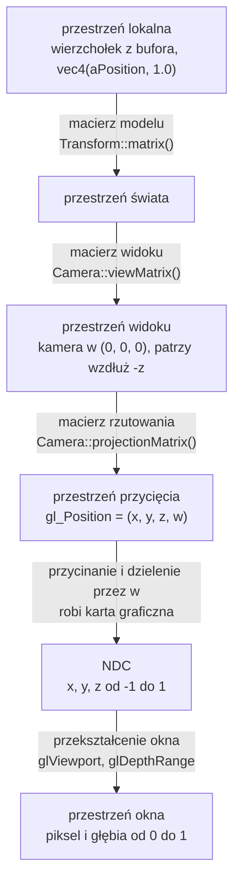
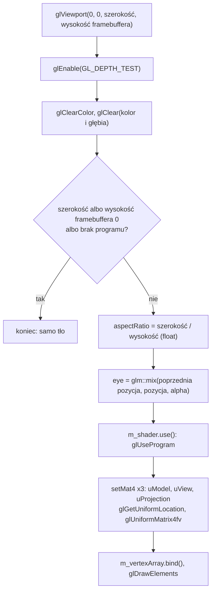

# Moduł scene: przekształcenia i kamera

Kamień milowy: M1. Temat wykładu: 3 (Przekształcenia przestrzeni).
Kod: [`src/scene/Transform.hpp`](../../../src/scene/Transform.hpp), [`src/scene/Transform.cpp`](../../../src/scene/Transform.cpp), [`src/scene/Camera.hpp`](../../../src/scene/Camera.hpp), [`src/scene/Camera.cpp`](../../../src/scene/Camera.cpp), shader [`assets/shaders/basic.vert`](../../../assets/shaders/basic.vert), użycie i sterowanie kamerą w [`src/game/NightMazeApp.cpp`](../../../src/game/NightMazeApp.cpp), panel w [`src/debug/panels/CameraPanel.cpp`](../../../src/debug/panels/CameraPanel.cpp).

Część modułu `scene`. Wstęp do modułu i jego miejsce w warstwach są w [`README.md`](README.md). Ten dokument korzysta z biblioteki GLM ([`../../libraries/glm.md`](../../libraries/glm.md): typy `vec3` i `mat4`, układ kolumnowy, funkcje budujące macierze) i z pojęć potoku renderowania z [`../gfx/shaders.md`](../gfx/shaders.md) (sekcja 2.2: przestrzeń przycięcia, dzielenie perspektywiczne, NDC).

## 1. Po co to jest

Najprostszy program OpenGL wpisuje współrzędne wierzchołków od razu jako pozycje na ekranie: x i y od -1 do 1. Tak wyglądał pierwszy trójkąt tego projektu. Tak nie da się zbudować sceny. Model ściany chcę opisać raz, wokół jego własnego środka, a potem postawić go w dowolnym miejscu labiryntu, obrócić i przeskalować. Scenę chcę oglądać z dowolnego miejsca i pod dowolnym kątem. Obraz ma mieć perspektywę: to, co dalej, ma być mniejsze. Wszystkie trzy potrzeby załatwia ten sam mechanizm: **mnożenie pozycji wierzchołka przez macierze 4 x 4**.

Są trzy macierze, każda odpowiada na inne pytanie:

| Macierz | Pytanie | Kto ją liczy w projekcie |
|---|---|---|
| model (model matrix) | gdzie w świecie stoi ten obiekt, jak jest obrócony i jaki jest duży | `scene::Transform::matrix()` |
| widoku (view matrix) | skąd i w którą stronę patrzę | `scene::Camera::viewMatrix()` |
| rzutowania (projection matrix) | jak szeroko widzę i jak powstaje perspektywa | `scene::Camera::projectionMatrix()` |

`scene::Transform` to trzy wektory (pozycja, obrót, skala) i jedna funkcja, która składa z nich macierz modelu. `scene::Camera` to pozycja, dwa kąty i parametry rzutowania oraz funkcje, które liczą z nich kierunek patrzenia, macierz widoku i macierz rzutowania. Obie struktury to zwykłe dane i matematyka: nie wołają OpenGL, nie znają klawiatury, myszy ani czasu.

Stan na dziś: `game::NightMazeApp` ma jeden `Transform` (kostka) i jedną `Camera`. Co klatkę liczy z nich trzy macierze i wysyła je do shadera `basic.vert`, który mnoży przez nie każdy wierzchołek kostki (sekcje 4, 5.9 i 5.10). Kostka jest obrócona na stałe. Kamera startuje w pozycji domyślnej `(0, 0, 3)` i można nią latać wokół kostki: kliknięcie w scenę przechwytuje kursor, mysz obraca kamerę, klawisze W, A, S, D, spacja i lewy Shift ją przesuwają, a Escape oddaje kursor (teoria w sekcji 2.12, kod w sekcji 5.11). Pola kamery, czułość myszy i prędkość ruchu edytuje panel Camera (sekcja 6).

## 2. Teoria

### 2.1 Przestrzenie współrzędnych

Ten sam wierzchołek ma po drodze od pliku modelu do piksela sześć różnych zestawów współrzędnych. Każdy zestaw to inna **przestrzeń** (space), czyli inny układ odniesienia: inny początek, inne osie, inna jednostka.

| Przestrzeń | Początek układu i osie | Do czego służy |
|---|---|---|
| lokalna, inaczej modelu (local space, model space) | środek albo podstawa samego obiektu | w niej zapisane są wierzchołki modelu. Kostka ma zawsze wierzchołki od -0,5 do 0,5, gdziekolwiek stoi |
| świata (world space) | jeden wspólny punkt sceny | w niej stoją wszystkie obiekty, kamera i światła. Jednostka w projekcie: 1 metr |
| widoku, inaczej kamery albo oka (view space, eye space) | kamera. Oś x w prawo, y w górę, kamera patrzy wzdłuż -z | scena widziana z kamery. Upraszcza rzutowanie i oświetlenie |
| przycięcia (clip space) | współrzędne jednorodne `(x, y, z, w)` po rzutowaniu | to jest `gl_Position`. W niej karta odcina wszystko, co poza polem widzenia |
| znormalizowane współrzędne urządzenia (normalized device coordinates, NDC) | sześcian od -1 do 1 na każdej osi | wynik podzielenia przez `w`. Nie zależy od rozmiaru okna |
| okna (window space, screen space) | lewy dolny róg obszaru rysowania, jednostką jest piksel | pozycja piksela i wartość głębi od 0 do 1 |



Trzy pierwsze strzałki to moja praca: mnożę je w shaderze wierzchołków (sekcja 4). Dwie ostatnie wykonuje karta graficzna sama, po shaderze wierzchołków, i nie da się ich zaprogramować.

W jednej linii:

```text
gl_Position = projection * view * model * vec4(aPosition, 1.0)
```

Wyrażenie czyta się od prawej do lewej: najpierw model, potem view, na końcu projection. Dlaczego tak, wyjaśnia [`../../libraries/glm.md`](../../libraries/glm.md), sekcja 3.4, i sekcja 2.5 niżej.

### 2.2 Współrzędne jednorodne i dlaczego macierz jest 4 x 4

Macierz 3 x 3 pomnożona przez wektor `(x, y, z)` potrafi obrócić i przeskalować, ale **nie potrafi przesunąć**. Każda składowa wyniku to suma składowych wejścia pomnożonych przez liczby, więc punkt `(0, 0, 0)` zawsze zostaje w `(0, 0, 0)`. Przesunięcie wymaga dodania stałej, a mnożenie macierzy 3 x 3 nie ma gdzie jej trzymać.

Rozwiązanie to **współrzędne jednorodne** (homogeneous coordinates): do trzech liczb dopisuję czwartą, `w`, a macierz powiększam do 4 x 4. Dla zwykłego punktu `w = 1`. Czwarta kolumna macierzy jest mnożona właśnie przez tę jedynkę, więc jej zawartość zostaje dodana do wyniku: to jest przesunięcie.

| `w` | Co oznacza wektor | Jak działa na niego przesunięcie |
|---|---|---|
| 1 | punkt (pozycja) | przesuwa go |
| 0 | kierunek (normalna, kierunek światła) | nie zmienia go: kolumna przesunięcia jest mnożona przez 0 |
| inna wartość | punkt przed dzieleniem perspektywicznym | prawdziwy punkt to `(x/w, y/w, z/w)` |

Trzeci wiersz tabeli to drugi powód, dla którego macierz ma rozmiar 4 x 4. Perspektywa wymaga **dzielenia** przez odległość od kamery, a mnożenie macierzy dzielić nie umie. Macierz rzutowania wpisuje więc odległość do `w`, a samo dzielenie wykonuje potem karta graficzna (sekcja 2.9).

Trzeci powód jest praktyczny: skoro przesunięcie, obrót, skala i rzutowanie są macierzami tego samego rozmiaru, można je **pomnożyć przez siebie raz** i dostać jedną macierz, która robi wszystko naraz. Shader mnoży wtedy każdy wierzchołek przez gotowy wynik.

### 2.3 Macierze przesunięcia, skali i obrotu

Zapis matematyczny: wiersze i kolumny tak, jak pisze się je na kartce. Wektor jest kolumną i stoi po prawej stronie macierzy.

**Przesunięcie** (translation) o `(tx, ty, tz)`:

```text
| 1  0  0  tx |   | x |   | x + tx |
| 0  1  0  ty | * | y | = | y + ty |
| 0  0  1  tz |   | z |   | z + tz |
| 0  0  0  1  |   | 1 |   |   1    |
```

**Skala** (scale) o współczynnikach `(sx, sy, sz)`:

```text
| sx 0  0  0 |   | x |   | sx * x |
| 0  sy 0  0 | * | y | = | sy * y |
| 0  0  sz 0 |   | z |   | sz * z |
| 0  0  0  1 |   | 1 |   |   1    |
```

Skala działa względem początku układu: punkt `(0, 0, 0)` zostaje na miejscu, a wszystko inne oddala się od niego albo przybliża. Gdy trzy współczynniki są równe, skala jest jednorodna (uniform). Gdy są różne, niejednorodna (non-uniform): obiekt zostaje rozciągnięty.

**Obrót** (rotation) o kąt `a` wokół każdej z osi, gdzie `c = cos(a)`, `s = sin(a)`:

```text
wokół osi X              wokół osi Y              wokół osi Z
| 1  0   0  0 |          |  c  0  s  0 |          | c  -s  0  0 |
| 0  c  -s  0 |          |  0  1  0  0 |          | s   c  0  0 |
| 0  s   c  0 |          | -s  0  c  0 |          | 0   0  1  0 |
| 0  0   0  1 |          |  0  0  0  1 |          | 0   0  0  1 |
```

Obrót też działa względem początku układu: oś obrotu przechodzi przez punkt `(0, 0, 0)`. Kierunek dodatniego kąta w układzie prawoskrętnym wyznacza **reguła prawej dłoni**: kciuk wskazuje dodatni kierunek osi, zgięte palce pokazują kierunek obrotu. Patrząc z końca osi w stronę początku układu, dodatni obrót jest przeciwny do ruchu wskazówek zegara. Przykład: obrót o 90 stopni wokół osi Y przenosi punkt `(1, 0, 0)` w `(0, 0, -1)`.

**Macierz jednostkowa** (identity matrix) ma jedynki na przekątnej i zera poza nią. To przekształcenie "nic nie rób" i punkt startowy przy składaniu macierzy.

W GLM te macierze budują `glm::translate`, `glm::scale` i `glm::rotate` ([`../../libraries/glm.md`](../../libraries/glm.md), sekcja 3.5). W pamięci GLM trzyma macierz kolumnami, więc przesunięcie leży w `m[3]` ([`../../libraries/glm.md`](../../libraries/glm.md), sekcja 3.3).

### 2.4 Kolejność ma znaczenie: przykład na liczbach

Mnożenie macierzy nie jest przemienne. Biorę jeden wierzchołek `(1, 0, 0)` i trzy przekształcenia:

- `S`: skala 2 na każdej osi,
- `R`: obrót o 90 stopni wokół osi Y,
- `T`: przesunięcie o `(5, 0, 0)`.

Te same trzy macierze w trzech kolejnościach:

| Iloczyn | Co dzieje się z wierzchołkiem, krok po kroku | Wynik |
|---|---|---|
| `T * R * S` | skala: `(2, 0, 0)`. Obrót: `(0, 0, -2)`. Przesunięcie: `(5, 0, -2)` | `(5, 0, -2)` |
| `R * T * S` | skala: `(2, 0, 0)`. Przesunięcie: `(7, 0, 0)`. Obrót: `(0, 0, -7)` | `(0, 0, -7)` |
| `S * R * T` | przesunięcie: `(6, 0, 0)`. Obrót: `(0, 0, -6)`. Skala: `(0, 0, -12)` | `(0, 0, -12)` |

Pierwszy wiersz to kolejność, której używa `Transform::matrix()`: **najpierw skala, potem obrót, na końcu przesunięcie**. Obiekt rośnie i obraca się wokół własnego środka, a dopiero potem trafia na swoje miejsce. Wierzchołek ląduje 2 jednostki od punktu `(5, 0, 0)`, czyli obiekt o podwojonym rozmiarze stoi tam, gdzie kazałem.

W drugim wierszu przesunięcie zadziałało przed obrotem. Obrót działa względem początku układu świata, więc obiekt, który już odjechał o 5 jednostek, zatoczył łuk wokół punktu `(0, 0, 0)` i wylądował zupełnie gdzie indziej. W trzecim wierszu skala na końcu pomnożyła także przesunięcie: obiekt stoi dwa razy dalej, niż miał.

### 2.5 Zapis kolumnowy i czytanie od prawej

Dwie rzeczy z GLM, bez których kod z sekcji 5 czyta się źle. Obie są opisane w [`../../libraries/glm.md`](../../libraries/glm.md) (sekcje 3.3, 3.4 i 3.5), tutaj tylko wniosek:

1. Wektor jest kolumną mnożoną z lewej strony, więc w iloczynie `T * R * S * v` pierwsza działa macierz stojąca **najbliżej wektora**, czyli `S`.
2. `glm::translate(m, v)`, `glm::rotate(m, a, axis)` i `glm::scale(m, v)` zwracają `m * T`, `m * R` i `m * S`: dokładają nowe przekształcenie z **prawej** strony. Kod, który woła je w kolejności translate, rotate, scale, buduje więc `T * R * S`, a wierzchołek przechodzi przez nie w kolejności odwrotnej do linii kodu.

### 2.6 Kąty Eulera i kolejność obrotów

Obrót obiektu zapisuję trzema kątami, po jednym na każdą oś. To **kąty Eulera** (Euler angles). Są wygodne, bo człowiek rozumie "obróć o 90 stopni wokół osi Y" i może taką liczbę wpisać w pole panelu. Mają jedną wadę: trzy obroty wokół trzech osi też nie są przemienne, więc same trzy liczby nie wystarczą. Trzeba jeszcze ustalić **kolejność**, w jakiej są stosowane.

W `Transform` kolejność jest stała: macierz obrotu to `Ry * Rx * Rz`. Czytając od strony wierzchołka: najpierw obrót wokół osi Z, potem wokół X, na końcu wokół Y. W języku kamery i samolotu to przechylenie (roll), potem pochylenie (pitch), na końcu odchylenie (yaw). Obrót wokół pionowej osi Y działa jako ostatni, więc zawsze jest obrotem wokół pionu świata: kąt y oznacza "w którą stronę świata obiekt jest zwrócony" niezależnie od pozostałych dwóch kątów. To ta sama konwencja, której używa kamera (najpierw pitch, potem yaw, sekcja 2.8), i najczęstszy przypadek w grze: ściany i kryształy obraca się głównie wokół pionu.

Przykład, że kolejność obrotów zmienia wynik. Kąty x = 90 i y = 90, wierzchołek `(0, 1, 0)`:

| Kolejność | Krok po kroku | Wynik |
|---|---|---|
| najpierw X, potem Y (tak jak w `Transform`) | obrót wokół X: `(0, 0, 1)`. Obrót wokół Y: `(1, 0, 0)` | `(1, 0, 0)` |
| najpierw Y, potem X | obrót wokół Y: `(0, 1, 0)` bez zmian, bo punkt leży na osi. Obrót wokół X: `(0, 0, 1)` | `(0, 0, 1)` |

**Blokada przegubu** (gimbal lock) to wada kątów Eulera, która wynika z kolejności. Gdy środkowy obrót (u mnie wokół X) wynosi dokładnie 90 stopni, oś pierwszego obrotu zostaje położona na osi ostatniego. Obrót wokół Z i obrót wokół Y robią wtedy to samo i z trzech stopni swobody zostają dwa: żadną zmianą kątów nie da się wykonać jednego z trzech rodzajów obrotu. Dla obiektów sceny, które kręcą się głównie wokół pionu, to nie przeszkadza. Kamera omija problem ograniczeniem kąta pitch (sekcja 2.8). Ogólnym rozwiązaniem są kwaterniony (quaternions), których w tym projekcie nie używam.

### 2.7 Macierz widoku: odwrotność przekształcenia kamery

OpenGL nie ma kamery. Jest tylko sześcian NDC, a na ekran trafia to, co się w nim znajdzie. "Ruch kamery" to złudzenie: zamiast przesuwać kamerę w prawo, przesuwam **cały świat** w lewo. Macierz widoku jest właśnie tym przekształceniem całego świata.

Kamerę można traktować jak każdy inny obiekt sceny: ma pozycję i obrót, czyli własną macierz modelu `C = T * R` (z przestrzeni kamery do świata). Macierz widoku robi drogę odwrotną, ze świata do przestrzeni kamery, więc jest **odwrotnością** tej macierzy:

```text
view = odwrotność(T * R) = odwrotność(R) * odwrotność(T)
```

Odwrotnością przesunięcia o `eye` jest przesunięcie o `-eye`. Odwrotnością obrotu jest obrót w przeciwną stronę, a dla macierzy obrotu odwrotność to po prostu jej transpozycja (zamiana wierszy z kolumnami). Macierz widoku najpierw przesuwa więc świat tak, żeby kamera znalazła się w punkcie `(0, 0, 0)`, a potem obraca go tak, żeby kierunek patrzenia pokrył się z osią -Z.

Nie liczę odwrotności ogólną funkcją `glm::inverse`. `glm::lookAt(eye, center, up)` buduje wynik wprost z trzech wektorów jednostkowych, które tworzą **bazę kamery** (basis):

| Wektor | Jak powstaje | Znaczenie |
|---|---|---|
| `f` (forward) | `normalize(center - eye)` | kierunek patrzenia |
| `s` (side, right) | `normalize(cross(f, up))` | w prawo od kamery. Prostopadły do kierunku patrzenia i do góry świata |
| `u` (up) | `cross(s, f)` | góra kamery. Prostopadły do dwóch pozostałych. To nie jest góra świata: gdy kamera patrzy w dół, jej góra pochyla się do przodu |

Te trzy wektory stają się **wierszami** macierzy (to jest transpozycja, czyli odwrócony obrót), a ostatnia kolumna przesuwa świat o `-eye` wyrażone w nowej bazie:

```text
|  s.x   s.y   s.z   -dot(s, eye) |
|  u.x   u.y   u.z   -dot(u, eye) |
| -f.x  -f.y  -f.z    dot(f, eye) |
|   0     0     0         1       |
```

Trzeci wiersz ma minusy, bo w przestrzeni widoku kamera patrzy wzdłuż **ujemnej** osi Z: punkt leżący przed kamerą ma dostać ujemne z. Jak czytać taki wiersz: współrzędna x punktu w przestrzeni widoku to `dot(s, punkt - eye)`, czyli "jak daleko w prawo od kamery jest ten punkt".

Argument `up` jest tylko wskazówką, gdzie jest góra. Nie musi być prostopadły do kierunku patrzenia, ale **nie może być do niego równoległy**: wtedy `cross(f, up)` jest wektorem zerowym, a `normalize` wektora zerowego to dzielenie przez zero (sekcja 2.8).

### 2.8 Kamera FPS: yaw, pitch i wektor kierunku

Kamera z perspektywy pierwszej osoby (first person, FPS) nie przechyla się na boki. Do opisania kierunku patrzenia wystarczą dwa kąty:

- **yaw** (odchylenie): obrót w lewo i w prawo, wokół pionowej osi świata,
- **pitch** (pochylenie): patrzenie w górę i w dół.

Trzeci kąt, roll (przechylenie na bok), jest zawsze równy zero.

**Konwencja projektu.** Yaw 0 i pitch 0 to patrzenie wzdłuż -Z. Yaw działa jak kompas oglądany z góry: rośnie przy obrocie **w prawo**. Dodatni pitch to patrzenie w górę.

| yaw | Kierunek patrzenia (przy pitch 0) |
|---|---|
| 0 | `(0, 0, -1)`, czyli -Z |
| 90 | `(1, 0, 0)`, czyli +X |
| 180 | `(0, 0, 1)`, czyli +Z |
| 270 | `(-1, 0, 0)`, czyli -X |

**Wyprowadzenie wzoru.** Szukam wektora jednostkowego `forward`. Składam go w dwóch krokach.

Krok 1, pitch. Widok z boku: oś pozioma to kierunek "przed siebie", oś pionowa to Y. Wektor o długości 1 podniesiony o kąt `pitch` jest przeciwprostokątną trójkąta prostokątnego:

```text
        Y
        |          * forward (długość 1)
        |        / |
        |      /   |  sin(pitch)   składowa pionowa
        |    /     |
        |  / pitch |
        +----------+------> przed siebie (w poziomie)
          cos(pitch)
          składowa pozioma
```

Z definicji sinusa i cosinusa: składowa pionowa to `sin(pitch)`, a część pozioma ma długość `cos(pitch)`. Im wyżej patrzę, tym krótsza część pozioma.

Krok 2, yaw. Widok z góry, na płaszczyznę XZ. Część pozioma (długości `cos(pitch)`) jest obrócona o kąt `yaw` od kierunku -Z w stronę +X:

```text
                  -Z   (yaw = 0)
                   |
                   |     * część pozioma forward
                   |   /
                   | /  yaw
     -X -----------+-----------> +X   (yaw = 90)
                   |
                   |
                  +Z   (yaw = 180)
```

Rozkładam ją na osie: na oś X przypada `sin(yaw)`, na kierunek -Z przypada `cos(yaw)`, czyli składowa z ma znak minus. Obie mnożę przez długość części poziomej:

```text
forward.x =  cos(pitch) * sin(yaw)
forward.y =  sin(pitch)
forward.z = -cos(pitch) * cos(yaw)
```

Sprawdzenie długości: `x^2 + z^2 = cos^2(pitch) * (sin^2(yaw) + cos^2(yaw)) = cos^2(pitch)`, a po dodaniu `y^2 = sin^2(pitch)` wychodzi 1. Wektor jest jednostkowy bez normalizowania.

Dwie uwagi do konwencji:

- Obrót "w prawo" patrząc z góry jest zgodny z ruchem wskazówek zegara, czyli **przeciwny** do dodatniego obrotu wokół osi Y z sekcji 2.3. Dodatni yaw kamery to obrót o `-yaw` wokół Y. Wybrałem kierunek kompasu, bo ruch myszy w prawo daje dodatnie przesunięcie ([`../core/input.md`](../core/input.md), sekcja 5.8), więc przesunięcie można dodać do kąta bez zmiany znaku.
- LearnOpenGL podaje wzór `(cos(yaw) * cos(pitch), sin(pitch), sin(yaw) * cos(pitch))`, w którym yaw 0 oznacza patrzenie wzdłuż +X, i dlatego ustawia yaw startowy na -90 stopni. To ten sam wzór przesunięty o 90 stopni: `cos(yaw - 90) = sin(yaw)` i `sin(yaw - 90) = -cos(yaw)`. U mnie zero jest tam, gdzie kierunek "do przodu" całego projektu.

**Wektor w prawo.** Potrzebny do chodzenia bokiem (strafe). To iloczyn wektorowy kierunku patrzenia i góry świata: `right = normalize(cross(forward, WORLD_UP))`. Iloczyn wektorowy daje wektor prostopadły do obu argumentów, więc `right` jest zawsze poziomy (prostopadły do pionu). Jego długość przed normalizacją to `cos(pitch)`, a nie 1, bo `forward` i `WORLD_UP` nie są do siebie prostopadłe, gdy patrzę w górę albo w dół. Stąd `normalize`.

**Ograniczenie pitch.** Przy pitch równym dokładnie 90 stopni `forward` to `(0, 1, 0)`, czyli wektor równoległy do góry świata. Wtedy:

- `cross(forward, WORLD_UP)` jest wektorem zerowym: z dwóch równoległych wektorów nie da się wyznaczyć trzeciego, prostopadłego do obu,
- `normalize` dzieli przez długość 0 i zwraca `NaN` w każdej składowej,
- `glm::lookAt` robi w środku dokładnie to samo, więc cała macierz widoku wypełnia się wartościami `NaN` i obraz znika.

Geometrycznie: patrząc pionowo w górę, nie da się powiedzieć, gdzie jest "prawo", bo każdy poziomy kierunek jest równie dobry. To blokada przegubu z sekcji 2.6 w wersji dla kamery: yaw przestaje zmieniać kierunek patrzenia i tylko kręci obrazem. Po przekroczeniu 90 stopni jest jeszcze gorzej: kamera patrzy "do tyłu przez głowę", ale `lookAt` nadal dostaje górę świata, więc obraz nagle obraca się o 180 stopni (gimbal flip).

Rozwiązanie jest proste: pitch jest ograniczany do zakresu od -89 do 89 stopni (stała `MAX_PITCH_DEGREES`). Przy 89 stopniach długość iloczynu wektorowego to `cos(89 stopni)`, czyli około 0,0175: mało, ale daleko od zera. Gracz nie zauważa brakującego stopnia.

### 2.9 Rzutowanie perspektywiczne

**Bryła widzenia** (view frustum) to obszar sceny, który kamera widzi: ścięty ostrosłup z wierzchołkiem w kamerze. Opisują go cztery liczby:

| Parametr | Znaczenie | Wartość domyślna w `Camera` |
|---|---|---|
| pionowy kąt widzenia (vertical field of view, FOV) | kąt między górną a dolną ścianą ostrosłupa | 60 stopni |
| proporcje (aspect ratio) | szerokość obrazu podzielona przez wysokość. Z nich i z pionowego FOV wynika kąt poziomy | podaje wołający |
| bliska płaszczyzna (near plane) | odległość, od której zaczyna się widoczny obszar | 0,1 |
| daleka płaszczyzna (far plane) | odległość, na której się kończy | 100 |

```text
widok z boku (oś pionowa: Y, kamera patrzy w prawo, wzdłuż -Z)

                                        | daleka płaszczyzna
                                   .  ' |
                              .  '      |
                   bliska .  '          |
                        |               |
   kamera *  fov        |   widoczne    |
                        |               |
                          '  .          |
                               '  .     |
                                    ' . |
          |<-- near --->|
          |<------------- far --------->|
```

Wszystko poza tą bryłą jest przycinane. To, co jest w środku, macierz rzutowania przekształca tak, żeby po dzieleniu przez `w` bryła stała się sześcianem NDC.

**Skąd bierze się perspektywa.** Z trójkątów podobnych: punkt na wysokości `y`, w odległości `d` od kamery, trafia na ekranie na wysokość proporcjonalną do `y / d`. Dwa razy dalej to dwa razy niżej nad środkiem obrazu, czyli dwa razy mniejszy. Górna krawędź obrazu w odległości `d` jest na wysokości `d * tan(fov / 2)`, więc współrzędna NDC to:

```text
y_ndc = y / (d * tan(fov / 2))
x_ndc = x / (d * tan(fov / 2) * aspect)
```

W przestrzeni widoku kamera patrzy wzdłuż -Z, więc odległość to `d = -z`. Mnożenie macierzy nie umie dzielić przez `z`, dlatego macierz robi dwie rzeczy: skaluje x i y, a do `w` wpisuje `-z`. Dzielenie wykonuje karta.

Macierz, którą buduje `glm::perspective(fovy, aspect, near, far)` (wariant domyślny, prawoskrętny, głębia od -1 do 1), gdzie `f = 1 / tan(fovy / 2)`:

```text
| f / aspect   0        0                              0                        |
|     0        f        0                              0                        |
|     0        0   -(far + near) / (far - near)   -2 * far * near / (far - near) |
|     0        0       -1                              0                        |
```

Czwarty wiersz to cały sekret perspektywy: `w_clip = -z_view`, czyli odległość punktu od kamery. Dla wartości domyślnych kamery i proporcji 16:9 wychodzi `f = 1,732`, `f / aspect = 0,974`, a dwa wyrazy trzeciego wiersza to `-1,002` i `-0,2002`.

**Przycinanie i dzielenie perspektywiczne.** Po shaderze wierzchołków karta najpierw odrzuca to, co nie spełnia `-w <= x <= w`, `-w <= y <= w`, `-w <= z <= w`, a potem dzieli x, y i z przez `w` (perspective divide). Przykład dla kamery domyślnej (stoi w `(0, 0, 3)`, patrzy na początek układu):

| Punkt w świecie | W przestrzeni widoku | NDC po dzieleniu | Gdzie na ekranie |
|---|---|---|---|
| `(0, 0, 0)` | `(0, 0, -3)` | `(0, 0, 0,935)` | dokładnie środek |
| `(1, 0, 0)` | `(1, 0, -3)` | `(0,325, 0, 0,935)` | na prawo od środka |
| `(0, 1, 0)` | `(0, 1, -3)` | `(0, 0,577, 0,935)` | nad środkiem. `1 * 1,732 / 3 = 0,577` |
| `(0, 1,732, 0)` | `(0, 1,732, -3)` | `(0, 1, 0,935)` | na górnej krawędzi: `3 * tan(30 stopni) = 1,732` |

**Głębia jest nieliniowa.** Trzeci wiersz macierzy jest dobrany tak, żeby po dzieleniu bliska płaszczyzna dawała z = -1, a daleka z = 1. Pomiędzy nimi zależność od odległości nie jest liniowa, tylko postaci `A + B / d`. Wartości dla near 0,1 i far 100:

| Odległość od kamery | z w NDC | Głębia w buforze (od 0 do 1) |
|---|---|---|
| 0,1 (bliska płaszczyzna) | -1,000 | 0,000 |
| 0,2 | 0,001 | 0,5005 |
| 1 | 0,802 | 0,901 |
| 10 | 0,982 | 0,991 |
| 50 | 0,998 | 0,999 |
| 100 (daleka płaszczyzna) | 1,000 | 1,000 |

Połowa całego zakresu głębi jest zużyta na pierwsze 10 centymetrów za bliską płaszczyzną (od 0,1 do 0,2), a wszystko dalej niż 10 jednostek mieści się w ostatnim 1 procencie. Blisko kamery precyzja jest ogromna, daleko bardzo mała. To celowe (błąd głębi blisko kamery jest najlepiej widoczny), ale ma skutek uboczny.

**Dlaczego near nie może być bardzo małe.** Reguła z tabeli brzmi: połowa zakresu głębi przypada na odległości od `near` do `2 * near`. Przy near 0,001 połowa precyzji idzie na pierwszy milimetr, a dla dwóch ścian oddalonych o 20 metrów zostaje tak mało różnych wartości, że obie dostają tę samą głębię. Test głębi nie potrafi wtedy rozstrzygnąć, która jest bliżej, i piksele obu powierzchni migoczą na przemian: to **z-fighting**. Zwiększenie `near` pomaga dużo bardziej niż zmniejszenie `far`. Near równe 0 jest błędem: w macierzy wyraz `-2 * far * near` zeruje się i głębia każdego punktu wychodzi taka sama.

**FOV.** Mały kąt (na przykład 30 stopni) działa jak teleobiektyw: widać wąski wycinek sceny w powiększeniu. Duży (100 stopni i więcej) pokazuje szeroko, ale rozciąga obraz przy krawędziach. Typowy zakres w grach to od 60 do 90 stopni. GLM przyjmuje kąt **pionowy**, a wiele gier podaje w ustawieniach kąt poziomy, więc te same liczby nie znaczą tego samego.

### 2.10 Z NDC do pikseli

Ostatni krok, też wykonywany przez kartę. `glViewport(x0, y0, width, height)` mówi, na jaki prostokąt bufora ramki trafia kwadrat NDC:

```text
x_okna = x0 + (x_ndc + 1) / 2 * width
y_okna = y0 + (y_ndc + 1) / 2 * height
głębia = (z_ndc + 1) / 2
```

Z tego wynika związek proporcji z viewportem. NDC jest zawsze kwadratem od -1 do 1, a okno zwykle jest prostokątem. Bez poprawki kwadrat zostałby rozciągnięty na prostokąt i kostka wyglądałaby jak cegła. Macierz rzutowania z góry ściska oś x przez podzielenie przez `aspect`, a viewport rozciąga ją z powrotem. Oba przekształcenia się znoszą tylko wtedy, gdy `aspect` to **dokładnie** szerokość viewportu podzielona przez jego wysokość, czyli gdy jedno i drugie pochodzi z rozmiaru framebuffera ([`../core/window-context.md`](../core/window-context.md), sekcja 2).

### 2.11 Konwencja projektu: układ prawoskrętny, Y w górę, -Z do przodu

| Ustalenie | Wartość |
|---|---|
| skrętność układu | prawoskrętny (right-handed) |
| oś X | w prawo |
| oś Y | w górę |
| oś Z | w stronę patrzącego. "Do przodu" to -Z |
| jednostka | 1 jednostka to 1 metr |

**Układ prawoskrętny**: kciuk prawej dłoni wskazuje +X, palec wskazujący +Y, a środkowy +Z. Równoważnie: `cross(X, Y) = Z`. Przy osi X w prawo i Y w górę oś Z wychodzi z ekranu w stronę patrzącego, więc to, co przed kamerą, ma ujemne z.

To konwencja OpenGL i wartości domyślnych GLM (`lookAt` to `lookAtRH`, `perspective` to `perspectiveRH_NO`), więc nie definiuję żadnego makra `GLM_FORCE_*`. Ta sama konwencja obowiązuje dla modeli: PRD w sekcji 9 ustala dla eksportu z Blendera osie "Y-up, -Z forward" i skalę 1 jednostka = 1 metr. Dzięki temu model wyeksportowany przodem do -Z stoi w grze przodem do kierunku, w który kamera patrzy przy yaw 0, a `WORLD_UP` to `(0, 1, 0)` w każdym miejscu kodu.

Uwaga: sześcian NDC jest **lewoskrętny** (z rośnie w głąb ekranu: -1 to blisko, 1 to daleko). Zamianę skrętności wykonuje macierz rzutowania, a dokładnie jej wyraz `-1` w czwartym wierszu i minus w trzecim. W moim kodzie nie wymaga to żadnej uwagi, ale wyjaśnia, dlaczego w przestrzeni widoku "dalej" to mniejsze z, a w buforze głębi "dalej" to większa wartość.

### 2.12 Sterowanie kamerą FPS: mysz, klawiatura i czas

Sekcja 2.8 mówi, jak z dwóch kątów powstaje kierunek patrzenia. Ta sekcja mówi, skąd biorą się same kąty i pozycja: z myszy, z klawiatury i z upływu czasu.

**Mysz: przesunięcie na kąty.** Kamery nie interesuje, gdzie kursor jest, tylko o ile się przesunął od poprzedniej klatki ([`../core/input.md`](../core/input.md), sekcja 2.4). Przesunięcie w poziomie zmienia yaw, przesunięcie w pionie zmienia pitch:

```text
zmiana yaw   =  mouseDeltaX * czułość
zmiana pitch = -mouseDeltaY * czułość
```

- **Czułość** (sensitivity) to współczynnik przeliczający ruch myszy na kąt. Jej jednostka to **stopnie na jednostkę współrzędnych ekranu**. Przy wartości domyślnej 0,1 przesunięcie kursora o 900 jednostek obraca kamerę o 90 stopni. Jednostką myszy są współrzędne ekranu (te same co rozmiar okna), a nie piksele framebuffera, więc ten sam ruch ręki daje ten sam obrót na zwykłym ekranie i na ekranie Retina ([`../core/input.md`](../core/input.md), sekcja 2.5).
- **Znak przy x** się nie zmienia: ruch myszy w prawo daje dodatnie `mouseDeltaX`, a dodatni yaw obraca kamerę w prawo. Po to yaw ma w tym projekcie kierunek kompasu (sekcja 2.8).
- **Minus przy y** bierze się z dwóch przeciwnych konwencji: współrzędna y ekranu rośnie **w dół**, a pitch rośnie przy patrzeniu **w górę**. Ruch myszy do góry daje ujemne `mouseDeltaY`, więc trzeba odwrócić znak, żeby podnosił wzrok. Kto woli odwrócone sterowanie jak w symulatorze lotu (invert y), usuwa ten minus.
- Yaw jest potem zawijany, a pitch przycinany: robi to `Camera::rotate` (sekcja 5.6).

**Klawiatura: ruch wzdłuż osi kamery.** Kamera ma trzy kierunki, wzdłuż których może się przesuwać:

| Klawisze | Kierunek | Skąd się bierze |
|---|---|---|
| W i S | do przodu i do tyłu | `forward()`: kierunek patrzenia (sekcja 2.8) |
| D i A | w prawo i w lewo | `right()`: zawsze poziomy |
| spacja i lewy Shift | w górę i w dół | `WORLD_UP`: pion świata, niezależnie od tego, gdzie patrzę |

Każdy wciśnięty klawisz dodaje swój wektor do sumy (klawisz przeciwny go odejmuje), więc dwa klawisze przeciwne znoszą się do zera, a dwa prostopadłe dają ruch po skosie. Nowa pozycja to:

```text
pozycja = pozycja + kierunek * prędkość * czas
```

Prędkość jest w metrach na sekundę, czas w sekundach, więc iloczyn to metry: droga przebyta w tym odcinku czasu.

**To jest lot, nie chodzenie.** W i S przesuwają wzdłuż `forward()`, który ma składową pionową, gdy patrzę w górę albo w dół. Trzymając W ze wzrokiem podniesionym o 30 stopni, kamera wznosi się: połowa prędkości idzie w górę (`sin(30 stopni) = 0,5`). Dla kamery latającej (free fly) tak ma być: leci tam, gdzie patrzy. Dla postaci chodzącej po podłodze byłby to błąd. Chodzenie wymaga rzutowania kierunku na poziom, czyli wyzerowania składowej y i ponownej normalizacji (ćwiczenie 19). W projekcie zostaje lot, dopóki nie ma kolizji i podłogi (M2).

**Normalizacja kierunku.** Wzór na pozycję zakłada, że `kierunek` ma długość 1. Suma dwóch prostopadłych wektorów jednostkowych (W i D naraz) ma długość `sqrt(2)`, czyli około 1,41: bez poprawki ruch po skosie byłby o 41 procent szybszy niż na wprost. Sumę trzeba więc **znormalizować**, czyli podzielić przez jej długość. Jest jeden wyjątek: gdy żaden klawisz nie jest wciśnięty (albo wciśnięte są dwa przeciwne), suma jest wektorem zerowym, a jego normalizacja to dzielenie zera przez zero. Wynikiem jest `NaN` w każdej składowej, `NaN` dodany do pozycji zostaje w niej na zawsze i obraz znika. Wektor zerowy zostawiam więc bez zmian.

**Dlaczego obrót raz na klatkę, a ruch stałym krokiem.** To dwa różne rodzaje danych wejściowych:

| | Obrót myszą | Ruch klawiszami |
|---|---|---|
| Rodzaj danych | przesunięcie myszy: wartość opisująca **jedną klatkę** | stan klawisza: "jest wciśnięty", taki sam przez całą klatkę |
| Od czego zależy wynik | tylko od drogi, którą przebyła mysz | od **czasu** trzymania klawisza |
| Gdzie w pętli | `onRender`, dokładnie raz na klatkę | `onUpdate`, stałym krokiem `FIXED_DT` |

Przesunięcie myszy to gotowa wielkość: ręka przesunęła mysz o tyle i kamera ma się obrócić o tyle razy czułość, niezależnie od tego, ile trwała klatka. Nie mnożę jej przez czas. Trzeba ją tylko zastosować **dokładnie raz**. `onUpdate` wykonuje się od zera do wielu razy na klatkę ([`../core/main-loop.md`](../core/main-loop.md), sekcja 2.2): w klatce bez kroku ruch myszy by przepadł, a w klatce z trzema krokami zostałby dodany trzy razy, więc czułość zależałaby od FPS ([`../core/input.md`](../core/input.md), sekcja 2.8). Ruch klawiszami zależy od czasu, a czas symulacji płynie właśnie stałymi krokami: 120 kroków po `prędkość / 120` metra daje dokładnie `prędkość` metrów na sekundę przy każdym FPS. Od M2 w tym samym miejscu dojdą kolizje, które tego stałego kroku wymagają.

**Interpolacja z `alpha`.** Skoro pozycja zmienia się tylko w krokach symulacji (co 8,33 ms), a klatki są rysowane we własnym rytmie (na przykład co 6 ms), to klatka wypada zwykle **między** dwoma krokami. Rysowanie zawsze z ostatniej policzonej pozycji daje szarpanie: jedne klatki pokazują postęp o jeden krok, a inne o zero albo o dwa. Rozwiązanie: pamiętam pozycję sprzed ostatniego kroku i rysuję z punktu leżącego między nią a pozycją bieżącą, w proporcji `alpha` ([`../core/main-loop.md`](../core/main-loop.md), sekcja 2.4):

```text
oko = poprzednia * (1 - alpha) + bieżąca * alpha        czyli glm::mix(poprzednia, bieżąca, alpha)
```

```text
kroki symulacji (co 8,33 ms):   k0          k1          k2          k3
                                 |-----------|-----------|-----------|-----> czas
klatki (co 6 ms):                      K1      K2    K3      K4    K5

K3 wypada po kroku k2: w akumulatorze została reszta 1,33 ms, alpha = 1,33 / 8,33 = 0,16
poprzednia = pozycja po kroku k1,  bieżąca = pozycja po kroku k2
oko        = punkt w 16 procentach drogi od poprzedniej do bieżącej
```

Przykład na liczbach. Kamera leci w prawo z prędkością 3 m/s, więc jeden krok to `3 / 120 = 0,025` m. Klatki trwają po 6 ms (około 167 FPS). Przed pierwszą klatką z tabeli kamera jest w x = 1,000, a przed ostatnim krokiem była w x = 0,975:

| Klatka | Akumulator po `beginFrame` | Kroki | Reszta | `alpha` | Poprzednia x | Bieżąca x | Oko x (z interpolacją) | Przyrost oka | Przyrost bez interpolacji |
|---|---|---|---|---|---|---|---|---|---|
| 1 | 6,00 ms | 0 | 6,00 ms | 0,72 | 0,975 | 1,000 | 0,993 | | |
| 2 | 12,00 ms | 1 | 3,67 ms | 0,44 | 1,000 | 1,025 | 1,011 | 0,018 | 0,025 |
| 3 | 9,67 ms | 1 | 1,33 ms | 0,16 | 1,025 | 1,050 | 1,029 | 0,018 | 0,025 |
| 4 | 7,33 ms | 0 | 7,33 ms | 0,88 | 1,025 | 1,050 | 1,047 | 0,018 | 0,000 |
| 5 | 13,33 ms | 1 | 5,00 ms | 0,60 | 1,050 | 1,075 | 1,065 | 0,018 | 0,025 |
| 6 | 11,00 ms | 1 | 2,67 ms | 0,32 | 1,075 | 1,100 | 1,083 | 0,018 | 0,025 |

Z interpolacją oko przesuwa się w każdej klatce o te same 0,018 m, czyli dokładnie `3 m/s * 0,006 s`. Bez niej (ostatnia kolumna: rysowanie z pozycji bieżącej) obraz skacze o 0,025, a w klatce 4 stoi w miejscu, bo nie zmieścił się w niej żaden krok. Klatka 4 pokazuje też, że interpolacja działa poprawnie w klatce **bez kroku**: poprzednia i bieżąca pozycja są te same co w klatce 3, urosło tylko `alpha` (z 0,16 do 0,88), więc oko przesunęło się dalej wzdłuż tego samego odcinka.

Cena interpolacji: obraz jest spóźniony względem symulacji o najwyżej jeden krok (8,33 ms), bo rysuję punkt między przedostatnim a ostatnim stanem, a nie stan najnowszy. Przy 120 krokach na sekundę tego opóźnienia nie da się zauważyć.

Interpoluję tylko **pozycję**. Kąty zmieniają się raz na klatkę, w tej samej klatce, w której są rysowane, więc nie mają dwóch stanów do mieszania.

## 3. Jak to działa w OpenGL

Macierze to zwykła matematyka na procesorze. `Transform` i `Camera` nie wołają żadnej funkcji `gl*` i nie dołączają GLAD: do działania wystarcza im GLM. OpenGL dowiaduje się o macierzach dopiero wtedy, gdy ktoś wyśle je do programu shaderów. Wywołania, które biorą w tym udział:

| Wywołanie | Co robi | Związek z tym dokumentem |
|---|---|---|
| `glGetUniformLocation(program, "uModel")` | zwraca numer (location) zmiennej `uniform` o podanej nazwie w zlinkowanym programie, albo -1, gdy takiej nie ma | po numerze wskazuję, do której zmiennej shadera trafia macierz |
| `glUniformMatrix4fv(location, 1, GL_FALSE, wskaźnik)` | kopiuje 16 liczb `float` do zmiennej `uniform mat4` programu, który jest aktualnie w użyciu (`glUseProgram`) | tak macierz z GLM trafia do shadera. `GL_FALSE` znaczy "nie transponuj": GLM trzyma macierz kolumnami, czyli tak, jak chce OpenGL. Wskaźnik daje `glm::value_ptr` ([`../../libraries/glm.md`](../../libraries/glm.md), sekcja 3.9) |
| `glViewport(x, y, width, height)` | ustala prostokąt bufora ramki, na który trafia kwadrat NDC | z tych samych `width` i `height` trzeba policzyć `aspectRatio` dla `Camera::projectionMatrix` (sekcja 2.10) |
| `glEnable(GL_DEPTH_TEST)` | włącza test głębi: fragment jest rysowany tylko wtedy, gdy jest bliżej niż to, co już jest w buforze głębi | bez niego o widoczności decyduje kolejność rysowania trójkątów, a nie odległość. Wartość głębi pochodzi z macierzy rzutowania (sekcja 2.9) |
| `glClear(GL_COLOR_BUFFER_BIT \| GL_DEPTH_BUFFER_BIT)` | czyści kolor i głębię | przy włączonym teście głębi bufor głębi trzeba czyścić co klatkę, inaczej zostają w nim wartości z poprzedniej |
| `glDepthRange(0, 1)` | zakres, na który trafia z z NDC | wartość domyślna, nie zmieniam jej |

Sterowanie kamerą (sekcje 2.12 i 5.11) nie dokłada do tej listy niczego: obrót i ruch zmieniają tylko liczby, z których powstaje macierz widoku. Wszystkie te wywołania poza `glDepthRange` wykonuje program w każdej klatce: `glViewport`, `glEnable(GL_DEPTH_TEST)` i `glClear` wprost w `NightMazeApp::onRender`, a `glGetUniformLocation` i `glUniformMatrix4fv` wewnątrz `gfx::Shader::setMat4` ([`../gfx/shaders.md`](../gfx/shaders.md), sekcja 5.12), po trzy razy na klatkę.

Kolejność w klatce:



Trzy zależności w tej kolejności:

1. `use()` stoi przed `setMat4`. Uniform należy do programu, a `glUniform*` pisze do programu aktualnie wybranego.
2. Proporcje są liczone z tych samych dwóch liczb, które trafiły do `glViewport` (sekcja 2.10).
3. Bufor głębi jest czyszczony razem z kolorem, przed rysowaniem.

**Test głębi** (depth test). Każdy piksel bufora ramki ma oprócz koloru wartość głębi od 0 do 1. `glClear(GL_DEPTH_BUFFER_BIT)` wpisuje wszędzie 1, czyli "najdalej". Przy włączonym teście fragment jest zapisywany tylko wtedy, gdy jego głębia jest **mniejsza** od tej w buforze (domyślna funkcja `GL_LESS`), i wtedy nadpisuje kolor oraz głębię. Dzięki temu bliższa ściana wygrywa niezależnie od kolejności rysowania trójkątów. Bez testu wygrywa ten trójkąt, który został narysowany później. Dla kostki oznacza to, że ściany tylne, rysowane po przedniej, zamalowują ją i bryła wygląda jak wywrócona na lewą stronę (zmierzone, sekcja 5.8).

Okno ma bufor głębi, choć `core::Window` nigdzie o niego nie prosi: wskazówka GLFW `GLFW_DEPTH_BITS` ma wartość domyślną 24, więc każde okno GLFW dostaje bufor głębi o 24 bitach, jeśli nie zażądam inaczej.

## 4. Shadery

Macierze spotykają się z wierzchołkiem w shaderze wierzchołków [`assets/shaders/basic.vert`](../../../assets/shaders/basic.vert). Cały plik, linia po linii, omawia [`../gfx/shaders.md`](../gfx/shaders.md), sekcja 4.1. Tutaj dwa fragmenty, które dotyczą przekształceń.

Deklaracje uniformów:

```glsl
// Uniforms: set from C++ (gfx::Shader::setMat4), the same for every vertex of one draw call.
// See docs/modules/scene/transforms-camera.md
uniform mat4 uModel;      // local space to world space: where the object stands
uniform mat4 uView;       // world space to view space: where the camera is and looks
uniform mat4 uProjection; // view space to clip space: perspective
```

Funkcja `main`:

```glsl
void main() {
    // gl_Position is the built-in output every vertex shader must write: the position in
    // clip space. The expression is read from right to left, the matrix nearest to the
    // vector is applied first:
    //   vec4(aPosition, 1.0)  the vertex in local space, w = 1 because it is a point
    //   uModel * ...          the vertex in world space
    //   uView * ...           the vertex in view space, as seen from the camera
    //   uProjection * ...     the vertex in clip space
    // After this shader the graphics card divides x, y and z by w (the distance from the
    // camera), which is what makes distant things small.
    gl_Position = uProjection * uView * uModel * vec4(aPosition, 1.0);

    // Pass the color through unchanged.
    vColor = aColor;
}
```

| Element | Znaczenie |
|---|---|
| `uniform mat4 uModel;` | zmienna `uniform`: wartość ustawiana z C++ i taka sama dla wszystkich wierzchołków jednego wywołania rysującego. Atrybut (`in`) ma inną wartość dla każdego wierzchołka, uniform jedną dla całego obiektu |
| `vec4(aPosition, 1.0)` | pozycja z bufora ma trzy składowe i jest w przestrzeni lokalnej kostki. Dopisuję `w = 1`, bo to punkt (sekcja 2.2) |
| `uModel * ...` | po tym mnożeniu wierzchołek jest w przestrzeni świata |
| `uView * ...` | po tym w przestrzeni widoku: tak, jak widzi go kamera |
| `uProjection * ...` | po tym w przestrzeni przycięcia. To trzy pierwsze strzałki diagramu z sekcji 2.1, czytane od prawej |
| `gl_Position` | po tym przypisaniu `w` nie jest już jedynką: to odległość od kamery. Dzielenie wykona karta |

Mnożenie macierzy jest łączne, więc `uProjection * uView * uModel * v` daje ten sam wynik niezależnie od tego, w jakiej kolejności shader policzy iloczyny. Nie jest przemienne: zamiana miejscami dwóch macierzy w zapisie daje inny wynik (ćwiczenie 13).

Macierz widoku i rzutowania jest wspólna dla całej klatki, macierz modelu jest inna dla każdego obiektu. Stąd trzy osobne uniformy: `uView` i `uProjection` wystarczy ustawić raz na klatkę, a `uModel` przed każdym obiektem. Prawdziwy renderer często wysyła zamiast tego jeden gotowy iloczyn policzony w C++ (jedno mnożenie na wierzchołek zamiast trzech). Tutaj macierze są osobno celowo, żeby każdą dało się podmienić i obejrzeć skutek. Shader fragmentów nie bierze udziału w przekształceniach.

Nazwy `uModel`, `uView` i `uProjection` muszą być identyczne z napisami w C++ (stałe `MODEL_UNIFORM`, `VIEW_UNIFORM`, `PROJECTION_UNIFORM`, sekcja 5.9). Literówka nie daje żadnego błędu, tylko pusty ekran ([`../gfx/shaders.md`](../gfx/shaders.md), pułapka 8).

## 5. Kod w projekcie

### 5.1 Pliki

| Plik | Co zawiera |
|---|---|
| [`src/scene/Transform.hpp`](../../../src/scene/Transform.hpp) | struktura `Transform`: pola `position`, `rotationDegrees`, `scale` i deklaracja `matrix()` |
| [`src/scene/Transform.cpp`](../../../src/scene/Transform.cpp) | stałe `AXIS_X`, `AXIS_Y`, `AXIS_Z` i funkcja `Transform::matrix()` |
| [`src/scene/Camera.hpp`](../../../src/scene/Camera.hpp) | struktura `Camera`: stałe `WORLD_UP` i `MAX_PITCH_DEGREES`, pola `position`, `yawDegrees`, `pitchDegrees`, `fovDegrees`, `nearPlane`, `farPlane`, deklaracje pięciu funkcji |
| [`src/scene/Camera.cpp`](../../../src/scene/Camera.cpp) | stała `FULL_TURN_DEGREES` i funkcje `forward`, `right`, `rotate`, `viewMatrix`, `projectionMatrix` |
| [`src/game/NightMazeApp.hpp`](../../../src/game/NightMazeApp.hpp), [`.cpp`](../../../src/game/NightMazeApp.cpp) | użytkownik obu struktur: pola `m_cubeTransform` i `m_camera`, stałe obrotu kostki, liczenie proporcji i wysłanie trzech macierzy w `onRender` (sekcje 5.9 i 5.10). Sterowanie kamerą: obrót myszą w `onRender`, ruch klawiszami w `onUpdate`, pola `m_previousCameraPosition`, `m_mouseSensitivity`, `m_moveSpeed`, akcesory `camera()`, `mouseSensitivity()`, `moveSpeed()` (sekcja 5.11) |
| [`src/debug/panels/CameraPanel.hpp`](../../../src/debug/panels/CameraPanel.hpp), [`.cpp`](../../../src/debug/panels/CameraPanel.cpp) | funkcja `debug::drawCameraPanel`: panel "Camera" (sekcja 6). Należy do programu `night_maze`, nie do biblioteki `engine` |
| [`assets/shaders/basic.vert`](../../../assets/shaders/basic.vert) | uniformy `uModel`, `uView`, `uProjection` i mnożenie pozycji przez macierze (sekcja 4) |

Cztery pliki z `src/scene/` są na liście źródeł biblioteki `engine` w [`CMakeLists.txt`](../../../CMakeLists.txt). Nagłówki dołączają tylko `<glm/glm.hpp>` (typy `vec3` i `mat4`). Funkcje budujące macierze (`<glm/gtc/matrix_transform.hpp>`) dołączają dopiero pliki `.cpp`, więc kto dołącza `Camera.hpp`, nie płaci czasem kompilacji za resztę GLM.

Obie struktury to `struct` z publicznymi polami, a nie klasy z polami prywatnymi i akcesorami. W reszcie projektu klasy pilnują **niezmienników** (invariants): `gfx::Shader` nie może pozwolić nikomu zmienić identyfikatora programu, więc trzyma go w polu prywatnym. Tutaj nie ma czego pilnować: każda pozycja, każda skala i każdy kąt yaw to poprawna wartość, a funkcje liczą wynik od nowa z aktualnych pól przy każdym wywołaniu. Publiczne pola są też tym, czego potrzebuje panel Camera, który edytuje je wprost (sekcja 6), i tym, z czego korzysta `NightMazeApp`, gdy ustawia obrót kostki jednym przypisaniem (sekcja 5.9). Jedyny warunek, zakres kąta pitch, pilnuje funkcja `rotate`, a nie typ (sekcja 5.6 i pułapka 6).

### 5.2 `Transform`: struktura

```cpp
/// Where an object is, how it is turned and how big it is. Plain data plus one function.
///
/// The model matrix moves a vertex from the object's local space to world space. A vertex
/// is scaled first, then rotated, then translated: the object grows and turns around its
/// own origin and only then goes to its place in the world.
struct Transform {
    /// Position of the object's origin in world space.
    glm::vec3 position{0.0F};

    /// Euler angles in degrees: rotation around the x, y and z axis. Degrees, because
    /// that is what a person types into a panel. The rotations are applied to a vertex
    /// in the order z, then x, then y.
    glm::vec3 rotationDegrees{0.0F};

    /// Scale factor along each axis. 1 keeps the size.
    glm::vec3 scale{1.0F};

    /// The model matrix: translate * rotateY * rotateX * rotateZ * scale. The matrix
    /// nearest to the vertex is applied first, so the expression reads right to left.
    glm::mat4 matrix() const;
};
```

| Linia | Znaczenie |
|---|---|
| `glm::vec3 position{0.0F};` | pozycja początku układu lokalnego obiektu w świecie. Konstruktor `vec3` z jedną liczbą wypełnia nią wszystkie trzy składowe, więc to `(0, 0, 0)`. Inicjalizacja jest jawna, bo `glm::vec3 v;` nie zeruje składowych ([`../../libraries/glm.md`](../../libraries/glm.md), pułapka 2) |
| `glm::vec3 rotationDegrees{0.0F};` | trzy kąty Eulera: składowa `x` to obrót wokół osi X, `y` wokół Y, `z` wokół Z. Jednostka jest w nazwie pola, żeby nie dało się jej pomylić. Stopnie, bo tę liczbę wpisuje człowiek |
| `glm::vec3 scale{1.0F};` | `(1, 1, 1)`: bez zmiany rozmiaru. Wartość domyślna nie może być zerem: skala 0 spłaszcza obiekt do punktu |
| `glm::mat4 matrix() const;` | składa macierz modelu z trzech pól. `const`, bo niczego w strukturze nie zmienia. Macierz nie jest nigdzie zapamiętana: każde wywołanie liczy ją od nowa |

Struktura z wartościami domyślnymi daje macierz jednostkową: obiekt stoi w początku układu świata, nieobrócony, w oryginalnym rozmiarze.

PRD wymienia przy temacie 3 także hierarchię transformów (obiekt-dziecko przekształcany względem rodzica). `Transform` jej nie ma: nie ma pola rodzica ani listy dzieci. Dojdzie wtedy, gdy pojawi się obiekt, który jej potrzebuje.

### 5.3 `Transform::matrix()`

```cpp
// The three coordinate axes, used as rotation axes.
constexpr glm::vec3 AXIS_X{1.0F, 0.0F, 0.0F};
constexpr glm::vec3 AXIS_Y{0.0F, 1.0F, 0.0F};
constexpr glm::vec3 AXIS_Z{0.0F, 0.0F, 1.0F};
```

```cpp
glm::mat4 Transform::matrix() const {
    // Start from the identity matrix ("change nothing"). Each glm function below
    // multiplies its matrix on the right side, so the last call is the first one applied
    // to a vertex: the lines read top to bottom, the vertex is transformed bottom to top.
    glm::mat4 model(1.0F);
    model = glm::translate(model, position);
    // GLM takes angles in radians.
    model = glm::rotate(model, glm::radians(rotationDegrees.y), AXIS_Y);
    model = glm::rotate(model, glm::radians(rotationDegrees.x), AXIS_X);
    model = glm::rotate(model, glm::radians(rotationDegrees.z), AXIS_Z);
    model = glm::scale(model, scale);
    return model;
}
```

| Linia | Co robi | Macierz po tej linii |
|---|---|---|
| `constexpr glm::vec3 AXIS_X{1.0F, 0.0F, 0.0F};` (i dwie następne) | nazwane osie obrotu zamiast trzech liczb wpisanych w wywołanie. Stoją w anonimowej przestrzeni nazw, więc są widoczne tylko w tym pliku | |
| `glm::mat4 model(1.0F);` | macierz jednostkowa. Samo `glm::mat4 model;` zostawiłoby w niej przypadkowe wartości | `I` |
| `model = glm::translate(model, position);` | mnoży z prawej przez macierz przesunięcia | `T` |
| `model = glm::rotate(model, glm::radians(rotationDegrees.y), AXIS_Y);` | mnoży z prawej przez obrót wokół Y. `glm::radians` zamienia stopnie na radiany w miejscu użycia: GLM przyjmuje tylko radiany | `T * Ry` |
| `model = glm::rotate(model, glm::radians(rotationDegrees.x), AXIS_X);` | obrót wokół X | `T * Ry * Rx` |
| `model = glm::rotate(model, glm::radians(rotationDegrees.z), AXIS_Z);` | obrót wokół Z | `T * Ry * Rx * Rz` |
| `model = glm::scale(model, scale);` | mnoży z prawej przez macierz skali | `T * Ry * Rx * Rz * S` |
| `return model;` | zwraca wynik przez wartość: 16 liczb `float` | |

Wynik to `T * Ry * Rx * Rz * S`. Wierzchołek stoi po prawej stronie tego iloczynu, więc przechodzi przez macierze od końca: **skala, obrót wokół Z, obrót wokół X, obrót wokół Y, przesunięcie**. Linie kodu czyta się z góry na dół, a wierzchołek jest przekształcany od dołu do góry. Każde wywołanie przypisuje wynik z powrotem do `model`, bo funkcje GLM nie zmieniają argumentu, tylko zwracają nową macierz.

Kolejność obrotów jest ustalona raz, tutaj, i opisana w komentarzu Doxygen przy polu `rotationDegrees`. Uzasadnienie jest w sekcji 2.6.

### 5.4 `Camera`: stałe i pola

```cpp
    /// The up direction of the world.
    static constexpr glm::vec3 WORLD_UP{0.0F, 1.0F, 0.0F};

    /// Largest pitch in either direction, in degrees. Just under 90: looking straight up
    /// or down would make the view direction parallel to WORLD_UP, and then the view
    /// matrix cannot tell which way is "right".
    static constexpr float MAX_PITCH_DEGREES = 89.0F;
```

| Stała | Znaczenie |
|---|---|
| `WORLD_UP` | góra świata, `(0, 1, 0)`, zgodnie z konwencją "Y w górę" (sekcja 2.11). Używają jej `right()` i `viewMatrix()`. Jest publiczna, bo używa jej też kod, który porusza kamerą w górę i w dół (`NightMazeApp::onUpdate`, sekcja 5.11) |
| `MAX_PITCH_DEGREES` | 89 stopni: największe pochylenie w górę i w dół (sekcja 2.8) |

`static constexpr` w strukturze oznacza stałą czasu kompilacji wspólną dla wszystkich obiektów: nie zajmuje miejsca w obiekcie `Camera` i jest dostępna jako `scene::Camera::WORLD_UP`. Tak samo zapisane są stałe `core::Time::FIXED_DT` i `core::Input::KEY_COUNT`.

```cpp
    /// Position in world space. Three units in front of the origin, on the +Z side, so
    /// that the default camera looks at the origin.
    glm::vec3 position{0.0F, 0.0F, 3.0F};

    /// Turn to the left or right, in degrees, like a compass seen from above:
    /// 0 looks along -Z, 90 along +X, 180 along +Z, 270 along -X.
    float yawDegrees = 0.0F;

    /// Look up (positive) or down (negative), in degrees. 0 is level.
    float pitchDegrees = 0.0F;

    /// Vertical field of view in degrees: the angle between the top and the bottom edge
    /// of the picture.
    float fovDegrees = 60.0F;

    /// Distance to the near clipping plane. Must be greater than 0. Nothing closer to
    /// the camera is drawn.
    float nearPlane = 0.1F;

    /// Distance to the far clipping plane. Nothing farther from the camera is drawn.
    float farPlane = 100.0F;
```

| Pole | Znaczenie i wartość domyślna |
|---|---|
| `position` | pozycja kamery w świecie. `(0, 0, 3)`: trzy jednostki przed początkiem układu, po stronie +Z. Razem z yaw 0 (patrzenie wzdłuż -Z) daje kamerę, która od razu patrzy na punkt `(0, 0, 0)` |
| `yawDegrees` | obrót w lewo i w prawo, w stopniach, jak kompas: 0 to -Z, 90 to +X (sekcja 2.8) |
| `pitchDegrees` | patrzenie w górę (wartości dodatnie) i w dół, w stopniach |
| `fovDegrees` | **pionowy** kąt widzenia w stopniach. 60 to typowa wartość |
| `nearPlane` | odległość bliskiej płaszczyzny. 0,1 to 10 centymetrów: dość blisko, żeby ściana przy samej twarzy nie była obcinana, i dość daleko od zera, żeby głębia miała precyzję (sekcja 2.9) |
| `farPlane` | odległość dalekiej płaszczyzny. 100 metrów z zapasem obejmuje labirynt |

Dwie decyzje:

- **`nearPlane` i `farPlane` są polami, a nie stałymi.** To własność konkretnej kamery i konkretnej sceny: druga kamera (na przykład patrząca z góry na cały labirynt) potrzebuje innych wartości niż kamera gracza, a zadanie laboratoryjne zbudowane na `engine` może mieć inną skalę świata. Pola pozwalają też zobaczyć z-fighting na własne oczy przez zmianę jednej liczby (pułapka 7).
- **Nazwy `nearPlane` i `farPlane`, a nie `near` i `far`.** Nagłówek `<windows.h>` definiuje `near` i `far` jako puste makra (pozostałość po 16-bitowym Windowsie). W pliku, który dołączyłby i `<windows.h>`, i `Camera.hpp`, pole o nazwie `near` zniknęłoby w preprocesorze i kod przestałby się kompilować.

Struktura nie ma prędkości ruchu ani czułości myszy. To nie są własności kamery, tylko sposobu sterowania nią, więc należą do kodu gry: są polami `NightMazeApp` (sekcja 5.11).

### 5.5 `forward()` i `right()`

```cpp
glm::vec3 Camera::forward() const {
    // The standard library takes angles in radians.
    const float yaw = glm::radians(yawDegrees);
    const float pitch = glm::radians(pitchDegrees);

    // Pitch splits the unit vector into a vertical part, sin(pitch), and a horizontal
    // part of length cos(pitch). Yaw turns the horizontal part from -Z (yaw 0) towards
    // +X (yaw 90). The length of the result is always 1.
    const float horizontal = std::cos(pitch);
    return {horizontal * std::sin(yaw), std::sin(pitch), -horizontal * std::cos(yaw)};
}
```

| Linia | Znaczenie |
|---|---|
| `const float yaw = glm::radians(yawDegrees);` (i to samo dla pitch) | `std::sin` i `std::cos` przyjmują radiany. Zamiana odbywa się w miejscu użycia, a pola zostają w stopniach |
| `const float horizontal = std::cos(pitch);` | długość części poziomej wektora (krok 1 wyprowadzenia w sekcji 2.8). Ma nazwę, bo występuje we wzorze dwa razy |
| `return {horizontal * std::sin(yaw), std::sin(pitch), -horizontal * std::cos(yaw)};` | wzór z sekcji 2.8. Klamry tworzą `glm::vec3` z trzech liczb, bo taki jest typ zwracany funkcji |

Funkcja nie woła `glm::normalize`: wzór sam daje wektor o długości 1.

```cpp
glm::vec3 Camera::right() const {
    // The cross product is perpendicular to both vectors. Its length is cos(pitch), not
    // 1, so it has to be normalized. The pitch limit keeps that length above zero.
    return glm::normalize(glm::cross(forward(), WORLD_UP));
}
```

`glm::cross(forward(), WORLD_UP)` w tej kolejności daje wektor w prawo. Zamiana argumentów dałaby wektor w lewo (`cross(a, b) = -cross(b, a)`). Sprawdzenie na przypadku domyślnym: `cross((0, 0, -1), (0, 1, 0)) = (1, 0, 0)`, czyli +X. `glm::normalize` jest potrzebne, bo długość iloczynu to `cos(pitch)`, a ograniczenie pitch gwarantuje, że nie jest ona zerem.

Funkcji `up()` (góra kamery) nie ma: nic jej jeszcze nie potrzebuje, a `glm::lookAt` liczy ją sobie sam.

### 5.6 `rotate()`

```cpp
// One full turn. Yaw is kept below it so that the number stays readable.
constexpr float FULL_TURN_DEGREES = 360.0F;
```

```cpp
void Camera::rotate(float yawDeltaDegrees, float pitchDeltaDegrees) {
    yawDegrees += yawDeltaDegrees;
    // Take away the whole turns: floor gives their number, also for a negative angle.
    // 370 becomes 10 and -10 becomes 350, the direction stays the same.
    yawDegrees -= FULL_TURN_DEGREES * std::floor(yawDegrees / FULL_TURN_DEGREES);

    pitchDegrees =
        std::clamp(pitchDegrees + pitchDeltaDegrees, -MAX_PITCH_DEGREES, MAX_PITCH_DEGREES);
}
```

| Linia | Znaczenie |
|---|---|
| `yawDegrees += yawDeltaDegrees;` | dodatnia zmiana obraca w prawo |
| `yawDegrees -= FULL_TURN_DEGREES * std::floor(yawDegrees / FULL_TURN_DEGREES);` | zawija yaw do zakresu od 0 do 360. `std::floor` zaokrągla w dół, także liczby ujemne, więc daje liczbę pełnych obrotów do odjęcia: dla 370 to 1 (wynik 10), dla -10 to -1 (wynik 350) |
| `std::clamp(pitchDegrees + pitchDeltaDegrees, -MAX_PITCH_DEGREES, MAX_PITCH_DEGREES)` | dodaje zmianę i przycina wynik do zakresu od -89 do 89. `std::clamp(wartość, dół, góra)` zwraca wartość, jeśli mieści się w zakresie, a inaczej bliższą granicę |

**Dlaczego yaw jest zawijany, a pitch przycinany.** To dwa różne ograniczenia. Yaw nie ma granicy: wolno kręcić się w kółko bez końca, a 370 stopni to ten sam kierunek co 10. Bez zawijania liczba rosłaby po każdym obrocie i po minucie gry panel pokazywałby na przykład 4130 stopni. Zawijanie nie zmienia kierunku patrzenia, tylko utrzymuje czytelną wartość. Pitch ma prawdziwą granicę: kamera nie może przechylić się przez głowę, więc wartość zatrzymuje się na 89.

**Dlaczego nie `std::fmod`.** `std::fmod(-10, 360)` zwraca -10, bo zachowuje znak pierwszego argumentu. Zakres wychodziłby od -360 do 360 i ten sam kierunek miałby dwie różne wartości. Wzór z `std::floor` daje jeden zakres, od 0 do 360.

`rotate` to jedyna funkcja `Camera`, która nie jest `const`: zmienia pola. Pilnuje zakresów tylko dla zmian, które przez nią przechodzą. Wartość wpisana wprost w pole `pitchDegrees` nie jest sprawdzana (pułapka 6). Woła ją `NightMazeApp::onRender` z przesunięciem myszy przeliczonym na stopnie (sekcja 5.11).

### 5.7 `viewMatrix()` i `projectionMatrix()`

```cpp
glm::mat4 Camera::viewMatrix(const glm::vec3& eye) const {
    // lookAt wants a point to look at, not a direction: one step forward from the eye.
    return glm::lookAt(eye, eye + forward(), WORLD_UP);
}
```

| Argument `glm::lookAt` | Wartość | Znaczenie |
|---|---|---|
| `eye` | parametr funkcji | pozycja oka |
| `center` | `eye + forward()` | **punkt**, na który patrzę: jeden krok do przodu od oka. `lookAt` nie przyjmuje kierunku. Odległość punktu nie ma znaczenia, liczy się tylko kierunek od `eye` do niego |
| `up` | `WORLD_UP` | góra świata jako wskazówka (sekcja 2.7) |

**Dlaczego pozycja oka jest parametrem, a nie polem `position`.** Symulacja idzie stałym krokiem, a klatka jest rysowana w dowolnej chwili między dwoma krokami ([`../core/main-loop.md`](../core/main-loop.md), sekcja 2.4). Kamera porusza się w krokach symulacji, więc płynny obraz wymaga rysowania z punktu leżącego **między** pozycją z poprzedniego kroku a bieżącą: `glm::mix(previous, current, alpha)` (sekcja 2.12). Pole `position` jest stanem symulacji, którego rysowanie nie rusza. Dlatego funkcja dostaje punkt, z którego ma patrzeć, od wołającego. `NightMazeApp` liczy ten punkt w `onRender` i woła `m_camera.viewMatrix(eye)` (sekcje 5.9 i 5.11). Kamera, która stoi w miejscu, mogłaby podać po prostu własne pole.

```cpp
glm::mat4 Camera::projectionMatrix(float aspectRatio) const {
    // GLM takes the field of view in radians.
    return glm::perspective(glm::radians(fovDegrees), aspectRatio, nearPlane, farPlane);
}
```

| Argument `glm::perspective` | Wartość | Znaczenie |
|---|---|---|
| `fovy` | `glm::radians(fovDegrees)` | pionowy kąt widzenia w radianach. Bez `glm::radians` 60 oznaczałoby 60 radianów |
| `aspect` | `aspectRatio` | szerokość przez wysokość, od wołającego |
| `zNear`, `zFar` | `nearPlane`, `farPlane` | dodatnie odległości od kamery, mimo że kamera patrzy wzdłuż -Z |

**Dlaczego `aspectRatio` jest parametrem.** Proporcje nie są własnością kamery, tylko okna, i zmieniają się przy każdej zmianie jego rozmiaru. `scene/` nie zna okna (to `core::Window`), a ma nadawać się też do rysowania do tekstury o innych proporcjach. Wołający liczy więc proporcje z rozmiaru framebuffera w każdej klatce i podaje gotową liczbę. Funkcja nie sprawdza jej: wysokość 0 (zminimalizowane okno) musi obsłużyć wołający, zanim podzieli (pułapka 4).

Obie funkcje liczą macierz od nowa przy każdym wywołaniu. To kilkadziesiąt mnożeń na klatkę, więc zapamiętywanie wyniku byłoby komplikacją bez zysku.

### 5.8 Jak to zostało sprawdzone

**Sama matematyka.** Zanim struktury dostały użytkownika, sprawdziłem je osobnym, tymczasowym programem konsolowym: dołączał oba nagłówki, kompilował się razem z `Camera.cpp` i `Transform.cpp` z tymi samymi ścieżkami nagłówków co projekt i wypisywał wyniki. Okno nie było potrzebne, bo to czysta matematyka. Program nie trafił do repozytorium. Wyniki:

| Sprawdzenie | Wynik |
|---|---|
| `forward()` przy yaw 0, pitch 0 | `(0, 0, -1)` |
| `forward()` przy yaw 90, 180, 270 | `(1, 0, 0)`, `(0, 0, 1)`, `(-1, 0, 0)` |
| `forward()` przy pitch 30 | `(0, 0,5, -0,866)`, długość 1 |
| `right()` przy yaw 0 i przy yaw 90 | `(1, 0, 0)` i `(0, 0, 1)` |
| `right()` przy yaw 0, pitch 30 | `(1, 0, 0)`: pitch nie zmienia kierunku w prawo |
| yaw 37, pitch -62: długości `forward()` i `right()`, ich iloczyn skalarny | 1, 1 i 0 (wektory jednostkowe i prostopadłe) |
| kamera domyślna: macierz widoku razy punkt `(0, 0, 0)` | `(0, 0, -3)`: trzy jednostki przed kamerą |
| kamera domyślna, proporcje 16:9: `projection * view` razy punkt `(0, 0, 0)`, po dzieleniu przez `w` | x = 0, y = 0: środek ekranu |
| to samo dla `(1, 0, 0)` i `(0, 1, 0)` | x = 0,325 (na prawo) i y = 0,577 (w górę) |
| punkt na bliskiej i na dalekiej płaszczyźnie | z w NDC równe -1 i 1 |
| `viewMatrix(eye)` z okiem innym niż `position` | punkt 3 jednostki przed podanym okiem trafia w `(0, 0, -3)`: liczy się parametr, nie pole |
| kamera w `(2, 1, 5)`, yaw 40, pitch -20: macierz widoku razy oko, razy `oko + forward()`, razy `oko + right()` | `(0, 0, 0)`, `(0, 0, -1)`, `(1, 0, 0)`: macierz widoku jest odwrotnością przekształcenia kamery |
| `rotate(370, 0)`, potem `rotate(-20, 0)` | yaw 10, potem 350 |
| `rotate(0, 200)`, potem `rotate(0, -500)` | pitch 89, potem -89 |
| `Transform` domyślny | macierz jednostkowa |
| `Transform` z przykładu z sekcji 2.4 razy `(1, 0, 0)` | `(5, 0, -2)`. Iloczyny `R * T * S` i `S * R * T` policzone ręcznie z GLM: `(0, 0, -7)` i `(0, 0, -12)` |
| `Transform` z kątami x = 90, y = 90 razy `(0, 1, 0)` | `(1, 0, 0)`: obrót wokół X działa przed obrotem wokół Y |
| pitch wpisany wprost jako 90 (z pominięciem `rotate`) | macierz widoku zawiera `NaN` |

Build Debug i Release (clang, `-Wall -Wextra -Wpedantic`) przechodzi bez ostrzeżeń, a clang-tidy z regułami projektu nie zgłasza niczego w plikach `src/scene/`. Na Windowsie (MSVC) ten kod nie był jeszcze kompilowany.

### 5.9 Użycie w `NightMazeApp`

Właścicielem obu struktur jest `game::NightMazeApp` ([`NightMazeApp.hpp`](../../../src/game/NightMazeApp.hpp), [`NightMazeApp.cpp`](../../../src/game/NightMazeApp.cpp)). Dane kostki, bufory i samo wywołanie rysujące opisuje [`../gfx/buffers-vao.md`](../gfx/buffers-vao.md), sekcja 5.7. Tutaj wszystko, co dotyczy macierzy.

**Pola** (`NightMazeApp.hpp`), pod obiektami OpenGL:

```cpp
// Where the cube stands and how it is turned (the model matrix).
scene::Transform m_cubeTransform;
// Where the scene is seen from (the view and projection matrices). Its position is
// simulation state: onUpdate moves it in fixed steps.
scene::Camera m_camera;
```

To zwykłe pola z wartościami domyślnymi: kamera w `(0, 0, 3)` patrzy wzdłuż -Z na początek układu, kostka stoi w początku układu. Pola sterowania kamerą, które stoją pod nimi, opisuje sekcja 5.11. Nie są na liście inicjalizacyjnej konstruktora i nie wołają OpenGL, więc ich miejsce wśród pól nie ma znaczenia dla kolejności tworzenia obiektów OpenGL.

**Obrót kostki.** Stałe w anonimowej przestrzeni nazw `NightMazeApp.cpp` i jedna linia w ciele konstruktora:

```cpp
// The cube is turned so that the default camera sees three of its faces: tilted towards
// the camera around the x axis (the top comes into view), then turned around the y axis
// (the left side comes into view).
constexpr float CUBE_ROTATION_X_DEGREES = 25.0F;
constexpr float CUBE_ROTATION_Y_DEGREES = 35.0F;
```

```cpp
m_cubeTransform.rotationDegrees = {CUBE_ROTATION_X_DEGREES, CUBE_ROTATION_Y_DEGREES, 0.0F};
```

Kostka oglądana dokładnie z przodu byłaby czerwonym kwadratem: nie byłoby widać, że to bryła. Obrót o 25 stopni wokół osi X pochyla ją górą w stronę kamery (widać ścianę górną), a obrót o 35 stopni wokół osi Y odwraca ją tak, że widać ścianę lewą. Zgodnie z kolejnością z sekcji 2.6 najpierw działa obrót wokół X, potem wokół Y. Trzeci kąt jest zerem. Przypisanie w klamrach tworzy `glm::vec3` z trzech liczb. Kostka się nie animuje: `onUpdate` przesuwa tylko kamerę, a macierz modelu jest w każdej klatce taka sama.

Która ściana jest zwrócona do kamery, widać po jej normalnej (wektorze prostopadłym do ściany, skierowanym na zewnątrz) po obrocie:

| Ściana | Normalna przed obrotem | Normalna po obrocie | Widoczna z kamery w `(0, 0, 3)` |
|---|---|---|---|
| przednia (czerwona) | `(0, 0, 1)` | `(0,52, -0,42, 0,74)` | tak |
| lewa (niebieska) | `(-1, 0, 0)` | `(-0,82, 0, 0,57)` | tak |
| górna (turkusowa) | `(0, 1, 0)` | `(0,24, 0,91, 0,35)` | tak |
| tylna, prawa, dolna | przeciwne do powyższych | przeciwne | nie |

**Nazwy uniformów:**

```cpp
// Names of the matrix uniforms: the same as the "uniform mat4" lines in basic.vert.
constexpr const char* MODEL_UNIFORM = "uModel";
constexpr const char* VIEW_UNIFORM = "uView";
constexpr const char* PROJECTION_UNIFORM = "uProjection";
```

**Początek `onRender`: stan, od którego zależy obraz.** Przed tym fragmentem stoi jeszcze obsługa myszy (sekcja 5.11).

```cpp
const core::Size framebuffer = window().framebufferSize();
GL_CHECK(glViewport(0, 0, framebuffer.width, framebuffer.height));

// Depth test: a fragment is kept only if it is nearer to the camera than what is
// already drawn at that pixel, so the near faces of the cube hide the far ones in
// whatever order the triangles are drawn. It is switched on every frame, next to the
// other state this frame relies on, instead of once at start-up: the frame then does
// not depend on other code (the debug UI changes this state) leaving it switched on.
GL_CHECK(glEnable(GL_DEPTH_TEST));

// The depth buffer has to be cleared together with the color, otherwise the depths of
// the previous frame would hide the new one.
GL_CHECK(glClearColor(m_clearColor[0], m_clearColor[1], m_clearColor[2], 1.0F));
GL_CHECK(glClear(GL_COLOR_BUFFER_BIT | GL_DEPTH_BUFFER_BIT));
```

| Linia | Znaczenie dla przekształceń |
|---|---|
| `window().framebufferSize()` | rozmiar obszaru rysowania w pikselach. Z tych samych dwóch liczb powstanie viewport i proporcje |
| `glViewport(0, 0, framebuffer.width, framebuffer.height)` | kwadrat NDC trafia na cały framebuffer (sekcja 2.10) |
| `glEnable(GL_DEPTH_TEST)` | test głębi (sekcja 3) |
| `glClear(GL_COLOR_BUFFER_BIT \| GL_DEPTH_BUFFER_BIT)` | jedno wywołanie czyści oba bufory. `\|` to bitowe "lub": łączy dwie flagi w jedną maskę |

**Dlaczego `glEnable(GL_DEPTH_TEST)` jest wołane co klatkę, a nie raz w konstruktorze.** Test głębi to stan kontekstu: raz włączony zostaje włączony, więc jedno wywołanie przy starcie by wystarczyło. Pod warunkiem, że nikt go nie wyłączy. A wyłącza go backend ImGui, który rysuje panele bez testu głębi (`glDisable(GL_DEPTH_TEST)` w `imgui_impl_opengl3.cpp`). Dzisiejsza wersja backendu po sobie przywraca poprzedni stan, więc wariant "raz" też by działał. Wolę jednak, żeby klatka nie zależała od tego, czy cudzy kod po sobie posprzątał: `onRender` ustawia na początku cały stan, od którego zależy (viewport, test głębi, kolor czyszczenia), a potem wybiera program i VAO. Koszt to jedno wywołanie na klatkę.

**Reszta: proporcje, oko i trzy macierze.**

```cpp
// A minimized window can have a framebuffer of size 0 x 0. The aspect ratio would
// then be 0 / 0, which is NaN (not a number): glm::perspective stops the program with
// an assert in a Debug build and returns a matrix with NaN in it in a Release build.
// A size of 0 in one direction only gives an aspect ratio of 0 or infinity, and
// a matrix that is just as useless. There is nothing to draw in such a frame anyway.
if (framebuffer.width == 0 || framebuffer.height == 0) {
    return;
}

// Without a shader program there is nothing to draw with. The load error was logged
// once, when the shader was created, so the frame stays at the clear color.
if (!m_shader.isValid()) {
    return;
}

// Width divided by height of the same pixels the viewport covers. The casts make it
// a division of floats: 1280 / 720 as integers would be 1.
const float aspectRatio =
    static_cast<float>(framebuffer.width) / static_cast<float>(framebuffer.height);

// The simulation moves the camera in fixed steps, and this frame is drawn at some
// moment between two of them: alpha (0 to 1) tells how far. Drawing from a point
// between the position before the last step and the position after it keeps the
// movement smooth at any frame rate. m_camera.position itself is not changed.
const glm::vec3 eye =
    glm::mix(m_previousCameraPosition, m_camera.position, static_cast<float>(alpha));

// The uniforms belong to the program in use, so use() comes before setMat4.
m_shader.use();
m_shader.setMat4(MODEL_UNIFORM, m_cubeTransform.matrix());
m_shader.setMat4(VIEW_UNIFORM, m_camera.viewMatrix(eye));
m_shader.setMat4(PROJECTION_UNIFORM, m_camera.projectionMatrix(aspectRatio));
```

| Linia | Znaczenie |
|---|---|
| `if (framebuffer.width == 0 \|\| framebuffer.height == 0) { return; }` | **Okno zminimalizowane albo ściśnięte do zera.** Framebuffer może mieć wtedy rozmiar 0 x 0. Proporcje to byłoby `0 / 0`, czyli `NaN`: w buildzie Debug `glm::perspective` zatrzymuje program asercją, a w Release zwraca macierz z `NaN`. Sama wysokość 0 daje proporcje równe nieskończoności, a sama szerokość 0 daje proporcje 0, przez które macierz rzutowania dzieli (jej pierwszy wyraz to `f / aspect`). Oba przypadki przechodzą przez asercję GLM i dają bezużyteczną macierz, dlatego sprawdzam obie liczby. Framebuffer o szerokości 0 da się uzyskać naprawdę: w teście z sekcji 5.12 okno o rozmiarze 0 x 300 miało framebuffer 0 x 600. W takiej klatce i tak nie ma ani jednego piksela do narysowania. Sprawdzenie stoi po `glClear`, więc stan i bufory są ustawione jak zawsze |
| `if (!m_shader.isValid()) { return; }` | bez programu nie ma czym rysować ([`../gfx/shaders.md`](../gfx/shaders.md), sekcja 5.10) |
| `static_cast<float>(framebuffer.width) / static_cast<float>(framebuffer.height)` | **Proporcje.** `width` i `height` są typu `int`, a dzielenie dwóch liczb `int` jest całkowite: 2560 / 1440 dałoby 1. Rzutowanie obu na `float` daje 1,778. Liczone co klatkę, więc zmiana rozmiaru okna od razu zmienia macierz rzutowania |
| `const glm::vec3 eye = glm::mix(m_previousCameraPosition, m_camera.position, static_cast<float>(alpha));` | punkt, z którego rysowana jest ta klatka: między pozycją sprzed ostatniego kroku a pozycją bieżącą (sekcje 2.12 i 5.11) |
| `m_shader.use();` | przed `setMat4`, bo uniformy trafiają do programu w użyciu |
| `setMat4(MODEL_UNIFORM, m_cubeTransform.matrix())` | macierz modelu: przestrzeń lokalna kostki do świata |
| `setMat4(VIEW_UNIFORM, m_camera.viewMatrix(eye))` | macierz widoku dla oka z poprzedniej linii. Kierunek patrzenia pochodzi z bieżących kątów kamery |
| `setMat4(PROJECTION_UNIFORM, m_camera.projectionMatrix(aspectRatio))` | macierz rzutowania z proporcjami tej klatki |

Każda z trzech funkcji zwraca `glm::mat4` przez wartość, a `setMat4` przyjmuje `const glm::mat4&`: wynik żyje jako obiekt tymczasowy do końca instrukcji, czyli dokładnie tak długo, jak trzeba.

Po tych liniach zostają `m_vertexArray.bind()` i `glDrawElements` ([`../gfx/buffers-vao.md`](../gfx/buffers-vao.md), sekcja 5.7).

### 5.10 Droga jednego wierzchołka na liczbach

Jeden wierzchołek kostki prześledzony przez cały łańcuch z sekcji 2.1, z prawdziwymi wartościami programu tuż po starcie, zanim kamera się ruszy (pozycja `(0, 0, 3)`, yaw 0, pitch 0): wierzchołek numer 2, prawy górny róg ściany przedniej, o pozycji lokalnej `(0,5, 0,5, 0,5)`. Okno 1280 x 720 na ekranie Retina, czyli framebuffer 2560 x 1440 i proporcje 1,778.

**Trzy macierze** (zapis matematyczny, wartości zaokrąglone):

```text
uModel = Ry(35) * Rx(25)             uView = przesunięcie o (0, 0, -3)     uProjection (fov 60, 16:9, 0,1 do 100)
|  0,819  0,242  0,520  0 |          | 1  0  0   0 |                      | 0,974  0      0       0     |
|  0      0,906 -0,423  0 |          | 0  1  0   0 |                      | 0      1,732  0       0     |
| -0,574  0,346  0,742  0 |          | 0  0  1  -3 |                      | 0      0     -1,002  -0,200 |
|  0      0      0      1 |          | 0  0  0   1 |                      | 0      0     -1       0     |
```

Macierz modelu to sam obrót (bez przesunięcia i skali), więc jej czwarta kolumna to `(0, 0, 0, 1)`. Macierz widoku to samo przesunięcie: kamera nie jest obrócona, a stoi 3 jednostki od początku układu na osi Z, więc cały świat odjeżdża o 3 w stronę -Z.

| Krok | Działanie | Wynik | Przestrzeń |
|---|---|---|---|
| 0 | wierzchołek z bufora, `vec4(aPosition, 1.0)` | `(0,5, 0,5, 0,5, 1)` | lokalna |
| 1 | `uModel * ...`: obrót kostki | `(0,791, 0,242, 0,258, 1)` | świata |
| 2 | `uView * ...`: z odejmuje 3 | `(0,791, 0,242, -2,742, 1)` | widoku |
| 3 | `uProjection * ...`: x razy 0,974, y razy 1,732, `w = -z` | `(0,770, 0,419, 2,548, 2,742)` | przycięcia, to jest `gl_Position` |
| 4 | karta: dzielenie przez `w = 2,742` | `(0,281, 0,153, 0,929)` | NDC |
| 5 | karta: przekształcenie okna, `glViewport(0, 0, 2560, 1440)` | piksel `(1640, 830)`, głębia 0,965 | okna |

Jak to policzyć ręcznie:

- Krok 1: każda składowa wyniku to wiersz macierzy razy wektor. x: `0,819 * 0,5 + 0,242 * 0,5 + 0,520 * 0,5 = 0,791`. y: `0,906 * 0,5 - 0,423 * 0,5 = 0,242`. z: `-0,574 * 0,5 + 0,346 * 0,5 + 0,742 * 0,5 = 0,258`.
- Krok 2: `0,258 - 3 = -2,742`. Ujemne z: punkt jest przed kamerą, w odległości 2,742.
- Krok 3: x: `0,974 * 0,791 = 0,770`. y: `1,732 * 0,242 = 0,419`. z: `-1,002 * (-2,742) - 0,200 = 2,548`. w: `-1 * (-2,742) = 2,742`, czyli odległość od kamery.
- Krok 4: `0,770 / 2,742 = 0,281`, `0,419 / 2,742 = 0,153`, `2,548 / 2,742 = 0,929`.
- Krok 5: x: `(0,281 + 1) / 2 * 2560 = 1640`. y: `(0,153 + 1) / 2 * 1440 = 830`. Głębia: `(0,929 + 1) / 2 = 0,965`.

Wynik zgadza się z pomiarem: prostokąt zajęty przez kostkę w odczytanej klatce kończy się z prawej strony na x = 1638 ([`../gfx/buffers-vao.md`](../gfx/buffers-vao.md), sekcja 5.9), a ten wierzchołek jest wysunięty najdalej w prawo.

Dla porównania środek kostki, punkt lokalny `(0, 0, 0)`: obrót go nie rusza, w przestrzeni widoku to `(0, 0, -3)`, w przestrzeni przycięcia `(0, 0, 2,806, 3)`, w NDC `(0, 0, 0,935)`, czyli piksel `(1280, 720)`: dokładnie środek okna. Wierzchołek 2 ma mniejszą głębię (0,965) niż środek kostki (0,968), bo po obrocie jest bliżej kamery.

Kroki 1, 2 i 3 wykonuje `basic.vert` dla każdego z 24 wierzchołków. Kroki 4 i 5 karta wykonuje sama.

### 5.11 Sterowanie kamerą w `NightMazeApp`

Sterowanie stoi w `game::NightMazeApp`, a nie w `scene::Camera`: kamera zostaje czystą matematyką bez wejścia i czasu ([`README.md`](README.md), sekcja 2), a o tym, które klawisze i jaka mysz ją poruszają, decyduje gra. Teoria jest w sekcji 2.12.

**Sterowanie w skrócie:**

| Co robię | Skutek |
|---|---|
| klikam lewym przyciskiem w scenę | kursor zostaje przechwycony (znika), zaczyna działać obrót i ruch |
| ruszam myszą (kursor przechwycony) | kamera się obraca: w prawo i w lewo (yaw), w górę i w dół (pitch) |
| W, S | lot do przodu i do tyłu wzdłuż kierunku patrzenia |
| A, D | lot w lewo i w prawo |
| spacja, lewy Shift | lot pionowo w górę i w dół |
| Escape | oddaje kursor. Drugi Escape zamyka program ([`../core/input.md`](../core/input.md), sekcja 5.7) |

**Stałe i pola** (`NightMazeApp.hpp`):

```cpp
// Camera turn for one screen coordinate unit of mouse movement, in degrees. The mouse
// is measured in the units of the window size, not in framebuffer pixels, so the same
// hand movement turns the camera equally on a Retina display.
static constexpr float DEFAULT_MOUSE_SENSITIVITY = 0.1F;
// Camera speed in metres per second (one world unit is one metre).
static constexpr float DEFAULT_MOVE_SPEED = 3.0F;
```

```cpp
// Camera position before the last fixed step. onRender draws from a point between
// this one and m_camera.position. It starts equal to the camera position, so the
// frames before the first step are drawn from where the camera stands. Declared after
// m_camera, because members are initialized top to bottom.
glm::vec3 m_previousCameraPosition = m_camera.position;

// How the camera is controlled. These belong to the controls, not to the camera.
float m_mouseSensitivity = DEFAULT_MOUSE_SENSITIVITY;
float m_moveSpeed = DEFAULT_MOVE_SPEED;
```

| Element | Znaczenie |
|---|---|
| `DEFAULT_MOUSE_SENSITIVITY = 0.1F` | czułość startowa: 0,1 stopnia na jednostkę współrzędnych ekranu. Przesunięcie myszy o całą szerokość okna 1280 to obrót o 128 stopni |
| `DEFAULT_MOVE_SPEED = 3.0F` | prędkość startowa: 3 metry na sekundę, czyli szybki marsz. Kostka o boku 1 m jest 3 m od kamery, więc dolot zajmuje sekundę |
| `m_previousCameraPosition` | pozycja kamery sprzed ostatniego kroku symulacji. Para z `m_camera.position` potrzebna do interpolacji |
| `= m_camera.position` | wartość początkowa: **ta sama** co pozycja kamery. Pola są inicjalizowane w kolejności deklaracji, więc to pole musi stać pod `m_camera`. Dzięki temu pierwsze klatki, narysowane przed pierwszym krokiem, mieszają dwie identyczne pozycje i `alpha` nie ma na nie wpływu |
| `m_mouseSensitivity`, `m_moveSpeed` | bieżące ustawienia sterowania. To pola, a nie stałe, bo zmienia je panel Camera. Stałe `DEFAULT_...` są `static constexpr` w klasie, żeby dało się ich użyć jako wartości początkowych pól |

Stałe i pola są prywatne. Panel dostaje je przez trzy chronione akcesory, obok istniejących `clearColor()` i `shader()`:

```cpp
/// The camera, exposed so the debug UI can show and edit its position, angles and
/// projection live.
scene::Camera& camera() { return m_camera; }

/// Mouse look sensitivity in degrees per screen coordinate unit of mouse movement,
/// exposed so the debug UI can edit it live.
float& mouseSensitivity() { return m_mouseSensitivity; }

/// Camera movement speed in metres per second, exposed so the debug UI can edit it live.
float& moveSpeed() { return m_moveSpeed; }
```

Każdy zwraca referencję do jednego pola, więc panel edytuje oryginał, a nie kopię. Są chronione (`protected`): widzi je tylko klasa pochodna, czyli `DebugNightMazeApp` w `main.cpp`, która przekazuje je do `debug::DebugContext` ([`../debug-ui.md`](../debug-ui.md), sekcja 5.5). Gra nadal nie dołącza niczego z `debug/`.

**Obrót myszą: początek `onRender`.**

```cpp
void NightMazeApp::onRender(double alpha) {
    // Mouse look. It runs here, once per frame, and not in onUpdate: a click and a mouse
    // delta describe one frame, and onUpdate runs zero or more times per frame.
    if (!input().isCursorCaptured()) {
        // A click on a debug panel does not arrive here: main.cpp blocks the mouse for
        // the game while the debug UI is using it.
        if (input().wasMouseButtonPressed(GLFW_MOUSE_BUTTON_LEFT)) {
            input().setCursorCaptured(true);
        }
    } else {
        // Mouse movement to the right is positive and positive yaw turns right, so x is
        // used as it is. Screen y grows downwards while pitch grows upwards, hence the
        // minus sign: moving the mouse up (negative y) looks up.
        const float yawDelta = static_cast<float>(input().mouseDeltaX()) * m_mouseSensitivity;
        const float pitchDelta = -static_cast<float>(input().mouseDeltaY()) * m_mouseSensitivity;
        m_camera.rotate(yawDelta, pitchDelta);
    }
```

| Linia | Znaczenie |
|---|---|
| `void NightMazeApp::onRender(double alpha)` | parametr ma już nazwę, bo jest używany (niżej, przy liczeniu oka) |
| `if (!input().isCursorCaptured())` | dwa stany: kursor wolny (czekam na kliknięcie) albo przechwycony (obracam kamerę). Nigdy oba naraz |
| `input().wasMouseButtonPressed(GLFW_MOUSE_BUTTON_LEFT)` | zbocze: prawda tylko w klatce, w której przycisk został wciśnięty. Kliknięcie w panel debug tu nie dociera, bo `main.cpp` blokuje grze mysz, gdy używa jej ImGui ([`../core/input.md`](../core/input.md), sekcja 5.10) |
| `input().setCursorCaptured(true);` | tryb `GLFW_CURSOR_DISABLED`: kursor znika i jego ruch nie jest ograniczony krawędzią ekranu ([`../core/input.md`](../core/input.md), sekcja 5.9) |
| `else` | w klatce kliknięcia kamera się nie obraca: przesunięcie z tej klatki to jeszcze ruch widocznego kursora po ekranie |
| `static_cast<float>(input().mouseDeltaX()) * m_mouseSensitivity` | przesunięcie w poziomie razy czułość daje zmianę yaw w stopniach. `Input` zwraca `double` (tak podaje GLFW), kamera liczy na `float`, stąd jawne rzutowanie |
| `-static_cast<float>(input().mouseDeltaY()) * m_mouseSensitivity` | to samo dla pitch, z minusem: y ekranu rośnie w dół, pitch rośnie w górę (sekcja 2.12) |
| `m_camera.rotate(yawDelta, pitchDelta);` | dodaje zmiany, zawija yaw i przycina pitch (sekcja 5.6) |

Trzy rzeczy, których w tym kodzie nie widać, a które działają:

1. **Brak szarpnięcia po kliknięciu.** `setCursorCaptured` ustawia w `Input` flagę, przez którą następny odczyt myszy zgłasza zerowe przesunięcie (problem "pierwszej myszy", [`../core/input.md`](../core/input.md), sekcja 5.8). Pierwsza klatka z przechwyconym kursorem woła więc `rotate(0, 0)`.
2. **Escape nie jest tu obsługiwany.** Zwalnia kursor `core::Application::run`, zanim dojdzie do `onRender` ([`../core/main-loop.md`](../core/main-loop.md), sekcja 5.2). W klatce z Escape `isCursorCaptured()` jest już fałszem i kamera się nie obraca.
3. **Brak mnożenia przez czas.** Przesunięcie myszy jest gotową drogą, nie prędkością (sekcja 2.12).

Kod dołącza `<GLFW/glfw3.h>` tylko dla stałych `GLFW_KEY_...` i `GLFW_MOUSE_BUTTON_LEFT`. Żadnej funkcji GLFW nie woła: wszystkie pytania o wejście idą przez `input()`, czyli podlegają blokadzie klawiatury i myszy.

**Ruch klawiszami: `onUpdate`.**

```cpp
void NightMazeApp::onUpdate(double fixedDt) {
    // Remember where the camera was before this step. It is done in every step, also
    // when the camera does not move, so that onRender never blends with an old position.
    m_previousCameraPosition = m_camera.position;

    // The camera is controlled only while the cursor is captured: one click in the scene
    // switches on both mouse look and movement, Escape switches both off.
    if (!input().isCursorCaptured()) {
        return;
    }

    // Free flight (there are no collisions yet): W and S move along the view direction,
    // so looking up while holding W also climbs. A and D move sideways, Space and Left
    // Shift move straight up and down. Opposite keys cancel each other.
    const glm::vec3 forward = m_camera.forward();
    const glm::vec3 right = m_camera.right();
    glm::vec3 direction{0.0F};
    if (input().isKeyDown(GLFW_KEY_W)) {
        direction += forward;
    }
    if (input().isKeyDown(GLFW_KEY_S)) {
        direction -= forward;
    }
    if (input().isKeyDown(GLFW_KEY_D)) {
        direction += right;
    }
    if (input().isKeyDown(GLFW_KEY_A)) {
        direction -= right;
    }
    if (input().isKeyDown(GLFW_KEY_SPACE)) {
        direction += scene::Camera::WORLD_UP;
    }
    if (input().isKeyDown(GLFW_KEY_LEFT_SHIFT)) {
        direction -= scene::Camera::WORLD_UP;
    }

    // Two keys at once give a vector longer than 1 (about 1.41 for W and D), which would
    // make diagonal movement faster. Normalizing brings the length back to 1. With no key
    // held the vector is zero and must be left alone: normalizing it divides by zero.
    if (glm::length(direction) > 0.0F) {
        direction = glm::normalize(direction);
    }

    // Distance of one step: metres per second times seconds.
    m_camera.position += direction * (m_moveSpeed * static_cast<float>(fixedDt));
}
```

| Linia | Znaczenie |
|---|---|
| `m_previousCameraPosition = m_camera.position;` | **pierwsza linia każdego kroku**, także wtedy, gdy kamera się nie rusza. Po kroku para (poprzednia, bieżąca) opisuje dokładnie ten jeden krok |
| `if (!input().isCursorCaptured()) { return; }` | ruch działa tylko przy przechwyconym kursorze (uzasadnienie niżej). Linia stoi **po** zapamiętaniu poprzedniej pozycji |
| `const glm::vec3 forward = m_camera.forward();` (i `right`) | oba kierunki liczę raz na krok i trzymam w zmiennych lokalnych, bo każdy może być użyty dwa razy |
| `glm::vec3 direction{0.0F};` | suma kierunków zaczyna od wektora zerowego. Jawne `{0.0F}`, bo `glm::vec3 direction;` zostawiłoby przypadkowe wartości |
| `if (input().isKeyDown(GLFW_KEY_W)) { direction += forward; }` (i pięć kolejnych) | `isKeyDown` to stan ciągły, bezpieczny w `onUpdate` ([`../core/input.md`](../core/input.md), sekcja 5.5). Sześć osobnych `if`, bez `else`: klawisze przeciwne znoszą się w sumie, a nie wykluczają |
| `scene::Camera::WORLD_UP` | spacja i Shift przesuwają wzdłuż pionu świata, nie wzdłuż "góry kamery": lot w górę jest pionowy także wtedy, gdy patrzę w dół |
| `if (glm::length(direction) > 0.0F)` | normalizuję tylko wektor niezerowy. `glm::length` to pierwiastek z sumy kwadratów składowych. Dla wektora zerowego `glm::normalize` dałoby `NaN` (sekcja 2.12) |
| `direction = glm::normalize(direction);` | długość wraca do 1: ruch po skosie ma tę samą prędkość co ruch na wprost |
| `m_moveSpeed * static_cast<float>(fixedDt)` | droga jednego kroku w metrach: prędkość razy czas kroku. `fixedDt` to zawsze `Time::FIXED_DT`, nigdy czas zmierzony. Przy 3 m/s wychodzi 0,025 m |
| `m_camera.position += direction * (...)` | przesunięcie o tę drogę w wybranym kierunku. Nawias sprawia, że najpierw mnożone są dwie liczby, a wektor jest mnożony raz |

Przypadek, w którym suma jest prawie zerowa: W razem ze spacją przy patrzeniu pionowo w dół (pitch -89). `forward` to prawie `(0, -1, 0)`, `WORLD_UP` to `(0, 1, 0)`, suma ma długość około 0,017. To nie jest zero, więc zostaje znormalizowana i kamera leci poziomo z pełną prędkością. Zero wychodzi dokładnie tylko wtedy, gdy klawisze się znoszą (W z S, A z D, spacja z Shiftem) albo żaden nie jest wciśnięty: odejmowany jest wtedy ten sam wektor, który został dodany.

**Decyzja: ruch tylko przy przechwyconym kursorze.** Kliknięcie w scenę włącza całe sterowanie kamerą, a Escape całe wyłącza. Powody:

- jedna reguła dla obu urządzeń: albo steruję kamerą (kursor schowany), albo pracuję z panelami (kursor widoczny). Nie ma stanu pośredniego, w którym klawisze działają, a mysz nie,
- przy widocznym kursorze używam paneli, a ImGui blokuje klawiaturę gry tylko na czas, gdy widżet jest aktywny ([`../core/input.md`](../core/input.md), sekcja 5.6). Bez tej reguły przypadkowe W albo spacja naciśnięte między dwoma kliknięciami w panel przesuwałyby kamerę, którą właśnie ustawiam suwakami,
- tak działają gry: wyjście do menu zatrzymuje sterowanie postacią.

Cena: żeby polecieć, trzeba najpierw kliknąć w scenę. Przypomina o tym linia pomocy na górze panelu Camera.

**Interpolacja: oko w `onRender`.**

```cpp
// The simulation moves the camera in fixed steps, and this frame is drawn at some
// moment between two of them: alpha (0 to 1) tells how far. Drawing from a point
// between the position before the last step and the position after it keeps the
// movement smooth at any frame rate. m_camera.position itself is not changed.
const glm::vec3 eye =
    glm::mix(m_previousCameraPosition, m_camera.position, static_cast<float>(alpha));
```

`glm::mix(a, b, t)` zwraca `a * (1 - t) + b * t` ([`../../libraries/glm.md`](../../libraries/glm.md), sekcja 3.8). `alpha` przychodzi jako `double`, a wektory są typu `float`, stąd rzutowanie. Wynik trafia do `m_camera.viewMatrix(eye)` (sekcja 5.9). Pole `m_camera.position` nie jest zmieniane: rysowanie tylko czyta stan symulacji.

Przypadki brzegowe:

| Sytuacja | Co jest w parze (poprzednia, bieżąca) | Co widać |
|---|---|---|
| pierwsze klatki, przed pierwszym krokiem | dwie identyczne pozycje (inicjalizator pola) | kamera stoi w pozycji startowej, niezależnie od `alpha` |
| klatka bez żadnego kroku (szybki monitor albo wyłączony vsync) | ta sama para co w poprzedniej klatce, `alpha` większe | oko przesuwa się dalej wzdłuż tego samego odcinka: ruch pozostaje płynny (tabela w sekcji 2.12, klatka 4) |
| klatka z kilkoma krokami | para opisuje **ostatni** z nich, bo każdy krok nadpisuje poprzednią pozycję | interpolacja obejmuje ostatni krok, wcześniejsze są już "za" tą klatką |
| kamera stoi (żaden klawisz) | po pierwszym kroku bez ruchu obie pozycje są równe | obraz nieruchomy, `alpha` bez znaczenia |
| kursor zwolniony klawiszem Escape w trakcie lotu | następny krok zapamiętuje pozycję i wraca bez ruchu | kamera dolatuje do pozycji z ostatniego kroku i staje, bez skoku |
| pozycja zmieniona z panelu Camera | panel pisze do `m_camera.position` po narysowaniu sceny. Najbliższy krok kopiuje nową pozycję do poprzedniej | kamera przeskakuje w nowe miejsce i to jest zamierzone. Gdy w następnej klatce wykona się krok (prawie zawsze), przeskok jest natychmiastowy. Gdy trafi się klatka bez kroku, ta jedna klatka jest rysowana z punktu między starą a nową pozycją: zamiast skoku widać jedno pośrednie ujęcie. Trwa to najwyżej jeden krok, czyli 8,33 ms |
| okno zminimalizowane | `onRender` wraca przed liczeniem oka, `onUpdate` działa dalej | po przywróceniu okna kamera jest tam, gdzie doleciała |

### 5.12 Jak sprawdzone zostało sterowanie

Prawdziwych naciśnięć klawiszy i ruchu myszy nie da się wstrzyknąć do GLFW z kodu: `glfwGetKey` i `glfwGetCursorPos` oddają to, co przyszło z systemu. Sprawdzenie ma więc dwie części.

**Część automatyczna.** Tymczasowy program (nie trafił do repozytorium) z klasą pochodną od `game::NightMazeApp` i z własnym `debug::DebugUI`, z ukrytym oknem (`GLFW_VISIBLE` równe `GLFW_FALSE`). Wołał prawdziwe `onUpdate` i `onRender`, zmieniał kamerę przez akcesor `camera()` i odczytywał narysowaną klatkę przez `glReadPixels`. Framebuffer 2560 x 1440, współrzędne y liczone od dołu:

| Sprawdzenie | Wynik |
|---|---|
| pierwsza klatka przed jakimkolwiek krokiem, `alpha` 0 i 0,9 | ten sam obraz: kostka w kolumnach od 977 do 1638, wierszach od 391 do 1004 |
| 10 kroków bez przechwyconego kursora | pozycja bez zmian |
| 10 kroków z przechwyconym kursorem i bez klawiszy (wektor zerowy) | pozycja `(0, 0, 3)`, żadnego `NaN`, yaw i pitch 0, obraz bez zmian |
| kamera w `(0, 0, 2)`, potem w `(0, 0, 6)` | kostka ma 1003 x 980 pikseli, potem 329 x 290 (w pozycji startowej 662 x 614): bliżej znaczy większa |
| kamera przesunięta o 1 m wzdłuż `right()` | kostka w kolumnach od 594 do 1184: przesunęła się w lewo |
| kamera przesunięta o 1 m wzdłuż `WORLD_UP` | kostka w wierszach od 0 do 599: przesunęła się w dół |
| poprzednia pozycja `(0, 0, 3)`, bieżąca `(1, 0, 3)`, `alpha` 0 | obraz identyczny jak z kamery w `(0, 0, 3)` |
| ta sama para, `alpha` 0,5 | obraz identyczny (ten sam prostokąt i ta sama liczba pikseli kostki) jak z kamery stojącej dokładnie w `(0,5, 0, 3)` |
| ta sama para, `alpha` 0,999 | kolumny od 595 do 1184, o jeden piksel od obrazu z kamery w `(1, 0, 3)` |
| `rotate(15, 0)`: obrót w prawo | kostka przesuwa się w lewo (kolumny od 599 do 1303) |
| `rotate(0, 10)`: spojrzenie w górę | kostka przesuwa się w dół (wiersze od 144 do 781) |
| `nearPlane` 2,3, potem 3,0, 3,8 i 3,9 | przy 2,3 obrys kostki bez zmian (ścięty róg odsłania jej wnętrze), przy 3,0 kostka ma 557 x 552 piksele, przy 3,8 zostaje 21 x 31 pikseli, przy 3,9 nie ma jej wcale |
| `farPlane` 3,8, potem 3,0, 2,3 i 2,1 | przy 3,8 obraz bez zmian (ścięty tylny róg jest zasłonięty), przy 3,0 ubywa lewej krawędzi (kolumny od 1026), przy 2,3 zostaje 151 x 225 pikseli, przy 2,1 nie ma jej wcale |
| `fovDegrees` 20, 60 i 120 | wysokość kostki: cały framebuffer (1440), 614 i 205 pikseli |
| okno o rozmiarze 0 x 300 | framebuffer 0 x 600, `onRender` wraca bez asercji i bez błędu OpenGL |
| po każdej klatce `glGetError` | brak błędów |
| ImGui z włączoną myszą, kursor nad panelem | `wantsMouse()` zwraca prawdę. Wciśnięty przycisk aktywuje widżet |
| po `setMouseEnabled(false)`, ten sam kursor | `wantsMouse()` zwraca fałsz już w tym samym `draw`. Wciśnięty i przeciągany przycisk nie aktywuje widżetu i nie zmienia żadnej wartości ([`../debug-ui.md`](../debug-ui.md), sekcja 5.6) |

Zdarzenia myszy w dwóch ostatnich wierszach były podawane wprost do ImGui (`ImGuiIO::AddMousePosEvent`, `AddMouseButtonEvent`), z pominięciem GLFW.

Prawdziwy program uruchomiony na 3 sekundy (Debug) nie wypisuje żadnej linii `[error]`.

**Część ręczna.** Tego, co wymaga człowieka przy myszy i klawiaturze, program testowy nie sprawdził: przechwycenia kursora po kliknięciu, kierunku i płynności obrotu, ruchu klawiszami, zwolnienia kursora klawiszem Escape, zachowania paneli przy przechwyconym kursorze. To jest scenariusz z sekcji 6 i lista kontrolna w [`../../guides/build-windows.md`](../../guides/build-windows.md). Na Windowsie (MSVC, surowy ruch myszy) kod nie był jeszcze uruchamiany.

## 6. Panel ImGui

Panel **Camera** jest pokazem tematu 3 (PRD, sekcja 3: "Pozycja/rotacja kamery, FOV"). Kod: [`src/debug/panels/CameraPanel.cpp`](../../../src/debug/panels/CameraPanel.cpp). Jak panel jest podpięty do `DebugUI` i skąd dostaje dane, opisuje [`../debug-ui.md`](../debug-ui.md), sekcje 5.2 i 5.5.

PRD w sekcji 10 wymienia dla panelu Camera: "Pozycja, FOV, czułość myszy, tryb noclip". Trzy pierwsze są. **Trybu noclip nie ma**: noclip znaczy "wyłącz kolizje", a kolizji jeszcze nie ma (M2). Dziś kamera zawsze lata przez wszystko, więc przełącznik nie miałby czego przełączać.

### 6.1 Kod panelu

```cpp
// How much the position changes for one pixel of dragging, in metres.
constexpr float POSITION_DRAG_SPEED = 0.05F;

// Yaw is kept in the range from 0 to 360 by scene::Camera::rotate.
constexpr float MIN_YAW_DEGREES = 0.0F;
constexpr float MAX_YAW_DEGREES = 360.0F;

// Field of view: 20 is a strong zoom, 120 is very wide. Close to 0 or to 180 the
// projection breaks down.
constexpr float MIN_FOV_DEGREES = 20.0F;
constexpr float MAX_FOV_DEGREES = 120.0F;

// The near plane must stay above 0. The upper limit is far enough to cut into the cube
// from the default camera position.
constexpr float MIN_NEAR_PLANE = 0.01F;
constexpr float MAX_NEAR_PLANE = 10.0F;

// The lower limit is small enough to cut the cube off from behind.
constexpr float MIN_FAR_PLANE = 1.0F;
constexpr float MAX_FAR_PLANE = 200.0F;

// Smallest distance between the two planes. They must never be equal: the projection
// matrix divides by (far - near).
constexpr float MIN_PLANE_DISTANCE = 0.1F;

constexpr float MIN_MOUSE_SENSITIVITY = 0.01F;
constexpr float MAX_MOUSE_SENSITIVITY = 1.0F;

constexpr float MIN_MOVE_SPEED = 0.5F;
constexpr float MAX_MOVE_SPEED = 20.0F;
```

```cpp
void drawCameraPanel(scene::Camera& camera, float& mouseSensitivity, float& moveSpeed) {
    if (ImGui::Begin("Camera")) {
        ImGui::TextWrapped("Click the scene to capture the mouse, Esc releases it. While "
                           "captured: mouse looks around, W A S D move, Space goes up, Left "
                           "Shift goes down.");

        ImGui::Separator();
        // DragFloat3 edits three floats through the pointer: x, y and z of the position.
        // It has no limits, the camera may stand anywhere.
        ImGui::DragFloat3("Position", glm::value_ptr(camera.position), POSITION_DRAG_SPEED);

        // A slider can also be typed into (Ctrl and click), and a typed value may be
        // outside the limits. AlwaysClamp forces it back between them. It matters most
        // for pitch: the field is public and only Camera::rotate clamps it, and a pitch of
        // 90 degrees breaks the view matrix.
        ImGui::SliderFloat("Yaw", &camera.yawDegrees, MIN_YAW_DEGREES, MAX_YAW_DEGREES, "%.1f deg",
                           ImGuiSliderFlags_AlwaysClamp);
        ImGui::SliderFloat("Pitch", &camera.pitchDegrees, -scene::Camera::MAX_PITCH_DEGREES,
                           scene::Camera::MAX_PITCH_DEGREES, "%.1f deg",
                           ImGuiSliderFlags_AlwaysClamp);

        ImGui::Separator();
        ImGui::SliderFloat("FOV", &camera.fovDegrees, MIN_FOV_DEGREES, MAX_FOV_DEGREES, "%.1f deg",
                           ImGuiSliderFlags_AlwaysClamp);
        // Logarithmic: half of the slider covers the small values, where a change of the
        // near plane matters most.
        ImGui::SliderFloat("Near plane", &camera.nearPlane, MIN_NEAR_PLANE, MAX_NEAR_PLANE,
                           "%.2f m", ImGuiSliderFlags_AlwaysClamp | ImGuiSliderFlags_Logarithmic);
        ImGui::SliderFloat("Far plane", &camera.farPlane, MIN_FAR_PLANE, MAX_FAR_PLANE, "%.1f m",
                           ImGuiSliderFlags_AlwaysClamp);
        // The ranges of the two sliders overlap, so keep the far plane behind the near one.
        camera.farPlane = std::max(camera.farPlane, camera.nearPlane + MIN_PLANE_DISTANCE);

        ImGui::Separator();
        ImGui::SliderFloat("Mouse sensitivity", &mouseSensitivity, MIN_MOUSE_SENSITIVITY,
                           MAX_MOUSE_SENSITIVITY, "%.2f deg/unit", ImGuiSliderFlags_AlwaysClamp);
        ImGui::SliderFloat("Move speed", &moveSpeed, MIN_MOVE_SPEED, MAX_MOVE_SPEED, "%.1f m/s",
                           ImGuiSliderFlags_AlwaysClamp);
    }
    ImGui::End();
}
```

| Element | Znaczenie |
|---|---|
| stałe `MIN_...` i `MAX_...` | granice suwaków, nazwane i opisane w jednym miejscu, w anonimowej przestrzeni nazw pliku. Bez nich w wywołaniach stałyby gołe liczby |
| `drawCameraPanel(scene::Camera& camera, float& mouseSensitivity, float& moveSpeed)` | panel dostaje dokładnie to, co edytuje: trzy referencje bez `const`. Z sygnatury widać, że wszystko jest edytowalne |
| `ImGui::TextWrapped(...)` | linia pomocy tylko do odczytu: jak przechwycić kursor i czym się steruje. Dwa sąsiednie napisy w cudzysłowach kompilator skleja w jeden |
| `ImGui::DragFloat3("Position", glm::value_ptr(camera.position), POSITION_DRAG_SPEED)` | trzy pola przeciągane myszą. `glm::value_ptr` daje wskaźnik na pierwszą składową wektora ([`../../libraries/glm.md`](../../libraries/glm.md), sekcja 3.9), a ImGui czyta i zapisuje przez niego x, y i z. Bez granic: kamera może stać gdziekolwiek |
| `ImGui::SliderFloat("Yaw", &camera.yawDegrees, MIN_YAW_DEGREES, MAX_YAW_DEGREES, "%.1f deg", ...)` | suwak od 0 do 360, czyli zakres, w którym trzyma yaw `Camera::rotate`. `"%.1f deg"` to format wyświetlanej wartości |
| `ImGui::SliderFloat("Pitch", ..., -scene::Camera::MAX_PITCH_DEGREES, scene::Camera::MAX_PITCH_DEGREES, ...)` | suwak od -89 do 89: granice wzięte ze stałej kamery, a nie wpisane drugi raz |
| `ImGuiSliderFlags_AlwaysClamp` | suwak ImGui pozwala wpisać wartość z klawiatury (Ctrl i kliknięcie), a wpisana liczba domyślnie może wyjść poza granice. Ta flaga przycina ją do zakresu. Bez niej dałoby się wpisać pitch 90 i zepsuć macierz widoku (pułapka 6) |
| `ImGuiSliderFlags_Logarithmic` przy `Near plane` | skala logarytmiczna: połowa długości suwaka przypada na małe wartości, gdzie zmiana bliskiej płaszczyzny ma największe znaczenie. `\|` łączy dwie flagi w jedną maskę |
| `camera.farPlane = std::max(camera.farPlane, camera.nearPlane + MIN_PLANE_DISTANCE);` | zakresy suwaków `Near plane` (do 10) i `Far plane` (od 1) zachodzą na siebie. Ta linia pilnuje, żeby daleka płaszczyzna była zawsze co najmniej 0,1 m za bliską: macierz rzutowania dzieli przez `far - near` (sekcja 2.9) |
| `ImGui::SliderFloat("Mouse sensitivity", &mouseSensitivity, ...)`, `"Move speed"` | ustawienia sterowania: pola `NightMazeApp`, nie kamery |

Panel nie ma zmiennych `static` ani globalnych i nie woła żadnej funkcji `gl*`. Zmienia tylko liczby, a skutek widać w następnej klatce, gdy `onRender` policzy z nich macierze. Nie ma też przycisku "zastosuj": w trybie natychmiastowym suwak pisze do pola w chwili przeciągania.

### 6.2 Kontrolki i czego uczą

| Kontrolka | Zakres | Co zmienia | Czego uczy |
|---|---|---|---|
| linia pomocy | odczyt | nic | jak wejść w sterowanie i jak z niego wyjść |
| `Position` | bez granic | `camera.position` | macierz widoku przesuwa świat przeciwnie do kamery: kamera w prawo, kostka na ekranie w lewo. Podczas lotu liczby zmieniają się same |
| `Yaw` | od 0 do 360 stopni | `camera.yawDegrees` | kompas: 0 to -Z, 90 to +X. Przy obrocie myszą w prawo wartość rośnie i po 360 wraca do 0 (zawijanie w `rotate`) |
| `Pitch` | od -89 do 89 stopni | `camera.pitchDegrees` | ograniczenie pitch: suwak i mysz zatrzymują się na 89, żeby kierunek patrzenia nie stał się równoległy do pionu (sekcja 2.8) |
| `FOV` | od 20 do 120 stopni | `camera.fovDegrees` | kąt widzenia jako zoom: mały kąt powiększa (teleobiektyw), duży pokazuje szeroko i rozciąga obraz przy krawędziach. Kamera się przy tym nie rusza |
| `Near plane` | od 0,01 do 10 m, skala logarytmiczna | `camera.nearPlane` | bliska płaszczyzna obcina wszystko, co bliżej: przy wartości większej niż odległość do kostki widać jej wnętrze, a potem kostka znika |
| `Far plane` | od 1 do 200 m | `camera.farPlane` | daleka płaszczyzna obcina wszystko, co dalej: przy małej wartości kostka znika od tyłu |
| `Mouse sensitivity` | od 0,01 do 1 stopnia na jednostkę | `m_mouseSensitivity` | czułość to tylko mnożnik między ruchem myszy a kątem |
| `Move speed` | od 0,5 do 20 m/s | `m_moveSpeed` | prędkość w metrach na sekundę, niezależna od FPS dzięki stałemu krokowi |

Granice FOV: przy 20 stopniach kostka oglądana z pozycji startowej wypełnia już całą wysokość okna, a przy kącie zbliżonym do 180 `tan(fov / 2)` rośnie do nieskończoności i rzutowanie przestaje mieć sens. Bliska płaszczyzna nie schodzi poniżej 0,01, bo zero daje błędną macierz (pułapka 7).

### 6.3 Scenariusz pokazu na obronie

Program uruchomiony przez `make run`, panele widoczne, panel Camera zadokowany przy krawędzi.

1. **Stan startowy.** Odczytuję z panelu: `Position` to `(0, 0, 3)`, `Yaw` 0, `Pitch` 0, `FOV` 60. Kamera patrzy wzdłuż -Z na kostkę w początku układu.
2. **Przechwycenie.** Klikam w scenę. Kursor znika. Mówię: tryb `GLFW_CURSOR_DISABLED`, od tej chwili mysz należy do kamery, a panele jej nie widzą.
3. **Obrót.** Ruszam myszą w prawo: obraz ucieka w lewo, `Yaw` rośnie. Ruszam do góry: `Pitch` rośnie i zatrzymuje się na 89. Wyjaśniam minus przy y i ograniczenie pitch.
4. **Lot.** Trzymam W: kostka rośnie, w `Position` maleje z. Dodaję D: lot po skosie z tą samą prędkością (normalizacja). Spacja i Shift: góra i dół wzdłuż pionu świata. Oblatuję kostkę dookoła i pokazuję trzy ściany, których z pozycji startowej nie było widać (tylną zieloną, prawą żółtą, dolną purpurową).
5. **Lot tam, gdzie patrzę.** Patrzę w górę i trzymam W: kamera się wznosi. Mówię, że to kamera latająca i co trzeba by zmienić dla chodzenia.
6. **Zwolnienie.** Naciskam Escape: kursor wraca, program działa dalej. Mówię, że drugi Escape zamknąłby program.
7. **FOV jako zoom.** Przeciągam `FOV` od 60 do 20, potem do 120. `Position` się nie zmienia, a kostka rośnie i maleje.
8. **Bliska płaszczyzna.** Ustawiam kamerę w pozycji startowej (`Position` na `(0, 0, 3)`, `Yaw` i `Pitch` na 0) i przesuwam `Near plane` w górę. Powyżej 2,17 m płaszczyzna zaczyna ciąć najbliższy róg kostki: w wyciętej dziurze widać od środka ściany tylną, prawą i dolną (zieloną, żółtą, purpurową), bo ścian zwróconych tyłem nikt nie odrzuca. Przy 3 m kostka jest już wyraźnie obcięta, powyżej 3,83 m znika cała. Wracam do 0,1.
9. **Daleka płaszczyzna.** Przesuwam `Far plane` w dół. Poniżej 3,83 m płaszczyzna zaczyna ciąć kostkę od tyłu. Najpierw znika tylny róg, którego z tej strony i tak nie widać, przy 3 m ubytek jest już wyraźny, a poniżej 2,17 m kostki nie ma wcale. Wracam do 100.
10. **Panele a kamera.** Przeciągam dowolny suwak: kamera się nie obraca i kursor nie zostaje przechwycony, bo mysz ma ImGui.
11. **Czułość i prędkość.** Ustawiam `Mouse sensitivity` na 0,5, klikam w scenę i pokazuję, że ten sam ruch ręki obraca pięć razy mocniej. To samo z `Move speed`.

Liczby w krokach 8 i 9 wynikają z geometrii: kostka o boku 1 m obrócona o 25 i 35 stopni sięga w głąb od 0,83 m przed swoim środkiem (róg najbliższy kamery) do 0,83 m za nim, a kamera stoi 3 m od środka: kostka zajmuje odległości od 2,17 do 3,83 m. Sprawdzone pomiarem (sekcja 5.12).

## 7. Pułapki

1. **Stopnie zamiast radianów.** `std::sin`, `std::cos`, `glm::rotate` i `glm::perspective` przyjmują radiany. `glm::perspective(60.0F, ...)` to kąt 60 radianów, a kompilator tego nie wykryje, bo obie wartości to `float`. W projekcie pola mają jednostkę w nazwie (`yawDegrees`, `fovDegrees`, `rotationDegrees`), a `glm::radians` stoi dokładnie w miejscu użycia.
2. **Kolejność mnożenia.** `model * view * projection` zamiast `projection * view * model` kompiluje się i daje pusty ekran. To samo dotyczy kolejności translate, rotate, scale: zamiana przesunięcia z obrotem sprawia, że obiekt krąży wokół początku układu świata zamiast obracać się w miejscu (sekcja 2.4).
3. **`glm::mat4 m;` zamiast `glm::mat4 m(1.0F);`.** Konstruktor domyślny GLM 1.0.3 niczego nie ustawia: zmienna lokalna ma przypadkowe wartości, a `glm::mat4 m{};` same zera. Macierz zerowa pomnożona przez cokolwiek daje zera, więc obiekt znika. Macierz jednostkową trzeba zapisać jawnie ([`../../libraries/glm.md`](../../libraries/glm.md), pułapka 2).
4. **Proporcje z rozmiaru okna albo z dzielenia całkowitego.** Proporcje muszą pochodzić z rozmiaru **framebuffera**, tego samego, który trafia do `glViewport`. Na ekranie Retina rozmiar okna i framebuffera różnią się dwukrotnie; sam iloraz zwykle wychodzi ten sam, ale mieszanie jednej wartości z okna i drugiej z framebuffera już nie. `width / height` na typach `int` to dzielenie całkowite: 1280 / 720 daje 1, a nie 1,78, i obraz jest ściśnięty. Trzeba dzielić liczby `float`. Wysokość 0 przy zminimalizowanym oknie to dzielenie przez zero.
5. **Pitch równy 90 stopni.** Kierunek patrzenia równoległy do `WORLD_UP` daje wektor zerowy w iloczynie wektorowym, `NaN` po normalizacji i pusty ekran (sekcja 2.8). Chroni przed tym `MAX_PITCH_DEGREES` w `rotate()`.
6. **Wartość wpisana wprost w pole omija `rotate()`.** Pola są publiczne. `camera.pitchDegrees = 90.0F;` nie przechodzi przez `std::clamp` i psuje macierz widoku tak samo jak w pułapce 5. Kod, który ustawia kąty bezpośrednio, musi sam trzymać się zakresu od `-MAX_PITCH_DEGREES` do `MAX_PITCH_DEGREES`. Tak robi panel Camera: suwak `Pitch` ma te granice i flagę `ImGuiSliderFlags_AlwaysClamp`, bez której wartość wpisana z klawiatury (Ctrl i kliknięcie w suwak) mogłaby wyjść poza zakres (sekcja 6.1).
7. **Bliska płaszczyzna równa 0 albo bardzo mała.** Przy 0 macierz rzutowania jest błędna (każdy punkt dostaje tę samą głębię). Przy bardzo małej wartości prawie cała precyzja bufora głębi idzie na pierwsze milimetry i odległe powierzchnie migoczą (z-fighting, sekcja 2.9). Większe `nearPlane` pomaga bardziej niż mniejsze `farPlane`.
8. **Kierunek, który nie jest jednostkowy.** Ruch liczony jako `kierunek * prędkość * czas` zakłada długość 1. Dwa typowe błędy: użycie `cross(forward, WORLD_UP)` bez normalizacji (przy patrzeniu w górę chodzenie bokiem zwalnia, bo długość to `cos(pitch)`) oraz zsumowanie `forward()` i `right()` przy ruchu po skosie (długość około 1,41, czyli ruch po skosie szybszy o 41 procent). Sumę kierunków trzeba znormalizować, ale tylko wtedy, gdy nie jest wektorem zerowym. Tak robi `NightMazeApp::onUpdate` (sekcja 5.11).
9. **`center` w `lookAt` to punkt, nie kierunek.** `glm::lookAt(eye, forward(), up)` każe kamerze patrzeć na punkt leżący jedną jednostkę od początku układu świata, zamiast przed siebie. Poprawnie: `eye + forward()`.
10. **Yaw kamery a obrót wokół osi Y.** Dodatni yaw obraca kamerę w prawo (zgodnie z ruchem wskazówek zegara, patrząc z góry), a dodatni `rotationDegrees.y` w `Transform` obraca obiekt w lewo (reguła prawej dłoni). Obiekt, który ma być zwrócony tam, gdzie patrzy kamera, dostaje `rotationDegrees.y = -yawDegrees`.
11. **Kolejność kątów Eulera.** Te same trzy liczby w `rotationDegrees` oznaczają inny obrót w programie, który stosuje inną kolejność osi (na przykład w Blenderze, gdzie domyślna kolejność to XYZ). Przy przenoszeniu kątów z innego narzędzia trzeba sprawdzić jego konwencję.
12. **Skala niejednorodna a normalne.** Pozycje przekształca macierz modelu, ale wektorów normalnych nie wolno przekształcać tą samą macierzą, gdy skala jest różna na różnych osiach: przestają być prostopadłe do powierzchni. Potrzebna jest osobna macierz normalnych (odwrócona i transponowana część 3 x 3 macierzy modelu). Dziś nie ma normalnych ani oświetlenia, to pułapka na M4.
13. **Kamera wewnątrz obiektu albo za blisko.** Wszystko bliżej niż `nearPlane` jest obcinane, więc ściana przy samej kamerze znika i widać, co jest za nią. To nie błąd macierzy, tylko skutek istnienia bliskiej płaszczyzny.
14. **`near` i `far` jako nazwy.** `<windows.h>` definiuje je jako makra. Pola nazywają się `nearPlane` i `farPlane` (sekcja 5.4). Tych dwóch słów nie należy używać jako nazw zmiennych także w innych plikach.
15. **Bryła bez testu głębi.** Bez `glEnable(GL_DEPTH_TEST)` o widoczności decyduje kolejność rysowania: ściany rysowane później zamalowują wcześniejsze i kostka wygląda jak wywrócona na lewą stronę. Wygląda to jak błąd w danych albo w macierzach, a jest brakiem jednej linii stanu.
16. **Test głębi bez czyszczenia bufora głębi.** `glClear(GL_COLOR_BUFFER_BIT)` bez `GL_DEPTH_BUFFER_BIT` zostawia w buforze głębię poprzedniej klatki. Nowe fragmenty o tej samej głębi przegrywają test `GL_LESS` i nieruchomy obiekt znika po pierwszej klatce, a ruchomy zostawia "dziury".
17. **Proporcje przy zminimalizowanym oknie.** Framebuffer 0 x 0 daje `0 / 0`, czyli `NaN`. W buildzie Debug `glm::perspective` kończy wtedy program asercją, w Release macierz zawiera `NaN`. `onRender` wraca przed liczeniem proporcji, gdy szerokość albo wysokość jest zerem (sekcja 5.9): sama szerokość 0 daje proporcje 0 i macierz z nieskończonością, bez żadnej asercji. Na macOS zminimalizowane okno zwykle zachowuje rozmiar, więc bez tego sprawdzenia błąd wyszedłby dopiero na Windowsie.
18. **Proporcje ze starego rozmiaru.** Macierz rzutowania policzona raz, przy starcie, przestaje pasować po zmianie rozmiaru okna: viewport się zmienia, a ściśnięcie osi x w macierzy nie, więc obraz jest rozciągnięty. W projekcie proporcje i macierz są liczone co klatkę.
19. **Pusty ekran po zmianie nazwy uniformu.** Literówka w `"uModel"`, `"uView"` albo `"uProjection"` nie daje błędu kompilacji ani błędu OpenGL: macierz nie dochodzi, w shaderze zostają zera i wszystkie wierzchołki lądują w jednym punkcie ([`../gfx/shaders.md`](../gfx/shaders.md), pułapka 8).
20. **Przesunięcie myszy użyte w `onUpdate`.** `mouseDeltaX` i `mouseDeltaY` opisują jedną klatkę, a `onUpdate` wykonuje się od zera do wielu razy na klatkę. Obrót liczony w `onUpdate` gubi ruch myszy w klatkach bez kroku i liczy go kilka razy w klatkach z kilkoma krokami: czułość zależy od FPS. To samo dotyczy kliknięcia (`wasMouseButtonPressed`). Oba stoją w `onRender`.
21. **Przesunięcie myszy pomnożone przez czas.** Odruch "wszystko razy `dt`" jest tu błędem. Przesunięcie myszy to droga, a nie prędkość: jest już proporcjonalne do czasu klatki, bo w dłuższej klatce ręka zdążyła przesunąć mysz dalej. Pomnożone przez `dt` dałoby obrót zależny od FPS.
22. **Normalizacja wektora zerowego.** `glm::normalize(glm::vec3(0.0F))` dzieli zero przez zero i zwraca `NaN` w każdej składowej. `NaN` dodany do pozycji zostaje w niej na zawsze, macierz widoku wypełnia się `NaN` i obraz znika po pierwszej klatce, w której żaden klawisz nie był wciśnięty. Stąd warunek `glm::length(direction) > 0.0F`.
23. **W unosi kamerę przy patrzeniu w górę.** Ruch wzdłuż `forward()` ma składową pionową. Dla kamery latającej to zamierzone, dla chodzenia błąd: postać odrywałaby się od podłogi przy spojrzeniu w górę i zwalniała w poziomie. Chodzenie wymaga kierunku zrzutowanego na poziom (ćwiczenie 19).
24. **Skok kamery przy pierwszym ruchu myszy.** Pierwsze przesunięcie po przechwyceniu kursora liczone względem starej pozycji kursora dałoby jeden wielki obrót. Chroni przed tym `core::Input` (flaga `m_skipNextMouseDelta`), a kod kamery dodatkowo nie obraca w klatce kliknięcia (gałąź `else`). Kto pisze własne odczytywanie myszy, musi pierwszy odczyt pominąć sam.
25. **Zapomniana pozycja poprzednia.** `m_previousCameraPosition` musi być zapisywane na początku **każdego** kroku, przed ruchem i przed wczesnym `return`. Zapisane tylko wtedy, gdy kamera się rusza, zostawia po zatrzymaniu starą wartość: obraz drga między dwiema pozycjami w rytmie `alpha`. Zapisane po ruchu sprawia, że obie pozycje są zawsze równe i interpolacja nic nie robi.
26. **Pozycja poprzednia różna od bieżącej na starcie.** Gdyby `m_previousCameraPosition` startowało od zera, pierwsze klatki (przed pierwszym krokiem) byłyby rysowane z punktu między `(0, 0, 0)` a `(0, 0, 3)`, czyli z wnętrza kostki. Pole jest inicjalizowane pozycją kamery. Z tego samego powodu pozycji startowej nie zmieniam w ciele konstruktora samym przypisaniem do `m_camera.position`: trzeba by ustawić oba pola.
27. **Obrót myszą, gdy kursor jest nad panelem.** Bez blokady myszy przeciąganie suwaka w panelu obracałoby kamerę, a kliknięcie w panel przechwytywałoby kursor. Gra pyta o mysz wyłącznie przez `input()`, a `main.cpp` blokuje te odpowiedzi, gdy myszy używa ImGui. W drugą stronę działa `DebugUI::setMouseEnabled`: przy przechwyconym kursorze panele nie widzą myszy ([`../debug-ui.md`](../debug-ui.md), sekcja 5.6).
28. **Interpolacja kątów "przy okazji".** Yaw zawija się z 359 do 0. Zwykłe `mix(359, 1, 0,5)` daje 180, czyli obrót w przeciwną stronę. W projekcie kąty nie są interpolowane (zmieniają się raz na klatkę), ale kto przeniesie obrót do `onUpdate`, trafi na ten problem.

## 8. Ćwiczenia

Ćwiczenia od 1 do 10 robi się na kartce (kalkulator wystarczy). Ćwiczenia 11 i 12 robi się w panelu Camera, bez zmiany kodu. Ćwiczenia od 13 do 18 to zmiany w działającym programie: zmiana w `NightMazeApp.cpp` wymaga zbudowania (`make run`), zmiana w `basic.vert` tylko zapisania pliku i przycisku `Reload shaders`. Ćwiczenia od 19 do 26 dotyczą sterowania kamerą (sekcje 2.12 i 5.11). Po każdym ćwiczeniu wycofaj zmianę (`git checkout src assets/shaders`).

1. **Kolejność przekształceń.** Wierzchołek `(0, 0, 1)`, skala 3, obrót o 90 stopni wokół osi Y, przesunięcie o `(0, 2, 0)`. Policz wynik dla `T * R * S` i dla `R * S * T`. Odpowiedź: `(3, 2, 0)` i `(3, 6, 0)`.
2. **Macierz z pól.** Zapisz na kartce macierz 4 x 4, którą zwróci `Transform::matrix()` dla `position = (1, 2, 3)`, `scale = (2, 2, 2)` i zerowych kątów. Wskaż, w których elementach `m[kolumna][wiersz]` leży przesunięcie. Odpowiedź: przekątna `2, 2, 2, 1`, przesunięcie w `m[3][0]`, `m[3][1]`, `m[3][2]`.
3. **Wektor kierunku.** Policz `forward()` dla yaw 90, pitch 0, potem dla yaw 0, pitch 45, potem dla yaw 180, pitch -30. Sprawdź długość każdego wyniku. Odpowiedzi: `(1, 0, 0)`, `(0, 0,707, -0,707)`, `(0, -0,5, 0,866)`.
4. **Wektor w prawo.** Dla yaw 90 i pitch 0 policz ręcznie `cross(forward, WORLD_UP)`. Odpowiedź: `(0, 0, 1)`. Zamień argumenty miejscami i wyjaśnij wynik.
5. **Zawijanie i przycinanie.** Kamera ma yaw 350 i pitch 80. Jakie wartości zostaną po `rotate(25, 15)`, a jakie po kolejnym `rotate(-40, -200)`? Odpowiedź: yaw 15, pitch 89, potem yaw 335, pitch -89.
6. **Przestrzeń widoku.** Kamera domyślna (pozycja `(0, 0, 3)`, yaw 0, pitch 0). Podaj współrzędne punktu `(1, 1, 0)` w przestrzeni widoku. Potem współrzędne punktu `(0, 1, 0)` dla kamery w `(3, 0, 0)` z yaw 270. Odpowiedź: `(1, 1, -3)` i `(0, 1, -3)`. Druga kamera patrzy wzdłuż -X, punkt jest 3 jednostki przed nią i 1 w górę, a `right()` to `(0, 0, -1)`, więc w prawo wypada 0.
7. **Rzutowanie.** FOV 90 stopni, proporcje 1, punkt w przestrzeni widoku `(2, 1, -4)`. Policz x i y w NDC. Odpowiedź: `tan(45 stopni) = 1`, więc `f = 1`, x = 2 / 4 = 0,5, y = 1 / 4 = 0,25. Jak zmieni się x przy proporcjach 2? Odpowiedź: 0,25.
8. **Głębia.** Ze wzoru `z_ndc = (far + near) / (far - near) - 2 * far * near / ((far - near) * d)` policz z w NDC dla near 1, far 10 i odległości d równych 1, 2, 5 i 10. Odpowiedź: -1, około 0,111, około 0,778, 1. Jaka część zakresu przypada na odległości od 1 do 2?
9. **Piksel.** Framebuffer 2560 x 1440, `glViewport(0, 0, 2560, 1440)`. W który piksel trafia punkt NDC `(0,5, -0,5)`? Odpowiedź: x = 1920, y = 360, licząc od lewego dolnego rogu.
10. **Blokada przegubu.** Dla `Transform` z kątem x = 90 pokaż na przykładzie wierzchołka `(1, 0, 0)`, że kąty `(90, 30, 0)` i `(90, 0, -30)` dają ten sam wynik. Wyjaśnij, co to znaczy dla liczby stopni swobody.
11. **Odsuń kamerę.** W panelu Camera ustaw `Position` na `(0, 0, 6)` (Ctrl i kliknięcie w pole pozwala wpisać liczbę). Ile razy mniejsza jest kostka na ekranie i z którego wzoru sekcji 2.9 to wynika? Potem ustaw `(2, 0, 3)`: w którą stronę ekranu przesunęła się kostka i dlaczego w przeciwną niż kamera? Czy kamera nadal patrzy na kostkę?
12. **Kąt widzenia.** Ustaw suwak `FOV` na 30, potem na 100. Opisz rozmiar kostki i zniekształcenie. Policz dla obu wartości `f = 1 / tan(fov / 2)` i porównaj z tym, ile razy zmieniła się wysokość kostki na ekranie.
13. **Kolejność mnożenia w shaderze.** W `basic.vert` zamień wyrażenie na `uModel * uView * uProjection * vec4(aPosition, 1.0)` i naciśnij `Reload shaders`. Co widać i czy panel Shaders zgłasza błąd? Potem spróbuj `uView * uModel * vec4(aPosition, 1.0)` (bez rzutowania): ekran też jest pusty. Wyjaśnij to wartością z kostki w przestrzeni widoku i warunkiem przycinania `-w <= z <= w`. Na koniec `uProjection * uModel * vec4(aPosition, 1.0)` (bez macierzy widoku): gdzie teraz stoi kamera względem kostki i co widać?
14. **Bez testu głębi.** Zakomentuj w `onRender` linię `GL_CHECK(glEnable(GL_DEPTH_TEST));`. Które ściany widać i dlaczego właśnie te (porównaj z kolejnością wierszy w `INDICES`)? Przywróć linię i zamiast tego usuń `| GL_DEPTH_BUFFER_BIT` z `glClear`. Co dzieje się z kostką po pierwszej klatce i dlaczego (pułapka 16)?
15. **Skala niejednorodna.** Dopisz w konstruktorze `m_cubeTransform.scale = {2.0F, 0.5F, 1.0F};`. Wzdłuż których krawędzi kostka się wydłużyła: osi ekranu czy własnych osi kostki? Wyjaśnij to kolejnością `T * R * S`.
16. **Obrót.** Ustaw obie stałe `CUBE_ROTATION_X_DEGREES` i `CUBE_ROTATION_Y_DEGREES` na 0. Widać czerwony kwadrat: dlaczego kwadrat, a nie prostokąt, skoro okno ma proporcje 16:9? Potem ustaw X na 90, a Y na 45 i przewidź przed uruchomieniem, które ściany będą widoczne.
17. **Proporcje.** W `onRender` zamień argument `projectionMatrix(aspectRatio)` na `projectionMatrix(1.0F)`. Jak wygląda kostka i co dzieje się z nią przy zmianie rozmiaru okna? Potem przywróć `aspectRatio`, ale usuń oba `static_cast<float>`: przeczytaj ostrzeżenie kompilatora i opisz obraz w oknie 1280 x 720 oraz w oknie zwężonym tak, żeby było wyższe niż szersze.
18. **Druga kostka.** Dodaj pole `scene::Transform m_secondCubeTransform;`, w konstruktorze ustaw mu `position = {1.5F, 0.0F, -1.0F}`, a w `onRender` po pierwszym `glDrawElements` dopisz `m_shader.setMat4(MODEL_UNIFORM, m_secondCubeTransform.matrix());` i drugie takie samo `glDrawElements`. Których macierzy nie trzeba wysyłać drugi raz i dlaczego? Czy trzeba drugiego bufora wierzchołków? Przesuń drugą kostkę tak, żeby częściowo chowała się za pierwszą, i wyłącz test głębi: co się zmieniło?19. **Chodzenie zamiast lotu.** W `onUpdate` zastąp `forward` kierunkiem poziomym: weź `m_camera.forward()`, wyzeruj składową `y` i znormalizuj wynik (dlaczego jest to bezpieczne przy ograniczeniu pitch do 89 stopni?). Zakomentuj obsługę spacji i Shifta. Patrz w górę i trzymaj W: czy wysokość w `Position` się zmienia? Czy prędkość w poziomie zależy teraz od pitch?
20. **Sprint.** Dodaj stałą `SPRINT_MULTIPLIER = 2.0F` i mnóż przez nią drogę kroku, gdy wciśnięty jest lewy Ctrl (`GLFW_KEY_LEFT_CONTROL`). Dlaczego mnożnik stoi po normalizacji, a nie przed nią?
21. **Odwrócona oś y.** Usuń minus w linii liczącej `pitchDelta`. Co się zmieniło? Dodaj do `NightMazeApp` pole `bool m_invertMouseY`, doprowadź je do panelu Camera jako `ImGui::Checkbox` (pięć miejsc z [`../debug-ui.md`](../debug-ui.md), sekcja 5.5) i wybieraj znak na jego podstawie.
22. **Przechylenie (roll).** `Camera::viewMatrix` podaje do `lookAt` zawsze `WORLD_UP`, więc kamera się nie przechyla. Dodaj tymczasowo pole `rollDegrees` i obróć wektor góry wokół `forward()` (`glm::rotate(glm::mat4(1.0F), glm::radians(rollDegrees), forward())` razy `vec4(WORLD_UP, 0.0F)`). Dlaczego `right()` przestaje wtedy pasować do obrazu i co trzeba by zmienić w ruchu na boki?
23. **Kamera orbitalna.** Zamiast latać, krąż wokół kostki: w `onRender` policz oko jako `-forward() * promień` (punkt na sferze wokół początku układu) i podaj je do `viewMatrix`. Mysz zmienia wtedy kąt, pod którym oglądasz kostkę, a kostka zostaje na środku. Czym różni się to od kamery FPS, skoro obie używają tych samych dwóch kątów?
24. **Zoom klawiszem.** W `onUpdate` zmniejszaj `m_camera.fovDegrees` z prędkością 60 stopni na sekundę, gdy trzymany jest klawisz Z, i zwiększaj z tą samą prędkością, gdy puszczony, w granicach od 20 do 60. Dlaczego to jest zmiana rzutowania, a nie pozycji? Co musiałoby się stać z czułością myszy, żeby celowanie w przybliżeniu było równie wygodne?
25. **Przesunięcie myszy w złym miejscu.** Przenieś blok obrotu z `onRender` do `onUpdate` (pułapka 20). Porównaj czułość przy włączonym i wyłączonym vsync (ćwiczenie 1 w [`../core/window-context.md`](../core/window-context.md)). Wycofaj zmianę.
26. **Bez interpolacji.** Zamień w `onRender` argument `viewMatrix(eye)` na `viewMatrix(m_camera.position)` i ustaw `Move speed` na 20. Leć bokiem (D) obok kostki i obserwuj jej krawędź, najlepiej na monitorze o odświeżaniu innym niż 60 albo 120 Hz. Potem zamień `static_cast<float>(alpha)` na stałą `0.0F`: dlaczego obraz jest wtedy płynny, ale spóźniony o cały krok?

## 9. Pytania kontrolne

1. **Wymień przestrzenie, przez które przechodzi wierzchołek, i powiedz, co przenosi go między nimi.**
   Lokalna, świata, widoku, przycięcia, NDC, okna. Macierz modelu (lokalna do świata), macierz widoku (świat do widoku), macierz rzutowania (widok do przycięcia), dzielenie przez `w` wykonywane przez kartę (przycięcie do NDC), przekształcenie okna ustawione przez `glViewport` (NDC do pikseli).

2. **Dlaczego macierze mają rozmiar 4 x 4, skoro scena jest trójwymiarowa?**
   Macierz 3 x 3 nie umie przesunąć: punkt zerowy zawsze zostaje w zerze. Czwarta współrzędna `w = 1` sprawia, że czwarta kolumna jest dodawana do wyniku jako przesunięcie. Ta sama czwarta współrzędna przenosi odległość od kamery do dzielenia perspektywicznego. Dzięki wspólnemu rozmiarowi wszystkie przekształcenia można pomnożyć w jedną macierz.

3. **Czym różni się wektor z `w = 1` od wektora z `w = 0`?**
   Pierwszy to punkt i przesunięcie na niego działa. Drugi to kierunek i przesunięcie go nie zmienia, bo kolumna przesunięcia jest mnożona przez 0.

4. **W jakiej kolejności `Transform::matrix()` przekształca wierzchołek i dlaczego kod wygląda odwrotnie?**
   Skala, obrót wokół Z, X, Y, przesunięcie. Funkcje GLM mnożą nowe przekształcenie z prawej strony, więc powstaje `T * Ry * Rx * Rz * S`, a pierwsza działa macierz stojąca najbliżej wektora, czyli ostatnio dołożona.

5. **Co by się stało, gdyby przesunięcie działało przed obrotem?**
   Obrót działa względem początku układu, więc obiekt odsunięty od niego zatoczyłby łuk wokół punktu `(0, 0, 0)` świata, zamiast obrócić się w miejscu. W przykładzie z sekcji 2.4 wynik to `(0, 0, -7)` zamiast `(5, 0, -2)`.

6. **Dlaczego kąty są trzymane w stopniach i gdzie następuje zamiana?**
   Stopnie rozumie człowiek edytujący wartość w panelu. GLM i biblioteka standardowa przyjmują radiany, więc `glm::radians` stoi dokładnie w miejscu użycia: w `Transform::matrix()`, `Camera::forward()` i `Camera::projectionMatrix()`. Jednostka jest w nazwie pola.

7. **Czym jest macierz widoku i co buduje `glm::lookAt`?**
   To odwrotność przekształcenia kamery: zamiast przesuwać kamerę, przesuwa i obraca cały świat tak, żeby kamera stała w początku układu i patrzyła wzdłuż -Z. `lookAt` liczy trzy prostopadłe wektory jednostkowe (kierunek patrzenia, prawo, góra kamery), wpisuje je jako wiersze macierzy (odwrócony obrót) i dopisuje przesunięcie o `-eye` w tej bazie.

8. **Wyprowadź wzór na `forward()`.**
   Pitch dzieli wektor jednostkowy na składową pionową `sin(pitch)` i poziomą o długości `cos(pitch)`. Yaw obraca składową poziomą od -Z w stronę +X: na oś X przypada `sin(yaw)`, na oś Z `-cos(yaw)`. Razem `(cos(pitch) * sin(yaw), sin(pitch), -cos(pitch) * cos(yaw))`. Dla yaw 0 i pitch 0 to `(0, 0, -1)`.

9. **Jak powstaje wektor w prawo i dlaczego jest normalizowany?**
   `cross(forward, WORLD_UP)`: wektor prostopadły do kierunku patrzenia i do pionu, więc poziomy. Jego długość to `cos(pitch)`, bo argumenty nie są do siebie prostopadłe, gdy patrzę w górę lub w dół. `normalize` przywraca długość 1.

10. **Dlaczego pitch jest ograniczony do 89 stopni?**
    Przy 90 kierunek patrzenia jest równoległy do góry świata, iloczyn wektorowy jest zerowy, normalizacja daje `NaN` i macierz widoku się psuje. Powyżej 90 obraz nagle obraca się o 180 stopni. To blokada przegubu w wersji dla kamery.

11. **Dlaczego yaw jest zawijany, a nie przycinany, i dlaczego nie użyto `std::fmod`?**
    Obrót w poziomie nie ma granicy, a 370 stopni to ten sam kierunek co 10, więc zawijanie tylko utrzymuje czytelną liczbę. `std::fmod` zachowuje znak argumentu i dałby zakres od -360 do 360. Wzór z `std::floor` daje zakres od 0 do 360.

12. **Dlaczego `viewMatrix` dostaje pozycję oka jako parametr?**
    Symulacja idzie stałym krokiem, a klatka jest rysowana między krokami. Płynny ruch wymaga rysowania z pozycji zmieszanej z poprzedniej i bieżącej (`mix` z `alpha`), a pole `position` ma pozostać stanem symulacji. Parametr rozdziela te dwie rzeczy: `NightMazeApp::onRender` podaje `glm::mix(m_previousCameraPosition, m_camera.position, alpha)`.

13. **Jakie parametry ma rzutowanie perspektywiczne i co robi dzielenie przez `w`?**
    Pionowy kąt widzenia, proporcje, odległość bliskiej i dalekiej płaszczyzny. Macierz rzutowania wpisuje do `w` odległość punktu od kamery (`-z` w przestrzeni widoku). Karta dzieli x, y i z przez `w`, więc dalsze punkty trafiają bliżej środka ekranu: to jest perspektywa.

14. **Dlaczego głębia jest nieliniowa i co z tego wynika dla `nearPlane`?**
    Po dzieleniu głębia ma postać `A + B / d`. Połowa zakresu przypada na odległości od `near` do `2 * near`. Bardzo małe `near` zabiera prawie całą precyzję na okolice kamery i dalekie powierzchnie zaczynają migotać (z-fighting). `near` równe 0 daje błędną macierz.

15. **Skąd wziąć proporcje i co się stanie, gdy będą złe?**
    Z rozmiaru framebuffera, tego samego co w `glViewport`, jako dzielenie liczb `float`. Złe proporcje rozciągają albo ściskają obraz w poziomie, bo ściśnięcie osi x w macierzy rzutowania nie znosi się z rozciągnięciem przez viewport.

16. **Jaka konwencja układu obowiązuje w projekcie i skąd się bierze?**
    Układ prawoskrętny, Y w górę, -Z do przodu, 1 jednostka to 1 metr. To konwencja OpenGL i wartości domyślne GLM, a PRD (sekcja 9) ustala te same osie dla modeli eksportowanych z Blendera.

17. **Dlaczego `Transform` i `Camera` są strukturami z publicznymi polami?**
    Nie mają niezmienników do pilnowania: każda wartość pól jest poprawna, a macierze są liczone od nowa przy każdym wywołaniu. Publiczne pola można edytować wprost z panelu. Wyjątkiem jest zakres pitch, którego pilnuje `rotate()`.

18. **Które funkcje `gl*` wołają `Transform` i `Camera`?**
    Żadnej. To matematyka na procesorze, zależna tylko od GLM. Macierz trafia do OpenGL dopiero przez `glUniformMatrix4fv` w kodzie, który jej używa.

19. **Prześledź drogę jednego wierzchołka kostki od bufora do piksela.**
    Pozycja lokalna `(0,5, 0,5, 0,5)` dostaje `w = 1`. Macierz modelu (obrót kostki) daje pozycję w świecie `(0,79, 0,24, 0,26)`. Macierz widoku (kamera w `(0, 0, 3)`) odejmuje 3 od z: `(0,79, 0,24, -2,74)`. Macierz rzutowania skaluje x i y i wpisuje do `w` odległość 2,74: to jest `gl_Position`. Karta dzieli przez `w` (NDC `(0,28, 0,15, 0,93)`) i przelicza na piksele według `glViewport`: około `(1640, 830)` w framebufferze 2560 x 1440.

20. **Gdzie w kodzie powstają trzy macierze i jak trafiają do shadera?**
    W `NightMazeApp::onRender`: `m_cubeTransform.matrix()`, `m_camera.viewMatrix(eye)` i `m_camera.projectionMatrix(aspectRatio)`. Każdą wysyła `m_shader.setMat4` pod nazwę `uModel`, `uView` albo `uProjection`, po `m_shader.use()`. W `basic.vert` mnoży je linia `gl_Position = uProjection * uView * uModel * vec4(aPosition, 1.0);`.

21. **Co robi test głębi i dlaczego jest włączany co klatkę?**
    Fragment jest zapisywany tylko wtedy, gdy jest bliżej kamery niż to, co już jest w buforze głębi, więc bliższe ściany zasłaniają dalsze niezależnie od kolejności rysowania. Bufor głębi jest czyszczony razem z kolorem. `glEnable(GL_DEPTH_TEST)` stoi w `onRender`, bo klatka ma sama ustawiać stan, od którego zależy: backend ImGui wyłącza test głębi na czas rysowania paneli.

22. **Skąd biorą się proporcje i po co dwa rzutowania na `float`?**
    Z rozmiaru framebuffera, tego samego, który trafia do `glViewport`, liczone co klatkę. `width` i `height` to `int`, więc bez rzutowania dzielenie byłoby całkowite: 2560 / 1440 dałoby 1 zamiast 1,778 i obraz byłby rozciągnięty.

23. **Dlaczego `onRender` wraca, gdy szerokość albo wysokość framebuffera jest zerem?**
    Zminimalizowane okno może mieć framebuffer 0 x 0. Proporcje `0 / 0` to `NaN`: asercja w `glm::perspective` w buildzie Debug, macierz z `NaN` w Release. Sama szerokość 0 daje proporcje 0, a sama wysokość 0 nieskończoność: macierz też jest bezużyteczna. Nie ma też żadnego piksela do narysowania.

24. **Dlaczego kostka jest obrócona i w jakiej kolejności działają jej dwa obroty?**
    Żeby z domyślnej kamery było widać trzy ściany, a nie jeden kwadrat. Macierz modelu to `Ry(35) * Rx(25)`: wierzchołek jest najpierw obracany wokół osi X (góra pochyla się do kamery), potem wokół osi Y.
25. **Jak ruch myszy zamienia się w obrót kamery?**
    Raz na klatkę, w `onRender`, gdy kursor jest przechwycony: `yawDelta = mouseDeltaX * czułość`, `pitchDelta = -mouseDeltaY * czułość`, potem `m_camera.rotate(yawDelta, pitchDelta)`. Czułość to stopnie na jednostkę współrzędnych ekranu (domyślnie 0,1). `rotate` zawija yaw i przycina pitch.

26. **Skąd minus przy `mouseDeltaY`?**
    Współrzędna y ekranu rośnie w dół, a pitch rośnie przy patrzeniu w górę. Ruch myszy do góry daje ujemne przesunięcie, więc znak trzeba odwrócić. Przy x znaku nie zmieniam, bo ruch w prawo jest dodatni i dodatni yaw obraca w prawo.

27. **Dlaczego obrót jest w `onRender`, a ruch w `onUpdate`?**
    Przesunięcie myszy to dane jednej klatki: trzeba je zastosować dokładnie raz, a `onUpdate` wykonuje się od zera do wielu razy na klatkę. Ruch zależy od czasu trzymania klawisza, a czas symulacji płynie stałymi krokami: `isKeyDown` jest stanem ciągłym, bezpiecznym w każdym kroku, a droga `prędkość * fixedDt` nie zależy od FPS.

28. **Jak powstaje kierunek ruchu i po co normalizacja?**
    Każdy wciśnięty klawisz dodaje albo odejmuje jeden z trzech wektorów jednostkowych: `forward()`, `right()` albo `WORLD_UP`. Suma dwóch prostopadłych ma długość około 1,41, więc bez normalizacji ruch po skosie byłby o 41 procent szybszy. Normalizuję tylko wektor niezerowy, bo normalizacja zera daje `NaN`.

29. **Co się stanie, gdy patrzę w górę i trzymam W?**
    Kamera się wznosi, bo W przesuwa wzdłuż kierunku patrzenia, który ma składową pionową `sin(pitch)`. To zamierzone: do M2 kamera lata. Chodzenie wymagałoby wyzerowania składowej y kierunku i ponownej normalizacji.

30. **Po co `m_previousCameraPosition` i jak działa interpolacja?**
    Pozycja zmienia się co krok symulacji (8,33 ms), a klatka wypada między krokami. Na początku każdego kroku zapamiętuję pozycję sprzed kroku. `onRender` rysuje z `glm::mix(poprzednia, bieżąca, alpha)`, gdzie `alpha` z zakresu od 0 do 1 mówi, jak daleko klatka jest między krokami. Oko przesuwa się wtedy w każdej klatce o tyle samo, także w klatce bez kroku. Ceną jest opóźnienie obrazu o najwyżej jeden krok.

31. **Co widać, gdy pozycję kamery zmienię z panelu?**
    Kamera przeskakuje. Panel pisze do `m_camera.position`, a najbliższy krok kopiuje tę wartość do pozycji poprzedniej. Jeśli między zmianą a krokiem trafi się klatka bez kroku, ta jedna klatka jest rysowana z punktu pośredniego między starą a nową pozycją.

32. **Dlaczego ruch działa tylko przy przechwyconym kursorze?**
    Żeby była jedna reguła: kliknięcie w scenę włącza całe sterowanie kamerą (mysz i klawisze), Escape całe wyłącza. Przy widocznym kursorze pracuję z panelami i przypadkowe naciśnięcie W nie powinno przesuwać kamery ustawianej suwakami.

33. **Co pokazuje panel Camera i dlaczego suwak `Pitch` ma flagę `ImGuiSliderFlags_AlwaysClamp`?**
    Pozycję, yaw, pitch, FOV, bliską i daleką płaszczyznę, czułość myszy i prędkość ruchu, wszystko edytowalne przez referencje. Pole `pitchDegrees` jest publiczne i zakresu pilnuje tylko `Camera::rotate`, a suwak ImGui pozwala wpisać liczbę z klawiatury. Flaga przycina wpisaną wartość do granic suwaka, czyli do `MAX_PITCH_DEGREES`. Trybu noclip z PRD nie ma, bo nie ma jeszcze kolizji.

34. **Co się dzieje z obrazem, gdy zwiększam `Near plane` powyżej odległości do kostki, i dlaczego FOV działa jak zoom?**
    Bliska płaszczyzna obcina wszystko, co bliżej kamery: najpierw znika najbliższy róg i widać wnętrze kostki, potem cała kostka. FOV zmienia współczynnik `1 / tan(fov / 2)`, przez który macierz rzutowania mnoży x i y: mniejszy kąt to większy współczynnik i większy obraz, bez ruchu kamery.

## 10. Źródła

- LearnOpenGL, rozdział "Transformations": <https://learnopengl.com/Getting-started/Transformations> (wektory, macierze przesunięcia, skali i obrotu, kolejność mnożenia, GLM).
- LearnOpenGL, rozdział "Coordinate Systems": <https://learnopengl.com/Getting-started/Coordinate-Systems> (przestrzenie, macierze model, view i projection, rzutowanie perspektywiczne, bufor głębi).
- LearnOpenGL, rozdział "Camera": <https://learnopengl.com/Getting-started/Camera> (`lookAt`, kąty Eulera, wektor kierunku, ograniczenie pitch). Wzór na kierunek ma tam inne zero kąta yaw (sekcja 2.8).
- Glenn Fiedler, "Fix Your Timestep!", Gaffer on Games: <https://gafferongames.com/post/fix_your_timestep/> (stały krok i interpolacja stanu z `alpha`, sekcja 2.12).
- songho.ca, "OpenGL Transformation": <https://www.songho.ca/opengl/gl_transform.html> (cały łańcuch przestrzeni z rysunkami).
- songho.ca, "OpenGL Projection Matrix": <https://www.songho.ca/opengl/gl_projectionmatrix.html> (wyprowadzenie macierzy rzutowania i nieliniowej głębi).
- songho.ca, "OpenGL Camera": <https://www.songho.ca/opengl/gl_camera.html> (macierz widoku jako odwrotność przekształcenia kamery, `lookAt`).
- docs.gl, OpenGL 4: <https://docs.gl/gl4/glUniform> (`glUniformMatrix4fv`), <https://docs.gl/gl4/glGetUniformLocation>, <https://docs.gl/gl4/glViewport>, <https://docs.gl/gl4/glDepthRange>.
- Kod GLM dokładnie w naszej wersji, lokalnie po pierwszej konfiguracji: `build/debug/_deps/glm-src/glm/ext/matrix_transform.inl` (`translate`, `rotate`, `scale`, `lookAtRH`) i `build/debug/_deps/glm-src/glm/ext/matrix_clip_space.inl` (`perspectiveRH_NO`).
- Dokumenty w tym repozytorium: [`../../libraries/glm.md`](../../libraries/glm.md) (biblioteka), [`../gfx/shaders.md`](../gfx/shaders.md) (potok i shader wierzchołków), [`../core/main-loop.md`](../core/main-loop.md) (stały krok i `alpha`), [`../core/input.md`](../core/input.md) (mysz, przechwycenie kursora, blokady), [`../debug-ui.md`](../debug-ui.md) (podpięcie panelu Camera, `setMouseEnabled`), [`../core/window-context.md`](../core/window-context.md) (rozmiar okna a framebuffera, `glViewport`).
- PRD ([`../../PRD.pdf`](../../PRD.pdf)), sekcja 10: lista paneli (panel Camera).
- PRD ([`../../PRD.pdf`](../../PRD.pdf)): sekcja 3 (temat 3 i jego pokaz w ImGui), sekcja 9 (konwencja osi i skali dla modeli).
- Janusz Ganczarski, "OpenGL. Podstawy programowania grafiki 3D" (rozdziały o przekształceniach geometrycznych i rzutowaniu).
