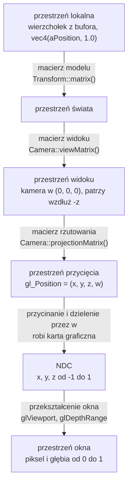

# Moduł scene: przekształcenia i macierz modelu

Kamień milowy: M1, nowi użytkownicy `Transform` w M2 + M3 (labirynt, linie pudełek kolizji), funkcja `normalMatrix` w M4, kryształy, brama i okręgi kul w M5. Temat wykładu: 3 (Przekształcenia przestrzeni).
Kod: [`src/scene/Transform.hpp`](../../../src/scene/Transform.hpp), [`src/scene/Transform.cpp`](../../../src/scene/Transform.cpp), shader [`assets/shaders/textured.vert`](../../../assets/shaders/textured.vert), użycie w [`src/game/MazeWorld.cpp`](../../../src/game/MazeWorld.cpp), [`src/game/GameplayRenderer.cpp`](../../../src/game/GameplayRenderer.cpp) i [`src/game/ColliderLines.cpp`](../../../src/game/ColliderLines.cpp), testy [`tests/TransformTests.cpp`](../../../tests/TransformTests.cpp).

Część modułu `scene`. Wstęp do modułu i jego miejsce w warstwach są w [`README.md`](README.md). Pozostałe części: [`camera.md`](camera.md) (macierz widoku, rzutowanie, struktura `Camera`, trzy macierze w klatce) i [`camera-controls.md`](camera-controls.md) (sterowanie kamerą, panel Camera). Ten dokument korzysta z biblioteki GLM ([`../../libraries/glm.md`](../../libraries/glm.md): typy `vec3` i `mat4`, układ kolumnowy, funkcje budujące macierze) i z pojęć potoku renderowania z [`../gfx/shaders.md`](../gfx/shaders.md) (opis tego, co musi zrobić shader wierzchołków: przestrzeń przycięcia, dzielenie perspektywiczne, NDC).

## 1. Po co to jest

Najprostszy program OpenGL wpisuje współrzędne wierzchołków od razu jako pozycje na ekranie: x i y od -1 do 1. Tak wyglądał pierwszy trójkąt tego projektu. Tak nie da się zbudować sceny. Model ściany chcę opisać raz, wokół jego własnego środka, a potem postawić go w dowolnym miejscu labiryntu, obrócić i przeskalować. Scenę chcę oglądać z dowolnego miejsca i pod dowolnym kątem. Obraz ma mieć perspektywę: to, co dalej, ma być mniejsze. Wszystkie trzy potrzeby załatwia ten sam mechanizm: **mnożenie pozycji wierzchołka przez macierze 4 x 4**.

Są trzy macierze, każda odpowiada na inne pytanie:

| Macierz | Pytanie | Kto ją liczy w projekcie |
|---|---|---|
| model (model matrix) | gdzie w świecie stoi ten obiekt, jak jest obrócony i jaki jest duży | `scene::Transform::matrix()` |
| widoku (view matrix) | skąd i w którą stronę patrzę | `scene::Camera::viewMatrix()` |
| rzutowania (projection matrix) | jak szeroko widzę i jak powstaje perspektywa | `scene::Camera::projectionMatrix()` |

`scene::Transform` to trzy wektory (pozycja, obrót, skala) i jedna funkcja, która składa z nich macierz modelu. `scene::Camera` to pozycja, dwa kąty i parametry rzutowania oraz funkcje, które liczą z nich kierunek patrzenia, macierz widoku i macierz rzutowania. Obie struktury to zwykłe dane i matematyka: nie wołają OpenGL, nie znają klawiatury, myszy ani czasu.

Ten dokument opisuje wspólny fundament (przestrzenie współrzędnych, współrzędne jednorodne, macierze przesunięcia, obrotu i skali, kolejność mnożenia) oraz pierwszą z trzech macierzy: macierz modelu i strukturę `scene::Transform`. Macierz widoku, macierz rzutowania i struktura `scene::Camera` są w [`camera.md`](camera.md). Skąd biorą się zmiany pozycji i kątów kamery, opisuje [`camera-controls.md`](camera-controls.md).

## 2. Teoria

### 2.1 Przestrzenie współrzędnych

Ten sam wierzchołek ma po drodze od pliku modelu do piksela sześć różnych zestawów współrzędnych. Każdy zestaw to inna **przestrzeń** (space), czyli inny układ odniesienia: inny początek, inne osie, inna jednostka.

| Przestrzeń | Początek układu i osie | Do czego służy |
|---|---|---|
| lokalna, inaczej modelu (local space, model space) | środek albo podstawa samego obiektu | w niej zapisane są wierzchołki modelu. Model ściany ma zawsze wierzchołki o x od -1 do 1, gdziekolwiek ściana stoi |
| świata (world space) | jeden wspólny punkt sceny | w niej stoją wszystkie obiekty, kamera i światła. Jednostka w projekcie: 1 metr |
| widoku, inaczej kamery albo oka (view space, eye space) | kamera. Oś x w prawo, y w górę, kamera patrzy wzdłuż -z | scena widziana z kamery. Upraszcza rzutowanie i oświetlenie |
| przycięcia (clip space) | współrzędne jednorodne `(x, y, z, w)` po rzutowaniu | to jest `gl_Position`. W niej karta odcina wszystko, co poza polem widzenia |
| znormalizowane współrzędne urządzenia (normalized device coordinates, NDC) | sześcian od -1 do 1 na każdej osi | wynik podzielenia przez `w`. Nie zależy od rozmiaru okna |
| okna (window space, screen space) | lewy dolny róg obszaru rysowania, jednostką jest piksel | pozycja piksela i wartość głębi od 0 do 1 |



Trzy pierwsze strzałki to moja praca: mnożę je w shaderze wierzchołków (sekcja 4). Dwie ostatnie wykonuje karta graficzna sama, po shaderze wierzchołków, i nie da się ich zaprogramować.

W jednej linii:

```text
gl_Position = projection * view * model * vec4(aPosition, 1.0)
```

Wyrażenie czyta się od prawej do lewej: najpierw model, potem view, na końcu projection. Dlaczego tak, wyjaśnia [`../../libraries/glm.md`](../../libraries/glm.md), sekcja 3.4, i sekcja 2.5 niżej.

### 2.2 Współrzędne jednorodne i dlaczego macierz jest 4 x 4

Macierz 3 x 3 pomnożona przez wektor `(x, y, z)` potrafi obrócić i przeskalować, ale **nie potrafi przesunąć**. Każda składowa wyniku to suma składowych wejścia pomnożonych przez liczby, więc punkt `(0, 0, 0)` zawsze zostaje w `(0, 0, 0)`. Przesunięcie wymaga dodania stałej, a mnożenie macierzy 3 x 3 nie ma gdzie jej trzymać.

Rozwiązanie to **współrzędne jednorodne** (homogeneous coordinates): do trzech liczb dopisuję czwartą, `w`, a macierz powiększam do 4 x 4. Dla zwykłego punktu `w = 1`. Czwarta kolumna macierzy jest mnożona właśnie przez tę jedynkę, więc jej zawartość zostaje dodana do wyniku: to jest przesunięcie.

| `w` | Co oznacza wektor | Jak działa na niego przesunięcie |
|---|---|---|
| 1 | punkt (pozycja) | przesuwa go |
| 0 | kierunek (normalna, kierunek światła) | nie zmienia go: kolumna przesunięcia jest mnożona przez 0 |
| inna wartość | punkt przed dzieleniem perspektywicznym | prawdziwy punkt to `(x/w, y/w, z/w)` |

Trzeci wiersz tabeli to drugi powód, dla którego macierz ma rozmiar 4 x 4. Perspektywa wymaga **dzielenia** przez odległość od kamery, a mnożenie macierzy dzielić nie umie. Macierz rzutowania wpisuje więc odległość do `w`, a samo dzielenie wykonuje potem karta graficzna ([`camera.md`](camera.md), sekcja 2.3).

Trzeci powód jest praktyczny: skoro przesunięcie, obrót, skala i rzutowanie są macierzami tego samego rozmiaru, można je **pomnożyć przez siebie raz** i dostać jedną macierz, która robi wszystko naraz. Shader mnoży wtedy każdy wierzchołek przez gotowy wynik.

### 2.3 Macierze przesunięcia, skali i obrotu

Zapis matematyczny: wiersze i kolumny tak, jak pisze się je na kartce. Wektor jest kolumną i stoi po prawej stronie macierzy.

**Przesunięcie** (translation) o `(tx, ty, tz)`:

```text
| 1  0  0  tx |   | x |   | x + tx |
| 0  1  0  ty | * | y | = | y + ty |
| 0  0  1  tz |   | z |   | z + tz |
| 0  0  0  1  |   | 1 |   |   1    |
```

**Skala** (scale) o współczynnikach `(sx, sy, sz)`:

```text
| sx 0  0  0 |   | x |   | sx * x |
| 0  sy 0  0 | * | y | = | sy * y |
| 0  0  sz 0 |   | z |   | sz * z |
| 0  0  0  1 |   | 1 |   |   1    |
```

Skala działa względem początku układu: punkt `(0, 0, 0)` zostaje na miejscu, a wszystko inne oddala się od niego albo przybliża. Gdy trzy współczynniki są równe, skala jest jednorodna (uniform). Gdy są różne, niejednorodna (non-uniform): obiekt zostaje rozciągnięty.

**Obrót** (rotation) o kąt `a` wokół każdej z osi, gdzie `c = cos(a)`, `s = sin(a)`:

```text
wokół osi X              wokół osi Y              wokół osi Z
| 1  0   0  0 |          |  c  0  s  0 |          | c  -s  0  0 |
| 0  c  -s  0 |          |  0  1  0  0 |          | s   c  0  0 |
| 0  s   c  0 |          | -s  0  c  0 |          | 0   0  1  0 |
| 0  0   0  1 |          |  0  0  0  1 |          | 0   0  0  1 |
```

Obrót też działa względem początku układu: oś obrotu przechodzi przez punkt `(0, 0, 0)`. Kierunek dodatniego kąta w układzie prawoskrętnym wyznacza **reguła prawej dłoni**: kciuk wskazuje dodatni kierunek osi, zgięte palce pokazują kierunek obrotu. Patrząc z końca osi w stronę początku układu, dodatni obrót jest przeciwny do ruchu wskazówek zegara. Przykład: obrót o 90 stopni wokół osi Y przenosi punkt `(1, 0, 0)` w `(0, 0, -1)`.

**Macierz jednostkowa** (identity matrix) ma jedynki na przekątnej i zera poza nią. To przekształcenie "nic nie rób" i punkt startowy przy składaniu macierzy.

W GLM te macierze budują `glm::translate`, `glm::scale` i `glm::rotate` ([`../../libraries/glm.md`](../../libraries/glm.md), sekcja 3.5). W pamięci GLM trzyma macierz kolumnami, więc przesunięcie leży w `m[3]` ([`../../libraries/glm.md`](../../libraries/glm.md), sekcja 3.3).

### 2.4 Kolejność ma znaczenie: przykład na liczbach

Mnożenie macierzy nie jest przemienne. Biorę jeden wierzchołek `(1, 0, 0)` i trzy przekształcenia:

- `S`: skala 2 na każdej osi,
- `R`: obrót o 90 stopni wokół osi Y,
- `T`: przesunięcie o `(5, 0, 0)`.

Te same trzy macierze w trzech kolejnościach:

| Iloczyn | Co dzieje się z wierzchołkiem, krok po kroku | Wynik |
|---|---|---|
| `T * R * S` | skala: `(2, 0, 0)`. Obrót: `(0, 0, -2)`. Przesunięcie: `(5, 0, -2)` | `(5, 0, -2)` |
| `R * T * S` | skala: `(2, 0, 0)`. Przesunięcie: `(7, 0, 0)`. Obrót: `(0, 0, -7)` | `(0, 0, -7)` |
| `S * R * T` | przesunięcie: `(6, 0, 0)`. Obrót: `(0, 0, -6)`. Skala: `(0, 0, -12)` | `(0, 0, -12)` |

Pierwszy wiersz to kolejność, której używa `Transform::matrix()`: **najpierw skala, potem obrót, na końcu przesunięcie**. Obiekt rośnie i obraca się wokół własnego środka, a dopiero potem trafia na swoje miejsce. Wierzchołek ląduje 2 jednostki od punktu `(5, 0, 0)`, czyli obiekt o podwojonym rozmiarze stoi tam, gdzie kazałem.

W drugim wierszu przesunięcie zadziałało przed obrotem. Obrót działa względem początku układu świata, więc obiekt, który już odjechał o 5 jednostek, zatoczył łuk wokół punktu `(0, 0, 0)` i wylądował zupełnie gdzie indziej. W trzecim wierszu skala na końcu pomnożyła także przesunięcie: obiekt stoi dwa razy dalej, niż miał. Ten sam rachunek na prawdziwej ścianie labiryntu i na prawdziwym pudełku kolizji jest w sekcji 5.4.

### 2.5 Zapis kolumnowy i czytanie od prawej

Dwie rzeczy z GLM, bez których kod z sekcji 5 czyta się źle. Obie są opisane w [`../../libraries/glm.md`](../../libraries/glm.md) (sekcje 3.3, 3.4 i 3.5), tutaj tylko wniosek:

1. Wektor jest kolumną mnożoną z lewej strony, więc w iloczynie `T * R * S * v` pierwsza działa macierz stojąca **najbliżej wektora**, czyli `S`.
2. `glm::translate(m, v)`, `glm::rotate(m, a, axis)` i `glm::scale(m, v)` zwracają `m * T`, `m * R` i `m * S`: dokładają nowe przekształcenie z **prawej** strony. Kod, który woła je w kolejności translate, rotate, scale, buduje więc `T * R * S`, a wierzchołek przechodzi przez nie w kolejności odwrotnej do linii kodu.

### 2.6 Kąty Eulera i kolejność obrotów

Obrót obiektu zapisuję trzema kątami, po jednym na każdą oś. To **kąty Eulera** (Euler angles). Są wygodne, bo człowiek rozumie "obróć o 90 stopni wokół osi Y" i może taką liczbę wpisać w pole panelu. Mają jedną wadę: trzy obroty wokół trzech osi też nie są przemienne, więc same trzy liczby nie wystarczą. Trzeba jeszcze ustalić **kolejność**, w jakiej są stosowane.

W `Transform` kolejność jest stała: macierz obrotu to `Ry * Rx * Rz`. Czytając od strony wierzchołka: najpierw obrót wokół osi Z, potem wokół X, na końcu wokół Y. W języku kamery i samolotu to przechylenie (roll), potem pochylenie (pitch), na końcu odchylenie (yaw). Obrót wokół pionowej osi Y działa jako ostatni, więc zawsze jest obrotem wokół pionu świata: kąt y oznacza "w którą stronę świata obiekt jest zwrócony" niezależnie od pozostałych dwóch kątów. To ta sama konwencja, której używa kamera (najpierw pitch, potem yaw, [`camera.md`](camera.md), sekcja 2.2), i najczęstszy przypadek w grze: ściany i kryształy obraca się głównie wokół pionu.

Przykład, że kolejność obrotów zmienia wynik. Kąty x = 90 i y = 90, wierzchołek `(0, 1, 0)`:

| Kolejność | Krok po kroku | Wynik |
|---|---|---|
| najpierw X, potem Y (tak jak w `Transform`) | obrót wokół X: `(0, 0, 1)`. Obrót wokół Y: `(1, 0, 0)` | `(1, 0, 0)` |
| najpierw Y, potem X | obrót wokół Y: `(0, 1, 0)` bez zmian, bo punkt leży na osi. Obrót wokół X: `(0, 0, 1)` | `(0, 0, 1)` |

**Blokada przegubu** (gimbal lock) to wada kątów Eulera, która wynika z kolejności. Gdy środkowy obrót (u mnie wokół X) wynosi dokładnie 90 stopni, oś pierwszego obrotu zostaje położona na osi ostatniego. Obrót wokół Z i obrót wokół Y robią wtedy to samo i z trzech stopni swobody zostają dwa: żadną zmianą kątów nie da się wykonać jednego z trzech rodzajów obrotu. Dla obiektów sceny, które kręcą się głównie wokół pionu, to nie przeszkadza. Kamera omija problem ograniczeniem kąta pitch ([`camera.md`](camera.md), sekcja 2.2). Ogólnym rozwiązaniem są kwaterniony (quaternions), których w tym projekcie nie używam.

## 3. Jak to działa w OpenGL

Ta część modułu nie woła OpenGL. `Transform` nie używa żadnej funkcji `gl*` i nie dołącza GLAD: macierz modelu powstaje na procesorze, a do jej policzenia wystarcza GLM. Wywołania, którymi gotowa macierz trafia do shadera (`glGetUniformLocation`, `glUniformMatrix4fv`), i ich kolejność w klatce opisuje [`camera.md`](camera.md), sekcja 3.

## 4. Shadery

Macierze spotykają się z wierzchołkiem w shaderze wierzchołków. Przykładem jest [`assets/shaders/textured.vert`](../../../assets/shaders/textured.vert): program `textured` rysuje labirynt, bramę i kryształy w trybie bez oświetlenia i w widokach do szukania błędów. Cały plik opisuje [`../gfx/textures.md`](../gfx/textures.md), sekcja 4. Tutaj dwa fragmenty, które dotyczą przekształceń. (W M1 tym przykładem był osobny shader obróconej kostki. Kostka i jej shader zostały usunięte w M5, a długi komentarz o łańcuchu przestrzeni przeszedł do `textured.vert`.)

Deklaracje uniformów:

```glsl
// Uniforms: set from C++ (gfx::Shader::setMat4). uModel changes with every object,
// uView and uProjection are the same for the whole frame.
uniform mat4 uModel;      // local space to world space: where the object stands
uniform mat4 uView;       // world space to view space: where the camera is and looks
uniform mat4 uProjection; // view space to clip space: perspective
```

Początek funkcji `main`:

```glsl
void main() {
    // gl_Position is the built-in output every vertex shader must write: the position in
    // clip space. The expression is read from right to left, the matrix nearest to the
    // vector is applied first:
    //   vec4(aPosition, 1.0)  the vertex in local space, w = 1 because it is a point
    //   uModel * ...          the vertex in world space
    //   uView * ...           the vertex in view space, as seen from the camera
    //   uProjection * ...     the vertex in clip space
    // After this shader the graphics card divides x, y and z by w (the distance from the
    // camera), which is what makes distant things small.
    gl_Position = uProjection * uView * uModel * vec4(aPosition, 1.0);
```

Dalej funkcja przekazuje współrzędną tekstury, normalną i styczną: to już nie są przekształcenia pozycji.

| Element | Znaczenie |
|---|---|
| `uniform mat4 uModel;` | zmienna `uniform`: wartość ustawiana z C++ i taka sama dla wszystkich wierzchołków jednego wywołania rysującego. Atrybut (`in`) ma inną wartość dla każdego wierzchołka, uniform jedną dla całego obiektu |
| `vec4(aPosition, 1.0)` | pozycja z bufora ma trzy składowe i jest w przestrzeni lokalnej modelu (ściany, słupka, bramy albo kryształu; teren z M6 ma wierzchołki od razu w przestrzeni świata i macierz jednostkową). Dopisuję `w = 1`, bo to punkt (sekcja 2.2) |
| `uModel * ...` | po tym mnożeniu wierzchołek jest w przestrzeni świata |
| `uView * ...` | po tym w przestrzeni widoku: tak, jak widzi go kamera |
| `uProjection * ...` | po tym w przestrzeni przycięcia. To trzy pierwsze strzałki diagramu z sekcji 2.1, czytane od prawej |
| `gl_Position` | po tym przypisaniu `w` nie jest już jedynką: to odległość od kamery. Dzielenie wykona karta |

Mnożenie macierzy jest łączne, więc `uProjection * uView * uModel * v` daje ten sam wynik niezależnie od tego, w jakiej kolejności shader policzy iloczyny. Nie jest przemienne: zamiana miejscami dwóch macierzy w zapisie daje inny wynik (ćwiczenie 4).

Macierz widoku i rzutowania jest wspólna dla całej klatki, macierz modelu jest inna dla każdego obiektu. Stąd trzy osobne uniformy: `uView` i `uProjection` wystarczy ustawić raz na klatkę, a `uModel` przed każdym obiektem. Prawdziwy renderer często wysyła zamiast tego jeden gotowy iloczyn policzony w C++ (jedno mnożenie na wierzchołek zamiast trzech). Tutaj macierze są osobno celowo, żeby każdą dało się podmienić i obejrzeć skutek. Shader fragmentów nie bierze udziału w przekształceniach.

Nazwy `uModel`, `uView` i `uProjection` muszą być identyczne z napisami w C++ (stałe `MODEL_UNIFORM`, `VIEW_UNIFORM`, `PROJECTION_UNIFORM` w [`src/game/ShaderUniforms.hpp`](../../../src/game/ShaderUniforms.hpp), [`camera.md`](camera.md), sekcja 5.7). Te same trzy uniformy pod tymi samymi nazwami deklarują cztery shadery wierzchołków sceny (`textured`, `color`, `lit`, `gouraud`), a od czwartej części M7 także piąty, `shadow_depth.vert`, w którym `uView` i `uProjection` są widokiem i rzutowaniem księżyca, nie kamery ([`lights.md`](lights.md), sekcja 5.7). [`color.vert`](../../../assets/shaders/color.vert) (linie pudełek i kul kolizji) mnoży przez nie pozycję tą samą linią co `textured.vert`, a jego komentarz mówi wprost: "The same chain as in textured.vert" ([`collision.md`](collision.md), sekcja 4). [`lit.vert`](../../../assets/shaders/lit.vert) i [`gouraud.vert`](../../../assets/shaders/gouraud.vert) robią to samo w dwóch krokach, bo pozycja w świecie jest im potrzebna do oświetlenia: najpierw `vec4 worldPosition = uModel * vec4(aPosition, 1.0);`, potem `gl_Position = uProjection * uView * worldPosition;`. Literówka w nazwie nie daje żadnego błędu, tylko pusty ekran ([`../gfx/uniforms.md`](../gfx/uniforms.md), sekcja 7, pułapka 1).

## 5. Kod w projekcie

### 5.1 Pliki

| Plik | Co zawiera |
|---|---|
| [`src/scene/Transform.hpp`](../../../src/scene/Transform.hpp) | struktura `Transform`: pola `position`, `rotationDegrees`, `scale` i deklaracja `matrix()`. Od M4 także deklaracja wolnej funkcji `normalMatrix` (sekcja 5.6) |
| [`src/scene/Transform.cpp`](../../../src/scene/Transform.cpp) | stałe `AXIS_X`, `AXIS_Y`, `AXIS_Z`, funkcja `Transform::matrix()` i funkcja `normalMatrix` |
| [`tests/TransformTests.cpp`](../../../tests/TransformTests.cpp) | cztery przypadki testowe funkcji `normalMatrix` (sekcja 5.6) |
| [`src/game/MazeWorld.hpp`](../../../src/game/MazeWorld.hpp), [`.cpp`](../../../src/game/MazeWorld.cpp) | użytkownik struktury: macierze modelu słupków (`placedAt`, do M5 także płytek podłogi) oraz ścian (`wallModelMatrix`, z obrotem o 90 stopni wokół osi Y dla ściany wzdłuż osi Z). Sekcja 5.4, [`../game/maze-rendering.md`](../game/maze-rendering.md), sekcja 5 |
| [`src/game/GameplayRenderer.cpp`](../../../src/game/GameplayRenderer.cpp) | drugi użytkownik (M5): macierz modelu każdego kryształu, liczona co klatkę z pozycji, która się kołysze, i z kąta, który rośnie z czasem, oraz macierz bramy z `wallModelMatrix` (sekcja 5.4, [`../game/gameplay.md`](../game/gameplay.md)) |
| [`src/game/Crystals.hpp`](../../../src/game/Crystals.hpp), [`.cpp`](../../../src/game/Crystals.cpp) | skąd kryształ bierze pozycję i kąt: `crystalBobPosition`, `crystalSpinDegrees` i ich stałe (sekcja 5.4) |
| [`src/game/ColliderLines.cpp`](../../../src/game/ColliderLines.cpp) | trzeci użytkownik: skala i przesunięcie sześcianu jednostkowego na rozmiar i miejsce pudełka kolizji, a od M5 skala, obrót i przesunięcie okręgu jednostkowego na trzy okręgi kuli (sekcja 5.4, [`collision.md`](collision.md), sekcja 5) |
| [`src/game/ModelDraw.cpp`](../../../src/game/ModelDraw.cpp) | `game::drawModel`: wysyła macierz modelu jako `uModel` i liczy z niej `normalMatrix` dla każdego rysowanego obiektu (sekcja 5.6) |
| [`assets/shaders/textured.vert`](../../../assets/shaders/textured.vert) | uniformy `uModel`, `uView`, `uProjection` i mnożenie pozycji przez macierze (sekcja 4) |

Pliki struktury `Camera` wymienia [`camera.md`](camera.md), sekcja 5.1, a pliki sterowania kamerą i panelu [`camera-controls.md`](camera-controls.md), sekcja 5.

Cztery pliki z `src/scene/` są na liście źródeł biblioteki `engine` w [`CMakeLists.txt`](../../../CMakeLists.txt). Nagłówki dołączają tylko `<glm/glm.hpp>` (typy `vec3` i `mat4`). Funkcje budujące macierze (`<glm/gtc/matrix_transform.hpp>`) dołączają dopiero pliki `.cpp`, więc kto dołącza `Camera.hpp`, nie płaci czasem kompilacji za resztę GLM.

Obie struktury to `struct` z publicznymi polami, a nie klasy z polami prywatnymi i akcesorami. W reszcie projektu klasy pilnują **niezmienników** (invariants): `gfx::Shader` nie może pozwolić nikomu zmienić identyfikatora programu, więc trzyma go w polu prywatnym. Tutaj nie ma czego pilnować: każda pozycja, każda skala i każdy kąt yaw to poprawna wartość, a funkcje liczą wynik od nowa z aktualnych pól przy każdym wywołaniu. Publiczne pola są też tym, czego potrzebuje panel Camera, który edytuje je wprost ([`camera-controls.md`](camera-controls.md), sekcja 6), i tym, z czego korzysta kod gry, gdy ustawia pozycję i obrót kryształu dwoma przypisaniami (sekcja 5.4). Jedyny warunek, zakres kąta pitch, pilnuje funkcja `rotate`, a nie typ ([`camera.md`](camera.md), sekcja 5.4 i pułapka 3).

### 5.2 `Transform`: struktura

```cpp
/// Where an object is, how it is turned and how big it is. Plain data plus one function.
///
/// The model matrix moves a vertex from the object's local space to world space. A vertex
/// is scaled first, then rotated, then translated: the object grows and turns around its
/// own origin and only then goes to its place in the world.
struct Transform {
    /// Position of the object's origin in world space.
    glm::vec3 position{0.0F};

    /// Euler angles in degrees: rotation around the x, y and z axis. Degrees, because
    /// that is what a person types into a panel. The rotations are applied to a vertex
    /// in the order z, then x, then y.
    glm::vec3 rotationDegrees{0.0F};

    /// Scale factor along each axis. 1 keeps the size.
    glm::vec3 scale{1.0F};

    /// The model matrix: translate * rotateY * rotateX * rotateZ * scale. The matrix
    /// nearest to the vertex is applied first, so the expression reads right to left.
    glm::mat4 matrix() const;
};
```

| Linia | Znaczenie |
|---|---|
| `glm::vec3 position{0.0F};` | pozycja początku układu lokalnego obiektu w świecie. Konstruktor `vec3` z jedną liczbą wypełnia nią wszystkie trzy składowe, więc to `(0, 0, 0)`. Inicjalizacja jest jawna, bo `glm::vec3 v;` nie zeruje składowych ([`../../libraries/glm.md`](../../libraries/glm.md), pułapka 2) |
| `glm::vec3 rotationDegrees{0.0F};` | trzy kąty Eulera: składowa `x` to obrót wokół osi X, `y` wokół Y, `z` wokół Z. Jednostka jest w nazwie pola, żeby nie dało się jej pomylić. Stopnie, bo tę liczbę wpisuje człowiek |
| `glm::vec3 scale{1.0F};` | `(1, 1, 1)`: bez zmiany rozmiaru. Wartość domyślna nie może być zerem: skala 0 spłaszcza obiekt do punktu |
| `glm::mat4 matrix() const;` | składa macierz modelu z trzech pól. `const`, bo niczego w strukturze nie zmienia. Macierz nie jest nigdzie zapamiętana: każde wywołanie liczy ją od nowa |

Struktura z wartościami domyślnymi daje macierz jednostkową: obiekt stoi w początku układu świata, nieobrócony, w oryginalnym rozmiarze.

PRD wymienia przy temacie 3 także hierarchię transformów (obiekt-dziecko przekształcany względem rodzica). `Transform` jej nie ma: nie ma pola rodzica ani listy dzieci. Dojdzie wtedy, gdy pojawi się obiekt, który jej potrzebuje.

### 5.3 `Transform::matrix()`

```cpp
// The three coordinate axes, used as rotation axes.
constexpr glm::vec3 AXIS_X{1.0F, 0.0F, 0.0F};
constexpr glm::vec3 AXIS_Y{0.0F, 1.0F, 0.0F};
constexpr glm::vec3 AXIS_Z{0.0F, 0.0F, 1.0F};
```

```cpp
glm::mat4 Transform::matrix() const {
    // Start from the identity matrix ("change nothing"). Each glm function below
    // multiplies its matrix on the right side, so the last call is the first one applied
    // to a vertex: the lines read top to bottom, the vertex is transformed bottom to top.
    glm::mat4 model(1.0F);
    model = glm::translate(model, position);
    // GLM takes angles in radians.
    model = glm::rotate(model, glm::radians(rotationDegrees.y), AXIS_Y);
    model = glm::rotate(model, glm::radians(rotationDegrees.x), AXIS_X);
    model = glm::rotate(model, glm::radians(rotationDegrees.z), AXIS_Z);
    model = glm::scale(model, scale);
    return model;
}
```

| Linia | Co robi | Macierz po tej linii |
|---|---|---|
| `constexpr glm::vec3 AXIS_X{1.0F, 0.0F, 0.0F};` (i dwie następne) | nazwane osie obrotu zamiast trzech liczb wpisanych w wywołanie. Stoją w anonimowej przestrzeni nazw, więc są widoczne tylko w tym pliku | |
| `glm::mat4 model(1.0F);` | macierz jednostkowa. Samo `glm::mat4 model;` zostawiłoby w niej przypadkowe wartości | `I` |
| `model = glm::translate(model, position);` | mnoży z prawej przez macierz przesunięcia | `T` |
| `model = glm::rotate(model, glm::radians(rotationDegrees.y), AXIS_Y);` | mnoży z prawej przez obrót wokół Y. `glm::radians` zamienia stopnie na radiany w miejscu użycia: GLM przyjmuje tylko radiany | `T * Ry` |
| `model = glm::rotate(model, glm::radians(rotationDegrees.x), AXIS_X);` | obrót wokół X | `T * Ry * Rx` |
| `model = glm::rotate(model, glm::radians(rotationDegrees.z), AXIS_Z);` | obrót wokół Z | `T * Ry * Rx * Rz` |
| `model = glm::scale(model, scale);` | mnoży z prawej przez macierz skali | `T * Ry * Rx * Rz * S` |
| `return model;` | zwraca wynik przez wartość: 16 liczb `float` | |

Wynik to `T * Ry * Rx * Rz * S`. Wierzchołek stoi po prawej stronie tego iloczynu, więc przechodzi przez macierze od końca: **skala, obrót wokół Z, obrót wokół X, obrót wokół Y, przesunięcie**. Linie kodu czyta się z góry na dół, a wierzchołek jest przekształcany od dołu do góry. Każde wywołanie przypisuje wynik z powrotem do `model`, bo funkcje GLM nie zmieniają argumentu, tylko zwracają nową macierz.

Kolejność obrotów jest ustalona raz, tutaj, i opisana w komentarzu Doxygen przy polu `rotationDegrees`. Uzasadnienie jest w sekcji 2.6.

### 5.4 Użytkownicy: labirynt, brama, kryształy, linie pudełek i okręgi kul

`Transform` ma dziś pięć zastosowań i każde korzysta z innej części struktury:

| Użytkownik | `position` | `rotationDegrees` | `scale` | Kiedy liczy macierz |
|---|---|---|---|---|
| labirynt (`placedAt` i `wallModelMatrix` w `MazeWorld.cpp`) | środek podstawy ściany albo róg siatki, od M6 z `y` opuszczonym na najniższy grunt pod obrysem | 0, a dla ściany wzdłuż osi Z 90 stopni wokół Y | 1 | raz na teren: przy budowie labiryntu i po zmianie skali wysokości (`placeOnTerrain`) |
| brama (`GameplayRenderer::draw`, przez `wallModelMatrix`) | środek krawędzi komórki wyjścia, obniżony o to, ile brama już opadła | jak ściana: 0 albo 90 stopni wokół Y | 1 | co klatkę, dopóki brama wystaje nad grunt |
| kryształ (`GameplayRenderer::draw`) | miejsce kryształu plus kołysanie w pionie | wokół Y, kąt rośnie z czasem | 1 | co klatkę, dla każdego niezebranego kryształu |
| linie pudełek (`ColliderLines::draw`) | narożnik `min` pudełka | 0 | rozmiar pudełka, inny na każdej osi | co klatkę, dla każdego pudełka, gdy rysowanie jest włączone |
| okręgi kul (`ColliderLines::drawSpheres`, M5) | środek kuli | trzy ustawienia: bez obrotu, 90 stopni wokół X, 90 stopni wokół Y | promień kuli, równy na każdej osi | co klatkę, trzy macierze na kulę, gdy rysowanie jest włączone |

W M1 jedynym użytkownikiem była obrócona kostka, pole `NightMazeApp` ze stałymi kątami (kostka się nie animowała). Została usunięta w M5: `NightMazeApp` nie ma już własnego `Transform`, a tę samą lekcję (obrót wokół własnego początku, a dopiero potem przesunięcie) pokazują dziś kryształy, które dokładają do niej zmianę w czasie.

**Labirynt: sama pozycja.** Słupek tylko gdzieś stoi (do M5 tak samo stała każda płytka podłogi: M6 zastąpił je terenem, który macierzy modelu nie potrzebuje, bo jego wierzchołki są już w przestrzeni świata). `MazeWorld.cpp` ma na to funkcję w anonimowej przestrzeni nazw:

```cpp
// Model matrix of an object that only stands somewhere: no rotation, no scale.
glm::mat4 placedAt(const glm::vec3& position) {
    scene::Transform transform;
    transform.position = position;
    return transform.matrix();
}
```

Kąty zostają zerowe, a skala jednostkowa, więc macierz to samo `T`: jedynki na przekątnej i pozycja w czwartej kolumnie.

**Labirynt: obrót ściany o 90 stopni.** Model ściany leży wzdłuż osi X. Ściana na zachodniej albo wschodniej krawędzi komórki ma biec wzdłuż osi Z, więc `wallModelMatrix` obraca ją o ćwierć obrotu wokół osi Y:

```cpp
// The wall model lies along the X axis. A quarter turn around Y lays it along Z.
constexpr glm::vec3 WALL_ALONG_Z_ROTATION{0.0F, QUARTER_TURN_DEGREES, 0.0F};
```

```cpp
glm::mat4 wallModelMatrix(const WallSegment& segment) {
    scene::Transform transform;
    transform.position = segment.position;
    if (segment.axis == WallAxis::AlongZ) {
        transform.rotationDegrees = WALL_ALONG_Z_ROTATION;
    }
    return transform.matrix();
}
```

`QUARTER_TURN_DEGREES` to `90.0F`. Funkcja jest od M5 publiczna (deklaracja w `MazeWorld.hpp`), bo oprócz `buildMazeWorld` woła ją rysowanie bramy. Macierz to `T * Ry(90)`: najpierw obrót modelu wokół jego własnego początku (środka podstawy ściany), potem przesunięcie na środek krawędzi komórki.

Przykład na liczbach, policzony skryptem w Pythonie (nie ma go w repozytorium), na ścianie, która istnieje w każdym labiryncie wyższym niż jedna komórka: zachodnia ściana komórki (0, 1), czyli kawałek zachodniej krawędzi labiryntu. `wallSegmentOn(0, 1, Direction::West)` daje jej pozycję `(0, 0, 3)` i oś `AlongZ`. Śledzę koniec modelu, punkt lokalny `(1, 0, 0)`:

| Iloczyn | Krok po kroku | Wynik |
|---|---|---|
| `T * Ry(90)` (tak liczy `Transform::matrix()`) | obrót: `(0, 0, -1)`. Przesunięcie o `(0, 0, 3)`: `(0, 0, 2)` | `(0, 0, 2)` |
| `Ry(90) * T` (kolejność odwrotna) | przesunięcie: `(1, 0, 3)`. Obrót: `(3, 0, -1)` | `(3, 0, -1)` |

W pierwszym wierszu koniec ściany leży na krawędzi labiryntu (x = 0), metr na północ od jej środka: ściana biegnie wzdłuż osi Z od z = 2 do z = 4, czyli dokładnie wzdłuż zachodniego boku komórki (0, 1). W drugim wierszu obrót zadziałał na punkt już przesunięty, więc cała ściana zatoczyła łuk wokół początku układu świata. Drugi koniec modelu, `(-1, 0, 0)`, trafia tym iloczynem w `(3, 0, 1)`, czyli ściana biegłaby wzdłuż Z od z = -1 do z = 1 przy x = 3: w połowie poza labiryntem (który zajmuje z od 0 w górę), a w połowie przez środek komórki (1, 0). Test `a wall along X keeps the model as it is, a wall along Z turns it a quarter` w `tests/MazeWorldTests.cpp` sprawdza poprawny wariant dla każdej ściany labiryntu 4 x 4. Wszystkie macierze labiryntu są liczone raz, w `buildMazeWorld`, a w klatce są już tylko wysyłane ([`../game/maze-rendering.md`](../game/maze-rendering.md), sekcja 5).

**Brama: ta sama macierz, pozycja zmieniana co klatkę.** Model bramy jest zbudowany jak model ściany (wzdłuż osi X, początek w środku podstawy), więc brama dostaje macierz tą samą funkcją. `GameplayRenderer::draw`:

```cpp
        WallSegment loweredGate = world.gate;
        loweredGate.position.y -= gateSinkDepth(round);
        const glm::mat4 gateMatrix = wallModelMatrix(loweredGate);
```

Otwieranie bramy to nic innego jak zmiana składowej y przesunięcia: `gateSinkDepth` rośnie od 0 do `GATE_SINK_DEPTH` (3,3 m) i brama opada pod grunt. Obrót i skala się nie zmieniają. Reguły bramy opisuje [`../game/gameplay.md`](../game/gameplay.md).

**Kryształ: macierz modelu liczona od nowa w każdej klatce.** Kostka z M1 pokazywała obrót, a potem przesunięcie, przy stałych kątach. Kryształ pokazuje to samo i dokłada zmianę w czasie. `GameplayRenderer::draw`, w pętli po kryształach rundy:

```cpp
        scene::Transform transform;
        transform.position =
            crystalBobPosition(crystal.restPosition, index, round.animationSeconds);
        transform.rotationDegrees = {0.0F, crystalSpinDegrees(index, round.animationSeconds), 0.0F};
        const glm::mat4 crystalMatrix = transform.matrix();
```

| Linia | Znaczenie |
|---|---|
| `scene::Transform transform;` | nowa struktura w każdej klatce i dla każdego kryształu: skala 1, kąty 0, pozycja 0. Nic nie jest zapamiętywane między klatkami |
| `transform.position = crystalBobPosition(...)` | miejsce spoczynku kryształu (środek komórki na wysokości `CRYSTAL_FLOAT_HEIGHT` = 0,9 m) plus kołysanie: `CRYSTAL_BOB_AMPLITUDE * sin(...)`, czyli najwyżej 0,08 m w górę i w dół, pełny cykl w `CRYSTAL_BOB_SECONDS` = 3 s. To pozycja początku układu modelu: w `crystal_a` jest nim środek podstawy, w `crystal_b` podstawa głównego odłamka (jego pudełko otaczające nie jest wyśrodkowane) |
| `transform.rotationDegrees = {0.0F, crystalSpinDegrees(...), 0.0F}` | obrót tylko wokół pionowej osi Y. Kąt rośnie o `CRYSTAL_SPIN_DEGREES_PER_SECOND` = 40 stopni na sekundę, czyli pełny obrót trwa `360 / 40 = 9` s. Funkcja zawija go do zakresu od 0 do 360, tak jak `Camera::rotate` zawija yaw |
| `transform.matrix()` | `T * Ry(kąt)`: skala jest jednostkowa, a kąty x i z zerowe |

Wartości dla kryształu o indeksie 0 (policzone tym samym skryptem z tych samych wzorów):

| Czas rundy | Kołysanie (dodatek do y) | Kąt wokół Y |
|---|---|---|
| 0 s | 0 | 0 |
| 0,75 s | +0,08 m (najwyżej) | 30 |
| 1,5 s | 0 | 60 |
| 2,25 s | -0,08 m (najniżej) | 90 |
| 4,5 s | 0 | 180 |
| 9 s | 0 | 0 (pełny obrót, kąt zawinięty) |

Każdy następny kryształ jest przesunięty w fazie o `PHASE_STEP` = 0,382 cyklu względem poprzedniego (dla obrotu to `0,382 * 360 = 137,52` stopnia, dla kołysania `0,382 * 3 = 1,146` s), więc kryształy nie ruszają się równo.

Trzy rzeczy, które ten przykład pokazuje:

1. **Kolejność.** Macierz to `T * Ry`: kryształ najpierw obraca się wokół pionowej osi przechodzącej przez początek układu swojego modelu, a dopiero potem jedzie na swoje miejsce. Dlatego kręci się w miejscu. W `crystal_a` oś przechodzi przez środek bryły. W `crystal_b` przechodzi przez główny odłamek, więc boczne odłamki obiegają ją po małym okręgu. W kolejności `Ry * T` krążyłby wokół początku układu świata, czyli wokół północno-zachodniego rogu labiryntu, po okręgu o promieniu równym swojej odległości od tego rogu.
2. **Oś.** Obrót wokół Y działa w `Transform::matrix()` jako ostatni z trzech, więc jest obrotem wokół pionu świata (sekcja 2.6).
3. **Macierz co klatkę, czas co krok.** Macierz powstaje w każdej klatce, ale `round.animationSeconds` rośnie w `updateRound`, czyli w stałych krokach symulacji, i nie jest mieszany z `alpha`. Między dwiema klatkami bez kroku macierz kryształu wychodzi identyczna. Jeden krok (1/120 s) to jedna trzecia stopnia obrotu.

Skąd kryształy się biorą, kiedy znikają i jak świecą, opisuje [`../game/gameplay.md`](../game/gameplay.md).

**Linie pudełek: skala i przesunięcie.** `ColliderLines` ma siatkę krawędzi sześcianu od `(0, 0, 0)` do `(1, 1, 1)`. Każde pudełko kolizji to ten sześcian rozciągnięty i przestawiony:

```cpp
        scene::Transform transform;
        transform.position = box.min - glm::vec3{LINE_MARGIN};
        transform.scale = box.max - box.min + glm::vec3{2.0F * LINE_MARGIN};
```

To jedyne miejsce w projekcie, które używa skali **niejednorodnej** (innej na każdej osi). Macierz to `T * S`: narożnik `(0, 0, 0)` sześcianu zostaje w zerze po skalowaniu i trafia przesunięciem na narożnik `min`, a narożnik `(1, 1, 1)` po skalowaniu ma współrzędne równe rozmiarowi pudełka i po przesunięciu trafia na `max`. Działa to tylko dlatego, że sześcian ma narożnik, a nie środek, w początku swojego układu ([`collision.md`](collision.md), sekcja 5). Skala niejednorodna psuje normalne (pułapka 5), ale linie normalnych nie używają.

Na liczbach, dla pudełka tej samej ściany co wyżej. `wallBox` daje `min = (-0,15, 0, 2)` i `max = (0,15, 3, 4)`, a `LINE_MARGIN` to 0,01, więc `position = (-0,16, -0,01, 1,99)` i `scale = (0,32, 3,02, 2,02)`:

| Iloczyn | Narożnik `(0, 0, 0)` | Narożnik `(1, 1, 1)` |
|---|---|---|
| `T * S` (tak liczy `Transform::matrix()`) | `(-0,16, -0,01, 1,99)` | `(0,16, 3,01, 4,01)`: pudełko powiększone o 1 cm z każdej strony |
| `S * T` (kolejność odwrotna) | `(-0,051, -0,030, 4,020)` | `(0,269, 2,990, 6,040)`: skala pomnożyła także przesunięcie i linie stoją dwa metry dalej, niż pudełko |

**Okręgi kul: jedna siatka, trzy obroty.** Kulę (zasięg gracza, kulę podniesienia kryształu) rysują trzy okręgi. Siatka jest jedna: okrąg o promieniu 1 wokół początku układu, leżący w płaszczyźnie XY. `ColliderLines.cpp`:

```cpp
// The unit circle lies in the XY plane. Turned by a quarter around the X axis it lies
// flat in the XZ plane, turned by a quarter around the Y axis it stands in the YZ plane.
constexpr float QUARTER_TURN_DEGREES = 90.0F;
constexpr std::array<glm::vec3, 3> CIRCLE_ROTATIONS = {
    glm::vec3{0.0F, 0.0F, 0.0F},
    glm::vec3{QUARTER_TURN_DEGREES, 0.0F, 0.0F},
    glm::vec3{0.0F, QUARTER_TURN_DEGREES, 0.0F},
};
```

```cpp
        scene::Transform transform;
        transform.position = sphere.center;
        transform.scale = glm::vec3{sphere.radius};

        for (const glm::vec3& rotation : CIRCLE_ROTATIONS) {
            transform.rotationDegrees = rotation;
            shader.setMat4(MODEL_UNIFORM, transform.matrix());
            m_unitCircle.draw();
        }
```

To jedyny użytkownik, który korzysta z wszystkich trzech pól naraz, więc macierz to pełne `T * R * S`: okrąg rośnie do promienia kuli, obraca się wokół własnego środka i jedzie na środek kuli. Co obroty robią z dwoma punktami okręgu, `(1, 0, 0)` i `(0, 1, 0)` (macierze z sekcji 2.3, wynik sprawdzony skryptem):

| Obrót | `(1, 0, 0)` trafia w | `(0, 1, 0)` trafia w | Płaszczyzna okręgu |
|---|---|---|---|
| brak | `(1, 0, 0)` | `(0, 1, 0)` | XY: okrąg stoi |
| 90 stopni wokół X | `(1, 0, 0)`, bo leży na osi obrotu | `(0, 0, 1)` | XZ: okrąg leży poziomo |
| 90 stopni wokół Y | `(0, 0, -1)` | `(0, 1, 0)`, bo leży na osi obrotu | YZ: okrąg stoi bokiem do pierwszego |

Skala jest tu równa na trzech osiach. Gdyby była nierówna, okrąg rozciągnięty przed obrotem stałby się elipsą, której dłuższa oś obracałaby się razem z nim.

### 5.5 Jak to zostało sprawdzone

Matematykę `Transform` sprawdził ten sam tymczasowy program konsolowy, który sprawdzał kamerę. Opis programu i pozostałe wyniki są w [`camera.md`](camera.md), sekcja 5.6. Wyniki dotyczące macierzy modelu:

| Sprawdzenie | Wynik |
|---|---|
| `Transform` domyślny | macierz jednostkowa |
| `Transform` z przykładu z sekcji 2.4 razy `(1, 0, 0)` | `(5, 0, -2)`. Iloczyny `R * T * S` i `S * R * T` policzone ręcznie z GLM: `(0, 0, -7)` i `(0, 0, -12)` |
| `Transform` z kątami x = 90, y = 90 razy `(0, 1, 0)` | `(1, 0, 0)`: obrót wokół X działa przed obrotem wokół Y |

### 5.6 `normalMatrix`: macierz dla normalnych (M4)

Od M4 labirynt jest oświetlony, a światło liczy się z normalnych w przestrzeni świata. Dlaczego normalnej nie wolno mnożyć przez macierz modelu i skąd bierze się odwrotna transponowana, wyprowadza [`lights.md`](lights.md), sekcja 2.7. Tu jest kod.

Deklaracja w `Transform.hpp`, poza strukturą (wolna funkcja w przestrzeni nazw `scene`):

```cpp
/// The result is not of length 1 when the model matrix scales: the shader normalizes.
/// modelMatrix must be invertible (no scale factor of 0).
glm::mat3 normalMatrix(const glm::mat4& modelMatrix);
```

(Pokazane są dwie ostatnie linie komentarza. Cały komentarz w pliku streszcza to samo uzasadnienie co [`lights.md`](lights.md).)

Definicja w `Transform.cpp`:

```cpp
glm::mat3 normalMatrix(const glm::mat4& modelMatrix) {
    // glm::mat3(mat4) keeps the upper left 3 x 3 part: rotation and scale, without the
    // translation in the fourth column.
    return glm::transpose(glm::inverse(glm::mat3(modelMatrix)));
}
```

| Element | Znaczenie |
|---|---|
| wolna funkcja, a nie metoda `Transform` | przyjmuje gotową macierz modelu. Labirynt trzyma macierze policzone raz (`MazeWorld::wallMatrices`), a nie obiekty `Transform`, więc metoda nie miałaby na czym pracować |
| `glm::mat3(modelMatrix)` | konstruktor GLM, który z macierzy 4 x 4 bierze lewą górną część 3 x 3: obrót i skalę. Czwarta kolumna (przesunięcie) odpada, bo normalna jest kierunkiem |
| `glm::inverse(...)` | macierz odwrotna. Macierz musi być odwracalna: skala 0 na którejś osi daje w wyniku `inf` albo `NaN` (pułapka 6) |
| `glm::transpose(...)` | zamiana wierszy z kolumnami |
| zwracany typ `glm::mat3` | 9 liczb. W shaderze `uniform mat3 uNormalMatrix`, wysyłany przez `Shader::setMat3` ([`../gfx/uniforms.md`](../gfx/uniforms.md)) |

**Kto ją woła.** `game::drawModel` ([`src/game/ModelDraw.cpp`](../../../src/game/ModelDraw.cpp)), wspólna funkcja rysująca model dla `MazeRenderer` (ściany, słupki) i `GameplayRenderer` (brama, kryształy). Od M6 tak samo robi `game::drawMesh` dla terenu: jego macierz modelu jest jednostkowa, więc macierz normalnych też. Dla każdego obiektu, tuż po wysłaniu `uModel`:

```cpp
            shader.setMat4(MODEL_UNIFORM, modelMatrix);
            // The lit programs turn the normals with a matrix of their own, derived
            // from the model matrix. It is computed here, on the CPU, once per object:
            // in the shader the inverse would be computed again for every vertex.
            shader.setMat3(NORMAL_MATRIX_UNIFORM, scene::normalMatrix(modelMatrix));
```

(W M4 ta pętla należała do `MazeRenderer`. W M5 stała się wolną funkcją, żeby brama i kryształy rysowały się tym samym kodem.)

Macierze modelu labiryntu są liczone raz przy budowie, ale macierz normalnych jest liczona **w każdej klatce dla każdego obiektu**. W labiryncie startowym były to w M5 342 odwrotności 3 x 3 na klatkę dla samego labiryntu (100 płytek, 121 ścian i 121 słupków, a każdy z tych modeli ma jedną część), do tego jedna dla bramy, dopóki jest widoczna, i jedna dla każdego niezebranego kryształu (na starcie 13). Od M6 płytek nie ma: zostają 242 (121 ścian i 121 słupków) plus jedna dla terenu, rysowanego przez `game::drawMesh`. Od czwartej części M7 (cienie księżyca, 2026-10-05) te same obiekty są w każdej klatce rysowane drugi raz, do mapy cieni, tym samym kodem (`drawModel` i `drawMesh` z programem `shadow_depth`), więc macierz normalnych jest dla każdego liczona dwa razy, chociaż program głębi nie ma uniformu `uNormalMatrix` i wysłaną wartość pomija. Na starcie rundy, z włączonymi cieniami, to `2 * (242 + 1 + 1 + 13) = 514` odwrotności na klatkę (policzone z kodu, nie mierzone). Pętla po częściach modelu jest zewnętrzna, więc model z kilkoma materiałami liczyłby ją raz na część i obiekt. To koszt pomijalny przy tej skali. Dla labiryntu dałoby się ją zapamiętać obok macierzy modelu w `MazeWorld`: kod tego nie robi, a czasu tych obliczeń nie mierzyłem.

Uczciwie o tym, co ta funkcja dziś zmienia w obrazie: **nic**. Obiekty labiryntu, brama i kryształy są tylko przesunięte i obrócone, a dla macierzy obrotu odwrotna transponowana jest tą samą macierzą. Funkcja jest pełna, żeby pierwszy obiekt ze skalą nierówną dostał poprawne światło (ćwiczenie 5), a jej poprawność przy takiej skali sprawdza test, a nie obraz.

**Testy.** `tests/TransformTests.cpp`, cztery przypadki ([`../../libraries/doctest.md`](../../libraries/doctest.md)):

| Przypadek testowy | Co sprawdza | Wynik |
|---|---|---|
| `the normal matrix of an object that is only moved changes no normal` | `Transform` z samym przesunięciem `(5, -2, 9)` | normalne `(0, 1, 0)` i `(1, 0, 0)` bez zmian: przesunięcie nie działa na kierunek |
| `the normal matrix of a turned object turns the normal with it` | ściana wzdłuż osi Z: obrót o 90 stopni wokół Y | normalna `(0, 0, 1)` staje się `(1, 0, 0)`. To samo daje `glm::mat3(model)`: bez skali obie macierze są równe |
| `with unequal scale only the normal matrix keeps a normal perpendicular` | skos ze styczną `(1, 1, 0)` i normalną `(-1, 1, 0) / sqrt(2)`, skala `(4, 1, 1)` | styczna po przekształceniu to `(4, 1, 0)`. `mat3(model)` razy normalna ma kierunek `(-4, 1, 0)`, który **nie** jest do niej prostopadły. Macierz normalnych daje kierunek `(-0,25, 1, 0)`, prostopadły: `4 * (-0,25) + 1 * 1 = 0` |
| `with equal scale the normal matrix changes only the length of a normal` | skala 2 na wszystkich osiach | `(0, 1, 0)` staje się `(0, 0,5, 0)`: kierunek ten sam, długość 1/2. Dlatego shader normalizuje |

Trzeci przypadek jest tym, co pokazuję na obronie przy pytaniu "po co odwrotna transponowana": liczby mieszczą się na kartce. Wyniki na Windowsie (2026-10-05): cztery przypadki przechodzą w Debug i Release, w ramach 256 przypadków i 101232 asercji całego programu testowego z drugiej części M6 (po M5 było ich 215 i 85098, w M4 163 i 62220, po pierwszej części M7 zgłoszone jest 269 i 102103, po drugiej 276 i 102139, po trzeciej 294 i 102412, po czwartej 310 i 103751). Na macOS kod M5 i M6 nie był budowany ani uruchamiany.

## 6. Panel ImGui

`Transform` nie ma własnego panelu: żadna kontrolka nie edytuje pól `position`, `rotationDegrees` ani `scale`. Skutki macierzy modelu da się jednak oglądać na żywo w trzech miejscach. Kryształy kręcą się i kołyszą bez niczyjego udziału (sekcja 5.4). Pole wyboru `Draw collision shapes` w panelu Collision rysuje sześcian jednostkowy przeskalowany i przesunięty na każde pudełko oraz okrąg jednostkowy w trzech obrotach na każdej kuli ([`collision.md`](collision.md), sekcja 6). Suwak `Pickup radius` w panelu Gameplay zmienia promień kul podniesienia, czyli pole `scale` ich macierzy, a okręgi rosną w następnej klatce ([`../game/gameplay.md`](../game/gameplay.md), sekcja 6). Kolejność mnożenia macierzy w shaderze da się zmieniać przyciskiem `Reload shaders` (ćwiczenie 4). Panel Camera, który edytuje pola kamery, jest opisany w [`camera-controls.md`](camera-controls.md), sekcja 6.

## 7. Pułapki

1. **Stopnie zamiast radianów.** `std::sin`, `std::cos`, `glm::rotate` i `glm::perspective` przyjmują radiany. `glm::perspective(60.0F, ...)` to kąt 60 radianów, a kompilator tego nie wykryje, bo obie wartości to `float`. W projekcie pola mają jednostkę w nazwie (`yawDegrees`, `fovDegrees`, `rotationDegrees`), a `glm::radians` stoi dokładnie w miejscu użycia.
2. **Kolejność mnożenia.** `model * view * projection` zamiast `projection * view * model` kompiluje się i daje pusty ekran. To samo dotyczy kolejności translate, rotate, scale: zamiana przesunięcia z obrotem sprawia, że obiekt krąży wokół początku układu świata zamiast obracać się w miejscu (sekcja 2.4).
3. **`glm::mat4 m;` zamiast `glm::mat4 m(1.0F);`.** Konstruktor domyślny GLM 1.0.3 niczego nie ustawia: zmienna lokalna ma przypadkowe wartości, a `glm::mat4 m{};` same zera. Macierz zerowa pomnożona przez cokolwiek daje zera, więc obiekt znika. Macierz jednostkową trzeba zapisać jawnie ([`../../libraries/glm.md`](../../libraries/glm.md), pułapka 2).
4. **Kolejność kątów Eulera.** Te same trzy liczby w `rotationDegrees` oznaczają inny obrót w programie, który stosuje inną kolejność osi (na przykład w Blenderze, gdzie domyślna kolejność to XYZ). Przy przenoszeniu kątów z innego narzędzia trzeba sprawdzić jego konwencję.
5. **Skala niejednorodna a normalne.** Pozycje przekształca macierz modelu, ale wektorów normalnych nie wolno przekształcać tą samą macierzą, gdy skala jest różna na różnych osiach: przestają być prostopadłe do powierzchni. Potrzebna jest osobna macierz normalnych (odwrócona i transponowana część 3 x 3 macierzy modelu). Od M4 liczy ją `scene::normalMatrix` (sekcja 5.6), a programy oświetlenia `lit` i `gouraud` dostają ją w uniformie `uNormalMatrix`. Program `textured` (tryb bez oświetlenia i podglądy) nadal przekształca normalne przez `mat3(uModel)`, co jest poprawne, dopóki wszystkie rysowane nim obiekty (labirynt, brama, kryształy) mają skalę 1 ([`../gfx/textures.md`](../gfx/textures.md), sekcja 4). Jedyny obiekt ze skalą niejednorodną to linie pudełek kolizji, które normalnych nie używają. Okręgi kul mają skalę równą i też nie używają normalnych.
6. **Macierz normalnych z macierzy nieodwracalnej.** Skala 0 na którejś osi (obiekt spłaszczony do płaszczyzny) nie ma odwrotności: wynik `glm::inverse` zawiera wtedy `inf` albo `NaN`, bez żadnego błędu, a oświetlony obiekt robi się czarny albo miga. Funkcja tego nie sprawdza: wymaganie jest w komentarzu przy deklaracji.
7. **Macierz normalnych nie normalizuje.** Przy skali wynik ma długość inną niż 1. Kto użyje jej wyniku w iloczynie skalarnym bez `normalize`, dostanie światło przeskalowane razem z obiektem.

## 8. Ćwiczenia

Ćwiczenia od 1 do 3 robi się na kartce (kalkulator wystarczy). Ćwiczenia od 4 do 8 to zmiany w działającym programie: zmiana w pliku `.cpp` wymaga zbudowania (`make run`), zmiana w `color.vert` tylko zapisania pliku i przycisku `Reload shaders` (na Windowsie najpierw `cmake --build --preset debug --target copy_assets`). Po każdym ćwiczeniu wycofaj zmianę (`git checkout src assets/shaders`). Ćwiczeń od 4 do 8 nie wykonywałem na obecnym kodzie: pytania wynikają z czytania kodu.

W M1 ćwiczenia od 4 do 7 robiło się na obróconej kostce. Kostki nie ma od M5, więc dziś robi się je na liniach kolizji (ćwiczenie 4) i na kryształach (ćwiczenia od 5 do 7). Najbliższy kryształ pokazuje plan w panelu Maze (wypełniona kropka).

1. **Kolejność przekształceń.** Wierzchołek `(0, 0, 1)`, skala 3, obrót o 90 stopni wokół osi Y, przesunięcie o `(0, 2, 0)`. Policz wynik dla `T * R * S` i dla `R * S * T`. Odpowiedź: `(3, 2, 0)` i `(3, 6, 0)`.
2. **Macierz z pól.** Zapisz na kartce macierz 4 x 4, którą zwróci `Transform::matrix()` dla `position = (1, 2, 3)`, `scale = (2, 2, 2)` i zerowych kątów. Wskaż, w których elementach `m[kolumna][wiersz]` leży przesunięcie. Odpowiedź: przekątna `2, 2, 2, 1`, przesunięcie w `m[3][0]`, `m[3][1]`, `m[3][2]`.
3. **Blokada przegubu.** Dla `Transform` z kątem x = 90 pokaż na przykładzie wierzchołka `(1, 0, 0)`, że kąty `(90, 30, 0)` i `(90, 0, -30)` dają ten sam wynik. Wyjaśnij, co to znaczy dla liczby stopni swobody.
4. **Kolejność mnożenia w shaderze.** Włącz `Draw collision shapes` w panelu Collision: linie rysuje program `color`, który ma najkrótszy shader wierzchołków. W `color.vert` zamień wyrażenie na `uModel * uView * uProjection * vec4(aPosition, 1.0)` i naciśnij `Reload shaders`. Co dzieje się z liniami i czy panel Shaders zgłasza błąd? Potem spróbuj `uView * uModel * vec4(aPosition, 1.0)` (bez rzutowania). Wtedy `w = 1`, więc warunek przycinania `-w <= x, y, z <= w` zostawia tylko to, co w przestrzeni widoku mieści się w sześcianie o boku 2 m wokół oka: które linie mają szansę być widoczne i dlaczego nie mają perspektywy? Na koniec `uProjection * uModel * vec4(aPosition, 1.0)` (bez macierzy widoku): gdzie teraz "stoi" kamera linii, w którą stronę patrzy i dlaczego prawie całego labiryntu, który zajmuje x i z od 0 w górę, nie może zobaczyć? Labirynt z teksturami rysuje inny program, więc przez cały czas wygląda poprawnie.
5. **Skala niejednorodna.** W `GameplayRenderer::draw` dopisz po linii z `rotationDegrees` linię `transform.scale = {2.0F, 1.0F, 1.0F};`. Kryształ zrobił się szerszy: wzdłuż osi X świata czy wzdłuż własnej osi, która obraca się razem z nim? Wyjaśnij to kolejnością `T * R * S`. Czy oświetlenie kryształu w trybach `Phong` i `Gouraud` nadal jest poprawne i która funkcja o to dba (sekcja 5.6)? A w trybie `Unlit` z widokiem normalnych (pułapka 5)?
6. **Obrót.** W tej samej funkcji zamień kąty na `{90.0F, crystalSpinDegrees(index, round.animationSeconds), 0.0F}`. Przewidź przed uruchomieniem, jak leży kryształ i wokół czego się kręci, korzystając z kolejności Z, X, Y z sekcji 2.6. Potem spróbuj `{crystalSpinDegrees(index, round.animationSeconds), 0.0F, 0.0F}`: wokół której osi obraca się teraz i który punkt modelu jako jedyny zostaje w miejscu?
7. **Drugi kryształ.** W pętli po kryształach, po wywołaniu `drawModel`, dopisz `transform.position += glm::vec3{0.0F, 0.6F, 0.0F};`, policz drugą macierz (`const glm::mat4 second = transform.matrix();`) i zawołaj `drawModel` jeszcze raz, z `std::span<const glm::mat4>(&second, 1)`. Nad każdym kryształem wisi drugi. Których macierzy nie trzeba wysyłać drugi raz i dlaczego? Czy trzeba drugiego bufora wierzchołków? Czy drugi kryształ ma własne światło punktowe i własną kulę podniesienia (podpowiedź: skąd się biorą `crystalLightPositions` i kule w `updateRound`)?
8. **Ściana bez obrotu.** W `MazeWorld.cpp` zakomentuj w `wallModelMatrix` trzy linie `if (segment.axis == WallAxis::AlongZ) { ... }`, zbuduj i uruchom. Jak wyglądają ściany, które powinny biec wzdłuż osi Z? Co stało się z bramą, jeśli stoi na wschodnim albo zachodnim boku komórki wyjścia? Włącz `Draw collision shapes` w panelu Collision: czy żółte pudełka nadal stoją tam, gdzie powinny, i dlaczego (podpowiedź: pudełka kolizji nie powstają z macierzy modelu)? Uruchom testy: który przypadek z `tests/MazeWorldTests.cpp` to wykrywa?

## 9. Pytania kontrolne

1. **Wymień przestrzenie, przez które przechodzi wierzchołek, i powiedz, co przenosi go między nimi.**
   Lokalna, świata, widoku, przycięcia, NDC, okna. Macierz modelu (lokalna do świata), macierz widoku (świat do widoku), macierz rzutowania (widok do przycięcia), dzielenie przez `w` wykonywane przez kartę (przycięcie do NDC), przekształcenie okna ustawione przez `glViewport` (NDC do pikseli).

2. **Dlaczego macierze mają rozmiar 4 x 4, skoro scena jest trójwymiarowa?**
   Macierz 3 x 3 nie umie przesunąć: punkt zerowy zawsze zostaje w zerze. Czwarta współrzędna `w = 1` sprawia, że czwarta kolumna jest dodawana do wyniku jako przesunięcie. Ta sama czwarta współrzędna przenosi odległość od kamery do dzielenia perspektywicznego. Dzięki wspólnemu rozmiarowi wszystkie przekształcenia można pomnożyć w jedną macierz.

3. **Czym różni się wektor z `w = 1` od wektora z `w = 0`?**
   Pierwszy to punkt i przesunięcie na niego działa. Drugi to kierunek i przesunięcie go nie zmienia, bo kolumna przesunięcia jest mnożona przez 0.

4. **W jakiej kolejności `Transform::matrix()` przekształca wierzchołek i dlaczego kod wygląda odwrotnie?**
   Skala, obrót wokół Z, X, Y, przesunięcie. Funkcje GLM mnożą nowe przekształcenie z prawej strony, więc powstaje `T * Ry * Rx * Rz * S`, a pierwsza działa macierz stojąca najbliżej wektora, czyli ostatnio dołożona.

5. **Co by się stało, gdyby przesunięcie działało przed obrotem?**
   Obrót działa względem początku układu, więc obiekt odsunięty od niego zatoczyłby łuk wokół punktu `(0, 0, 0)` świata, zamiast obrócić się w miejscu. W przykładzie z sekcji 2.4 wynik to `(0, 0, -7)` zamiast `(5, 0, -2)`.

6. **Dlaczego kąty są trzymane w stopniach i gdzie następuje zamiana?**
   Stopnie rozumie człowiek edytujący wartość w panelu. GLM i biblioteka standardowa przyjmują radiany, więc `glm::radians` stoi dokładnie w miejscu użycia: w `Transform::matrix()`, `Camera::forward()` i `Camera::projectionMatrix()`. Jednostka jest w nazwie pola.

7. **Dlaczego `Transform` i `Camera` są strukturami z publicznymi polami?**
   Nie mają niezmienników do pilnowania: każda wartość pól jest poprawna, a macierze są liczone od nowa przy każdym wywołaniu. Publiczne pola można edytować wprost z panelu. Wyjątkiem jest zakres pitch, którego pilnuje `rotate()`.

8. **Które funkcje `gl*` wołają `Transform` i `Camera`?**
   Żadnej. To matematyka na procesorze, zależna tylko od GLM. Macierz trafia do OpenGL dopiero przez `glUniformMatrix4fv` w kodzie, który jej używa.

9. **Jak powstaje macierz modelu kryształu i co się w niej zmienia z czasem?**
   W `GameplayRenderer::draw`, w każdej klatce od nowa: `Transform` z pozycją z `crystalBobPosition` (miejsce kryształu plus kołysanie o najwyżej 0,08 m) i z kątem wokół osi Y z `crystalSpinDegrees` (40 stopni na sekundę). Macierz to `T * Ry`: wierzchołek jest najpierw obracany wokół własnej pionowej osi kryształu, potem przesuwany na miejsce, więc kryształ kręci się w miejscu. Zmieniają się składowa y przesunięcia i kąt. Czas pochodzi z `round.animationSeconds`, który rośnie w stałych krokach symulacji. W M1 tę rolę pełniła obrócona kostka, usunięta w M5.

10. **Co liczy `scene::normalMatrix` i dlaczego nie jest metodą `Transform`?**
    Odwrotność lewej górnej części 3 x 3 macierzy modelu, transponowaną: macierz, która przenosi normalne do przestrzeni świata tak, żeby zostały prostopadłe do powierzchni także przy skali nierównej. Jest wolną funkcją, bo przyjmuje gotową macierz modelu, a labirynt przechowuje macierze, nie obiekty `Transform`.

11. **Czym macierz normalnych różni się dziś od `mat3(model)` dla ściany labiryntu?**
    Niczym: ściana jest tylko przesunięta i obrócona, a odwrotna transponowana macierzy obrotu jest tą samą macierzą. Różnica pojawia się przy skali nierównej, co sprawdza test ze skalą `(4, 1, 1)`.

12. **Dlaczego wynik macierzy normalnych trzeba normalizować?**
    Przy skali `s` równej na osiach wynik ma długość `1 / s`, a przy nierównej dowolną. Wzory oświetlenia zakładają wektory o długości 1.

## 10. Źródła

- LearnOpenGL, rozdział "Transformations": <https://learnopengl.com/Getting-started/Transformations> (wektory, macierze przesunięcia, skali i obrotu, kolejność mnożenia, GLM).
- LearnOpenGL, rozdział "Coordinate Systems": <https://learnopengl.com/Getting-started/Coordinate-Systems> (przestrzenie, macierze model, view i projection, rzutowanie perspektywiczne, bufor głębi).
- LearnOpenGL, rozdział "Basic Lighting": <https://learnopengl.com/Lighting/Basic-Lighting> (macierz normalnych).
- songho.ca, "OpenGL Transformation": <https://www.songho.ca/opengl/gl_transform.html> (cały łańcuch przestrzeni z rysunkami).
- Kod GLM dokładnie w naszej wersji, lokalnie po pierwszej konfiguracji: `build/debug/_deps/glm-src/glm/ext/matrix_transform.inl` (`translate`, `rotate`, `scale`).
- Dokumenty w tym repozytorium: [`../../libraries/glm.md`](../../libraries/glm.md) (biblioteka), [`../gfx/shaders.md`](../gfx/shaders.md) (potok i shader wierzchołków), [`../gfx/uniforms.md`](../gfx/uniforms.md) (jak macierz trafia do uniformu), [`camera.md`](camera.md) (macierz widoku i rzutowania), [`camera-controls.md`](camera-controls.md) (sterowanie kamerą i panel Camera), [`lights.md`](lights.md) (dlaczego normalne potrzebują własnej macierzy).
- PRD ([`../../PRD.pdf`](../../PRD.pdf)): sekcja 3 (temat 3: przekształcenia przestrzeni, hierarchia transformów).
- Janusz Ganczarski, "OpenGL. Podstawy programowania grafiki 3D" (rozdziały o przekształceniach geometrycznych i rzutowaniu).
