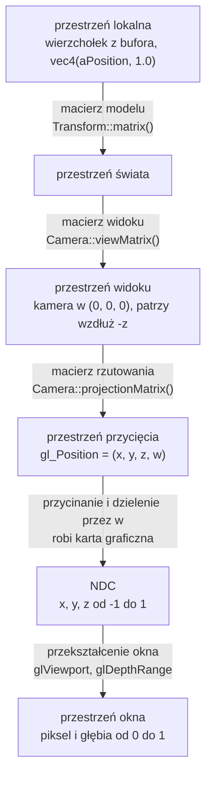

# Moduł scene: przekształcenia i macierz modelu

Kamień milowy: M1. Temat wykładu: 3 (Przekształcenia przestrzeni).
Kod: [`src/scene/Transform.hpp`](../../../src/scene/Transform.hpp), [`src/scene/Transform.cpp`](../../../src/scene/Transform.cpp), shader [`assets/shaders/basic.vert`](../../../assets/shaders/basic.vert), użycie w [`src/game/NightMazeApp.cpp`](../../../src/game/NightMazeApp.cpp).

Część modułu `scene`. Wstęp do modułu i jego miejsce w warstwach są w [`README.md`](README.md). Pozostałe części: [`camera.md`](camera.md) (macierz widoku, rzutowanie, struktura `Camera`, trzy macierze w klatce) i [`camera-controls.md`](camera-controls.md) (sterowanie kamerą, panel Camera). Ten dokument korzysta z biblioteki GLM ([`../../libraries/glm.md`](../../libraries/glm.md): typy `vec3` i `mat4`, układ kolumnowy, funkcje budujące macierze) i z pojęć potoku renderowania z [`../gfx/shaders.md`](../gfx/shaders.md) (opis tego, co musi zrobić shader wierzchołków: przestrzeń przycięcia, dzielenie perspektywiczne, NDC).

## 1. Po co to jest

Najprostszy program OpenGL wpisuje współrzędne wierzchołków od razu jako pozycje na ekranie: x i y od -1 do 1. Tak wyglądał pierwszy trójkąt tego projektu. Tak nie da się zbudować sceny. Model ściany chcę opisać raz, wokół jego własnego środka, a potem postawić go w dowolnym miejscu labiryntu, obrócić i przeskalować. Scenę chcę oglądać z dowolnego miejsca i pod dowolnym kątem. Obraz ma mieć perspektywę: to, co dalej, ma być mniejsze. Wszystkie trzy potrzeby załatwia ten sam mechanizm: **mnożenie pozycji wierzchołka przez macierze 4 x 4**.

Są trzy macierze, każda odpowiada na inne pytanie:

| Macierz | Pytanie | Kto ją liczy w projekcie |
|---|---|---|
| model (model matrix) | gdzie w świecie stoi ten obiekt, jak jest obrócony i jaki jest duży | `scene::Transform::matrix()` |
| widoku (view matrix) | skąd i w którą stronę patrzę | `scene::Camera::viewMatrix()` |
| rzutowania (projection matrix) | jak szeroko widzę i jak powstaje perspektywa | `scene::Camera::projectionMatrix()` |

`scene::Transform` to trzy wektory (pozycja, obrót, skala) i jedna funkcja, która składa z nich macierz modelu. `scene::Camera` to pozycja, dwa kąty i parametry rzutowania oraz funkcje, które liczą z nich kierunek patrzenia, macierz widoku i macierz rzutowania. Obie struktury to zwykłe dane i matematyka: nie wołają OpenGL, nie znają klawiatury, myszy ani czasu.

Ten dokument opisuje wspólny fundament (przestrzenie współrzędnych, współrzędne jednorodne, macierze przesunięcia, obrotu i skali, kolejność mnożenia) oraz pierwszą z trzech macierzy: macierz modelu i strukturę `scene::Transform`. Macierz widoku, macierz rzutowania i struktura `scene::Camera` są w [`camera.md`](camera.md). Skąd biorą się zmiany pozycji i kątów kamery, opisuje [`camera-controls.md`](camera-controls.md).

## 2. Teoria

### 2.1 Przestrzenie współrzędnych

Ten sam wierzchołek ma po drodze od pliku modelu do piksela sześć różnych zestawów współrzędnych. Każdy zestaw to inna **przestrzeń** (space), czyli inny układ odniesienia: inny początek, inne osie, inna jednostka.

| Przestrzeń | Początek układu i osie | Do czego służy |
|---|---|---|
| lokalna, inaczej modelu (local space, model space) | środek albo podstawa samego obiektu | w niej zapisane są wierzchołki modelu. Kostka ma zawsze wierzchołki od -0,5 do 0,5, gdziekolwiek stoi |
| świata (world space) | jeden wspólny punkt sceny | w niej stoją wszystkie obiekty, kamera i światła. Jednostka w projekcie: 1 metr |
| widoku, inaczej kamery albo oka (view space, eye space) | kamera. Oś x w prawo, y w górę, kamera patrzy wzdłuż -z | scena widziana z kamery. Upraszcza rzutowanie i oświetlenie |
| przycięcia (clip space) | współrzędne jednorodne `(x, y, z, w)` po rzutowaniu | to jest `gl_Position`. W niej karta odcina wszystko, co poza polem widzenia |
| znormalizowane współrzędne urządzenia (normalized device coordinates, NDC) | sześcian od -1 do 1 na każdej osi | wynik podzielenia przez `w`. Nie zależy od rozmiaru okna |
| okna (window space, screen space) | lewy dolny róg obszaru rysowania, jednostką jest piksel | pozycja piksela i wartość głębi od 0 do 1 |



Trzy pierwsze strzałki to moja praca: mnożę je w shaderze wierzchołków (sekcja 4). Dwie ostatnie wykonuje karta graficzna sama, po shaderze wierzchołków, i nie da się ich zaprogramować.

W jednej linii:

```text
gl_Position = projection * view * model * vec4(aPosition, 1.0)
```

Wyrażenie czyta się od prawej do lewej: najpierw model, potem view, na końcu projection. Dlaczego tak, wyjaśnia [`../../libraries/glm.md`](../../libraries/glm.md), sekcja 3.4, i sekcja 2.5 niżej.

### 2.2 Współrzędne jednorodne i dlaczego macierz jest 4 x 4

Macierz 3 x 3 pomnożona przez wektor `(x, y, z)` potrafi obrócić i przeskalować, ale **nie potrafi przesunąć**. Każda składowa wyniku to suma składowych wejścia pomnożonych przez liczby, więc punkt `(0, 0, 0)` zawsze zostaje w `(0, 0, 0)`. Przesunięcie wymaga dodania stałej, a mnożenie macierzy 3 x 3 nie ma gdzie jej trzymać.

Rozwiązanie to **współrzędne jednorodne** (homogeneous coordinates): do trzech liczb dopisuję czwartą, `w`, a macierz powiększam do 4 x 4. Dla zwykłego punktu `w = 1`. Czwarta kolumna macierzy jest mnożona właśnie przez tę jedynkę, więc jej zawartość zostaje dodana do wyniku: to jest przesunięcie.

| `w` | Co oznacza wektor | Jak działa na niego przesunięcie |
|---|---|---|
| 1 | punkt (pozycja) | przesuwa go |
| 0 | kierunek (normalna, kierunek światła) | nie zmienia go: kolumna przesunięcia jest mnożona przez 0 |
| inna wartość | punkt przed dzieleniem perspektywicznym | prawdziwy punkt to `(x/w, y/w, z/w)` |

Trzeci wiersz tabeli to drugi powód, dla którego macierz ma rozmiar 4 x 4. Perspektywa wymaga **dzielenia** przez odległość od kamery, a mnożenie macierzy dzielić nie umie. Macierz rzutowania wpisuje więc odległość do `w`, a samo dzielenie wykonuje potem karta graficzna ([`camera.md`](camera.md), sekcja 2.3).

Trzeci powód jest praktyczny: skoro przesunięcie, obrót, skala i rzutowanie są macierzami tego samego rozmiaru, można je **pomnożyć przez siebie raz** i dostać jedną macierz, która robi wszystko naraz. Shader mnoży wtedy każdy wierzchołek przez gotowy wynik.

### 2.3 Macierze przesunięcia, skali i obrotu

Zapis matematyczny: wiersze i kolumny tak, jak pisze się je na kartce. Wektor jest kolumną i stoi po prawej stronie macierzy.

**Przesunięcie** (translation) o `(tx, ty, tz)`:

```text
| 1  0  0  tx |   | x |   | x + tx |
| 0  1  0  ty | * | y | = | y + ty |
| 0  0  1  tz |   | z |   | z + tz |
| 0  0  0  1  |   | 1 |   |   1    |
```

**Skala** (scale) o współczynnikach `(sx, sy, sz)`:

```text
| sx 0  0  0 |   | x |   | sx * x |
| 0  sy 0  0 | * | y | = | sy * y |
| 0  0  sz 0 |   | z |   | sz * z |
| 0  0  0  1 |   | 1 |   |   1    |
```

Skala działa względem początku układu: punkt `(0, 0, 0)` zostaje na miejscu, a wszystko inne oddala się od niego albo przybliża. Gdy trzy współczynniki są równe, skala jest jednorodna (uniform). Gdy są różne, niejednorodna (non-uniform): obiekt zostaje rozciągnięty.

**Obrót** (rotation) o kąt `a` wokół każdej z osi, gdzie `c = cos(a)`, `s = sin(a)`:

```text
wokół osi X              wokół osi Y              wokół osi Z
| 1  0   0  0 |          |  c  0  s  0 |          | c  -s  0  0 |
| 0  c  -s  0 |          |  0  1  0  0 |          | s   c  0  0 |
| 0  s   c  0 |          | -s  0  c  0 |          | 0   0  1  0 |
| 0  0   0  1 |          |  0  0  0  1 |          | 0   0  0  1 |
```

Obrót też działa względem początku układu: oś obrotu przechodzi przez punkt `(0, 0, 0)`. Kierunek dodatniego kąta w układzie prawoskrętnym wyznacza **reguła prawej dłoni**: kciuk wskazuje dodatni kierunek osi, zgięte palce pokazują kierunek obrotu. Patrząc z końca osi w stronę początku układu, dodatni obrót jest przeciwny do ruchu wskazówek zegara. Przykład: obrót o 90 stopni wokół osi Y przenosi punkt `(1, 0, 0)` w `(0, 0, -1)`.

**Macierz jednostkowa** (identity matrix) ma jedynki na przekątnej i zera poza nią. To przekształcenie "nic nie rób" i punkt startowy przy składaniu macierzy.

W GLM te macierze budują `glm::translate`, `glm::scale` i `glm::rotate` ([`../../libraries/glm.md`](../../libraries/glm.md), sekcja 3.5). W pamięci GLM trzyma macierz kolumnami, więc przesunięcie leży w `m[3]` ([`../../libraries/glm.md`](../../libraries/glm.md), sekcja 3.3).

### 2.4 Kolejność ma znaczenie: przykład na liczbach

Mnożenie macierzy nie jest przemienne. Biorę jeden wierzchołek `(1, 0, 0)` i trzy przekształcenia:

- `S`: skala 2 na każdej osi,
- `R`: obrót o 90 stopni wokół osi Y,
- `T`: przesunięcie o `(5, 0, 0)`.

Te same trzy macierze w trzech kolejnościach:

| Iloczyn | Co dzieje się z wierzchołkiem, krok po kroku | Wynik |
|---|---|---|
| `T * R * S` | skala: `(2, 0, 0)`. Obrót: `(0, 0, -2)`. Przesunięcie: `(5, 0, -2)` | `(5, 0, -2)` |
| `R * T * S` | skala: `(2, 0, 0)`. Przesunięcie: `(7, 0, 0)`. Obrót: `(0, 0, -7)` | `(0, 0, -7)` |
| `S * R * T` | przesunięcie: `(6, 0, 0)`. Obrót: `(0, 0, -6)`. Skala: `(0, 0, -12)` | `(0, 0, -12)` |

Pierwszy wiersz to kolejność, której używa `Transform::matrix()`: **najpierw skala, potem obrót, na końcu przesunięcie**. Obiekt rośnie i obraca się wokół własnego środka, a dopiero potem trafia na swoje miejsce. Wierzchołek ląduje 2 jednostki od punktu `(5, 0, 0)`, czyli obiekt o podwojonym rozmiarze stoi tam, gdzie kazałem.

W drugim wierszu przesunięcie zadziałało przed obrotem. Obrót działa względem początku układu świata, więc obiekt, który już odjechał o 5 jednostek, zatoczył łuk wokół punktu `(0, 0, 0)` i wylądował zupełnie gdzie indziej. W trzecim wierszu skala na końcu pomnożyła także przesunięcie: obiekt stoi dwa razy dalej, niż miał.

### 2.5 Zapis kolumnowy i czytanie od prawej

Dwie rzeczy z GLM, bez których kod z sekcji 5 czyta się źle. Obie są opisane w [`../../libraries/glm.md`](../../libraries/glm.md) (sekcje 3.3, 3.4 i 3.5), tutaj tylko wniosek:

1. Wektor jest kolumną mnożoną z lewej strony, więc w iloczynie `T * R * S * v` pierwsza działa macierz stojąca **najbliżej wektora**, czyli `S`.
2. `glm::translate(m, v)`, `glm::rotate(m, a, axis)` i `glm::scale(m, v)` zwracają `m * T`, `m * R` i `m * S`: dokładają nowe przekształcenie z **prawej** strony. Kod, który woła je w kolejności translate, rotate, scale, buduje więc `T * R * S`, a wierzchołek przechodzi przez nie w kolejności odwrotnej do linii kodu.

### 2.6 Kąty Eulera i kolejność obrotów

Obrót obiektu zapisuję trzema kątami, po jednym na każdą oś. To **kąty Eulera** (Euler angles). Są wygodne, bo człowiek rozumie "obróć o 90 stopni wokół osi Y" i może taką liczbę wpisać w pole panelu. Mają jedną wadę: trzy obroty wokół trzech osi też nie są przemienne, więc same trzy liczby nie wystarczą. Trzeba jeszcze ustalić **kolejność**, w jakiej są stosowane.

W `Transform` kolejność jest stała: macierz obrotu to `Ry * Rx * Rz`. Czytając od strony wierzchołka: najpierw obrót wokół osi Z, potem wokół X, na końcu wokół Y. W języku kamery i samolotu to przechylenie (roll), potem pochylenie (pitch), na końcu odchylenie (yaw). Obrót wokół pionowej osi Y działa jako ostatni, więc zawsze jest obrotem wokół pionu świata: kąt y oznacza "w którą stronę świata obiekt jest zwrócony" niezależnie od pozostałych dwóch kątów. To ta sama konwencja, której używa kamera (najpierw pitch, potem yaw, [`camera.md`](camera.md), sekcja 2.2), i najczęstszy przypadek w grze: ściany i kryształy obraca się głównie wokół pionu.

Przykład, że kolejność obrotów zmienia wynik. Kąty x = 90 i y = 90, wierzchołek `(0, 1, 0)`:

| Kolejność | Krok po kroku | Wynik |
|---|---|---|
| najpierw X, potem Y (tak jak w `Transform`) | obrót wokół X: `(0, 0, 1)`. Obrót wokół Y: `(1, 0, 0)` | `(1, 0, 0)` |
| najpierw Y, potem X | obrót wokół Y: `(0, 1, 0)` bez zmian, bo punkt leży na osi. Obrót wokół X: `(0, 0, 1)` | `(0, 0, 1)` |

**Blokada przegubu** (gimbal lock) to wada kątów Eulera, która wynika z kolejności. Gdy środkowy obrót (u mnie wokół X) wynosi dokładnie 90 stopni, oś pierwszego obrotu zostaje położona na osi ostatniego. Obrót wokół Z i obrót wokół Y robią wtedy to samo i z trzech stopni swobody zostają dwa: żadną zmianą kątów nie da się wykonać jednego z trzech rodzajów obrotu. Dla obiektów sceny, które kręcą się głównie wokół pionu, to nie przeszkadza. Kamera omija problem ograniczeniem kąta pitch ([`camera.md`](camera.md), sekcja 2.2). Ogólnym rozwiązaniem są kwaterniony (quaternions), których w tym projekcie nie używam.

## 3. Jak to działa w OpenGL

Ta część modułu nie woła OpenGL. `Transform` nie używa żadnej funkcji `gl*` i nie dołącza GLAD: macierz modelu powstaje na procesorze, a do jej policzenia wystarcza GLM. Wywołania, którymi gotowa macierz trafia do shadera (`glGetUniformLocation`, `glUniformMatrix4fv`), i ich kolejność w klatce opisuje [`camera.md`](camera.md), sekcja 3.

## 4. Shadery

Macierze spotykają się z wierzchołkiem w shaderze wierzchołków [`assets/shaders/basic.vert`](../../../assets/shaders/basic.vert). Cały plik, linia po linii, omawia [`../gfx/shaders.md`](../gfx/shaders.md), sekcja 4.1. Tutaj dwa fragmenty, które dotyczą przekształceń.

Deklaracje uniformów:

```glsl
// Uniforms: set from C++ (gfx::Shader::setMat4), the same for every vertex of one draw call.
// See docs/modules/scene/transforms.md
uniform mat4 uModel;      // local space to world space: where the object stands
uniform mat4 uView;       // world space to view space: where the camera is and looks
uniform mat4 uProjection; // view space to clip space: perspective
```

Funkcja `main`:

```glsl
void main() {
    // gl_Position is the built-in output every vertex shader must write: the position in
    // clip space. The expression is read from right to left, the matrix nearest to the
    // vector is applied first:
    //   vec4(aPosition, 1.0)  the vertex in local space, w = 1 because it is a point
    //   uModel * ...          the vertex in world space
    //   uView * ...           the vertex in view space, as seen from the camera
    //   uProjection * ...     the vertex in clip space
    // After this shader the graphics card divides x, y and z by w (the distance from the
    // camera), which is what makes distant things small.
    gl_Position = uProjection * uView * uModel * vec4(aPosition, 1.0);

    // Pass the color through unchanged.
    vColor = aColor;
}
```

| Element | Znaczenie |
|---|---|
| `uniform mat4 uModel;` | zmienna `uniform`: wartość ustawiana z C++ i taka sama dla wszystkich wierzchołków jednego wywołania rysującego. Atrybut (`in`) ma inną wartość dla każdego wierzchołka, uniform jedną dla całego obiektu |
| `vec4(aPosition, 1.0)` | pozycja z bufora ma trzy składowe i jest w przestrzeni lokalnej kostki. Dopisuję `w = 1`, bo to punkt (sekcja 2.2) |
| `uModel * ...` | po tym mnożeniu wierzchołek jest w przestrzeni świata |
| `uView * ...` | po tym w przestrzeni widoku: tak, jak widzi go kamera |
| `uProjection * ...` | po tym w przestrzeni przycięcia. To trzy pierwsze strzałki diagramu z sekcji 2.1, czytane od prawej |
| `gl_Position` | po tym przypisaniu `w` nie jest już jedynką: to odległość od kamery. Dzielenie wykona karta |

Mnożenie macierzy jest łączne, więc `uProjection * uView * uModel * v` daje ten sam wynik niezależnie od tego, w jakiej kolejności shader policzy iloczyny. Nie jest przemienne: zamiana miejscami dwóch macierzy w zapisie daje inny wynik (ćwiczenie 4).

Macierz widoku i rzutowania jest wspólna dla całej klatki, macierz modelu jest inna dla każdego obiektu. Stąd trzy osobne uniformy: `uView` i `uProjection` wystarczy ustawić raz na klatkę, a `uModel` przed każdym obiektem. Prawdziwy renderer często wysyła zamiast tego jeden gotowy iloczyn policzony w C++ (jedno mnożenie na wierzchołek zamiast trzech). Tutaj macierze są osobno celowo, żeby każdą dało się podmienić i obejrzeć skutek. Shader fragmentów nie bierze udziału w przekształceniach.

Nazwy `uModel`, `uView` i `uProjection` muszą być identyczne z napisami w C++ (stałe `MODEL_UNIFORM`, `VIEW_UNIFORM`, `PROJECTION_UNIFORM`, [`camera.md`](camera.md), sekcja 5.7). Literówka nie daje żadnego błędu, tylko pusty ekran ([`../gfx/uniforms.md`](../gfx/uniforms.md), sekcja 7, pułapka 1).

## 5. Kod w projekcie

### 5.1 Pliki

| Plik | Co zawiera |
|---|---|
| [`src/scene/Transform.hpp`](../../../src/scene/Transform.hpp) | struktura `Transform`: pola `position`, `rotationDegrees`, `scale` i deklaracja `matrix()` |
| [`src/scene/Transform.cpp`](../../../src/scene/Transform.cpp) | stałe `AXIS_X`, `AXIS_Y`, `AXIS_Z` i funkcja `Transform::matrix()` |
| [`src/game/NightMazeApp.hpp`](../../../src/game/NightMazeApp.hpp), [`.cpp`](../../../src/game/NightMazeApp.cpp) | użytkownik struktury: pole `m_cubeTransform` i stałe obrotu kostki (sekcja 5.4). Wysłanie macierzy modelu do shadera razem z dwiema pozostałymi: [`camera.md`](camera.md), sekcja 5.7 |
| [`assets/shaders/basic.vert`](../../../assets/shaders/basic.vert) | uniformy `uModel`, `uView`, `uProjection` i mnożenie pozycji przez macierze (sekcja 4) |

Pliki struktury `Camera` wymienia [`camera.md`](camera.md), sekcja 5.1, a pliki sterowania kamerą i panelu [`camera-controls.md`](camera-controls.md), sekcja 5.1.

Cztery pliki z `src/scene/` są na liście źródeł biblioteki `engine` w [`CMakeLists.txt`](../../../CMakeLists.txt). Nagłówki dołączają tylko `<glm/glm.hpp>` (typy `vec3` i `mat4`). Funkcje budujące macierze (`<glm/gtc/matrix_transform.hpp>`) dołączają dopiero pliki `.cpp`, więc kto dołącza `Camera.hpp`, nie płaci czasem kompilacji za resztę GLM.

Obie struktury to `struct` z publicznymi polami, a nie klasy z polami prywatnymi i akcesorami. W reszcie projektu klasy pilnują **niezmienników** (invariants): `gfx::Shader` nie może pozwolić nikomu zmienić identyfikatora programu, więc trzyma go w polu prywatnym. Tutaj nie ma czego pilnować: każda pozycja, każda skala i każdy kąt yaw to poprawna wartość, a funkcje liczą wynik od nowa z aktualnych pól przy każdym wywołaniu. Publiczne pola są też tym, czego potrzebuje panel Camera, który edytuje je wprost ([`camera-controls.md`](camera-controls.md), sekcja 6), i tym, z czego korzysta `NightMazeApp`, gdy ustawia obrót kostki jednym przypisaniem (sekcja 5.4). Jedyny warunek, zakres kąta pitch, pilnuje funkcja `rotate`, a nie typ ([`camera.md`](camera.md), sekcja 5.4 i pułapka 3).

### 5.2 `Transform`: struktura

```cpp
/// Where an object is, how it is turned and how big it is. Plain data plus one function.
///
/// The model matrix moves a vertex from the object's local space to world space. A vertex
/// is scaled first, then rotated, then translated: the object grows and turns around its
/// own origin and only then goes to its place in the world.
struct Transform {
    /// Position of the object's origin in world space.
    glm::vec3 position{0.0F};

    /// Euler angles in degrees: rotation around the x, y and z axis. Degrees, because
    /// that is what a person types into a panel. The rotations are applied to a vertex
    /// in the order z, then x, then y.
    glm::vec3 rotationDegrees{0.0F};

    /// Scale factor along each axis. 1 keeps the size.
    glm::vec3 scale{1.0F};

    /// The model matrix: translate * rotateY * rotateX * rotateZ * scale. The matrix
    /// nearest to the vertex is applied first, so the expression reads right to left.
    glm::mat4 matrix() const;
};
```

| Linia | Znaczenie |
|---|---|
| `glm::vec3 position{0.0F};` | pozycja początku układu lokalnego obiektu w świecie. Konstruktor `vec3` z jedną liczbą wypełnia nią wszystkie trzy składowe, więc to `(0, 0, 0)`. Inicjalizacja jest jawna, bo `glm::vec3 v;` nie zeruje składowych ([`../../libraries/glm.md`](../../libraries/glm.md), pułapka 2) |
| `glm::vec3 rotationDegrees{0.0F};` | trzy kąty Eulera: składowa `x` to obrót wokół osi X, `y` wokół Y, `z` wokół Z. Jednostka jest w nazwie pola, żeby nie dało się jej pomylić. Stopnie, bo tę liczbę wpisuje człowiek |
| `glm::vec3 scale{1.0F};` | `(1, 1, 1)`: bez zmiany rozmiaru. Wartość domyślna nie może być zerem: skala 0 spłaszcza obiekt do punktu |
| `glm::mat4 matrix() const;` | składa macierz modelu z trzech pól. `const`, bo niczego w strukturze nie zmienia. Macierz nie jest nigdzie zapamiętana: każde wywołanie liczy ją od nowa |

Struktura z wartościami domyślnymi daje macierz jednostkową: obiekt stoi w początku układu świata, nieobrócony, w oryginalnym rozmiarze.

PRD wymienia przy temacie 3 także hierarchię transformów (obiekt-dziecko przekształcany względem rodzica). `Transform` jej nie ma: nie ma pola rodzica ani listy dzieci. Dojdzie wtedy, gdy pojawi się obiekt, który jej potrzebuje.

### 5.3 `Transform::matrix()`

```cpp
// The three coordinate axes, used as rotation axes.
constexpr glm::vec3 AXIS_X{1.0F, 0.0F, 0.0F};
constexpr glm::vec3 AXIS_Y{0.0F, 1.0F, 0.0F};
constexpr glm::vec3 AXIS_Z{0.0F, 0.0F, 1.0F};
```

```cpp
glm::mat4 Transform::matrix() const {
    // Start from the identity matrix ("change nothing"). Each glm function below
    // multiplies its matrix on the right side, so the last call is the first one applied
    // to a vertex: the lines read top to bottom, the vertex is transformed bottom to top.
    glm::mat4 model(1.0F);
    model = glm::translate(model, position);
    // GLM takes angles in radians.
    model = glm::rotate(model, glm::radians(rotationDegrees.y), AXIS_Y);
    model = glm::rotate(model, glm::radians(rotationDegrees.x), AXIS_X);
    model = glm::rotate(model, glm::radians(rotationDegrees.z), AXIS_Z);
    model = glm::scale(model, scale);
    return model;
}
```

| Linia | Co robi | Macierz po tej linii |
|---|---|---|
| `constexpr glm::vec3 AXIS_X{1.0F, 0.0F, 0.0F};` (i dwie następne) | nazwane osie obrotu zamiast trzech liczb wpisanych w wywołanie. Stoją w anonimowej przestrzeni nazw, więc są widoczne tylko w tym pliku | |
| `glm::mat4 model(1.0F);` | macierz jednostkowa. Samo `glm::mat4 model;` zostawiłoby w niej przypadkowe wartości | `I` |
| `model = glm::translate(model, position);` | mnoży z prawej przez macierz przesunięcia | `T` |
| `model = glm::rotate(model, glm::radians(rotationDegrees.y), AXIS_Y);` | mnoży z prawej przez obrót wokół Y. `glm::radians` zamienia stopnie na radiany w miejscu użycia: GLM przyjmuje tylko radiany | `T * Ry` |
| `model = glm::rotate(model, glm::radians(rotationDegrees.x), AXIS_X);` | obrót wokół X | `T * Ry * Rx` |
| `model = glm::rotate(model, glm::radians(rotationDegrees.z), AXIS_Z);` | obrót wokół Z | `T * Ry * Rx * Rz` |
| `model = glm::scale(model, scale);` | mnoży z prawej przez macierz skali | `T * Ry * Rx * Rz * S` |
| `return model;` | zwraca wynik przez wartość: 16 liczb `float` | |

Wynik to `T * Ry * Rx * Rz * S`. Wierzchołek stoi po prawej stronie tego iloczynu, więc przechodzi przez macierze od końca: **skala, obrót wokół Z, obrót wokół X, obrót wokół Y, przesunięcie**. Linie kodu czyta się z góry na dół, a wierzchołek jest przekształcany od dołu do góry. Każde wywołanie przypisuje wynik z powrotem do `model`, bo funkcje GLM nie zmieniają argumentu, tylko zwracają nową macierz.

Kolejność obrotów jest ustalona raz, tutaj, i opisana w komentarzu Doxygen przy polu `rotationDegrees`. Uzasadnienie jest w sekcji 2.6.

### 5.4 Użycie w `NightMazeApp`: obrót kostki

Jedynym obiektem z `Transform` jest dziś kostka: pole `m_cubeTransform` w `game::NightMazeApp`. Deklarację pola (stoi obok kamery) i wysłanie macierzy modelu do shadera opisuje [`camera.md`](camera.md), sekcja 5.7. Tutaj to, co dotyczy samego przekształcenia.

**Obrót kostki.** Stałe w anonimowej przestrzeni nazw `NightMazeApp.cpp` i jedna linia w ciele konstruktora:

```cpp
// The cube is turned so that the default camera sees three of its faces: tilted towards
// the camera around the x axis (the top comes into view), then turned around the y axis
// (the left side comes into view).
constexpr float CUBE_ROTATION_X_DEGREES = 25.0F;
constexpr float CUBE_ROTATION_Y_DEGREES = 35.0F;
```

```cpp
m_cubeTransform.rotationDegrees = {CUBE_ROTATION_X_DEGREES, CUBE_ROTATION_Y_DEGREES, 0.0F};
```

Kostka oglądana dokładnie z przodu byłaby czerwonym kwadratem: nie byłoby widać, że to bryła. Obrót o 25 stopni wokół osi X pochyla ją górą w stronę kamery (widać ścianę górną), a obrót o 35 stopni wokół osi Y odwraca ją tak, że widać ścianę lewą. Zgodnie z kolejnością z sekcji 2.6 najpierw działa obrót wokół X, potem wokół Y. Trzeci kąt jest zerem. Przypisanie w klamrach tworzy `glm::vec3` z trzech liczb. Kostka się nie animuje: `onUpdate` przesuwa tylko kamerę, a macierz modelu jest w każdej klatce taka sama.

Która ściana jest zwrócona do kamery, widać po jej normalnej (wektorze prostopadłym do ściany, skierowanym na zewnątrz) po obrocie:

| Ściana | Normalna przed obrotem | Normalna po obrocie | Widoczna z kamery w `(0, 0, 3)` |
|---|---|---|---|
| przednia (czerwona) | `(0, 0, 1)` | `(0,52, -0,42, 0,74)` | tak |
| lewa (niebieska) | `(-1, 0, 0)` | `(-0,82, 0, 0,57)` | tak |
| górna (turkusowa) | `(0, 1, 0)` | `(0,24, 0,91, 0,35)` | tak |
| tylna, prawa, dolna | przeciwne do powyższych | przeciwne | nie |

### 5.5 Jak to zostało sprawdzone

Matematykę `Transform` sprawdził ten sam tymczasowy program konsolowy, który sprawdzał kamerę. Opis programu i pozostałe wyniki są w [`camera.md`](camera.md), sekcja 5.6. Wyniki dotyczące macierzy modelu:

| Sprawdzenie | Wynik |
|---|---|
| `Transform` domyślny | macierz jednostkowa |
| `Transform` z przykładu z sekcji 2.4 razy `(1, 0, 0)` | `(5, 0, -2)`. Iloczyny `R * T * S` i `S * R * T` policzone ręcznie z GLM: `(0, 0, -7)` i `(0, 0, -12)` |
| `Transform` z kątami x = 90, y = 90 razy `(0, 1, 0)` | `(1, 0, 0)`: obrót wokół X działa przed obrotem wokół Y |

## 6. Panel ImGui

`Transform` nie ma dziś własnego panelu: obrót kostki ustawiają stałe w `NightMazeApp.cpp` (sekcja 5.4), więc jego zmiana wymaga zbudowania programu. Na żywo da się natomiast zmieniać kolejność mnożenia macierzy w shaderze, przyciskiem `Reload shaders` (ćwiczenie 4). Panel Camera, który edytuje pola kamery, jest opisany w [`camera-controls.md`](camera-controls.md), sekcja 6.

## 7. Pułapki

1. **Stopnie zamiast radianów.** `std::sin`, `std::cos`, `glm::rotate` i `glm::perspective` przyjmują radiany. `glm::perspective(60.0F, ...)` to kąt 60 radianów, a kompilator tego nie wykryje, bo obie wartości to `float`. W projekcie pola mają jednostkę w nazwie (`yawDegrees`, `fovDegrees`, `rotationDegrees`), a `glm::radians` stoi dokładnie w miejscu użycia.
2. **Kolejność mnożenia.** `model * view * projection` zamiast `projection * view * model` kompiluje się i daje pusty ekran. To samo dotyczy kolejności translate, rotate, scale: zamiana przesunięcia z obrotem sprawia, że obiekt krąży wokół początku układu świata zamiast obracać się w miejscu (sekcja 2.4).
3. **`glm::mat4 m;` zamiast `glm::mat4 m(1.0F);`.** Konstruktor domyślny GLM 1.0.3 niczego nie ustawia: zmienna lokalna ma przypadkowe wartości, a `glm::mat4 m{};` same zera. Macierz zerowa pomnożona przez cokolwiek daje zera, więc obiekt znika. Macierz jednostkową trzeba zapisać jawnie ([`../../libraries/glm.md`](../../libraries/glm.md), pułapka 2).
4. **Kolejność kątów Eulera.** Te same trzy liczby w `rotationDegrees` oznaczają inny obrót w programie, który stosuje inną kolejność osi (na przykład w Blenderze, gdzie domyślna kolejność to XYZ). Przy przenoszeniu kątów z innego narzędzia trzeba sprawdzić jego konwencję.
5. **Skala niejednorodna a normalne.** Pozycje przekształca macierz modelu, ale wektorów normalnych nie wolno przekształcać tą samą macierzą, gdy skala jest różna na różnych osiach: przestają być prostopadłe do powierzchni. Potrzebna jest osobna macierz normalnych (odwrócona i transponowana część 3 x 3 macierzy modelu). Dziś nie ma normalnych ani oświetlenia, to pułapka na M4.

## 8. Ćwiczenia

Ćwiczenia od 1 do 3 robi się na kartce (kalkulator wystarczy). Ćwiczenia od 4 do 7 to zmiany w działającym programie: zmiana w `NightMazeApp.cpp` wymaga zbudowania (`make run`), zmiana w `basic.vert` tylko zapisania pliku i przycisku `Reload shaders`. Po każdym ćwiczeniu wycofaj zmianę (`git checkout src assets/shaders`).

1. **Kolejność przekształceń.** Wierzchołek `(0, 0, 1)`, skala 3, obrót o 90 stopni wokół osi Y, przesunięcie o `(0, 2, 0)`. Policz wynik dla `T * R * S` i dla `R * S * T`. Odpowiedź: `(3, 2, 0)` i `(3, 6, 0)`.
2. **Macierz z pól.** Zapisz na kartce macierz 4 x 4, którą zwróci `Transform::matrix()` dla `position = (1, 2, 3)`, `scale = (2, 2, 2)` i zerowych kątów. Wskaż, w których elementach `m[kolumna][wiersz]` leży przesunięcie. Odpowiedź: przekątna `2, 2, 2, 1`, przesunięcie w `m[3][0]`, `m[3][1]`, `m[3][2]`.
3. **Blokada przegubu.** Dla `Transform` z kątem x = 90 pokaż na przykładzie wierzchołka `(1, 0, 0)`, że kąty `(90, 30, 0)` i `(90, 0, -30)` dają ten sam wynik. Wyjaśnij, co to znaczy dla liczby stopni swobody.
4. **Kolejność mnożenia w shaderze.** W `basic.vert` zamień wyrażenie na `uModel * uView * uProjection * vec4(aPosition, 1.0)` i naciśnij `Reload shaders`. Co widać i czy panel Shaders zgłasza błąd? Potem spróbuj `uView * uModel * vec4(aPosition, 1.0)` (bez rzutowania): ekran też jest pusty. Wyjaśnij to wartością z kostki w przestrzeni widoku i warunkiem przycinania `-w <= z <= w`. Na koniec `uProjection * uModel * vec4(aPosition, 1.0)` (bez macierzy widoku): gdzie teraz stoi kamera względem kostki i co widać?
5. **Skala niejednorodna.** Dopisz w konstruktorze `m_cubeTransform.scale = {2.0F, 0.5F, 1.0F};`. Wzdłuż których krawędzi kostka się wydłużyła: osi ekranu czy własnych osi kostki? Wyjaśnij to kolejnością `T * R * S`.
6. **Obrót.** Ustaw obie stałe `CUBE_ROTATION_X_DEGREES` i `CUBE_ROTATION_Y_DEGREES` na 0. Widać czerwony kwadrat: dlaczego kwadrat, a nie prostokąt, skoro okno ma proporcje 16:9? Potem ustaw X na 90, a Y na 45 i przewidź przed uruchomieniem, które ściany będą widoczne.
7. **Druga kostka.** Dodaj pole `scene::Transform m_secondCubeTransform;`, w konstruktorze ustaw mu `position = {1.5F, 0.0F, -1.0F}`, a w `onRender` po pierwszym `glDrawElements` dopisz `m_shader.setMat4(MODEL_UNIFORM, m_secondCubeTransform.matrix());` i drugie takie samo `glDrawElements`. Których macierzy nie trzeba wysyłać drugi raz i dlaczego? Czy trzeba drugiego bufora wierzchołków? Przesuń drugą kostkę tak, żeby częściowo chowała się za pierwszą, i wyłącz test głębi: co się zmieniło?

## 9. Pytania kontrolne

1. **Wymień przestrzenie, przez które przechodzi wierzchołek, i powiedz, co przenosi go między nimi.**
   Lokalna, świata, widoku, przycięcia, NDC, okna. Macierz modelu (lokalna do świata), macierz widoku (świat do widoku), macierz rzutowania (widok do przycięcia), dzielenie przez `w` wykonywane przez kartę (przycięcie do NDC), przekształcenie okna ustawione przez `glViewport` (NDC do pikseli).

2. **Dlaczego macierze mają rozmiar 4 x 4, skoro scena jest trójwymiarowa?**
   Macierz 3 x 3 nie umie przesunąć: punkt zerowy zawsze zostaje w zerze. Czwarta współrzędna `w = 1` sprawia, że czwarta kolumna jest dodawana do wyniku jako przesunięcie. Ta sama czwarta współrzędna przenosi odległość od kamery do dzielenia perspektywicznego. Dzięki wspólnemu rozmiarowi wszystkie przekształcenia można pomnożyć w jedną macierz.

3. **Czym różni się wektor z `w = 1` od wektora z `w = 0`?**
   Pierwszy to punkt i przesunięcie na niego działa. Drugi to kierunek i przesunięcie go nie zmienia, bo kolumna przesunięcia jest mnożona przez 0.

4. **W jakiej kolejności `Transform::matrix()` przekształca wierzchołek i dlaczego kod wygląda odwrotnie?**
   Skala, obrót wokół Z, X, Y, przesunięcie. Funkcje GLM mnożą nowe przekształcenie z prawej strony, więc powstaje `T * Ry * Rx * Rz * S`, a pierwsza działa macierz stojąca najbliżej wektora, czyli ostatnio dołożona.

5. **Co by się stało, gdyby przesunięcie działało przed obrotem?**
   Obrót działa względem początku układu, więc obiekt odsunięty od niego zatoczyłby łuk wokół punktu `(0, 0, 0)` świata, zamiast obrócić się w miejscu. W przykładzie z sekcji 2.4 wynik to `(0, 0, -7)` zamiast `(5, 0, -2)`.

6. **Dlaczego kąty są trzymane w stopniach i gdzie następuje zamiana?**
   Stopnie rozumie człowiek edytujący wartość w panelu. GLM i biblioteka standardowa przyjmują radiany, więc `glm::radians` stoi dokładnie w miejscu użycia: w `Transform::matrix()`, `Camera::forward()` i `Camera::projectionMatrix()`. Jednostka jest w nazwie pola.

7. **Dlaczego `Transform` i `Camera` są strukturami z publicznymi polami?**
   Nie mają niezmienników do pilnowania: każda wartość pól jest poprawna, a macierze są liczone od nowa przy każdym wywołaniu. Publiczne pola można edytować wprost z panelu. Wyjątkiem jest zakres pitch, którego pilnuje `rotate()`.

8. **Które funkcje `gl*` wołają `Transform` i `Camera`?**
   Żadnej. To matematyka na procesorze, zależna tylko od GLM. Macierz trafia do OpenGL dopiero przez `glUniformMatrix4fv` w kodzie, który jej używa.

9. **Dlaczego kostka jest obrócona i w jakiej kolejności działają jej dwa obroty?**
   Żeby z domyślnej kamery było widać trzy ściany, a nie jeden kwadrat. Macierz modelu to `Ry(35) * Rx(25)`: wierzchołek jest najpierw obracany wokół osi X (góra pochyla się do kamery), potem wokół osi Y.

## 10. Źródła

- LearnOpenGL, rozdział "Transformations": <https://learnopengl.com/Getting-started/Transformations> (wektory, macierze przesunięcia, skali i obrotu, kolejność mnożenia, GLM).
- LearnOpenGL, rozdział "Coordinate Systems": <https://learnopengl.com/Getting-started/Coordinate-Systems> (przestrzenie, macierze model, view i projection, rzutowanie perspektywiczne, bufor głębi).
- songho.ca, "OpenGL Transformation": <https://www.songho.ca/opengl/gl_transform.html> (cały łańcuch przestrzeni z rysunkami).
- Kod GLM dokładnie w naszej wersji, lokalnie po pierwszej konfiguracji: `build/debug/_deps/glm-src/glm/ext/matrix_transform.inl` (`translate`, `rotate`, `scale`).
- Dokumenty w tym repozytorium: [`../../libraries/glm.md`](../../libraries/glm.md) (biblioteka), [`../gfx/shaders.md`](../gfx/shaders.md) (potok i shader wierzchołków), [`../gfx/uniforms.md`](../gfx/uniforms.md) (jak macierz trafia do uniformu), [`camera.md`](camera.md) (macierz widoku i rzutowania), [`camera-controls.md`](camera-controls.md) (sterowanie kamerą i panel Camera).
- PRD ([`../../PRD.pdf`](../../PRD.pdf)): sekcja 3 (temat 3: przekształcenia przestrzeni, hierarchia transformów).
- Janusz Ganczarski, "OpenGL. Podstawy programowania grafiki 3D" (rozdziały o przekształceniach geometrycznych i rzutowaniu).
