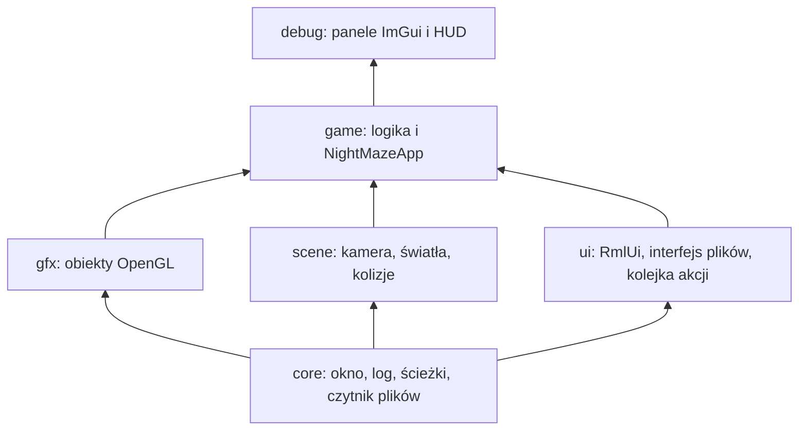

# Moduł ui: warstwa menu w RmlUi, interfejs plików i kolejka akcji

Kamień milowy: M9, część 2 (2026-10-06). Temat wykładu: brak własnego (to dodatek do gry, poza listą 15 tematów). Dokument korzysta z biblioteki opisanej w [`../../libraries/rmlui.md`](../../libraries/rmlui.md), z okna i ścieżek do assetów ([`../core/window-context.md`](../core/window-context.md), [`../core/paths.md`](../core/paths.md)), z pętli głównej ([`../core/main-loop.md`](../core/main-loop.md)) i z klawiatury i myszy ([`../core/input.md`](../core/input.md)). Co oznaczają ekrany i zdarzenia, opisuje [`../game/game-states.md`](../game/game-states.md); ten dokument opisuje tylko warstwę, która je pokazuje.
Kod: [`src/ui/UiLayer.hpp`](../../../src/ui/UiLayer.hpp) i [`UiLayer.cpp`](../../../src/ui/UiLayer.cpp), [`src/ui/AssetFileInterface.hpp`](../../../src/ui/AssetFileInterface.hpp) i [`AssetFileInterface.cpp`](../../../src/ui/AssetFileInterface.cpp), [`src/core/Files.hpp`](../../../src/core/Files.hpp) i [`Files.cpp`](../../../src/core/Files.cpp) (czytnik plików i nazwa czcionki, wspólne z paneli debug), dokumenty menu w [`assets/ui/`](../../../assets/ui/), użycie w [`src/game/NightMazeApp.cpp`](../../../src/game/NightMazeApp.cpp) i [`src/main.cpp`](../../../src/main.cpp), reguły w CMake: [`CMakeLists.txt`](../../../CMakeLists.txt) (biblioteka `ui`) i [`cmake/Dependencies.cmake`](../../../cmake/Dependencies.cmake). Testów warstwy `ui` **nie ma** (wymaga okna i OpenGL, jak reszta kodu z OpenGL, sekcja 5.10).

**Stan na dziś:** gra ma trzy dokumenty menu (menu główne, pauza, koniec rundy) wczytywane przez klasę `ui::UiLayer`. Warstwa pokazuje jeden dokument naraz, rysuje go na wierzchu gotowej klatki gry i minimapy, a przed Dear ImGui, oraz oddaje grze **listę nazw** kliknięć (`data-action`), z których gra robi zdarzenia. Warstwa nie wie nic o grze. Ekranu ustawień, animacji wejścia i tła w postaci wideo nie ma.

**Uczciwie o tym, co sprawdzono.** Trzy rodzaje dowodów trzymam osobno (tak jak w [`../../guides/build-windows.md`](../../guides/build-windows.md)):

1. **Zgłoszone przez bramkę (2026-10-06), nie powtórzone przy pisaniu tego dokumentu:** `make check` przechodzi, **519 przypadków testowych i 219195 asercji** na commicie `8c99911`. Przypadki policzyłem z plików testów (suma makr `TEST_CASE` w `tests/*.cpp` to 519), liczby asercji nie da się policzyć z plików. Żaden z tych przypadków nie dotyka klasy `ui::UiLayer`.
2. **Widziane na zrzucie ekranu przez agenta (2026-10-06), nie przez właściciela** (Windows, Release, 1280 x 720, RTX 4070 Ti SUPER): menu główne po starcie nad przelatującą kamerą, bez HUD i minimapy; kolor przycisku pod kursorem zmienia się na pomarańczowy; `Play` zaczyna rundę; Escape pokazuje pauzę; panele debug działają na wierzchu pauzy i żaden przycisk menu nie reaguje na ich kliknięcie; `Resume`, `Restart`, `Back to menu` i `Quit` (kod wyjścia 0) działają; ekran wyniku widziany **tylko** przez tymczasową, niezatwierdzoną linię, która po trzech sekundach wymuszała wygraną.
3. **Otwarte:** lista właściciela ([`../../guides/build-windows.md`](../../guides/build-windows.md), sekcja 26.2) i macOS ([`../../guides/build-macos.md`](../../guides/build-macos.md), podsekcja "M9, część 2 (menu w RmlUi) na macOS", w całości otwarta). Nie widziane przez nikogo: kursor (przechwycony albo wolny: nie da się go sfotografować), obrót myszą po `Play`, zmiana rozmiaru okna i minimalizacja, skalowanie ekranu inne niż 100 procent, Tab i Enter w menu, Debug zatwierdzonego kodu na ekranie, wszystko na macOS.

Liczby w sekcji 2.7 (przykład) są **policzone ręcznie z kodu**, nie zmierzone w programie.

## 1. Po co to jest

### 1.1 Do czego służy warstwa

Gra ma menu: ekrany z przyciskami. Dear ImGui, który rysuje panele debug, jest do tego niewygodny (immediate mode, wygląd narzędzia: [`../../libraries/imgui.md`](../../libraries/imgui.md)), więc menu jest w RmlUi. Ktoś musi jednak: uruchomić bibliotekę, dać jej pliki i czcionkę, przekazać jej zdarzenia z okna, narysować jej wynik w odpowiednim miejscu klatki i zameldować grze, że ktoś kliknął. To robi `ui::UiLayer`.

### 1.2 Decyzje właściciela, a wybory wykonawcze

Decyzje właściciela projektu (szczegóły w notatkach):

1. Menu gry powstanie w **RmlUi** ([`../../decisions/menu-in-rmlui.md`](../../decisions/menu-in-rmlui.md)).
2. Escape cofa o jeden ekran, a wyjście z programu to przycisk menu ([`../../decisions/escape-pauses-and-goes-back.md`](../../decisions/escape-pauses-and-goes-back.md)).
3. Zakres menu w M9 i angielskie teksty ([`../../decisions/menu-scope-for-m9.md`](../../decisions/menu-scope-for-m9.md)).

**Wszystko inne w tym dokumencie jest wyborem wykonawczym**, czyli autora kodu, a nie właściciela: że warstwa `ui` stoi obok `gfx` i `scene`, że grze oddaje się nazwy kliknięć, a nie wskaźniki do elementów, że warstwa pokazuje jeden dokument naraz, że menu ma pierwszeństwo przed grą, a panele przed menu, że `Open` czyta cały plik do pamięci, że kolejność klatki to scena, minimapa, menu, ImGui.

## 2. Teoria

### 2.1 Gdzie warstwa stoi i dlaczego

Do tej pory warstwy szły po kolei: `core < gfx < scene < game`, a `debug` na wierzchu ([`../../guides/project-structure.md`](../../guides/project-structure.md), "Reguła warstw"). Warstwa `ui` wchodzi **obok `gfx` i `scene`, poniżej `game`**:



Powody (wybory wykonawcze):

- `ui` potrzebuje tylko `core` (okno, log, ścieżki do assetów, czytnik plików) oraz GLFW, GLAD i RmlUi. **Nie dołącza żadnego nagłówka z `gfx`, `scene` ani `game`** (sprawdzone: `UiLayer.cpp` dołącza `core/Files.hpp`, `core/GlCheck.hpp`, `core/Log.hpp`, `ui/AssetFileInterface.hpp`, a `AssetFileInterface.cpp` dołącza `core/Files.hpp` i `core/Paths.hpp`).
- Nie wie nic o grze: gra mówi, który dokument pokazać, i odbiera listę nazw kliknięć. Co znaczy "play", rozstrzyga `game` ([`../game/game-states.md`](../game/game-states.md)).
- W CMake `ui` jest osobną biblioteką statyczną, **nie częścią `engine`**: `game_logic` i `night_maze_tests` linkują `engine`, więc gdyby RmlUi był w `engine`, program testowy linkowałby RmlUi i FreeType niepotrzebnie. Linkuje `ui` tylko `night_maze` (sekcja 5.1).
- Reguły gry (`GameState`) zostają w `game_logic` i **nie dołączają `ui`**: to czyste dane, które testuje się bez okna.

### 2.2 RmlUi jest retained, a trzy interfejsy łączą go ze światem

Krótko, szczegółowo w [`../../libraries/rmlui.md`](../../libraries/rmlui.md): RmlUi trzyma drzewo elementów wczytane z dokumentów, a pliki, system i rysowanie dostaje przez trzy interfejsy. `UiLayer` tworzy je wszystkie trzy i trzyma jako składowe, bo RmlUi zapamiętuje wskaźniki do nich i potrzebuje ich do końca swojego życia.

### 2.3 Akcja jako nazwa

Przycisk w dokumencie ma atrybut `data-action="play"`. Kliknięcie nie wywołuje w grze funkcji. Warstwa **zapisuje nazwę na liście**, a gra raz na klatkę zabiera całą listę i zamienia każdą nazwę na zdarzenie (`eventForAction`). Zalety (wybór wykonawczy):

- warstwa nie zna gry i gra nie zna RmlUi: łączy je łańcuch tekstów,
- nowy przycisk to zmiana dokumentu i jedna nazwa w `eventForAction`, bez zmian w `ui`,
- zdarzenia są obsługiwane w ustalonym miejscu klatki, a nie w środku obsługi zdarzeń okna (sekcja 2.6).

Szczegół: element, w który trafia kliknięcie, jest często nie samym przyciskiem, ale tekstem **wewnątrz** niego. Dlatego nasłuchiwacz idzie od klikniętego elementu w górę po rodzicach, aż znajdzie ten z atrybutem `data-action` (sekcja 5.4).

### 2.4 Piksele i dp

Rozmiar kontekstu RmlUi to rozmiar bufora ramki okna w pikselach, a współczynnik `dp` to to, ile pikseli ma jeden `dp` arkusza: 1 przy skalowaniu ekranu 100 procent, 1,5 przy 150 procentach na Windowsie, 2 na Retina. Przycisk z szerokością `220dp` ma więc **220 pikseli przy współczynniku 1, 330 przy 1,5 i 440 przy 2** (policzone z arkusza i z definicji, nie zmierzone na ekranie; zrzuty agenta były przy 100 procentach). Oba parametry gra podaje w każdej klatce (sekcja 5.6), więc działa to przy zmianie rozmiaru okna i przy przeniesieniu okna na inny ekran. Kursor dostaje RmlUi w pikselach bufora ramki: funkcja pomocnicza z backendu przelicza współrzędne okna na piksele (różnią się na Retina).

### 2.5 Kolejność w klatce i dlaczego taka

Menu jest rysowane **po scenie i po minimapie, a przed Dear ImGui**:

1. scena (cienie, niebo, bloom i przebieg składający),
2. minimapa (tylko `Playing` i `Paused`),
3. **dokument menu** (`m_ui.draw`),
4. panele debug i HUD (Dear ImGui, w `main.cpp`).

Skutki, wszystkie z kodu i komentarzy:

- Menu **przykrywa** grę i minimapę: pauza ma półprzezroczyste tło, więc scena i minimapa prześwitują przyciemnione.
- Panele debug są **na wierzchu** menu i zostają użyteczne w trakcie pauzy.
- **HUD (Dear ImGui) rysuje się po RmlUi**, więc leżałby na przyciskach. Dlatego HUD jest tylko w stanie `Playing` (`showsHud`), a minimapa, która jest rysowana przed menu, zostaje w pauzie jako część zatrzymanego obrazu.

### 2.6 Wejście: kto dostaje klawisz i mysz

Reguły (wybory wykonawcze, z komentarzy w `main.cpp` i `NightMazeApp.cpp`):

- **Zdarzenia z GLFW** trafiają najpierw do wywołań zwrotnych Dear ImGui, a stamtąd do wywołań `UiLayer`. RmlUi dostaje je tylko wtedy, gdy dokument jest pokazany (klawiatura) i dodatkowo, gdy mysz nie jest wyłączona (mysz).
- **Panele wygrywają z menu pod tym samym kursorem.** `main.cpp` przed klatką woła `setMouseEnabled(!m_debugUI.wantsMouse())`: gdy Dear ImGui chce myszy (kursor nad panelem), menu jej nie dostaje. Informacja pochodzi z poprzedniej klatki: to opóźnienie Dear ImGui, nie warstwy.
- **Menu nie blokuje `core::Input`.** Gra sama nie czyta klawiszy ani myszy rundy, gdy menu jest otwarte (`updatesRound`), i działa to w tej samej klatce, bez jednoklatkowego opóźnienia blokady. Wyjątek: **pole tekstowe** w menu. Gdy ma fokus, `wantsKeyboard()` jest prawdą, a `main.cpp` blokuje klawiaturę dla gry. Żaden dokument pola tekstowego dziś nie ma.
- **Escape** nie idzie przez RmlUi: pętla główna woła `onEscapePressed` ([`../core/main-loop.md`](../core/main-loop.md)).

### 2.7 Przykład policzony ręcznie: jedno kliknięcie `Play`

Gra stoi w menu głównym (`m_mode == MainMenu`, dokument `main_menu.rml` pokazany, kursor wolny). Gracz klika przycisk `Play`. Kolejne kroki w jednej klatce `N` (policzone z kodu):

| Krok | Gdzie | Co się dzieje |
|---|---|---|
| 1 | `Application::run`, `pollEvents` | GLFW wywołuje wywołanie zwrotne przycisku myszy. Dear ImGui przekazuje je do `UiLayer::onMouseButton` |
| 2 | `UiLayer::onMouseButton` | `takesMouse()` jest prawdą (dokument pokazany, mysz włączona), więc `RmlGLFW::ProcessMouseButtonCallback` przekazuje zdarzenie kontekstowi |
| 3 | RmlUi | zwolnienie przycisku daje zdarzenie `click` na elemencie pod kursorem (przycisk albo jego tekst) i RmlUi przekazuje je po drzewie w górę, aż do kontekstu |
| 4 | `ActionListener::ProcessEvent` | od klikniętego elementu idzie w górę po rodzicach, znajduje atrybut `data-action` przycisku i dopisuje `"play"` do `m_actions` |
| 5 | `Application::run` | `Input::update`, Escape nie naciśnięty, kroki stałe: `onUpdate` ze stanem `MainMenu` nie robi nic poza zegarem animacji (`updatesRound` fałsz) |
| 6 | `DebugNightMazeApp::onRender` | `menuUi().setMouseEnabled(!wantsMouse())`, potem `NightMazeApp::onRender` |
| 7 | `handleMenuActions` | `takeActions()` oddaje `["play"]` i zostawia pustą listę. `eventForAction("play", event)` daje `GameEvent::Play` |
| 8 | `handleGameEvent` | `startsRound(MainMenu, Play)` jest prawdą, `nextMode` daje `Playing`, a że zdarzenie to `Play`, wołane jest `startNewGame(m_newGame)` (labirynt od nowa z ziarna i nowa runda) |
| 9 | `showScreen` | `m_ui.show(NO_DOCUMENT)`: poprzedni dokument jest ukryty i `ProcessMouseLeave` zdejmuje podświetlenie, kursor zostaje przechwycony (`updatesRound(Playing)`) |
| 10 | reszta `onRender` | `roundInput` jest już prawdą, klatka jest rysowana z oczu gracza, `m_ui.draw` nic nie robi (żaden dokument nie jest pokazany) |

Wynik: ekran zmienia się **w tej samej klatce**, w której kliknięcie dotarło, bo kliknięcie było odczytane w kroku 1, a zdarzenie obsłużone na początku `onRender`. Bez kroku 9 przyciski głównego menu byłyby jeszcze narysowane w klatce, w której gra już trwa. Jeśli przycisk zostaje wciśnięty w jednej klatce, a zwolniony w następnej, krok 3 wypada w następnej klatce, a reszta tak samo.

## 3. Jak to działa w OpenGL

Klasa nie woła OpenGL bezpośrednio poza jednym `GL_CHECK`. Rysuje **renderer GL3 z backendów RmlUi**, a `UiLayer::draw` obejmuje go trzema wywołaniami:

1. `SetViewport(szerokość, wysokość)`: rozmiar bufora ramki okna,
2. `BeginFrame()`: renderer **zapisuje stan OpenGL**, który za chwilę zmieni (cull, blend, stencil, scissor, depth, viewport, aktywną teksturę, kolor czyszczenia, maski i funkcje mieszania), i wiąże własny framebuffer warstwowy,
3. `m_context->Render()`: dokument jest rysowany do tego framebuffera,
4. `EndFrame()`: wynik jest **kopiowany na okno** (framebuffer 0) z mieszaniem z alfą wstępnie przemnożoną, a stan OpenGL wraca do zapisanego.

Dzięki zapisaniu i przywróceniu stanu menu nie psuje niczego, co rysuje się po nim (ImGui ustawia swój stan od nowa, a następna klatka gry swój). Wywołanie `Clear` renderera **nie jest** używane: skasowałoby klatkę gry. `EndFrame` jest owinięte w `GL_CHECK`, więc w buildzie Debug błąd OpenGL pozostawiony przez klatkę RmlUi trafia do logu z tym miejscem jako adresem ([`../core/gl-check.md`](../core/gl-check.md)).

Gdy okno jest zminimalizowane, jego bufor ramki ma rozmiar 0 na 0 i `draw` wraca od razu, nic nie rysując (tak samo jak gra w swoich przebiegach). To sprawdzone czytaniem kodu, **nie na ekranie**.

## 4. Shadery

Brak własnych. Renderer GL3 RmlUi kompiluje **własne programy w swoim konstruktorze**, zaczynające się od `#version 330` (źródło backendu), co kontekst 4.1 Core przyjmuje. Nie przechodzą przez `gfx::Shader`, nie mają plików w `assets/shaders/` i **nie są przeładowywane przyciskiem `Reload shaders`**. Liczba programów shaderów gry (czternaście) się nie zmieniła. Jeśli renderer nie zdoła skompilować shaderów, jego operator konwersji do `bool` zwraca fałsz, a `UiLayer` zapisuje w logu błąd i gra działa bez menu (sekcja 5.3). Na macOS nie sprawdzono, czy te shadery kompilują się na sterowniku Apple ([`../../guides/build-macos.md`](../../guides/build-macos.md)).

## 5. Kod w projekcie

### 5.1 Pliki

| Plik | Co zawiera |
|---|---|
| `src/ui/UiLayer.hpp`, `.cpp` | `ui::UiLayer`: własność RmlUi (RAII), `loadDocument`, `show`, `shown`, `setText`, `takeActions`, `wantsKeyboard`, `setMouseEnabled`, `draw`, sześć wywołań zwrotnych GLFW. Nagłówek tylko deklaruje typy RmlUi, nie dołącza ich nagłówków ani nagłówka GLFW |
| `src/ui/AssetFileInterface.hpp`, `.cpp` | `ui::AssetFileInterface`: `Rml::FileInterface` czytający z katalogu `assets/` |
| `src/core/Files.hpp`, `.cpp` | `core::readBinaryFile` i stała `core::TEXT_FONT_FILE`. Przeniesione z `src/debug/Theme.cpp` (to samo ciało), żeby czcionka i czytnik były wspólne dla paneli i menu. Część biblioteki `engine` |
| `assets/ui/main_menu.rml`, `pause.rml`, `round_end.rml`, `menu.rcss` | trzy dokumenty i wspólny arkusz stylów ([`../../libraries/rmlui.md`](../../libraries/rmlui.md), sekcja 5) |
| `CMakeLists.txt` | biblioteka `ui` (cztery pliki), `target_link_libraries(ui PUBLIC engine)`, `target_link_libraries(ui PRIVATE rmlui_backend)`, a `night_maze` linkuje `engine game_logic ui imgui` |

Cele CMake po tej części: `glad`, `engine` (63 pliki na liście), `game_logic` (48), `ui` (4), `imgui`, `stb_image`, `rmlui_backend`, `rmlui_core`, `freetype`, `night_maze` (67), `night_maze_tests` (36). Liczby plików policzone z `CMakeLists.txt` na `8c99911`. `RmlUi` jest zależnością **prywatną** `ui`, bo `UiLayer.hpp` tylko wymienia nazwy jego klas (deklaracje zapowiadające): kod, który używa warstwy, nie potrzebuje ani nagłówków RmlUi, ani ścieżek dołączania.

### 5.2 `AssetFileInterface`: pliki z katalogu `assets/`

RmlUi nie otwiera plików sam: pyta o każdy dokument, arkusz i czcionkę przez pięć funkcji podobnych do `fopen`, `fclose`, `fread`, `fseek` i `ftell`. Ta klasa czyta ścieżkę **względem katalogu `assets/`** obok programu, więc `ui/main_menu.rml` działa z dowolnego katalogu roboczego i przy ścieżce instalacji z literami spoza ASCII na Windowsie. `Open` wczytuje cały plik do pamięci, a reszta funkcji pracuje na tych bajtach.

```cpp
Rml::FileHandle AssetFileInterface::Open(const Rml::String& path) {
    // RmlUi hands over UTF-8 text. A std::filesystem::path built from a plain
    // std::string would read it in the code page of Windows, so the text goes in as
    // a std::u8string, which is always taken as UTF-8.
    const std::filesystem::path relativePath(std::u8string(path.begin(), path.end()));

    OpenFile file;
    if (!core::readBinaryFile(core::assetPath(relativePath), file.bytes)) {
        // 0: RmlUi then logs which file it could not open.
        return 0;
    }

    const Rml::FileHandle handle = m_nextHandle;
    ++m_nextHandle;
    m_files.emplace(handle, std::move(file));
    return handle;
}
```

(Plik: `src/ui/AssetFileInterface.cpp`.) Uchwyt (`FileHandle`) to liczba, która nazywa otwarty plik w pozostałych funkcjach. Liczy się od 1, bo **0 znaczy "nie otwarto"**. Otwarte pliki leżą w `std::map<FileHandle, OpenFile>`, a `OpenFile` to bajty i pozycja. `Read` kopiuje najwyżej tyle bajtów, ile zostało między pozycją a końcem:

```cpp
    // Not more than what is left between the position and the end.
    const std::size_t count = std::min(size, open.bytes.size() - open.position);
```

(Plik: `src/ui/AssetFileInterface.cpp`, funkcja `Read`.) `Seek` liczy cel ze znakiem (`long long`), bo przesunięcie od bieżącej pozycji albo od końca może być ujemne, i odrzuca cel poza plikiem:

```cpp
    const long long target = base + offset;
    if (target < 0 || target > size) {
        return false;
    }
```

(Plik: `src/ui/AssetFileInterface.cpp`, funkcja `Seek`; pozycja równa rozmiarowi jest dozwolona, jak w `fseek`.) Czytnik `core::readBinaryFile(path, bytes)` zwraca fałsz, gdy plik się nie otwiera, i **niczego nie loguje**: wołający wie, do czego plik służy, i pisze komunikat ([`../core/paths.md`](../core/paths.md)). Wczytanie całego pliku jest wyborem wykonawczym: pliki menu są małe, a kod zostaje prosty (pozycja przesuwająca się po wektorze).

### 5.3 Konstruktor i destruktor `UiLayer`

Konstruktor wykonuje kroki w ustalonej kolejności i **przy pierwszym błędzie wraca**, zostawiając warstwę niepoprawną (`isValid()` fałsz). Wszystkie pozostałe funkcje nic wtedy nie robią, a gra działa bez menu.

```cpp
    m_fileInterface = std::make_unique<AssetFileInterface>();
    m_systemInterface = std::make_unique<LoggingSystemInterface>(m_window);
    m_renderInterface = std::make_unique<RenderInterface_GL3>();
    if (!static_cast<bool>(*m_renderInterface)) {
        core::logError("Menu: the OpenGL renderer of RmlUi could not be created");
        return;
    }
    Rml::SetFileInterface(m_fileInterface.get());
    Rml::SetSystemInterface(m_systemInterface.get());
    Rml::SetRenderInterface(m_renderInterface.get());
    if (!Rml::Initialise()) {
        core::logError("Menu: RmlUi could not be started");
        return;
    }
    m_started = true;
```

(Plik: `src/ui/UiLayer.cpp`, początek konstruktora.) Potem: ładowanie czcionki (`Rml::LoadFontFace(core::TEXT_FONT_FILE)`: ścieżka idzie przez interfejs plików, więc jest ścieżką w `assets/`), utworzenie kontekstu `menu` o rozmiarze bufora ramki, jeden nasłuchiwacz kliknięć na kontekście i sześć wywołań zwrotnych:

```cpp
    glfwSetWindowUserPointer(m_window, this);
    glfwSetKeyCallback(m_window, onKey);
    glfwSetCharCallback(m_window, onChar);
    glfwSetCursorEnterCallback(m_window, onCursorEnter);
    glfwSetCursorPosCallback(m_window, onCursorPos);
    glfwSetMouseButtonCallback(m_window, onMouseButton);
    glfwSetScrollCallback(m_window, onScroll);
```

(Plik: `src/ui/UiLayer.cpp`, koniec konstruktora.) GLFW jest biblioteką C i bierze **zwykłe wskaźniki do funkcji**, więc wywołania zwrotne są statyczne i znajdują obiekt przez wskaźnik użytkownika okna (`glfwGetWindowUserPointer`). Dear ImGui instaluje swoje wywołania później (`ImGui_ImplGlfw_InitForOpenGL(..., true)` w `DebugUI.cpp`) i wywołuje te poprzednie, więc obie biblioteki widzą każde zdarzenie. Dlatego warstwa musi powstać przed debug UI. `NightMazeApp` trzyma `m_ui` jako składową zainicjowaną w liście inicjalizacyjnej konstruktora (`m_ui(window())`), a debug UI powstaje dopiero w `main.cpp`, w klasie pochodnej, więc powstaje później niż `m_ui`, a niszczy się wcześniej.

Destruktor odwraca to:

```cpp
    if (glfwGetWindowUserPointer(m_window) == this) {
        glfwSetKeyCallback(m_window, nullptr);
        // ... pięć pozostałych wywołań zwrotnych ...
        glfwSetWindowUserPointer(m_window, nullptr);
    }
    if (m_started) {
        Rml::Shutdown();
    }
```

(Plik: `src/ui/UiLayer.cpp`, destruktor; środek skrócony.) Komentarz w kodzie: Dear ImGui jest już zniszczony i przywrócił poprzednie wywołania, więc ich usunięcie zostawia okno bez żadnych. `Rml::Shutdown` niszczy kontekst z dokumentami i zwalnia tekstury przez interfejs renderujący. Interfejsy i nasłuchiwacz są składowymi, więc niszczą się **po** ciele destruktora, jak wymaga RmlUi.

### 5.4 Nasłuchiwacz kliknięć i `takeActions`

```cpp
class ActionListener final : public Rml::EventListener {
public:
    explicit ActionListener(std::vector<std::string>& actions) : m_actions(actions) {}

    void ProcessEvent(Rml::Event& event) override {
        for (Rml::Element* element = event.GetTargetElement(); element != nullptr;
             element = element->GetParentNode()) {
            if (element->HasAttribute(ACTION_ATTRIBUTE)) {
                m_actions.push_back(element->GetAttribute<Rml::String>(ACTION_ATTRIBUTE, ""));
                return;
            }
        }
    }
```

(Plik: `src/ui/UiLayer.cpp`, klasa w anonimowej przestrzeni nazw, bez komentarzy.) Nasłuchiwacz jest dodany **raz, na kontekście**: zdarzenie, którego żaden element nie zatrzymał, wędruje w górę do kontekstu, więc jeden nasłuchiwacz obsługuje wszystkie dokumenty. Pętla `for` idzie od celu zdarzenia w górę po rodzicach (sekcja 2.3). `return` po pierwszym znalezionym atrybucie: najbliższy przodek z akcją wygrywa.

```cpp
std::vector<std::string> UiLayer::takeActions() {
    // std::exchange hands out the list and leaves an empty one in its place.
    return std::exchange(m_actions, {});
}
```

(Plik: `src/ui/UiLayer.cpp`.) `std::exchange` oddaje listę i zostawia na jej miejscu pustą: wywołanie jest **opróżniające**, więc każda nazwa zostaje obsłużona dokładnie raz. Kolejność nazw to kolejność kliknięć.

### 5.5 `loadDocument`, `show` i `setText`

`loadDocument(assetFile)` prosi kontekst o dokument (RmlUi czyta plik i arkusze przez interfejs plików), zapisuje wskaźnik na liście `m_documents` i zwraca **indeks** (`DocumentId`). Dokument jest ukryty. Zły plik daje `NO_DOCUMENT` (−1) i wpis w logu. Indeks zamiast wskaźnika to wybór wykonawczy: nagłówek nie musi znać typu RmlUi, a zły numer jest bezpieczny (`documentOf` zwraca `nullptr`).

`show(document)` pokazuje jeden dokument i **chowa poprzedni**:

```cpp
    if (Rml::ElementDocument* previous = documentOf(m_shown)) {
        previous->Hide();
        // The cursor is no longer over anything of that document: without this
        // a button would still be drawn hovered when the document comes back.
        m_context->ProcessMouseLeave();
    }
```

(Plik: `src/ui/UiLayer.cpp`, funkcja `show`.) Pokazanie dokumentu już pokazanego nic nie robi. `show(NO_DOCUMENT)` chowa wszystko. `setText(document, elementId, text)` szuka elementu po atrybucie `id` i podmienia jego zawartość przez `SetInnerRML`: tak ekran wyniku dostaje czas i liczbę kryształów (`NightMazeApp::fillRoundEndDocument`). Tekst jest brany jako RML, więc nie może zawierać `<` ani `&`.

### 5.6 `draw`

```cpp
void UiLayer::draw(core::Size framebuffer) {
    // A minimized window has a framebuffer of size 0 x 0: nothing to draw into.
    if (m_shown == NO_DOCUMENT || framebuffer.width == 0 || framebuffer.height == 0) {
        return;
    }

    m_context->SetDimensions(Rml::Vector2i(framebuffer.width, framebuffer.height));
    float scale = 1.0F;
    glfwGetWindowContentScale(m_window, &scale, nullptr);
    m_context->SetDensityIndependentPixelRatio(scale);

    // Update lays the document out and advances its animations and transitions.
    m_context->Update();

    m_renderInterface->SetViewport(framebuffer.width, framebuffer.height);
    m_renderInterface->BeginFrame();
    m_context->Render();
    GL_CHECK(m_renderInterface->EndFrame());
}
```

(Plik: `src/ui/UiLayer.cpp`, z pominiętymi komentarzami o skali i stanie.) Rozmiar i współczynnik dp są ustawiane **w każdej klatce**, jak własny viewport gry: obejmuje to zmianę rozmiaru okna i przeniesienie okna na inny ekran, a oba wywołania nic nie robią, gdy liczba jest ta, którą RmlUi już ma. `Update` liczy układ, animacje i przejścia (tu: `transition` przycisku). Bez pokazanego dokumentu funkcja nic nie robi, więc podczas rundy menu nic nie kosztuje poza jednym porównaniem.

### 5.7 Wywołania zwrotne i dwie bramki

```cpp
    bool takesKeyboard() const { return m_shown != NO_DOCUMENT; }
    bool takesMouse() const { return takesKeyboard() && m_mouseEnabled; }
```

(Plik: `src/ui/UiLayer.hpp`.) Każde z sześciu wywołań zwrotnych sprawdza jedną z dwóch bramek i dopiero wtedy woła funkcję pomocniczą `RmlGLFW::Process...Callback`. Klawiatura i znaki: tylko gdy dokument jest pokazany. Mysz (pozycja, przyciski, kółko, wejście kursora): także gdy `setMouseEnabled(true)`. `setMouseEnabled(false)` dodatkowo woła `ProcessMouseLeave`, żeby przycisk, nad którym był kursor, przestał wyglądać na podświetlony, gdy kursor przeszedł nad panel.

`wantsKeyboard()` zwraca prawdę, gdy pokazany dokument ma fokus na elemencie `input` albo `textarea`: tylko wtedy pisanie należy do menu i gra ma nie reagować na klawisze. Dziś żaden dokument nie ma pola tekstowego, więc zwraca zawsze fałsz.

### 5.8 Podłączenie w `main.cpp`

Dwie linie z `DebugNightMazeApp` (obie w [`src/main.cpp`](../../../src/main.cpp)):

```cpp
        menuUi().setMouseEnabled(!m_debugUI.wantsMouse());
```

na początku `onRender` (panele wygrywają z menu pod kursorem) i, na końcu klatki:

```cpp
        input().setKeyboardBlocked(m_debugUI.wantsKeyboard() || menuUi().wantsKeyboard());
```

Komentarz w kodzie: menu **niczego tu nie blokuje** poza polem tekstowym, bo gra sama nie czyta klawiszy rundy w menu (`updatesRound`), a to działa w tej samej klatce. Mysz blokuje tylko `m_debugUI.wantsMouse()`, jak przedtem. `menuUi()` to chroniony akcesor `NightMazeApp`, przez który `main.cpp` dostaje warstwę, żeby panele debug nie musiały wiedzieć o menu.

### 5.9 Użycie w `NightMazeApp`

Trzy miejsca (szczegóły i tabela przejść w [`../game/game-states.md`](../game/game-states.md)):

- **Konstruktor** wczytuje trzy dokumenty i sprawdza, że żaden nie zwrócił `NO_DOCUMENT`. Jeśli któryś zawiódł, gra zapisuje błąd w logu i startuje od razu w rundzie (`m_menusLoaded` fałsz).
- **`handleMenuActions`** na początku `onRender` zabiera listę nazw i zamienia je na zdarzenia.
- **`showScreen`** pokazuje dokument ekranu (albo żaden w rundzie) i ustawia kursor.
- Na końcu `onRender`: `m_ui.draw(framebuffer)` (sekcja 2.5).

### 5.10 Testy i jak to sprawdzono

**Testów klasy `UiLayer` i `AssetFileInterface` nie ma.** Klasy potrzebują okna i kontekstu OpenGL (`UiLayer` tworzy renderer, który kompiluje shadery), a program testowy działa bez okna i nie linkuje biblioteki `ui`. To ta sama granica, co dla `gfx::Mesh` i `AssetCache` ([`../../libraries/doctest.md`](../../libraries/doctest.md)). Testowane bez okna są **reguły gry**, które rządzą tym, co warstwa pokazuje: 21 przypadków w `tests/GameStateTests.cpp` (nazwy przycisków na zdarzenia, przejścia ekranów, co który ekran pozwala) i nowy przypadek w `tests/StartOptionsTests.cpp` dla `--play` ([`../game/game-states.md`](../game/game-states.md), sekcja 5.8). `AssetFileInterface` mógłby być testowany bez OpenGL (czyta tylko pliki i `std::map`), ale testu nie ma: to znana luka.

Trzy rodzaje dowodów są na początku dokumentu.

## 6. Panel ImGui

Warstwa nie ma własnego panelu. Z panelami debug łączą ją dwie rzeczy: **panele rysują się na wierzchu menu i mają pierwszeństwo myszy** (sekcja 2.6), a pole `DebugContext::hudVisible` mówi `DebugUI::draw`, czy rysować HUD (gra decyduje: `NightMazeApp::hudVisible()` to prawda tylko w rundzie i bez kamery menu). `DebugContext` ma od tej części **50 pól** (49 przedtem, doszło `hudVisible`). Przy otwartym menu klawisz tyldy nadal pokazuje i chowa panele i oddaje kursor, więc ustawienia można zmieniać także z poziomu pauzy. Kontrolek paneli, które by dotyczyły menu, nie ma.

## 7. Pułapki

1. **Warstwa musi powstać przed debug UI i zniknąć po nim.** Od tego zależy łańcuch wywołań zwrotnych GLFW. Kolejność deklaracji składowych w klasie pochodnej `main.cpp` i inicjalizacja `m_ui` w klasie bazowej to zapewniają, ale nie jest to sprawdzane testem.
2. **Jedno wywołanie zwrotne każdego rodzaju na okno.** Każdy nowy kod, który ustawi własne wywołanie klawisza, myszy albo kółka po `UiLayer`, odetnie menu, jeśli nie przekaże zdarzenia dalej.
3. **Brak pliku dokumentu nie wywraca gry.** Gra startuje w rundzie i nigdy nie wchodzi do menu głównego ani na ekran wyniku. Błąd jest tylko w logu.
4. **`setText` bierze RML.** Znaki `<` i `&` w tekście zostałyby zinterpretowane.
5. **Panele i menu pod jednym kursorem.** Informacja o tym, że panel jest pod kursorem, jest z poprzedniej klatki (opóźnienie Dear ImGui): w pierwszej klatce po wjechaniu na panel kliknięcie może jeszcze trafić w przycisk pod nim. Nie sprawdzone na ekranie.
6. **Pole tekstowe nie jest przećwiczone.** Kod rozpoznaje `input` i `textarea`, ale żaden dokument ich nie ma, więc ta ścieżka nie była wykonana.
7. **Skalowanie ekranu inne niż 100 procent.** Współczynnik jest czytany co klatkę, ale zrzuty agenta były przy 100 procentach: reszta jest z czytania kodu.
8. **Powrót do dokumentu po `Hide`.** `show` woła `ProcessMouseLeave` przy chowaniu. Bez tej linii przycisk zostawałby podświetlony po powrocie (komentarz w kodzie). Widziane przy zmianie ekranów na zrzutach tylko pośrednio.
9. **Rozmycie sceny za menu nie jest możliwe przez RmlUi** ([`../../libraries/rmlui.md`](../../libraries/rmlui.md), pułapka 2).

## 8. Ćwiczenia

1. **Nowy przycisk.** Dodaj do `pause.rml` przycisk `Settings` z `data-action="settings"`. Co się stanie po kliknięciu i które trzy miejsca trzeba zmienić, żeby coś robił? Odpowiedź: bez zmian w kodzie warstwy `ui` kliknięcie dopisze `"settings"` do listy, `handleMenuActions` zapisze w logu ostrzeżenie o nieznanej akcji (`eventForAction` zwróci fałsz). Do działania potrzeba: zdarzenia w `GameEvent`, wiersza w `eventForAction` i przejścia w `nextMode` (z testami).
2. **Dp na papierze.** Panel `#panel` ma `margin: 120dp auto 0 auto` i przyciski `220dp`. Ile pikseli od góry okna ma jego górna krawędź przy współczynniku 1,5? Odpowiedź: 180 pikseli (120 razy 1,5).
3. **Dwa kliknięcia w jednej klatce.** Co się stanie, jeśli w jednej klatce klikniesz `Play`, a potem coś innego? Odpowiedź: lista ma dwie nazwy w kolejności kliknięć, a `handleMenuActions` obsłuży je kolejno. Drugie zdarzenie dostaje ekran po pierwszym, więc zdarzenie niemające znaczenia na nowym ekranie zostanie zignorowane (`nextMode` zwraca ten sam ekran).
4. **Bez czcionki.** Zmień nazwę pliku w `core::TEXT_FONT_FILE` na nieistniejącą. Co zobaczysz w logu i co w grze? Odpowiedź: błąd "the font cannot be loaded" w logu, warstwa niepoprawna, brak menu, gra startuje w rundzie (przy okazji panele debug też nie dostaną czcionki).
5. **Kolejność w klatce.** Przestaw w myślach `m_ui.draw` za `DebugUI::draw`. Co się zmieni? Odpowiedź: menu pokryłoby panele i HUD, a panele nie byłyby użyteczne nad pauzą.
6. **Uchwyt 0.** Co zwraca `Open`, gdy pliku nie ma, i dlaczego uchwyty zaczynają się od 1? Odpowiedź: 0, bo 0 znaczy "nie otwarto" i nie może być uchwytem prawdziwego pliku.

## 9. Pytania kontrolne

1. **Dlaczego warstwa `ui` nie jest częścią `engine`?**
   Bo `game_logic` i program testowy linkują `engine` i nie powinny linkować RmlUi i FreeType.
2. **Dlaczego gra dostaje nazwy kliknięć, a nie wskaźniki na elementy?**
   Żeby warstwa nie znała gry i gra nie znała RmlUi, a zdarzenia były obsługiwane w ustalonym miejscu klatki.
3. **Dlaczego nasłuchiwacz idzie po rodzicach?**
   Bo klikniętym elementem bywa tekst wewnątrz przycisku, a atrybut `data-action` jest na przycisku.
4. **Dlaczego `Open` czyta cały plik do pamięci?**
   Pliki menu są małe, a kod jest prosty: pozycja przesuwa się po wektorze.
5. **Co zapisuje i przywraca `BeginFrame` i `EndFrame`?**
   Stan OpenGL, który renderer zmienia, i kopiują wynik na okno. Dzięki temu menu nie psuje niczego rysowanego po nim.
6. **Dlaczego HUD jest tylko w rundzie?**
   Bo Dear ImGui rysuje po RmlUi, więc HUD w pauzie leżałby na przyciskach.
7. **Kto wygrywa pod jednym kursorem, panel czy menu?**
   Panel: `main.cpp` wyłącza mysz menu, gdy Dear ImGui chce myszy.
8. **Co się dzieje, gdy nie da się wczytać dokumentów?**
   Błąd w logu, gra startuje w rundzie i nigdy nie wchodzi do ekranu menu.
9. **Dlaczego rozmiar i współczynnik dp są ustawiane w każdej klatce?**
   Żeby obsłużyć zmianę rozmiaru okna i przeniesienie na inny ekran bez osobnych wywołań zwrotnych.

## 10. Źródła

- Notatki: [`../../decisions/menu-in-rmlui.md`](../../decisions/menu-in-rmlui.md), [`../../decisions/escape-pauses-and-goes-back.md`](../../decisions/escape-pauses-and-goes-back.md), [`../../decisions/menu-scope-for-m9.md`](../../decisions/menu-scope-for-m9.md), [`../../decisions/video-through-os-decoders-with-still-fallback.md`](../../decisions/video-through-os-decoders-with-still-fallback.md).
- Dokumenty: [`../../libraries/rmlui.md`](../../libraries/rmlui.md), [`../game/game-states.md`](../game/game-states.md), [`../core/README.md`](../core/README.md), [`../core/main-loop.md`](../core/main-loop.md), [`../core/input.md`](../core/input.md), [`../core/paths.md`](../core/paths.md), [`../debug-ui.md`](../debug-ui.md).
- RmlUi: <https://mikke89.github.io/RmlUiDoc/> (interfejsy `FileInterface`, `SystemInterface`, `RenderInterface`, zdarzenia i nasłuchiwacze).
- GLFW, wskaźnik użytkownika okna i wywołania zwrotne: <https://www.glfw.org/docs/latest/input_guide.html>.
